Relevant source files

- [crates/gcode/src/db/mod.rs:16-20](crates/gcode/src/db/mod.rs#L16-L20), [crates/gcode/src/db/mod.rs:27-31](crates/gcode/src/db/mod.rs#L27-L31), [crates/gcode/src/db/mod.rs:33-35](crates/gcode/src/db/mod.rs#L33-L35)
- [crates/gcode/src/db/queries.rs:8-13](crates/gcode/src/db/queries.rs#L8-L13), [crates/gcode/src/db/queries.rs:15-26](crates/gcode/src/db/queries.rs#L15-L26), [crates/gcode/src/db/queries.rs:28-38](crates/gcode/src/db/queries.rs#L28-L38), [crates/gcode/src/db/queries.rs:40-55](crates/gcode/src/db/queries.rs#L40-L55), [crates/gcode/src/db/queries.rs:57-69](crates/gcode/src/db/queries.rs#L57-L69), [crates/gcode/src/db/queries.rs:71-83](crates/gcode/src/db/queries.rs#L71-L83), [crates/gcode/src/db/queries.rs:85-97](crates/gcode/src/db/queries.rs#L85-L97), [crates/gcode/src/db/queries.rs:99-109](crates/gcode/src/db/queries.rs#L99-L109), [crates/gcode/src/db/queries.rs:111-123](crates/gcode/src/db/queries.rs#L111-L123), [crates/gcode/src/db/queries.rs:125-135](crates/gcode/src/db/queries.rs#L125-L135), [crates/gcode/src/db/queries.rs:141-156](crates/gcode/src/db/queries.rs#L141-L156), [crates/gcode/src/db/queries.rs:158-168](crates/gcode/src/db/queries.rs#L158-L168), [crates/gcode/src/db/queries.rs:170-190](crates/gcode/src/db/queries.rs#L170-L190), [crates/gcode/src/db/queries.rs:192-205](crates/gcode/src/db/queries.rs#L192-L205), [crates/gcode/src/db/queries.rs:207-221](crates/gcode/src/db/queries.rs#L207-L221), [crates/gcode/src/db/queries.rs:223-236](crates/gcode/src/db/queries.rs#L223-L236), [crates/gcode/src/db/queries.rs:241-259](crates/gcode/src/db/queries.rs#L241-L259), [crates/gcode/src/db/queries.rs:261-274](crates/gcode/src/db/queries.rs#L261-L274), [crates/gcode/src/db/queries.rs:289-321](crates/gcode/src/db/queries.rs#L289-L321), [crates/gcode/src/db/queries.rs:323-357](crates/gcode/src/db/queries.rs#L323-L357), [crates/gcode/src/db/queries.rs:360-364](crates/gcode/src/db/queries.rs#L360-L364), [crates/gcode/src/db/queries.rs:366-413](crates/gcode/src/db/queries.rs#L366-L413), [crates/gcode/src/db/queries.rs:415-425](crates/gcode/src/db/queries.rs#L415-L425), [crates/gcode/src/db/queries.rs:427-432](crates/gcode/src/db/queries.rs#L427-L432), [crates/gcode/src/db/queries.rs:434-436](crates/gcode/src/db/queries.rs#L434-L436), [crates/gcode/src/db/queries.rs:438-449](crates/gcode/src/db/queries.rs#L438-L449), [crates/gcode/src/db/queries.rs:451-470](crates/gcode/src/db/queries.rs#L451-L470), [crates/gcode/src/db/queries.rs:472-481](crates/gcode/src/db/queries.rs#L472-L481), [crates/gcode/src/db/queries.rs:487-497](crates/gcode/src/db/queries.rs#L487-L497), [crates/gcode/src/db/queries.rs:500-507](crates/gcode/src/db/queries.rs#L500-L507), [crates/gcode/src/db/queries.rs:510-520](crates/gcode/src/db/queries.rs#L510-L520), [crates/gcode/src/db/queries.rs:523-530](crates/gcode/src/db/queries.rs#L523-L530), [crates/gcode/src/db/queries.rs:533-544](crates/gcode/src/db/queries.rs#L533-L544), [crates/gcode/src/db/queries.rs:547-554](crates/gcode/src/db/queries.rs#L547-L554), [crates/gcode/src/db/queries.rs:557-561](crates/gcode/src/db/queries.rs#L557-L561), [crates/gcode/src/db/queries.rs:565-567](crates/gcode/src/db/queries.rs#L565-L567)
- [crates/gcode/src/db/resolution.rs:16-18](crates/gcode/src/db/resolution.rs#L16-L18), [crates/gcode/src/db/resolution.rs:21-24](crates/gcode/src/db/resolution.rs#L21-L24), [crates/gcode/src/db/resolution.rs:27-29](crates/gcode/src/db/resolution.rs#L27-L29), [crates/gcode/src/db/resolution.rs:31-33](crates/gcode/src/db/resolution.rs#L31-L33), [crates/gcode/src/db/resolution.rs:39-48](crates/gcode/src/db/resolution.rs#L39-L48), [crates/gcode/src/db/resolution.rs:51-64](crates/gcode/src/db/resolution.rs#L51-L64), [crates/gcode/src/db/resolution.rs:67-81](crates/gcode/src/db/resolution.rs#L67-L81), [crates/gcode/src/db/resolution.rs:83-138](crates/gcode/src/db/resolution.rs#L83-L138), [crates/gcode/src/db/resolution.rs:140-156](crates/gcode/src/db/resolution.rs#L140-L156), [crates/gcode/src/db/resolution.rs:158-166](crates/gcode/src/db/resolution.rs#L158-L166), [crates/gcode/src/db/resolution.rs:168-175](crates/gcode/src/db/resolution.rs#L168-L175), [crates/gcode/src/db/resolution.rs:177-186](crates/gcode/src/db/resolution.rs#L177-L186), [crates/gcode/src/db/resolution.rs:188-211](crates/gcode/src/db/resolution.rs#L188-L211), [crates/gcode/src/db/resolution.rs:213-226](crates/gcode/src/db/resolution.rs#L213-L226), [crates/gcode/src/db/resolution.rs:228-235](crates/gcode/src/db/resolution.rs#L228-L235), [crates/gcode/src/db/resolution.rs:237-244](crates/gcode/src/db/resolution.rs#L237-L244), [crates/gcode/src/db/resolution.rs:246-255](crates/gcode/src/db/resolution.rs#L246-L255), [crates/gcode/src/db/resolution.rs:257-280](crates/gcode/src/db/resolution.rs#L257-L280), [crates/gcode/src/db/resolution.rs:282-284](crates/gcode/src/db/resolution.rs#L282-L284), [crates/gcode/src/db/resolution.rs:286-300](crates/gcode/src/db/resolution.rs#L286-L300), [crates/gcode/src/db/resolution.rs:302-323](crates/gcode/src/db/resolution.rs#L302-L323), [crates/gcode/src/db/resolution.rs:325-353](crates/gcode/src/db/resolution.rs#L325-L353), [crates/gcode/src/db/resolution.rs:362-367](crates/gcode/src/db/resolution.rs#L362-L367), [crates/gcode/src/db/resolution.rs:370-378](crates/gcode/src/db/resolution.rs#L370-L378), [crates/gcode/src/db/resolution.rs:381-388](crates/gcode/src/db/resolution.rs#L381-L388), [crates/gcode/src/db/resolution.rs:391-399](crates/gcode/src/db/resolution.rs#L391-L399), [crates/gcode/src/db/resolution.rs:402-417](crates/gcode/src/db/resolution.rs#L402-L417), [crates/gcode/src/db/resolution.rs:420-432](crates/gcode/src/db/resolution.rs#L420-L432), [crates/gcode/src/db/resolution.rs:435-452](crates/gcode/src/db/resolution.rs#L435-L452), [crates/gcode/src/db/resolution.rs:455-472](crates/gcode/src/db/resolution.rs#L455-L472), [crates/gcode/src/db/resolution.rs:475-500](crates/gcode/src/db/resolution.rs#L475-L500), [crates/gcode/src/db/resolution.rs:503-511](crates/gcode/src/db/resolution.rs#L503-L511), [crates/gcode/src/db/resolution.rs:514-521](crates/gcode/src/db/resolution.rs#L514-L521), [crates/gcode/src/db/resolution.rs:524-529](crates/gcode/src/db/resolution.rs#L524-L529), [crates/gcode/src/db/resolution.rs:532-537](crates/gcode/src/db/resolution.rs#L532-L537), [crates/gcode/src/db/resolution.rs:540-552](crates/gcode/src/db/resolution.rs#L540-L552), [crates/gcode/src/db/resolution.rs:555-572](crates/gcode/src/db/resolution.rs#L555-L572), [crates/gcode/src/db/resolution.rs:575-583](crates/gcode/src/db/resolution.rs#L575-L583), [crates/gcode/src/db/resolution.rs:586-597](crates/gcode/src/db/resolution.rs#L586-L597), [crates/gcode/src/db/resolution.rs:600-604](crates/gcode/src/db/resolution.rs#L600-L604), [crates/gcode/src/db/resolution.rs:607-613](crates/gcode/src/db/resolution.rs#L607-L613), [crates/gcode/src/db/resolution.rs:616-622](crates/gcode/src/db/resolution.rs#L616-L622), [crates/gcode/src/db/resolution.rs:625-633](crates/gcode/src/db/resolution.rs#L625-L633), [crates/gcode/src/db/resolution.rs:636-648](crates/gcode/src/db/resolution.rs#L636-L648), [crates/gcode/src/db/resolution.rs:651-665](crates/gcode/src/db/resolution.rs#L651-L665), [crates/gcode/src/db/resolution.rs:668-682](crates/gcode/src/db/resolution.rs#L668-L682), [crates/gcode/src/db/resolution.rs:685-696](crates/gcode/src/db/resolution.rs#L685-L696), [crates/gcode/src/db/resolution.rs:699-711](crates/gcode/src/db/resolution.rs#L699-L711), [crates/gcode/src/db/resolution.rs:714-722](crates/gcode/src/db/resolution.rs#L714-L722), [crates/gcode/src/db/resolution.rs:725-733](crates/gcode/src/db/resolution.rs#L725-L733), [crates/gcode/src/db/resolution.rs:736-744](crates/gcode/src/db/resolution.rs#L736-L744), [crates/gcode/src/db/resolution.rs:746-754](crates/gcode/src/db/resolution.rs#L746-L754), [crates/gcode/src/db/resolution.rs:756-761](crates/gcode/src/db/resolution.rs#L756-L761), [crates/gcode/src/db/resolution.rs:763-765](crates/gcode/src/db/resolution.rs#L763-L765), [crates/gcode/src/db/resolution.rs:767-794](crates/gcode/src/db/resolution.rs#L767-L794)

# crates/gcode/src/db

Parent: [[code/modules/crates/gcode/src|crates/gcode/src]]

## Overview

The `crates/gcode/src/db` module is responsible for managing PostgreSQL hub database connections, validating schema runtime integrity, retrieving configuration options, and executing queries on the code index [crates/gcode/src/db/mod.rs:16-20] [crates/gcode/src/db/queries.rs:8-13] [crates/gcode/src/db/resolution.rs:16-18]. It collaborates directly with `gobby_core::postgres` for connection setup and config lookup, and with `gobby_core::provisioning` for probing postgres hub identity and config parsing  [crates/gcode/src/db/resolution.rs:39-48]. Connection pathways are explicitly separated into read-write (`connect_readwrite`) and read-only (`connect_readonly`) entry points, ensuring a routing hook exists for future load-balancing or replica connection pooling, with each pathway running schema verification before returning the client .

Key flows in this module center around layered database URL resolution and code graph querying. When resolving the database DSN, `resolve_database_url` first queries a loopback daemon broker using a local CLI token, falling back sequentially to environment variables (`GCODE_DATABASE_URL` and `GOBBY_POSTGRES_DSN`), the recorded `bootstrap.yaml` configuration within Gobby's home folder, and the standalone `gcore` config . Once connected, the module provides helper functions to check indexing status for files and projects, list indexed files, retrieve unified graph file facts (combining imports, definitions, and call targets), and update sync states for index maintenance .

### Environment Variables

| Environment Variable | Description | Supporting Source |
| --- | --- | --- |
| GCODE_DATABASE_URL | Primary DSN override for the PostgreSQL hub database. | [crates/gcode/src/db/resolution.rs:16-18] |
| GOBBY_POSTGRES_DSN | Fallback database DSN environment variable. | [crates/gcode/src/db/resolution.rs:16-18] |
| GCODE_BROKER_TIMEOUT_MS | Configures the timeout in milliseconds when communicating with the loopback daemon broker. | [crates/gcode/src/db/resolution.rs:16-18] |

### Key Public API Symbols

| Symbol | Type | Description | Supporting Source |
| --- | --- | --- | --- |
| connect_readwrite | Function | Opens a database connection intended for write paths and validates the runtime schema. | [crates/gcode/src/db/mod.rs:16-20] |
| connect_readonly | Function | Opens a database connection intended for read-only paths and validates the runtime schema. | [crates/gcode/src/db/mod.rs:27-31] |
| read_config_value | Function | Thin wrapper around core Postgres configuration lookups to retrieve key-value pairs. | [crates/gcode/src/db/mod.rs:33-35] |
| resolve_database_url | Function | Resolves the hub database URL with fallback handling across environment variables, brokers, and bootstrap files. | [crates/gcode/src/db/resolution.rs:39-48] |
| gobby_home | Function | Returns the Gobby home path directory, respecting the GOBBY_HOME environment override. | [crates/gcode/src/db/resolution.rs:27-29] |
| bootstrap_path | Function | Computes the path to the bootstrap.yaml file within the Gobby home directory. | [crates/gcode/src/db/resolution.rs:31-33] |
| list_indexed_file_paths | Function | Lists all indexed file paths for a specific project sorted alphabetically. | [crates/gcode/src/db/queries.rs:15-26] |
| indexed_project_exists | Function | Checks if a given project ID is currently registered in the database index. | [crates/gcode/src/db/queries.rs:28-38] |
| indexed_file_exists | Function | Validates whether a specific file path within a project has been indexed. | [crates/gcode/src/db/queries.rs:40-55] |
| read_graph_file_facts | Function | Aggregates and returns import relations, symbol definitions, and calls for a given file. | [crates/gcode/src/db/queries.rs:40-55] |
| mark_graph_sync_attempted | Function | Sets synchronization flags and updates the timestamp when a file graph sync is attempted. | [crates/gcode/src/db/queries.rs:57-69] |
| mark_graph_synced | Function | Marks an indexed file's graph data as successfully synchronized. | [crates/gcode/src/db/queries.rs:57-69] |

## Dependency Diagram

`degraded: graph-truncated`

## Call Diagram

_Simplified diagram: showing top 20 of 66 available symbol call edge(s); source graph was truncated._

```mermaid
sequenceDiagram
    participant m_003ca858_885e_50ea_9283_6e4808dc4473 as http_response &#91;function&#93;
    participant m_05dc0ea7_ef9e_557a_bdbe_16f72a6914da as database_url_sources_use_gcore_after_daemon_and_bootstrap &#91;function&#93;
    participant m_0d8e4e28_deab_5aec_95e8_01a57ddaf503 as broker_request_allows_cold_daemon_latency &#91;function&#93;
    participant m_11114b11_3e11_59f1_b5b9_c42abd078123 as missing_postgres_dsn_fails_clearly &#91;function&#93;
    participant m_132008a8_f931_5acc_badf_e5d5d56063ff as missing_hub_backend_fails_clearly &#91;function&#93;
    participant m_14f5c3a0_921c_5ad1_87ac_2cfcec180161 as resolve_database_url_from_sources_with_identity &#91;function&#93;
    participant m_195bd3ff_a7ef_5a63_91b1_ab7762b1edf9 as resolve_database_url_from_sources_with_identity_and_reachability &#91;function&#93;
    participant m_1e9f51d8_920f_5189_a1eb_e676d4b4f0cc as database_url_env_falls_back_to_gobby_postgres_dsn &#91;function&#93;
    participant m_20fd61b6_3117_5b9a_93b0_14ff0ea8b39a as resolve_database_url_from_gcore_config &#91;function&#93;
    participant m_25cdbc95_780b_5f77_bf31_e6287089462c as broker_invalid_json_fails &#91;function&#93;
    participant m_26510a28_69d3_5381_a2f8_5af92b456d41 as broker_request_rejects_non_loopback_daemon_url_before_sending_local_token &#91;function&#93;
    participant m_2d5e07d4_698a_547c_9493_86b1404eb7f7 as bootstrap_path &#91;function&#93;
    participant m_2eb15708_e3e4_5511_80ba_28078ec3c819 as resolve_database_url_from_sources &#91;function&#93;
    participant m_4bd03715_17ec_5950_ae70_0671e91e616a as resolve_database_url_from_env &#91;function&#93;
    participant m_5bc0cad3_9212_5aba_a753_cbefe56a1abf as resolve_recorded_hub_database_url &#91;function&#93;
    participant m_60cd637f_925d_5638_95af_884e02f0d7a7 as request_broker_database_url &#91;function&#93;
    participant m_61681180_8d76_5562_94de_2dbce8c9144b as resolve_database_url_from_bootstrap_file &#91;function&#93;
    participant m_731e2901_3f38_57dc_bead_ea5470c45727 as non_empty_trimmed &#91;function&#93;
    participant m_7928ce0e_d6f7_5d2f_aa5b_055adb4f1117 as bootstrap &#91;function&#93;
    participant m_882e9b8a_ebab_5fab_97bf_5e32f701c6d8 as parse_bootstrap_database &#91;function&#93;
    participant m_8d052b0a_d623_5bc9_beda_f07d7d3f786a as spawn_http_response_after &#91;function&#93;
    participant m_abf8feb8_2b7f_59c8_a22b_3b7b171bead7 as gobby_home &#91;function&#93;
    participant m_f05288c3_69df_520e_be0c_d278c7d01b7a as resolve_database_url_from_bootstrap &#91;function&#93;
    participant m_f1d75b29_ef41_5e51_89d2_c8d5e1aa70fd as spawn_http_response &#91;function&#93;
    m_05dc0ea7_ef9e_557a_bdbe_16f72a6914da->>m_2eb15708_e3e4_5511_80ba_28078ec3c819: calls
    m_0d8e4e28_deab_5aec_95e8_01a57ddaf503->>m_003ca858_885e_50ea_9283_6e4808dc4473: calls
    m_0d8e4e28_deab_5aec_95e8_01a57ddaf503->>m_60cd637f_925d_5638_95af_884e02f0d7a7: calls
    m_0d8e4e28_deab_5aec_95e8_01a57ddaf503->>m_8d052b0a_d623_5bc9_beda_f07d7d3f786a: calls
    m_11114b11_3e11_59f1_b5b9_c42abd078123->>m_7928ce0e_d6f7_5d2f_aa5b_055adb4f1117: calls
    m_11114b11_3e11_59f1_b5b9_c42abd078123->>m_f05288c3_69df_520e_be0c_d278c7d01b7a: calls
    m_132008a8_f931_5acc_badf_e5d5d56063ff->>m_882e9b8a_ebab_5fab_97bf_5e32f701c6d8: calls
    m_14f5c3a0_921c_5ad1_87ac_2cfcec180161->>m_195bd3ff_a7ef_5a63_91b1_ab7762b1edf9: calls
    m_195bd3ff_a7ef_5a63_91b1_ab7762b1edf9->>m_20fd61b6_3117_5b9a_93b0_14ff0ea8b39a: calls
    m_195bd3ff_a7ef_5a63_91b1_ab7762b1edf9->>m_4bd03715_17ec_5950_ae70_0671e91e616a: calls
    m_195bd3ff_a7ef_5a63_91b1_ab7762b1edf9->>m_5bc0cad3_9212_5aba_a753_cbefe56a1abf: calls
    m_195bd3ff_a7ef_5a63_91b1_ab7762b1edf9->>m_61681180_8d76_5562_94de_2dbce8c9144b: calls
    m_1e9f51d8_920f_5189_a1eb_e676d4b4f0cc->>m_4bd03715_17ec_5950_ae70_0671e91e616a: calls
    m_20fd61b6_3117_5b9a_93b0_14ff0ea8b39a->>m_731e2901_3f38_57dc_bead_ea5470c45727: calls
    m_25cdbc95_780b_5f77_bf31_e6287089462c->>m_003ca858_885e_50ea_9283_6e4808dc4473: calls
    m_25cdbc95_780b_5f77_bf31_e6287089462c->>m_60cd637f_925d_5638_95af_884e02f0d7a7: calls
    m_25cdbc95_780b_5f77_bf31_e6287089462c->>m_f1d75b29_ef41_5e51_89d2_c8d5e1aa70fd: calls
    m_26510a28_69d3_5381_a2f8_5af92b456d41->>m_60cd637f_925d_5638_95af_884e02f0d7a7: calls
    m_2d5e07d4_698a_547c_9493_86b1404eb7f7->>m_abf8feb8_2b7f_59c8_a22b_3b7b171bead7: calls
    m_2eb15708_e3e4_5511_80ba_28078ec3c819->>m_195bd3ff_a7ef_5a63_91b1_ab7762b1edf9: calls
```

## Files

| File | Summary |
| --- | --- |
| [[code/files/crates/gcode/src/db/mod.rs\|crates/gcode/src/db/mod.rs]] | This module re-exports query and resolution database helpers, then provides two explicit connection entry points: `connect_readwrite` and `connect_readonly`. Both delegate to `gobby_core::postgres` for the actual connection, run `schema::validate_runtime_schema` before returning the `Client`, and keep separate read/write intent for future routing differences. It also exposes `read_config_value` as a thin wrapper around the core postgres config lookup. [crates/gcode/src/db/mod.rs:16-20] [crates/gcode/src/db/mod.rs:27-31] [crates/gcode/src/db/mod.rs:33-35] |
| [[code/files/crates/gcode/src/db/queries.rs\|crates/gcode/src/db/queries.rs]] | This file defines database query helpers for the code index. It checks whether projects and files are indexed, lists indexed file paths, reads a file’s graph facts by aggregating imports, symbol definitions, and calls, and updates sync state for graph and vector indexing; the later helpers resolve local and default-import call targets, build symbol-select SQL fragments, and enforce safe aliasing and candidate selection rules so the query logic stays consistent and unambiguous. [crates/gcode/src/db/queries.rs:8-13] [crates/gcode/src/db/queries.rs:15-26] [crates/gcode/src/db/queries.rs:28-38] [crates/gcode/src/db/queries.rs:40-55] [crates/gcode/src/db/queries.rs:57-69] |
| [[code/files/crates/gcode/src/db/resolution.rs\|crates/gcode/src/db/resolution.rs]] | Resolves the gcode PostgreSQL hub database URL from a layered set of sources, with validation and bootstrap support for daemoned and daemonless operation. It starts from `gobby_home`/`bootstrap_path`, then tries broker resolution, environment overrides, recorded bootstrap config, and gcore config in priority order, using helper functions to parse bootstrap data, filter empty values, and verify the resulting URL and database reachability. The broker path reads a local CLI token, sends it to a loopback daemon with a configurable timeout, and accepts only well-formed PostgreSQL URLs; the rest of the file is mostly test coverage for precedence, parsing, timeout handling, and failure cases. [crates/gcode/src/db/resolution.rs:16-18] [crates/gcode/src/db/resolution.rs:21-24] [crates/gcode/src/db/resolution.rs:27-29] [crates/gcode/src/db/resolution.rs:31-33] [crates/gcode/src/db/resolution.rs:39-48] |

## Components

| Component ID |
| --- |
| `8b63e348-5e46-53b5-9fc7-6a0c636e3b84` |
| `972f2a42-df59-5828-a61a-48ae143430ea` |
| `b8a73bdd-11bb-5d01-8187-08674eccc507` |
| `e246332f-4b56-54d8-9c30-d2eb0fd22317` |
| `8b652c63-6d76-54dd-8d45-21ace76f373e` |
| `7fd72311-3a27-5041-bbc1-b902a2e3befa` |
| `25b0349f-916e-5122-a4ff-e00a72b3e478` |
| `6524a97c-e990-53e6-a188-d713cbf6ae30` |
| `b7f0438b-913e-530e-b42b-c3282f6d89a8` |
| `f1deb79d-f478-5d9e-af41-e7a81efd5d5b` |
| `4bd59611-25f4-5318-ba4c-57af36eb8a78` |
| `7a15e279-5b5a-5f51-81f8-33e683f23c84` |
| `a215d167-f5c3-5d85-90b6-3ea69d369f88` |
| `7e1cb395-59ff-5822-b355-89eca4bd5804` |
| `9cb523e6-341e-5a59-ae9a-9bdc4fa503b3` |
| `0b9c0618-cf65-5bf0-9e0f-a2ea3e01e057` |
| `10d7b27b-d830-50e7-8dab-20cf950c1f40` |
| `ee16f0b6-e143-57c6-8af2-bb834b4c98b5` |
| `b0e67fef-4cc5-5c0f-9f56-1ddf88f5ba6a` |
| `873d65e7-3a6e-54fb-9a8c-cb9388fa3b3c` |
| `715e1d86-965c-5844-870f-d6e68eec8a7f` |
| `3d6bfe8c-f2f4-59db-b9ad-0e274d7a1e17` |
| `ab2e821a-bda9-5ea8-9c47-ba274364986c` |
| `0beb86ea-b5a8-5b9b-a4c0-f276726599e5` |
| `6c77cfcb-4eb1-5529-abd2-0959a3397b2c` |
| `cd99d411-2209-57e4-8732-d03e3cd48bbf` |
| `38399a73-da62-51be-9115-1e8c0a0f5654` |
| `1fa2a784-67af-56cd-9d5b-71fbaaf2508f` |
| `183e5248-f106-5785-91d8-171b587c486b` |
| `8ebe6b22-52ed-5b94-be53-76a46c385506` |
| `64564600-d01c-5c6b-92f0-4fe9a10f05ec` |
| `ca9b7027-0b71-527b-8171-007b4871ba81` |
| `ce3c2c86-f3d7-57e2-b709-524593d695f3` |
| `79d3fe53-7fdd-5e06-b54d-576da04e7f88` |
| `2cdde4e8-2c95-5c12-8d26-86b4cb7c0be3` |
| `4ccf2f23-5f4d-53df-b8d3-1a38f6224a10` |
| `bbe38c19-e95f-5948-9742-8d98592e7bb4` |
| `992b5ec6-fa1c-5de1-803b-ef5452ba431c` |
| `6faaa92a-fea3-5acf-bc45-29934f691242` |
| `e1a47bd4-8488-57c2-b9f3-fe11f328e9ee` |
| `a4a8ec5f-8b7e-56f7-b7b0-98451701ff1b` |
| `abf8feb8-2b7f-59c8-a22b-3b7b171bead7` |
| `2d5e07d4-698a-547c-9493-86b1404eb7f7` |
| `62e0931c-0f59-5d70-aee0-e3a67f5cd70b` |
| `2eb15708-e3e4-5511-80ba-28078ec3c819` |
| `14f5c3a0-921c-5ad1-87ac-2cfcec180161` |
| `195bd3ff-a7ef-5a63-91b1-ab7762b1edf9` |
| `5bc0cad3-9212-5aba-a753-cbefe56a1abf` |
| `61681180-8d76-5562-94de-2dbce8c9144b` |
| `20fd61b6-3117-5b9a-93b0-14ff0ea8b39a` |
| `4bd03715-17ec-5950-ae70-0671e91e616a` |
| `882e9b8a-ebab-5fab-97bf-5e32f701c6d8` |
| `f05288c3-69df-520e-be0c-d278c7d01b7a` |
| `731e2901-3f38-57dc-bead-ea5470c45727` |
| `b73be4b7-f3af-53af-ada1-32d201a0f27a` |
| `248d9efb-c1f7-5501-aec9-a1ea837a2d7a` |
| `60cd637f-925d-5638-95af-884e02f0d7a7` |
| `34b739a1-8fa3-54dd-addd-24326b488f9f` |
| `6635c09c-dd4b-5ac5-8026-f8ba7f8043c2` |
| `d3d7be68-0422-5599-a960-b776ca36e123` |
| `8170e4c7-35e6-5066-ba6d-4760164f2f5d` |
| `7928ce0e-d6f7-5d2f-aa5b-055adb4f1117` |
| `ceb3e7e0-7825-55aa-8212-9c9f66a8acbc` |
| `1e9f51d8-920f-5189-a1eb-e676d4b4f0cc` |
| `d1770dc2-5349-54c4-97d0-ae0cb69585a7` |
| `4c814114-0977-5503-82e1-8db30e783288` |
| `8f222e02-ecf8-5cb3-98de-9d70a122e8e9` |
| `693476f8-f3ce-5a0a-8ce0-f8dc4850f406` |
| `05dc0ea7-ef9e-557a-bdbe-16f72a6914da` |
| `bae371fd-bdce-5ca6-a0f3-ffddf4b8aa90` |
| `e5fd214d-eb81-542e-bd5a-73eb0e17267b` |
| `d372b49d-7b5b-5db2-94c7-a63dc6ba6eed` |
| `132008a8-f931-5acc-badf-e5d5d56063ff` |
| `11114b11-3e11-59f1-b5b9-c42abd078123` |
| `a8b6e9ea-2e1e-5ef1-9849-edad058c1246` |
| `edab86ee-085d-5f66-84f0-20d49facd6b4` |
| `26510a28-69d3-5381-a2f8-5af92b456d41` |
| `0d8e4e28-deab-5aec-95e8-01a57ddaf503` |
| `f98ef5c5-95d9-5e2e-b4f4-835edf4ddf71` |
| `6c1402bd-165b-55d2-ae65-aaad2d1e713d` |
| `ec03e1fa-d8fa-5dbd-91a9-0d72195a5d3f` |
| `b632aba3-0f0f-546e-9b2d-37b2c3b8f66d` |
| `f45f6c51-249a-54d8-b797-bef949997bdc` |
| `e52f4392-fd13-57b8-a8f5-bbbc74615199` |
| `45b2ab8a-3d84-5151-99ce-3ce3bd420638` |
| `25cdbc95-780b-5f77-bf31-e6287089462c` |
| `4fc29167-b0a8-53df-b8fc-44c629729d14` |
| `bfa5b0f2-1d34-5f63-a9fe-c1c5ebb469e3` |
| `66b42ab9-dfe6-5365-b098-6acb7cdbd1f4` |
| `f06db841-f4c0-57ef-9705-213dc8e0de68` |
| `cb84ebd0-8819-571a-9d40-0c4a16c14575` |
| `003ca858-885e-50ea-9283-6e4808dc4473` |
| `f1d75b29-ef41-5e51-89d2-c8d5e1aa70fd` |
| `8d052b0a-d623-5bc9-beda-f07d7d3f786a` |
