# crates/gcode/src/db

Parent: [[code/modules/crates/gcode/src|crates/gcode/src]]

## Overview

`crates/gcode/src/db` contains 3 direct files and 0 child modules.
[crates/gcode/src/db/mod.rs:16-20]
[crates/gcode/src/db/queries.rs:8-13]
[crates/gcode/src/db/resolution.rs:16-18]
[crates/gcode/src/db/mod.rs:27-31]
[crates/gcode/src/db/mod.rs:33-35]

## Dependency Diagram

`degraded: graph-truncated`

## Call Diagram

_Simplified diagram: showing top 20 of 66 available symbol call edge(s); source graph was truncated._

```mermaid
sequenceDiagram
    participant m_003ca858_885e_50ea_9283_6e4808dc4473 as http_response &#91;function&#93;
    participant m_05dc0ea7_ef9e_557a_bdbe_16f72a6914da as database_url_sources_use_gcore_after_daemon_and_bootstrap &#91;function&#93;
    participant m_0d8e4e28_deab_5aec_95e8_01a57ddaf503 as broker_request_allows_cold_daemon_latency &#91;function&#93;
    participant m_11114b11_3e11_59f1_b5b9_c42abd078123 as missing_postgres_dsn_fails_clearly &#91;function&#93;
    participant m_132008a8_f931_5acc_badf_e5d5d56063ff as missing_hub_backend_fails_clearly &#91;function&#93;
    participant m_14f5c3a0_921c_5ad1_87ac_2cfcec180161 as resolve_database_url_from_sources_with_identity &#91;function&#93;
    participant m_195bd3ff_a7ef_5a63_91b1_ab7762b1edf9 as resolve_database_url_from_sources_with_identity_and_reachability &#91;function&#93;
    participant m_1e9f51d8_920f_5189_a1eb_e676d4b4f0cc as database_url_env_falls_back_to_gobby_postgres_dsn &#91;function&#93;
    participant m_20fd61b6_3117_5b9a_93b0_14ff0ea8b39a as resolve_database_url_from_gcore_config &#91;function&#93;
    participant m_25cdbc95_780b_5f77_bf31_e6287089462c as broker_invalid_json_fails &#91;function&#93;
    participant m_26510a28_69d3_5381_a2f8_5af92b456d41 as broker_request_rejects_non_loopback_daemon_url_before_sending_local_token &#91;function&#93;
    participant m_2d5e07d4_698a_547c_9493_86b1404eb7f7 as bootstrap_path &#91;function&#93;
    participant m_2eb15708_e3e4_5511_80ba_28078ec3c819 as resolve_database_url_from_sources &#91;function&#93;
    participant m_4bd03715_17ec_5950_ae70_0671e91e616a as resolve_database_url_from_env &#91;function&#93;
    participant m_5bc0cad3_9212_5aba_a753_cbefe56a1abf as resolve_recorded_hub_database_url &#91;function&#93;
    participant m_60cd637f_925d_5638_95af_884e02f0d7a7 as request_broker_database_url &#91;function&#93;
    participant m_61681180_8d76_5562_94de_2dbce8c9144b as resolve_database_url_from_bootstrap_file &#91;function&#93;
    participant m_731e2901_3f38_57dc_bead_ea5470c45727 as non_empty_trimmed &#91;function&#93;
    participant m_7928ce0e_d6f7_5d2f_aa5b_055adb4f1117 as bootstrap &#91;function&#93;
    participant m_882e9b8a_ebab_5fab_97bf_5e32f701c6d8 as parse_bootstrap_database &#91;function&#93;
    participant m_8d052b0a_d623_5bc9_beda_f07d7d3f786a as spawn_http_response_after &#91;function&#93;
    participant m_abf8feb8_2b7f_59c8_a22b_3b7b171bead7 as gobby_home &#91;function&#93;
    participant m_f05288c3_69df_520e_be0c_d278c7d01b7a as resolve_database_url_from_bootstrap &#91;function&#93;
    participant m_f1d75b29_ef41_5e51_89d2_c8d5e1aa70fd as spawn_http_response &#91;function&#93;
    m_05dc0ea7_ef9e_557a_bdbe_16f72a6914da->>m_2eb15708_e3e4_5511_80ba_28078ec3c819: calls
    m_0d8e4e28_deab_5aec_95e8_01a57ddaf503->>m_003ca858_885e_50ea_9283_6e4808dc4473: calls
    m_0d8e4e28_deab_5aec_95e8_01a57ddaf503->>m_60cd637f_925d_5638_95af_884e02f0d7a7: calls
    m_0d8e4e28_deab_5aec_95e8_01a57ddaf503->>m_8d052b0a_d623_5bc9_beda_f07d7d3f786a: calls
    m_11114b11_3e11_59f1_b5b9_c42abd078123->>m_7928ce0e_d6f7_5d2f_aa5b_055adb4f1117: calls
    m_11114b11_3e11_59f1_b5b9_c42abd078123->>m_f05288c3_69df_520e_be0c_d278c7d01b7a: calls
    m_132008a8_f931_5acc_badf_e5d5d56063ff->>m_882e9b8a_ebab_5fab_97bf_5e32f701c6d8: calls
    m_14f5c3a0_921c_5ad1_87ac_2cfcec180161->>m_195bd3ff_a7ef_5a63_91b1_ab7762b1edf9: calls
    m_195bd3ff_a7ef_5a63_91b1_ab7762b1edf9->>m_20fd61b6_3117_5b9a_93b0_14ff0ea8b39a: calls
    m_195bd3ff_a7ef_5a63_91b1_ab7762b1edf9->>m_4bd03715_17ec_5950_ae70_0671e91e616a: calls
    m_195bd3ff_a7ef_5a63_91b1_ab7762b1edf9->>m_5bc0cad3_9212_5aba_a753_cbefe56a1abf: calls
    m_195bd3ff_a7ef_5a63_91b1_ab7762b1edf9->>m_61681180_8d76_5562_94de_2dbce8c9144b: calls
    m_1e9f51d8_920f_5189_a1eb_e676d4b4f0cc->>m_4bd03715_17ec_5950_ae70_0671e91e616a: calls
    m_20fd61b6_3117_5b9a_93b0_14ff0ea8b39a->>m_731e2901_3f38_57dc_bead_ea5470c45727: calls
    m_25cdbc95_780b_5f77_bf31_e6287089462c->>m_003ca858_885e_50ea_9283_6e4808dc4473: calls
    m_25cdbc95_780b_5f77_bf31_e6287089462c->>m_60cd637f_925d_5638_95af_884e02f0d7a7: calls
    m_25cdbc95_780b_5f77_bf31_e6287089462c->>m_f1d75b29_ef41_5e51_89d2_c8d5e1aa70fd: calls
    m_26510a28_69d3_5381_a2f8_5af92b456d41->>m_60cd637f_925d_5638_95af_884e02f0d7a7: calls
    m_2d5e07d4_698a_547c_9493_86b1404eb7f7->>m_abf8feb8_2b7f_59c8_a22b_3b7b171bead7: calls
    m_2eb15708_e3e4_5511_80ba_28078ec3c819->>m_195bd3ff_a7ef_5a63_91b1_ab7762b1edf9: calls
```

## Files

| File | Summary |
| --- | --- |
| [[code/files/crates/gcode/src/db/mod.rs\|crates/gcode/src/db/mod.rs]] | `crates/gcode/src/db/mod.rs` exposes 3 indexed API symbols. |
| [[code/files/crates/gcode/src/db/queries.rs\|crates/gcode/src/db/queries.rs]] | `crates/gcode/src/db/queries.rs` exposes 36 indexed API symbols. |
| [[code/files/crates/gcode/src/db/resolution.rs\|crates/gcode/src/db/resolution.rs]] | `crates/gcode/src/db/resolution.rs` exposes 55 indexed API symbols. |

