Relevant source files

- [crates/gcode/src/graph/code_graph.rs:1-51](crates/gcode/src/graph/code_graph.rs#L1-L51)
- [crates/gcode/src/graph/code_graph/connection.rs:7-12](crates/gcode/src/graph/code_graph/connection.rs#L7-L12), [crates/gcode/src/graph/code_graph/connection.rs:14-40](crates/gcode/src/graph/code_graph/connection.rs#L14-L40), [crates/gcode/src/graph/code_graph/connection.rs:42-68](crates/gcode/src/graph/code_graph/connection.rs#L42-L68)
- [crates/gcode/src/graph/code_graph/lifecycle.rs:18-21](crates/gcode/src/graph/code_graph/lifecycle.rs#L18-L21), [crates/gcode/src/graph/code_graph/lifecycle.rs:24-29](crates/gcode/src/graph/code_graph/lifecycle.rs#L24-L29), [crates/gcode/src/graph/code_graph/lifecycle.rs:31-36](crates/gcode/src/graph/code_graph/lifecycle.rs#L31-L36), [crates/gcode/src/graph/code_graph/lifecycle.rs:38-43](crates/gcode/src/graph/code_graph/lifecycle.rs#L38-L43), [crates/gcode/src/graph/code_graph/lifecycle.rs:47-52](crates/gcode/src/graph/code_graph/lifecycle.rs#L47-L52), [crates/gcode/src/graph/code_graph/lifecycle.rs:55-61](crates/gcode/src/graph/code_graph/lifecycle.rs#L55-L61), [crates/gcode/src/graph/code_graph/lifecycle.rs:65-68](crates/gcode/src/graph/code_graph/lifecycle.rs#L65-L68), [crates/gcode/src/graph/code_graph/lifecycle.rs:71-76](crates/gcode/src/graph/code_graph/lifecycle.rs#L71-L76), [crates/gcode/src/graph/code_graph/lifecycle.rs:80-88](crates/gcode/src/graph/code_graph/lifecycle.rs#L80-L88), [crates/gcode/src/graph/code_graph/lifecycle.rs:90-95](crates/gcode/src/graph/code_graph/lifecycle.rs#L90-L95), [crates/gcode/src/graph/code_graph/lifecycle.rs:98-105](crates/gcode/src/graph/code_graph/lifecycle.rs#L98-L105), [crates/gcode/src/graph/code_graph/lifecycle.rs:108-113](crates/gcode/src/graph/code_graph/lifecycle.rs#L108-L113), [crates/gcode/src/graph/code_graph/lifecycle.rs:116-122](crates/gcode/src/graph/code_graph/lifecycle.rs#L116-L122), [crates/gcode/src/graph/code_graph/lifecycle.rs:125-130](crates/gcode/src/graph/code_graph/lifecycle.rs#L125-L130), [crates/gcode/src/graph/code_graph/lifecycle.rs:133-149](crates/gcode/src/graph/code_graph/lifecycle.rs#L133-L149), [crates/gcode/src/graph/code_graph/lifecycle.rs:154-164](crates/gcode/src/graph/code_graph/lifecycle.rs#L154-L164), [crates/gcode/src/graph/code_graph/lifecycle.rs:166-176](crates/gcode/src/graph/code_graph/lifecycle.rs#L166-L176), [crates/gcode/src/graph/code_graph/lifecycle.rs:178-191](crates/gcode/src/graph/code_graph/lifecycle.rs#L178-L191), [crates/gcode/src/graph/code_graph/lifecycle.rs:193-211](crates/gcode/src/graph/code_graph/lifecycle.rs#L193-L211), [crates/gcode/src/graph/code_graph/lifecycle.rs:213-232](crates/gcode/src/graph/code_graph/lifecycle.rs#L213-L232), [crates/gcode/src/graph/code_graph/lifecycle.rs:234-248](crates/gcode/src/graph/code_graph/lifecycle.rs#L234-L248), [crates/gcode/src/graph/code_graph/lifecycle.rs:250-286](crates/gcode/src/graph/code_graph/lifecycle.rs#L250-L286)
- [crates/gcode/src/graph/code_graph/payload.rs:10-19](crates/gcode/src/graph/code_graph/payload.rs#L10-L19), [crates/gcode/src/graph/code_graph/payload.rs:22-30](crates/gcode/src/graph/code_graph/payload.rs#L22-L30), [crates/gcode/src/graph/code_graph/payload.rs:32-43](crates/gcode/src/graph/code_graph/payload.rs#L32-L43), [crates/gcode/src/graph/code_graph/payload.rs:45-47](crates/gcode/src/graph/code_graph/payload.rs#L45-L47), [crates/gcode/src/graph/code_graph/payload.rs:49-51](crates/gcode/src/graph/code_graph/payload.rs#L49-L51), [crates/gcode/src/graph/code_graph/payload.rs:53-75](crates/gcode/src/graph/code_graph/payload.rs#L53-L75), [crates/gcode/src/graph/code_graph/payload.rs:77-85](crates/gcode/src/graph/code_graph/payload.rs#L77-L85), [crates/gcode/src/graph/code_graph/payload.rs:89-91](crates/gcode/src/graph/code_graph/payload.rs#L89-L91), [crates/gcode/src/graph/code_graph/payload.rs:95-112](crates/gcode/src/graph/code_graph/payload.rs#L95-L112), [crates/gcode/src/graph/code_graph/payload.rs:115-117](crates/gcode/src/graph/code_graph/payload.rs#L115-L117), [crates/gcode/src/graph/code_graph/payload.rs:120-139](crates/gcode/src/graph/code_graph/payload.rs#L120-L139), [crates/gcode/src/graph/code_graph/payload.rs:142-159](crates/gcode/src/graph/code_graph/payload.rs#L142-L159), [crates/gcode/src/graph/code_graph/payload.rs:165-181](crates/gcode/src/graph/code_graph/payload.rs#L165-L181), [crates/gcode/src/graph/code_graph/payload.rs:183-203](crates/gcode/src/graph/code_graph/payload.rs#L183-L203), [crates/gcode/src/graph/code_graph/payload.rs:207-218](crates/gcode/src/graph/code_graph/payload.rs#L207-L218), [crates/gcode/src/graph/code_graph/payload.rs:221-234](crates/gcode/src/graph/code_graph/payload.rs#L221-L234), [crates/gcode/src/graph/code_graph/payload.rs:236-246](crates/gcode/src/graph/code_graph/payload.rs#L236-L246), [crates/gcode/src/graph/code_graph/payload.rs:250-266](crates/gcode/src/graph/code_graph/payload.rs#L250-L266), [crates/gcode/src/graph/code_graph/payload.rs:268-294](crates/gcode/src/graph/code_graph/payload.rs#L268-L294), [crates/gcode/src/graph/code_graph/payload.rs:296-301](crates/gcode/src/graph/code_graph/payload.rs#L296-L301), [crates/gcode/src/graph/code_graph/payload.rs:303-320](crates/gcode/src/graph/code_graph/payload.rs#L303-L320), [crates/gcode/src/graph/code_graph/payload.rs:322-326](crates/gcode/src/graph/code_graph/payload.rs#L322-L326), [crates/gcode/src/graph/code_graph/payload.rs:328-332](crates/gcode/src/graph/code_graph/payload.rs#L328-L332), [crates/gcode/src/graph/code_graph/payload.rs:334-343](crates/gcode/src/graph/code_graph/payload.rs#L334-L343)
- [crates/gcode/src/graph/code_graph/read.rs:1-25](crates/gcode/src/graph/code_graph/read.rs#L1-L25)
- [crates/gcode/src/graph/code_graph/read/graph_payloads.rs:19-98](crates/gcode/src/graph/code_graph/read/graph_payloads.rs#L19-L98), [crates/gcode/src/graph/code_graph/read/graph_payloads.rs:100-126](crates/gcode/src/graph/code_graph/read/graph_payloads.rs#L100-L126), [crates/gcode/src/graph/code_graph/read/graph_payloads.rs:128-164](crates/gcode/src/graph/code_graph/read/graph_payloads.rs#L128-L164), [crates/gcode/src/graph/code_graph/read/graph_payloads.rs:166-239](crates/gcode/src/graph/code_graph/read/graph_payloads.rs#L166-L239)
- [crates/gcode/src/graph/code_graph/read/payload_queries.rs:10-29](crates/gcode/src/graph/code_graph/read/payload_queries.rs#L10-L29), [crates/gcode/src/graph/code_graph/read/payload_queries.rs:31-47](crates/gcode/src/graph/code_graph/read/payload_queries.rs#L31-L47), [crates/gcode/src/graph/code_graph/read/payload_queries.rs:49-68](crates/gcode/src/graph/code_graph/read/payload_queries.rs#L49-L68), [crates/gcode/src/graph/code_graph/read/payload_queries.rs:70-90](crates/gcode/src/graph/code_graph/read/payload_queries.rs#L70-L90), [crates/gcode/src/graph/code_graph/read/payload_queries.rs:92-106](crates/gcode/src/graph/code_graph/read/payload_queries.rs#L92-L106), [crates/gcode/src/graph/code_graph/read/payload_queries.rs:108-130](crates/gcode/src/graph/code_graph/read/payload_queries.rs#L108-L130), [crates/gcode/src/graph/code_graph/read/payload_queries.rs:132-153](crates/gcode/src/graph/code_graph/read/payload_queries.rs#L132-L153), [crates/gcode/src/graph/code_graph/read/payload_queries.rs:155-169](crates/gcode/src/graph/code_graph/read/payload_queries.rs#L155-L169), [crates/gcode/src/graph/code_graph/read/payload_queries.rs:171-195](crates/gcode/src/graph/code_graph/read/payload_queries.rs#L171-L195), [crates/gcode/src/graph/code_graph/read/payload_queries.rs:197-219](crates/gcode/src/graph/code_graph/read/payload_queries.rs#L197-L219)
- [crates/gcode/src/graph/code_graph/read/relationship_queries.rs:9-21](crates/gcode/src/graph/code_graph/read/relationship_queries.rs#L9-L21), [crates/gcode/src/graph/code_graph/read/relationship_queries.rs:23-38](crates/gcode/src/graph/code_graph/read/relationship_queries.rs#L23-L38), [crates/gcode/src/graph/code_graph/read/relationship_queries.rs:40-62](crates/gcode/src/graph/code_graph/read/relationship_queries.rs#L40-L62), [crates/gcode/src/graph/code_graph/read/relationship_queries.rs:64-84](crates/gcode/src/graph/code_graph/read/relationship_queries.rs#L64-L84), [crates/gcode/src/graph/code_graph/read/relationship_queries.rs:86-102](crates/gcode/src/graph/code_graph/read/relationship_queries.rs#L86-L102), [crates/gcode/src/graph/code_graph/read/relationship_queries.rs:104-120](crates/gcode/src/graph/code_graph/read/relationship_queries.rs#L104-L120), [crates/gcode/src/graph/code_graph/read/relationship_queries.rs:122-143](crates/gcode/src/graph/code_graph/read/relationship_queries.rs#L122-L143), [crates/gcode/src/graph/code_graph/read/relationship_queries.rs:145-162](crates/gcode/src/graph/code_graph/read/relationship_queries.rs#L145-L162), [crates/gcode/src/graph/code_graph/read/relationship_queries.rs:164-185](crates/gcode/src/graph/code_graph/read/relationship_queries.rs#L164-L185), [crates/gcode/src/graph/code_graph/read/relationship_queries.rs:187-204](crates/gcode/src/graph/code_graph/read/relationship_queries.rs#L187-L204), [crates/gcode/src/graph/code_graph/read/relationship_queries.rs:206-220](crates/gcode/src/graph/code_graph/read/relationship_queries.rs#L206-L220), [crates/gcode/src/graph/code_graph/read/relationship_queries.rs:222-238](crates/gcode/src/graph/code_graph/read/relationship_queries.rs#L222-L238), [crates/gcode/src/graph/code_graph/read/relationship_queries.rs:240-250](crates/gcode/src/graph/code_graph/read/relationship_queries.rs#L240-L250), [crates/gcode/src/graph/code_graph/read/relationship_queries.rs:252-278](crates/gcode/src/graph/code_graph/read/relationship_queries.rs#L252-L278), [crates/gcode/src/graph/code_graph/read/relationship_queries.rs:280-297](crates/gcode/src/graph/code_graph/read/relationship_queries.rs#L280-L297), [crates/gcode/src/graph/code_graph/read/relationship_queries.rs:304-310](crates/gcode/src/graph/code_graph/read/relationship_queries.rs#L304-L310), [crates/gcode/src/graph/code_graph/read/relationship_queries.rs:313-318](crates/gcode/src/graph/code_graph/read/relationship_queries.rs#L313-L318), [crates/gcode/src/graph/code_graph/read/relationship_queries.rs:321-329](crates/gcode/src/graph/code_graph/read/relationship_queries.rs#L321-L329)
- [crates/gcode/src/graph/code_graph/read/relationships.rs:24-27](crates/gcode/src/graph/code_graph/read/relationships.rs#L24-L27), [crates/gcode/src/graph/code_graph/read/relationships.rs:29-35](crates/gcode/src/graph/code_graph/read/relationships.rs#L29-L35), [crates/gcode/src/graph/code_graph/read/relationships.rs:37-48](crates/gcode/src/graph/code_graph/read/relationships.rs#L37-L48), [crates/gcode/src/graph/code_graph/read/relationships.rs:50-60](crates/gcode/src/graph/code_graph/read/relationships.rs#L50-L60), [crates/gcode/src/graph/code_graph/read/relationships.rs:62-72](crates/gcode/src/graph/code_graph/read/relationships.rs#L62-L72), [crates/gcode/src/graph/code_graph/read/relationships.rs:74-85](crates/gcode/src/graph/code_graph/read/relationships.rs#L74-L85), [crates/gcode/src/graph/code_graph/read/relationships.rs:87-98](crates/gcode/src/graph/code_graph/read/relationships.rs#L87-L98), [crates/gcode/src/graph/code_graph/read/relationships.rs:100-113](crates/gcode/src/graph/code_graph/read/relationships.rs#L100-L113), [crates/gcode/src/graph/code_graph/read/relationships.rs:115-124](crates/gcode/src/graph/code_graph/read/relationships.rs#L115-L124), [crates/gcode/src/graph/code_graph/read/relationships.rs:126-139](crates/gcode/src/graph/code_graph/read/relationships.rs#L126-L139), [crates/gcode/src/graph/code_graph/read/relationships.rs:141-157](crates/gcode/src/graph/code_graph/read/relationships.rs#L141-L157), [crates/gcode/src/graph/code_graph/read/relationships.rs:159-172](crates/gcode/src/graph/code_graph/read/relationships.rs#L159-L172), [crates/gcode/src/graph/code_graph/read/relationships.rs:174-190](crates/gcode/src/graph/code_graph/read/relationships.rs#L174-L190), [crates/gcode/src/graph/code_graph/read/relationships.rs:192-198](crates/gcode/src/graph/code_graph/read/relationships.rs#L192-L198), [crates/gcode/src/graph/code_graph/read/relationships.rs:200-225](crates/gcode/src/graph/code_graph/read/relationships.rs#L200-L225), [crates/gcode/src/graph/code_graph/read/relationships.rs:227-245](crates/gcode/src/graph/code_graph/read/relationships.rs#L227-L245), [crates/gcode/src/graph/code_graph/read/relationships.rs:247-263](crates/gcode/src/graph/code_graph/read/relationships.rs#L247-L263), [crates/gcode/src/graph/code_graph/read/relationships.rs:265-302](crates/gcode/src/graph/code_graph/read/relationships.rs#L265-L302), [crates/gcode/src/graph/code_graph/read/relationships.rs:304-342](crates/gcode/src/graph/code_graph/read/relationships.rs#L304-L342), [crates/gcode/src/graph/code_graph/read/relationships.rs:344-355](crates/gcode/src/graph/code_graph/read/relationships.rs#L344-L355), [crates/gcode/src/graph/code_graph/read/relationships.rs:361-366](crates/gcode/src/graph/code_graph/read/relationships.rs#L361-L366), [crates/gcode/src/graph/code_graph/read/relationships.rs:369-375](crates/gcode/src/graph/code_graph/read/relationships.rs#L369-L375), [crates/gcode/src/graph/code_graph/read/relationships.rs:378-386](crates/gcode/src/graph/code_graph/read/relationships.rs#L378-L386), [crates/gcode/src/graph/code_graph/read/relationships.rs:389-397](crates/gcode/src/graph/code_graph/read/relationships.rs#L389-L397)
- [crates/gcode/src/graph/code_graph/read/support.rs:43-97](crates/gcode/src/graph/code_graph/read/support.rs#L43-L97), [crates/gcode/src/graph/code_graph/read/support.rs:99-131](crates/gcode/src/graph/code_graph/read/support.rs#L99-L131), [crates/gcode/src/graph/code_graph/read/support.rs:133-142](crates/gcode/src/graph/code_graph/read/support.rs#L133-L142), [crates/gcode/src/graph/code_graph/read/support.rs:150-162](crates/gcode/src/graph/code_graph/read/support.rs#L150-L162), [crates/gcode/src/graph/code_graph/read/support.rs:165-187](crates/gcode/src/graph/code_graph/read/support.rs#L165-L187)
- [crates/gcode/src/graph/code_graph/tests.rs:7-21](crates/gcode/src/graph/code_graph/tests.rs#L7-L21), [crates/gcode/src/graph/code_graph/tests.rs:24-33](crates/gcode/src/graph/code_graph/tests.rs#L24-L33), [crates/gcode/src/graph/code_graph/tests.rs:36-65](crates/gcode/src/graph/code_graph/tests.rs#L36-L65), [crates/gcode/src/graph/code_graph/tests.rs:68-156](crates/gcode/src/graph/code_graph/tests.rs#L68-L156), [crates/gcode/src/graph/code_graph/tests.rs:159-164](crates/gcode/src/graph/code_graph/tests.rs#L159-L164), [crates/gcode/src/graph/code_graph/tests.rs:167-194](crates/gcode/src/graph/code_graph/tests.rs#L167-L194), [crates/gcode/src/graph/code_graph/tests.rs:197-203](crates/gcode/src/graph/code_graph/tests.rs#L197-L203), [crates/gcode/src/graph/code_graph/tests.rs:206-223](crates/gcode/src/graph/code_graph/tests.rs#L206-L223), [crates/gcode/src/graph/code_graph/tests.rs:226-242](crates/gcode/src/graph/code_graph/tests.rs#L226-L242), [crates/gcode/src/graph/code_graph/tests.rs:245-250](crates/gcode/src/graph/code_graph/tests.rs#L245-L250), [crates/gcode/src/graph/code_graph/tests.rs:253-276](crates/gcode/src/graph/code_graph/tests.rs#L253-L276), [crates/gcode/src/graph/code_graph/tests.rs:279-320](crates/gcode/src/graph/code_graph/tests.rs#L279-L320), [crates/gcode/src/graph/code_graph/tests.rs:323-327](crates/gcode/src/graph/code_graph/tests.rs#L323-L327), [crates/gcode/src/graph/code_graph/tests.rs:330-344](crates/gcode/src/graph/code_graph/tests.rs#L330-L344), [crates/gcode/src/graph/code_graph/tests.rs:347-357](crates/gcode/src/graph/code_graph/tests.rs#L347-L357), [crates/gcode/src/graph/code_graph/tests.rs:360-399](crates/gcode/src/graph/code_graph/tests.rs#L360-L399), [crates/gcode/src/graph/code_graph/tests.rs:402-449](crates/gcode/src/graph/code_graph/tests.rs#L402-L449), [crates/gcode/src/graph/code_graph/tests.rs:452-499](crates/gcode/src/graph/code_graph/tests.rs#L452-L499), [crates/gcode/src/graph/code_graph/tests.rs:502-521](crates/gcode/src/graph/code_graph/tests.rs#L502-L521), [crates/gcode/src/graph/code_graph/tests.rs:524-534](crates/gcode/src/graph/code_graph/tests.rs#L524-L534), [crates/gcode/src/graph/code_graph/tests.rs:537-564](crates/gcode/src/graph/code_graph/tests.rs#L537-L564), [crates/gcode/src/graph/code_graph/tests.rs:567-579](crates/gcode/src/graph/code_graph/tests.rs#L567-L579)
- [crates/gcode/src/graph/code_graph/write.rs:47-50](crates/gcode/src/graph/code_graph/write.rs#L47-L50), [crates/gcode/src/graph/code_graph/write.rs:53-56](crates/gcode/src/graph/code_graph/write.rs#L53-L56), [crates/gcode/src/graph/code_graph/write.rs:59-61](crates/gcode/src/graph/code_graph/write.rs#L59-L61), [crates/gcode/src/graph/code_graph/write.rs:63-101](crates/gcode/src/graph/code_graph/write.rs#L63-L101), [crates/gcode/src/graph/code_graph/write.rs:103-108](crates/gcode/src/graph/code_graph/write.rs#L103-L108), [crates/gcode/src/graph/code_graph/write.rs:110-120](crates/gcode/src/graph/code_graph/write.rs#L110-L120), [crates/gcode/src/graph/code_graph/write.rs:122-138](crates/gcode/src/graph/code_graph/write.rs#L122-L138), [crates/gcode/src/graph/code_graph/write.rs:140-159](crates/gcode/src/graph/code_graph/write.rs#L140-L159), [crates/gcode/src/graph/code_graph/write.rs:161-192](crates/gcode/src/graph/code_graph/write.rs#L161-L192), [crates/gcode/src/graph/code_graph/write.rs:194-203](crates/gcode/src/graph/code_graph/write.rs#L194-L203), [crates/gcode/src/graph/code_graph/write.rs:205-214](crates/gcode/src/graph/code_graph/write.rs#L205-L214), [crates/gcode/src/graph/code_graph/write.rs:216-221](crates/gcode/src/graph/code_graph/write.rs#L216-L221), [crates/gcode/src/graph/code_graph/write.rs:223-227](crates/gcode/src/graph/code_graph/write.rs#L223-L227), [crates/gcode/src/graph/code_graph/write.rs:229-234](crates/gcode/src/graph/code_graph/write.rs#L229-L234), [crates/gcode/src/graph/code_graph/write.rs:236-258](crates/gcode/src/graph/code_graph/write.rs#L236-L258), [crates/gcode/src/graph/code_graph/write.rs:260-271](crates/gcode/src/graph/code_graph/write.rs#L260-L271), [crates/gcode/src/graph/code_graph/write.rs:273-282](crates/gcode/src/graph/code_graph/write.rs#L273-L282), [crates/gcode/src/graph/code_graph/write.rs:284-286](crates/gcode/src/graph/code_graph/write.rs#L284-L286), [crates/gcode/src/graph/code_graph/write.rs:289-294](crates/gcode/src/graph/code_graph/write.rs#L289-L294), [crates/gcode/src/graph/code_graph/write.rs:296-307](crates/gcode/src/graph/code_graph/write.rs#L296-L307), [crates/gcode/src/graph/code_graph/write.rs:309-318](crates/gcode/src/graph/code_graph/write.rs#L309-L318), [crates/gcode/src/graph/code_graph/write.rs:320-328](crates/gcode/src/graph/code_graph/write.rs#L320-L328), [crates/gcode/src/graph/code_graph/write.rs:330-334](crates/gcode/src/graph/code_graph/write.rs#L330-L334), [crates/gcode/src/graph/code_graph/write.rs:336-338](crates/gcode/src/graph/code_graph/write.rs#L336-L338), [crates/gcode/src/graph/code_graph/write.rs:340-345](crates/gcode/src/graph/code_graph/write.rs#L340-L345), [crates/gcode/src/graph/code_graph/write.rs:347-351](crates/gcode/src/graph/code_graph/write.rs#L347-L351), [crates/gcode/src/graph/code_graph/write.rs:353-376](crates/gcode/src/graph/code_graph/write.rs#L353-L376)
- [crates/gcode/src/graph/code_graph/write/deletion.rs:8-66](crates/gcode/src/graph/code_graph/write/deletion.rs#L8-L66), [crates/gcode/src/graph/code_graph/write/deletion.rs:68-113](crates/gcode/src/graph/code_graph/write/deletion.rs#L68-L113), [crates/gcode/src/graph/code_graph/write/deletion.rs:115-127](crates/gcode/src/graph/code_graph/write/deletion.rs#L115-L127), [crates/gcode/src/graph/code_graph/write/deletion.rs:129-145](crates/gcode/src/graph/code_graph/write/deletion.rs#L129-L145), [crates/gcode/src/graph/code_graph/write/deletion.rs:147-161](crates/gcode/src/graph/code_graph/write/deletion.rs#L147-L161), [crates/gcode/src/graph/code_graph/write/deletion.rs:163-171](crates/gcode/src/graph/code_graph/write/deletion.rs#L163-L171), [crates/gcode/src/graph/code_graph/write/deletion.rs:173-189](crates/gcode/src/graph/code_graph/write/deletion.rs#L173-L189), [crates/gcode/src/graph/code_graph/write/deletion.rs:191-200](crates/gcode/src/graph/code_graph/write/deletion.rs#L191-L200), [crates/gcode/src/graph/code_graph/write/deletion.rs:202-211](crates/gcode/src/graph/code_graph/write/deletion.rs#L202-L211)
- [crates/gcode/src/graph/code_graph/write/mutation.rs:89-96](crates/gcode/src/graph/code_graph/write/mutation.rs#L89-L96), [crates/gcode/src/graph/code_graph/write/mutation.rs:99-102](crates/gcode/src/graph/code_graph/write/mutation.rs#L99-L102), [crates/gcode/src/graph/code_graph/write/mutation.rs:105-112](crates/gcode/src/graph/code_graph/write/mutation.rs#L105-L112), [crates/gcode/src/graph/code_graph/write/mutation.rs:115-119](crates/gcode/src/graph/code_graph/write/mutation.rs#L115-L119), [crates/gcode/src/graph/code_graph/write/mutation.rs:121-128](crates/gcode/src/graph/code_graph/write/mutation.rs#L121-L128), [crates/gcode/src/graph/code_graph/write/mutation.rs:130-145](crates/gcode/src/graph/code_graph/write/mutation.rs#L130-L145), [crates/gcode/src/graph/code_graph/write/mutation.rs:147-152](crates/gcode/src/graph/code_graph/write/mutation.rs#L147-L152), [crates/gcode/src/graph/code_graph/write/mutation.rs:154-182](crates/gcode/src/graph/code_graph/write/mutation.rs#L154-L182), [crates/gcode/src/graph/code_graph/write/mutation.rs:184-197](crates/gcode/src/graph/code_graph/write/mutation.rs#L184-L197), [crates/gcode/src/graph/code_graph/write/mutation.rs:199-207](crates/gcode/src/graph/code_graph/write/mutation.rs#L199-L207), [crates/gcode/src/graph/code_graph/write/mutation.rs:209-227](crates/gcode/src/graph/code_graph/write/mutation.rs#L209-L227), [crates/gcode/src/graph/code_graph/write/mutation.rs:229-259](crates/gcode/src/graph/code_graph/write/mutation.rs#L229-L259), [crates/gcode/src/graph/code_graph/write/mutation.rs:261-295](crates/gcode/src/graph/code_graph/write/mutation.rs#L261-L295), [crates/gcode/src/graph/code_graph/write/mutation.rs:297-301](crates/gcode/src/graph/code_graph/write/mutation.rs#L297-L301), [crates/gcode/src/graph/code_graph/write/mutation.rs:304-321](crates/gcode/src/graph/code_graph/write/mutation.rs#L304-L321), [crates/gcode/src/graph/code_graph/write/mutation.rs:323-327](crates/gcode/src/graph/code_graph/write/mutation.rs#L323-L327), [crates/gcode/src/graph/code_graph/write/mutation.rs:329-334](crates/gcode/src/graph/code_graph/write/mutation.rs#L329-L334), [crates/gcode/src/graph/code_graph/write/mutation.rs:337-343](crates/gcode/src/graph/code_graph/write/mutation.rs#L337-L343), [crates/gcode/src/graph/code_graph/write/mutation.rs:345-364](crates/gcode/src/graph/code_graph/write/mutation.rs#L345-L364), [crates/gcode/src/graph/code_graph/write/mutation.rs:366-377](crates/gcode/src/graph/code_graph/write/mutation.rs#L366-L377), [crates/gcode/src/graph/code_graph/write/mutation.rs:379-390](crates/gcode/src/graph/code_graph/write/mutation.rs#L379-L390), [crates/gcode/src/graph/code_graph/write/mutation.rs:392-403](crates/gcode/src/graph/code_graph/write/mutation.rs#L392-L403), [crates/gcode/src/graph/code_graph/write/mutation.rs:411-435](crates/gcode/src/graph/code_graph/write/mutation.rs#L411-L435), [crates/gcode/src/graph/code_graph/write/mutation.rs:438-450](crates/gcode/src/graph/code_graph/write/mutation.rs#L438-L450)
- [crates/gcode/src/graph/code_graph/write/support.rs:6-13](crates/gcode/src/graph/code_graph/write/support.rs#L6-L13), [crates/gcode/src/graph/code_graph/write/support.rs:15-21](crates/gcode/src/graph/code_graph/write/support.rs#L15-L21), [crates/gcode/src/graph/code_graph/write/support.rs:23-27](crates/gcode/src/graph/code_graph/write/support.rs#L23-L27), [crates/gcode/src/graph/code_graph/write/support.rs:29-31](crates/gcode/src/graph/code_graph/write/support.rs#L29-L31)
- [crates/gcode/src/graph/code_graph/write/sync_plan.rs:30-81](crates/gcode/src/graph/code_graph/write/sync_plan.rs#L30-L81), [crates/gcode/src/graph/code_graph/write/sync_plan.rs:89-110](crates/gcode/src/graph/code_graph/write/sync_plan.rs#L89-L110), [crates/gcode/src/graph/code_graph/write/sync_plan.rs:113-156](crates/gcode/src/graph/code_graph/write/sync_plan.rs#L113-L156), [crates/gcode/src/graph/code_graph/write/sync_plan.rs:159-177](crates/gcode/src/graph/code_graph/write/sync_plan.rs#L159-L177)
- [crates/gcode/src/graph/mod.rs:1-4](crates/gcode/src/graph/mod.rs#L1-L4)
- [crates/gcode/src/graph/report.rs:1-21](crates/gcode/src/graph/report.rs#L1-L21)
- [crates/gcode/src/graph/report/generation.rs:21-23](crates/gcode/src/graph/report/generation.rs#L21-L23), [crates/gcode/src/graph/report/generation.rs:25-59](crates/gcode/src/graph/report/generation.rs#L25-L59), [crates/gcode/src/graph/report/generation.rs:61-63](crates/gcode/src/graph/report/generation.rs#L61-L63), [crates/gcode/src/graph/report/generation.rs:65-76](crates/gcode/src/graph/report/generation.rs#L65-L76), [crates/gcode/src/graph/report/generation.rs:78-159](crates/gcode/src/graph/report/generation.rs#L78-L159)
- [crates/gcode/src/graph/report/loading.rs:18-78](crates/gcode/src/graph/report/loading.rs#L18-L78), [crates/gcode/src/graph/report/loading.rs:80-95](crates/gcode/src/graph/report/loading.rs#L80-L95), [crates/gcode/src/graph/report/loading.rs:97-111](crates/gcode/src/graph/report/loading.rs#L97-L111), [crates/gcode/src/graph/report/loading.rs:113-128](crates/gcode/src/graph/report/loading.rs#L113-L128), [crates/gcode/src/graph/report/loading.rs:130-146](crates/gcode/src/graph/report/loading.rs#L130-L146)
- [crates/gcode/src/graph/report/queries.rs:7-18](crates/gcode/src/graph/report/queries.rs#L7-L18), [crates/gcode/src/graph/report/queries.rs:20-22](crates/gcode/src/graph/report/queries.rs#L20-L22), [crates/gcode/src/graph/report/queries.rs:24-26](crates/gcode/src/graph/report/queries.rs#L24-L26), [crates/gcode/src/graph/report/queries.rs:28-38](crates/gcode/src/graph/report/queries.rs#L28-L38), [crates/gcode/src/graph/report/queries.rs:40-49](crates/gcode/src/graph/report/queries.rs#L40-L49), [crates/gcode/src/graph/report/queries.rs:51-85](crates/gcode/src/graph/report/queries.rs#L51-L85), [crates/gcode/src/graph/report/queries.rs:87-104](crates/gcode/src/graph/report/queries.rs#L87-L104), [crates/gcode/src/graph/report/queries.rs:106-126](crates/gcode/src/graph/report/queries.rs#L106-L126), [crates/gcode/src/graph/report/queries.rs:128-144](crates/gcode/src/graph/report/queries.rs#L128-L144)
- [crates/gcode/src/graph/report/render.rs:8-18](crates/gcode/src/graph/report/render.rs#L8-L18), [crates/gcode/src/graph/report/render.rs:20-99](crates/gcode/src/graph/report/render.rs#L20-L99), [crates/gcode/src/graph/report/render.rs:101-121](crates/gcode/src/graph/report/render.rs#L101-L121), [crates/gcode/src/graph/report/render.rs:123-141](crates/gcode/src/graph/report/render.rs#L123-L141), [crates/gcode/src/graph/report/render.rs:143-150](crates/gcode/src/graph/report/render.rs#L143-L150), [crates/gcode/src/graph/report/render.rs:152-164](crates/gcode/src/graph/report/render.rs#L152-L164), [crates/gcode/src/graph/report/render.rs:166-177](crates/gcode/src/graph/report/render.rs#L166-L177), [crates/gcode/src/graph/report/render.rs:179-185](crates/gcode/src/graph/report/render.rs#L179-L185)
- [crates/gcode/src/graph/report/rows.rs:11-19](crates/gcode/src/graph/report/rows.rs#L11-L19), [crates/gcode/src/graph/report/rows.rs:21-31](crates/gcode/src/graph/report/rows.rs#L21-L31), [crates/gcode/src/graph/report/rows.rs:33-39](crates/gcode/src/graph/report/rows.rs#L33-L39), [crates/gcode/src/graph/report/rows.rs:41-66](crates/gcode/src/graph/report/rows.rs#L41-L66), [crates/gcode/src/graph/report/rows.rs:68-78](crates/gcode/src/graph/report/rows.rs#L68-L78), [crates/gcode/src/graph/report/rows.rs:80-106](crates/gcode/src/graph/report/rows.rs#L80-L106), [crates/gcode/src/graph/report/rows.rs:108-112](crates/gcode/src/graph/report/rows.rs#L108-L112), [crates/gcode/src/graph/report/rows.rs:119-128](crates/gcode/src/graph/report/rows.rs#L119-L128), [crates/gcode/src/graph/report/rows.rs:131-140](crates/gcode/src/graph/report/rows.rs#L131-L140), [crates/gcode/src/graph/report/rows.rs:143-154](crates/gcode/src/graph/report/rows.rs#L143-L154), [crates/gcode/src/graph/report/rows.rs:157-162](crates/gcode/src/graph/report/rows.rs#L157-L162)
- [crates/gcode/src/graph/report/summary.rs:14-17](crates/gcode/src/graph/report/summary.rs#L14-L17), [crates/gcode/src/graph/report/summary.rs:19-41](crates/gcode/src/graph/report/summary.rs#L19-L41), [crates/gcode/src/graph/report/summary.rs:43-49](crates/gcode/src/graph/report/summary.rs#L43-L49), [crates/gcode/src/graph/report/summary.rs:51-91](crates/gcode/src/graph/report/summary.rs#L51-L91), [crates/gcode/src/graph/report/summary.rs:93-100](crates/gcode/src/graph/report/summary.rs#L93-L100), [crates/gcode/src/graph/report/summary.rs:102-156](crates/gcode/src/graph/report/summary.rs#L102-L156), [crates/gcode/src/graph/report/summary.rs:158-195](crates/gcode/src/graph/report/summary.rs#L158-L195), [crates/gcode/src/graph/report/summary.rs:197-231](crates/gcode/src/graph/report/summary.rs#L197-L231), [crates/gcode/src/graph/report/summary.rs:233-237](crates/gcode/src/graph/report/summary.rs#L233-L237), [crates/gcode/src/graph/report/summary.rs:239-248](crates/gcode/src/graph/report/summary.rs#L239-L248), [crates/gcode/src/graph/report/summary.rs:250-290](crates/gcode/src/graph/report/summary.rs#L250-L290), [crates/gcode/src/graph/report/summary.rs:294-308](crates/gcode/src/graph/report/summary.rs#L294-L308), [crates/gcode/src/graph/report/summary.rs:310-339](crates/gcode/src/graph/report/summary.rs#L310-L339), [crates/gcode/src/graph/report/summary.rs:341-349](crates/gcode/src/graph/report/summary.rs#L341-L349), [crates/gcode/src/graph/report/summary.rs:351-356](crates/gcode/src/graph/report/summary.rs#L351-L356)
- [crates/gcode/src/graph/report/tests.rs:15-65](crates/gcode/src/graph/report/tests.rs#L15-L65), [crates/gcode/src/graph/report/tests.rs:68-84](crates/gcode/src/graph/report/tests.rs#L68-L84), [crates/gcode/src/graph/report/tests.rs:87-127](crates/gcode/src/graph/report/tests.rs#L87-L127), [crates/gcode/src/graph/report/tests.rs:129-179](crates/gcode/src/graph/report/tests.rs#L129-L179), [crates/gcode/src/graph/report/tests.rs:181-196](crates/gcode/src/graph/report/tests.rs#L181-L196), [crates/gcode/src/graph/report/tests.rs:199-225](crates/gcode/src/graph/report/tests.rs#L199-L225), [crates/gcode/src/graph/report/tests.rs:228-249](crates/gcode/src/graph/report/tests.rs#L228-L249), [crates/gcode/src/graph/report/tests.rs:252-277](crates/gcode/src/graph/report/tests.rs#L252-L277), [crates/gcode/src/graph/report/tests.rs:280-317](crates/gcode/src/graph/report/tests.rs#L280-L317), [crates/gcode/src/graph/report/tests.rs:320-342](crates/gcode/src/graph/report/tests.rs#L320-L342), [crates/gcode/src/graph/report/tests.rs:345-390](crates/gcode/src/graph/report/tests.rs#L345-L390)
- [crates/gcode/src/graph/report/time.rs:3-5](crates/gcode/src/graph/report/time.rs#L3-L5)
- [crates/gcode/src/graph/report/types.rs:10-17](crates/gcode/src/graph/report/types.rs#L10-L17), [crates/gcode/src/graph/report/types.rs:20-34](crates/gcode/src/graph/report/types.rs#L20-L34), [crates/gcode/src/graph/report/types.rs:36-49](crates/gcode/src/graph/report/types.rs#L36-L49), [crates/gcode/src/graph/report/types.rs:53-68](crates/gcode/src/graph/report/types.rs#L53-L68), [crates/gcode/src/graph/report/types.rs:71-73](crates/gcode/src/graph/report/types.rs#L71-L73), [crates/gcode/src/graph/report/types.rs:76-80](crates/gcode/src/graph/report/types.rs#L76-L80), [crates/gcode/src/graph/report/types.rs:84-88](crates/gcode/src/graph/report/types.rs#L84-L88), [crates/gcode/src/graph/report/types.rs:92-97](crates/gcode/src/graph/report/types.rs#L92-L97), [crates/gcode/src/graph/report/types.rs:100-105](crates/gcode/src/graph/report/types.rs#L100-L105), [crates/gcode/src/graph/report/types.rs:108-118](crates/gcode/src/graph/report/types.rs#L108-L118), [crates/gcode/src/graph/report/types.rs:121-125](crates/gcode/src/graph/report/types.rs#L121-L125), [crates/gcode/src/graph/report/types.rs:128-136](crates/gcode/src/graph/report/types.rs#L128-L136), [crates/gcode/src/graph/report/types.rs:139-142](crates/gcode/src/graph/report/types.rs#L139-L142), [crates/gcode/src/graph/report/types.rs:145-148](crates/gcode/src/graph/report/types.rs#L145-L148), [crates/gcode/src/graph/report/types.rs:151-155](crates/gcode/src/graph/report/types.rs#L151-L155), [crates/gcode/src/graph/report/types.rs:158-162](crates/gcode/src/graph/report/types.rs#L158-L162), [crates/gcode/src/graph/report/types.rs:165-178](crates/gcode/src/graph/report/types.rs#L165-L178), [crates/gcode/src/graph/report/types.rs:184-192](crates/gcode/src/graph/report/types.rs#L184-L192), [crates/gcode/src/graph/report/types.rs:195-200](crates/gcode/src/graph/report/types.rs#L195-L200), [crates/gcode/src/graph/report/types.rs:204-215](crates/gcode/src/graph/report/types.rs#L204-L215), [crates/gcode/src/graph/report/types.rs:218-221](crates/gcode/src/graph/report/types.rs#L218-L221), [crates/gcode/src/graph/report/types.rs:225-229](crates/gcode/src/graph/report/types.rs#L225-L229), [crates/gcode/src/graph/report/types.rs:233-243](crates/gcode/src/graph/report/types.rs#L233-L243), [crates/gcode/src/graph/report/types.rs:247-251](crates/gcode/src/graph/report/types.rs#L247-L251), [crates/gcode/src/graph/report/types.rs:254-256](crates/gcode/src/graph/report/types.rs#L254-L256), [crates/gcode/src/graph/report/types.rs:259-261](crates/gcode/src/graph/report/types.rs#L259-L261), [crates/gcode/src/graph/report/types.rs:265-267](crates/gcode/src/graph/report/types.rs#L265-L267)
- [crates/gcode/src/graph/typed_query.rs:7-10](crates/gcode/src/graph/typed_query.rs#L7-L10), [crates/gcode/src/graph/typed_query.rs:13-21](crates/gcode/src/graph/typed_query.rs#L13-L21), [crates/gcode/src/graph/typed_query.rs:24-27](crates/gcode/src/graph/typed_query.rs#L24-L27), [crates/gcode/src/graph/typed_query.rs:30-38](crates/gcode/src/graph/typed_query.rs#L30-L38), [crates/gcode/src/graph/typed_query.rs:41-46](crates/gcode/src/graph/typed_query.rs#L41-L46), [crates/gcode/src/graph/typed_query.rs:48-58](crates/gcode/src/graph/typed_query.rs#L48-L58), [crates/gcode/src/graph/typed_query.rs:60-70](crates/gcode/src/graph/typed_query.rs#L60-L70), [crates/gcode/src/graph/typed_query.rs:73-75](crates/gcode/src/graph/typed_query.rs#L73-L75), [crates/gcode/src/graph/typed_query.rs:77-98](crates/gcode/src/graph/typed_query.rs#L77-L98), [crates/gcode/src/graph/typed_query.rs:100-105](crates/gcode/src/graph/typed_query.rs#L100-L105), [crates/gcode/src/graph/typed_query.rs:107-109](crates/gcode/src/graph/typed_query.rs#L107-L109), [crates/gcode/src/graph/typed_query.rs:111-113](crates/gcode/src/graph/typed_query.rs#L111-L113), [crates/gcode/src/graph/typed_query.rs:115-120](crates/gcode/src/graph/typed_query.rs#L115-L120), [crates/gcode/src/graph/typed_query.rs:122-141](crates/gcode/src/graph/typed_query.rs#L122-L141), [crates/gcode/src/graph/typed_query.rs:143-145](crates/gcode/src/graph/typed_query.rs#L143-L145), [crates/gcode/src/graph/typed_query.rs:147-164](crates/gcode/src/graph/typed_query.rs#L147-L164), [crates/gcode/src/graph/typed_query.rs:166-178](crates/gcode/src/graph/typed_query.rs#L166-L178), [crates/gcode/src/graph/typed_query.rs:181-186](crates/gcode/src/graph/typed_query.rs#L181-L186), [crates/gcode/src/graph/typed_query.rs:190-200](crates/gcode/src/graph/typed_query.rs#L190-L200), [crates/gcode/src/graph/typed_query.rs:211-276](crates/gcode/src/graph/typed_query.rs#L211-L276), [crates/gcode/src/graph/typed_query.rs:279-284](crates/gcode/src/graph/typed_query.rs#L279-L284), [crates/gcode/src/graph/typed_query.rs:287-297](crates/gcode/src/graph/typed_query.rs#L287-L297), [crates/gcode/src/graph/typed_query.rs:300-315](crates/gcode/src/graph/typed_query.rs#L300-L315), [crates/gcode/src/graph/typed_query.rs:318-341](crates/gcode/src/graph/typed_query.rs#L318-L341), [crates/gcode/src/graph/typed_query.rs:344-350](crates/gcode/src/graph/typed_query.rs#L344-L350)

# crates/gcode/src/graph

Parent: [[code/modules/crates/gcode/src|crates/gcode/src]]

## Overview

The `graph` module in `gcode` defines the system's code graph layer, wrapping code-graph operations, reporting capabilities, and a type-safe Cypher query builder [crates/gcode/src/graph/mod.rs:1-4]. Responsibilities include managing a project's dependency and symbol projection backed by FalkorDB [crates/gcode/src/graph/code_graph/connection.rs:7-12]. Key flows begin with PostgreSQL index rows being mapped and serialized into Code* nodes (such as files, modules, and symbols) and edges within FalkorDB [crates/gcode/src/graph/code_graph/connection.rs:7-12]. In parallel, the report engine executes custom Cypher queries to load database snapshots and compile project reports detailing hotspots, bridge edges, and target frequencies [crates/gcode/src/graph/report/loading.rs:18-78, crates/gcode/src/graph/report/queries.rs:7-18]. The system relies on a parameterized Cypher builder, `TypedQuery`, to validate and securely escape names and parameter types, preventing invalid identifiers or non-finite floats [crates/gcode/src/graph/typed_query.rs:7-10, crates/gcode/src/graph/typed_query.rs:13-21].

Collaborative integration happens primarily across three boundaries: FalkorDB client connectors execute low-level database reads and writes [crates/gcode/src/graph/code_graph/connection.rs:7-12], the Gobby daemon processes HTTP APIs to orchestrate graph lifecycle actions , and PostgreSQL provides the source indexed database rows [crates/gcode/src/graph/code_graph/connection.rs:7-12]. Users configure graph analysis with standard options including a customizable reporting centrality threshold, default limits, and timeout parameters configured directly or loaded from environment variables [crates/gcode/src/graph/report.rs:1-21, GraphLifecycleTimeouts::from_env].

### Key Public API Symbols

| Symbol | Type | Responsibility / Description | Citation |
| --- | --- | --- | --- |
| `CodeGraph` | Struct | Handles graph synchronization, indexing, and projection operations. | [crates/gcode/src/graph/code_graph.rs:1-51] |
| `TypedQuery` | Struct | Composes Cypher queries and serializes rendering-safe parameter maps. | [crates/gcode/src/graph/typed_query.rs:7-10] |
| `TypedValue` | Enum | Models valid Cypher literal-translatable parameter values. | [crates/gcode/src/graph/typed_query.rs:13-21] |
| `GraphNode` / `GraphLink` / `GraphPayload` | Structs | Models the code graph's node structure, relationships, and loaded data. | [crates/gcode/src/graph/code_graph.rs:1-51] |
| `generate_report` / `generate_report_with_options` | Functions | Orchestrates snapshot database query execution and compiles a final report. | [crates/gcode/src/graph/report.rs:1-21] |
| `ProjectGraphReport` / `ProjectGraphReportOptions` | Structs | Captures compiled graph analysis metrics and controls report parameters. | [crates/gcode/src/graph/report.rs:1-21] |
| `run_lifecycle_action` | Function | Coordinates graph setup, sync, and cleanup workflows with Gobby. | [crates/gcode/src/graph/code_graph.rs:1-51] |
| `blast_radius` / `shortest_symbol_path` | Functions | Executes graph reads to discover blast radii and trace symbol path steps. | [crates/gcode/src/graph/code_graph.rs:1-51] |

### Enumerable Facts & Constants

| Fact / Constant | Value / Type | Purpose | Citation |
| --- | --- | --- | --- |
| `RELATES_TO_CODE` | `const &str` | Shared relation label identifying active graph edges. | [crates/gcode/src/graph/report.rs:1-21] |
| `DEFAULT_TOP_LIMIT` | `const usize = 10` | Default record threshold constraint for generated hotspots and reports. | [crates/gcode/src/graph/report.rs:1-21] |
| `MAX_SYMBOL_PATH_DEPTH` | `const` | Absolute upper limit on depth traversal during path tracking queries. | [crates/gcode/src/graph/code_graph.rs:1-51] |
| `GraphLifecycleTimeouts::from_env` | Method | Configures execution timeouts by querying system environment variables. | [GraphLifecycleTimeouts::from_env] |

## Dependency Diagram

`degraded: graph-truncated`

## Call Diagram

_Simplified diagram: showing top 20 of 166 available symbol call edge(s); source graph was truncated._

```mermaid
sequenceDiagram
    participant m_013ba3fc_1ab0_5c4d_b432_2bb0c60d53f4 as find_callers_batch &#91;function&#93;
    participant m_01643f1a_bc6d_5aa0_b1c7_e24709829aa6 as TypedQuery::insert_param &#91;method&#93;
    participant m_01a3ccf5_d2d1_5ce6_92bc_687095e11869 as project_overview_imports_query &#91;function&#93;
    participant m_02901a5e_07a1_54af_bc05_c28bda77249b as resolve_external_call_target &#91;function&#93;
    participant m_0327d13c_4dc4_551d_83b9_9657723a709e as dedupe_limited_blast_rows &#91;function&#93;
    participant m_033311ce_5853_5eb3_85f7_86b1ec16fe6c as TypedQuery::new &#91;method&#93;
    participant m_09dc987b_7ca1_54df_9bd2_0665c05e64d7 as find_usages_query &#91;function&#93;
    participant m_09dd73ce_4ab9_5002_95a7_5dde362c9bfb as string_literals_escape_control_characters &#91;function&#93;
    participant m_0e09dfc9_bf94_5bef_ba43_a8bcbe253ab7 as find_callers &#91;function&#93;
    participant m_1217d1cb_e173_540c_be3d_1b8fa3699c23 as row_to_target_frequency &#91;function&#93;
    participant m_18e47e6e_97a7_57d8_a61d_916d57d82b9b as GraphLink::from_row &#91;method&#93;
    participant m_1a3800d6_02e5_53dc_98a8_3c77cdad2607 as select_external_call_target_resolves_single_candidate &#91;function&#93;
    participant m_1af288d8_23f1_5892_a97d_1b8bc93831c6 as find_callers_batch_query &#91;function&#93;
    participant m_2e82aca5_7fdb_588e_a360_b3a64ee080aa as row_to_projection_metadata &#91;function&#93;
    participant m_5e974821_feb1_5476_b7c4_c9c004b36c15 as select_external_call_target &#91;function&#93;
    participant m_5f45b090_aa30_584f_a6d1_47f0e0b97a39 as row_string &#91;function&#93;
    participant m_653f5cff_90ae_52e9_9bfb_ba0d78c31172 as validate_identifier &#91;function&#93;
    participant m_6b4d0e55_9ec2_5842_9ff3_fe81a05ec714 as row_usize &#91;function&#93;
    participant m_74c91864_ce73_5e7a_bf1c_749773eb62dd as render_cypher_value &#91;function&#93;
    participant m_9e86f53f_3315_5bf2_93f5_88dcd64937fc as resolve_external_call_target_query &#91;function&#93;
    participant m_b12da834_1ad0_513b_8140_d1e831914a66 as clamp_limit &#91;function&#93;
    participant m_be3f6ee0_e032_5698_b7e6_9c2883cbdbc9 as external_call_target_display_name &#91;function&#93;
    participant m_be54a66a_cfe8_5d4f_b27f_96535fbf8d83 as clamp_offset &#91;function&#93;
    participant m_d03ede71_eb00_53e9_8caa_c07800478e9c as find_callers_query &#91;function&#93;
    participant m_d89d3ab9_ad0a_58d2_9645_87a1b3e2929a as row_usize &#91;function&#93;
    participant m_e62c0138_29fb_5919_86bf_453bb4f023d4 as row_string_owned &#91;function&#93;
    participant m_f2fe7253_6bad_5c3e_b67d_a44f9a09d0a7 as GraphLink::new &#91;method&#93;
    m_013ba3fc_1ab0_5c4d_b432_2bb0c60d53f4->>m_1af288d8_23f1_5892_a97d_1b8bc93831c6: calls
    m_01643f1a_bc6d_5aa0_b1c7_e24709829aa6->>m_653f5cff_90ae_52e9_9bfb_ba0d78c31172: calls
    m_01643f1a_bc6d_5aa0_b1c7_e24709829aa6->>m_74c91864_ce73_5e7a_bf1c_749773eb62dd: calls
    m_01a3ccf5_d2d1_5ce6_92bc_687095e11869->>m_b12da834_1ad0_513b_8140_d1e831914a66: calls
    m_02901a5e_07a1_54af_bc05_c28bda77249b->>m_5e974821_feb1_5476_b7c4_c9c004b36c15: calls
    m_02901a5e_07a1_54af_bc05_c28bda77249b->>m_9e86f53f_3315_5bf2_93f5_88dcd64937fc: calls
    m_02901a5e_07a1_54af_bc05_c28bda77249b->>m_be3f6ee0_e032_5698_b7e6_9c2883cbdbc9: calls
    m_0327d13c_4dc4_551d_83b9_9657723a709e->>m_b12da834_1ad0_513b_8140_d1e831914a66: calls
    m_033311ce_5853_5eb3_85f7_86b1ec16fe6c->>m_033311ce_5853_5eb3_85f7_86b1ec16fe6c: calls
    m_09dc987b_7ca1_54df_9bd2_0665c05e64d7->>m_b12da834_1ad0_513b_8140_d1e831914a66: calls
    m_09dc987b_7ca1_54df_9bd2_0665c05e64d7->>m_be54a66a_cfe8_5d4f_b27f_96535fbf8d83: calls
    m_09dd73ce_4ab9_5002_95a7_5dde362c9bfb->>m_74c91864_ce73_5e7a_bf1c_749773eb62dd: calls
    m_0e09dfc9_bf94_5bef_ba43_a8bcbe253ab7->>m_d03ede71_eb00_53e9_8caa_c07800478e9c: calls
    m_1217d1cb_e173_540c_be3d_1b8fa3699c23->>m_5f45b090_aa30_584f_a6d1_47f0e0b97a39: calls
    m_1217d1cb_e173_540c_be3d_1b8fa3699c23->>m_6b4d0e55_9ec2_5842_9ff3_fe81a05ec714: calls
    m_18e47e6e_97a7_57d8_a61d_916d57d82b9b->>m_2e82aca5_7fdb_588e_a360_b3a64ee080aa: calls
    m_18e47e6e_97a7_57d8_a61d_916d57d82b9b->>m_d89d3ab9_ad0a_58d2_9645_87a1b3e2929a: calls
    m_18e47e6e_97a7_57d8_a61d_916d57d82b9b->>m_e62c0138_29fb_5919_86bf_453bb4f023d4: calls
    m_18e47e6e_97a7_57d8_a61d_916d57d82b9b->>m_f2fe7253_6bad_5c3e_b67d_a44f9a09d0a7: calls
    m_1a3800d6_02e5_53dc_98a8_3c77cdad2607->>m_5e974821_feb1_5476_b7c4_c9c004b36c15: calls
```

## Child Modules

| Module | Summary |
| --- | --- |
| [[code/modules/crates/gcode/src/graph/code_graph\|crates/gcode/src/graph/code_graph]] | The crates/gcode/src/graph/code_graph module is responsible for managing the project's FalkorDB-backed dependency and symbol graph projection . Operating as an intentional exception to the Gobby-owned external stores rule, the module maps PostgreSQL index rows into serialized Code* nodes and edges (such as CodeFile, CodeSymbol, CodeModule, UnresolvedCallee, and ExternalSymbol) within FalkorDB . It collaborates closely with FalkorDB client connectors to execute graph reads and writes, while integrating with the Gobby daemon via HTTP APIs to coordinate graph-wide lifecycle actions [crates/gcode/src/graph/code_graph/connection.rs:7-12, crates/gcode/src/graph/code_graph/lifecycle.rs:18-43]. Key workflows within the module span write mutations, read queries, and lifecycle operations. Write-side flows are driven by the CodeGraph struct, which plans and executes batched, idempotent sync operations to handle file-derived symbols, calls, and imports while performing project-scoped orphan cleanup . Read-side flows generate structured, bounded graph visualizations (such as file-scoped graphs, symbol neighborhoods, or blast-radius expansions) mapped to GraphPayload collections containing stable node IDs and edge weights [crates/gcode/src/graph/code_graph/payload.rs:10-47, crates/gcode/src/graph/code_graph/read.rs:1-25]. Finally, the lifecycle flow manages clearing and rebuilding the graph projection on FalkorDB using HTTP requests configured via environment-specific timeouts . ### Environment Variables \| Environment Variable \| Description \| Default Value \| Citation \| \| --- \| --- \| --- \| --- \| \| GCODE_GRAPH_CLEAR_TIMEOUT_SECS \| Timeout for clearing the code-index graph \| 15s \| \| \| GCODE_GRAPH_REBUILD_TIMEOUT_SECS \| Timeout for rebuilding the code-index graph \| 120s \| \| ### CLI Commands & Daemon Endpoints \| Action \| CLI Command \| Daemon API Endpoint \| Success Prefix \| Citation \| \| --- \| --- \| --- \| --- \| --- \| \| Clear \| gcode graph clear \| /api/code-index/graph/clear \| Cleared code-index graph \| \| \| Rebuild \| gcode graph rebuild \| /api/code-index/graph/rebuild \| Rebuilt code-index graph \| \| ### Public API Symbols \| Symbol \| Type \| Description \| Citation \| \| --- \| --- \| --- \| --- \| \| CodeGraph \| struct \| Manages file-derived graph mutation and project/index sync projection writes \| [crates/gcode/src/graph/code_graph/write.rs:47-50] \| \| GraphPayload \| struct \| Represents the graph node and link collection, providing conversion and analytics helpers \| [crates/gcode/src/graph/code_graph/payload.rs:10-19] \| \| GraphLifecycleAction \| enum \| Represents lifecycle actions (Clear, Rebuild) mapped to CLI and API commands \| [crates/gcode/src/graph/code_graph/lifecycle.rs:18-21] \| \| GraphLifecycleRequest \| struct \| Captures project metadata, daemon URL, and custom timeouts for execution \| [crates/gcode/src/graph/code_graph/lifecycle.rs:24-29] \| \| GraphLifecycleTimeouts \| struct \| Holds clear and rebuild duration configurations loaded from environment defaults \| [crates/gcode/src/graph/code_graph/lifecycle.rs:31-36] \| \| GraphReadError \| type \| Custom error mapping for query and connection failures \| [crates/gcode/src/graph/code_graph/connection.rs:7-12] \| |
| [[code/modules/crates/gcode/src/graph/report\|crates/gcode/src/graph/report]] | The `crates/gcode/src/graph/report` module is responsible for orchestrating, compiling, and rendering comprehensive project graph reports derived from Falkor-backed graph databases or preloaded snapshots. The primary orchestration flow begins at `generate_report` or `generate_report_with_options` [crates/gcode/src/graph/report/generation.rs:21-23, 25-59], which normalizes configuration via `ProjectGraphReportOptions` [crates/gcode/src/graph/report/types.rs:53-68], retrieves a `ReportGraphSnapshot` using `load_report_snapshot` [crates/gcode/src/graph/report/loading.rs:18-78], and delegates to snapshot-based generator helpers to produce the final `ProjectGraphReport` [crates/gcode/src/graph/report/types.rs:36-49]. During database loading, Cypher queries [crates/gcode/src/graph/report/queries.rs:7-18] are executed against the Falkor database client, and the resulting rows are safely parsed into domain-specific aggregates such as hotspots, bridge edges, and target frequencies using robust row-parsing utilities [crates/gcode/src/graph/report/rows.rs:11-19, 41-66]. This module collaborates extensively with `gobby_core` for graph analytics, calling upon functions like `analyze` [crates/gcode/src/graph/report/summary.rs:51-91] to compute node degrees and hotspot distributions across symbols, files, and modules. Once graph details are summarized, they are converted into human-readable Markdown via `render_markdown`, which consumes a `RenderMarkdownInput` to format a structured document featuring inline-code formatting, hotspot rankings, and unresolved targets [crates/gcode/src/graph/report/render.rs:8-18, 20-99]. The module also utilizes `chrono` for ISO 8601 UTC timestamp generation through `now_iso8601` [crates/gcode/src/graph/report/time.rs:3-5] to record report metadata. \| Symbol / Component \| Type \| Description \| \| --- \| --- \| --- \| \| generate_report \| Function \| Entry point for report generation from the graph client [crates/gcode/src/graph/report/generation.rs:21-23] \| \| generate_report_with_options \| Function \| Generates reports with customizable sizing options [crates/gcode/src/graph/report/generation.rs:25-59] \| \| generate_report_from_snapshot \| Function \| Synthesizes a report from a pre-loaded snapshot without database queries [crates/gcode/src/graph/report/tests.rs:15-65] \| \| empty_report \| Function \| Generates a default report from an empty snapshot with the current timestamp [crates/gcode/src/graph/report/generation.rs:61-63] \| \| load_report_snapshot \| Function \| Gathers node, edge, hotspot, target, and bridge-edge counts to package a snapshot [crates/gcode/src/graph/report/loading.rs:18-78] \| \| render_markdown \| Function \| Transforms a report snapshot and metadata into structured Markdown [crates/gcode/src/graph/report/render.rs:20-99] \| \| now_iso8601 \| Function \| Generates current UTC time formatted as an ISO 8601 string [crates/gcode/src/graph/report/time.rs:3-5] \| \| ProjectGraphReport \| Struct/Class \| The serialized domain model holding all report data, metadata, and Markdown output [crates/gcode/src/graph/report/types.rs:36-49] \| \| ProjectGraphReportOptions \| Struct/Class \| Holds report limits and options such as the number of hotspots to output [crates/gcode/src/graph/report/types.rs:53-68] \| \| BridgeEdgeHypothesis \| Struct/Class \| Represents inferred, read-only bridge-edge links between components [crates/gcode/src/graph/report/types.rs:10-17] \| |

## Files

| File | Summary |
| --- | --- |
| [[code/files/crates/gcode/src/graph/code_graph.rs\|crates/gcode/src/graph/code_graph.rs]] | Central module for the code graph subsystem, wiring together connection, lifecycle, payload, read, and write modules and re-exporting the public API for graph lifecycle operations, graph queries, payload types, and code-graph write/sync/cleanup functions. It also exposes test-only helpers and query builders used to validate graph behavior. [crates/gcode/src/graph/code_graph.rs:1-51] |
| [[code/files/crates/gcode/src/graph/mod.rs\|crates/gcode/src/graph/mod.rs]] | Defines the `graph` module for `gcode` by exposing its `code_graph`, `report`, and `typed_query` submodules, which organize graph-related functionality. [crates/gcode/src/graph/mod.rs:1-4] |
| [[code/files/crates/gcode/src/graph/report.rs\|crates/gcode/src/graph/report.rs]] | Defines the graph reporting API for `gcode`: it wires together report-related submodules, re-exports the main report generation functions and types, and declares shared report constants like the relation label and default top limit. [crates/gcode/src/graph/report.rs:1-21] |
| [[code/files/crates/gcode/src/graph/typed_query.rs\|crates/gcode/src/graph/typed_query.rs]] | This file defines a typed Cypher query builder and renderer. `TypedQuery` holds the query text plus a stringified parameter map, while `TypedValue` models the allowed parameter value shapes and `TypedQueryError` reports invalid identifiers or non-finite floats. The helper functions validate parameter names and map keys, escape and format strings, numbers, lists, and maps into safe Cypher literals, and `TypedQuery::new`, `with_params`, and `insert_param` compose those pieces to build a query with rendered parameters. [crates/gcode/src/graph/typed_query.rs:7-10] [crates/gcode/src/graph/typed_query.rs:13-21] [crates/gcode/src/graph/typed_query.rs:24-27] [crates/gcode/src/graph/typed_query.rs:30-38] [crates/gcode/src/graph/typed_query.rs:41-46] |

## Components

| Component ID |
| --- |
| `253b9b29-dceb-5672-a721-5d54c2418774` |
| `b8f78e98-501e-5b25-a52f-a3ae5a455b7d` |
| `009bb1ad-d649-50a2-b296-8fbe9ad71ca2` |
| `848f7f52-30fc-5278-8555-a6851eec679f` |
| `033311ce-5853-5eb3-85f7-86b1ec16fe6c` |
| `7bf33194-8dd4-5dd7-a601-63b8863c5fd1` |
| `01643f1a-bc6d-5aa0-b1c7-e24709829aa6` |
| `5725568d-6530-58ba-ae4a-9438c76a7ab6` |
| `74c91864-ce73-5e7a-bf1c-749773eb62dd` |
| `d2ced456-93df-58dd-9459-c67535715451` |
| `f9fb6abe-6731-56c4-8dd6-43418f0edf10` |
| `ef1c3970-bc91-5dd1-863e-6fdc606915a8` |
| `7601d6f1-139b-57ed-818b-9d66f37e9a28` |
| `653f5cff-90ae-52e9-9bfb-ba0d78c31172` |
| `d3f2d5f1-8cc2-555b-bf13-b6390bc2a13e` |
| `8010a20e-f99a-5801-bf8d-ebe8d737ab53` |
| `564814c2-501e-52e4-9095-bcb8ef6bcd5d` |
| `8fdd0d1f-da86-5c54-a9af-cf309f441f88` |
| `948ed2fd-0b7f-53e4-a6c4-745c0c6b7a70` |
| `e5dcf98b-a6d6-5dd2-8408-b7234acf5e20` |
| `cf901af5-c937-5526-aada-187139f6d0f2` |
| `09dd73ce-4ab9-5002-95a7-5dde362c9bfb` |
| `971887e9-0c6e-545a-842b-1ee5105969e6` |
| `4b0dd5f0-5186-5324-be9c-d73284c11d8b` |
| `3ed62b10-a62b-54cc-b7de-6834c141e46c` |
