# crates/gcode/src/graph

Parent: [[code/modules/crates/gcode/src|crates/gcode/src]]

## Overview

`crates/gcode/src/graph` contains 4 direct files and 2 child modules.
[crates/gcode/src/graph/code_graph.rs:1-51]
[crates/gcode/src/graph/code_graph/connection.rs:7-12]
[crates/gcode/src/graph/code_graph/lifecycle.rs:18-21]
[crates/gcode/src/graph/code_graph/payload.rs:10-19]
[crates/gcode/src/graph/code_graph/read.rs:1-25]

## Dependency Diagram

`degraded: graph-truncated`

## Call Diagram

_Simplified diagram: showing top 20 of 166 available symbol call edge(s); source graph was truncated._

```mermaid
sequenceDiagram
    participant m_013ba3fc_1ab0_5c4d_b432_2bb0c60d53f4 as find_callers_batch &#91;function&#93;
    participant m_01643f1a_bc6d_5aa0_b1c7_e24709829aa6 as TypedQuery::insert_param &#91;method&#93;
    participant m_01a3ccf5_d2d1_5ce6_92bc_687095e11869 as project_overview_imports_query &#91;function&#93;
    participant m_02901a5e_07a1_54af_bc05_c28bda77249b as resolve_external_call_target &#91;function&#93;
    participant m_0327d13c_4dc4_551d_83b9_9657723a709e as dedupe_limited_blast_rows &#91;function&#93;
    participant m_033311ce_5853_5eb3_85f7_86b1ec16fe6c as TypedQuery::new &#91;method&#93;
    participant m_09dc987b_7ca1_54df_9bd2_0665c05e64d7 as find_usages_query &#91;function&#93;
    participant m_09dd73ce_4ab9_5002_95a7_5dde362c9bfb as string_literals_escape_control_characters &#91;function&#93;
    participant m_0e09dfc9_bf94_5bef_ba43_a8bcbe253ab7 as find_callers &#91;function&#93;
    participant m_1217d1cb_e173_540c_be3d_1b8fa3699c23 as row_to_target_frequency &#91;function&#93;
    participant m_18e47e6e_97a7_57d8_a61d_916d57d82b9b as GraphLink::from_row &#91;method&#93;
    participant m_1a3800d6_02e5_53dc_98a8_3c77cdad2607 as select_external_call_target_resolves_single_candidate &#91;function&#93;
    participant m_1af288d8_23f1_5892_a97d_1b8bc93831c6 as find_callers_batch_query &#91;function&#93;
    participant m_2e82aca5_7fdb_588e_a360_b3a64ee080aa as row_to_projection_metadata &#91;function&#93;
    participant m_5e974821_feb1_5476_b7c4_c9c004b36c15 as select_external_call_target &#91;function&#93;
    participant m_5f45b090_aa30_584f_a6d1_47f0e0b97a39 as row_string &#91;function&#93;
    participant m_653f5cff_90ae_52e9_9bfb_ba0d78c31172 as validate_identifier &#91;function&#93;
    participant m_6b4d0e55_9ec2_5842_9ff3_fe81a05ec714 as row_usize &#91;function&#93;
    participant m_74c91864_ce73_5e7a_bf1c_749773eb62dd as render_cypher_value &#91;function&#93;
    participant m_9e86f53f_3315_5bf2_93f5_88dcd64937fc as resolve_external_call_target_query &#91;function&#93;
    participant m_b12da834_1ad0_513b_8140_d1e831914a66 as clamp_limit &#91;function&#93;
    participant m_be3f6ee0_e032_5698_b7e6_9c2883cbdbc9 as external_call_target_display_name &#91;function&#93;
    participant m_be54a66a_cfe8_5d4f_b27f_96535fbf8d83 as clamp_offset &#91;function&#93;
    participant m_d03ede71_eb00_53e9_8caa_c07800478e9c as find_callers_query &#91;function&#93;
    participant m_d89d3ab9_ad0a_58d2_9645_87a1b3e2929a as row_usize &#91;function&#93;
    participant m_e62c0138_29fb_5919_86bf_453bb4f023d4 as row_string_owned &#91;function&#93;
    participant m_f2fe7253_6bad_5c3e_b67d_a44f9a09d0a7 as GraphLink::new &#91;method&#93;
    m_013ba3fc_1ab0_5c4d_b432_2bb0c60d53f4->>m_1af288d8_23f1_5892_a97d_1b8bc93831c6: calls
    m_01643f1a_bc6d_5aa0_b1c7_e24709829aa6->>m_653f5cff_90ae_52e9_9bfb_ba0d78c31172: calls
    m_01643f1a_bc6d_5aa0_b1c7_e24709829aa6->>m_74c91864_ce73_5e7a_bf1c_749773eb62dd: calls
    m_01a3ccf5_d2d1_5ce6_92bc_687095e11869->>m_b12da834_1ad0_513b_8140_d1e831914a66: calls
    m_02901a5e_07a1_54af_bc05_c28bda77249b->>m_5e974821_feb1_5476_b7c4_c9c004b36c15: calls
    m_02901a5e_07a1_54af_bc05_c28bda77249b->>m_9e86f53f_3315_5bf2_93f5_88dcd64937fc: calls
    m_02901a5e_07a1_54af_bc05_c28bda77249b->>m_be3f6ee0_e032_5698_b7e6_9c2883cbdbc9: calls
    m_0327d13c_4dc4_551d_83b9_9657723a709e->>m_b12da834_1ad0_513b_8140_d1e831914a66: calls
    m_033311ce_5853_5eb3_85f7_86b1ec16fe6c->>m_033311ce_5853_5eb3_85f7_86b1ec16fe6c: calls
    m_09dc987b_7ca1_54df_9bd2_0665c05e64d7->>m_b12da834_1ad0_513b_8140_d1e831914a66: calls
    m_09dc987b_7ca1_54df_9bd2_0665c05e64d7->>m_be54a66a_cfe8_5d4f_b27f_96535fbf8d83: calls
    m_09dd73ce_4ab9_5002_95a7_5dde362c9bfb->>m_74c91864_ce73_5e7a_bf1c_749773eb62dd: calls
    m_0e09dfc9_bf94_5bef_ba43_a8bcbe253ab7->>m_d03ede71_eb00_53e9_8caa_c07800478e9c: calls
    m_1217d1cb_e173_540c_be3d_1b8fa3699c23->>m_5f45b090_aa30_584f_a6d1_47f0e0b97a39: calls
    m_1217d1cb_e173_540c_be3d_1b8fa3699c23->>m_6b4d0e55_9ec2_5842_9ff3_fe81a05ec714: calls
    m_18e47e6e_97a7_57d8_a61d_916d57d82b9b->>m_2e82aca5_7fdb_588e_a360_b3a64ee080aa: calls
    m_18e47e6e_97a7_57d8_a61d_916d57d82b9b->>m_d89d3ab9_ad0a_58d2_9645_87a1b3e2929a: calls
    m_18e47e6e_97a7_57d8_a61d_916d57d82b9b->>m_e62c0138_29fb_5919_86bf_453bb4f023d4: calls
    m_18e47e6e_97a7_57d8_a61d_916d57d82b9b->>m_f2fe7253_6bad_5c3e_b67d_a44f9a09d0a7: calls
    m_1a3800d6_02e5_53dc_98a8_3c77cdad2607->>m_5e974821_feb1_5476_b7c4_c9c004b36c15: calls
```

## Child Modules

| Module | Summary |
| --- | --- |
| [[code/modules/crates/gcode/src/graph/code_graph\|crates/gcode/src/graph/code_graph]] | `crates/gcode/src/graph/code_graph` contains 6 direct files and 2 child modules. [crates/gcode/src/graph/code_graph/connection.rs:7-12] [crates/gcode/src/graph/code_graph/lifecycle.rs:18-21] [crates/gcode/src/graph/code_graph/payload.rs:10-19] [crates/gcode/src/graph/code_graph/read.rs:1-25] [crates/gcode/src/graph/code_graph/read/graph_payloads.rs:19-98] |
| [[code/modules/crates/gcode/src/graph/report\|crates/gcode/src/graph/report]] | `crates/gcode/src/graph/report` contains 9 direct files and 0 child modules. [crates/gcode/src/graph/report/generation.rs:21-23] [crates/gcode/src/graph/report/loading.rs:18-78] [crates/gcode/src/graph/report/queries.rs:7-18] [crates/gcode/src/graph/report/render.rs:8-18] [crates/gcode/src/graph/report/rows.rs:11-19] |

## Files

| File | Summary |
| --- | --- |
| [[code/files/crates/gcode/src/graph/code_graph.rs\|crates/gcode/src/graph/code_graph.rs]] | `crates/gcode/src/graph/code_graph.rs` has no indexed API symbols. |
| [[code/files/crates/gcode/src/graph/mod.rs\|crates/gcode/src/graph/mod.rs]] | `crates/gcode/src/graph/mod.rs` has no indexed API symbols. |
| [[code/files/crates/gcode/src/graph/report.rs\|crates/gcode/src/graph/report.rs]] | `crates/gcode/src/graph/report.rs` has no indexed API symbols. |
| [[code/files/crates/gcode/src/graph/typed_query.rs\|crates/gcode/src/graph/typed_query.rs]] | `crates/gcode/src/graph/typed_query.rs` exposes 25 indexed API symbols. |

