Relevant source files

- [crates/gcode/src/graph/code_graph/connection.rs:7-12](crates/gcode/src/graph/code_graph/connection.rs#L7-L12), [crates/gcode/src/graph/code_graph/connection.rs:14-40](crates/gcode/src/graph/code_graph/connection.rs#L14-L40), [crates/gcode/src/graph/code_graph/connection.rs:42-68](crates/gcode/src/graph/code_graph/connection.rs#L42-L68)
- [crates/gcode/src/graph/code_graph/lifecycle.rs:18-21](crates/gcode/src/graph/code_graph/lifecycle.rs#L18-L21), [crates/gcode/src/graph/code_graph/lifecycle.rs:24-29](crates/gcode/src/graph/code_graph/lifecycle.rs#L24-L29), [crates/gcode/src/graph/code_graph/lifecycle.rs:31-36](crates/gcode/src/graph/code_graph/lifecycle.rs#L31-L36), [crates/gcode/src/graph/code_graph/lifecycle.rs:38-43](crates/gcode/src/graph/code_graph/lifecycle.rs#L38-L43), [crates/gcode/src/graph/code_graph/lifecycle.rs:47-52](crates/gcode/src/graph/code_graph/lifecycle.rs#L47-L52), [crates/gcode/src/graph/code_graph/lifecycle.rs:55-61](crates/gcode/src/graph/code_graph/lifecycle.rs#L55-L61), [crates/gcode/src/graph/code_graph/lifecycle.rs:65-68](crates/gcode/src/graph/code_graph/lifecycle.rs#L65-L68), [crates/gcode/src/graph/code_graph/lifecycle.rs:71-76](crates/gcode/src/graph/code_graph/lifecycle.rs#L71-L76), [crates/gcode/src/graph/code_graph/lifecycle.rs:80-88](crates/gcode/src/graph/code_graph/lifecycle.rs#L80-L88), [crates/gcode/src/graph/code_graph/lifecycle.rs:90-95](crates/gcode/src/graph/code_graph/lifecycle.rs#L90-L95), [crates/gcode/src/graph/code_graph/lifecycle.rs:98-105](crates/gcode/src/graph/code_graph/lifecycle.rs#L98-L105), [crates/gcode/src/graph/code_graph/lifecycle.rs:108-113](crates/gcode/src/graph/code_graph/lifecycle.rs#L108-L113), [crates/gcode/src/graph/code_graph/lifecycle.rs:116-122](crates/gcode/src/graph/code_graph/lifecycle.rs#L116-L122), [crates/gcode/src/graph/code_graph/lifecycle.rs:125-130](crates/gcode/src/graph/code_graph/lifecycle.rs#L125-L130), [crates/gcode/src/graph/code_graph/lifecycle.rs:133-149](crates/gcode/src/graph/code_graph/lifecycle.rs#L133-L149), [crates/gcode/src/graph/code_graph/lifecycle.rs:154-164](crates/gcode/src/graph/code_graph/lifecycle.rs#L154-L164), [crates/gcode/src/graph/code_graph/lifecycle.rs:166-176](crates/gcode/src/graph/code_graph/lifecycle.rs#L166-L176), [crates/gcode/src/graph/code_graph/lifecycle.rs:178-191](crates/gcode/src/graph/code_graph/lifecycle.rs#L178-L191), [crates/gcode/src/graph/code_graph/lifecycle.rs:193-211](crates/gcode/src/graph/code_graph/lifecycle.rs#L193-L211), [crates/gcode/src/graph/code_graph/lifecycle.rs:213-232](crates/gcode/src/graph/code_graph/lifecycle.rs#L213-L232), [crates/gcode/src/graph/code_graph/lifecycle.rs:234-248](crates/gcode/src/graph/code_graph/lifecycle.rs#L234-L248), [crates/gcode/src/graph/code_graph/lifecycle.rs:250-286](crates/gcode/src/graph/code_graph/lifecycle.rs#L250-L286)
- [crates/gcode/src/graph/code_graph/payload.rs:10-19](crates/gcode/src/graph/code_graph/payload.rs#L10-L19), [crates/gcode/src/graph/code_graph/payload.rs:22-30](crates/gcode/src/graph/code_graph/payload.rs#L22-L30), [crates/gcode/src/graph/code_graph/payload.rs:32-43](crates/gcode/src/graph/code_graph/payload.rs#L32-L43), [crates/gcode/src/graph/code_graph/payload.rs:45-47](crates/gcode/src/graph/code_graph/payload.rs#L45-L47), [crates/gcode/src/graph/code_graph/payload.rs:49-51](crates/gcode/src/graph/code_graph/payload.rs#L49-L51), [crates/gcode/src/graph/code_graph/payload.rs:53-75](crates/gcode/src/graph/code_graph/payload.rs#L53-L75), [crates/gcode/src/graph/code_graph/payload.rs:77-85](crates/gcode/src/graph/code_graph/payload.rs#L77-L85), [crates/gcode/src/graph/code_graph/payload.rs:89-91](crates/gcode/src/graph/code_graph/payload.rs#L89-L91), [crates/gcode/src/graph/code_graph/payload.rs:95-112](crates/gcode/src/graph/code_graph/payload.rs#L95-L112), [crates/gcode/src/graph/code_graph/payload.rs:115-117](crates/gcode/src/graph/code_graph/payload.rs#L115-L117), [crates/gcode/src/graph/code_graph/payload.rs:120-139](crates/gcode/src/graph/code_graph/payload.rs#L120-L139), [crates/gcode/src/graph/code_graph/payload.rs:142-159](crates/gcode/src/graph/code_graph/payload.rs#L142-L159), [crates/gcode/src/graph/code_graph/payload.rs:165-181](crates/gcode/src/graph/code_graph/payload.rs#L165-L181), [crates/gcode/src/graph/code_graph/payload.rs:183-203](crates/gcode/src/graph/code_graph/payload.rs#L183-L203), [crates/gcode/src/graph/code_graph/payload.rs:207-218](crates/gcode/src/graph/code_graph/payload.rs#L207-L218), [crates/gcode/src/graph/code_graph/payload.rs:221-234](crates/gcode/src/graph/code_graph/payload.rs#L221-L234), [crates/gcode/src/graph/code_graph/payload.rs:236-246](crates/gcode/src/graph/code_graph/payload.rs#L236-L246), [crates/gcode/src/graph/code_graph/payload.rs:250-266](crates/gcode/src/graph/code_graph/payload.rs#L250-L266), [crates/gcode/src/graph/code_graph/payload.rs:268-294](crates/gcode/src/graph/code_graph/payload.rs#L268-L294), [crates/gcode/src/graph/code_graph/payload.rs:296-301](crates/gcode/src/graph/code_graph/payload.rs#L296-L301), [crates/gcode/src/graph/code_graph/payload.rs:303-320](crates/gcode/src/graph/code_graph/payload.rs#L303-L320), [crates/gcode/src/graph/code_graph/payload.rs:322-326](crates/gcode/src/graph/code_graph/payload.rs#L322-L326), [crates/gcode/src/graph/code_graph/payload.rs:328-332](crates/gcode/src/graph/code_graph/payload.rs#L328-L332), [crates/gcode/src/graph/code_graph/payload.rs:334-343](crates/gcode/src/graph/code_graph/payload.rs#L334-L343)
- [crates/gcode/src/graph/code_graph/read.rs:1-25](crates/gcode/src/graph/code_graph/read.rs#L1-L25)
- [crates/gcode/src/graph/code_graph/read/graph_payloads.rs:19-98](crates/gcode/src/graph/code_graph/read/graph_payloads.rs#L19-L98), [crates/gcode/src/graph/code_graph/read/graph_payloads.rs:100-126](crates/gcode/src/graph/code_graph/read/graph_payloads.rs#L100-L126), [crates/gcode/src/graph/code_graph/read/graph_payloads.rs:128-164](crates/gcode/src/graph/code_graph/read/graph_payloads.rs#L128-L164), [crates/gcode/src/graph/code_graph/read/graph_payloads.rs:166-239](crates/gcode/src/graph/code_graph/read/graph_payloads.rs#L166-L239)
- [crates/gcode/src/graph/code_graph/read/payload_queries.rs:10-29](crates/gcode/src/graph/code_graph/read/payload_queries.rs#L10-L29), [crates/gcode/src/graph/code_graph/read/payload_queries.rs:31-47](crates/gcode/src/graph/code_graph/read/payload_queries.rs#L31-L47), [crates/gcode/src/graph/code_graph/read/payload_queries.rs:49-68](crates/gcode/src/graph/code_graph/read/payload_queries.rs#L49-L68), [crates/gcode/src/graph/code_graph/read/payload_queries.rs:70-90](crates/gcode/src/graph/code_graph/read/payload_queries.rs#L70-L90), [crates/gcode/src/graph/code_graph/read/payload_queries.rs:92-106](crates/gcode/src/graph/code_graph/read/payload_queries.rs#L92-L106), [crates/gcode/src/graph/code_graph/read/payload_queries.rs:108-130](crates/gcode/src/graph/code_graph/read/payload_queries.rs#L108-L130), [crates/gcode/src/graph/code_graph/read/payload_queries.rs:132-153](crates/gcode/src/graph/code_graph/read/payload_queries.rs#L132-L153), [crates/gcode/src/graph/code_graph/read/payload_queries.rs:155-169](crates/gcode/src/graph/code_graph/read/payload_queries.rs#L155-L169), [crates/gcode/src/graph/code_graph/read/payload_queries.rs:171-195](crates/gcode/src/graph/code_graph/read/payload_queries.rs#L171-L195), [crates/gcode/src/graph/code_graph/read/payload_queries.rs:197-219](crates/gcode/src/graph/code_graph/read/payload_queries.rs#L197-L219)
- [crates/gcode/src/graph/code_graph/read/relationship_queries.rs:9-21](crates/gcode/src/graph/code_graph/read/relationship_queries.rs#L9-L21), [crates/gcode/src/graph/code_graph/read/relationship_queries.rs:23-38](crates/gcode/src/graph/code_graph/read/relationship_queries.rs#L23-L38), [crates/gcode/src/graph/code_graph/read/relationship_queries.rs:40-62](crates/gcode/src/graph/code_graph/read/relationship_queries.rs#L40-L62), [crates/gcode/src/graph/code_graph/read/relationship_queries.rs:64-84](crates/gcode/src/graph/code_graph/read/relationship_queries.rs#L64-L84), [crates/gcode/src/graph/code_graph/read/relationship_queries.rs:86-102](crates/gcode/src/graph/code_graph/read/relationship_queries.rs#L86-L102), [crates/gcode/src/graph/code_graph/read/relationship_queries.rs:104-120](crates/gcode/src/graph/code_graph/read/relationship_queries.rs#L104-L120), [crates/gcode/src/graph/code_graph/read/relationship_queries.rs:122-143](crates/gcode/src/graph/code_graph/read/relationship_queries.rs#L122-L143), [crates/gcode/src/graph/code_graph/read/relationship_queries.rs:145-162](crates/gcode/src/graph/code_graph/read/relationship_queries.rs#L145-L162), [crates/gcode/src/graph/code_graph/read/relationship_queries.rs:164-185](crates/gcode/src/graph/code_graph/read/relationship_queries.rs#L164-L185), [crates/gcode/src/graph/code_graph/read/relationship_queries.rs:187-204](crates/gcode/src/graph/code_graph/read/relationship_queries.rs#L187-L204), [crates/gcode/src/graph/code_graph/read/relationship_queries.rs:206-220](crates/gcode/src/graph/code_graph/read/relationship_queries.rs#L206-L220), [crates/gcode/src/graph/code_graph/read/relationship_queries.rs:222-238](crates/gcode/src/graph/code_graph/read/relationship_queries.rs#L222-L238), [crates/gcode/src/graph/code_graph/read/relationship_queries.rs:240-250](crates/gcode/src/graph/code_graph/read/relationship_queries.rs#L240-L250), [crates/gcode/src/graph/code_graph/read/relationship_queries.rs:252-278](crates/gcode/src/graph/code_graph/read/relationship_queries.rs#L252-L278), [crates/gcode/src/graph/code_graph/read/relationship_queries.rs:280-297](crates/gcode/src/graph/code_graph/read/relationship_queries.rs#L280-L297), [crates/gcode/src/graph/code_graph/read/relationship_queries.rs:304-310](crates/gcode/src/graph/code_graph/read/relationship_queries.rs#L304-L310), [crates/gcode/src/graph/code_graph/read/relationship_queries.rs:313-318](crates/gcode/src/graph/code_graph/read/relationship_queries.rs#L313-L318), [crates/gcode/src/graph/code_graph/read/relationship_queries.rs:321-329](crates/gcode/src/graph/code_graph/read/relationship_queries.rs#L321-L329)
- [crates/gcode/src/graph/code_graph/read/relationships.rs:24-27](crates/gcode/src/graph/code_graph/read/relationships.rs#L24-L27), [crates/gcode/src/graph/code_graph/read/relationships.rs:29-35](crates/gcode/src/graph/code_graph/read/relationships.rs#L29-L35), [crates/gcode/src/graph/code_graph/read/relationships.rs:37-48](crates/gcode/src/graph/code_graph/read/relationships.rs#L37-L48), [crates/gcode/src/graph/code_graph/read/relationships.rs:50-60](crates/gcode/src/graph/code_graph/read/relationships.rs#L50-L60), [crates/gcode/src/graph/code_graph/read/relationships.rs:62-72](crates/gcode/src/graph/code_graph/read/relationships.rs#L62-L72), [crates/gcode/src/graph/code_graph/read/relationships.rs:74-85](crates/gcode/src/graph/code_graph/read/relationships.rs#L74-L85), [crates/gcode/src/graph/code_graph/read/relationships.rs:87-98](crates/gcode/src/graph/code_graph/read/relationships.rs#L87-L98), [crates/gcode/src/graph/code_graph/read/relationships.rs:100-113](crates/gcode/src/graph/code_graph/read/relationships.rs#L100-L113), [crates/gcode/src/graph/code_graph/read/relationships.rs:115-124](crates/gcode/src/graph/code_graph/read/relationships.rs#L115-L124), [crates/gcode/src/graph/code_graph/read/relationships.rs:126-139](crates/gcode/src/graph/code_graph/read/relationships.rs#L126-L139), [crates/gcode/src/graph/code_graph/read/relationships.rs:141-157](crates/gcode/src/graph/code_graph/read/relationships.rs#L141-L157), [crates/gcode/src/graph/code_graph/read/relationships.rs:159-172](crates/gcode/src/graph/code_graph/read/relationships.rs#L159-L172), [crates/gcode/src/graph/code_graph/read/relationships.rs:174-190](crates/gcode/src/graph/code_graph/read/relationships.rs#L174-L190), [crates/gcode/src/graph/code_graph/read/relationships.rs:192-198](crates/gcode/src/graph/code_graph/read/relationships.rs#L192-L198), [crates/gcode/src/graph/code_graph/read/relationships.rs:200-225](crates/gcode/src/graph/code_graph/read/relationships.rs#L200-L225), [crates/gcode/src/graph/code_graph/read/relationships.rs:227-245](crates/gcode/src/graph/code_graph/read/relationships.rs#L227-L245), [crates/gcode/src/graph/code_graph/read/relationships.rs:247-263](crates/gcode/src/graph/code_graph/read/relationships.rs#L247-L263), [crates/gcode/src/graph/code_graph/read/relationships.rs:265-302](crates/gcode/src/graph/code_graph/read/relationships.rs#L265-L302), [crates/gcode/src/graph/code_graph/read/relationships.rs:304-342](crates/gcode/src/graph/code_graph/read/relationships.rs#L304-L342), [crates/gcode/src/graph/code_graph/read/relationships.rs:344-355](crates/gcode/src/graph/code_graph/read/relationships.rs#L344-L355), [crates/gcode/src/graph/code_graph/read/relationships.rs:361-366](crates/gcode/src/graph/code_graph/read/relationships.rs#L361-L366), [crates/gcode/src/graph/code_graph/read/relationships.rs:369-375](crates/gcode/src/graph/code_graph/read/relationships.rs#L369-L375), [crates/gcode/src/graph/code_graph/read/relationships.rs:378-386](crates/gcode/src/graph/code_graph/read/relationships.rs#L378-L386), [crates/gcode/src/graph/code_graph/read/relationships.rs:389-397](crates/gcode/src/graph/code_graph/read/relationships.rs#L389-L397)
- [crates/gcode/src/graph/code_graph/read/support.rs:43-97](crates/gcode/src/graph/code_graph/read/support.rs#L43-L97), [crates/gcode/src/graph/code_graph/read/support.rs:99-131](crates/gcode/src/graph/code_graph/read/support.rs#L99-L131), [crates/gcode/src/graph/code_graph/read/support.rs:133-142](crates/gcode/src/graph/code_graph/read/support.rs#L133-L142), [crates/gcode/src/graph/code_graph/read/support.rs:150-162](crates/gcode/src/graph/code_graph/read/support.rs#L150-L162), [crates/gcode/src/graph/code_graph/read/support.rs:165-187](crates/gcode/src/graph/code_graph/read/support.rs#L165-L187)
- [crates/gcode/src/graph/code_graph/tests.rs:7-21](crates/gcode/src/graph/code_graph/tests.rs#L7-L21), [crates/gcode/src/graph/code_graph/tests.rs:24-33](crates/gcode/src/graph/code_graph/tests.rs#L24-L33), [crates/gcode/src/graph/code_graph/tests.rs:36-65](crates/gcode/src/graph/code_graph/tests.rs#L36-L65), [crates/gcode/src/graph/code_graph/tests.rs:68-156](crates/gcode/src/graph/code_graph/tests.rs#L68-L156), [crates/gcode/src/graph/code_graph/tests.rs:159-164](crates/gcode/src/graph/code_graph/tests.rs#L159-L164), [crates/gcode/src/graph/code_graph/tests.rs:167-194](crates/gcode/src/graph/code_graph/tests.rs#L167-L194), [crates/gcode/src/graph/code_graph/tests.rs:197-203](crates/gcode/src/graph/code_graph/tests.rs#L197-L203), [crates/gcode/src/graph/code_graph/tests.rs:206-223](crates/gcode/src/graph/code_graph/tests.rs#L206-L223), [crates/gcode/src/graph/code_graph/tests.rs:226-242](crates/gcode/src/graph/code_graph/tests.rs#L226-L242), [crates/gcode/src/graph/code_graph/tests.rs:245-250](crates/gcode/src/graph/code_graph/tests.rs#L245-L250), [crates/gcode/src/graph/code_graph/tests.rs:253-276](crates/gcode/src/graph/code_graph/tests.rs#L253-L276), [crates/gcode/src/graph/code_graph/tests.rs:279-320](crates/gcode/src/graph/code_graph/tests.rs#L279-L320), [crates/gcode/src/graph/code_graph/tests.rs:323-327](crates/gcode/src/graph/code_graph/tests.rs#L323-L327), [crates/gcode/src/graph/code_graph/tests.rs:330-344](crates/gcode/src/graph/code_graph/tests.rs#L330-L344), [crates/gcode/src/graph/code_graph/tests.rs:347-357](crates/gcode/src/graph/code_graph/tests.rs#L347-L357), [crates/gcode/src/graph/code_graph/tests.rs:360-399](crates/gcode/src/graph/code_graph/tests.rs#L360-L399), [crates/gcode/src/graph/code_graph/tests.rs:402-449](crates/gcode/src/graph/code_graph/tests.rs#L402-L449), [crates/gcode/src/graph/code_graph/tests.rs:452-499](crates/gcode/src/graph/code_graph/tests.rs#L452-L499), [crates/gcode/src/graph/code_graph/tests.rs:502-521](crates/gcode/src/graph/code_graph/tests.rs#L502-L521), [crates/gcode/src/graph/code_graph/tests.rs:524-534](crates/gcode/src/graph/code_graph/tests.rs#L524-L534), [crates/gcode/src/graph/code_graph/tests.rs:537-564](crates/gcode/src/graph/code_graph/tests.rs#L537-L564), [crates/gcode/src/graph/code_graph/tests.rs:567-579](crates/gcode/src/graph/code_graph/tests.rs#L567-L579)
- [crates/gcode/src/graph/code_graph/write.rs:47-50](crates/gcode/src/graph/code_graph/write.rs#L47-L50), [crates/gcode/src/graph/code_graph/write.rs:53-56](crates/gcode/src/graph/code_graph/write.rs#L53-L56), [crates/gcode/src/graph/code_graph/write.rs:59-61](crates/gcode/src/graph/code_graph/write.rs#L59-L61), [crates/gcode/src/graph/code_graph/write.rs:63-101](crates/gcode/src/graph/code_graph/write.rs#L63-L101), [crates/gcode/src/graph/code_graph/write.rs:103-108](crates/gcode/src/graph/code_graph/write.rs#L103-L108), [crates/gcode/src/graph/code_graph/write.rs:110-120](crates/gcode/src/graph/code_graph/write.rs#L110-L120), [crates/gcode/src/graph/code_graph/write.rs:122-138](crates/gcode/src/graph/code_graph/write.rs#L122-L138), [crates/gcode/src/graph/code_graph/write.rs:140-159](crates/gcode/src/graph/code_graph/write.rs#L140-L159), [crates/gcode/src/graph/code_graph/write.rs:161-192](crates/gcode/src/graph/code_graph/write.rs#L161-L192), [crates/gcode/src/graph/code_graph/write.rs:194-203](crates/gcode/src/graph/code_graph/write.rs#L194-L203), [crates/gcode/src/graph/code_graph/write.rs:205-214](crates/gcode/src/graph/code_graph/write.rs#L205-L214), [crates/gcode/src/graph/code_graph/write.rs:216-221](crates/gcode/src/graph/code_graph/write.rs#L216-L221), [crates/gcode/src/graph/code_graph/write.rs:223-227](crates/gcode/src/graph/code_graph/write.rs#L223-L227), [crates/gcode/src/graph/code_graph/write.rs:229-234](crates/gcode/src/graph/code_graph/write.rs#L229-L234), [crates/gcode/src/graph/code_graph/write.rs:236-258](crates/gcode/src/graph/code_graph/write.rs#L236-L258), [crates/gcode/src/graph/code_graph/write.rs:260-271](crates/gcode/src/graph/code_graph/write.rs#L260-L271), [crates/gcode/src/graph/code_graph/write.rs:273-282](crates/gcode/src/graph/code_graph/write.rs#L273-L282), [crates/gcode/src/graph/code_graph/write.rs:284-286](crates/gcode/src/graph/code_graph/write.rs#L284-L286), [crates/gcode/src/graph/code_graph/write.rs:289-294](crates/gcode/src/graph/code_graph/write.rs#L289-L294), [crates/gcode/src/graph/code_graph/write.rs:296-307](crates/gcode/src/graph/code_graph/write.rs#L296-L307), [crates/gcode/src/graph/code_graph/write.rs:309-318](crates/gcode/src/graph/code_graph/write.rs#L309-L318), [crates/gcode/src/graph/code_graph/write.rs:320-328](crates/gcode/src/graph/code_graph/write.rs#L320-L328), [crates/gcode/src/graph/code_graph/write.rs:330-334](crates/gcode/src/graph/code_graph/write.rs#L330-L334), [crates/gcode/src/graph/code_graph/write.rs:336-338](crates/gcode/src/graph/code_graph/write.rs#L336-L338), [crates/gcode/src/graph/code_graph/write.rs:340-345](crates/gcode/src/graph/code_graph/write.rs#L340-L345), [crates/gcode/src/graph/code_graph/write.rs:347-351](crates/gcode/src/graph/code_graph/write.rs#L347-L351), [crates/gcode/src/graph/code_graph/write.rs:353-376](crates/gcode/src/graph/code_graph/write.rs#L353-L376)
- [crates/gcode/src/graph/code_graph/write/deletion.rs:8-66](crates/gcode/src/graph/code_graph/write/deletion.rs#L8-L66), [crates/gcode/src/graph/code_graph/write/deletion.rs:68-113](crates/gcode/src/graph/code_graph/write/deletion.rs#L68-L113), [crates/gcode/src/graph/code_graph/write/deletion.rs:115-127](crates/gcode/src/graph/code_graph/write/deletion.rs#L115-L127), [crates/gcode/src/graph/code_graph/write/deletion.rs:129-145](crates/gcode/src/graph/code_graph/write/deletion.rs#L129-L145), [crates/gcode/src/graph/code_graph/write/deletion.rs:147-161](crates/gcode/src/graph/code_graph/write/deletion.rs#L147-L161), [crates/gcode/src/graph/code_graph/write/deletion.rs:163-171](crates/gcode/src/graph/code_graph/write/deletion.rs#L163-L171), [crates/gcode/src/graph/code_graph/write/deletion.rs:173-189](crates/gcode/src/graph/code_graph/write/deletion.rs#L173-L189), [crates/gcode/src/graph/code_graph/write/deletion.rs:191-200](crates/gcode/src/graph/code_graph/write/deletion.rs#L191-L200), [crates/gcode/src/graph/code_graph/write/deletion.rs:202-211](crates/gcode/src/graph/code_graph/write/deletion.rs#L202-L211)
- [crates/gcode/src/graph/code_graph/write/mutation.rs:89-96](crates/gcode/src/graph/code_graph/write/mutation.rs#L89-L96), [crates/gcode/src/graph/code_graph/write/mutation.rs:99-102](crates/gcode/src/graph/code_graph/write/mutation.rs#L99-L102), [crates/gcode/src/graph/code_graph/write/mutation.rs:105-112](crates/gcode/src/graph/code_graph/write/mutation.rs#L105-L112), [crates/gcode/src/graph/code_graph/write/mutation.rs:115-119](crates/gcode/src/graph/code_graph/write/mutation.rs#L115-L119), [crates/gcode/src/graph/code_graph/write/mutation.rs:121-128](crates/gcode/src/graph/code_graph/write/mutation.rs#L121-L128), [crates/gcode/src/graph/code_graph/write/mutation.rs:130-145](crates/gcode/src/graph/code_graph/write/mutation.rs#L130-L145), [crates/gcode/src/graph/code_graph/write/mutation.rs:147-152](crates/gcode/src/graph/code_graph/write/mutation.rs#L147-L152), [crates/gcode/src/graph/code_graph/write/mutation.rs:154-182](crates/gcode/src/graph/code_graph/write/mutation.rs#L154-L182), [crates/gcode/src/graph/code_graph/write/mutation.rs:184-197](crates/gcode/src/graph/code_graph/write/mutation.rs#L184-L197), [crates/gcode/src/graph/code_graph/write/mutation.rs:199-207](crates/gcode/src/graph/code_graph/write/mutation.rs#L199-L207), [crates/gcode/src/graph/code_graph/write/mutation.rs:209-227](crates/gcode/src/graph/code_graph/write/mutation.rs#L209-L227), [crates/gcode/src/graph/code_graph/write/mutation.rs:229-259](crates/gcode/src/graph/code_graph/write/mutation.rs#L229-L259), [crates/gcode/src/graph/code_graph/write/mutation.rs:261-295](crates/gcode/src/graph/code_graph/write/mutation.rs#L261-L295), [crates/gcode/src/graph/code_graph/write/mutation.rs:297-301](crates/gcode/src/graph/code_graph/write/mutation.rs#L297-L301), [crates/gcode/src/graph/code_graph/write/mutation.rs:304-321](crates/gcode/src/graph/code_graph/write/mutation.rs#L304-L321), [crates/gcode/src/graph/code_graph/write/mutation.rs:323-327](crates/gcode/src/graph/code_graph/write/mutation.rs#L323-L327), [crates/gcode/src/graph/code_graph/write/mutation.rs:329-334](crates/gcode/src/graph/code_graph/write/mutation.rs#L329-L334), [crates/gcode/src/graph/code_graph/write/mutation.rs:337-343](crates/gcode/src/graph/code_graph/write/mutation.rs#L337-L343), [crates/gcode/src/graph/code_graph/write/mutation.rs:345-364](crates/gcode/src/graph/code_graph/write/mutation.rs#L345-L364), [crates/gcode/src/graph/code_graph/write/mutation.rs:366-377](crates/gcode/src/graph/code_graph/write/mutation.rs#L366-L377), [crates/gcode/src/graph/code_graph/write/mutation.rs:379-390](crates/gcode/src/graph/code_graph/write/mutation.rs#L379-L390), [crates/gcode/src/graph/code_graph/write/mutation.rs:392-403](crates/gcode/src/graph/code_graph/write/mutation.rs#L392-L403), [crates/gcode/src/graph/code_graph/write/mutation.rs:411-435](crates/gcode/src/graph/code_graph/write/mutation.rs#L411-L435), [crates/gcode/src/graph/code_graph/write/mutation.rs:438-450](crates/gcode/src/graph/code_graph/write/mutation.rs#L438-L450)
- [crates/gcode/src/graph/code_graph/write/support.rs:6-13](crates/gcode/src/graph/code_graph/write/support.rs#L6-L13), [crates/gcode/src/graph/code_graph/write/support.rs:15-21](crates/gcode/src/graph/code_graph/write/support.rs#L15-L21), [crates/gcode/src/graph/code_graph/write/support.rs:23-27](crates/gcode/src/graph/code_graph/write/support.rs#L23-L27), [crates/gcode/src/graph/code_graph/write/support.rs:29-31](crates/gcode/src/graph/code_graph/write/support.rs#L29-L31)
- [crates/gcode/src/graph/code_graph/write/sync_plan.rs:30-81](crates/gcode/src/graph/code_graph/write/sync_plan.rs#L30-L81), [crates/gcode/src/graph/code_graph/write/sync_plan.rs:89-110](crates/gcode/src/graph/code_graph/write/sync_plan.rs#L89-L110), [crates/gcode/src/graph/code_graph/write/sync_plan.rs:113-156](crates/gcode/src/graph/code_graph/write/sync_plan.rs#L113-L156), [crates/gcode/src/graph/code_graph/write/sync_plan.rs:159-177](crates/gcode/src/graph/code_graph/write/sync_plan.rs#L159-L177)

# crates/gcode/src/graph/code_graph

Parent: [[code/modules/crates/gcode/src/graph|crates/gcode/src/graph]]

## Overview

The crates/gcode/src/graph/code_graph module is responsible for managing the project's FalkorDB-backed dependency and symbol graph projection . Operating as an intentional exception to the Gobby-owned external stores rule, the module maps PostgreSQL index rows into serialized Code* nodes and edges (such as CodeFile, CodeSymbol, CodeModule, UnresolvedCallee, and ExternalSymbol) within FalkorDB . It collaborates closely with FalkorDB client connectors to execute graph reads and writes, while integrating with the Gobby daemon via HTTP APIs to coordinate graph-wide lifecycle actions [crates/gcode/src/graph/code_graph/connection.rs:7-12, crates/gcode/src/graph/code_graph/lifecycle.rs:18-43].

Key workflows within the module span write mutations, read queries, and lifecycle operations. Write-side flows are driven by the CodeGraph struct, which plans and executes batched, idempotent sync operations to handle file-derived symbols, calls, and imports while performing project-scoped orphan cleanup . Read-side flows generate structured, bounded graph visualizations (such as file-scoped graphs, symbol neighborhoods, or blast-radius expansions) mapped to GraphPayload collections containing stable node IDs and edge weights [crates/gcode/src/graph/code_graph/payload.rs:10-47, crates/gcode/src/graph/code_graph/read.rs:1-25]. Finally, the lifecycle flow manages clearing and rebuilding the graph projection on FalkorDB using HTTP requests configured via environment-specific timeouts .

### Environment Variables
| Environment Variable | Description | Default Value | Citation |
| --- | --- | --- | --- |
| GCODE_GRAPH_CLEAR_TIMEOUT_SECS | Timeout for clearing the code-index graph | 15s |  |
| GCODE_GRAPH_REBUILD_TIMEOUT_SECS | Timeout for rebuilding the code-index graph | 120s |  |

### CLI Commands & Daemon Endpoints
| Action | CLI Command | Daemon API Endpoint | Success Prefix | Citation |
| --- | --- | --- | --- | --- |
| Clear | gcode graph clear | /api/code-index/graph/clear | Cleared code-index graph |  |
| Rebuild | gcode graph rebuild | /api/code-index/graph/rebuild | Rebuilt code-index graph |  |

### Public API Symbols
| Symbol | Type | Description | Citation |
| --- | --- | --- | --- |
| CodeGraph | struct | Manages file-derived graph mutation and project/index sync projection writes | [crates/gcode/src/graph/code_graph/write.rs:47-50] |
| GraphPayload | struct | Represents the graph node and link collection, providing conversion and analytics helpers | [crates/gcode/src/graph/code_graph/payload.rs:10-19] |
| GraphLifecycleAction | enum | Represents lifecycle actions (Clear, Rebuild) mapped to CLI and API commands | [crates/gcode/src/graph/code_graph/lifecycle.rs:18-21] |
| GraphLifecycleRequest | struct | Captures project metadata, daemon URL, and custom timeouts for execution | [crates/gcode/src/graph/code_graph/lifecycle.rs:24-29] |
| GraphLifecycleTimeouts | struct | Holds clear and rebuild duration configurations loaded from environment defaults | [crates/gcode/src/graph/code_graph/lifecycle.rs:31-36] |
| GraphReadError | type | Custom error mapping for query and connection failures | [crates/gcode/src/graph/code_graph/connection.rs:7-12] |

## Dependency Diagram

`degraded: graph-truncated`

## Call Diagram

_Simplified diagram: showing top 20 of 89 available symbol call edge(s); source graph was truncated._

```mermaid
sequenceDiagram
    participant m_013ba3fc_1ab0_5c4d_b432_2bb0c60d53f4 as find_callers_batch &#91;function&#93;
    participant m_01a3ccf5_d2d1_5ce6_92bc_687095e11869 as project_overview_imports_query &#91;function&#93;
    participant m_02901a5e_07a1_54af_bc05_c28bda77249b as resolve_external_call_target &#91;function&#93;
    participant m_0327d13c_4dc4_551d_83b9_9657723a709e as dedupe_limited_blast_rows &#91;function&#93;
    participant m_09dc987b_7ca1_54df_9bd2_0665c05e64d7 as find_usages_query &#91;function&#93;
    participant m_0e09dfc9_bf94_5bef_ba43_a8bcbe253ab7 as find_callers &#91;function&#93;
    participant m_18e47e6e_97a7_57d8_a61d_916d57d82b9b as GraphLink::from_row &#91;method&#93;
    participant m_1a3800d6_02e5_53dc_98a8_3c77cdad2607 as select_external_call_target_resolves_single_candidate &#91;function&#93;
    participant m_1af288d8_23f1_5892_a97d_1b8bc93831c6 as find_callers_batch_query &#91;function&#93;
    participant m_21810cf0_1169_5f2b_af49_61f0e0af250e as file_graph &#91;function&#93;
    participant m_2611c2e5_47f5_5547_a6ad_7bb227d987e3 as symbol_neighbors &#91;function&#93;
    participant m_267b692b_e811_5721_868e_30420c63f9d0 as shortest_symbol_path &#91;function&#93;
    participant m_2e82aca5_7fdb_588e_a360_b3a64ee080aa as row_to_projection_metadata &#91;function&#93;
    participant m_503b8dc1_e54d_52df_9bfc_b4ba1c6b5099 as symbol_path_steps &#91;function&#93;
    participant m_5e974821_feb1_5476_b7c4_c9c004b36c15 as select_external_call_target &#91;function&#93;
    participant m_87eb1231_cd2e_5a60_9d83_4356b3705e94 as file_symbols_query &#91;function&#93;
    participant m_8a178b30_5b98_5d1f_9c0f_cac8cbeb7df0 as symbol_neighbors_query &#91;function&#93;
    participant m_93cf4493_2000_50a1_becc_4b8c376941d3 as file_calls_query &#91;function&#93;
    participant m_9e86f53f_3315_5bf2_93f5_88dcd64937fc as resolve_external_call_target_query &#91;function&#93;
    participant m_b12da834_1ad0_513b_8140_d1e831914a66 as clamp_limit &#91;function&#93;
    participant m_bb1959b0_6d27_550f_86b0_1cc6f1059b6a as blast_radius_center_query &#91;function&#93;
    participant m_be3f6ee0_e032_5698_b7e6_9c2883cbdbc9 as external_call_target_display_name &#91;function&#93;
    participant m_be54a66a_cfe8_5d4f_b27f_96535fbf8d83 as clamp_offset &#91;function&#93;
    participant m_d03ede71_eb00_53e9_8caa_c07800478e9c as find_callers_query &#91;function&#93;
    participant m_d89d3ab9_ad0a_58d2_9645_87a1b3e2929a as row_usize &#91;function&#93;
    participant m_e62c0138_29fb_5919_86bf_453bb4f023d4 as row_string_owned &#91;function&#93;
    participant m_f2fe7253_6bad_5c3e_b67d_a44f9a09d0a7 as GraphLink::new &#91;method&#93;
    m_013ba3fc_1ab0_5c4d_b432_2bb0c60d53f4->>m_1af288d8_23f1_5892_a97d_1b8bc93831c6: calls
    m_01a3ccf5_d2d1_5ce6_92bc_687095e11869->>m_b12da834_1ad0_513b_8140_d1e831914a66: calls
    m_02901a5e_07a1_54af_bc05_c28bda77249b->>m_5e974821_feb1_5476_b7c4_c9c004b36c15: calls
    m_02901a5e_07a1_54af_bc05_c28bda77249b->>m_9e86f53f_3315_5bf2_93f5_88dcd64937fc: calls
    m_02901a5e_07a1_54af_bc05_c28bda77249b->>m_be3f6ee0_e032_5698_b7e6_9c2883cbdbc9: calls
    m_0327d13c_4dc4_551d_83b9_9657723a709e->>m_b12da834_1ad0_513b_8140_d1e831914a66: calls
    m_09dc987b_7ca1_54df_9bd2_0665c05e64d7->>m_b12da834_1ad0_513b_8140_d1e831914a66: calls
    m_09dc987b_7ca1_54df_9bd2_0665c05e64d7->>m_be54a66a_cfe8_5d4f_b27f_96535fbf8d83: calls
    m_0e09dfc9_bf94_5bef_ba43_a8bcbe253ab7->>m_d03ede71_eb00_53e9_8caa_c07800478e9c: calls
    m_18e47e6e_97a7_57d8_a61d_916d57d82b9b->>m_2e82aca5_7fdb_588e_a360_b3a64ee080aa: calls
    m_18e47e6e_97a7_57d8_a61d_916d57d82b9b->>m_d89d3ab9_ad0a_58d2_9645_87a1b3e2929a: calls
    m_18e47e6e_97a7_57d8_a61d_916d57d82b9b->>m_e62c0138_29fb_5919_86bf_453bb4f023d4: calls
    m_18e47e6e_97a7_57d8_a61d_916d57d82b9b->>m_f2fe7253_6bad_5c3e_b67d_a44f9a09d0a7: calls
    m_1a3800d6_02e5_53dc_98a8_3c77cdad2607->>m_5e974821_feb1_5476_b7c4_c9c004b36c15: calls
    m_1af288d8_23f1_5892_a97d_1b8bc93831c6->>m_b12da834_1ad0_513b_8140_d1e831914a66: calls
    m_21810cf0_1169_5f2b_af49_61f0e0af250e->>m_87eb1231_cd2e_5a60_9d83_4356b3705e94: calls
    m_21810cf0_1169_5f2b_af49_61f0e0af250e->>m_93cf4493_2000_50a1_becc_4b8c376941d3: calls
    m_2611c2e5_47f5_5547_a6ad_7bb227d987e3->>m_8a178b30_5b98_5d1f_9c0f_cac8cbeb7df0: calls
    m_2611c2e5_47f5_5547_a6ad_7bb227d987e3->>m_bb1959b0_6d27_550f_86b0_1cc6f1059b6a: calls
    m_267b692b_e811_5721_868e_30420c63f9d0->>m_503b8dc1_e54d_52df_9bfc_b4ba1c6b5099: calls
```

## Child Modules

| Module | Summary |
| --- | --- |
| [[code/modules/crates/gcode/src/graph/code_graph/read\|crates/gcode/src/graph/code_graph/read]] | The crates/gcode/src/graph/code_graph/read module coordinates read-side queries and payload construction within the code graph database. It generates structured graph views—including project-wide overviews, file-scoped graphs, symbol neighborhoods, and blast-radius expansions—that stay bounded and type-tagged [crates/gcode/src/graph/code_graph/read/graph_payloads.rs:19-98, crates/gcode/src/graph/code_graph/read/graph_payloads.rs:166-239]. Key flows start with query functions in relationships which trigger Cypher query builders to generate database-safe queries using typed parameters [crates/gcode/src/graph/code_graph/read/relationships.rs:24-27, crates/gcode/src/graph/code_graph/read/payload_queries.rs:10-29]. Once executed, Falkor rows are normalized through support helpers into structured graph model results like GraphResult or GraphPathStep, enforcing limits and confidence metadata calculations [crates/gcode/src/graph/code_graph/read/support.rs:43-94, crates/gcode/src/graph/code_graph/read/support.rs:102-131]. This module collaborates with the Falkor graph infrastructure via GraphClient and maps relationships using parameterized query schemas from typed_query [crates/gcode/src/graph/code_graph/read/payload_queries.rs:10-29]. It reads connection details and system configurations directly from Context to adapt its queries . Public-facing APIs support querying caller counts, usage lookups, and batch analyses while verifying provenance data, defaulting to EXTRACTED confidence when missing [crates/gcode/src/graph/code_graph/read/relationships.rs:24-27, crates/gcode/src/graph/code_graph/read/support.rs:102-131]. ### Key Public API Symbols \| Symbol \| Type \| Description \| Reference \| \| --- \| --- \| --- \| --- \| \| project_overview_graph \| Function \| Builds project overview graph payloads. \| crates/gcode/src/graph/code_graph/read/graph_payloads.rs:19-98 \| \| file_graph \| Function \| Builds per-file graph views. \| crates/gcode/src/graph/code_graph/read/graph_payloads.rs:19-98 \| \| symbol_neighbors \| Function \| Fetches neighborhood graphs for a given symbol. \| crates/gcode/src/graph/code_graph/read/graph_payloads.rs:19-98 \| \| blast_radius_graph \| Function \| Computes blast-radius expansion views for symbols or files. \| crates/gcode/src/graph/code_graph/read/graph_payloads.rs:166-239 \| \| count_callers / count_usages \| Function \| Counts direct callers or usages for a symbol. \| crates/gcode/src/graph/code_graph/read/relationships.rs:24-27 \| \| find_callers / find_usages \| Function \| Performs paginated searches for callers or usages. \| crates/gcode/src/graph/code_graph/read/relationships.rs:29-35 \| \| find_callers_batch / find_callees_batch \| Function \| Resolves caller or callee relationships in batch. \| crates/gcode/src/graph/code_graph/read/relationships.rs:37-48 \| \| resolve_external_call_target \| Function \| Resolves external targets to standard structures. \| crates/gcode/src/graph/code_graph/read/relationships.rs:50-60 \| \| symbol_path_steps / shortest_symbol_path \| Function \| Traces and reconstructs paths between symbols. \| crates/gcode/src/graph/code_graph/read/relationships.rs:62-72 \| \| blast_radius \| Function \| Executes blast-radius impact analysis on symbols or files. \| crates/gcode/src/graph/code_graph/read/relationships.rs:62-72 \| \| row_to_graph_result \| Function \| Converts database Falkor rows into GraphResult. \| crates/gcode/src/graph/code_graph/read/support.rs:43-94 \| ### Module Constants \| Constant \| Type \| Value \| Description \| Reference \| \| --- \| --- \| --- \| --- \| --- \| \| DEFAULT_SYMBOL_PATH_MAX_DEPTH \| usize \| 8 \| Default depth for path search. \| crates/gcode/src/graph/code_graph/read/relationships.rs:24-27 \| \| MAX_SYMBOL_PATH_DEPTH \| usize \| 16 \| Absolute limit on path search depth. \| crates/gcode/src/graph/code_graph/read/relationships.rs:24-27 \| \| MAX_GRAPH_LIMIT \| usize \| 100 \| Maximum rows returned per query. \| crates/gcode/src/graph/code_graph/read/support.rs:43-94 \| |
| [[code/modules/crates/gcode/src/graph/code_graph/write\|crates/gcode/src/graph/code_graph/write]] | The `crates/gcode/src/graph/code_graph/write` module is responsible for orchestrating write-side mutations and deletions within the codebase's FalkorDB-backed dependency and symbol graph. It structures, batches, and standardizes how code files, imports, symbol definitions, and caller relationships are upserted or removed. To prevent execution timeouts on exceptionally large or pathological source files, the module leverages bounded batching to split graph-sync mutations into small, idempotent Cypher query chunks . Standard write execution helper functions wrap parameter types and interact directly with the graph client, establishing uniform query formatting and transaction flows . Key operational flows within this module start with write planning, where a `SyncFileMutation` is split into chunks capped at `GRAPH_SYNC_BATCH_SIZE` [crates/gcode/src/graph/code_graph/write/sync_plan.rs:30-81]. This produces a sequence of queries beginning with an initial code file header upsert followed by parallelizable batches for importing modules, symbol definitions, and call targets [crates/gcode/src/graph/code_graph/write/sync_plan.rs:30-81]. Correspondingly, deletion flows maintain graph integrity during file or project modifications by generating targeted batches of delete and cleanup queries [crates/gcode/src/graph/code_graph/write/deletion.rs:8-66]. These cleanup operations systematically prune outdated file imports, symbol definition paths, and call edges, and sweep orphaned graph nodes to keep the entire code index consistent and minimal [crates/gcode/src/graph/code_graph/write/deletion.rs:8-66]. ### Constants \| Constant \| Type \| Description \| Supporting Span \| \| --- \| --- \| --- \| --- \| \| GRAPH_SYNC_BATCH_SIZE \| usize \| Maximum number of rows per batched graph-sync query (set to 500) \| [crates/gcode/src/graph/code_graph/write/sync_plan.rs:30-81] \| \| EXTRACTED_PROVENANCE \| &str \| Identifies extracted metadata provenance (set to "EXTRACTED") \| \| \| SOURCE_SYSTEM_GCODE \| &str \| Global identifier for the source system \| \| \| PROJECT_NODE_PREDICATE \| &str \| Cypher label filter matching all project code node types \| \| ### Public & Internal API Symbols \| Symbol \| Type \| Description \| Supporting Span \| \| --- \| --- \| --- \| --- \| \| SyncFileMutation \| Struct \| Bundles symbols, imports, and calls for a single file sync operation \| [crates/gcode/src/graph/code_graph/write/mutation.rs:89-96] \| \| plan_sync_batches \| Function \| Plans bounded, sequential, and idempotent write batches for syncing a file \| [crates/gcode/src/graph/code_graph/write/sync_plan.rs:30-81] \| \| delete_file_graph_queries \| Function \| Generates queries to remove graph relations and nodes associated with a file \| [crates/gcode/src/graph/code_graph/write/deletion.rs:8-66] \| \| delete_stale_file_graph_queries \| Function \| Generates queries to delete file graph components not matching the active sync token \| [crates/gcode/src/graph/code_graph/write/deletion.rs:68-113] \| \| ensure_file_node_query \| Function \| Generates a query to safely upsert a CodeFile node and its current sync token \| [crates/gcode/src/graph/code_graph/write/mutation.rs:89-96] \| \| add_imports_query \| Function \| Generates a query to batch-insert import relationships for a file \| [crates/gcode/src/graph/code_graph/write/mutation.rs:89-96] \| \| add_definitions_query \| Function \| Generates a query to batch-insert symbol definitions defined in a file \| [crates/gcode/src/graph/code_graph/write/mutation.rs:89-96] \| \| execute_write_query \| Function \| Executes a typed Cypher query with parameters against a graph client \| [crates/gcode/src/graph/code_graph/write/support.rs:6-13] \| \| typed_query \| Function \| Helper that constructs a TypedQuery from a Cypher string and parameters \| [crates/gcode/src/graph/code_graph/write/support.rs:15-21] \| \| usize_value \| Function \| Safely converts a usize value into a FalkorDB-compatible integer value \| [crates/gcode/src/graph/code_graph/write/support.rs:23-27] \| \| sync_token_param \| Function \| Formats a sync token string into a query parameter key-value pair \| [crates/gcode/src/graph/code_graph/write/support.rs:29-31] \| |

## Files

| File | Summary |
| --- | --- |
| [[code/files/crates/gcode/src/graph/code_graph/connection.rs\|crates/gcode/src/graph/code_graph/connection.rs]] | Provides small helpers for running code-graph reads against FalkorDB through the current `Context`. `require_graph_reads` rejects requests when graph access is not configured, `with_required_core_graph` opens a graph client and maps connection/query failures into `GraphReadError` for mandatory reads, and `with_optional_core_graph` does the same for optional reads but falls back to a caller-supplied default when graph access is missing or unavailable. [crates/gcode/src/graph/code_graph/connection.rs:7-12] [crates/gcode/src/graph/code_graph/connection.rs:14-40] [crates/gcode/src/graph/code_graph/connection.rs:42-68] |
| [[code/files/crates/gcode/src/graph/code_graph/lifecycle.rs\|crates/gcode/src/graph/code_graph/lifecycle.rs]] | Implements the code-index graph lifecycle flow for clearing and rebuilding the graph. `GraphLifecycleAction` maps each action to its CLI command, daemon endpoint, and success message; `GraphLifecycleRequest` captures the project, optional daemon URL, and action-specific timeouts pulled from environment defaults via `GraphLifecycleTimeouts`. The remaining helpers validate the daemon URL, build the lifecycle request URL, format HTTP and read errors, extract summary text from successful responses, and `run_lifecycle_action` ties everything together by executing the request and producing a `GraphLifecycleOutput`. [crates/gcode/src/graph/code_graph/lifecycle.rs:18-21] [crates/gcode/src/graph/code_graph/lifecycle.rs:24-29] [crates/gcode/src/graph/code_graph/lifecycle.rs:31-36] [crates/gcode/src/graph/code_graph/lifecycle.rs:38-43] [crates/gcode/src/graph/code_graph/lifecycle.rs:47-52] |
| [[code/files/crates/gcode/src/graph/code_graph/payload.rs\|crates/gcode/src/graph/code_graph/payload.rs]] | Defines the graph payload model and its conversion helpers for code-graph data. `GraphPayload` owns the serialized node/link collection plus an optional center, and it keeps an internal ID cache so `push_node` skips empty or duplicate nodes while exposing read access and counts. The rest of the file builds supporting `GraphNode` and `GraphLink` values from Falkor rows, translates rows into projection metadata, derives edge metadata for extracted code, and assembles an `AnalyticsGraph` from node and edge parts with weights computed from edge kind. [crates/gcode/src/graph/code_graph/payload.rs:10-19] [crates/gcode/src/graph/code_graph/payload.rs:22-30] [crates/gcode/src/graph/code_graph/payload.rs:32-43] [crates/gcode/src/graph/code_graph/payload.rs:45-47] [crates/gcode/src/graph/code_graph/payload.rs:49-51] |
| [[code/files/crates/gcode/src/graph/code_graph/read.rs\|crates/gcode/src/graph/code_graph/read.rs]] | Exports the code-graph reading API by wiring together query, relationship, and support modules, then re-exporting graph-building and symbol/call/usage traversal functions plus a few test-only helpers. [crates/gcode/src/graph/code_graph/read.rs:1-25] |
| [[code/files/crates/gcode/src/graph/code_graph/tests.rs\|crates/gcode/src/graph/code_graph/tests.rs]] | This file is a test suite for the code graph layer, checking that graph payloads, edges, and query results preserve the right provenance and metadata and that read/write helpers behave correctly under project scoping. The tests cover edge cases such as truncation, deduping and limiting merged file-blast rows, stable import and symbol IDs, external call target resolution, and keeping node source paths separate from metadata source paths. It also verifies graph mutation and cleanup operations, including delete, orphan cleanup, file-node deletion, and project/global clear operations, only affect the intended project and code-index labels. [crates/gcode/src/graph/code_graph/tests.rs:7-21] [crates/gcode/src/graph/code_graph/tests.rs:24-33] [crates/gcode/src/graph/code_graph/tests.rs:36-65] [crates/gcode/src/graph/code_graph/tests.rs:68-156] [crates/gcode/src/graph/code_graph/tests.rs:159-164] |
| [[code/files/crates/gcode/src/graph/code_graph/write.rs\|crates/gcode/src/graph/code_graph/write.rs]] | Writes and maintains the code-index graph projection for a project in FalkorDB, using `CodeGraph` to sync file-derived `Code*` nodes and edges from PostgreSQL index data. The file also centralizes project/index setup, per-file graph mutation, orphan and deleted-file cleanup, and project-wide clearing, with helper functions and reexports split across the `deletion`, `mutation`, `support`, and `sync_plan` modules. [crates/gcode/src/graph/code_graph/write.rs:47-50] [crates/gcode/src/graph/code_graph/write.rs:53-56] [crates/gcode/src/graph/code_graph/write.rs:59-61] [crates/gcode/src/graph/code_graph/write.rs:63-101] [crates/gcode/src/graph/code_graph/write.rs:103-108] |

## Components

| Component ID |
| --- |
| `347ab6bb-ae29-5207-ae9e-d0805653885a` |
| `48bed7c5-177e-50e4-abd2-79973010a2e8` |
| `61eebd5a-28cf-5755-8ba3-f59696c28b98` |
| `786b4b51-b899-5a98-b62b-c5e50ceebd5e` |
| `0184b10e-ae6b-570e-b52d-cd07712d63ef` |
| `67ec3bc8-acfc-5ea8-a633-1c8ce684abf3` |
| `44c0e7bc-fa77-5430-85d1-96418fe782bb` |
| `5e637503-5ab6-5fcc-9f40-2a9b8ccfcf2b` |
| `c0c431b5-c75c-5ff2-866d-ee2b4937bdd4` |
| `a5e0498e-d7e7-5117-8175-0f992597baf6` |
| `6afd25f6-d670-51a0-9403-517d9305c867` |
| `9067ed3f-8a56-5e31-9fe5-574b31e3ea97` |
| `1db818d9-630e-58e8-bc8d-de302703cc5a` |
| `992c9ac5-5710-5af9-9543-807ea9d0b769` |
| `49453eb9-1035-5032-8ac6-4ef2c6dd3824` |
| `4ee0050d-487c-5845-b77d-2323fe91767b` |
| `9dc5b0fd-9df4-5435-8ed3-7182a5c093e5` |
| `f40cd3e8-58be-531a-a3cc-383a9d73d2b1` |
| `45a21f8f-94ab-56c8-9b13-6fb807f974b0` |
| `4453d99f-2fe2-5bc1-85ca-333d7d74a4e7` |
| `960701ce-7cd6-5b9e-b83d-2b9cdb44976e` |
| `864a1f4a-cf4f-5883-b05e-dd0041dbc58f` |
| `4fb93f1c-f232-5c21-8be7-8d95aa2cd3ee` |
| `3e63418d-91be-587f-b332-34986e97cdf6` |
| `3108b7ef-9759-5509-9018-0af9cfdc2368` |
| `59acbb71-b370-54d6-ba65-1c3d9c88e1cb` |
| `66f22962-9d4e-5c1a-a2d8-0a280e19cf4c` |
| `81ab65e5-5c6e-5d40-860b-9184c8ef5b60` |
| `1645c6d6-98e2-5b25-9fd6-a744b131f2fe` |
| `40bb6569-53e5-5f36-bd7f-7371b7ed6168` |
| `eb23c4e5-aa26-56fd-aee5-06dc7acd9964` |
| `543fee1e-5dcf-583b-bd05-92afc9859200` |
| `5dfa87e0-7f0c-58a3-95ff-63471039010e` |
| `89749514-64eb-5602-9484-518182453bc0` |
| `3a2ef6ba-832d-5404-9e7d-ea65551068a9` |
| `f084c167-85f8-5ab9-8b1a-168a2c6af1a5` |
| `7c8f5bff-550a-5077-b256-c43b1eedf9b7` |
| `d9d38321-f19f-5c23-af74-48fac3d49eef` |
| `765d28f7-393f-59be-aca8-959d4b707d10` |
| `582adffe-7460-55ed-9016-f77bcade5426` |
| `f2fe7253-6bad-5c3e-b67d-a44f9a09d0a7` |
| `18e47e6e-97a7-57d8-a61d-916d57d82b9b` |
| `30b07a2a-7b46-5d59-ad55-62de25a0947c` |
| `207ca297-f0bd-54c4-bc52-d0fe71f91047` |
| `2e82aca5-7fdb-588e-a360-b3a64ee080aa` |
| `e62c0138-29fb-5919-86bf-453bb4f023d4` |
| `d89d3ab9-ad0a-58d2-9645-87a1b3e2929a` |
| `316b191e-843c-5997-af74-bb6649eb2d9c` |
| `4f8faa12-96dd-5138-a79d-f172aeb84990` |
| `9d11ce7c-21ed-5948-b738-b3d53511ecd3` |
| `6ada5f13-a01c-502f-a972-3217233985d9` |
| `997a6ff7-0182-55be-a78f-6a99981cb933` |
| `db7e66a2-5c4e-51ca-9ce3-cbe0a451bada` |
| `b5fc4fd1-546f-5a04-a606-0290158634ec` |
| `13feec5e-b5ad-5c8f-b551-28c14accc9e3` |
| `98609cd7-2726-5ba9-9d2a-879617577762` |
| `f202a3ac-b987-57e0-ac7e-60ce154c6962` |
| `a39277f9-1c47-5226-9b16-c0f842530a0d` |
| `29ee42aa-3f2b-5b6b-aae8-57503e538b5e` |
| `c251aaa9-38b5-5364-bc63-e6a819ce5bc7` |
| `c2cad773-3e9a-5d00-90f8-e4ef0db77dcf` |
| `ab50ae77-1a54-5bd8-9840-a987ebe7659c` |
| `783d7c77-d149-5fb1-9a1c-0a971a92814c` |
| `847f2ae2-f90c-54b3-98fa-f6491edb542b` |
| `d1fa0e8e-43c3-5fa2-9516-c4e78115a629` |
| `2d0f639f-0085-5e18-b23d-8b1bb0a42ec6` |
| `9f9a5884-fe96-5999-9d8e-00e97c4c615c` |
| `f71e97e6-0282-5d0a-9568-0314814948c3` |
| `14a52fd8-aeca-5a12-8146-7e354d6ed9a8` |
| `2893d8f5-c57d-5b53-a42f-5fede7228985` |
| `7fd7c976-4bbc-533e-b09c-571c613b7012` |
| `2ef2d434-b593-5526-96cf-94f471ec212a` |
| `a109fa3c-aa08-53d9-97b6-bec8732a396e` |
| `a42dac11-4842-5b29-b51e-69d6a802eb22` |
| `a309a89b-2829-5b12-8717-54bb07d6915b` |
| `611d801b-0921-5cc8-ac7f-9d804b1ff3c2` |
| `ed4ee3be-8ccb-5439-850d-a7a74301091a` |
| `6adcdb5d-c3ba-5a78-ad41-f9cb96881c0c` |
| `aab36050-4992-591f-92e7-e2e79ce5367a` |
| `2bce886f-78eb-5947-861a-d9c9128d6249` |
| `722ffbeb-9b3c-5d5a-adff-d5ca059b4f70` |
| `60941c19-4097-5c04-a2a3-727d62ac52ee` |
| `2c73ee74-78f9-526f-b6f1-8317a891b14c` |
| `140b6784-d8e2-503e-af1a-8ce1e1cb50af` |
| `3bcf7942-b6d9-5515-a008-2559f5f89f45` |
| `5a811e4e-2633-5631-a3c8-98c52714ebd7` |
| `6935a390-95e7-5bdd-9688-a5dc13cd2ea1` |
| `1f9d6b97-1bac-5988-ba86-51dd414df08a` |
| `7abef7d6-9982-5593-a1bc-ccd35458f6af` |
| `a8ec0f97-48f8-5647-8e4a-ec190bab444f` |
| `644596c2-6215-561b-99b8-de283458d035` |
| `1de0cc23-e279-5d38-88a0-b3899851944a` |
| `60221519-fb12-5c2c-8ad3-84919acb4fcf` |
| `2966cd9b-ed49-5b76-ab6a-28affe2b73cc` |
| `8d341c07-d57c-567a-879a-267e1f913aeb` |
| `c136afbd-097c-5f63-bcbc-65ba1587dece` |
| `58f587c8-526e-515f-85fe-9f45f06fa899` |
| `a1d50423-9318-5ad2-bd1b-4bf0d39a808a` |
| `4b2d0303-7c2b-5327-a394-70d8431654db` |
