# crates/gcode/src/graph/code_graph

Parent: [[code/modules/crates/gcode/src/graph|crates/gcode/src/graph]]

## Overview

`crates/gcode/src/graph/code_graph` contains 6 direct files and 2 child modules.
[crates/gcode/src/graph/code_graph/connection.rs:7-12]
[crates/gcode/src/graph/code_graph/lifecycle.rs:18-21]
[crates/gcode/src/graph/code_graph/payload.rs:10-19]
[crates/gcode/src/graph/code_graph/read.rs:1-25]
[crates/gcode/src/graph/code_graph/read/graph_payloads.rs:19-98]

## Dependency Diagram

`degraded: graph-truncated`

## Call Diagram

_Simplified diagram: showing top 20 of 89 available symbol call edge(s); source graph was truncated._

```mermaid
sequenceDiagram
    participant m_013ba3fc_1ab0_5c4d_b432_2bb0c60d53f4 as find_callers_batch &#91;function&#93;
    participant m_01a3ccf5_d2d1_5ce6_92bc_687095e11869 as project_overview_imports_query &#91;function&#93;
    participant m_02901a5e_07a1_54af_bc05_c28bda77249b as resolve_external_call_target &#91;function&#93;
    participant m_0327d13c_4dc4_551d_83b9_9657723a709e as dedupe_limited_blast_rows &#91;function&#93;
    participant m_09dc987b_7ca1_54df_9bd2_0665c05e64d7 as find_usages_query &#91;function&#93;
    participant m_0e09dfc9_bf94_5bef_ba43_a8bcbe253ab7 as find_callers &#91;function&#93;
    participant m_18e47e6e_97a7_57d8_a61d_916d57d82b9b as GraphLink::from_row &#91;method&#93;
    participant m_1a3800d6_02e5_53dc_98a8_3c77cdad2607 as select_external_call_target_resolves_single_candidate &#91;function&#93;
    participant m_1af288d8_23f1_5892_a97d_1b8bc93831c6 as find_callers_batch_query &#91;function&#93;
    participant m_21810cf0_1169_5f2b_af49_61f0e0af250e as file_graph &#91;function&#93;
    participant m_2611c2e5_47f5_5547_a6ad_7bb227d987e3 as symbol_neighbors &#91;function&#93;
    participant m_267b692b_e811_5721_868e_30420c63f9d0 as shortest_symbol_path &#91;function&#93;
    participant m_2e82aca5_7fdb_588e_a360_b3a64ee080aa as row_to_projection_metadata &#91;function&#93;
    participant m_503b8dc1_e54d_52df_9bfc_b4ba1c6b5099 as symbol_path_steps &#91;function&#93;
    participant m_5e974821_feb1_5476_b7c4_c9c004b36c15 as select_external_call_target &#91;function&#93;
    participant m_87eb1231_cd2e_5a60_9d83_4356b3705e94 as file_symbols_query &#91;function&#93;
    participant m_8a178b30_5b98_5d1f_9c0f_cac8cbeb7df0 as symbol_neighbors_query &#91;function&#93;
    participant m_93cf4493_2000_50a1_becc_4b8c376941d3 as file_calls_query &#91;function&#93;
    participant m_9e86f53f_3315_5bf2_93f5_88dcd64937fc as resolve_external_call_target_query &#91;function&#93;
    participant m_b12da834_1ad0_513b_8140_d1e831914a66 as clamp_limit &#91;function&#93;
    participant m_bb1959b0_6d27_550f_86b0_1cc6f1059b6a as blast_radius_center_query &#91;function&#93;
    participant m_be3f6ee0_e032_5698_b7e6_9c2883cbdbc9 as external_call_target_display_name &#91;function&#93;
    participant m_be54a66a_cfe8_5d4f_b27f_96535fbf8d83 as clamp_offset &#91;function&#93;
    participant m_d03ede71_eb00_53e9_8caa_c07800478e9c as find_callers_query &#91;function&#93;
    participant m_d89d3ab9_ad0a_58d2_9645_87a1b3e2929a as row_usize &#91;function&#93;
    participant m_e62c0138_29fb_5919_86bf_453bb4f023d4 as row_string_owned &#91;function&#93;
    participant m_f2fe7253_6bad_5c3e_b67d_a44f9a09d0a7 as GraphLink::new &#91;method&#93;
    m_013ba3fc_1ab0_5c4d_b432_2bb0c60d53f4->>m_1af288d8_23f1_5892_a97d_1b8bc93831c6: calls
    m_01a3ccf5_d2d1_5ce6_92bc_687095e11869->>m_b12da834_1ad0_513b_8140_d1e831914a66: calls
    m_02901a5e_07a1_54af_bc05_c28bda77249b->>m_5e974821_feb1_5476_b7c4_c9c004b36c15: calls
    m_02901a5e_07a1_54af_bc05_c28bda77249b->>m_9e86f53f_3315_5bf2_93f5_88dcd64937fc: calls
    m_02901a5e_07a1_54af_bc05_c28bda77249b->>m_be3f6ee0_e032_5698_b7e6_9c2883cbdbc9: calls
    m_0327d13c_4dc4_551d_83b9_9657723a709e->>m_b12da834_1ad0_513b_8140_d1e831914a66: calls
    m_09dc987b_7ca1_54df_9bd2_0665c05e64d7->>m_b12da834_1ad0_513b_8140_d1e831914a66: calls
    m_09dc987b_7ca1_54df_9bd2_0665c05e64d7->>m_be54a66a_cfe8_5d4f_b27f_96535fbf8d83: calls
    m_0e09dfc9_bf94_5bef_ba43_a8bcbe253ab7->>m_d03ede71_eb00_53e9_8caa_c07800478e9c: calls
    m_18e47e6e_97a7_57d8_a61d_916d57d82b9b->>m_2e82aca5_7fdb_588e_a360_b3a64ee080aa: calls
    m_18e47e6e_97a7_57d8_a61d_916d57d82b9b->>m_d89d3ab9_ad0a_58d2_9645_87a1b3e2929a: calls
    m_18e47e6e_97a7_57d8_a61d_916d57d82b9b->>m_e62c0138_29fb_5919_86bf_453bb4f023d4: calls
    m_18e47e6e_97a7_57d8_a61d_916d57d82b9b->>m_f2fe7253_6bad_5c3e_b67d_a44f9a09d0a7: calls
    m_1a3800d6_02e5_53dc_98a8_3c77cdad2607->>m_5e974821_feb1_5476_b7c4_c9c004b36c15: calls
    m_1af288d8_23f1_5892_a97d_1b8bc93831c6->>m_b12da834_1ad0_513b_8140_d1e831914a66: calls
    m_21810cf0_1169_5f2b_af49_61f0e0af250e->>m_87eb1231_cd2e_5a60_9d83_4356b3705e94: calls
    m_21810cf0_1169_5f2b_af49_61f0e0af250e->>m_93cf4493_2000_50a1_becc_4b8c376941d3: calls
    m_2611c2e5_47f5_5547_a6ad_7bb227d987e3->>m_8a178b30_5b98_5d1f_9c0f_cac8cbeb7df0: calls
    m_2611c2e5_47f5_5547_a6ad_7bb227d987e3->>m_bb1959b0_6d27_550f_86b0_1cc6f1059b6a: calls
    m_267b692b_e811_5721_868e_30420c63f9d0->>m_503b8dc1_e54d_52df_9bfc_b4ba1c6b5099: calls
```

## Child Modules

| Module | Summary |
| --- | --- |
| [[code/modules/crates/gcode/src/graph/code_graph/read\|crates/gcode/src/graph/code_graph/read]] | `crates/gcode/src/graph/code_graph/read` contains 5 direct files and 0 child modules. [crates/gcode/src/graph/code_graph/read/graph_payloads.rs:19-98] [crates/gcode/src/graph/code_graph/read/payload_queries.rs:10-29] [crates/gcode/src/graph/code_graph/read/relationship_queries.rs:9-21] [crates/gcode/src/graph/code_graph/read/relationships.rs:24-27] [crates/gcode/src/graph/code_graph/read/support.rs:43-94] |
| [[code/modules/crates/gcode/src/graph/code_graph/write\|crates/gcode/src/graph/code_graph/write]] | `crates/gcode/src/graph/code_graph/write` contains 4 direct files and 0 child modules. [crates/gcode/src/graph/code_graph/write/deletion.rs:8-66] [crates/gcode/src/graph/code_graph/write/mutation.rs:89-96] [crates/gcode/src/graph/code_graph/write/support.rs:6-13] [crates/gcode/src/graph/code_graph/write/sync_plan.rs:30-81] [crates/gcode/src/graph/code_graph/write/deletion.rs:68-113] |

## Files

| File | Summary |
| --- | --- |
| [[code/files/crates/gcode/src/graph/code_graph/connection.rs\|crates/gcode/src/graph/code_graph/connection.rs]] | `crates/gcode/src/graph/code_graph/connection.rs` exposes 3 indexed API symbols. |
| [[code/files/crates/gcode/src/graph/code_graph/lifecycle.rs\|crates/gcode/src/graph/code_graph/lifecycle.rs]] | `crates/gcode/src/graph/code_graph/lifecycle.rs` exposes 22 indexed API symbols. |
| [[code/files/crates/gcode/src/graph/code_graph/payload.rs\|crates/gcode/src/graph/code_graph/payload.rs]] | `crates/gcode/src/graph/code_graph/payload.rs` exposes 25 indexed API symbols. |
| [[code/files/crates/gcode/src/graph/code_graph/read.rs\|crates/gcode/src/graph/code_graph/read.rs]] | `crates/gcode/src/graph/code_graph/read.rs` has no indexed API symbols. |
| [[code/files/crates/gcode/src/graph/code_graph/tests.rs\|crates/gcode/src/graph/code_graph/tests.rs]] | `crates/gcode/src/graph/code_graph/tests.rs` exposes 22 indexed API symbols. |
| [[code/files/crates/gcode/src/graph/code_graph/write.rs\|crates/gcode/src/graph/code_graph/write.rs]] | `crates/gcode/src/graph/code_graph/write.rs` exposes 27 indexed API symbols. |

