Relevant source files

- [crates/gcode/src/graph/code_graph/read/graph_payloads.rs:19-98](crates/gcode/src/graph/code_graph/read/graph_payloads.rs#L19-L98), [crates/gcode/src/graph/code_graph/read/graph_payloads.rs:100-126](crates/gcode/src/graph/code_graph/read/graph_payloads.rs#L100-L126), [crates/gcode/src/graph/code_graph/read/graph_payloads.rs:128-164](crates/gcode/src/graph/code_graph/read/graph_payloads.rs#L128-L164), [crates/gcode/src/graph/code_graph/read/graph_payloads.rs:166-239](crates/gcode/src/graph/code_graph/read/graph_payloads.rs#L166-L239)
- [crates/gcode/src/graph/code_graph/read/payload_queries.rs:10-29](crates/gcode/src/graph/code_graph/read/payload_queries.rs#L10-L29), [crates/gcode/src/graph/code_graph/read/payload_queries.rs:31-47](crates/gcode/src/graph/code_graph/read/payload_queries.rs#L31-L47), [crates/gcode/src/graph/code_graph/read/payload_queries.rs:49-68](crates/gcode/src/graph/code_graph/read/payload_queries.rs#L49-L68), [crates/gcode/src/graph/code_graph/read/payload_queries.rs:70-90](crates/gcode/src/graph/code_graph/read/payload_queries.rs#L70-L90), [crates/gcode/src/graph/code_graph/read/payload_queries.rs:92-106](crates/gcode/src/graph/code_graph/read/payload_queries.rs#L92-L106), [crates/gcode/src/graph/code_graph/read/payload_queries.rs:108-130](crates/gcode/src/graph/code_graph/read/payload_queries.rs#L108-L130), [crates/gcode/src/graph/code_graph/read/payload_queries.rs:132-153](crates/gcode/src/graph/code_graph/read/payload_queries.rs#L132-L153), [crates/gcode/src/graph/code_graph/read/payload_queries.rs:155-169](crates/gcode/src/graph/code_graph/read/payload_queries.rs#L155-L169), [crates/gcode/src/graph/code_graph/read/payload_queries.rs:171-195](crates/gcode/src/graph/code_graph/read/payload_queries.rs#L171-L195), [crates/gcode/src/graph/code_graph/read/payload_queries.rs:197-219](crates/gcode/src/graph/code_graph/read/payload_queries.rs#L197-L219)
- [crates/gcode/src/graph/code_graph/read/relationship_queries.rs:9-21](crates/gcode/src/graph/code_graph/read/relationship_queries.rs#L9-L21), [crates/gcode/src/graph/code_graph/read/relationship_queries.rs:23-38](crates/gcode/src/graph/code_graph/read/relationship_queries.rs#L23-L38), [crates/gcode/src/graph/code_graph/read/relationship_queries.rs:40-62](crates/gcode/src/graph/code_graph/read/relationship_queries.rs#L40-L62), [crates/gcode/src/graph/code_graph/read/relationship_queries.rs:64-84](crates/gcode/src/graph/code_graph/read/relationship_queries.rs#L64-L84), [crates/gcode/src/graph/code_graph/read/relationship_queries.rs:86-102](crates/gcode/src/graph/code_graph/read/relationship_queries.rs#L86-L102), [crates/gcode/src/graph/code_graph/read/relationship_queries.rs:104-120](crates/gcode/src/graph/code_graph/read/relationship_queries.rs#L104-L120), [crates/gcode/src/graph/code_graph/read/relationship_queries.rs:122-143](crates/gcode/src/graph/code_graph/read/relationship_queries.rs#L122-L143), [crates/gcode/src/graph/code_graph/read/relationship_queries.rs:145-162](crates/gcode/src/graph/code_graph/read/relationship_queries.rs#L145-L162), [crates/gcode/src/graph/code_graph/read/relationship_queries.rs:164-185](crates/gcode/src/graph/code_graph/read/relationship_queries.rs#L164-L185), [crates/gcode/src/graph/code_graph/read/relationship_queries.rs:187-204](crates/gcode/src/graph/code_graph/read/relationship_queries.rs#L187-L204), [crates/gcode/src/graph/code_graph/read/relationship_queries.rs:206-220](crates/gcode/src/graph/code_graph/read/relationship_queries.rs#L206-L220), [crates/gcode/src/graph/code_graph/read/relationship_queries.rs:222-238](crates/gcode/src/graph/code_graph/read/relationship_queries.rs#L222-L238), [crates/gcode/src/graph/code_graph/read/relationship_queries.rs:240-250](crates/gcode/src/graph/code_graph/read/relationship_queries.rs#L240-L250), [crates/gcode/src/graph/code_graph/read/relationship_queries.rs:252-278](crates/gcode/src/graph/code_graph/read/relationship_queries.rs#L252-L278), [crates/gcode/src/graph/code_graph/read/relationship_queries.rs:280-297](crates/gcode/src/graph/code_graph/read/relationship_queries.rs#L280-L297), [crates/gcode/src/graph/code_graph/read/relationship_queries.rs:304-310](crates/gcode/src/graph/code_graph/read/relationship_queries.rs#L304-L310), [crates/gcode/src/graph/code_graph/read/relationship_queries.rs:313-318](crates/gcode/src/graph/code_graph/read/relationship_queries.rs#L313-L318), [crates/gcode/src/graph/code_graph/read/relationship_queries.rs:321-329](crates/gcode/src/graph/code_graph/read/relationship_queries.rs#L321-L329)
- [crates/gcode/src/graph/code_graph/read/relationships.rs:24-27](crates/gcode/src/graph/code_graph/read/relationships.rs#L24-L27), [crates/gcode/src/graph/code_graph/read/relationships.rs:29-35](crates/gcode/src/graph/code_graph/read/relationships.rs#L29-L35), [crates/gcode/src/graph/code_graph/read/relationships.rs:37-48](crates/gcode/src/graph/code_graph/read/relationships.rs#L37-L48), [crates/gcode/src/graph/code_graph/read/relationships.rs:50-60](crates/gcode/src/graph/code_graph/read/relationships.rs#L50-L60), [crates/gcode/src/graph/code_graph/read/relationships.rs:62-72](crates/gcode/src/graph/code_graph/read/relationships.rs#L62-L72), [crates/gcode/src/graph/code_graph/read/relationships.rs:74-85](crates/gcode/src/graph/code_graph/read/relationships.rs#L74-L85), [crates/gcode/src/graph/code_graph/read/relationships.rs:87-98](crates/gcode/src/graph/code_graph/read/relationships.rs#L87-L98), [crates/gcode/src/graph/code_graph/read/relationships.rs:100-113](crates/gcode/src/graph/code_graph/read/relationships.rs#L100-L113), [crates/gcode/src/graph/code_graph/read/relationships.rs:115-124](crates/gcode/src/graph/code_graph/read/relationships.rs#L115-L124), [crates/gcode/src/graph/code_graph/read/relationships.rs:126-139](crates/gcode/src/graph/code_graph/read/relationships.rs#L126-L139), [crates/gcode/src/graph/code_graph/read/relationships.rs:141-157](crates/gcode/src/graph/code_graph/read/relationships.rs#L141-L157), [crates/gcode/src/graph/code_graph/read/relationships.rs:159-172](crates/gcode/src/graph/code_graph/read/relationships.rs#L159-L172), [crates/gcode/src/graph/code_graph/read/relationships.rs:174-190](crates/gcode/src/graph/code_graph/read/relationships.rs#L174-L190), [crates/gcode/src/graph/code_graph/read/relationships.rs:192-198](crates/gcode/src/graph/code_graph/read/relationships.rs#L192-L198), [crates/gcode/src/graph/code_graph/read/relationships.rs:200-225](crates/gcode/src/graph/code_graph/read/relationships.rs#L200-L225), [crates/gcode/src/graph/code_graph/read/relationships.rs:227-245](crates/gcode/src/graph/code_graph/read/relationships.rs#L227-L245), [crates/gcode/src/graph/code_graph/read/relationships.rs:247-263](crates/gcode/src/graph/code_graph/read/relationships.rs#L247-L263), [crates/gcode/src/graph/code_graph/read/relationships.rs:265-302](crates/gcode/src/graph/code_graph/read/relationships.rs#L265-L302), [crates/gcode/src/graph/code_graph/read/relationships.rs:304-342](crates/gcode/src/graph/code_graph/read/relationships.rs#L304-L342), [crates/gcode/src/graph/code_graph/read/relationships.rs:344-355](crates/gcode/src/graph/code_graph/read/relationships.rs#L344-L355), [crates/gcode/src/graph/code_graph/read/relationships.rs:361-366](crates/gcode/src/graph/code_graph/read/relationships.rs#L361-L366), [crates/gcode/src/graph/code_graph/read/relationships.rs:369-375](crates/gcode/src/graph/code_graph/read/relationships.rs#L369-L375), [crates/gcode/src/graph/code_graph/read/relationships.rs:378-386](crates/gcode/src/graph/code_graph/read/relationships.rs#L378-L386), [crates/gcode/src/graph/code_graph/read/relationships.rs:389-397](crates/gcode/src/graph/code_graph/read/relationships.rs#L389-L397)
- [crates/gcode/src/graph/code_graph/read/support.rs:43-97](crates/gcode/src/graph/code_graph/read/support.rs#L43-L97), [crates/gcode/src/graph/code_graph/read/support.rs:99-131](crates/gcode/src/graph/code_graph/read/support.rs#L99-L131), [crates/gcode/src/graph/code_graph/read/support.rs:133-142](crates/gcode/src/graph/code_graph/read/support.rs#L133-L142), [crates/gcode/src/graph/code_graph/read/support.rs:150-162](crates/gcode/src/graph/code_graph/read/support.rs#L150-L162), [crates/gcode/src/graph/code_graph/read/support.rs:165-187](crates/gcode/src/graph/code_graph/read/support.rs#L165-L187)

# crates/gcode/src/graph/code_graph/read

Parent: [[code/modules/crates/gcode/src/graph/code_graph|crates/gcode/src/graph/code_graph]]

## Overview

The crates/gcode/src/graph/code_graph/read module coordinates read-side queries and payload construction within the code graph database. It generates structured graph views—including project-wide overviews, file-scoped graphs, symbol neighborhoods, and blast-radius expansions—that stay bounded and type-tagged [crates/gcode/src/graph/code_graph/read/graph_payloads.rs:19-98, crates/gcode/src/graph/code_graph/read/graph_payloads.rs:166-239]. Key flows start with query functions in relationships which trigger Cypher query builders to generate database-safe queries using typed parameters [crates/gcode/src/graph/code_graph/read/relationships.rs:24-27, crates/gcode/src/graph/code_graph/read/payload_queries.rs:10-29]. Once executed, Falkor rows are normalized through support helpers into structured graph model results like GraphResult or GraphPathStep, enforcing limits and confidence metadata calculations [crates/gcode/src/graph/code_graph/read/support.rs:43-94, crates/gcode/src/graph/code_graph/read/support.rs:102-131].

This module collaborates with the Falkor graph infrastructure via GraphClient  and maps relationships using parameterized query schemas from typed_query [crates/gcode/src/graph/code_graph/read/payload_queries.rs:10-29]. It reads connection details and system configurations directly from Context to adapt its queries . Public-facing APIs support querying caller counts, usage lookups, and batch analyses while verifying provenance data, defaulting to EXTRACTED confidence when missing [crates/gcode/src/graph/code_graph/read/relationships.rs:24-27, crates/gcode/src/graph/code_graph/read/support.rs:102-131].

### Key Public API Symbols

| Symbol | Type | Description | Reference |
| --- | --- | --- | --- |
| project_overview_graph | Function | Builds project overview graph payloads. | crates/gcode/src/graph/code_graph/read/graph_payloads.rs:19-98 |
| file_graph | Function | Builds per-file graph views. | crates/gcode/src/graph/code_graph/read/graph_payloads.rs:19-98 |
| symbol_neighbors | Function | Fetches neighborhood graphs for a given symbol. | crates/gcode/src/graph/code_graph/read/graph_payloads.rs:19-98 |
| blast_radius_graph | Function | Computes blast-radius expansion views for symbols or files. | crates/gcode/src/graph/code_graph/read/graph_payloads.rs:166-239 |
| count_callers / count_usages | Function | Counts direct callers or usages for a symbol. | crates/gcode/src/graph/code_graph/read/relationships.rs:24-27 |
| find_callers / find_usages | Function | Performs paginated searches for callers or usages. | crates/gcode/src/graph/code_graph/read/relationships.rs:29-35 |
| find_callers_batch / find_callees_batch | Function | Resolves caller or callee relationships in batch. | crates/gcode/src/graph/code_graph/read/relationships.rs:37-48 |
| resolve_external_call_target | Function | Resolves external targets to standard structures. | crates/gcode/src/graph/code_graph/read/relationships.rs:50-60 |
| symbol_path_steps / shortest_symbol_path | Function | Traces and reconstructs paths between symbols. | crates/gcode/src/graph/code_graph/read/relationships.rs:62-72 |
| blast_radius | Function | Executes blast-radius impact analysis on symbols or files. | crates/gcode/src/graph/code_graph/read/relationships.rs:62-72 |
| row_to_graph_result | Function | Converts database Falkor rows into GraphResult. | crates/gcode/src/graph/code_graph/read/support.rs:43-94 |

### Module Constants

| Constant | Type | Value | Description | Reference |
| --- | --- | --- | --- | --- |
| DEFAULT_SYMBOL_PATH_MAX_DEPTH | usize | 8 | Default depth for path search. | crates/gcode/src/graph/code_graph/read/relationships.rs:24-27 |
| MAX_SYMBOL_PATH_DEPTH | usize | 16 | Absolute limit on path search depth. | crates/gcode/src/graph/code_graph/read/relationships.rs:24-27 |
| MAX_GRAPH_LIMIT | usize | 100 | Maximum rows returned per query. | crates/gcode/src/graph/code_graph/read/support.rs:43-94 |

## Dependency Diagram

`degraded: graph-truncated`

## Call Diagram

_Simplified diagram: showing top 20 of 63 available symbol call edge(s); source graph was truncated._

```mermaid
sequenceDiagram
    participant m_013ba3fc_1ab0_5c4d_b432_2bb0c60d53f4 as find_callers_batch &#91;function&#93;
    participant m_01a3ccf5_d2d1_5ce6_92bc_687095e11869 as project_overview_imports_query &#91;function&#93;
    participant m_02901a5e_07a1_54af_bc05_c28bda77249b as resolve_external_call_target &#91;function&#93;
    participant m_0327d13c_4dc4_551d_83b9_9657723a709e as dedupe_limited_blast_rows &#91;function&#93;
    participant m_09dc987b_7ca1_54df_9bd2_0665c05e64d7 as find_usages_query &#91;function&#93;
    participant m_0e09dfc9_bf94_5bef_ba43_a8bcbe253ab7 as find_callers &#91;function&#93;
    participant m_1a3800d6_02e5_53dc_98a8_3c77cdad2607 as select_external_call_target_resolves_single_candidate &#91;function&#93;
    participant m_1af288d8_23f1_5892_a97d_1b8bc93831c6 as find_callers_batch_query &#91;function&#93;
    participant m_21810cf0_1169_5f2b_af49_61f0e0af250e as file_graph &#91;function&#93;
    participant m_2611c2e5_47f5_5547_a6ad_7bb227d987e3 as symbol_neighbors &#91;function&#93;
    participant m_267b692b_e811_5721_868e_30420c63f9d0 as shortest_symbol_path &#91;function&#93;
    participant m_27f53e90_c28b_5060_b949_cdcd81a32d78 as select_external_call_target_reports_ambiguous_candidates &#91;function&#93;
    participant m_30c5026a_d8e4_5662_b7e2_8b88703b58e1 as blast_radius_file_call_query &#91;function&#93;
    participant m_503b8dc1_e54d_52df_9bfc_b4ba1c6b5099 as symbol_path_steps &#91;function&#93;
    participant m_5bc30906_a5e6_5f75_8b1b_e5743e43fa09 as symbol_callee_edges &#91;function&#93;
    participant m_5e974821_feb1_5476_b7c4_c9c004b36c15 as select_external_call_target &#91;function&#93;
    participant m_708e658a_db9a_552c_b85e_0cb1e4bea998 as reconstruct_symbol_path &#91;function&#93;
    participant m_87eb1231_cd2e_5a60_9d83_4356b3705e94 as file_symbols_query &#91;function&#93;
    participant m_8a178b30_5b98_5d1f_9c0f_cac8cbeb7df0 as symbol_neighbors_query &#91;function&#93;
    participant m_93cf4493_2000_50a1_becc_4b8c376941d3 as file_calls_query &#91;function&#93;
    participant m_9e86f53f_3315_5bf2_93f5_88dcd64937fc as resolve_external_call_target_query &#91;function&#93;
    participant m_b12da834_1ad0_513b_8140_d1e831914a66 as clamp_limit &#91;function&#93;
    participant m_bb1959b0_6d27_550f_86b0_1cc6f1059b6a as blast_radius_center_query &#91;function&#93;
    participant m_be3f6ee0_e032_5698_b7e6_9c2883cbdbc9 as external_call_target_display_name &#91;function&#93;
    participant m_be54a66a_cfe8_5d4f_b27f_96535fbf8d83 as clamp_offset &#91;function&#93;
    participant m_d03ede71_eb00_53e9_8caa_c07800478e9c as find_callers_query &#91;function&#93;
    m_013ba3fc_1ab0_5c4d_b432_2bb0c60d53f4->>m_1af288d8_23f1_5892_a97d_1b8bc93831c6: calls
    m_01a3ccf5_d2d1_5ce6_92bc_687095e11869->>m_b12da834_1ad0_513b_8140_d1e831914a66: calls
    m_02901a5e_07a1_54af_bc05_c28bda77249b->>m_5e974821_feb1_5476_b7c4_c9c004b36c15: calls
    m_02901a5e_07a1_54af_bc05_c28bda77249b->>m_9e86f53f_3315_5bf2_93f5_88dcd64937fc: calls
    m_02901a5e_07a1_54af_bc05_c28bda77249b->>m_be3f6ee0_e032_5698_b7e6_9c2883cbdbc9: calls
    m_0327d13c_4dc4_551d_83b9_9657723a709e->>m_b12da834_1ad0_513b_8140_d1e831914a66: calls
    m_09dc987b_7ca1_54df_9bd2_0665c05e64d7->>m_b12da834_1ad0_513b_8140_d1e831914a66: calls
    m_09dc987b_7ca1_54df_9bd2_0665c05e64d7->>m_be54a66a_cfe8_5d4f_b27f_96535fbf8d83: calls
    m_0e09dfc9_bf94_5bef_ba43_a8bcbe253ab7->>m_d03ede71_eb00_53e9_8caa_c07800478e9c: calls
    m_1a3800d6_02e5_53dc_98a8_3c77cdad2607->>m_5e974821_feb1_5476_b7c4_c9c004b36c15: calls
    m_1af288d8_23f1_5892_a97d_1b8bc93831c6->>m_b12da834_1ad0_513b_8140_d1e831914a66: calls
    m_21810cf0_1169_5f2b_af49_61f0e0af250e->>m_87eb1231_cd2e_5a60_9d83_4356b3705e94: calls
    m_21810cf0_1169_5f2b_af49_61f0e0af250e->>m_93cf4493_2000_50a1_becc_4b8c376941d3: calls
    m_2611c2e5_47f5_5547_a6ad_7bb227d987e3->>m_8a178b30_5b98_5d1f_9c0f_cac8cbeb7df0: calls
    m_2611c2e5_47f5_5547_a6ad_7bb227d987e3->>m_bb1959b0_6d27_550f_86b0_1cc6f1059b6a: calls
    m_267b692b_e811_5721_868e_30420c63f9d0->>m_503b8dc1_e54d_52df_9bfc_b4ba1c6b5099: calls
    m_267b692b_e811_5721_868e_30420c63f9d0->>m_5bc30906_a5e6_5f75_8b1b_e5743e43fa09: calls
    m_267b692b_e811_5721_868e_30420c63f9d0->>m_708e658a_db9a_552c_b85e_0cb1e4bea998: calls
    m_27f53e90_c28b_5060_b949_cdcd81a32d78->>m_5e974821_feb1_5476_b7c4_c9c004b36c15: calls
    m_30c5026a_d8e4_5662_b7e2_8b88703b58e1->>m_b12da834_1ad0_513b_8140_d1e831914a66: calls
```

## Files

| File | Summary |
| --- | --- |
| [[code/files/crates/gcode/src/graph/code_graph/read/graph_payloads.rs\|crates/gcode/src/graph/code_graph/read/graph_payloads.rs]] | Builds `GraphPayload` responses for several read-side graph views in the code graph system: project overview, per-file graph, symbol neighborhood, and blast-radius expansion. Each function uses the shared optional core-graph client plus query builders and payload helpers to fetch rows, clamp or dedupe results, and incrementally add nodes and links so the final graph stays bounded and type-tagged. [crates/gcode/src/graph/code_graph/read/graph_payloads.rs:19-98] [crates/gcode/src/graph/code_graph/read/graph_payloads.rs:100-126] [crates/gcode/src/graph/code_graph/read/graph_payloads.rs:128-164] [crates/gcode/src/graph/code_graph/read/graph_payloads.rs:166-239] |
| [[code/files/crates/gcode/src/graph/code_graph/read/payload_queries.rs\|crates/gcode/src/graph/code_graph/read/payload_queries.rs]] | Builds Cypher query strings and parameter maps for read-side code graph payloads. The functions cover project-wide overview queries for files, imports, defines, and calls, plus file-scoped symbol and call queries, symbol-neighbor lookup, and blast-radius queries centered on a symbol or file. They share helpers from `support` to clamp limits and reuse common return/typing fragments, while `typed_query` is used to format safe parameter literals and string maps for the caller. [crates/gcode/src/graph/code_graph/read/payload_queries.rs:10-29] [crates/gcode/src/graph/code_graph/read/payload_queries.rs:31-47] [crates/gcode/src/graph/code_graph/read/payload_queries.rs:49-68] [crates/gcode/src/graph/code_graph/read/payload_queries.rs:70-90] [crates/gcode/src/graph/code_graph/read/payload_queries.rs:92-106] |
| [[code/files/crates/gcode/src/graph/code_graph/read/relationship_queries.rs\|crates/gcode/src/graph/code_graph/read/relationship_queries.rs]] | Builds Cypher read queries for code-graph relationship lookups within a project. The functions cover counts and paginated retrieval of callers/usages, batch caller/callee expansion, symbol edge/path traversal, import lookup, external-call target resolution, and blast-radius analysis, while sharing common helpers for typed parameters, limit/offset clamping, call-target filtering, and confidence-label metadata aggregation. [crates/gcode/src/graph/code_graph/read/relationship_queries.rs:9-21] [crates/gcode/src/graph/code_graph/read/relationship_queries.rs:23-38] [crates/gcode/src/graph/code_graph/read/relationship_queries.rs:40-62] [crates/gcode/src/graph/code_graph/read/relationship_queries.rs:64-84] [crates/gcode/src/graph/code_graph/read/relationship_queries.rs:86-102] |
| [[code/files/crates/gcode/src/graph/code_graph/read/relationships.rs\|crates/gcode/src/graph/code_graph/read/relationships.rs]] | This file provides the read-side relationship queries for the code graph: it wraps typed graph queries to count and fetch callers/usages, fetch batch caller/callee data, read imports, resolve external call targets, and compute symbol paths and blast radius. The helpers support that workflow by formatting external call target names, choosing a single match or surfacing ambiguous candidates, and reconstructing path steps from graph results into `GraphResult`/`GraphPathStep` data. [crates/gcode/src/graph/code_graph/read/relationships.rs:24-27] [crates/gcode/src/graph/code_graph/read/relationships.rs:29-35] [crates/gcode/src/graph/code_graph/read/relationships.rs:37-48] [crates/gcode/src/graph/code_graph/read/relationships.rs:50-60] [crates/gcode/src/graph/code_graph/read/relationships.rs:62-72] |
| [[code/files/crates/gcode/src/graph/code_graph/read/support.rs\|crates/gcode/src/graph/code_graph/read/support.rs]] | This file provides shared helpers for reading graph-code query rows and turning them into graph model results. `row_to_graph_result` normalizes a Falkor row into a `GraphResult` by pulling the first available id, name, type, and metadata fields from several possible column names, while the clamp and dedupe helpers enforce graph pagination limits and remove repeated rows from limited blast results. The confidence tests show that graph result confidence defaults to `EXTRACTED` when metadata is absent and otherwise derives from provenance labels and metadata score. [crates/gcode/src/graph/code_graph/read/support.rs:43-94] [crates/gcode/src/graph/code_graph/read/support.rs:95-97] [crates/gcode/src/graph/code_graph/read/support.rs:99-101] [crates/gcode/src/graph/code_graph/read/support.rs:102-131] [crates/gcode/src/graph/code_graph/read/support.rs:133-142] |

## Components

| Component ID |
| --- |
| `39d3125a-94cc-53e8-8317-11ad473c5029` |
| `21810cf0-1169-5f2b-af49-61f0e0af250e` |
| `2611c2e5-47f5-5547-a6ad-7bb227d987e3` |
| `4525912e-48ac-59e3-8a09-bb5064171c7d` |
| `6d014b62-6981-513f-b630-77e05091f813` |
| `01a3ccf5-d2d1-5ce6-92bc-687095e11869` |
| `a4367271-426d-590f-824a-9556d7c192fa` |
| `8b0c237a-fa1b-5ee8-9f21-555cc8d45e29` |
| `87eb1231-cd2e-5a60-9d83-4356b3705e94` |
| `93cf4493-2000-50a1-becc-4b8c376941d3` |
| `8a178b30-5b98-5d1f-9c0f-cac8cbeb7df0` |
| `bb1959b0-6d27-550f-86b0-1cc6f1059b6a` |
| `30c5026a-d8e4-5662-b7e2-8b88703b58e1` |
| `523340bd-a63d-5155-9cd2-fd5554f1c20c` |
| `c37d3deb-918f-587f-97ea-f5cb4f3d851c` |
| `072c5082-3f7a-585d-9ff4-da40fd69190c` |
| `d03ede71-eb00-53e9-8caa-c07800478e9c` |
| `09dc987b-7ca1-54df-9bd2-0665c05e64d7` |
| `cd9d7794-8fc0-5874-b432-0508018909b3` |
| `4dec84f3-f12b-56e3-b621-808d448a4901` |
| `1af288d8-23f1-5892-a97d-1b8bc93831c6` |
| `f30fd3f4-f9e5-54e2-8c9d-48d5ca6664b8` |
| `e34952dc-345f-586a-b1e7-ef579d83c7c0` |
| `669706c2-64bc-5dca-b3c3-1393fc93fe08` |
| `6f1902fa-a531-57ed-9df4-d78ece2a4051` |
| `486293fa-6bc1-5340-9e77-f8720dce1fd1` |
| `0136e1b4-09ce-5809-9961-af7ce76274e9` |
| `9e86f53f-3315-5bf2-93f5-88dcd64937fc` |
| `87106fe7-d1fd-54e5-9218-860a6086b2e0` |
| `b8fbeeaf-b411-5bd7-9e3f-a1e98bd3e6df` |
| `6f1896dc-5090-5829-a73f-0a237be7c452` |
| `fb558f5c-b3ef-5525-9eb0-b1bebc844d35` |
| `d5bff63a-6670-5001-9744-4ef4089b2f4b` |
| `be3f6ee0-e032-5698-b7e6-9c2883cbdbc9` |
| `5e974821-feb1-5476-b7c4-c9c004b36c15` |
| `3f888db5-854b-54e6-9367-46cc05941870` |
| `cc5510f4-2999-5c9a-a977-58623e09acdd` |
| `0e09dfc9-bf94-5bef-ba43-a8bcbe253ab7` |
| `fb4ad421-3dbe-51e2-acaf-933a8bde3352` |
| `5a549e59-1336-5c75-a8b0-ec2a96d71228` |
| `7ed27d5c-87f9-59d9-9a32-7cde064e5215` |
| `013ba3fc-1ab0-5c4d-b432-2bb0c60d53f4` |
| `ed26b4b4-bab2-5dc9-bb37-e2036f9b8b0d` |
| `9930ba17-3467-5a8a-b64f-f4fcdee7a817` |
| `c5700a76-f1ef-5ae5-b9af-55c3d65719af` |
| `e709ff1f-3284-5206-8d00-c0f37a6c6de8` |
| `02901a5e-07a1-54af-bc05-c28bda77249b` |
| `5bc30906-a5e6-5f75-8b1b-e5743e43fa09` |
| `708e658a-db9a-552c-b85e-0cb1e4bea998` |
| `503b8dc1-e54d-52df-9bfc-b4ba1c6b5099` |
| `267b692b-e811-5721-868e-30420c63f9d0` |
| `b938d31e-e6da-5d54-9f87-34db92a319e5` |
| `25b2c098-db35-55b8-a56b-be0e5c0fe83a` |
| `ad578b20-94b0-5129-9e72-d9014ff0d6ee` |
| `1a3800d6-02e5-53dc-98a8-3c77cdad2607` |
| `27f53e90-c28b-5060-b949-cdcd81a32d78` |
| `7d8cd042-01c8-51f8-b12b-e86b1aed614c` |
| `b12da834-1ad0-513b-8140-d1e831914a66` |
| `be54a66a-cfe8-5d4f-b27f-96535fbf8d83` |
| `0327d13c-4dc4-551d-83b9-9657723a709e` |
| `e3394d0c-3784-5f1a-b7a9-1419af3ba1a6` |
| `51b3792a-a303-5cba-ae42-775e227d707d` |
| `c43425b5-852c-5354-a945-983d2a79e0a9` |
