Relevant source files

- [crates/gcode/src/graph/report/generation.rs:21-23](crates/gcode/src/graph/report/generation.rs#L21-L23), [crates/gcode/src/graph/report/generation.rs:25-59](crates/gcode/src/graph/report/generation.rs#L25-L59), [crates/gcode/src/graph/report/generation.rs:61-63](crates/gcode/src/graph/report/generation.rs#L61-L63), [crates/gcode/src/graph/report/generation.rs:65-76](crates/gcode/src/graph/report/generation.rs#L65-L76), [crates/gcode/src/graph/report/generation.rs:78-159](crates/gcode/src/graph/report/generation.rs#L78-L159)
- [crates/gcode/src/graph/report/loading.rs:18-78](crates/gcode/src/graph/report/loading.rs#L18-L78), [crates/gcode/src/graph/report/loading.rs:80-95](crates/gcode/src/graph/report/loading.rs#L80-L95), [crates/gcode/src/graph/report/loading.rs:97-111](crates/gcode/src/graph/report/loading.rs#L97-L111), [crates/gcode/src/graph/report/loading.rs:113-128](crates/gcode/src/graph/report/loading.rs#L113-L128), [crates/gcode/src/graph/report/loading.rs:130-146](crates/gcode/src/graph/report/loading.rs#L130-L146)
- [crates/gcode/src/graph/report/queries.rs:7-18](crates/gcode/src/graph/report/queries.rs#L7-L18), [crates/gcode/src/graph/report/queries.rs:20-22](crates/gcode/src/graph/report/queries.rs#L20-L22), [crates/gcode/src/graph/report/queries.rs:24-26](crates/gcode/src/graph/report/queries.rs#L24-L26), [crates/gcode/src/graph/report/queries.rs:28-38](crates/gcode/src/graph/report/queries.rs#L28-L38), [crates/gcode/src/graph/report/queries.rs:40-49](crates/gcode/src/graph/report/queries.rs#L40-L49), [crates/gcode/src/graph/report/queries.rs:51-85](crates/gcode/src/graph/report/queries.rs#L51-L85), [crates/gcode/src/graph/report/queries.rs:87-104](crates/gcode/src/graph/report/queries.rs#L87-L104), [crates/gcode/src/graph/report/queries.rs:106-126](crates/gcode/src/graph/report/queries.rs#L106-L126), [crates/gcode/src/graph/report/queries.rs:128-144](crates/gcode/src/graph/report/queries.rs#L128-L144)
- [crates/gcode/src/graph/report/render.rs:8-18](crates/gcode/src/graph/report/render.rs#L8-L18), [crates/gcode/src/graph/report/render.rs:20-99](crates/gcode/src/graph/report/render.rs#L20-L99), [crates/gcode/src/graph/report/render.rs:101-121](crates/gcode/src/graph/report/render.rs#L101-L121), [crates/gcode/src/graph/report/render.rs:123-141](crates/gcode/src/graph/report/render.rs#L123-L141), [crates/gcode/src/graph/report/render.rs:143-150](crates/gcode/src/graph/report/render.rs#L143-L150), [crates/gcode/src/graph/report/render.rs:152-164](crates/gcode/src/graph/report/render.rs#L152-L164), [crates/gcode/src/graph/report/render.rs:166-177](crates/gcode/src/graph/report/render.rs#L166-L177), [crates/gcode/src/graph/report/render.rs:179-185](crates/gcode/src/graph/report/render.rs#L179-L185)
- [crates/gcode/src/graph/report/rows.rs:11-19](crates/gcode/src/graph/report/rows.rs#L11-L19), [crates/gcode/src/graph/report/rows.rs:21-31](crates/gcode/src/graph/report/rows.rs#L21-L31), [crates/gcode/src/graph/report/rows.rs:33-39](crates/gcode/src/graph/report/rows.rs#L33-L39), [crates/gcode/src/graph/report/rows.rs:41-66](crates/gcode/src/graph/report/rows.rs#L41-L66), [crates/gcode/src/graph/report/rows.rs:68-78](crates/gcode/src/graph/report/rows.rs#L68-L78), [crates/gcode/src/graph/report/rows.rs:80-106](crates/gcode/src/graph/report/rows.rs#L80-L106), [crates/gcode/src/graph/report/rows.rs:108-112](crates/gcode/src/graph/report/rows.rs#L108-L112), [crates/gcode/src/graph/report/rows.rs:119-128](crates/gcode/src/graph/report/rows.rs#L119-L128), [crates/gcode/src/graph/report/rows.rs:131-140](crates/gcode/src/graph/report/rows.rs#L131-L140), [crates/gcode/src/graph/report/rows.rs:143-154](crates/gcode/src/graph/report/rows.rs#L143-L154), [crates/gcode/src/graph/report/rows.rs:157-162](crates/gcode/src/graph/report/rows.rs#L157-L162)
- [crates/gcode/src/graph/report/summary.rs:14-17](crates/gcode/src/graph/report/summary.rs#L14-L17), [crates/gcode/src/graph/report/summary.rs:19-41](crates/gcode/src/graph/report/summary.rs#L19-L41), [crates/gcode/src/graph/report/summary.rs:43-49](crates/gcode/src/graph/report/summary.rs#L43-L49), [crates/gcode/src/graph/report/summary.rs:51-91](crates/gcode/src/graph/report/summary.rs#L51-L91), [crates/gcode/src/graph/report/summary.rs:93-100](crates/gcode/src/graph/report/summary.rs#L93-L100), [crates/gcode/src/graph/report/summary.rs:102-156](crates/gcode/src/graph/report/summary.rs#L102-L156), [crates/gcode/src/graph/report/summary.rs:158-195](crates/gcode/src/graph/report/summary.rs#L158-L195), [crates/gcode/src/graph/report/summary.rs:197-231](crates/gcode/src/graph/report/summary.rs#L197-L231), [crates/gcode/src/graph/report/summary.rs:233-237](crates/gcode/src/graph/report/summary.rs#L233-L237), [crates/gcode/src/graph/report/summary.rs:239-248](crates/gcode/src/graph/report/summary.rs#L239-L248), [crates/gcode/src/graph/report/summary.rs:250-290](crates/gcode/src/graph/report/summary.rs#L250-L290), [crates/gcode/src/graph/report/summary.rs:294-308](crates/gcode/src/graph/report/summary.rs#L294-L308), [crates/gcode/src/graph/report/summary.rs:310-339](crates/gcode/src/graph/report/summary.rs#L310-L339), [crates/gcode/src/graph/report/summary.rs:341-349](crates/gcode/src/graph/report/summary.rs#L341-L349), [crates/gcode/src/graph/report/summary.rs:351-356](crates/gcode/src/graph/report/summary.rs#L351-L356)
- [crates/gcode/src/graph/report/tests.rs:15-65](crates/gcode/src/graph/report/tests.rs#L15-L65), [crates/gcode/src/graph/report/tests.rs:68-84](crates/gcode/src/graph/report/tests.rs#L68-L84), [crates/gcode/src/graph/report/tests.rs:87-127](crates/gcode/src/graph/report/tests.rs#L87-L127), [crates/gcode/src/graph/report/tests.rs:129-179](crates/gcode/src/graph/report/tests.rs#L129-L179), [crates/gcode/src/graph/report/tests.rs:181-196](crates/gcode/src/graph/report/tests.rs#L181-L196), [crates/gcode/src/graph/report/tests.rs:199-225](crates/gcode/src/graph/report/tests.rs#L199-L225), [crates/gcode/src/graph/report/tests.rs:228-249](crates/gcode/src/graph/report/tests.rs#L228-L249), [crates/gcode/src/graph/report/tests.rs:252-277](crates/gcode/src/graph/report/tests.rs#L252-L277), [crates/gcode/src/graph/report/tests.rs:280-317](crates/gcode/src/graph/report/tests.rs#L280-L317), [crates/gcode/src/graph/report/tests.rs:320-342](crates/gcode/src/graph/report/tests.rs#L320-L342), [crates/gcode/src/graph/report/tests.rs:345-390](crates/gcode/src/graph/report/tests.rs#L345-L390)
- [crates/gcode/src/graph/report/time.rs:3-5](crates/gcode/src/graph/report/time.rs#L3-L5)
- [crates/gcode/src/graph/report/types.rs:10-17](crates/gcode/src/graph/report/types.rs#L10-L17), [crates/gcode/src/graph/report/types.rs:20-34](crates/gcode/src/graph/report/types.rs#L20-L34), [crates/gcode/src/graph/report/types.rs:36-49](crates/gcode/src/graph/report/types.rs#L36-L49), [crates/gcode/src/graph/report/types.rs:53-68](crates/gcode/src/graph/report/types.rs#L53-L68), [crates/gcode/src/graph/report/types.rs:71-73](crates/gcode/src/graph/report/types.rs#L71-L73), [crates/gcode/src/graph/report/types.rs:76-80](crates/gcode/src/graph/report/types.rs#L76-L80), [crates/gcode/src/graph/report/types.rs:84-88](crates/gcode/src/graph/report/types.rs#L84-L88), [crates/gcode/src/graph/report/types.rs:92-97](crates/gcode/src/graph/report/types.rs#L92-L97), [crates/gcode/src/graph/report/types.rs:100-105](crates/gcode/src/graph/report/types.rs#L100-L105), [crates/gcode/src/graph/report/types.rs:108-118](crates/gcode/src/graph/report/types.rs#L108-L118), [crates/gcode/src/graph/report/types.rs:121-125](crates/gcode/src/graph/report/types.rs#L121-L125), [crates/gcode/src/graph/report/types.rs:128-136](crates/gcode/src/graph/report/types.rs#L128-L136), [crates/gcode/src/graph/report/types.rs:139-142](crates/gcode/src/graph/report/types.rs#L139-L142), [crates/gcode/src/graph/report/types.rs:145-148](crates/gcode/src/graph/report/types.rs#L145-L148), [crates/gcode/src/graph/report/types.rs:151-155](crates/gcode/src/graph/report/types.rs#L151-L155), [crates/gcode/src/graph/report/types.rs:158-162](crates/gcode/src/graph/report/types.rs#L158-L162), [crates/gcode/src/graph/report/types.rs:165-178](crates/gcode/src/graph/report/types.rs#L165-L178), [crates/gcode/src/graph/report/types.rs:184-192](crates/gcode/src/graph/report/types.rs#L184-L192), [crates/gcode/src/graph/report/types.rs:195-200](crates/gcode/src/graph/report/types.rs#L195-L200), [crates/gcode/src/graph/report/types.rs:204-215](crates/gcode/src/graph/report/types.rs#L204-L215), [crates/gcode/src/graph/report/types.rs:218-221](crates/gcode/src/graph/report/types.rs#L218-L221), [crates/gcode/src/graph/report/types.rs:225-229](crates/gcode/src/graph/report/types.rs#L225-L229), [crates/gcode/src/graph/report/types.rs:233-243](crates/gcode/src/graph/report/types.rs#L233-L243), [crates/gcode/src/graph/report/types.rs:247-251](crates/gcode/src/graph/report/types.rs#L247-L251), [crates/gcode/src/graph/report/types.rs:254-256](crates/gcode/src/graph/report/types.rs#L254-L256), [crates/gcode/src/graph/report/types.rs:259-261](crates/gcode/src/graph/report/types.rs#L259-L261), [crates/gcode/src/graph/report/types.rs:265-267](crates/gcode/src/graph/report/types.rs#L265-L267)

# crates/gcode/src/graph/report

Parent: [[code/modules/crates/gcode/src/graph|crates/gcode/src/graph]]

## Overview

The `crates/gcode/src/graph/report` module is responsible for orchestrating, compiling, and rendering comprehensive project graph reports derived from Falkor-backed graph databases or preloaded snapshots. The primary orchestration flow begins at `generate_report` or `generate_report_with_options` [crates/gcode/src/graph/report/generation.rs:21-23, 25-59], which normalizes configuration via `ProjectGraphReportOptions` [crates/gcode/src/graph/report/types.rs:53-68], retrieves a `ReportGraphSnapshot` using `load_report_snapshot` [crates/gcode/src/graph/report/loading.rs:18-78], and delegates to snapshot-based generator helpers to produce the final `ProjectGraphReport` [crates/gcode/src/graph/report/types.rs:36-49]. During database loading, Cypher queries [crates/gcode/src/graph/report/queries.rs:7-18] are executed against the Falkor database client, and the resulting rows are safely parsed into domain-specific aggregates such as hotspots, bridge edges, and target frequencies using robust row-parsing utilities [crates/gcode/src/graph/report/rows.rs:11-19, 41-66].

This module collaborates extensively with `gobby_core` for graph analytics, calling upon functions like `analyze` [crates/gcode/src/graph/report/summary.rs:51-91] to compute node degrees and hotspot distributions across symbols, files, and modules. Once graph details are summarized, they are converted into human-readable Markdown via `render_markdown`, which consumes a `RenderMarkdownInput` to format a structured document featuring inline-code formatting, hotspot rankings, and unresolved targets [crates/gcode/src/graph/report/render.rs:8-18, 20-99]. The module also utilizes `chrono` for ISO 8601 UTC timestamp generation through `now_iso8601` [crates/gcode/src/graph/report/time.rs:3-5] to record report metadata.

| Symbol / Component | Type | Description |
| --- | --- | --- |
| generate_report | Function | Entry point for report generation from the graph client [crates/gcode/src/graph/report/generation.rs:21-23] |
| generate_report_with_options | Function | Generates reports with customizable sizing options [crates/gcode/src/graph/report/generation.rs:25-59] |
| generate_report_from_snapshot | Function | Synthesizes a report from a pre-loaded snapshot without database queries [crates/gcode/src/graph/report/tests.rs:15-65] |
| empty_report | Function | Generates a default report from an empty snapshot with the current timestamp [crates/gcode/src/graph/report/generation.rs:61-63] |
| load_report_snapshot | Function | Gathers node, edge, hotspot, target, and bridge-edge counts to package a snapshot [crates/gcode/src/graph/report/loading.rs:18-78] |
| render_markdown | Function | Transforms a report snapshot and metadata into structured Markdown [crates/gcode/src/graph/report/render.rs:20-99] |
| now_iso8601 | Function | Generates current UTC time formatted as an ISO 8601 string [crates/gcode/src/graph/report/time.rs:3-5] |
| ProjectGraphReport | Struct/Class | The serialized domain model holding all report data, metadata, and Markdown output [crates/gcode/src/graph/report/types.rs:36-49] |
| ProjectGraphReportOptions | Struct/Class | Holds report limits and options such as the number of hotspots to output [crates/gcode/src/graph/report/types.rs:53-68] |
| BridgeEdgeHypothesis | Struct/Class | Represents inferred, read-only bridge-edge links between components [crates/gcode/src/graph/report/types.rs:10-17] |

## Dependency Diagram

`degraded: graph-truncated`

## Call Diagram

_Simplified diagram: showing top 20 of 59 available symbol call edge(s); source graph was truncated._

```mermaid
sequenceDiagram
    participant m_1217d1cb_e173_540c_be3d_1b8fa3699c23 as row_to_target_frequency &#91;function&#93;
    participant m_1b4c649e_57ea_5272_bbb7_b3aa184e7fc0 as analytics_top_hotspots &#91;function&#93;
    participant m_1cc48fe7_57c1_552b_87be_3a25312cbdbd as gcore_hotspots_for_code_graph &#91;function&#93;
    participant m_1ef10d37_1300_5751_8121_68ea5132b223 as row_f64 &#91;function&#93;
    participant m_22d472bb_0e6e_553b_8160_09db28c2ce94 as generate_report_with_options &#91;function&#93;
    participant m_2c9f4c44_9b16_5e52_86ec_dbf38b5fe61f as empty_report &#91;function&#93;
    participant m_2e342435_0b6b_52b8_a5a2_7b5d60d0aa52 as render_markdown &#91;function&#93;
    participant m_3328327f_db95_569d_b43b_e21f8dbab0db as append_hotspot_section &#91;function&#93;
    participant m_44c52bb8_57e0_5886_8ef4_eed59fbd332c as load_incoming_call_hotspots &#91;function&#93;
    participant m_49480ab2_1284_52c3_909e_d3892295f42e as row_to_bridge_edge_hypothesis &#91;function&#93;
    participant m_4c344a58_b80f_5dba_88e1_4e6a793a4d4a as graph_report_hotspots_use_shared_centrality_degree &#91;function&#93;
    participant m_5a0d8348_6520_5220_8a67_4e7ee729f212 as append_target_section &#91;function&#93;
    participant m_5ca1f20f_cc56_5dac_bfbd_6d8168b64381 as generate_report_from_snapshot_with_options &#91;function&#93;
    participant m_5f45b090_aa30_584f_a6d1_47f0e0b97a39 as row_string &#91;function&#93;
    participant m_64ba56fa_910b_5fd2_bfa0_ce613e729704 as sort_hotspots &#91;function&#93;
    participant m_6a038b6e_5b0f_509f_ab0e_2c4d36366a30 as edge_degree_stats &#91;function&#93;
    participant m_6b4d0e55_9ec2_5842_9ff3_fe81a05ec714 as row_usize &#91;function&#93;
    participant m_71d0e8a5_06c9_52d1_a7f9_756bc2937435 as report_incoming_call_hotspots_query &#91;function&#93;
    participant m_84e19c1d_61b0_598f_888a_90153e662249 as load_report_snapshot &#91;function&#93;
    participant m_9939443a_02fa_51f8_8ddc_d352cb095bde as is_symbol_node &#91;function&#93;
    participant m_ad6d4d1f_7654_5da8_9b42_a05d5f0d8a04 as generate_report_from_snapshot &#91;function&#93;
    participant m_b93d8daf_0360_5930_b283_c7cac27dd5fe as gcore_incoming_call_hotspots &#91;function&#93;
    participant m_c0d03fb4_d57c_59c8_a5d7_b4cbddaa9c60 as now_iso8601 &#91;function&#93;
    participant m_cec6eee5_bd3c_5999_b0fa_d7134a561156 as summarize_hotspots &#91;function&#93;
    participant m_f78fff36_26fb_56b9_ad90_02a78833f458 as collect_report_rows &#91;function&#93;
    m_1217d1cb_e173_540c_be3d_1b8fa3699c23->>m_5f45b090_aa30_584f_a6d1_47f0e0b97a39: calls
    m_1217d1cb_e173_540c_be3d_1b8fa3699c23->>m_6b4d0e55_9ec2_5842_9ff3_fe81a05ec714: calls
    m_1b4c649e_57ea_5272_bbb7_b3aa184e7fc0->>m_64ba56fa_910b_5fd2_bfa0_ce613e729704: calls
    m_1cc48fe7_57c1_552b_87be_3a25312cbdbd->>m_1b4c649e_57ea_5272_bbb7_b3aa184e7fc0: calls
    m_1cc48fe7_57c1_552b_87be_3a25312cbdbd->>m_6a038b6e_5b0f_509f_ab0e_2c4d36366a30: calls
    m_1cc48fe7_57c1_552b_87be_3a25312cbdbd->>m_9939443a_02fa_51f8_8ddc_d352cb095bde: calls
    m_1cc48fe7_57c1_552b_87be_3a25312cbdbd->>m_b93d8daf_0360_5930_b283_c7cac27dd5fe: calls
    m_22d472bb_0e6e_553b_8160_09db28c2ce94->>m_5ca1f20f_cc56_5dac_bfbd_6d8168b64381: calls
    m_22d472bb_0e6e_553b_8160_09db28c2ce94->>m_84e19c1d_61b0_598f_888a_90153e662249: calls
    m_22d472bb_0e6e_553b_8160_09db28c2ce94->>m_c0d03fb4_d57c_59c8_a5d7_b4cbddaa9c60: calls
    m_2c9f4c44_9b16_5e52_86ec_dbf38b5fe61f->>m_ad6d4d1f_7654_5da8_9b42_a05d5f0d8a04: calls
    m_2c9f4c44_9b16_5e52_86ec_dbf38b5fe61f->>m_c0d03fb4_d57c_59c8_a5d7_b4cbddaa9c60: calls
    m_2e342435_0b6b_52b8_a5a2_7b5d60d0aa52->>m_3328327f_db95_569d_b43b_e21f8dbab0db: calls
    m_2e342435_0b6b_52b8_a5a2_7b5d60d0aa52->>m_5a0d8348_6520_5220_8a67_4e7ee729f212: calls
    m_44c52bb8_57e0_5886_8ef4_eed59fbd332c->>m_71d0e8a5_06c9_52d1_a7f9_756bc2937435: calls
    m_44c52bb8_57e0_5886_8ef4_eed59fbd332c->>m_f78fff36_26fb_56b9_ad90_02a78833f458: calls
    m_49480ab2_1284_52c3_909e_d3892295f42e->>m_1ef10d37_1300_5751_8121_68ea5132b223: calls
    m_49480ab2_1284_52c3_909e_d3892295f42e->>m_5f45b090_aa30_584f_a6d1_47f0e0b97a39: calls
    m_49480ab2_1284_52c3_909e_d3892295f42e->>m_6b4d0e55_9ec2_5842_9ff3_fe81a05ec714: calls
    m_4c344a58_b80f_5dba_88e1_4e6a793a4d4a->>m_cec6eee5_bd3c_5999_b0fa_d7134a561156: calls
```

## Files

| File | Summary |
| --- | --- |
| [[code/files/crates/gcode/src/graph/report/generation.rs\|crates/gcode/src/graph/report/generation.rs]] | This file builds project graph reports from Falkor-backed graph data or from a preloaded snapshot. `generate_report` is the simple entry point, delegating to `generate_report_with_options`, which normalizes report options, checks graph service configuration, loads a `ReportGraphSnapshot` through `load_report_snapshot`, and converts service states or query failures into `ProjectGraphReportError` values before handing the snapshot to `generate_report_from_snapshot_with_options`. The snapshot-based helpers provide the same report construction path without querying the graph, while `empty_report` produces a default report from an empty snapshot and the current timestamp. [crates/gcode/src/graph/report/generation.rs:21-23] [crates/gcode/src/graph/report/generation.rs:25-59] [crates/gcode/src/graph/report/generation.rs:61-63] [crates/gcode/src/graph/report/generation.rs:65-76] [crates/gcode/src/graph/report/generation.rs:78-159] |
| [[code/files/crates/gcode/src/graph/report/loading.rs\|crates/gcode/src/graph/report/loading.rs]] | Builds a graph-report snapshot from the Falkor graph client by running report queries and converting result rows into typed summary data. `load_report_snapshot` is the orchestrator: it gathers node and edge counts, hotspot groups, target frequencies, and bridge-edge candidates, then packages them into a `ReportGraphSnapshot`. The helper loaders each handle one slice of the report, with `collect_report_rows` providing shared row collection and transformation for the bridge-edge and other row-to-typed conversions. [crates/gcode/src/graph/report/loading.rs:18-78] [crates/gcode/src/graph/report/loading.rs:80-95] [crates/gcode/src/graph/report/loading.rs:97-111] [crates/gcode/src/graph/report/loading.rs:113-128] [crates/gcode/src/graph/report/loading.rs:130-146] |
| [[code/files/crates/gcode/src/graph/report/queries.rs\|crates/gcode/src/graph/report/queries.rs]] | Builds Cypher report queries for graph reporting, returning each query string alongside typed project parameters. The file factors out shared node-label expressions (`report_node_type_case`, node id/name coalescing helpers) and reuses them across query builders that count node and edge types, rank hotspots and incoming call hotspots, compute target frequencies, and identify bridge edges, all filtered by project and the code-edge relationship set. [crates/gcode/src/graph/report/queries.rs:7-18] [crates/gcode/src/graph/report/queries.rs:20-22] [crates/gcode/src/graph/report/queries.rs:24-26] [crates/gcode/src/graph/report/queries.rs:28-38] [crates/gcode/src/graph/report/queries.rs:40-49] |
| [[code/files/crates/gcode/src/graph/report/render.rs\|crates/gcode/src/graph/report/render.rs]] | Builds a Markdown report for a project graph report. `RenderMarkdownInput` bundles the report metadata and graph statistics, and `render_markdown` turns that input into a structured document with a title, basic project/node/edge summary, optional code-edge counts, and several ranked sections for hotspots and unresolved/external targets. The helper functions keep the output safe and readable by formatting inline code and markdown text correctly, choosing backticks that do not conflict with the content, and rendering named count lists; the section appender helpers handle the repeated logic for emitting hotspot and target lists. [crates/gcode/src/graph/report/render.rs:8-18] [crates/gcode/src/graph/report/render.rs:20-99] [crates/gcode/src/graph/report/render.rs:101-121] [crates/gcode/src/graph/report/render.rs:123-141] [crates/gcode/src/graph/report/render.rs:143-150] |
| [[code/files/crates/gcode/src/graph/report/rows.rs\|crates/gcode/src/graph/report/rows.rs]] | This file contains row-parsing helpers for graph report data, converting `falkor::Row` values into typed report structures and simple aggregates. `rows_to_named_counts` builds a `BTreeMap<String, usize>` from `name`/`count` rows, while the `row_to_*` helpers map individual rows into `GraphHotspot`, `TargetFrequency`, and `BridgeEdgeHypothesis`, supplying defaults and skipping invalid or missing fields through shared accessors like `row_string`, `row_usize`, and `row_f64`. [crates/gcode/src/graph/report/rows.rs:11-19] [crates/gcode/src/graph/report/rows.rs:21-31] [crates/gcode/src/graph/report/rows.rs:33-39] [crates/gcode/src/graph/report/rows.rs:41-66] [crates/gcode/src/graph/report/rows.rs:68-78] |
| [[code/files/crates/gcode/src/graph/report/summary.rs\|crates/gcode/src/graph/report/summary.rs]] | Builds graph reporting summaries and hotspot analysis from code graph nodes and edges. `summarize_graph` counts nodes and edges by type into a `GraphReportSummary`, while `summarize_hotspots` delegates to `gcore_hotspots_for_code_graph`, which converts the report data into a `GraphPayload`, runs analytics, computes edge degree stats, and assembles `GraphReportHotspots` for files, symbols, modules, and additional hotspot views. The rest of the file is a set of helpers that rank and normalize hotspot candidates (`analytics_top_hotspots`, `sort_hotspots`, `edge_degree_stats`, `target_frequencies`, `normalize_bridge_edges`) and derive bridge/call summaries and suggested follow-up questions from the analytics results. [crates/gcode/src/graph/report/summary.rs:14-17] [crates/gcode/src/graph/report/summary.rs:19-41] [crates/gcode/src/graph/report/summary.rs:43-49] [crates/gcode/src/graph/report/summary.rs:51-91] [crates/gcode/src/graph/report/summary.rs:93-100] |
| [[code/files/crates/gcode/src/graph/report/tests.rs\|crates/gcode/src/graph/report/tests.rs]] | This file contains integration-style tests for graph report generation, hotspot summarization, bridge-edge handling, and markdown rendering. It builds synthetic `ReportGraphSnapshot` fixtures, runs `generate_report_from_snapshot`, `summarize_hotspots`, `summarize_bridge_edges`, and `render_markdown`, then asserts the report shape and pinned output stay stable. The helper functions `expected_graph_hotspots` and `expected_bridge_summary` define the expected summaries, while the other tests verify centrality-based hotspot ordering, read-only bridge edges, CommonMark inline code formatting, degradation behavior, and aggregation of shared-symbol bridge hypotheses across source systems. [crates/gcode/src/graph/report/tests.rs:15-65] [crates/gcode/src/graph/report/tests.rs:68-84] [crates/gcode/src/graph/report/tests.rs:87-127] [crates/gcode/src/graph/report/tests.rs:129-179] [crates/gcode/src/graph/report/tests.rs:181-196] |
| [[code/files/crates/gcode/src/graph/report/time.rs\|crates/gcode/src/graph/report/time.rs]] | Provides a small time utility for graph reporting: `now_iso8601` returns the current UTC timestamp formatted as an ISO 8601/RFC 3339 string with microsecond precision and a trailing `Z`. The file is just this helper, using `chrono`’s `Utc::now()` and RFC 3339 formatting options. [crates/gcode/src/graph/report/time.rs:3-5] |
| [[code/files/crates/gcode/src/graph/report/types.rs\|crates/gcode/src/graph/report/types.rs]] | Defines the data model for graph reports produced by `gcode`, including project-level report payloads, summary and hotspot aggregates, edge/node records, bridge-edge hypotheses, and report errors. `ProjectGraphReportOptions` carries report sizing defaults and normalization, while `BridgeEdgeHypothesis::new` and `::inferred` construct read-only inferred bridge edges with projection metadata. The remaining structs organize counts, confidence ranges, snapshots, and related helper types so the report can be serialized, summarized, and annotated with degradation and investigation details. [crates/gcode/src/graph/report/types.rs:10-17] [crates/gcode/src/graph/report/types.rs:20-34] [crates/gcode/src/graph/report/types.rs:36-49] [crates/gcode/src/graph/report/types.rs:53-68] [crates/gcode/src/graph/report/types.rs:71-73] |

## Components

| Component ID |
| --- |
| `e0217ea3-a71e-5e9a-bb03-932e835e10ba` |
| `22d472bb-0e6e-553b-8160-09db28c2ce94` |
| `2c9f4c44-9b16-5e52-86ec-dbf38b5fe61f` |
| `ad6d4d1f-7654-5da8-9b42-a05d5f0d8a04` |
| `5ca1f20f-cc56-5dac-bfbd-6d8168b64381` |
| `84e19c1d-61b0-598f-888a-90153e662249` |
| `5ad444d5-80f0-5359-92f1-6bf86dd21413` |
| `44c52bb8-57e0-5886-8ef4-eed59fbd332c` |
| `ceaf1a7e-466e-586d-a445-21c5b1b3ce1c` |
| `f78fff36-26fb-56b9-ad90-02a78833f458` |
| `e93dcb0f-4b3e-5880-95fc-e9d117c8904a` |
| `64ebc387-e3a1-563b-b207-890b25ddd958` |
| `7f6fc2d7-84f2-5786-b53e-3454eb92974c` |
| `e938825f-a1b9-5945-b60c-33e9b9caf8f7` |
| `456fe611-43e7-5035-be45-cd7e440f8147` |
| `bdb18233-a822-5fc0-bf1b-8920f03a76ac` |
| `71d0e8a5-06c9-52d1-a7f9-756bc2937435` |
| `d95e7a4b-e4a7-598b-9330-4d5f8e131e67` |
| `cd1c8b80-df45-5871-aec5-91174598d776` |
| `22688337-5529-53a1-a581-7127412b4536` |
| `2e342435-0b6b-52b8-a5a2-7b5d60d0aa52` |
| `3328327f-db95-569d-b43b-e21f8dbab0db` |
| `5a0d8348-6520-5220-8a67-4e7ee729f212` |
| `531d48a4-bf59-5f2c-b1b8-a91f6fdc3277` |
| `fddfe140-2357-52a4-aa5c-15bd86f74cf6` |
| `2d26d80c-6a5e-5df6-8be8-94cc957b3464` |
| `c925723a-1915-5fea-bec4-205cbe0d78b1` |
| `5c906575-9e41-5977-bcb0-058c2b77120f` |
| `9f12f72e-998f-5b8f-b11c-c8a184ab2174` |
| `1217d1cb-e173-540c-be3d-1b8fa3699c23` |
| `49480ab2-1284-52c3-909e-d3892295f42e` |
| `5f45b090-aa30-584f-a6d1-47f0e0b97a39` |
| `6b4d0e55-9ec2-5842-9ff3-fe81a05ec714` |
| `1ef10d37-1300-5751-8121-68ea5132b223` |
| `ad700713-0954-5630-8300-e191d8b4253d` |
| `bed47a27-db47-59cd-926e-3891cf833025` |
| `b895a14c-6fdf-5ef7-aa06-d6c888849b5b` |
| `5fb8773e-5154-5998-801e-b9a8d82cd331` |
| `925017d8-d365-54d5-85b8-7aa496662e1c` |
| `bef7b28c-43f5-592a-b119-6908a02c3c0d` |
| `cec6eee5-bd3c-5999-b0fa-d7134a561156` |
| `1cc48fe7-57c1-552b-87be-3a25312cbdbd` |
| `6a038b6e-5b0f-509f-ab0e-2c4d36366a30` |
| `b93d8daf-0360-5930-b283-c7cac27dd5fe` |
| `1b4c649e-57ea-5272-bbb7-b3aa184e7fc0` |
| `7eaf88da-8dc2-5fd6-878b-28e59dfd03ea` |
| `95081d19-def9-50b6-8eb2-76258cb4debc` |
| `e7cb5812-0442-5589-bb3c-9bbc494b86e7` |
| `0573d814-3843-57a1-84c6-ec34ecb9fd97` |
| `152c72f0-394c-5195-b607-37dba9bc1a0f` |
| `c9df2982-392e-5ad5-bcc3-6547fb2ae40d` |
| `64ba56fa-910b-5fd2-bfa0-ce613e729704` |
| `9939443a-02fa-51f8-8ddc-d352cb095bde` |
| `9142cd68-b487-5f7a-a910-fbd4b71d3cc1` |
| `4c344a58-b80f-5dba-88e1-4e6a793a4d4a` |
| `e5131274-82e9-5402-a913-b768b70681ed` |
| `42a312ac-939c-5aed-bd1e-bfbb76a10060` |
| `77a058fd-c4f1-54f6-bd2f-6552561eace5` |
| `4e209230-a203-5a38-932a-469515c165a2` |
| `80742743-b1b9-5969-991d-b08533e34b25` |
| `67d84179-c1ea-54af-9db4-dedfb36d6a33` |
| `598b9a05-6d4b-59b0-add1-86c233395c2b` |
| `41f4c5f5-0451-5521-aee1-10c5edcef7bd` |
| `aaf1e11c-c8dd-5091-b6b8-fbb2364b8daf` |
| `c0d03fb4-d57c-59c8-a5d7-b4cbddaa9c60` |
| `d918517e-c334-52ce-900a-9e965389ae4a` |
| `ba33ce95-5ef9-5073-bef7-41d158deca59` |
| `7b00de4f-4e37-5d8e-9207-47497357abe1` |
| `736b2c55-42ec-57f9-b92f-9b76c89a641a` |
| `01af899d-41da-5467-a90c-00bb23c09a05` |
| `e40d2796-48c9-58a3-a236-b0b21433ba9c` |
| `78d1b3e4-93d3-5791-bf3f-86126114eab1` |
| `aab5e21d-fb38-5b57-a1be-b52e369980e4` |
| `8cf33a5b-e916-5815-b5a5-417f5b145ba3` |
| `fd3fd065-2c4a-5417-a7d2-2a034a958a1a` |
| `73aa6fbb-8662-50bb-9035-ba2c9e89dc22` |
| `018ad04b-3a6c-5dfe-b4ec-a43b0694c285` |
| `312eac88-28c0-5584-8e8d-d96efcd071d5` |
| `8015de67-583e-51b7-b2f7-d757d1da8b08` |
| `ea809185-b36b-513b-86a9-59c58b3c46a8` |
| `2165f448-b64d-5cdb-b9c4-9c5b242c5608` |
| `3c51fdb9-a59d-589d-99a4-45fd856a1115` |
| `4fd60dcc-aa30-58ce-a308-e9a3ad15df41` |
| `c8ca1e44-4439-55e7-a0b1-1ac18baff53a` |
| `26313d90-b424-514e-a96b-db75bb1a36f5` |
| `365ff31d-340c-5b2a-8403-48f494001740` |
| `954751e9-880d-5494-8292-71db5ebe736d` |
| `c9b69d5d-178d-5767-89c0-ff7b2e809152` |
| `2cdc924e-0a75-53cf-bf45-d26fda8442b1` |
| `01b34a2c-95ec-505d-be24-f39290d33ee1` |
| `b05657c3-0f2b-58bf-a139-a8ee8d26e1ba` |
| `2ca3a8c2-d7a4-5e3d-beda-41b6d4763941` |
