# crates/gcode/src/graph/report

Parent: [[code/modules/crates/gcode/src/graph|crates/gcode/src/graph]]

## Overview

`crates/gcode/src/graph/report` contains 9 direct files and 0 child modules.
[crates/gcode/src/graph/report/generation.rs:21-23]
[crates/gcode/src/graph/report/loading.rs:18-78]
[crates/gcode/src/graph/report/queries.rs:7-18]
[crates/gcode/src/graph/report/render.rs:8-18]
[crates/gcode/src/graph/report/rows.rs:11-19]

## Dependency Diagram

`degraded: graph-truncated`

## Call Diagram

_Simplified diagram: showing top 20 of 59 available symbol call edge(s); source graph was truncated._

```mermaid
sequenceDiagram
    participant m_1217d1cb_e173_540c_be3d_1b8fa3699c23 as row_to_target_frequency &#91;function&#93;
    participant m_1b4c649e_57ea_5272_bbb7_b3aa184e7fc0 as analytics_top_hotspots &#91;function&#93;
    participant m_1cc48fe7_57c1_552b_87be_3a25312cbdbd as gcore_hotspots_for_code_graph &#91;function&#93;
    participant m_1ef10d37_1300_5751_8121_68ea5132b223 as row_f64 &#91;function&#93;
    participant m_22d472bb_0e6e_553b_8160_09db28c2ce94 as generate_report_with_options &#91;function&#93;
    participant m_2c9f4c44_9b16_5e52_86ec_dbf38b5fe61f as empty_report &#91;function&#93;
    participant m_2e342435_0b6b_52b8_a5a2_7b5d60d0aa52 as render_markdown &#91;function&#93;
    participant m_3328327f_db95_569d_b43b_e21f8dbab0db as append_hotspot_section &#91;function&#93;
    participant m_44c52bb8_57e0_5886_8ef4_eed59fbd332c as load_incoming_call_hotspots &#91;function&#93;
    participant m_49480ab2_1284_52c3_909e_d3892295f42e as row_to_bridge_edge_hypothesis &#91;function&#93;
    participant m_4c344a58_b80f_5dba_88e1_4e6a793a4d4a as graph_report_hotspots_use_shared_centrality_degree &#91;function&#93;
    participant m_5a0d8348_6520_5220_8a67_4e7ee729f212 as append_target_section &#91;function&#93;
    participant m_5ca1f20f_cc56_5dac_bfbd_6d8168b64381 as generate_report_from_snapshot_with_options &#91;function&#93;
    participant m_5f45b090_aa30_584f_a6d1_47f0e0b97a39 as row_string &#91;function&#93;
    participant m_64ba56fa_910b_5fd2_bfa0_ce613e729704 as sort_hotspots &#91;function&#93;
    participant m_6a038b6e_5b0f_509f_ab0e_2c4d36366a30 as edge_degree_stats &#91;function&#93;
    participant m_6b4d0e55_9ec2_5842_9ff3_fe81a05ec714 as row_usize &#91;function&#93;
    participant m_71d0e8a5_06c9_52d1_a7f9_756bc2937435 as report_incoming_call_hotspots_query &#91;function&#93;
    participant m_84e19c1d_61b0_598f_888a_90153e662249 as load_report_snapshot &#91;function&#93;
    participant m_9939443a_02fa_51f8_8ddc_d352cb095bde as is_symbol_node &#91;function&#93;
    participant m_ad6d4d1f_7654_5da8_9b42_a05d5f0d8a04 as generate_report_from_snapshot &#91;function&#93;
    participant m_b93d8daf_0360_5930_b283_c7cac27dd5fe as gcore_incoming_call_hotspots &#91;function&#93;
    participant m_c0d03fb4_d57c_59c8_a5d7_b4cbddaa9c60 as now_iso8601 &#91;function&#93;
    participant m_cec6eee5_bd3c_5999_b0fa_d7134a561156 as summarize_hotspots &#91;function&#93;
    participant m_f78fff36_26fb_56b9_ad90_02a78833f458 as collect_report_rows &#91;function&#93;
    m_1217d1cb_e173_540c_be3d_1b8fa3699c23->>m_5f45b090_aa30_584f_a6d1_47f0e0b97a39: calls
    m_1217d1cb_e173_540c_be3d_1b8fa3699c23->>m_6b4d0e55_9ec2_5842_9ff3_fe81a05ec714: calls
    m_1b4c649e_57ea_5272_bbb7_b3aa184e7fc0->>m_64ba56fa_910b_5fd2_bfa0_ce613e729704: calls
    m_1cc48fe7_57c1_552b_87be_3a25312cbdbd->>m_1b4c649e_57ea_5272_bbb7_b3aa184e7fc0: calls
    m_1cc48fe7_57c1_552b_87be_3a25312cbdbd->>m_6a038b6e_5b0f_509f_ab0e_2c4d36366a30: calls
    m_1cc48fe7_57c1_552b_87be_3a25312cbdbd->>m_9939443a_02fa_51f8_8ddc_d352cb095bde: calls
    m_1cc48fe7_57c1_552b_87be_3a25312cbdbd->>m_b93d8daf_0360_5930_b283_c7cac27dd5fe: calls
    m_22d472bb_0e6e_553b_8160_09db28c2ce94->>m_5ca1f20f_cc56_5dac_bfbd_6d8168b64381: calls
    m_22d472bb_0e6e_553b_8160_09db28c2ce94->>m_84e19c1d_61b0_598f_888a_90153e662249: calls
    m_22d472bb_0e6e_553b_8160_09db28c2ce94->>m_c0d03fb4_d57c_59c8_a5d7_b4cbddaa9c60: calls
    m_2c9f4c44_9b16_5e52_86ec_dbf38b5fe61f->>m_ad6d4d1f_7654_5da8_9b42_a05d5f0d8a04: calls
    m_2c9f4c44_9b16_5e52_86ec_dbf38b5fe61f->>m_c0d03fb4_d57c_59c8_a5d7_b4cbddaa9c60: calls
    m_2e342435_0b6b_52b8_a5a2_7b5d60d0aa52->>m_3328327f_db95_569d_b43b_e21f8dbab0db: calls
    m_2e342435_0b6b_52b8_a5a2_7b5d60d0aa52->>m_5a0d8348_6520_5220_8a67_4e7ee729f212: calls
    m_44c52bb8_57e0_5886_8ef4_eed59fbd332c->>m_71d0e8a5_06c9_52d1_a7f9_756bc2937435: calls
    m_44c52bb8_57e0_5886_8ef4_eed59fbd332c->>m_f78fff36_26fb_56b9_ad90_02a78833f458: calls
    m_49480ab2_1284_52c3_909e_d3892295f42e->>m_1ef10d37_1300_5751_8121_68ea5132b223: calls
    m_49480ab2_1284_52c3_909e_d3892295f42e->>m_5f45b090_aa30_584f_a6d1_47f0e0b97a39: calls
    m_49480ab2_1284_52c3_909e_d3892295f42e->>m_6b4d0e55_9ec2_5842_9ff3_fe81a05ec714: calls
    m_4c344a58_b80f_5dba_88e1_4e6a793a4d4a->>m_cec6eee5_bd3c_5999_b0fa_d7134a561156: calls
```

## Files

| File | Summary |
| --- | --- |
| [[code/files/crates/gcode/src/graph/report/generation.rs\|crates/gcode/src/graph/report/generation.rs]] | `crates/gcode/src/graph/report/generation.rs` exposes 5 indexed API symbols. |
| [[code/files/crates/gcode/src/graph/report/loading.rs\|crates/gcode/src/graph/report/loading.rs]] | `crates/gcode/src/graph/report/loading.rs` exposes 5 indexed API symbols. |
| [[code/files/crates/gcode/src/graph/report/queries.rs\|crates/gcode/src/graph/report/queries.rs]] | `crates/gcode/src/graph/report/queries.rs` exposes 9 indexed API symbols. |
| [[code/files/crates/gcode/src/graph/report/render.rs\|crates/gcode/src/graph/report/render.rs]] | `crates/gcode/src/graph/report/render.rs` exposes 8 indexed API symbols. |
| [[code/files/crates/gcode/src/graph/report/rows.rs\|crates/gcode/src/graph/report/rows.rs]] | `crates/gcode/src/graph/report/rows.rs` exposes 11 indexed API symbols. |
| [[code/files/crates/gcode/src/graph/report/summary.rs\|crates/gcode/src/graph/report/summary.rs]] | `crates/gcode/src/graph/report/summary.rs` exposes 15 indexed API symbols. |
| [[code/files/crates/gcode/src/graph/report/tests.rs\|crates/gcode/src/graph/report/tests.rs]] | `crates/gcode/src/graph/report/tests.rs` exposes 11 indexed API symbols. |
| [[code/files/crates/gcode/src/graph/report/time.rs\|crates/gcode/src/graph/report/time.rs]] | `crates/gcode/src/graph/report/time.rs` exposes 1 indexed API symbol. |
| [[code/files/crates/gcode/src/graph/report/types.rs\|crates/gcode/src/graph/report/types.rs]] | `crates/gcode/src/graph/report/types.rs` exposes 27 indexed API symbols. |

