# crates/gcode/src/index

Parent: [[code/modules/crates/gcode/src|crates/gcode/src]]

## Overview

`crates/gcode/src/index` contains 18 direct files and 4 child modules.
[crates/gcode/src/index/api.rs:16-23]
[crates/gcode/src/index/chunker.rs:19-62]
[crates/gcode/src/index/hasher.rs:7-9]
[crates/gcode/src/index/import_resolution.rs:1-26]
[crates/gcode/src/index/import_resolution/context.rs:41-138]

## Dependency Diagram

`degraded: graph-truncated`

## Call Diagram

_Simplified diagram: showing top 20 of 410 available symbol call edge(s); source graph was truncated._

```mermaid
sequenceDiagram
    participant m_00447dc2_bfc5_5aa9_bc0e_11a47087513d as parse_shell_import_statement &#91;function&#93;
    participant m_0225aeb4_7bb6_5b85_b952_55e351e25a18 as parse_php_import_statement &#91;function&#93;
    participant m_0283c33f_3cc3_5ba4_8f2d_5e29ee90f85e as build_swift_module_files &#91;function&#93;
    participant m_0326b48a_4404_5d07_a6f9_e92bef95ec43 as collapse_rust_impl_symbols &#91;function&#93;
    participant m_06f747c0_d77a_5408_802b_60d142616c74 as skew_margin_boundary_only_ever_makes_the_gate_more_eager &#91;function&#93;
    participant m_09b2efc9_1277_55d5_bcd5_177f6318698b as parse_go_import_statement &#91;function&#93;
    participant m_09c34044_9a13_5a41_acce_165cca2751eb as non_use_rust_statement_does_not_record_raw_import &#91;function&#93;
    participant m_0dd382c8_dcae_5655_b4b7_fdcbcfad86c2 as detect_header_language &#91;function&#93;
    participant m_0e7286e5_50d1_59e2_8b3a_e8c801b59fda as elixir_alias_as &#91;function&#93;
    participant m_10230e44_e0ec_594f_a015_2111758deef9 as objc_relative_import_file &#91;function&#93;
    participant m_113fc65e_249b_5c1f_95bc_b22819bfaa7a as resolve_project_local_import_calls &#91;function&#93;
    participant m_1216800d_8c27_50d8_b37f_64887886404e as ImportResolutionContext::rust_import_candidate &#91;method&#93;
    participant m_13353f9b_16d7_5c56_9d86_979c94099192 as extract_docstring &#91;function&#93;
    participant m_19cc2dda_196b_546a_89fb_454a0aa94e8d as swift_modules_for_rel &#91;function&#93;
    participant m_2b097022_1ca0_54ab_9167_230f31715fe8 as set_mtime &#91;function&#93;
    participant m_4c284c6c_18ce_5bdc_9761_811baac5e178 as is_rust_impl_symbol &#91;function&#93;
    participant m_4d80ef56_1326_501d_ad99_6e76e8e39313 as base_time &#91;function&#93;
    participant m_4f4a5f16_d7ff_50ec_bf39_e1229f684afd as register_php_import_or_wildcard &#91;function&#93;
    participant m_4f70d13c_23e0_5f16_a6c6_69ce69537432 as parse_go_import_spec &#91;function&#93;
    participant m_5a9aa418_d366_5ca3_b7fb_f170aad815e8 as split_php_use_group &#91;function&#93;
    participant m_7023216e_daf3_56e1_a1b5_c75e7346d236 as objc_header_has_sibling_implementation &#91;function&#93;
    participant m_9665856c_019c_5cba_a0cb_86fd748d8396 as rust_import_target &#91;function&#93;
    participant m_9c57e3f5_8a2a_5fa3_a1a7_baf71c849708 as parse_rust_import_statement &#91;function&#93;
    participant m_a1aa403a_41c6_5673_b1ce_2475d74f0db8 as source_contains_objc_header_signal &#91;function&#93;
    participant m_b9167fc9_6143_5202_bb5e_da838286694a as source_contains_cpp_header_signal &#91;function&#93;
    participant m_d4fc0ae1_b01a_5027_9c1c_91ce4e5a2e64 as write_file &#91;function&#93;
    participant m_dcd60620_1662_59d6_a7d9_41704070b0a7 as normalize_objc_project_path &#91;function&#93;
    participant m_e4a84591_5199_569b_b27c_711aacab52ae as resolve_pending_local_import_calls &#91;function&#93;
    participant m_ed57750f_5f63_5f53_b78b_7e840c66e921 as is_elixir_alias &#91;function&#93;
    participant m_f35bb74f_79d8_5acb_a4f2_0404216c0404 as strip_quotes &#91;function&#93;
    participant m_f3d5fddd_d9a7_5917_9fd0_c7b03fdc3961 as shell_source_target &#91;function&#93;
    participant m_f5470716_fd61_586e_9f39_adeecc5033a5 as php_join_use_path &#91;function&#93;
    participant m_faa8215e_a18d_529c_8d78_ff9c3856ceed as rust_candidate_files &#91;function&#93;
    m_00447dc2_bfc5_5aa9_bc0e_11a47087513d->>m_f3d5fddd_d9a7_5917_9fd0_c7b03fdc3961: calls
    m_0225aeb4_7bb6_5b85_b952_55e351e25a18->>m_4f4a5f16_d7ff_50ec_bf39_e1229f684afd: calls
    m_0225aeb4_7bb6_5b85_b952_55e351e25a18->>m_5a9aa418_d366_5ca3_b7fb_f170aad815e8: calls
    m_0225aeb4_7bb6_5b85_b952_55e351e25a18->>m_f5470716_fd61_586e_9f39_adeecc5033a5: calls
    m_0283c33f_3cc3_5ba4_8f2d_5e29ee90f85e->>m_19cc2dda_196b_546a_89fb_454a0aa94e8d: calls
    m_0326b48a_4404_5d07_a6f9_e92bef95ec43->>m_4c284c6c_18ce_5bdc_9761_811baac5e178: calls
    m_06f747c0_d77a_5408_802b_60d142616c74->>m_2b097022_1ca0_54ab_9167_230f31715fe8: calls
    m_06f747c0_d77a_5408_802b_60d142616c74->>m_4d80ef56_1326_501d_ad99_6e76e8e39313: calls
    m_06f747c0_d77a_5408_802b_60d142616c74->>m_d4fc0ae1_b01a_5027_9c1c_91ce4e5a2e64: calls
    m_09b2efc9_1277_55d5_bcd5_177f6318698b->>m_4f70d13c_23e0_5f16_a6c6_69ce69537432: calls
    m_09c34044_9a13_5a41_acce_165cca2751eb->>m_9c57e3f5_8a2a_5fa3_a1a7_baf71c849708: calls
    m_0dd382c8_dcae_5655_b4b7_fdcbcfad86c2->>m_7023216e_daf3_56e1_a1b5_c75e7346d236: calls
    m_0dd382c8_dcae_5655_b4b7_fdcbcfad86c2->>m_a1aa403a_41c6_5673_b1ce_2475d74f0db8: calls
    m_0dd382c8_dcae_5655_b4b7_fdcbcfad86c2->>m_b9167fc9_6143_5202_bb5e_da838286694a: calls
    m_0e7286e5_50d1_59e2_8b3a_e8c801b59fda->>m_ed57750f_5f63_5f53_b78b_7e840c66e921: calls
    m_10230e44_e0ec_594f_a015_2111758deef9->>m_dcd60620_1662_59d6_a7d9_41704070b0a7: calls
    m_113fc65e_249b_5c1f_95bc_b22819bfaa7a->>m_e4a84591_5199_569b_b27c_711aacab52ae: calls
    m_1216800d_8c27_50d8_b37f_64887886404e->>m_9665856c_019c_5cba_a0cb_86fd748d8396: calls
    m_1216800d_8c27_50d8_b37f_64887886404e->>m_faa8215e_a18d_529c_8d78_ff9c3856ceed: calls
    m_13353f9b_16d7_5c56_9d86_979c94099192->>m_f35bb74f_79d8_5acb_a4f2_0404216c0404: calls
```

## Child Modules

| Module | Summary |
| --- | --- |
| [[code/modules/crates/gcode/src/index/import_resolution\|crates/gcode/src/index/import_resolution]] | `crates/gcode/src/index/import_resolution` contains 21 direct files and 2 child modules. [crates/gcode/src/index/import_resolution/context.rs:41-138] [crates/gcode/src/index/import_resolution/context/apple.rs:8-12] [crates/gcode/src/index/import_resolution/context/bindings.rs:6-9] [crates/gcode/src/index/import_resolution/context/dotnet.rs:10-17] [crates/gcode/src/index/import_resolution/context/elixir.rs:13-49] |
| [[code/modules/crates/gcode/src/index/indexer\|crates/gcode/src/index/indexer]] | `crates/gcode/src/index/indexer` contains 10 direct files and 0 child modules. [crates/gcode/src/index/indexer/file.rs:15-91] [crates/gcode/src/index/indexer/freshness_probe.rs:37-81] [crates/gcode/src/index/indexer/lifecycle.rs:16-54] [crates/gcode/src/index/indexer/local_imports.rs:31-38] [crates/gcode/src/index/indexer/overlay.rs:33-36] |
| [[code/modules/crates/gcode/src/index/parser\|crates/gcode/src/index/parser]] | `crates/gcode/src/index/parser` contains 2 direct files and 1 child module. [crates/gcode/src/index/parser/calls.rs:26-35] [crates/gcode/src/index/parser/calls/ast.rs:17-103] [crates/gcode/src/index/parser/calls/dart_textual.rs:8-55] [crates/gcode/src/index/parser/calls/objc_ast.rs:16-119] [crates/gcode/src/index/parser/calls/resolution.rs:6-10] |
| [[code/modules/crates/gcode/src/index/walker\|crates/gcode/src/index/walker]] | `crates/gcode/src/index/walker` contains 6 direct files and 0 child modules. [crates/gcode/src/index/walker/classification.rs:15-52] [crates/gcode/src/index/walker/discovery.rs:12-17] [crates/gcode/src/index/walker/generated.rs:18-38] [crates/gcode/src/index/walker/hidden.rs:13-15] [crates/gcode/src/index/walker/tests.rs:11-17] |

## Files

| File | Summary |
| --- | --- |
| [[code/files/crates/gcode/src/index/api.rs\|crates/gcode/src/index/api.rs]] | `crates/gcode/src/index/api.rs` exposes 16 indexed API symbols. |
| [[code/files/crates/gcode/src/index/chunker.rs\|crates/gcode/src/index/chunker.rs]] | `crates/gcode/src/index/chunker.rs` exposes 3 indexed API symbols. |
| [[code/files/crates/gcode/src/index/hasher.rs\|crates/gcode/src/index/hasher.rs]] | `crates/gcode/src/index/hasher.rs` exposes 5 indexed API symbols. |
| [[code/files/crates/gcode/src/index/import_resolution.rs\|crates/gcode/src/index/import_resolution.rs]] | `crates/gcode/src/index/import_resolution.rs` has no indexed API symbols. |
| [[code/files/crates/gcode/src/index/indexer.rs\|crates/gcode/src/index/indexer.rs]] | `crates/gcode/src/index/indexer.rs` has no indexed API symbols. |
| [[code/files/crates/gcode/src/index/languages.rs\|crates/gcode/src/index/languages.rs]] | `crates/gcode/src/index/languages.rs` exposes 33 indexed API symbols. |
| [[code/files/crates/gcode/src/index/mod.rs\|crates/gcode/src/index/mod.rs]] | `crates/gcode/src/index/mod.rs` has no indexed API symbols. |
| [[code/files/crates/gcode/src/index/parser.rs\|crates/gcode/src/index/parser.rs]] | `crates/gcode/src/index/parser.rs` exposes 8 indexed API symbols. |
| [[code/files/crates/gcode/src/index/parser/calls.rs\|crates/gcode/src/index/parser/calls.rs]] | `crates/gcode/src/index/parser/calls.rs` exposes 5 indexed API symbols. |
| [[code/files/crates/gcode/src/index/parser/calls/ast.rs\|crates/gcode/src/index/parser/calls/ast.rs]] | `crates/gcode/src/index/parser/calls/ast.rs` exposes 8 indexed API symbols. |
| [[code/files/crates/gcode/src/index/parser/calls/dart_textual.rs\|crates/gcode/src/index/parser/calls/dart_textual.rs]] | `crates/gcode/src/index/parser/calls/dart_textual.rs` exposes 21 indexed API symbols. |
| [[code/files/crates/gcode/src/index/parser/calls/objc_ast.rs\|crates/gcode/src/index/parser/calls/objc_ast.rs]] | `crates/gcode/src/index/parser/calls/objc_ast.rs` exposes 7 indexed API symbols. |
| [[code/files/crates/gcode/src/index/parser/calls/resolution.rs\|crates/gcode/src/index/parser/calls/resolution.rs]] | `crates/gcode/src/index/parser/calls/resolution.rs` exposes 14 indexed API symbols. |
| [[code/files/crates/gcode/src/index/parser/calls/shadowing.rs\|crates/gcode/src/index/parser/calls/shadowing.rs]] | `crates/gcode/src/index/parser/calls/shadowing.rs` exposes 18 indexed API symbols. |
| [[code/files/crates/gcode/src/index/parser/calls/text.rs\|crates/gcode/src/index/parser/calls/text.rs]] | `crates/gcode/src/index/parser/calls/text.rs` exposes 10 indexed API symbols. |
| [[code/files/crates/gcode/src/index/security.rs\|crates/gcode/src/index/security.rs]] | `crates/gcode/src/index/security.rs` exposes 8 indexed API symbols. |
| [[code/files/crates/gcode/src/index/semantic.rs\|crates/gcode/src/index/semantic.rs]] | `crates/gcode/src/index/semantic.rs` exposes 56 indexed API symbols. |
| [[code/files/crates/gcode/src/index/walker.rs\|crates/gcode/src/index/walker.rs]] | `crates/gcode/src/index/walker.rs` has no indexed API symbols. |

