Relevant source files

- [crates/gcode/src/index/api.rs:16-23](crates/gcode/src/index/api.rs#L16-L23), [crates/gcode/src/index/api.rs:26-34](crates/gcode/src/index/api.rs#L26-L34), [crates/gcode/src/index/api.rs:37-47](crates/gcode/src/index/api.rs#L37-L47), [crates/gcode/src/index/api.rs:50-60](crates/gcode/src/index/api.rs#L50-L60), [crates/gcode/src/index/api.rs:62-84](crates/gcode/src/index/api.rs#L62-L84), [crates/gcode/src/index/api.rs:86-108](crates/gcode/src/index/api.rs#L86-L108), [crates/gcode/src/index/api.rs:110-125](crates/gcode/src/index/api.rs#L110-L125), [crates/gcode/src/index/api.rs:127-241](crates/gcode/src/index/api.rs#L127-L241), [crates/gcode/src/index/api.rs:243-269](crates/gcode/src/index/api.rs#L243-L269), [crates/gcode/src/index/api.rs:271-298](crates/gcode/src/index/api.rs#L271-L298), [crates/gcode/src/index/api.rs:300-325](crates/gcode/src/index/api.rs#L300-L325), [crates/gcode/src/index/api.rs:327-347](crates/gcode/src/index/api.rs#L327-L347), [crates/gcode/src/index/api.rs:349-364](crates/gcode/src/index/api.rs#L349-L364), [crates/gcode/src/index/api.rs:366-392](crates/gcode/src/index/api.rs#L366-L392), [crates/gcode/src/index/api.rs:398-420](crates/gcode/src/index/api.rs#L398-L420), [crates/gcode/src/index/api.rs:422-424](crates/gcode/src/index/api.rs#L422-L424)
- [crates/gcode/src/index/import_resolution/context.rs:41-138](crates/gcode/src/index/import_resolution/context.rs#L41-L138), [crates/gcode/src/index/import_resolution/context.rs:144-146](crates/gcode/src/index/import_resolution/context.rs#L144-L146), [crates/gcode/src/index/import_resolution/context.rs:151-166](crates/gcode/src/index/import_resolution/context.rs#L151-L166), [crates/gcode/src/index/import_resolution/context.rs:170-187](crates/gcode/src/index/import_resolution/context.rs#L170-L187), [crates/gcode/src/index/import_resolution/context.rs:194-206](crates/gcode/src/index/import_resolution/context.rs#L194-L206), [crates/gcode/src/index/import_resolution/context.rs:212-214](crates/gcode/src/index/import_resolution/context.rs#L212-L214), [crates/gcode/src/index/import_resolution/context.rs:220-225](crates/gcode/src/index/import_resolution/context.rs#L220-L225), [crates/gcode/src/index/import_resolution/context.rs:231-236](crates/gcode/src/index/import_resolution/context.rs#L231-L236), [crates/gcode/src/index/import_resolution/context.rs:241-246](crates/gcode/src/index/import_resolution/context.rs#L241-L246), [crates/gcode/src/index/import_resolution/context.rs:248-253](crates/gcode/src/index/import_resolution/context.rs#L248-L253), [crates/gcode/src/index/import_resolution/context.rs:255-277](crates/gcode/src/index/import_resolution/context.rs#L255-L277), [crates/gcode/src/index/import_resolution/context.rs:279-284](crates/gcode/src/index/import_resolution/context.rs#L279-L284), [crates/gcode/src/index/import_resolution/context.rs:286-291](crates/gcode/src/index/import_resolution/context.rs#L286-L291), [crates/gcode/src/index/import_resolution/context.rs:297-302](crates/gcode/src/index/import_resolution/context.rs#L297-L302), [crates/gcode/src/index/import_resolution/context.rs:309-319](crates/gcode/src/index/import_resolution/context.rs#L309-L319), [crates/gcode/src/index/import_resolution/context.rs:321-326](crates/gcode/src/index/import_resolution/context.rs#L321-L326), [crates/gcode/src/index/import_resolution/context.rs:328-333](crates/gcode/src/index/import_resolution/context.rs#L328-L333), [crates/gcode/src/index/import_resolution/context.rs:335-340](crates/gcode/src/index/import_resolution/context.rs#L335-L340), [crates/gcode/src/index/import_resolution/context.rs:345-350](crates/gcode/src/index/import_resolution/context.rs#L345-L350), [crates/gcode/src/index/import_resolution/context.rs:353-363](crates/gcode/src/index/import_resolution/context.rs#L353-L363), [crates/gcode/src/index/import_resolution/context.rs:365-409](crates/gcode/src/index/import_resolution/context.rs#L365-L409)
- [crates/gcode/src/index/import_resolution/context/apple.rs:8-12](crates/gcode/src/index/import_resolution/context/apple.rs#L8-L12), [crates/gcode/src/index/import_resolution/context/apple.rs:14-110](crates/gcode/src/index/import_resolution/context/apple.rs#L14-L110), [crates/gcode/src/index/import_resolution/context/apple.rs:112-123](crates/gcode/src/index/import_resolution/context/apple.rs#L112-L123), [crates/gcode/src/index/import_resolution/context/apple.rs:125-149](crates/gcode/src/index/import_resolution/context/apple.rs#L125-L149), [crates/gcode/src/index/import_resolution/context/apple.rs:151-169](crates/gcode/src/index/import_resolution/context/apple.rs#L151-L169), [crates/gcode/src/index/import_resolution/context/apple.rs:171-187](crates/gcode/src/index/import_resolution/context/apple.rs#L171-L187), [crates/gcode/src/index/import_resolution/context/apple.rs:189-196](crates/gcode/src/index/import_resolution/context/apple.rs#L189-L196), [crates/gcode/src/index/import_resolution/context/apple.rs:203-225](crates/gcode/src/index/import_resolution/context/apple.rs#L203-L225), [crates/gcode/src/index/import_resolution/context/apple.rs:232-274](crates/gcode/src/index/import_resolution/context/apple.rs#L232-L274)
- [crates/gcode/src/index/import_resolution/context/bindings.rs:6-9](crates/gcode/src/index/import_resolution/context/bindings.rs#L6-L9), [crates/gcode/src/index/import_resolution/context/bindings.rs:12-15](crates/gcode/src/index/import_resolution/context/bindings.rs#L12-L15), [crates/gcode/src/index/import_resolution/context/bindings.rs:22-29](crates/gcode/src/index/import_resolution/context/bindings.rs#L22-L29), [crates/gcode/src/index/import_resolution/context/bindings.rs:32-38](crates/gcode/src/index/import_resolution/context/bindings.rs#L32-L38), [crates/gcode/src/index/import_resolution/context/bindings.rs:40-46](crates/gcode/src/index/import_resolution/context/bindings.rs#L40-L46), [crates/gcode/src/index/import_resolution/context/bindings.rs:48-50](crates/gcode/src/index/import_resolution/context/bindings.rs#L48-L50), [crates/gcode/src/index/import_resolution/context/bindings.rs:54-90](crates/gcode/src/index/import_resolution/context/bindings.rs#L54-L90), [crates/gcode/src/index/import_resolution/context/bindings.rs:93-96](crates/gcode/src/index/import_resolution/context/bindings.rs#L93-L96), [crates/gcode/src/index/import_resolution/context/bindings.rs:99-102](crates/gcode/src/index/import_resolution/context/bindings.rs#L99-L102), [crates/gcode/src/index/import_resolution/context/bindings.rs:105-108](crates/gcode/src/index/import_resolution/context/bindings.rs#L105-L108)
- [crates/gcode/src/index/import_resolution/context/package_metadata.rs:4-38](crates/gcode/src/index/import_resolution/context/package_metadata.rs#L4-L38), [crates/gcode/src/index/import_resolution/context/package_metadata.rs:40-49](crates/gcode/src/index/import_resolution/context/package_metadata.rs#L40-L49), [crates/gcode/src/index/import_resolution/context/package_metadata.rs:51-60](crates/gcode/src/index/import_resolution/context/package_metadata.rs#L51-L60), [crates/gcode/src/index/import_resolution/context/package_metadata.rs:66-97](crates/gcode/src/index/import_resolution/context/package_metadata.rs#L66-L97), [crates/gcode/src/index/import_resolution/context/package_metadata.rs:99-102](crates/gcode/src/index/import_resolution/context/package_metadata.rs#L99-L102), [crates/gcode/src/index/import_resolution/context/package_metadata.rs:104-130](crates/gcode/src/index/import_resolution/context/package_metadata.rs#L104-L130), [crates/gcode/src/index/import_resolution/context/package_metadata.rs:132-172](crates/gcode/src/index/import_resolution/context/package_metadata.rs#L132-L172), [crates/gcode/src/index/import_resolution/context/package_metadata.rs:174-185](crates/gcode/src/index/import_resolution/context/package_metadata.rs#L174-L185), [crates/gcode/src/index/import_resolution/context/package_metadata.rs:187-197](crates/gcode/src/index/import_resolution/context/package_metadata.rs#L187-L197), [crates/gcode/src/index/import_resolution/context/package_metadata.rs:199-201](crates/gcode/src/index/import_resolution/context/package_metadata.rs#L199-L201), [crates/gcode/src/index/import_resolution/context/package_metadata.rs:203-224](crates/gcode/src/index/import_resolution/context/package_metadata.rs#L203-L224), [crates/gcode/src/index/import_resolution/context/package_metadata.rs:226-234](crates/gcode/src/index/import_resolution/context/package_metadata.rs#L226-L234), [crates/gcode/src/index/import_resolution/context/package_metadata.rs:242-244](crates/gcode/src/index/import_resolution/context/package_metadata.rs#L242-L244), [crates/gcode/src/index/import_resolution/context/package_metadata.rs:247-249](crates/gcode/src/index/import_resolution/context/package_metadata.rs#L247-L249), [crates/gcode/src/index/import_resolution/context/package_metadata.rs:252-270](crates/gcode/src/index/import_resolution/context/package_metadata.rs#L252-L270)
- [crates/gcode/src/index/import_resolution/helpers.rs:3-5](crates/gcode/src/index/import_resolution/helpers.rs#L3-L5), [crates/gcode/src/index/import_resolution/helpers.rs:7-13](crates/gcode/src/index/import_resolution/helpers.rs#L7-L13), [crates/gcode/src/index/import_resolution/helpers.rs:15-19](crates/gcode/src/index/import_resolution/helpers.rs#L15-L19), [crates/gcode/src/index/import_resolution/helpers.rs:21-49](crates/gcode/src/index/import_resolution/helpers.rs#L21-L49), [crates/gcode/src/index/import_resolution/helpers.rs:51-88](crates/gcode/src/index/import_resolution/helpers.rs#L51-L88), [crates/gcode/src/index/import_resolution/helpers.rs:90-99](crates/gcode/src/index/import_resolution/helpers.rs#L90-L99), [crates/gcode/src/index/import_resolution/helpers.rs:101-107](crates/gcode/src/index/import_resolution/helpers.rs#L101-L107), [crates/gcode/src/index/import_resolution/helpers.rs:109-136](crates/gcode/src/index/import_resolution/helpers.rs#L109-L136), [crates/gcode/src/index/import_resolution/helpers.rs:138-166](crates/gcode/src/index/import_resolution/helpers.rs#L138-L166), [crates/gcode/src/index/import_resolution/helpers.rs:169-174](crates/gcode/src/index/import_resolution/helpers.rs#L169-L174), [crates/gcode/src/index/import_resolution/helpers.rs:177-183](crates/gcode/src/index/import_resolution/helpers.rs#L177-L183), [crates/gcode/src/index/import_resolution/helpers.rs:189-196](crates/gcode/src/index/import_resolution/helpers.rs#L189-L196), [crates/gcode/src/index/import_resolution/helpers.rs:199-214](crates/gcode/src/index/import_resolution/helpers.rs#L199-L214), [crates/gcode/src/index/import_resolution/helpers.rs:216-305](crates/gcode/src/index/import_resolution/helpers.rs#L216-L305), [crates/gcode/src/index/import_resolution/helpers.rs:307-309](crates/gcode/src/index/import_resolution/helpers.rs#L307-L309), [crates/gcode/src/index/import_resolution/helpers.rs:311-318](crates/gcode/src/index/import_resolution/helpers.rs#L311-L318), [crates/gcode/src/index/import_resolution/helpers.rs:320-332](crates/gcode/src/index/import_resolution/helpers.rs#L320-L332), [crates/gcode/src/index/import_resolution/helpers.rs:341-362](crates/gcode/src/index/import_resolution/helpers.rs#L341-L362), [crates/gcode/src/index/import_resolution/helpers.rs:368-381](crates/gcode/src/index/import_resolution/helpers.rs#L368-L381), [crates/gcode/src/index/import_resolution/helpers.rs:383-385](crates/gcode/src/index/import_resolution/helpers.rs#L383-L385), [crates/gcode/src/index/import_resolution/helpers.rs:387-389](crates/gcode/src/index/import_resolution/helpers.rs#L387-L389), [crates/gcode/src/index/import_resolution/helpers.rs:391-403](crates/gcode/src/index/import_resolution/helpers.rs#L391-L403)
- [crates/gcode/src/index/import_resolution/js_local.rs:7-24](crates/gcode/src/index/import_resolution/js_local.rs#L7-L24), [crates/gcode/src/index/import_resolution/js_local.rs:26-69](crates/gcode/src/index/import_resolution/js_local.rs#L26-L69), [crates/gcode/src/index/import_resolution/js_local.rs:71-84](crates/gcode/src/index/import_resolution/js_local.rs#L71-L84), [crates/gcode/src/index/import_resolution/js_local.rs:86-99](crates/gcode/src/index/import_resolution/js_local.rs#L86-L99), [crates/gcode/src/index/import_resolution/js_local.rs:101-115](crates/gcode/src/index/import_resolution/js_local.rs#L101-L115), [crates/gcode/src/index/import_resolution/js_local.rs:117-124](crates/gcode/src/index/import_resolution/js_local.rs#L117-L124), [crates/gcode/src/index/import_resolution/js_local.rs:126-134](crates/gcode/src/index/import_resolution/js_local.rs#L126-L134), [crates/gcode/src/index/import_resolution/js_local.rs:140-142](crates/gcode/src/index/import_resolution/js_local.rs#L140-L142), [crates/gcode/src/index/import_resolution/js_local.rs:145-150](crates/gcode/src/index/import_resolution/js_local.rs#L145-L150), [crates/gcode/src/index/import_resolution/js_local.rs:153-156](crates/gcode/src/index/import_resolution/js_local.rs#L153-L156), [crates/gcode/src/index/import_resolution/js_local.rs:159-162](crates/gcode/src/index/import_resolution/js_local.rs#L159-L162), [crates/gcode/src/index/import_resolution/js_local.rs:165-169](crates/gcode/src/index/import_resolution/js_local.rs#L165-L169), [crates/gcode/src/index/import_resolution/js_local.rs:172-174](crates/gcode/src/index/import_resolution/js_local.rs#L172-L174)
- [crates/gcode/src/index/import_resolution/parser/go_rust.rs:12-40](crates/gcode/src/index/import_resolution/parser/go_rust.rs#L12-L40), [crates/gcode/src/index/import_resolution/parser/go_rust.rs:42-96](crates/gcode/src/index/import_resolution/parser/go_rust.rs#L42-L96), [crates/gcode/src/index/import_resolution/parser/go_rust.rs:98-125](crates/gcode/src/index/import_resolution/parser/go_rust.rs#L98-L125), [crates/gcode/src/index/import_resolution/parser/go_rust.rs:127-162](crates/gcode/src/index/import_resolution/parser/go_rust.rs#L127-L162), [crates/gcode/src/index/import_resolution/parser/go_rust.rs:164-229](crates/gcode/src/index/import_resolution/parser/go_rust.rs#L164-L229), [crates/gcode/src/index/import_resolution/parser/go_rust.rs:236-247](crates/gcode/src/index/import_resolution/parser/go_rust.rs#L236-L247), [crates/gcode/src/index/import_resolution/parser/go_rust.rs:250-260](crates/gcode/src/index/import_resolution/parser/go_rust.rs#L250-L260)
- [crates/gcode/src/index/import_resolution/parser/mod.rs:40-69](crates/gcode/src/index/import_resolution/parser/mod.rs#L40-L69), [crates/gcode/src/index/import_resolution/parser/mod.rs:71-89](crates/gcode/src/index/import_resolution/parser/mod.rs#L71-L89), [crates/gcode/src/index/import_resolution/parser/mod.rs:91-141](crates/gcode/src/index/import_resolution/parser/mod.rs#L91-L141), [crates/gcode/src/index/import_resolution/parser/mod.rs:143-218](crates/gcode/src/index/import_resolution/parser/mod.rs#L143-L218), [crates/gcode/src/index/import_resolution/parser/mod.rs:220-233](crates/gcode/src/index/import_resolution/parser/mod.rs#L220-L233), [crates/gcode/src/index/import_resolution/parser/mod.rs:235-254](crates/gcode/src/index/import_resolution/parser/mod.rs#L235-L254), [crates/gcode/src/index/import_resolution/parser/mod.rs:265-291](crates/gcode/src/index/import_resolution/parser/mod.rs#L265-L291), [crates/gcode/src/index/import_resolution/parser/mod.rs:302-323](crates/gcode/src/index/import_resolution/parser/mod.rs#L302-L323), [crates/gcode/src/index/import_resolution/parser/mod.rs:334-351](crates/gcode/src/index/import_resolution/parser/mod.rs#L334-L351), [crates/gcode/src/index/import_resolution/parser/mod.rs:360-384](crates/gcode/src/index/import_resolution/parser/mod.rs#L360-L384), [crates/gcode/src/index/import_resolution/parser/mod.rs:402-439](crates/gcode/src/index/import_resolution/parser/mod.rs#L402-L439), [crates/gcode/src/index/import_resolution/parser/mod.rs:441-453](crates/gcode/src/index/import_resolution/parser/mod.rs#L441-L453), [crates/gcode/src/index/import_resolution/parser/mod.rs:469-507](crates/gcode/src/index/import_resolution/parser/mod.rs#L469-L507)
- [crates/gcode/src/index/import_resolution/parser/php_kotlin.rs:9-16](crates/gcode/src/index/import_resolution/parser/php_kotlin.rs#L9-L16), [crates/gcode/src/index/import_resolution/parser/php_kotlin.rs:18-61](crates/gcode/src/index/import_resolution/parser/php_kotlin.rs#L18-L61), [crates/gcode/src/index/import_resolution/parser/php_kotlin.rs:64-68](crates/gcode/src/index/import_resolution/parser/php_kotlin.rs#L64-L68), [crates/gcode/src/index/import_resolution/parser/php_kotlin.rs:70-136](crates/gcode/src/index/import_resolution/parser/php_kotlin.rs#L70-L136), [crates/gcode/src/index/import_resolution/parser/php_kotlin.rs:138-189](crates/gcode/src/index/import_resolution/parser/php_kotlin.rs#L138-L189), [crates/gcode/src/index/import_resolution/parser/php_kotlin.rs:199-226](crates/gcode/src/index/import_resolution/parser/php_kotlin.rs#L199-L226), [crates/gcode/src/index/import_resolution/parser/php_kotlin.rs:228-247](crates/gcode/src/index/import_resolution/parser/php_kotlin.rs#L228-L247), [crates/gcode/src/index/import_resolution/parser/php_kotlin.rs:249-262](crates/gcode/src/index/import_resolution/parser/php_kotlin.rs#L249-L262), [crates/gcode/src/index/import_resolution/parser/php_kotlin.rs:264-270](crates/gcode/src/index/import_resolution/parser/php_kotlin.rs#L264-L270), [crates/gcode/src/index/import_resolution/parser/php_kotlin.rs:272-292](crates/gcode/src/index/import_resolution/parser/php_kotlin.rs#L272-L292)
- [crates/gcode/src/index/import_resolution/parser/scala.rs:6-23](crates/gcode/src/index/import_resolution/parser/scala.rs#L6-L23), [crates/gcode/src/index/import_resolution/parser/scala.rs:25-57](crates/gcode/src/index/import_resolution/parser/scala.rs#L25-L57), [crates/gcode/src/index/import_resolution/parser/scala.rs:59-103](crates/gcode/src/index/import_resolution/parser/scala.rs#L59-L103), [crates/gcode/src/index/import_resolution/parser/scala.rs:105-112](crates/gcode/src/index/import_resolution/parser/scala.rs#L105-L112), [crates/gcode/src/index/import_resolution/parser/scala.rs:114-131](crates/gcode/src/index/import_resolution/parser/scala.rs#L114-L131), [crates/gcode/src/index/import_resolution/parser/scala.rs:133-145](crates/gcode/src/index/import_resolution/parser/scala.rs#L133-L145), [crates/gcode/src/index/import_resolution/parser/scala.rs:147-155](crates/gcode/src/index/import_resolution/parser/scala.rs#L147-L155)
- [crates/gcode/src/index/import_resolution/predicates.rs:8-21](crates/gcode/src/index/import_resolution/predicates.rs#L8-L21), [crates/gcode/src/index/import_resolution/predicates.rs:23-53](crates/gcode/src/index/import_resolution/predicates.rs#L23-L53), [crates/gcode/src/index/import_resolution/predicates.rs:55-68](crates/gcode/src/index/import_resolution/predicates.rs#L55-L68), [crates/gcode/src/index/import_resolution/predicates.rs:70-77](crates/gcode/src/index/import_resolution/predicates.rs#L70-L77), [crates/gcode/src/index/import_resolution/predicates.rs:79-81](crates/gcode/src/index/import_resolution/predicates.rs#L79-L81), [crates/gcode/src/index/import_resolution/predicates.rs:83-88](crates/gcode/src/index/import_resolution/predicates.rs#L83-L88), [crates/gcode/src/index/import_resolution/predicates.rs:94-107](crates/gcode/src/index/import_resolution/predicates.rs#L94-L107), [crates/gcode/src/index/import_resolution/predicates.rs:109-179](crates/gcode/src/index/import_resolution/predicates.rs#L109-L179), [crates/gcode/src/index/import_resolution/predicates.rs:185-201](crates/gcode/src/index/import_resolution/predicates.rs#L185-L201), [crates/gcode/src/index/import_resolution/predicates.rs:203-210](crates/gcode/src/index/import_resolution/predicates.rs#L203-L210), [crates/gcode/src/index/import_resolution/predicates.rs:212-220](crates/gcode/src/index/import_resolution/predicates.rs#L212-L220), [crates/gcode/src/index/import_resolution/predicates.rs:222-231](crates/gcode/src/index/import_resolution/predicates.rs#L222-L231), [crates/gcode/src/index/import_resolution/predicates.rs:233-241](crates/gcode/src/index/import_resolution/predicates.rs#L233-L241), [crates/gcode/src/index/import_resolution/predicates.rs:243-251](crates/gcode/src/index/import_resolution/predicates.rs#L243-L251), [crates/gcode/src/index/import_resolution/predicates.rs:258-262](crates/gcode/src/index/import_resolution/predicates.rs#L258-L262), [crates/gcode/src/index/import_resolution/predicates.rs:264-276](crates/gcode/src/index/import_resolution/predicates.rs#L264-L276), [crates/gcode/src/index/import_resolution/predicates.rs:284-288](crates/gcode/src/index/import_resolution/predicates.rs#L284-L288), [crates/gcode/src/index/import_resolution/predicates.rs:290-302](crates/gcode/src/index/import_resolution/predicates.rs#L290-L302), [crates/gcode/src/index/import_resolution/predicates.rs:304-316](crates/gcode/src/index/import_resolution/predicates.rs#L304-L316), [crates/gcode/src/index/import_resolution/predicates.rs:318-328](crates/gcode/src/index/import_resolution/predicates.rs#L318-L328)
- [crates/gcode/src/index/import_resolution/rust_local.rs:5-9](crates/gcode/src/index/import_resolution/rust_local.rs#L5-L9), [crates/gcode/src/index/import_resolution/rust_local.rs:12-15](crates/gcode/src/index/import_resolution/rust_local.rs#L12-L15), [crates/gcode/src/index/import_resolution/rust_local.rs:23-33](crates/gcode/src/index/import_resolution/rust_local.rs#L23-L33), [crates/gcode/src/index/import_resolution/rust_local.rs:35-55](crates/gcode/src/index/import_resolution/rust_local.rs#L35-L55), [crates/gcode/src/index/import_resolution/rust_local.rs:57-73](crates/gcode/src/index/import_resolution/rust_local.rs#L57-L73), [crates/gcode/src/index/import_resolution/rust_local.rs:75-93](crates/gcode/src/index/import_resolution/rust_local.rs#L75-L93), [crates/gcode/src/index/import_resolution/rust_local.rs:95-111](crates/gcode/src/index/import_resolution/rust_local.rs#L95-L111), [crates/gcode/src/index/import_resolution/rust_local.rs:113-123](crates/gcode/src/index/import_resolution/rust_local.rs#L113-L123), [crates/gcode/src/index/import_resolution/rust_local.rs:125-129](crates/gcode/src/index/import_resolution/rust_local.rs#L125-L129), [crates/gcode/src/index/import_resolution/rust_local.rs:131-136](crates/gcode/src/index/import_resolution/rust_local.rs#L131-L136), [crates/gcode/src/index/import_resolution/rust_local.rs:143-151](crates/gcode/src/index/import_resolution/rust_local.rs#L143-L151), [crates/gcode/src/index/import_resolution/rust_local.rs:154-159](crates/gcode/src/index/import_resolution/rust_local.rs#L154-L159), [crates/gcode/src/index/import_resolution/rust_local.rs:162-178](crates/gcode/src/index/import_resolution/rust_local.rs#L162-L178), [crates/gcode/src/index/import_resolution/rust_local.rs:181-194](crates/gcode/src/index/import_resolution/rust_local.rs#L181-L194), [crates/gcode/src/index/import_resolution/rust_local.rs:197-205](crates/gcode/src/index/import_resolution/rust_local.rs#L197-L205), [crates/gcode/src/index/import_resolution/rust_local.rs:208-216](crates/gcode/src/index/import_resolution/rust_local.rs#L208-L216)
- [crates/gcode/src/index/indexer/file.rs:15-91](crates/gcode/src/index/indexer/file.rs#L15-L91), [crates/gcode/src/index/indexer/file.rs:93-102](crates/gcode/src/index/indexer/file.rs#L93-L102), [crates/gcode/src/index/indexer/file.rs:104-111](crates/gcode/src/index/indexer/file.rs#L104-L111), [crates/gcode/src/index/indexer/file.rs:114-118](crates/gcode/src/index/indexer/file.rs#L114-L118), [crates/gcode/src/index/indexer/file.rs:120-130](crates/gcode/src/index/indexer/file.rs#L120-L130), [crates/gcode/src/index/indexer/file.rs:133-180](crates/gcode/src/index/indexer/file.rs#L133-L180), [crates/gcode/src/index/indexer/file.rs:182-232](crates/gcode/src/index/indexer/file.rs#L182-L232), [crates/gcode/src/index/indexer/file.rs:234-267](crates/gcode/src/index/indexer/file.rs#L234-L267), [crates/gcode/src/index/indexer/file.rs:278-284](crates/gcode/src/index/indexer/file.rs#L278-L284), [crates/gcode/src/index/indexer/file.rs:287-293](crates/gcode/src/index/indexer/file.rs#L287-L293), [crates/gcode/src/index/indexer/file.rs:296-302](crates/gcode/src/index/indexer/file.rs#L296-L302)
- [crates/gcode/src/index/indexer/freshness_probe.rs:37-81](crates/gcode/src/index/indexer/freshness_probe.rs#L37-L81), [crates/gcode/src/index/indexer/freshness_probe.rs:89-96](crates/gcode/src/index/indexer/freshness_probe.rs#L89-L96), [crates/gcode/src/index/indexer/freshness_probe.rs:98-105](crates/gcode/src/index/indexer/freshness_probe.rs#L98-L105), [crates/gcode/src/index/indexer/freshness_probe.rs:109-111](crates/gcode/src/index/indexer/freshness_probe.rs#L109-L111), [crates/gcode/src/index/indexer/freshness_probe.rs:113-115](crates/gcode/src/index/indexer/freshness_probe.rs#L113-L115), [crates/gcode/src/index/indexer/freshness_probe.rs:118-138](crates/gcode/src/index/indexer/freshness_probe.rs#L118-L138), [crates/gcode/src/index/indexer/freshness_probe.rs:141-156](crates/gcode/src/index/indexer/freshness_probe.rs#L141-L156), [crates/gcode/src/index/indexer/freshness_probe.rs:159-176](crates/gcode/src/index/indexer/freshness_probe.rs#L159-L176), [crates/gcode/src/index/indexer/freshness_probe.rs:179-195](crates/gcode/src/index/indexer/freshness_probe.rs#L179-L195), [crates/gcode/src/index/indexer/freshness_probe.rs:198-235](crates/gcode/src/index/indexer/freshness_probe.rs#L198-L235), [crates/gcode/src/index/indexer/freshness_probe.rs:238-265](crates/gcode/src/index/indexer/freshness_probe.rs#L238-L265)
- [crates/gcode/src/index/indexer/lifecycle.rs:16-54](crates/gcode/src/index/indexer/lifecycle.rs#L16-L54), [crates/gcode/src/index/indexer/lifecycle.rs:56-69](crates/gcode/src/index/indexer/lifecycle.rs#L56-L69), [crates/gcode/src/index/indexer/lifecycle.rs:71-81](crates/gcode/src/index/indexer/lifecycle.rs#L71-L81), [crates/gcode/src/index/indexer/lifecycle.rs:84-121](crates/gcode/src/index/indexer/lifecycle.rs#L84-L121), [crates/gcode/src/index/indexer/lifecycle.rs:125-152](crates/gcode/src/index/indexer/lifecycle.rs#L125-L152), [crates/gcode/src/index/indexer/lifecycle.rs:154-181](crates/gcode/src/index/indexer/lifecycle.rs#L154-L181), [crates/gcode/src/index/indexer/lifecycle.rs:183-229](crates/gcode/src/index/indexer/lifecycle.rs#L183-L229), [crates/gcode/src/index/indexer/lifecycle.rs:232-235](crates/gcode/src/index/indexer/lifecycle.rs#L232-L235), [crates/gcode/src/index/indexer/lifecycle.rs:237-260](crates/gcode/src/index/indexer/lifecycle.rs#L237-L260), [crates/gcode/src/index/indexer/lifecycle.rs:262-294](crates/gcode/src/index/indexer/lifecycle.rs#L262-L294), [crates/gcode/src/index/indexer/lifecycle.rs:296-305](crates/gcode/src/index/indexer/lifecycle.rs#L296-L305)
- [crates/gcode/src/index/indexer/overlay.rs:33-36](crates/gcode/src/index/indexer/overlay.rs#L33-L36), [crates/gcode/src/index/indexer/overlay.rs:39-45](crates/gcode/src/index/indexer/overlay.rs#L39-L45), [crates/gcode/src/index/indexer/overlay.rs:47-83](crates/gcode/src/index/indexer/overlay.rs#L47-L83), [crates/gcode/src/index/indexer/overlay.rs:85-260](crates/gcode/src/index/indexer/overlay.rs#L85-L260), [crates/gcode/src/index/indexer/overlay.rs:262-293](crates/gcode/src/index/indexer/overlay.rs#L262-L293), [crates/gcode/src/index/indexer/overlay.rs:295-304](crates/gcode/src/index/indexer/overlay.rs#L295-L304), [crates/gcode/src/index/indexer/overlay.rs:306-326](crates/gcode/src/index/indexer/overlay.rs#L306-L326), [crates/gcode/src/index/indexer/overlay.rs:328-380](crates/gcode/src/index/indexer/overlay.rs#L328-L380), [crates/gcode/src/index/indexer/overlay.rs:382-398](crates/gcode/src/index/indexer/overlay.rs#L382-L398), [crates/gcode/src/index/indexer/overlay.rs:400-405](crates/gcode/src/index/indexer/overlay.rs#L400-L405), [crates/gcode/src/index/indexer/overlay.rs:407-412](crates/gcode/src/index/indexer/overlay.rs#L407-L412), [crates/gcode/src/index/indexer/overlay.rs:414-419](crates/gcode/src/index/indexer/overlay.rs#L414-L419), [crates/gcode/src/index/indexer/overlay.rs:421-434](crates/gcode/src/index/indexer/overlay.rs#L421-L434), [crates/gcode/src/index/indexer/overlay.rs:436-452](crates/gcode/src/index/indexer/overlay.rs#L436-L452), [crates/gcode/src/index/indexer/overlay.rs:460-467](crates/gcode/src/index/indexer/overlay.rs#L460-L467), [crates/gcode/src/index/indexer/overlay.rs:471-475](crates/gcode/src/index/indexer/overlay.rs#L471-L475), [crates/gcode/src/index/indexer/overlay.rs:479-488](crates/gcode/src/index/indexer/overlay.rs#L479-L488)
- [crates/gcode/src/index/indexer/sink.rs:6-34](crates/gcode/src/index/indexer/sink.rs#L6-L34), [crates/gcode/src/index/indexer/sink.rs:36-38](crates/gcode/src/index/indexer/sink.rs#L36-L38), [crates/gcode/src/index/indexer/sink.rs:41-43](crates/gcode/src/index/indexer/sink.rs#L41-L43), [crates/gcode/src/index/indexer/sink.rs:50-52](crates/gcode/src/index/indexer/sink.rs#L50-L52), [crates/gcode/src/index/indexer/sink.rs:54-60](crates/gcode/src/index/indexer/sink.rs#L54-L60), [crates/gcode/src/index/indexer/sink.rs:62-69](crates/gcode/src/index/indexer/sink.rs#L62-L69), [crates/gcode/src/index/indexer/sink.rs:71-73](crates/gcode/src/index/indexer/sink.rs#L71-L73), [crates/gcode/src/index/indexer/sink.rs:75-77](crates/gcode/src/index/indexer/sink.rs#L75-L77), [crates/gcode/src/index/indexer/sink.rs:79-86](crates/gcode/src/index/indexer/sink.rs#L79-L86), [crates/gcode/src/index/indexer/sink.rs:88-95](crates/gcode/src/index/indexer/sink.rs#L88-L95), [crates/gcode/src/index/indexer/sink.rs:97-99](crates/gcode/src/index/indexer/sink.rs#L97-L99)
- [crates/gcode/src/index/indexer/types.rs:8-17](crates/gcode/src/index/indexer/types.rs#L8-L17), [crates/gcode/src/index/indexer/types.rs:20-25](crates/gcode/src/index/indexer/types.rs#L20-L25), [crates/gcode/src/index/indexer/types.rs:29-42](crates/gcode/src/index/indexer/types.rs#L29-L42), [crates/gcode/src/index/indexer/types.rs:45-68](crates/gcode/src/index/indexer/types.rs#L45-L68), [crates/gcode/src/index/indexer/types.rs:71-76](crates/gcode/src/index/indexer/types.rs#L71-L76), [crates/gcode/src/index/indexer/types.rs:79-84](crates/gcode/src/index/indexer/types.rs#L79-L84), [crates/gcode/src/index/indexer/types.rs:87-92](crates/gcode/src/index/indexer/types.rs#L87-L92), [crates/gcode/src/index/indexer/types.rs:94-104](crates/gcode/src/index/indexer/types.rs#L94-L104), [crates/gcode/src/index/indexer/types.rs:106-108](crates/gcode/src/index/indexer/types.rs#L106-L108), [crates/gcode/src/index/indexer/types.rs:111-113](crates/gcode/src/index/indexer/types.rs#L111-L113), [crates/gcode/src/index/indexer/types.rs:116-124](crates/gcode/src/index/indexer/types.rs#L116-L124)
- [crates/gcode/src/index/indexer/util.rs:28-66](crates/gcode/src/index/indexer/util.rs#L28-L66), [crates/gcode/src/index/indexer/util.rs:70-93](crates/gcode/src/index/indexer/util.rs#L70-L93), [crates/gcode/src/index/indexer/util.rs:95-101](crates/gcode/src/index/indexer/util.rs#L95-L101), [crates/gcode/src/index/indexer/util.rs:103-111](crates/gcode/src/index/indexer/util.rs#L103-L111), [crates/gcode/src/index/indexer/util.rs:113-142](crates/gcode/src/index/indexer/util.rs#L113-L142), [crates/gcode/src/index/indexer/util.rs:144-154](crates/gcode/src/index/indexer/util.rs#L144-L154), [crates/gcode/src/index/indexer/util.rs:156-160](crates/gcode/src/index/indexer/util.rs#L156-L160), [crates/gcode/src/index/indexer/util.rs:162-169](crates/gcode/src/index/indexer/util.rs#L162-L169), [crates/gcode/src/index/indexer/util.rs:176-186](crates/gcode/src/index/indexer/util.rs#L176-L186), [crates/gcode/src/index/indexer/util.rs:189-194](crates/gcode/src/index/indexer/util.rs#L189-L194), [crates/gcode/src/index/indexer/util.rs:197-205](crates/gcode/src/index/indexer/util.rs#L197-L205), [crates/gcode/src/index/indexer/util.rs:209-214](crates/gcode/src/index/indexer/util.rs#L209-L214), [crates/gcode/src/index/indexer/util.rs:218-223](crates/gcode/src/index/indexer/util.rs#L218-L223), [crates/gcode/src/index/indexer/util.rs:227-232](crates/gcode/src/index/indexer/util.rs#L227-L232)
- [crates/gcode/src/index/languages.rs:9-14](crates/gcode/src/index/languages.rs#L9-L14), [crates/gcode/src/index/languages.rs:443-459](crates/gcode/src/index/languages.rs#L443-L459), [crates/gcode/src/index/languages.rs:461-480](crates/gcode/src/index/languages.rs#L461-L480), [crates/gcode/src/index/languages.rs:482-484](crates/gcode/src/index/languages.rs#L482-L484), [crates/gcode/src/index/languages.rs:486-492](crates/gcode/src/index/languages.rs#L486-L492), [crates/gcode/src/index/languages.rs:494-500](crates/gcode/src/index/languages.rs#L494-L500), [crates/gcode/src/index/languages.rs:502-533](crates/gcode/src/index/languages.rs#L502-L533), [crates/gcode/src/index/languages.rs:535-548](crates/gcode/src/index/languages.rs#L535-L548), [crates/gcode/src/index/languages.rs:550-555](crates/gcode/src/index/languages.rs#L550-L555), [crates/gcode/src/index/languages.rs:557-566](crates/gcode/src/index/languages.rs#L557-L566), [crates/gcode/src/index/languages.rs:568-570](crates/gcode/src/index/languages.rs#L568-L570), [crates/gcode/src/index/languages.rs:572-574](crates/gcode/src/index/languages.rs#L572-L574), [crates/gcode/src/index/languages.rs:577-582](crates/gcode/src/index/languages.rs#L577-L582), [crates/gcode/src/index/languages.rs:591-595](crates/gcode/src/index/languages.rs#L591-L595), [crates/gcode/src/index/languages.rs:598-624](crates/gcode/src/index/languages.rs#L598-L624), [crates/gcode/src/index/languages.rs:627-638](crates/gcode/src/index/languages.rs#L627-L638), [crates/gcode/src/index/languages.rs:645-649](crates/gcode/src/index/languages.rs#L645-L649), [crates/gcode/src/index/languages.rs:652-657](crates/gcode/src/index/languages.rs#L652-L657), [crates/gcode/src/index/languages.rs:660-663](crates/gcode/src/index/languages.rs#L660-L663), [crates/gcode/src/index/languages.rs:666-669](crates/gcode/src/index/languages.rs#L666-L669), [crates/gcode/src/index/languages.rs:672-675](crates/gcode/src/index/languages.rs#L672-L675), [crates/gcode/src/index/languages.rs:678-680](crates/gcode/src/index/languages.rs#L678-L680), [crates/gcode/src/index/languages.rs:683-686](crates/gcode/src/index/languages.rs#L683-L686), [crates/gcode/src/index/languages.rs:689-691](crates/gcode/src/index/languages.rs#L689-L691), [crates/gcode/src/index/languages.rs:694-708](crates/gcode/src/index/languages.rs#L694-L708), [crates/gcode/src/index/languages.rs:711-722](crates/gcode/src/index/languages.rs#L711-L722), [crates/gcode/src/index/languages.rs:725-740](crates/gcode/src/index/languages.rs#L725-L740), [crates/gcode/src/index/languages.rs:743-757](crates/gcode/src/index/languages.rs#L743-L757), [crates/gcode/src/index/languages.rs:760-766](crates/gcode/src/index/languages.rs#L760-L766), [crates/gcode/src/index/languages.rs:769-775](crates/gcode/src/index/languages.rs#L769-L775), [crates/gcode/src/index/languages.rs:777-782](crates/gcode/src/index/languages.rs#L777-L782), [crates/gcode/src/index/languages.rs:784-789](crates/gcode/src/index/languages.rs#L784-L789), [crates/gcode/src/index/languages.rs:792-802](crates/gcode/src/index/languages.rs#L792-L802)
- [crates/gcode/src/index/parser.rs:29-134](crates/gcode/src/index/parser.rs#L29-L134), [crates/gcode/src/index/parser.rs:136-235](crates/gcode/src/index/parser.rs#L136-L235), [crates/gcode/src/index/parser.rs:237-264](crates/gcode/src/index/parser.rs#L237-L264), [crates/gcode/src/index/parser.rs:266-318](crates/gcode/src/index/parser.rs#L266-L318), [crates/gcode/src/index/parser.rs:320-326](crates/gcode/src/index/parser.rs#L320-L326), [crates/gcode/src/index/parser.rs:328-389](crates/gcode/src/index/parser.rs#L328-L389), [crates/gcode/src/index/parser.rs:391-398](crates/gcode/src/index/parser.rs#L391-L398), [crates/gcode/src/index/parser.rs:400-443](crates/gcode/src/index/parser.rs#L400-L443)
- [crates/gcode/src/index/parser/calls/ast.rs:17-103](crates/gcode/src/index/parser/calls/ast.rs#L17-L103), [crates/gcode/src/index/parser/calls/ast.rs:105-135](crates/gcode/src/index/parser/calls/ast.rs#L105-L135), [crates/gcode/src/index/parser/calls/ast.rs:148-179](crates/gcode/src/index/parser/calls/ast.rs#L148-L179), [crates/gcode/src/index/parser/calls/ast.rs:181-193](crates/gcode/src/index/parser/calls/ast.rs#L181-L193), [crates/gcode/src/index/parser/calls/ast.rs:196-205](crates/gcode/src/index/parser/calls/ast.rs#L196-L205), [crates/gcode/src/index/parser/calls/ast.rs:208-217](crates/gcode/src/index/parser/calls/ast.rs#L208-L217), [crates/gcode/src/index/parser/calls/ast.rs:220-235](crates/gcode/src/index/parser/calls/ast.rs#L220-L235), [crates/gcode/src/index/parser/calls/ast.rs:238-252](crates/gcode/src/index/parser/calls/ast.rs#L238-L252)
- [crates/gcode/src/index/parser/calls/dart_textual.rs:8-55](crates/gcode/src/index/parser/calls/dart_textual.rs#L8-L55), [crates/gcode/src/index/parser/calls/dart_textual.rs:57-77](crates/gcode/src/index/parser/calls/dart_textual.rs#L57-L77), [crates/gcode/src/index/parser/calls/dart_textual.rs:79-168](crates/gcode/src/index/parser/calls/dart_textual.rs#L79-L168), [crates/gcode/src/index/parser/calls/dart_textual.rs:170-172](crates/gcode/src/index/parser/calls/dart_textual.rs#L170-L172), [crates/gcode/src/index/parser/calls/dart_textual.rs:174-189](crates/gcode/src/index/parser/calls/dart_textual.rs#L174-L189), [crates/gcode/src/index/parser/calls/dart_textual.rs:191-216](crates/gcode/src/index/parser/calls/dart_textual.rs#L191-L216), [crates/gcode/src/index/parser/calls/dart_textual.rs:218-223](crates/gcode/src/index/parser/calls/dart_textual.rs#L218-L223), [crates/gcode/src/index/parser/calls/dart_textual.rs:226-232](crates/gcode/src/index/parser/calls/dart_textual.rs#L226-L232), [crates/gcode/src/index/parser/calls/dart_textual.rs:235-237](crates/gcode/src/index/parser/calls/dart_textual.rs#L235-L237), [crates/gcode/src/index/parser/calls/dart_textual.rs:239-243](crates/gcode/src/index/parser/calls/dart_textual.rs#L239-L243), [crates/gcode/src/index/parser/calls/dart_textual.rs:247-252](crates/gcode/src/index/parser/calls/dart_textual.rs#L247-L252), [crates/gcode/src/index/parser/calls/dart_textual.rs:255-259](crates/gcode/src/index/parser/calls/dart_textual.rs#L255-L259), [crates/gcode/src/index/parser/calls/dart_textual.rs:262-362](crates/gcode/src/index/parser/calls/dart_textual.rs#L262-L362), [crates/gcode/src/index/parser/calls/dart_textual.rs:364-366](crates/gcode/src/index/parser/calls/dart_textual.rs#L364-L366), [crates/gcode/src/index/parser/calls/dart_textual.rs:368-370](crates/gcode/src/index/parser/calls/dart_textual.rs#L368-L370), [crates/gcode/src/index/parser/calls/dart_textual.rs:373-375](crates/gcode/src/index/parser/calls/dart_textual.rs#L373-L375), [crates/gcode/src/index/parser/calls/dart_textual.rs:377-379](crates/gcode/src/index/parser/calls/dart_textual.rs#L377-L379), [crates/gcode/src/index/parser/calls/dart_textual.rs:381-391](crates/gcode/src/index/parser/calls/dart_textual.rs#L381-L391), [crates/gcode/src/index/parser/calls/dart_textual.rs:393-417](crates/gcode/src/index/parser/calls/dart_textual.rs#L393-L417), [crates/gcode/src/index/parser/calls/dart_textual.rs:419-441](crates/gcode/src/index/parser/calls/dart_textual.rs#L419-L441), [crates/gcode/src/index/parser/calls/dart_textual.rs:443-492](crates/gcode/src/index/parser/calls/dart_textual.rs#L443-L492)
- [crates/gcode/src/index/parser/calls/resolution.rs:6-10](crates/gcode/src/index/parser/calls/resolution.rs#L6-L10), [crates/gcode/src/index/parser/calls/resolution.rs:17-21](crates/gcode/src/index/parser/calls/resolution.rs#L17-L21), [crates/gcode/src/index/parser/calls/resolution.rs:23-46](crates/gcode/src/index/parser/calls/resolution.rs#L23-L46), [crates/gcode/src/index/parser/calls/resolution.rs:48-62](crates/gcode/src/index/parser/calls/resolution.rs#L48-L62), [crates/gcode/src/index/parser/calls/resolution.rs:64-66](crates/gcode/src/index/parser/calls/resolution.rs#L64-L66), [crates/gcode/src/index/parser/calls/resolution.rs:68-96](crates/gcode/src/index/parser/calls/resolution.rs#L68-L96), [crates/gcode/src/index/parser/calls/resolution.rs:98-112](crates/gcode/src/index/parser/calls/resolution.rs#L98-L112), [crates/gcode/src/index/parser/calls/resolution.rs:114-122](crates/gcode/src/index/parser/calls/resolution.rs#L114-L122), [crates/gcode/src/index/parser/calls/resolution.rs:124-145](crates/gcode/src/index/parser/calls/resolution.rs#L124-L145), [crates/gcode/src/index/parser/calls/resolution.rs:147-202](crates/gcode/src/index/parser/calls/resolution.rs#L147-L202), [crates/gcode/src/index/parser/calls/resolution.rs:204-209](crates/gcode/src/index/parser/calls/resolution.rs#L204-L209), [crates/gcode/src/index/parser/calls/resolution.rs:211-222](crates/gcode/src/index/parser/calls/resolution.rs#L211-L222), [crates/gcode/src/index/parser/calls/resolution.rs:224-229](crates/gcode/src/index/parser/calls/resolution.rs#L224-L229), [crates/gcode/src/index/parser/calls/resolution.rs:239-285](crates/gcode/src/index/parser/calls/resolution.rs#L239-L285)
- [crates/gcode/src/index/parser/calls/shadowing.rs:6-23](crates/gcode/src/index/parser/calls/shadowing.rs#L6-L23), [crates/gcode/src/index/parser/calls/shadowing.rs:25-43](crates/gcode/src/index/parser/calls/shadowing.rs#L25-L43), [crates/gcode/src/index/parser/calls/shadowing.rs:45-84](crates/gcode/src/index/parser/calls/shadowing.rs#L45-L84), [crates/gcode/src/index/parser/calls/shadowing.rs:86-96](crates/gcode/src/index/parser/calls/shadowing.rs#L86-L96), [crates/gcode/src/index/parser/calls/shadowing.rs:98-113](crates/gcode/src/index/parser/calls/shadowing.rs#L98-L113), [crates/gcode/src/index/parser/calls/shadowing.rs:115-129](crates/gcode/src/index/parser/calls/shadowing.rs#L115-L129), [crates/gcode/src/index/parser/calls/shadowing.rs:131-153](crates/gcode/src/index/parser/calls/shadowing.rs#L131-L153), [crates/gcode/src/index/parser/calls/shadowing.rs:155-218](crates/gcode/src/index/parser/calls/shadowing.rs#L155-L218), [crates/gcode/src/index/parser/calls/shadowing.rs:220-224](crates/gcode/src/index/parser/calls/shadowing.rs#L220-L224), [crates/gcode/src/index/parser/calls/shadowing.rs:226-235](crates/gcode/src/index/parser/calls/shadowing.rs#L226-L235), [crates/gcode/src/index/parser/calls/shadowing.rs:237-260](crates/gcode/src/index/parser/calls/shadowing.rs#L237-L260), [crates/gcode/src/index/parser/calls/shadowing.rs:262-273](crates/gcode/src/index/parser/calls/shadowing.rs#L262-L273), [crates/gcode/src/index/parser/calls/shadowing.rs:283-299](crates/gcode/src/index/parser/calls/shadowing.rs#L283-L299), [crates/gcode/src/index/parser/calls/shadowing.rs:302-315](crates/gcode/src/index/parser/calls/shadowing.rs#L302-L315), [crates/gcode/src/index/parser/calls/shadowing.rs:318-327](crates/gcode/src/index/parser/calls/shadowing.rs#L318-L327), [crates/gcode/src/index/parser/calls/shadowing.rs:330-339](crates/gcode/src/index/parser/calls/shadowing.rs#L330-L339), [crates/gcode/src/index/parser/calls/shadowing.rs:342-351](crates/gcode/src/index/parser/calls/shadowing.rs#L342-L351), [crates/gcode/src/index/parser/calls/shadowing.rs:354-363](crates/gcode/src/index/parser/calls/shadowing.rs#L354-L363)
- [crates/gcode/src/index/parser/calls/text.rs:4-20](crates/gcode/src/index/parser/calls/text.rs#L4-L20), [crates/gcode/src/index/parser/calls/text.rs:22-30](crates/gcode/src/index/parser/calls/text.rs#L22-L30), [crates/gcode/src/index/parser/calls/text.rs:32-49](crates/gcode/src/index/parser/calls/text.rs#L32-L49), [crates/gcode/src/index/parser/calls/text.rs:51-53](crates/gcode/src/index/parser/calls/text.rs#L51-L53), [crates/gcode/src/index/parser/calls/text.rs:55-57](crates/gcode/src/index/parser/calls/text.rs#L55-L57), [crates/gcode/src/index/parser/calls/text.rs:59-61](crates/gcode/src/index/parser/calls/text.rs#L59-L61), [crates/gcode/src/index/parser/calls/text.rs:63-65](crates/gcode/src/index/parser/calls/text.rs#L63-L65), [crates/gcode/src/index/parser/calls/text.rs:67-153](crates/gcode/src/index/parser/calls/text.rs#L67-L153), [crates/gcode/src/index/parser/calls/text.rs:160-165](crates/gcode/src/index/parser/calls/text.rs#L160-L165), [crates/gcode/src/index/parser/calls/text.rs:168-174](crates/gcode/src/index/parser/calls/text.rs#L168-L174)
- [crates/gcode/src/index/security.rs:26-31](crates/gcode/src/index/security.rs#L26-L31), [crates/gcode/src/index/security.rs:34-39](crates/gcode/src/index/security.rs#L34-L39), [crates/gcode/src/index/security.rs:42-54](crates/gcode/src/index/security.rs#L42-L54), [crates/gcode/src/index/security.rs:63-89](crates/gcode/src/index/security.rs#L63-L89), [crates/gcode/src/index/security.rs:91-93](crates/gcode/src/index/security.rs#L91-L93), [crates/gcode/src/index/security.rs:96-120](crates/gcode/src/index/security.rs#L96-L120), [crates/gcode/src/index/security.rs:123-127](crates/gcode/src/index/security.rs#L123-L127), [crates/gcode/src/index/security.rs:129-148](crates/gcode/src/index/security.rs#L129-L148)
- [crates/gcode/src/index/semantic.rs:15-23](crates/gcode/src/index/semantic.rs#L15-L23), [crates/gcode/src/index/semantic.rs:26-29](crates/gcode/src/index/semantic.rs#L26-L29), [crates/gcode/src/index/semantic.rs:33-43](crates/gcode/src/index/semantic.rs#L33-L43), [crates/gcode/src/index/semantic.rs:45-50](crates/gcode/src/index/semantic.rs#L45-L50), [crates/gcode/src/index/semantic.rs:53-55](crates/gcode/src/index/semantic.rs#L53-L55), [crates/gcode/src/index/semantic.rs:57-85](crates/gcode/src/index/semantic.rs#L57-L85), [crates/gcode/src/index/semantic.rs:87-105](crates/gcode/src/index/semantic.rs#L87-L105), [crates/gcode/src/index/semantic.rs:107-122](crates/gcode/src/index/semantic.rs#L107-L122), [crates/gcode/src/index/semantic.rs:124-135](crates/gcode/src/index/semantic.rs#L124-L135), [crates/gcode/src/index/semantic.rs:137-145](crates/gcode/src/index/semantic.rs#L137-L145), [crates/gcode/src/index/semantic.rs:147-153](crates/gcode/src/index/semantic.rs#L147-L153), [crates/gcode/src/index/semantic.rs:155-175](crates/gcode/src/index/semantic.rs#L155-L175), [crates/gcode/src/index/semantic.rs:177-210](crates/gcode/src/index/semantic.rs#L177-L210), [crates/gcode/src/index/semantic.rs:215-231](crates/gcode/src/index/semantic.rs#L215-L231), [crates/gcode/src/index/semantic.rs:233-240](crates/gcode/src/index/semantic.rs#L233-L240), [crates/gcode/src/index/semantic.rs:242-248](crates/gcode/src/index/semantic.rs#L242-L248), [crates/gcode/src/index/semantic.rs:251-256](crates/gcode/src/index/semantic.rs#L251-L256), [crates/gcode/src/index/semantic.rs:259-271](crates/gcode/src/index/semantic.rs#L259-L271), [crates/gcode/src/index/semantic.rs:274-295](crates/gcode/src/index/semantic.rs#L274-L295), [crates/gcode/src/index/semantic.rs:297-302](crates/gcode/src/index/semantic.rs#L297-L302), [crates/gcode/src/index/semantic.rs:304-330](crates/gcode/src/index/semantic.rs#L304-L330), [crates/gcode/src/index/semantic.rs:332-335](crates/gcode/src/index/semantic.rs#L332-L335), [crates/gcode/src/index/semantic.rs:337-339](crates/gcode/src/index/semantic.rs#L337-L339), [crates/gcode/src/index/semantic.rs:341-356](crates/gcode/src/index/semantic.rs#L341-L356), [crates/gcode/src/index/semantic.rs:358-366](crates/gcode/src/index/semantic.rs#L358-L366), [crates/gcode/src/index/semantic.rs:369-399](crates/gcode/src/index/semantic.rs#L369-L399), [crates/gcode/src/index/semantic.rs:401-413](crates/gcode/src/index/semantic.rs#L401-L413), [crates/gcode/src/index/semantic.rs:415-433](crates/gcode/src/index/semantic.rs#L415-L433), [crates/gcode/src/index/semantic.rs:435-463](crates/gcode/src/index/semantic.rs#L435-L463), [crates/gcode/src/index/semantic.rs:465-475](crates/gcode/src/index/semantic.rs#L465-L475), [crates/gcode/src/index/semantic.rs:477-483](crates/gcode/src/index/semantic.rs#L477-L483), [crates/gcode/src/index/semantic.rs:485-490](crates/gcode/src/index/semantic.rs#L485-L490), [crates/gcode/src/index/semantic.rs:492-494](crates/gcode/src/index/semantic.rs#L492-L494), [crates/gcode/src/index/semantic.rs:498-504](crates/gcode/src/index/semantic.rs#L498-L504), [crates/gcode/src/index/semantic.rs:508-543](crates/gcode/src/index/semantic.rs#L508-L543), [crates/gcode/src/index/semantic.rs:546-552](crates/gcode/src/index/semantic.rs#L546-L552), [crates/gcode/src/index/semantic.rs:554-572](crates/gcode/src/index/semantic.rs#L554-L572), [crates/gcode/src/index/semantic.rs:574-596](crates/gcode/src/index/semantic.rs#L574-L596), [crates/gcode/src/index/semantic.rs:598-630](crates/gcode/src/index/semantic.rs#L598-L630), [crates/gcode/src/index/semantic.rs:632-640](crates/gcode/src/index/semantic.rs#L632-L640), [crates/gcode/src/index/semantic.rs:651-658](crates/gcode/src/index/semantic.rs#L651-L658), [crates/gcode/src/index/semantic.rs:661-673](crates/gcode/src/index/semantic.rs#L661-L673), [crates/gcode/src/index/semantic.rs:676-685](crates/gcode/src/index/semantic.rs#L676-L685), [crates/gcode/src/index/semantic.rs:688-693](crates/gcode/src/index/semantic.rs#L688-L693), [crates/gcode/src/index/semantic.rs:696-702](crates/gcode/src/index/semantic.rs#L696-L702), [crates/gcode/src/index/semantic.rs:705-723](crates/gcode/src/index/semantic.rs#L705-L723), [crates/gcode/src/index/semantic.rs:726-746](crates/gcode/src/index/semantic.rs#L726-L746), [crates/gcode/src/index/semantic.rs:749-762](crates/gcode/src/index/semantic.rs#L749-L762), [crates/gcode/src/index/semantic.rs:765-798](crates/gcode/src/index/semantic.rs#L765-L798), [crates/gcode/src/index/semantic.rs:801-819](crates/gcode/src/index/semantic.rs#L801-L819), [crates/gcode/src/index/semantic.rs:823-827](crates/gcode/src/index/semantic.rs#L823-L827), [crates/gcode/src/index/semantic.rs:831-835](crates/gcode/src/index/semantic.rs#L831-L835), [crates/gcode/src/index/semantic.rs:839-844](crates/gcode/src/index/semantic.rs#L839-L844), [crates/gcode/src/index/semantic.rs:848-853](crates/gcode/src/index/semantic.rs#L848-L853), [crates/gcode/src/index/semantic.rs:858-882](crates/gcode/src/index/semantic.rs#L858-L882), [crates/gcode/src/index/semantic.rs:885-920](crates/gcode/src/index/semantic.rs#L885-L920)
- [crates/gcode/src/index/walker/hidden.rs:13-15](crates/gcode/src/index/walker/hidden.rs#L13-L15), [crates/gcode/src/index/walker/hidden.rs:18-25](crates/gcode/src/index/walker/hidden.rs#L18-L25), [crates/gcode/src/index/walker/hidden.rs:27-35](crates/gcode/src/index/walker/hidden.rs#L27-L35), [crates/gcode/src/index/walker/hidden.rs:37-53](crates/gcode/src/index/walker/hidden.rs#L37-L53), [crates/gcode/src/index/walker/hidden.rs:55-63](crates/gcode/src/index/walker/hidden.rs#L55-L63), [crates/gcode/src/index/walker/hidden.rs:66-80](crates/gcode/src/index/walker/hidden.rs#L66-L80), [crates/gcode/src/index/walker/hidden.rs:82-94](crates/gcode/src/index/walker/hidden.rs#L82-L94), [crates/gcode/src/index/walker/hidden.rs:96-102](crates/gcode/src/index/walker/hidden.rs#L96-L102), [crates/gcode/src/index/walker/hidden.rs:104-107](crates/gcode/src/index/walker/hidden.rs#L104-L107), [crates/gcode/src/index/walker/hidden.rs:109-117](crates/gcode/src/index/walker/hidden.rs#L109-L117), [crates/gcode/src/index/walker/hidden.rs:119-149](crates/gcode/src/index/walker/hidden.rs#L119-L149), [crates/gcode/src/index/walker/hidden.rs:151-176](crates/gcode/src/index/walker/hidden.rs#L151-L176), [crates/gcode/src/index/walker/hidden.rs:178-186](crates/gcode/src/index/walker/hidden.rs#L178-L186)

_29 more source files omitted._

# crates/gcode/src/index

Parent: [[code/modules/crates/gcode/src|crates/gcode/src]]

## Overview

The crates/gcode/src/index module manages project-level file ingestion and codebase indexing by orchestrating incremental reconciliation of code facts into a PostgreSQL database [crates/gcode/src/index/indexer.rs:1-28] [crates/gcode/src/index/indexer/sink.rs:36-38]. Its responsibilities span path security checks and symlink validations [crates/gcode/src/index/security.rs:26-31], git-aware file discovery [crates/gcode/src/index/walker.rs:1-18], tree-sitter AST query-based parsing across over a dozen languages [crates/gcode/src/index/languages.rs:9-14] [crates/gcode/src/index/parser.rs:29-134], line-based content chunking [crates/gcode/src/index/chunker.rs:19-62], and hashing [crates/gcode/src/index/hasher.rs:7-9]. Additionally, it integrates a language-agnostic engine to extract and resolve imports and call bindings [crates/gcode/src/index/import_resolution/parser/mod.rs:40-69], featuring C/C++ semantic resolution that interfaces with clangd to map complex definitions outside or inside the project root [crates/gcode/src/index/semantic.rs:15-23].

The key flows of the module initiate with filesystem freshness checks using project_changed_since to bypass locks when possible [crates/gcode/src/index/indexer/freshness_probe.rs:37-81]. Changes trigger file walking and classification into full AST targets or content-only text, filtering out generated scripts and safety threats [crates/gcode/src/index/walker/classification.rs:15-52]. Extracted call sites are then materialized into call relations after evaluating scope shadowing [crates/gcode/src/index/parser/calls/shadowing.rs:6-23], using either general AST tree-sitter queries [crates/gcode/src/index/parser/calls/ast.rs:17-103] or textual scanners like those tailored for Dart . Finally, resolved facts are updated transactionally via PostgresCodeFactSink [crates/gcode/src/index/indexer/sink.rs:36-38], post-write flows resolve local import paths [crates/gcode/src/index/indexer/local_imports.rs:31-38], outdated file projections are purged [crates/gcode/src/index/indexer/lifecycle.rs:16-54], and background daemons are notified of invalidations [crates/gcode/src/index/indexer/lifecycle.rs:84-121].

### Public API Symbols

| Symbol | Type | Description | Reference |
| --- | --- | --- | --- |
| CodeFactWriteRequest | Struct | Request payload for reporting per-file indexing writes | [crates/gcode/src/index/api.rs:16-23] |
| CodeFactWriteSummary | Struct | Summarizes results of write operations to postgres | [crates/gcode/src/index/api.rs:16-23] |
| ImportResolutionContext | Class | Orchestrates files and dependencies to resolve imports | [crates/gcode/src/index/import_resolution/context.rs:41-138] |
| PostgresCodeFactSink | Class | Implements transactional code fact storage in PostgreSQL | [crates/gcode/src/index/indexer/sink.rs:36-38] |
| LanguageSpec | Struct | Stores extensions, symbols, and query definitions for tree-sitter | [crates/gcode/src/index/languages.rs:9-14] |
| SemanticCallRequest | Struct | Holds metadata of a call target requiring semantic resolution | [crates/gcode/src/index/semantic.rs:15-23] |
| ClangdResolver | Class | Manages subprocess and JSON-RPC lifecycle with clangd | [crates/gcode/src/index/semantic.rs:15-23] |
| DiscoveryOptions | Class | Configures file walker constraints and gitignore filters | [crates/gcode/src/index/walker/types.rs:3-6] |
| HiddenPathAllowlist | Class | Determines matches for allowlisted hidden patterns | [crates/gcode/src/index/walker/types.rs:3-6] |

### Environment Variables

| Variable | Purpose | Reference |
| --- | --- | --- |
| GCODE_REQUIRE_CPP_SEMANTICS | Enforces strict compile_commands.json presence and C/C++ semantic resolution | [crates/gcode/src/index/semantic.rs:15-23] |

## Dependency Diagram

`degraded: graph-truncated`

## Call Diagram

_Simplified diagram: showing top 20 of 412 available symbol call edge(s); source graph was truncated._

```mermaid
sequenceDiagram
    participant m_00447dc2_bfc5_5aa9_bc0e_11a47087513d as parse_shell_import_statement &#91;function&#93;
    participant m_0225aeb4_7bb6_5b85_b952_55e351e25a18 as parse_php_import_statement &#91;function&#93;
    participant m_0283c33f_3cc3_5ba4_8f2d_5e29ee90f85e as build_swift_module_files &#91;function&#93;
    participant m_0326b48a_4404_5d07_a6f9_e92bef95ec43 as collapse_rust_impl_symbols &#91;function&#93;
    participant m_06f747c0_d77a_5408_802b_60d142616c74 as skew_margin_boundary_only_ever_makes_the_gate_more_eager &#91;function&#93;
    participant m_09b2efc9_1277_55d5_bcd5_177f6318698b as parse_go_import_statement &#91;function&#93;
    participant m_09c34044_9a13_5a41_acce_165cca2751eb as non_use_rust_statement_does_not_record_raw_import &#91;function&#93;
    participant m_0dd382c8_dcae_5655_b4b7_fdcbcfad86c2 as detect_header_language &#91;function&#93;
    participant m_0e7286e5_50d1_59e2_8b3a_e8c801b59fda as elixir_alias_as &#91;function&#93;
    participant m_10230e44_e0ec_594f_a015_2111758deef9 as objc_relative_import_file &#91;function&#93;
    participant m_113fc65e_249b_5c1f_95bc_b22819bfaa7a as resolve_project_local_import_calls &#91;function&#93;
    participant m_1216800d_8c27_50d8_b37f_64887886404e as ImportResolutionContext::rust_import_candidate &#91;method&#93;
    participant m_13353f9b_16d7_5c56_9d86_979c94099192 as extract_docstring &#91;function&#93;
    participant m_19cc2dda_196b_546a_89fb_454a0aa94e8d as swift_modules_for_rel &#91;function&#93;
    participant m_2b097022_1ca0_54ab_9167_230f31715fe8 as set_mtime &#91;function&#93;
    participant m_4c284c6c_18ce_5bdc_9761_811baac5e178 as is_rust_impl_symbol &#91;function&#93;
    participant m_4d80ef56_1326_501d_ad99_6e76e8e39313 as base_time &#91;function&#93;
    participant m_4f4a5f16_d7ff_50ec_bf39_e1229f684afd as register_php_import_or_wildcard &#91;function&#93;
    participant m_4f70d13c_23e0_5f16_a6c6_69ce69537432 as parse_go_import_spec &#91;function&#93;
    participant m_5a9aa418_d366_5ca3_b7fb_f170aad815e8 as split_php_use_group &#91;function&#93;
    participant m_7023216e_daf3_56e1_a1b5_c75e7346d236 as objc_header_has_sibling_implementation &#91;function&#93;
    participant m_9665856c_019c_5cba_a0cb_86fd748d8396 as rust_import_target &#91;function&#93;
    participant m_9c57e3f5_8a2a_5fa3_a1a7_baf71c849708 as parse_rust_import_statement &#91;function&#93;
    participant m_a1aa403a_41c6_5673_b1ce_2475d74f0db8 as source_contains_objc_header_signal &#91;function&#93;
    participant m_b9167fc9_6143_5202_bb5e_da838286694a as source_contains_cpp_header_signal &#91;function&#93;
    participant m_d4fc0ae1_b01a_5027_9c1c_91ce4e5a2e64 as write_file &#91;function&#93;
    participant m_dcd60620_1662_59d6_a7d9_41704070b0a7 as normalize_objc_project_path &#91;function&#93;
    participant m_e4a84591_5199_569b_b27c_711aacab52ae as resolve_pending_local_import_calls &#91;function&#93;
    participant m_ed57750f_5f63_5f53_b78b_7e840c66e921 as is_elixir_alias &#91;function&#93;
    participant m_f35bb74f_79d8_5acb_a4f2_0404216c0404 as strip_quotes &#91;function&#93;
    participant m_f3d5fddd_d9a7_5917_9fd0_c7b03fdc3961 as shell_source_target &#91;function&#93;
    participant m_f5470716_fd61_586e_9f39_adeecc5033a5 as php_join_use_path &#91;function&#93;
    participant m_faa8215e_a18d_529c_8d78_ff9c3856ceed as rust_candidate_files &#91;function&#93;
    m_00447dc2_bfc5_5aa9_bc0e_11a47087513d->>m_f3d5fddd_d9a7_5917_9fd0_c7b03fdc3961: calls
    m_0225aeb4_7bb6_5b85_b952_55e351e25a18->>m_4f4a5f16_d7ff_50ec_bf39_e1229f684afd: calls
    m_0225aeb4_7bb6_5b85_b952_55e351e25a18->>m_5a9aa418_d366_5ca3_b7fb_f170aad815e8: calls
    m_0225aeb4_7bb6_5b85_b952_55e351e25a18->>m_f5470716_fd61_586e_9f39_adeecc5033a5: calls
    m_0283c33f_3cc3_5ba4_8f2d_5e29ee90f85e->>m_19cc2dda_196b_546a_89fb_454a0aa94e8d: calls
    m_0326b48a_4404_5d07_a6f9_e92bef95ec43->>m_4c284c6c_18ce_5bdc_9761_811baac5e178: calls
    m_06f747c0_d77a_5408_802b_60d142616c74->>m_2b097022_1ca0_54ab_9167_230f31715fe8: calls
    m_06f747c0_d77a_5408_802b_60d142616c74->>m_4d80ef56_1326_501d_ad99_6e76e8e39313: calls
    m_06f747c0_d77a_5408_802b_60d142616c74->>m_d4fc0ae1_b01a_5027_9c1c_91ce4e5a2e64: calls
    m_09b2efc9_1277_55d5_bcd5_177f6318698b->>m_4f70d13c_23e0_5f16_a6c6_69ce69537432: calls
    m_09c34044_9a13_5a41_acce_165cca2751eb->>m_9c57e3f5_8a2a_5fa3_a1a7_baf71c849708: calls
    m_0dd382c8_dcae_5655_b4b7_fdcbcfad86c2->>m_7023216e_daf3_56e1_a1b5_c75e7346d236: calls
    m_0dd382c8_dcae_5655_b4b7_fdcbcfad86c2->>m_a1aa403a_41c6_5673_b1ce_2475d74f0db8: calls
    m_0dd382c8_dcae_5655_b4b7_fdcbcfad86c2->>m_b9167fc9_6143_5202_bb5e_da838286694a: calls
    m_0e7286e5_50d1_59e2_8b3a_e8c801b59fda->>m_ed57750f_5f63_5f53_b78b_7e840c66e921: calls
    m_10230e44_e0ec_594f_a015_2111758deef9->>m_dcd60620_1662_59d6_a7d9_41704070b0a7: calls
    m_113fc65e_249b_5c1f_95bc_b22819bfaa7a->>m_e4a84591_5199_569b_b27c_711aacab52ae: calls
    m_1216800d_8c27_50d8_b37f_64887886404e->>m_9665856c_019c_5cba_a0cb_86fd748d8396: calls
    m_1216800d_8c27_50d8_b37f_64887886404e->>m_faa8215e_a18d_529c_8d78_ff9c3856ceed: calls
    m_13353f9b_16d7_5c56_9d86_979c94099192->>m_f35bb74f_79d8_5acb_a4f2_0404216c0404: calls
```

## Child Modules

| Module | Summary |
| --- | --- |
| [[code/modules/crates/gcode/src/index/import_resolution\|crates/gcode/src/index/import_resolution]] | The `import_resolution` module provides a unified, language-agnostic engine for parsing and resolving module imports, namespace qualifiers, and function call targets across more than a dozen programming languages [crates/gcode/src/index/import_resolution/parser/mod.rs:40-69]. The orchestration begins with `build_import_resolution_context`, which assembles an `ImportResolutionContext` by concurrently scanning local files to compile specialized indexes (such as `ObjcIndex`, `CsharpIndex`, and `JavaClassIndex`) while parsing ecosystem-specific manifests (e.g., Cargo manifests, `package.json`, `go.mod`) to load external dependencies [crates/gcode/src/index/import_resolution/context.rs:41-138] [crates/gcode/src/index/import_resolution/context/package_metadata.rs:4-38]. During source indexing, `parse_import_statement` acts as a central dispatcher that routes lines of source code to custom language sub-parsers to extract raw `ImportRelation` paths and seed symbol bindings [crates/gcode/src/index/import_resolution/parser/mod.rs:40-69]. Downstream, resolution helpers map localized call sites and member accesses back to their respective declarations or external package roots. The module collaborates heavily with language-specific path normalization logic to compute candidate files (such as `js_candidate_files` which expands `.ts`/`.js` paths and alias patterns, or `rust_candidate_files` which resolves `self`, `super`, and crate module layouts) [crates/gcode/src/index/import_resolution/js_local.rs:7-24] [crates/gcode/src/index/import_resolution/rust_local.rs:23-33]. Together with language predicates that classify local versus external targets [crates/gcode/src/index/import_resolution/predicates.rs:8-21], these components allow the indexer to link bare function calls, qualified selectors, and imports to the correct file declarations. \| Public API Symbol \| Type \| Description \| \| --- \| --- \| --- \| \| ImportResolutionContext \| Struct/Class \| Shared index of language-specific package, module, and symbol mappings [crates/gcode/src/index/import_resolution/context.rs:41-138] \| \| build_import_resolution_context \| Function \| Assembles the context from discovered package metadata and local file indexes [crates/gcode/src/index/import_resolution/context.rs:41-138] \| \| build_import_resolution_context_with_overrides \| Function \| Assembles the context while applying custom caller-supplied overrides [crates/gcode/src/index/import_resolution/context.rs:41-138] \| \| ExtractedImports \| Struct/Class \| Holds raw import relations and generated local/external bindings after parsing \| \| ImportBindings \| Struct/Class \| Represents the resolved binding state used for mapping bare calls and member access \| \| LocalCallBinding \| Struct/Class \| Binds bare calls to imported local definitions or sourced files \| \| RustLocalTarget \| Struct/Class \| Encapsulates module path and symbol context for local Rust resolution [crates/gcode/src/index/import_resolution/rust_local.rs:5-9] \| \| parse_import_statement \| Function \| Main entry point that dispatches line parsing to language-specific parsers [crates/gcode/src/index/import_resolution/parser/mod.rs:40-69] \| |
| [[code/modules/crates/gcode/src/index/indexer\|crates/gcode/src/index/indexer]] | The `crates/gcode/src/index/indexer` module manages project-level file and overlay index reconciliation for code ingestion into a PostgreSQL repository. Its primary responsibilities include checking file metadata, calculating hashes, and parsing source files to extract code facts under an optional semantic resolver . Key flows begin with a cheap freshness check via `project_changed_since` to bypass advisory locks when the filesystem is unchanged [crates/gcode/src/index/indexer/freshness_probe.rs:37-81]. If changes are detected, `index_files` coordinates either discovered-file or overlay-specific reconciliation [crates/gcode/src/index/indexer/pipeline.rs:28-31]. During overlays, the module uses git status checks to determine if overlay files should be indexed, inherited, tombstoned, deleted, or skipped [crates/gcode/src/index/indexer/overlay.rs:47-83]. Post-write flows then trigger transactional updates through `PostgresCodeFactSink` [crates/gcode/src/index/indexer/sink.rs:36-38], resolve cross-file local import call paths [crates/gcode/src/index/indexer/local_imports.rs:31-38], perform database projection cleanup [crates/gcode/src/index/indexer/lifecycle.rs:16-54], and notify the background daemon of project state changes [crates/gcode/src/index/indexer/lifecycle.rs:84-121]. This module collaborates extensively with internal modules like `walker` for filesystem discovery, `parser` and `hasher` for AST and content processing , and direct PostgreSQL transactions via the `postgres` driver [crates/gcode/src/index/indexer/sink.rs:36-38]. It also interacts with the host filesystem and external git binaries to resolve local statuses, and invalidates background services when indexing completes [crates/gcode/src/index/indexer/lifecycle.rs:84-121]. ### Public API Symbols \| Symbol \| Type \| Description \| Source Citation \| \| --- \| --- \| --- \| --- \| \| `project_changed_since` \| Function \| Lock-free freshness pre-gate to check filesystem modifications. \| [crates/gcode/src/index/indexer/freshness_probe.rs:37-81] \| \| `index_files` \| Function \| Entry point driving overlay, discovered-file, or explicit-file indexing. \| [crates/gcode/src/index/indexer/pipeline.rs:28-31] \| \| `resolve_local_import_calls` \| Function \| Resolves pending cross-file local import relations for changed files. \| [crates/gcode/src/index/indexer/local_imports.rs:31-38] \| \| `resolve_project_local_import_calls` \| Function \| Resolves pending local imports for the entire project. \| [crates/gcode/src/index/indexer/local_imports.rs:43-49] \| \| `IndexRequest` \| Struct \| Carries configuration request details (root path, filter, mode flags). \| [crates/gcode/src/index/indexer/types.rs:8-17] \| \| `IndexOutcome` \| Struct \| Aggregates the results, durations, counts, and errors of the index run. \| [crates/gcode/src/index/indexer/types.rs:29-42] \| \| `CodeFactSink` \| Trait \| Abstract interface for transaction-scoped database writes of code facts. \| [crates/gcode/src/index/indexer/sink.rs:6-34] \| \| `PostgresCodeFactSink` \| Struct \| PostgreSQL backend implementation of the `CodeFactSink` trait. \| [crates/gcode/src/index/indexer/sink.rs:36-38] \| ### Environment Variables \| Variable \| Default Value \| Description \| Source Citation \| \| --- \| --- \| --- \| --- \| \| `GCODE_GIT_STATUS_TIMEOUT_SECS` \| `5` \| Maximum execution time in seconds when querying Git for status in overlay flows. \| [crates/gcode/src/index/indexer/overlay.rs:33-36] \| ### Default Excluded Folders \| Variable \| Value List \| Description \| Source Citation \| \| --- \| --- \| --- \| --- \| \| `DEFAULT_EXCLUDES` \| `node_modules`, `__pycache__`, `.git`, `.venv`, `venv`, `dist`, `build`, `.tox`, `.mypy_cache`, `.pytest_cache`, `.ruff_cache`, `target`, `.next`, `.nuxt`, `coverage`, `.cache` \| Common workspace directories skipped during filesystem discovery. \| [crates/gcode/src/index/indexer/util.rs:28-66] \| |
| [[code/modules/crates/gcode/src/index/parser\|crates/gcode/src/index/parser]] | The `crates/gcode/src/index/parser` module manages the parsing and extraction of call relations from indexed source files to construct structured `CallRelation` records. The central workflow is coordinated by `extract_calls`, which routes source tree and content representations to targeted language-specific extraction strategies [crates/gcode/src/index/parser/calls.rs:47-61]. It dispatches to AST-based query handlers (such as Tree-sitter matching for JavaScript, Elixir, and Objective-C) or specialized textual line scanners (such as for Dart) to discover raw call-like targets [crates/gcode/src/index/parser/calls.rs:47-61, crates/gcode/src/index/parser/calls/ast.rs:17-103, crates/gcode/src/index/parser/calls/objc_ast.rs:16-119]. To support this extraction, the module leverages `CallExtractionContext` to bundle critical parser, path, symbol, and import binding configurations during analysis [crates/gcode/src/index/parser/calls.rs:26-35]. Discovered syntactic candidates are packaged as `CallSite` instances [crates/gcode/src/index/parser/calls.rs:38-45] and resolved into final relations using `materialize_call`. This resolution maps candidates to enclosing caller symbols, handles language-specific qualifiers like Lua `require` blocks, and collaborates with semantic engines like `SemanticCallResolver` to yield fully materialized call relations [crates/gcode/src/index/parser/calls.rs:63-443, crates/gcode/src/index/parser/calls/ast.rs:17-103]. \| Symbol \| Type \| Description \| Citation \| \| --- \| --- \| --- \| --- \| \| `CallExtractionContext` \| Struct \| Holds language, AST parser state, file paths, symbols, and import binding context. \| [crates/gcode/src/index/parser/calls.rs:26-35] \| \| `CallSite` \| Struct \| Represents an internally parsed, raw syntactic call candidate prior to resolution. \| [crates/gcode/src/index/parser/calls.rs:38-45] \| \| `extract_calls` \| Function \| Dispatches parsing and call extraction to AST-based or textual language-specific strategies. \| [crates/gcode/src/index/parser/calls.rs:47-61] \| \| `materialize_call` \| Function \| Resolves a syntactic `CallSite` into a concrete `CallRelation` using enclosing symbols and qualifiers. \| [crates/gcode/src/index/parser/calls.rs:63-443] \| \| `lua_require_qualifier_before_name` \| Function \| Recovering Lua-specific `require` call qualifiers from the underlying source file. \| [crates/gcode/src/index/parser/calls.rs:445-464] \| |
| [[code/modules/crates/gcode/src/index/walker\|crates/gcode/src/index/walker]] | The `walker` module is responsible for locating, filtering, and categorizing files within a project directory to prepare them for indexing. It distinguishes files into full Abstract Syntax Tree (AST) targets for structural code parsing, or content-only text targets that avoid parser overhead, while completely filtering out safety risks, excessively large files, or auto-generated scripts [crates/gcode/src/index/walker/types.rs:3-6, crates/gcode/src/index/walker/classification.rs:15-52]. The module manages these checks through fine-grained safety boundaries, extension mapping, and heuristic file analysis to skip machine-generated JavaScript bundles and minified scripts [crates/gcode/src/index/walker/classification.rs:15-52, crates/gcode/src/index/walker/generated.rs:18-38]. The primary workflow begins with `discover_files_with_options`, which constructs an underlying filesystem walker through `gobby_core` to walk the workspace [crates/gcode/src/index/walker/discovery.rs:19-64]. This file discovery is augmented by the `HiddenPathAllowlist`, which loads both default patterns and project-defined overrides (from `.gobby/gcode.json`) to find and include normally ignored documents like workflow and wiki directories [crates/gcode/src/index/walker/hidden.rs:18-25]. Once candidates are gathered, they are normalized, deduplicated, and routed via `classify_file` which collaborates with local size constants and language definitions to optimize the final indexing plan [crates/gcode/src/index/walker/discovery.rs:66-84, crates/gcode/src/index/walker/classification.rs:15-52]. Public API Symbols: \| Symbol \| Type \| Description \| Citation \| \| --- \| --- \| --- \| --- \| \| `discover_files` \| Function \| Discovers candidates under a root path with default options \| [crates/gcode/src/index/walker/discovery.rs:12-17] \| \| `discover_files_with_options` \| Function \| Walk the root and fetch AST and content candidates with customized options \| [crates/gcode/src/index/walker/discovery.rs:19-64] \| \| `classify_file` \| Function \| Categorizes a path as AST-indexable, ContentOnly, or skipped \| [crates/gcode/src/index/walker/classification.rs:15-52] \| \| `classify_explicit_file_with_options` \| Function \| Classifies an explicitly requested path with visibility checks \| [crates/gcode/src/index/walker/classification.rs:56-66] \| \| `is_content_indexable` \| Function \| Gating check verifying if a file is safe for raw text indexing \| [crates/gcode/src/index/walker/classification.rs:69-78] \| \| `FileClassification` \| Enum \| Enumeration indicating AST or Content-only indexing mode \| [crates/gcode/src/index/walker/types.rs:3-6] \| \| `DiscoveryOptions` \| Struct \| Configuration for file discovery behavior (e.g., gitignore tracking) \| [crates/gcode/src/index/walker/types.rs:9-11] \| Configuration and Default Patterns: \| Path / Pattern \| Type \| Purpose \| Citation \| \| --- \| --- \| --- \| --- \| \| `.gobby/gcode.json` \| Configuration File \| Project-level config to load additional allowed hidden paths \| [crates/gcode/src/index/walker/hidden.rs:18-25] \| \| `.gobby/plans/**/*.md` \| Built-in Glob \| Allows indexing of internal planning files \| [crates/gcode/src/index/walker/hidden.rs:18-25] \| \| `.gobby/wiki/**/*.md` \| Built-in Glob \| Allows indexing of workspace wiki documentation \| [crates/gcode/src/index/walker/hidden.rs:18-25] \| \| `.github/workflows/**/*.yml` \| Built-in Glob \| Allows indexing of GitHub CI YAML configurations \| [crates/gcode/src/index/walker/hidden.rs:18-25] \| \| `.github/workflows/**/*.yaml` \| Built-in Glob \| Allows indexing of GitHub CI YAML configurations \| [crates/gcode/src/index/walker/hidden.rs:18-25] \| |

## Files

| File | Summary |
| --- | --- |
| [[code/files/crates/gcode/src/index/api.rs\|crates/gcode/src/index/api.rs]] | This file provides the database-facing API for writing and cleaning up code-index facts for a project. It defines request/summary types for reporting per-file indexing writes, re-exports higher-level indexing types and functions from the indexer module, and implements the core PostgreSQL operations that delete stale file facts, check whether facts exist, and upsert symbols, files, content chunks, project stats, imports, and call relations. The helper functions work together to keep the code index synchronized when a file changes, including promoting local import calls and normalizing counts with `to_i32`. [crates/gcode/src/index/api.rs:16-23] [crates/gcode/src/index/api.rs:26-34] [crates/gcode/src/index/api.rs:37-47] [crates/gcode/src/index/api.rs:50-60] [crates/gcode/src/index/api.rs:62-84] |
| [[code/files/crates/gcode/src/index/chunker.rs\|crates/gcode/src/index/chunker.rs]] | This file implements gcode’s line-based content chunking for FTS indexing: `chunk_file_content` converts file bytes into overlapping 100-line `ContentChunk` records, assigning IDs and metadata such as project, path, language, line range, and a creation timestamp. `epoch_secs_str` provides that timestamp as a Unix-seconds string without adding a chrono dependency, and `chunker_stays_gcode_owned_with_documented_narrowing` documents that this chunking logic remains in gcode because it projects domain-specific indexing state rather than generic byte-range chunking. [crates/gcode/src/index/chunker.rs:19-62] [crates/gcode/src/index/chunker.rs:64-72] [crates/gcode/src/index/chunker.rs:77-90] |
| [[code/files/crates/gcode/src/index/hasher.rs\|crates/gcode/src/index/hasher.rs]] | This file provides SHA-256 content hashing helpers for incremental indexing and mostly delegates the real hashing work to `gobby_core::indexing`. `file_content_hash` hashes a file path, `content_hash` hashes an in-memory byte slice, and `symbol_content_hash` hashes a selected byte range from a larger source after checking that the range is valid. The tests confirm that the local wrappers match `gobby_core`’s behavior and that the file wrapper avoids inlining its own buffering logic. [crates/gcode/src/index/hasher.rs:7-9] [crates/gcode/src/index/hasher.rs:12-14] [crates/gcode/src/index/hasher.rs:17-27] [crates/gcode/src/index/hasher.rs:35-49] [crates/gcode/src/index/hasher.rs:52-59] |
| [[code/files/crates/gcode/src/index/import_resolution.rs\|crates/gcode/src/index/import_resolution.rs]] | Defines the import-resolution module for `gcode`, wiring together context, parsers, language-specific local/external callee resolvers, and import-binding helpers used to build and export import resolution context. [crates/gcode/src/index/import_resolution.rs:1-26] |
| [[code/files/crates/gcode/src/index/indexer.rs\|crates/gcode/src/index/indexer.rs]] | Orchestrates full and incremental indexing for the gcode crate, coordinating writes of files, symbols, imports, calls, unresolved targets, and content chunks to the PostgreSQL hub while leaving external sync work to other modules. It also exposes indexing-related helpers and request/outcome types for use elsewhere in the repository. [crates/gcode/src/index/indexer.rs:1-28] |
| [[code/files/crates/gcode/src/index/languages.rs\|crates/gcode/src/index/languages.rs]] | Defines the language registry used by the code indexer to map file extensions and source signals to tree-sitter grammars. `LanguageSpec` stores each language’s extensions plus symbol, import, and call queries; the registry is populated with specs for supported languages and the helper functions resolve the right spec or grammar from a path or snippet. The detection helpers handle extension-based matching, header-language heuristics, and special cases such as Objective-C/C++, TSX/TypeScript, and data formats like JSON/YAML, with the test functions verifying those detection rules. [crates/gcode/src/index/languages.rs:9-14] [crates/gcode/src/index/languages.rs:443-459] [crates/gcode/src/index/languages.rs:461-480] [crates/gcode/src/index/languages.rs:482-484] [crates/gcode/src/index/languages.rs:486-492] |
| [[code/files/crates/gcode/src/index/mod.rs\|crates/gcode/src/index/mod.rs]] | Defines the `gcode` index module layout by exposing submodules for API, chunking, hashing, import resolution, indexing, languages, parsing, security, semantics, and walking, plus file-size limits used to cap indexing and AST parsing for large files and data-language blobs. [crates/gcode/src/index/mod.rs:1-26] |
| [[code/files/crates/gcode/src/index/parser.rs\|crates/gcode/src/index/parser.rs]] | Tree-sitter-based indexing for source files: it validates a candidate path, detects the language, parses the file, and builds a `ParseResult` with extracted symbols, imports, docstrings, and calls, optionally enriching call extraction with a semantic resolver. The helper functions break that work into stages: `extract_symbols` walks the AST to collect symbols, `link_parents` and `collapse_rust_impl_symbols` normalize symbol hierarchy for Rust, `extract_docstring` and `strip_quotes` attach cleaned documentation text, and `extract_imports` gathers import data for later resolution. [crates/gcode/src/index/parser.rs:29-134] [crates/gcode/src/index/parser.rs:136-235] [crates/gcode/src/index/parser.rs:237-264] [crates/gcode/src/index/parser.rs:266-318] [crates/gcode/src/index/parser.rs:320-326] |
| [[code/files/crates/gcode/src/index/parser/calls.rs\|crates/gcode/src/index/parser/calls.rs]] | This file builds call-relation extraction for indexed source files. `extract_calls` dispatches by language to language-specific strategies: textual Dart handling, Objective-C AST handling, or the general AST path. `CallExtractionContext` carries the file, symbol, import, and language state needed during extraction, while `CallSite` is the internal representation of a discovered call before it is turned into a `CallRelation`. `materialize_call` resolves a `CallSite` into a concrete relation by finding the enclosing caller symbol, adjusting qualifiers when needed, and optionally using semantic resolution. `lua_require_qualifier_before_name` is a Lua-specific helper for recovering `require` qualifiers from source text. [crates/gcode/src/index/parser/calls.rs:26-35] [crates/gcode/src/index/parser/calls.rs:38-45] [crates/gcode/src/index/parser/calls.rs:47-61] [crates/gcode/src/index/parser/calls.rs:63-443] [crates/gcode/src/index/parser/calls.rs:445-464] |
| [[code/files/crates/gcode/src/index/parser/calls/ast.rs\|crates/gcode/src/index/parser/calls/ast.rs]] | This file extracts call relations from Tree-sitter AST queries for multiple languages and turns matched call sites into `CallRelation` records. `extract_ast_calls` is the main entry point: it compiles the language’s call query, walks query matches, finds the `name` and optional `call` captures, filters ignored names, handles language-specific special cases like Elixir definition heads, and then materializes each call with qualifier-path and semantic-resolution helpers; the JS-specific helpers and the small test cases exercise capture handling, qualifier splitting, and when bare or qualified names should be treated as member calls. [crates/gcode/src/index/parser/calls/ast.rs:17-103] [crates/gcode/src/index/parser/calls/ast.rs:105-135] [crates/gcode/src/index/parser/calls/ast.rs:148-179] [crates/gcode/src/index/parser/calls/ast.rs:181-193] [crates/gcode/src/index/parser/calls/ast.rs:196-205] |
| [[code/files/crates/gcode/src/index/parser/calls/dart_textual.rs\|crates/gcode/src/index/parser/calls/dart_textual.rs]] | Implements a textual Dart call extractor for the call indexer. It walks the source line by line, maintains lightweight scan state for code, strings, comments, and class-member context, and uses that state to find call-like candidates, filter out declarations and other ignored contexts, and materialize `CallRelation` entries with optional semantic resolution. The helper functions and small state structs work together to support the heuristics: line-span splitting, candidate detection, qualifier and angle-bracket checks, declaration and string-start detection, and per-line scan bookkeeping that suppresses false positives before a call is recorded. [crates/gcode/src/index/parser/calls/dart_textual.rs:8-55] [crates/gcode/src/index/parser/calls/dart_textual.rs:57-77] [crates/gcode/src/index/parser/calls/dart_textual.rs:79-168] [crates/gcode/src/index/parser/calls/dart_textual.rs:170-172] [crates/gcode/src/index/parser/calls/dart_textual.rs:174-189] |
| [[code/files/crates/gcode/src/index/parser/calls/objc_ast.rs\|crates/gcode/src/index/parser/calls/objc_ast.rs]] | Extracts Objective-C call relations from a parsed tree-sitter AST by running the language’s call query, collecting `name`/`call`/`receiver` captures, and turning matched call sites into `CallRelation` records, optionally using a semantic resolver. The helper functions support that extraction by determining message receiver qualifiers, inferring a variable’s Objective-C type from surrounding text or lines, and checking identifier and type-identifier boundaries so call names and receivers are recognized correctly. [crates/gcode/src/index/parser/calls/objc_ast.rs:16-119] [crates/gcode/src/index/parser/calls/objc_ast.rs:121-140] [crates/gcode/src/index/parser/calls/objc_ast.rs:142-150] [crates/gcode/src/index/parser/calls/objc_ast.rs:152-169] [crates/gcode/src/index/parser/calls/objc_ast.rs:171-181] |
| [[code/files/crates/gcode/src/index/parser/calls/resolution.rs\|crates/gcode/src/index/parser/calls/resolution.rs]] | This file resolves call targets within the current file by combining tree-sitter syntax inspection with the file’s indexed symbols. It first classifies a call as `Bare`, `Member`, or `Other` via `CallSyntaxKind`, using `enclosing_symbol` to find the innermost symbol at a byte offset and `call_syntax_kind` plus syntax-kind predicates to detect whether the callee sits in a member-like expression. The resolution helpers then map a callee name and optional qualifier path to a same-file symbol ID: bare calls search for callable symbols by name, member calls try associated/member resolution, and qualified calls are split into root alias and path pieces before lookup. The remaining helpers support this pipeline by identifying unique symbols, extracting qualifier paths, and handling Lua-specific quoted `require` member qualifiers. [crates/gcode/src/index/parser/calls/resolution.rs:6-10] [crates/gcode/src/index/parser/calls/resolution.rs:17-21] [crates/gcode/src/index/parser/calls/resolution.rs:23-46] [crates/gcode/src/index/parser/calls/resolution.rs:48-62] [crates/gcode/src/index/parser/calls/resolution.rs:64-66] |
| [[code/files/crates/gcode/src/index/parser/calls/shadowing.rs\|crates/gcode/src/index/parser/calls/shadowing.rs]] | This file provides shadowing detection for call resolution. `external_call_is_shadowed` chooses the candidate name to test based on call syntax and then delegates to `local_name_in_scope_before_call`, which inspects the caller’s source span before the call site, strips block comments, and checks for either parameter names or local bindings that would shadow the external call. The rest of the helpers break that parsing into small pieces: they remove nested block comments, extract names from parameter and binding forms, split assignments and declarations, and avoid false positives from comments, typed bindings, and compound operators. [crates/gcode/src/index/parser/calls/shadowing.rs:6-23] [crates/gcode/src/index/parser/calls/shadowing.rs:25-43] [crates/gcode/src/index/parser/calls/shadowing.rs:45-84] [crates/gcode/src/index/parser/calls/shadowing.rs:86-96] [crates/gcode/src/index/parser/calls/shadowing.rs:98-113] |
| [[code/files/crates/gcode/src/index/parser/calls/text.rs\|crates/gcode/src/index/parser/calls/text.rs]] | This file provides text and identifier utilities for the call-indexing parser. It converts byte offsets to UTF-16 columns while tolerating invalid UTF-8, measures line terminator length for test support, trims likely identifier tokens, and defines Unicode-aware start/continue checks plus a fast byte-level check for textual call names. The main `should_ignore_call_name` logic ties these helpers together by deciding when a parsed name should be skipped, and the tests confirm it ignores language keywords that resemble calls and accepts Unicode XID identifier characters. [crates/gcode/src/index/parser/calls/text.rs:4-20] [crates/gcode/src/index/parser/calls/text.rs:22-30] [crates/gcode/src/index/parser/calls/text.rs:32-49] [crates/gcode/src/index/parser/calls/text.rs:51-53] [crates/gcode/src/index/parser/calls/text.rs:55-57] |
| [[code/files/crates/gcode/src/index/security.rs\|crates/gcode/src/index/security.rs]] | Implements security-related filters for the code indexer, ported from the Python version. It keeps indexing confined to the root with `validate_path` and `is_symlink_safe`, rejects binary files with `is_binary`, and decides whether to skip a path in `should_exclude_path` by combining root-only generated-directory checks, secret-file heuristics from extensions/prefixes/substrings, and glob matching via `glob_match` and `glob_inner`. [crates/gcode/src/index/security.rs:26-31] [crates/gcode/src/index/security.rs:34-39] [crates/gcode/src/index/security.rs:42-54] [crates/gcode/src/index/security.rs:63-89] [crates/gcode/src/index/security.rs:91-93] |
| [[code/files/crates/gcode/src/index/semantic.rs\|crates/gcode/src/index/semantic.rs]] | Provides C/C++ semantic call indexing for `gcode` by wrapping `clangd` and turning `textDocument/definition` responses into `SemanticCallTarget` values. `SemanticCallRequest`, `SemanticCallResolver`, and `ClangdResolver` drive the request/response flow, while helpers handle compile_commands discovery, command parsing, URI/path conversion, macro and definition classification, and JSON-RPC/stdout plumbing. The file also includes tests covering resolver behavior, path handling, command parsing, and local-vs-external definition resolution. [crates/gcode/src/index/semantic.rs:15-23] [crates/gcode/src/index/semantic.rs:26-29] [crates/gcode/src/index/semantic.rs:33-43] [crates/gcode/src/index/semantic.rs:45-50] [crates/gcode/src/index/semantic.rs:53-55] |
| [[code/files/crates/gcode/src/index/walker.rs\|crates/gcode/src/index/walker.rs]] | Git-aware file discovery module for the GCode indexer. It wires together classification, discovery, generated-file handling, hidden-file handling, and shared types, and re-exports the main file discovery and classification APIs for respecting `.gitignore` and exclude patterns. [crates/gcode/src/index/walker.rs:1-18] |

## Components

| Component ID |
| --- |
| `999fd758-5ee6-565b-b3fc-05ece84767a6` |
| `2a187c49-b0c7-5c33-9cff-0423155e25d3` |
| `404ecb9a-f4ec-5e4a-9eb6-0f0088f2b397` |
| `4f7daf79-3a6f-5f10-b235-168a2bb29944` |
| `b4986145-e045-52e0-b8f2-645b158e4435` |
| `3dc60508-0219-5081-9294-638784b75dde` |
| `815e371c-69c6-5070-a5fd-fe1b0fb501b6` |
| `79b66ff9-5fe5-5fcc-bf68-660114849caa` |
| `3fdcfdc6-7eaf-548d-8d3f-9aad31d16fc2` |
| `d4ea5d25-98d9-569f-8fc0-8a31c0d4d468` |
| `93f41710-4909-52e1-9c6f-483de6e5c739` |
| `e336b793-2d4c-5620-baeb-f25375077ace` |
| `43190ed3-8515-59d2-a699-288a839e5f70` |
| `868126bb-9608-56ed-b232-af2e3ecc46ed` |
| `4b0bf40a-490b-5187-a2f8-3e7ae8085f82` |
| `fb3b0362-366c-521a-822f-43054737e8b5` |
| `d21e3ef6-4770-50f4-9d52-d1ba8459f999` |
| `2398bbf7-1243-50b1-aa90-4b17e9cba4bc` |
| `ae1546cd-8c8e-5a2f-906b-8d4c24c77584` |
| `c600b0c6-f66e-52ae-b3e1-f362d21b5616` |
| `f7bcf6cd-26cb-5578-98c7-61253811ba0e` |
| `913a763d-ce18-5b88-8b21-a4dd80fae937` |
| `6957af87-88db-5c60-9cd2-ace100fa662d` |
| `1106bcfa-cd46-5069-ac5e-43764f61253a` |
| `41f086c5-f782-53b4-948d-a621c535379d` |
| `6e4b6bc0-84ed-578b-8fbd-6a497eb2b2c7` |
| `0dd382c8-dcae-5655-b4b7-fdcbcfad86c2` |
| `7023216e-daf3-56e1-a1b5-c75e7346d236` |
| `a1aa403a-41c6-5673-b1ce-2475d74f0db8` |
| `b9167fc9-6143-5202-bb5e-da838286694a` |
| `51f7a737-3f84-50bc-814e-a21a85b0b8cd` |
| `ee1bb16c-82fb-5610-9d88-a8c93d51e627` |
| `d494e47d-5d90-51ad-b6d1-38b96af7d63b` |
| `8103229f-edd2-5b9e-8c35-0989faa326be` |
| `62be466d-a2ed-5f76-9970-54173d797a20` |
| `6199ec6a-2ef6-5b66-b4a6-d62d0a157f76` |
| `cb2c4595-dd0b-5a14-87f4-873c4430d4b3` |
| `6a11adb9-51d4-546b-b4e9-e68c9e7932fa` |
| `4ceb4d36-7a07-5473-8e2a-634d2ef743d2` |
| `d9caa448-c50d-58e8-a0a1-40f1460ff8a1` |
| `bb4925c3-1506-57a8-a748-cca76abdd039` |
| `0e53a04c-b331-564f-bb17-2ad049c0e552` |
| `48fb93e1-f7b7-5f45-95cd-0918aa166ae6` |
| `30705974-990e-5db8-9e0d-7707ef0b7d67` |
| `a0fe3040-c356-5737-b300-b959461a48d0` |
| `9bd19d66-3d51-54d1-bc8f-b588b025ad0e` |
| `07a8dca6-a1ce-5b6e-918d-f8820ba94cbf` |
| `c4e678d8-15b6-55cd-acff-ae5bcfadf96e` |
| `a262d6bb-13cf-5496-a0cf-504583389997` |
| `3de7fe9b-a887-56e2-8090-552f722ad1c4` |
| `94014bbc-7910-5b23-9117-ef46a5b43073` |
| `5e5c88c5-340e-5204-9c23-4d69af8947b5` |
| `5e9adea7-1cd4-579d-a7b7-064da69e462a` |
| `3ea55040-4e93-5c6b-a92c-2897342b0c1b` |
| `d2445e5b-bd8e-5d13-b68a-f8ffcc4418d1` |
| `0ba562b3-56d2-5d35-a4b5-cca04ddb4868` |
| `54591821-f63e-5155-8de6-2b01ce0e568c` |
| `c8ba7159-8e56-54fa-985a-1821e9d8d076` |
| `4cd06356-ca6d-516f-926c-f21ab3dc22a4` |
| `e18c280e-b5b7-5b95-bc6d-6215ebfaec8c` |
| `0326b48a-4404-5d07-a6f9-e92bef95ec43` |
| `4c284c6c-18ce-5bdc-9761-811baac5e178` |
| `13353f9b-16d7-5c56-9d86-979c94099192` |
| `f35bb74f-79d8-5acb-a4f2-0404216c0404` |
| `c239baa3-e2f6-5fd8-9b64-99a2258ae9b3` |
| `d6a9337c-e91f-51f2-ab7a-3e09d9c76d54` |
| `bb7b96bd-5bc7-596e-bcdf-e71a138157c6` |
| `4fbb11be-6ade-5beb-8319-d251fa699b44` |
| `33296882-0bdf-5b08-889a-5c6ed6eef29a` |
| `134c9149-8205-5fa4-9544-0f9f1f3f3881` |
| `bcaf8341-d7e2-526b-af67-326be6b04220` |
| `586efd45-7dd8-5f7d-ade3-f785c9d9d9c8` |
| `425ba4ef-1a13-5762-bac0-07e57d1d2709` |
| `4560361a-df66-5092-969a-7592746703a4` |
| `9e398a6c-c654-5983-a963-06daa7a9169c` |
| `2146e6ac-ac69-5c87-8f97-04c4fb67ed5c` |
| `79b25384-0aab-5efe-b355-3dd11e8de21a` |
| `aa7ddaad-72e7-5d12-a15e-7b8996db3fe8` |
| `e61b2a21-72d5-5d34-8e75-b367e3ad76ba` |
| `2738a422-f288-534e-a366-5e9e46974efe` |
| `3159fb65-0a43-5df8-b392-1bc39ff422a6` |
| `044945e8-53b2-5a84-abe4-a18304877a11` |
| `75250a72-74e8-5862-ad9b-51b8a6da1a65` |
| `647ac655-f5a8-5f0d-a60f-33c8ea2c9ce2` |
| `18b2b0c1-9d75-540c-945d-d4927534fe86` |
| `a0546f1a-f17f-57c6-b2ff-422ba208d0c1` |
| `1f8978c2-802f-5f74-bade-eb9b8c282f14` |
| `c1a66187-3bcc-5091-b205-1883d9e3935b` |
| `c94c5b27-366d-50be-b9e8-f8f2e7af1dc8` |
| `826e8df3-be70-5ac4-ada1-55a31359f6ff` |
| `f3fb79da-43d4-545c-b031-131b84dca8a2` |
| `ddf1d64c-873e-530c-8e50-7993d3724101` |
| `8a1a9ca2-9049-55c1-b8f6-bc61d1c51cab` |
| `c3e16433-934e-5dfc-a56a-f42893a6a5b1` |
| `dcc92820-a198-56bc-bbad-0abad5c21c36` |
| `3efdcaae-3db8-5670-b839-7d379eb7a396` |
| `c99e04de-c6b8-5a5a-90af-0d60d1bc23f3` |
| `0467e7e4-5fdd-570e-9d33-c53d9783c68f` |
| `9ed7304a-528a-586b-adb5-856d6b59e102` |
| `bfd38d24-7867-52b9-9937-c35acd474a4d` |
| `67ee4404-02e3-5c9a-aa55-0afb3133d10e` |
| `85b0a29d-b63e-50f4-ab41-458f8661945e` |
| `48c54247-5677-5c3d-9359-2637cc182fd9` |
| `1f92b56e-539a-53bb-8cbc-db53d0bc474a` |
| `a61fb040-84db-50dc-93b0-0f2c69b8a936` |
| `d302155e-627e-5b31-bf5d-2751242abbd2` |
| `05532d20-0797-5f98-b19e-15a7f431a888` |
| `9c30b856-c855-5c26-aa73-bdd164c437a1` |
| `53222c78-5e39-5e45-a035-c9b48740a4d6` |
| `6eca919c-11ec-5425-a720-90a47399bf04` |
| `2aa8732c-83b8-518b-b0a5-843da210d4b7` |
| `f596569d-20cc-55b0-94fc-08854f353fac` |
| `46568845-3c46-5115-ae60-d4d46c3a1e10` |
| `1c703af1-47ef-5303-88a2-e47e55a8cb8b` |
| `fdba7de9-f10d-58be-96c6-0d80689eecbf` |
| `ab9858ab-0b86-5a51-ab49-596b31f73e44` |
| `b2822686-5f91-5b6f-bd1c-5864535c80e3` |
| `1e7faef2-7c39-5488-a964-e922ebf42bdb` |
| `2d7d0f18-dae7-5ea0-9ba1-98eb48cfb3c3` |
| `e962f81d-c93c-5637-9fa7-a95893a9f737` |
| `f711cf40-36c2-52cf-a202-bec5a2006631` |
| `b0d1f2d1-32c5-5ede-87e1-ac1a74ee89e9` |
| `91f1f774-696c-59ea-a440-ebfe9a240361` |
| `27126f44-582f-5846-bbb3-35f882af0451` |
| `9a912ba2-7c9e-56b2-8ec3-a010eabb16c0` |
| `d2baba53-3b1c-5882-ac45-347bb590c86c` |
| `f415fafa-d665-539d-a4b7-afc5cc430827` |
| `cf48944d-8b8e-5118-af00-bdfbe3bcfd31` |
| `c4cf63f5-441f-58dc-bb8d-ce325f3b1102` |
| `5c036c95-a10b-5266-bb92-093fffd8426f` |
| `1918300f-65c6-5a07-afb9-d4f94583c372` |
| `e2847a7f-7c36-5a77-a2e2-4ba041ba4fd9` |
| `ec04f0a0-efd8-52c8-a5c3-599458fe9acf` |
| `b17f0d6c-1293-5411-b64d-0d647a9e93db` |
| `a4ea9e5c-1e62-5126-8f32-c7c46b895e78` |
| `06cdea89-74a0-5cb1-b281-6ff2abd3ab95` |
| `5cb38be7-7a0b-55f3-a86e-19cfbc4a490b` |
| `80f0837f-99ac-5448-8675-89e6bf304849` |
| `fdf5bec9-0f92-580b-ad2e-d55c1b4ab60c` |
| `3b863457-e36d-5dad-a9b0-be2a70dadf05` |
| `e8df33ef-7361-5e81-9601-63ebdf33a38f` |
| `c03b08bd-256c-5124-9ad7-47206d4ca21c` |
| `761af537-d29e-5635-af22-70470219838a` |
| `d84b1f89-9474-5ae0-b6eb-11f06485d78b` |
| `73d66dcf-5b03-5775-be09-6972894fa9a9` |
| `7c1d719b-94ea-51f9-a0d0-a3e8634e8930` |
| `1f52b771-0c46-5d29-b23d-58bc710bc9ff` |
| `b5b569d3-26b9-53fc-980a-b47765407913` |
| `de4b2dfa-54db-529b-9386-c2bbf1ee2b5c` |
| `38718a5d-64c1-5d96-84d7-62c546031882` |
| `6393eb82-9b21-5c1c-aad9-a650215e5c71` |
| `af921ac4-e098-5d62-a38c-15823e0b99f2` |
| `06c7e85f-3065-540e-9d0e-b7fafdbe1d08` |
| `8eb85387-7bfe-51cc-aa21-2b86e14569b5` |
| `31c0a5dd-c5c8-5aaa-bb51-0d7a03b246fd` |
| `b011b000-658b-5ed7-bb2d-c7183aca80cd` |
| `d7e257c7-bd4e-5cf9-9346-e9eb9fc2c15a` |
| `2d49e560-6cb2-56b3-a686-6949008c9a57` |
| `b2a845c2-f545-5988-8564-0a89e440e368` |
| `ddef2595-7abc-5c61-9ac4-fcd6cb14edd9` |
| `ea93d601-e579-5d8b-8819-005291841354` |
| `3c7cdeca-6958-5dc9-b6c1-bfe0442af9e1` |
| `480291b1-4729-5dce-956b-6f1cdd9cc82a` |
| `da58cc68-e2a7-57dd-ae49-a493a8525043` |
| `87ca6c91-4d51-530b-8738-20da6c99fca7` |
| `38861617-1632-5848-b331-2df0d8ffdaf0` |
| `a79e8fb6-8834-5511-8ca9-3bb8763ebbcd` |
| `c3887d7c-b89d-57ab-8229-cbde7dd4cc69` |
| `eab128ba-f13a-5566-8f98-7cd3406dcfa9` |
| `9c89adb8-07bd-576f-887e-7ac8870af043` |
| `88c025bd-92af-5674-9b52-4102f50ae443` |
| `b2ebb8d5-944e-5b4c-9574-19f3d15c7193` |
| `718c1aa3-809e-5cf1-ba80-aba562d73f8a` |
| `381b8633-022a-5f1c-86cd-44344f0123a9` |
| `bc9ce92a-d077-501c-8a50-d60d24041a8d` |
| `fd67c4fb-9ad9-57bb-9fa7-883e4d27cf1e` |
| `ab339207-f159-566c-91dc-a3ef689b0486` |
| `c591fdad-23a3-5b3d-b91e-386553fd7246` |
| `337b8f90-dfc1-51b1-824e-bd550f76967f` |
| `d1da41ff-c0a1-5f73-a38d-3e9f202db80c` |
| `71337d66-7242-5196-a2d8-6f2b4db5b2ab` |
| `69ecd6ca-55a9-5d9c-89e0-e8908fd38311` |
| `19be58a9-d3aa-5a52-80f3-6a03b50e7306` |
| `324a5fca-4f0e-5dee-a81f-fee2c499d7f8` |
| `7cff9c52-f397-5370-ae9b-c8427c5a8564` |
| `dc69bc13-c5d5-5d7b-980e-1b582547f071` |
| `545e8891-050e-5247-ae86-37e69ad7f05d` |
| `6033e934-7240-5c19-904f-4789db61690c` |
| `80fc5614-3a8e-512e-9ce5-873a7b5b5c1b` |
| `22b75ded-a786-522d-b670-61ac69ac7a4b` |
| `bd7161b8-2543-541b-865c-953f7a1f3a44` |
| `1735713e-e726-5657-98a1-1363a95d068e` |
| `e7b3c5c3-67ca-59c6-a9c2-e6b15c36aa0a` |
| `73e1090c-8e7c-5cfc-a6a9-4bd7df5907ae` |
| `6276a983-4a75-55d8-97c0-cbf1ead9b9e5` |
| `36ef92eb-0c35-5f04-8437-21a5bb09f84f` |
| `f6a21484-2daf-53a8-bcee-538ffa0d9b2d` |
| `2b6fd088-c8cb-59d2-a776-64595ceba6ab` |
| `8ce0343d-e812-5a32-a8e5-ae89903f1537` |
| `7336cc47-b290-51a2-9e87-7a0f91dcc180` |
| `d59ddf83-efa5-52c2-ac84-b90d353f7c03` |
| `20f4d65d-af15-5dc4-bc20-7e83d030ad03` |
| `2e70c2b4-b254-5a1f-a646-481bf3cfc5d9` |
| `38e9a9d5-7c1d-5fea-a7a5-983c68219847` |
| `fe404d73-0e18-5199-a513-99b83c1d7403` |
| `dd91e3b4-3b60-5cf7-9e3f-e7626cde6641` |
| `61fec119-d995-5d0a-a61b-2c7fa8301b8c` |
| `1ea5d48b-398e-5c63-84a0-645b3dc0b3b8` |
| `8250e7ea-ff88-5c0a-b7f8-a7843923994a` |
| `1fab5ff9-13c8-5666-85df-0722dd713d52` |
| `6ec18527-38fb-5703-8f26-32a4913fdc90` |
| `d8d5f5a4-83f1-515c-9496-330e7563205d` |
