# crates/gcode/src/index/import_resolution

Parent: [[code/modules/crates/gcode/src/index|crates/gcode/src/index]]

## Overview

`crates/gcode/src/index/import_resolution` contains 21 direct files and 2 child modules.
[crates/gcode/src/index/import_resolution/context.rs:41-138]
[crates/gcode/src/index/import_resolution/context/apple.rs:8-12]
[crates/gcode/src/index/import_resolution/context/bindings.rs:6-9]
[crates/gcode/src/index/import_resolution/context/dotnet.rs:10-17]
[crates/gcode/src/index/import_resolution/context/elixir.rs:13-49]

## Dependency Diagram

`degraded: graph-truncated`

## Call Diagram

_Simplified diagram: showing top 20 of 133 available symbol call edge(s); source graph was truncated._

```mermaid
sequenceDiagram
    participant m_00447dc2_bfc5_5aa9_bc0e_11a47087513d as parse_shell_import_statement &#91;function&#93;
    participant m_0225aeb4_7bb6_5b85_b952_55e351e25a18 as parse_php_import_statement &#91;function&#93;
    participant m_0283c33f_3cc3_5ba4_8f2d_5e29ee90f85e as build_swift_module_files &#91;function&#93;
    participant m_09b2efc9_1277_55d5_bcd5_177f6318698b as parse_go_import_statement &#91;function&#93;
    participant m_09c34044_9a13_5a41_acce_165cca2751eb as non_use_rust_statement_does_not_record_raw_import &#91;function&#93;
    participant m_0e7286e5_50d1_59e2_8b3a_e8c801b59fda as elixir_alias_as &#91;function&#93;
    participant m_10230e44_e0ec_594f_a015_2111758deef9 as objc_relative_import_file &#91;function&#93;
    participant m_1216800d_8c27_50d8_b37f_64887886404e as ImportResolutionContext::rust_import_candidate &#91;method&#93;
    participant m_14dccfb5_4820_5c32_9ea6_8059e9fe8b97 as parse_objc_import_statement &#91;function&#93;
    participant m_19041f3d_26e2_586c_a912_b72644d66166 as load_elixir_dependency_names &#91;function&#93;
    participant m_19cb83a7_2cd2_5cd4_bdbd_b7e46ecc9c33 as parent_specifier_walks_up_one_directory &#91;function&#93;
    participant m_19cc2dda_196b_546a_89fb_454a0aa94e8d as swift_modules_for_rel &#91;function&#93;
    participant m_1bcda28c_5e7e_58ca_b1da_ea2f099d0795 as lua_require_assignment &#91;function&#93;
    participant m_1e442afc_19cb_5b24_9b9b_56cfcc5f3e78 as split_top_level &#91;function&#93;
    participant m_1ee7d248_f3a4_52e5_b0bc_40bd5e06ca75 as lua_member_after_require &#91;function&#93;
    participant m_33339e4a_3cb4_55b1_968a_c5528dcc91e6 as after_first_quoted_string &#91;function&#93;
    participant m_4f4a5f16_d7ff_50ec_bf39_e1229f684afd as register_php_import_or_wildcard &#91;function&#93;
    participant m_4f70d13c_23e0_5f16_a6c6_69ce69537432 as parse_go_import_spec &#91;function&#93;
    participant m_5a9aa418_d366_5ca3_b7fb_f170aad815e8 as split_php_use_group &#91;function&#93;
    participant m_5d3a6051_2b85_5918_b42b_a66bbe0e2655 as SplitTopLevelError::new &#91;method&#93;
    participant m_60079bd7_7b38_5b0a_a56a_b4348a2355c2 as js_candidate_files &#91;function&#93;
    participant m_62b5a06d_c636_5d8a_8987_682069923fde as elixir_lock_dependency_regex &#91;function&#93;
    participant m_64ed031c_38d0_5f4c_92aa_4c877fb6cf37 as is_lua_identifier &#91;function&#93;
    participant m_9665856c_019c_5cba_a0cb_86fd748d8396 as rust_import_target &#91;function&#93;
    participant m_9c57e3f5_8a2a_5fa3_a1a7_baf71c849708 as parse_rust_import_statement &#91;function&#93;
    participant m_a42e632d_2288_5577_b4a9_99897008b77b as objc_import_path &#91;function&#93;
    participant m_a8c1fb81_cb97_5d50_a2af_70f1a7f28448 as elixir_mix_dependency_regex &#91;function&#93;
    participant m_dcd60620_1662_59d6_a7d9_41704070b0a7 as normalize_objc_project_path &#91;function&#93;
    participant m_ed57750f_5f63_5f53_b78b_7e840c66e921 as is_elixir_alias &#91;function&#93;
    participant m_f3d5fddd_d9a7_5917_9fd0_c7b03fdc3961 as shell_source_target &#91;function&#93;
    participant m_f5470716_fd61_586e_9f39_adeecc5033a5 as php_join_use_path &#91;function&#93;
    participant m_faa8215e_a18d_529c_8d78_ff9c3856ceed as rust_candidate_files &#91;function&#93;
    m_00447dc2_bfc5_5aa9_bc0e_11a47087513d->>m_f3d5fddd_d9a7_5917_9fd0_c7b03fdc3961: calls
    m_0225aeb4_7bb6_5b85_b952_55e351e25a18->>m_4f4a5f16_d7ff_50ec_bf39_e1229f684afd: calls
    m_0225aeb4_7bb6_5b85_b952_55e351e25a18->>m_5a9aa418_d366_5ca3_b7fb_f170aad815e8: calls
    m_0225aeb4_7bb6_5b85_b952_55e351e25a18->>m_f5470716_fd61_586e_9f39_adeecc5033a5: calls
    m_0283c33f_3cc3_5ba4_8f2d_5e29ee90f85e->>m_19cc2dda_196b_546a_89fb_454a0aa94e8d: calls
    m_09b2efc9_1277_55d5_bcd5_177f6318698b->>m_4f70d13c_23e0_5f16_a6c6_69ce69537432: calls
    m_09c34044_9a13_5a41_acce_165cca2751eb->>m_9c57e3f5_8a2a_5fa3_a1a7_baf71c849708: calls
    m_0e7286e5_50d1_59e2_8b3a_e8c801b59fda->>m_ed57750f_5f63_5f53_b78b_7e840c66e921: calls
    m_10230e44_e0ec_594f_a015_2111758deef9->>m_dcd60620_1662_59d6_a7d9_41704070b0a7: calls
    m_1216800d_8c27_50d8_b37f_64887886404e->>m_9665856c_019c_5cba_a0cb_86fd748d8396: calls
    m_1216800d_8c27_50d8_b37f_64887886404e->>m_faa8215e_a18d_529c_8d78_ff9c3856ceed: calls
    m_14dccfb5_4820_5c32_9ea6_8059e9fe8b97->>m_a42e632d_2288_5577_b4a9_99897008b77b: calls
    m_19041f3d_26e2_586c_a912_b72644d66166->>m_62b5a06d_c636_5d8a_8987_682069923fde: calls
    m_19041f3d_26e2_586c_a912_b72644d66166->>m_a8c1fb81_cb97_5d50_a2af_70f1a7f28448: calls
    m_19cb83a7_2cd2_5cd4_bdbd_b7e46ecc9c33->>m_60079bd7_7b38_5b0a_a56a_b4348a2355c2: calls
    m_1bcda28c_5e7e_58ca_b1da_ea2f099d0795->>m_1ee7d248_f3a4_52e5_b0bc_40bd5e06ca75: calls
    m_1bcda28c_5e7e_58ca_b1da_ea2f099d0795->>m_33339e4a_3cb4_55b1_968a_c5528dcc91e6: calls
    m_1bcda28c_5e7e_58ca_b1da_ea2f099d0795->>m_64ed031c_38d0_5f4c_92aa_4c877fb6cf37: calls
    m_1e442afc_19cb_5b24_9b9b_56cfcc5f3e78->>m_5d3a6051_2b85_5918_b42b_a66bbe0e2655: calls
    m_1ee7d248_f3a4_52e5_b0bc_40bd5e06ca75->>m_64ed031c_38d0_5f4c_92aa_4c877fb6cf37: calls
```

## Child Modules

| Module | Summary |
| --- | --- |
| [[code/modules/crates/gcode/src/index/import_resolution/context\|crates/gcode/src/index/import_resolution/context]] | `crates/gcode/src/index/import_resolution/context` contains 8 direct files and 0 child modules. [crates/gcode/src/index/import_resolution/context/apple.rs:8-12] [crates/gcode/src/index/import_resolution/context/bindings.rs:6-9] [crates/gcode/src/index/import_resolution/context/dotnet.rs:10-17] [crates/gcode/src/index/import_resolution/context/elixir.rs:13-49] [crates/gcode/src/index/import_resolution/context/jvm.rs:10-17] |
| [[code/modules/crates/gcode/src/index/import_resolution/parser\|crates/gcode/src/index/import_resolution/parser]] | `crates/gcode/src/index/import_resolution/parser` contains 10 direct files and 0 child modules. [crates/gcode/src/index/import_resolution/parser/go_rust.rs:12-40] [crates/gcode/src/index/import_resolution/parser/java_csharp.rs:9-91] [crates/gcode/src/index/import_resolution/parser/lua.rs:6-44] [crates/gcode/src/index/import_resolution/parser/mod.rs:40-69] [crates/gcode/src/index/import_resolution/parser/objc.rs:8-69] |

## Files

| File | Summary |
| --- | --- |
| [[code/files/crates/gcode/src/index/import_resolution/context.rs\|crates/gcode/src/index/import_resolution/context.rs]] | `crates/gcode/src/index/import_resolution/context.rs` exposes 21 indexed API symbols. |
| [[code/files/crates/gcode/src/index/import_resolution/context/apple.rs\|crates/gcode/src/index/import_resolution/context/apple.rs]] | `crates/gcode/src/index/import_resolution/context/apple.rs` exposes 9 indexed API symbols. |
| [[code/files/crates/gcode/src/index/import_resolution/context/dotnet.rs\|crates/gcode/src/index/import_resolution/context/dotnet.rs]] | `crates/gcode/src/index/import_resolution/context/dotnet.rs` exposes 2 indexed API symbols. |
| [[code/files/crates/gcode/src/index/import_resolution/context/elixir.rs\|crates/gcode/src/index/import_resolution/context/elixir.rs]] | `crates/gcode/src/index/import_resolution/context/elixir.rs` exposes 6 indexed API symbols. |
| [[code/files/crates/gcode/src/index/import_resolution/context/jvm.rs\|crates/gcode/src/index/import_resolution/context/jvm.rs]] | `crates/gcode/src/index/import_resolution/context/jvm.rs` exposes 4 indexed API symbols. |
| [[code/files/crates/gcode/src/index/import_resolution/context/scripting.rs\|crates/gcode/src/index/import_resolution/context/scripting.rs]] | `crates/gcode/src/index/import_resolution/context/scripting.rs` exposes 6 indexed API symbols. |
| [[code/files/crates/gcode/src/index/import_resolution/helpers.rs\|crates/gcode/src/index/import_resolution/helpers.rs]] | `crates/gcode/src/index/import_resolution/helpers.rs` exposes 22 indexed API symbols. |
| [[code/files/crates/gcode/src/index/import_resolution/js_local.rs\|crates/gcode/src/index/import_resolution/js_local.rs]] | `crates/gcode/src/index/import_resolution/js_local.rs` exposes 13 indexed API symbols. |
| [[code/files/crates/gcode/src/index/import_resolution/parser/go_rust.rs\|crates/gcode/src/index/import_resolution/parser/go_rust.rs]] | `crates/gcode/src/index/import_resolution/parser/go_rust.rs` exposes 7 indexed API symbols. |
| [[code/files/crates/gcode/src/index/import_resolution/parser/java_csharp.rs\|crates/gcode/src/index/import_resolution/parser/java_csharp.rs]] | `crates/gcode/src/index/import_resolution/parser/java_csharp.rs` exposes 4 indexed API symbols. |
| [[code/files/crates/gcode/src/index/import_resolution/parser/lua.rs\|crates/gcode/src/index/import_resolution/parser/lua.rs]] | `crates/gcode/src/index/import_resolution/parser/lua.rs` exposes 6 indexed API symbols. |
| [[code/files/crates/gcode/src/index/import_resolution/parser/mod.rs\|crates/gcode/src/index/import_resolution/parser/mod.rs]] | `crates/gcode/src/index/import_resolution/parser/mod.rs` exposes 13 indexed API symbols. |
| [[code/files/crates/gcode/src/index/import_resolution/parser/objc.rs\|crates/gcode/src/index/import_resolution/parser/objc.rs]] | `crates/gcode/src/index/import_resolution/parser/objc.rs` exposes 3 indexed API symbols. |
| [[code/files/crates/gcode/src/index/import_resolution/parser/php_kotlin.rs\|crates/gcode/src/index/import_resolution/parser/php_kotlin.rs]] | `crates/gcode/src/index/import_resolution/parser/php_kotlin.rs` exposes 10 indexed API symbols. |
| [[code/files/crates/gcode/src/index/import_resolution/parser/python_js.rs\|crates/gcode/src/index/import_resolution/parser/python_js.rs]] | `crates/gcode/src/index/import_resolution/parser/python_js.rs` exposes 4 indexed API symbols. |
| [[code/files/crates/gcode/src/index/import_resolution/parser/rest.rs\|crates/gcode/src/index/import_resolution/parser/rest.rs]] | `crates/gcode/src/index/import_resolution/parser/rest.rs` exposes 4 indexed API symbols. |
| [[code/files/crates/gcode/src/index/import_resolution/parser/scala.rs\|crates/gcode/src/index/import_resolution/parser/scala.rs]] | `crates/gcode/src/index/import_resolution/parser/scala.rs` exposes 7 indexed API symbols. |
| [[code/files/crates/gcode/src/index/import_resolution/parser/shell.rs\|crates/gcode/src/index/import_resolution/parser/shell.rs]] | `crates/gcode/src/index/import_resolution/parser/shell.rs` exposes 4 indexed API symbols. |
| [[code/files/crates/gcode/src/index/import_resolution/predicates.rs\|crates/gcode/src/index/import_resolution/predicates.rs]] | `crates/gcode/src/index/import_resolution/predicates.rs` exposes 20 indexed API symbols. |
| [[code/files/crates/gcode/src/index/import_resolution/rust_local.rs\|crates/gcode/src/index/import_resolution/rust_local.rs]] | `crates/gcode/src/index/import_resolution/rust_local.rs` exposes 16 indexed API symbols. |
| [[code/files/crates/gcode/src/index/import_resolution/tests.rs\|crates/gcode/src/index/import_resolution/tests.rs]] | `crates/gcode/src/index/import_resolution/tests.rs` has no indexed API symbols. |

