Relevant source files

- [crates/gcode/src/index/import_resolution/context.rs:41-138](crates/gcode/src/index/import_resolution/context.rs#L41-L138), [crates/gcode/src/index/import_resolution/context.rs:144-146](crates/gcode/src/index/import_resolution/context.rs#L144-L146), [crates/gcode/src/index/import_resolution/context.rs:151-166](crates/gcode/src/index/import_resolution/context.rs#L151-L166), [crates/gcode/src/index/import_resolution/context.rs:170-187](crates/gcode/src/index/import_resolution/context.rs#L170-L187), [crates/gcode/src/index/import_resolution/context.rs:194-206](crates/gcode/src/index/import_resolution/context.rs#L194-L206), [crates/gcode/src/index/import_resolution/context.rs:212-214](crates/gcode/src/index/import_resolution/context.rs#L212-L214), [crates/gcode/src/index/import_resolution/context.rs:220-225](crates/gcode/src/index/import_resolution/context.rs#L220-L225), [crates/gcode/src/index/import_resolution/context.rs:231-236](crates/gcode/src/index/import_resolution/context.rs#L231-L236), [crates/gcode/src/index/import_resolution/context.rs:241-246](crates/gcode/src/index/import_resolution/context.rs#L241-L246), [crates/gcode/src/index/import_resolution/context.rs:248-253](crates/gcode/src/index/import_resolution/context.rs#L248-L253), [crates/gcode/src/index/import_resolution/context.rs:255-277](crates/gcode/src/index/import_resolution/context.rs#L255-L277), [crates/gcode/src/index/import_resolution/context.rs:279-284](crates/gcode/src/index/import_resolution/context.rs#L279-L284), [crates/gcode/src/index/import_resolution/context.rs:286-291](crates/gcode/src/index/import_resolution/context.rs#L286-L291), [crates/gcode/src/index/import_resolution/context.rs:297-302](crates/gcode/src/index/import_resolution/context.rs#L297-L302), [crates/gcode/src/index/import_resolution/context.rs:309-319](crates/gcode/src/index/import_resolution/context.rs#L309-L319), [crates/gcode/src/index/import_resolution/context.rs:321-326](crates/gcode/src/index/import_resolution/context.rs#L321-L326), [crates/gcode/src/index/import_resolution/context.rs:328-333](crates/gcode/src/index/import_resolution/context.rs#L328-L333), [crates/gcode/src/index/import_resolution/context.rs:335-340](crates/gcode/src/index/import_resolution/context.rs#L335-L340), [crates/gcode/src/index/import_resolution/context.rs:345-350](crates/gcode/src/index/import_resolution/context.rs#L345-L350), [crates/gcode/src/index/import_resolution/context.rs:353-363](crates/gcode/src/index/import_resolution/context.rs#L353-L363), [crates/gcode/src/index/import_resolution/context.rs:365-409](crates/gcode/src/index/import_resolution/context.rs#L365-L409)
- [crates/gcode/src/index/import_resolution/context/apple.rs:8-12](crates/gcode/src/index/import_resolution/context/apple.rs#L8-L12), [crates/gcode/src/index/import_resolution/context/apple.rs:14-110](crates/gcode/src/index/import_resolution/context/apple.rs#L14-L110), [crates/gcode/src/index/import_resolution/context/apple.rs:112-123](crates/gcode/src/index/import_resolution/context/apple.rs#L112-L123), [crates/gcode/src/index/import_resolution/context/apple.rs:125-149](crates/gcode/src/index/import_resolution/context/apple.rs#L125-L149), [crates/gcode/src/index/import_resolution/context/apple.rs:151-169](crates/gcode/src/index/import_resolution/context/apple.rs#L151-L169), [crates/gcode/src/index/import_resolution/context/apple.rs:171-187](crates/gcode/src/index/import_resolution/context/apple.rs#L171-L187), [crates/gcode/src/index/import_resolution/context/apple.rs:189-196](crates/gcode/src/index/import_resolution/context/apple.rs#L189-L196), [crates/gcode/src/index/import_resolution/context/apple.rs:203-225](crates/gcode/src/index/import_resolution/context/apple.rs#L203-L225), [crates/gcode/src/index/import_resolution/context/apple.rs:232-274](crates/gcode/src/index/import_resolution/context/apple.rs#L232-L274)
- [crates/gcode/src/index/import_resolution/context/bindings.rs:6-9](crates/gcode/src/index/import_resolution/context/bindings.rs#L6-L9), [crates/gcode/src/index/import_resolution/context/bindings.rs:12-15](crates/gcode/src/index/import_resolution/context/bindings.rs#L12-L15), [crates/gcode/src/index/import_resolution/context/bindings.rs:22-29](crates/gcode/src/index/import_resolution/context/bindings.rs#L22-L29), [crates/gcode/src/index/import_resolution/context/bindings.rs:32-38](crates/gcode/src/index/import_resolution/context/bindings.rs#L32-L38), [crates/gcode/src/index/import_resolution/context/bindings.rs:40-46](crates/gcode/src/index/import_resolution/context/bindings.rs#L40-L46), [crates/gcode/src/index/import_resolution/context/bindings.rs:48-50](crates/gcode/src/index/import_resolution/context/bindings.rs#L48-L50), [crates/gcode/src/index/import_resolution/context/bindings.rs:54-90](crates/gcode/src/index/import_resolution/context/bindings.rs#L54-L90), [crates/gcode/src/index/import_resolution/context/bindings.rs:93-96](crates/gcode/src/index/import_resolution/context/bindings.rs#L93-L96), [crates/gcode/src/index/import_resolution/context/bindings.rs:99-102](crates/gcode/src/index/import_resolution/context/bindings.rs#L99-L102), [crates/gcode/src/index/import_resolution/context/bindings.rs:105-108](crates/gcode/src/index/import_resolution/context/bindings.rs#L105-L108)
- [crates/gcode/src/index/import_resolution/context/dotnet.rs:10-17](crates/gcode/src/index/import_resolution/context/dotnet.rs#L10-L17), [crates/gcode/src/index/import_resolution/context/dotnet.rs:19-88](crates/gcode/src/index/import_resolution/context/dotnet.rs#L19-L88)
- [crates/gcode/src/index/import_resolution/context/elixir.rs:13-49](crates/gcode/src/index/import_resolution/context/elixir.rs#L13-L49), [crates/gcode/src/index/import_resolution/context/elixir.rs:55-111](crates/gcode/src/index/import_resolution/context/elixir.rs#L55-L111), [crates/gcode/src/index/import_resolution/context/elixir.rs:113-124](crates/gcode/src/index/import_resolution/context/elixir.rs#L113-L124), [crates/gcode/src/index/import_resolution/context/elixir.rs:126-149](crates/gcode/src/index/import_resolution/context/elixir.rs#L126-L149), [crates/gcode/src/index/import_resolution/context/elixir.rs:151-156](crates/gcode/src/index/import_resolution/context/elixir.rs#L151-L156), [crates/gcode/src/index/import_resolution/context/elixir.rs:158-164](crates/gcode/src/index/import_resolution/context/elixir.rs#L158-L164)
- [crates/gcode/src/index/import_resolution/context/jvm.rs:10-17](crates/gcode/src/index/import_resolution/context/jvm.rs#L10-L17), [crates/gcode/src/index/import_resolution/context/jvm.rs:19-79](crates/gcode/src/index/import_resolution/context/jvm.rs#L19-L79), [crates/gcode/src/index/import_resolution/context/jvm.rs:87-145](crates/gcode/src/index/import_resolution/context/jvm.rs#L87-L145), [crates/gcode/src/index/import_resolution/context/jvm.rs:152-218](crates/gcode/src/index/import_resolution/context/jvm.rs#L152-L218)
- [crates/gcode/src/index/import_resolution/context/package_metadata.rs:4-38](crates/gcode/src/index/import_resolution/context/package_metadata.rs#L4-L38), [crates/gcode/src/index/import_resolution/context/package_metadata.rs:40-49](crates/gcode/src/index/import_resolution/context/package_metadata.rs#L40-L49), [crates/gcode/src/index/import_resolution/context/package_metadata.rs:51-60](crates/gcode/src/index/import_resolution/context/package_metadata.rs#L51-L60), [crates/gcode/src/index/import_resolution/context/package_metadata.rs:66-97](crates/gcode/src/index/import_resolution/context/package_metadata.rs#L66-L97), [crates/gcode/src/index/import_resolution/context/package_metadata.rs:99-102](crates/gcode/src/index/import_resolution/context/package_metadata.rs#L99-L102), [crates/gcode/src/index/import_resolution/context/package_metadata.rs:104-130](crates/gcode/src/index/import_resolution/context/package_metadata.rs#L104-L130), [crates/gcode/src/index/import_resolution/context/package_metadata.rs:132-172](crates/gcode/src/index/import_resolution/context/package_metadata.rs#L132-L172), [crates/gcode/src/index/import_resolution/context/package_metadata.rs:174-185](crates/gcode/src/index/import_resolution/context/package_metadata.rs#L174-L185), [crates/gcode/src/index/import_resolution/context/package_metadata.rs:187-197](crates/gcode/src/index/import_resolution/context/package_metadata.rs#L187-L197), [crates/gcode/src/index/import_resolution/context/package_metadata.rs:199-201](crates/gcode/src/index/import_resolution/context/package_metadata.rs#L199-L201), [crates/gcode/src/index/import_resolution/context/package_metadata.rs:203-224](crates/gcode/src/index/import_resolution/context/package_metadata.rs#L203-L224), [crates/gcode/src/index/import_resolution/context/package_metadata.rs:226-234](crates/gcode/src/index/import_resolution/context/package_metadata.rs#L226-L234), [crates/gcode/src/index/import_resolution/context/package_metadata.rs:242-244](crates/gcode/src/index/import_resolution/context/package_metadata.rs#L242-L244), [crates/gcode/src/index/import_resolution/context/package_metadata.rs:247-249](crates/gcode/src/index/import_resolution/context/package_metadata.rs#L247-L249), [crates/gcode/src/index/import_resolution/context/package_metadata.rs:252-270](crates/gcode/src/index/import_resolution/context/package_metadata.rs#L252-L270)
- [crates/gcode/src/index/import_resolution/context/python.rs:4-15](crates/gcode/src/index/import_resolution/context/python.rs#L4-L15), [crates/gcode/src/index/import_resolution/context/python.rs:22-32](crates/gcode/src/index/import_resolution/context/python.rs#L22-L32), [crates/gcode/src/index/import_resolution/context/python.rs:34-63](crates/gcode/src/index/import_resolution/context/python.rs#L34-L63), [crates/gcode/src/index/import_resolution/context/python.rs:70-80](crates/gcode/src/index/import_resolution/context/python.rs#L70-L80), [crates/gcode/src/index/import_resolution/context/python.rs:83-90](crates/gcode/src/index/import_resolution/context/python.rs#L83-L90)
- [crates/gcode/src/index/import_resolution/context/scripting.rs:11-55](crates/gcode/src/index/import_resolution/context/scripting.rs#L11-L55), [crates/gcode/src/index/import_resolution/context/scripting.rs:57-66](crates/gcode/src/index/import_resolution/context/scripting.rs#L57-L66), [crates/gcode/src/index/import_resolution/context/scripting.rs:68-77](crates/gcode/src/index/import_resolution/context/scripting.rs#L68-L77), [crates/gcode/src/index/import_resolution/context/scripting.rs:79-84](crates/gcode/src/index/import_resolution/context/scripting.rs#L79-L84), [crates/gcode/src/index/import_resolution/context/scripting.rs:86-150](crates/gcode/src/index/import_resolution/context/scripting.rs#L86-L150), [crates/gcode/src/index/import_resolution/context/scripting.rs:152-218](crates/gcode/src/index/import_resolution/context/scripting.rs#L152-L218)
- [crates/gcode/src/index/import_resolution/helpers.rs:3-5](crates/gcode/src/index/import_resolution/helpers.rs#L3-L5), [crates/gcode/src/index/import_resolution/helpers.rs:7-13](crates/gcode/src/index/import_resolution/helpers.rs#L7-L13), [crates/gcode/src/index/import_resolution/helpers.rs:15-19](crates/gcode/src/index/import_resolution/helpers.rs#L15-L19), [crates/gcode/src/index/import_resolution/helpers.rs:21-49](crates/gcode/src/index/import_resolution/helpers.rs#L21-L49), [crates/gcode/src/index/import_resolution/helpers.rs:51-88](crates/gcode/src/index/import_resolution/helpers.rs#L51-L88), [crates/gcode/src/index/import_resolution/helpers.rs:90-99](crates/gcode/src/index/import_resolution/helpers.rs#L90-L99), [crates/gcode/src/index/import_resolution/helpers.rs:101-107](crates/gcode/src/index/import_resolution/helpers.rs#L101-L107), [crates/gcode/src/index/import_resolution/helpers.rs:109-136](crates/gcode/src/index/import_resolution/helpers.rs#L109-L136), [crates/gcode/src/index/import_resolution/helpers.rs:138-166](crates/gcode/src/index/import_resolution/helpers.rs#L138-L166), [crates/gcode/src/index/import_resolution/helpers.rs:169-174](crates/gcode/src/index/import_resolution/helpers.rs#L169-L174), [crates/gcode/src/index/import_resolution/helpers.rs:177-183](crates/gcode/src/index/import_resolution/helpers.rs#L177-L183), [crates/gcode/src/index/import_resolution/helpers.rs:189-196](crates/gcode/src/index/import_resolution/helpers.rs#L189-L196), [crates/gcode/src/index/import_resolution/helpers.rs:199-214](crates/gcode/src/index/import_resolution/helpers.rs#L199-L214), [crates/gcode/src/index/import_resolution/helpers.rs:216-305](crates/gcode/src/index/import_resolution/helpers.rs#L216-L305), [crates/gcode/src/index/import_resolution/helpers.rs:307-309](crates/gcode/src/index/import_resolution/helpers.rs#L307-L309), [crates/gcode/src/index/import_resolution/helpers.rs:311-318](crates/gcode/src/index/import_resolution/helpers.rs#L311-L318), [crates/gcode/src/index/import_resolution/helpers.rs:320-332](crates/gcode/src/index/import_resolution/helpers.rs#L320-L332), [crates/gcode/src/index/import_resolution/helpers.rs:341-362](crates/gcode/src/index/import_resolution/helpers.rs#L341-L362), [crates/gcode/src/index/import_resolution/helpers.rs:368-381](crates/gcode/src/index/import_resolution/helpers.rs#L368-L381), [crates/gcode/src/index/import_resolution/helpers.rs:383-385](crates/gcode/src/index/import_resolution/helpers.rs#L383-L385), [crates/gcode/src/index/import_resolution/helpers.rs:387-389](crates/gcode/src/index/import_resolution/helpers.rs#L387-L389), [crates/gcode/src/index/import_resolution/helpers.rs:391-403](crates/gcode/src/index/import_resolution/helpers.rs#L391-L403)
- [crates/gcode/src/index/import_resolution/js_local.rs:7-24](crates/gcode/src/index/import_resolution/js_local.rs#L7-L24), [crates/gcode/src/index/import_resolution/js_local.rs:26-69](crates/gcode/src/index/import_resolution/js_local.rs#L26-L69), [crates/gcode/src/index/import_resolution/js_local.rs:71-84](crates/gcode/src/index/import_resolution/js_local.rs#L71-L84), [crates/gcode/src/index/import_resolution/js_local.rs:86-99](crates/gcode/src/index/import_resolution/js_local.rs#L86-L99), [crates/gcode/src/index/import_resolution/js_local.rs:101-115](crates/gcode/src/index/import_resolution/js_local.rs#L101-L115), [crates/gcode/src/index/import_resolution/js_local.rs:117-124](crates/gcode/src/index/import_resolution/js_local.rs#L117-L124), [crates/gcode/src/index/import_resolution/js_local.rs:126-134](crates/gcode/src/index/import_resolution/js_local.rs#L126-L134), [crates/gcode/src/index/import_resolution/js_local.rs:140-142](crates/gcode/src/index/import_resolution/js_local.rs#L140-L142), [crates/gcode/src/index/import_resolution/js_local.rs:145-150](crates/gcode/src/index/import_resolution/js_local.rs#L145-L150), [crates/gcode/src/index/import_resolution/js_local.rs:153-156](crates/gcode/src/index/import_resolution/js_local.rs#L153-L156), [crates/gcode/src/index/import_resolution/js_local.rs:159-162](crates/gcode/src/index/import_resolution/js_local.rs#L159-L162), [crates/gcode/src/index/import_resolution/js_local.rs:165-169](crates/gcode/src/index/import_resolution/js_local.rs#L165-L169), [crates/gcode/src/index/import_resolution/js_local.rs:172-174](crates/gcode/src/index/import_resolution/js_local.rs#L172-L174)
- [crates/gcode/src/index/import_resolution/parser/go_rust.rs:12-40](crates/gcode/src/index/import_resolution/parser/go_rust.rs#L12-L40), [crates/gcode/src/index/import_resolution/parser/go_rust.rs:42-96](crates/gcode/src/index/import_resolution/parser/go_rust.rs#L42-L96), [crates/gcode/src/index/import_resolution/parser/go_rust.rs:98-125](crates/gcode/src/index/import_resolution/parser/go_rust.rs#L98-L125), [crates/gcode/src/index/import_resolution/parser/go_rust.rs:127-162](crates/gcode/src/index/import_resolution/parser/go_rust.rs#L127-L162), [crates/gcode/src/index/import_resolution/parser/go_rust.rs:164-229](crates/gcode/src/index/import_resolution/parser/go_rust.rs#L164-L229), [crates/gcode/src/index/import_resolution/parser/go_rust.rs:236-247](crates/gcode/src/index/import_resolution/parser/go_rust.rs#L236-L247), [crates/gcode/src/index/import_resolution/parser/go_rust.rs:250-260](crates/gcode/src/index/import_resolution/parser/go_rust.rs#L250-L260)
- [crates/gcode/src/index/import_resolution/parser/java_csharp.rs:9-91](crates/gcode/src/index/import_resolution/parser/java_csharp.rs#L9-L91), [crates/gcode/src/index/import_resolution/parser/java_csharp.rs:93-169](crates/gcode/src/index/import_resolution/parser/java_csharp.rs#L93-L169), [crates/gcode/src/index/import_resolution/parser/java_csharp.rs:171-173](crates/gcode/src/index/import_resolution/parser/java_csharp.rs#L171-L173), [crates/gcode/src/index/import_resolution/parser/java_csharp.rs:175-188](crates/gcode/src/index/import_resolution/parser/java_csharp.rs#L175-L188)
- [crates/gcode/src/index/import_resolution/parser/lua.rs:6-44](crates/gcode/src/index/import_resolution/parser/lua.rs#L6-L44), [crates/gcode/src/index/import_resolution/parser/lua.rs:46-68](crates/gcode/src/index/import_resolution/parser/lua.rs#L46-L68), [crates/gcode/src/index/import_resolution/parser/lua.rs:70-85](crates/gcode/src/index/import_resolution/parser/lua.rs#L70-L85), [crates/gcode/src/index/import_resolution/parser/lua.rs:87-111](crates/gcode/src/index/import_resolution/parser/lua.rs#L87-L111), [crates/gcode/src/index/import_resolution/parser/lua.rs:113-128](crates/gcode/src/index/import_resolution/parser/lua.rs#L113-L128), [crates/gcode/src/index/import_resolution/parser/lua.rs:130-137](crates/gcode/src/index/import_resolution/parser/lua.rs#L130-L137)
- [crates/gcode/src/index/import_resolution/parser/mod.rs:40-69](crates/gcode/src/index/import_resolution/parser/mod.rs#L40-L69), [crates/gcode/src/index/import_resolution/parser/mod.rs:71-89](crates/gcode/src/index/import_resolution/parser/mod.rs#L71-L89), [crates/gcode/src/index/import_resolution/parser/mod.rs:91-141](crates/gcode/src/index/import_resolution/parser/mod.rs#L91-L141), [crates/gcode/src/index/import_resolution/parser/mod.rs:143-218](crates/gcode/src/index/import_resolution/parser/mod.rs#L143-L218), [crates/gcode/src/index/import_resolution/parser/mod.rs:220-233](crates/gcode/src/index/import_resolution/parser/mod.rs#L220-L233), [crates/gcode/src/index/import_resolution/parser/mod.rs:235-254](crates/gcode/src/index/import_resolution/parser/mod.rs#L235-L254), [crates/gcode/src/index/import_resolution/parser/mod.rs:265-291](crates/gcode/src/index/import_resolution/parser/mod.rs#L265-L291), [crates/gcode/src/index/import_resolution/parser/mod.rs:302-323](crates/gcode/src/index/import_resolution/parser/mod.rs#L302-L323), [crates/gcode/src/index/import_resolution/parser/mod.rs:334-351](crates/gcode/src/index/import_resolution/parser/mod.rs#L334-L351), [crates/gcode/src/index/import_resolution/parser/mod.rs:360-384](crates/gcode/src/index/import_resolution/parser/mod.rs#L360-L384), [crates/gcode/src/index/import_resolution/parser/mod.rs:402-439](crates/gcode/src/index/import_resolution/parser/mod.rs#L402-L439), [crates/gcode/src/index/import_resolution/parser/mod.rs:441-453](crates/gcode/src/index/import_resolution/parser/mod.rs#L441-L453), [crates/gcode/src/index/import_resolution/parser/mod.rs:469-507](crates/gcode/src/index/import_resolution/parser/mod.rs#L469-L507)
- [crates/gcode/src/index/import_resolution/parser/objc.rs:8-69](crates/gcode/src/index/import_resolution/parser/objc.rs#L8-L69), [crates/gcode/src/index/import_resolution/parser/objc.rs:71-85](crates/gcode/src/index/import_resolution/parser/objc.rs#L71-L85), [crates/gcode/src/index/import_resolution/parser/objc.rs:87-95](crates/gcode/src/index/import_resolution/parser/objc.rs#L87-L95)
- [crates/gcode/src/index/import_resolution/parser/php_kotlin.rs:9-16](crates/gcode/src/index/import_resolution/parser/php_kotlin.rs#L9-L16), [crates/gcode/src/index/import_resolution/parser/php_kotlin.rs:18-61](crates/gcode/src/index/import_resolution/parser/php_kotlin.rs#L18-L61), [crates/gcode/src/index/import_resolution/parser/php_kotlin.rs:64-68](crates/gcode/src/index/import_resolution/parser/php_kotlin.rs#L64-L68), [crates/gcode/src/index/import_resolution/parser/php_kotlin.rs:70-136](crates/gcode/src/index/import_resolution/parser/php_kotlin.rs#L70-L136), [crates/gcode/src/index/import_resolution/parser/php_kotlin.rs:138-189](crates/gcode/src/index/import_resolution/parser/php_kotlin.rs#L138-L189), [crates/gcode/src/index/import_resolution/parser/php_kotlin.rs:199-226](crates/gcode/src/index/import_resolution/parser/php_kotlin.rs#L199-L226), [crates/gcode/src/index/import_resolution/parser/php_kotlin.rs:228-247](crates/gcode/src/index/import_resolution/parser/php_kotlin.rs#L228-L247), [crates/gcode/src/index/import_resolution/parser/php_kotlin.rs:249-262](crates/gcode/src/index/import_resolution/parser/php_kotlin.rs#L249-L262), [crates/gcode/src/index/import_resolution/parser/php_kotlin.rs:264-270](crates/gcode/src/index/import_resolution/parser/php_kotlin.rs#L264-L270), [crates/gcode/src/index/import_resolution/parser/php_kotlin.rs:272-292](crates/gcode/src/index/import_resolution/parser/php_kotlin.rs#L272-L292)
- [crates/gcode/src/index/import_resolution/parser/python_js.rs:14-123](crates/gcode/src/index/import_resolution/parser/python_js.rs#L14-L123), [crates/gcode/src/index/import_resolution/parser/python_js.rs:125-155](crates/gcode/src/index/import_resolution/parser/python_js.rs#L125-L155), [crates/gcode/src/index/import_resolution/parser/python_js.rs:157-252](crates/gcode/src/index/import_resolution/parser/python_js.rs#L157-L252), [crates/gcode/src/index/import_resolution/parser/python_js.rs:254-319](crates/gcode/src/index/import_resolution/parser/python_js.rs#L254-L319)
- [crates/gcode/src/index/import_resolution/parser/rest.rs:10-54](crates/gcode/src/index/import_resolution/parser/rest.rs#L10-L54), [crates/gcode/src/index/import_resolution/parser/rest.rs:56-92](crates/gcode/src/index/import_resolution/parser/rest.rs#L56-L92), [crates/gcode/src/index/import_resolution/parser/rest.rs:94-152](crates/gcode/src/index/import_resolution/parser/rest.rs#L94-L152), [crates/gcode/src/index/import_resolution/parser/rest.rs:154-233](crates/gcode/src/index/import_resolution/parser/rest.rs#L154-L233)
- [crates/gcode/src/index/import_resolution/parser/scala.rs:6-23](crates/gcode/src/index/import_resolution/parser/scala.rs#L6-L23), [crates/gcode/src/index/import_resolution/parser/scala.rs:25-57](crates/gcode/src/index/import_resolution/parser/scala.rs#L25-L57), [crates/gcode/src/index/import_resolution/parser/scala.rs:59-103](crates/gcode/src/index/import_resolution/parser/scala.rs#L59-L103), [crates/gcode/src/index/import_resolution/parser/scala.rs:105-112](crates/gcode/src/index/import_resolution/parser/scala.rs#L105-L112), [crates/gcode/src/index/import_resolution/parser/scala.rs:114-131](crates/gcode/src/index/import_resolution/parser/scala.rs#L114-L131), [crates/gcode/src/index/import_resolution/parser/scala.rs:133-145](crates/gcode/src/index/import_resolution/parser/scala.rs#L133-L145), [crates/gcode/src/index/import_resolution/parser/scala.rs:147-155](crates/gcode/src/index/import_resolution/parser/scala.rs#L147-L155)
- [crates/gcode/src/index/import_resolution/parser/shell.rs:8-40](crates/gcode/src/index/import_resolution/parser/shell.rs#L8-L40), [crates/gcode/src/index/import_resolution/parser/shell.rs:42-57](crates/gcode/src/index/import_resolution/parser/shell.rs#L42-L57), [crates/gcode/src/index/import_resolution/parser/shell.rs:59-78](crates/gcode/src/index/import_resolution/parser/shell.rs#L59-L78), [crates/gcode/src/index/import_resolution/parser/shell.rs:80-96](crates/gcode/src/index/import_resolution/parser/shell.rs#L80-L96)
- [crates/gcode/src/index/import_resolution/predicates.rs:8-21](crates/gcode/src/index/import_resolution/predicates.rs#L8-L21), [crates/gcode/src/index/import_resolution/predicates.rs:23-53](crates/gcode/src/index/import_resolution/predicates.rs#L23-L53), [crates/gcode/src/index/import_resolution/predicates.rs:55-68](crates/gcode/src/index/import_resolution/predicates.rs#L55-L68), [crates/gcode/src/index/import_resolution/predicates.rs:70-77](crates/gcode/src/index/import_resolution/predicates.rs#L70-L77), [crates/gcode/src/index/import_resolution/predicates.rs:79-81](crates/gcode/src/index/import_resolution/predicates.rs#L79-L81), [crates/gcode/src/index/import_resolution/predicates.rs:83-88](crates/gcode/src/index/import_resolution/predicates.rs#L83-L88), [crates/gcode/src/index/import_resolution/predicates.rs:94-107](crates/gcode/src/index/import_resolution/predicates.rs#L94-L107), [crates/gcode/src/index/import_resolution/predicates.rs:109-179](crates/gcode/src/index/import_resolution/predicates.rs#L109-L179), [crates/gcode/src/index/import_resolution/predicates.rs:185-201](crates/gcode/src/index/import_resolution/predicates.rs#L185-L201), [crates/gcode/src/index/import_resolution/predicates.rs:203-210](crates/gcode/src/index/import_resolution/predicates.rs#L203-L210), [crates/gcode/src/index/import_resolution/predicates.rs:212-220](crates/gcode/src/index/import_resolution/predicates.rs#L212-L220), [crates/gcode/src/index/import_resolution/predicates.rs:222-231](crates/gcode/src/index/import_resolution/predicates.rs#L222-L231), [crates/gcode/src/index/import_resolution/predicates.rs:233-241](crates/gcode/src/index/import_resolution/predicates.rs#L233-L241), [crates/gcode/src/index/import_resolution/predicates.rs:243-251](crates/gcode/src/index/import_resolution/predicates.rs#L243-L251), [crates/gcode/src/index/import_resolution/predicates.rs:258-262](crates/gcode/src/index/import_resolution/predicates.rs#L258-L262), [crates/gcode/src/index/import_resolution/predicates.rs:264-276](crates/gcode/src/index/import_resolution/predicates.rs#L264-L276), [crates/gcode/src/index/import_resolution/predicates.rs:284-288](crates/gcode/src/index/import_resolution/predicates.rs#L284-L288), [crates/gcode/src/index/import_resolution/predicates.rs:290-302](crates/gcode/src/index/import_resolution/predicates.rs#L290-L302), [crates/gcode/src/index/import_resolution/predicates.rs:304-316](crates/gcode/src/index/import_resolution/predicates.rs#L304-L316), [crates/gcode/src/index/import_resolution/predicates.rs:318-328](crates/gcode/src/index/import_resolution/predicates.rs#L318-L328)
- [crates/gcode/src/index/import_resolution/rust_local.rs:5-9](crates/gcode/src/index/import_resolution/rust_local.rs#L5-L9), [crates/gcode/src/index/import_resolution/rust_local.rs:12-15](crates/gcode/src/index/import_resolution/rust_local.rs#L12-L15), [crates/gcode/src/index/import_resolution/rust_local.rs:23-33](crates/gcode/src/index/import_resolution/rust_local.rs#L23-L33), [crates/gcode/src/index/import_resolution/rust_local.rs:35-55](crates/gcode/src/index/import_resolution/rust_local.rs#L35-L55), [crates/gcode/src/index/import_resolution/rust_local.rs:57-73](crates/gcode/src/index/import_resolution/rust_local.rs#L57-L73), [crates/gcode/src/index/import_resolution/rust_local.rs:75-93](crates/gcode/src/index/import_resolution/rust_local.rs#L75-L93), [crates/gcode/src/index/import_resolution/rust_local.rs:95-111](crates/gcode/src/index/import_resolution/rust_local.rs#L95-L111), [crates/gcode/src/index/import_resolution/rust_local.rs:113-123](crates/gcode/src/index/import_resolution/rust_local.rs#L113-L123), [crates/gcode/src/index/import_resolution/rust_local.rs:125-129](crates/gcode/src/index/import_resolution/rust_local.rs#L125-L129), [crates/gcode/src/index/import_resolution/rust_local.rs:131-136](crates/gcode/src/index/import_resolution/rust_local.rs#L131-L136), [crates/gcode/src/index/import_resolution/rust_local.rs:143-151](crates/gcode/src/index/import_resolution/rust_local.rs#L143-L151), [crates/gcode/src/index/import_resolution/rust_local.rs:154-159](crates/gcode/src/index/import_resolution/rust_local.rs#L154-L159), [crates/gcode/src/index/import_resolution/rust_local.rs:162-178](crates/gcode/src/index/import_resolution/rust_local.rs#L162-L178), [crates/gcode/src/index/import_resolution/rust_local.rs:181-194](crates/gcode/src/index/import_resolution/rust_local.rs#L181-L194), [crates/gcode/src/index/import_resolution/rust_local.rs:197-205](crates/gcode/src/index/import_resolution/rust_local.rs#L197-L205), [crates/gcode/src/index/import_resolution/rust_local.rs:208-216](crates/gcode/src/index/import_resolution/rust_local.rs#L208-L216)
- [crates/gcode/src/index/import_resolution/tests.rs:1-6](crates/gcode/src/index/import_resolution/tests.rs#L1-L6)

# crates/gcode/src/index/import_resolution

Parent: [[code/modules/crates/gcode/src/index|crates/gcode/src/index]]

## Overview

The `import_resolution` module provides a unified, language-agnostic engine for parsing and resolving module imports, namespace qualifiers, and function call targets across more than a dozen programming languages [crates/gcode/src/index/import_resolution/parser/mod.rs:40-69]. The orchestration begins with `build_import_resolution_context`, which assembles an `ImportResolutionContext` by concurrently scanning local files to compile specialized indexes (such as `ObjcIndex`, `CsharpIndex`, and `JavaClassIndex`) while parsing ecosystem-specific manifests (e.g., Cargo manifests, `package.json`, `go.mod`) to load external dependencies [crates/gcode/src/index/import_resolution/context.rs:41-138] [crates/gcode/src/index/import_resolution/context/package_metadata.rs:4-38]. During source indexing, `parse_import_statement` acts as a central dispatcher that routes lines of source code to custom language sub-parsers to extract raw `ImportRelation` paths and seed symbol bindings [crates/gcode/src/index/import_resolution/parser/mod.rs:40-69].

Downstream, resolution helpers map localized call sites and member accesses back to their respective declarations or external package roots. The module collaborates heavily with language-specific path normalization logic to compute candidate files (such as `js_candidate_files` which expands `.ts`/`.js` paths and alias patterns, or `rust_candidate_files` which resolves `self`, `super`, and crate module layouts) [crates/gcode/src/index/import_resolution/js_local.rs:7-24] [crates/gcode/src/index/import_resolution/rust_local.rs:23-33]. Together with language predicates that classify local versus external targets [crates/gcode/src/index/import_resolution/predicates.rs:8-21], these components allow the indexer to link bare function calls, qualified selectors, and imports to the correct file declarations.

| Public API Symbol | Type | Description |
| --- | --- | --- |
| ImportResolutionContext | Struct/Class | Shared index of language-specific package, module, and symbol mappings [crates/gcode/src/index/import_resolution/context.rs:41-138] |
| build_import_resolution_context | Function | Assembles the context from discovered package metadata and local file indexes [crates/gcode/src/index/import_resolution/context.rs:41-138] |
| build_import_resolution_context_with_overrides | Function | Assembles the context while applying custom caller-supplied overrides [crates/gcode/src/index/import_resolution/context.rs:41-138] |
| ExtractedImports | Struct/Class | Holds raw import relations and generated local/external bindings after parsing |
| ImportBindings | Struct/Class | Represents the resolved binding state used for mapping bare calls and member access |
| LocalCallBinding | Struct/Class | Binds bare calls to imported local definitions or sourced files |
| RustLocalTarget | Struct/Class | Encapsulates module path and symbol context for local Rust resolution [crates/gcode/src/index/import_resolution/rust_local.rs:5-9] |
| parse_import_statement | Function | Main entry point that dispatches line parsing to language-specific parsers [crates/gcode/src/index/import_resolution/parser/mod.rs:40-69] |

## Dependency Diagram

`degraded: graph-truncated`

## Call Diagram

_Simplified diagram: showing top 20 of 133 available symbol call edge(s); source graph was truncated._

```mermaid
sequenceDiagram
    participant m_00447dc2_bfc5_5aa9_bc0e_11a47087513d as parse_shell_import_statement &#91;function&#93;
    participant m_0225aeb4_7bb6_5b85_b952_55e351e25a18 as parse_php_import_statement &#91;function&#93;
    participant m_0283c33f_3cc3_5ba4_8f2d_5e29ee90f85e as build_swift_module_files &#91;function&#93;
    participant m_09b2efc9_1277_55d5_bcd5_177f6318698b as parse_go_import_statement &#91;function&#93;
    participant m_09c34044_9a13_5a41_acce_165cca2751eb as non_use_rust_statement_does_not_record_raw_import &#91;function&#93;
    participant m_0e7286e5_50d1_59e2_8b3a_e8c801b59fda as elixir_alias_as &#91;function&#93;
    participant m_10230e44_e0ec_594f_a015_2111758deef9 as objc_relative_import_file &#91;function&#93;
    participant m_1216800d_8c27_50d8_b37f_64887886404e as ImportResolutionContext::rust_import_candidate &#91;method&#93;
    participant m_14dccfb5_4820_5c32_9ea6_8059e9fe8b97 as parse_objc_import_statement &#91;function&#93;
    participant m_19041f3d_26e2_586c_a912_b72644d66166 as load_elixir_dependency_names &#91;function&#93;
    participant m_19cb83a7_2cd2_5cd4_bdbd_b7e46ecc9c33 as parent_specifier_walks_up_one_directory &#91;function&#93;
    participant m_19cc2dda_196b_546a_89fb_454a0aa94e8d as swift_modules_for_rel &#91;function&#93;
    participant m_1bcda28c_5e7e_58ca_b1da_ea2f099d0795 as lua_require_assignment &#91;function&#93;
    participant m_1e442afc_19cb_5b24_9b9b_56cfcc5f3e78 as split_top_level &#91;function&#93;
    participant m_1ee7d248_f3a4_52e5_b0bc_40bd5e06ca75 as lua_member_after_require &#91;function&#93;
    participant m_33339e4a_3cb4_55b1_968a_c5528dcc91e6 as after_first_quoted_string &#91;function&#93;
    participant m_4f4a5f16_d7ff_50ec_bf39_e1229f684afd as register_php_import_or_wildcard &#91;function&#93;
    participant m_4f70d13c_23e0_5f16_a6c6_69ce69537432 as parse_go_import_spec &#91;function&#93;
    participant m_5a9aa418_d366_5ca3_b7fb_f170aad815e8 as split_php_use_group &#91;function&#93;
    participant m_5d3a6051_2b85_5918_b42b_a66bbe0e2655 as SplitTopLevelError::new &#91;method&#93;
    participant m_60079bd7_7b38_5b0a_a56a_b4348a2355c2 as js_candidate_files &#91;function&#93;
    participant m_62b5a06d_c636_5d8a_8987_682069923fde as elixir_lock_dependency_regex &#91;function&#93;
    participant m_64ed031c_38d0_5f4c_92aa_4c877fb6cf37 as is_lua_identifier &#91;function&#93;
    participant m_9665856c_019c_5cba_a0cb_86fd748d8396 as rust_import_target &#91;function&#93;
    participant m_9c57e3f5_8a2a_5fa3_a1a7_baf71c849708 as parse_rust_import_statement &#91;function&#93;
    participant m_a42e632d_2288_5577_b4a9_99897008b77b as objc_import_path &#91;function&#93;
    participant m_a8c1fb81_cb97_5d50_a2af_70f1a7f28448 as elixir_mix_dependency_regex &#91;function&#93;
    participant m_dcd60620_1662_59d6_a7d9_41704070b0a7 as normalize_objc_project_path &#91;function&#93;
    participant m_ed57750f_5f63_5f53_b78b_7e840c66e921 as is_elixir_alias &#91;function&#93;
    participant m_f3d5fddd_d9a7_5917_9fd0_c7b03fdc3961 as shell_source_target &#91;function&#93;
    participant m_f5470716_fd61_586e_9f39_adeecc5033a5 as php_join_use_path &#91;function&#93;
    participant m_faa8215e_a18d_529c_8d78_ff9c3856ceed as rust_candidate_files &#91;function&#93;
    m_00447dc2_bfc5_5aa9_bc0e_11a47087513d->>m_f3d5fddd_d9a7_5917_9fd0_c7b03fdc3961: calls
    m_0225aeb4_7bb6_5b85_b952_55e351e25a18->>m_4f4a5f16_d7ff_50ec_bf39_e1229f684afd: calls
    m_0225aeb4_7bb6_5b85_b952_55e351e25a18->>m_5a9aa418_d366_5ca3_b7fb_f170aad815e8: calls
    m_0225aeb4_7bb6_5b85_b952_55e351e25a18->>m_f5470716_fd61_586e_9f39_adeecc5033a5: calls
    m_0283c33f_3cc3_5ba4_8f2d_5e29ee90f85e->>m_19cc2dda_196b_546a_89fb_454a0aa94e8d: calls
    m_09b2efc9_1277_55d5_bcd5_177f6318698b->>m_4f70d13c_23e0_5f16_a6c6_69ce69537432: calls
    m_09c34044_9a13_5a41_acce_165cca2751eb->>m_9c57e3f5_8a2a_5fa3_a1a7_baf71c849708: calls
    m_0e7286e5_50d1_59e2_8b3a_e8c801b59fda->>m_ed57750f_5f63_5f53_b78b_7e840c66e921: calls
    m_10230e44_e0ec_594f_a015_2111758deef9->>m_dcd60620_1662_59d6_a7d9_41704070b0a7: calls
    m_1216800d_8c27_50d8_b37f_64887886404e->>m_9665856c_019c_5cba_a0cb_86fd748d8396: calls
    m_1216800d_8c27_50d8_b37f_64887886404e->>m_faa8215e_a18d_529c_8d78_ff9c3856ceed: calls
    m_14dccfb5_4820_5c32_9ea6_8059e9fe8b97->>m_a42e632d_2288_5577_b4a9_99897008b77b: calls
    m_19041f3d_26e2_586c_a912_b72644d66166->>m_62b5a06d_c636_5d8a_8987_682069923fde: calls
    m_19041f3d_26e2_586c_a912_b72644d66166->>m_a8c1fb81_cb97_5d50_a2af_70f1a7f28448: calls
    m_19cb83a7_2cd2_5cd4_bdbd_b7e46ecc9c33->>m_60079bd7_7b38_5b0a_a56a_b4348a2355c2: calls
    m_1bcda28c_5e7e_58ca_b1da_ea2f099d0795->>m_1ee7d248_f3a4_52e5_b0bc_40bd5e06ca75: calls
    m_1bcda28c_5e7e_58ca_b1da_ea2f099d0795->>m_33339e4a_3cb4_55b1_968a_c5528dcc91e6: calls
    m_1bcda28c_5e7e_58ca_b1da_ea2f099d0795->>m_64ed031c_38d0_5f4c_92aa_4c877fb6cf37: calls
    m_1e442afc_19cb_5b24_9b9b_56cfcc5f3e78->>m_5d3a6051_2b85_5918_b42b_a66bbe0e2655: calls
    m_1ee7d248_f3a4_52e5_b0bc_40bd5e06ca75->>m_64ed031c_38d0_5f4c_92aa_4c877fb6cf37: calls
```

## Child Modules

| Module | Summary |
| --- | --- |
| [[code/modules/crates/gcode/src/index/import_resolution/context\|crates/gcode/src/index/import_resolution/context]] | The `crates/gcode/src/index/import_resolution/context` module compiles language-specific import-resolution indexes and gathers project or dependency package metadata across diverse ecosystems. It builds indexes for Apple platforms (Objective-C/Swift) [crates/gcode/src/index/import_resolution/context/apple.rs:8-12], .NET (C#) [crates/gcode/src/index/import_resolution/context/dotnet.rs:10-17], Elixir [crates/gcode/src/index/import_resolution/context/elixir.rs:13-49], JVM languages (Java, Kotlin, Scala) [crates/gcode/src/index/import_resolution/context/jvm.rs:10-17], Python [crates/gcode/src/index/import_resolution/context/python.rs:4-15], and scripting environments (Lua, PHP, Ruby) [crates/gcode/src/index/import_resolution/context/scripting.rs:11-55]. By scanning project files in parallel [crates/gcode/src/index/import_resolution/context/apple.rs:14-110], the module extracts declared types, functions, and modules, and integrates them with external dependency metadata loaded from package configuration files such as `package.json`, `go.mod`, Cargo manifests, and Dart configurations [crates/gcode/src/index/import_resolution/context/package_metadata.rs:4-38]. These parsed details are structured into intermediate, coordinate-free structures such as `LocalCallBinding` and `ExternalImportBinding` [crates/gcode/src/index/import_resolution/context/bindings.rs:6-9, 22-29]. They specify whether an import target is named or is a default export, alongside pure path-based file candidates [crates/gcode/src/index/import_resolution/context/bindings.rs:12-15]. These structures are packaged inside `ImportBindings` [crates/gcode/src/index/import_resolution/context/bindings.rs:32-38] to map imported names to call targets. Later, post-write passes collaborate with this context to resolve namespace, bare, member, and wildcard imports against indexed symbols (`code_symbols`) to identify canonical, precise target files and symbol coordinates [crates/gcode/src/index/import_resolution/context/bindings.rs:22-29]. \| Symbol / Component \| Type \| Description \| Citation \| \| --- \| --- \| --- \| --- \| \| ExternalImportBinding \| Class \| Represents external import targets mapping modules to callee names \| [crates/gcode/src/index/import_resolution/context/bindings.rs:6-9] \| \| LocalCallResolution \| Type \| Tracks if a local call represents a named import or default export \| [crates/gcode/src/index/import_resolution/context/bindings.rs:12-15] \| \| LocalCallBinding \| Class \| Pairs path-derived target candidate files with the imported name and resolution mode \| [crates/gcode/src/index/import_resolution/context/bindings.rs:22-29] \| \| ImportBindings \| Class \| Bundles mappings for resolving bare, local-bare, local-member, and wildcard imports \| [crates/gcode/src/index/import_resolution/context/bindings.rs:32-38] \| \| ExternalRootBinding \| Class \| Represents root bindings for external symbol mapping \| [crates/gcode/src/index/import_resolution/context/bindings.rs:32-38] \| \| ExtractedImports \| Class \| Encapsulates the set of extracted imports from a source file \| [crates/gcode/src/index/import_resolution/context/bindings.rs:32-38] \| \| ExternalCallTarget \| Class \| Specifies external call targets against indexed symbols \| [crates/gcode/src/index/import_resolution/context/bindings.rs:32-38] \| \| load_js_external_packages \| Function \| Reads JS package configuration to collect dependency package names \| [crates/gcode/src/index/import_resolution/context/package_metadata.rs:4-38] \| \| load_js_self_package_name \| Function \| Extracts the current project package name from `package.json` \| [crates/gcode/src/index/import_resolution/context/package_metadata.rs:40-49] \| \| load_go_module_path \| Function \| Parses `go.mod` to find the defined module path \| [crates/gcode/src/index/import_resolution/context/package_metadata.rs:51-60] \| \| build_go_package_files \| Function \| Indexes Go source files by project-relative package directories \| [crates/gcode/src/index/import_resolution/context/package_metadata.rs:66-97] \| \| build_python_module_index \| Function \| Scans Python and stub files to construct a set of dotted module names \| [crates/gcode/src/index/import_resolution/context/python.rs:4-15] \| \| python_candidate_files \| Function \| Computes potential file layout matches for a dotted module name \| [crates/gcode/src/index/import_resolution/context/python.rs:34-63] \| \| load_rust_external_crates \| Function \| Extracts external crate dependencies from Cargo manifests \| [crates/gcode/src/index/import_resolution/context/package_metadata.rs:4-38] \| \| load_dart_external_packages \| Function \| Extracts Dart package dependency names from metadata \| [crates/gcode/src/index/import_resolution/context/package_metadata.rs:4-38] \| |
| [[code/modules/crates/gcode/src/index/import_resolution/parser\|crates/gcode/src/index/import_resolution/parser]] | The `crates/gcode/src/index/import_resolution/parser` module is responsible for parsing language-specific import statements, mapping import paths to raw import relations, and establishing symbol bindings for downstream call resolution [crates/gcode/src/index/import_resolution/parser/mod.rs:40-69]. The primary entry point, `parse_import_statement`, acts as a dispatcher that routes indexed source files to their respective language parser [crates/gcode/src/index/import_resolution/parser/mod.rs:40-69]. Language-specific sub-parsers normalize imports and register aliases, wildcards, and external/local bindings into `ExtractedImports` across Python, JavaScript, Go, Rust, Java, C#, PHP, Kotlin, Scala, Lua, Objective-C, Shell, Swift, Ruby, Dart, and Elixir [crates/gcode/src/index/import_resolution/parser/go_rust.rs:12-40, crates/gcode/src/index/import_resolution/parser/java_csharp.rs:9-91, crates/gcode/src/index/import_resolution/parser/scala.rs:6-23]. To perform resolution, the parser collaborates with the `ImportResolutionContext` to inspect package topologies, query local declarations, and filter out system or external bindings [crates/gcode/src/index/import_resolution/parser/objc.rs:8-69, crates/gcode/src/index/import_resolution/parser/php_kotlin.rs:9-16]. Initial state is compiled by `seed_import_bindings`, which bridges raw import relations and context-derived metadata [crates/gcode/src/index/import_resolution/parser/mod.rs:91-141]. These bindings are then consumed by language-specific callee-resolution helpers—such as those for Lua, Objective-C, and Shell—to map call sites and member accesses back to their imported target files or local namespace symbols [crates/gcode/src/index/import_resolution/parser/mod.rs:143-218, crates/gcode/src/index/import_resolution/parser/lua.rs:46-68, crates/gcode/src/index/import_resolution/parser/shell.rs:42-57]. ### Key API Symbols \| Symbol \| Responsibility \| Target Language / Context \| Reference \| \| --- \| --- \| --- \| --- \| \| parse_import_statement \| Main dispatcher that routes source lines to language sub-parsers \| Multi-language router \| [crates/gcode/src/index/import_resolution/parser/mod.rs:40-69] \| \| seed_import_bindings \| Populates initial binding map from extracted imports and context \| General resolution binder \| [crates/gcode/src/index/import_resolution/parser/mod.rs:91-141] \| \| push_unparsed_import \| Records import statements that could not be fully interpreted \| General parser fallback \| [crates/gcode/src/index/import_resolution/parser/mod.rs:71-89] \| \| parse_go_import_statement \| Parses Go quoted module paths, block imports, and local package aliases \| Go \| [crates/gcode/src/index/import_resolution/parser/go_rust.rs:12-40] \| \| parse_rust_import_statement \| Parses Rust grouped and nested `use` statements \| Rust \| [crates/gcode/src/index/import_resolution/parser/go_rust.rs:98-125] \| \| parse_java_import_statement \| Extracts Java static, wildcard, and standard class imports \| Java \| [crates/gcode/src/index/import_resolution/parser/java_csharp.rs:9-91] \| \| parse_csharp_import_statement \| Parses C# `using` directives, including global alias normalization \| C# \| [crates/gcode/src/index/import_resolution/parser/java_csharp.rs:93-169] \| \| parse_python_import_statement \| Extracts Python standard and `from ... import ...` clauses \| Python \| [crates/gcode/src/index/import_resolution/parser/python_js.rs:14-123] \| \| parse_js_import_statement \| Parses JS/TS named, default, and namespace imports \| JavaScript / TypeScript \| [crates/gcode/src/index/import_resolution/parser/python_js.rs:157-252] \| \| parse_php_import_statement \| Parses PHP standard, grouped, and comma-separated `use` forms \| PHP \| [crates/gcode/src/index/import_resolution/parser/php_kotlin.rs:18-61] \| \| parse_kotlin_import_statement \| Extracts Kotlin imports, including custom aliases and wildcards \| Kotlin \| [crates/gcode/src/index/import_resolution/parser/php_kotlin.rs:70-136] \| \| parse_scala_import_statement \| Extracts Scala imports, expanding selectors and wildcards \| Scala \| [crates/gcode/src/index/import_resolution/parser/scala.rs:6-23] \| \| parse_lua_import_statement \| Parses Lua `require` statements and local module bindings \| Lua \| [crates/gcode/src/index/import_resolution/parser/lua.rs:6-44] \| \| parse_objc_import_statement \| Identifies Objective-C `#import` and `#include` system/local paths \| Objective-C \| [crates/gcode/src/index/import_resolution/parser/objc.rs:8-69] \| \| parse_shell_import_statement \| Resolves relative file targets in shell `source` and `.` lines \| Shell \| [crates/gcode/src/index/import_resolution/parser/shell.rs:8-40] \| \| parse_swift_import_statement \| Normalizes and extracts Swift module imports \| Swift \| [crates/gcode/src/index/import_resolution/parser/rest.rs:10-54] \| \| parse_ruby_import_statement \| Extracts Ruby require and load targets \| Ruby \| [crates/gcode/src/index/import_resolution/parser/rest.rs:56-92] \| \| parse_dart_import_statement \| Parses Dart module and file imports \| Dart \| [crates/gcode/src/index/import_resolution/parser/rest.rs:94-152] \| \| parse_elixir_import_statement \| Parses Elixir import and alias directives \| Elixir \| [crates/gcode/src/index/import_resolution/parser/rest.rs:154-233] \| \| resolve_lua_require_member_callee \| Maps member-style call targets back to resolved modules \| Lua \| [crates/gcode/src/index/import_resolution/parser/lua.rs:46-68] \| \| resolve_objc_local_callee \| Decides whether a bare call maps to an imported local declaration \| Objective-C \| [crates/gcode/src/index/import_resolution/parser/objc.rs:71-85] \| \| resolve_shell_local_callee \| Resolves bare functions to sourced script files \| Shell \| [crates/gcode/src/index/import_resolution/parser/shell.rs:42-57] \| |

## Files

| File | Summary |
| --- | --- |
| [[code/files/crates/gcode/src/index/import_resolution/context.rs\|crates/gcode/src/index/import_resolution/context.rs]] | Defines `ImportResolutionContext`, a shared index of language-specific package, module, crate, class, and symbol mappings used to resolve imports and qualified references across the codebase. Its methods expose candidate files or declared targets for each supported ecosystem, while `build_import_resolution_context` and `build_import_resolution_context_with_overrides` assemble the context from discovered package metadata and local indexes, optionally applying caller-supplied overrides. [crates/gcode/src/index/import_resolution/context.rs:41-138] [crates/gcode/src/index/import_resolution/context.rs:144-146] [crates/gcode/src/index/import_resolution/context.rs:151-166] [crates/gcode/src/index/import_resolution/context.rs:170-187] [crates/gcode/src/index/import_resolution/context.rs:194-206] |
| [[code/files/crates/gcode/src/index/import_resolution/context/apple.rs\|crates/gcode/src/index/import_resolution/context/apple.rs]] | Builds Apple-specific import-resolution indexes for Objective-C and Swift source trees. `ObjcIndex` stores lookup tables from file keys to declared Objective-C types and functions, and `build_objc_indexes` scans candidate `.h`, `.m`, and `.mm` files in parallel, derives several path-based keys for each file, parses the file contents for declarations, deduplicates the results, and populates the index maps. The helper functions recognize declared type and function names, normalize project-relative paths, resolve Objective-C relative imports, validate identifiers, and collect Swift module/file mappings so import resolution can match symbols to the right Apple source files. [crates/gcode/src/index/import_resolution/context/apple.rs:8-12] [crates/gcode/src/index/import_resolution/context/apple.rs:14-110] [crates/gcode/src/index/import_resolution/context/apple.rs:112-123] [crates/gcode/src/index/import_resolution/context/apple.rs:125-149] [crates/gcode/src/index/import_resolution/context/apple.rs:151-169] |
| [[code/files/crates/gcode/src/index/import_resolution/context/dotnet.rs\|crates/gcode/src/index/import_resolution/context/dotnet.rs]] | Builds a lightweight C# import-resolution index for a set of candidate files. `CsharpIndex` stores two lookup tables: `local_roots` for namespace/type-name roots seen in local source, and `type_files` for mapping fully qualified type names to the project-relative files that declare them. `build_csharp_index` scans `.cs` files in parallel, skips unreadable or non-C# paths, normalizes each file’s relative path, tracks the current `namespace` while reading lines, and uses declared-type detection plus namespace context to populate the index for later local-vs-external `using` classification and member-to-file resolution. [crates/gcode/src/index/import_resolution/context/dotnet.rs:10-17] [crates/gcode/src/index/import_resolution/context/dotnet.rs:19-88] |
| [[code/files/crates/gcode/src/index/import_resolution/context/elixir.rs\|crates/gcode/src/index/import_resolution/context/elixir.rs]] | This file builds Elixir import-resolution context by discovering where modules come from in a project. It scans candidate `.ex` and `.exs` files to collect local module roots, maps fully qualified local module names to the files that declare them by reading `defmodule` headers, and loads external dependency roots and dependency names from Elixir project metadata. The regex helpers support parsing Mix and lock-file dependency entries, so the module can combine local source layout and dependency manifests into the lookup data needed for Elixir import resolution. [crates/gcode/src/index/import_resolution/context/elixir.rs:13-49] [crates/gcode/src/index/import_resolution/context/elixir.rs:55-111] [crates/gcode/src/index/import_resolution/context/elixir.rs:113-124] [crates/gcode/src/index/import_resolution/context/elixir.rs:126-149] [crates/gcode/src/index/import_resolution/context/elixir.rs:151-156] |
| [[code/files/crates/gcode/src/index/import_resolution/context/jvm.rs\|crates/gcode/src/index/import_resolution/context/jvm.rs]] | Builds import-resolution indexes for JVM source files. `JavaClassIndex` tracks locally declared Java class names and maps fully qualified Java class names to the project-relative files that declare them, so the resolver can tell whether an import refers to a local Java type and where to find it. The three builder functions scan candidate files for Java, Kotlin, and Scala sources, extract package/type information, and assemble the per-language file mappings used by the import-resolution context. [crates/gcode/src/index/import_resolution/context/jvm.rs:10-17] [crates/gcode/src/index/import_resolution/context/jvm.rs:19-79] [crates/gcode/src/index/import_resolution/context/jvm.rs:87-145] [crates/gcode/src/index/import_resolution/context/jvm.rs:152-218] |
| [[code/files/crates/gcode/src/index/import_resolution/context/scripting.rs\|crates/gcode/src/index/import_resolution/context/scripting.rs]] | This file builds import-resolution lookup tables for scripting languages. It collects Lua module paths from candidate `.lua` files, normalizes and deduplicates module names, and maps each module name to the files that provide it; it also includes separate builders for PHP symbol files and Ruby constant files, using shared helpers to recognize valid names and extract indexable entries. [crates/gcode/src/index/import_resolution/context/scripting.rs:11-55] [crates/gcode/src/index/import_resolution/context/scripting.rs:57-66] [crates/gcode/src/index/import_resolution/context/scripting.rs:68-77] [crates/gcode/src/index/import_resolution/context/scripting.rs:79-84] [crates/gcode/src/index/import_resolution/context/scripting.rs:86-150] |
| [[code/files/crates/gcode/src/index/import_resolution/helpers.rs\|crates/gcode/src/index/import_resolution/helpers.rs]] | Utilities for import-resolution parsing across several languages. The file provides small string and path helpers to normalize whitespace, extract JavaScript import clauses and module specifiers, read quoted strings safely, and skip over template interpolation while scanning; it also includes language-specific helpers for Go, Rust, Dart, and Elixir alias and path handling. The main shared parsing piece is `split_top_level`, backed by `SplitTopLevelError` and `split_error_context`, which appears to break import-like text into top-level parts while reporting structured failures. The remaining helpers build on that to recognize naming patterns, split Rust `use` groups, join Rust use paths, normalize relative Dart paths, and derive alias names for Dart and Elixir imports. [crates/gcode/src/index/import_resolution/helpers.rs:3-5] [crates/gcode/src/index/import_resolution/helpers.rs:7-13] [crates/gcode/src/index/import_resolution/helpers.rs:15-19] [crates/gcode/src/index/import_resolution/helpers.rs:21-49] [crates/gcode/src/index/import_resolution/helpers.rs:51-88] |
| [[code/files/crates/gcode/src/index/import_resolution/js_local.rs\|crates/gcode/src/index/import_resolution/js_local.rs]] | Builds candidate file paths for local JS/TS import resolution. `js_candidate_files` turns a specifier into possible project-relative module files by expanding each resolved module key into supported source extensions plus `index.*` variants, then deduplicating. The helper chain normalizes paths and keys, strips JS extensions, and maps specifiers from relative paths, root paths, `@/` or `~/` aliases, and self-package names; bare external specifiers return no candidates. [crates/gcode/src/index/import_resolution/js_local.rs:7-24] [crates/gcode/src/index/import_resolution/js_local.rs:26-69] [crates/gcode/src/index/import_resolution/js_local.rs:71-84] [crates/gcode/src/index/import_resolution/js_local.rs:86-99] [crates/gcode/src/index/import_resolution/js_local.rs:101-115] |
| [[code/files/crates/gcode/src/index/import_resolution/parser/go_rust.rs\|crates/gcode/src/index/import_resolution/parser/go_rust.rs]] | Parses Go and Rust import syntax for the import-resolution indexer. `parse_go_import_statement` and `parse_go_import_spec` extract quoted module paths from single or grouped Go imports, record each import relation, and, when applicable, register local aliases or external bindings while skipping blank and dot imports. `parse_rust_import_statement`, `register_rust_group_imports`, and `register_rust_path_import` do the same for Rust `use` statements, handling grouped imports, path imports, and external-root binding resolution. The two tests confirm that ordinary Go or Rust statements that are not imports do not create raw import records. [crates/gcode/src/index/import_resolution/parser/go_rust.rs:12-40] [crates/gcode/src/index/import_resolution/parser/go_rust.rs:42-96] [crates/gcode/src/index/import_resolution/parser/go_rust.rs:98-125] [crates/gcode/src/index/import_resolution/parser/go_rust.rs:127-162] [crates/gcode/src/index/import_resolution/parser/go_rust.rs:164-229] |
| [[code/files/crates/gcode/src/index/import_resolution/parser/java_csharp.rs\|crates/gcode/src/index/import_resolution/parser/java_csharp.rs]] | Parses Java and C# import statements into the import-resolution index, recording each import relation and building the bindings used later to resolve bare calls, member access, and namespace aliases. The Java parser handles static imports, wildcard imports, external-class detection, and local class/file candidates; the C# parser does the same for `using` directives, including global alias normalization and splitting qualified names so external and local imports are bound consistently. [crates/gcode/src/index/import_resolution/parser/java_csharp.rs:9-91] [crates/gcode/src/index/import_resolution/parser/java_csharp.rs:93-169] [crates/gcode/src/index/import_resolution/parser/java_csharp.rs:171-173] [crates/gcode/src/index/import_resolution/parser/java_csharp.rs:175-188] |
| [[code/files/crates/gcode/src/index/import_resolution/parser/lua.rs\|crates/gcode/src/index/import_resolution/parser/lua.rs]] | This file extracts Lua import relationships and callable bindings from source text. `parse_lua_import_statement` normalizes a statement, finds `require` and its quoted module path, records the import, and, when it sees a valid `local` assignment, binds either the whole required module or a specific member to matching module files; `resolve_lua_require_member_callee` performs the same module lookup for member-style calls on `require(...)`, while the helper functions parse assignment structure, locate text after the first quoted string, detect member access after `require`, and validate Lua identifiers. [crates/gcode/src/index/import_resolution/parser/lua.rs:6-44] [crates/gcode/src/index/import_resolution/parser/lua.rs:46-68] [crates/gcode/src/index/import_resolution/parser/lua.rs:70-85] [crates/gcode/src/index/import_resolution/parser/lua.rs:87-111] [crates/gcode/src/index/import_resolution/parser/lua.rs:113-128] |
| [[code/files/crates/gcode/src/index/import_resolution/parser/mod.rs\|crates/gcode/src/index/import_resolution/parser/mod.rs]] | This module is the import-resolution parser for indexed source files. `parse_import_statement` dispatches by language to the appropriate language-specific import parser, while `push_unparsed_import` records imports that could not be fully interpreted. `seed_import_bindings` builds the initial binding state from extracted imports and context, and the various `resolve_*_callee` helpers then map call sites to imported targets or local symbols across languages like Ruby, PHP, Swift, Dart, Elixir, Rust, and C#. [crates/gcode/src/index/import_resolution/parser/mod.rs:40-69] [crates/gcode/src/index/import_resolution/parser/mod.rs:71-89] [crates/gcode/src/index/import_resolution/parser/mod.rs:91-141] [crates/gcode/src/index/import_resolution/parser/mod.rs:143-218] [crates/gcode/src/index/import_resolution/parser/mod.rs:220-233] |
| [[code/files/crates/gcode/src/index/import_resolution/parser/objc.rs\|crates/gcode/src/index/import_resolution/parser/objc.rs]] | This file parses Objective-C `#import` and `#include` statements for import resolution. `parse_objc_import_statement` identifies import lines, extracts the import path and whether it is a system import, records the import relation, and for non-system imports asks the import context for candidate files so it can populate Objective-C import-file bindings plus function and type lookup bindings, then deduplicates them. `resolve_objc_local_callee` uses those bindings together with the current symbol set to decide whether a bare call should be resolved to an imported local Objective-C declaration. `objc_import_path` is the small parser that extracts the path and import kind from the directive text. [crates/gcode/src/index/import_resolution/parser/objc.rs:8-69] [crates/gcode/src/index/import_resolution/parser/objc.rs:71-85] [crates/gcode/src/index/import_resolution/parser/objc.rs:87-95] |
| [[code/files/crates/gcode/src/index/import_resolution/parser/php_kotlin.rs\|crates/gcode/src/index/import_resolution/parser/php_kotlin.rs]] | Parses PHP and Kotlin import statements for import resolution, normalizing each statement and turning it into `ExtractedImports` entries in the current `ImportResolutionContext`. The PHP side handles local-symbol checks, import kind detection, grouped and comma-separated `use` forms, wildcard/module derivation, and registration of class, function, and const imports; the Kotlin side does the same for `import` syntax, including alias and wildcard handling. Helper functions split and join PHP `use` paths, seed local PHP imports, and register either specific imports or wildcard/module bindings so downstream resolution can match local and external symbols consistently. [crates/gcode/src/index/import_resolution/parser/php_kotlin.rs:9-16] [crates/gcode/src/index/import_resolution/parser/php_kotlin.rs:18-61] [crates/gcode/src/index/import_resolution/parser/php_kotlin.rs:64-68] [crates/gcode/src/index/import_resolution/parser/php_kotlin.rs:70-136] [crates/gcode/src/index/import_resolution/parser/php_kotlin.rs:138-189] |
| [[code/files/crates/gcode/src/index/import_resolution/parser/python_js.rs\|crates/gcode/src/index/import_resolution/parser/python_js.rs]] | This file parses import statements for both Python and JavaScript and records them as `ImportRelation`s plus any derived bindings in `ExtractedImports`. `parse_python_import_statement` handles Python `import ...` and `from ... import ...` forms, splitting multiple entries, filtering malformed cases, and using `python_local_module_lookup` to decide when a Python import should resolve to a local module versus an external one. `parse_js_import_statement` does the same for JavaScript imports, delegating clause-specific work to `parse_js_local_import_clause` to extract local bindings from named, default, and namespace-style import clauses. Together, these helpers normalize import syntax into the index’s import graph and binding map, while falling back to unparsed handling for statements that do not match the expected patterns. [crates/gcode/src/index/import_resolution/parser/python_js.rs:14-123] [crates/gcode/src/index/import_resolution/parser/python_js.rs:125-155] [crates/gcode/src/index/import_resolution/parser/python_js.rs:157-252] [crates/gcode/src/index/import_resolution/parser/python_js.rs:254-319] |
| [[code/files/crates/gcode/src/index/import_resolution/parser/rest.rs\|crates/gcode/src/index/import_resolution/parser/rest.rs]] | Parses import-like statements for several languages and records them as `ImportRelation` entries, while also resolving external root bindings when the import can be mapped to a non-local module. The four parsers handle language-specific syntax for Swift, Ruby, Dart, and Elixir, but share the same pattern: normalize the line, extract the module or quoted target, push the import into `ExtractedImports`, and consult `ImportResolutionContext` plus helper predicates/functions to decide whether to register an external root or alias information. [crates/gcode/src/index/import_resolution/parser/rest.rs:10-54] [crates/gcode/src/index/import_resolution/parser/rest.rs:56-92] [crates/gcode/src/index/import_resolution/parser/rest.rs:94-152] [crates/gcode/src/index/import_resolution/parser/rest.rs:154-233] |
| [[code/files/crates/gcode/src/index/import_resolution/parser/scala.rs\|crates/gcode/src/index/import_resolution/parser/scala.rs]] | This file parses Scala `import` statements and records the resolved import relations. `parse_scala_import_statement` normalizes a statement, strips the `import` keyword, splits comma-separated top-level items, and forwards each one for handling. `register_scala_import_or_group` recursively expands grouped imports like brace selections, handles wildcard module imports, or delegates to `register_scala_import_item` for ordinary imports. `register_scala_import_item` splits aliases, stores the target import, and uses the import context to resolve package-qualified names and local bindings for aliasing. The remaining helpers support that flow by splitting grouped selectors, joining nested import paths, recognizing wildcard modules, and separating aliases from targets. [crates/gcode/src/index/import_resolution/parser/scala.rs:6-23] [crates/gcode/src/index/import_resolution/parser/scala.rs:25-57] [crates/gcode/src/index/import_resolution/parser/scala.rs:59-103] [crates/gcode/src/index/import_resolution/parser/scala.rs:105-112] [crates/gcode/src/index/import_resolution/parser/scala.rs:114-131] |
| [[code/files/crates/gcode/src/index/import_resolution/parser/shell.rs\|crates/gcode/src/index/import_resolution/parser/shell.rs]] | This file handles shell import detection and shell-local call resolution for import indexing. `parse_shell_import_statement` normalizes a line of shell text, recognizes `source` and `.` statements, extracts the referenced path, records an `ImportRelation`, and, when the target is a safe relative path, adds the resolved file to `shell_source_files`. `resolve_shell_local_callee` then uses those sourced files to build a `LocalCallBinding` for bare calls only when no existing symbol in the file already matches the callee name. The helper `shell_source_target` filters out absolute, interpolated, or otherwise dynamic paths and resolves safe relative paths against the importing file, while `normalize_project_path` canonicalizes the resulting project path form. [crates/gcode/src/index/import_resolution/parser/shell.rs:8-40] [crates/gcode/src/index/import_resolution/parser/shell.rs:42-57] [crates/gcode/src/index/import_resolution/parser/shell.rs:59-78] [crates/gcode/src/index/import_resolution/parser/shell.rs:80-96] |
| [[code/files/crates/gcode/src/index/import_resolution/predicates.rs\|crates/gcode/src/index/import_resolution/predicates.rs]] | This file հավաքляет language-specific predicates and helpers for import resolution. It decides whether a module or symbol is external or local for Python, JavaScript, Go, Rust, Java, C#, PHP, Dart, Ruby, and Elixir; computes known root sets such as Rust external crates, Ruby require roots, and bundled dependency roots; and provides parsing helpers like stripping comments/string literals, extracting declared types/symbols, and deriving JavaScript package names for matching imports against the current project context. [crates/gcode/src/index/import_resolution/predicates.rs:8-21] [crates/gcode/src/index/import_resolution/predicates.rs:23-53] [crates/gcode/src/index/import_resolution/predicates.rs:55-68] [crates/gcode/src/index/import_resolution/predicates.rs:70-77] [crates/gcode/src/index/import_resolution/predicates.rs:79-81] |
| [[code/files/crates/gcode/src/index/import_resolution/rust_local.rs\|crates/gcode/src/index/import_resolution/rust_local.rs]] | This file implements local Rust symbol resolution for imports and qualified calls. `RustLocalTarget` and `RustModuleContext` carry the crate source root, module path, and symbol name, while the helper functions translate between file paths and `::`-separated modules, generate candidate module files (`foo.rs` and `foo/mod.rs`, or `lib.rs`/`main.rs` at the crate root), and resolve paths relative to the current module, crate root, `self`/`super`, or bare non-external roots without resolving external crates. [crates/gcode/src/index/import_resolution/rust_local.rs:5-9] [crates/gcode/src/index/import_resolution/rust_local.rs:12-15] [crates/gcode/src/index/import_resolution/rust_local.rs:23-33] [crates/gcode/src/index/import_resolution/rust_local.rs:35-55] [crates/gcode/src/index/import_resolution/rust_local.rs:57-73] |
| [[code/files/crates/gcode/src/index/import_resolution/tests.rs\|crates/gcode/src/index/import_resolution/tests.rs]] | Test module entry point for `import_resolution`, declaring submodules for common utilities, context loading, helper parsing, import-statement parsing, and language predicates used by the import-resolution tests. [crates/gcode/src/index/import_resolution/tests.rs:1-6] |

## Components

| Component ID |
| --- |
| `f65f153c-1b60-51f0-b675-548654e17587` |
| `da8e2247-b179-55c3-82d5-095967fcf9fe` |
| `1216800d-8c27-50d8-b37f-64887886404e` |
| `f3ceb52b-49ce-5d5f-9e33-1124e525cbf5` |
| `1d1d7443-c3db-58ed-8c26-f2b531cd6065` |
| `6580a3ef-4d2d-5e87-8360-67d2a1d5bb9a` |
| `79e53299-330c-59f6-98cf-179facd661da` |
| `9dcfa09c-cc6c-5c0c-8ad5-00f5fc7d679e` |
| `ff07a336-d6a6-52d7-bcc3-6fa8723b3416` |
| `74679e92-ae14-53aa-8dca-b8fbc709e993` |
| `263ca027-5944-5993-8746-f36c8407578e` |
| `c24b988e-b2ac-5296-9b3e-ec22fec102c8` |
| `1c232509-3702-5056-92ea-0b37b5a5d8c5` |
| `2888faba-e331-5360-a2f7-644ce486d59a` |
| `5789d02b-9abf-530f-98b2-af1896ab6442` |
| `3842b8db-f242-5494-8874-f24dc7efa95f` |
| `1e3eabf0-06ef-52cd-8cd4-677dc0f3af48` |
| `7ef21e50-5fe1-58cf-ba23-d0ca2c71e9ba` |
| `3004176b-da64-5bc7-869a-61cc97466cab` |
| `2e0502cf-e815-550f-84b5-bd5eaeb7d013` |
| `25e5e0eb-7912-5924-8f9d-46eba8ad88e6` |
| `ae95d61d-ce92-581d-951e-a803c8af98e4` |
| `853db043-d547-536d-af16-ddd8f095e73a` |
| `2354a7d7-4593-56e9-9c32-e1be39cf4a9c` |
| `b3f78005-5f4d-5ed3-9b77-b9c89bc23cfd` |
| `10230e44-e0ec-594f-a015-2111758deef9` |
| `dcd60620-1662-59d6-a7d9-41704070b0a7` |
| `3f387802-94a4-5fe2-8528-ffa5e084474e` |
| `19cc2dda-196b-546a-89fb-454a0aa94e8d` |
| `0283c33f-3cc3-5ba4-8f2d-5e29ee90f85e` |
| `954fb125-2e43-5b1c-9c94-6b86053e2277` |
| `cfdbfd1d-51c6-5a97-9f0e-5bcc0367144f` |
| `61c04045-64eb-55fd-b514-6be884ddd064` |
| `6d08e35c-e587-5f1d-b126-c26bb743e044` |
| `c0fc8c71-608a-5551-b1ea-ad1d6a4e5f4a` |
| `19041f3d-26e2-586c-a912-b72644d66166` |
| `a8c1fb81-cb97-5d50-a2af-70f1a7f28448` |
| `62b5a06d-c636-5d8a-8987-682069923fde` |
| `eb455653-0926-5398-b568-c0f5ab585c4a` |
| `efe49f6d-694c-5de3-bb37-ef952a3a4624` |
| `afc72c0f-1b80-5056-b8ae-e13aae8500d9` |
| `56a984dd-ac94-5599-a643-ac0de0e77ad2` |
| `41161186-3cff-5f2e-b053-c11865fd81c4` |
| `775d37d7-d0a1-5090-afd2-4aef5a6074b9` |
| `958c5635-6fb3-5e99-a793-0e6b908eda10` |
| `25b068c4-4c5f-579d-be90-8361637cf23b` |
| `6f9ca47e-d796-54c3-804c-8bd03c379ea7` |
| `af1a3f99-86c4-512e-aab2-5170d66212a2` |
| `ec29fd76-d245-585d-924d-14ac4771e05d` |
| `59b14148-18b9-5465-b8ec-1cf922aa8636` |
| `daeef2df-7014-54fc-b3ef-767c59078fd7` |
| `5cb7ac6e-b815-5545-86d7-a1f19b8d6062` |
| `f30e7119-6ab1-5120-a624-6f4ed5b7485c` |
| `e3123a46-a390-5bbb-8842-a1db477aa74d` |
| `012b2b43-086f-52fa-91d5-856defaec869` |
| `603d5098-0683-5fb9-abd0-d03962270a4c` |
| `acbc6ce3-1acb-59b4-99d2-90c13278e3e3` |
| `e65745d6-0931-5624-9837-0e01889db5a1` |
| `35d1c3d5-1db7-5768-95d6-1400fc729dc3` |
| `5d3a6051-2b85-5918-b42b-a66bbe0e2655` |
| `62eaa4e8-ebe3-5277-ac66-6a4eedbdc1b9` |
| `1e442afc-19cb-5b24-9b9b-56cfcc5f3e78` |
| `bf1a96cf-230d-5286-b52f-de5dbf1be144` |
| `b8ad0bac-6dd2-55aa-b726-9f551b63e641` |
| `491b6d36-e93d-5420-b251-930a14f2c012` |
| `a433f6b2-28d2-59ad-9c2d-fcb5b147563a` |
| `159f0f66-7cfe-55c7-b100-7576a0d4bdee` |
| `ed57750f-5f63-5f53-b78b-7e840c66e921` |
| `f79450fc-f845-5bac-b6cc-e085cd6cdb1a` |
| `0e7286e5-50d1-59e2-8b3a-e8c801b59fda` |
| `60079bd7-7b38-5b0a-a56a-b4348a2355c2` |
| `c0eeedc2-9a46-526b-9d13-d40a0a5845af` |
| `6ef332bb-0e5c-5959-a868-2e118e20b38b` |
| `cb3cde90-05b4-5ad9-88ed-e4bfa73df05f` |
| `5be11925-2e6d-59ea-ac80-16c94b3b828c` |
| `764005fa-01d7-534c-91d6-b12b5d37a391` |
| `5d8a1f04-9693-56fb-bee7-eaf84fee3b0b` |
| `271da826-9aff-56a8-8efc-9aab42f2bf77` |
| `c518a74d-bb5b-51dd-b1ba-9e98e27ea73a` |
| `19cb83a7-2cd2-5cd4-bdbd-b7e46ecc9c33` |
| `d871d3f9-bc04-50ae-b6ac-c2a43c6c624b` |
| `ddbb7b0e-55d0-578c-b3df-ec52da832183` |
| `d89f6692-05fd-55c1-a106-ed0ac2e9831a` |
| `09b2efc9-1277-55d5-bcd5-177f6318698b` |
| `4f70d13c-23e0-5f16-a6c6-69ce69537432` |
| `9c57e3f5-8a2a-5fa3-a1a7-baf71c849708` |
| `b9f7233b-7a03-51ab-887d-6c70c7d6c327` |
| `4f47792a-3f24-5996-ad3e-8f5e2fd5e681` |
| `c131ab9b-ef95-501b-b4a9-618083b0fd0e` |
| `09c34044-9a13-5a41-acce-165cca2751eb` |
| `d77e8007-6ca0-51db-9118-2850c570d7e6` |
| `69b9be96-05ec-5a63-924a-b6d650a9e909` |
| `0887984d-837e-5b06-ad36-0a8ec474f36a` |
| `18f18117-8092-562d-867d-6d56874eb1a8` |
| `3e1957e4-ed67-566b-bcbe-eaa6451a06c8` |
| `38a34874-ccac-532b-ad3a-d5197d39f2e5` |
| `1bcda28c-5e7e-58ca-b1da-ea2f099d0795` |
| `33339e4a-3cb4-55b1-968a-c5528dcc91e6` |
| `1ee7d248-f3a4-52e5-b0bc-40bd5e06ca75` |
| `64ed031c-38d0-5f4c-92aa-4c877fb6cf37` |
| `9d0855cb-3d92-571d-83b9-a1ad069e87e6` |
| `11ca3348-1d6a-5111-8f72-a5aeaa606614` |
| `82839e7b-dca9-57a5-a62b-6014b02782d8` |
| `830a7161-e44c-5286-9282-4efe3ec9137a` |
| `fa6161a5-bd8c-5e90-83c9-f3ec61f9ba92` |
| `4288d21a-f368-5308-9fc5-3cd40b8bf5b9` |
| `afb86bf9-eac2-5548-ad9f-b7e686b9fe64` |
| `2253dff6-aefd-5b3c-8e1b-8af0871c1a1a` |
| `5b715a52-6ec5-5290-9277-c9c020e34f3f` |
| `2bff1cb0-961b-54f2-bf2f-986941f45406` |
| `07bf3cce-3e07-5d73-9a9a-06455b9fc8a2` |
| `d36a5bac-400a-508f-9beb-30b2304de6c2` |
| `292df235-702b-5f7a-98ee-e3702e20a962` |
| `14dccfb5-4820-5c32-9ea6-8059e9fe8b97` |
| `457f1187-702e-5f4e-8474-9b55fd09533a` |
| `a42e632d-2288-5577-b4a9-99897008b77b` |
| `7bcb73e7-eaed-59fb-8374-236c08833d88` |
| `0225aeb4-7bb6-5b85-b952-55e351e25a18` |
| `ebe68bb0-90a5-5c94-8f98-745d79c0a81c` |
| `54027118-15a2-5aa6-9613-0fc66b68c61b` |
| `39ad1c9e-b8b5-587e-8581-92eee1187170` |
| `fbb0efc4-f84e-5b91-b868-80d1c252d06a` |
| `4f4a5f16-d7ff-50ec-bf39-e1229f684afd` |
| `15993d02-9907-5488-b5c0-b52c31fd986f` |
| `5a9aa418-d366-5ca3-b7fb-f170aad815e8` |
| `f5470716-fd61-586e-9f39-adeecc5033a5` |
| `83e93bc0-a2e3-5842-a6c3-96a01264515d` |
| `6f46dc14-ac5c-594b-a514-9869a5835a6f` |
| `4fb31e49-91a9-5bac-967a-1e535de427b6` |
| `52ab03a3-ed8c-562a-b77e-bec3aa0aa4f8` |
| `e43548a5-2a3b-51ca-a297-cf5686b2dc57` |
| `bdf2899e-c0cb-53d5-9e06-78efe985bb44` |
| `b7b78884-8762-5fa4-87ba-b83d91ca6c80` |
| `50be796b-ea81-528d-8c6c-9654adee1305` |
| `7d3ce58b-953a-55ef-a126-e90d034de42d` |
| `d7996606-16e0-51a9-a896-dce9a2dbd8c0` |
| `397541f1-a3d9-5684-be7e-9530a0d25b80` |
| `e0a8bab6-ca9e-5581-9afb-9657861db1e2` |
| `82cf3f94-1763-5110-9395-2c7ecf3c48f5` |
| `b6c03a59-0604-55b5-b214-1f438fd0ae27` |
| `30661c80-e80c-55e5-9670-3eb7956be103` |
| `00447dc2-bfc5-5aa9-bc0e-11a47087513d` |
| `2fc09547-bb5d-5ce6-b830-e6262a5eb599` |
| `f3d5fddd-d9a7-5917-9fd0-c7b03fdc3961` |
| `66aaedd2-8099-54da-b607-d9c86b9928ee` |
| `fbbc5ccd-520a-5fb2-a4fb-4ceae8c40cc1` |
| `2319f890-edce-5c2e-9435-77d899988ae1` |
| `9d383cd8-fd58-5d43-a5e7-357e263978fe` |
| `dee82bc9-faa1-578e-be45-17e36c48a96b` |
| `d7fae8f4-0d16-53f8-a8a8-f558d74cc06b` |
| `f01981c0-48f2-54c8-9e40-3d182ad2e1b2` |
| `c25add13-2c25-5165-a675-a2079d9af1dc` |
| `a6a70123-43da-54b7-809e-8adade8495b8` |
| `7e80997d-60c8-58e0-a9aa-b3ab88d66d0d` |
| `64ee3a21-9033-55f6-8090-a87ddf5302f6` |
| `7202dbb0-1eaf-5b4f-85e8-92f66ee9fa9d` |
| `15c50f67-3646-5725-b3b4-9361314d60e2` |
| `dd3eb58a-807c-5cde-a6ee-90d4f0868ef5` |
| `d9886b64-f5e1-52ae-8259-f0c7664322ef` |
| `4f9d45c2-4c18-51b9-a1b0-37b2205e87e5` |
| `9f331ecd-b7b3-5b5c-8b92-fbf1baddb8b5` |
| `9861ab57-6ed5-50dd-95da-55bb7e704639` |
| `695b0196-73f2-5797-a1f8-f951b61868c2` |
| `8b7cfd97-1642-548e-b453-38fc109332d4` |
| `20869d7c-4781-5392-8754-20e32a1562ad` |
| `f2450d7f-ef5d-57b5-93ef-3fbf630497ab` |
| `89ae5f39-1411-5d4b-9a7d-e0a2c7bc9780` |
| `faa8215e-a18d-529c-8d78-ff9c3856ceed` |
| `9665856c-019c-5cba-a0cb-86fd748d8396` |
| `5c56d04e-5a3c-5590-8803-e152cf8e0c08` |
| `cb2e5950-b6a0-58fa-82e9-8f1bdc517e99` |
| `5f4115c5-47a0-5c25-ae20-9a157afacbfa` |
| `f238b9f3-4779-51a0-a33b-1dde3a51fc9d` |
| `dc057fce-60b3-5e21-ad0a-9e08a1e74fa4` |
| `0ddf9d24-4629-5a08-924d-d48719bcc58e` |
| `a67be83f-be72-5f25-b90f-01ba45a7fd86` |
| `75eb8032-2ded-5844-b50c-4c734f367b22` |
| `d6a24d4e-6988-52d7-aab6-6cc17e073a8c` |
| `26c52108-43f9-5c5b-b8da-7549964e5e65` |
| `449243fe-20ae-5caa-b8bc-c810558207e6` |
| `a78b1568-1084-5e1d-b7eb-5bcb2942fa3f` |
