# crates/gcode/src/index/import_resolution/context

Parent: [[code/modules/crates/gcode/src/index/import_resolution|crates/gcode/src/index/import_resolution]]

## Overview

`crates/gcode/src/index/import_resolution/context` contains 8 direct files and 0 child modules.
[crates/gcode/src/index/import_resolution/context/apple.rs:8-12]
[crates/gcode/src/index/import_resolution/context/bindings.rs:6-9]
[crates/gcode/src/index/import_resolution/context/dotnet.rs:10-17]
[crates/gcode/src/index/import_resolution/context/elixir.rs:13-49]
[crates/gcode/src/index/import_resolution/context/jvm.rs:10-17]

## Dependency Diagram

`degraded: graph-truncated`

## Call Diagram

_Simplified diagram: showing top 8 of 8 available symbol call edge(s); source graph was truncated._

```mermaid
sequenceDiagram
    participant m_40cea3e4_1cfa_58fc_99a5_d77ebe78318a as python_candidate_files_cover_module_package_and_src_layouts &#91;function&#93;
    participant m_5240d61a_50c5_5e8d_9179_0e1641165de7 as collect_rust_dependency_keys &#91;function&#93;
    participant m_77bbc96c_4ea8_5d15_bb0a_d8625140515a as python_candidate_files &#91;function&#93;
    participant m_92f05e19_4811_510b_8515_28f75f57f4ac as build_python_module_index &#91;function&#93;
    participant m_a0c1b7b1_23f4_5c79_9edc_e21217c8323a as normalize_rust_crate_name &#91;function&#93;
    participant m_d5c3096d_b3d1_5c58_83f3_65040daf029a as build_go_package_files &#91;function&#93;
    participant m_d75960f0_a756_509c_be94_e5109ef257a0 as rust_manifest_paths &#91;function&#93;
    participant m_d8af4275_54a4_58ac_8836_66f58d38010b as python_candidate_files_handle_top_level_module &#91;function&#93;
    participant m_e49f4ccd_64e4_514f_addb_29f08bf3394e as go_package_files_canonicalize_symlinked_candidates &#91;function&#93;
    participant m_ec1f9dec_00a5_5f94_921d_1b4e26c7155b as canonical_relative_path &#91;function&#93;
    participant m_fe3e1957_1fa0_5923_84ec_651a898a7a4b as python_module_names_for_path &#91;function&#93;
    participant m_ff228364_cba4_5b08_8a0d_370db5c8904d as load_rust_external_crates &#91;function&#93;
    m_40cea3e4_1cfa_58fc_99a5_d77ebe78318a->>m_77bbc96c_4ea8_5d15_bb0a_d8625140515a: calls
    m_5240d61a_50c5_5e8d_9179_0e1641165de7->>m_a0c1b7b1_23f4_5c79_9edc_e21217c8323a: calls
    m_92f05e19_4811_510b_8515_28f75f57f4ac->>m_fe3e1957_1fa0_5923_84ec_651a898a7a4b: calls
    m_d5c3096d_b3d1_5c58_83f3_65040daf029a->>m_ec1f9dec_00a5_5f94_921d_1b4e26c7155b: calls
    m_d8af4275_54a4_58ac_8836_66f58d38010b->>m_77bbc96c_4ea8_5d15_bb0a_d8625140515a: calls
    m_e49f4ccd_64e4_514f_addb_29f08bf3394e->>m_d5c3096d_b3d1_5c58_83f3_65040daf029a: calls
    m_ff228364_cba4_5b08_8a0d_370db5c8904d->>m_5240d61a_50c5_5e8d_9179_0e1641165de7: calls
    m_ff228364_cba4_5b08_8a0d_370db5c8904d->>m_d75960f0_a756_509c_be94_e5109ef257a0: calls
```

## Files

| File | Summary |
| --- | --- |
| [[code/files/crates/gcode/src/index/import_resolution/context/apple.rs\|crates/gcode/src/index/import_resolution/context/apple.rs]] | `crates/gcode/src/index/import_resolution/context/apple.rs` exposes 9 indexed API symbols. |
| [[code/files/crates/gcode/src/index/import_resolution/context/bindings.rs\|crates/gcode/src/index/import_resolution/context/bindings.rs]] | `crates/gcode/src/index/import_resolution/context/bindings.rs` exposes 10 indexed API symbols. |
| [[code/files/crates/gcode/src/index/import_resolution/context/dotnet.rs\|crates/gcode/src/index/import_resolution/context/dotnet.rs]] | `crates/gcode/src/index/import_resolution/context/dotnet.rs` exposes 2 indexed API symbols. |
| [[code/files/crates/gcode/src/index/import_resolution/context/elixir.rs\|crates/gcode/src/index/import_resolution/context/elixir.rs]] | `crates/gcode/src/index/import_resolution/context/elixir.rs` exposes 6 indexed API symbols. |
| [[code/files/crates/gcode/src/index/import_resolution/context/jvm.rs\|crates/gcode/src/index/import_resolution/context/jvm.rs]] | `crates/gcode/src/index/import_resolution/context/jvm.rs` exposes 4 indexed API symbols. |
| [[code/files/crates/gcode/src/index/import_resolution/context/package_metadata.rs\|crates/gcode/src/index/import_resolution/context/package_metadata.rs]] | `crates/gcode/src/index/import_resolution/context/package_metadata.rs` exposes 15 indexed API symbols. |
| [[code/files/crates/gcode/src/index/import_resolution/context/python.rs\|crates/gcode/src/index/import_resolution/context/python.rs]] | `crates/gcode/src/index/import_resolution/context/python.rs` exposes 5 indexed API symbols. |
| [[code/files/crates/gcode/src/index/import_resolution/context/scripting.rs\|crates/gcode/src/index/import_resolution/context/scripting.rs]] | `crates/gcode/src/index/import_resolution/context/scripting.rs` exposes 6 indexed API symbols. |

