Relevant source files

- [crates/gcode/src/index/import_resolution/context/apple.rs:8-12](crates/gcode/src/index/import_resolution/context/apple.rs#L8-L12), [crates/gcode/src/index/import_resolution/context/apple.rs:14-110](crates/gcode/src/index/import_resolution/context/apple.rs#L14-L110), [crates/gcode/src/index/import_resolution/context/apple.rs:112-123](crates/gcode/src/index/import_resolution/context/apple.rs#L112-L123), [crates/gcode/src/index/import_resolution/context/apple.rs:125-149](crates/gcode/src/index/import_resolution/context/apple.rs#L125-L149), [crates/gcode/src/index/import_resolution/context/apple.rs:151-169](crates/gcode/src/index/import_resolution/context/apple.rs#L151-L169), [crates/gcode/src/index/import_resolution/context/apple.rs:171-187](crates/gcode/src/index/import_resolution/context/apple.rs#L171-L187), [crates/gcode/src/index/import_resolution/context/apple.rs:189-196](crates/gcode/src/index/import_resolution/context/apple.rs#L189-L196), [crates/gcode/src/index/import_resolution/context/apple.rs:203-225](crates/gcode/src/index/import_resolution/context/apple.rs#L203-L225), [crates/gcode/src/index/import_resolution/context/apple.rs:232-274](crates/gcode/src/index/import_resolution/context/apple.rs#L232-L274)
- [crates/gcode/src/index/import_resolution/context/bindings.rs:6-9](crates/gcode/src/index/import_resolution/context/bindings.rs#L6-L9), [crates/gcode/src/index/import_resolution/context/bindings.rs:12-15](crates/gcode/src/index/import_resolution/context/bindings.rs#L12-L15), [crates/gcode/src/index/import_resolution/context/bindings.rs:22-29](crates/gcode/src/index/import_resolution/context/bindings.rs#L22-L29), [crates/gcode/src/index/import_resolution/context/bindings.rs:32-38](crates/gcode/src/index/import_resolution/context/bindings.rs#L32-L38), [crates/gcode/src/index/import_resolution/context/bindings.rs:40-46](crates/gcode/src/index/import_resolution/context/bindings.rs#L40-L46), [crates/gcode/src/index/import_resolution/context/bindings.rs:48-50](crates/gcode/src/index/import_resolution/context/bindings.rs#L48-L50), [crates/gcode/src/index/import_resolution/context/bindings.rs:54-90](crates/gcode/src/index/import_resolution/context/bindings.rs#L54-L90), [crates/gcode/src/index/import_resolution/context/bindings.rs:93-96](crates/gcode/src/index/import_resolution/context/bindings.rs#L93-L96), [crates/gcode/src/index/import_resolution/context/bindings.rs:99-102](crates/gcode/src/index/import_resolution/context/bindings.rs#L99-L102), [crates/gcode/src/index/import_resolution/context/bindings.rs:105-108](crates/gcode/src/index/import_resolution/context/bindings.rs#L105-L108)
- [crates/gcode/src/index/import_resolution/context/dotnet.rs:10-17](crates/gcode/src/index/import_resolution/context/dotnet.rs#L10-L17), [crates/gcode/src/index/import_resolution/context/dotnet.rs:19-88](crates/gcode/src/index/import_resolution/context/dotnet.rs#L19-L88)
- [crates/gcode/src/index/import_resolution/context/elixir.rs:13-49](crates/gcode/src/index/import_resolution/context/elixir.rs#L13-L49), [crates/gcode/src/index/import_resolution/context/elixir.rs:55-111](crates/gcode/src/index/import_resolution/context/elixir.rs#L55-L111), [crates/gcode/src/index/import_resolution/context/elixir.rs:113-124](crates/gcode/src/index/import_resolution/context/elixir.rs#L113-L124), [crates/gcode/src/index/import_resolution/context/elixir.rs:126-149](crates/gcode/src/index/import_resolution/context/elixir.rs#L126-L149), [crates/gcode/src/index/import_resolution/context/elixir.rs:151-156](crates/gcode/src/index/import_resolution/context/elixir.rs#L151-L156), [crates/gcode/src/index/import_resolution/context/elixir.rs:158-164](crates/gcode/src/index/import_resolution/context/elixir.rs#L158-L164)
- [crates/gcode/src/index/import_resolution/context/jvm.rs:10-17](crates/gcode/src/index/import_resolution/context/jvm.rs#L10-L17), [crates/gcode/src/index/import_resolution/context/jvm.rs:19-79](crates/gcode/src/index/import_resolution/context/jvm.rs#L19-L79), [crates/gcode/src/index/import_resolution/context/jvm.rs:87-145](crates/gcode/src/index/import_resolution/context/jvm.rs#L87-L145), [crates/gcode/src/index/import_resolution/context/jvm.rs:152-218](crates/gcode/src/index/import_resolution/context/jvm.rs#L152-L218)
- [crates/gcode/src/index/import_resolution/context/package_metadata.rs:4-38](crates/gcode/src/index/import_resolution/context/package_metadata.rs#L4-L38), [crates/gcode/src/index/import_resolution/context/package_metadata.rs:40-49](crates/gcode/src/index/import_resolution/context/package_metadata.rs#L40-L49), [crates/gcode/src/index/import_resolution/context/package_metadata.rs:51-60](crates/gcode/src/index/import_resolution/context/package_metadata.rs#L51-L60), [crates/gcode/src/index/import_resolution/context/package_metadata.rs:66-97](crates/gcode/src/index/import_resolution/context/package_metadata.rs#L66-L97), [crates/gcode/src/index/import_resolution/context/package_metadata.rs:99-102](crates/gcode/src/index/import_resolution/context/package_metadata.rs#L99-L102), [crates/gcode/src/index/import_resolution/context/package_metadata.rs:104-130](crates/gcode/src/index/import_resolution/context/package_metadata.rs#L104-L130), [crates/gcode/src/index/import_resolution/context/package_metadata.rs:132-172](crates/gcode/src/index/import_resolution/context/package_metadata.rs#L132-L172), [crates/gcode/src/index/import_resolution/context/package_metadata.rs:174-185](crates/gcode/src/index/import_resolution/context/package_metadata.rs#L174-L185), [crates/gcode/src/index/import_resolution/context/package_metadata.rs:187-197](crates/gcode/src/index/import_resolution/context/package_metadata.rs#L187-L197), [crates/gcode/src/index/import_resolution/context/package_metadata.rs:199-201](crates/gcode/src/index/import_resolution/context/package_metadata.rs#L199-L201), [crates/gcode/src/index/import_resolution/context/package_metadata.rs:203-224](crates/gcode/src/index/import_resolution/context/package_metadata.rs#L203-L224), [crates/gcode/src/index/import_resolution/context/package_metadata.rs:226-234](crates/gcode/src/index/import_resolution/context/package_metadata.rs#L226-L234), [crates/gcode/src/index/import_resolution/context/package_metadata.rs:242-244](crates/gcode/src/index/import_resolution/context/package_metadata.rs#L242-L244), [crates/gcode/src/index/import_resolution/context/package_metadata.rs:247-249](crates/gcode/src/index/import_resolution/context/package_metadata.rs#L247-L249), [crates/gcode/src/index/import_resolution/context/package_metadata.rs:252-270](crates/gcode/src/index/import_resolution/context/package_metadata.rs#L252-L270)
- [crates/gcode/src/index/import_resolution/context/python.rs:4-15](crates/gcode/src/index/import_resolution/context/python.rs#L4-L15), [crates/gcode/src/index/import_resolution/context/python.rs:22-32](crates/gcode/src/index/import_resolution/context/python.rs#L22-L32), [crates/gcode/src/index/import_resolution/context/python.rs:34-63](crates/gcode/src/index/import_resolution/context/python.rs#L34-L63), [crates/gcode/src/index/import_resolution/context/python.rs:70-80](crates/gcode/src/index/import_resolution/context/python.rs#L70-L80), [crates/gcode/src/index/import_resolution/context/python.rs:83-90](crates/gcode/src/index/import_resolution/context/python.rs#L83-L90)
- [crates/gcode/src/index/import_resolution/context/scripting.rs:11-55](crates/gcode/src/index/import_resolution/context/scripting.rs#L11-L55), [crates/gcode/src/index/import_resolution/context/scripting.rs:57-66](crates/gcode/src/index/import_resolution/context/scripting.rs#L57-L66), [crates/gcode/src/index/import_resolution/context/scripting.rs:68-77](crates/gcode/src/index/import_resolution/context/scripting.rs#L68-L77), [crates/gcode/src/index/import_resolution/context/scripting.rs:79-84](crates/gcode/src/index/import_resolution/context/scripting.rs#L79-L84), [crates/gcode/src/index/import_resolution/context/scripting.rs:86-150](crates/gcode/src/index/import_resolution/context/scripting.rs#L86-L150), [crates/gcode/src/index/import_resolution/context/scripting.rs:152-218](crates/gcode/src/index/import_resolution/context/scripting.rs#L152-L218)

# crates/gcode/src/index/import_resolution/context

Parent: [[code/modules/crates/gcode/src/index/import_resolution|crates/gcode/src/index/import_resolution]]

## Overview

The `crates/gcode/src/index/import_resolution/context` module compiles language-specific import-resolution indexes and gathers project or dependency package metadata across diverse ecosystems. It builds indexes for Apple platforms (Objective-C/Swift) [crates/gcode/src/index/import_resolution/context/apple.rs:8-12], .NET (C#) [crates/gcode/src/index/import_resolution/context/dotnet.rs:10-17], Elixir [crates/gcode/src/index/import_resolution/context/elixir.rs:13-49], JVM languages (Java, Kotlin, Scala) [crates/gcode/src/index/import_resolution/context/jvm.rs:10-17], Python [crates/gcode/src/index/import_resolution/context/python.rs:4-15], and scripting environments (Lua, PHP, Ruby) [crates/gcode/src/index/import_resolution/context/scripting.rs:11-55]. By scanning project files in parallel [crates/gcode/src/index/import_resolution/context/apple.rs:14-110], the module extracts declared types, functions, and modules, and integrates them with external dependency metadata loaded from package configuration files such as `package.json`, `go.mod`, Cargo manifests, and Dart configurations [crates/gcode/src/index/import_resolution/context/package_metadata.rs:4-38].

These parsed details are structured into intermediate, coordinate-free structures such as `LocalCallBinding` and `ExternalImportBinding` [crates/gcode/src/index/import_resolution/context/bindings.rs:6-9, 22-29]. They specify whether an import target is named or is a default export, alongside pure path-based file candidates [crates/gcode/src/index/import_resolution/context/bindings.rs:12-15]. These structures are packaged inside `ImportBindings` [crates/gcode/src/index/import_resolution/context/bindings.rs:32-38] to map imported names to call targets. Later, post-write passes collaborate with this context to resolve namespace, bare, member, and wildcard imports against indexed symbols (`code_symbols`) to identify canonical, precise target files and symbol coordinates [crates/gcode/src/index/import_resolution/context/bindings.rs:22-29].

| Symbol / Component | Type | Description | Citation |
| --- | --- | --- | --- |
| ExternalImportBinding | Class | Represents external import targets mapping modules to callee names | [crates/gcode/src/index/import_resolution/context/bindings.rs:6-9] |
| LocalCallResolution | Type | Tracks if a local call represents a named import or default export | [crates/gcode/src/index/import_resolution/context/bindings.rs:12-15] |
| LocalCallBinding | Class | Pairs path-derived target candidate files with the imported name and resolution mode | [crates/gcode/src/index/import_resolution/context/bindings.rs:22-29] |
| ImportBindings | Class | Bundles mappings for resolving bare, local-bare, local-member, and wildcard imports | [crates/gcode/src/index/import_resolution/context/bindings.rs:32-38] |
| ExternalRootBinding | Class | Represents root bindings for external symbol mapping | [crates/gcode/src/index/import_resolution/context/bindings.rs:32-38] |
| ExtractedImports | Class | Encapsulates the set of extracted imports from a source file | [crates/gcode/src/index/import_resolution/context/bindings.rs:32-38] |
| ExternalCallTarget | Class | Specifies external call targets against indexed symbols | [crates/gcode/src/index/import_resolution/context/bindings.rs:32-38] |
| load_js_external_packages | Function | Reads JS package configuration to collect dependency package names | [crates/gcode/src/index/import_resolution/context/package_metadata.rs:4-38] |
| load_js_self_package_name | Function | Extracts the current project package name from `package.json` | [crates/gcode/src/index/import_resolution/context/package_metadata.rs:40-49] |
| load_go_module_path | Function | Parses `go.mod` to find the defined module path | [crates/gcode/src/index/import_resolution/context/package_metadata.rs:51-60] |
| build_go_package_files | Function | Indexes Go source files by project-relative package directories | [crates/gcode/src/index/import_resolution/context/package_metadata.rs:66-97] |
| build_python_module_index | Function | Scans Python and stub files to construct a set of dotted module names | [crates/gcode/src/index/import_resolution/context/python.rs:4-15] |
| python_candidate_files | Function | Computes potential file layout matches for a dotted module name | [crates/gcode/src/index/import_resolution/context/python.rs:34-63] |
| load_rust_external_crates | Function | Extracts external crate dependencies from Cargo manifests | [crates/gcode/src/index/import_resolution/context/package_metadata.rs:4-38] |
| load_dart_external_packages | Function | Extracts Dart package dependency names from metadata | [crates/gcode/src/index/import_resolution/context/package_metadata.rs:4-38] |

## Dependency Diagram

`degraded: graph-truncated`

## Call Diagram

_Simplified diagram: showing top 8 of 8 available symbol call edge(s); source graph was truncated._

```mermaid
sequenceDiagram
    participant m_40cea3e4_1cfa_58fc_99a5_d77ebe78318a as python_candidate_files_cover_module_package_and_src_layouts &#91;function&#93;
    participant m_5240d61a_50c5_5e8d_9179_0e1641165de7 as collect_rust_dependency_keys &#91;function&#93;
    participant m_77bbc96c_4ea8_5d15_bb0a_d8625140515a as python_candidate_files &#91;function&#93;
    participant m_92f05e19_4811_510b_8515_28f75f57f4ac as build_python_module_index &#91;function&#93;
    participant m_a0c1b7b1_23f4_5c79_9edc_e21217c8323a as normalize_rust_crate_name &#91;function&#93;
    participant m_d5c3096d_b3d1_5c58_83f3_65040daf029a as build_go_package_files &#91;function&#93;
    participant m_d75960f0_a756_509c_be94_e5109ef257a0 as rust_manifest_paths &#91;function&#93;
    participant m_d8af4275_54a4_58ac_8836_66f58d38010b as python_candidate_files_handle_top_level_module &#91;function&#93;
    participant m_e49f4ccd_64e4_514f_addb_29f08bf3394e as go_package_files_canonicalize_symlinked_candidates &#91;function&#93;
    participant m_ec1f9dec_00a5_5f94_921d_1b4e26c7155b as canonical_relative_path &#91;function&#93;
    participant m_fe3e1957_1fa0_5923_84ec_651a898a7a4b as python_module_names_for_path &#91;function&#93;
    participant m_ff228364_cba4_5b08_8a0d_370db5c8904d as load_rust_external_crates &#91;function&#93;
    m_40cea3e4_1cfa_58fc_99a5_d77ebe78318a->>m_77bbc96c_4ea8_5d15_bb0a_d8625140515a: calls
    m_5240d61a_50c5_5e8d_9179_0e1641165de7->>m_a0c1b7b1_23f4_5c79_9edc_e21217c8323a: calls
    m_92f05e19_4811_510b_8515_28f75f57f4ac->>m_fe3e1957_1fa0_5923_84ec_651a898a7a4b: calls
    m_d5c3096d_b3d1_5c58_83f3_65040daf029a->>m_ec1f9dec_00a5_5f94_921d_1b4e26c7155b: calls
    m_d8af4275_54a4_58ac_8836_66f58d38010b->>m_77bbc96c_4ea8_5d15_bb0a_d8625140515a: calls
    m_e49f4ccd_64e4_514f_addb_29f08bf3394e->>m_d5c3096d_b3d1_5c58_83f3_65040daf029a: calls
    m_ff228364_cba4_5b08_8a0d_370db5c8904d->>m_5240d61a_50c5_5e8d_9179_0e1641165de7: calls
    m_ff228364_cba4_5b08_8a0d_370db5c8904d->>m_d75960f0_a756_509c_be94_e5109ef257a0: calls
```

## Files

| File | Summary |
| --- | --- |
| [[code/files/crates/gcode/src/index/import_resolution/context/apple.rs\|crates/gcode/src/index/import_resolution/context/apple.rs]] | Builds Apple-specific import-resolution indexes for Objective-C and Swift source trees. `ObjcIndex` stores lookup tables from file keys to declared Objective-C types and functions, and `build_objc_indexes` scans candidate `.h`, `.m`, and `.mm` files in parallel, derives several path-based keys for each file, parses the file contents for declarations, deduplicates the results, and populates the index maps. The helper functions recognize declared type and function names, normalize project-relative paths, resolve Objective-C relative imports, validate identifiers, and collect Swift module/file mappings so import resolution can match symbols to the right Apple source files. [crates/gcode/src/index/import_resolution/context/apple.rs:8-12] [crates/gcode/src/index/import_resolution/context/apple.rs:14-110] [crates/gcode/src/index/import_resolution/context/apple.rs:112-123] [crates/gcode/src/index/import_resolution/context/apple.rs:125-149] [crates/gcode/src/index/import_resolution/context/apple.rs:151-169] |
| [[code/files/crates/gcode/src/index/import_resolution/context/bindings.rs\|crates/gcode/src/index/import_resolution/context/bindings.rs]] | This file defines the data structures used by import-resolution indexing to represent how imported names map to call targets. It distinguishes external imports from local imports, tracks whether a local call came from a named import or a default export, and bundles these mappings in `ImportBindings` so later passes can resolve bare imports, namespace/member imports, external roots, extracted imports, and external call targets against indexed symbols. [crates/gcode/src/index/import_resolution/context/bindings.rs:6-9] [crates/gcode/src/index/import_resolution/context/bindings.rs:12-15] [crates/gcode/src/index/import_resolution/context/bindings.rs:22-29] [crates/gcode/src/index/import_resolution/context/bindings.rs:32-38] [crates/gcode/src/index/import_resolution/context/bindings.rs:40-46] |
| [[code/files/crates/gcode/src/index/import_resolution/context/dotnet.rs\|crates/gcode/src/index/import_resolution/context/dotnet.rs]] | Builds a lightweight C# import-resolution index for a set of candidate files. `CsharpIndex` stores two lookup tables: `local_roots` for namespace/type-name roots seen in local source, and `type_files` for mapping fully qualified type names to the project-relative files that declare them. `build_csharp_index` scans `.cs` files in parallel, skips unreadable or non-C# paths, normalizes each file’s relative path, tracks the current `namespace` while reading lines, and uses declared-type detection plus namespace context to populate the index for later local-vs-external `using` classification and member-to-file resolution. [crates/gcode/src/index/import_resolution/context/dotnet.rs:10-17] [crates/gcode/src/index/import_resolution/context/dotnet.rs:19-88] |
| [[code/files/crates/gcode/src/index/import_resolution/context/elixir.rs\|crates/gcode/src/index/import_resolution/context/elixir.rs]] | This file builds Elixir import-resolution context by discovering where modules come from in a project. It scans candidate `.ex` and `.exs` files to collect local module roots, maps fully qualified local module names to the files that declare them by reading `defmodule` headers, and loads external dependency roots and dependency names from Elixir project metadata. The regex helpers support parsing Mix and lock-file dependency entries, so the module can combine local source layout and dependency manifests into the lookup data needed for Elixir import resolution. [crates/gcode/src/index/import_resolution/context/elixir.rs:13-49] [crates/gcode/src/index/import_resolution/context/elixir.rs:55-111] [crates/gcode/src/index/import_resolution/context/elixir.rs:113-124] [crates/gcode/src/index/import_resolution/context/elixir.rs:126-149] [crates/gcode/src/index/import_resolution/context/elixir.rs:151-156] |
| [[code/files/crates/gcode/src/index/import_resolution/context/jvm.rs\|crates/gcode/src/index/import_resolution/context/jvm.rs]] | Builds import-resolution indexes for JVM source files. `JavaClassIndex` tracks locally declared Java class names and maps fully qualified Java class names to the project-relative files that declare them, so the resolver can tell whether an import refers to a local Java type and where to find it. The three builder functions scan candidate files for Java, Kotlin, and Scala sources, extract package/type information, and assemble the per-language file mappings used by the import-resolution context. [crates/gcode/src/index/import_resolution/context/jvm.rs:10-17] [crates/gcode/src/index/import_resolution/context/jvm.rs:19-79] [crates/gcode/src/index/import_resolution/context/jvm.rs:87-145] [crates/gcode/src/index/import_resolution/context/jvm.rs:152-218] |
| [[code/files/crates/gcode/src/index/import_resolution/context/package_metadata.rs\|crates/gcode/src/index/import_resolution/context/package_metadata.rs]] | This file gathers package metadata needed by import resolution across multiple languages. It reads JavaScript `package.json` files to collect dependency package names and the current package name, parses Go `go.mod` to find the module path, indexes Go source files by project-relative package directory and normalizes candidate paths, scans Rust manifests to collect dependency crate keys and the local crate name, and reads Dart package metadata for external and self package names. The symlink helpers and canonicalization logic support resolving Go package files when paths are linked or duplicated on disk. [crates/gcode/src/index/import_resolution/context/package_metadata.rs:4-38] [crates/gcode/src/index/import_resolution/context/package_metadata.rs:40-49] [crates/gcode/src/index/import_resolution/context/package_metadata.rs:51-60] [crates/gcode/src/index/import_resolution/context/package_metadata.rs:66-97] [crates/gcode/src/index/import_resolution/context/package_metadata.rs:99-102] |
| [[code/files/crates/gcode/src/index/import_resolution/context/python.rs\|crates/gcode/src/index/import_resolution/context/python.rs]] | This file builds a Python import index and the file-path candidates needed for resolution. `build_python_module_index` walks a set of candidate files, converts each Python source or stub path into one or more dotted module names, and collects them into a `HashSet`. `python_module_names_for_path` does the path-to-module conversion for `.py` and `.pyi` files under the project root, handling package `__init__` files and also emitting a de-`src.`-prefixed module name for `src/` layouts. `python_candidate_files` performs the inverse lookup for a dotted module name, generating possible `pkg/mod.py`, `pkg/mod/__init__.py`, stub variants, and `src/` equivalents without checking the filesystem, while the tests confirm it covers package and top-level module layouts. [crates/gcode/src/index/import_resolution/context/python.rs:4-15] [crates/gcode/src/index/import_resolution/context/python.rs:22-32] [crates/gcode/src/index/import_resolution/context/python.rs:34-63] [crates/gcode/src/index/import_resolution/context/python.rs:70-80] [crates/gcode/src/index/import_resolution/context/python.rs:83-90] |
| [[code/files/crates/gcode/src/index/import_resolution/context/scripting.rs\|crates/gcode/src/index/import_resolution/context/scripting.rs]] | This file builds import-resolution lookup tables for scripting languages. It collects Lua module paths from candidate `.lua` files, normalizes and deduplicates module names, and maps each module name to the files that provide it; it also includes separate builders for PHP symbol files and Ruby constant files, using shared helpers to recognize valid names and extract indexable entries. [crates/gcode/src/index/import_resolution/context/scripting.rs:11-55] [crates/gcode/src/index/import_resolution/context/scripting.rs:57-66] [crates/gcode/src/index/import_resolution/context/scripting.rs:68-77] [crates/gcode/src/index/import_resolution/context/scripting.rs:79-84] [crates/gcode/src/index/import_resolution/context/scripting.rs:86-150] |

## Components

| Component ID |
| --- |
| `ae95d61d-ce92-581d-951e-a803c8af98e4` |
| `853db043-d547-536d-af16-ddd8f095e73a` |
| `2354a7d7-4593-56e9-9c32-e1be39cf4a9c` |
| `b3f78005-5f4d-5ed3-9b77-b9c89bc23cfd` |
| `10230e44-e0ec-594f-a015-2111758deef9` |
| `dcd60620-1662-59d6-a7d9-41704070b0a7` |
| `3f387802-94a4-5fe2-8528-ffa5e084474e` |
| `19cc2dda-196b-546a-89fb-454a0aa94e8d` |
| `0283c33f-3cc3-5ba4-8f2d-5e29ee90f85e` |
| `5c863f89-7912-5c2b-9877-68ea90ad360a` |
| `476b71b5-8ff7-5003-bf63-56d386452e9e` |
| `ed6da5df-f2c9-52d5-a128-ea6fc7426497` |
| `cb6877cf-1fb9-5d32-82c8-b331a6801598` |
| `96894dd3-953b-5bf8-880e-42771591faf2` |
| `08f40ebc-3f88-5c21-9620-89fe6b0a55e6` |
| `baa11c50-42e1-5933-9eb4-b7dd105a0949` |
| `d8210213-126f-5dfb-8f3c-4176b22717bc` |
| `4891d8e1-65b2-5970-aac0-7676a2cf6ac3` |
| `18e1b21b-4a5c-5360-9dea-e06024071ea2` |
| `954fb125-2e43-5b1c-9c94-6b86053e2277` |
| `cfdbfd1d-51c6-5a97-9f0e-5bcc0367144f` |
| `61c04045-64eb-55fd-b514-6be884ddd064` |
| `6d08e35c-e587-5f1d-b126-c26bb743e044` |
| `c0fc8c71-608a-5551-b1ea-ad1d6a4e5f4a` |
| `19041f3d-26e2-586c-a912-b72644d66166` |
| `a8c1fb81-cb97-5d50-a2af-70f1a7f28448` |
| `62b5a06d-c636-5d8a-8987-682069923fde` |
| `eb455653-0926-5398-b568-c0f5ab585c4a` |
| `efe49f6d-694c-5de3-bb37-ef952a3a4624` |
| `afc72c0f-1b80-5056-b8ae-e13aae8500d9` |
| `56a984dd-ac94-5599-a643-ac0de0e77ad2` |
| `deb828fc-6466-57a9-ab7a-de9d29f70c45` |
| `dde94bc4-0197-5ee0-a034-8ed64255201e` |
| `f2a71e65-83d7-53b2-ba1d-c1a8520a21c2` |
| `d5c3096d-b3d1-5c58-83f3-65040daf029a` |
| `ec1f9dec-00a5-5f94-921d-1b4e26c7155b` |
| `ff228364-cba4-5b08-8a0d-370db5c8904d` |
| `d75960f0-a756-509c-be94-e5109ef257a0` |
| `aace62ec-bb59-53e9-b666-5f2f18504b03` |
| `5240d61a-50c5-5e8d-9179-0e1641165de7` |
| `a0c1b7b1-23f4-5c79-9edc-e21217c8323a` |
| `e8681366-95aa-5281-bedd-e89d884cf927` |
| `ed7f8ca0-1eea-5efc-9460-51aa9db6d528` |
| `a10d47b3-c789-52d3-80d2-08ad0fadd78b` |
| `7c5c3bbd-e9ed-5d68-b929-0fd764e41806` |
| `e49f4ccd-64e4-514f-addb-29f08bf3394e` |
| `92f05e19-4811-510b-8515-28f75f57f4ac` |
| `77bbc96c-4ea8-5d15-bb0a-d8625140515a` |
| `fe3e1957-1fa0-5923-84ec-651a898a7a4b` |
| `40cea3e4-1cfa-58fc-99a5-d77ebe78318a` |
| `d8af4275-54a4-58ac-8836-66f58d38010b` |
| `41161186-3cff-5f2e-b053-c11865fd81c4` |
| `775d37d7-d0a1-5090-afd2-4aef5a6074b9` |
| `958c5635-6fb3-5e99-a793-0e6b908eda10` |
| `25b068c4-4c5f-579d-be90-8361637cf23b` |
| `6f9ca47e-d796-54c3-804c-8bd03c379ea7` |
| `af1a3f99-86c4-512e-aab2-5170d66212a2` |
