# crates/gcode/src/index/indexer

Parent: [[code/modules/crates/gcode/src/index|crates/gcode/src/index]]

## Overview

`crates/gcode/src/index/indexer` contains 10 direct files and 0 child modules.
[crates/gcode/src/index/indexer/file.rs:15-91]
[crates/gcode/src/index/indexer/freshness_probe.rs:37-81]
[crates/gcode/src/index/indexer/lifecycle.rs:16-54]
[crates/gcode/src/index/indexer/local_imports.rs:31-38]
[crates/gcode/src/index/indexer/overlay.rs:33-36]

## Dependency Diagram

`degraded: graph-truncated`

## Call Diagram

_Simplified diagram: showing top 20 of 96 available symbol call edge(s); source graph was truncated._

```mermaid
sequenceDiagram
    participant m_06f747c0_d77a_5408_802b_60d142616c74 as skew_margin_boundary_only_ever_makes_the_gate_more_eager &#91;function&#93;
    participant m_113fc65e_249b_5c1f_95bc_b22819bfaa7a as resolve_project_local_import_calls &#91;function&#93;
    participant m_134005ee_5574_5385_9b33_18f72d9de8bb as relative_path &#91;function&#93;
    participant m_1941e30b_2603_5c59_be4f_875426a38cf2 as explicit_route_with_discovery_options &#91;function&#93;
    participant m_1f671963_1e36_5bcb_8b36_35136e72d054 as lexical_relative_path &#91;function&#93;
    participant m_27cff566_a652_5c21_906c_54247b567ec0 as cleanup_deleted_file_projections &#91;function&#93;
    participant m_2b097022_1ca0_54ab_9167_230f31715fe8 as set_mtime &#91;function&#93;
    participant m_2c3d5dde_70fb_517d_9a30_a57fc029d55a as requested_relative_path &#91;function&#93;
    participant m_38e31014_9d04_56a9_961a_fac722544e40 as get_orphan_files &#91;function&#93;
    participant m_3cf1724d_1083_5537_9820_ad2a02c4378f as write_content_only_file_facts &#91;function&#93;
    participant m_3d6aa723_2339_5aa1_b97d_6303ffa07ddb as index_discovered_files &#91;function&#93;
    participant m_4b12832a_8119_5965_b9c6_d91d8cb4122e as index_file &#91;function&#93;
    participant m_4d80ef56_1326_501d_ad99_6e76e8e39313 as base_time &#91;function&#93;
    participant m_5c2ff8bb_3bed_50a9_ad92_ab66a0a34c28 as filter_discovered_paths &#91;function&#93;
    participant m_5ea81afb_c78f_589e_9c62_6ad75a49ad6b as push_projection_cleanup_degradation &#91;function&#93;
    participant m_69dcf621_868a_5c80_b628_145cf500f3e8 as index_content_only &#91;function&#93;
    participant m_7c9b4b5f_c2f2_5a8a_a844_5837e9288643 as normalized_components &#91;function&#93;
    participant m_80ceb895_29f8_566e_b983_c292429f5278 as epoch_secs_str &#91;function&#93;
    participant m_8683212b_99b4_580a_8f88_79f8dc1255a5 as discovery_options &#91;function&#93;
    participant m_88cf7807_7b3d_54fd_a997_c4c1cc9e39f8 as refresh_project_stats &#91;function&#93;
    participant m_9fd4f6ac_7ca7_5f00_8eda_97975a6e638f as attach_projection_sync &#91;function&#93;
    participant m_9fee873c_a767_5fba_a249_877666585ef9 as current_file_state &#91;function&#93;
    participant m_b2ae4aeb_cc2b_5288_b6f3_6c506cb6ea5f as explicit_file_route &#91;function&#93;
    participant m_d4fc0ae1_b01a_5027_9c1c_91ce4e5a2e64 as write_file &#91;function&#93;
    participant m_e4a84591_5199_569b_b27c_711aacab52ae as resolve_pending_local_import_calls &#91;function&#93;
    m_06f747c0_d77a_5408_802b_60d142616c74->>m_2b097022_1ca0_54ab_9167_230f31715fe8: calls
    m_06f747c0_d77a_5408_802b_60d142616c74->>m_4d80ef56_1326_501d_ad99_6e76e8e39313: calls
    m_06f747c0_d77a_5408_802b_60d142616c74->>m_d4fc0ae1_b01a_5027_9c1c_91ce4e5a2e64: calls
    m_113fc65e_249b_5c1f_95bc_b22819bfaa7a->>m_e4a84591_5199_569b_b27c_711aacab52ae: calls
    m_1941e30b_2603_5c59_be4f_875426a38cf2->>m_b2ae4aeb_cc2b_5288_b6f3_6c506cb6ea5f: calls
    m_1f671963_1e36_5bcb_8b36_35136e72d054->>m_7c9b4b5f_c2f2_5a8a_a844_5837e9288643: calls
    m_27cff566_a652_5c21_906c_54247b567ec0->>m_5ea81afb_c78f_589e_9c62_6ad75a49ad6b: calls
    m_2c3d5dde_70fb_517d_9a30_a57fc029d55a->>m_1f671963_1e36_5bcb_8b36_35136e72d054: calls
    m_3cf1724d_1083_5537_9820_ad2a02c4378f->>m_80ceb895_29f8_566e_b983_c292429f5278: calls
    m_3d6aa723_2339_5aa1_b97d_6303ffa07ddb->>m_113fc65e_249b_5c1f_95bc_b22819bfaa7a: calls
    m_3d6aa723_2339_5aa1_b97d_6303ffa07ddb->>m_134005ee_5574_5385_9b33_18f72d9de8bb: calls
    m_3d6aa723_2339_5aa1_b97d_6303ffa07ddb->>m_27cff566_a652_5c21_906c_54247b567ec0: calls
    m_3d6aa723_2339_5aa1_b97d_6303ffa07ddb->>m_38e31014_9d04_56a9_961a_fac722544e40: calls
    m_3d6aa723_2339_5aa1_b97d_6303ffa07ddb->>m_4b12832a_8119_5965_b9c6_d91d8cb4122e: calls
    m_3d6aa723_2339_5aa1_b97d_6303ffa07ddb->>m_5c2ff8bb_3bed_50a9_ad92_ab66a0a34c28: calls
    m_3d6aa723_2339_5aa1_b97d_6303ffa07ddb->>m_69dcf621_868a_5c80_b628_145cf500f3e8: calls
    m_3d6aa723_2339_5aa1_b97d_6303ffa07ddb->>m_8683212b_99b4_580a_8f88_79f8dc1255a5: calls
    m_3d6aa723_2339_5aa1_b97d_6303ffa07ddb->>m_88cf7807_7b3d_54fd_a997_c4c1cc9e39f8: calls
    m_3d6aa723_2339_5aa1_b97d_6303ffa07ddb->>m_9fd4f6ac_7ca7_5f00_8eda_97975a6e638f: calls
    m_3d6aa723_2339_5aa1_b97d_6303ffa07ddb->>m_9fee873c_a767_5fba_a249_877666585ef9: calls
```

## Files

| File | Summary |
| --- | --- |
| [[code/files/crates/gcode/src/index/indexer/file.rs\|crates/gcode/src/index/indexer/file.rs]] | `crates/gcode/src/index/indexer/file.rs` exposes 11 indexed API symbols. |
| [[code/files/crates/gcode/src/index/indexer/freshness_probe.rs\|crates/gcode/src/index/indexer/freshness_probe.rs]] | `crates/gcode/src/index/indexer/freshness_probe.rs` exposes 11 indexed API symbols. |
| [[code/files/crates/gcode/src/index/indexer/lifecycle.rs\|crates/gcode/src/index/indexer/lifecycle.rs]] | `crates/gcode/src/index/indexer/lifecycle.rs` exposes 11 indexed API symbols. |
| [[code/files/crates/gcode/src/index/indexer/local_imports.rs\|crates/gcode/src/index/indexer/local_imports.rs]] | `crates/gcode/src/index/indexer/local_imports.rs` exposes 5 indexed API symbols. |
| [[code/files/crates/gcode/src/index/indexer/overlay.rs\|crates/gcode/src/index/indexer/overlay.rs]] | `crates/gcode/src/index/indexer/overlay.rs` exposes 17 indexed API symbols. |
| [[code/files/crates/gcode/src/index/indexer/pipeline.rs\|crates/gcode/src/index/indexer/pipeline.rs]] | `crates/gcode/src/index/indexer/pipeline.rs` exposes 7 indexed API symbols. |
| [[code/files/crates/gcode/src/index/indexer/sink.rs\|crates/gcode/src/index/indexer/sink.rs]] | `crates/gcode/src/index/indexer/sink.rs` exposes 11 indexed API symbols. |
| [[code/files/crates/gcode/src/index/indexer/tests.rs\|crates/gcode/src/index/indexer/tests.rs]] | `crates/gcode/src/index/indexer/tests.rs` has no indexed API symbols. |
| [[code/files/crates/gcode/src/index/indexer/types.rs\|crates/gcode/src/index/indexer/types.rs]] | `crates/gcode/src/index/indexer/types.rs` exposes 11 indexed API symbols. |
| [[code/files/crates/gcode/src/index/indexer/util.rs\|crates/gcode/src/index/indexer/util.rs]] | `crates/gcode/src/index/indexer/util.rs` exposes 14 indexed API symbols. |

