Relevant source files

- [crates/gcode/src/index/indexer/file.rs:15-91](crates/gcode/src/index/indexer/file.rs#L15-L91), [crates/gcode/src/index/indexer/file.rs:93-102](crates/gcode/src/index/indexer/file.rs#L93-L102), [crates/gcode/src/index/indexer/file.rs:104-111](crates/gcode/src/index/indexer/file.rs#L104-L111), [crates/gcode/src/index/indexer/file.rs:114-118](crates/gcode/src/index/indexer/file.rs#L114-L118), [crates/gcode/src/index/indexer/file.rs:120-130](crates/gcode/src/index/indexer/file.rs#L120-L130), [crates/gcode/src/index/indexer/file.rs:133-180](crates/gcode/src/index/indexer/file.rs#L133-L180), [crates/gcode/src/index/indexer/file.rs:182-232](crates/gcode/src/index/indexer/file.rs#L182-L232), [crates/gcode/src/index/indexer/file.rs:234-267](crates/gcode/src/index/indexer/file.rs#L234-L267), [crates/gcode/src/index/indexer/file.rs:278-284](crates/gcode/src/index/indexer/file.rs#L278-L284), [crates/gcode/src/index/indexer/file.rs:287-293](crates/gcode/src/index/indexer/file.rs#L287-L293), [crates/gcode/src/index/indexer/file.rs:296-302](crates/gcode/src/index/indexer/file.rs#L296-L302)
- [crates/gcode/src/index/indexer/freshness_probe.rs:37-81](crates/gcode/src/index/indexer/freshness_probe.rs#L37-L81), [crates/gcode/src/index/indexer/freshness_probe.rs:89-96](crates/gcode/src/index/indexer/freshness_probe.rs#L89-L96), [crates/gcode/src/index/indexer/freshness_probe.rs:98-105](crates/gcode/src/index/indexer/freshness_probe.rs#L98-L105), [crates/gcode/src/index/indexer/freshness_probe.rs:109-111](crates/gcode/src/index/indexer/freshness_probe.rs#L109-L111), [crates/gcode/src/index/indexer/freshness_probe.rs:113-115](crates/gcode/src/index/indexer/freshness_probe.rs#L113-L115), [crates/gcode/src/index/indexer/freshness_probe.rs:118-138](crates/gcode/src/index/indexer/freshness_probe.rs#L118-L138), [crates/gcode/src/index/indexer/freshness_probe.rs:141-156](crates/gcode/src/index/indexer/freshness_probe.rs#L141-L156), [crates/gcode/src/index/indexer/freshness_probe.rs:159-176](crates/gcode/src/index/indexer/freshness_probe.rs#L159-L176), [crates/gcode/src/index/indexer/freshness_probe.rs:179-195](crates/gcode/src/index/indexer/freshness_probe.rs#L179-L195), [crates/gcode/src/index/indexer/freshness_probe.rs:198-235](crates/gcode/src/index/indexer/freshness_probe.rs#L198-L235), [crates/gcode/src/index/indexer/freshness_probe.rs:238-265](crates/gcode/src/index/indexer/freshness_probe.rs#L238-L265)
- [crates/gcode/src/index/indexer/lifecycle.rs:16-54](crates/gcode/src/index/indexer/lifecycle.rs#L16-L54), [crates/gcode/src/index/indexer/lifecycle.rs:56-69](crates/gcode/src/index/indexer/lifecycle.rs#L56-L69), [crates/gcode/src/index/indexer/lifecycle.rs:71-81](crates/gcode/src/index/indexer/lifecycle.rs#L71-L81), [crates/gcode/src/index/indexer/lifecycle.rs:84-121](crates/gcode/src/index/indexer/lifecycle.rs#L84-L121), [crates/gcode/src/index/indexer/lifecycle.rs:125-152](crates/gcode/src/index/indexer/lifecycle.rs#L125-L152), [crates/gcode/src/index/indexer/lifecycle.rs:154-181](crates/gcode/src/index/indexer/lifecycle.rs#L154-L181), [crates/gcode/src/index/indexer/lifecycle.rs:183-229](crates/gcode/src/index/indexer/lifecycle.rs#L183-L229), [crates/gcode/src/index/indexer/lifecycle.rs:232-235](crates/gcode/src/index/indexer/lifecycle.rs#L232-L235), [crates/gcode/src/index/indexer/lifecycle.rs:237-260](crates/gcode/src/index/indexer/lifecycle.rs#L237-L260), [crates/gcode/src/index/indexer/lifecycle.rs:262-294](crates/gcode/src/index/indexer/lifecycle.rs#L262-L294), [crates/gcode/src/index/indexer/lifecycle.rs:296-305](crates/gcode/src/index/indexer/lifecycle.rs#L296-L305)
- [crates/gcode/src/index/indexer/local_imports.rs:31-38](crates/gcode/src/index/indexer/local_imports.rs#L31-L38), [crates/gcode/src/index/indexer/local_imports.rs:43-49](crates/gcode/src/index/indexer/local_imports.rs#L43-L49), [crates/gcode/src/index/indexer/local_imports.rs:51-79](crates/gcode/src/index/indexer/local_imports.rs#L51-L79), [crates/gcode/src/index/indexer/local_imports.rs:83-91](crates/gcode/src/index/indexer/local_imports.rs#L83-L91), [crates/gcode/src/index/indexer/local_imports.rs:95-102](crates/gcode/src/index/indexer/local_imports.rs#L95-L102)
- [crates/gcode/src/index/indexer/overlay.rs:33-36](crates/gcode/src/index/indexer/overlay.rs#L33-L36), [crates/gcode/src/index/indexer/overlay.rs:39-45](crates/gcode/src/index/indexer/overlay.rs#L39-L45), [crates/gcode/src/index/indexer/overlay.rs:47-83](crates/gcode/src/index/indexer/overlay.rs#L47-L83), [crates/gcode/src/index/indexer/overlay.rs:85-260](crates/gcode/src/index/indexer/overlay.rs#L85-L260), [crates/gcode/src/index/indexer/overlay.rs:262-293](crates/gcode/src/index/indexer/overlay.rs#L262-L293), [crates/gcode/src/index/indexer/overlay.rs:295-304](crates/gcode/src/index/indexer/overlay.rs#L295-L304), [crates/gcode/src/index/indexer/overlay.rs:306-326](crates/gcode/src/index/indexer/overlay.rs#L306-L326), [crates/gcode/src/index/indexer/overlay.rs:328-380](crates/gcode/src/index/indexer/overlay.rs#L328-L380), [crates/gcode/src/index/indexer/overlay.rs:382-398](crates/gcode/src/index/indexer/overlay.rs#L382-L398), [crates/gcode/src/index/indexer/overlay.rs:400-405](crates/gcode/src/index/indexer/overlay.rs#L400-L405), [crates/gcode/src/index/indexer/overlay.rs:407-412](crates/gcode/src/index/indexer/overlay.rs#L407-L412), [crates/gcode/src/index/indexer/overlay.rs:414-419](crates/gcode/src/index/indexer/overlay.rs#L414-L419), [crates/gcode/src/index/indexer/overlay.rs:421-434](crates/gcode/src/index/indexer/overlay.rs#L421-L434), [crates/gcode/src/index/indexer/overlay.rs:436-452](crates/gcode/src/index/indexer/overlay.rs#L436-L452), [crates/gcode/src/index/indexer/overlay.rs:460-467](crates/gcode/src/index/indexer/overlay.rs#L460-L467), [crates/gcode/src/index/indexer/overlay.rs:471-475](crates/gcode/src/index/indexer/overlay.rs#L471-L475), [crates/gcode/src/index/indexer/overlay.rs:479-488](crates/gcode/src/index/indexer/overlay.rs#L479-L488)
- [crates/gcode/src/index/indexer/pipeline.rs:28-31](crates/gcode/src/index/indexer/pipeline.rs#L28-L31), [crates/gcode/src/index/indexer/pipeline.rs:33-46](crates/gcode/src/index/indexer/pipeline.rs#L33-L46), [crates/gcode/src/index/indexer/pipeline.rs:48-180](crates/gcode/src/index/indexer/pipeline.rs#L48-L180), [crates/gcode/src/index/indexer/pipeline.rs:182-312](crates/gcode/src/index/indexer/pipeline.rs#L182-L312), [crates/gcode/src/index/indexer/pipeline.rs:314-318](crates/gcode/src/index/indexer/pipeline.rs#L314-L318), [crates/gcode/src/index/indexer/pipeline.rs:320-334](crates/gcode/src/index/indexer/pipeline.rs#L320-L334), [crates/gcode/src/index/indexer/pipeline.rs:336-350](crates/gcode/src/index/indexer/pipeline.rs#L336-L350)
- [crates/gcode/src/index/indexer/sink.rs:6-34](crates/gcode/src/index/indexer/sink.rs#L6-L34), [crates/gcode/src/index/indexer/sink.rs:36-38](crates/gcode/src/index/indexer/sink.rs#L36-L38), [crates/gcode/src/index/indexer/sink.rs:41-43](crates/gcode/src/index/indexer/sink.rs#L41-L43), [crates/gcode/src/index/indexer/sink.rs:50-52](crates/gcode/src/index/indexer/sink.rs#L50-L52), [crates/gcode/src/index/indexer/sink.rs:54-60](crates/gcode/src/index/indexer/sink.rs#L54-L60), [crates/gcode/src/index/indexer/sink.rs:62-69](crates/gcode/src/index/indexer/sink.rs#L62-L69), [crates/gcode/src/index/indexer/sink.rs:71-73](crates/gcode/src/index/indexer/sink.rs#L71-L73), [crates/gcode/src/index/indexer/sink.rs:75-77](crates/gcode/src/index/indexer/sink.rs#L75-L77), [crates/gcode/src/index/indexer/sink.rs:79-86](crates/gcode/src/index/indexer/sink.rs#L79-L86), [crates/gcode/src/index/indexer/sink.rs:88-95](crates/gcode/src/index/indexer/sink.rs#L88-L95), [crates/gcode/src/index/indexer/sink.rs:97-99](crates/gcode/src/index/indexer/sink.rs#L97-L99)
- [crates/gcode/src/index/indexer/tests.rs:1-9](crates/gcode/src/index/indexer/tests.rs#L1-L9)
- [crates/gcode/src/index/indexer/types.rs:8-17](crates/gcode/src/index/indexer/types.rs#L8-L17), [crates/gcode/src/index/indexer/types.rs:20-25](crates/gcode/src/index/indexer/types.rs#L20-L25), [crates/gcode/src/index/indexer/types.rs:29-42](crates/gcode/src/index/indexer/types.rs#L29-L42), [crates/gcode/src/index/indexer/types.rs:45-68](crates/gcode/src/index/indexer/types.rs#L45-L68), [crates/gcode/src/index/indexer/types.rs:71-76](crates/gcode/src/index/indexer/types.rs#L71-L76), [crates/gcode/src/index/indexer/types.rs:79-84](crates/gcode/src/index/indexer/types.rs#L79-L84), [crates/gcode/src/index/indexer/types.rs:87-92](crates/gcode/src/index/indexer/types.rs#L87-L92), [crates/gcode/src/index/indexer/types.rs:94-104](crates/gcode/src/index/indexer/types.rs#L94-L104), [crates/gcode/src/index/indexer/types.rs:106-108](crates/gcode/src/index/indexer/types.rs#L106-L108), [crates/gcode/src/index/indexer/types.rs:111-113](crates/gcode/src/index/indexer/types.rs#L111-L113), [crates/gcode/src/index/indexer/types.rs:116-124](crates/gcode/src/index/indexer/types.rs#L116-L124)
- [crates/gcode/src/index/indexer/util.rs:28-66](crates/gcode/src/index/indexer/util.rs#L28-L66), [crates/gcode/src/index/indexer/util.rs:70-93](crates/gcode/src/index/indexer/util.rs#L70-L93), [crates/gcode/src/index/indexer/util.rs:95-101](crates/gcode/src/index/indexer/util.rs#L95-L101), [crates/gcode/src/index/indexer/util.rs:103-111](crates/gcode/src/index/indexer/util.rs#L103-L111), [crates/gcode/src/index/indexer/util.rs:113-142](crates/gcode/src/index/indexer/util.rs#L113-L142), [crates/gcode/src/index/indexer/util.rs:144-154](crates/gcode/src/index/indexer/util.rs#L144-L154), [crates/gcode/src/index/indexer/util.rs:156-160](crates/gcode/src/index/indexer/util.rs#L156-L160), [crates/gcode/src/index/indexer/util.rs:162-169](crates/gcode/src/index/indexer/util.rs#L162-L169), [crates/gcode/src/index/indexer/util.rs:176-186](crates/gcode/src/index/indexer/util.rs#L176-L186), [crates/gcode/src/index/indexer/util.rs:189-194](crates/gcode/src/index/indexer/util.rs#L189-L194), [crates/gcode/src/index/indexer/util.rs:197-205](crates/gcode/src/index/indexer/util.rs#L197-L205), [crates/gcode/src/index/indexer/util.rs:209-214](crates/gcode/src/index/indexer/util.rs#L209-L214), [crates/gcode/src/index/indexer/util.rs:218-223](crates/gcode/src/index/indexer/util.rs#L218-L223), [crates/gcode/src/index/indexer/util.rs:227-232](crates/gcode/src/index/indexer/util.rs#L227-L232)

# crates/gcode/src/index/indexer

Parent: [[code/modules/crates/gcode/src/index|crates/gcode/src/index]]

## Overview

The `crates/gcode/src/index/indexer` module manages project-level file and overlay index reconciliation for code ingestion into a PostgreSQL repository. Its primary responsibilities include checking file metadata, calculating hashes, and parsing source files to extract code facts under an optional semantic resolver . Key flows begin with a cheap freshness check via `project_changed_since` to bypass advisory locks when the filesystem is unchanged [crates/gcode/src/index/indexer/freshness_probe.rs:37-81]. If changes are detected, `index_files` coordinates either discovered-file or overlay-specific reconciliation [crates/gcode/src/index/indexer/pipeline.rs:28-31]. During overlays, the module uses git status checks to determine if overlay files should be indexed, inherited, tombstoned, deleted, or skipped [crates/gcode/src/index/indexer/overlay.rs:47-83]. Post-write flows then trigger transactional updates through `PostgresCodeFactSink` [crates/gcode/src/index/indexer/sink.rs:36-38], resolve cross-file local import call paths [crates/gcode/src/index/indexer/local_imports.rs:31-38], perform database projection cleanup [crates/gcode/src/index/indexer/lifecycle.rs:16-54], and notify the background daemon of project state changes [crates/gcode/src/index/indexer/lifecycle.rs:84-121].

This module collaborates extensively with internal modules like `walker` for filesystem discovery, `parser` and `hasher` for AST and content processing , and direct PostgreSQL transactions via the `postgres` driver [crates/gcode/src/index/indexer/sink.rs:36-38]. It also interacts with the host filesystem and external git binaries to resolve local statuses, and invalidates background services when indexing completes [crates/gcode/src/index/indexer/lifecycle.rs:84-121].

### Public API Symbols
| Symbol | Type | Description | Source Citation |
| --- | --- | --- | --- |
| `project_changed_since` | Function | Lock-free freshness pre-gate to check filesystem modifications. | [crates/gcode/src/index/indexer/freshness_probe.rs:37-81] |
| `index_files` | Function | Entry point driving overlay, discovered-file, or explicit-file indexing. | [crates/gcode/src/index/indexer/pipeline.rs:28-31] |
| `resolve_local_import_calls` | Function | Resolves pending cross-file local import relations for changed files. | [crates/gcode/src/index/indexer/local_imports.rs:31-38] |
| `resolve_project_local_import_calls` | Function | Resolves pending local imports for the entire project. | [crates/gcode/src/index/indexer/local_imports.rs:43-49] |
| `IndexRequest` | Struct | Carries configuration request details (root path, filter, mode flags). | [crates/gcode/src/index/indexer/types.rs:8-17] |
| `IndexOutcome` | Struct | Aggregates the results, durations, counts, and errors of the index run. | [crates/gcode/src/index/indexer/types.rs:29-42] |
| `CodeFactSink` | Trait | Abstract interface for transaction-scoped database writes of code facts. | [crates/gcode/src/index/indexer/sink.rs:6-34] |
| `PostgresCodeFactSink` | Struct | PostgreSQL backend implementation of the `CodeFactSink` trait. | [crates/gcode/src/index/indexer/sink.rs:36-38] |

### Environment Variables
| Variable | Default Value | Description | Source Citation |
| --- | --- | --- | --- |
| `GCODE_GIT_STATUS_TIMEOUT_SECS` | `5` | Maximum execution time in seconds when querying Git for status in overlay flows. | [crates/gcode/src/index/indexer/overlay.rs:33-36] |

### Default Excluded Folders
| Variable | Value List | Description | Source Citation |
| --- | --- | --- | --- |
| `DEFAULT_EXCLUDES` | `node_modules`, `__pycache__`, `.git`, `.venv`, `venv`, `dist`, `build`, `.tox`, `.mypy_cache`, `.pytest_cache`, `.ruff_cache`, `target`, `.next`, `.nuxt`, `coverage`, `.cache` | Common workspace directories skipped during filesystem discovery. | [crates/gcode/src/index/indexer/util.rs:28-66] |

## Dependency Diagram

`degraded: graph-truncated`

## Call Diagram

_Simplified diagram: showing top 20 of 96 available symbol call edge(s); source graph was truncated._

```mermaid
sequenceDiagram
    participant m_06f747c0_d77a_5408_802b_60d142616c74 as skew_margin_boundary_only_ever_makes_the_gate_more_eager &#91;function&#93;
    participant m_113fc65e_249b_5c1f_95bc_b22819bfaa7a as resolve_project_local_import_calls &#91;function&#93;
    participant m_134005ee_5574_5385_9b33_18f72d9de8bb as relative_path &#91;function&#93;
    participant m_1941e30b_2603_5c59_be4f_875426a38cf2 as explicit_route_with_discovery_options &#91;function&#93;
    participant m_1f671963_1e36_5bcb_8b36_35136e72d054 as lexical_relative_path &#91;function&#93;
    participant m_27cff566_a652_5c21_906c_54247b567ec0 as cleanup_deleted_file_projections &#91;function&#93;
    participant m_2b097022_1ca0_54ab_9167_230f31715fe8 as set_mtime &#91;function&#93;
    participant m_2c3d5dde_70fb_517d_9a30_a57fc029d55a as requested_relative_path &#91;function&#93;
    participant m_38e31014_9d04_56a9_961a_fac722544e40 as get_orphan_files &#91;function&#93;
    participant m_3cf1724d_1083_5537_9820_ad2a02c4378f as write_content_only_file_facts &#91;function&#93;
    participant m_3d6aa723_2339_5aa1_b97d_6303ffa07ddb as index_discovered_files &#91;function&#93;
    participant m_4b12832a_8119_5965_b9c6_d91d8cb4122e as index_file &#91;function&#93;
    participant m_4d80ef56_1326_501d_ad99_6e76e8e39313 as base_time &#91;function&#93;
    participant m_5c2ff8bb_3bed_50a9_ad92_ab66a0a34c28 as filter_discovered_paths &#91;function&#93;
    participant m_5ea81afb_c78f_589e_9c62_6ad75a49ad6b as push_projection_cleanup_degradation &#91;function&#93;
    participant m_69dcf621_868a_5c80_b628_145cf500f3e8 as index_content_only &#91;function&#93;
    participant m_7c9b4b5f_c2f2_5a8a_a844_5837e9288643 as normalized_components &#91;function&#93;
    participant m_80ceb895_29f8_566e_b983_c292429f5278 as epoch_secs_str &#91;function&#93;
    participant m_8683212b_99b4_580a_8f88_79f8dc1255a5 as discovery_options &#91;function&#93;
    participant m_88cf7807_7b3d_54fd_a997_c4c1cc9e39f8 as refresh_project_stats &#91;function&#93;
    participant m_9fd4f6ac_7ca7_5f00_8eda_97975a6e638f as attach_projection_sync &#91;function&#93;
    participant m_9fee873c_a767_5fba_a249_877666585ef9 as current_file_state &#91;function&#93;
    participant m_b2ae4aeb_cc2b_5288_b6f3_6c506cb6ea5f as explicit_file_route &#91;function&#93;
    participant m_d4fc0ae1_b01a_5027_9c1c_91ce4e5a2e64 as write_file &#91;function&#93;
    participant m_e4a84591_5199_569b_b27c_711aacab52ae as resolve_pending_local_import_calls &#91;function&#93;
    m_06f747c0_d77a_5408_802b_60d142616c74->>m_2b097022_1ca0_54ab_9167_230f31715fe8: calls
    m_06f747c0_d77a_5408_802b_60d142616c74->>m_4d80ef56_1326_501d_ad99_6e76e8e39313: calls
    m_06f747c0_d77a_5408_802b_60d142616c74->>m_d4fc0ae1_b01a_5027_9c1c_91ce4e5a2e64: calls
    m_113fc65e_249b_5c1f_95bc_b22819bfaa7a->>m_e4a84591_5199_569b_b27c_711aacab52ae: calls
    m_1941e30b_2603_5c59_be4f_875426a38cf2->>m_b2ae4aeb_cc2b_5288_b6f3_6c506cb6ea5f: calls
    m_1f671963_1e36_5bcb_8b36_35136e72d054->>m_7c9b4b5f_c2f2_5a8a_a844_5837e9288643: calls
    m_27cff566_a652_5c21_906c_54247b567ec0->>m_5ea81afb_c78f_589e_9c62_6ad75a49ad6b: calls
    m_2c3d5dde_70fb_517d_9a30_a57fc029d55a->>m_1f671963_1e36_5bcb_8b36_35136e72d054: calls
    m_3cf1724d_1083_5537_9820_ad2a02c4378f->>m_80ceb895_29f8_566e_b983_c292429f5278: calls
    m_3d6aa723_2339_5aa1_b97d_6303ffa07ddb->>m_113fc65e_249b_5c1f_95bc_b22819bfaa7a: calls
    m_3d6aa723_2339_5aa1_b97d_6303ffa07ddb->>m_134005ee_5574_5385_9b33_18f72d9de8bb: calls
    m_3d6aa723_2339_5aa1_b97d_6303ffa07ddb->>m_27cff566_a652_5c21_906c_54247b567ec0: calls
    m_3d6aa723_2339_5aa1_b97d_6303ffa07ddb->>m_38e31014_9d04_56a9_961a_fac722544e40: calls
    m_3d6aa723_2339_5aa1_b97d_6303ffa07ddb->>m_4b12832a_8119_5965_b9c6_d91d8cb4122e: calls
    m_3d6aa723_2339_5aa1_b97d_6303ffa07ddb->>m_5c2ff8bb_3bed_50a9_ad92_ab66a0a34c28: calls
    m_3d6aa723_2339_5aa1_b97d_6303ffa07ddb->>m_69dcf621_868a_5c80_b628_145cf500f3e8: calls
    m_3d6aa723_2339_5aa1_b97d_6303ffa07ddb->>m_8683212b_99b4_580a_8f88_79f8dc1255a5: calls
    m_3d6aa723_2339_5aa1_b97d_6303ffa07ddb->>m_88cf7807_7b3d_54fd_a997_c4c1cc9e39f8: calls
    m_3d6aa723_2339_5aa1_b97d_6303ffa07ddb->>m_9fd4f6ac_7ca7_5f00_8eda_97975a6e638f: calls
    m_3d6aa723_2339_5aa1_b97d_6303ffa07ddb->>m_9fee873c_a767_5fba_a249_877666585ef9: calls
```

## Files

| File | Summary |
| --- | --- |
| [[code/files/crates/gcode/src/index/indexer/file.rs\|crates/gcode/src/index/indexer/file.rs]] | Implements file-level indexing for code ingestion. `index_file` resolves a file’s relative path, parses it with optional semantic call resolution, checks language, hash, and size, then writes indexed facts through a PostgreSQL sink inside a transaction; if parsing or file checks fail, it skips the file cleanly. The rest of the file supports that flow: `create_semantic_resolver_if_needed` decides when to build a semantic resolver, `has_cpp_semantic_candidate` and `ExplicitFileRoute` help classify files and overrides, `explicit_file_route` maps explicit routing decisions, `index_content_only` handles files that should be indexed without AST parsing, and the `write_*_file_facts` helpers persist either parsed or content-only results. The C/C++/Objective-C candidate helpers control whether header files should enable C++ semantic resolution. [crates/gcode/src/index/indexer/file.rs:15-91] [crates/gcode/src/index/indexer/file.rs:93-102] [crates/gcode/src/index/indexer/file.rs:104-111] [crates/gcode/src/index/indexer/file.rs:114-118] [crates/gcode/src/index/indexer/file.rs:120-130] |
| [[code/files/crates/gcode/src/index/indexer/freshness_probe.rs\|crates/gcode/src/index/indexer/freshness_probe.rs]] | Implements a lock-free, hash-free freshness pre-gate for the indexer: `project_changed_since` compares discovered on-disk files against the recorded index and last index time to quickly decide whether the caller can skip the advisory lock and incremental reconcile, or must fall through to a full refresh. It mirrors the indexer’s discovery rules via `walker::discover_files_with_options` and `DEFAULT_EXCLUDES`, applies a small skew margin so it only errs toward refreshing, and treats newer, newly added, or missing previously indexed paths as change. The helper functions (`write_file`, `set_mtime`, `base_time`, `default_options`) support the test cases, which cover unchanged trees, modified files, added files, deletions, skew-boundary behavior, and gitignore-respecting discovery. [crates/gcode/src/index/indexer/freshness_probe.rs:37-81] [crates/gcode/src/index/indexer/freshness_probe.rs:89-96] [crates/gcode/src/index/indexer/freshness_probe.rs:98-105] [crates/gcode/src/index/indexer/freshness_probe.rs:109-111] [crates/gcode/src/index/indexer/freshness_probe.rs:113-115] |
| [[code/files/crates/gcode/src/index/indexer/lifecycle.rs\|crates/gcode/src/index/indexer/lifecycle.rs]] | This file implements lifecycle helpers for the indexer: it cleans up deleted-file projections, records cleanup failures as degradations, optionally attaches deferred projection sync work, and handles invalidation and daemon notification for indexed project state. It also refreshes project stats, identifies stale and orphaned files, inspects current file state, and counts rows, tying together graph, vector, and database-backed index maintenance. [crates/gcode/src/index/indexer/lifecycle.rs:16-54] [crates/gcode/src/index/indexer/lifecycle.rs:56-69] [crates/gcode/src/index/indexer/lifecycle.rs:71-81] [crates/gcode/src/index/indexer/lifecycle.rs:84-121] [crates/gcode/src/index/indexer/lifecycle.rs:125-152] |
| [[code/files/crates/gcode/src/index/indexer/local_imports.rs\|crates/gcode/src/index/indexer/local_imports.rs]] | This file performs post-write resolution for cross-file `local_import` call relations. The public entry points, `resolve_local_import_calls` and `resolve_project_local_import_calls`, load pending rows from the database for a changed-file set or the whole project, then hand them to a shared resolver that rewrites each call to either a concrete `Symbol` target or `Unresolved`. The helper constructors `resolved_symbol_call` and `unresolved_call` build the updated `CallRelation` rows, including the conservative JavaScript default-import fallback when exactly one matching top-level callable/type symbol exists. [crates/gcode/src/index/indexer/local_imports.rs:31-38] [crates/gcode/src/index/indexer/local_imports.rs:43-49] [crates/gcode/src/index/indexer/local_imports.rs:51-79] [crates/gcode/src/index/indexer/local_imports.rs:83-91] [crates/gcode/src/index/indexer/local_imports.rs:95-102] |
| [[code/files/crates/gcode/src/index/indexer/overlay.rs\|crates/gcode/src/index/indexer/overlay.rs]] | This file implements overlay indexing reconciliation for the code indexer: it compares the current filesystem state, parent/overlay indexed state, and git status to decide whether a file should be indexed, inherited, tombstoned, deleted from the overlay, or skipped. `index_overlay_files` drives the main workflow, while helpers like `overlay_reconcile_action`, `overlay_reconcile_candidates`, `indexed_file_states`, `paths_by_relative`, and `git_status_relative_paths` gather file state, group paths, and compute which files need updates; smaller utilities handle git status parsing, stderr compaction, timeout selection from `GCODE_GIT_STATUS_TIMEOUT_SECS`, and writing tombstones when files disappear. [crates/gcode/src/index/indexer/overlay.rs:33-36] [crates/gcode/src/index/indexer/overlay.rs:39-45] [crates/gcode/src/index/indexer/overlay.rs:47-83] [crates/gcode/src/index/indexer/overlay.rs:85-260] [crates/gcode/src/index/indexer/overlay.rs:262-293] |
| [[code/files/crates/gcode/src/index/indexer/pipeline.rs\|crates/gcode/src/index/indexer/pipeline.rs]] | Implements the top-level indexing pipeline for a project. `index_files` opens a read-write database connection and dispatches to overlay indexing, discovered-file indexing, or explicit-file indexing; the helper functions split out discovery configuration, explicit-route handling, and cleanup for files that were skipped or already indexed. [crates/gcode/src/index/indexer/pipeline.rs:28-31] [crates/gcode/src/index/indexer/pipeline.rs:33-46] [crates/gcode/src/index/indexer/pipeline.rs:48-180] [crates/gcode/src/index/indexer/pipeline.rs:182-312] [crates/gcode/src/index/indexer/pipeline.rs:314-318] |
| [[code/files/crates/gcode/src/index/indexer/sink.rs\|crates/gcode/src/index/indexer/sink.rs]] | This file defines the `CodeFactSink` trait as the indexer’s write interface for code facts, covering cleanup of file-scoped data and upserts for symbols, files, imports, calls, and content chunks. It also provides `PostgresCodeFactSink`, a thin wrapper around a mutable `postgres::GenericClient` that implements the trait by delegating each operation to the corresponding functions in `crate::index::api`, so the indexer can update the database through one consistent sink abstraction. [crates/gcode/src/index/indexer/sink.rs:6-34] [crates/gcode/src/index/indexer/sink.rs:36-38] [crates/gcode/src/index/indexer/sink.rs:41-43] [crates/gcode/src/index/indexer/sink.rs:50-52] [crates/gcode/src/index/indexer/sink.rs:54-60] |
| [[code/files/crates/gcode/src/index/indexer/tests.rs\|crates/gcode/src/index/indexer/tests.rs]] | Test module entry point for the gcode indexer, declaring the indexer test submodules for API contract, cleanup, explicit routing, facts, fixtures, overlay, serial DB, and state coverage. [crates/gcode/src/index/indexer/tests.rs:1-9] |
| [[code/files/crates/gcode/src/index/indexer/types.rs\|crates/gcode/src/index/indexer/types.rs]] | Defines the data types used to drive and report indexing in `gcode`: `IndexRequest` carries the project root, optional path filtering, explicit file selection, and indexing mode flags; `IndexDurations` records timing breakdowns; `IndexDegradation` captures non-fatal indexing problems such as file errors or projection sync/cleanup issues; and `IndexOutcome` aggregates the run’s counts, durations, degradation notes, optional projection sync state, and overlay metadata. `IndexOutcome::new`, `add_counts`, and `set_unsupported_file_types` build up that summary, with `is_zero` used to omit empty tombstone counts from serialization. `UnsupportedFileType` and `FileIndexCounts` model per-extension and per-file counting details that feed into the outcome. [crates/gcode/src/index/indexer/types.rs:8-17] [crates/gcode/src/index/indexer/types.rs:20-25] [crates/gcode/src/index/indexer/types.rs:29-42] [crates/gcode/src/index/indexer/types.rs:45-68] [crates/gcode/src/index/indexer/types.rs:71-76] |
| [[code/files/crates/gcode/src/index/indexer/util.rs\|crates/gcode/src/index/indexer/util.rs]] | This file provides utility helpers for the GCode indexer’s path and file-type handling. `DEFAULT_EXCLUDES` defines the standard directory patterns the indexer skips, `filter_discovered_paths` keeps discovered paths that fall under a requested filter using lexical matching first and canonicalization as a fallback, and the `unsupported_file_types`/`unsupported_file_type_label` helpers group unsupported inputs by extension while collecting a few example files per type. The path helpers (`requested_relative_path`, `lexical_relative_path`, `normalized_components`, `relative_path`) turn absolute or relative paths into stable, human-readable relative forms across platforms, including UNC roots, mixed separators, and cross-drive cases, and `epoch_secs_str` formats timestamps as epoch seconds. The accompanying tests exercise the tricky path-filtering and relative-path edge cases to ensure the helpers behave consistently. [crates/gcode/src/index/indexer/util.rs:28-66] [crates/gcode/src/index/indexer/util.rs:70-93] [crates/gcode/src/index/indexer/util.rs:95-101] [crates/gcode/src/index/indexer/util.rs:103-111] [crates/gcode/src/index/indexer/util.rs:113-142] |

## Components

| Component ID |
| --- |
| `4b12832a-8119-5965-b9c6-d91d8cb4122e` |
| `c13ce350-3af8-5341-ba85-f91321f40cb2` |
| `7846536d-02de-5352-9f00-328031a1f920` |
| `eab781bf-02a4-5af2-afd4-8040649b42c1` |
| `b2ae4aeb-cc2b-5288-b6f3-6c506cb6ea5f` |
| `69dcf621-868a-5c80-b628-145cf500f3e8` |
| `92da3e5e-475e-5ff7-9971-5300dae54f89` |
| `3cf1724d-1083-5537-9820-ad2a02c4378f` |
| `e163b6fe-4e79-58d6-baaf-cc8d1fb5962e` |
| `8cb8fe31-b5f9-58c5-9672-bb8a82437609` |
| `dc6a07a0-f110-5275-a17e-30d1ef9aa9b9` |
| `d30b24ca-520a-57b2-885f-fb0f1d2fe538` |
| `d4fc0ae1-b01a-5027-9c1c-91ce4e5a2e64` |
| `2b097022-1ca0-54ab-9167-230f31715fe8` |
| `4d80ef56-1326-501d-ad99-6e76e8e39313` |
| `3cced7cf-62ab-5c52-8e0f-591a88557847` |
| `dcaf9766-7e19-519d-adc8-445c84c6402d` |
| `9cac490e-8989-5a1b-a5fc-e393f19f9aac` |
| `b8ca0cd0-0cde-5646-866f-ff724633a2c9` |
| `8452e4b9-b88a-5e12-af81-285c2aaf39fe` |
| `06f747c0-d77a-5408-802b-60d142616c74` |
| `4fc2ee8c-d38a-51cf-97de-7c9fa10bf90c` |
| `27cff566-a652-5c21-906c-54247b567ec0` |
| `5ea81afb-c78f-589e-9c62-6ad75a49ad6b` |
| `9fd4f6ac-7ca7-5f00-8eda-97975a6e638f` |
| `baa7789a-c6ed-5e9d-8147-e2f915311202` |
| `2b812e49-5999-553b-a85d-aebd28c2e43e` |
| `88cf7807-7b3d-54fd-a997-c4c1cc9e39f8` |
| `e5ef0115-76fe-5b3b-9fa4-26706f94b854` |
| `55465b3a-9f29-555e-a54d-a6c4e7c8b590` |
| `9fee873c-a767-5fba-a249-877666585ef9` |
| `38e31014-9d04-56a9-961a-fac722544e40` |
| `9facb226-8885-5b36-a141-3365f419c479` |
| `e9d7b8d0-066c-5821-9a9e-5042e6a80789` |
| `113fc65e-249b-5c1f-95bc-b22819bfaa7a` |
| `e4a84591-5199-569b-b27c-711aacab52ae` |
| `f22a85a7-077e-5ea2-b356-900d6edd5db7` |
| `58f99b18-a1b3-5f28-b3c0-c7ce97cda3fb` |
| `92517ae0-052c-5b5c-9528-f1694dd9ea2c` |
| `8939e254-551c-5451-a6b8-36f6bba5bbe4` |
| `e1ea8842-0610-5512-9bbf-57b142d8772a` |
| `dc923ce5-b5c5-51ad-88c5-7e6c1d836f0f` |
| `c9fa6830-6c2e-50f5-bd2f-0a35c52abaf5` |
| `91faf730-89fe-54ed-ab15-15c32bbde119` |
| `53cb4aab-489e-52f4-943c-2a0ebf67f329` |
| `ff7a3eb9-5c78-58dc-a801-5f5f46d7e5ea` |
| `f6e3ab8a-16c4-5489-a23d-0fbbaed1337f` |
| `68c65cc0-7742-5233-b827-67eafe6c5823` |
| `cfe799af-3c25-5c8b-93a4-3a1e5ab7afba` |
| `8507a95a-1cad-5c99-ba5e-8f648256ed86` |
| `e22a0923-3cb4-5e57-92df-d5227a1c9e39` |
| `73069262-9112-5800-87e5-515cf430fc94` |
| `f558fb83-f046-5001-951f-75f6f494d7af` |
| `3ed01c63-fb88-5fa2-b57b-dfed7620a178` |
| `08b3cb5c-96a6-55df-b906-5145a710de09` |
| `6cd767b0-3903-5503-be7c-9488680a3b16` |
| `8e7f5655-bc34-5ee7-87d5-ce406ef86886` |
| `3d6aa723-2339-5aa1-b97d-6303ffa07ddb` |
| `480f4240-fe66-5be4-b249-271b32dca49f` |
| `8683212b-99b4-580a-8f88-79f8dc1255a5` |
| `1941e30b-2603-5c59-be4f-875426a38cf2` |
| `c8fd4e80-6d1c-5cf1-a1a7-5b58ec1a6548` |
| `4beb9119-9fd1-58f8-95af-7e14c1d44a43` |
| `519b1645-56e3-50f6-bcf8-ece8c93623d0` |
| `f66039bb-8d68-531b-96d3-7d0f7f01ee33` |
| `6f175061-24d5-5b38-9496-113a1f6e9a8f` |
| `e97c7665-91dc-5e5f-853e-c000add5a733` |
| `7a4de9ca-1c4c-5b93-b739-f5d7061ce532` |
| `2039da60-88d9-5567-a021-f3c6b66cec2a` |
| `4fd617f2-fa69-5f18-b533-aafb5806be6d` |
| `5a0d366b-f54c-5559-a559-34ed1702125b` |
| `e0e15eb2-cccd-5aa8-854e-8076d3687047` |
| `0d1aa3ba-2660-51b7-946a-8e929bfccee1` |
| `f008b690-f127-5149-ab35-de6fde0893a2` |
| `59e57725-f26f-5161-91e4-37a99b8855d3` |
| `d196f3e6-dc4d-5be8-826c-fb269952d95d` |
| `d4b4995c-dbf3-5265-9317-bd4c2c318e4a` |
| `54396602-75ae-5b77-bc8b-0410746b2566` |
| `bd704bf0-da3f-5561-b346-73369db80095` |
| `38f2c05b-417b-542c-aec1-bee3adf7654f` |
| `b32fcc3e-3403-585e-8072-a6c6f1261f86` |
| `bd3b3e97-15cd-5557-a5b6-3769e6a2f397` |
| `945b3776-c46f-51d5-bddc-b405641cd578` |
| `af868d53-8ad5-5409-aa39-c4b7f522ffc9` |
| `5c2ff8bb-3bed-50a9-ad92-ab66a0a34c28` |
| `f3a89c34-7edf-5690-ba9c-92c07901cf9e` |
| `21ee0949-01a8-5b35-b124-7a3e12a280d1` |
| `2c3d5dde-70fb-517d-9a30-a57fc029d55a` |
| `1f671963-1e36-5bcb-8b36-35136e72d054` |
| `7c9b4b5f-c2f2-5a8a-a844-5837e9288643` |
| `134005ee-5574-5385-9b33-18f72d9de8bb` |
| `80ceb895-29f8-566e-b983-c292429f5278` |
| `745d791b-9ff5-5a66-acc5-84f77ba6796d` |
| `11da72a1-c6bc-5d09-b79c-f9ba71a8ad1b` |
| `56916c1b-faee-5acd-9f09-68af8ccb74cb` |
| `1f800663-4932-5759-add5-3b7173a3506c` |
| `4980e3bc-72a2-52fa-a5bd-9884d5659412` |
| `e0a54663-b2b3-53fc-acda-5f3c78028f84` |
