# crates/gcode/src/index/walker

Parent: [[code/modules/crates/gcode/src/index|crates/gcode/src/index]]

## Overview

`crates/gcode/src/index/walker` contains 6 direct files and 0 child modules.
[crates/gcode/src/index/walker/classification.rs:15-52]
[crates/gcode/src/index/walker/discovery.rs:12-17]
[crates/gcode/src/index/walker/generated.rs:18-38]
[crates/gcode/src/index/walker/hidden.rs:13-15]
[crates/gcode/src/index/walker/tests.rs:11-17]

## Dependency Diagram

`degraded: graph-truncated`

## Call Diagram

_Simplified diagram: showing top 20 of 20 available symbol call edge(s); source graph was truncated._

```mermaid
sequenceDiagram
    participant m_04e89974_6865_5e44_9f84_2470487b0f55 as contains_generated_js_marker &#91;function&#93;
    participant m_1d62664b_98f9_531f_a9aa_a81238650db4 as is_safe_text_file &#91;function&#93;
    participant m_22ac8d22_1886_5d9b_9ae0_48f9747ff080 as HiddenPathAllowlist::from_patterns &#91;method&#93;
    participant m_2b0e9f6b_1db3_55c5_ad61_0ce47ee2abba as read_project_hidden_allowlist &#91;function&#93;
    participant m_2b409858_23d3_52c7_8431_b919fcffbd48 as is_generated_js_bundle &#91;function&#93;
    participant m_2b6a5919_acd7_599b_8e25_a5668bbd68c2 as classify_file &#91;function&#93;
    participant m_475c641a_7973_57e4_a3fd_9d7a4fa992a6 as read_file_prefix &#91;function&#93;
    participant m_51fefb55_226b_5865_aa34_0ecd70daf5a1 as is_valid_allowlist_pattern &#91;function&#93;
    participant m_7f901cf2_4de1_5d12_9fd3_426fb5925bcd as is_hidden_metadata_content_only &#91;function&#93;
    participant m_83a73907_da7d_5569_90f3_d0d8a76c71ca as looks_minified_js_bundle &#91;function&#93;
    participant m_8d6d0547_e604_5076_858b_fc6889b96385 as push_classified_file &#91;function&#93;
    participant m_9d8a43e3_8601_5f60_884a_8e9bfbfcfd25 as discover_files_with_options &#91;function&#93;
    participant m_9e3f2864_703d_518a_944a_7d2a35ff744b as classify_explicit_file_with_options &#91;function&#93;
    participant m_b5ac291f_e235_55a3_978a_2aa861c473e5 as HiddenPathAllowlist::discover &#91;method&#93;
    participant m_b80b2c1b_627d_5c31_813a_c3b758cf87e9 as explicit_path_visible &#91;function&#93;
    participant m_bb435b63_c55e_5ddf_baec_e9ba619d66ef as is_generated_wiki_metadata &#91;function&#93;
    participant m_bedcdc41_d3fd_5edb_9713_09805de2a617 as is_js_family_file &#91;function&#93;
    participant m_c751861a_c7d0_51cf_aefb_b7b0fc67fc2f as is_hidden_path &#91;function&#93;
    participant m_cb7cc536_1b5c_55b7_b7fe_96b6b9016ed9 as HiddenPathAllowlist::load &#91;method&#93;
    participant m_ce414d42_18fb_53a0_9266_ab69b2ae3312 as same_existing_path &#91;function&#93;
    participant m_d0622bee_2383_5b45_876c_022f53001ae6 as absolute_glob_pattern &#91;function&#93;
    participant m_deaab4d0_9a4d_5381_a7ae_09ff01c72461 as path_has_extension &#91;function&#93;
    participant m_e3456cae_2cfb_53a9_ab97_5cc793b1e850 as expand_zero_depth_globstar &#91;function&#93;
    participant m_f931f3c8_31a0_557a_838b_3e606577def8 as discover_files &#91;function&#93;
    m_22ac8d22_1886_5d9b_9ae0_48f9747ff080->>m_51fefb55_226b_5865_aa34_0ecd70daf5a1: calls
    m_22ac8d22_1886_5d9b_9ae0_48f9747ff080->>m_e3456cae_2cfb_53a9_ab97_5cc793b1e850: calls
    m_2b409858_23d3_52c7_8431_b919fcffbd48->>m_04e89974_6865_5e44_9f84_2470487b0f55: calls
    m_2b409858_23d3_52c7_8431_b919fcffbd48->>m_475c641a_7973_57e4_a3fd_9d7a4fa992a6: calls
    m_2b409858_23d3_52c7_8431_b919fcffbd48->>m_83a73907_da7d_5569_90f3_d0d8a76c71ca: calls
    m_2b409858_23d3_52c7_8431_b919fcffbd48->>m_bedcdc41_d3fd_5edb_9713_09805de2a617: calls
    m_2b6a5919_acd7_599b_8e25_a5668bbd68c2->>m_1d62664b_98f9_531f_a9aa_a81238650db4: calls
    m_2b6a5919_acd7_599b_8e25_a5668bbd68c2->>m_2b409858_23d3_52c7_8431_b919fcffbd48: calls
    m_7f901cf2_4de1_5d12_9fd3_426fb5925bcd->>m_deaab4d0_9a4d_5381_a7ae_09ff01c72461: calls
    m_8d6d0547_e604_5076_858b_fc6889b96385->>m_2b6a5919_acd7_599b_8e25_a5668bbd68c2: calls
    m_9d8a43e3_8601_5f60_884a_8e9bfbfcfd25->>m_8d6d0547_e604_5076_858b_fc6889b96385: calls
    m_9e3f2864_703d_518a_944a_7d2a35ff744b->>m_2b6a5919_acd7_599b_8e25_a5668bbd68c2: calls
    m_9e3f2864_703d_518a_944a_7d2a35ff744b->>m_b80b2c1b_627d_5c31_813a_c3b758cf87e9: calls
    m_b5ac291f_e235_55a3_978a_2aa861c473e5->>m_c751861a_c7d0_51cf_aefb_b7b0fc67fc2f: calls
    m_b5ac291f_e235_55a3_978a_2aa861c473e5->>m_d0622bee_2383_5b45_876c_022f53001ae6: calls
    m_b80b2c1b_627d_5c31_813a_c3b758cf87e9->>m_ce414d42_18fb_53a0_9266_ab69b2ae3312: calls
    m_bb435b63_c55e_5ddf_baec_e9ba619d66ef->>m_deaab4d0_9a4d_5381_a7ae_09ff01c72461: calls
    m_cb7cc536_1b5c_55b7_b7fe_96b6b9016ed9->>m_22ac8d22_1886_5d9b_9ae0_48f9747ff080: calls
    m_cb7cc536_1b5c_55b7_b7fe_96b6b9016ed9->>m_2b0e9f6b_1db3_55c5_ad61_0ce47ee2abba: calls
    m_f931f3c8_31a0_557a_838b_3e606577def8->>m_9d8a43e3_8601_5f60_884a_8e9bfbfcfd25: calls
```

## Files

| File | Summary |
| --- | --- |
| [[code/files/crates/gcode/src/index/walker/classification.rs\|crates/gcode/src/index/walker/classification.rs]] | `crates/gcode/src/index/walker/classification.rs` exposes 7 indexed API symbols. |
| [[code/files/crates/gcode/src/index/walker/discovery.rs\|crates/gcode/src/index/walker/discovery.rs]] | `crates/gcode/src/index/walker/discovery.rs` exposes 3 indexed API symbols. |
| [[code/files/crates/gcode/src/index/walker/generated.rs\|crates/gcode/src/index/walker/generated.rs]] | `crates/gcode/src/index/walker/generated.rs` exposes 5 indexed API symbols. |
| [[code/files/crates/gcode/src/index/walker/hidden.rs\|crates/gcode/src/index/walker/hidden.rs]] | `crates/gcode/src/index/walker/hidden.rs` exposes 13 indexed API symbols. |
| [[code/files/crates/gcode/src/index/walker/tests.rs\|crates/gcode/src/index/walker/tests.rs]] | `crates/gcode/src/index/walker/tests.rs` exposes 2 indexed API symbols. |
| [[code/files/crates/gcode/src/index/walker/types.rs\|crates/gcode/src/index/walker/types.rs]] | `crates/gcode/src/index/walker/types.rs` exposes 3 indexed API symbols. |

