Relevant source files

- [crates/gcode/src/index/walker/classification.rs:15-52](crates/gcode/src/index/walker/classification.rs#L15-L52), [crates/gcode/src/index/walker/classification.rs:56-66](crates/gcode/src/index/walker/classification.rs#L56-L66), [crates/gcode/src/index/walker/classification.rs:69-78](crates/gcode/src/index/walker/classification.rs#L69-L78), [crates/gcode/src/index/walker/classification.rs:81-93](crates/gcode/src/index/walker/classification.rs#L81-L93), [crates/gcode/src/index/walker/classification.rs:95-111](crates/gcode/src/index/walker/classification.rs#L95-L111), [crates/gcode/src/index/walker/classification.rs:113-117](crates/gcode/src/index/walker/classification.rs#L113-L117), [crates/gcode/src/index/walker/classification.rs:119-144](crates/gcode/src/index/walker/classification.rs#L119-L144)
- [crates/gcode/src/index/walker/discovery.rs:12-17](crates/gcode/src/index/walker/discovery.rs#L12-L17), [crates/gcode/src/index/walker/discovery.rs:19-64](crates/gcode/src/index/walker/discovery.rs#L19-L64), [crates/gcode/src/index/walker/discovery.rs:66-84](crates/gcode/src/index/walker/discovery.rs#L66-L84)
- [crates/gcode/src/index/walker/generated.rs:18-38](crates/gcode/src/index/walker/generated.rs#L18-L38), [crates/gcode/src/index/walker/generated.rs:40-45](crates/gcode/src/index/walker/generated.rs#L40-L45), [crates/gcode/src/index/walker/generated.rs:47-57](crates/gcode/src/index/walker/generated.rs#L47-L57), [crates/gcode/src/index/walker/generated.rs:59-65](crates/gcode/src/index/walker/generated.rs#L59-L65), [crates/gcode/src/index/walker/generated.rs:67-92](crates/gcode/src/index/walker/generated.rs#L67-L92)
- [crates/gcode/src/index/walker/hidden.rs:13-15](crates/gcode/src/index/walker/hidden.rs#L13-L15), [crates/gcode/src/index/walker/hidden.rs:18-25](crates/gcode/src/index/walker/hidden.rs#L18-L25), [crates/gcode/src/index/walker/hidden.rs:27-35](crates/gcode/src/index/walker/hidden.rs#L27-L35), [crates/gcode/src/index/walker/hidden.rs:37-53](crates/gcode/src/index/walker/hidden.rs#L37-L53), [crates/gcode/src/index/walker/hidden.rs:55-63](crates/gcode/src/index/walker/hidden.rs#L55-L63), [crates/gcode/src/index/walker/hidden.rs:66-80](crates/gcode/src/index/walker/hidden.rs#L66-L80), [crates/gcode/src/index/walker/hidden.rs:82-94](crates/gcode/src/index/walker/hidden.rs#L82-L94), [crates/gcode/src/index/walker/hidden.rs:96-102](crates/gcode/src/index/walker/hidden.rs#L96-L102), [crates/gcode/src/index/walker/hidden.rs:104-107](crates/gcode/src/index/walker/hidden.rs#L104-L107), [crates/gcode/src/index/walker/hidden.rs:109-117](crates/gcode/src/index/walker/hidden.rs#L109-L117), [crates/gcode/src/index/walker/hidden.rs:119-149](crates/gcode/src/index/walker/hidden.rs#L119-L149), [crates/gcode/src/index/walker/hidden.rs:151-176](crates/gcode/src/index/walker/hidden.rs#L151-L176), [crates/gcode/src/index/walker/hidden.rs:178-186](crates/gcode/src/index/walker/hidden.rs#L178-L186)
- [crates/gcode/src/index/walker/tests.rs:11-17](crates/gcode/src/index/walker/tests.rs#L11-L17), [crates/gcode/src/index/walker/tests.rs:19-31](crates/gcode/src/index/walker/tests.rs#L19-L31)
- [crates/gcode/src/index/walker/types.rs:3-6](crates/gcode/src/index/walker/types.rs#L3-L6), [crates/gcode/src/index/walker/types.rs:9-11](crates/gcode/src/index/walker/types.rs#L9-L11), [crates/gcode/src/index/walker/types.rs:14-18](crates/gcode/src/index/walker/types.rs#L14-L18)

# crates/gcode/src/index/walker

Parent: [[code/modules/crates/gcode/src/index|crates/gcode/src/index]]

## Overview

The `walker` module is responsible for locating, filtering, and categorizing files within a project directory to prepare them for indexing. It distinguishes files into full Abstract Syntax Tree (AST) targets for structural code parsing, or content-only text targets that avoid parser overhead, while completely filtering out safety risks, excessively large files, or auto-generated scripts [crates/gcode/src/index/walker/types.rs:3-6, crates/gcode/src/index/walker/classification.rs:15-52]. The module manages these checks through fine-grained safety boundaries, extension mapping, and heuristic file analysis to skip machine-generated JavaScript bundles and minified scripts [crates/gcode/src/index/walker/classification.rs:15-52, crates/gcode/src/index/walker/generated.rs:18-38].

The primary workflow begins with `discover_files_with_options`, which constructs an underlying filesystem walker through `gobby_core` to walk the workspace [crates/gcode/src/index/walker/discovery.rs:19-64]. This file discovery is augmented by the `HiddenPathAllowlist`, which loads both default patterns and project-defined overrides (from `.gobby/gcode.json`) to find and include normally ignored documents like workflow and wiki directories [crates/gcode/src/index/walker/hidden.rs:18-25]. Once candidates are gathered, they are normalized, deduplicated, and routed via `classify_file` which collaborates with local size constants and language definitions to optimize the final indexing plan [crates/gcode/src/index/walker/discovery.rs:66-84, crates/gcode/src/index/walker/classification.rs:15-52].

Public API Symbols:
| Symbol | Type | Description | Citation |
| --- | --- | --- | --- |
| `discover_files` | Function | Discovers candidates under a root path with default options | [crates/gcode/src/index/walker/discovery.rs:12-17] |
| `discover_files_with_options` | Function | Walk the root and fetch AST and content candidates with customized options | [crates/gcode/src/index/walker/discovery.rs:19-64] |
| `classify_file` | Function | Categorizes a path as AST-indexable, ContentOnly, or skipped | [crates/gcode/src/index/walker/classification.rs:15-52] |
| `classify_explicit_file_with_options` | Function | Classifies an explicitly requested path with visibility checks | [crates/gcode/src/index/walker/classification.rs:56-66] |
| `is_content_indexable` | Function | Gating check verifying if a file is safe for raw text indexing | [crates/gcode/src/index/walker/classification.rs:69-78] |
| `FileClassification` | Enum | Enumeration indicating AST or Content-only indexing mode | [crates/gcode/src/index/walker/types.rs:3-6] |
| `DiscoveryOptions` | Struct | Configuration for file discovery behavior (e.g., gitignore tracking) | [crates/gcode/src/index/walker/types.rs:9-11] |

Configuration and Default Patterns:
| Path / Pattern | Type | Purpose | Citation |
| --- | --- | --- | --- |
| `.gobby/gcode.json` | Configuration File | Project-level config to load additional allowed hidden paths | [crates/gcode/src/index/walker/hidden.rs:18-25] |
| `.gobby/plans/**/*.md` | Built-in Glob | Allows indexing of internal planning files | [crates/gcode/src/index/walker/hidden.rs:18-25] |
| `.gobby/wiki/**/*.md` | Built-in Glob | Allows indexing of workspace wiki documentation | [crates/gcode/src/index/walker/hidden.rs:18-25] |
| `.github/workflows/**/*.yml` | Built-in Glob | Allows indexing of GitHub CI YAML configurations | [crates/gcode/src/index/walker/hidden.rs:18-25] |
| `.github/workflows/**/*.yaml` | Built-in Glob | Allows indexing of GitHub CI YAML configurations | [crates/gcode/src/index/walker/hidden.rs:18-25] |

## Dependency Diagram

`degraded: graph-truncated`

## Call Diagram

_Simplified diagram: showing top 20 of 22 available symbol call edge(s); source graph was truncated._

```mermaid
sequenceDiagram
    participant m_026d93b6_5269_50a4_8329_f8ef6bcb4cbd as is_generated_wiki_metadata &#91;function&#93;
    participant m_04d3e0ad_4aea_5464_8fbd_8105f151e398 as is_valid_allowlist_pattern &#91;function&#93;
    participant m_04e89974_6865_5e44_9f84_2470487b0f55 as contains_generated_js_marker &#91;function&#93;
    participant m_1227d293_56e1_5c87_85f6_642341778536 as is_hidden_path &#91;function&#93;
    participant m_16cf2279_1d9b_5be4_8298_44ac12773c32 as HiddenPathAllowlist::from_patterns &#91;method&#93;
    participant m_1d62664b_98f9_531f_a9aa_a81238650db4 as is_safe_text_file &#91;function&#93;
    participant m_2b409858_23d3_52c7_8431_b919fcffbd48 as is_generated_js_bundle &#91;function&#93;
    participant m_2b6a5919_acd7_599b_8e25_a5668bbd68c2 as classify_file &#91;function&#93;
    participant m_475c641a_7973_57e4_a3fd_9d7a4fa992a6 as read_file_prefix &#91;function&#93;
    participant m_564c1378_4034_5029_98d6_a99ba06facb5 as HiddenPathAllowlist::load &#91;method&#93;
    participant m_597f0149_1a1c_59d6_ba8f_a47a427f0f7e as expand_zero_depth_globstar &#91;function&#93;
    participant m_83a73907_da7d_5569_90f3_d0d8a76c71ca as looks_minified_js_bundle &#91;function&#93;
    participant m_8d6d0547_e604_5076_858b_fc6889b96385 as push_classified_file &#91;function&#93;
    participant m_9d8a43e3_8601_5f60_884a_8e9bfbfcfd25 as discover_files_with_options &#91;function&#93;
    participant m_9e3f2864_703d_518a_944a_7d2a35ff744b as classify_explicit_file_with_options &#91;function&#93;
    participant m_a436b4d1_f4bf_5bb9_808d_548a0b519cff as HiddenPathAllowlist::discover &#91;method&#93;
    participant m_b80b2c1b_627d_5c31_813a_c3b758cf87e9 as explicit_path_visible &#91;function&#93;
    participant m_bedcdc41_d3fd_5edb_9713_09805de2a617 as is_js_family_file &#91;function&#93;
    participant m_ce414d42_18fb_53a0_9266_ab69b2ae3312 as same_existing_path &#91;function&#93;
    participant m_f03ad5be_5b7c_549f_af03_280f872c9c85 as absolute_glob_pattern &#91;function&#93;
    participant m_fc1e5b3d_30da_5977_aa73_739a188a2f0d as is_hidden_metadata_content_only &#91;function&#93;
    participant m_fcc61879_e2e0_565d_b48b_66e80ec60933 as read_project_hidden_allowlist &#91;function&#93;
    m_16cf2279_1d9b_5be4_8298_44ac12773c32->>m_04d3e0ad_4aea_5464_8fbd_8105f151e398: calls
    m_16cf2279_1d9b_5be4_8298_44ac12773c32->>m_597f0149_1a1c_59d6_ba8f_a47a427f0f7e: calls
    m_2b409858_23d3_52c7_8431_b919fcffbd48->>m_04e89974_6865_5e44_9f84_2470487b0f55: calls
    m_2b409858_23d3_52c7_8431_b919fcffbd48->>m_475c641a_7973_57e4_a3fd_9d7a4fa992a6: calls
    m_2b409858_23d3_52c7_8431_b919fcffbd48->>m_83a73907_da7d_5569_90f3_d0d8a76c71ca: calls
    m_2b409858_23d3_52c7_8431_b919fcffbd48->>m_bedcdc41_d3fd_5edb_9713_09805de2a617: calls
    m_2b6a5919_acd7_599b_8e25_a5668bbd68c2->>m_026d93b6_5269_50a4_8329_f8ef6bcb4cbd: calls
    m_2b6a5919_acd7_599b_8e25_a5668bbd68c2->>m_1d62664b_98f9_531f_a9aa_a81238650db4: calls
    m_2b6a5919_acd7_599b_8e25_a5668bbd68c2->>m_2b409858_23d3_52c7_8431_b919fcffbd48: calls
    m_2b6a5919_acd7_599b_8e25_a5668bbd68c2->>m_fc1e5b3d_30da_5977_aa73_739a188a2f0d: calls
    m_564c1378_4034_5029_98d6_a99ba06facb5->>m_16cf2279_1d9b_5be4_8298_44ac12773c32: calls
    m_564c1378_4034_5029_98d6_a99ba06facb5->>m_fcc61879_e2e0_565d_b48b_66e80ec60933: calls
    m_8d6d0547_e604_5076_858b_fc6889b96385->>m_2b6a5919_acd7_599b_8e25_a5668bbd68c2: calls
    m_9d8a43e3_8601_5f60_884a_8e9bfbfcfd25->>m_8d6d0547_e604_5076_858b_fc6889b96385: calls
    m_9e3f2864_703d_518a_944a_7d2a35ff744b->>m_2b6a5919_acd7_599b_8e25_a5668bbd68c2: calls
    m_9e3f2864_703d_518a_944a_7d2a35ff744b->>m_b80b2c1b_627d_5c31_813a_c3b758cf87e9: calls
    m_a436b4d1_f4bf_5bb9_808d_548a0b519cff->>m_1227d293_56e1_5c87_85f6_642341778536: calls
    m_a436b4d1_f4bf_5bb9_808d_548a0b519cff->>m_f03ad5be_5b7c_549f_af03_280f872c9c85: calls
    m_b80b2c1b_627d_5c31_813a_c3b758cf87e9->>m_1227d293_56e1_5c87_85f6_642341778536: calls
    m_b80b2c1b_627d_5c31_813a_c3b758cf87e9->>m_ce414d42_18fb_53a0_9266_ab69b2ae3312: calls
```

## Files

| File | Summary |
| --- | --- |
| [[code/files/crates/gcode/src/index/walker/classification.rs\|crates/gcode/src/index/walker/classification.rs]] | This file classifies candidate files for the indexer, deciding whether each path should be skipped, treated as AST-indexable, or kept content-only. `classify_file` applies safety, hidden/generated-file, and language-based rules; `classify_explicit_file_with_options` adds per-path discovery visibility checks for explicitly requested files; `is_content_indexable` and `is_safe_text_file` expose the lower-level gating logic, while `content_language`, `explicit_path_visible`, and `same_existing_path` support those decisions. [crates/gcode/src/index/walker/classification.rs:15-52] [crates/gcode/src/index/walker/classification.rs:56-66] [crates/gcode/src/index/walker/classification.rs:69-78] [crates/gcode/src/index/walker/classification.rs:81-93] [crates/gcode/src/index/walker/classification.rs:95-111] |
| [[code/files/crates/gcode/src/index/walker/discovery.rs\|crates/gcode/src/index/walker/discovery.rs]] | Discovers indexable files under a root path and splits them into AST candidates and content-only candidates. `discover_files` is a convenience wrapper that calls `discover_files_with_options` with default settings. The main discovery function configures a `gobby_core` walker with gitignore and max-size behavior, walks all visible files, then merges in additional files from `HiddenPathAllowlist`; each path is deduplicated with a `BTreeSet` and classified by `classify_file` before being pushed into the appropriate output list. `push_classified_file` centralizes deduplication and classification so both walker sources use the same filtering and routing logic. [crates/gcode/src/index/walker/discovery.rs:12-17] [crates/gcode/src/index/walker/discovery.rs:19-64] [crates/gcode/src/index/walker/discovery.rs:66-84] |
| [[code/files/crates/gcode/src/index/walker/generated.rs\|crates/gcode/src/index/walker/generated.rs]] | This file implements heuristics for deciding whether a file is a generated JavaScript bundle. `is_generated_js_bundle` first filters to JS-family extensions, then reads an initial slice of the file and checks for common generated-file markers; if no marker is found, it rejects small files and falls back to a minification-style analysis. The helpers split the work: `is_js_family_file` limits candidates to `.js`, `.jsx`, `.cjs`, and `.mjs`, `read_file_prefix` safely loads a bounded prefix of the file, `contains_generated_js_marker` scans the prefix for phrases like “generated by” or “do not edit,” and `looks_minified_js_bundle` applies size and line-shape thresholds to identify bundled/minified output. [crates/gcode/src/index/walker/generated.rs:18-38] [crates/gcode/src/index/walker/generated.rs:40-45] [crates/gcode/src/index/walker/generated.rs:47-57] [crates/gcode/src/index/walker/generated.rs:59-65] [crates/gcode/src/index/walker/generated.rs:67-92] |
| [[code/files/crates/gcode/src/index/walker/hidden.rs\|crates/gcode/src/index/walker/hidden.rs]] | Defines a hidden-path allowlist for indexing: `HiddenPathAllowlist::load` starts with built-in glob patterns for `.gobby` plans/wiki content and GitHub workflow files, then merges any project-specific patterns from `.gobby/gcode.json`. The allowlist is normalized and validated by `from_patterns`, which trims entries, converts separators, filters invalid globs, and expands zero-depth `**` cases. `discover` uses the stored patterns to glob under the project root and collect hidden files into a deduplicated list, while `matches` checks whether a given path falls under any allowlisted pattern. Supporting helpers parse the config, validate patterns, expand glob variants, build absolute glob paths, and detect hidden files or metadata-only/generated wiki content by extension and path shape. [crates/gcode/src/index/walker/hidden.rs:13-15] [crates/gcode/src/index/walker/hidden.rs:18-25] [crates/gcode/src/index/walker/hidden.rs:27-35] [crates/gcode/src/index/walker/hidden.rs:37-53] [crates/gcode/src/index/walker/hidden.rs:55-63] |
| [[code/files/crates/gcode/src/index/walker/tests.rs\|crates/gcode/src/index/walker/tests.rs]] | Test support utilities for the walker index tests. `write_file` creates parent directories as needed and writes test fixtures under a root path, while `rels` normalizes a list of discovered `PathBuf`s into sorted relative path strings for assertions. The file also pulls in the `classification`, `discovery`, `generated`, and `hidden` test modules that exercise the walker behavior. [crates/gcode/src/index/walker/tests.rs:11-17] [crates/gcode/src/index/walker/tests.rs:19-31] |
| [[code/files/crates/gcode/src/index/walker/types.rs\|crates/gcode/src/index/walker/types.rs]] | Defines the indexing walker’s core types: `FileClassification` describes whether a file is indexed as full AST data or content only, and `DiscoveryOptions` carries discovery behavior flags, currently just whether `.gitignore` rules are respected. `DiscoveryOptions::default` enables gitignore respect by default so callers get conservative file discovery unless they opt out. [crates/gcode/src/index/walker/types.rs:3-6] [crates/gcode/src/index/walker/types.rs:9-11] [crates/gcode/src/index/walker/types.rs:14-18] |

## Components

| Component ID |
| --- |
| `2b6a5919-acd7-599b-8e25-a5668bbd68c2` |
| `9e3f2864-703d-518a-944a-7d2a35ff744b` |
| `01e57cf4-5711-55ab-8ff5-c0e7e800f88a` |
| `44ba0277-d89a-549c-9061-755cf7af4b2a` |
| `b80b2c1b-627d-5c31-813a-c3b758cf87e9` |
| `ce414d42-18fb-53a0-9266-ab69b2ae3312` |
| `1d62664b-98f9-531f-a9aa-a81238650db4` |
| `f931f3c8-31a0-557a-838b-3e606577def8` |
| `9d8a43e3-8601-5f60-884a-8e9bfbfcfd25` |
| `8d6d0547-e604-5076-858b-fc6889b96385` |
| `2b409858-23d3-52c7-8431-b919fcffbd48` |
| `475c641a-7973-57e4-a3fd-9d7a4fa992a6` |
| `bedcdc41-d3fd-5edb-9713-09805de2a617` |
| `04e89974-6865-5e44-9f84-2470487b0f55` |
| `83a73907-da7d-5569-90f3-d0d8a76c71ca` |
| `8c90ddbd-76d1-537e-965e-bfb5b6bad7e7` |
| `564c1378-4034-5029-98d6-a99ba06facb5` |
| `16cf2279-1d9b-5be4-8298-44ac12773c32` |
| `a436b4d1-f4bf-5bb9-808d-548a0b519cff` |
| `e46fdcfb-4ce4-562c-bb65-e7f9d49fd653` |
| `fcc61879-e2e0-565d-b48b-66e80ec60933` |
| `04d3e0ad-4aea-5464-8fbd-8105f151e398` |
| `597f0149-1a1c-59d6-ba8f-a47a427f0f7e` |
| `f03ad5be-5b7c-549f-af03-280f872c9c85` |
| `1227d293-56e1-5c87-85f6-642341778536` |
| `fc1e5b3d-30da-5977-aa73-739a188a2f0d` |
| `026d93b6-5269-50a4-8329-f8ef6bcb4cbd` |
| `aaa9b53c-0433-555e-afec-4bdc24232427` |
| `8cdbdb21-4dad-50df-8229-7384dd4ce8c3` |
| `61fa14cb-3e0b-569c-9365-bc120f11dc91` |
| `7c87077a-f68d-52c7-bb6f-d5901c757cd2` |
| `f06ddb92-61e4-5deb-a6b5-d7cb883a2d84` |
| `87f2dccf-a964-5cff-b02b-10019a2721f3` |
