# crates/gcode/src/projection

Parent: [[code/modules/crates/gcode/src|crates/gcode/src]]

## Overview

`crates/gcode/src/projection` contains 2 direct files and 0 child modules.
[crates/gcode/src/projection/mod.rs:8-11]
[crates/gcode/src/projection/sync.rs:12-15]
[crates/gcode/src/projection/mod.rs:13-35]
[crates/gcode/src/projection/sync.rs:18-22]
[crates/gcode/src/projection/sync.rs:25-30]

## Dependency Diagram

`degraded: graph-truncated`

## Call Diagram

_Simplified diagram: showing top 20 of 27 available symbol call edge(s); source graph was truncated._

```mermaid
sequenceDiagram
    participant m_14695eef_d803_5230_8847_31ae598ce411 as ProjectionSyncReport::degraded_from_error_with_counts &#91;method&#93;
    participant m_2f6f8ede_2620_52dd_ab8c_48bc01d75ab8 as sync_state_continues_after_projection_errors &#91;function&#93;
    participant m_2fa2e0fe_f7df_53bc_b98e_1a1aa143d090 as sync_state_treats_missing_indexed_file_as_non_degraded_skip &#91;function&#93;
    participant m_3da5ce45_28a6_50e0_a6ba_d4443e5df201 as typed_projection_error &#91;function&#93;
    participant m_8ef8a1ca_adcb_5c35_9833_659129580193 as sync_after_index &#91;function&#93;
    participant m_a499409d_45cb_50a8_bebe_af9dd6bf46d3 as sync_files_with_state &#91;function&#93;
    participant m_af52d5c6_0b32_5296_bdd4_01b3754567a4 as vector_error_kind &#91;function&#93;
    participant m_b2b96af3_fa8e_5bb6_a3a2_168e04089403 as ProjectionSyncReport::ok_with_counts &#91;method&#93;
    participant m_b89ea2f5_c0f8_5438_b6fd_ac2fde224857 as ProjectionSyncReport::degraded_from_error &#91;method&#93;
    participant m_c5d532a0_8b5e_5aff_914d_846b1b7807a8 as ProjectionSyncReport::degraded_with_counts &#91;method&#93;
    participant m_d7e26545_3330_5800_8e2b_87b4b9236962 as sync_vector_files &#91;function&#93;
    participant m_dd892d8c_4311_560b_9763_31e08eb14f3b as ProjectionSyncReport::degraded &#91;method&#93;
    participant m_ddd8fa58_5909_5cf3_9aa1_624c2b08542b as test_context &#91;function&#93;
    participant m_e050e23b_fc0c_5c57_a134_5c803d31322f as reconcile_deleted_file &#91;function&#93;
    participant m_e488d2d2_4749_5d4d_b1da_04a9e5dbff60 as vector_lifecycle_from_context &#91;function&#93;
    participant m_f9fe5291_e9ea_5a65_93b1_01d89b62eca1 as sync_graph_files &#91;function&#93;
    participant m_fd3c55ef_8b76_5a18_b387_95184e7b040e as ProjectionSyncReport::ok &#91;method&#93;
    m_14695eef_d803_5230_8847_31ae598ce411->>m_3da5ce45_28a6_50e0_a6ba_d4443e5df201: calls
    m_2f6f8ede_2620_52dd_ab8c_48bc01d75ab8->>m_a499409d_45cb_50a8_bebe_af9dd6bf46d3: calls
    m_2f6f8ede_2620_52dd_ab8c_48bc01d75ab8->>m_ddd8fa58_5909_5cf3_9aa1_624c2b08542b: calls
    m_2fa2e0fe_f7df_53bc_b98e_1a1aa143d090->>m_a499409d_45cb_50a8_bebe_af9dd6bf46d3: calls
    m_2fa2e0fe_f7df_53bc_b98e_1a1aa143d090->>m_ddd8fa58_5909_5cf3_9aa1_624c2b08542b: calls
    m_8ef8a1ca_adcb_5c35_9833_659129580193->>m_d7e26545_3330_5800_8e2b_87b4b9236962: calls
    m_8ef8a1ca_adcb_5c35_9833_659129580193->>m_f9fe5291_e9ea_5a65_93b1_01d89b62eca1: calls
    m_a499409d_45cb_50a8_bebe_af9dd6bf46d3->>m_3da5ce45_28a6_50e0_a6ba_d4443e5df201: calls
    m_a499409d_45cb_50a8_bebe_af9dd6bf46d3->>m_b2b96af3_fa8e_5bb6_a3a2_168e04089403: calls
    m_a499409d_45cb_50a8_bebe_af9dd6bf46d3->>m_c5d532a0_8b5e_5aff_914d_846b1b7807a8: calls
    m_a499409d_45cb_50a8_bebe_af9dd6bf46d3->>m_e050e23b_fc0c_5c57_a134_5c803d31322f: calls
    m_b89ea2f5_c0f8_5438_b6fd_ac2fde224857->>m_14695eef_d803_5230_8847_31ae598ce411: calls
    m_d7e26545_3330_5800_8e2b_87b4b9236962->>m_a499409d_45cb_50a8_bebe_af9dd6bf46d3: calls
    m_d7e26545_3330_5800_8e2b_87b4b9236962->>m_af52d5c6_0b32_5296_bdd4_01b3754567a4: calls
    m_d7e26545_3330_5800_8e2b_87b4b9236962->>m_dd892d8c_4311_560b_9763_31e08eb14f3b: calls
    m_d7e26545_3330_5800_8e2b_87b4b9236962->>m_e488d2d2_4749_5d4d_b1da_04a9e5dbff60: calls
    m_d7e26545_3330_5800_8e2b_87b4b9236962->>m_fd3c55ef_8b76_5a18_b387_95184e7b040e: calls
    m_dd892d8c_4311_560b_9763_31e08eb14f3b->>m_c5d532a0_8b5e_5aff_914d_846b1b7807a8: calls
    m_f9fe5291_e9ea_5a65_93b1_01d89b62eca1->>m_14695eef_d803_5230_8847_31ae598ce411: calls
    m_f9fe5291_e9ea_5a65_93b1_01d89b62eca1->>m_3da5ce45_28a6_50e0_a6ba_d4443e5df201: calls
```

## Files

| File | Summary |
| --- | --- |
| [[code/files/crates/gcode/src/projection/mod.rs\|crates/gcode/src/projection/mod.rs]] | `crates/gcode/src/projection/mod.rs` exposes 2 indexed API symbols. |
| [[code/files/crates/gcode/src/projection/sync.rs\|crates/gcode/src/projection/sync.rs]] | `crates/gcode/src/projection/sync.rs` exposes 31 indexed API symbols. |

