Relevant source files

- [crates/gcode/src/search/fts.rs:1-32](crates/gcode/src/search/fts.rs#L1-L32)
- [crates/gcode/src/search/fts/common.rs:16](crates/gcode/src/search/fts/common.rs#L16), [crates/gcode/src/search/fts/common.rs:19-22](crates/gcode/src/search/fts/common.rs#L19-L22), [crates/gcode/src/search/fts/common.rs:25-29](crates/gcode/src/search/fts/common.rs#L25-L29), [crates/gcode/src/search/fts/common.rs:32-36](crates/gcode/src/search/fts/common.rs#L32-L36), [crates/gcode/src/search/fts/common.rs:39-53](crates/gcode/src/search/fts/common.rs#L39-L53), [crates/gcode/src/search/fts/common.rs:56-59](crates/gcode/src/search/fts/common.rs#L56-L59), [crates/gcode/src/search/fts/common.rs:63-69](crates/gcode/src/search/fts/common.rs#L63-L69), [crates/gcode/src/search/fts/common.rs:71-76](crates/gcode/src/search/fts/common.rs#L71-L76), [crates/gcode/src/search/fts/common.rs:78-86](crates/gcode/src/search/fts/common.rs#L78-L86), [crates/gcode/src/search/fts/common.rs:88-123](crates/gcode/src/search/fts/common.rs#L88-L123), [crates/gcode/src/search/fts/common.rs:126-135](crates/gcode/src/search/fts/common.rs#L126-L135), [crates/gcode/src/search/fts/common.rs:138-148](crates/gcode/src/search/fts/common.rs#L138-L148), [crates/gcode/src/search/fts/common.rs:150-152](crates/gcode/src/search/fts/common.rs#L150-L152), [crates/gcode/src/search/fts/common.rs:154-175](crates/gcode/src/search/fts/common.rs#L154-L175), [crates/gcode/src/search/fts/common.rs:177-184](crates/gcode/src/search/fts/common.rs#L177-L184), [crates/gcode/src/search/fts/common.rs:186-196](crates/gcode/src/search/fts/common.rs#L186-L196), [crates/gcode/src/search/fts/common.rs:198-200](crates/gcode/src/search/fts/common.rs#L198-L200), [crates/gcode/src/search/fts/common.rs:202-233](crates/gcode/src/search/fts/common.rs#L202-L233), [crates/gcode/src/search/fts/common.rs:235-250](crates/gcode/src/search/fts/common.rs#L235-L250), [crates/gcode/src/search/fts/common.rs:252-272](crates/gcode/src/search/fts/common.rs#L252-L272), [crates/gcode/src/search/fts/common.rs:274-291](crates/gcode/src/search/fts/common.rs#L274-L291), [crates/gcode/src/search/fts/common.rs:293-341](crates/gcode/src/search/fts/common.rs#L293-L341), [crates/gcode/src/search/fts/common.rs:348-354](crates/gcode/src/search/fts/common.rs#L348-L354), [crates/gcode/src/search/fts/common.rs:357-362](crates/gcode/src/search/fts/common.rs#L357-L362)
- [crates/gcode/src/search/fts/content.rs:13-21](crates/gcode/src/search/fts/content.rs#L13-L21), [crates/gcode/src/search/fts/content.rs:24-81](crates/gcode/src/search/fts/content.rs#L24-L81), [crates/gcode/src/search/fts/content.rs:83-138](crates/gcode/src/search/fts/content.rs#L83-L138), [crates/gcode/src/search/fts/content.rs:140-178](crates/gcode/src/search/fts/content.rs#L140-L178), [crates/gcode/src/search/fts/content.rs:180-196](crates/gcode/src/search/fts/content.rs#L180-L196), [crates/gcode/src/search/fts/content.rs:199-202](crates/gcode/src/search/fts/content.rs#L199-L202), [crates/gcode/src/search/fts/content.rs:204-210](crates/gcode/src/search/fts/content.rs#L204-L210), [crates/gcode/src/search/fts/content.rs:212-227](crates/gcode/src/search/fts/content.rs#L212-L227), [crates/gcode/src/search/fts/content.rs:229-244](crates/gcode/src/search/fts/content.rs#L229-L244), [crates/gcode/src/search/fts/content.rs:250-253](crates/gcode/src/search/fts/content.rs#L250-L253), [crates/gcode/src/search/fts/content.rs:256-261](crates/gcode/src/search/fts/content.rs#L256-L261), [crates/gcode/src/search/fts/content.rs:264-269](crates/gcode/src/search/fts/content.rs#L264-L269)
- [crates/gcode/src/search/fts/counts.rs:10-66](crates/gcode/src/search/fts/counts.rs#L10-L66), [crates/gcode/src/search/fts/counts.rs:69-113](crates/gcode/src/search/fts/counts.rs#L69-L113), [crates/gcode/src/search/fts/counts.rs:115-146](crates/gcode/src/search/fts/counts.rs#L115-L146), [crates/gcode/src/search/fts/counts.rs:148-164](crates/gcode/src/search/fts/counts.rs#L148-L164), [crates/gcode/src/search/fts/counts.rs:166-191](crates/gcode/src/search/fts/counts.rs#L166-L191), [crates/gcode/src/search/fts/counts.rs:193-243](crates/gcode/src/search/fts/counts.rs#L193-L243), [crates/gcode/src/search/fts/counts.rs:245-259](crates/gcode/src/search/fts/counts.rs#L245-L259), [crates/gcode/src/search/fts/counts.rs:261-273](crates/gcode/src/search/fts/counts.rs#L261-L273), [crates/gcode/src/search/fts/counts.rs:275-294](crates/gcode/src/search/fts/counts.rs#L275-L294), [crates/gcode/src/search/fts/counts.rs:296-307](crates/gcode/src/search/fts/counts.rs#L296-L307), [crates/gcode/src/search/fts/counts.rs:309-333](crates/gcode/src/search/fts/counts.rs#L309-L333), [crates/gcode/src/search/fts/counts.rs:335-359](crates/gcode/src/search/fts/counts.rs#L335-L359), [crates/gcode/src/search/fts/counts.rs:366-385](crates/gcode/src/search/fts/counts.rs#L366-L385)
- [crates/gcode/src/search/fts/graph.rs:16-50](crates/gcode/src/search/fts/graph.rs#L16-L50), [crates/gcode/src/search/fts/graph.rs:52-55](crates/gcode/src/search/fts/graph.rs#L52-L55), [crates/gcode/src/search/fts/graph.rs:57-62](crates/gcode/src/search/fts/graph.rs#L57-L62), [crates/gcode/src/search/fts/graph.rs:64-69](crates/gcode/src/search/fts/graph.rs#L64-L69), [crates/gcode/src/search/fts/graph.rs:71-78](crates/gcode/src/search/fts/graph.rs#L71-L78), [crates/gcode/src/search/fts/graph.rs:80-96](crates/gcode/src/search/fts/graph.rs#L80-L96), [crates/gcode/src/search/fts/graph.rs:98-103](crates/gcode/src/search/fts/graph.rs#L98-L103), [crates/gcode/src/search/fts/graph.rs:108-147](crates/gcode/src/search/fts/graph.rs#L108-L147)
- [crates/gcode/src/search/fts/symbols.rs:15-18](crates/gcode/src/search/fts/symbols.rs#L15-L18), [crates/gcode/src/search/fts/symbols.rs:21-26](crates/gcode/src/search/fts/symbols.rs#L21-L26), [crates/gcode/src/search/fts/symbols.rs:28-33](crates/gcode/src/search/fts/symbols.rs#L28-L33), [crates/gcode/src/search/fts/symbols.rs:36-73](crates/gcode/src/search/fts/symbols.rs#L36-L73), [crates/gcode/src/search/fts/symbols.rs:76-112](crates/gcode/src/search/fts/symbols.rs#L76-L112), [crates/gcode/src/search/fts/symbols.rs:114-190](crates/gcode/src/search/fts/symbols.rs#L114-L190), [crates/gcode/src/search/fts/symbols.rs:192-225](crates/gcode/src/search/fts/symbols.rs#L192-L225), [crates/gcode/src/search/fts/symbols.rs:227-260](crates/gcode/src/search/fts/symbols.rs#L227-L260), [crates/gcode/src/search/fts/symbols.rs:262-337](crates/gcode/src/search/fts/symbols.rs#L262-L337), [crates/gcode/src/search/fts/symbols.rs:339-371](crates/gcode/src/search/fts/symbols.rs#L339-L371), [crates/gcode/src/search/fts/symbols.rs:374-386](crates/gcode/src/search/fts/symbols.rs#L374-L386), [crates/gcode/src/search/fts/symbols.rs:388-401](crates/gcode/src/search/fts/symbols.rs#L388-L401)
- [crates/gcode/src/search/fts/tests.rs:17-26](crates/gcode/src/search/fts/tests.rs#L17-L26), [crates/gcode/src/search/fts/tests.rs:29-34](crates/gcode/src/search/fts/tests.rs#L29-L34), [crates/gcode/src/search/fts/tests.rs:37-43](crates/gcode/src/search/fts/tests.rs#L37-L43), [crates/gcode/src/search/fts/tests.rs:46-49](crates/gcode/src/search/fts/tests.rs#L46-L49), [crates/gcode/src/search/fts/tests.rs:52-57](crates/gcode/src/search/fts/tests.rs#L52-L57), [crates/gcode/src/search/fts/tests.rs:60-72](crates/gcode/src/search/fts/tests.rs#L60-L72), [crates/gcode/src/search/fts/tests.rs:75-81](crates/gcode/src/search/fts/tests.rs#L75-L81), [crates/gcode/src/search/fts/tests.rs:84-99](crates/gcode/src/search/fts/tests.rs#L84-L99), [crates/gcode/src/search/fts/tests.rs:102-133](crates/gcode/src/search/fts/tests.rs#L102-L133), [crates/gcode/src/search/fts/tests.rs:136-142](crates/gcode/src/search/fts/tests.rs#L136-L142), [crates/gcode/src/search/fts/tests.rs:145-151](crates/gcode/src/search/fts/tests.rs#L145-L151), [crates/gcode/src/search/fts/tests.rs:154-166](crates/gcode/src/search/fts/tests.rs#L154-L166), [crates/gcode/src/search/fts/tests.rs:177-209](crates/gcode/src/search/fts/tests.rs#L177-L209), [crates/gcode/src/search/fts/tests.rs:217-243](crates/gcode/src/search/fts/tests.rs#L217-L243), [crates/gcode/src/search/fts/tests.rs:251-264](crates/gcode/src/search/fts/tests.rs#L251-L264), [crates/gcode/src/search/fts/tests.rs:272-279](crates/gcode/src/search/fts/tests.rs#L272-L279), [crates/gcode/src/search/fts/tests.rs:287-295](crates/gcode/src/search/fts/tests.rs#L287-L295), [crates/gcode/src/search/fts/tests.rs:298-305](crates/gcode/src/search/fts/tests.rs#L298-L305), [crates/gcode/src/search/fts/tests.rs:307-311](crates/gcode/src/search/fts/tests.rs#L307-L311), [crates/gcode/src/search/fts/tests.rs:314-321](crates/gcode/src/search/fts/tests.rs#L314-L321), [crates/gcode/src/search/fts/tests.rs:324-328](crates/gcode/src/search/fts/tests.rs#L324-L328), [crates/gcode/src/search/fts/tests.rs:331-338](crates/gcode/src/search/fts/tests.rs#L331-L338), [crates/gcode/src/search/fts/tests.rs:342-344](crates/gcode/src/search/fts/tests.rs#L342-L344), [crates/gcode/src/search/fts/tests.rs:347-350](crates/gcode/src/search/fts/tests.rs#L347-L350), [crates/gcode/src/search/fts/tests.rs:353-357](crates/gcode/src/search/fts/tests.rs#L353-L357), [crates/gcode/src/search/fts/tests.rs:360-363](crates/gcode/src/search/fts/tests.rs#L360-L363), [crates/gcode/src/search/fts/tests.rs:365-367](crates/gcode/src/search/fts/tests.rs#L365-L367), [crates/gcode/src/search/fts/tests.rs:369-383](crates/gcode/src/search/fts/tests.rs#L369-L383), [crates/gcode/src/search/fts/tests.rs:385-473](crates/gcode/src/search/fts/tests.rs#L385-L473), [crates/gcode/src/search/fts/tests.rs:475-483](crates/gcode/src/search/fts/tests.rs#L475-L483), [crates/gcode/src/search/fts/tests.rs:485-502](crates/gcode/src/search/fts/tests.rs#L485-L502), [crates/gcode/src/search/fts/tests.rs:504-517](crates/gcode/src/search/fts/tests.rs#L504-L517), [crates/gcode/src/search/fts/tests.rs:519-536](crates/gcode/src/search/fts/tests.rs#L519-L536), [crates/gcode/src/search/fts/tests.rs:538-557](crates/gcode/src/search/fts/tests.rs#L538-L557)
- [crates/gcode/src/search/graph_boost.rs:21-47](crates/gcode/src/search/graph_boost.rs#L21-L47), [crates/gcode/src/search/graph_boost.rs:55-86](crates/gcode/src/search/graph_boost.rs#L55-L86), [crates/gcode/src/search/graph_boost.rs:88-106](crates/gcode/src/search/graph_boost.rs#L88-L106), [crates/gcode/src/search/graph_boost.rs:113-127](crates/gcode/src/search/graph_boost.rs#L113-L127), [crates/gcode/src/search/graph_boost.rs:129-153](crates/gcode/src/search/graph_boost.rs#L129-L153), [crates/gcode/src/search/graph_boost.rs:156-160](crates/gcode/src/search/graph_boost.rs#L156-L160), [crates/gcode/src/search/graph_boost.rs:163-167](crates/gcode/src/search/graph_boost.rs#L163-L167), [crates/gcode/src/search/graph_boost.rs:170-174](crates/gcode/src/search/graph_boost.rs#L170-L174), [crates/gcode/src/search/graph_boost.rs:177-223](crates/gcode/src/search/graph_boost.rs#L177-L223)
- [crates/gcode/src/search/mod.rs:1-11](crates/gcode/src/search/mod.rs#L1-L11)
- [crates/gcode/src/search/rrf.rs:7](crates/gcode/src/search/rrf.rs#L7), [crates/gcode/src/search/rrf.rs:15-20](crates/gcode/src/search/rrf.rs#L15-L20), [crates/gcode/src/search/rrf.rs:27-34](crates/gcode/src/search/rrf.rs#L27-L34), [crates/gcode/src/search/rrf.rs:37-49](crates/gcode/src/search/rrf.rs#L37-L49), [crates/gcode/src/search/rrf.rs:52-64](crates/gcode/src/search/rrf.rs#L52-L64), [crates/gcode/src/search/rrf.rs:67-75](crates/gcode/src/search/rrf.rs#L67-L75), [crates/gcode/src/search/rrf.rs:78-81](crates/gcode/src/search/rrf.rs#L78-L81), [crates/gcode/src/search/rrf.rs:84-87](crates/gcode/src/search/rrf.rs#L84-L87), [crates/gcode/src/search/rrf.rs:90-113](crates/gcode/src/search/rrf.rs#L90-L113)

# crates/gcode/src/search

Parent: [[code/modules/crates/gcode/src|crates/gcode/src]]

## Overview

The `crates/gcode/src/search` module serves as the primary entry point for Gobby's hybrid search subsystem, coordinating full-text keyword search (FTS), semantic vector search, and graph-based ranking [crates/gcode/src/search/mod.rs:1-11]. Its core responsibility is to orchestrate these various search sources and combine their ranked outputs using Reciprocal Rank Fusion (RRF), while enabling robust fallback behaviors so the system degrades gracefully to fewer retrieval sources if services like FalkorDB or a PostgreSQL client are unavailable [crates/gcode/src/search/graph_boost.rs:21-47, crates/gcode/src/search/mod.rs:1-11].

Search flows begin with the `fts` module, which sanitizes BM25 queries, applies path and pattern filtering, and queries PostgreSQL for matching code symbols and content chunks restricted to the active project visibility [crates/gcode/src/search/fts.rs:1-32, crates/gcode/src/search/fts/content.rs:24-81]. To leverage contextual connections, the `graph_boost` module resolves query terms and walks the code dependency graph to gather caller, callee, and usage IDs, returning a deduplicated expansion of related symbols [crates/gcode/src/search/graph_boost.rs:21-47, crates/gcode/src/search/graph_boost.rs:55-86]. Finally, the `rrf` module merges these separate lists via `gobby_core::search::rrf_merge`, producing a combined list of ranked results sorted deterministically by score [crates/gcode/src/search/rrf.rs:15-20, crates/gcode/src/search/rrf.rs:27-34].

### Public API Symbols

| Symbol | Type | Description | Source |
| :--- | :--- | :--- | :--- |
| `MergedResult` | Type | Representation of a merged result containing the symbol ID, score, and originating sources | crates/gcode/src/search/rrf.rs:7 |
| `merge` | Function | Merges multiple ranked lists into a consolidated list using Reciprocal Rank Fusion | crates/gcode/src/search/rrf.rs:15-20 |
| `graph_boost` | Function | Retrieves related symbol IDs via call/import graphs for search ranking boost | crates/gcode/src/search/graph_boost.rs:21-47 |
| `graph_expand` | Function | Broadens seed symbols by walking graph callers and callees | crates/gcode/src/search/graph_boost.rs:55-86 |
| `graph_expand_grouped` | Function | Broadens search seeds by walking the graph neighborhood, grouping by project scope and deduping symbol IDs | crates/gcode/src/search/graph_boost.rs:21-47 |
| `search_content` | Function | Performs keyword search over content chunks using pg_search BM25 scoring | crates/gcode/src/search/fts.rs:1-32 |
| `search_content_visible` | Function | Executes visibility-restricted BM25 keyword search over content chunks | crates/gcode/src/search/fts.rs:1-32 |
| `search_symbols_exact_first_visible` | Function | Conducts exact-match first keyword search over visible symbols | crates/gcode/src/search/fts.rs:1-32 |
| `resolve_graph_symbol` | Function | Maps matched symbols back to structured resolved graph items | crates/gcode/src/search/fts.rs:1-32 |
| `FILTERED_FETCH_CAP` | Constant | The boundary capacity limit for filtering fetched search items | crates/gcode/src/search/fts.rs:1-32 |

## Dependency Diagram

`degraded: graph-truncated`

## Call Diagram

_Simplified diagram: showing top 20 of 114 available symbol call edge(s); source graph was truncated._

```mermaid
sequenceDiagram
    participant m_021bf360_d2b3_5062_a29f_aaba0c00a4fc as append_unique_symbols &#91;function&#93;
    participant m_06820a48_7d6c_549b_a9e6_b1b1c68426de as query_count &#91;function&#93;
    participant m_0b688623_4f21_5b00_a280_a1d2cbb2d5fb as search_symbols_exact_first &#91;function&#93;
    participant m_0c94647d_0190_534c_ab66_e0696b6a8385 as bm25_score_expression_uses_pdb_score &#91;function&#93;
    participant m_0d0fec52_b764_59a1_8b21_62c58911c683 as count_visible_symbols_by_conditions &#91;function&#93;
    participant m_179dd1c5_b87f_53fc_a90c_763bdd51a20b as search_content &#91;function&#93;
    participant m_22a35146_0b3d_5a8b_a030_3da3a66883cd as test_merge_single_source &#91;function&#93;
    participant m_23214880_b18a_5115_928e_c8df175c75cc as push_content_filters &#91;function&#93;
    participant m_23475bad_2efa_5961_a13d_5721256c2451 as count_text_visible &#91;function&#93;
    participant m_24e75ff8_ffee_5114_97b1_60fbc8300eea as push_path_filter &#91;function&#93;
    participant m_3167635d_631c_5707_8b2d_6aa46bf46019 as trusted_row_id &#91;function&#93;
    participant m_33186fc9_8d87_555c_89d0_58c4b6c54b97 as push_param &#91;function&#93;
    participant m_3468182c_fb0e_5b7c_b068_8f2eb57ea954 as content_bm25_order_by_sql &#91;function&#93;
    participant m_615c1ea3_a547_58c7_b5f1_bf520f214fec as push_symbol_filters &#91;function&#93;
    participant m_72fa13bb_eabb_5eb1_b8fe_d7db332ec1b3 as content_hits_from_rows &#91;function&#93;
    participant m_7f8858f7_6495_512a_a587_95d455f4fbbe as search_symbols_by_name &#91;function&#93;
    participant m_8e85ae6a_f520_5f17_afd9_754b8de3432f as count_symbol_file_path_rows &#91;function&#93;
    participant m_95df4599_dd9f_564b_83ca_459b096613b2 as param_refs &#91;function&#93;
    participant m_a0cab5a7_d2d4_5809_9959_3c3e8c5a211f as push_visible_project_file_filter &#91;function&#93;
    participant m_d3ee1ca5_ab0b_56bc_931e_148ce45b4a3e as count_symbols_fts_visible &#91;function&#93;
    participant m_ded7d11d_b336_5edf_b8f3_1fbf422eb146 as search_symbols_fts &#91;function&#93;
    participant m_ee7eabc0_8008_50d8_9fde_f2a283bc7fe5 as merge &#91;function&#93;
    participant m_f7d875d0_1c61_5191_8ace_0132624e23a2 as query_symbols_by_conditions &#91;function&#93;
    m_06820a48_7d6c_549b_a9e6_b1b1c68426de->>m_95df4599_dd9f_564b_83ca_459b096613b2: calls
    m_0b688623_4f21_5b00_a280_a1d2cbb2d5fb->>m_021bf360_d2b3_5062_a29f_aaba0c00a4fc: calls
    m_0b688623_4f21_5b00_a280_a1d2cbb2d5fb->>m_33186fc9_8d87_555c_89d0_58c4b6c54b97: calls
    m_0b688623_4f21_5b00_a280_a1d2cbb2d5fb->>m_7f8858f7_6495_512a_a587_95d455f4fbbe: calls
    m_0b688623_4f21_5b00_a280_a1d2cbb2d5fb->>m_ded7d11d_b336_5edf_b8f3_1fbf422eb146: calls
    m_0b688623_4f21_5b00_a280_a1d2cbb2d5fb->>m_f7d875d0_1c61_5191_8ace_0132624e23a2: calls
    m_0c94647d_0190_534c_ab66_e0696b6a8385->>m_3167635d_631c_5707_8b2d_6aa46bf46019: calls
    m_0d0fec52_b764_59a1_8b21_62c58911c683->>m_06820a48_7d6c_549b_a9e6_b1b1c68426de: calls
    m_0d0fec52_b764_59a1_8b21_62c58911c683->>m_615c1ea3_a547_58c7_b5f1_bf520f214fec: calls
    m_0d0fec52_b764_59a1_8b21_62c58911c683->>m_8e85ae6a_f520_5f17_afd9_754b8de3432f: calls
    m_0d0fec52_b764_59a1_8b21_62c58911c683->>m_a0cab5a7_d2d4_5809_9959_3c3e8c5a211f: calls
    m_179dd1c5_b87f_53fc_a90c_763bdd51a20b->>m_24e75ff8_ffee_5114_97b1_60fbc8300eea: calls
    m_179dd1c5_b87f_53fc_a90c_763bdd51a20b->>m_33186fc9_8d87_555c_89d0_58c4b6c54b97: calls
    m_179dd1c5_b87f_53fc_a90c_763bdd51a20b->>m_3468182c_fb0e_5b7c_b068_8f2eb57ea954: calls
    m_179dd1c5_b87f_53fc_a90c_763bdd51a20b->>m_72fa13bb_eabb_5eb1_b8fe_d7db332ec1b3: calls
    m_179dd1c5_b87f_53fc_a90c_763bdd51a20b->>m_95df4599_dd9f_564b_83ca_459b096613b2: calls
    m_22a35146_0b3d_5a8b_a030_3da3a66883cd->>m_ee7eabc0_8008_50d8_9fde_f2a283bc7fe5: calls
    m_23214880_b18a_5115_928e_c8df175c75cc->>m_24e75ff8_ffee_5114_97b1_60fbc8300eea: calls
    m_23214880_b18a_5115_928e_c8df175c75cc->>m_33186fc9_8d87_555c_89d0_58c4b6c54b97: calls
    m_23475bad_2efa_5961_a13d_5721256c2451->>m_d3ee1ca5_ab0b_56bc_931e_148ce45b4a3e: calls
```

## Child Modules

| Module | Summary |
| --- | --- |
| [[code/modules/crates/gcode/src/search/fts\|crates/gcode/src/search/fts]] | The crates/gcode/src/search/fts module is responsible for orchestrating PostgreSQL-backed full-text search (FTS) and count queries across code symbols and content chunks using pg_search and BM25 scoring [crates/gcode/src/search/fts/common.rs:16, crates/gcode/src/search/fts/content.rs:24-81, crates/gcode/src/search/fts/counts.rs:10-66]. Its primary workflows include query sanitization (such as escaping leading operators or preserving query syntax) [crates/gcode/src/search/fts/tests.rs:29-34], compiling file path globs into precise PostgreSQL regular expressions or LIKE patterns [crates/gcode/src/search/fts/counts.rs:69-113, crates/gcode/src/search/fts/tests.rs:37-43], and executing visibility-aware symbol and content searches that restrict results to files within the user's active scope [crates/gcode/src/search/fts/content.rs:83-138, crates/gcode/src/search/fts/symbols.rs:76-112]. The module also houses a symbol resolution pipeline that maps matched symbols back to structured resolved graph items with suggestion formatting [crates/gcode/src/search/fts/graph.rs:16-50]. This module integrates closely with gobby_core for shared FTS query sanitization and BM25 scoring expressions . It collaborates with internal configurations (`crate::config`) and visibility engines (`crate::visibility`) to apply project limits, language filters, and scope permissions [crates/gcode/src/search/fts/common.rs:6-9, crates/gcode/src/search/fts/content.rs:13-21]. Database queries interface directly with Postgres clients, fetching and mapping rows from tables like code_symbols, code_content_chunks, and code_indexed_files [crates/gcode/src/search/fts/content.rs:24-81, crates/gcode/src/search/fts/counts.rs:10-66]. Key Public API Symbols: \| Public Symbol \| Type \| Responsibility / Description \| Citation \| \| --- \| --- \| --- \| --- \| \| ResolvedGraphSymbol \| struct \| Represents a resolved graph symbol containing an ID and display name \| [crates/gcode/src/search/fts/common.rs:19-22] \| \| SymbolFilters \| struct \| Encapsulates optional filtering criteria (kind, language, paths) for symbol searches \| [crates/gcode/src/search/fts/common.rs:25-29] \| \| VisibleSearchOutcome \| struct \| Wraps search results along with a flag indicating if the query scope was degraded \| [crates/gcode/src/search/fts/symbols.rs:15-18] \| \| search_content / search_content_visible \| function \| Searches indexed file contents, generating snippet tokens and highlighted search hits \| \| \| count_text / count_content \| function \| Calculates total matching symbols or content chunks under specific language and path constraints \| [crates/gcode/src/search/fts/counts.rs:10-66] \| \| resolve_graph_symbol \| function \| Resolves query candidates into graph symbols or yields fallback suggestions \| [crates/gcode/src/search/fts/graph.rs:71-78] \| \| search_symbols_fts / search_symbols_fts_visible \| function \| Queries symbol tables using full-text BM25 rankings or falls back to name-based searches \| \| |

## Files

| File | Summary |
| --- | --- |
| [[code/files/crates/gcode/src/search/fts.rs\|crates/gcode/src/search/fts.rs]] | Provides the `fts` search module for PostgreSQL `pg_search` BM25-based keyword search in Gobby, with sanitization, path/pattern filtering, content and symbol search, counts, graph symbol resolution, and related test-only helpers re-exported from submodules. [crates/gcode/src/search/fts.rs:1-32] |
| [[code/files/crates/gcode/src/search/graph_boost.rs\|crates/gcode/src/search/graph_boost.rs]] | This file implements FalkorDB-backed graph boosting for search ranking. `graph_boost` resolves a query to an exact visible symbol, then gathers related caller and usage IDs from the code graph to produce a deduplicated boost list, returning empty results when graph support or a connection is unavailable. `graph_expand` and `graph_expand_grouped` broaden FTS or semantic search seeds by walking the graph neighborhood, grouping by project scope and deduping symbol IDs so the graph results can be fed into RRF ranking. The `make_ctx_no_falkordb` and `make_ctx_with_overlay` helpers set up test contexts, and the tests verify degraded behavior without FalkorDB, empty-seed handling, and grouped expansion/deduplication. [crates/gcode/src/search/graph_boost.rs:21-47] [crates/gcode/src/search/graph_boost.rs:55-86] [crates/gcode/src/search/graph_boost.rs:88-106] [crates/gcode/src/search/graph_boost.rs:113-127] [crates/gcode/src/search/graph_boost.rs:129-153] |
| [[code/files/crates/gcode/src/search/mod.rs\|crates/gcode/src/search/mod.rs]] | Defines the search subsystem entry point and re-exports its submodules: full-text search, graph boosting, and Reciprocal Rank Fusion. It documents that top-level search combines FTS, semantic vectors, and graph boosting, while allowing hybrid callers to fall back to fewer sources when a configured service is unavailable. [crates/gcode/src/search/mod.rs:1-11] |
| [[code/files/crates/gcode/src/search/rrf.rs\|crates/gcode/src/search/rrf.rs]] | This file defines the `MergedResult` tuple type and a `merge` wrapper for Reciprocal Rank Fusion over multiple ranked result lists. `merge` accepts `(source_name, ranked_ids)` inputs, delegates the actual fusion to `gobby_core::search::rrf_merge`, and converts the core result objects into `(id, score, sources)` tuples sorted by descending score. The test module verifies single-source ranking, combining duplicate ids across sources, deterministic ordering of equal-score sources, disjoint inputs, empty inputs, and delegation behavior. [crates/gcode/src/search/rrf.rs:7] [crates/gcode/src/search/rrf.rs:15-20] [crates/gcode/src/search/rrf.rs:27-34] [crates/gcode/src/search/rrf.rs:37-49] [crates/gcode/src/search/rrf.rs:52-64] |

## Components

| Component ID |
| --- |
| `821967f5-60ed-567d-b11d-f9cfb2726a60` |
| `2cd40db1-4e53-5de4-be24-7b59e0b83a43` |
| `cdbdd7fb-61d4-5e31-b2bb-b1e42758c75a` |
| `fce20da6-a98f-553e-bfa7-bec5b8685476` |
| `8e07f24c-1345-5ff2-b99b-fa4256b92f7a` |
| `d2b29a0f-7fa5-5865-a104-83fe2cdd3eef` |
| `8e475747-c493-5cc6-a3e7-f86a684ba506` |
| `d0070db0-0756-5591-97c0-c2b4fa4bd3f2` |
| `752226a9-8b51-5e80-97ec-354312b73330` |
| `4f252f0f-f18a-5b74-97a4-740bcaaa731d` |
| `ee7eabc0-8008-50d8-9fde-f2a283bc7fe5` |
| `22a35146-0b3d-5a8b-a030-3da3a66883cd` |
| `873d4c1e-dd07-58fe-a832-e784dabd9689` |
| `58647f00-fd39-5646-bad7-155c0cbd79f2` |
| `84046dbc-3560-568e-a490-df5f55d17f96` |
| `76109a10-3a96-55e7-bf6b-0ebfdd2fcb4a` |
| `8cb6830f-e7a6-5d3f-b87c-ad56c1e35dd1` |
| `239158ff-3daf-584d-b001-791e25c54319` |
