# crates/gcode/src/search

Parent: [[code/modules/crates/gcode/src|crates/gcode/src]]

## Overview

`crates/gcode/src/search` contains 4 direct files and 1 child module.
[crates/gcode/src/search/fts.rs:1-32]
[crates/gcode/src/search/fts/common.rs:16]
[crates/gcode/src/search/fts/content.rs:13-21]
[crates/gcode/src/search/fts/counts.rs:10-66]
[crates/gcode/src/search/fts/graph.rs:16-50]

## Dependency Diagram

`degraded: graph-truncated`

## Call Diagram

_Simplified diagram: showing top 20 of 114 available symbol call edge(s); source graph was truncated._

```mermaid
sequenceDiagram
    participant m_021bf360_d2b3_5062_a29f_aaba0c00a4fc as append_unique_symbols &#91;function&#93;
    participant m_06820a48_7d6c_549b_a9e6_b1b1c68426de as query_count &#91;function&#93;
    participant m_0b688623_4f21_5b00_a280_a1d2cbb2d5fb as search_symbols_exact_first &#91;function&#93;
    participant m_0c94647d_0190_534c_ab66_e0696b6a8385 as bm25_score_expression_uses_pdb_score &#91;function&#93;
    participant m_0d0fec52_b764_59a1_8b21_62c58911c683 as count_visible_symbols_by_conditions &#91;function&#93;
    participant m_179dd1c5_b87f_53fc_a90c_763bdd51a20b as search_content &#91;function&#93;
    participant m_22a35146_0b3d_5a8b_a030_3da3a66883cd as test_merge_single_source &#91;function&#93;
    participant m_23214880_b18a_5115_928e_c8df175c75cc as push_content_filters &#91;function&#93;
    participant m_23475bad_2efa_5961_a13d_5721256c2451 as count_text_visible &#91;function&#93;
    participant m_24e75ff8_ffee_5114_97b1_60fbc8300eea as push_path_filter &#91;function&#93;
    participant m_3167635d_631c_5707_8b2d_6aa46bf46019 as trusted_row_id &#91;function&#93;
    participant m_33186fc9_8d87_555c_89d0_58c4b6c54b97 as push_param &#91;function&#93;
    participant m_3468182c_fb0e_5b7c_b068_8f2eb57ea954 as content_bm25_order_by_sql &#91;function&#93;
    participant m_615c1ea3_a547_58c7_b5f1_bf520f214fec as push_symbol_filters &#91;function&#93;
    participant m_72fa13bb_eabb_5eb1_b8fe_d7db332ec1b3 as content_hits_from_rows &#91;function&#93;
    participant m_7f8858f7_6495_512a_a587_95d455f4fbbe as search_symbols_by_name &#91;function&#93;
    participant m_8e85ae6a_f520_5f17_afd9_754b8de3432f as count_symbol_file_path_rows &#91;function&#93;
    participant m_95df4599_dd9f_564b_83ca_459b096613b2 as param_refs &#91;function&#93;
    participant m_a0cab5a7_d2d4_5809_9959_3c3e8c5a211f as push_visible_project_file_filter &#91;function&#93;
    participant m_d3ee1ca5_ab0b_56bc_931e_148ce45b4a3e as count_symbols_fts_visible &#91;function&#93;
    participant m_ded7d11d_b336_5edf_b8f3_1fbf422eb146 as search_symbols_fts &#91;function&#93;
    participant m_ee7eabc0_8008_50d8_9fde_f2a283bc7fe5 as merge &#91;function&#93;
    participant m_f7d875d0_1c61_5191_8ace_0132624e23a2 as query_symbols_by_conditions &#91;function&#93;
    m_06820a48_7d6c_549b_a9e6_b1b1c68426de->>m_95df4599_dd9f_564b_83ca_459b096613b2: calls
    m_0b688623_4f21_5b00_a280_a1d2cbb2d5fb->>m_021bf360_d2b3_5062_a29f_aaba0c00a4fc: calls
    m_0b688623_4f21_5b00_a280_a1d2cbb2d5fb->>m_33186fc9_8d87_555c_89d0_58c4b6c54b97: calls
    m_0b688623_4f21_5b00_a280_a1d2cbb2d5fb->>m_7f8858f7_6495_512a_a587_95d455f4fbbe: calls
    m_0b688623_4f21_5b00_a280_a1d2cbb2d5fb->>m_ded7d11d_b336_5edf_b8f3_1fbf422eb146: calls
    m_0b688623_4f21_5b00_a280_a1d2cbb2d5fb->>m_f7d875d0_1c61_5191_8ace_0132624e23a2: calls
    m_0c94647d_0190_534c_ab66_e0696b6a8385->>m_3167635d_631c_5707_8b2d_6aa46bf46019: calls
    m_0d0fec52_b764_59a1_8b21_62c58911c683->>m_06820a48_7d6c_549b_a9e6_b1b1c68426de: calls
    m_0d0fec52_b764_59a1_8b21_62c58911c683->>m_615c1ea3_a547_58c7_b5f1_bf520f214fec: calls
    m_0d0fec52_b764_59a1_8b21_62c58911c683->>m_8e85ae6a_f520_5f17_afd9_754b8de3432f: calls
    m_0d0fec52_b764_59a1_8b21_62c58911c683->>m_a0cab5a7_d2d4_5809_9959_3c3e8c5a211f: calls
    m_179dd1c5_b87f_53fc_a90c_763bdd51a20b->>m_24e75ff8_ffee_5114_97b1_60fbc8300eea: calls
    m_179dd1c5_b87f_53fc_a90c_763bdd51a20b->>m_33186fc9_8d87_555c_89d0_58c4b6c54b97: calls
    m_179dd1c5_b87f_53fc_a90c_763bdd51a20b->>m_3468182c_fb0e_5b7c_b068_8f2eb57ea954: calls
    m_179dd1c5_b87f_53fc_a90c_763bdd51a20b->>m_72fa13bb_eabb_5eb1_b8fe_d7db332ec1b3: calls
    m_179dd1c5_b87f_53fc_a90c_763bdd51a20b->>m_95df4599_dd9f_564b_83ca_459b096613b2: calls
    m_22a35146_0b3d_5a8b_a030_3da3a66883cd->>m_ee7eabc0_8008_50d8_9fde_f2a283bc7fe5: calls
    m_23214880_b18a_5115_928e_c8df175c75cc->>m_24e75ff8_ffee_5114_97b1_60fbc8300eea: calls
    m_23214880_b18a_5115_928e_c8df175c75cc->>m_33186fc9_8d87_555c_89d0_58c4b6c54b97: calls
    m_23475bad_2efa_5961_a13d_5721256c2451->>m_d3ee1ca5_ab0b_56bc_931e_148ce45b4a3e: calls
```

## Child Modules

| Module | Summary |
| --- | --- |
| [[code/modules/crates/gcode/src/search/fts\|crates/gcode/src/search/fts]] | `crates/gcode/src/search/fts` contains 6 direct files and 0 child modules. [crates/gcode/src/search/fts/common.rs:16] [crates/gcode/src/search/fts/content.rs:13-21] [crates/gcode/src/search/fts/counts.rs:10-66] [crates/gcode/src/search/fts/graph.rs:16-50] [crates/gcode/src/search/fts/symbols.rs:15-18] |

## Files

| File | Summary |
| --- | --- |
| [[code/files/crates/gcode/src/search/fts.rs\|crates/gcode/src/search/fts.rs]] | `crates/gcode/src/search/fts.rs` has no indexed API symbols. |
| [[code/files/crates/gcode/src/search/graph_boost.rs\|crates/gcode/src/search/graph_boost.rs]] | `crates/gcode/src/search/graph_boost.rs` exposes 9 indexed API symbols. |
| [[code/files/crates/gcode/src/search/mod.rs\|crates/gcode/src/search/mod.rs]] | `crates/gcode/src/search/mod.rs` has no indexed API symbols. |
| [[code/files/crates/gcode/src/search/rrf.rs\|crates/gcode/src/search/rrf.rs]] | `crates/gcode/src/search/rrf.rs` exposes 9 indexed API symbols. |

