Relevant source files

- [crates/gcode/src/search/fts/common.rs:16](crates/gcode/src/search/fts/common.rs#L16), [crates/gcode/src/search/fts/common.rs:19-22](crates/gcode/src/search/fts/common.rs#L19-L22), [crates/gcode/src/search/fts/common.rs:25-29](crates/gcode/src/search/fts/common.rs#L25-L29), [crates/gcode/src/search/fts/common.rs:32-36](crates/gcode/src/search/fts/common.rs#L32-L36), [crates/gcode/src/search/fts/common.rs:39-53](crates/gcode/src/search/fts/common.rs#L39-L53), [crates/gcode/src/search/fts/common.rs:56-59](crates/gcode/src/search/fts/common.rs#L56-L59), [crates/gcode/src/search/fts/common.rs:63-69](crates/gcode/src/search/fts/common.rs#L63-L69), [crates/gcode/src/search/fts/common.rs:71-76](crates/gcode/src/search/fts/common.rs#L71-L76), [crates/gcode/src/search/fts/common.rs:78-86](crates/gcode/src/search/fts/common.rs#L78-L86), [crates/gcode/src/search/fts/common.rs:88-123](crates/gcode/src/search/fts/common.rs#L88-L123), [crates/gcode/src/search/fts/common.rs:126-135](crates/gcode/src/search/fts/common.rs#L126-L135), [crates/gcode/src/search/fts/common.rs:138-148](crates/gcode/src/search/fts/common.rs#L138-L148), [crates/gcode/src/search/fts/common.rs:150-152](crates/gcode/src/search/fts/common.rs#L150-L152), [crates/gcode/src/search/fts/common.rs:154-175](crates/gcode/src/search/fts/common.rs#L154-L175), [crates/gcode/src/search/fts/common.rs:177-184](crates/gcode/src/search/fts/common.rs#L177-L184), [crates/gcode/src/search/fts/common.rs:186-196](crates/gcode/src/search/fts/common.rs#L186-L196), [crates/gcode/src/search/fts/common.rs:198-200](crates/gcode/src/search/fts/common.rs#L198-L200), [crates/gcode/src/search/fts/common.rs:202-233](crates/gcode/src/search/fts/common.rs#L202-L233), [crates/gcode/src/search/fts/common.rs:235-250](crates/gcode/src/search/fts/common.rs#L235-L250), [crates/gcode/src/search/fts/common.rs:252-272](crates/gcode/src/search/fts/common.rs#L252-L272), [crates/gcode/src/search/fts/common.rs:274-291](crates/gcode/src/search/fts/common.rs#L274-L291), [crates/gcode/src/search/fts/common.rs:293-341](crates/gcode/src/search/fts/common.rs#L293-L341), [crates/gcode/src/search/fts/common.rs:348-354](crates/gcode/src/search/fts/common.rs#L348-L354), [crates/gcode/src/search/fts/common.rs:357-362](crates/gcode/src/search/fts/common.rs#L357-L362)
- [crates/gcode/src/search/fts/content.rs:13-21](crates/gcode/src/search/fts/content.rs#L13-L21), [crates/gcode/src/search/fts/content.rs:24-81](crates/gcode/src/search/fts/content.rs#L24-L81), [crates/gcode/src/search/fts/content.rs:83-138](crates/gcode/src/search/fts/content.rs#L83-L138), [crates/gcode/src/search/fts/content.rs:140-178](crates/gcode/src/search/fts/content.rs#L140-L178), [crates/gcode/src/search/fts/content.rs:180-196](crates/gcode/src/search/fts/content.rs#L180-L196), [crates/gcode/src/search/fts/content.rs:199-202](crates/gcode/src/search/fts/content.rs#L199-L202), [crates/gcode/src/search/fts/content.rs:204-210](crates/gcode/src/search/fts/content.rs#L204-L210), [crates/gcode/src/search/fts/content.rs:212-227](crates/gcode/src/search/fts/content.rs#L212-L227), [crates/gcode/src/search/fts/content.rs:229-244](crates/gcode/src/search/fts/content.rs#L229-L244), [crates/gcode/src/search/fts/content.rs:250-253](crates/gcode/src/search/fts/content.rs#L250-L253), [crates/gcode/src/search/fts/content.rs:256-261](crates/gcode/src/search/fts/content.rs#L256-L261), [crates/gcode/src/search/fts/content.rs:264-269](crates/gcode/src/search/fts/content.rs#L264-L269)
- [crates/gcode/src/search/fts/counts.rs:10-66](crates/gcode/src/search/fts/counts.rs#L10-L66), [crates/gcode/src/search/fts/counts.rs:69-113](crates/gcode/src/search/fts/counts.rs#L69-L113), [crates/gcode/src/search/fts/counts.rs:115-146](crates/gcode/src/search/fts/counts.rs#L115-L146), [crates/gcode/src/search/fts/counts.rs:148-164](crates/gcode/src/search/fts/counts.rs#L148-L164), [crates/gcode/src/search/fts/counts.rs:166-191](crates/gcode/src/search/fts/counts.rs#L166-L191), [crates/gcode/src/search/fts/counts.rs:193-243](crates/gcode/src/search/fts/counts.rs#L193-L243), [crates/gcode/src/search/fts/counts.rs:245-259](crates/gcode/src/search/fts/counts.rs#L245-L259), [crates/gcode/src/search/fts/counts.rs:261-273](crates/gcode/src/search/fts/counts.rs#L261-L273), [crates/gcode/src/search/fts/counts.rs:275-294](crates/gcode/src/search/fts/counts.rs#L275-L294), [crates/gcode/src/search/fts/counts.rs:296-307](crates/gcode/src/search/fts/counts.rs#L296-L307), [crates/gcode/src/search/fts/counts.rs:309-333](crates/gcode/src/search/fts/counts.rs#L309-L333), [crates/gcode/src/search/fts/counts.rs:335-359](crates/gcode/src/search/fts/counts.rs#L335-L359), [crates/gcode/src/search/fts/counts.rs:366-385](crates/gcode/src/search/fts/counts.rs#L366-L385)
- [crates/gcode/src/search/fts/graph.rs:16-50](crates/gcode/src/search/fts/graph.rs#L16-L50), [crates/gcode/src/search/fts/graph.rs:52-55](crates/gcode/src/search/fts/graph.rs#L52-L55), [crates/gcode/src/search/fts/graph.rs:57-62](crates/gcode/src/search/fts/graph.rs#L57-L62), [crates/gcode/src/search/fts/graph.rs:64-69](crates/gcode/src/search/fts/graph.rs#L64-L69), [crates/gcode/src/search/fts/graph.rs:71-78](crates/gcode/src/search/fts/graph.rs#L71-L78), [crates/gcode/src/search/fts/graph.rs:80-96](crates/gcode/src/search/fts/graph.rs#L80-L96), [crates/gcode/src/search/fts/graph.rs:98-103](crates/gcode/src/search/fts/graph.rs#L98-L103), [crates/gcode/src/search/fts/graph.rs:108-147](crates/gcode/src/search/fts/graph.rs#L108-L147)
- [crates/gcode/src/search/fts/symbols.rs:15-18](crates/gcode/src/search/fts/symbols.rs#L15-L18), [crates/gcode/src/search/fts/symbols.rs:21-26](crates/gcode/src/search/fts/symbols.rs#L21-L26), [crates/gcode/src/search/fts/symbols.rs:28-33](crates/gcode/src/search/fts/symbols.rs#L28-L33), [crates/gcode/src/search/fts/symbols.rs:36-73](crates/gcode/src/search/fts/symbols.rs#L36-L73), [crates/gcode/src/search/fts/symbols.rs:76-112](crates/gcode/src/search/fts/symbols.rs#L76-L112), [crates/gcode/src/search/fts/symbols.rs:114-190](crates/gcode/src/search/fts/symbols.rs#L114-L190), [crates/gcode/src/search/fts/symbols.rs:192-225](crates/gcode/src/search/fts/symbols.rs#L192-L225), [crates/gcode/src/search/fts/symbols.rs:227-260](crates/gcode/src/search/fts/symbols.rs#L227-L260), [crates/gcode/src/search/fts/symbols.rs:262-337](crates/gcode/src/search/fts/symbols.rs#L262-L337), [crates/gcode/src/search/fts/symbols.rs:339-371](crates/gcode/src/search/fts/symbols.rs#L339-L371), [crates/gcode/src/search/fts/symbols.rs:374-386](crates/gcode/src/search/fts/symbols.rs#L374-L386), [crates/gcode/src/search/fts/symbols.rs:388-401](crates/gcode/src/search/fts/symbols.rs#L388-L401)
- [crates/gcode/src/search/fts/tests.rs:17-26](crates/gcode/src/search/fts/tests.rs#L17-L26), [crates/gcode/src/search/fts/tests.rs:29-34](crates/gcode/src/search/fts/tests.rs#L29-L34), [crates/gcode/src/search/fts/tests.rs:37-43](crates/gcode/src/search/fts/tests.rs#L37-L43), [crates/gcode/src/search/fts/tests.rs:46-49](crates/gcode/src/search/fts/tests.rs#L46-L49), [crates/gcode/src/search/fts/tests.rs:52-57](crates/gcode/src/search/fts/tests.rs#L52-L57), [crates/gcode/src/search/fts/tests.rs:60-72](crates/gcode/src/search/fts/tests.rs#L60-L72), [crates/gcode/src/search/fts/tests.rs:75-81](crates/gcode/src/search/fts/tests.rs#L75-L81), [crates/gcode/src/search/fts/tests.rs:84-99](crates/gcode/src/search/fts/tests.rs#L84-L99), [crates/gcode/src/search/fts/tests.rs:102-133](crates/gcode/src/search/fts/tests.rs#L102-L133), [crates/gcode/src/search/fts/tests.rs:136-142](crates/gcode/src/search/fts/tests.rs#L136-L142), [crates/gcode/src/search/fts/tests.rs:145-151](crates/gcode/src/search/fts/tests.rs#L145-L151), [crates/gcode/src/search/fts/tests.rs:154-166](crates/gcode/src/search/fts/tests.rs#L154-L166), [crates/gcode/src/search/fts/tests.rs:177-209](crates/gcode/src/search/fts/tests.rs#L177-L209), [crates/gcode/src/search/fts/tests.rs:217-243](crates/gcode/src/search/fts/tests.rs#L217-L243), [crates/gcode/src/search/fts/tests.rs:251-264](crates/gcode/src/search/fts/tests.rs#L251-L264), [crates/gcode/src/search/fts/tests.rs:272-279](crates/gcode/src/search/fts/tests.rs#L272-L279), [crates/gcode/src/search/fts/tests.rs:287-295](crates/gcode/src/search/fts/tests.rs#L287-L295), [crates/gcode/src/search/fts/tests.rs:298-305](crates/gcode/src/search/fts/tests.rs#L298-L305), [crates/gcode/src/search/fts/tests.rs:307-311](crates/gcode/src/search/fts/tests.rs#L307-L311), [crates/gcode/src/search/fts/tests.rs:314-321](crates/gcode/src/search/fts/tests.rs#L314-L321), [crates/gcode/src/search/fts/tests.rs:324-328](crates/gcode/src/search/fts/tests.rs#L324-L328), [crates/gcode/src/search/fts/tests.rs:331-338](crates/gcode/src/search/fts/tests.rs#L331-L338), [crates/gcode/src/search/fts/tests.rs:342-344](crates/gcode/src/search/fts/tests.rs#L342-L344), [crates/gcode/src/search/fts/tests.rs:347-350](crates/gcode/src/search/fts/tests.rs#L347-L350), [crates/gcode/src/search/fts/tests.rs:353-357](crates/gcode/src/search/fts/tests.rs#L353-L357), [crates/gcode/src/search/fts/tests.rs:360-363](crates/gcode/src/search/fts/tests.rs#L360-L363), [crates/gcode/src/search/fts/tests.rs:365-367](crates/gcode/src/search/fts/tests.rs#L365-L367), [crates/gcode/src/search/fts/tests.rs:369-383](crates/gcode/src/search/fts/tests.rs#L369-L383), [crates/gcode/src/search/fts/tests.rs:385-473](crates/gcode/src/search/fts/tests.rs#L385-L473), [crates/gcode/src/search/fts/tests.rs:475-483](crates/gcode/src/search/fts/tests.rs#L475-L483), [crates/gcode/src/search/fts/tests.rs:485-502](crates/gcode/src/search/fts/tests.rs#L485-L502), [crates/gcode/src/search/fts/tests.rs:504-517](crates/gcode/src/search/fts/tests.rs#L504-L517), [crates/gcode/src/search/fts/tests.rs:519-536](crates/gcode/src/search/fts/tests.rs#L519-L536), [crates/gcode/src/search/fts/tests.rs:538-557](crates/gcode/src/search/fts/tests.rs#L538-L557)

# crates/gcode/src/search/fts

Parent: [[code/modules/crates/gcode/src/search|crates/gcode/src/search]]

## Overview

The crates/gcode/src/search/fts module is responsible for orchestrating PostgreSQL-backed full-text search (FTS) and count queries across code symbols and content chunks using pg_search and BM25 scoring [crates/gcode/src/search/fts/common.rs:16, crates/gcode/src/search/fts/content.rs:24-81, crates/gcode/src/search/fts/counts.rs:10-66]. Its primary workflows include query sanitization (such as escaping leading operators or preserving query syntax) [crates/gcode/src/search/fts/tests.rs:29-34], compiling file path globs into precise PostgreSQL regular expressions or LIKE patterns [crates/gcode/src/search/fts/counts.rs:69-113, crates/gcode/src/search/fts/tests.rs:37-43], and executing visibility-aware symbol and content searches that restrict results to files within the user's active scope [crates/gcode/src/search/fts/content.rs:83-138, crates/gcode/src/search/fts/symbols.rs:76-112]. The module also houses a symbol resolution pipeline that maps matched symbols back to structured resolved graph items with suggestion formatting [crates/gcode/src/search/fts/graph.rs:16-50].

This module integrates closely with gobby_core for shared FTS query sanitization and BM25 scoring expressions . It collaborates with internal configurations (`crate::config`) and visibility engines (`crate::visibility`) to apply project limits, language filters, and scope permissions [crates/gcode/src/search/fts/common.rs:6-9, crates/gcode/src/search/fts/content.rs:13-21]. Database queries interface directly with Postgres clients, fetching and mapping rows from tables like code_symbols, code_content_chunks, and code_indexed_files [crates/gcode/src/search/fts/content.rs:24-81, crates/gcode/src/search/fts/counts.rs:10-66].

Key Public API Symbols:

| Public Symbol | Type | Responsibility / Description | Citation |
| --- | --- | --- | --- |
| ResolvedGraphSymbol | struct | Represents a resolved graph symbol containing an ID and display name | [crates/gcode/src/search/fts/common.rs:19-22] |
| SymbolFilters | struct | Encapsulates optional filtering criteria (kind, language, paths) for symbol searches | [crates/gcode/src/search/fts/common.rs:25-29] |
| VisibleSearchOutcome | struct | Wraps search results along with a flag indicating if the query scope was degraded | [crates/gcode/src/search/fts/symbols.rs:15-18] |
| search_content / search_content_visible | function | Searches indexed file contents, generating snippet tokens and highlighted search hits |  |
| count_text / count_content | function | Calculates total matching symbols or content chunks under specific language and path constraints | [crates/gcode/src/search/fts/counts.rs:10-66] |
| resolve_graph_symbol | function | Resolves query candidates into graph symbols or yields fallback suggestions | [crates/gcode/src/search/fts/graph.rs:71-78] |
| search_symbols_fts / search_symbols_fts_visible | function | Queries symbol tables using full-text BM25 rankings or falls back to name-based searches |  |

## Dependency Diagram

`degraded: graph-truncated`

## Call Diagram

_Simplified diagram: showing top 20 of 98 available symbol call edge(s); source graph was truncated._

```mermaid
sequenceDiagram
    participant m_021bf360_d2b3_5062_a29f_aaba0c00a4fc as append_unique_symbols &#91;function&#93;
    participant m_03a59319_cb90_5da0_b6da_513367ba0b40 as glob_to_like_prefix &#91;function&#93;
    participant m_06820a48_7d6c_549b_a9e6_b1b1c68426de as query_count &#91;function&#93;
    participant m_0b688623_4f21_5b00_a280_a1d2cbb2d5fb as search_symbols_exact_first &#91;function&#93;
    participant m_0c94647d_0190_534c_ab66_e0696b6a8385 as bm25_score_expression_uses_pdb_score &#91;function&#93;
    participant m_0d0fec52_b764_59a1_8b21_62c58911c683 as count_visible_symbols_by_conditions &#91;function&#93;
    participant m_179dd1c5_b87f_53fc_a90c_763bdd51a20b as search_content &#91;function&#93;
    participant m_23214880_b18a_5115_928e_c8df175c75cc as push_content_filters &#91;function&#93;
    participant m_23475bad_2efa_5961_a13d_5721256c2451 as count_text_visible &#91;function&#93;
    participant m_24e75ff8_ffee_5114_97b1_60fbc8300eea as push_path_filter &#91;function&#93;
    participant m_3167635d_631c_5707_8b2d_6aa46bf46019 as trusted_row_id &#91;function&#93;
    participant m_33186fc9_8d87_555c_89d0_58c4b6c54b97 as push_param &#91;function&#93;
    participant m_3468182c_fb0e_5b7c_b068_8f2eb57ea954 as content_bm25_order_by_sql &#91;function&#93;
    participant m_615c1ea3_a547_58c7_b5f1_bf520f214fec as push_symbol_filters &#91;function&#93;
    participant m_72fa13bb_eabb_5eb1_b8fe_d7db332ec1b3 as content_hits_from_rows &#91;function&#93;
    participant m_7f8858f7_6495_512a_a587_95d455f4fbbe as search_symbols_by_name &#91;function&#93;
    participant m_8e85ae6a_f520_5f17_afd9_754b8de3432f as count_symbol_file_path_rows &#91;function&#93;
    participant m_95df4599_dd9f_564b_83ca_459b096613b2 as param_refs &#91;function&#93;
    participant m_a0cab5a7_d2d4_5809_9959_3c3e8c5a211f as push_visible_project_file_filter &#91;function&#93;
    participant m_d3ee1ca5_ab0b_56bc_931e_148ce45b4a3e as count_symbols_fts_visible &#91;function&#93;
    participant m_ded7d11d_b336_5edf_b8f3_1fbf422eb146 as search_symbols_fts &#91;function&#93;
    participant m_f7d875d0_1c61_5191_8ace_0132624e23a2 as query_symbols_by_conditions &#91;function&#93;
    m_06820a48_7d6c_549b_a9e6_b1b1c68426de->>m_95df4599_dd9f_564b_83ca_459b096613b2: calls
    m_0b688623_4f21_5b00_a280_a1d2cbb2d5fb->>m_021bf360_d2b3_5062_a29f_aaba0c00a4fc: calls
    m_0b688623_4f21_5b00_a280_a1d2cbb2d5fb->>m_33186fc9_8d87_555c_89d0_58c4b6c54b97: calls
    m_0b688623_4f21_5b00_a280_a1d2cbb2d5fb->>m_7f8858f7_6495_512a_a587_95d455f4fbbe: calls
    m_0b688623_4f21_5b00_a280_a1d2cbb2d5fb->>m_ded7d11d_b336_5edf_b8f3_1fbf422eb146: calls
    m_0b688623_4f21_5b00_a280_a1d2cbb2d5fb->>m_f7d875d0_1c61_5191_8ace_0132624e23a2: calls
    m_0c94647d_0190_534c_ab66_e0696b6a8385->>m_3167635d_631c_5707_8b2d_6aa46bf46019: calls
    m_0d0fec52_b764_59a1_8b21_62c58911c683->>m_06820a48_7d6c_549b_a9e6_b1b1c68426de: calls
    m_0d0fec52_b764_59a1_8b21_62c58911c683->>m_615c1ea3_a547_58c7_b5f1_bf520f214fec: calls
    m_0d0fec52_b764_59a1_8b21_62c58911c683->>m_8e85ae6a_f520_5f17_afd9_754b8de3432f: calls
    m_0d0fec52_b764_59a1_8b21_62c58911c683->>m_a0cab5a7_d2d4_5809_9959_3c3e8c5a211f: calls
    m_179dd1c5_b87f_53fc_a90c_763bdd51a20b->>m_24e75ff8_ffee_5114_97b1_60fbc8300eea: calls
    m_179dd1c5_b87f_53fc_a90c_763bdd51a20b->>m_33186fc9_8d87_555c_89d0_58c4b6c54b97: calls
    m_179dd1c5_b87f_53fc_a90c_763bdd51a20b->>m_3468182c_fb0e_5b7c_b068_8f2eb57ea954: calls
    m_179dd1c5_b87f_53fc_a90c_763bdd51a20b->>m_72fa13bb_eabb_5eb1_b8fe_d7db332ec1b3: calls
    m_179dd1c5_b87f_53fc_a90c_763bdd51a20b->>m_95df4599_dd9f_564b_83ca_459b096613b2: calls
    m_23214880_b18a_5115_928e_c8df175c75cc->>m_24e75ff8_ffee_5114_97b1_60fbc8300eea: calls
    m_23214880_b18a_5115_928e_c8df175c75cc->>m_33186fc9_8d87_555c_89d0_58c4b6c54b97: calls
    m_23475bad_2efa_5961_a13d_5721256c2451->>m_d3ee1ca5_ab0b_56bc_931e_148ce45b4a3e: calls
    m_24e75ff8_ffee_5114_97b1_60fbc8300eea->>m_03a59319_cb90_5da0_b6da_513367ba0b40: calls
```

## Files

| File | Summary |
| --- | --- |
| [[code/files/crates/gcode/src/search/fts/common.rs\|crates/gcode/src/search/fts/common.rs]] | Shared full-text-search query helpers for symbol lookup. The file defines small data types for resolved graph symbols, filter criteria, and ordering, then builds the SQL fragments and parameter lists used by symbol search queries. Its helpers cover safe Postgres parameter handling, count queries, visibility and path filtering, glob/prefix expansion, de-duplicating symbol results, and BM25-based ordering; it also centralizes pg_search query sanitization and trusted row-id handling so gcode and related search code generate consistent FTS SQL. [crates/gcode/src/search/fts/common.rs:16] [crates/gcode/src/search/fts/common.rs:19-22] [crates/gcode/src/search/fts/common.rs:25-29] [crates/gcode/src/search/fts/common.rs:32-36] [crates/gcode/src/search/fts/common.rs:39-53] |
| [[code/files/crates/gcode/src/search/fts/content.rs\|crates/gcode/src/search/fts/content.rs]] | This file builds the SQL and post-processing for full-text search over indexed file content. It defines the BM25 `ORDER BY` helper, runs content searches with project/language/path filters, and has a visibility-aware variant that restricts results to files allowed by the current scope. It then converts returned rows into `ContentSearchHit` values and constructs highlighted snippets by tokenizing, lowercasing with a character map, and reusing those tokens to extract snippet text. The last functions are test helpers that assert the generated BM25 ordering uses the expected `pdb_score` expression. [crates/gcode/src/search/fts/content.rs:13-21] [crates/gcode/src/search/fts/content.rs:24-81] [crates/gcode/src/search/fts/content.rs:83-138] [crates/gcode/src/search/fts/content.rs:140-178] [crates/gcode/src/search/fts/content.rs:180-196] |
| [[code/files/crates/gcode/src/search/fts/counts.rs\|crates/gcode/src/search/fts/counts.rs]] | This file implements PostgreSQL-backed count queries for search results over symbols, content chunks, and visible project files. `count_text` and `count_content` sanitize the user query into pg_search/BM25 terms, build SQL predicates from symbol/content filters, and either run a direct `COUNT(*)` query or fall back to a file-path row count when path filtering has to be applied post-query. The helper functions split the filtering work: `push_pg_regex_path_filter` and `glob_to_pg_regex` translate glob path constraints into PostgreSQL regex conditions, `push_content_filters` and `count_visible_content_by_conditions` build and execute content-count predicates, and `count_visible_symbols_by_conditions`, `count_symbols_fts_visible`, `count_text_visible`, and `count_content_visible` are the visible-result variants that combine project, language, and path restrictions into count queries. [crates/gcode/src/search/fts/counts.rs:10-66] [crates/gcode/src/search/fts/counts.rs:69-113] [crates/gcode/src/search/fts/counts.rs:115-146] [crates/gcode/src/search/fts/counts.rs:148-164] [crates/gcode/src/search/fts/counts.rs:166-191] |
| [[code/files/crates/gcode/src/search/fts/graph.rs\|crates/gcode/src/search/fts/graph.rs]] | Provides symbol resolution for graph/search queries against `code_symbols` in Postgres. The helpers first run exact lookups on `id`, `qualified_name`, or `name`, using a small result limit and converting valid rows into `Symbol` values while logging and skipping malformed rows. Those matches are then turned into lightweight `ResolvedGraphSymbol` values, with `suggestion_label` formatting human-readable labels and `row_string` supporting warning logs. The public resolver by ID delegates to the exact-match path, and the remaining resolution pipeline combines candidate selection, decisive-choice logic, and symbol-name/FTS search to return either a single resolved graph symbol or fallback suggestions. [crates/gcode/src/search/fts/graph.rs:16-50] [crates/gcode/src/search/fts/graph.rs:52-55] [crates/gcode/src/search/fts/graph.rs:57-62] [crates/gcode/src/search/fts/graph.rs:64-69] [crates/gcode/src/search/fts/graph.rs:71-78] |
| [[code/files/crates/gcode/src/search/fts/symbols.rs\|crates/gcode/src/search/fts/symbols.rs]] | This file defines the symbol-search layer for the FTS-backed gcode search pipeline. It introduces `VisibleSearchOutcome<T>` as a small wrapper for returned items plus a `degraded` flag, then builds several query paths on top of the shared query helpers and `postgres::Client`: full-text search, name-based LIKE fallback, exact-match-first ranking, and visible-only variants that route through `query_visible_symbols_by_conditions` and return whether the result was degraded. [crates/gcode/src/search/fts/symbols.rs:15-18] [crates/gcode/src/search/fts/symbols.rs:21-26] [crates/gcode/src/search/fts/symbols.rs:28-33] [crates/gcode/src/search/fts/symbols.rs:36-73] [crates/gcode/src/search/fts/symbols.rs:76-112] |
| [[code/files/crates/gcode/src/search/fts/tests.rs\|crates/gcode/src/search/fts/tests.rs]] | This file is the test suite for the full-text-search and overlay-visibility helpers in `crates/gcode/src/search/fts`. It verifies query sanitization, glob/path expansion and pattern compilation, snippet selection, symbol lookup by UUID, and the database-backed overlay visibility logic, while the fixture and cleanup helpers build and tear down temporary projects, files, symbols, and chunks used by those tests. [crates/gcode/src/search/fts/tests.rs:17-26] [crates/gcode/src/search/fts/tests.rs:29-34] [crates/gcode/src/search/fts/tests.rs:37-43] [crates/gcode/src/search/fts/tests.rs:46-49] [crates/gcode/src/search/fts/tests.rs:52-57] |

## Components

| Component ID |
| --- |
| `875a5446-fa88-50ae-8ce9-ad57a6deeec3` |
| `5b940a4c-43f0-5ceb-9f69-bb58acf44bb5` |
| `37a9e542-63a5-5f2a-88b9-a8daa24f4685` |
| `e6bb7f19-4789-53b7-b4a5-7a3d95651935` |
| `80bd4151-9a3a-5dae-89d9-58ac38cdf4fb` |
| `3167635d-631c-5707-8b2d-6aa46bf46019` |
| `33186fc9-8d87-555c-89d0-58c4b6c54b97` |
| `95df4599-dd9f-564b-83ca-459b096613b2` |
| `06820a48-7d6c-549b-a9e6-b1b1c68426de` |
| `a0cab5a7-d2d4-5809-9959-3c3e8c5a211f` |
| `8ff760fe-39ec-53a5-b358-e26a76e1864a` |
| `03a59319-cb90-5da0-b6da-513367ba0b40` |
| `434dcd5b-7d2e-58e3-a9ca-16cfcc62b746` |
| `b759e95a-8cff-5199-ac82-4dc2ff56645b` |
| `bbf9795e-e4aa-5b94-b61c-4c2f44ba6e94` |
| `930b5993-fb3e-5fb7-8d6c-f60518226697` |
| `6a5ed17f-f567-5446-8471-355288c34719` |
| `24e75ff8-ffee-5114-97b1-60fbc8300eea` |
| `615c1ea3-a547-58c7-b5f1-bf520f214fec` |
| `c748a762-7ce0-5443-819e-c67875245c7d` |
| `021bf360-d2b3-5062-a29f-aaba0c00a4fc` |
| `f7d875d0-1c61-5191-8ace-0132624e23a2` |
| `0c94647d-0190-534c-ab66-e0696b6a8385` |
| `627e2f5a-6d72-59b1-b259-70253558829d` |
| `3468182c-fb0e-5b7c-b068-8f2eb57ea954` |
| `179dd1c5-b87f-53fc-a90c-763bdd51a20b` |
| `7446ca66-ab33-5eff-a2b1-e4b2938026a7` |
| `4b716707-ac59-56cf-90a8-cd24217c2bf3` |
| `72fa13bb-eabb-5eb1-b8fe-d7db332ec1b3` |
| `648255b9-169c-51d5-a62f-939415961c7f` |
| `579fd432-ba03-56e4-a645-d3e3cc2b7706` |
| `cd1e698f-50a5-5e42-a7b8-ead4ee7ccce2` |
| `632f29a2-e318-5128-9034-41b5bbff48db` |
| `a1573ddd-d8c0-52ea-a258-0425f294c453` |
| `68e1dadb-848a-5b23-8adb-ba7424a83bff` |
| `758bf97b-7f2d-5b82-953f-9d352043a0d8` |
| `96b90155-4bc1-5422-9216-4edffe1168c7` |
| `2db20335-3547-5506-bdc9-a382173a22f6` |
| `0d0fec52-b764-59a1-8b21-62c58911c683` |
| `8e85ae6a-f520-5f17-afd9-754b8de3432f` |
| `bd9b91b7-a8f6-5c63-a256-05af4bf9efca` |
| `baedf168-7509-5fc4-b62e-47be6ec62ace` |
| `d3ee1ca5-ab0b-56bc-931e-148ce45b4a3e` |
| `23214880-b18a-5115-928e-c8df175c75cc` |
| `bc13a11f-4797-55ab-96a8-f7c8e4eb57e2` |
| `36b6335a-ba3c-5adf-bbdd-5cce7c9bf895` |
| `23475bad-2efa-5961-a13d-5721256c2451` |
| `4caa4356-8cdc-53b0-9188-cb53dd79e859` |
| `12d3a313-a917-5b4b-a086-596f05d19f5e` |
| `842c67f7-b4e2-5d99-8a88-32cad789aa2c` |
| `b4cc47ee-1f6a-5e5a-8441-d13a2e35cd07` |
| `0ff8ece5-1205-58ae-905a-49ce8f454e17` |
| `d1f8a2d2-61fd-58e2-b068-7689eccb3887` |
| `3d1bee9a-3709-57f9-a28d-e88b9c8785a7` |
| `a28d9b77-15e0-501a-8023-399c91273ecf` |
| `f5aa9fa1-b1c7-562f-9575-b6658bdfd99c` |
| `c405005b-f37b-5014-9917-2ce4df0bf22c` |
| `f1ba3605-a9dc-5827-b185-e9d8ece938e9` |
| `eb9daf75-1417-5e1f-8ef8-a06b2416d482` |
| `9bde1975-6a34-5b77-bf7c-19bb8fa029b2` |
| `ded7d11d-b336-5edf-b8f3-1fbf422eb146` |
| `7f8858f7-6495-512a-a587-95d455f4fbbe` |
| `0b688623-4f21-5b00-a280-a1d2cbb2d5fb` |
| `f4b35aca-bf2c-543e-bf95-11d4a269183c` |
| `7c7b30bd-72c2-5b36-a1d9-f1afbc529baa` |
| `ff6f1083-33c6-59d1-9904-3b13f37ac480` |
| `ac175e0a-4769-5ecc-a380-df2871381992` |
| `3d569783-3c97-5d1a-add6-1b31103e4190` |
| `54024085-f7fd-576a-b6ed-d61818739cd7` |
| `1622d5fc-3a81-565d-8cfe-6ffabcb12f1f` |
| `fd54f990-1b37-5f68-8408-2d3c7269ce30` |
| `1f26ce71-11ec-50de-8b43-7b98692770bc` |
| `fc44b822-a009-582b-b905-d5529393a1a2` |
| `8689ca2e-c1bf-5808-8150-4bf0a6d9dd98` |
| `5f195c43-9371-5d02-ba23-e1376bfb3de3` |
| `d78afdfa-69fe-5921-a2ef-928494c47574` |
| `49cc3e66-1b6d-5f9e-9964-c2c54ab58b80` |
| `e294fe66-8239-5cc5-9153-12f7e13f587d` |
| `576ff3eb-7797-5edc-ba13-7bdf39b37b5f` |
| `78da6b7c-d5ab-5449-a982-91b42784285e` |
| `1f5dc90a-1d58-5be8-8c77-426b53c26226` |
| `95a18355-c18b-5c69-a394-23e780c4de6e` |
| `bc44041c-8be3-5fb7-a9d2-d3ec818abf0d` |
| `896f406b-7be4-5da6-85a8-4085cc42dc40` |
| `30d84ae4-7c0c-5f47-a008-8f41fb85f29c` |
| `abdac773-0971-5e6d-b3fc-40716f61a397` |
| `2b93fd1b-cb44-5f9c-80ff-ccaf43295cba` |
| `f1d2919b-f385-5236-abce-442b1c16ae92` |
| `1ef9fbbf-bd96-512c-a476-ec5aafe30e6c` |
| `50604e3e-f024-5af9-a127-2c0ead9ef20d` |
| `46e6cb58-9078-5398-8946-6ac2285c6879` |
| `fcfc117f-effc-5cf1-becf-3f2e75903b65` |
| `9c551ca8-6d1f-55a7-892a-3262b1c428e2` |
| `a3ac8493-2afd-57e2-bbd0-110b93040a3a` |
| `217b7e05-09d4-5acc-b8b3-459b8dcbde29` |
| `20a648c9-6128-5fe2-b489-05e1171388f2` |
| `41bebba3-96fa-5b65-bc0c-3f65881e72cf` |
| `ad84a5d9-b175-5bc3-a1f8-4daec0cc72f5` |
| `3ed4b212-bb18-5901-8827-8aa5dfdbe854` |
| `9862aa3f-335c-5433-a314-938b02cc821d` |
| `1c8fb530-721e-5290-a7c8-66f7feebd56a` |
| `3913a027-5b01-5cab-8046-309dd90b2606` |
| `01c42c68-8644-50f6-a2cb-96c57ad72f29` |
