Relevant source files

- [crates/gcode/src/setup/contracts.rs:5-8](crates/gcode/src/setup/contracts.rs#L5-L8), [crates/gcode/src/setup/contracts.rs:10-14](crates/gcode/src/setup/contracts.rs#L10-L14), [crates/gcode/src/setup/contracts.rs:191-193](crates/gcode/src/setup/contracts.rs#L191-L193), [crates/gcode/src/setup/contracts.rs:195-197](crates/gcode/src/setup/contracts.rs#L195-L197)
- [crates/gcode/src/setup/ddl.rs:8-10](crates/gcode/src/setup/ddl.rs#L8-L10), [crates/gcode/src/setup/ddl.rs:13-16](crates/gcode/src/setup/ddl.rs#L13-L16), [crates/gcode/src/setup/ddl.rs:19-23](crates/gcode/src/setup/ddl.rs#L19-L23), [crates/gcode/src/setup/ddl.rs:25-27](crates/gcode/src/setup/ddl.rs#L25-L27), [crates/gcode/src/setup/ddl.rs:29-34](crates/gcode/src/setup/ddl.rs#L29-L34), [crates/gcode/src/setup/ddl.rs:36-38](crates/gcode/src/setup/ddl.rs#L36-L38), [crates/gcode/src/setup/ddl.rs:40-278](crates/gcode/src/setup/ddl.rs#L40-L278), [crates/gcode/src/setup/ddl.rs:282-284](crates/gcode/src/setup/ddl.rs#L282-L284), [crates/gcode/src/setup/ddl.rs:286-292](crates/gcode/src/setup/ddl.rs#L286-L292), [crates/gcode/src/setup/ddl.rs:294-308](crates/gcode/src/setup/ddl.rs#L294-L308), [crates/gcode/src/setup/ddl.rs:311-319](crates/gcode/src/setup/ddl.rs#L311-L319), [crates/gcode/src/setup/ddl.rs:321-338](crates/gcode/src/setup/ddl.rs#L321-L338)
- [crates/gcode/src/setup/identifiers.rs:5-15](crates/gcode/src/setup/identifiers.rs#L5-L15), [crates/gcode/src/setup/identifiers.rs:17-41](crates/gcode/src/setup/identifiers.rs#L17-L41)
- [crates/gcode/src/setup/postgres.rs:12-57](crates/gcode/src/setup/postgres.rs#L12-L57), [crates/gcode/src/setup/postgres.rs:59-77](crates/gcode/src/setup/postgres.rs#L59-L77), [crates/gcode/src/setup/postgres.rs:85-101](crates/gcode/src/setup/postgres.rs#L85-L101), [crates/gcode/src/setup/postgres.rs:103-114](crates/gcode/src/setup/postgres.rs#L103-L114), [crates/gcode/src/setup/postgres.rs:116-131](crates/gcode/src/setup/postgres.rs#L116-L131), [crates/gcode/src/setup/postgres.rs:133-145](crates/gcode/src/setup/postgres.rs#L133-L145), [crates/gcode/src/setup/postgres.rs:147-179](crates/gcode/src/setup/postgres.rs#L147-L179), [crates/gcode/src/setup/postgres.rs:181-212](crates/gcode/src/setup/postgres.rs#L181-L212), [crates/gcode/src/setup/postgres.rs:214-232](crates/gcode/src/setup/postgres.rs#L214-L232), [crates/gcode/src/setup/postgres.rs:234-256](crates/gcode/src/setup/postgres.rs#L234-L256), [crates/gcode/src/setup/postgres.rs:258-262](crates/gcode/src/setup/postgres.rs#L258-L262), [crates/gcode/src/setup/postgres.rs:264-292](crates/gcode/src/setup/postgres.rs#L264-L292), [crates/gcode/src/setup/postgres.rs:294-308](crates/gcode/src/setup/postgres.rs#L294-L308)
- [crates/gcode/src/setup/tests.rs:12-55](crates/gcode/src/setup/tests.rs#L12-L55), [crates/gcode/src/setup/tests.rs:58-84](crates/gcode/src/setup/tests.rs#L58-L84), [crates/gcode/src/setup/tests.rs:87-128](crates/gcode/src/setup/tests.rs#L87-L128), [crates/gcode/src/setup/tests.rs:130-155](crates/gcode/src/setup/tests.rs#L130-L155), [crates/gcode/src/setup/tests.rs:157-162](crates/gcode/src/setup/tests.rs#L157-L162), [crates/gcode/src/setup/tests.rs:165-180](crates/gcode/src/setup/tests.rs#L165-L180), [crates/gcode/src/setup/tests.rs:183-191](crates/gcode/src/setup/tests.rs#L183-L191), [crates/gcode/src/setup/tests.rs:194-224](crates/gcode/src/setup/tests.rs#L194-L224), [crates/gcode/src/setup/tests.rs:227-231](crates/gcode/src/setup/tests.rs#L227-L231), [crates/gcode/src/setup/tests.rs:234-244](crates/gcode/src/setup/tests.rs#L234-L244), [crates/gcode/src/setup/tests.rs:247-258](crates/gcode/src/setup/tests.rs#L247-L258), [crates/gcode/src/setup/tests.rs:261-274](crates/gcode/src/setup/tests.rs#L261-L274), [crates/gcode/src/setup/tests.rs:277-297](crates/gcode/src/setup/tests.rs#L277-L297), [crates/gcode/src/setup/tests.rs:300-313](crates/gcode/src/setup/tests.rs#L300-L313), [crates/gcode/src/setup/tests.rs:316-321](crates/gcode/src/setup/tests.rs#L316-L321), [crates/gcode/src/setup/tests.rs:324-329](crates/gcode/src/setup/tests.rs#L324-L329), [crates/gcode/src/setup/tests.rs:340-407](crates/gcode/src/setup/tests.rs#L340-L407), [crates/gcode/src/setup/tests.rs:410-422](crates/gcode/src/setup/tests.rs#L410-L422), [crates/gcode/src/setup/tests.rs:424-428](crates/gcode/src/setup/tests.rs#L424-L428), [crates/gcode/src/setup/tests.rs:430-436](crates/gcode/src/setup/tests.rs#L430-L436), [crates/gcode/src/setup/tests.rs:438-443](crates/gcode/src/setup/tests.rs#L438-L443), [crates/gcode/src/setup/tests.rs:447-458](crates/gcode/src/setup/tests.rs#L447-L458), [crates/gcode/src/setup/tests.rs:462-471](crates/gcode/src/setup/tests.rs#L462-L471)
- [crates/gcode/src/setup/types.rs:5](crates/gcode/src/setup/types.rs#L5), [crates/gcode/src/setup/types.rs:8-10](crates/gcode/src/setup/types.rs#L8-L10), [crates/gcode/src/setup/types.rs:12-14](crates/gcode/src/setup/types.rs#L12-L14), [crates/gcode/src/setup/types.rs:16-18](crates/gcode/src/setup/types.rs#L16-L18), [crates/gcode/src/setup/types.rs:20-22](crates/gcode/src/setup/types.rs#L20-L22), [crates/gcode/src/setup/types.rs:26-28](crates/gcode/src/setup/types.rs#L26-L28), [crates/gcode/src/setup/types.rs:32-37](crates/gcode/src/setup/types.rs#L32-L37), [crates/gcode/src/setup/types.rs:41-66](crates/gcode/src/setup/types.rs#L41-L66), [crates/gcode/src/setup/types.rs:69-87](crates/gcode/src/setup/types.rs#L69-L87), [crates/gcode/src/setup/types.rs:95-110](crates/gcode/src/setup/types.rs#L95-L110), [crates/gcode/src/setup/types.rs:114-118](crates/gcode/src/setup/types.rs#L114-L118), [crates/gcode/src/setup/types.rs:121-129](crates/gcode/src/setup/types.rs#L121-L129), [crates/gcode/src/setup/types.rs:132-135](crates/gcode/src/setup/types.rs#L132-L135), [crates/gcode/src/setup/types.rs:138-147](crates/gcode/src/setup/types.rs#L138-L147)

# crates/gcode/src/setup

Parent: [[code/modules/crates/gcode/src|crates/gcode/src]]

## Overview

The `crates/gcode/src/setup` module is responsible for provisioning and validating the PostgreSQL database schema and objects required for the Gcode indexing environment [crates/gcode/src/setup/contracts.rs:10-14] [crates/gcode/src/setup/postgres.rs:12-57]. Implementing the standalone setup contract, it ensures the database contains the correct tables, columns, and indexes for tracking indexed projects, files, content chunks, and symbols, while preventing conflicting structures through detailed compatibility checks [crates/gcode/src/setup/contracts.rs:5-8] [crates/gcode/src/setup/tests.rs:58-84]. It acts as a safety-conscious database schema manager that supports schema overwrites, performs destructive PostgreSQL guards, and safely redacts credentials to keep credentials and database URLs out of logs and serializations [crates/gcode/src/setup/types.rs:12-14] [crates/gcode/src/setup/tests.rs:130-155].

The setup flow begins when `run_standalone_setup` receives a `StandaloneSetupRequest`, validates its configuration, and opens a transaction [crates/gcode/src/setup/postgres.rs:12-57]. If an overwrite is requested, the module executes generated reset SQL to clear existing structures; otherwise, it inspects active relations to verify schema compatibility [crates/gcode/src/setup/postgres.rs:12-57] [crates/gcode/src/setup/postgres.rs:103-114]. The transaction then triggers `GcodeStandaloneSetup::create` to compile and execute PostgreSQL DDL statements—applying core objects like tables, indexes, and extensions like `pg_search` [crates/gcode/src/setup/ddl.rs:29-34] [crates/gcode/src/setup/postgres.rs:12-57]. Finally, the transaction commits, returning a `StandaloneSetupStatus` that summarizes created, skipped, and failed objects [crates/gcode/src/setup/postgres.rs:12-57] [crates/gcode/src/setup/postgres.rs:59-77].

### Public API Symbols

| Symbol | Type | Description | Citation |
| --- | --- | --- | --- |
| `GcodeStandaloneSetup` | Struct | Setup orchestrator containing target schema and assembling database DDL. | [crates/gcode/src/setup/ddl.rs:8-10] |
| `StandaloneSetupRequest` | Struct | Data structure representing the requested standalone environment setup parameters and credentials. | [crates/gcode/src/setup/types.rs:12-14] |
| `StandaloneSetupStatus` | Struct | Captures final status report mapping out-of-order schema creations, skips, and failures. | [crates/gcode/src/setup/postgres.rs:59-77] |
| `Redacted` | Struct | Secure container wrapper that hides sensitive secrets from standard `Debug` representation. | [crates/gcode/src/setup/types.rs:8-10] |
| `run_standalone_setup` | Function | Core driver function managing validation, database transactions, overwrite resets, and object creation. | [crates/gcode/src/setup/postgres.rs:12-57] |
| `code_index_table_names` | Function | Helper returning the expected table names specified under active contracts. | [crates/gcode/src/setup/contracts.rs:191-193] |
| `code_index_index_names` | Function | Helper returning the expected index names specified under active contracts. | [crates/gcode/src/setup/contracts.rs:195-197] |

## Dependency Diagram

`degraded: graph-truncated`

## Call Diagram

_Simplified diagram: showing top 20 of 35 available symbol call edge(s); source graph was truncated._

```mermaid
sequenceDiagram
    participant m_03d9522b_e35c_5a9b_937c_d28a5ead26ba as StandaloneSetupRequest::new &#91;method&#93;
    participant m_04f9b064_f6ae_5ba7_983e_1f3fa73ed2e6 as owned_object &#91;function&#93;
    participant m_11681dec_a19e_5e08_b39e_19ee0b3f0498 as run_standalone_setup &#91;function&#93;
    participant m_20fe4d82_3311_55dd_83d3_882fb96c9499 as Redacted::from &#91;method&#93;
    participant m_235f4be8_628e_5fc2_adf5_172e0cc94e9d as incompatible_postgres_code_index_relations &#91;function&#93;
    participant m_40902f66_8497_5989_b560_fdf1f294aa39 as cleanup_code_index_relations &#91;function&#93;
    participant m_43b0536b_6236_5396_828a_d849d6703daa as Redacted::as_deref &#91;method&#93;
    participant m_45d1441b_1225_5a18_987b_bf8deff951da as validate_standalone_request &#91;function&#93;
    participant m_4fdc5ee8_66b7_5b70_b834_9795f392563f as code_index_table_names &#91;function&#93;
    participant m_5344ab63_d88d_58dc_afb1_b51833e80c6f as standalone_setup_request_debug_redacts_secrets &#91;function&#93;
    participant m_5b29f6f8_b8fb_5aea_9096_ccb9e71da0c1 as overwrite_recreates_incompatible_code_index_and_preserves_sentinel_table &#91;function&#93;
    participant m_67c8249e_ec85_5b2b_b71e_7f1e5073e638 as destructive_postgres_guard_requires_test_database_name &#91;function&#93;
    participant m_71b3132f_835a_541a_a5e4_42a0601d3e0f as quote_identifier_accepts_raw_limit_even_when_escaping_expands &#91;function&#93;
    participant m_77341870_4d98_5e54_be3e_43a1ebabf437 as postgres_overwrite_reset_sql &#91;function&#93;
    participant m_89cace5d_69f7_5df5_a793_f42f65af553c as standalone_setup_status &#91;function&#93;
    participant m_8f2de110_e5a0_5da9_854e_c2a1311ce6aa as code_index_index_names &#91;function&#93;
    participant m_99c06abf_0932_5669_a2fd_10c7075a852b as quote_identifier_rejects_names_over_postgres_byte_limit &#91;function&#93;
    participant m_9c35edae_7a37_5e7f_a77f_613d7a1a68a9 as quote_identifier &#91;function&#93;
    participant m_a3b0568e_44cd_5cc2_a219_b916c0dd8b26 as inspect_table_contract &#91;function&#93;
    participant m_a8708006_b143_57ac_8ea7_a7d766ad09ee as destructive_postgres_test_allowed &#91;function&#93;
    participant m_da5ff6a6_14ef_5c25_a891_84f4d333e60f as database_url_with_connect_timeout &#91;function&#93;
    participant m_dc7786dc_8f65_54b0_bdc0_a259549f1298 as reset_postgres_code_index &#91;function&#93;
    participant m_e574eea3_b6bc_5388_a882_5c5e664ff8d9 as ensure_postgres_code_index_compatible &#91;function&#93;
    participant m_f1d0f16c_4daf_543b_abaf_fcdf4db86dff as execute_postgres_ddl &#91;function&#93;
    participant m_f312243d_71fa_5712_96a3_9cf9f738e90a as inspect_index_contract &#91;function&#93;
    participant m_fd79f391_2ac6_5180_aa28_de8243988bf8 as Redacted::new &#91;method&#93;
    m_03d9522b_e35c_5a9b_937c_d28a5ead26ba->>m_fd79f391_2ac6_5180_aa28_de8243988bf8: calls
    m_04f9b064_f6ae_5ba7_983e_1f3fa73ed2e6->>m_f1d0f16c_4daf_543b_abaf_fcdf4db86dff: calls
    m_11681dec_a19e_5e08_b39e_19ee0b3f0498->>m_45d1441b_1225_5a18_987b_bf8deff951da: calls
    m_11681dec_a19e_5e08_b39e_19ee0b3f0498->>m_89cace5d_69f7_5df5_a793_f42f65af553c: calls
    m_11681dec_a19e_5e08_b39e_19ee0b3f0498->>m_dc7786dc_8f65_54b0_bdc0_a259549f1298: calls
    m_11681dec_a19e_5e08_b39e_19ee0b3f0498->>m_e574eea3_b6bc_5388_a882_5c5e664ff8d9: calls
    m_20fe4d82_3311_55dd_83d3_882fb96c9499->>m_fd79f391_2ac6_5180_aa28_de8243988bf8: calls
    m_235f4be8_628e_5fc2_adf5_172e0cc94e9d->>m_a3b0568e_44cd_5cc2_a219_b916c0dd8b26: calls
    m_235f4be8_628e_5fc2_adf5_172e0cc94e9d->>m_f312243d_71fa_5712_96a3_9cf9f738e90a: calls
    m_40902f66_8497_5989_b560_fdf1f294aa39->>m_77341870_4d98_5e54_be3e_43a1ebabf437: calls
    m_43b0536b_6236_5396_828a_d849d6703daa->>m_43b0536b_6236_5396_828a_d849d6703daa: calls
    m_5344ab63_d88d_58dc_afb1_b51833e80c6f->>m_03d9522b_e35c_5a9b_937c_d28a5ead26ba: calls
    m_5b29f6f8_b8fb_5aea_9096_ccb9e71da0c1->>m_40902f66_8497_5989_b560_fdf1f294aa39: calls
    m_5b29f6f8_b8fb_5aea_9096_ccb9e71da0c1->>m_a8708006_b143_57ac_8ea7_a7d766ad09ee: calls
    m_5b29f6f8_b8fb_5aea_9096_ccb9e71da0c1->>m_da5ff6a6_14ef_5c25_a891_84f4d333e60f: calls
    m_67c8249e_ec85_5b2b_b71e_7f1e5073e638->>m_a8708006_b143_57ac_8ea7_a7d766ad09ee: calls
    m_71b3132f_835a_541a_a5e4_42a0601d3e0f->>m_9c35edae_7a37_5e7f_a77f_613d7a1a68a9: calls
    m_77341870_4d98_5e54_be3e_43a1ebabf437->>m_4fdc5ee8_66b7_5b70_b834_9795f392563f: calls
    m_77341870_4d98_5e54_be3e_43a1ebabf437->>m_8f2de110_e5a0_5da9_854e_c2a1311ce6aa: calls
    m_99c06abf_0932_5669_a2fd_10c7075a852b->>m_9c35edae_7a37_5e7f_a77f_613d7a1a68a9: calls
```

## Files

| File | Summary |
| --- | --- |
| [[code/files/crates/gcode/src/setup/contracts.rs\|crates/gcode/src/setup/contracts.rs]] | Defines the contract metadata for the `gcode` setup flow: the default schema and namespace, a user-facing overwrite hint, and structured `TableContract`/`IndexContract` records that describe the expected code-index tables, their required columns, and the indexes tied to specific tables and methods. The contract lists are then used by helper functions like `code_index_table_names` and `code_index_index_names` to derive the relevant object names for setup and validation. [crates/gcode/src/setup/contracts.rs:5-8] [crates/gcode/src/setup/contracts.rs:10-14] [crates/gcode/src/setup/contracts.rs:191-193] [crates/gcode/src/setup/contracts.rs:195-197] |
| [[code/files/crates/gcode/src/setup/ddl.rs\|crates/gcode/src/setup/ddl.rs]] | Defines the standalone DDL setup for Gcode, centered on `GcodeStandaloneSetup`, which stores a target schema and exposes helpers to build and run the database objects needed for indexing and query support. `postgres_object_definitions` assembles the ordered list of PostgreSQL DDL statements, using `qualified` and `object_definition` to name and scope tables, views, functions, and extensions under the configured schema. `namespace`, `owned_objects`, and `create` connect that definition list to the setup framework, while `owned_object` and `execute_postgres_ddl` wrap individual DDL items and execute them against the database. [crates/gcode/src/setup/ddl.rs:8-10] [crates/gcode/src/setup/ddl.rs:13-16] [crates/gcode/src/setup/ddl.rs:19-23] [crates/gcode/src/setup/ddl.rs:25-27] [crates/gcode/src/setup/ddl.rs:29-34] |
| [[code/files/crates/gcode/src/setup/identifiers.rs\|crates/gcode/src/setup/identifiers.rs]] | This file provides identifier validation and quoting helpers for setup code that needs to build PostgreSQL relation names safely. `quote_identifier` trims input, rejects empty strings, NUL bytes, and identifiers over PostgreSQL’s 63-byte limit, then escapes embedded double quotes and wraps the value in quotes; `qualified_relation` applies that logic to a schema and relation name and combines them into a quoted `schema.relation` string, propagating any setup errors. [crates/gcode/src/setup/identifiers.rs:5-15] [crates/gcode/src/setup/identifiers.rs:17-41] |
| [[code/files/crates/gcode/src/setup/postgres.rs\|crates/gcode/src/setup/postgres.rs]] | Implements PostgreSQL-backed standalone setup for Gcode: it validates a request, opens a transaction, optionally resets an existing code index or checks that it is compatible, runs the `GcodeStandaloneSetup` creation flow, and commits on success. The helper functions break that work into status shaping, compatibility inspection, index reset SQL generation, relation and column introspection, and request validation so the setup can report created, skipped, and failed objects in a `StandaloneSetupStatus`. [crates/gcode/src/setup/postgres.rs:12-57] [crates/gcode/src/setup/postgres.rs:59-77] [crates/gcode/src/setup/postgres.rs:85-101] [crates/gcode/src/setup/postgres.rs:103-114] [crates/gcode/src/setup/postgres.rs:116-131] |
| [[code/files/crates/gcode/src/setup/tests.rs\|crates/gcode/src/setup/tests.rs]] | `crates/gcode/src/setup/tests.rs` is a test module for the Gcode standalone setup and its PostgreSQL setup helpers. The tests verify that `GcodeStandaloneSetup` exposes the expected public daemon subset, satisfies the `gobby_core` `StandaloneSetup` contract, produces DDL and overwrite SQL that match catalog and contract rules, redacts sensitive connection data in serialized requests, handles identifier-length and connect-timeout edge cases, and enforces the destructive Postgres guard and cleanup behavior for incompatible code index relations. [crates/gcode/src/setup/tests.rs:12-55] [crates/gcode/src/setup/tests.rs:58-84] [crates/gcode/src/setup/tests.rs:59] [crates/gcode/src/setup/tests.rs:87-128] [crates/gcode/src/setup/tests.rs:130-155] |
| [[code/files/crates/gcode/src/setup/types.rs\|crates/gcode/src/setup/types.rs]] | Defines setup-related data types for standalone GCode provisioning. `Redacted` wraps optional secret strings and provides accessors plus a custom `Debug` impl that hides the value. `StandaloneSetupRequest` groups the inputs needed for setup, including service flags, schema, embedding configuration, and secret fields that are skipped during serialization and redacted in debug output; its constructor fills in defaults such as the schema fallback. The remaining status and failure types model the setup lifecycle and outcomes for services, embeddings, and the overall standalone setup flow, and the test helper verifies that request debugging does not leak secrets. [crates/gcode/src/setup/types.rs:5] [crates/gcode/src/setup/types.rs:8-10] [crates/gcode/src/setup/types.rs:12-14] [crates/gcode/src/setup/types.rs:16-18] [crates/gcode/src/setup/types.rs:20-22] |

## Components

| Component ID |
| --- |
| `9426972f-bf72-59a5-96ad-bafb1885ab42` |
| `037b752b-0eb2-5991-a7f3-034ebde7efff` |
| `4fdc5ee8-66b7-5b70-b834-9795f392563f` |
| `8f2de110-e5a0-5da9-854e-c2a1311ce6aa` |
| `9d89a3c7-ff2f-5843-9957-308da7bc90dc` |
| `7bf17f1b-e251-5ae1-9785-fb35b7232180` |
| `a4642703-80eb-5e5b-aef5-33f2df381ef0` |
| `a1fa7ca1-014e-537e-afa0-cd78a8cbb7d8` |
| `1ca00410-c8f8-5461-8e55-9ac9cf188575` |
| `e818b83f-2486-5a5b-b41c-a79fe05cc710` |
| `abcd285d-32d4-5b4a-90d7-7bd3b4d8f080` |
| `3d7170f2-8a8f-5942-8751-b187964b3a33` |
| `ed46b380-73b5-5734-a9de-d3146f45110c` |
| `b5b176ea-cc9d-569b-adad-7ab7ebefefe2` |
| `04f9b064-f6ae-5ba7-983e-1f3fa73ed2e6` |
| `f1d0f16c-4daf-543b-abaf-fcdf4db86dff` |
| `429f260a-6e06-5cd9-9327-4a1010eb26a8` |
| `9c35edae-7a37-5e7f-a77f-613d7a1a68a9` |
| `11681dec-a19e-5e08-b39e-19ee0b3f0498` |
| `89cace5d-69f7-5df5-a793-f42f65af553c` |
| `e574eea3-b6bc-5388-a882-5c5e664ff8d9` |
| `dc7786dc-8f65-54b0-bdc0-a259549f1298` |
| `77341870-4d98-5e54-be3e-43a1ebabf437` |
| `235f4be8-628e-5fc2-adf5-172e0cc94e9d` |
| `a3b0568e-44cd-5cc2-a219-b916c0dd8b26` |
| `f312243d-71fa-5712-96a3-9cf9f738e90a` |
| `97bf37d5-752a-5416-93b2-11b6302a37e6` |
| `c0d54b4e-fe77-5139-b186-661ebd52cf67` |
| `1aa5e932-55e1-536a-99c9-c17d14a1c796` |
| `50e1ea5f-6e3b-53e0-84ac-db6ec5a79d96` |
| `45d1441b-1225-5a18-987b-bf8deff951da` |
| `3f576cbb-ecde-5d08-985b-b905c2f96002` |
| `e8cfbbad-619b-5c7f-b1d3-c9cba8e7fd66` |
| `75d487dd-bf32-5d1f-a787-f8ac4f48545b` |
| `d80d2822-a0a2-588c-be75-db3e66a9ed5f` |
| `c44b3dce-b26c-56ac-921a-42ac6f9449e7` |
| `474e86f6-d808-5308-9be4-3ecbdd4d6ea4` |
| `1b5d92ba-2a26-51ae-9d87-72a0ecb95430` |
| `c048fcc8-57a3-52fc-8295-5a4d17d5fb4e` |
| `d0c722e3-7152-507e-8f81-3ca442b395dd` |
| `e869ee1d-bcec-5c11-bf30-d510b248d4fc` |
| `e0e7d9a3-cc81-59af-92b7-5491b8ff5e61` |
| `6da7716e-8b9d-55e0-ab45-a98198c520c7` |
| `206524a3-7595-54bc-a159-5e8f206b82b0` |
| `18c1bda4-b878-5b61-b32d-7d57cd5840aa` |
| `cbddf32b-fe2f-5bfb-a80a-61a6c133a5e5` |
| `99c06abf-0932-5669-a2fd-10c7075a852b` |
| `71b3132f-835a-541a-a5e4-42a0601d3e0f` |
| `5b29f6f8-b8fb-5aea-9096-ccb9e71da0c1` |
| `a8708006-b143-57ac-8ea7-a7d766ad09ee` |
| `904f2572-f1c8-5101-8733-89e0659c09a4` |
| `da5ff6a6-14ef-5c25-a891-84f4d333e60f` |
| `40902f66-8497-5989-b560-fdf1f294aa39` |
| `67c8249e-ec85-5b2b-b71e-7f1e5073e638` |
| `4e5cf3ef-d937-5eb7-bfab-2b61c84a53eb` |
| `d9102a69-174a-5828-a221-b7ed718b7f84` |
| `fd79f391-2ac6-5180-aa28-de8243988bf8` |
| `43b0536b-6236-5396-828a-d849d6703daa` |
| `e45dd2f8-8bcc-5120-8b51-1a67b7cbc0f0` |
| `0e070884-c0bf-5219-8746-be194be599c9` |
| `20fe4d82-3311-55dd-83d3-882fb96c9499` |
| `0d04daf2-88d7-5f2b-8a4d-b9c48baa59b8` |
| `b279bd79-a219-57d7-bc04-36d63f20e8d4` |
| `03d9522b-e35c-5a9b-937c-d28a5ead26ba` |
| `5344ab63-d88d-58dc-afb1-b51833e80c6f` |
| `6b4c781d-5548-5fc6-8d14-168f099846b9` |
| `462ba16e-8a64-5941-b13a-66d999b9f32e` |
| `ca7813b7-81f6-53c6-b47b-e7e53068b9e0` |
| `a3595622-bce4-5d52-bf8b-84c5862d5553` |
