# crates/gcode/src/setup

Parent: [[code/modules/crates/gcode/src|crates/gcode/src]]

## Overview

`crates/gcode/src/setup` contains 6 direct files and 0 child modules.
[crates/gcode/src/setup/contracts.rs:5-8]
[crates/gcode/src/setup/ddl.rs:8-10]
[crates/gcode/src/setup/identifiers.rs:5-15]
[crates/gcode/src/setup/postgres.rs:12-57]
[crates/gcode/src/setup/tests.rs:12-55]

## Dependency Diagram

`degraded: graph-truncated`

## Call Diagram

_Simplified diagram: showing top 20 of 35 available symbol call edge(s); source graph was truncated._

```mermaid
sequenceDiagram
    participant m_03d9522b_e35c_5a9b_937c_d28a5ead26ba as StandaloneSetupRequest::new &#91;method&#93;
    participant m_04f9b064_f6ae_5ba7_983e_1f3fa73ed2e6 as owned_object &#91;function&#93;
    participant m_11681dec_a19e_5e08_b39e_19ee0b3f0498 as run_standalone_setup &#91;function&#93;
    participant m_20fe4d82_3311_55dd_83d3_882fb96c9499 as Redacted::from &#91;method&#93;
    participant m_235f4be8_628e_5fc2_adf5_172e0cc94e9d as incompatible_postgres_code_index_relations &#91;function&#93;
    participant m_40902f66_8497_5989_b560_fdf1f294aa39 as cleanup_code_index_relations &#91;function&#93;
    participant m_43b0536b_6236_5396_828a_d849d6703daa as Redacted::as_deref &#91;method&#93;
    participant m_45d1441b_1225_5a18_987b_bf8deff951da as validate_standalone_request &#91;function&#93;
    participant m_4fdc5ee8_66b7_5b70_b834_9795f392563f as code_index_table_names &#91;function&#93;
    participant m_5344ab63_d88d_58dc_afb1_b51833e80c6f as standalone_setup_request_debug_redacts_secrets &#91;function&#93;
    participant m_5b29f6f8_b8fb_5aea_9096_ccb9e71da0c1 as overwrite_recreates_incompatible_code_index_and_preserves_sentinel_table &#91;function&#93;
    participant m_67c8249e_ec85_5b2b_b71e_7f1e5073e638 as destructive_postgres_guard_requires_test_database_name &#91;function&#93;
    participant m_71b3132f_835a_541a_a5e4_42a0601d3e0f as quote_identifier_accepts_raw_limit_even_when_escaping_expands &#91;function&#93;
    participant m_77341870_4d98_5e54_be3e_43a1ebabf437 as postgres_overwrite_reset_sql &#91;function&#93;
    participant m_89cace5d_69f7_5df5_a793_f42f65af553c as standalone_setup_status &#91;function&#93;
    participant m_8f2de110_e5a0_5da9_854e_c2a1311ce6aa as code_index_index_names &#91;function&#93;
    participant m_99c06abf_0932_5669_a2fd_10c7075a852b as quote_identifier_rejects_names_over_postgres_byte_limit &#91;function&#93;
    participant m_9c35edae_7a37_5e7f_a77f_613d7a1a68a9 as quote_identifier &#91;function&#93;
    participant m_a3b0568e_44cd_5cc2_a219_b916c0dd8b26 as inspect_table_contract &#91;function&#93;
    participant m_a8708006_b143_57ac_8ea7_a7d766ad09ee as destructive_postgres_test_allowed &#91;function&#93;
    participant m_da5ff6a6_14ef_5c25_a891_84f4d333e60f as database_url_with_connect_timeout &#91;function&#93;
    participant m_dc7786dc_8f65_54b0_bdc0_a259549f1298 as reset_postgres_code_index &#91;function&#93;
    participant m_e574eea3_b6bc_5388_a882_5c5e664ff8d9 as ensure_postgres_code_index_compatible &#91;function&#93;
    participant m_f1d0f16c_4daf_543b_abaf_fcdf4db86dff as execute_postgres_ddl &#91;function&#93;
    participant m_f312243d_71fa_5712_96a3_9cf9f738e90a as inspect_index_contract &#91;function&#93;
    participant m_fd79f391_2ac6_5180_aa28_de8243988bf8 as Redacted::new &#91;method&#93;
    m_03d9522b_e35c_5a9b_937c_d28a5ead26ba->>m_fd79f391_2ac6_5180_aa28_de8243988bf8: calls
    m_04f9b064_f6ae_5ba7_983e_1f3fa73ed2e6->>m_f1d0f16c_4daf_543b_abaf_fcdf4db86dff: calls
    m_11681dec_a19e_5e08_b39e_19ee0b3f0498->>m_45d1441b_1225_5a18_987b_bf8deff951da: calls
    m_11681dec_a19e_5e08_b39e_19ee0b3f0498->>m_89cace5d_69f7_5df5_a793_f42f65af553c: calls
    m_11681dec_a19e_5e08_b39e_19ee0b3f0498->>m_dc7786dc_8f65_54b0_bdc0_a259549f1298: calls
    m_11681dec_a19e_5e08_b39e_19ee0b3f0498->>m_e574eea3_b6bc_5388_a882_5c5e664ff8d9: calls
    m_20fe4d82_3311_55dd_83d3_882fb96c9499->>m_fd79f391_2ac6_5180_aa28_de8243988bf8: calls
    m_235f4be8_628e_5fc2_adf5_172e0cc94e9d->>m_a3b0568e_44cd_5cc2_a219_b916c0dd8b26: calls
    m_235f4be8_628e_5fc2_adf5_172e0cc94e9d->>m_f312243d_71fa_5712_96a3_9cf9f738e90a: calls
    m_40902f66_8497_5989_b560_fdf1f294aa39->>m_77341870_4d98_5e54_be3e_43a1ebabf437: calls
    m_43b0536b_6236_5396_828a_d849d6703daa->>m_43b0536b_6236_5396_828a_d849d6703daa: calls
    m_5344ab63_d88d_58dc_afb1_b51833e80c6f->>m_03d9522b_e35c_5a9b_937c_d28a5ead26ba: calls
    m_5b29f6f8_b8fb_5aea_9096_ccb9e71da0c1->>m_40902f66_8497_5989_b560_fdf1f294aa39: calls
    m_5b29f6f8_b8fb_5aea_9096_ccb9e71da0c1->>m_a8708006_b143_57ac_8ea7_a7d766ad09ee: calls
    m_5b29f6f8_b8fb_5aea_9096_ccb9e71da0c1->>m_da5ff6a6_14ef_5c25_a891_84f4d333e60f: calls
    m_67c8249e_ec85_5b2b_b71e_7f1e5073e638->>m_a8708006_b143_57ac_8ea7_a7d766ad09ee: calls
    m_71b3132f_835a_541a_a5e4_42a0601d3e0f->>m_9c35edae_7a37_5e7f_a77f_613d7a1a68a9: calls
    m_77341870_4d98_5e54_be3e_43a1ebabf437->>m_4fdc5ee8_66b7_5b70_b834_9795f392563f: calls
    m_77341870_4d98_5e54_be3e_43a1ebabf437->>m_8f2de110_e5a0_5da9_854e_c2a1311ce6aa: calls
    m_99c06abf_0932_5669_a2fd_10c7075a852b->>m_9c35edae_7a37_5e7f_a77f_613d7a1a68a9: calls
```

## Files

| File | Summary |
| --- | --- |
| [[code/files/crates/gcode/src/setup/contracts.rs\|crates/gcode/src/setup/contracts.rs]] | `crates/gcode/src/setup/contracts.rs` exposes 4 indexed API symbols. |
| [[code/files/crates/gcode/src/setup/ddl.rs\|crates/gcode/src/setup/ddl.rs]] | `crates/gcode/src/setup/ddl.rs` exposes 12 indexed API symbols. |
| [[code/files/crates/gcode/src/setup/identifiers.rs\|crates/gcode/src/setup/identifiers.rs]] | `crates/gcode/src/setup/identifiers.rs` exposes 2 indexed API symbols. |
| [[code/files/crates/gcode/src/setup/postgres.rs\|crates/gcode/src/setup/postgres.rs]] | `crates/gcode/src/setup/postgres.rs` exposes 13 indexed API symbols. |
| [[code/files/crates/gcode/src/setup/tests.rs\|crates/gcode/src/setup/tests.rs]] | `crates/gcode/src/setup/tests.rs` exposes 24 indexed API symbols. |
| [[code/files/crates/gcode/src/setup/types.rs\|crates/gcode/src/setup/types.rs]] | `crates/gcode/src/setup/types.rs` exposes 14 indexed API symbols. |

