# crates/gcode/src/vector/code_symbols

Parent: [[code/modules/crates/gcode/src/vector|crates/gcode/src/vector]]

## Overview

`crates/gcode/src/vector/code_symbols` contains 7 direct files and 0 child modules.
[crates/gcode/src/vector/code_symbols/embedding.rs:21-23]
[crates/gcode/src/vector/code_symbols/lifecycle.rs:29-37]
[crates/gcode/src/vector/code_symbols/qdrant.rs:21-27]
[crates/gcode/src/vector/code_symbols/repository.rs:6-18]
[crates/gcode/src/vector/code_symbols/search.rs:8-14]

## Dependency Diagram

`degraded: graph-truncated`

## Call Diagram

_Simplified diagram: showing top 20 of 75 available symbol call edge(s); source graph was truncated._

```mermaid
sequenceDiagram
    participant m_003db78b_65f7_5705_8c3f_72c5bf727909 as search_code_symbols &#91;function&#93;
    participant m_11d61977_239b_50f6_bf35_94bb6e9f1977 as direct_source_uses_resolved_embedding_config &#91;function&#93;
    participant m_14f1aeb3_0e63_5585_be0e_6155b73488e0 as test_symbol_with_index &#91;function&#93;
    participant m_1a57e3b9_6d82_5299_bdee_469c8d64a6b6 as reads_endpoint_from_shared_binding &#91;function&#93;
    participant m_1e1583c9_745e_5c42_856e_5e1b261b64fd as EmbeddingBackend::new &#91;method&#93;
    participant m_2236ba22_7da0_5e9b_852a_657cdbf625de as CodeSymbolVectorLifecycle::require_qdrant_boundary &#91;method&#93;
    participant m_23282e34_a1e7_5437_9cf9_e52d2d3e6221 as CodeSymbolVectorLifecycle::expected_schema &#91;method&#93;
    participant m_24dee124_d569_52ac_a227_d502192f3000 as fetch_symbols_for_project &#91;function&#93;
    participant m_2c99769c_4862_54e7_8c30_dfffa699cf7b as list_project_vector_file_paths &#91;function&#93;
    participant m_2d629473_f8c0_53a3_9dc5_ee8dd8f143c6 as qdrant_request_for_config &#91;function&#93;
    participant m_2daa5684_3b05_5ba6_b777_674423274d01 as delete_code_symbol_collections_with_prefix &#91;function&#93;
    participant m_2fc6618f_0bf1_5c56_8370_379c9de3e029 as qdrant_http_client &#91;function&#93;
    participant m_3479b8a3_530f_55b0_a148_2d5196e2fead as dimension_probe_text &#91;function&#93;
    participant m_36c0a6fd_6714_55a7_b782_849121b553c1 as test_symbol &#91;function&#93;
    participant m_39317108_df4d_5b14_beaf_e702c0a04cb8 as embedding_source_from_context &#91;function&#93;
    participant m_45b020d7_47a9_5d75_bb8d_b191dd51942d as CodeSymbolVectorLifecycle::require_qdrant_boundary_config &#91;method&#93;
    participant m_4e0145e7_80dd_5d3c_92a2_404922cc9b0b as embed_query_with_source &#91;function&#93;
    participant m_5964aa3a_e623_5b81_9a2b_bb38e49e752c as vector_search &#91;function&#93;
    participant m_701ba072_c2f3_5035_8c2f_eca788ac5617 as embedding_source_from_resolved_ai_context &#91;function&#93;
    participant m_907f6d44_8027_5ca2_a6d3_358dc9baa609 as qdrant_http_error &#91;function&#93;
    participant m_90ccda4e_368e_5519_ad73_5916cb2b0908 as delete_qdrant_collection &#91;function&#93;
    participant m_bb5add13_83d0_5d5f_97a5_b318647215f4 as fetch_symbols_where &#91;function&#93;
    participant m_d2946e16_3bb3_54c5_8039_26e48445cc97 as parse_collection_names &#91;function&#93;
    participant m_e7e59da2_9ce4_5552_85a2_1cd4573c46f2 as TestSource::with_values &#91;method&#93;
    participant m_e84efa11_2d2f_59c6_8703_1e73819a2c05 as collection_name &#91;function&#93;
    participant m_f036e431_77ef_5476_a9a5_af731616f618 as embedding_client &#91;function&#93;
    m_003db78b_65f7_5705_8c3f_72c5bf727909->>m_39317108_df4d_5b14_beaf_e702c0a04cb8: calls
    m_003db78b_65f7_5705_8c3f_72c5bf727909->>m_4e0145e7_80dd_5d3c_92a2_404922cc9b0b: calls
    m_003db78b_65f7_5705_8c3f_72c5bf727909->>m_5964aa3a_e623_5b81_9a2b_bb38e49e752c: calls
    m_003db78b_65f7_5705_8c3f_72c5bf727909->>m_e84efa11_2d2f_59c6_8703_1e73819a2c05: calls
    m_11d61977_239b_50f6_bf35_94bb6e9f1977->>m_701ba072_c2f3_5035_8c2f_eca788ac5617: calls
    m_11d61977_239b_50f6_bf35_94bb6e9f1977->>m_e7e59da2_9ce4_5552_85a2_1cd4573c46f2: calls
    m_14f1aeb3_0e63_5585_be0e_6155b73488e0->>m_36c0a6fd_6714_55a7_b782_849121b553c1: calls
    m_1a57e3b9_6d82_5299_bdee_469c8d64a6b6->>m_e7e59da2_9ce4_5552_85a2_1cd4573c46f2: calls
    m_1e1583c9_745e_5c42_856e_5e1b261b64fd->>m_f036e431_77ef_5476_a9a5_af731616f618: calls
    m_2236ba22_7da0_5e9b_852a_657cdbf625de->>m_45b020d7_47a9_5d75_bb8d_b191dd51942d: calls
    m_23282e34_a1e7_5437_9cf9_e52d2d3e6221->>m_3479b8a3_530f_55b0_a148_2d5196e2fead: calls
    m_24dee124_d569_52ac_a227_d502192f3000->>m_bb5add13_83d0_5d5f_97a5_b318647215f4: calls
    m_2c99769c_4862_54e7_8c30_dfffa699cf7b->>m_2d629473_f8c0_53a3_9dc5_ee8dd8f143c6: calls
    m_2c99769c_4862_54e7_8c30_dfffa699cf7b->>m_2fc6618f_0bf1_5c56_8370_379c9de3e029: calls
    m_2c99769c_4862_54e7_8c30_dfffa699cf7b->>m_907f6d44_8027_5ca2_a6d3_358dc9baa609: calls
    m_2daa5684_3b05_5ba6_b777_674423274d01->>m_2d629473_f8c0_53a3_9dc5_ee8dd8f143c6: calls
    m_2daa5684_3b05_5ba6_b777_674423274d01->>m_2fc6618f_0bf1_5c56_8370_379c9de3e029: calls
    m_2daa5684_3b05_5ba6_b777_674423274d01->>m_907f6d44_8027_5ca2_a6d3_358dc9baa609: calls
    m_2daa5684_3b05_5ba6_b777_674423274d01->>m_90ccda4e_368e_5519_ad73_5916cb2b0908: calls
    m_2daa5684_3b05_5ba6_b777_674423274d01->>m_d2946e16_3bb3_54c5_8039_26e48445cc97: calls
```

## Files

| File | Summary |
| --- | --- |
| [[code/files/crates/gcode/src/vector/code_symbols/embedding.rs\|crates/gcode/src/vector/code_symbols/embedding.rs]] | `crates/gcode/src/vector/code_symbols/embedding.rs` exposes 28 indexed API symbols. |
| [[code/files/crates/gcode/src/vector/code_symbols/lifecycle.rs\|crates/gcode/src/vector/code_symbols/lifecycle.rs]] | `crates/gcode/src/vector/code_symbols/lifecycle.rs` exposes 23 indexed API symbols. |
| [[code/files/crates/gcode/src/vector/code_symbols/qdrant.rs\|crates/gcode/src/vector/code_symbols/qdrant.rs]] | `crates/gcode/src/vector/code_symbols/qdrant.rs` exposes 23 indexed API symbols. |
| [[code/files/crates/gcode/src/vector/code_symbols/repository.rs\|crates/gcode/src/vector/code_symbols/repository.rs]] | `crates/gcode/src/vector/code_symbols/repository.rs` exposes 6 indexed API symbols. |
| [[code/files/crates/gcode/src/vector/code_symbols/search.rs\|crates/gcode/src/vector/code_symbols/search.rs]] | `crates/gcode/src/vector/code_symbols/search.rs` exposes 4 indexed API symbols. |
| [[code/files/crates/gcode/src/vector/code_symbols/tests.rs\|crates/gcode/src/vector/code_symbols/tests.rs]] | `crates/gcode/src/vector/code_symbols/tests.rs` exposes 6 indexed API symbols. |
| [[code/files/crates/gcode/src/vector/code_symbols/types.rs\|crates/gcode/src/vector/code_symbols/types.rs]] | `crates/gcode/src/vector/code_symbols/types.rs` exposes 13 indexed API symbols. |

