Relevant source files

- [crates/gcore/assets/docker-compose.services.yml:5-117](crates/gcore/assets/docker-compose.services.yml#L5-L117), [crates/gcore/assets/docker-compose.services.yml:119-128](crates/gcore/assets/docker-compose.services.yml#L119-L128)
- [crates/gcore/src/ai/embeddings.rs:19-38](crates/gcore/src/ai/embeddings.rs#L19-L38), [crates/gcore/src/ai/embeddings.rs:42-92](crates/gcore/src/ai/embeddings.rs#L42-L92), [crates/gcore/src/ai/embeddings.rs:94-105](crates/gcore/src/ai/embeddings.rs#L94-L105), [crates/gcore/src/ai/embeddings.rs:107-133](crates/gcore/src/ai/embeddings.rs#L107-L133), [crates/gcore/src/ai/embeddings.rs:140-148](crates/gcore/src/ai/embeddings.rs#L140-L148), [crates/gcore/src/ai/embeddings.rs:151-166](crates/gcore/src/ai/embeddings.rs#L151-L166), [crates/gcore/src/ai/embeddings.rs:169-190](crates/gcore/src/ai/embeddings.rs#L169-L190), [crates/gcore/src/ai/embeddings.rs:193-197](crates/gcore/src/ai/embeddings.rs#L193-L197), [crates/gcore/src/ai/embeddings.rs:200-217](crates/gcore/src/ai/embeddings.rs#L200-L217), [crates/gcore/src/ai/embeddings.rs:220-242](crates/gcore/src/ai/embeddings.rs#L220-L242), [crates/gcore/src/ai/embeddings.rs:245-258](crates/gcore/src/ai/embeddings.rs#L245-L258), [crates/gcore/src/ai/embeddings.rs:261-273](crates/gcore/src/ai/embeddings.rs#L261-L273)
- [crates/gcore/src/ai/mod.rs:31-35](crates/gcore/src/ai/mod.rs#L31-L35), [crates/gcore/src/ai/mod.rs:37-48](crates/gcore/src/ai/mod.rs#L37-L48), [crates/gcore/src/ai/mod.rs:50-62](crates/gcore/src/ai/mod.rs#L50-L62), [crates/gcore/src/ai/mod.rs:64-76](crates/gcore/src/ai/mod.rs#L64-L76), [crates/gcore/src/ai/mod.rs:79-82](crates/gcore/src/ai/mod.rs#L79-L82), [crates/gcore/src/ai/mod.rs:85-89](crates/gcore/src/ai/mod.rs#L85-L89), [crates/gcore/src/ai/mod.rs:91-108](crates/gcore/src/ai/mod.rs#L91-L108), [crates/gcore/src/ai/mod.rs:110-135](crates/gcore/src/ai/mod.rs#L110-L135), [crates/gcore/src/ai/mod.rs:137-142](crates/gcore/src/ai/mod.rs#L137-L142), [crates/gcore/src/ai/mod.rs:144-146](crates/gcore/src/ai/mod.rs#L144-L146), [crates/gcore/src/ai/mod.rs:148-150](crates/gcore/src/ai/mod.rs#L148-L150), [crates/gcore/src/ai/mod.rs:152-169](crates/gcore/src/ai/mod.rs#L152-L169), [crates/gcore/src/ai/mod.rs:171-201](crates/gcore/src/ai/mod.rs#L171-L201), [crates/gcore/src/ai/mod.rs:204-209](crates/gcore/src/ai/mod.rs#L204-L209), [crates/gcore/src/ai/mod.rs:211-218](crates/gcore/src/ai/mod.rs#L211-L218), [crates/gcore/src/ai/mod.rs:220-235](crates/gcore/src/ai/mod.rs#L220-L235), [crates/gcore/src/ai/mod.rs:237-248](crates/gcore/src/ai/mod.rs#L237-L248), [crates/gcore/src/ai/mod.rs:250-258](crates/gcore/src/ai/mod.rs#L250-L258), [crates/gcore/src/ai/mod.rs:260-262](crates/gcore/src/ai/mod.rs#L260-L262), [crates/gcore/src/ai/mod.rs:264-297](crates/gcore/src/ai/mod.rs#L264-L297), [crates/gcore/src/ai/mod.rs:299-310](crates/gcore/src/ai/mod.rs#L299-L310), [crates/gcore/src/ai/mod.rs:312-318](crates/gcore/src/ai/mod.rs#L312-L318), [crates/gcore/src/ai/mod.rs:320-322](crates/gcore/src/ai/mod.rs#L320-L322), [crates/gcore/src/ai/mod.rs:324-342](crates/gcore/src/ai/mod.rs#L324-L342), [crates/gcore/src/ai/mod.rs:344-347](crates/gcore/src/ai/mod.rs#L344-L347), [crates/gcore/src/ai/mod.rs:349-359](crates/gcore/src/ai/mod.rs#L349-L359), [crates/gcore/src/ai/mod.rs:361-367](crates/gcore/src/ai/mod.rs#L361-L367), [crates/gcore/src/ai/mod.rs:376-392](crates/gcore/src/ai/mod.rs#L376-L392), [crates/gcore/src/ai/mod.rs:395-417](crates/gcore/src/ai/mod.rs#L395-L417), [crates/gcore/src/ai/mod.rs:420-433](crates/gcore/src/ai/mod.rs#L420-L433), [crates/gcore/src/ai/mod.rs:436-440](crates/gcore/src/ai/mod.rs#L436-L440), [crates/gcore/src/ai/mod.rs:443-450](crates/gcore/src/ai/mod.rs#L443-L450), [crates/gcore/src/ai/mod.rs:453-466](crates/gcore/src/ai/mod.rs#L453-L466), [crates/gcore/src/ai/mod.rs:469-508](crates/gcore/src/ai/mod.rs#L469-L508), [crates/gcore/src/ai/mod.rs:511-546](crates/gcore/src/ai/mod.rs#L511-L546), [crates/gcore/src/ai/mod.rs:549-579](crates/gcore/src/ai/mod.rs#L549-L579), [crates/gcore/src/ai/mod.rs:581-594](crates/gcore/src/ai/mod.rs#L581-L594)
- [crates/gcore/src/ai/probe.rs:20-23](crates/gcore/src/ai/probe.rs#L20-L23), [crates/gcore/src/ai/probe.rs:26-34](crates/gcore/src/ai/probe.rs#L26-L34), [crates/gcore/src/ai/probe.rs:37-42](crates/gcore/src/ai/probe.rs#L37-L42), [crates/gcore/src/ai/probe.rs:45-50](crates/gcore/src/ai/probe.rs#L45-L50), [crates/gcore/src/ai/probe.rs:53-56](crates/gcore/src/ai/probe.rs#L53-L56), [crates/gcore/src/ai/probe.rs:59-63](crates/gcore/src/ai/probe.rs#L59-L63), [crates/gcore/src/ai/probe.rs:66-78](crates/gcore/src/ai/probe.rs#L66-L78), [crates/gcore/src/ai/probe.rs:80-82](crates/gcore/src/ai/probe.rs#L80-L82), [crates/gcore/src/ai/probe.rs:84-89](crates/gcore/src/ai/probe.rs#L84-L89), [crates/gcore/src/ai/probe.rs:91-93](crates/gcore/src/ai/probe.rs#L91-L93), [crates/gcore/src/ai/probe.rs:95-97](crates/gcore/src/ai/probe.rs#L95-L97), [crates/gcore/src/ai/probe.rs:99-110](crates/gcore/src/ai/probe.rs#L99-L110), [crates/gcore/src/ai/probe.rs:112-176](crates/gcore/src/ai/probe.rs#L112-L176), [crates/gcore/src/ai/probe.rs:178-241](crates/gcore/src/ai/probe.rs#L178-L241), [crates/gcore/src/ai/probe.rs:243-251](crates/gcore/src/ai/probe.rs#L243-L251), [crates/gcore/src/ai/probe.rs:253-271](crates/gcore/src/ai/probe.rs#L253-L271), [crates/gcore/src/ai/probe.rs:274-277](crates/gcore/src/ai/probe.rs#L274-L277), [crates/gcore/src/ai/probe.rs:279-281](crates/gcore/src/ai/probe.rs#L279-L281), [crates/gcore/src/ai/probe.rs:283](crates/gcore/src/ai/probe.rs#L283), [crates/gcore/src/ai/probe.rs:286-299](crates/gcore/src/ai/probe.rs#L286-L299), [crates/gcore/src/ai/probe.rs:309-361](crates/gcore/src/ai/probe.rs#L309-L361), [crates/gcore/src/ai/probe.rs:364-377](crates/gcore/src/ai/probe.rs#L364-L377), [crates/gcore/src/ai/probe.rs:380-389](crates/gcore/src/ai/probe.rs#L380-L389), [crates/gcore/src/ai/probe.rs:392-418](crates/gcore/src/ai/probe.rs#L392-L418), [crates/gcore/src/ai/probe.rs:421-444](crates/gcore/src/ai/probe.rs#L421-L444), [crates/gcore/src/ai/probe.rs:447-466](crates/gcore/src/ai/probe.rs#L447-L466), [crates/gcore/src/ai/probe.rs:469-495](crates/gcore/src/ai/probe.rs#L469-L495), [crates/gcore/src/ai/probe.rs:497-500](crates/gcore/src/ai/probe.rs#L497-L500), [crates/gcore/src/ai/probe.rs:503-510](crates/gcore/src/ai/probe.rs#L503-L510), [crates/gcore/src/ai/probe.rs:512-514](crates/gcore/src/ai/probe.rs#L512-L514), [crates/gcore/src/ai/probe.rs:518-529](crates/gcore/src/ai/probe.rs#L518-L529)
- [crates/gcore/src/ai/transcription.rs:11-14](crates/gcore/src/ai/transcription.rs#L11-L14), [crates/gcore/src/ai/transcription.rs:17-22](crates/gcore/src/ai/transcription.rs#L17-L22), [crates/gcore/src/ai/transcription.rs:24-29](crates/gcore/src/ai/transcription.rs#L24-L29), [crates/gcore/src/ai/transcription.rs:31-36](crates/gcore/src/ai/transcription.rs#L31-L36), [crates/gcore/src/ai/transcription.rs:39-73](crates/gcore/src/ai/transcription.rs#L39-L73), [crates/gcore/src/ai/transcription.rs:75-99](crates/gcore/src/ai/transcription.rs#L75-L99), [crates/gcore/src/ai/transcription.rs:101-142](crates/gcore/src/ai/transcription.rs#L101-L142), [crates/gcore/src/ai/transcription.rs:152-178](crates/gcore/src/ai/transcription.rs#L152-L178), [crates/gcore/src/ai/transcription.rs:181-201](crates/gcore/src/ai/transcription.rs#L181-L201), [crates/gcore/src/ai/transcription.rs:203-205](crates/gcore/src/ai/transcription.rs#L203-L205), [crates/gcore/src/ai/transcription.rs:207-214](crates/gcore/src/ai/transcription.rs#L207-L214), [crates/gcore/src/ai/transcription.rs:216-233](crates/gcore/src/ai/transcription.rs#L216-L233), [crates/gcore/src/ai/transcription.rs:235-248](crates/gcore/src/ai/transcription.rs#L235-L248)
- [crates/gcore/src/ai/vision.rs:15-18](crates/gcore/src/ai/vision.rs#L15-L18), [crates/gcore/src/ai/vision.rs:20-36](crates/gcore/src/ai/vision.rs#L20-L36), [crates/gcore/src/ai/vision.rs:38-65](crates/gcore/src/ai/vision.rs#L38-L65), [crates/gcore/src/ai/vision.rs:67-92](crates/gcore/src/ai/vision.rs#L67-L92), [crates/gcore/src/ai/vision.rs:94-106](crates/gcore/src/ai/vision.rs#L94-L106), [crates/gcore/src/ai/vision.rs:108-123](crates/gcore/src/ai/vision.rs#L108-L123), [crates/gcore/src/ai/vision.rs:125-158](crates/gcore/src/ai/vision.rs#L125-L158), [crates/gcore/src/ai/vision.rs:160-175](crates/gcore/src/ai/vision.rs#L160-L175), [crates/gcore/src/ai/vision.rs:177-181](crates/gcore/src/ai/vision.rs#L177-L181), [crates/gcore/src/ai/vision.rs:192-226](crates/gcore/src/ai/vision.rs#L192-L226), [crates/gcore/src/ai/vision.rs:229-238](crates/gcore/src/ai/vision.rs#L229-L238), [crates/gcore/src/ai/vision.rs:241-250](crates/gcore/src/ai/vision.rs#L241-L250), [crates/gcore/src/ai/vision.rs:252-254](crates/gcore/src/ai/vision.rs#L252-L254), [crates/gcore/src/ai/vision.rs:256-259](crates/gcore/src/ai/vision.rs#L256-L259), [crates/gcore/src/ai/vision.rs:261-268](crates/gcore/src/ai/vision.rs#L261-L268), [crates/gcore/src/ai/vision.rs:270-287](crates/gcore/src/ai/vision.rs#L270-L287), [crates/gcore/src/ai/vision.rs:289-302](crates/gcore/src/ai/vision.rs#L289-L302)
- [crates/gcore/src/ai_context.rs:25-30](crates/gcore/src/ai_context.rs#L25-L30), [crates/gcore/src/ai_context.rs:34-36](crates/gcore/src/ai_context.rs#L34-L36), [crates/gcore/src/ai_context.rs:39-64](crates/gcore/src/ai_context.rs#L39-L64), [crates/gcore/src/ai_context.rs:66-68](crates/gcore/src/ai_context.rs#L66-L68), [crates/gcore/src/ai_context.rs:73-76](crates/gcore/src/ai_context.rs#L73-L76), [crates/gcore/src/ai_context.rs:80-86](crates/gcore/src/ai_context.rs#L80-L86), [crates/gcore/src/ai_context.rs:89-97](crates/gcore/src/ai_context.rs#L89-L97), [crates/gcore/src/ai_context.rs:99-107](crates/gcore/src/ai_context.rs#L99-L107), [crates/gcore/src/ai_context.rs:109-117](crates/gcore/src/ai_context.rs#L109-L117), [crates/gcore/src/ai_context.rs:119-123](crates/gcore/src/ai_context.rs#L119-L123), [crates/gcore/src/ai_context.rs:127-129](crates/gcore/src/ai_context.rs#L127-L129), [crates/gcore/src/ai_context.rs:133-135](crates/gcore/src/ai_context.rs#L133-L135), [crates/gcore/src/ai_context.rs:137-141](crates/gcore/src/ai_context.rs#L137-L141), [crates/gcore/src/ai_context.rs:144-152](crates/gcore/src/ai_context.rs#L144-L152), [crates/gcore/src/ai_context.rs:154-156](crates/gcore/src/ai_context.rs#L154-L156), [crates/gcore/src/ai_context.rs:158-175](crates/gcore/src/ai_context.rs#L158-L175), [crates/gcore/src/ai_context.rs:177-190](crates/gcore/src/ai_context.rs#L177-L190), [crates/gcore/src/ai_context.rs:194-198](crates/gcore/src/ai_context.rs#L194-L198), [crates/gcore/src/ai_context.rs:203-205](crates/gcore/src/ai_context.rs#L203-L205), [crates/gcore/src/ai_context.rs:208-216](crates/gcore/src/ai_context.rs#L208-L216), [crates/gcore/src/ai_context.rs:220-224](crates/gcore/src/ai_context.rs#L220-L224), [crates/gcore/src/ai_context.rs:232-235](crates/gcore/src/ai_context.rs#L232-L235), [crates/gcore/src/ai_context.rs:237](crates/gcore/src/ai_context.rs#L237), [crates/gcore/src/ai_context.rs:240-245](crates/gcore/src/ai_context.rs#L240-L245), [crates/gcore/src/ai_context.rs:252-257](crates/gcore/src/ai_context.rs#L252-L257), [crates/gcore/src/ai_context.rs:259-267](crates/gcore/src/ai_context.rs#L259-L267), [crates/gcore/src/ai_context.rs:274-283](crates/gcore/src/ai_context.rs#L274-L283), [crates/gcore/src/ai_context.rs:285-296](crates/gcore/src/ai_context.rs#L285-L296), [crates/gcore/src/ai_context.rs:299-302](crates/gcore/src/ai_context.rs#L299-L302), [crates/gcore/src/ai_context.rs:306](crates/gcore/src/ai_context.rs#L306), [crates/gcore/src/ai_context.rs:309-311](crates/gcore/src/ai_context.rs#L309-L311), [crates/gcore/src/ai_context.rs:313-318](crates/gcore/src/ai_context.rs#L313-L318), [crates/gcore/src/ai_context.rs:323-327](crates/gcore/src/ai_context.rs#L323-L327), [crates/gcore/src/ai_context.rs:334-340](crates/gcore/src/ai_context.rs#L334-L340), [crates/gcore/src/ai_context.rs:342-344](crates/gcore/src/ai_context.rs#L342-L344), [crates/gcore/src/ai_context.rs:352-367](crates/gcore/src/ai_context.rs#L352-L367), [crates/gcore/src/ai_context.rs:369-374](crates/gcore/src/ai_context.rs#L369-L374), [crates/gcore/src/ai_context.rs:378-385](crates/gcore/src/ai_context.rs#L378-L385), [crates/gcore/src/ai_context.rs:399-402](crates/gcore/src/ai_context.rs#L399-L402), [crates/gcore/src/ai_context.rs:405-413](crates/gcore/src/ai_context.rs#L405-L413), [crates/gcore/src/ai_context.rs:415-424](crates/gcore/src/ai_context.rs#L415-L424), [crates/gcore/src/ai_context.rs:428-430](crates/gcore/src/ai_context.rs#L428-L430), [crates/gcore/src/ai_context.rs:432-437](crates/gcore/src/ai_context.rs#L432-L437), [crates/gcore/src/ai_context.rs:440-443](crates/gcore/src/ai_context.rs#L440-L443), [crates/gcore/src/ai_context.rs:446-456](crates/gcore/src/ai_context.rs#L446-L456), [crates/gcore/src/ai_context.rs:460-462](crates/gcore/src/ai_context.rs#L460-L462), [crates/gcore/src/ai_context.rs:465-469](crates/gcore/src/ai_context.rs#L465-L469), [crates/gcore/src/ai_context.rs:472-525](crates/gcore/src/ai_context.rs#L472-L525), [crates/gcore/src/ai_context.rs:528-548](crates/gcore/src/ai_context.rs#L528-L548), [crates/gcore/src/ai_context.rs:551-579](crates/gcore/src/ai_context.rs#L551-L579), [crates/gcore/src/ai_context.rs:582-606](crates/gcore/src/ai_context.rs#L582-L606), [crates/gcore/src/ai_context.rs:609-625](crates/gcore/src/ai_context.rs#L609-L625), [crates/gcore/src/ai_context.rs:628-637](crates/gcore/src/ai_context.rs#L628-L637), [crates/gcore/src/ai_context.rs:640-651](crates/gcore/src/ai_context.rs#L640-L651), [crates/gcore/src/ai_context.rs:654-713](crates/gcore/src/ai_context.rs#L654-L713), [crates/gcore/src/ai_context.rs:716-738](crates/gcore/src/ai_context.rs#L716-L738)
- [crates/gcore/src/ai_types.rs:9-13](crates/gcore/src/ai_types.rs#L9-L13), [crates/gcore/src/ai_types.rs:17-26](crates/gcore/src/ai_types.rs#L17-L26), [crates/gcore/src/ai_types.rs:29-33](crates/gcore/src/ai_types.rs#L29-L33), [crates/gcore/src/ai_types.rs:38-44](crates/gcore/src/ai_types.rs#L38-L44), [crates/gcore/src/ai_types.rs:47-50](crates/gcore/src/ai_types.rs#L47-L50), [crates/gcore/src/ai_types.rs:55-64](crates/gcore/src/ai_types.rs#L55-L64), [crates/gcore/src/ai_types.rs:67-74](crates/gcore/src/ai_types.rs#L67-L74), [crates/gcore/src/ai_types.rs:82-88](crates/gcore/src/ai_types.rs#L82-L88), [crates/gcore/src/ai_types.rs:92-95](crates/gcore/src/ai_types.rs#L92-L95), [crates/gcore/src/ai_types.rs:100-126](crates/gcore/src/ai_types.rs#L100-L126), [crates/gcore/src/ai_types.rs:129-137](crates/gcore/src/ai_types.rs#L129-L137), [crates/gcore/src/ai_types.rs:139-144](crates/gcore/src/ai_types.rs#L139-L144), [crates/gcore/src/ai_types.rs:146-156](crates/gcore/src/ai_types.rs#L146-L156), [crates/gcore/src/ai_types.rs:158-164](crates/gcore/src/ai_types.rs#L158-L164), [crates/gcore/src/ai_types.rs:166-170](crates/gcore/src/ai_types.rs#L166-L170), [crates/gcore/src/ai_types.rs:172-180](crates/gcore/src/ai_types.rs#L172-L180), [crates/gcore/src/ai_types.rs:182-190](crates/gcore/src/ai_types.rs#L182-L190), [crates/gcore/src/ai_types.rs:194-208](crates/gcore/src/ai_types.rs#L194-L208), [crates/gcore/src/ai_types.rs:214-231](crates/gcore/src/ai_types.rs#L214-L231), [crates/gcore/src/ai_types.rs:234-238](crates/gcore/src/ai_types.rs#L234-L238), [crates/gcore/src/ai_types.rs:241](crates/gcore/src/ai_types.rs#L241), [crates/gcore/src/ai_types.rs:243-260](crates/gcore/src/ai_types.rs#L243-L260), [crates/gcore/src/ai_types.rs:264](crates/gcore/src/ai_types.rs#L264), [crates/gcore/src/ai_types.rs:266-279](crates/gcore/src/ai_types.rs#L266-L279), [crates/gcore/src/ai_types.rs:282-295](crates/gcore/src/ai_types.rs#L282-L295), [crates/gcore/src/ai_types.rs:297-299](crates/gcore/src/ai_types.rs#L297-L299), [crates/gcore/src/ai_types.rs:306-313](crates/gcore/src/ai_types.rs#L306-L313), [crates/gcore/src/ai_types.rs:316-324](crates/gcore/src/ai_types.rs#L316-L324), [crates/gcore/src/ai_types.rs:327-341](crates/gcore/src/ai_types.rs#L327-L341), [crates/gcore/src/ai_types.rs:344-375](crates/gcore/src/ai_types.rs#L344-L375), [crates/gcore/src/ai_types.rs:378-389](crates/gcore/src/ai_types.rs#L378-L389), [crates/gcore/src/ai_types.rs:392-404](crates/gcore/src/ai_types.rs#L392-L404), [crates/gcore/src/ai_types.rs:407-419](crates/gcore/src/ai_types.rs#L407-L419)
- [crates/gcore/src/bootstrap.rs:33-36](crates/gcore/src/bootstrap.rs#L33-L36), [crates/gcore/src/bootstrap.rs:39-44](crates/gcore/src/bootstrap.rs#L39-L44), [crates/gcore/src/bootstrap.rs:52-54](crates/gcore/src/bootstrap.rs#L52-L54), [crates/gcore/src/bootstrap.rs:60-65](crates/gcore/src/bootstrap.rs#L60-L65), [crates/gcore/src/bootstrap.rs:71-92](crates/gcore/src/bootstrap.rs#L71-L92), [crates/gcore/src/bootstrap.rs:101-105](crates/gcore/src/bootstrap.rs#L101-L105), [crates/gcore/src/bootstrap.rs:108-113](crates/gcore/src/bootstrap.rs#L108-L113), [crates/gcore/src/bootstrap.rs:116-121](crates/gcore/src/bootstrap.rs#L116-L121), [crates/gcore/src/bootstrap.rs:124-129](crates/gcore/src/bootstrap.rs#L124-L129), [crates/gcore/src/bootstrap.rs:132-139](crates/gcore/src/bootstrap.rs#L132-L139), [crates/gcore/src/bootstrap.rs:142-149](crates/gcore/src/bootstrap.rs#L142-L149), [crates/gcore/src/bootstrap.rs:152-157](crates/gcore/src/bootstrap.rs#L152-L157), [crates/gcore/src/bootstrap.rs:160-178](crates/gcore/src/bootstrap.rs#L160-L178)
- [crates/gcore/src/cli_contract.rs:4-12](crates/gcore/src/cli_contract.rs#L4-L12), [crates/gcore/src/cli_contract.rs:15-30](crates/gcore/src/cli_contract.rs#L15-L30), [crates/gcore/src/cli_contract.rs:33-51](crates/gcore/src/cli_contract.rs#L33-L51), [crates/gcore/src/cli_contract.rs:55-58](crates/gcore/src/cli_contract.rs#L55-L58), [crates/gcore/src/cli_contract.rs:61-68](crates/gcore/src/cli_contract.rs#L61-L68), [crates/gcore/src/cli_contract.rs:71-75](crates/gcore/src/cli_contract.rs#L71-L75), [crates/gcore/src/cli_contract.rs:78-82](crates/gcore/src/cli_contract.rs#L78-L82), [crates/gcore/src/cli_contract.rs:85-94](crates/gcore/src/cli_contract.rs#L85-L94), [crates/gcore/src/cli_contract.rs:96-105](crates/gcore/src/cli_contract.rs#L96-L105), [crates/gcore/src/cli_contract.rs:107-112](crates/gcore/src/cli_contract.rs#L107-L112), [crates/gcore/src/cli_contract.rs:114-117](crates/gcore/src/cli_contract.rs#L114-L117), [crates/gcore/src/cli_contract.rs:119-122](crates/gcore/src/cli_contract.rs#L119-L122), [crates/gcore/src/cli_contract.rs:126-132](crates/gcore/src/cli_contract.rs#L126-L132), [crates/gcore/src/cli_contract.rs:134-140](crates/gcore/src/cli_contract.rs#L134-L140), [crates/gcore/src/cli_contract.rs:150-178](crates/gcore/src/cli_contract.rs#L150-L178)
- [crates/gcore/src/config/resolve.rs:11-21](crates/gcore/src/config/resolve.rs#L11-L21), [crates/gcore/src/config/resolve.rs:24-75](crates/gcore/src/config/resolve.rs#L24-L75), [crates/gcore/src/config/resolve.rs:78-84](crates/gcore/src/config/resolve.rs#L78-L84), [crates/gcore/src/config/resolve.rs:87-90](crates/gcore/src/config/resolve.rs#L87-L90), [crates/gcore/src/config/resolve.rs:93-95](crates/gcore/src/config/resolve.rs#L93-L95), [crates/gcore/src/config/resolve.rs:103-112](crates/gcore/src/config/resolve.rs#L103-L112), [crates/gcore/src/config/resolve.rs:114-126](crates/gcore/src/config/resolve.rs#L114-L126), [crates/gcore/src/config/resolve.rs:130](crates/gcore/src/config/resolve.rs#L130), [crates/gcore/src/config/resolve.rs:133-135](crates/gcore/src/config/resolve.rs#L133-L135), [crates/gcore/src/config/resolve.rs:137-142](crates/gcore/src/config/resolve.rs#L137-L142), [crates/gcore/src/config/resolve.rs:146-165](crates/gcore/src/config/resolve.rs#L146-L165), [crates/gcore/src/config/resolve.rs:168-174](crates/gcore/src/config/resolve.rs#L168-L174), [crates/gcore/src/config/resolve.rs:177-179](crates/gcore/src/config/resolve.rs#L177-L179), [crates/gcore/src/config/resolve.rs:182-189](crates/gcore/src/config/resolve.rs#L182-L189), [crates/gcore/src/config/resolve.rs:192-202](crates/gcore/src/config/resolve.rs#L192-L202), [crates/gcore/src/config/resolve.rs:205-240](crates/gcore/src/config/resolve.rs#L205-L240), [crates/gcore/src/config/resolve.rs:242-244](crates/gcore/src/config/resolve.rs#L242-L244), [crates/gcore/src/config/resolve.rs:247-254](crates/gcore/src/config/resolve.rs#L247-L254), [crates/gcore/src/config/resolve.rs:257-265](crates/gcore/src/config/resolve.rs#L257-L265), [crates/gcore/src/config/resolve.rs:268-279](crates/gcore/src/config/resolve.rs#L268-L279), [crates/gcore/src/config/resolve.rs:281-317](crates/gcore/src/config/resolve.rs#L281-L317), [crates/gcore/src/config/resolve.rs:319-341](crates/gcore/src/config/resolve.rs#L319-L341), [crates/gcore/src/config/resolve.rs:343-345](crates/gcore/src/config/resolve.rs#L343-L345), [crates/gcore/src/config/resolve.rs:347-350](crates/gcore/src/config/resolve.rs#L347-L350), [crates/gcore/src/config/resolve.rs:352-364](crates/gcore/src/config/resolve.rs#L352-L364), [crates/gcore/src/config/resolve.rs:366-375](crates/gcore/src/config/resolve.rs#L366-L375), [crates/gcore/src/config/resolve.rs:382-404](crates/gcore/src/config/resolve.rs#L382-L404), [crates/gcore/src/config/resolve.rs:406-408](crates/gcore/src/config/resolve.rs#L406-L408), [crates/gcore/src/config/resolve.rs:410-416](crates/gcore/src/config/resolve.rs#L410-L416), [crates/gcore/src/config/resolve.rs:418-435](crates/gcore/src/config/resolve.rs#L418-L435), [crates/gcore/src/config/resolve.rs:437-463](crates/gcore/src/config/resolve.rs#L437-L463), [crates/gcore/src/config/resolve.rs:465-485](crates/gcore/src/config/resolve.rs#L465-L485), [crates/gcore/src/config/resolve.rs:487-491](crates/gcore/src/config/resolve.rs#L487-L491)
- [crates/gcore/src/config/tests.rs:5-7](crates/gcore/src/config/tests.rs#L5-L7), [crates/gcore/src/config/tests.rs:15-17](crates/gcore/src/config/tests.rs#L15-L17), [crates/gcore/src/config/tests.rs:19-21](crates/gcore/src/config/tests.rs#L19-L21), [crates/gcore/src/config/tests.rs:23-27](crates/gcore/src/config/tests.rs#L23-L27), [crates/gcore/src/config/tests.rs:31-33](crates/gcore/src/config/tests.rs#L31-L33), [crates/gcore/src/config/tests.rs:35-40](crates/gcore/src/config/tests.rs#L35-L40), [crates/gcore/src/config/tests.rs:42](crates/gcore/src/config/tests.rs#L42), [crates/gcore/src/config/tests.rs:45-53](crates/gcore/src/config/tests.rs#L45-L53), [crates/gcore/src/config/tests.rs:57-59](crates/gcore/src/config/tests.rs#L57-L59), [crates/gcore/src/config/tests.rs:62-70](crates/gcore/src/config/tests.rs#L62-L70), [crates/gcore/src/config/tests.rs:72-88](crates/gcore/src/config/tests.rs#L72-L88), [crates/gcore/src/config/tests.rs:90-93](crates/gcore/src/config/tests.rs#L90-L93), [crates/gcore/src/config/tests.rs:97-99](crates/gcore/src/config/tests.rs#L97-L99), [crates/gcore/src/config/tests.rs:103-106](crates/gcore/src/config/tests.rs#L103-L106), [crates/gcore/src/config/tests.rs:109-117](crates/gcore/src/config/tests.rs#L109-L117), [crates/gcore/src/config/tests.rs:119-127](crates/gcore/src/config/tests.rs#L119-L127), [crates/gcore/src/config/tests.rs:131-133](crates/gcore/src/config/tests.rs#L131-L133), [crates/gcore/src/config/tests.rs:135-141](crates/gcore/src/config/tests.rs#L135-L141), [crates/gcore/src/config/tests.rs:145-148](crates/gcore/src/config/tests.rs#L145-L148), [crates/gcore/src/config/tests.rs:151-162](crates/gcore/src/config/tests.rs#L151-L162), [crates/gcore/src/config/tests.rs:166-168](crates/gcore/src/config/tests.rs#L166-L168), [crates/gcore/src/config/tests.rs:170-175](crates/gcore/src/config/tests.rs#L170-L175), [crates/gcore/src/config/tests.rs:179-182](crates/gcore/src/config/tests.rs#L179-L182), [crates/gcore/src/config/tests.rs:185-193](crates/gcore/src/config/tests.rs#L185-L193), [crates/gcore/src/config/tests.rs:197-201](crates/gcore/src/config/tests.rs#L197-L201), [crates/gcore/src/config/tests.rs:203-205](crates/gcore/src/config/tests.rs#L203-L205)
- [crates/gcore/src/config/types.rs:5-9](crates/gcore/src/config/types.rs#L5-L9), [crates/gcore/src/config/types.rs:15-18](crates/gcore/src/config/types.rs#L15-L18), [crates/gcore/src/config/types.rs:22-28](crates/gcore/src/config/types.rs#L22-L28), [crates/gcore/src/config/types.rs:32-34](crates/gcore/src/config/types.rs#L32-L34), [crates/gcore/src/config/types.rs:37-41](crates/gcore/src/config/types.rs#L37-L41), [crates/gcore/src/config/types.rs:46-52](crates/gcore/src/config/types.rs#L46-L52), [crates/gcore/src/config/types.rs:55](crates/gcore/src/config/types.rs#L55), [crates/gcore/src/config/types.rs:57-67](crates/gcore/src/config/types.rs#L57-L67), [crates/gcore/src/config/types.rs:71-73](crates/gcore/src/config/types.rs#L71-L73), [crates/gcore/src/config/types.rs:76-78](crates/gcore/src/config/types.rs#L76-L78), [crates/gcore/src/config/types.rs:85-91](crates/gcore/src/config/types.rs#L85-L91), [crates/gcore/src/config/types.rs:94-102](crates/gcore/src/config/types.rs#L94-L102), [crates/gcore/src/config/types.rs:104-112](crates/gcore/src/config/types.rs#L104-L112), [crates/gcore/src/config/types.rs:114-122](crates/gcore/src/config/types.rs#L114-L122), [crates/gcore/src/config/types.rs:124-132](crates/gcore/src/config/types.rs#L124-L132), [crates/gcore/src/config/types.rs:134-142](crates/gcore/src/config/types.rs#L134-L142), [crates/gcore/src/config/types.rs:144-152](crates/gcore/src/config/types.rs#L144-L152), [crates/gcore/src/config/types.rs:154-162](crates/gcore/src/config/types.rs#L154-L162), [crates/gcore/src/config/types.rs:164-172](crates/gcore/src/config/types.rs#L164-L172), [crates/gcore/src/config/types.rs:176](crates/gcore/src/config/types.rs#L176), [crates/gcore/src/config/types.rs:178-189](crates/gcore/src/config/types.rs#L178-L189), [crates/gcore/src/config/types.rs:193-195](crates/gcore/src/config/types.rs#L193-L195), [crates/gcore/src/config/types.rs:198-200](crates/gcore/src/config/types.rs#L198-L200), [crates/gcore/src/config/types.rs:207-220](crates/gcore/src/config/types.rs#L207-L220), [crates/gcore/src/config/types.rs:224-227](crates/gcore/src/config/types.rs#L224-L227), [crates/gcore/src/config/types.rs:338-340](crates/gcore/src/config/types.rs#L338-L340), [crates/gcore/src/config/types.rs:344-347](crates/gcore/src/config/types.rs#L344-L347)
- [crates/gcore/src/daemon_url.rs:28-34](crates/gcore/src/daemon_url.rs#L28-L34), [crates/gcore/src/daemon_url.rs:40-42](crates/gcore/src/daemon_url.rs#L40-L42), [crates/gcore/src/daemon_url.rs:47-59](crates/gcore/src/daemon_url.rs#L47-L59), [crates/gcore/src/daemon_url.rs:61-64](crates/gcore/src/daemon_url.rs#L61-L64), [crates/gcore/src/daemon_url.rs:72-78](crates/gcore/src/daemon_url.rs#L72-L78), [crates/gcore/src/daemon_url.rs:86-91](crates/gcore/src/daemon_url.rs#L86-L91), [crates/gcore/src/daemon_url.rs:94-98](crates/gcore/src/daemon_url.rs#L94-L98), [crates/gcore/src/daemon_url.rs:101-104](crates/gcore/src/daemon_url.rs#L101-L104), [crates/gcore/src/daemon_url.rs:107-114](crates/gcore/src/daemon_url.rs#L107-L114), [crates/gcore/src/daemon_url.rs:117-124](crates/gcore/src/daemon_url.rs#L117-L124), [crates/gcore/src/daemon_url.rs:127-130](crates/gcore/src/daemon_url.rs#L127-L130), [crates/gcore/src/daemon_url.rs:133-136](crates/gcore/src/daemon_url.rs#L133-L136), [crates/gcore/src/daemon_url.rs:139-146](crates/gcore/src/daemon_url.rs#L139-L146), [crates/gcore/src/daemon_url.rs:149-156](crates/gcore/src/daemon_url.rs#L149-L156), [crates/gcore/src/daemon_url.rs:159-164](crates/gcore/src/daemon_url.rs#L159-L164), [crates/gcore/src/daemon_url.rs:167-172](crates/gcore/src/daemon_url.rs#L167-L172), [crates/gcore/src/daemon_url.rs:175-180](crates/gcore/src/daemon_url.rs#L175-L180), [crates/gcore/src/daemon_url.rs:183-187](crates/gcore/src/daemon_url.rs#L183-L187), [crates/gcore/src/daemon_url.rs:190-192](crates/gcore/src/daemon_url.rs#L190-L192), [crates/gcore/src/daemon_url.rs:195-234](crates/gcore/src/daemon_url.rs#L195-L234)
- [crates/gcore/src/degradation.rs:12-22](crates/gcore/src/degradation.rs#L12-L22), [crates/gcore/src/degradation.rs:26-28](crates/gcore/src/degradation.rs#L26-L28), [crates/gcore/src/degradation.rs:33-40](crates/gcore/src/degradation.rs#L33-L40), [crates/gcore/src/degradation.rs:46-53](crates/gcore/src/degradation.rs#L46-L53), [crates/gcore/src/degradation.rs:57-91](crates/gcore/src/degradation.rs#L57-L91), [crates/gcore/src/degradation.rs:93-98](crates/gcore/src/degradation.rs#L93-L98), [crates/gcore/src/degradation.rs:100-115](crates/gcore/src/degradation.rs#L100-L115), [crates/gcore/src/degradation.rs:117-132](crates/gcore/src/degradation.rs#L117-L132), [crates/gcore/src/degradation.rs:134-139](crates/gcore/src/degradation.rs#L134-L139), [crates/gcore/src/degradation.rs:150-171](crates/gcore/src/degradation.rs#L150-L171), [crates/gcore/src/degradation.rs:175-188](crates/gcore/src/degradation.rs#L175-L188), [crates/gcore/src/degradation.rs:192-194](crates/gcore/src/degradation.rs#L192-L194), [crates/gcore/src/degradation.rs:199-233](crates/gcore/src/degradation.rs#L199-L233), [crates/gcore/src/degradation.rs:240-261](crates/gcore/src/degradation.rs#L240-L261), [crates/gcore/src/degradation.rs:264-293](crates/gcore/src/degradation.rs#L264-L293), [crates/gcore/src/degradation.rs:296-309](crates/gcore/src/degradation.rs#L296-L309), [crates/gcore/src/degradation.rs:312-354](crates/gcore/src/degradation.rs#L312-L354), [crates/gcore/src/degradation.rs:357-382](crates/gcore/src/degradation.rs#L357-L382), [crates/gcore/src/degradation.rs:385-397](crates/gcore/src/degradation.rs#L385-L397), [crates/gcore/src/degradation.rs:400-417](crates/gcore/src/degradation.rs#L400-L417)
- [crates/gcore/src/falkor.rs:22](crates/gcore/src/falkor.rs#L22), [crates/gcore/src/falkor.rs:28-30](crates/gcore/src/falkor.rs#L28-L30), [crates/gcore/src/falkor.rs:36-38](crates/gcore/src/falkor.rs#L36-L38), [crates/gcore/src/falkor.rs:42-44](crates/gcore/src/falkor.rs#L42-L44), [crates/gcore/src/falkor.rs:47-52](crates/gcore/src/falkor.rs#L47-L52), [crates/gcore/src/falkor.rs:57-72](crates/gcore/src/falkor.rs#L57-L72), [crates/gcore/src/falkor.rs:79-87](crates/gcore/src/falkor.rs#L79-L87), [crates/gcore/src/falkor.rs:90-105](crates/gcore/src/falkor.rs#L90-L105), [crates/gcore/src/falkor.rs:108-126](crates/gcore/src/falkor.rs#L108-L126), [crates/gcore/src/falkor.rs:136-143](crates/gcore/src/falkor.rs#L136-L143), [crates/gcore/src/falkor.rs:145-172](crates/gcore/src/falkor.rs#L145-L172), [crates/gcore/src/falkor.rs:175-177](crates/gcore/src/falkor.rs#L175-L177), [crates/gcore/src/falkor.rs:180-182](crates/gcore/src/falkor.rs#L180-L182), [crates/gcore/src/falkor.rs:185-187](crates/gcore/src/falkor.rs#L185-L187), [crates/gcore/src/falkor.rs:195-198](crates/gcore/src/falkor.rs#L195-L198), [crates/gcore/src/falkor.rs:200-202](crates/gcore/src/falkor.rs#L200-L202), [crates/gcore/src/falkor.rs:207-220](crates/gcore/src/falkor.rs#L207-L220), [crates/gcore/src/falkor.rs:222-224](crates/gcore/src/falkor.rs#L222-L224), [crates/gcore/src/falkor.rs:226-241](crates/gcore/src/falkor.rs#L226-L241), [crates/gcore/src/falkor.rs:243-266](crates/gcore/src/falkor.rs#L243-L266), [crates/gcore/src/falkor.rs:275](crates/gcore/src/falkor.rs#L275), [crates/gcore/src/falkor.rs:277-283](crates/gcore/src/falkor.rs#L277-L283), [crates/gcore/src/falkor.rs:286-334](crates/gcore/src/falkor.rs#L286-L334), [crates/gcore/src/falkor.rs:337-345](crates/gcore/src/falkor.rs#L337-L345), [crates/gcore/src/falkor.rs:348-361](crates/gcore/src/falkor.rs#L348-L361), [crates/gcore/src/falkor.rs:364-389](crates/gcore/src/falkor.rs#L364-L389), [crates/gcore/src/falkor.rs:392-415](crates/gcore/src/falkor.rs#L392-L415), [crates/gcore/src/falkor.rs:418-441](crates/gcore/src/falkor.rs#L418-L441), [crates/gcore/src/falkor.rs:443-462](crates/gcore/src/falkor.rs#L443-L462), [crates/gcore/src/falkor.rs:465-474](crates/gcore/src/falkor.rs#L465-L474), [crates/gcore/src/falkor.rs:477-481](crates/gcore/src/falkor.rs#L477-L481)
- [crates/gcore/src/graph_analytics.rs:9-13](crates/gcore/src/graph_analytics.rs#L9-L13), [crates/gcore/src/graph_analytics.rs:21-26](crates/gcore/src/graph_analytics.rs#L21-L26), [crates/gcore/src/graph_analytics.rs:29-32](crates/gcore/src/graph_analytics.rs#L29-L32), [crates/gcore/src/graph_analytics.rs:35-39](crates/gcore/src/graph_analytics.rs#L35-L39), [crates/gcore/src/graph_analytics.rs:42-46](crates/gcore/src/graph_analytics.rs#L42-L46), [crates/gcore/src/graph_analytics.rs:49-52](crates/gcore/src/graph_analytics.rs#L49-L52), [crates/gcore/src/graph_analytics.rs:55-59](crates/gcore/src/graph_analytics.rs#L55-L59), [crates/gcore/src/graph_analytics.rs:62-66](crates/gcore/src/graph_analytics.rs#L62-L66), [crates/gcore/src/graph_analytics.rs:69-76](crates/gcore/src/graph_analytics.rs#L69-L76), [crates/gcore/src/graph_analytics.rs:78-95](crates/gcore/src/graph_analytics.rs#L78-L95), [crates/gcore/src/graph_analytics.rs:105-116](crates/gcore/src/graph_analytics.rs#L105-L116), [crates/gcore/src/graph_analytics.rs:119-124](crates/gcore/src/graph_analytics.rs#L119-L124), [crates/gcore/src/graph_analytics.rs:127-133](crates/gcore/src/graph_analytics.rs#L127-L133), [crates/gcore/src/graph_analytics.rs:136-209](crates/gcore/src/graph_analytics.rs#L136-L209), [crates/gcore/src/graph_analytics.rs:211-253](crates/gcore/src/graph_analytics.rs#L211-L253), [crates/gcore/src/graph_analytics.rs:255-270](crates/gcore/src/graph_analytics.rs#L255-L270), [crates/gcore/src/graph_analytics.rs:279-347](crates/gcore/src/graph_analytics.rs#L279-L347), [crates/gcore/src/graph_analytics.rs:349-362](crates/gcore/src/graph_analytics.rs#L349-L362), [crates/gcore/src/graph_analytics.rs:364-373](crates/gcore/src/graph_analytics.rs#L364-L373), [crates/gcore/src/graph_analytics.rs:375-413](crates/gcore/src/graph_analytics.rs#L375-L413), [crates/gcore/src/graph_analytics.rs:415-420](crates/gcore/src/graph_analytics.rs#L415-L420), [crates/gcore/src/graph_analytics.rs:423-429](crates/gcore/src/graph_analytics.rs#L423-L429), [crates/gcore/src/graph_analytics.rs:431-437](crates/gcore/src/graph_analytics.rs#L431-L437), [crates/gcore/src/graph_analytics.rs:440-448](crates/gcore/src/graph_analytics.rs#L440-L448), [crates/gcore/src/graph_analytics.rs:450-513](crates/gcore/src/graph_analytics.rs#L450-L513), [crates/gcore/src/graph_analytics.rs:515-519](crates/gcore/src/graph_analytics.rs#L515-L519), [crates/gcore/src/graph_analytics.rs:522-527](crates/gcore/src/graph_analytics.rs#L522-L527), [crates/gcore/src/graph_analytics.rs:529-531](crates/gcore/src/graph_analytics.rs#L529-L531), [crates/gcore/src/graph_analytics.rs:537-566](crates/gcore/src/graph_analytics.rs#L537-L566), [crates/gcore/src/graph_analytics.rs:569-630](crates/gcore/src/graph_analytics.rs#L569-L630), [crates/gcore/src/graph_analytics.rs:633-659](crates/gcore/src/graph_analytics.rs#L633-L659), [crates/gcore/src/graph_analytics.rs:662-670](crates/gcore/src/graph_analytics.rs#L662-L670), [crates/gcore/src/graph_analytics.rs:673-690](crates/gcore/src/graph_analytics.rs#L673-L690)
- [crates/gcore/src/graph_analytics/leiden.rs:32-40](crates/gcore/src/graph_analytics/leiden.rs#L32-L40), [crates/gcore/src/graph_analytics/leiden.rs:45-72](crates/gcore/src/graph_analytics/leiden.rs#L45-L72), [crates/gcore/src/graph_analytics/leiden.rs:76-79](crates/gcore/src/graph_analytics/leiden.rs#L76-L79), [crates/gcore/src/graph_analytics/leiden.rs:82-87](crates/gcore/src/graph_analytics/leiden.rs#L82-L87), [crates/gcore/src/graph_analytics/leiden.rs:94-184](crates/gcore/src/graph_analytics/leiden.rs#L94-L184), [crates/gcore/src/graph_analytics/leiden.rs:195-277](crates/gcore/src/graph_analytics/leiden.rs#L195-L277), [crates/gcore/src/graph_analytics/leiden.rs:282-336](crates/gcore/src/graph_analytics/leiden.rs#L282-L336), [crates/gcore/src/graph_analytics/leiden.rs:339-359](crates/gcore/src/graph_analytics/leiden.rs#L339-L359), [crates/gcore/src/graph_analytics/leiden.rs:366-407](crates/gcore/src/graph_analytics/leiden.rs#L366-L407), [crates/gcore/src/graph_analytics/leiden.rs:410-425](crates/gcore/src/graph_analytics/leiden.rs#L410-L425), [crates/gcore/src/graph_analytics/leiden.rs:433-440](crates/gcore/src/graph_analytics/leiden.rs#L433-L440), [crates/gcore/src/graph_analytics/leiden.rs:443-477](crates/gcore/src/graph_analytics/leiden.rs#L443-L477), [crates/gcore/src/graph_analytics/leiden.rs:479-482](crates/gcore/src/graph_analytics/leiden.rs#L479-L482), [crates/gcore/src/graph_analytics/leiden.rs:484-486](crates/gcore/src/graph_analytics/leiden.rs#L484-L486), [crates/gcore/src/graph_analytics/leiden.rs:488-494](crates/gcore/src/graph_analytics/leiden.rs#L488-L494), [crates/gcore/src/graph_analytics/leiden.rs:496-504](crates/gcore/src/graph_analytics/leiden.rs#L496-L504), [crates/gcore/src/graph_analytics/leiden.rs:511-531](crates/gcore/src/graph_analytics/leiden.rs#L511-L531), [crates/gcore/src/graph_analytics/leiden.rs:536-570](crates/gcore/src/graph_analytics/leiden.rs#L536-L570), [crates/gcore/src/graph_analytics/leiden.rs:577-595](crates/gcore/src/graph_analytics/leiden.rs#L577-L595), [crates/gcore/src/graph_analytics/leiden.rs:598-610](crates/gcore/src/graph_analytics/leiden.rs#L598-L610), [crates/gcore/src/graph_analytics/leiden.rs:613-628](crates/gcore/src/graph_analytics/leiden.rs#L613-L628), [crates/gcore/src/graph_analytics/leiden.rs:631-634](crates/gcore/src/graph_analytics/leiden.rs#L631-L634), [crates/gcore/src/graph_analytics/leiden.rs:637-639](crates/gcore/src/graph_analytics/leiden.rs#L637-L639), [crates/gcore/src/graph_analytics/leiden.rs:642-644](crates/gcore/src/graph_analytics/leiden.rs#L642-L644), [crates/gcore/src/graph_analytics/leiden.rs:647-654](crates/gcore/src/graph_analytics/leiden.rs#L647-L654), [crates/gcore/src/graph_analytics/leiden.rs:657-666](crates/gcore/src/graph_analytics/leiden.rs#L657-L666), [crates/gcore/src/graph_analytics/leiden.rs:669-676](crates/gcore/src/graph_analytics/leiden.rs#L669-L676), [crates/gcore/src/graph_analytics/leiden.rs:679-687](crates/gcore/src/graph_analytics/leiden.rs#L679-L687), [crates/gcore/src/graph_analytics/leiden.rs:690-704](crates/gcore/src/graph_analytics/leiden.rs#L690-L704), [crates/gcore/src/graph_analytics/leiden.rs:707-726](crates/gcore/src/graph_analytics/leiden.rs#L707-L726), [crates/gcore/src/graph_analytics/leiden.rs:729-737](crates/gcore/src/graph_analytics/leiden.rs#L729-L737), [crates/gcore/src/graph_analytics/leiden.rs:740-752](crates/gcore/src/graph_analytics/leiden.rs#L740-L752), [crates/gcore/src/graph_analytics/leiden.rs:755-764](crates/gcore/src/graph_analytics/leiden.rs#L755-L764), [crates/gcore/src/graph_analytics/leiden.rs:767-784](crates/gcore/src/graph_analytics/leiden.rs#L767-L784), [crates/gcore/src/graph_analytics/leiden.rs:787-806](crates/gcore/src/graph_analytics/leiden.rs#L787-L806), [crates/gcore/src/graph_analytics/leiden.rs:809-845](crates/gcore/src/graph_analytics/leiden.rs#L809-L845)
- [crates/gcore/src/indexing.rs:17-26](crates/gcore/src/indexing.rs#L17-L26), [crates/gcore/src/indexing.rs:30-37](crates/gcore/src/indexing.rs#L30-L37), [crates/gcore/src/indexing.rs:43-46](crates/gcore/src/indexing.rs#L43-L46), [crates/gcore/src/indexing.rs:49-66](crates/gcore/src/indexing.rs#L49-L66), [crates/gcore/src/indexing.rs:70-74](crates/gcore/src/indexing.rs#L70-L74), [crates/gcore/src/indexing.rs:77-91](crates/gcore/src/indexing.rs#L77-L91), [crates/gcore/src/indexing.rs:93-100](crates/gcore/src/indexing.rs#L93-L100), [crates/gcore/src/indexing.rs:104-115](crates/gcore/src/indexing.rs#L104-L115), [crates/gcore/src/indexing.rs:119-126](crates/gcore/src/indexing.rs#L119-L126), [crates/gcore/src/indexing.rs:130-136](crates/gcore/src/indexing.rs#L130-L136), [crates/gcore/src/indexing.rs:141-147](crates/gcore/src/indexing.rs#L141-L147), [crates/gcore/src/indexing.rs:150-173](crates/gcore/src/indexing.rs#L150-L173), [crates/gcore/src/indexing.rs:183-189](crates/gcore/src/indexing.rs#L183-L189), [crates/gcore/src/indexing.rs:191-208](crates/gcore/src/indexing.rs#L191-L208), [crates/gcore/src/indexing.rs:211-220](crates/gcore/src/indexing.rs#L211-L220), [crates/gcore/src/indexing.rs:223-241](crates/gcore/src/indexing.rs#L223-L241), [crates/gcore/src/indexing.rs:244-249](crates/gcore/src/indexing.rs#L244-L249), [crates/gcore/src/indexing.rs:252-262](crates/gcore/src/indexing.rs#L252-L262), [crates/gcore/src/indexing.rs:265-284](crates/gcore/src/indexing.rs#L265-L284), [crates/gcore/src/indexing.rs:287-309](crates/gcore/src/indexing.rs#L287-L309), [crates/gcore/src/indexing.rs:312-333](crates/gcore/src/indexing.rs#L312-L333), [crates/gcore/src/indexing.rs:336-357](crates/gcore/src/indexing.rs#L336-L357), [crates/gcore/src/indexing.rs:360-365](crates/gcore/src/indexing.rs#L360-L365), [crates/gcore/src/indexing.rs:368-397](crates/gcore/src/indexing.rs#L368-L397)
- [crates/gcore/src/postgres.rs:16-22](crates/gcore/src/postgres.rs#L16-L22), [crates/gcore/src/postgres.rs:25-27](crates/gcore/src/postgres.rs#L25-L27), [crates/gcore/src/postgres.rs:36-45](crates/gcore/src/postgres.rs#L36-L45), [crates/gcore/src/postgres.rs:49-58](crates/gcore/src/postgres.rs#L49-L58), [crates/gcore/src/postgres.rs:66-71](crates/gcore/src/postgres.rs#L66-L71), [crates/gcore/src/postgres.rs:73-101](crates/gcore/src/postgres.rs#L73-L101), [crates/gcore/src/postgres.rs:104-110](crates/gcore/src/postgres.rs#L104-L110), [crates/gcore/src/postgres.rs:112-119](crates/gcore/src/postgres.rs#L112-L119), [crates/gcore/src/postgres.rs:121-134](crates/gcore/src/postgres.rs#L121-L134), [crates/gcore/src/postgres.rs:136-150](crates/gcore/src/postgres.rs#L136-L150), [crates/gcore/src/postgres.rs:152-167](crates/gcore/src/postgres.rs#L152-L167), [crates/gcore/src/postgres.rs:169-182](crates/gcore/src/postgres.rs#L169-L182), [crates/gcore/src/postgres.rs:184-189](crates/gcore/src/postgres.rs#L184-L189), [crates/gcore/src/postgres.rs:191-193](crates/gcore/src/postgres.rs#L191-L193), [crates/gcore/src/postgres.rs:195-197](crates/gcore/src/postgres.rs#L195-L197), [crates/gcore/src/postgres.rs:199-209](crates/gcore/src/postgres.rs#L199-L209), [crates/gcore/src/postgres.rs:211-216](crates/gcore/src/postgres.rs#L211-L216), [crates/gcore/src/postgres.rs:219-223](crates/gcore/src/postgres.rs#L219-L223), [crates/gcore/src/postgres.rs:226-231](crates/gcore/src/postgres.rs#L226-L231), [crates/gcore/src/postgres.rs:233-235](crates/gcore/src/postgres.rs#L233-L235), [crates/gcore/src/postgres.rs:237-239](crates/gcore/src/postgres.rs#L237-L239), [crates/gcore/src/postgres.rs:242-247](crates/gcore/src/postgres.rs#L242-L247), [crates/gcore/src/postgres.rs:249-260](crates/gcore/src/postgres.rs#L249-L260), [crates/gcore/src/postgres.rs:262-278](crates/gcore/src/postgres.rs#L262-L278), [crates/gcore/src/postgres.rs:280-285](crates/gcore/src/postgres.rs#L280-L285), [crates/gcore/src/postgres.rs:292-310](crates/gcore/src/postgres.rs#L292-L310), [crates/gcore/src/postgres.rs:313-334](crates/gcore/src/postgres.rs#L313-L334), [crates/gcore/src/postgres.rs:337-347](crates/gcore/src/postgres.rs#L337-L347), [crates/gcore/src/postgres.rs:350-381](crates/gcore/src/postgres.rs#L350-L381), [crates/gcore/src/postgres.rs:384-391](crates/gcore/src/postgres.rs#L384-L391), [crates/gcore/src/postgres.rs:394-402](crates/gcore/src/postgres.rs#L394-L402), [crates/gcore/src/postgres.rs:405-413](crates/gcore/src/postgres.rs#L405-L413)
- [crates/gcore/src/provisioning/bootstrap.rs:8-15](crates/gcore/src/provisioning/bootstrap.rs#L8-L15), [crates/gcore/src/provisioning/bootstrap.rs:18-22](crates/gcore/src/provisioning/bootstrap.rs#L18-L22), [crates/gcore/src/provisioning/bootstrap.rs:25-34](crates/gcore/src/provisioning/bootstrap.rs#L25-L34), [crates/gcore/src/provisioning/bootstrap.rs:36-45](crates/gcore/src/provisioning/bootstrap.rs#L36-L45), [crates/gcore/src/provisioning/bootstrap.rs:49-55](crates/gcore/src/provisioning/bootstrap.rs#L49-L55), [crates/gcore/src/provisioning/bootstrap.rs:57-68](crates/gcore/src/provisioning/bootstrap.rs#L57-L68), [crates/gcore/src/provisioning/bootstrap.rs:71-85](crates/gcore/src/provisioning/bootstrap.rs#L71-L85), [crates/gcore/src/provisioning/bootstrap.rs:87-97](crates/gcore/src/provisioning/bootstrap.rs#L87-L97), [crates/gcore/src/provisioning/bootstrap.rs:99-133](crates/gcore/src/provisioning/bootstrap.rs#L99-L133), [crates/gcore/src/provisioning/bootstrap.rs:135-141](crates/gcore/src/provisioning/bootstrap.rs#L135-L141), [crates/gcore/src/provisioning/bootstrap.rs:143-196](crates/gcore/src/provisioning/bootstrap.rs#L143-L196), [crates/gcore/src/provisioning/bootstrap.rs:198-219](crates/gcore/src/provisioning/bootstrap.rs#L198-L219), [crates/gcore/src/provisioning/bootstrap.rs:221-223](crates/gcore/src/provisioning/bootstrap.rs#L221-L223), [crates/gcore/src/provisioning/bootstrap.rs:229-234](crates/gcore/src/provisioning/bootstrap.rs#L229-L234), [crates/gcore/src/provisioning/bootstrap.rs:237-241](crates/gcore/src/provisioning/bootstrap.rs#L237-L241), [crates/gcore/src/provisioning/bootstrap.rs:244-248](crates/gcore/src/provisioning/bootstrap.rs#L244-L248), [crates/gcore/src/provisioning/bootstrap.rs:251-256](crates/gcore/src/provisioning/bootstrap.rs#L251-L256), [crates/gcore/src/provisioning/bootstrap.rs:259-269](crates/gcore/src/provisioning/bootstrap.rs#L259-L269)
- [crates/gcore/src/provisioning/docker.rs:9-18](crates/gcore/src/provisioning/docker.rs#L9-L18), [crates/gcore/src/provisioning/docker.rs:21-32](crates/gcore/src/provisioning/docker.rs#L21-L32), [crates/gcore/src/provisioning/docker.rs:34-36](crates/gcore/src/provisioning/docker.rs#L34-L36), [crates/gcore/src/provisioning/docker.rs:38-40](crates/gcore/src/provisioning/docker.rs#L38-L40), [crates/gcore/src/provisioning/docker.rs:44-49](crates/gcore/src/provisioning/docker.rs#L44-L49), [crates/gcore/src/provisioning/docker.rs:52-58](crates/gcore/src/provisioning/docker.rs#L52-L58), [crates/gcore/src/provisioning/docker.rs:61-66](crates/gcore/src/provisioning/docker.rs#L61-L66), [crates/gcore/src/provisioning/docker.rs:69-73](crates/gcore/src/provisioning/docker.rs#L69-L73), [crates/gcore/src/provisioning/docker.rs:75-77](crates/gcore/src/provisioning/docker.rs#L75-L77), [crates/gcore/src/provisioning/docker.rs:79](crates/gcore/src/provisioning/docker.rs#L79), [crates/gcore/src/provisioning/docker.rs:82-97](crates/gcore/src/provisioning/docker.rs#L82-L97), [crates/gcore/src/provisioning/docker.rs:100-104](crates/gcore/src/provisioning/docker.rs#L100-L104), [crates/gcore/src/provisioning/docker.rs:106-109](crates/gcore/src/provisioning/docker.rs#L106-L109), [crates/gcore/src/provisioning/docker.rs:112-117](crates/gcore/src/provisioning/docker.rs#L112-L117), [crates/gcore/src/provisioning/docker.rs:121-124](crates/gcore/src/provisioning/docker.rs#L121-L124), [crates/gcore/src/provisioning/docker.rs:126-142](crates/gcore/src/provisioning/docker.rs#L126-L142), [crates/gcore/src/provisioning/docker.rs:144-147](crates/gcore/src/provisioning/docker.rs#L144-L147), [crates/gcore/src/provisioning/docker.rs:150-156](crates/gcore/src/provisioning/docker.rs#L150-L156), [crates/gcore/src/provisioning/docker.rs:158-190](crates/gcore/src/provisioning/docker.rs#L158-L190), [crates/gcore/src/provisioning/docker.rs:192-271](crates/gcore/src/provisioning/docker.rs#L192-L271), [crates/gcore/src/provisioning/docker.rs:273-306](crates/gcore/src/provisioning/docker.rs#L273-L306), [crates/gcore/src/provisioning/docker.rs:309-313](crates/gcore/src/provisioning/docker.rs#L309-L313), [crates/gcore/src/provisioning/docker.rs:315-318](crates/gcore/src/provisioning/docker.rs#L315-L318), [crates/gcore/src/provisioning/docker.rs:320-331](crates/gcore/src/provisioning/docker.rs#L320-L331), [crates/gcore/src/provisioning/docker.rs:333-339](crates/gcore/src/provisioning/docker.rs#L333-L339), [crates/gcore/src/provisioning/docker.rs:341-362](crates/gcore/src/provisioning/docker.rs#L341-L362), [crates/gcore/src/provisioning/docker.rs:364-370](crates/gcore/src/provisioning/docker.rs#L364-L370), [crates/gcore/src/provisioning/docker.rs:372-382](crates/gcore/src/provisioning/docker.rs#L372-L382), [crates/gcore/src/provisioning/docker.rs:384-403](crates/gcore/src/provisioning/docker.rs#L384-L403), [crates/gcore/src/provisioning/docker.rs:405-418](crates/gcore/src/provisioning/docker.rs#L405-L418)
- [crates/gcore/src/provisioning/hub.rs:4-9](crates/gcore/src/provisioning/hub.rs#L4-L9), [crates/gcore/src/provisioning/hub.rs:12-19](crates/gcore/src/provisioning/hub.rs#L12-L19), [crates/gcore/src/provisioning/hub.rs:23-26](crates/gcore/src/provisioning/hub.rs#L23-L26), [crates/gcore/src/provisioning/hub.rs:29-34](crates/gcore/src/provisioning/hub.rs#L29-L34), [crates/gcore/src/provisioning/hub.rs:38-41](crates/gcore/src/provisioning/hub.rs#L38-L41), [crates/gcore/src/provisioning/hub.rs:44-48](crates/gcore/src/provisioning/hub.rs#L44-L48), [crates/gcore/src/provisioning/hub.rs:51-54](crates/gcore/src/provisioning/hub.rs#L51-L54), [crates/gcore/src/provisioning/hub.rs:56-66](crates/gcore/src/provisioning/hub.rs#L56-L66), [crates/gcore/src/provisioning/hub.rs:69-87](crates/gcore/src/provisioning/hub.rs#L69-L87), [crates/gcore/src/provisioning/hub.rs:89-167](crates/gcore/src/provisioning/hub.rs#L89-L167), [crates/gcore/src/provisioning/hub.rs:169-279](crates/gcore/src/provisioning/hub.rs#L169-L279), [crates/gcore/src/provisioning/hub.rs:281-283](crates/gcore/src/provisioning/hub.rs#L281-L283), [crates/gcore/src/provisioning/hub.rs:286-337](crates/gcore/src/provisioning/hub.rs#L286-L337), [crates/gcore/src/provisioning/hub.rs:340-344](crates/gcore/src/provisioning/hub.rs#L340-L344), [crates/gcore/src/provisioning/hub.rs:347-352](crates/gcore/src/provisioning/hub.rs#L347-L352), [crates/gcore/src/provisioning/hub.rs:355-358](crates/gcore/src/provisioning/hub.rs#L355-L358), [crates/gcore/src/provisioning/hub.rs:360-396](crates/gcore/src/provisioning/hub.rs#L360-L396), [crates/gcore/src/provisioning/hub.rs:398-408](crates/gcore/src/provisioning/hub.rs#L398-L408), [crates/gcore/src/provisioning/hub.rs:411-414](crates/gcore/src/provisioning/hub.rs#L411-L414), [crates/gcore/src/provisioning/hub.rs:416-428](crates/gcore/src/provisioning/hub.rs#L416-L428), [crates/gcore/src/provisioning/hub.rs:430-437](crates/gcore/src/provisioning/hub.rs#L430-L437), [crates/gcore/src/provisioning/hub.rs:440-442](crates/gcore/src/provisioning/hub.rs#L440-L442), [crates/gcore/src/provisioning/hub.rs:445-447](crates/gcore/src/provisioning/hub.rs#L445-L447), [crates/gcore/src/provisioning/hub.rs:450-455](crates/gcore/src/provisioning/hub.rs#L450-L455), [crates/gcore/src/provisioning/hub.rs:458-470](crates/gcore/src/provisioning/hub.rs#L458-L470)
- [crates/gcore/src/provisioning/mod.rs:55-57](crates/gcore/src/provisioning/mod.rs#L55-L57), [crates/gcore/src/provisioning/mod.rs:60-62](crates/gcore/src/provisioning/mod.rs#L60-L62), [crates/gcore/src/provisioning/mod.rs:64-66](crates/gcore/src/provisioning/mod.rs#L64-L66), [crates/gcore/src/provisioning/mod.rs:68-77](crates/gcore/src/provisioning/mod.rs#L68-L77), [crates/gcore/src/provisioning/mod.rs:79-89](crates/gcore/src/provisioning/mod.rs#L79-L89), [crates/gcore/src/provisioning/mod.rs:91-102](crates/gcore/src/provisioning/mod.rs#L91-L102), [crates/gcore/src/provisioning/mod.rs:104-106](crates/gcore/src/provisioning/mod.rs#L104-L106), [crates/gcore/src/provisioning/mod.rs:108-110](crates/gcore/src/provisioning/mod.rs#L108-L110), [crates/gcore/src/provisioning/mod.rs:112-114](crates/gcore/src/provisioning/mod.rs#L112-L114), [crates/gcore/src/provisioning/mod.rs:116-118](crates/gcore/src/provisioning/mod.rs#L116-L118), [crates/gcore/src/provisioning/mod.rs:120-133](crates/gcore/src/provisioning/mod.rs#L120-L133), [crates/gcore/src/provisioning/mod.rs:137-139](crates/gcore/src/provisioning/mod.rs#L137-L139), [crates/gcore/src/provisioning/mod.rs:141-146](crates/gcore/src/provisioning/mod.rs#L141-L146), [crates/gcore/src/provisioning/mod.rs:149-151](crates/gcore/src/provisioning/mod.rs#L149-L151), [crates/gcore/src/provisioning/mod.rs:153-155](crates/gcore/src/provisioning/mod.rs#L153-L155), [crates/gcore/src/provisioning/mod.rs:157-159](crates/gcore/src/provisioning/mod.rs#L157-L159), [crates/gcore/src/provisioning/mod.rs:161-170](crates/gcore/src/provisioning/mod.rs#L161-L170), [crates/gcore/src/provisioning/mod.rs:172-185](crates/gcore/src/provisioning/mod.rs#L172-L185), [crates/gcore/src/provisioning/mod.rs:187-222](crates/gcore/src/provisioning/mod.rs#L187-L222)
- [crates/gcore/src/provisioning/tests.rs:5-7](crates/gcore/src/provisioning/tests.rs#L5-L7), [crates/gcore/src/provisioning/tests.rs:10-18](crates/gcore/src/provisioning/tests.rs#L10-L18), [crates/gcore/src/provisioning/tests.rs:20-34](crates/gcore/src/provisioning/tests.rs#L20-L34), [crates/gcore/src/provisioning/tests.rs:38-40](crates/gcore/src/provisioning/tests.rs#L38-L40), [crates/gcore/src/provisioning/tests.rs:43-46](crates/gcore/src/provisioning/tests.rs#L43-L46), [crates/gcore/src/provisioning/tests.rs:49-87](crates/gcore/src/provisioning/tests.rs#L49-L87), [crates/gcore/src/provisioning/tests.rs:90-102](crates/gcore/src/provisioning/tests.rs#L90-L102), [crates/gcore/src/provisioning/tests.rs:105-123](crates/gcore/src/provisioning/tests.rs#L105-L123), [crates/gcore/src/provisioning/tests.rs:126-153](crates/gcore/src/provisioning/tests.rs#L126-L153), [crates/gcore/src/provisioning/tests.rs:156-170](crates/gcore/src/provisioning/tests.rs#L156-L170), [crates/gcore/src/provisioning/tests.rs:173-185](crates/gcore/src/provisioning/tests.rs#L173-L185), [crates/gcore/src/provisioning/tests.rs:188-204](crates/gcore/src/provisioning/tests.rs#L188-L204), [crates/gcore/src/provisioning/tests.rs:207-226](crates/gcore/src/provisioning/tests.rs#L207-L226), [crates/gcore/src/provisioning/tests.rs:229-251](crates/gcore/src/provisioning/tests.rs#L229-L251), [crates/gcore/src/provisioning/tests.rs:253-261](crates/gcore/src/provisioning/tests.rs#L253-L261), [crates/gcore/src/provisioning/tests.rs:264-288](crates/gcore/src/provisioning/tests.rs#L264-L288), [crates/gcore/src/provisioning/tests.rs:291-328](crates/gcore/src/provisioning/tests.rs#L291-L328), [crates/gcore/src/provisioning/tests.rs:331-340](crates/gcore/src/provisioning/tests.rs#L331-L340), [crates/gcore/src/provisioning/tests.rs:342-357](crates/gcore/src/provisioning/tests.rs#L342-L357), [crates/gcore/src/provisioning/tests.rs:360-397](crates/gcore/src/provisioning/tests.rs#L360-L397), [crates/gcore/src/provisioning/tests.rs:400-454](crates/gcore/src/provisioning/tests.rs#L400-L454), [crates/gcore/src/provisioning/tests.rs:457-488](crates/gcore/src/provisioning/tests.rs#L457-L488), [crates/gcore/src/provisioning/tests.rs:491-521](crates/gcore/src/provisioning/tests.rs#L491-L521), [crates/gcore/src/provisioning/tests.rs:524-577](crates/gcore/src/provisioning/tests.rs#L524-L577), [crates/gcore/src/provisioning/tests.rs:580-620](crates/gcore/src/provisioning/tests.rs#L580-L620), [crates/gcore/src/provisioning/tests.rs:623-686](crates/gcore/src/provisioning/tests.rs#L623-L686), [crates/gcore/src/provisioning/tests.rs:689-721](crates/gcore/src/provisioning/tests.rs#L689-L721), [crates/gcore/src/provisioning/tests.rs:724-726](crates/gcore/src/provisioning/tests.rs#L724-L726), [crates/gcore/src/provisioning/tests.rs:729-736](crates/gcore/src/provisioning/tests.rs#L729-L736), [crates/gcore/src/provisioning/tests.rs:740-743](crates/gcore/src/provisioning/tests.rs#L740-L743), [crates/gcore/src/provisioning/tests.rs:746-750](crates/gcore/src/provisioning/tests.rs#L746-L750), [crates/gcore/src/provisioning/tests.rs:752-756](crates/gcore/src/provisioning/tests.rs#L752-L756), [crates/gcore/src/provisioning/tests.rs:758-762](crates/gcore/src/provisioning/tests.rs#L758-L762)
- [crates/gcore/src/qdrant.rs:20-36](crates/gcore/src/qdrant.rs#L20-L36), [crates/gcore/src/qdrant.rs:38-47](crates/gcore/src/qdrant.rs#L38-L47), [crates/gcore/src/qdrant.rs:50-53](crates/gcore/src/qdrant.rs#L50-L53), [crates/gcore/src/qdrant.rs:56-59](crates/gcore/src/qdrant.rs#L56-L59), [crates/gcore/src/qdrant.rs:63-67](crates/gcore/src/qdrant.rs#L63-L67), [crates/gcore/src/qdrant.rs:70-73](crates/gcore/src/qdrant.rs#L70-L73), [crates/gcore/src/qdrant.rs:77-81](crates/gcore/src/qdrant.rs#L77-L81), [crates/gcore/src/qdrant.rs:85-89](crates/gcore/src/qdrant.rs#L85-L89), [crates/gcore/src/qdrant.rs:92-114](crates/gcore/src/qdrant.rs#L92-L114), [crates/gcore/src/qdrant.rs:117-173](crates/gcore/src/qdrant.rs#L117-L173), [crates/gcore/src/qdrant.rs:176-194](crates/gcore/src/qdrant.rs#L176-L194), [crates/gcore/src/qdrant.rs:197-219](crates/gcore/src/qdrant.rs#L197-L219), [crates/gcore/src/qdrant.rs:222-244](crates/gcore/src/qdrant.rs#L222-L244), [crates/gcore/src/qdrant.rs:247-306](crates/gcore/src/qdrant.rs#L247-L306), [crates/gcore/src/qdrant.rs:308-334](crates/gcore/src/qdrant.rs#L308-L334), [crates/gcore/src/qdrant.rs:337-399](crates/gcore/src/qdrant.rs#L337-L399), [crates/gcore/src/qdrant.rs:401-407](crates/gcore/src/qdrant.rs#L401-L407), [crates/gcore/src/qdrant.rs:409-433](crates/gcore/src/qdrant.rs#L409-L433), [crates/gcore/src/qdrant.rs:435-449](crates/gcore/src/qdrant.rs#L435-L449), [crates/gcore/src/qdrant.rs:451-461](crates/gcore/src/qdrant.rs#L451-L461), [crates/gcore/src/qdrant.rs:463-469](crates/gcore/src/qdrant.rs#L463-L469), [crates/gcore/src/qdrant.rs:471-482](crates/gcore/src/qdrant.rs#L471-L482), [crates/gcore/src/qdrant.rs:484-491](crates/gcore/src/qdrant.rs#L484-L491), [crates/gcore/src/qdrant.rs:493-510](crates/gcore/src/qdrant.rs#L493-L510), [crates/gcore/src/qdrant.rs:512-524](crates/gcore/src/qdrant.rs#L512-L524), [crates/gcore/src/qdrant.rs:526-528](crates/gcore/src/qdrant.rs#L526-L528), [crates/gcore/src/qdrant.rs:530-532](crates/gcore/src/qdrant.rs#L530-L532), [crates/gcore/src/qdrant.rs:534-552](crates/gcore/src/qdrant.rs#L534-L552), [crates/gcore/src/qdrant.rs:554-572](crates/gcore/src/qdrant.rs#L554-L572), [crates/gcore/src/qdrant.rs:574-583](crates/gcore/src/qdrant.rs#L574-L583)
- [crates/gcore/src/qdrant/tests.rs:12-30](crates/gcore/src/qdrant/tests.rs#L12-L30), [crates/gcore/src/qdrant/tests.rs:33-59](crates/gcore/src/qdrant/tests.rs#L33-L59), [crates/gcore/src/qdrant/tests.rs:62-99](crates/gcore/src/qdrant/tests.rs#L62-L99), [crates/gcore/src/qdrant/tests.rs:102-128](crates/gcore/src/qdrant/tests.rs#L102-L128), [crates/gcore/src/qdrant/tests.rs:131-161](crates/gcore/src/qdrant/tests.rs#L131-L161), [crates/gcore/src/qdrant/tests.rs:164-207](crates/gcore/src/qdrant/tests.rs#L164-L207), [crates/gcore/src/qdrant/tests.rs:210-250](crates/gcore/src/qdrant/tests.rs#L210-L250), [crates/gcore/src/qdrant/tests.rs:253-292](crates/gcore/src/qdrant/tests.rs#L253-L292), [crates/gcore/src/qdrant/tests.rs:295-376](crates/gcore/src/qdrant/tests.rs#L295-L376), [crates/gcore/src/qdrant/tests.rs:379-397](crates/gcore/src/qdrant/tests.rs#L379-L397), [crates/gcore/src/qdrant/tests.rs:400-414](crates/gcore/src/qdrant/tests.rs#L400-L414), [crates/gcore/src/qdrant/tests.rs:417-494](crates/gcore/src/qdrant/tests.rs#L417-L494), [crates/gcore/src/qdrant/tests.rs:497-523](crates/gcore/src/qdrant/tests.rs#L497-L523), [crates/gcore/src/qdrant/tests.rs:525-527](crates/gcore/src/qdrant/tests.rs#L525-L527), [crates/gcore/src/qdrant/tests.rs:529-556](crates/gcore/src/qdrant/tests.rs#L529-L556)
- [crates/gcore/src/search.rs:20](crates/gcore/src/search.rs#L20), [crates/gcore/src/search.rs:29-31](crates/gcore/src/search.rs#L29-L31), [crates/gcore/src/search.rs:33-35](crates/gcore/src/search.rs#L33-L35), [crates/gcore/src/search.rs:39-41](crates/gcore/src/search.rs#L39-L41), [crates/gcore/src/search.rs:45-55](crates/gcore/src/search.rs#L45-L55), [crates/gcore/src/search.rs:59-63](crates/gcore/src/search.rs#L59-L63), [crates/gcore/src/search.rs:67-70](crates/gcore/src/search.rs#L67-L70), [crates/gcore/src/search.rs:76-130](crates/gcore/src/search.rs#L76-L130), [crates/gcore/src/search.rs:133-156](crates/gcore/src/search.rs#L133-L156), [crates/gcore/src/search.rs:163-183](crates/gcore/src/search.rs#L163-L183), [crates/gcore/src/search.rs:186-201](crates/gcore/src/search.rs#L186-L201), [crates/gcore/src/search.rs:204-223](crates/gcore/src/search.rs#L204-L223), [crates/gcore/src/search.rs:226-230](crates/gcore/src/search.rs#L226-L230), [crates/gcore/src/search.rs:233-235](crates/gcore/src/search.rs#L233-L235), [crates/gcore/src/search.rs:238-246](crates/gcore/src/search.rs#L238-L246), [crates/gcore/src/search.rs:248-268](crates/gcore/src/search.rs#L248-L268), [crates/gcore/src/search.rs:271-280](crates/gcore/src/search.rs#L271-L280), [crates/gcore/src/search.rs:283-296](crates/gcore/src/search.rs#L283-L296)
- [crates/gcore/src/secrets.rs:18-22](crates/gcore/src/secrets.rs#L18-L22), [crates/gcore/src/secrets.rs:24-30](crates/gcore/src/secrets.rs#L24-L30), [crates/gcore/src/secrets.rs:33-63](crates/gcore/src/secrets.rs#L33-L63), [crates/gcore/src/secrets.rs:66-68](crates/gcore/src/secrets.rs#L66-L68), [crates/gcore/src/secrets.rs:70-103](crates/gcore/src/secrets.rs#L70-L103), [crates/gcore/src/secrets.rs:105-116](crates/gcore/src/secrets.rs#L105-L116), [crates/gcore/src/secrets.rs:118-133](crates/gcore/src/secrets.rs#L118-L133), [crates/gcore/src/secrets.rs:135-137](crates/gcore/src/secrets.rs#L135-L137), [crates/gcore/src/secrets.rs:139-168](crates/gcore/src/secrets.rs#L139-L168), [crates/gcore/src/secrets.rs:175-181](crates/gcore/src/secrets.rs#L175-L181), [crates/gcore/src/secrets.rs:184-189](crates/gcore/src/secrets.rs#L184-L189), [crates/gcore/src/secrets.rs:192-200](crates/gcore/src/secrets.rs#L192-L200), [crates/gcore/src/secrets.rs:203-211](crates/gcore/src/secrets.rs#L203-L211), [crates/gcore/src/secrets.rs:214-221](crates/gcore/src/secrets.rs#L214-L221), [crates/gcore/src/secrets.rs:224-232](crates/gcore/src/secrets.rs#L224-L232), [crates/gcore/src/secrets.rs:236-249](crates/gcore/src/secrets.rs#L236-L249), [crates/gcore/src/secrets.rs:252-257](crates/gcore/src/secrets.rs#L252-L257), [crates/gcore/src/secrets.rs:260-274](crates/gcore/src/secrets.rs#L260-L274), [crates/gcore/src/secrets.rs:277-282](crates/gcore/src/secrets.rs#L277-L282), [crates/gcore/src/secrets.rs:285-290](crates/gcore/src/secrets.rs#L285-L290), [crates/gcore/src/secrets.rs:293-304](crates/gcore/src/secrets.rs#L293-L304), [crates/gcore/src/secrets.rs:307-314](crates/gcore/src/secrets.rs#L307-L314), [crates/gcore/src/secrets.rs:316-324](crates/gcore/src/secrets.rs#L316-L324)
- [crates/gcore/src/setup.rs:11-18](crates/gcore/src/setup.rs#L11-L18), [crates/gcore/src/setup.rs:26-34](crates/gcore/src/setup.rs#L26-L34), [crates/gcore/src/setup.rs:38-43](crates/gcore/src/setup.rs#L38-L43), [crates/gcore/src/setup.rs:47-49](crates/gcore/src/setup.rs#L47-L49), [crates/gcore/src/setup.rs:53-54](crates/gcore/src/setup.rs#L53-L54), [crates/gcore/src/setup.rs:57-64](crates/gcore/src/setup.rs#L57-L64), [crates/gcore/src/setup.rs:69-84](crates/gcore/src/setup.rs#L69-L84), [crates/gcore/src/setup.rs:90-100](crates/gcore/src/setup.rs#L90-L100), [crates/gcore/src/setup.rs:104-107](crates/gcore/src/setup.rs#L104-L107), [crates/gcore/src/setup.rs:111-113](crates/gcore/src/setup.rs#L111-L113), [crates/gcore/src/setup.rs:118-120](crates/gcore/src/setup.rs#L118-L120), [crates/gcore/src/setup.rs:125-132](crates/gcore/src/setup.rs#L125-L132), [crates/gcore/src/setup.rs:136-156](crates/gcore/src/setup.rs#L136-L156), [crates/gcore/src/setup.rs:159](crates/gcore/src/setup.rs#L159), [crates/gcore/src/setup.rs:162-169](crates/gcore/src/setup.rs#L162-L169), [crates/gcore/src/setup.rs:172-181](crates/gcore/src/setup.rs#L172-L181), [crates/gcore/src/setup.rs:190-245](crates/gcore/src/setup.rs#L190-L245), [crates/gcore/src/setup.rs:248-274](crates/gcore/src/setup.rs#L248-L274), [crates/gcore/src/setup.rs:277-315](crates/gcore/src/setup.rs#L277-L315)

_16 more source files omitted._

# crates/gcore

Parent: [[code/modules/crates|crates]]

## Overview

The `crates/gcore` module serves as the foundational shared core for Gobby CLI tools [crates/gcore/src/lib.rs:25-32]. Its primary responsibilities include resolving Gobby daemon bootstrap settings [crates/gcore/src/bootstrap.rs:33-36], defining serializable CLI contracts [crates/gcore/src/cli_contract.rs:4-12], and locating project roots [crates/gcore/src/project.rs:12-24]. The module coordinates local Docker infrastructure dependencies, orchestrating three persistent services—`falkordb`, `qdrant`, and a custom `postgres` database—via its asset layer [crates/gcore/assets/docker-compose.services.yml:5-117] [crates/gcore/src/provisioning/mod.rs:55-57]. Key operational flows include non-destructive schema checks and TCP-based health validations to confirm datastore readiness without mutating state implicitly [crates/gcore/src/setup.rs:11-18] [crates/gcore/src/postgres.rs:36-45], as well as transport-free graph analytics pipelines utilizing a deterministic, std-only Leiden community detection algorithm to map knowledge structures [crates/gcore/src/graph_analytics/leiden.rs:32-40] [crates/gcore/src/graph_analytics.rs:9-13].

Collaboration within Gobby is supported by core security and integration endpoints that decrypt database-stored secrets using Fernet decryption [crates/gcore/src/secrets.rs:18-22]. It exposes structured client interfaces for interacting with FalkorDB and Qdrant. FalkorDB is configured as a Redis-compatible database with password-based authentication [crates/gcore/assets/docker-compose.services.yml:11-16], Qdrant is operated as local-only vector storage [crates/gcore/assets/docker-compose.services.yml:29-37], and Postgres is custom-built with the `pg_search` and `pgaudit` extensions pre-loaded [crates/gcore/assets/docker-compose.services.yml:45-72]. This configuration enables the daemon to securely store secrets, index vectors, and audit queries.

### Environment Variables
| Environment Variable | Description | Supporting Citations |
| --- | --- | --- |
| `POSTGRES_DB` | Name of the primary PostgreSQL database | [crates/gcore/assets/docker-compose.services.yml:45-72] |
| `POSTGRES_USER` | Username for PostgreSQL access | [crates/gcore/assets/docker-compose.services.yml:45-72] |
| `POSTGRES_PASSWORD` | Password for PostgreSQL access | [crates/gcore/assets/docker-compose.services.yml:45-72] |
| `GOBBY_PGAUDIT_LOG` | Path or configuration for auditing database logs via pgaudit | [crates/gcore/assets/docker-compose.services.yml:45-72] |

### Docker Infrastructure Services
| Service Name | Type / Authentication | Configuration & Extensions | Supporting Citations |
| --- | --- | --- | --- |
| `falkordb` | Redis-compatible | Password-based authentication | [crates/gcore/assets/docker-compose.services.yml:11-16] |
| `qdrant` | Local-only Vector Storage | Default vector endpoint configuration | [crates/gcore/assets/docker-compose.services.yml:29-37] |
| `postgres` | Custom relational database | Pre-loaded with `pg_search` and `pgaudit` extensions | [crates/gcore/assets/docker-compose.services.yml:45-72] |

### Core Public API Symbols
| Symbol / Component | Type | Responsibility | Supporting Citations |
| --- | --- | --- | --- |
| `CliContract` | Class | Represents serializable contracts for CLI tools | [crates/gcore/src/cli_contract.rs:4-12] |
| `find_project_root` | Function | Locates the root of the active Gobby project | [crates/gcore/src/project.rs:12-24] |
| `resolve_secret` | Function | Securely decrypts database-stored credentials | [crates/gcore/src/secrets.rs:18-22] |
| `provision_docker_services` | Function | Spawns FalkorDB, Qdrant, and Postgres databases | [crates/gcore/src/provisioning/mod.rs:55-57] |
| `validate_schema` | Function | Non-destructively confirms datastore schema readiness | [crates/gcore/src/setup.rs:11-18] |
| `LeidenGraph` | Class | Local in-memory graph representation for Leiden analytics | [crates/gcore/src/graph_analytics/leiden.rs:32-40] |
| `detect_communities` | Function | Executes Leiden community detection to map knowledge structures | [crates/gcore/src/graph_analytics/leiden.rs:32-40] |

## Dependency Diagram

`degraded: graph-truncated`

## Call Diagram

_Simplified diagram: showing top 20 of 528 available symbol call edge(s); source graph was truncated._

```mermaid
sequenceDiagram
    participant m_00cbc729_855d_5862_882b_0eb46c04e2fb as normalize_sslmode_pair &#91;function&#93;
    participant m_00fcb270_174d_5305_b915_713696c44cd6 as LayeredTestSource::resolve_value &#91;method&#93;
    participant m_03177fc3_a65a_553d_89df_cae5f70ccc6f as probe_daemon_capability_with &#91;function&#93;
    participant m_0485182d_7291_583d_9864_ae3dc9c71bd9 as WalkerSettings::try_into_walker &#91;method&#93;
    participant m_04f6fb3c_7427_5b7f_a517_ae402df5d8ba as resolve_hub_database_urls &#91;function&#93;
    participant m_05fbd161_d826_560f_aa35_03f822224722 as sslmode_value &#91;function&#93;
    participant m_07833f10_068e_5e4c_9cbb_501cc21852c4 as reachable_env_database_url_conflicts_with_recorded_hub &#91;function&#93;
    participant m_08fd4c75_b4c1_5483_83fd_0d8baf82bf70 as forced_routing_and_no_ai_override &#91;function&#93;
    participant m_0974fba8_549c_5e67_89e3_a96aa4b0a85b as EnvGuard::drop &#91;method&#93;
    participant m_0e53fcb4_e8a7_591d_b886_954df10640cd as TcpDockerHealthChecker::wait_postgres &#91;method&#93;
    participant m_0f89d0b7_8ab9_5d37_9ce1_1c26fdc370eb as test_context &#91;function&#93;
    participant m_0fa50ba7_0ca4_598a_966c_2b00eaee5f8a as ensure_hub &#91;function&#93;
    participant m_0fcc2a50_b69d_5539_a83c_b340710a09d2 as capability_status_route &#91;function&#93;
    participant m_1a20a85b_4eb8_5056_8b13_57f778074bd0 as ensure_hub_with_identity &#91;function&#93;
    participant m_26a0f0e6_7e8c_5b93_97e1_3a8787a6a30f as binding &#91;function&#93;
    participant m_3a1d922a_7aa6_5d16_8fac_0dd37efa0d4f as write_services_stack &#91;function&#93;
    participant m_46462147_3f5c_5912_99ef_8aaece7a0c4e as non_empty_trimmed &#91;function&#93;
    participant m_4b57ee25_c217_531b_912e_8d2fec0a4168 as unavailable &#91;function&#93;
    participant m_4ceaa24c_a90c_5d5d_a607_fed9f6f177b1 as WalkerSettings::new &#91;method&#93;
    participant m_543c6e4c_5951_5f9d_810e_3c9ab1aa0fff as AiContext::resolve &#91;method&#93;
    participant m_5a80db9e_185c_5aa1_a48c_ceddef5c8931 as EnvGuard::clear &#91;method&#93;
    participant m_60722538_2324_5c6e_ac3a_7e80a0c05e72 as normalize_sslmode_token &#91;function&#93;
    participant m_614c9763_f589_52a4_bd68_add3498fa73f as EnvGuard::new &#91;method&#93;
    participant m_71ac913a_8aa3_5304_93bb_e4fac7206865 as TestSource::with_values &#91;method&#93;
    participant m_820514e7_917e_52ce_b2ae_db0371ba575e as split_keyword_dsn_tokens &#91;function&#93;
    participant m_ab081c43_b0e1_5f80_ae69_899d13885151 as wait_for_tcp &#91;function&#93;
    participant m_cc00b96c_d159_59ea_806d_dbe460fe29f5 as resolve_database_url_from_bootstrap_file &#91;function&#93;
    participant m_cc539a47_3f27_5fa5_a72a_f327d3a3ce93 as AiContext::resolve_with_options &#91;method&#93;
    participant m_d406e49b_658d_58a4_a073_ac9929ff28e9 as resolve_database_url_from_gcore_config &#91;function&#93;
    participant m_f5b1ae31_d8ba_5980_98a9_a916753b17c8 as status_body_advertises &#91;function&#93;
    m_00cbc729_855d_5862_882b_0eb46c04e2fb->>m_60722538_2324_5c6e_ac3a_7e80a0c05e72: calls
    m_00fcb270_174d_5305_b915_713696c44cd6->>m_00fcb270_174d_5305_b915_713696c44cd6: calls
    m_03177fc3_a65a_553d_89df_cae5f70ccc6f->>m_0fcc2a50_b69d_5539_a83c_b340710a09d2: calls
    m_03177fc3_a65a_553d_89df_cae5f70ccc6f->>m_4b57ee25_c217_531b_912e_8d2fec0a4168: calls
    m_03177fc3_a65a_553d_89df_cae5f70ccc6f->>m_f5b1ae31_d8ba_5980_98a9_a916753b17c8: calls
    m_0485182d_7291_583d_9864_ae3dc9c71bd9->>m_4ceaa24c_a90c_5d5d_a607_fed9f6f177b1: calls
    m_04f6fb3c_7427_5b7f_a517_ae402df5d8ba->>m_46462147_3f5c_5912_99ef_8aaece7a0c4e: calls
    m_04f6fb3c_7427_5b7f_a517_ae402df5d8ba->>m_cc00b96c_d159_59ea_806d_dbe460fe29f5: calls
    m_04f6fb3c_7427_5b7f_a517_ae402df5d8ba->>m_d406e49b_658d_58a4_a073_ac9929ff28e9: calls
    m_05fbd161_d826_560f_aa35_03f822224722->>m_60722538_2324_5c6e_ac3a_7e80a0c05e72: calls
    m_05fbd161_d826_560f_aa35_03f822224722->>m_820514e7_917e_52ce_b2ae_db0371ba575e: calls
    m_07833f10_068e_5e4c_9cbb_501cc21852c4->>m_3a1d922a_7aa6_5d16_8fac_0dd37efa0d4f: calls
    m_07833f10_068e_5e4c_9cbb_501cc21852c4->>m_614c9763_f589_52a4_bd68_add3498fa73f: calls
    m_08fd4c75_b4c1_5483_83fd_0d8baf82bf70->>m_543c6e4c_5951_5f9d_810e_3c9ab1aa0fff: calls
    m_08fd4c75_b4c1_5483_83fd_0d8baf82bf70->>m_71ac913a_8aa3_5304_93bb_e4fac7206865: calls
    m_08fd4c75_b4c1_5483_83fd_0d8baf82bf70->>m_cc539a47_3f27_5fa5_a72a_f327d3a3ce93: calls
    m_0974fba8_549c_5e67_89e3_a96aa4b0a85b->>m_5a80db9e_185c_5aa1_a48c_ceddef5c8931: calls
    m_0e53fcb4_e8a7_591d_b886_954df10640cd->>m_ab081c43_b0e1_5f80_ae69_899d13885151: calls
    m_0f89d0b7_8ab9_5d37_9ce1_1c26fdc370eb->>m_26a0f0e6_7e8c_5b93_97e1_3a8787a6a30f: calls
    m_0fa50ba7_0ca4_598a_966c_2b00eaee5f8a->>m_1a20a85b_4eb8_5056_8b13_57f778074bd0: calls
```

## Child Modules

| Module | Summary |
| --- | --- |
| [[code/modules/crates/gcore/assets\|crates/gcore/assets]] | The `crates/gcore/assets` module manages local Docker infrastructure dependencies and associated database provisioning assets for Gobby. Its primary orchestration file, `docker-compose.services.yml`, coordinates three persistent services—`falkordb`, `qdrant`, and `postgres`—enabling the Gobby daemon to start and stop local infrastructure dependencies via Docker Compose profiles [crates/gcore/assets/docker-compose.services.yml:5-117]. FalkorDB is configured as a Redis-compatible database with password-based authentication [crates/gcore/assets/docker-compose.services.yml:11-16], Qdrant operates as a local-only vector storage service [crates/gcore/assets/docker-compose.services.yml:29-37], and Postgres is custom-built with the `pg_search` and `pgaudit` extensions pre-loaded [crates/gcore/assets/docker-compose.services.yml:45-72]. The module collaborates closely with its child module, `postgres-pgsearch`, which manages static metadata assets and utility scripts for PostgreSQL auditing and `pg_search` provisioning [crates/gcore/assets/postgres-pgsearch/version.json:2]. The `version.json` manifest within the child module tracks release versions, compatibility requirements, and cryptographic checksums used during build or update tasks to download and verify target-specific binary packages. Together, these assets provide a highly configurable local runtime stack with built-in healthchecks, persistent data storage via named volumes, and detailed DDL auditing via pgAudit [crates/gcore/assets/docker-compose.services.yml:5-117]. ### Environment Variables \| Environment Variable \| Description / Default Value \| Reference \| \| --- \| --- \| --- \| \| `GOBBY_FALKORDB_PORT` \| Port for the FalkorDB service (Default: `16379`) \| [crates/gcore/assets/docker-compose.services.yml:9] \| \| `GOBBY_FALKORDB_BROWSER_PORT` \| FalkorDB browser interface port (Default: `13000`) \| [crates/gcore/assets/docker-compose.services.yml:10] \| \| `GOBBY_FALKORDB_PASSWORD` \| Password for FalkorDB authentication (Default: `gobbyfalkor`) \| [crates/gcore/assets/docker-compose.services.yml:14] \| \| `GOBBY_QDRANT_HTTP_PORT` \| HTTP port for the Qdrant service (Default: `6333`) \| [crates/gcore/assets/docker-compose.services.yml:31] \| \| `GOBBY_QDRANT_GRPC_PORT` \| gRPC port for the Qdrant service (Default: `6334`) \| [crates/gcore/assets/docker-compose.services.yml:32] \| \| `GOBBY_QDRANT_LOG_LEVEL` \| Logging level for Qdrant (Default: `WARN`) \| [crates/gcore/assets/docker-compose.services.yml:36] \| \| `GOBBY_PG_SEARCH_VERSION` \| Version of the `pg_search` extension to build (Default: `0.23.4`) \| [crates/gcore/assets/docker-compose.services.yml:51] \| \| `GOBBY_PG_SEARCH_SHA256` \| Cryptographic SHA256 checksum for the `pg_search` package \| [crates/gcore/assets/docker-compose.services.yml:52] \| \| `GOBBY_PGAUDIT_LOG` \| pgAudit logging behavior parameter (Default: `ddl`) \| [crates/gcore/assets/docker-compose.services.yml:61] \| ### Public API / Utility Symbols \| Public Symbol / Function \| Responsibility \| \| --- \| --- \| \| `usage` \| Displays script usage information \| \| `die_usage` \| Prints usage information and terminates execution \| \| `require_value` \| Validates that a required configuration value is present \| \| `parse_epoch` \| Parses an epoch timestamp from input \| \| `timestamp_epoch` \| Generates or formats a timestamp epoch \| \| `audit_line_epoch` \| Parses or extracts the epoch timestamp of an audit log line \| \| `emit_windowed_audit_lines` \| Filters and emits postgres audit logs falling within a specific window \| |
| [[code/modules/crates/gcore/src\|crates/gcore/src]] | The crates/gcore/src module serves as the foundational shared core for Gobby CLI tools [crates/gcore/src/lib.rs:25-32]. Its primary responsibilities include resolving Gobby daemon bootstrap settings [crates/gcore/src/bootstrap.rs:33-36], defining serializable CLI contracts [crates/gcore/src/cli_contract.rs:4-12], locating project roots [crates/gcore/src/project.rs:12-24], and securely decrypting database-stored secrets [crates/gcore/src/secrets.rs:18-22]. It orchestrates service provisioning (for PostgreSQL, Qdrant, and FalkorDB) [crates/gcore/src/provisioning/mod.rs:55-57] and performs non-destructive schema checks and health validations to confirm datastore readiness without mutating state implicitly [crates/gcore/src/setup.rs:11-18] [crates/gcore/src/postgres.rs:36-45]. Additionally, the module houses transport-free graph analytics pipelines, including a deterministic, std-only Leiden community detection algorithm used to map knowledge structures [crates/gcore/src/graph_analytics/leiden.rs:32-40] [crates/gcore/src/graph_analytics.rs:9-13]. Collaboration and key flows center around a transport-free AI context layer (AiContext) [crates/gcore/src/ai_context.rs:25-30] which handles concurrency limits (AiLimiter) [crates/gcore/src/ai_context.rs:73-76] and resolves per-capability bindings [crates/gcore/src/ai_context.rs:39-64]. Capability routing selects the most effective path—querying the local daemon via blocking ureq/reqwest transport if responsive, or falling back to direct OpenAI-compatible routes or Off [crates/gcore/src/ai/mod.rs:31-35, 37-48] [crates/gcore/src/ai/daemon/transport.rs:14-20]. It converts wire JSON payloads into normalized transcription, vision, and text result structures [crates/gcore/src/ai_types.rs:9-13, 17-26, 29-33]. Provisioning logic collaborates with Docker templates to deploy databases to the user's home stack [crates/gcore/src/provisioning/mod.rs:55-57], dynamically probing connection credentials and checking database reachability via ensure_hub [crates/gcore/src/provisioning/hub.rs:12-19]. ### Environment Variables \| Environment Variable \| Description \| Support Citation \| \| --- \| --- \| --- \| \| GOBBY_HOME \| Primary base path override for configuration and database services; defaults to `~/.gobby`. \| [crates/gcore/src/lib.rs:25-32] [crates/gcore/src/bootstrap.rs:33-36] \| \| GOBBY_DAEMON_URL \| Explicit endpoint URL override for dialing the Gobby daemon. \| [crates/gcore/src/daemon_url.rs:47-59] \| \| GOBBY_PORT \| Port override for local daemon binding fallback. \| [crates/gcore/src/daemon_url.rs:47-59] \| ### Configuration Keys & Files \| Configuration Key / File \| Description \| Support Citation \| \| --- \| --- \| --- \| \| bootstrap.yaml \| Resolves Gobby daemon endpoint host and port. \| [crates/gcore/src/bootstrap.rs:33-36] \| \| gcore.yaml \| Stores standalone, persistent daemon-style services configuration. \| [crates/gcore/src/provisioning/mod.rs:55-57] \| \| project.json / gcode.json \| Project root files containing the unique `id` field. \| [crates/gcore/src/project.rs:12-24, 28-51] \| \| X-Gobby-Local-Token / local_cli_token \| HTTP header and token file used for local daemon authentication. \| [crates/gcore/src/ai/daemon/transport.rs:22-38] \| ### Public API Symbols \| Symbol / Type \| Module Path \| Description \| Support Citation \| \| --- \| --- \| --- \| --- \| \| AiContext \| crate::ai_context \| Resolves per-capability bindings, concurrency, and project configuration. \| [crates/gcore/src/ai_context.rs:25-30] \| \| AiContextOptions \| crate::ai_context \| Handles command-scoped AI overrides (e.g., forcing routes or disabling AI). \| [crates/gcore/src/ai_context.rs:25-30] \| \| effective_route \| crate::ai \| Maps capability bindings and daemon availability to direct, daemon, or off routes. \| [crates/gcore/src/ai/mod.rs:31-35] \| \| find_project_root \| crate::project \| Recursively walks upward to locate Gobby or standalone code-index root. \| [crates/gcore/src/project.rs:12-24] \| \| read_project_id \| crate::project \| Reads unique identifier from root config files. \| [crates/gcore/src/project.rs:12-24] \| \| ensure_hub \| crate::provisioning::hub \| Probes candidates, verifies database identity, and provisions services if absent. \| [crates/gcore/src/provisioning/hub.rs:12-19] \| \| LeidenGraph \| crate::graph_analytics::leiden \| Deterministic undirected weighted Leiden community-detection graph representation. \| [crates/gcore/src/graph_analytics/leiden.rs:32-40] \| \| CliContract \| crate::cli_contract \| Models top-level serializable CLI tool structures, flags, and scopes. \| [crates/gcore/src/cli_contract.rs:4-12] \| \| StoreKind \| crate::setup \| Represents verified datastore backends under validation. \| [crates/gcore/src/setup.rs:11-18] \| \| ValidationReport \| crate::setup \| Accumulates nonfatal issues into a complete database environment status report. \| [crates/gcore/src/setup.rs:11-18] \| |
