Relevant source files

- [crates/gcore/assets/docker-compose.services.yml:5-117](crates/gcore/assets/docker-compose.services.yml#L5-L117), [crates/gcore/assets/docker-compose.services.yml:119-128](crates/gcore/assets/docker-compose.services.yml#L119-L128)
- [crates/gcore/assets/postgres-pgsearch/scripts/pg_audit_export.sh:10-17](crates/gcore/assets/postgres-pgsearch/scripts/pg_audit_export.sh#L10-L17), [crates/gcore/assets/postgres-pgsearch/scripts/pg_audit_export.sh:19-23](crates/gcore/assets/postgres-pgsearch/scripts/pg_audit_export.sh#L19-L23), [crates/gcore/assets/postgres-pgsearch/scripts/pg_audit_export.sh:25-36](crates/gcore/assets/postgres-pgsearch/scripts/pg_audit_export.sh#L25-L36), [crates/gcore/assets/postgres-pgsearch/scripts/pg_audit_export.sh:38-49](crates/gcore/assets/postgres-pgsearch/scripts/pg_audit_export.sh#L38-L49), [crates/gcore/assets/postgres-pgsearch/scripts/pg_audit_export.sh:51-73](crates/gcore/assets/postgres-pgsearch/scripts/pg_audit_export.sh#L51-L73), [crates/gcore/assets/postgres-pgsearch/scripts/pg_audit_export.sh:75-84](crates/gcore/assets/postgres-pgsearch/scripts/pg_audit_export.sh#L75-L84), [crates/gcore/assets/postgres-pgsearch/scripts/pg_audit_export.sh:86-103](crates/gcore/assets/postgres-pgsearch/scripts/pg_audit_export.sh#L86-L103)
- [crates/gcore/assets/postgres-pgsearch/version.json:2-8](crates/gcore/assets/postgres-pgsearch/version.json#L2-L8)

# crates/gcore/assets

Parent: [[code/modules/crates/gcore|crates/gcore]]

## Overview

The `crates/gcore/assets` module manages local Docker infrastructure dependencies and associated database provisioning assets for Gobby. Its primary orchestration file, `docker-compose.services.yml`, coordinates three persistent services—`falkordb`, `qdrant`, and `postgres`—enabling the Gobby daemon to start and stop local infrastructure dependencies via Docker Compose profiles [crates/gcore/assets/docker-compose.services.yml:5-117]. FalkorDB is configured as a Redis-compatible database with password-based authentication [crates/gcore/assets/docker-compose.services.yml:11-16], Qdrant operates as a local-only vector storage service [crates/gcore/assets/docker-compose.services.yml:29-37], and Postgres is custom-built with the `pg_search` and `pgaudit` extensions pre-loaded [crates/gcore/assets/docker-compose.services.yml:45-72].

The module collaborates closely with its child module, `postgres-pgsearch`, which manages static metadata assets and utility scripts for PostgreSQL auditing and `pg_search` provisioning [crates/gcore/assets/postgres-pgsearch/version.json:2]. The `version.json` manifest within the child module tracks release versions, compatibility requirements, and cryptographic checksums used during build or update tasks to download and verify target-specific binary packages. Together, these assets provide a highly configurable local runtime stack with built-in healthchecks, persistent data storage via named volumes, and detailed DDL auditing via pgAudit [crates/gcore/assets/docker-compose.services.yml:5-117].

### Environment Variables

| Environment Variable | Description / Default Value | Reference |
| --- | --- | --- |
| `GOBBY_FALKORDB_PORT` | Port for the FalkorDB service (Default: `16379`) | [crates/gcore/assets/docker-compose.services.yml:9] |
| `GOBBY_FALKORDB_BROWSER_PORT` | FalkorDB browser interface port (Default: `13000`) | [crates/gcore/assets/docker-compose.services.yml:10] |
| `GOBBY_FALKORDB_PASSWORD` | Password for FalkorDB authentication (Default: `gobbyfalkor`) | [crates/gcore/assets/docker-compose.services.yml:14] |
| `GOBBY_QDRANT_HTTP_PORT` | HTTP port for the Qdrant service (Default: `6333`) | [crates/gcore/assets/docker-compose.services.yml:31] |
| `GOBBY_QDRANT_GRPC_PORT` | gRPC port for the Qdrant service (Default: `6334`) | [crates/gcore/assets/docker-compose.services.yml:32] |
| `GOBBY_QDRANT_LOG_LEVEL` | Logging level for Qdrant (Default: `WARN`) | [crates/gcore/assets/docker-compose.services.yml:36] |
| `GOBBY_PG_SEARCH_VERSION` | Version of the `pg_search` extension to build (Default: `0.23.4`) | [crates/gcore/assets/docker-compose.services.yml:51] |
| `GOBBY_PG_SEARCH_SHA256` | Cryptographic SHA256 checksum for the `pg_search` package | [crates/gcore/assets/docker-compose.services.yml:52] |
| `GOBBY_PGAUDIT_LOG` | pgAudit logging behavior parameter (Default: `ddl`) | [crates/gcore/assets/docker-compose.services.yml:61] |

### Public API / Utility Symbols

| Public Symbol / Function | Responsibility |
| --- | --- |
| `usage` | Displays script usage information |
| `die_usage` | Prints usage information and terminates execution |
| `require_value` | Validates that a required configuration value is present |
| `parse_epoch` | Parses an epoch timestamp from input |
| `timestamp_epoch` | Generates or formats a timestamp epoch |
| `audit_line_epoch` | Parses or extracts the epoch timestamp of an audit log line |
| `emit_windowed_audit_lines` | Filters and emits postgres audit logs falling within a specific window |

## Dependency Diagram

`degraded: graph-truncated`

## Call Diagram

_Simplified diagram: showing top 4 of 4 available symbol call edge(s); source graph was truncated._

```mermaid
sequenceDiagram
    participant m_199d586c_e52d_5aa8_9c4e_c83adae92a4c as timestamp_epoch &#91;function&#93;
    participant m_27b64163_8ebd_52a7_8462_229ef16e07ce as audit_line_epoch &#91;function&#93;
    participant m_4b31971a_4bab_564b_b9ea_cd5f03f8c5b8 as usage &#91;function&#93;
    participant m_7a246ae0_e014_5c25_8748_e6007cf48164 as parse_epoch &#91;function&#93;
    participant m_d19f1a5b_af59_5ff2_94cd_fc1675c70b58 as die_usage &#91;function&#93;
    participant m_d531e2b3_4670_5fa5_8c6d_2f3396ed59dd as emit_windowed_audit_lines &#91;function&#93;
    m_27b64163_8ebd_52a7_8462_229ef16e07ce->>m_199d586c_e52d_5aa8_9c4e_c83adae92a4c: calls
    m_7a246ae0_e014_5c25_8748_e6007cf48164->>m_199d586c_e52d_5aa8_9c4e_c83adae92a4c: calls
    m_d19f1a5b_af59_5ff2_94cd_fc1675c70b58->>m_4b31971a_4bab_564b_b9ea_cd5f03f8c5b8: calls
    m_d531e2b3_4670_5fa5_8c6d_2f3396ed59dd->>m_27b64163_8ebd_52a7_8462_229ef16e07ce: calls
```

## Child Modules

| Module | Summary |
| --- | --- |
| [[code/modules/crates/gcore/assets/postgres-pgsearch\|crates/gcore/assets/postgres-pgsearch]] | The crates/gcore/assets/postgres-pgsearch module manages static metadata assets and utility scripts associated with provisioning and auditing the pg_search extension for PostgreSQL [crates/gcore/assets/postgres-pgsearch/version.json:2]. Its central manifest, version.json, tracks the package release version, target PostgreSQL compatibility, and cryptographic checksums used by build or update tasks to safely fetch and verify pre-compiled binaries across target processor architectures . Additionally, the module includes log administration tooling under its scripts directory [crates/gcore/assets/postgres-pgsearch/scripts/pg_audit_export.sh:10-17]. The pg_audit_export.sh utility handles system-level log ingestion by streaming PostgreSQL audit records, parsing timestamps into Unix epochs, and filtering them against a specified validation window [crates/gcore/assets/postgres-pgsearch/scripts/pg_audit_export.sh:10-17]. This provides a portable, dependency-free means of normalizing different date formats and extracting specific audit ranges across distinct operating systems [crates/gcore/assets/postgres-pgsearch/scripts/pg_audit_export.sh:51-73]. ### Packaged Manifest Properties \| Property \| Value \| Description \| \| --- \| --- \| --- \| \| pg_search_version \| 0.23.4 \| Packaged pg_search release version [crates/gcore/assets/postgres-pgsearch/version.json:2] \| \| pg_search_sha256 \| 6b042d61d156ca5fdcb1c417e291d90bffe3026848890be30bf6e578146b4676 \| Global artifact SHA-256 checksum [crates/gcore/assets/postgres-pgsearch/version.json:3] \| \| amd64 \| 6b042d61d156ca5fdcb1c417e291d90bffe3026848890be30bf6e578146b4676 \| Release checksum for amd64 architecture [crates/gcore/assets/postgres-pgsearch/version.json:5] \| \| arm64 \| 5ad13a80b76c46590914e0c366bd8deaf807d5b352f5ad489876ec836d06d3d1 \| Release checksum for arm64 architecture [crates/gcore/assets/postgres-pgsearch/version.json:6] \| \| postgres_major \| 18 \| Target PostgreSQL major version [crates/gcore/assets/postgres-pgsearch/version.json:8] \| ### Audit Script Functions \| Script Symbol \| Description \| \| --- \| --- \| \| usage \| Outputs standard help instructions [crates/gcore/assets/postgres-pgsearch/scripts/pg_audit_export.sh:10-17] \| \| die_usage \| Reports syntax errors and exits the execution flow \| \| require_value \| Validates CLI parameter presence and correctness \| \| parse_epoch \| Standardizes variable date formats into a single platform epoch format [crates/gcore/assets/postgres-pgsearch/scripts/pg_audit_export.sh:51-73] \| \| timestamp_epoch \| Computes the Unix timestamp for a validation window boundary \| \| audit_line_epoch \| Extracts and evaluates the event timestamp from raw log lines \| \| emit_windowed_audit_lines \| Filters pgAudit records according to a given start and end date range [crates/gcore/assets/postgres-pgsearch/scripts/pg_audit_export.sh:10-17] \| |

## Files

| File | Summary |
| --- | --- |
| [[code/files/crates/gcore/assets/docker-compose.services.yml\|crates/gcore/assets/docker-compose.services.yml]] | Defines Docker Compose service dependencies for Gobby, used by the daemon to start and stop local infrastructure through profiles. It wires up three services: `falkordb` for Redis-compatible storage with password-based auth and a healthcheck, `qdrant` for vector storage with local-only access and a healthcheck, and `postgres` built from a local `postgres-pgsearch` context with pg_search and pgaudit settings. The file also declares persistent named volumes for each service so their data survives container restarts. [crates/gcore/assets/docker-compose.services.yml:5-117] [crates/gcore/assets/docker-compose.services.yml:6-28] [crates/gcore/assets/docker-compose.services.yml:7] [crates/gcore/assets/docker-compose.services.yml:8-10] [crates/gcore/assets/docker-compose.services.yml:11-16] |

## Components

| Component ID |
| --- |
| `591e4361-5db2-5f0c-922e-3fc17b8a0992` |
| `8060bf8a-009e-510d-a92e-2414ef58fee9` |
| `0ec81f31-b1bd-5fd3-a5dc-df0048a6cf04` |
| `e5e8281a-5074-5ab4-a173-8b0061be39c0` |
| `2e970e6d-aeb2-5338-9656-ea9da8c17209` |
| `3a6c487e-a23c-53e1-8485-fd39120f9f8c` |
| `ac1cb913-f9bd-5a46-8d1d-e8179a54fba0` |
| `dfa0baf7-1895-5c9e-a2e7-3e00224f40c5` |
| `25136f51-692a-5741-ab29-4c28b7d41fd5` |
| `71631f91-ce85-558b-97ed-d206043e8c43` |
| `f2cd6e50-9249-5d8c-bace-bf9f9b6efa74` |
| `eabd17d7-01df-523b-a9de-de4d7e061518` |
| `6f734415-ad4b-59cb-a679-b7098a150c07` |
| `aaa98d08-01b0-58a7-9914-f5ecb4008772` |
| `e64c3f3e-8873-5d83-ba15-885eda52bb3c` |
| `e363d09d-ba01-58d2-b24d-025d1d78a3a7` |
| `8f061858-1bbf-5aee-8317-7872aea29d82` |
| `3533eb39-72ad-5fa7-b3bc-2991f0fe7702` |
| `0dfefab0-a488-5d49-b63a-6371927d8cd1` |
| `58d0ad72-9f33-5425-a131-4036300e06ac` |
| `1937d982-be22-5131-9d30-4c9521d19049` |
| `caec3d67-8d20-50c1-b7d3-42a81e9c9fdc` |
| `65f0c110-1164-5bb6-9e18-dceda58bb5ae` |
| `4cf7dd10-d55a-5505-8c15-2181b63f1c39` |
| `950b901b-1e15-5ff5-b5f7-d0246b41a10e` |
| `aa7fa767-3f9c-5987-b78c-5828aa2ce570` |
| `b11ff9b0-d225-5134-a210-e50d3f7fbaa9` |
| `5f6b234a-7f4a-5568-acce-93c88ab53c55` |
| `6f0bfa87-de13-5ba9-984c-a13b9b333edb` |
| `b9c73405-ea2f-55ea-9606-1769f2a21ca7` |
| `559072d8-376a-5dbc-be18-88dc0070ed8a` |
| `a731605a-ef10-5f25-a180-5ebbcaaa1151` |
| `ca8649e4-5e48-5f1f-a550-4403b005d889` |
| `683c70af-f961-5b6e-9a16-6b4beae8d68e` |
| `606c0eae-93d0-5497-aedf-8bdddefc0733` |
| `0784a3df-b47e-564a-b2f7-0470d4e7a3b3` |
| `071bd758-4848-505d-8fb3-acc39810af60` |
| `990e0119-a144-5b12-8db0-3eebeee0da20` |
| `7b6d7e3d-be6c-5b72-805b-ccf370f728e5` |
| `23d164da-b584-5c84-a7d8-8d37cea87b8b` |
| `f9855082-a3a2-5eb2-bf07-2e6de0bfb613` |
| `582781f7-6818-5dba-8912-5e4d5f853ba2` |
| `d6748349-1adb-53d1-8645-4026726ea6b2` |
| `22bb68ed-6f43-550c-bfac-d4f6273fed95` |
| `455e568d-a625-52cc-8d0d-9917b9e75857` |
| `e78dd862-9429-5383-9b4c-68b264e6ebaa` |
| `8dc8e30b-6df9-5d1d-ba43-60a28dc03600` |
| `6359ef78-ad73-5281-ab3b-6341a749a6f1` |
| `64153251-c5bd-59c7-b6eb-defc1369fdcd` |
| `4d2cee14-286f-566c-9c85-9c96a283e16a` |
| `abc8afa0-7ef9-518e-ae76-84800c614485` |
| `5e6428e3-951c-5c9a-95ac-0b3c40d4c322` |
| `dcb576b4-a5af-5983-96e9-a80472f4c65b` |
| `27f328c9-6b58-561c-a919-a5cce2486667` |
| `500f6f15-fce0-5878-ba8d-10ebbbdb5071` |
| `69cc6e92-3262-5da5-9494-733e42d29757` |
| `72678802-facf-508b-892a-07eb709831db` |
