# crates/gcore/assets/postgres-pgsearch

Parent: [[code/modules/crates/gcore/assets|crates/gcore/assets]]

## Overview

`crates/gcore/assets/postgres-pgsearch` contains 1 direct file and 1 child module.
[crates/gcore/assets/postgres-pgsearch/scripts/pg_audit_export.sh:10-17]
[crates/gcore/assets/postgres-pgsearch/version.json:2]
[crates/gcore/assets/postgres-pgsearch/scripts/pg_audit_export.sh:19-23]
[crates/gcore/assets/postgres-pgsearch/scripts/pg_audit_export.sh:25-36]
[crates/gcore/assets/postgres-pgsearch/scripts/pg_audit_export.sh:38-49]

## Dependency Diagram

`degraded: graph-truncated`

## Call Diagram

_Simplified diagram: showing top 4 of 4 available symbol call edge(s); source graph was truncated._

```mermaid
sequenceDiagram
    participant m_199d586c_e52d_5aa8_9c4e_c83adae92a4c as timestamp_epoch &#91;function&#93;
    participant m_27b64163_8ebd_52a7_8462_229ef16e07ce as audit_line_epoch &#91;function&#93;
    participant m_4b31971a_4bab_564b_b9ea_cd5f03f8c5b8 as usage &#91;function&#93;
    participant m_7a246ae0_e014_5c25_8748_e6007cf48164 as parse_epoch &#91;function&#93;
    participant m_d19f1a5b_af59_5ff2_94cd_fc1675c70b58 as die_usage &#91;function&#93;
    participant m_d531e2b3_4670_5fa5_8c6d_2f3396ed59dd as emit_windowed_audit_lines &#91;function&#93;
    m_27b64163_8ebd_52a7_8462_229ef16e07ce->>m_199d586c_e52d_5aa8_9c4e_c83adae92a4c: calls
    m_7a246ae0_e014_5c25_8748_e6007cf48164->>m_199d586c_e52d_5aa8_9c4e_c83adae92a4c: calls
    m_d19f1a5b_af59_5ff2_94cd_fc1675c70b58->>m_4b31971a_4bab_564b_b9ea_cd5f03f8c5b8: calls
    m_d531e2b3_4670_5fa5_8c6d_2f3396ed59dd->>m_27b64163_8ebd_52a7_8462_229ef16e07ce: calls
```

## Child Modules

| Module | Summary |
| --- | --- |
| [[code/modules/crates/gcore/assets/postgres-pgsearch/scripts\|crates/gcore/assets/postgres-pgsearch/scripts]] | `crates/gcore/assets/postgres-pgsearch/scripts` contains 1 direct file and 0 child modules. [crates/gcore/assets/postgres-pgsearch/scripts/pg_audit_export.sh:10-17] [crates/gcore/assets/postgres-pgsearch/scripts/pg_audit_export.sh:19-23] [crates/gcore/assets/postgres-pgsearch/scripts/pg_audit_export.sh:25-36] [crates/gcore/assets/postgres-pgsearch/scripts/pg_audit_export.sh:38-49] [crates/gcore/assets/postgres-pgsearch/scripts/pg_audit_export.sh:51-73] |

## Files

| File | Summary |
| --- | --- |
| [[code/files/crates/gcore/assets/postgres-pgsearch/version.json\|crates/gcore/assets/postgres-pgsearch/version.json]] | `crates/gcore/assets/postgres-pgsearch/version.json` exposes 6 indexed API symbols. |

