Relevant source files

- [crates/gcore/assets/postgres-pgsearch/scripts/pg_audit_export.sh:10-17](crates/gcore/assets/postgres-pgsearch/scripts/pg_audit_export.sh#L10-L17), [crates/gcore/assets/postgres-pgsearch/scripts/pg_audit_export.sh:19-23](crates/gcore/assets/postgres-pgsearch/scripts/pg_audit_export.sh#L19-L23), [crates/gcore/assets/postgres-pgsearch/scripts/pg_audit_export.sh:25-36](crates/gcore/assets/postgres-pgsearch/scripts/pg_audit_export.sh#L25-L36), [crates/gcore/assets/postgres-pgsearch/scripts/pg_audit_export.sh:38-49](crates/gcore/assets/postgres-pgsearch/scripts/pg_audit_export.sh#L38-L49), [crates/gcore/assets/postgres-pgsearch/scripts/pg_audit_export.sh:51-73](crates/gcore/assets/postgres-pgsearch/scripts/pg_audit_export.sh#L51-L73), [crates/gcore/assets/postgres-pgsearch/scripts/pg_audit_export.sh:75-84](crates/gcore/assets/postgres-pgsearch/scripts/pg_audit_export.sh#L75-L84), [crates/gcore/assets/postgres-pgsearch/scripts/pg_audit_export.sh:86-103](crates/gcore/assets/postgres-pgsearch/scripts/pg_audit_export.sh#L86-L103)
- [crates/gcore/assets/postgres-pgsearch/version.json:2-8](crates/gcore/assets/postgres-pgsearch/version.json#L2-L8)

# crates/gcore/assets/postgres-pgsearch

Parent: [[code/modules/crates/gcore/assets|crates/gcore/assets]]

## Overview

The crates/gcore/assets/postgres-pgsearch module manages static metadata assets and utility scripts associated with provisioning and auditing the pg_search extension for PostgreSQL [crates/gcore/assets/postgres-pgsearch/version.json:2]. Its central manifest, version.json, tracks the package release version, target PostgreSQL compatibility, and cryptographic checksums used by build or update tasks to safely fetch and verify pre-compiled binaries across target processor architectures .

Additionally, the module includes log administration tooling under its scripts directory [crates/gcore/assets/postgres-pgsearch/scripts/pg_audit_export.sh:10-17]. The pg_audit_export.sh utility handles system-level log ingestion by streaming PostgreSQL audit records, parsing timestamps into Unix epochs, and filtering them against a specified validation window [crates/gcore/assets/postgres-pgsearch/scripts/pg_audit_export.sh:10-17]. This provides a portable, dependency-free means of normalizing different date formats and extracting specific audit ranges across distinct operating systems [crates/gcore/assets/postgres-pgsearch/scripts/pg_audit_export.sh:51-73].

### Packaged Manifest Properties

| Property | Value | Description |
| --- | --- | --- |
| pg_search_version | 0.23.4 | Packaged pg_search release version [crates/gcore/assets/postgres-pgsearch/version.json:2] |
| pg_search_sha256 | 6b042d61d156ca5fdcb1c417e291d90bffe3026848890be30bf6e578146b4676 | Global artifact SHA-256 checksum [crates/gcore/assets/postgres-pgsearch/version.json:3] |
| amd64 | 6b042d61d156ca5fdcb1c417e291d90bffe3026848890be30bf6e578146b4676 | Release checksum for amd64 architecture [crates/gcore/assets/postgres-pgsearch/version.json:5] |
| arm64 | 5ad13a80b76c46590914e0c366bd8deaf807d5b352f5ad489876ec836d06d3d1 | Release checksum for arm64 architecture [crates/gcore/assets/postgres-pgsearch/version.json:6] |
| postgres_major | 18 | Target PostgreSQL major version [crates/gcore/assets/postgres-pgsearch/version.json:8] |

### Audit Script Functions

| Script Symbol | Description |
| --- | --- |
| usage | Outputs standard help instructions [crates/gcore/assets/postgres-pgsearch/scripts/pg_audit_export.sh:10-17] |
| die_usage | Reports syntax errors and exits the execution flow |
| require_value | Validates CLI parameter presence and correctness |
| parse_epoch | Standardizes variable date formats into a single platform epoch format [crates/gcore/assets/postgres-pgsearch/scripts/pg_audit_export.sh:51-73] |
| timestamp_epoch | Computes the Unix timestamp for a validation window boundary |
| audit_line_epoch | Extracts and evaluates the event timestamp from raw log lines |
| emit_windowed_audit_lines | Filters pgAudit records according to a given start and end date range [crates/gcore/assets/postgres-pgsearch/scripts/pg_audit_export.sh:10-17] |

## Dependency Diagram

`degraded: graph-truncated`

## Call Diagram

_Simplified diagram: showing top 4 of 4 available symbol call edge(s); source graph was truncated._

```mermaid
sequenceDiagram
    participant m_199d586c_e52d_5aa8_9c4e_c83adae92a4c as timestamp_epoch &#91;function&#93;
    participant m_27b64163_8ebd_52a7_8462_229ef16e07ce as audit_line_epoch &#91;function&#93;
    participant m_4b31971a_4bab_564b_b9ea_cd5f03f8c5b8 as usage &#91;function&#93;
    participant m_7a246ae0_e014_5c25_8748_e6007cf48164 as parse_epoch &#91;function&#93;
    participant m_d19f1a5b_af59_5ff2_94cd_fc1675c70b58 as die_usage &#91;function&#93;
    participant m_d531e2b3_4670_5fa5_8c6d_2f3396ed59dd as emit_windowed_audit_lines &#91;function&#93;
    m_27b64163_8ebd_52a7_8462_229ef16e07ce->>m_199d586c_e52d_5aa8_9c4e_c83adae92a4c: calls
    m_7a246ae0_e014_5c25_8748_e6007cf48164->>m_199d586c_e52d_5aa8_9c4e_c83adae92a4c: calls
    m_d19f1a5b_af59_5ff2_94cd_fc1675c70b58->>m_4b31971a_4bab_564b_b9ea_cd5f03f8c5b8: calls
    m_d531e2b3_4670_5fa5_8c6d_2f3396ed59dd->>m_27b64163_8ebd_52a7_8462_229ef16e07ce: calls
```

## Child Modules

| Module | Summary |
| --- | --- |
| [[code/modules/crates/gcore/assets/postgres-pgsearch/scripts\|crates/gcore/assets/postgres-pgsearch/scripts]] | The `crates/gcore/assets/postgres-pgsearch/scripts` module provides system-level scripting utilities designed to stream and filter PostgreSQL pgAudit log lines within specified time frames. The central component is the `pg_audit_export.sh` script, which processes PostgreSQL log files to extract only those lines marked with the `AUDIT:` identifier that fall within an inclusive validation window defined by a start and end ISO-8601 timestamp [crates/gcore/assets/postgres-pgsearch/scripts/pg_audit_export.sh:10-17]. The script provides a highly portable, dependency-free mechanism to normalize various timestamp formats across operating systems using portable `date` commands, ensuring consistent time-range filtering regardless of underlying platform differences [crates/gcore/assets/postgres-pgsearch/scripts/pg_audit_export.sh:51-73]. Operationally, the workflow begins by parsing and validating command-line arguments, retrieving the desired time range, and establishing a target log directory (defaulting to `/var/log/pgaudit`) [crates/gcore/assets/postgres-pgsearch/scripts/pg_audit_export.sh:5-8, 25-49]. Once the configuration is confirmed, the script sorts log files found in the target directory and sequentially scans each line . Timestamps extracted from matching `AUDIT:` lines are parsed into epoch seconds on-the-fly, allowing precise comparison against the boundary constraints before outputting matched entries directly to stdout . ### CLI Flags \| Flag \| Description \| Default \| Supporting Spans \| \| --- \| --- \| --- \| --- \| \| `--start <iso8601>` \| The start date/time of the inclusive auditing window in ISO-8601 format \| (Required) \| [crates/gcore/assets/postgres-pgsearch/scripts/pg_audit_export.sh:7, 10-17] \| \| `--end <iso8601>` \| The end date/time of the inclusive auditing window in ISO-8601 format \| (Required) \| [crates/gcore/assets/postgres-pgsearch/scripts/pg_audit_export.sh:8, 10-17] \| \| `--log-dir <path>` \| Directory path override where the target PostgreSQL pgAudit logs reside \| `/var/log/pgaudit` \| [crates/gcore/assets/postgres-pgsearch/scripts/pg_audit_export.sh:5-6, 10-17] \| ### Script Functions \| Function \| Responsibility \| Supporting Spans \| \| --- \| --- \| --- \| \| `usage` \| Prints detailed syntax and CLI parameter instructions to standard output \| [crates/gcore/assets/postgres-pgsearch/scripts/pg_audit_export.sh:10-17] \| \| `die_usage` \| Outputs a specified error message alongside usage help, exiting with status 2 \| [crates/gcore/assets/postgres-pgsearch/scripts/pg_audit_export.sh:19-23] \| \| `require_value` \| Validates that CLI flag arguments exist and do not accidentally reference other flags \| [crates/gcore/assets/postgres-pgsearch/scripts/pg_audit_export.sh:25-36] \| \| `parse_epoch` \| Converts CLI timestamps into system epochs, terminating with an error if parsing fails \| [crates/gcore/assets/postgres-pgsearch/scripts/pg_audit_export.sh:38-49] \| \| `timestamp_epoch` \| Implements portable, platform-aware conversions from ISO-8601 strings to epoch seconds \| [crates/gcore/assets/postgres-pgsearch/scripts/pg_audit_export.sh:51-73] \| \| `audit_line_epoch` \| Extracts and parses the leading timestamp from an individual pgAudit log line \| [crates/gcore/assets/postgres-pgsearch/scripts/pg_audit_export.sh:75-83] \| \| `emit_windowed_audit_lines` \| Sorts discoverable log files and streams within-bounds matching pgAudit records \| \| |

## Files

| File | Summary |
| --- | --- |
| [[code/files/crates/gcore/assets/postgres-pgsearch/version.json\|crates/gcore/assets/postgres-pgsearch/version.json]] | This JSON file records the packaged `pg_search` release metadata for Postgres search assets: the version, the overall SHA-256 checksum, per-architecture checksums for `amd64` and `arm64`, and the target `postgres_major` version. The fields work together as a small manifest that lets the build or update logic identify the exact artifact to use and verify its integrity for each supported architecture. [crates/gcore/assets/postgres-pgsearch/version.json:2] [crates/gcore/assets/postgres-pgsearch/version.json:3] [crates/gcore/assets/postgres-pgsearch/version.json:4-7] [crates/gcore/assets/postgres-pgsearch/version.json:5] [crates/gcore/assets/postgres-pgsearch/version.json:6] |

## Components

| Component ID |
| --- |
| `17581f92-e7dd-5204-bf06-e074856e1e24` |
| `285db167-531d-5f8d-bce7-fb83e7b6eec1` |
| `639c4bb7-5d6b-5c42-97ae-a91ad5dd89e2` |
| `f9a502f7-9ea0-511e-acbd-bcbca7e3d51c` |
| `ee9fce5b-6a4d-55a5-8041-72c6a34b2055` |
| `f8bb4329-ce0c-5c51-8419-610e3adaba84` |
