Relevant source files

- [crates/gcore/assets/postgres-pgsearch/scripts/pg_audit_export.sh:10-17](crates/gcore/assets/postgres-pgsearch/scripts/pg_audit_export.sh#L10-L17), [crates/gcore/assets/postgres-pgsearch/scripts/pg_audit_export.sh:19-23](crates/gcore/assets/postgres-pgsearch/scripts/pg_audit_export.sh#L19-L23), [crates/gcore/assets/postgres-pgsearch/scripts/pg_audit_export.sh:25-36](crates/gcore/assets/postgres-pgsearch/scripts/pg_audit_export.sh#L25-L36), [crates/gcore/assets/postgres-pgsearch/scripts/pg_audit_export.sh:38-49](crates/gcore/assets/postgres-pgsearch/scripts/pg_audit_export.sh#L38-L49), [crates/gcore/assets/postgres-pgsearch/scripts/pg_audit_export.sh:51-73](crates/gcore/assets/postgres-pgsearch/scripts/pg_audit_export.sh#L51-L73), [crates/gcore/assets/postgres-pgsearch/scripts/pg_audit_export.sh:75-84](crates/gcore/assets/postgres-pgsearch/scripts/pg_audit_export.sh#L75-L84), [crates/gcore/assets/postgres-pgsearch/scripts/pg_audit_export.sh:86-103](crates/gcore/assets/postgres-pgsearch/scripts/pg_audit_export.sh#L86-L103)

# crates/gcore/assets/postgres-pgsearch/scripts

Parent: [[code/modules/crates/gcore/assets/postgres-pgsearch|crates/gcore/assets/postgres-pgsearch]]

## Overview

The `crates/gcore/assets/postgres-pgsearch/scripts` module provides system-level scripting utilities designed to stream and filter PostgreSQL pgAudit log lines within specified time frames. The central component is the `pg_audit_export.sh` script, which processes PostgreSQL log files to extract only those lines marked with the `AUDIT:` identifier that fall within an inclusive validation window defined by a start and end ISO-8601 timestamp [crates/gcore/assets/postgres-pgsearch/scripts/pg_audit_export.sh:10-17]. The script provides a highly portable, dependency-free mechanism to normalize various timestamp formats across operating systems using portable `date` commands, ensuring consistent time-range filtering regardless of underlying platform differences [crates/gcore/assets/postgres-pgsearch/scripts/pg_audit_export.sh:51-73].

Operationally, the workflow begins by parsing and validating command-line arguments, retrieving the desired time range, and establishing a target log directory (defaulting to `/var/log/pgaudit`) [crates/gcore/assets/postgres-pgsearch/scripts/pg_audit_export.sh:5-8, 25-49]. Once the configuration is confirmed, the script sorts log files found in the target directory and sequentially scans each line . Timestamps extracted from matching `AUDIT:` lines are parsed into epoch seconds on-the-fly, allowing precise comparison against the boundary constraints before outputting matched entries directly to stdout .

### CLI Flags

| Flag | Description | Default | Supporting Spans |
| --- | --- | --- | --- |
| `--start <iso8601>` | The start date/time of the inclusive auditing window in ISO-8601 format | (Required) | [crates/gcore/assets/postgres-pgsearch/scripts/pg_audit_export.sh:7, 10-17] |
| `--end <iso8601>` | The end date/time of the inclusive auditing window in ISO-8601 format | (Required) | [crates/gcore/assets/postgres-pgsearch/scripts/pg_audit_export.sh:8, 10-17] |
| `--log-dir <path>` | Directory path override where the target PostgreSQL pgAudit logs reside | `/var/log/pgaudit` | [crates/gcore/assets/postgres-pgsearch/scripts/pg_audit_export.sh:5-6, 10-17] |

### Script Functions

| Function | Responsibility | Supporting Spans |
| --- | --- | --- |
| `usage` | Prints detailed syntax and CLI parameter instructions to standard output | [crates/gcore/assets/postgres-pgsearch/scripts/pg_audit_export.sh:10-17] |
| `die_usage` | Outputs a specified error message alongside usage help, exiting with status 2 | [crates/gcore/assets/postgres-pgsearch/scripts/pg_audit_export.sh:19-23] |
| `require_value` | Validates that CLI flag arguments exist and do not accidentally reference other flags | [crates/gcore/assets/postgres-pgsearch/scripts/pg_audit_export.sh:25-36] |
| `parse_epoch` | Converts CLI timestamps into system epochs, terminating with an error if parsing fails | [crates/gcore/assets/postgres-pgsearch/scripts/pg_audit_export.sh:38-49] |
| `timestamp_epoch` | Implements portable, platform-aware conversions from ISO-8601 strings to epoch seconds | [crates/gcore/assets/postgres-pgsearch/scripts/pg_audit_export.sh:51-73] |
| `audit_line_epoch` | Extracts and parses the leading timestamp from an individual pgAudit log line | [crates/gcore/assets/postgres-pgsearch/scripts/pg_audit_export.sh:75-83] |
| `emit_windowed_audit_lines` | Sorts discoverable log files and streams within-bounds matching pgAudit records |  |

## Dependency Diagram

`degraded: graph-truncated`

## Call Diagram

_Simplified diagram: showing top 4 of 4 available symbol call edge(s); source graph was truncated._

```mermaid
sequenceDiagram
    participant m_199d586c_e52d_5aa8_9c4e_c83adae92a4c as timestamp_epoch &#91;function&#93;
    participant m_27b64163_8ebd_52a7_8462_229ef16e07ce as audit_line_epoch &#91;function&#93;
    participant m_4b31971a_4bab_564b_b9ea_cd5f03f8c5b8 as usage &#91;function&#93;
    participant m_7a246ae0_e014_5c25_8748_e6007cf48164 as parse_epoch &#91;function&#93;
    participant m_d19f1a5b_af59_5ff2_94cd_fc1675c70b58 as die_usage &#91;function&#93;
    participant m_d531e2b3_4670_5fa5_8c6d_2f3396ed59dd as emit_windowed_audit_lines &#91;function&#93;
    m_27b64163_8ebd_52a7_8462_229ef16e07ce->>m_199d586c_e52d_5aa8_9c4e_c83adae92a4c: calls
    m_7a246ae0_e014_5c25_8748_e6007cf48164->>m_199d586c_e52d_5aa8_9c4e_c83adae92a4c: calls
    m_d19f1a5b_af59_5ff2_94cd_fc1675c70b58->>m_4b31971a_4bab_564b_b9ea_cd5f03f8c5b8: calls
    m_d531e2b3_4670_5fa5_8c6d_2f3396ed59dd->>m_27b64163_8ebd_52a7_8462_229ef16e07ce: calls
```

## Files

| File | Summary |
| --- | --- |
| [[code/files/crates/gcore/assets/postgres-pgsearch/scripts/pg_audit_export.sh\|crates/gcore/assets/postgres-pgsearch/scripts/pg_audit_export.sh]] | This Bash script exports PostgreSQL pgAudit `AUDIT:` log lines whose timestamps fall within an inclusive `--start`/`--end` window, with an optional `--log-dir` override. The helper functions validate CLI values, print usage errors, normalize ISO-8601 timestamps into epoch seconds with portable `date` handling, extract epochs from individual audit log lines, and then sort the discovered log files before streaming only matching lines from the requested time range. [crates/gcore/assets/postgres-pgsearch/scripts/pg_audit_export.sh:10-17] [crates/gcore/assets/postgres-pgsearch/scripts/pg_audit_export.sh:19-23] [crates/gcore/assets/postgres-pgsearch/scripts/pg_audit_export.sh:25-36] [crates/gcore/assets/postgres-pgsearch/scripts/pg_audit_export.sh:38-49] [crates/gcore/assets/postgres-pgsearch/scripts/pg_audit_export.sh:51-73] |

## Components

| Component ID |
| --- |
| `4b31971a-4bab-564b-b9ea-cd5f03f8c5b8` |
| `d19f1a5b-af59-5ff2-94cd-fc1675c70b58` |
| `697e4428-536b-5429-a66e-b114c7fd7f98` |
| `7a246ae0-e014-5c25-8748-e6007cf48164` |
| `199d586c-e52d-5aa8-9c4e-c83adae92a4c` |
| `27b64163-8ebd-52a7-8462-229ef16e07ce` |
| `d531e2b3-4670-5fa5-8c6d-2f3396ed59dd` |
