Relevant source files

- [crates/gcore/src/ai/daemon/tests.rs:15-24](crates/gcore/src/ai/daemon/tests.rs#L15-L24), [crates/gcore/src/ai/daemon/tests.rs:26-29](crates/gcore/src/ai/daemon/tests.rs#L26-L29), [crates/gcore/src/ai/daemon/tests.rs:31-38](crates/gcore/src/ai/daemon/tests.rs#L31-L38), [crates/gcore/src/ai/daemon/tests.rs:40-42](crates/gcore/src/ai/daemon/tests.rs#L40-L42), [crates/gcore/src/ai/daemon/tests.rs:44-46](crates/gcore/src/ai/daemon/tests.rs#L44-L46), [crates/gcore/src/ai/daemon/tests.rs:48-57](crates/gcore/src/ai/daemon/tests.rs#L48-L57), [crates/gcore/src/ai/daemon/tests.rs:59-76](crates/gcore/src/ai/daemon/tests.rs#L59-L76), [crates/gcore/src/ai/daemon/tests.rs:78-91](crates/gcore/src/ai/daemon/tests.rs#L78-L91), [crates/gcore/src/ai/daemon/tests.rs:93-99](crates/gcore/src/ai/daemon/tests.rs#L93-L99), [crates/gcore/src/ai/daemon/tests.rs:102-123](crates/gcore/src/ai/daemon/tests.rs#L102-L123), [crates/gcore/src/ai/daemon/tests.rs:127-144](crates/gcore/src/ai/daemon/tests.rs#L127-L144)
- [crates/gcore/src/ai/embeddings.rs:19-38](crates/gcore/src/ai/embeddings.rs#L19-L38), [crates/gcore/src/ai/embeddings.rs:42-92](crates/gcore/src/ai/embeddings.rs#L42-L92), [crates/gcore/src/ai/embeddings.rs:94-105](crates/gcore/src/ai/embeddings.rs#L94-L105), [crates/gcore/src/ai/embeddings.rs:107-133](crates/gcore/src/ai/embeddings.rs#L107-L133), [crates/gcore/src/ai/embeddings.rs:140-148](crates/gcore/src/ai/embeddings.rs#L140-L148), [crates/gcore/src/ai/embeddings.rs:151-166](crates/gcore/src/ai/embeddings.rs#L151-L166), [crates/gcore/src/ai/embeddings.rs:169-190](crates/gcore/src/ai/embeddings.rs#L169-L190), [crates/gcore/src/ai/embeddings.rs:193-197](crates/gcore/src/ai/embeddings.rs#L193-L197), [crates/gcore/src/ai/embeddings.rs:200-217](crates/gcore/src/ai/embeddings.rs#L200-L217), [crates/gcore/src/ai/embeddings.rs:220-242](crates/gcore/src/ai/embeddings.rs#L220-L242), [crates/gcore/src/ai/embeddings.rs:245-258](crates/gcore/src/ai/embeddings.rs#L245-L258), [crates/gcore/src/ai/embeddings.rs:261-273](crates/gcore/src/ai/embeddings.rs#L261-L273)
- [crates/gcore/src/ai/mod.rs:31-35](crates/gcore/src/ai/mod.rs#L31-L35), [crates/gcore/src/ai/mod.rs:37-48](crates/gcore/src/ai/mod.rs#L37-L48), [crates/gcore/src/ai/mod.rs:50-62](crates/gcore/src/ai/mod.rs#L50-L62), [crates/gcore/src/ai/mod.rs:64-76](crates/gcore/src/ai/mod.rs#L64-L76), [crates/gcore/src/ai/mod.rs:79-82](crates/gcore/src/ai/mod.rs#L79-L82), [crates/gcore/src/ai/mod.rs:85-89](crates/gcore/src/ai/mod.rs#L85-L89), [crates/gcore/src/ai/mod.rs:91-108](crates/gcore/src/ai/mod.rs#L91-L108), [crates/gcore/src/ai/mod.rs:110-135](crates/gcore/src/ai/mod.rs#L110-L135), [crates/gcore/src/ai/mod.rs:137-142](crates/gcore/src/ai/mod.rs#L137-L142), [crates/gcore/src/ai/mod.rs:144-146](crates/gcore/src/ai/mod.rs#L144-L146), [crates/gcore/src/ai/mod.rs:148-150](crates/gcore/src/ai/mod.rs#L148-L150), [crates/gcore/src/ai/mod.rs:152-169](crates/gcore/src/ai/mod.rs#L152-L169), [crates/gcore/src/ai/mod.rs:171-201](crates/gcore/src/ai/mod.rs#L171-L201), [crates/gcore/src/ai/mod.rs:204-209](crates/gcore/src/ai/mod.rs#L204-L209), [crates/gcore/src/ai/mod.rs:211-218](crates/gcore/src/ai/mod.rs#L211-L218), [crates/gcore/src/ai/mod.rs:220-235](crates/gcore/src/ai/mod.rs#L220-L235), [crates/gcore/src/ai/mod.rs:237-248](crates/gcore/src/ai/mod.rs#L237-L248), [crates/gcore/src/ai/mod.rs:250-258](crates/gcore/src/ai/mod.rs#L250-L258), [crates/gcore/src/ai/mod.rs:260-262](crates/gcore/src/ai/mod.rs#L260-L262), [crates/gcore/src/ai/mod.rs:264-297](crates/gcore/src/ai/mod.rs#L264-L297), [crates/gcore/src/ai/mod.rs:299-310](crates/gcore/src/ai/mod.rs#L299-L310), [crates/gcore/src/ai/mod.rs:312-318](crates/gcore/src/ai/mod.rs#L312-L318), [crates/gcore/src/ai/mod.rs:320-322](crates/gcore/src/ai/mod.rs#L320-L322), [crates/gcore/src/ai/mod.rs:324-342](crates/gcore/src/ai/mod.rs#L324-L342), [crates/gcore/src/ai/mod.rs:344-347](crates/gcore/src/ai/mod.rs#L344-L347), [crates/gcore/src/ai/mod.rs:349-359](crates/gcore/src/ai/mod.rs#L349-L359), [crates/gcore/src/ai/mod.rs:361-367](crates/gcore/src/ai/mod.rs#L361-L367), [crates/gcore/src/ai/mod.rs:376-392](crates/gcore/src/ai/mod.rs#L376-L392), [crates/gcore/src/ai/mod.rs:395-417](crates/gcore/src/ai/mod.rs#L395-L417), [crates/gcore/src/ai/mod.rs:420-433](crates/gcore/src/ai/mod.rs#L420-L433), [crates/gcore/src/ai/mod.rs:436-440](crates/gcore/src/ai/mod.rs#L436-L440), [crates/gcore/src/ai/mod.rs:443-450](crates/gcore/src/ai/mod.rs#L443-L450), [crates/gcore/src/ai/mod.rs:453-466](crates/gcore/src/ai/mod.rs#L453-L466), [crates/gcore/src/ai/mod.rs:469-508](crates/gcore/src/ai/mod.rs#L469-L508), [crates/gcore/src/ai/mod.rs:511-546](crates/gcore/src/ai/mod.rs#L511-L546), [crates/gcore/src/ai/mod.rs:549-579](crates/gcore/src/ai/mod.rs#L549-L579), [crates/gcore/src/ai/mod.rs:581-594](crates/gcore/src/ai/mod.rs#L581-L594)
- [crates/gcore/src/ai/probe.rs:20-23](crates/gcore/src/ai/probe.rs#L20-L23), [crates/gcore/src/ai/probe.rs:26-34](crates/gcore/src/ai/probe.rs#L26-L34), [crates/gcore/src/ai/probe.rs:37-42](crates/gcore/src/ai/probe.rs#L37-L42), [crates/gcore/src/ai/probe.rs:45-50](crates/gcore/src/ai/probe.rs#L45-L50), [crates/gcore/src/ai/probe.rs:53-56](crates/gcore/src/ai/probe.rs#L53-L56), [crates/gcore/src/ai/probe.rs:59-63](crates/gcore/src/ai/probe.rs#L59-L63), [crates/gcore/src/ai/probe.rs:66-78](crates/gcore/src/ai/probe.rs#L66-L78), [crates/gcore/src/ai/probe.rs:80-82](crates/gcore/src/ai/probe.rs#L80-L82), [crates/gcore/src/ai/probe.rs:84-89](crates/gcore/src/ai/probe.rs#L84-L89), [crates/gcore/src/ai/probe.rs:91-93](crates/gcore/src/ai/probe.rs#L91-L93), [crates/gcore/src/ai/probe.rs:95-97](crates/gcore/src/ai/probe.rs#L95-L97), [crates/gcore/src/ai/probe.rs:99-110](crates/gcore/src/ai/probe.rs#L99-L110), [crates/gcore/src/ai/probe.rs:112-176](crates/gcore/src/ai/probe.rs#L112-L176), [crates/gcore/src/ai/probe.rs:178-241](crates/gcore/src/ai/probe.rs#L178-L241), [crates/gcore/src/ai/probe.rs:243-251](crates/gcore/src/ai/probe.rs#L243-L251), [crates/gcore/src/ai/probe.rs:253-271](crates/gcore/src/ai/probe.rs#L253-L271), [crates/gcore/src/ai/probe.rs:274-277](crates/gcore/src/ai/probe.rs#L274-L277), [crates/gcore/src/ai/probe.rs:279-281](crates/gcore/src/ai/probe.rs#L279-L281), [crates/gcore/src/ai/probe.rs:283](crates/gcore/src/ai/probe.rs#L283), [crates/gcore/src/ai/probe.rs:286-299](crates/gcore/src/ai/probe.rs#L286-L299), [crates/gcore/src/ai/probe.rs:309-361](crates/gcore/src/ai/probe.rs#L309-L361), [crates/gcore/src/ai/probe.rs:364-377](crates/gcore/src/ai/probe.rs#L364-L377), [crates/gcore/src/ai/probe.rs:380-389](crates/gcore/src/ai/probe.rs#L380-L389), [crates/gcore/src/ai/probe.rs:392-418](crates/gcore/src/ai/probe.rs#L392-L418), [crates/gcore/src/ai/probe.rs:421-444](crates/gcore/src/ai/probe.rs#L421-L444), [crates/gcore/src/ai/probe.rs:447-466](crates/gcore/src/ai/probe.rs#L447-L466), [crates/gcore/src/ai/probe.rs:469-495](crates/gcore/src/ai/probe.rs#L469-L495), [crates/gcore/src/ai/probe.rs:497-500](crates/gcore/src/ai/probe.rs#L497-L500), [crates/gcore/src/ai/probe.rs:503-510](crates/gcore/src/ai/probe.rs#L503-L510), [crates/gcore/src/ai/probe.rs:512-514](crates/gcore/src/ai/probe.rs#L512-L514), [crates/gcore/src/ai/probe.rs:518-529](crates/gcore/src/ai/probe.rs#L518-L529)
- [crates/gcore/src/ai/transcription.rs:11-14](crates/gcore/src/ai/transcription.rs#L11-L14), [crates/gcore/src/ai/transcription.rs:17-22](crates/gcore/src/ai/transcription.rs#L17-L22), [crates/gcore/src/ai/transcription.rs:24-29](crates/gcore/src/ai/transcription.rs#L24-L29), [crates/gcore/src/ai/transcription.rs:31-36](crates/gcore/src/ai/transcription.rs#L31-L36), [crates/gcore/src/ai/transcription.rs:39-73](crates/gcore/src/ai/transcription.rs#L39-L73), [crates/gcore/src/ai/transcription.rs:75-99](crates/gcore/src/ai/transcription.rs#L75-L99), [crates/gcore/src/ai/transcription.rs:101-142](crates/gcore/src/ai/transcription.rs#L101-L142), [crates/gcore/src/ai/transcription.rs:152-178](crates/gcore/src/ai/transcription.rs#L152-L178), [crates/gcore/src/ai/transcription.rs:181-201](crates/gcore/src/ai/transcription.rs#L181-L201), [crates/gcore/src/ai/transcription.rs:203-205](crates/gcore/src/ai/transcription.rs#L203-L205), [crates/gcore/src/ai/transcription.rs:207-214](crates/gcore/src/ai/transcription.rs#L207-L214), [crates/gcore/src/ai/transcription.rs:216-233](crates/gcore/src/ai/transcription.rs#L216-L233), [crates/gcore/src/ai/transcription.rs:235-248](crates/gcore/src/ai/transcription.rs#L235-L248)
- [crates/gcore/src/ai/vision.rs:15-18](crates/gcore/src/ai/vision.rs#L15-L18), [crates/gcore/src/ai/vision.rs:20-36](crates/gcore/src/ai/vision.rs#L20-L36), [crates/gcore/src/ai/vision.rs:38-65](crates/gcore/src/ai/vision.rs#L38-L65), [crates/gcore/src/ai/vision.rs:67-92](crates/gcore/src/ai/vision.rs#L67-L92), [crates/gcore/src/ai/vision.rs:94-106](crates/gcore/src/ai/vision.rs#L94-L106), [crates/gcore/src/ai/vision.rs:108-123](crates/gcore/src/ai/vision.rs#L108-L123), [crates/gcore/src/ai/vision.rs:125-158](crates/gcore/src/ai/vision.rs#L125-L158), [crates/gcore/src/ai/vision.rs:160-175](crates/gcore/src/ai/vision.rs#L160-L175), [crates/gcore/src/ai/vision.rs:177-181](crates/gcore/src/ai/vision.rs#L177-L181), [crates/gcore/src/ai/vision.rs:192-226](crates/gcore/src/ai/vision.rs#L192-L226), [crates/gcore/src/ai/vision.rs:229-238](crates/gcore/src/ai/vision.rs#L229-L238), [crates/gcore/src/ai/vision.rs:241-250](crates/gcore/src/ai/vision.rs#L241-L250), [crates/gcore/src/ai/vision.rs:252-254](crates/gcore/src/ai/vision.rs#L252-L254), [crates/gcore/src/ai/vision.rs:256-259](crates/gcore/src/ai/vision.rs#L256-L259), [crates/gcore/src/ai/vision.rs:261-268](crates/gcore/src/ai/vision.rs#L261-L268), [crates/gcore/src/ai/vision.rs:270-287](crates/gcore/src/ai/vision.rs#L270-L287), [crates/gcore/src/ai/vision.rs:289-302](crates/gcore/src/ai/vision.rs#L289-L302)
- [crates/gcore/src/ai_context.rs:25-30](crates/gcore/src/ai_context.rs#L25-L30), [crates/gcore/src/ai_context.rs:34-36](crates/gcore/src/ai_context.rs#L34-L36), [crates/gcore/src/ai_context.rs:39-64](crates/gcore/src/ai_context.rs#L39-L64), [crates/gcore/src/ai_context.rs:66-68](crates/gcore/src/ai_context.rs#L66-L68), [crates/gcore/src/ai_context.rs:73-76](crates/gcore/src/ai_context.rs#L73-L76), [crates/gcore/src/ai_context.rs:80-86](crates/gcore/src/ai_context.rs#L80-L86), [crates/gcore/src/ai_context.rs:89-97](crates/gcore/src/ai_context.rs#L89-L97), [crates/gcore/src/ai_context.rs:99-107](crates/gcore/src/ai_context.rs#L99-L107), [crates/gcore/src/ai_context.rs:109-117](crates/gcore/src/ai_context.rs#L109-L117), [crates/gcore/src/ai_context.rs:119-123](crates/gcore/src/ai_context.rs#L119-L123), [crates/gcore/src/ai_context.rs:127-129](crates/gcore/src/ai_context.rs#L127-L129), [crates/gcore/src/ai_context.rs:133-135](crates/gcore/src/ai_context.rs#L133-L135), [crates/gcore/src/ai_context.rs:137-141](crates/gcore/src/ai_context.rs#L137-L141), [crates/gcore/src/ai_context.rs:144-152](crates/gcore/src/ai_context.rs#L144-L152), [crates/gcore/src/ai_context.rs:154-156](crates/gcore/src/ai_context.rs#L154-L156), [crates/gcore/src/ai_context.rs:158-175](crates/gcore/src/ai_context.rs#L158-L175), [crates/gcore/src/ai_context.rs:177-190](crates/gcore/src/ai_context.rs#L177-L190), [crates/gcore/src/ai_context.rs:194-198](crates/gcore/src/ai_context.rs#L194-L198), [crates/gcore/src/ai_context.rs:203-205](crates/gcore/src/ai_context.rs#L203-L205), [crates/gcore/src/ai_context.rs:208-216](crates/gcore/src/ai_context.rs#L208-L216), [crates/gcore/src/ai_context.rs:220-224](crates/gcore/src/ai_context.rs#L220-L224), [crates/gcore/src/ai_context.rs:232-235](crates/gcore/src/ai_context.rs#L232-L235), [crates/gcore/src/ai_context.rs:237](crates/gcore/src/ai_context.rs#L237), [crates/gcore/src/ai_context.rs:240-245](crates/gcore/src/ai_context.rs#L240-L245), [crates/gcore/src/ai_context.rs:252-257](crates/gcore/src/ai_context.rs#L252-L257), [crates/gcore/src/ai_context.rs:259-267](crates/gcore/src/ai_context.rs#L259-L267), [crates/gcore/src/ai_context.rs:274-283](crates/gcore/src/ai_context.rs#L274-L283), [crates/gcore/src/ai_context.rs:285-296](crates/gcore/src/ai_context.rs#L285-L296), [crates/gcore/src/ai_context.rs:299-302](crates/gcore/src/ai_context.rs#L299-L302), [crates/gcore/src/ai_context.rs:306](crates/gcore/src/ai_context.rs#L306), [crates/gcore/src/ai_context.rs:309-311](crates/gcore/src/ai_context.rs#L309-L311), [crates/gcore/src/ai_context.rs:313-318](crates/gcore/src/ai_context.rs#L313-L318), [crates/gcore/src/ai_context.rs:323-327](crates/gcore/src/ai_context.rs#L323-L327), [crates/gcore/src/ai_context.rs:334-340](crates/gcore/src/ai_context.rs#L334-L340), [crates/gcore/src/ai_context.rs:342-344](crates/gcore/src/ai_context.rs#L342-L344), [crates/gcore/src/ai_context.rs:352-367](crates/gcore/src/ai_context.rs#L352-L367), [crates/gcore/src/ai_context.rs:369-374](crates/gcore/src/ai_context.rs#L369-L374), [crates/gcore/src/ai_context.rs:378-385](crates/gcore/src/ai_context.rs#L378-L385), [crates/gcore/src/ai_context.rs:399-402](crates/gcore/src/ai_context.rs#L399-L402), [crates/gcore/src/ai_context.rs:405-413](crates/gcore/src/ai_context.rs#L405-L413), [crates/gcore/src/ai_context.rs:415-424](crates/gcore/src/ai_context.rs#L415-L424), [crates/gcore/src/ai_context.rs:428-430](crates/gcore/src/ai_context.rs#L428-L430), [crates/gcore/src/ai_context.rs:432-437](crates/gcore/src/ai_context.rs#L432-L437), [crates/gcore/src/ai_context.rs:440-443](crates/gcore/src/ai_context.rs#L440-L443), [crates/gcore/src/ai_context.rs:446-456](crates/gcore/src/ai_context.rs#L446-L456), [crates/gcore/src/ai_context.rs:460-462](crates/gcore/src/ai_context.rs#L460-L462), [crates/gcore/src/ai_context.rs:465-469](crates/gcore/src/ai_context.rs#L465-L469), [crates/gcore/src/ai_context.rs:472-525](crates/gcore/src/ai_context.rs#L472-L525), [crates/gcore/src/ai_context.rs:528-548](crates/gcore/src/ai_context.rs#L528-L548), [crates/gcore/src/ai_context.rs:551-579](crates/gcore/src/ai_context.rs#L551-L579), [crates/gcore/src/ai_context.rs:582-606](crates/gcore/src/ai_context.rs#L582-L606), [crates/gcore/src/ai_context.rs:609-625](crates/gcore/src/ai_context.rs#L609-L625), [crates/gcore/src/ai_context.rs:628-637](crates/gcore/src/ai_context.rs#L628-L637), [crates/gcore/src/ai_context.rs:640-651](crates/gcore/src/ai_context.rs#L640-L651), [crates/gcore/src/ai_context.rs:654-713](crates/gcore/src/ai_context.rs#L654-L713), [crates/gcore/src/ai_context.rs:716-738](crates/gcore/src/ai_context.rs#L716-L738)
- [crates/gcore/src/ai_types.rs:9-13](crates/gcore/src/ai_types.rs#L9-L13), [crates/gcore/src/ai_types.rs:17-26](crates/gcore/src/ai_types.rs#L17-L26), [crates/gcore/src/ai_types.rs:29-33](crates/gcore/src/ai_types.rs#L29-L33), [crates/gcore/src/ai_types.rs:38-44](crates/gcore/src/ai_types.rs#L38-L44), [crates/gcore/src/ai_types.rs:47-50](crates/gcore/src/ai_types.rs#L47-L50), [crates/gcore/src/ai_types.rs:55-64](crates/gcore/src/ai_types.rs#L55-L64), [crates/gcore/src/ai_types.rs:67-74](crates/gcore/src/ai_types.rs#L67-L74), [crates/gcore/src/ai_types.rs:82-88](crates/gcore/src/ai_types.rs#L82-L88), [crates/gcore/src/ai_types.rs:92-95](crates/gcore/src/ai_types.rs#L92-L95), [crates/gcore/src/ai_types.rs:100-126](crates/gcore/src/ai_types.rs#L100-L126), [crates/gcore/src/ai_types.rs:129-137](crates/gcore/src/ai_types.rs#L129-L137), [crates/gcore/src/ai_types.rs:139-144](crates/gcore/src/ai_types.rs#L139-L144), [crates/gcore/src/ai_types.rs:146-156](crates/gcore/src/ai_types.rs#L146-L156), [crates/gcore/src/ai_types.rs:158-164](crates/gcore/src/ai_types.rs#L158-L164), [crates/gcore/src/ai_types.rs:166-170](crates/gcore/src/ai_types.rs#L166-L170), [crates/gcore/src/ai_types.rs:172-180](crates/gcore/src/ai_types.rs#L172-L180), [crates/gcore/src/ai_types.rs:182-190](crates/gcore/src/ai_types.rs#L182-L190), [crates/gcore/src/ai_types.rs:194-208](crates/gcore/src/ai_types.rs#L194-L208), [crates/gcore/src/ai_types.rs:214-231](crates/gcore/src/ai_types.rs#L214-L231), [crates/gcore/src/ai_types.rs:234-238](crates/gcore/src/ai_types.rs#L234-L238), [crates/gcore/src/ai_types.rs:241](crates/gcore/src/ai_types.rs#L241), [crates/gcore/src/ai_types.rs:243-260](crates/gcore/src/ai_types.rs#L243-L260), [crates/gcore/src/ai_types.rs:264](crates/gcore/src/ai_types.rs#L264), [crates/gcore/src/ai_types.rs:266-279](crates/gcore/src/ai_types.rs#L266-L279), [crates/gcore/src/ai_types.rs:282-295](crates/gcore/src/ai_types.rs#L282-L295), [crates/gcore/src/ai_types.rs:297-299](crates/gcore/src/ai_types.rs#L297-L299), [crates/gcore/src/ai_types.rs:306-313](crates/gcore/src/ai_types.rs#L306-L313), [crates/gcore/src/ai_types.rs:316-324](crates/gcore/src/ai_types.rs#L316-L324), [crates/gcore/src/ai_types.rs:327-341](crates/gcore/src/ai_types.rs#L327-L341), [crates/gcore/src/ai_types.rs:344-375](crates/gcore/src/ai_types.rs#L344-L375), [crates/gcore/src/ai_types.rs:378-389](crates/gcore/src/ai_types.rs#L378-L389), [crates/gcore/src/ai_types.rs:392-404](crates/gcore/src/ai_types.rs#L392-L404), [crates/gcore/src/ai_types.rs:407-419](crates/gcore/src/ai_types.rs#L407-L419)
- [crates/gcore/src/bootstrap.rs:33-36](crates/gcore/src/bootstrap.rs#L33-L36), [crates/gcore/src/bootstrap.rs:39-44](crates/gcore/src/bootstrap.rs#L39-L44), [crates/gcore/src/bootstrap.rs:52-54](crates/gcore/src/bootstrap.rs#L52-L54), [crates/gcore/src/bootstrap.rs:60-65](crates/gcore/src/bootstrap.rs#L60-L65), [crates/gcore/src/bootstrap.rs:71-92](crates/gcore/src/bootstrap.rs#L71-L92), [crates/gcore/src/bootstrap.rs:101-105](crates/gcore/src/bootstrap.rs#L101-L105), [crates/gcore/src/bootstrap.rs:108-113](crates/gcore/src/bootstrap.rs#L108-L113), [crates/gcore/src/bootstrap.rs:116-121](crates/gcore/src/bootstrap.rs#L116-L121), [crates/gcore/src/bootstrap.rs:124-129](crates/gcore/src/bootstrap.rs#L124-L129), [crates/gcore/src/bootstrap.rs:132-139](crates/gcore/src/bootstrap.rs#L132-L139), [crates/gcore/src/bootstrap.rs:142-149](crates/gcore/src/bootstrap.rs#L142-L149), [crates/gcore/src/bootstrap.rs:152-157](crates/gcore/src/bootstrap.rs#L152-L157), [crates/gcore/src/bootstrap.rs:160-178](crates/gcore/src/bootstrap.rs#L160-L178)
- [crates/gcore/src/cli_contract.rs:4-12](crates/gcore/src/cli_contract.rs#L4-L12), [crates/gcore/src/cli_contract.rs:15-30](crates/gcore/src/cli_contract.rs#L15-L30), [crates/gcore/src/cli_contract.rs:33-51](crates/gcore/src/cli_contract.rs#L33-L51), [crates/gcore/src/cli_contract.rs:55-58](crates/gcore/src/cli_contract.rs#L55-L58), [crates/gcore/src/cli_contract.rs:61-68](crates/gcore/src/cli_contract.rs#L61-L68), [crates/gcore/src/cli_contract.rs:71-75](crates/gcore/src/cli_contract.rs#L71-L75), [crates/gcore/src/cli_contract.rs:78-82](crates/gcore/src/cli_contract.rs#L78-L82), [crates/gcore/src/cli_contract.rs:85-94](crates/gcore/src/cli_contract.rs#L85-L94), [crates/gcore/src/cli_contract.rs:96-105](crates/gcore/src/cli_contract.rs#L96-L105), [crates/gcore/src/cli_contract.rs:107-112](crates/gcore/src/cli_contract.rs#L107-L112), [crates/gcore/src/cli_contract.rs:114-117](crates/gcore/src/cli_contract.rs#L114-L117), [crates/gcore/src/cli_contract.rs:119-122](crates/gcore/src/cli_contract.rs#L119-L122), [crates/gcore/src/cli_contract.rs:126-132](crates/gcore/src/cli_contract.rs#L126-L132), [crates/gcore/src/cli_contract.rs:134-140](crates/gcore/src/cli_contract.rs#L134-L140), [crates/gcore/src/cli_contract.rs:150-178](crates/gcore/src/cli_contract.rs#L150-L178)
- [crates/gcore/src/config/resolve.rs:11-21](crates/gcore/src/config/resolve.rs#L11-L21), [crates/gcore/src/config/resolve.rs:24-75](crates/gcore/src/config/resolve.rs#L24-L75), [crates/gcore/src/config/resolve.rs:78-84](crates/gcore/src/config/resolve.rs#L78-L84), [crates/gcore/src/config/resolve.rs:87-90](crates/gcore/src/config/resolve.rs#L87-L90), [crates/gcore/src/config/resolve.rs:93-95](crates/gcore/src/config/resolve.rs#L93-L95), [crates/gcore/src/config/resolve.rs:103-112](crates/gcore/src/config/resolve.rs#L103-L112), [crates/gcore/src/config/resolve.rs:114-126](crates/gcore/src/config/resolve.rs#L114-L126), [crates/gcore/src/config/resolve.rs:130](crates/gcore/src/config/resolve.rs#L130), [crates/gcore/src/config/resolve.rs:133-135](crates/gcore/src/config/resolve.rs#L133-L135), [crates/gcore/src/config/resolve.rs:137-142](crates/gcore/src/config/resolve.rs#L137-L142), [crates/gcore/src/config/resolve.rs:146-165](crates/gcore/src/config/resolve.rs#L146-L165), [crates/gcore/src/config/resolve.rs:168-174](crates/gcore/src/config/resolve.rs#L168-L174), [crates/gcore/src/config/resolve.rs:177-179](crates/gcore/src/config/resolve.rs#L177-L179), [crates/gcore/src/config/resolve.rs:182-189](crates/gcore/src/config/resolve.rs#L182-L189), [crates/gcore/src/config/resolve.rs:192-202](crates/gcore/src/config/resolve.rs#L192-L202), [crates/gcore/src/config/resolve.rs:205-240](crates/gcore/src/config/resolve.rs#L205-L240), [crates/gcore/src/config/resolve.rs:242-244](crates/gcore/src/config/resolve.rs#L242-L244), [crates/gcore/src/config/resolve.rs:247-254](crates/gcore/src/config/resolve.rs#L247-L254), [crates/gcore/src/config/resolve.rs:257-265](crates/gcore/src/config/resolve.rs#L257-L265), [crates/gcore/src/config/resolve.rs:268-279](crates/gcore/src/config/resolve.rs#L268-L279), [crates/gcore/src/config/resolve.rs:281-317](crates/gcore/src/config/resolve.rs#L281-L317), [crates/gcore/src/config/resolve.rs:319-341](crates/gcore/src/config/resolve.rs#L319-L341), [crates/gcore/src/config/resolve.rs:343-345](crates/gcore/src/config/resolve.rs#L343-L345), [crates/gcore/src/config/resolve.rs:347-350](crates/gcore/src/config/resolve.rs#L347-L350), [crates/gcore/src/config/resolve.rs:352-364](crates/gcore/src/config/resolve.rs#L352-L364), [crates/gcore/src/config/resolve.rs:366-375](crates/gcore/src/config/resolve.rs#L366-L375), [crates/gcore/src/config/resolve.rs:382-404](crates/gcore/src/config/resolve.rs#L382-L404), [crates/gcore/src/config/resolve.rs:406-408](crates/gcore/src/config/resolve.rs#L406-L408), [crates/gcore/src/config/resolve.rs:410-416](crates/gcore/src/config/resolve.rs#L410-L416), [crates/gcore/src/config/resolve.rs:418-435](crates/gcore/src/config/resolve.rs#L418-L435), [crates/gcore/src/config/resolve.rs:437-463](crates/gcore/src/config/resolve.rs#L437-L463), [crates/gcore/src/config/resolve.rs:465-485](crates/gcore/src/config/resolve.rs#L465-L485), [crates/gcore/src/config/resolve.rs:487-491](crates/gcore/src/config/resolve.rs#L487-L491)
- [crates/gcore/src/config/tests.rs:5-7](crates/gcore/src/config/tests.rs#L5-L7), [crates/gcore/src/config/tests.rs:15-17](crates/gcore/src/config/tests.rs#L15-L17), [crates/gcore/src/config/tests.rs:19-21](crates/gcore/src/config/tests.rs#L19-L21), [crates/gcore/src/config/tests.rs:23-27](crates/gcore/src/config/tests.rs#L23-L27), [crates/gcore/src/config/tests.rs:31-33](crates/gcore/src/config/tests.rs#L31-L33), [crates/gcore/src/config/tests.rs:35-40](crates/gcore/src/config/tests.rs#L35-L40), [crates/gcore/src/config/tests.rs:42](crates/gcore/src/config/tests.rs#L42), [crates/gcore/src/config/tests.rs:45-53](crates/gcore/src/config/tests.rs#L45-L53), [crates/gcore/src/config/tests.rs:57-59](crates/gcore/src/config/tests.rs#L57-L59), [crates/gcore/src/config/tests.rs:62-70](crates/gcore/src/config/tests.rs#L62-L70), [crates/gcore/src/config/tests.rs:72-88](crates/gcore/src/config/tests.rs#L72-L88), [crates/gcore/src/config/tests.rs:90-93](crates/gcore/src/config/tests.rs#L90-L93), [crates/gcore/src/config/tests.rs:97-99](crates/gcore/src/config/tests.rs#L97-L99), [crates/gcore/src/config/tests.rs:103-106](crates/gcore/src/config/tests.rs#L103-L106), [crates/gcore/src/config/tests.rs:109-117](crates/gcore/src/config/tests.rs#L109-L117), [crates/gcore/src/config/tests.rs:119-127](crates/gcore/src/config/tests.rs#L119-L127), [crates/gcore/src/config/tests.rs:131-133](crates/gcore/src/config/tests.rs#L131-L133), [crates/gcore/src/config/tests.rs:135-141](crates/gcore/src/config/tests.rs#L135-L141), [crates/gcore/src/config/tests.rs:145-148](crates/gcore/src/config/tests.rs#L145-L148), [crates/gcore/src/config/tests.rs:151-162](crates/gcore/src/config/tests.rs#L151-L162), [crates/gcore/src/config/tests.rs:166-168](crates/gcore/src/config/tests.rs#L166-L168), [crates/gcore/src/config/tests.rs:170-175](crates/gcore/src/config/tests.rs#L170-L175), [crates/gcore/src/config/tests.rs:179-182](crates/gcore/src/config/tests.rs#L179-L182), [crates/gcore/src/config/tests.rs:185-193](crates/gcore/src/config/tests.rs#L185-L193), [crates/gcore/src/config/tests.rs:197-201](crates/gcore/src/config/tests.rs#L197-L201), [crates/gcore/src/config/tests.rs:203-205](crates/gcore/src/config/tests.rs#L203-L205)
- [crates/gcore/src/config/types.rs:5-9](crates/gcore/src/config/types.rs#L5-L9), [crates/gcore/src/config/types.rs:15-18](crates/gcore/src/config/types.rs#L15-L18), [crates/gcore/src/config/types.rs:22-28](crates/gcore/src/config/types.rs#L22-L28), [crates/gcore/src/config/types.rs:32-34](crates/gcore/src/config/types.rs#L32-L34), [crates/gcore/src/config/types.rs:37-41](crates/gcore/src/config/types.rs#L37-L41), [crates/gcore/src/config/types.rs:46-52](crates/gcore/src/config/types.rs#L46-L52), [crates/gcore/src/config/types.rs:55](crates/gcore/src/config/types.rs#L55), [crates/gcore/src/config/types.rs:57-67](crates/gcore/src/config/types.rs#L57-L67), [crates/gcore/src/config/types.rs:71-73](crates/gcore/src/config/types.rs#L71-L73), [crates/gcore/src/config/types.rs:76-78](crates/gcore/src/config/types.rs#L76-L78), [crates/gcore/src/config/types.rs:85-91](crates/gcore/src/config/types.rs#L85-L91), [crates/gcore/src/config/types.rs:94-102](crates/gcore/src/config/types.rs#L94-L102), [crates/gcore/src/config/types.rs:104-112](crates/gcore/src/config/types.rs#L104-L112), [crates/gcore/src/config/types.rs:114-122](crates/gcore/src/config/types.rs#L114-L122), [crates/gcore/src/config/types.rs:124-132](crates/gcore/src/config/types.rs#L124-L132), [crates/gcore/src/config/types.rs:134-142](crates/gcore/src/config/types.rs#L134-L142), [crates/gcore/src/config/types.rs:144-152](crates/gcore/src/config/types.rs#L144-L152), [crates/gcore/src/config/types.rs:154-162](crates/gcore/src/config/types.rs#L154-L162), [crates/gcore/src/config/types.rs:164-172](crates/gcore/src/config/types.rs#L164-L172), [crates/gcore/src/config/types.rs:176](crates/gcore/src/config/types.rs#L176), [crates/gcore/src/config/types.rs:178-189](crates/gcore/src/config/types.rs#L178-L189), [crates/gcore/src/config/types.rs:193-195](crates/gcore/src/config/types.rs#L193-L195), [crates/gcore/src/config/types.rs:198-200](crates/gcore/src/config/types.rs#L198-L200), [crates/gcore/src/config/types.rs:207-220](crates/gcore/src/config/types.rs#L207-L220), [crates/gcore/src/config/types.rs:224-227](crates/gcore/src/config/types.rs#L224-L227), [crates/gcore/src/config/types.rs:338-340](crates/gcore/src/config/types.rs#L338-L340), [crates/gcore/src/config/types.rs:344-347](crates/gcore/src/config/types.rs#L344-L347)
- [crates/gcore/src/daemon_url.rs:28-34](crates/gcore/src/daemon_url.rs#L28-L34), [crates/gcore/src/daemon_url.rs:40-42](crates/gcore/src/daemon_url.rs#L40-L42), [crates/gcore/src/daemon_url.rs:47-59](crates/gcore/src/daemon_url.rs#L47-L59), [crates/gcore/src/daemon_url.rs:61-64](crates/gcore/src/daemon_url.rs#L61-L64), [crates/gcore/src/daemon_url.rs:72-78](crates/gcore/src/daemon_url.rs#L72-L78), [crates/gcore/src/daemon_url.rs:86-91](crates/gcore/src/daemon_url.rs#L86-L91), [crates/gcore/src/daemon_url.rs:94-98](crates/gcore/src/daemon_url.rs#L94-L98), [crates/gcore/src/daemon_url.rs:101-104](crates/gcore/src/daemon_url.rs#L101-L104), [crates/gcore/src/daemon_url.rs:107-114](crates/gcore/src/daemon_url.rs#L107-L114), [crates/gcore/src/daemon_url.rs:117-124](crates/gcore/src/daemon_url.rs#L117-L124), [crates/gcore/src/daemon_url.rs:127-130](crates/gcore/src/daemon_url.rs#L127-L130), [crates/gcore/src/daemon_url.rs:133-136](crates/gcore/src/daemon_url.rs#L133-L136), [crates/gcore/src/daemon_url.rs:139-146](crates/gcore/src/daemon_url.rs#L139-L146), [crates/gcore/src/daemon_url.rs:149-156](crates/gcore/src/daemon_url.rs#L149-L156), [crates/gcore/src/daemon_url.rs:159-164](crates/gcore/src/daemon_url.rs#L159-L164), [crates/gcore/src/daemon_url.rs:167-172](crates/gcore/src/daemon_url.rs#L167-L172), [crates/gcore/src/daemon_url.rs:175-180](crates/gcore/src/daemon_url.rs#L175-L180), [crates/gcore/src/daemon_url.rs:183-187](crates/gcore/src/daemon_url.rs#L183-L187), [crates/gcore/src/daemon_url.rs:190-192](crates/gcore/src/daemon_url.rs#L190-L192), [crates/gcore/src/daemon_url.rs:195-234](crates/gcore/src/daemon_url.rs#L195-L234)
- [crates/gcore/src/degradation.rs:12-22](crates/gcore/src/degradation.rs#L12-L22), [crates/gcore/src/degradation.rs:26-28](crates/gcore/src/degradation.rs#L26-L28), [crates/gcore/src/degradation.rs:33-40](crates/gcore/src/degradation.rs#L33-L40), [crates/gcore/src/degradation.rs:46-53](crates/gcore/src/degradation.rs#L46-L53), [crates/gcore/src/degradation.rs:57-91](crates/gcore/src/degradation.rs#L57-L91), [crates/gcore/src/degradation.rs:93-98](crates/gcore/src/degradation.rs#L93-L98), [crates/gcore/src/degradation.rs:100-115](crates/gcore/src/degradation.rs#L100-L115), [crates/gcore/src/degradation.rs:117-132](crates/gcore/src/degradation.rs#L117-L132), [crates/gcore/src/degradation.rs:134-139](crates/gcore/src/degradation.rs#L134-L139), [crates/gcore/src/degradation.rs:150-171](crates/gcore/src/degradation.rs#L150-L171), [crates/gcore/src/degradation.rs:175-188](crates/gcore/src/degradation.rs#L175-L188), [crates/gcore/src/degradation.rs:192-194](crates/gcore/src/degradation.rs#L192-L194), [crates/gcore/src/degradation.rs:199-233](crates/gcore/src/degradation.rs#L199-L233), [crates/gcore/src/degradation.rs:240-261](crates/gcore/src/degradation.rs#L240-L261), [crates/gcore/src/degradation.rs:264-293](crates/gcore/src/degradation.rs#L264-L293), [crates/gcore/src/degradation.rs:296-309](crates/gcore/src/degradation.rs#L296-L309), [crates/gcore/src/degradation.rs:312-354](crates/gcore/src/degradation.rs#L312-L354), [crates/gcore/src/degradation.rs:357-382](crates/gcore/src/degradation.rs#L357-L382), [crates/gcore/src/degradation.rs:385-397](crates/gcore/src/degradation.rs#L385-L397), [crates/gcore/src/degradation.rs:400-417](crates/gcore/src/degradation.rs#L400-L417)
- [crates/gcore/src/falkor.rs:22](crates/gcore/src/falkor.rs#L22), [crates/gcore/src/falkor.rs:28-30](crates/gcore/src/falkor.rs#L28-L30), [crates/gcore/src/falkor.rs:36-38](crates/gcore/src/falkor.rs#L36-L38), [crates/gcore/src/falkor.rs:42-44](crates/gcore/src/falkor.rs#L42-L44), [crates/gcore/src/falkor.rs:47-52](crates/gcore/src/falkor.rs#L47-L52), [crates/gcore/src/falkor.rs:57-72](crates/gcore/src/falkor.rs#L57-L72), [crates/gcore/src/falkor.rs:79-87](crates/gcore/src/falkor.rs#L79-L87), [crates/gcore/src/falkor.rs:90-105](crates/gcore/src/falkor.rs#L90-L105), [crates/gcore/src/falkor.rs:108-126](crates/gcore/src/falkor.rs#L108-L126), [crates/gcore/src/falkor.rs:136-143](crates/gcore/src/falkor.rs#L136-L143), [crates/gcore/src/falkor.rs:145-172](crates/gcore/src/falkor.rs#L145-L172), [crates/gcore/src/falkor.rs:175-177](crates/gcore/src/falkor.rs#L175-L177), [crates/gcore/src/falkor.rs:180-182](crates/gcore/src/falkor.rs#L180-L182), [crates/gcore/src/falkor.rs:185-187](crates/gcore/src/falkor.rs#L185-L187), [crates/gcore/src/falkor.rs:195-198](crates/gcore/src/falkor.rs#L195-L198), [crates/gcore/src/falkor.rs:200-202](crates/gcore/src/falkor.rs#L200-L202), [crates/gcore/src/falkor.rs:207-220](crates/gcore/src/falkor.rs#L207-L220), [crates/gcore/src/falkor.rs:222-224](crates/gcore/src/falkor.rs#L222-L224), [crates/gcore/src/falkor.rs:226-241](crates/gcore/src/falkor.rs#L226-L241), [crates/gcore/src/falkor.rs:243-266](crates/gcore/src/falkor.rs#L243-L266), [crates/gcore/src/falkor.rs:275](crates/gcore/src/falkor.rs#L275), [crates/gcore/src/falkor.rs:277-283](crates/gcore/src/falkor.rs#L277-L283), [crates/gcore/src/falkor.rs:286-334](crates/gcore/src/falkor.rs#L286-L334), [crates/gcore/src/falkor.rs:337-345](crates/gcore/src/falkor.rs#L337-L345), [crates/gcore/src/falkor.rs:348-361](crates/gcore/src/falkor.rs#L348-L361), [crates/gcore/src/falkor.rs:364-389](crates/gcore/src/falkor.rs#L364-L389), [crates/gcore/src/falkor.rs:392-415](crates/gcore/src/falkor.rs#L392-L415), [crates/gcore/src/falkor.rs:418-441](crates/gcore/src/falkor.rs#L418-L441), [crates/gcore/src/falkor.rs:443-462](crates/gcore/src/falkor.rs#L443-L462), [crates/gcore/src/falkor.rs:465-474](crates/gcore/src/falkor.rs#L465-L474), [crates/gcore/src/falkor.rs:477-481](crates/gcore/src/falkor.rs#L477-L481)
- [crates/gcore/src/graph_analytics.rs:9-13](crates/gcore/src/graph_analytics.rs#L9-L13), [crates/gcore/src/graph_analytics.rs:21-26](crates/gcore/src/graph_analytics.rs#L21-L26), [crates/gcore/src/graph_analytics.rs:29-32](crates/gcore/src/graph_analytics.rs#L29-L32), [crates/gcore/src/graph_analytics.rs:35-39](crates/gcore/src/graph_analytics.rs#L35-L39), [crates/gcore/src/graph_analytics.rs:42-46](crates/gcore/src/graph_analytics.rs#L42-L46), [crates/gcore/src/graph_analytics.rs:49-52](crates/gcore/src/graph_analytics.rs#L49-L52), [crates/gcore/src/graph_analytics.rs:55-59](crates/gcore/src/graph_analytics.rs#L55-L59), [crates/gcore/src/graph_analytics.rs:62-66](crates/gcore/src/graph_analytics.rs#L62-L66), [crates/gcore/src/graph_analytics.rs:69-76](crates/gcore/src/graph_analytics.rs#L69-L76), [crates/gcore/src/graph_analytics.rs:78-95](crates/gcore/src/graph_analytics.rs#L78-L95), [crates/gcore/src/graph_analytics.rs:105-116](crates/gcore/src/graph_analytics.rs#L105-L116), [crates/gcore/src/graph_analytics.rs:119-124](crates/gcore/src/graph_analytics.rs#L119-L124), [crates/gcore/src/graph_analytics.rs:127-133](crates/gcore/src/graph_analytics.rs#L127-L133), [crates/gcore/src/graph_analytics.rs:136-209](crates/gcore/src/graph_analytics.rs#L136-L209), [crates/gcore/src/graph_analytics.rs:211-253](crates/gcore/src/graph_analytics.rs#L211-L253), [crates/gcore/src/graph_analytics.rs:255-270](crates/gcore/src/graph_analytics.rs#L255-L270), [crates/gcore/src/graph_analytics.rs:279-347](crates/gcore/src/graph_analytics.rs#L279-L347), [crates/gcore/src/graph_analytics.rs:349-362](crates/gcore/src/graph_analytics.rs#L349-L362), [crates/gcore/src/graph_analytics.rs:364-373](crates/gcore/src/graph_analytics.rs#L364-L373), [crates/gcore/src/graph_analytics.rs:375-413](crates/gcore/src/graph_analytics.rs#L375-L413), [crates/gcore/src/graph_analytics.rs:415-420](crates/gcore/src/graph_analytics.rs#L415-L420), [crates/gcore/src/graph_analytics.rs:423-429](crates/gcore/src/graph_analytics.rs#L423-L429), [crates/gcore/src/graph_analytics.rs:431-437](crates/gcore/src/graph_analytics.rs#L431-L437), [crates/gcore/src/graph_analytics.rs:440-448](crates/gcore/src/graph_analytics.rs#L440-L448), [crates/gcore/src/graph_analytics.rs:450-513](crates/gcore/src/graph_analytics.rs#L450-L513), [crates/gcore/src/graph_analytics.rs:515-519](crates/gcore/src/graph_analytics.rs#L515-L519), [crates/gcore/src/graph_analytics.rs:522-527](crates/gcore/src/graph_analytics.rs#L522-L527), [crates/gcore/src/graph_analytics.rs:529-531](crates/gcore/src/graph_analytics.rs#L529-L531), [crates/gcore/src/graph_analytics.rs:537-566](crates/gcore/src/graph_analytics.rs#L537-L566), [crates/gcore/src/graph_analytics.rs:569-630](crates/gcore/src/graph_analytics.rs#L569-L630), [crates/gcore/src/graph_analytics.rs:633-659](crates/gcore/src/graph_analytics.rs#L633-L659), [crates/gcore/src/graph_analytics.rs:662-670](crates/gcore/src/graph_analytics.rs#L662-L670), [crates/gcore/src/graph_analytics.rs:673-690](crates/gcore/src/graph_analytics.rs#L673-L690)
- [crates/gcore/src/graph_analytics/leiden.rs:32-40](crates/gcore/src/graph_analytics/leiden.rs#L32-L40), [crates/gcore/src/graph_analytics/leiden.rs:45-72](crates/gcore/src/graph_analytics/leiden.rs#L45-L72), [crates/gcore/src/graph_analytics/leiden.rs:76-79](crates/gcore/src/graph_analytics/leiden.rs#L76-L79), [crates/gcore/src/graph_analytics/leiden.rs:82-87](crates/gcore/src/graph_analytics/leiden.rs#L82-L87), [crates/gcore/src/graph_analytics/leiden.rs:94-184](crates/gcore/src/graph_analytics/leiden.rs#L94-L184), [crates/gcore/src/graph_analytics/leiden.rs:195-277](crates/gcore/src/graph_analytics/leiden.rs#L195-L277), [crates/gcore/src/graph_analytics/leiden.rs:282-336](crates/gcore/src/graph_analytics/leiden.rs#L282-L336), [crates/gcore/src/graph_analytics/leiden.rs:339-359](crates/gcore/src/graph_analytics/leiden.rs#L339-L359), [crates/gcore/src/graph_analytics/leiden.rs:366-407](crates/gcore/src/graph_analytics/leiden.rs#L366-L407), [crates/gcore/src/graph_analytics/leiden.rs:410-425](crates/gcore/src/graph_analytics/leiden.rs#L410-L425), [crates/gcore/src/graph_analytics/leiden.rs:433-440](crates/gcore/src/graph_analytics/leiden.rs#L433-L440), [crates/gcore/src/graph_analytics/leiden.rs:443-477](crates/gcore/src/graph_analytics/leiden.rs#L443-L477), [crates/gcore/src/graph_analytics/leiden.rs:479-482](crates/gcore/src/graph_analytics/leiden.rs#L479-L482), [crates/gcore/src/graph_analytics/leiden.rs:484-486](crates/gcore/src/graph_analytics/leiden.rs#L484-L486), [crates/gcore/src/graph_analytics/leiden.rs:488-494](crates/gcore/src/graph_analytics/leiden.rs#L488-L494), [crates/gcore/src/graph_analytics/leiden.rs:496-504](crates/gcore/src/graph_analytics/leiden.rs#L496-L504), [crates/gcore/src/graph_analytics/leiden.rs:511-531](crates/gcore/src/graph_analytics/leiden.rs#L511-L531), [crates/gcore/src/graph_analytics/leiden.rs:536-570](crates/gcore/src/graph_analytics/leiden.rs#L536-L570), [crates/gcore/src/graph_analytics/leiden.rs:577-595](crates/gcore/src/graph_analytics/leiden.rs#L577-L595), [crates/gcore/src/graph_analytics/leiden.rs:598-610](crates/gcore/src/graph_analytics/leiden.rs#L598-L610), [crates/gcore/src/graph_analytics/leiden.rs:613-628](crates/gcore/src/graph_analytics/leiden.rs#L613-L628), [crates/gcore/src/graph_analytics/leiden.rs:631-634](crates/gcore/src/graph_analytics/leiden.rs#L631-L634), [crates/gcore/src/graph_analytics/leiden.rs:637-639](crates/gcore/src/graph_analytics/leiden.rs#L637-L639), [crates/gcore/src/graph_analytics/leiden.rs:642-644](crates/gcore/src/graph_analytics/leiden.rs#L642-L644), [crates/gcore/src/graph_analytics/leiden.rs:647-654](crates/gcore/src/graph_analytics/leiden.rs#L647-L654), [crates/gcore/src/graph_analytics/leiden.rs:657-666](crates/gcore/src/graph_analytics/leiden.rs#L657-L666), [crates/gcore/src/graph_analytics/leiden.rs:669-676](crates/gcore/src/graph_analytics/leiden.rs#L669-L676), [crates/gcore/src/graph_analytics/leiden.rs:679-687](crates/gcore/src/graph_analytics/leiden.rs#L679-L687), [crates/gcore/src/graph_analytics/leiden.rs:690-704](crates/gcore/src/graph_analytics/leiden.rs#L690-L704), [crates/gcore/src/graph_analytics/leiden.rs:707-726](crates/gcore/src/graph_analytics/leiden.rs#L707-L726), [crates/gcore/src/graph_analytics/leiden.rs:729-737](crates/gcore/src/graph_analytics/leiden.rs#L729-L737), [crates/gcore/src/graph_analytics/leiden.rs:740-752](crates/gcore/src/graph_analytics/leiden.rs#L740-L752), [crates/gcore/src/graph_analytics/leiden.rs:755-764](crates/gcore/src/graph_analytics/leiden.rs#L755-L764), [crates/gcore/src/graph_analytics/leiden.rs:767-784](crates/gcore/src/graph_analytics/leiden.rs#L767-L784), [crates/gcore/src/graph_analytics/leiden.rs:787-806](crates/gcore/src/graph_analytics/leiden.rs#L787-L806), [crates/gcore/src/graph_analytics/leiden.rs:809-845](crates/gcore/src/graph_analytics/leiden.rs#L809-L845)
- [crates/gcore/src/indexing.rs:17-26](crates/gcore/src/indexing.rs#L17-L26), [crates/gcore/src/indexing.rs:30-37](crates/gcore/src/indexing.rs#L30-L37), [crates/gcore/src/indexing.rs:43-46](crates/gcore/src/indexing.rs#L43-L46), [crates/gcore/src/indexing.rs:49-66](crates/gcore/src/indexing.rs#L49-L66), [crates/gcore/src/indexing.rs:70-74](crates/gcore/src/indexing.rs#L70-L74), [crates/gcore/src/indexing.rs:77-91](crates/gcore/src/indexing.rs#L77-L91), [crates/gcore/src/indexing.rs:93-100](crates/gcore/src/indexing.rs#L93-L100), [crates/gcore/src/indexing.rs:104-115](crates/gcore/src/indexing.rs#L104-L115), [crates/gcore/src/indexing.rs:119-126](crates/gcore/src/indexing.rs#L119-L126), [crates/gcore/src/indexing.rs:130-136](crates/gcore/src/indexing.rs#L130-L136), [crates/gcore/src/indexing.rs:141-147](crates/gcore/src/indexing.rs#L141-L147), [crates/gcore/src/indexing.rs:150-173](crates/gcore/src/indexing.rs#L150-L173), [crates/gcore/src/indexing.rs:183-189](crates/gcore/src/indexing.rs#L183-L189), [crates/gcore/src/indexing.rs:191-208](crates/gcore/src/indexing.rs#L191-L208), [crates/gcore/src/indexing.rs:211-220](crates/gcore/src/indexing.rs#L211-L220), [crates/gcore/src/indexing.rs:223-241](crates/gcore/src/indexing.rs#L223-L241), [crates/gcore/src/indexing.rs:244-249](crates/gcore/src/indexing.rs#L244-L249), [crates/gcore/src/indexing.rs:252-262](crates/gcore/src/indexing.rs#L252-L262), [crates/gcore/src/indexing.rs:265-284](crates/gcore/src/indexing.rs#L265-L284), [crates/gcore/src/indexing.rs:287-309](crates/gcore/src/indexing.rs#L287-L309), [crates/gcore/src/indexing.rs:312-333](crates/gcore/src/indexing.rs#L312-L333), [crates/gcore/src/indexing.rs:336-357](crates/gcore/src/indexing.rs#L336-L357), [crates/gcore/src/indexing.rs:360-365](crates/gcore/src/indexing.rs#L360-L365), [crates/gcore/src/indexing.rs:368-397](crates/gcore/src/indexing.rs#L368-L397)
- [crates/gcore/src/postgres.rs:16-22](crates/gcore/src/postgres.rs#L16-L22), [crates/gcore/src/postgres.rs:25-27](crates/gcore/src/postgres.rs#L25-L27), [crates/gcore/src/postgres.rs:36-45](crates/gcore/src/postgres.rs#L36-L45), [crates/gcore/src/postgres.rs:49-58](crates/gcore/src/postgres.rs#L49-L58), [crates/gcore/src/postgres.rs:66-71](crates/gcore/src/postgres.rs#L66-L71), [crates/gcore/src/postgres.rs:73-101](crates/gcore/src/postgres.rs#L73-L101), [crates/gcore/src/postgres.rs:104-110](crates/gcore/src/postgres.rs#L104-L110), [crates/gcore/src/postgres.rs:112-119](crates/gcore/src/postgres.rs#L112-L119), [crates/gcore/src/postgres.rs:121-134](crates/gcore/src/postgres.rs#L121-L134), [crates/gcore/src/postgres.rs:136-150](crates/gcore/src/postgres.rs#L136-L150), [crates/gcore/src/postgres.rs:152-167](crates/gcore/src/postgres.rs#L152-L167), [crates/gcore/src/postgres.rs:169-182](crates/gcore/src/postgres.rs#L169-L182), [crates/gcore/src/postgres.rs:184-189](crates/gcore/src/postgres.rs#L184-L189), [crates/gcore/src/postgres.rs:191-193](crates/gcore/src/postgres.rs#L191-L193), [crates/gcore/src/postgres.rs:195-197](crates/gcore/src/postgres.rs#L195-L197), [crates/gcore/src/postgres.rs:199-209](crates/gcore/src/postgres.rs#L199-L209), [crates/gcore/src/postgres.rs:211-216](crates/gcore/src/postgres.rs#L211-L216), [crates/gcore/src/postgres.rs:219-223](crates/gcore/src/postgres.rs#L219-L223), [crates/gcore/src/postgres.rs:226-231](crates/gcore/src/postgres.rs#L226-L231), [crates/gcore/src/postgres.rs:233-235](crates/gcore/src/postgres.rs#L233-L235), [crates/gcore/src/postgres.rs:237-239](crates/gcore/src/postgres.rs#L237-L239), [crates/gcore/src/postgres.rs:242-247](crates/gcore/src/postgres.rs#L242-L247), [crates/gcore/src/postgres.rs:249-260](crates/gcore/src/postgres.rs#L249-L260), [crates/gcore/src/postgres.rs:262-278](crates/gcore/src/postgres.rs#L262-L278), [crates/gcore/src/postgres.rs:280-285](crates/gcore/src/postgres.rs#L280-L285), [crates/gcore/src/postgres.rs:292-310](crates/gcore/src/postgres.rs#L292-L310), [crates/gcore/src/postgres.rs:313-334](crates/gcore/src/postgres.rs#L313-L334), [crates/gcore/src/postgres.rs:337-347](crates/gcore/src/postgres.rs#L337-L347), [crates/gcore/src/postgres.rs:350-381](crates/gcore/src/postgres.rs#L350-L381), [crates/gcore/src/postgres.rs:384-391](crates/gcore/src/postgres.rs#L384-L391), [crates/gcore/src/postgres.rs:394-402](crates/gcore/src/postgres.rs#L394-L402), [crates/gcore/src/postgres.rs:405-413](crates/gcore/src/postgres.rs#L405-L413)
- [crates/gcore/src/provisioning/bootstrap.rs:8-15](crates/gcore/src/provisioning/bootstrap.rs#L8-L15), [crates/gcore/src/provisioning/bootstrap.rs:18-22](crates/gcore/src/provisioning/bootstrap.rs#L18-L22), [crates/gcore/src/provisioning/bootstrap.rs:25-34](crates/gcore/src/provisioning/bootstrap.rs#L25-L34), [crates/gcore/src/provisioning/bootstrap.rs:36-45](crates/gcore/src/provisioning/bootstrap.rs#L36-L45), [crates/gcore/src/provisioning/bootstrap.rs:49-55](crates/gcore/src/provisioning/bootstrap.rs#L49-L55), [crates/gcore/src/provisioning/bootstrap.rs:57-68](crates/gcore/src/provisioning/bootstrap.rs#L57-L68), [crates/gcore/src/provisioning/bootstrap.rs:71-85](crates/gcore/src/provisioning/bootstrap.rs#L71-L85), [crates/gcore/src/provisioning/bootstrap.rs:87-97](crates/gcore/src/provisioning/bootstrap.rs#L87-L97), [crates/gcore/src/provisioning/bootstrap.rs:99-133](crates/gcore/src/provisioning/bootstrap.rs#L99-L133), [crates/gcore/src/provisioning/bootstrap.rs:135-141](crates/gcore/src/provisioning/bootstrap.rs#L135-L141), [crates/gcore/src/provisioning/bootstrap.rs:143-196](crates/gcore/src/provisioning/bootstrap.rs#L143-L196), [crates/gcore/src/provisioning/bootstrap.rs:198-219](crates/gcore/src/provisioning/bootstrap.rs#L198-L219), [crates/gcore/src/provisioning/bootstrap.rs:221-223](crates/gcore/src/provisioning/bootstrap.rs#L221-L223), [crates/gcore/src/provisioning/bootstrap.rs:229-234](crates/gcore/src/provisioning/bootstrap.rs#L229-L234), [crates/gcore/src/provisioning/bootstrap.rs:237-241](crates/gcore/src/provisioning/bootstrap.rs#L237-L241), [crates/gcore/src/provisioning/bootstrap.rs:244-248](crates/gcore/src/provisioning/bootstrap.rs#L244-L248), [crates/gcore/src/provisioning/bootstrap.rs:251-256](crates/gcore/src/provisioning/bootstrap.rs#L251-L256), [crates/gcore/src/provisioning/bootstrap.rs:259-269](crates/gcore/src/provisioning/bootstrap.rs#L259-L269)
- [crates/gcore/src/provisioning/docker.rs:9-18](crates/gcore/src/provisioning/docker.rs#L9-L18), [crates/gcore/src/provisioning/docker.rs:21-32](crates/gcore/src/provisioning/docker.rs#L21-L32), [crates/gcore/src/provisioning/docker.rs:34-36](crates/gcore/src/provisioning/docker.rs#L34-L36), [crates/gcore/src/provisioning/docker.rs:38-40](crates/gcore/src/provisioning/docker.rs#L38-L40), [crates/gcore/src/provisioning/docker.rs:44-49](crates/gcore/src/provisioning/docker.rs#L44-L49), [crates/gcore/src/provisioning/docker.rs:52-58](crates/gcore/src/provisioning/docker.rs#L52-L58), [crates/gcore/src/provisioning/docker.rs:61-66](crates/gcore/src/provisioning/docker.rs#L61-L66), [crates/gcore/src/provisioning/docker.rs:69-73](crates/gcore/src/provisioning/docker.rs#L69-L73), [crates/gcore/src/provisioning/docker.rs:75-77](crates/gcore/src/provisioning/docker.rs#L75-L77), [crates/gcore/src/provisioning/docker.rs:79](crates/gcore/src/provisioning/docker.rs#L79), [crates/gcore/src/provisioning/docker.rs:82-97](crates/gcore/src/provisioning/docker.rs#L82-L97), [crates/gcore/src/provisioning/docker.rs:100-104](crates/gcore/src/provisioning/docker.rs#L100-L104), [crates/gcore/src/provisioning/docker.rs:106-109](crates/gcore/src/provisioning/docker.rs#L106-L109), [crates/gcore/src/provisioning/docker.rs:112-117](crates/gcore/src/provisioning/docker.rs#L112-L117), [crates/gcore/src/provisioning/docker.rs:121-124](crates/gcore/src/provisioning/docker.rs#L121-L124), [crates/gcore/src/provisioning/docker.rs:126-142](crates/gcore/src/provisioning/docker.rs#L126-L142), [crates/gcore/src/provisioning/docker.rs:144-147](crates/gcore/src/provisioning/docker.rs#L144-L147), [crates/gcore/src/provisioning/docker.rs:150-156](crates/gcore/src/provisioning/docker.rs#L150-L156), [crates/gcore/src/provisioning/docker.rs:158-190](crates/gcore/src/provisioning/docker.rs#L158-L190), [crates/gcore/src/provisioning/docker.rs:192-271](crates/gcore/src/provisioning/docker.rs#L192-L271), [crates/gcore/src/provisioning/docker.rs:273-306](crates/gcore/src/provisioning/docker.rs#L273-L306), [crates/gcore/src/provisioning/docker.rs:309-313](crates/gcore/src/provisioning/docker.rs#L309-L313), [crates/gcore/src/provisioning/docker.rs:315-318](crates/gcore/src/provisioning/docker.rs#L315-L318), [crates/gcore/src/provisioning/docker.rs:320-331](crates/gcore/src/provisioning/docker.rs#L320-L331), [crates/gcore/src/provisioning/docker.rs:333-339](crates/gcore/src/provisioning/docker.rs#L333-L339), [crates/gcore/src/provisioning/docker.rs:341-362](crates/gcore/src/provisioning/docker.rs#L341-L362), [crates/gcore/src/provisioning/docker.rs:364-370](crates/gcore/src/provisioning/docker.rs#L364-L370), [crates/gcore/src/provisioning/docker.rs:372-382](crates/gcore/src/provisioning/docker.rs#L372-L382), [crates/gcore/src/provisioning/docker.rs:384-403](crates/gcore/src/provisioning/docker.rs#L384-L403), [crates/gcore/src/provisioning/docker.rs:405-418](crates/gcore/src/provisioning/docker.rs#L405-L418)
- [crates/gcore/src/provisioning/hub.rs:4-9](crates/gcore/src/provisioning/hub.rs#L4-L9), [crates/gcore/src/provisioning/hub.rs:12-19](crates/gcore/src/provisioning/hub.rs#L12-L19), [crates/gcore/src/provisioning/hub.rs:23-26](crates/gcore/src/provisioning/hub.rs#L23-L26), [crates/gcore/src/provisioning/hub.rs:29-34](crates/gcore/src/provisioning/hub.rs#L29-L34), [crates/gcore/src/provisioning/hub.rs:38-41](crates/gcore/src/provisioning/hub.rs#L38-L41), [crates/gcore/src/provisioning/hub.rs:44-48](crates/gcore/src/provisioning/hub.rs#L44-L48), [crates/gcore/src/provisioning/hub.rs:51-54](crates/gcore/src/provisioning/hub.rs#L51-L54), [crates/gcore/src/provisioning/hub.rs:56-66](crates/gcore/src/provisioning/hub.rs#L56-L66), [crates/gcore/src/provisioning/hub.rs:69-87](crates/gcore/src/provisioning/hub.rs#L69-L87), [crates/gcore/src/provisioning/hub.rs:89-167](crates/gcore/src/provisioning/hub.rs#L89-L167), [crates/gcore/src/provisioning/hub.rs:169-279](crates/gcore/src/provisioning/hub.rs#L169-L279), [crates/gcore/src/provisioning/hub.rs:281-283](crates/gcore/src/provisioning/hub.rs#L281-L283), [crates/gcore/src/provisioning/hub.rs:286-337](crates/gcore/src/provisioning/hub.rs#L286-L337), [crates/gcore/src/provisioning/hub.rs:340-344](crates/gcore/src/provisioning/hub.rs#L340-L344), [crates/gcore/src/provisioning/hub.rs:347-352](crates/gcore/src/provisioning/hub.rs#L347-L352), [crates/gcore/src/provisioning/hub.rs:355-358](crates/gcore/src/provisioning/hub.rs#L355-L358), [crates/gcore/src/provisioning/hub.rs:360-396](crates/gcore/src/provisioning/hub.rs#L360-L396), [crates/gcore/src/provisioning/hub.rs:398-408](crates/gcore/src/provisioning/hub.rs#L398-L408), [crates/gcore/src/provisioning/hub.rs:411-414](crates/gcore/src/provisioning/hub.rs#L411-L414), [crates/gcore/src/provisioning/hub.rs:416-428](crates/gcore/src/provisioning/hub.rs#L416-L428), [crates/gcore/src/provisioning/hub.rs:430-437](crates/gcore/src/provisioning/hub.rs#L430-L437), [crates/gcore/src/provisioning/hub.rs:440-442](crates/gcore/src/provisioning/hub.rs#L440-L442), [crates/gcore/src/provisioning/hub.rs:445-447](crates/gcore/src/provisioning/hub.rs#L445-L447), [crates/gcore/src/provisioning/hub.rs:450-455](crates/gcore/src/provisioning/hub.rs#L450-L455), [crates/gcore/src/provisioning/hub.rs:458-470](crates/gcore/src/provisioning/hub.rs#L458-L470)
- [crates/gcore/src/provisioning/mod.rs:55-57](crates/gcore/src/provisioning/mod.rs#L55-L57), [crates/gcore/src/provisioning/mod.rs:60-62](crates/gcore/src/provisioning/mod.rs#L60-L62), [crates/gcore/src/provisioning/mod.rs:64-66](crates/gcore/src/provisioning/mod.rs#L64-L66), [crates/gcore/src/provisioning/mod.rs:68-77](crates/gcore/src/provisioning/mod.rs#L68-L77), [crates/gcore/src/provisioning/mod.rs:79-89](crates/gcore/src/provisioning/mod.rs#L79-L89), [crates/gcore/src/provisioning/mod.rs:91-102](crates/gcore/src/provisioning/mod.rs#L91-L102), [crates/gcore/src/provisioning/mod.rs:104-106](crates/gcore/src/provisioning/mod.rs#L104-L106), [crates/gcore/src/provisioning/mod.rs:108-110](crates/gcore/src/provisioning/mod.rs#L108-L110), [crates/gcore/src/provisioning/mod.rs:112-114](crates/gcore/src/provisioning/mod.rs#L112-L114), [crates/gcore/src/provisioning/mod.rs:116-118](crates/gcore/src/provisioning/mod.rs#L116-L118), [crates/gcore/src/provisioning/mod.rs:120-133](crates/gcore/src/provisioning/mod.rs#L120-L133), [crates/gcore/src/provisioning/mod.rs:137-139](crates/gcore/src/provisioning/mod.rs#L137-L139), [crates/gcore/src/provisioning/mod.rs:141-146](crates/gcore/src/provisioning/mod.rs#L141-L146), [crates/gcore/src/provisioning/mod.rs:149-151](crates/gcore/src/provisioning/mod.rs#L149-L151), [crates/gcore/src/provisioning/mod.rs:153-155](crates/gcore/src/provisioning/mod.rs#L153-L155), [crates/gcore/src/provisioning/mod.rs:157-159](crates/gcore/src/provisioning/mod.rs#L157-L159), [crates/gcore/src/provisioning/mod.rs:161-170](crates/gcore/src/provisioning/mod.rs#L161-L170), [crates/gcore/src/provisioning/mod.rs:172-185](crates/gcore/src/provisioning/mod.rs#L172-L185), [crates/gcore/src/provisioning/mod.rs:187-222](crates/gcore/src/provisioning/mod.rs#L187-L222)
- [crates/gcore/src/provisioning/tests.rs:5-7](crates/gcore/src/provisioning/tests.rs#L5-L7), [crates/gcore/src/provisioning/tests.rs:10-18](crates/gcore/src/provisioning/tests.rs#L10-L18), [crates/gcore/src/provisioning/tests.rs:20-34](crates/gcore/src/provisioning/tests.rs#L20-L34), [crates/gcore/src/provisioning/tests.rs:38-40](crates/gcore/src/provisioning/tests.rs#L38-L40), [crates/gcore/src/provisioning/tests.rs:43-46](crates/gcore/src/provisioning/tests.rs#L43-L46), [crates/gcore/src/provisioning/tests.rs:49-87](crates/gcore/src/provisioning/tests.rs#L49-L87), [crates/gcore/src/provisioning/tests.rs:90-102](crates/gcore/src/provisioning/tests.rs#L90-L102), [crates/gcore/src/provisioning/tests.rs:105-123](crates/gcore/src/provisioning/tests.rs#L105-L123), [crates/gcore/src/provisioning/tests.rs:126-153](crates/gcore/src/provisioning/tests.rs#L126-L153), [crates/gcore/src/provisioning/tests.rs:156-170](crates/gcore/src/provisioning/tests.rs#L156-L170), [crates/gcore/src/provisioning/tests.rs:173-185](crates/gcore/src/provisioning/tests.rs#L173-L185), [crates/gcore/src/provisioning/tests.rs:188-204](crates/gcore/src/provisioning/tests.rs#L188-L204), [crates/gcore/src/provisioning/tests.rs:207-226](crates/gcore/src/provisioning/tests.rs#L207-L226), [crates/gcore/src/provisioning/tests.rs:229-251](crates/gcore/src/provisioning/tests.rs#L229-L251), [crates/gcore/src/provisioning/tests.rs:253-261](crates/gcore/src/provisioning/tests.rs#L253-L261), [crates/gcore/src/provisioning/tests.rs:264-288](crates/gcore/src/provisioning/tests.rs#L264-L288), [crates/gcore/src/provisioning/tests.rs:291-328](crates/gcore/src/provisioning/tests.rs#L291-L328), [crates/gcore/src/provisioning/tests.rs:331-340](crates/gcore/src/provisioning/tests.rs#L331-L340), [crates/gcore/src/provisioning/tests.rs:342-357](crates/gcore/src/provisioning/tests.rs#L342-L357), [crates/gcore/src/provisioning/tests.rs:360-397](crates/gcore/src/provisioning/tests.rs#L360-L397), [crates/gcore/src/provisioning/tests.rs:400-454](crates/gcore/src/provisioning/tests.rs#L400-L454), [crates/gcore/src/provisioning/tests.rs:457-488](crates/gcore/src/provisioning/tests.rs#L457-L488), [crates/gcore/src/provisioning/tests.rs:491-521](crates/gcore/src/provisioning/tests.rs#L491-L521), [crates/gcore/src/provisioning/tests.rs:524-577](crates/gcore/src/provisioning/tests.rs#L524-L577), [crates/gcore/src/provisioning/tests.rs:580-620](crates/gcore/src/provisioning/tests.rs#L580-L620), [crates/gcore/src/provisioning/tests.rs:623-686](crates/gcore/src/provisioning/tests.rs#L623-L686), [crates/gcore/src/provisioning/tests.rs:689-721](crates/gcore/src/provisioning/tests.rs#L689-L721), [crates/gcore/src/provisioning/tests.rs:724-726](crates/gcore/src/provisioning/tests.rs#L724-L726), [crates/gcore/src/provisioning/tests.rs:729-736](crates/gcore/src/provisioning/tests.rs#L729-L736), [crates/gcore/src/provisioning/tests.rs:740-743](crates/gcore/src/provisioning/tests.rs#L740-L743), [crates/gcore/src/provisioning/tests.rs:746-750](crates/gcore/src/provisioning/tests.rs#L746-L750), [crates/gcore/src/provisioning/tests.rs:752-756](crates/gcore/src/provisioning/tests.rs#L752-L756), [crates/gcore/src/provisioning/tests.rs:758-762](crates/gcore/src/provisioning/tests.rs#L758-L762)
- [crates/gcore/src/qdrant.rs:20-36](crates/gcore/src/qdrant.rs#L20-L36), [crates/gcore/src/qdrant.rs:38-47](crates/gcore/src/qdrant.rs#L38-L47), [crates/gcore/src/qdrant.rs:50-53](crates/gcore/src/qdrant.rs#L50-L53), [crates/gcore/src/qdrant.rs:56-59](crates/gcore/src/qdrant.rs#L56-L59), [crates/gcore/src/qdrant.rs:63-67](crates/gcore/src/qdrant.rs#L63-L67), [crates/gcore/src/qdrant.rs:70-73](crates/gcore/src/qdrant.rs#L70-L73), [crates/gcore/src/qdrant.rs:77-81](crates/gcore/src/qdrant.rs#L77-L81), [crates/gcore/src/qdrant.rs:85-89](crates/gcore/src/qdrant.rs#L85-L89), [crates/gcore/src/qdrant.rs:92-114](crates/gcore/src/qdrant.rs#L92-L114), [crates/gcore/src/qdrant.rs:117-173](crates/gcore/src/qdrant.rs#L117-L173), [crates/gcore/src/qdrant.rs:176-194](crates/gcore/src/qdrant.rs#L176-L194), [crates/gcore/src/qdrant.rs:197-219](crates/gcore/src/qdrant.rs#L197-L219), [crates/gcore/src/qdrant.rs:222-244](crates/gcore/src/qdrant.rs#L222-L244), [crates/gcore/src/qdrant.rs:247-306](crates/gcore/src/qdrant.rs#L247-L306), [crates/gcore/src/qdrant.rs:308-334](crates/gcore/src/qdrant.rs#L308-L334), [crates/gcore/src/qdrant.rs:337-399](crates/gcore/src/qdrant.rs#L337-L399), [crates/gcore/src/qdrant.rs:401-407](crates/gcore/src/qdrant.rs#L401-L407), [crates/gcore/src/qdrant.rs:409-433](crates/gcore/src/qdrant.rs#L409-L433), [crates/gcore/src/qdrant.rs:435-449](crates/gcore/src/qdrant.rs#L435-L449), [crates/gcore/src/qdrant.rs:451-461](crates/gcore/src/qdrant.rs#L451-L461), [crates/gcore/src/qdrant.rs:463-469](crates/gcore/src/qdrant.rs#L463-L469), [crates/gcore/src/qdrant.rs:471-482](crates/gcore/src/qdrant.rs#L471-L482), [crates/gcore/src/qdrant.rs:484-491](crates/gcore/src/qdrant.rs#L484-L491), [crates/gcore/src/qdrant.rs:493-510](crates/gcore/src/qdrant.rs#L493-L510), [crates/gcore/src/qdrant.rs:512-524](crates/gcore/src/qdrant.rs#L512-L524), [crates/gcore/src/qdrant.rs:526-528](crates/gcore/src/qdrant.rs#L526-L528), [crates/gcore/src/qdrant.rs:530-532](crates/gcore/src/qdrant.rs#L530-L532), [crates/gcore/src/qdrant.rs:534-552](crates/gcore/src/qdrant.rs#L534-L552), [crates/gcore/src/qdrant.rs:554-572](crates/gcore/src/qdrant.rs#L554-L572), [crates/gcore/src/qdrant.rs:574-583](crates/gcore/src/qdrant.rs#L574-L583)
- [crates/gcore/src/qdrant/tests.rs:12-30](crates/gcore/src/qdrant/tests.rs#L12-L30), [crates/gcore/src/qdrant/tests.rs:33-59](crates/gcore/src/qdrant/tests.rs#L33-L59), [crates/gcore/src/qdrant/tests.rs:62-99](crates/gcore/src/qdrant/tests.rs#L62-L99), [crates/gcore/src/qdrant/tests.rs:102-128](crates/gcore/src/qdrant/tests.rs#L102-L128), [crates/gcore/src/qdrant/tests.rs:131-161](crates/gcore/src/qdrant/tests.rs#L131-L161), [crates/gcore/src/qdrant/tests.rs:164-207](crates/gcore/src/qdrant/tests.rs#L164-L207), [crates/gcore/src/qdrant/tests.rs:210-250](crates/gcore/src/qdrant/tests.rs#L210-L250), [crates/gcore/src/qdrant/tests.rs:253-292](crates/gcore/src/qdrant/tests.rs#L253-L292), [crates/gcore/src/qdrant/tests.rs:295-376](crates/gcore/src/qdrant/tests.rs#L295-L376), [crates/gcore/src/qdrant/tests.rs:379-397](crates/gcore/src/qdrant/tests.rs#L379-L397), [crates/gcore/src/qdrant/tests.rs:400-414](crates/gcore/src/qdrant/tests.rs#L400-L414), [crates/gcore/src/qdrant/tests.rs:417-494](crates/gcore/src/qdrant/tests.rs#L417-L494), [crates/gcore/src/qdrant/tests.rs:497-523](crates/gcore/src/qdrant/tests.rs#L497-L523), [crates/gcore/src/qdrant/tests.rs:525-527](crates/gcore/src/qdrant/tests.rs#L525-L527), [crates/gcore/src/qdrant/tests.rs:529-556](crates/gcore/src/qdrant/tests.rs#L529-L556)
- [crates/gcore/src/search.rs:20](crates/gcore/src/search.rs#L20), [crates/gcore/src/search.rs:29-31](crates/gcore/src/search.rs#L29-L31), [crates/gcore/src/search.rs:33-35](crates/gcore/src/search.rs#L33-L35), [crates/gcore/src/search.rs:39-41](crates/gcore/src/search.rs#L39-L41), [crates/gcore/src/search.rs:45-55](crates/gcore/src/search.rs#L45-L55), [crates/gcore/src/search.rs:59-63](crates/gcore/src/search.rs#L59-L63), [crates/gcore/src/search.rs:67-70](crates/gcore/src/search.rs#L67-L70), [crates/gcore/src/search.rs:76-130](crates/gcore/src/search.rs#L76-L130), [crates/gcore/src/search.rs:133-156](crates/gcore/src/search.rs#L133-L156), [crates/gcore/src/search.rs:163-183](crates/gcore/src/search.rs#L163-L183), [crates/gcore/src/search.rs:186-201](crates/gcore/src/search.rs#L186-L201), [crates/gcore/src/search.rs:204-223](crates/gcore/src/search.rs#L204-L223), [crates/gcore/src/search.rs:226-230](crates/gcore/src/search.rs#L226-L230), [crates/gcore/src/search.rs:233-235](crates/gcore/src/search.rs#L233-L235), [crates/gcore/src/search.rs:238-246](crates/gcore/src/search.rs#L238-L246), [crates/gcore/src/search.rs:248-268](crates/gcore/src/search.rs#L248-L268), [crates/gcore/src/search.rs:271-280](crates/gcore/src/search.rs#L271-L280), [crates/gcore/src/search.rs:283-296](crates/gcore/src/search.rs#L283-L296)
- [crates/gcore/src/secrets.rs:18-22](crates/gcore/src/secrets.rs#L18-L22), [crates/gcore/src/secrets.rs:24-30](crates/gcore/src/secrets.rs#L24-L30), [crates/gcore/src/secrets.rs:33-63](crates/gcore/src/secrets.rs#L33-L63), [crates/gcore/src/secrets.rs:66-68](crates/gcore/src/secrets.rs#L66-L68), [crates/gcore/src/secrets.rs:70-103](crates/gcore/src/secrets.rs#L70-L103), [crates/gcore/src/secrets.rs:105-116](crates/gcore/src/secrets.rs#L105-L116), [crates/gcore/src/secrets.rs:118-133](crates/gcore/src/secrets.rs#L118-L133), [crates/gcore/src/secrets.rs:135-137](crates/gcore/src/secrets.rs#L135-L137), [crates/gcore/src/secrets.rs:139-168](crates/gcore/src/secrets.rs#L139-L168), [crates/gcore/src/secrets.rs:175-181](crates/gcore/src/secrets.rs#L175-L181), [crates/gcore/src/secrets.rs:184-189](crates/gcore/src/secrets.rs#L184-L189), [crates/gcore/src/secrets.rs:192-200](crates/gcore/src/secrets.rs#L192-L200), [crates/gcore/src/secrets.rs:203-211](crates/gcore/src/secrets.rs#L203-L211), [crates/gcore/src/secrets.rs:214-221](crates/gcore/src/secrets.rs#L214-L221), [crates/gcore/src/secrets.rs:224-232](crates/gcore/src/secrets.rs#L224-L232), [crates/gcore/src/secrets.rs:236-249](crates/gcore/src/secrets.rs#L236-L249), [crates/gcore/src/secrets.rs:252-257](crates/gcore/src/secrets.rs#L252-L257), [crates/gcore/src/secrets.rs:260-274](crates/gcore/src/secrets.rs#L260-L274), [crates/gcore/src/secrets.rs:277-282](crates/gcore/src/secrets.rs#L277-L282), [crates/gcore/src/secrets.rs:285-290](crates/gcore/src/secrets.rs#L285-L290), [crates/gcore/src/secrets.rs:293-304](crates/gcore/src/secrets.rs#L293-L304), [crates/gcore/src/secrets.rs:307-314](crates/gcore/src/secrets.rs#L307-L314), [crates/gcore/src/secrets.rs:316-324](crates/gcore/src/secrets.rs#L316-L324)
- [crates/gcore/src/setup.rs:11-18](crates/gcore/src/setup.rs#L11-L18), [crates/gcore/src/setup.rs:26-34](crates/gcore/src/setup.rs#L26-L34), [crates/gcore/src/setup.rs:38-43](crates/gcore/src/setup.rs#L38-L43), [crates/gcore/src/setup.rs:47-49](crates/gcore/src/setup.rs#L47-L49), [crates/gcore/src/setup.rs:53-54](crates/gcore/src/setup.rs#L53-L54), [crates/gcore/src/setup.rs:57-64](crates/gcore/src/setup.rs#L57-L64), [crates/gcore/src/setup.rs:69-84](crates/gcore/src/setup.rs#L69-L84), [crates/gcore/src/setup.rs:90-100](crates/gcore/src/setup.rs#L90-L100), [crates/gcore/src/setup.rs:104-107](crates/gcore/src/setup.rs#L104-L107), [crates/gcore/src/setup.rs:111-113](crates/gcore/src/setup.rs#L111-L113), [crates/gcore/src/setup.rs:118-120](crates/gcore/src/setup.rs#L118-L120), [crates/gcore/src/setup.rs:125-132](crates/gcore/src/setup.rs#L125-L132), [crates/gcore/src/setup.rs:136-156](crates/gcore/src/setup.rs#L136-L156), [crates/gcore/src/setup.rs:159](crates/gcore/src/setup.rs#L159), [crates/gcore/src/setup.rs:162-169](crates/gcore/src/setup.rs#L162-L169), [crates/gcore/src/setup.rs:172-181](crates/gcore/src/setup.rs#L172-L181), [crates/gcore/src/setup.rs:190-245](crates/gcore/src/setup.rs#L190-L245), [crates/gcore/src/setup.rs:248-274](crates/gcore/src/setup.rs#L248-L274), [crates/gcore/src/setup.rs:277-315](crates/gcore/src/setup.rs#L277-L315)

_13 more source files omitted._

# crates/gcore/src

Parent: [[code/modules/crates/gcore|crates/gcore]]

## Overview

The crates/gcore/src module serves as the foundational shared core for Gobby CLI tools [crates/gcore/src/lib.rs:25-32]. Its primary responsibilities include resolving Gobby daemon bootstrap settings [crates/gcore/src/bootstrap.rs:33-36], defining serializable CLI contracts [crates/gcore/src/cli_contract.rs:4-12], locating project roots [crates/gcore/src/project.rs:12-24], and securely decrypting database-stored secrets [crates/gcore/src/secrets.rs:18-22]. It orchestrates service provisioning (for PostgreSQL, Qdrant, and FalkorDB) [crates/gcore/src/provisioning/mod.rs:55-57] and performs non-destructive schema checks and health validations to confirm datastore readiness without mutating state implicitly [crates/gcore/src/setup.rs:11-18] [crates/gcore/src/postgres.rs:36-45]. Additionally, the module houses transport-free graph analytics pipelines, including a deterministic, std-only Leiden community detection algorithm used to map knowledge structures [crates/gcore/src/graph_analytics/leiden.rs:32-40] [crates/gcore/src/graph_analytics.rs:9-13].

Collaboration and key flows center around a transport-free AI context layer (AiContext) [crates/gcore/src/ai_context.rs:25-30] which handles concurrency limits (AiLimiter) [crates/gcore/src/ai_context.rs:73-76] and resolves per-capability bindings [crates/gcore/src/ai_context.rs:39-64]. Capability routing selects the most effective path—querying the local daemon via blocking ureq/reqwest transport if responsive, or falling back to direct OpenAI-compatible routes or Off [crates/gcore/src/ai/mod.rs:31-35, 37-48] [crates/gcore/src/ai/daemon/transport.rs:14-20]. It converts wire JSON payloads into normalized transcription, vision, and text result structures [crates/gcore/src/ai_types.rs:9-13, 17-26, 29-33]. Provisioning logic collaborates with Docker templates to deploy databases to the user's home stack [crates/gcore/src/provisioning/mod.rs:55-57], dynamically probing connection credentials and checking database reachability via ensure_hub [crates/gcore/src/provisioning/hub.rs:12-19].

### Environment Variables

| Environment Variable | Description | Support Citation |
| --- | --- | --- |
| GOBBY_HOME | Primary base path override for configuration and database services; defaults to `~/.gobby`. | [crates/gcore/src/lib.rs:25-32] [crates/gcore/src/bootstrap.rs:33-36] |
| GOBBY_DAEMON_URL | Explicit endpoint URL override for dialing the Gobby daemon. | [crates/gcore/src/daemon_url.rs:47-59] |
| GOBBY_PORT | Port override for local daemon binding fallback. | [crates/gcore/src/daemon_url.rs:47-59] |

### Configuration Keys & Files

| Configuration Key / File | Description | Support Citation |
| --- | --- | --- |
| bootstrap.yaml | Resolves Gobby daemon endpoint host and port. | [crates/gcore/src/bootstrap.rs:33-36] |
| gcore.yaml | Stores standalone, persistent daemon-style services configuration. | [crates/gcore/src/provisioning/mod.rs:55-57] |
| project.json / gcode.json | Project root files containing the unique `id` field. | [crates/gcore/src/project.rs:12-24, 28-51] |
| X-Gobby-Local-Token / local_cli_token | HTTP header and token file used for local daemon authentication. | [crates/gcore/src/ai/daemon/transport.rs:22-38] |

### Public API Symbols

| Symbol / Type | Module Path | Description | Support Citation |
| --- | --- | --- | --- |
| AiContext | crate::ai_context | Resolves per-capability bindings, concurrency, and project configuration. | [crates/gcore/src/ai_context.rs:25-30] |
| AiContextOptions | crate::ai_context | Handles command-scoped AI overrides (e.g., forcing routes or disabling AI). | [crates/gcore/src/ai_context.rs:25-30] |
| effective_route | crate::ai | Maps capability bindings and daemon availability to direct, daemon, or off routes. | [crates/gcore/src/ai/mod.rs:31-35] |
| find_project_root | crate::project | Recursively walks upward to locate Gobby or standalone code-index root. | [crates/gcore/src/project.rs:12-24] |
| read_project_id | crate::project | Reads unique identifier from root config files. | [crates/gcore/src/project.rs:12-24] |
| ensure_hub | crate::provisioning::hub | Probes candidates, verifies database identity, and provisions services if absent. | [crates/gcore/src/provisioning/hub.rs:12-19] |
| LeidenGraph | crate::graph_analytics::leiden | Deterministic undirected weighted Leiden community-detection graph representation. | [crates/gcore/src/graph_analytics/leiden.rs:32-40] |
| CliContract | crate::cli_contract | Models top-level serializable CLI tool structures, flags, and scopes. | [crates/gcore/src/cli_contract.rs:4-12] |
| StoreKind | crate::setup | Represents verified datastore backends under validation. | [crates/gcore/src/setup.rs:11-18] |
| ValidationReport | crate::setup | Accumulates nonfatal issues into a complete database environment status report. | [crates/gcore/src/setup.rs:11-18] |

## Dependency Diagram

`degraded: graph-truncated`

## Call Diagram

_Simplified diagram: showing top 20 of 524 available symbol call edge(s); source graph was truncated._

```mermaid
sequenceDiagram
    participant m_00cbc729_855d_5862_882b_0eb46c04e2fb as normalize_sslmode_pair &#91;function&#93;
    participant m_00fcb270_174d_5305_b915_713696c44cd6 as LayeredTestSource::resolve_value &#91;method&#93;
    participant m_03177fc3_a65a_553d_89df_cae5f70ccc6f as probe_daemon_capability_with &#91;function&#93;
    participant m_0485182d_7291_583d_9864_ae3dc9c71bd9 as WalkerSettings::try_into_walker &#91;method&#93;
    participant m_04f6fb3c_7427_5b7f_a517_ae402df5d8ba as resolve_hub_database_urls &#91;function&#93;
    participant m_05fbd161_d826_560f_aa35_03f822224722 as sslmode_value &#91;function&#93;
    participant m_07833f10_068e_5e4c_9cbb_501cc21852c4 as reachable_env_database_url_conflicts_with_recorded_hub &#91;function&#93;
    participant m_08fd4c75_b4c1_5483_83fd_0d8baf82bf70 as forced_routing_and_no_ai_override &#91;function&#93;
    participant m_0974fba8_549c_5e67_89e3_a96aa4b0a85b as EnvGuard::drop &#91;method&#93;
    participant m_0e53fcb4_e8a7_591d_b886_954df10640cd as TcpDockerHealthChecker::wait_postgres &#91;method&#93;
    participant m_0f89d0b7_8ab9_5d37_9ce1_1c26fdc370eb as test_context &#91;function&#93;
    participant m_0fa50ba7_0ca4_598a_966c_2b00eaee5f8a as ensure_hub &#91;function&#93;
    participant m_0fcc2a50_b69d_5539_a83c_b340710a09d2 as capability_status_route &#91;function&#93;
    participant m_1a20a85b_4eb8_5056_8b13_57f778074bd0 as ensure_hub_with_identity &#91;function&#93;
    participant m_26a0f0e6_7e8c_5b93_97e1_3a8787a6a30f as binding &#91;function&#93;
    participant m_3a1d922a_7aa6_5d16_8fac_0dd37efa0d4f as write_services_stack &#91;function&#93;
    participant m_46462147_3f5c_5912_99ef_8aaece7a0c4e as non_empty_trimmed &#91;function&#93;
    participant m_4b57ee25_c217_531b_912e_8d2fec0a4168 as unavailable &#91;function&#93;
    participant m_4ceaa24c_a90c_5d5d_a607_fed9f6f177b1 as WalkerSettings::new &#91;method&#93;
    participant m_543c6e4c_5951_5f9d_810e_3c9ab1aa0fff as AiContext::resolve &#91;method&#93;
    participant m_5a80db9e_185c_5aa1_a48c_ceddef5c8931 as EnvGuard::clear &#91;method&#93;
    participant m_60722538_2324_5c6e_ac3a_7e80a0c05e72 as normalize_sslmode_token &#91;function&#93;
    participant m_614c9763_f589_52a4_bd68_add3498fa73f as EnvGuard::new &#91;method&#93;
    participant m_71ac913a_8aa3_5304_93bb_e4fac7206865 as TestSource::with_values &#91;method&#93;
    participant m_820514e7_917e_52ce_b2ae_db0371ba575e as split_keyword_dsn_tokens &#91;function&#93;
    participant m_ab081c43_b0e1_5f80_ae69_899d13885151 as wait_for_tcp &#91;function&#93;
    participant m_cc00b96c_d159_59ea_806d_dbe460fe29f5 as resolve_database_url_from_bootstrap_file &#91;function&#93;
    participant m_cc539a47_3f27_5fa5_a72a_f327d3a3ce93 as AiContext::resolve_with_options &#91;method&#93;
    participant m_d406e49b_658d_58a4_a073_ac9929ff28e9 as resolve_database_url_from_gcore_config &#91;function&#93;
    participant m_f5b1ae31_d8ba_5980_98a9_a916753b17c8 as status_body_advertises &#91;function&#93;
    m_00cbc729_855d_5862_882b_0eb46c04e2fb->>m_60722538_2324_5c6e_ac3a_7e80a0c05e72: calls
    m_00fcb270_174d_5305_b915_713696c44cd6->>m_00fcb270_174d_5305_b915_713696c44cd6: calls
    m_03177fc3_a65a_553d_89df_cae5f70ccc6f->>m_0fcc2a50_b69d_5539_a83c_b340710a09d2: calls
    m_03177fc3_a65a_553d_89df_cae5f70ccc6f->>m_4b57ee25_c217_531b_912e_8d2fec0a4168: calls
    m_03177fc3_a65a_553d_89df_cae5f70ccc6f->>m_f5b1ae31_d8ba_5980_98a9_a916753b17c8: calls
    m_0485182d_7291_583d_9864_ae3dc9c71bd9->>m_4ceaa24c_a90c_5d5d_a607_fed9f6f177b1: calls
    m_04f6fb3c_7427_5b7f_a517_ae402df5d8ba->>m_46462147_3f5c_5912_99ef_8aaece7a0c4e: calls
    m_04f6fb3c_7427_5b7f_a517_ae402df5d8ba->>m_cc00b96c_d159_59ea_806d_dbe460fe29f5: calls
    m_04f6fb3c_7427_5b7f_a517_ae402df5d8ba->>m_d406e49b_658d_58a4_a073_ac9929ff28e9: calls
    m_05fbd161_d826_560f_aa35_03f822224722->>m_60722538_2324_5c6e_ac3a_7e80a0c05e72: calls
    m_05fbd161_d826_560f_aa35_03f822224722->>m_820514e7_917e_52ce_b2ae_db0371ba575e: calls
    m_07833f10_068e_5e4c_9cbb_501cc21852c4->>m_3a1d922a_7aa6_5d16_8fac_0dd37efa0d4f: calls
    m_07833f10_068e_5e4c_9cbb_501cc21852c4->>m_614c9763_f589_52a4_bd68_add3498fa73f: calls
    m_08fd4c75_b4c1_5483_83fd_0d8baf82bf70->>m_543c6e4c_5951_5f9d_810e_3c9ab1aa0fff: calls
    m_08fd4c75_b4c1_5483_83fd_0d8baf82bf70->>m_71ac913a_8aa3_5304_93bb_e4fac7206865: calls
    m_08fd4c75_b4c1_5483_83fd_0d8baf82bf70->>m_cc539a47_3f27_5fa5_a72a_f327d3a3ce93: calls
    m_0974fba8_549c_5e67_89e3_a96aa4b0a85b->>m_5a80db9e_185c_5aa1_a48c_ceddef5c8931: calls
    m_0e53fcb4_e8a7_591d_b886_954df10640cd->>m_ab081c43_b0e1_5f80_ae69_899d13885151: calls
    m_0f89d0b7_8ab9_5d37_9ce1_1c26fdc370eb->>m_26a0f0e6_7e8c_5b93_97e1_3a8787a6a30f: calls
    m_0fa50ba7_0ca4_598a_966c_2b00eaee5f8a->>m_1a20a85b_4eb8_5056_8b13_57f778074bd0: calls
```

## Child Modules

| Module | Summary |
| --- | --- |
| [[code/modules/crates/gcore/src/ai\|crates/gcore/src/ai]] | The crates/gcore/src/ai module centralizes AI transport, routing decisions, and client execution for the gcore library. It computes the effective routing route (AiRouting) for each configured capability—such as text generation, embeddings, vision extraction, and speech translation—by examining AiContext configurations and dynamically probing Gobby daemon availability [crates/gcore/src/ai/mod.rs:31-35, crates/gcore/src/ai/probe.rs:20-23]. When the local Gobby daemon is responsive, requests are routed to it over local transport using local authentication headers [crates/gcore/src/ai/mod.rs:50-62, crates/gcore/src/ai/daemon/transport.rs:14-20]; otherwise, the client transparently falls back to configured direct OpenAI-compatible endpoints or disables the capability entirely [crates/gcore/src/ai/mod.rs:37-48]. The transport manages retries with backoff [crates/gcore/src/ai/mod.rs:79-82] and enforces capability-specific timeouts to prevent slow model responses from locking system resources . Operationally, key submodules implement custom serialization, extraction, and validation rules for each transport type. For instance, the vision submodule formats chat-completion prompts with base64 data and parses standard or delimited outputs [crates/gcore/src/ai/vision.rs:20-36, crates/gcore/src/ai/vision.rs:67-92], while the transcription submodule coordinates multipart form construction and tasks for speech-to-text workflows [crates/gcore/src/ai/transcription.rs:9-15, crates/gcore/src/ai/transcription.rs:45-50]. Similarly, the embeddings submodule routes single or batched vector requests and guarantees strict index ordering and error rejection [crates/gcore/src/ai/embeddings.rs:19-38, crates/gcore/src/ai/embeddings.rs:42-92]. ### Public API Symbols \| Symbol \| Type \| Description \| Source Citation \| \| --- \| --- \| --- \| --- \| \| `effective_route` \| Function \| Decides routing policy based on probe availability \| [crates/gcore/src/ai/mod.rs:31] \| \| `transcribe` \| Function \| Dispatches voice transcription or translation requests \| [crates/gcore/src/ai/transcription.rs:45] \| \| `describe_image` \| Function \| Sends base64-encoded image for descriptive analysis \| [crates/gcore/src/ai/vision.rs:15] \| \| `probe_daemon_capability` \| Function \| Probes local daemon availability for a capability \| \| \| `TranscriptionTask` \| Enum \| Selects between transcribe or translate actions \| \| ### AI Capability Status Paths \| AI Capability \| Daemon Status Endpoint Path \| Source Citation \| \| --- \| --- \| --- \| \| `Embed` \| `/api/embeddings/status` \| [crates/gcore/src/ai/probe.rs:53-56] \| \| `AudioTranscribe` / `AudioTranslate` \| `/api/voice/status` \| [crates/gcore/src/ai/probe.rs:53-56] \| \| `VisionExtract` \| `/api/llm/vision/status` \| [crates/gcore/src/ai/probe.rs:53-56] \| \| `TextGenerate` \| `/api/llm/status` \| [crates/gcore/src/ai/probe.rs:53-56] \| ### Connection & Operational Timeouts \| Timeout Parameter \| Duration \| Context \| Source Citation \| \| --- \| --- \| --- \| --- \| \| `TEXT_GENERATE_TIMEOUT` \| 300 seconds \| Long local text generation \| \| \| `VISION_TIMEOUT` \| 60 seconds \| Image analysis and text extraction \| \| \| `EMBEDDINGS_TIMEOUT` \| 10 seconds \| Batched or single vector embeddings \| \| \| `STT_CHUNK_TIMEOUT` \| 120 seconds \| Voice translation/transcription chunks \| \| \| `PROBE_TIMEOUT` \| 750 milliseconds \| Quick availability checks \| \| |
| [[code/modules/crates/gcore/src/config\|crates/gcore/src/config]] | The `crates/gcore/src/config` module defines the shared public configuration boundary and lightweight contracts across Gobby Rust crates [crates/gcore/src/config/mod.rs:1-31]. Its primary responsibility is resolving, decoding, and validating configuration inputs from environment variables and layered synthetic sources, ensuring proper handling of connection settings for FalkorDB and Qdrant, OpenAI-compatible embedding endpoints, and indexing behavior [crates/gcore/src/config/resolve.rs:11-21, crates/gcore/src/config/types.rs:5-9]. To prevent process leakage during tests, the module employs custom testing fixtures and locks process-environment mutations deterministically [crates/gcore/src/config/tests.rs:5-7, crates/gcore/src/config/tests.rs:31-33]. The configuration pipeline flows by decoding stored representations via `decode_config_value` and expanding patterns like `${VAR}` or `${VAR:-default}` using `resolve_env_pattern` [crates/gcore/src/config/resolve.rs:11-21]. Subsystem resolvers leverage these primitives to initialize domain-specific structs such as `FalkorConfig` and `EmbeddingConfig` [crates/gcore/src/config/types.rs:5-9, crates/gcore/src/config/resolve.rs:11-21]. The module maps and validates AI routing capabilities by resolving service endpoints to daemon-registered bindings or direct routes [crates/gcore/src/config/types.rs:15-18, crates/gcore/src/config/types.rs:22-28, crates/gcore/src/config/resolve.rs:11-21]. ### Enumerable Configuration & Environment Keys \| Key / Variable \| Type / Default \| Description \| Citation \| \| --- \| --- \| --- \| --- \| \| `indexing.respect_gitignore` \| Key / `true` \| Determines whether indexing respects gitignore rules \| [crates/gcore/src/config/resolve.rs:11-21] \| \| `GOBBY_INDEXING_RESPECT_GITIGNORE` \| Env Var \| Environment override for gitignore respect setting \| [crates/gcore/src/config/resolve.rs:11-21] \| \| `GOBBY_FALKORDB_HOST` \| Env Var \| Host address for the FalkorDB connection \| [crates/gcore/src/config/tests.rs:31-33] \| \| `GOBBY_FALKORDB_PORT` \| Env Var \| Port number for the FalkorDB connection \| [crates/gcore/src/config/tests.rs:31-33] \| \| `GOBBY_FALKORDB_PASSWORD` \| Env Var \| Connection password for FalkorDB \| [crates/gcore/src/config/tests.rs:31-33] \| \| `GOBBY_QDRANT_URL` \| Env Var \| Connection URL for Qdrant \| [crates/gcore/src/config/tests.rs:31-33] \| \| `GOBBY_QDRANT_API_KEY` \| Env Var \| API key for authenticating with Qdrant \| [crates/gcore/src/config/tests.rs:31-33] \| ### Key Public API Symbols \| Symbol \| Type \| Description \| Citation \| \| --- \| --- \| --- \| --- \| \| `CODE_GRAPH_NAME` \| `const &str` \| Default graph name (`gobby_code`) used by code graph projections \| [crates/gcore/src/config/mod.rs:1-31] \| \| `FalkorConfig` \| `struct` \| Connection settings mapping host, port, and password for FalkorDB \| [crates/gcore/src/config/types.rs:5-9] \| \| `QdrantConfig` \| `struct` \| Connection settings mapping URL and API key for Qdrant \| [crates/gcore/src/config/types.rs:5-9] \| \| `EmbeddingConfig` \| `struct` \| Settings for OpenAI-compatible embedding endpoints \| [crates/gcore/src/config/types.rs:5-9] \| \| `IndexingConfig` \| `struct` \| Configuration struct containing flags for code indexing preferences \| [crates/gcore/src/config/types.rs:5-9] \| \| `AiRouting` \| `enum` \| AI capability routing strategies (`Auto`, `Daemon`, `Direct`, `Off`) \| [crates/gcore/src/config/types.rs:15-18] \| \| `AiCapability` \| `enum` \| Enumerable AI capabilities shared with the daemon registry \| [crates/gcore/src/config/types.rs:22-28] \| \| `decode_config_value` \| `fn` \| Decodes stored string parameters into string values \| [crates/gcore/src/config/resolve.rs:11-21] \| \| `resolve_env_pattern` \| `fn` \| Expands environment variable expansion patterns such as `${VAR}` \| [crates/gcore/src/config/resolve.rs:11-21] \| |
| [[code/modules/crates/gcore/src/graph_analytics\|crates/gcore/src/graph_analytics]] | The `graph_analytics` module is responsible for executing deterministic, std-only weighted Leiden community detection (Traag, Waltman & van Eck, 2019) over dense integer-index graphs crates/gcore/src/graph_analytics/leiden.rs:1-10. This core kernel is decoupled from public types like `AnalyticsGraph` and `Community` to permit isolated unit testing, relying on an adapter facade in `graph_analytics.rs` to map node IDs and memberships back and forth crates/gcore/src/graph_analytics/leiden.rs:3-6. Key execution flows run through three iterative Leiden phases: local moving, refinement (which ensures internally-connected communities), and level-to-level coarsening/aggregation, continuing until the graph no longer coarsens or hits a recursion depth limit of 64 levels crates/gcore/src/graph_analytics/leiden.rs:7-10,20. The algorithm runs deterministically without using an RNG, relying on strict-improvement greedy steps where every choice is a strict ascending change crates/gcore/src/graph_analytics/leiden.rs:9-10. During creation and aggregation, the `LeidenGraph` maintains sorted adjacency lists, folds duplicate edges, and guarantees the invariant that the sum of node strengths equals twice the total edge weight crates/gcore/src/graph_analytics/leiden.rs:22-26,45-48. \| Symbol / Constant \| Type \| Description \| Citation \| \| --- \| --- \| --- \| --- \| \| `DEFAULT_GAMMA` \| `const f64` \| Default resolution parameter $\gamma$ (standard modularity) set to `1.0`. \| crates/gcore/src/graph_analytics/leiden.rs:14 \| \| `EPS` \| `const f64` \| Strict-improvement threshold of `1e-12` required for moves. \| crates/gcore/src/graph_analytics/leiden.rs:17 \| \| `MAX_LEVELS` \| `const usize` \| Hard cap on aggregation depth (runaway-recursion backstop) set to `64`. \| crates/gcore/src/graph_analytics/leiden.rs:20 \| \| `LeidenGraph` \| `struct` \| Weighted undirected graph over dense integer node indices. \| crates/gcore/src/graph_analytics/leiden.rs:22-30 \| \| `LeidenGraph::new` \| `fn` \| Builds graph from edge list, folding duplicate pairs and sorting adjacencies. \| crates/gcore/src/graph_analytics/leiden.rs:45-51 \| \| `Partition` \| `struct` \| Represents the partition state across Leiden phases. \| crates/gcore/src/graph_analytics/leiden.rs:32-40 \| \| `local_moving` \| `fn` \| Executes the local moving step of the Leiden algorithm. \| crates/gcore/src/graph_analytics/leiden.rs:32-40 \| \| `refine_partition` \| `fn` \| Performs partition refinement to guarantee internally-connected communities. \| crates/gcore/src/graph_analytics/leiden.rs:32-40 \| \| `aggregate_graph` \| `fn` \| Aggregates community structures for the next hierarchical level. \| crates/gcore/src/graph_analytics/leiden.rs:32-40 \| \| `renumber_dense` \| `fn` \| Helper for renumbering node IDs to maintain dense integer sequences. \| crates/gcore/src/graph_analytics/leiden.rs:32-40 \| \| `dense_relabel` \| `fn` \| Relabels nodes sequentially during graph coarsening. \| crates/gcore/src/graph_analytics/leiden.rs:32-40 \| [crates/gcore/src/graph_analytics/leiden.rs:32-40] [crates/gcore/src/graph_analytics/leiden.rs:45-72] [crates/gcore/src/graph_analytics/leiden.rs:76-79] [crates/gcore/src/graph_analytics/leiden.rs:82-87] [crates/gcore/src/graph_analytics/leiden.rs:94-184] |
| [[code/modules/crates/gcore/src/provisioning\|crates/gcore/src/provisioning]] | The provisioning module is responsible for orchestrating the setup of standalone database and vector services—specifically PostgreSQL, Qdrant, and FalkorDB—and preparing the corresponding runtime environment configurations for the gobby/gcore application stack [crates/gcore/src/provisioning/mod.rs:55-57]. The primary entry point, `ensure_hub`, initiates a database resolution flow that probes candidate DSNs, verifies identity status, and performs reachability checks [crates/gcore/src/provisioning/hub.rs:12-19]. If the databases are not yet established or reachable, the module delegates to its Docker-based service provisioning engine which writes environment files, deploys compose templates into the user's home services folder, executes external compose processes via a generic command runner, and polls TCP ports until the services report healthy status [crates/gcore/src/provisioning/docker.rs:21-32] [crates/gcore/src/provisioning/docker.rs:44-49]. For model configuration, the module provides preset AI bootstrapping tools, specifically `EmbeddingBootstrap` and `TextGenerationBootstrap`, which generate verified embedding and generation endpoint settings for LM Studio or Ollama [crates/gcore/src/provisioning/bootstrap.rs:8-15] [crates/gcore/src/provisioning/bootstrap.rs:18-22]. These profiles write flattened bootstrap entries directly into the `StandaloneConfig` registry (backed by the `gcore.yaml` file) [crates/gcore/src/provisioning/mod.rs:68-77], translating complex nested configurations while validating and preserving key paths during serializing or parsing [crates/gcore/src/provisioning/bootstrap.rs:25-34] [crates/gcore/src/provisioning/bootstrap.rs:36-45]. ### Public API Symbols \| Symbol \| Type \| Description \| \| --- \| --- \| --- \| \| `ensure_hub` \| Function \| Coordinates environment lookup, database reachability checks, identity probing, and service provisioning [crates/gcore/src/provisioning/hub.rs:12-19] \| \| `provision_docker_services` \| Function \| Assembles service assets, writes env and compose files, runs docker-compose up, and waits for reachability [crates/gcore/src/provisioning/docker.rs:44-49] \| \| `StandaloneConfig` \| Struct \| Wraps config state with file I/O helpers, YAML parsing, key/value accessors, and default settings updates [crates/gcore/src/provisioning/mod.rs:68-77] \| \| `DockerServiceOptions` \| Struct \| Defines directory paths, ports, and credentials for Postgres, FalkorDB, and Qdrant [crates/gcore/src/provisioning/docker.rs:9-18] \| \| `EnsureHubOptions` \| Struct \| Carries configuration parameters, directories, and candidate URLs for database hub validation [crates/gcore/src/provisioning/hub.rs:4-9] \| \| `EmbeddingBootstrap` \| Struct \| Supplies preset embedding setups for Ollama and LM Studio platforms [crates/gcore/src/provisioning/bootstrap.rs:8-15] \| \| `TextGenerationBootstrap` \| Struct \| Derives text generation configurations from embeddings or custom endpoint configurations [crates/gcore/src/provisioning/bootstrap.rs:18-22] \| ### Environment Variables Used in Provisioning \| Environment Variable \| Description \| Source File \| \| --- \| --- \| --- \| \| `GOBBY_POSTGRES_DSN` \| DSN configuration for the Postgres database \| [crates/gcore/src/provisioning/tests.rs:20-34] \| \| `GOBBY_QDRANT_URL` \| Endpoint URL for the Qdrant vector database \| [crates/gcore/src/provisioning/tests.rs:20-34] \| \| `GOBBY_QDRANT_API_KEY` \| Authentication API key for Qdrant service requests \| [crates/gcore/src/provisioning/tests.rs:20-34] \| \| `GOBBY_FALKORDB_HOST` \| Host address for the FalkorDB graph store \| [crates/gcore/src/provisioning/tests.rs:20-34] \| \| `GOBBY_FALKORDB_PORT` \| Listening port for the FalkorDB graph store \| [crates/gcore/src/provisioning/tests.rs:20-34] \| \| `GOBBY_FALKORDB_PASSWORD` \| Password configuration for FalkorDB authentication \| [crates/gcore/src/provisioning/tests.rs:20-34] \| ### Key Provisioning Constants \| Constant \| Default Value \| Description \| \| --- \| --- \| --- \| \| `GCORE_CONFIG_FILENAME` \| `"gcore.yaml"` \| Name of the daemon configuration file [crates/gcore/src/provisioning/mod.rs:55-57] \| \| `SERVICES_DIRNAME` \| `"services"` \| Directory containing local service layouts [crates/gcore/src/provisioning/mod.rs:55-57] \| \| `COMPOSE_FILENAME` \| `"docker-compose.yml"` \| File name for Docker Compose specifications [crates/gcore/src/provisioning/mod.rs:55-57] \| \| `DEFAULT_POSTGRES_PORT` \| `60891` \| Port allocated for Postgres database instance [crates/gcore/src/provisioning/mod.rs:60-62] \| \| `DEFAULT_FALKORDB_PORT` \| `16379` \| Port allocated for FalkorDB instance [crates/gcore/src/provisioning/mod.rs:60-62] \| \| `DEFAULT_QDRANT_HTTP_PORT`\| `6333` \| HTTP port allocated for Qdrant database instance [crates/gcore/src/provisioning/mod.rs:60-62] \| |
| [[code/modules/crates/gcore/src/qdrant\|crates/gcore/src/qdrant]] | The qdrant module provides integration with the Qdrant vector database, managing collection naming, configuration-based service degradation, and search/upsert operations. It exposes a strict naming schema through the CollectionScope enum—supporting project-scoped, topic-scoped, and custom verbatim names—which are formatted via collection_name [crates/gcore/src/qdrant/naming.rs:3-10, 25-43]. Validations prevent invalid collection names containing whitespace, control, or path-like characters, as well as reserved system names [crates/gcore/src/qdrant/naming.rs:45-70]. Key runtime flows integrate with Qdrant via with_qdrant, enabling graceful service degradation to a NotConfigured state if Qdrant's connection options are missing [crates/gcore/src/qdrant/tests.rs:33-59]. The search and upsert logic enforces opaque payload structures [crates/gcore/src/qdrant/tests.rs:12-30], batched points splitting [crates/gcore/src/qdrant/tests.rs:102-128], and strict validation of collection schemas [crates/gcore/src/qdrant/tests.rs:131-161]. Additionally, client operations map standard HTTP failures directly to typed errors to handle unreachable servers gracefully [crates/gcore/src/qdrant/tests.rs:131-161]. ### Public API Symbols \| Symbol \| Type \| Description \| Reference \| \| --- \| --- \| --- \| --- \| \| CollectionScope \| Enum \| Defines project, topic, or custom collection naming scopes \| [crates/gcore/src/qdrant/naming.rs:3-10] \| \| CollectionNameError \| Enum \| Represents errors encountered during collection name validation \| [crates/gcore/src/qdrant/naming.rs:13-22] \| \| collection_name \| Function \| Validates and constructs names from namespace and scope \| [crates/gcore/src/qdrant/naming.rs:25-43] \| ### Configuration Keys \| Configuration Key \| Type \| Description \| Reference \| \| --- \| --- \| --- \| --- \| \| url \| Option\<String\> \| Base URL of the Qdrant server instance \| [crates/gcore/src/qdrant/tests.rs:33-59] \| \| api_key \| Option\<String\> \| Optional API key for authenticating requests \| [crates/gcore/src/qdrant/tests.rs:33-59] \| |

## Files

| File | Summary |
| --- | --- |
| [[code/files/crates/gcore/src/ai/daemon/operations.rs\|crates/gcore/src/ai/daemon/operations.rs]] | Implements the daemon-backed AI operation layer for this crate. It wraps the local daemon’s transcription, vision, text generation, and embedding endpoints, assembling request bodies/forms from `AiContext` and operation options, applying the shared limiter and retry/backoff behavior, and delegating parsing to response helpers so each public function returns the corresponding typed result. [crates/gcore/src/ai/daemon/operations.rs:20-72] [crates/gcore/src/ai/daemon/operations.rs:74-112] [crates/gcore/src/ai/daemon/operations.rs:114-120] [crates/gcore/src/ai/daemon/operations.rs:125-163] [crates/gcore/src/ai/daemon/operations.rs:165-199] |
| [[code/files/crates/gcore/src/ai/daemon/request.rs\|crates/gcore/src/ai/daemon/request.rs]] | Builds request payloads and validation helpers for the AI daemon. It constrains audio calls to supported transcription/translation capabilities, wraps file bytes into multipart form parts with MIME and size checks, and adds optional text fields only when they are non-empty. It also assembles JSON bodies for text generation and embeddings requests, using small helpers to insert optional values and normalize empty strings, with a default text-generation profile when neither provider nor model is supplied. [crates/gcore/src/ai/daemon/request.rs:11-19] [crates/gcore/src/ai/daemon/request.rs:21-41] [crates/gcore/src/ai/daemon/request.rs:43-52] [crates/gcore/src/ai/daemon/request.rs:54-79] [crates/gcore/src/ai/daemon/request.rs:81-98] |
| [[code/files/crates/gcore/src/ai/daemon/response.rs\|crates/gcore/src/ai/daemon/response.rs]] | Parses AI daemon JSON responses into typed results for transcription and embeddings. `parse_daemon_transcription` delegates transcription decoding to `TranscriptionResult::from_wire_json`, while `parse_daemon_embeddings` validates the embedding response shape by checking `model`, `dim`, and the number of returned vectors before converting each embedding array into a `Vec<f32>` with `parse_daemon_embedding`. The helper `parse_daemon_embedding` enforces that each embedding is an array of numbers and that its length matches the declared dimension, returning `AiError` parse failures for malformed input. [crates/gcore/src/ai/daemon/response.rs:7-9] [crates/gcore/src/ai/daemon/response.rs:11-47] [crates/gcore/src/ai/daemon/response.rs:49-68] |
| [[code/files/crates/gcore/src/ai/daemon/transport.rs\|crates/gcore/src/ai/daemon/transport.rs]] | Provides small transport helpers for talking to the daemon with `reqwest`. It builds a blocking HTTP client, constructs daemon URLs from the shared base daemon URL plus a path, reads and validates the local CLI token from `gobby_home()/local_cli_token`, and attaches that token to requests through the `X-Gobby-Local-Token` header. Errors from client creation, filesystem access, and missing or empty tokens are normalized into `AiError::not_configured` or the crate’s reqwest error wrapper. [crates/gcore/src/ai/daemon/transport.rs:8-12] [crates/gcore/src/ai/daemon/transport.rs:14-20] [crates/gcore/src/ai/daemon/transport.rs:22-38] [crates/gcore/src/ai/daemon/transport.rs:40-42] [crates/gcore/src/ai/daemon/transport.rs:44-46] |
| [[code/files/crates/gcore/src/ai/embeddings.rs\|crates/gcore/src/ai/embeddings.rs]] | This file implements a blocking OpenAI-compatible embeddings client for direct routes. It provides `embed_one` and `embed_batch` to send single-text or batched embedding requests with the configured model, bearer auth, and per-request timeout, then uses shared helpers to send the HTTP request, parse `data[*].embedding`, and enforce response validity. The batch path also reorders results by returned `index`, handles empty inputs without making a request, and rejects malformed responses such as missing data, mismatched counts, duplicate indices, non-success statuses, or non-numeric embedding values. [crates/gcore/src/ai/embeddings.rs:19-38] [crates/gcore/src/ai/embeddings.rs:42-92] [crates/gcore/src/ai/embeddings.rs:94-105] [crates/gcore/src/ai/embeddings.rs:107-133] [crates/gcore/src/ai/embeddings.rs:140-148] |
| [[code/files/crates/gcore/src/ai/mod.rs\|crates/gcore/src/ai/mod.rs]] | This module centralizes AI transport and routing for `gcore`: it picks the effective route for each capability from `AiContext` and `AiRouting`, preferring daemon when available and otherwise falling back to direct or off, with explicit handling for bindings and probe results. It also builds and sends JSON or multipart requests, applies API keys and capability-specific timeouts, parses text/transcription/vision and chat-completions responses, and implements retry logic with backoff and `Retry-After` support; the module re-exports the capability-specific submodules for daemon, embeddings, probe, text, transcription, and vision. [crates/gcore/src/ai/mod.rs:31-35] [crates/gcore/src/ai/mod.rs:37-48] [crates/gcore/src/ai/mod.rs:50-62] [crates/gcore/src/ai/mod.rs:64-76] [crates/gcore/src/ai/mod.rs:79-82] |
| [[code/files/crates/gcore/src/ai/probe.rs\|crates/gcore/src/ai/probe.rs]] | This file probes the AI daemon’s capability endpoints and turns the results into a structured availability report. It defines the route and result types, maps each `AiCapability` to its status path, uses probe helpers and a transport abstraction to query the daemon, and records any degradation with a reason, message, and optional HTTP status; the lower section adds the status-body validation logic, plus a fake transport and tests/helpers for verifying route matching and body interpretation. [crates/gcore/src/ai/probe.rs:20-23] [crates/gcore/src/ai/probe.rs:26-34] [crates/gcore/src/ai/probe.rs:37-42] [crates/gcore/src/ai/probe.rs:45-50] [crates/gcore/src/ai/probe.rs:53-56] |
| [[code/files/crates/gcore/src/ai/text.rs\|crates/gcore/src/ai/text.rs]] | Provides the text-generation client flow for `AiContext`: `generate_text` is a convenience wrapper over `generate_text_with_max_tokens`, which selects the text-generation capability, builds a chat-completions request, posts it through the AI transport, and returns a `TextResult` with extracted content, model, usage, and empty metadata. The private helpers assemble the JSON body from the binding, prompt, optional system message, and optional max token limit, parse token usage from either OpenAI-style or alternate usage fields, and support tests that verify generation, max-token forwarding, request-body shape, headers, context setup, and binding behavior. [crates/gcore/src/ai/text.rs:9-15] [crates/gcore/src/ai/text.rs:17-35] [crates/gcore/src/ai/text.rs:37-67] [crates/gcore/src/ai/text.rs:69-87] [crates/gcore/src/ai/text.rs:98-120] |
| [[code/files/crates/gcore/src/ai/transcription.rs\|crates/gcore/src/ai/transcription.rs]] | This file implements audio transcription and translation requests for the AI layer. `TranscriptionTask` selects between transcribe and translate, and its helpers map that choice to the public task string, required capability, and API endpoint path. `transcribe` is the main entry point: it builds the transport, resolves the endpoint URL from config, acquires rate-limit permission, constructs a multipart request with optional language input, retries on failure, and parses the JSON response into a `TranscriptionResult`. The remaining functions support that flow and the tests, covering endpoint selection, multipart/auth wiring, server setup, and request/header assertions. [crates/gcore/src/ai/transcription.rs:11-14] [crates/gcore/src/ai/transcription.rs:17-22] [crates/gcore/src/ai/transcription.rs:24-29] [crates/gcore/src/ai/transcription.rs:31-36] [crates/gcore/src/ai/transcription.rs:39-73] |
| [[code/files/crates/gcore/src/ai/vision.rs\|crates/gcore/src/ai/vision.rs]] | Builds and exercises the vision-extraction path for AI image descriptions: `describe_image` sends an image to the configured vision capability, `request_body` packages the prompt plus base64 image data into a chat-completions request, and `parse_content` turns the model reply into a `VisionResult`. The parsing helpers accept either compact JSON or a delimited fallback format, normalize section labels and optional text, and `strip_json_fence`/`parse_json_content` handle fenced or unterminated JSON responses. The tests cover sending the image URL and parsing the expected response variations and edge cases. [crates/gcore/src/ai/vision.rs:15-18] [crates/gcore/src/ai/vision.rs:20-36] [crates/gcore/src/ai/vision.rs:38-65] [crates/gcore/src/ai/vision.rs:67-92] [crates/gcore/src/ai/vision.rs:94-106] |
| [[code/files/crates/gcore/src/ai_context.rs\|crates/gcore/src/ai_context.rs]] | This file builds a transport-free AI context layer that resolves per-capability bindings, tuning, a concurrency limiter, and an optional project ID from caller-provided config sources. `AiContext` is the public resolved bundle, `resolve`/`resolve_with_options` assemble it, and `AiContextOptions` lets callers override routing for a command, including forcing a route or disabling AI entirely. `AiBindings` and the config-source types implement the layered lookup and routing fallback logic, while `AiLimiter` and `AiPermit` enforce the configured concurrency cap. The remaining helpers and tests cover local and Postgres-backed config resolution, environment-variable expansion, current-directory handling, and edge cases like missing config stores or forced routing. [crates/gcore/src/ai_context.rs:25-30] [crates/gcore/src/ai_context.rs:34-36] [crates/gcore/src/ai_context.rs:39-64] [crates/gcore/src/ai_context.rs:66-68] [crates/gcore/src/ai_context.rs:73-76] |
| [[code/files/crates/gcore/src/ai_types.rs\|crates/gcore/src/ai_types.rs]] | Defines the shared AI response types and conversion logic for `gcore`: normalized transcription segments/results, vision extraction results, text-generation results, token usage, and a structured `AiError`. The file ties the pieces together with `from_wire_json` and `TryFrom` adapters that parse transport-specific wire JSON into the internal types, plus helper functions for time conversion, token accounting, and error classification/validation so different AI backends can be handled through one consistent schema. [crates/gcore/src/ai_types.rs:9-13] [crates/gcore/src/ai_types.rs:17-26] [crates/gcore/src/ai_types.rs:29-33] [crates/gcore/src/ai_types.rs:38-44] [crates/gcore/src/ai_types.rs:47-50] |
| [[code/files/crates/gcore/src/bootstrap.rs\|crates/gcore/src/bootstrap.rs]] | Resolves the Gobby daemon bootstrap config from `bootstrap.yaml`, using `GOBBY_HOME` when available and otherwise `~/.gobby`, then reads the advertised host/port into a `DaemonEndpoint`. The module keeps startup resilient by falling back to loopback defaults whenever the file is missing, unreadable, malformed, empty, incomplete, or contains an invalid port, while leaving any listen-address normalization to callers that build the final dial URL. [crates/gcore/src/bootstrap.rs:33-36] [crates/gcore/src/bootstrap.rs:39-44] [crates/gcore/src/bootstrap.rs:52-54] [crates/gcore/src/bootstrap.rs:60-65] [crates/gcore/src/bootstrap.rs:71-92] |
| [[code/files/crates/gcore/src/cli_contract.rs\|crates/gcore/src/cli_contract.rs]] | Defines the serializable contract model for a CLI: `CliContract` describes the tool’s top-level metadata, global flags, scope, commands, and error codes, while `CommandContract` captures each command’s summary, daemon behavior, arguments, flags, dependencies, and optional multimodal/degradation metadata. The helper structs `FlagContract`, `PositionalContract`, `ScopeContract`, and `DegradationContract` model the smaller pieces, and the builder-style methods enforce valid construction and set common flag/positional variants. The included test verifies that command contracts serialize into the expected builder-shaped JSON and omit empty optional fields. [crates/gcore/src/cli_contract.rs:4-12] [crates/gcore/src/cli_contract.rs:15-30] [crates/gcore/src/cli_contract.rs:33-51] [crates/gcore/src/cli_contract.rs:55-58] [crates/gcore/src/cli_contract.rs:61-68] |
| [[code/files/crates/gcore/src/codewiki_contract.rs\|crates/gcore/src/codewiki_contract.rs]] | Defines the shared frontmatter contract for codewiki-generated wiki vault pages. The constants name the YAML keys and marker values that gcode emits and gwiki parses, while `GOLDEN_PAGE` captures the canonical degraded page layout, including provenance formatting and wikilink syntax, so both crates can pin their emitter/parser behavior against the same fixture and detect drift in tests. [crates/gcore/src/codewiki_contract.rs:64-86] |
| [[code/files/crates/gcore/src/daemon_url.rs\|crates/gcore/src/daemon_url.rs]] | This file centralizes daemon dial-URL resolution for Gobby binaries. `daemon_url` and `daemon_url_at` produce the final URL from either environment overrides or a specific `bootstrap.yaml` endpoint, while `env_override` enforces the override precedence (`GOBBY_DAEMON_URL` first, then `GOBBY_PORT`, otherwise bootstrap). The remaining helpers convert a `DaemonEndpoint` into a URL, normalize wildcard listen addresses to loopback for dialing, and trim or reject invalid override values; the tests cover these cases and verify the contract end to end. [crates/gcore/src/daemon_url.rs:28-34] [crates/gcore/src/daemon_url.rs:40-42] [crates/gcore/src/daemon_url.rs:47-59] [crates/gcore/src/daemon_url.rs:61-64] [crates/gcore/src/daemon_url.rs:72-78] |
| [[code/files/crates/gcore/src/degradation.rs\|crates/gcore/src/degradation.rs]] | Defines the shared “degradation” vocabulary for `gcore`: service availability states, structured setup guidance, and the error/degradation enums used to distinguish partial or degraded operation from fatal failure. `ServiceState` models whether an adapter is available, unconfigured, or unreachable; `SetupIssue` and `Guidance` package actionable remediation details; `CoreError` captures fatal configuration and conflict cases. The redaction helpers scrub database URLs and sensitive DSN keys before display or serialization, while the test functions verify serde naming, nonfatal handling of unavailable services, structured guidance, round-trip serialization, and URL redaction behavior. [crates/gcore/src/degradation.rs:12-22] [crates/gcore/src/degradation.rs:26-28] [crates/gcore/src/degradation.rs:33-40] [crates/gcore/src/degradation.rs:46-53] [crates/gcore/src/degradation.rs:57-91] |
| [[code/files/crates/gcore/src/falkor.rs\|crates/gcore/src/falkor.rs]] | FalkorDB adapter boundary for the `gcore` crate. It wraps the `falkordb` client in a `GraphClient` and a read-only `SyncGraph` view, builds connections from `FalkorConfig`, runs queries, and handles index creation with duplicate-index suppression. The module also provides escaping helpers for Cypher tokens and strings, converts Falkor query results into JSON-style rows, and includes env-gated/live tests plus contract tests covering graph-name handling, degraded/unavailable behavior, token escaping, and error recognition. [crates/gcore/src/falkor.rs:22] [crates/gcore/src/falkor.rs:28-30] [crates/gcore/src/falkor.rs:36-38] [crates/gcore/src/falkor.rs:42-44] [crates/gcore/src/falkor.rs:47-52] |
| [[code/files/crates/gcore/src/graph_analytics.rs\|crates/gcore/src/graph_analytics.rs]] | Transport-free graph analytics for code and knowledge graphs. The file defines the core node, edge, community, centrality, hotspot, and result types, then builds an `analyze` pipeline around `PreparedGraph` that derives community structure, centrality, bridge nodes, “god nodes,” unexpected links, and hotspots from an `AnalyticsGraph`; supporting helpers normalize edge weights, prepare edges and graph state, and implement bridge/community discovery and test coverage for seeded, empty, and singleton graphs. [crates/gcore/src/graph_analytics.rs:9-13] [crates/gcore/src/graph_analytics.rs:21-26] [crates/gcore/src/graph_analytics.rs:29-32] [crates/gcore/src/graph_analytics.rs:35-39] [crates/gcore/src/graph_analytics.rs:42-46] |
| [[code/files/crates/gcore/src/graph_analytics/leiden.rs\|crates/gcore/src/graph_analytics/leiden.rs]] | Implements a deterministic, std-only weighted Leiden community-detection kernel over dense integer-index graphs, with a façade-friendly internal representation that keeps adjacency lists sorted, folds duplicate edges, and maintains the `Σ strength == 2·total_weight` invariant. `LeidenGraph` and `Partition` provide the core graph/partition state, while `local_moving`, `refine_partition`, `aggregate_graph`, `renumber_dense`, and `dense_relabel` drive the three Leiden phases and level-to-level coarsening. The remaining helpers expose detection, modularity, connectivity and invariant checks, plus a suite of test cases that validate correctness, determinism, edge folding, aggregation, and back-projection behavior. [crates/gcore/src/graph_analytics/leiden.rs:32-40] [crates/gcore/src/graph_analytics/leiden.rs:45-72] [crates/gcore/src/graph_analytics/leiden.rs:76-79] [crates/gcore/src/graph_analytics/leiden.rs:82-87] [crates/gcore/src/graph_analytics/leiden.rs:94-184] |
| [[code/files/crates/gcore/src/indexing.rs\|crates/gcore/src/indexing.rs]] | Provides the generic indexing utilities shared by consumer crates when the `indexing` feature is enabled. It defines `WalkerSettings` for building an `ignore::WalkBuilder` with configurable gitignore handling, file-size limits, and extra ignore globs, plus helper functions for SHA-256 hashing and hex encoding. The file also defines chunk and chunk-identity types, derives index events from file hashes and relations, and includes tests that verify the walker defaults, hash output, opaque chunk metadata, identity rules, incremental event classification, and that the module stays free of domain-specific parser dependencies. [crates/gcore/src/indexing.rs:17-26] [crates/gcore/src/indexing.rs:30-37] [crates/gcore/src/indexing.rs:43-46] [crates/gcore/src/indexing.rs:49-66] [crates/gcore/src/indexing.rs:70-74] |
| [[code/files/crates/gcore/src/lib.rs\|crates/gcore/src/lib.rs]] | This crate is the shared core for Gobby CLI tools, exposing always-available modules for bootstrap, CLI contracts, daemon URLs, project handling, provisioning, config, setup, and lightweight AI/foundation types. It keeps heavier datastore and indexing integrations behind feature gates so small consumers only pull in the primitives they need. The `gobby_home` helper centralizes home-directory discovery by honoring `GOBBY_HOME` first and otherwise falling back to `~/.gobby`, providing the common base path used by the rest of the crate. [crates/gcore/src/lib.rs:25-32] |
| [[code/files/crates/gcore/src/libpq.rs\|crates/gcore/src/libpq.rs]] | Provides a small parser for libpq-style keyword DSN strings by splitting a database URL into whitespace-delimited tokens while preserving quoted segments and backslash escapes. `split_keyword_dsn_tokens` scans the input once, tracks the start of each token, toggles single-quote state, honors escaped characters, and returns borrowed string slices for each parsed token. [crates/gcore/src/libpq.rs:1-39] |
| [[code/files/crates/gcore/src/postgres.rs\|crates/gcore/src/postgres.rs]] | Provides the PostgreSQL adapter boundary for Gobby, with helpers for opening hub connections, reading config values, validating externally managed schema objects, and building TLS connectors. `connect_readonly` and `connect_readwrite` wrap the core connection path, `read_config_value` reads raw `config_store` entries without mutating them, `SchemaCheck` and `validate_schema` model and run schema checks, and the `RequestedSslMode`/`TlsConnectorMode`/TLS helper functions translate config-driven SSL settings into `postgres`/OpenSSL connector settings. The test functions exercise the schema-validation behavior, SSL-mode parsing, and TLS connector construction to ensure validation stays non-destructive and verification modes are applied correctly. [crates/gcore/src/postgres.rs:16-22] [crates/gcore/src/postgres.rs:25-27] [crates/gcore/src/postgres.rs:36-45] [crates/gcore/src/postgres.rs:49-58] [crates/gcore/src/postgres.rs:66-71] |
| [[code/files/crates/gcore/src/project.rs\|crates/gcore/src/project.rs]] | Provides shared helpers for locating a Gobby project root and reading its project ID without modifying anything. `find_project_root` walks upward from a starting path until it finds a `.gobby` directory containing either `project.json` or `gcode.json`. `read_project_id` then reads the ID from `.gobby/project.json` when present, falls back to `.gobby/gcode.json` for standalone code-index roots, and preserves informative errors when the primary file is missing, unreadable, malformed, or lacks an `id` field. `read_project_id_from` does the actual file read and JSON extraction, while the remaining functions exercise the non-destructive fallback and error-message behavior. [crates/gcore/src/project.rs:12-24] [crates/gcore/src/project.rs:28-51] [crates/gcore/src/project.rs:53-62] [crates/gcore/src/project.rs:70-89] [crates/gcore/src/project.rs:92-113] |
| [[code/files/crates/gcore/src/provisioning/hub.rs\|crates/gcore/src/provisioning/hub.rs]] | This file implements hub provisioning and database resolution logic for `gcore`. `EnsureHubOptions` carries the home directory, Docker service settings, candidate database URLs, and whether services should be provisioned; `ensure_hub` and its test-only `ensure_hub_with` delegate to `ensure_hub_with_identity`, which coordinates environment lookup, database reachability checks, hub identity probing, and service provisioning. The identity types classify whether a database is the same hub, reachable but unknown due to insufficient privilege, or otherwise verified, while the resolution helpers combine URLs from config, bootstrap files, and candidate inputs, normalize and redact DSNs, and verify which recorded or explicit Postgres databases can actually be reached. [crates/gcore/src/provisioning/hub.rs:4-9] [crates/gcore/src/provisioning/hub.rs:12-19] [crates/gcore/src/provisioning/hub.rs:23-26] [crates/gcore/src/provisioning/hub.rs:29-34] [crates/gcore/src/provisioning/hub.rs:38-41] |
| [[code/files/crates/gcore/src/provisioning/mod.rs\|crates/gcore/src/provisioning/mod.rs]] | Provides standalone bootstrap and Docker service provisioning for `gcore`, centered on copying bundled service assets into `~/.gobby/services` and persisting daemon-style settings in `gcore.yaml`. `StandaloneConfig` wraps that config state with constructors, file read/write helpers, YAML parsing, key/value accessors, and a special update path that applies text-generation defaults from embedding settings. The free functions supply the standard config and service paths, build the default database URL, and insert nested YAML values so provisioning logic can assemble and update structured config data consistently. [crates/gcore/src/provisioning/mod.rs:55-57] [crates/gcore/src/provisioning/mod.rs:60-62] [crates/gcore/src/provisioning/mod.rs:64-66] [crates/gcore/src/provisioning/mod.rs:68-77] [crates/gcore/src/provisioning/mod.rs:79-89] |
| [[code/files/crates/gcore/src/qdrant.rs\|crates/gcore/src/qdrant.rs]] | This file defines the Qdrant adapter boundary for vector storage and search behind the `qdrant` feature. It provides typed request/response models and schema structs for collection configuration, a `QdrantError` type with context-aware HTTP/operation-status messages, and a set of helpers that build requests, issue Qdrant HTTP calls, parse responses, and translate failures into typed degradation. The higher-level functions cover collection lifecycle and validation (`ensure_collection`, `create_collection`, `collection_schema`, `collection_point_count`, `ensure_compatible_collection`), vector operations (`search`, `upsert`, batched upsert, delete-by-filter), and low-level utilities for request path construction, operation method selection, and unreachable-service detection. [crates/gcore/src/qdrant.rs:20-36] [crates/gcore/src/qdrant.rs:38-47] [crates/gcore/src/qdrant.rs:50-53] [crates/gcore/src/qdrant.rs:56-59] [crates/gcore/src/qdrant.rs:63-67] |
| [[code/files/crates/gcore/src/search.rs\|crates/gcore/src/search.rs]] | Defines generic search utilities for the `search` feature: a trusted SQL row identifier wrapper, helpers for rendering the Postgres BM25 score expression, and shared result types for fused search output, source-level explanations, and degradation metadata. It also implements Reciprocal Rank Fusion merging and PostgreSQL query sanitization, with tests covering explanation/degradation preservation, domain-query filtering, deduplication, deterministic ordering, and schema-contract assumptions. [crates/gcore/src/search.rs:20] [crates/gcore/src/search.rs:29-31] [crates/gcore/src/search.rs:33-35] [crates/gcore/src/search.rs:39-41] [crates/gcore/src/search.rs:45-55] |
| [[code/files/crates/gcore/src/secrets.rs\|crates/gcore/src/secrets.rs]] | Provides secret resolution for Gobby by deriving a Fernet key from the local machine ID and secret salt, then decrypting encrypted values stored in the PostgreSQL `secrets` table. `resolve_secret` reads and validates the local inputs, normalizes the secret name, fetches the matching encrypted value, and decrypts it; `resolve_config_value` and `resolve_config_value_with` build on that to expand secret references inside config strings while enforcing name validation and boundary rules. The helper validators and byte/boundary checks keep secret references well-formed, and the tests verify deterministic key derivation, decryption, embedded and whole-value expansion, multiple secret handling, environment fallback, and rejection of invalid or unresolved references. [crates/gcore/src/secrets.rs:18-22] [crates/gcore/src/secrets.rs:24-30] [crates/gcore/src/secrets.rs:33-63] [crates/gcore/src/secrets.rs:66-68] [crates/gcore/src/secrets.rs:70-103] |
| [[code/files/crates/gcore/src/setup.rs\|crates/gcore/src/setup.rs]] | Shared setup-mode boundary for `gcore`: it defines the types and helpers used to validate externally managed datastore state instead of creating schema or services implicitly. The file centers on `StoreKind`, `ValidationContext`, and `ValidationReport` for describing which backends are available and whether required objects are present, then uses `RequiredObject`, `AttachedValidator`, and `RuntimeValidator` to run consumer-supplied checks and collect `SetupIssue`s into a setup report. It also includes the setup/ownership types and error aliases for attached and standalone setup flows, plus helper functions for executing batches and for guiding runtime validation behavior. [crates/gcore/src/setup.rs:11-18] [crates/gcore/src/setup.rs:26-34] [crates/gcore/src/setup.rs:38-43] [crates/gcore/src/setup.rs:47-49] [crates/gcore/src/setup.rs:53-54] |

## Components

| Component ID |
| --- |
| `d0c884c3-2413-5359-8687-746b3c4ea4f0` |
| `319b3f75-14cc-571b-9975-5a387539338f` |
| `b31d70ad-af61-55f9-8d05-95f978bbac2a` |
| `d0f0c56e-87d9-5ed4-bb4a-75194e163426` |
| `9d5431ab-69e6-5fa2-8a27-24da33201ad1` |
| `2552589b-3ac5-5914-aa53-f5bed9b6574b` |
| `74be47d1-89fd-5916-b38c-000ddc18bcd7` |
| `818e2b7b-c3ac-52fe-94c0-0a274f64f495` |
| `13411b3b-9058-531e-ad27-b27d9e85e922` |
| `fb05eb92-1d9f-5ad6-9d35-33dfd0d3ddc8` |
| `43a2555f-0663-593c-a564-0a04e7a891c6` |
| `ebe764cc-8b41-5a31-a4dc-62b4bfaf59ec` |
| `7dd0f73d-1187-5b41-a71c-eaee2dc16c71` |
| `19bdcb6c-45a0-5843-b12d-1977dbf80453` |
| `7d800a4d-337f-5319-a8e0-bc737aaa1510` |
| `f64a51c8-7a4f-57ab-a1f5-31b0ee0b3bbd` |
| `7e526542-d67a-54ff-8d22-549373bc2421` |
| `902072cf-7f4a-56f8-b1be-98b746c3e0c8` |
| `12983cec-4752-53d4-ae32-e2d1183ddbae` |
| `b56e9dc5-9017-5773-b34f-97d6c29d98bf` |
| `d0d7979c-9bb2-539d-a1d3-3ad97583ebbe` |
| `f7e5c845-5e5c-59a6-820d-36a4bfd3a762` |
| `f4099757-dc15-5968-bc5d-0c7bb369416e` |
| `32bf8302-449f-5124-9a03-b41911acec6d` |
| `ba5055d0-6975-5a42-8852-37f2289afaf1` |
| `e925bbea-0fa5-56d0-86c5-1e79377b9acb` |
| `7728919a-760a-5f6d-aef9-1115c53a5c71` |
| `962aace2-4f44-5772-a035-4b7c1ead8018` |
| `4844d745-aade-55a0-a2a0-6b5c9b9632ca` |
| `87ec6256-1a32-5ca8-8f70-fdcb63101747` |
| `6eee425b-26f1-5709-b431-c9a62443ea63` |
| `e87f7552-91a0-5a49-916c-d67be76ff322` |
| `7f89060f-a6e2-567f-8875-ecc1d63bb8f0` |
| `ba15d92b-546d-5fba-84af-962924e83744` |
| `d748e96c-668a-5e85-a419-39df03dc7534` |
| `5c23eaa1-07fb-5c1a-b22f-d4490145b0b7` |
| `180a310a-8d01-53ee-a9ae-ed6f8f7e7f27` |
| `f2706583-a628-5ffe-966d-bd49cec75939` |
| `e082eff8-11d3-57f6-b9a8-701d46711e66` |
| `294ff439-365a-561b-a659-4850992be683` |
| `f34172c1-25a5-5f04-9884-382b86cdd0a5` |
| `586d5323-0a44-5219-9128-f5131b14fbab` |
| `0a3c1953-81c4-5755-a522-8fafb180f32c` |
| `89ec5e8e-cd53-5e8a-b9d2-5e35a45f196c` |
| `8b11e1be-5b59-539e-a4f6-f0d507fa3768` |
| `7b88d6da-e416-571d-acf7-30f2983a0213` |
| `288cea22-62db-5cd7-8d81-47a5b927d621` |
| `94e6bc19-a8a2-5e4c-bd8a-da355a23f463` |
| `0034cc07-303d-5381-9144-11591a1833d4` |
| `b973fc1b-5383-5f7b-9b52-cb80df401c30` |
| `20c216cb-9f02-5325-9bf3-d1ed06dd6f91` |
| `a3239c25-8ddc-538e-baa3-ece77b66908c` |
| `0fa3fced-36c4-59d0-b42d-7123046d90d7` |
| `c1ba8fce-c141-5eec-abad-7f6c7b720f3d` |
| `72821b0b-9b72-5d9e-a06c-956a8bfae21d` |
| `b08e9691-7526-5f85-a51a-d8034d39322f` |
| `99b40713-77a1-523b-8538-bc4a91de2f8e` |
| `a58e079f-24c0-5e54-8ab1-4b06408a953d` |
| `ce22a089-c955-53d2-b87b-77c57900350c` |
| `143aa9a9-113a-58d6-8646-298ca7675e6d` |
| `1c37eb23-5d40-580d-ad00-0bc37f768176` |
| `c42531d7-b6b0-5b1a-8489-bba7f9608c68` |
| `eb4791f6-4ac7-5942-9f69-327dde783e18` |
| `b1b17622-92e4-58d1-b212-b6035106f379` |
| `ab19bf8e-6883-5513-9091-b66a14a42988` |
| `da14e39f-b323-51c7-afff-c507513a5b0c` |
| `d0e67e30-a452-5c3a-98b2-37b54b69188e` |
| `4ac9e6c1-3dd5-5bde-8acc-ae6b49965dac` |
| `546e5000-7aaf-5018-91d1-86626b20c60a` |
| `a6fd6091-6989-5495-bbf4-ee3bbfb68060` |
| `26985c38-c0bb-55ac-9844-7f8dfa3af22b` |
| `da7befb9-65bc-521f-af9a-28f36d32ff24` |
| `22a523c4-daff-5e38-92eb-055ecbbfbfd9` |
| `61d12cc3-d985-5a84-aa90-3d38dc8b4ef6` |
| `2519e391-063d-5f42-ba3e-64fcd9ac3574` |
| `0fcc2a50-b69d-5539-a83c-b340710a09d2` |
| `2bc2f797-0568-50c2-98cc-d7612ccd729d` |
| `67450992-5bcf-5e64-bd07-1d21ee408767` |
| `be1b5939-6f20-500f-b1a7-355d28015624` |
| `5212eb3d-e62d-5c65-acde-2be543bfa4aa` |
| `cc963b53-c2ac-5943-8e93-686cbc5e9e52` |
| `03177fc3-a65a-553d-89df-cae5f70ccc6f` |
| `f5b1ae31-d8ba-5980-98a9-a916753b17c8` |
| `e651da20-dce3-5f23-8047-6e4f41b1dd2b` |
| `4b57ee25-c217-531b-912e-8d2fec0a4168` |
| `58f0d3fc-0fc7-50cd-b064-27617a4f5433` |
| `219ed1ce-997d-57ba-95e4-c6e4c95a2190` |
| `59dbc989-926e-5cd4-847a-ecb79baf5046` |
| `d0b58e63-6901-5d95-9134-2178335f8a3c` |
| `c5eca7e7-9a74-504b-8447-f0c88b2290a4` |
| `3cb85e98-2b51-569e-a47d-a6a3871814f7` |
| `42a1d57f-97eb-5e5b-b52e-da0a2c5d568a` |
| `817339ec-ff78-5493-af0d-ceab2c6faea8` |
| `7f899121-46ec-53c4-9e93-48e13f5464a5` |
| `a82ce35f-4497-5861-b38e-82e45de66830` |
| `13e8b8b5-4f2e-53a2-8766-fca00c5d8a3d` |
| `f56b5cb2-c56f-5de2-a35a-83eac89520ea` |
| `4f66b2af-08b9-539e-9c65-0ed291a7e9ac` |
| `9354b95d-3554-5531-a95c-560505fe603d` |
| `8a9f4c08-2405-5339-bdb0-a96c7d0e2ec8` |
| `f9a32cf9-4865-5138-a433-c0f172863579` |
| `7b004b07-cf59-5266-9ea7-80d74e487ca4` |
| `c387c64f-53bb-5033-b20e-064f3d54844e` |
| `178cb967-e3e0-51d3-9c54-c26a6c9b6b7e` |
| `bd3408f4-9a83-5a88-9272-ec3b99641133` |
| `5492543a-95a9-5200-bf21-1bddf5f8a06e` |
| `f19aff3c-9f59-5289-8e66-e53454a81e6f` |
| `92f24c15-e2d7-500e-91ce-03b2f5dacbc8` |
| `2f8cf29c-4c28-556f-bac8-6f97f18f2929` |
| `c0da1480-fcf6-59e5-9ed1-064a2011ccb8` |
| `f138a8a7-4e65-545b-a963-ce997bf8ffde` |
| `2d31804d-32b8-59c4-aad6-972384818f52` |
| `fbac3b0b-9e0f-510f-9fe6-4659a3d98cf0` |
| `2774e0de-7150-5384-8c38-f6b5754db9dd` |
| `681da7cf-e4a4-585f-9d2b-447a0325f4ff` |
| `a229a57c-576d-5fb5-b2ef-097bdaa08ad7` |
| `13438c66-b78b-5d57-b362-796b20d701d3` |
| `9273aba4-408f-5e69-ada2-d90694cb3dda` |
| `916ed16f-6c97-580d-927c-1f9c9c38530d` |
| `2ad058a8-82bf-5c5c-beac-802c8ecb5b06` |
| `e33b4635-422b-5e37-9fec-12eebb60586f` |
| `f90102be-9d77-5eaf-a26b-b640da9b3891` |
| `7cfc1bed-9dcb-5632-9987-bb6a565ab7b0` |
| `ac0ebe19-faba-55c3-b5a0-6ad6eb79c1be` |
| `6c0e4673-aa3c-5dbc-892e-9df13cabb90c` |
| `51540fee-1bc2-5d73-81f6-48d30fc68b8e` |
| `7cf56b74-e4a3-5584-8fd6-8848b1117ad7` |
| `4bb68168-c352-5956-9e56-33471b9df276` |
| `98a8097b-d775-5fac-a520-11fcb3f8e537` |
| `9c98e37f-10f2-5445-b1ad-0c01e6622037` |
| `01a3babd-c811-556b-b5ed-91c61fbf1c9f` |
| `495bfcf5-7b22-502e-a39f-fe468c7ff6f1` |
| `e46cc011-20f7-5a16-a1cc-6d7a789fb796` |
| `50c8e26a-457b-576b-ad43-af315a4435dd` |
| `9ed8c125-7f03-5f24-8438-758d8a25cff2` |
| `d750e1cf-12cb-59ec-8d42-bc175d87ed91` |
| `dd9d0da2-869f-5366-98a3-c870e10fc6fb` |
| `09d9ab42-5c47-57ee-aff4-0e77c2ae631f` |
| `b056efc2-aa04-59b0-8820-273b37676fd6` |
| `c273aad5-c98d-5b46-b21d-374b330fbb6f` |
| `942a8b59-ae39-556e-9615-e94d039b35f8` |
| `6346ebd5-6eef-5b53-97b8-f326c554e034` |
| `9cb3af3a-c7c3-5ec7-b482-816bea1f7727` |
| `543c6e4c-5951-5f9d-810e-3c9ab1aa0fff` |
| `cc539a47-3f27-5fa5-a72a-f327d3a3ce93` |
| `05991622-c709-52b7-bfc3-1d680970d380` |
| `a81e31b4-fe5b-52e0-be99-d24cc4a5a7ab` |
| `acf8fbbc-105a-545c-a2f0-0f8f661e2ba4` |
| `5c8f63f4-7954-5438-8450-61873d8e140a` |
| `bd7b2126-a8e1-594e-b8d9-41aa41f38490` |
| `0b3b383f-beba-5c40-8cb5-833c1cd75da3` |
| `f19b04be-248e-5f82-8498-1733cf29a5df` |
| `f9cc5895-1a74-5134-9fb9-4c51a62fc5c8` |
| `2d3bf6de-7689-5f9c-b32e-7360e08a5d6d` |
| `fd8fbf30-3f51-5682-ad2a-e5c6c9364d73` |
| `38beadea-7d61-5662-8437-555f650a45e8` |
| `45f15780-62dd-5724-a665-062d96156831` |
| `248d1930-dae8-524a-855e-5264dfc043c3` |
| `6ca4a1fe-457d-54b6-af03-8a95e2b6d03c` |
| `2a323b19-8b51-53fa-a59e-a58176f151ad` |
| `2ac94163-b6a5-5e17-9138-b75414246fa8` |
| `4932fbaa-a771-518f-840d-f685fc85f165` |
| `98ea6271-079b-5af6-9b45-4a12bedc3975` |
| `bd857dc0-004a-5f25-9b35-ce4ce4178e0c` |
| `176c1c0d-5e5b-557d-93ae-becf1053e71a` |
| `8acc1edc-5ddc-5f41-92c9-1782a15a1de0` |
| `268a6175-f9c6-5fc5-8b0d-f65411eb6b4d` |
| `4b40c228-dec3-5c7a-9d27-c7d0a2cf85af` |
| `a9483997-eb41-52b8-9e2c-f9a44500708a` |
| `89914207-4755-5423-a822-a60f147afd5c` |
| `ffdffb45-ed2c-5d18-89f6-c0e246792a88` |
| `937575ba-b908-5c74-933b-3baa94e944dd` |
| `89b3df5c-a3c7-5975-9705-6729a6a4e69c` |
| `37b6f051-f2ff-5438-b074-9a3c22d7b0e5` |
| `65af52db-c019-5bfd-a82c-00acb6935125` |
| `eaa41882-95bb-5e27-9fb5-e41a20d61d52` |
| `178051a0-486b-5ac7-a085-cbc0156bc2d6` |
| `21bea21d-8323-59b8-86bf-f7744fdc437d` |
| `517efd84-6cf4-52c3-85e8-11678e20469e` |
| `6fc0dffd-0efb-5912-b786-0604f311b686` |
| `63738309-b8d3-550b-94b9-8f85f02b3700` |
| `71ac913a-8aa3-5304-93bb-e4fac7206865` |
| `b2398108-d4ac-5456-8e11-7ae37442e46b` |
| `4da6442c-3fc5-59c2-9aed-70e443be421b` |
| `05dfcbbc-d4af-59c1-a08f-caf2bae73f7a` |
| `6c511941-78f7-5c5f-8588-069a8acefbbd` |
| `4c97e7c9-1600-5df7-a8f3-a658110b6d3f` |
| `83756c15-a24c-5a67-b668-fb0182e0ffd9` |
| `97409b44-4b42-5d21-a798-ce9f79c7abf5` |
| `b5c62105-1262-551f-8ad7-8f323be1ad70` |
| `80b0ae17-e2ed-5a94-a19c-3a67746ddfb0` |
| `698c3f61-f5c1-58d5-a04f-da46d1328523` |
| `89c925ba-21bc-5291-96c3-2866e4c748ab` |
| `8cd50233-8f6d-5df4-82d0-6763a06de334` |
| `de346316-e272-5152-a8e9-2ba20c8494dd` |
| `c05cad91-d97a-54fe-81bb-fa473765a7d0` |
| `08fd4c75-b4c1-5483-83fd-0d8baf82bf70` |
| `ec54efe4-4777-50c2-a4f7-83bad9a02209` |
| `767d119e-ef07-5ccb-8e0d-c2c3420d048e` |
| `57be7c5a-f027-55f2-ace4-659f8eca66d2` |
| `85f039c8-555b-5bd6-8b01-9203aee145df` |
| `02e5bf90-4663-50f9-bda1-83a18d989422` |
| `d2c43d85-dc89-5183-98c6-aec5736c146c` |
| `425bac43-5b8e-50d6-8947-9ee67e512bb5` |
| `8bb157d4-4733-5140-b15c-321579a35a57` |
| `519bc810-46e1-54f4-8eea-0130b1e3a76a` |
| `f1c1172a-b6ab-5e6e-994c-9c40b5346e95` |
| `4efd76ec-58f5-53dc-a23f-8c0fdc00655b` |
| `c6f7a28a-bccc-51c1-81ae-4b895f6424fe` |
| `b9d0d0d9-b63c-5882-848d-888cd548f373` |
| `9befcacc-a788-5457-a9be-e95a6f5839c9` |
| `f36efb4d-7eb2-5b55-9150-836321e5c978` |
| `fadd65c0-ae13-5807-8349-2a2801c3c1b0` |
| `2d35c8e0-3ba5-5d77-a7c2-043070078e12` |
| `af34c24e-05c3-5d08-81c9-e532ffd88ed1` |
| `aaececef-a938-551b-a7e0-0659504380c2` |
| `5fcc92da-0578-5689-86ac-93a107ba9aac` |
| `d09ffb0a-4a4c-5f56-af51-c46401b72e94` |
| `efd674b1-38b9-5b80-b986-0875efcadf98` |
| `610a4538-1324-5f66-9ce5-892278f6f8f2` |
| `dbbb70ea-87b8-55ab-af23-6fd337281af8` |
| `a7df87ec-e91f-56c8-840d-43dc5ce7e096` |
| `7827e238-c2bc-512c-92dd-5ed2abc9f2ca` |
| `934fee25-60ac-5048-8647-330a3ece0252` |
| `8897a8b8-99ef-5349-8383-7c57a9c15212` |
| `27b1e3b2-01f6-54b4-8843-d91977acab6b` |
| `47acf927-699c-5a4b-9f1b-3bb3f648f99f` |
| `3eb546a9-9b58-57aa-9246-b3e1e51da162` |
| `3e2e5e6b-ceab-58e3-b867-2c38e5a961fd` |
| `77c3c182-537d-5b19-a5f5-81dae984c8bf` |
| `ea46ff6d-88d1-57ed-ac15-5fba2d00a593` |
| `c3b26eba-26b7-5f88-a97e-86c91fff7a89` |
| `15e6892c-5428-56cb-9bde-eaba7533a6c2` |
| `4e951fc6-cdc9-5aa5-b9ca-92f54b8225ef` |
| `22f97c9c-6948-52ff-8ffe-da158404bd06` |
| `de617fe1-f5a2-5a5a-8b87-ff13183efa7c` |
| `7e5d3f8f-869e-52d6-977c-9c62c6ea6fe7` |
| `50591bb6-56a8-5837-8b35-8aed475ce17b` |
| `e574f5af-622e-5fbf-8252-3273785fbbd1` |
| `5cb5972d-23bd-58cc-a989-0fc613b02a08` |
| `8502fb16-e425-59e3-b138-f6da1646a6d3` |
| `7c18690f-12d1-553d-a1ee-2cda3f2b9b34` |
| `34693950-6f95-523f-8bbc-d7c3ec6a07d4` |
| `442bb434-494b-5ca4-ba0c-a79b9442976d` |
| `b72631c7-3e9b-5815-b859-d3bedb4e01d9` |
| `45311237-6562-5e5e-b7cd-fc12d62a1403` |
| `ba79c980-4cf3-5050-8cf3-eed853918639` |
| `5f0e7662-0700-5b37-a9e2-3416ed890048` |
| `1b3f84cf-68d3-5bab-ac56-9dc98ecda6bf` |
| `6d9b35ce-2156-5f38-ae7c-e5739e890627` |
| `b86c7235-8c21-5567-a01d-9fbce777dd7f` |
| `8ddbe2ee-5a21-5b0a-8e59-86c8777b5f40` |
| `3eed10ea-5822-5b40-a1b6-4fca04bc5c29` |
| `86d661a6-6ae0-5542-a351-2bea245e09e4` |
| `84c3ee7a-ebce-57fa-8129-4974e75bb71c` |
| `2034c0e0-3a5c-5d31-a96a-81378d7cdf55` |
| `376e382f-fedf-50fc-a11e-d1880ed2c134` |
| `eac0dcf4-bc91-5b2b-8051-b45827c22cc4` |
| `4b4280ad-68b4-539e-b649-a6aa4c237983` |
| `572e29ca-57c6-5191-a6cf-038fbe0b7b1d` |
| `326f3e81-0586-5929-9847-dea92091ab82` |
| `cfcb2d54-4c9f-567e-837e-c03378a2f53d` |
| `4ace3e35-0f9e-51b8-8d62-264fbaac264d` |
| `121a4f74-0310-5cc0-9249-4d77f94eca97` |
| `e6102bbd-d2ea-59e7-8b82-2b6273b47e29` |
| `36ad539e-894c-5ed2-939b-1c78d64c3302` |
| `852e94ac-199c-5a57-a199-c97c9d5865f4` |
| `2dfaca7b-c395-5429-9c23-f68a9bc89d7f` |
| `9b0f11b9-b1d9-5abc-b3e0-f7c906b13ef7` |
| `f319eed9-b5ef-512f-a08d-0beace3700db` |
| `e1dee3b2-12bd-5639-980f-5619a68bbc06` |
| `1e3f7ed5-12fb-507b-b07a-4517266efa47` |
| `a116da61-3342-523d-ad1c-e4a7627ac8f5` |
| `d54a7599-b7c1-5a37-8535-f76fbe9f75e1` |
| `d081cffc-518e-5684-ab97-23ebb4152bee` |
| `fd901039-e803-5509-9664-2392f6c61fbf` |
| `421354aa-d3e4-5ebf-a8e7-e836d53d7653` |
| `faad7146-3356-5d8c-8e49-a228d9fd4393` |
| `4c0aa8b1-cbbf-57e9-a614-b07e61161cd3` |
| `22349b45-d22c-5dd3-b804-8ed299221aed` |
| `2462c7a5-a92b-5d45-bb86-ccbb27e05a60` |
| `84d5aeb3-ab3a-538b-a53b-c2135b216a08` |
| `57eb0d59-a536-5452-a7eb-89d4eaa7bb85` |
| `80052eba-9f9e-5043-b0dc-de0259d30bea` |
| `8923218a-870e-5580-bd10-10129700ae85` |
| `502a1e5f-8d2b-5de4-b015-739c996efa2e` |
| `824828a9-f529-5938-a6fb-f1096a58df3f` |
| `ac093e1c-83dd-5b93-b9de-ab2f86bb3aa7` |
| `3b74c48b-25b7-5f9a-81c4-6dd15a5b1dd1` |
| `088bd219-2f55-5dfe-b778-09063412d1a5` |
| `2be1386a-d5e8-5450-bd48-5feba555328c` |
| `74268ee9-36a9-5c0f-b98b-386a83a28296` |
| `5b166686-41ff-5c30-b3b4-efd7f247b450` |
| `9484d2ed-60df-5db2-a853-b7316c893e0d` |
| `bbd1eb1b-d7d6-51a3-ad88-37192672bf26` |
| `69100e53-e4da-5896-9f33-a6a92a9ab764` |
| `8f583f2d-b6ba-5503-8bb6-f3f7e91c33bf` |
| `1fd4d940-c539-59e8-9946-20e7d509753b` |
| `237f0958-7c8f-5408-b14f-d63e87601a19` |
| `e9d03dce-181c-50df-9924-9ab3fe0b21ad` |
| `cd52699d-7b01-54a5-b28f-ae85df71557a` |
| `0ecd9258-5686-5f79-8b28-d1c5b0e7f20b` |
| `5e0bb07b-f3a8-5356-a139-ddd3927c0050` |
| `477e66b5-c265-548c-b467-99fbb35a63e1` |
| `fb007b8f-24a5-57ab-b2ba-99e41c9cff4a` |
| `f4e633f0-32d2-5fc8-83f6-0106a502b4ab` |
| `9bf0e7c7-1034-5c48-836e-6bb38716fda8` |
| `efd14ba7-7c17-55ec-bdcb-e7840247bf4f` |
| `582b6b7e-b027-5022-84a3-92dfde87ef7e` |
| `1a19a2a6-e709-5c01-8767-c1366d26dbb2` |
| `3aae9263-ea31-5917-af73-cad6e901017c` |
| `74dd2788-abdb-583e-aac7-8857dac16aaa` |
| `815ad20e-7797-54ff-8c1f-bf82d998b8e7` |
| `24f592ae-9d81-5897-9473-33adbf0eae06` |
| `3b06c437-f062-561f-ac4d-d990fe9bf83b` |
| `50ebdc15-2314-5020-a5f3-7f84c604bb0c` |
| `1acf7309-ad18-5cf0-9b13-120dfc89cebf` |
| `47de66f2-e1b0-5fd3-9c5d-8f7a084c805e` |
| `d5d955fc-7aff-57d3-90ab-12bac2bc18c8` |
| `9bf38797-80d2-5f84-888d-d043c5325f79` |
| `6bed3401-ecfd-5004-8256-6bcb44d92857` |
| `58efabc6-0026-58d1-a463-b176831fbd17` |
| `c8b1088c-9625-520a-9e77-7508ff837fc3` |
| `880a393e-fd24-5cd9-b561-aec6fc7b843e` |
| `6af0b9da-5a9e-5d03-998b-fb76a35ffd42` |
| `e6987e14-c9a1-52c4-8b30-4c748985e3ba` |
| `b8b28536-da74-5a0e-bd44-3587bd136a92` |
| `d57ac864-29ed-5a52-878d-dde86c6ab1d7` |
| `642bd3d3-baea-5129-995d-712111ef62ae` |
| `6deda299-f372-52f7-a747-a26ff569d896` |
| `1bc452ad-d5e3-5238-91e4-07cae0cbe6d3` |
| `5e0cf63a-589e-50e3-9bb9-42837c1eedc7` |
| `6eb388ec-c0a7-5a5a-a5e8-030d4384bf53` |
| `d11e1b70-fe8d-5c7a-98a1-af504b477f43` |
| `d5f16621-8500-5034-953c-5f704ffcd800` |
| `1c408331-ae69-5696-86a8-675523a6795d` |
| `71827d8a-5c74-5403-a858-97ca13253f48` |
| `98d3e18b-1132-5441-8b1c-637cfc53bf18` |
| `f24c9da2-6f9f-59e6-acb3-846de6988f49` |
| `ff6bff83-9b95-5659-8303-4621c59922ad` |
| `35b571b4-8fcb-5b27-9e9b-037ae3c50996` |
| `6f3d1805-00e5-51a3-be16-cbfc63427445` |
| `82a41ccd-56af-58db-97d1-6eddb45c6604` |
| `9c2c7e3e-044d-5250-9b3a-86f053f32ffa` |
| `9c078bda-644e-5951-a52d-07481e385f08` |
| `24f1352d-2038-5bf9-b7bc-dfef25743902` |
| `3b687583-dd6b-523d-b7b4-6117a5ac9de5` |
| `36111feb-be2f-5e91-9445-a0c841b6fbaa` |
| `90354b31-e48b-54e0-afc2-250bbd650897` |
| `ea991c5f-08fe-50ff-90ff-a6088c580e44` |
| `acb4db68-fb8d-5850-ad86-a1e1e2a2e661` |
| `f9ffbd77-582f-5028-adad-0cbe1fab8419` |
| `2b234826-9765-550d-ac74-98871171dedb` |
| `99ec7137-9c5a-5c59-9c03-10ee27e32d04` |
| `c8b3c92b-8d3e-5f8d-9e50-d859ab4d156d` |
| `db4fdfff-9f45-5b09-8edc-1697d8776568` |
| `56e27dc2-9f4d-54b5-9d35-cb85f6c23add` |
| `5522b0f0-648c-5d2d-8287-16bd0ced6cd3` |
| `695ff75f-453b-5b22-923d-43c9827b7f9f` |
| `95554fea-f1c8-5ea9-953b-0df9dcbd30d1` |
| `26bda180-baaa-50c6-b44d-d2b3f356e29b` |
| `e0f1139d-88df-53f0-8dbd-c60492ba6709` |
| `26d97f79-c73e-5731-9dee-94fd8150a390` |
| `7fe49062-e349-5a75-9cd1-ab45ff873c5b` |
| `10643e1f-8b4d-56c2-aaea-dc0eaa6d8e5e` |
| `410fc44c-6256-5066-80df-c92a0c639154` |
| `506327f8-24b0-5bc9-879a-9d1f4cca002e` |
| `fb6d3f00-1b33-5485-abb9-094d865bd8cb` |
| `b50cc58d-7bde-5717-80c2-9bf5f38f4909` |
| `12d86f44-35c2-51ae-b36b-c9c1a5ae1d2a` |
| `6f44fe09-f769-585a-b174-5415aed620d6` |
| `d398ad74-115f-5304-be52-3e8f0809aeff` |
| `4535eb12-f6b7-5d2e-8d63-d063cd6e4584` |
| `cf630d00-8c2b-5921-ba5d-2ae128308e55` |
| `e28ea454-4ce0-5805-8a3e-b3bcc8d103a4` |
| `2821e810-6c51-51b4-8e72-c3feb213af96` |
| `7905ccbd-d341-593c-a127-451a77d48598` |
| `3c96c976-85dc-5748-89cf-bcbd5ac3c002` |
| `934c4817-4219-5e6a-8b98-de861315c1c7` |
| `a6bce990-bca1-5c57-834b-1d34fa579e66` |
| `b27da28d-3b74-59d6-8b19-af94d7f78a34` |
| `2fab2cc4-53d1-5076-b9f7-288dc29122a7` |
| `ac0269bb-7340-5c54-9781-a4cc7753027e` |
| `d816f36f-3c38-58cd-9f06-8d267c842951` |
| `200af774-19be-56fd-8aa9-3a17f1b3f1bb` |
| `d7228d7e-0019-53b4-99dd-028f7fe3da64` |
| `0616e115-9e4a-5b18-8a41-c7f7b55ee2d3` |
| `a6114e85-5b9f-597f-b0d4-5d3ef34b0533` |
| `785d4f2f-645d-51c9-8d70-450b92137e53` |
| `54b8068d-72a1-512f-af6d-8e19373284aa` |
| `658a288a-b7aa-5c96-aa07-de491b140bd7` |
| `ddffa4a5-5ab0-55d0-993d-ea15e3378265` |
| `7f48bedc-dd6c-5654-9099-9998037e18f9` |
| `f7164a8a-c560-54fc-aaed-e554d7b38fe2` |
| `a0cb0d70-b7a5-5d0d-93c8-0580a8ee1673` |
| `95235403-b02d-5a67-a3a2-cad45699f713` |
| `61001f47-e176-536a-a16e-7ea1abdd711f` |
| `3b7c21d5-e08d-520f-b749-9d3ae3b27d0b` |
| `61113965-d0f0-5af3-8a18-56325eef6861` |
| `ce1a46e9-bec0-5a2b-8fd9-22ff4c3ce0cf` |
| `d7ac6eae-f122-5d46-bb09-757ed4e27fc5` |
| `4ceaa24c-a90c-5d5d-a607-fed9f6f177b1` |
| `78390e00-a4c3-5fac-b1e5-3cc759cbab8e` |
| `0485182d-7291-583d-9864-ae3dc9c71bd9` |
| `4da4f9c9-1b93-5b1d-bffa-bed6859dd496` |
| `f33f529e-e4f0-5a7c-b476-38a8f44172be` |
| `a6f6b0b5-d5f6-5a0d-8f9c-6a02925bc490` |
| `4b89220e-2803-5a21-a2f6-26b1965fa989` |
| `57151e9e-9cbc-5484-8590-89f234d7c844` |
| `82a71d0e-03fc-5256-9ea8-1c7e691a0f15` |
| `8372bebf-462b-5e98-bdd3-3ed294996e6a` |
| `2e1d95e8-6fd6-5a1c-aa3a-d9474098f71a` |
| `dfefadbc-11dc-59f6-86e6-e78bc25da18c` |
| `297a8e4d-3893-5dca-ae2c-8983b5b652b3` |
| `87060161-3797-5fa6-b869-c81e67502166` |
| `1e1eb17c-1931-5fa1-972d-f9b766c180e1` |
| `d0415050-086b-5c9a-b45d-8c7f82c0fcdb` |
| `484caab4-bda1-53de-bb73-87861d7350b1` |
| `3922fe6c-53b6-5fc9-b554-c3c2248f7ce9` |
| `bee59801-0d74-5edb-9b50-eac220a2c961` |
| `d98ee6aa-4176-5971-9f2f-de9e01146477` |
| `b48e4cbd-3e62-50a9-be6e-7e6ea6150141` |
| `722eefa1-f7d5-53ca-86ab-a6d0c7606e94` |
| `f69d1a62-483c-58ba-9826-1fe15b24d0b5` |
| `449e84dc-0571-5b91-b75d-250efb86d0a6` |
| `820514e7-917e-52ce-b2ae-db0371ba575e` |
| `f4444839-818e-5c0b-beef-022c9512dbf7` |
| `2e706e4c-3689-5e20-897f-2ea49a6e83be` |
| `586c4d6b-bcec-5b11-8167-8c04a7f2a097` |
| `683b647c-1560-5e38-949d-48979b60d5e7` |
| `b70fcb44-0f5f-5a98-a1b0-50ff49d6a6c2` |
| `430735e1-76cc-50e4-9f33-8b6374ac965a` |
| `14dd5100-7de6-5292-aadf-eeca2d17b0e4` |
| `c76347f6-5a06-5af8-b7f0-36d94f8afca6` |
| `50724927-249f-5a03-ab6c-cc6500644c3a` |
| `05fbd161-d826-560f-aa35-03f822224722` |
| `a19b38b6-426a-5ea6-8cf3-cfa3cce073b8` |
| `00cbc729-855d-5862-882b-0eb46c04e2fb` |
| `60722538-2324-5c6e-ac3a-7e80a0c05e72` |
| `6b39d83c-06d5-5b12-8356-5f1f9b4ba984` |
| `e482cc23-b738-5542-8a7c-ad624745e4e9` |
| `dc78e9bb-bf75-5a1d-8203-5a87a3821b00` |
| `2d7a72ba-1185-54d9-915d-bdba018f903f` |
| `91dd195a-47a6-54d4-a099-3060e15d1b01` |
| `c60078dd-8934-563c-b320-1d7bc970b981` |
| `536c462c-7a6c-5015-80c1-7f5d62ec4065` |
| `74047f41-7a4f-5368-a889-9c50a3f6f4d6` |
| `a6f3f2ae-7d4d-564f-8b70-00c5b95336c7` |
| `24d98d32-a558-5a78-958e-f80a981a7a0a` |
| `e9056a8b-a2e7-5f31-9947-177252a6aa16` |
| `2114f89b-0f4f-50de-a6fb-c12ff92b3522` |
| `a0101ac9-c087-5188-a4dd-9520d70f81c4` |
| `9973ea29-fcaf-53e7-9636-7b2a8ff42cae` |
| `de0e8b90-1c62-54f9-a294-b8fa7fb5d4b9` |
| `21c1fd46-c1e5-5055-9930-2e6e0f37b10c` |
| `7e15a212-70e7-595a-8be9-2bfbcb15b436` |
| `108599d3-d343-56f4-8e4e-43da727d4e7e` |
| `f8bbb66d-bddc-5792-a149-6ce0e370fc79` |
| `773fd042-0667-51b8-acdf-645b26e780e1` |
| `ca892579-e399-5e47-aef7-91b3d9aab129` |
| `f0c8cb4c-fdc0-5645-939f-bc32e6b32c19` |
| `299860f6-1f8f-50b3-bda9-35a3313f3900` |
| `c2929b1f-653d-5e4a-8126-5f28cc30ea15` |
| `d0809951-b630-5b2d-a3ee-782cea3cec3e` |
| `6512e3bc-709d-5ab1-8555-d9f748341576` |
| `c32b60f5-9fe4-562a-9c5b-295b5354f930` |
| `7751c0be-7f2d-58fc-94b9-35fc101e2af6` |
| `9e324f77-80a7-5ec4-833b-98e50caac48d` |
| `7ab65b74-081e-5228-9689-f084439be5d6` |
| `96f0de14-d7d2-5daa-a460-09ac19092930` |
| `0ad02dfc-1d6d-56f8-a76f-830cfdc2f7fc` |
| `6827e75f-b20a-5f87-9354-8119b11785e1` |
| `60d1616f-3bb4-5d1e-81eb-dcdaa4b69c39` |
| `0fa50ba7-0ca4-598a-966c-2b00eaee5f8a` |
| `bf134ad9-1612-5787-810c-cccc5ca7577c` |
| `1a20a85b-4eb8-5056-8b13-57f778074bd0` |
| `f27d3644-1a61-5b9e-8a46-ad64583cc1b5` |
| `07c374c8-4a5e-559f-b908-12259969db93` |
| `1519ba59-ea5b-516e-812a-fb74f776f9c9` |
| `38cb7d20-0e5a-5cea-87fd-749e2c07c27f` |
| `43a85461-3db0-58b9-93f4-668f24423701` |
| `de73d338-72ba-5eff-8852-5d62328c2233` |
| `cf7cbf50-3223-53cb-9747-d42aaabb8091` |
| `04f6fb3c-7427-5b7f-a517-ae402df5d8ba` |
| `d406e49b-658d-58a4-a073-ac9929ff28e9` |
| `0fdb8183-1058-5fcc-b004-b405b8078378` |
| `cc00b96c-d159-59ea-806d-dbe460fe29f5` |
| `46462147-3f5c-5912-99ef-8aaece7a0c4e` |
| `91f4d94b-f570-5148-b91c-daa3e21427fe` |
| `048545f2-e259-5919-86eb-1cb59fe0e036` |
| `5ca78e2d-a136-5487-affc-5329c3623ad3` |
| `1f5ca7c9-ef07-5084-928b-3324f656a231` |
| `a0607131-a365-5f06-ab8a-d138c5055b4b` |
| `65585fb5-9f10-5c87-91df-0a6f217dcad7` |
| `ff543b6e-a0eb-55aa-9f38-7566951463d5` |
| `db4c24ce-5fd7-59be-8592-24476f6c0434` |
| `11b08b3d-92ab-5b36-97fb-64a74e5df39b` |
| `3ecb396d-3d64-5afa-9c40-9b8002853bd8` |
| `8fff3320-e477-5792-8957-f0af72db7790` |
| `bb38d549-c751-590c-8444-f59da9a587ba` |
| `89646a77-31bf-59a8-a77e-250dfd226d7b` |
| `a163a57b-86e9-57c7-90b1-165df0ac1dcf` |
| `ebc76215-63fe-5bac-8305-a54d67e2e04a` |
| `e5131f1c-aa2a-5673-a766-750764ee714c` |
| `ea60950a-c336-5a6a-a12c-e0eee1d03341` |
| `31cb9cc9-8f97-5c8d-84ce-1b14637e0a2f` |
| `a6083a33-b44a-5cf9-a694-a7f4879379ba` |
| `9f5d1dd9-b76e-5af2-adbb-706b90d843f5` |
| `d8ccdfc9-92a8-51de-a022-0362fcd0d464` |
| `d9c570f9-dd8b-5168-af50-60327638cba4` |
| `5d86c38b-6505-5d89-822d-8a6eb0eb8a49` |
| `3f3afd3e-537e-5fcb-964f-b3a60a899679` |
| `7d4a78a8-4438-5abc-a6c6-ffb413778e35` |
| `5fd996e9-13db-517c-a396-4c0aae591934` |
| `bc76d138-f73c-5e57-aba4-3c1d9ecfd1e3` |
| `bfbb25c4-dcc0-5b12-ba37-42bbab0865dc` |
| `57b6ea02-c93e-5ba1-a297-c1af14e7905f` |
| `ee391642-4147-521c-9f58-2ddb154fc0ea` |
| `0ffa9e1d-4d91-50ec-994c-aef48b1afee7` |
| `3bd05d55-ab7b-57d2-bb59-626ed5cbf5eb` |
| `1a52c591-a1fa-5d33-8c12-709397c534c8` |
| `cc4647c8-5e89-5221-a607-5b436d87e860` |
| `575a8256-c7ee-5f35-9251-ee8e3b2dff42` |
| `898a6dea-8e4c-57a8-8927-6e64a1e06d02` |
| `e1385733-65fd-528d-8b34-542fb5578a46` |
| `f22fc1a8-5ade-5c22-988b-f80c33c8c727` |
| `46cb1da9-3c87-5897-a6b2-04309e65f043` |
| `fafaf2db-6f62-51b9-8b67-a75a5fe70e8d` |
| `b878d1da-4449-5395-8926-bf473388fc3e` |
| `5b639239-8eba-5689-998b-f2355c3c1895` |
| `46cbcd63-6d33-5c5b-87f3-4e831d555001` |
| `51e8a4ce-e4b8-5d60-8c7e-fec53098919d` |
| `32a245e8-0f61-5285-b0fc-ca38839285bb` |
| `2a169f39-ad73-5773-a5bf-d680f1f3feef` |
| `27b50f1b-ae00-5982-978d-eca8816a11c0` |
| `1ab72e09-39eb-5a1c-acec-66859cfaacb3` |
| `e4f9501e-2b35-5186-aed5-8e884b87dc2e` |
| `e4c63f0a-3aaa-5ef7-848a-40b219355e07` |
| `96933fff-5ceb-591e-8409-26a1f62ca292` |
| `c9231c8f-47c4-5b83-9240-60a2baa6af00` |
| `cc110399-83e9-5b80-ab46-6acc305b7b03` |
| `6b6d7ea6-1665-54ad-92d3-cda4fb74a9a2` |
| `456a4229-469f-5475-8609-d5513a22647f` |
| `60276e52-789e-5944-b65e-7c61c8db4d41` |
| `743dd9ed-014e-5ce0-b05d-3888f89cdd3c` |
| `38438a32-6f57-5afc-bf99-9e50787dad03` |
| `f52f7839-76db-5945-999b-b9fef1946bd5` |
| `2c2fdb79-fed4-58c4-8187-878f382b6d5e` |
| `d6f78ad9-e0bf-5b96-a950-a9f97036120f` |
| `a1d5a6ae-42e4-56b3-b81a-7d3bdd3b2bf7` |
| `96857ca0-6f76-5496-9eb4-81d73f3b65f7` |
| `bfde36af-4923-5ee3-af74-234f6dc84eac` |
| `6d6b8f24-6495-547f-9c9c-645a6b0c585f` |
| `64ba3101-6054-5019-aea8-991bafda14ae` |
| `95de4f15-d0e3-5f5e-a7a1-9ff724b6af17` |
| `ae95463b-3662-5869-af9f-449ad5887356` |
| `09043369-2eb3-5cc2-828f-584a26f092db` |
| `bba02767-4c01-5ab6-8106-c9efaa1ec621` |
| `602ec722-2326-5d08-83fc-4f46d6138d51` |
| `3d3ccd99-88a8-5033-a967-2d314c63eddc` |
| `d27d6f75-48dc-5c42-b6f8-3b36f07931f3` |
| `7c286602-bbb0-5486-a35a-49857a22112d` |
| `95eeb62b-f968-5aae-b360-ead5d87344d9` |
| `da9acaf6-5ba9-5254-9fcf-d03ebfb6f27e` |
| `4c2ad425-e562-5cbb-9572-167e1914c509` |
| `b6aa360b-c040-5c50-8df9-f543a569651a` |
| `124f314a-6603-58c5-b50a-26eb9091bf96` |
| `08f331af-3c82-5b3d-b068-b1987c1781c1` |
| `73bf51e4-8223-5bd6-892d-c6b608a7059a` |
| `bca2441f-146f-54f0-9b89-77d8617ae743` |
| `f0a1c24b-8fc2-56c4-bf4d-fe25b05e38c6` |
| `efa12bf0-5ede-59e6-a7d6-6a315cfe1fa2` |
| `ee583bf2-89f6-5bd1-9173-b76369d88dd7` |
| `be3ebac1-8051-5932-ad76-b3c42f241a31` |
| `48896a36-b577-53dd-acca-5c5fe5a26a90` |
| `3a90a7df-fe6f-5672-9d59-3b959ad176f6` |
| `a9a8791d-6db2-5bc9-a479-a093eb09a60b` |
| `46d2c9b6-f385-523d-a945-dc55f6588372` |
| `327a9d10-72e5-5cab-bf62-8e4fd242473f` |
| `49c284eb-6fdd-56b4-bd2b-5630f419cec9` |
| `6c449785-7f46-589a-92d8-84f3d1666d9f` |
| `3fdf848d-2957-50c0-9afe-cc4a454a753e` |
| `0310c686-fbdc-5058-b3f7-12cb1ed5910b` |
| `d9a5cd90-d44a-54d2-9b97-a434ad020217` |
| `ecd78645-0e4d-53b0-84e7-b3a31816a2ac` |
| `cb47481d-b34b-5970-8443-d3a9143e461b` |
| `5b518140-09bb-5d08-971a-3ffe22b99866` |
| `78fb8755-58dd-56c9-84a6-289624818116` |
| `6ffd4a9f-58eb-5bbc-aeba-b16a8d6b5d66` |
| `26143e4a-9dac-5e5e-97f9-14f699054c8c` |
| `a3a2fa08-8b1d-5e57-b3a0-67814a636dd5` |
| `7b8aab67-a177-56c7-897c-63ebd1fab2a8` |
| `32c3250f-f9a2-5036-824b-12661a9f5554` |
| `88bed2da-bb74-544f-9e8e-79fc5578c318` |
| `15f62e3d-9367-54f4-a452-60e6e264fbae` |
| `0566ffe3-2482-5410-a138-ec404aa3230e` |
| `3167f988-403b-524f-9808-ebee76bbbe87` |
| `20d53cf5-1b03-5d8d-9378-5d7a34f36526` |
| `6cbd6b81-6d40-57e4-91f4-eb68afdda3ee` |
| `798d588e-dc8d-58d3-9c4c-1888611c85c7` |
| `ab2c15de-0fae-50c3-afc1-2cbc08baaa0e` |
| `b5aeeba6-b19c-5e06-a297-6d97945ace49` |
| `6c64f7a1-d575-565a-ac5c-7260412a63e8` |
| `d8b0c79c-8ad3-5c0b-87b3-e7b435e41ffe` |
