# crates/gcore/src

Parent: [[code/modules/crates/gcore|crates/gcore]]

## Overview

`crates/gcore/src` contains 26 direct files and 5 child modules.
[crates/gcore/src/ai/daemon.rs:1-15]
[crates/gcore/src/ai/daemon/operations.rs:20-72]
[crates/gcore/src/ai/daemon/request.rs:11-19]
[crates/gcore/src/ai/daemon/response.rs:7-9]
[crates/gcore/src/ai/daemon/tests.rs:15-24]

## Dependency Diagram

`degraded: graph-truncated`

## Call Diagram

_Simplified diagram: showing top 20 of 387 available symbol call edge(s); source graph was truncated._

```mermaid
sequenceDiagram
    participant m_00cbc729_855d_5862_882b_0eb46c04e2fb as normalize_sslmode_pair &#91;function&#93;
    participant m_00fcb270_174d_5305_b915_713696c44cd6 as LayeredTestSource::resolve_value &#91;method&#93;
    participant m_03177fc3_a65a_553d_89df_cae5f70ccc6f as probe_daemon_capability_with &#91;function&#93;
    participant m_0485182d_7291_583d_9864_ae3dc9c71bd9 as WalkerSettings::try_into_walker &#91;method&#93;
    participant m_04f6fb3c_7427_5b7f_a517_ae402df5d8ba as resolve_hub_database_urls &#91;function&#93;
    participant m_05fbd161_d826_560f_aa35_03f822224722 as sslmode_value &#91;function&#93;
    participant m_07833f10_068e_5e4c_9cbb_501cc21852c4 as reachable_env_database_url_conflicts_with_recorded_hub &#91;function&#93;
    participant m_08fd4c75_b4c1_5483_83fd_0d8baf82bf70 as forced_routing_and_no_ai_override &#91;function&#93;
    participant m_0974fba8_549c_5e67_89e3_a96aa4b0a85b as EnvGuard::drop &#91;method&#93;
    participant m_0e53fcb4_e8a7_591d_b886_954df10640cd as TcpDockerHealthChecker::wait_postgres &#91;method&#93;
    participant m_0fa50ba7_0ca4_598a_966c_2b00eaee5f8a as ensure_hub &#91;function&#93;
    participant m_0fcc2a50_b69d_5539_a83c_b340710a09d2 as capability_status_route &#91;function&#93;
    participant m_108599d3_d343_56f4_8e4e_43da727d4e7e as tls_connector_construction_verify_ca_keeps_peer_verification_without_hostname &#91;function&#93;
    participant m_1a20a85b_4eb8_5056_8b13_57f778074bd0 as ensure_hub_with_identity &#91;function&#93;
    participant m_24d98d32_a558_5a78_958e_f80a981a7a0a as tls_connector &#91;function&#93;
    participant m_3a1d922a_7aa6_5d16_8fac_0dd37efa0d4f as write_services_stack &#91;function&#93;
    participant m_46462147_3f5c_5912_99ef_8aaece7a0c4e as non_empty_trimmed &#91;function&#93;
    participant m_4b57ee25_c217_531b_912e_8d2fec0a4168 as unavailable &#91;function&#93;
    participant m_4ceaa24c_a90c_5d5d_a607_fed9f6f177b1 as WalkerSettings::new &#91;method&#93;
    participant m_543c6e4c_5951_5f9d_810e_3c9ab1aa0fff as AiContext::resolve &#91;method&#93;
    participant m_5a80db9e_185c_5aa1_a48c_ceddef5c8931 as EnvGuard::clear &#91;method&#93;
    participant m_60722538_2324_5c6e_ac3a_7e80a0c05e72 as normalize_sslmode_token &#91;function&#93;
    participant m_614c9763_f589_52a4_bd68_add3498fa73f as EnvGuard::new &#91;method&#93;
    participant m_71ac913a_8aa3_5304_93bb_e4fac7206865 as TestSource::with_values &#91;method&#93;
    participant m_820514e7_917e_52ce_b2ae_db0371ba575e as split_keyword_dsn_tokens &#91;function&#93;
    participant m_ab081c43_b0e1_5f80_ae69_899d13885151 as wait_for_tcp &#91;function&#93;
    participant m_cc00b96c_d159_59ea_806d_dbe460fe29f5 as resolve_database_url_from_bootstrap_file &#91;function&#93;
    participant m_cc539a47_3f27_5fa5_a72a_f327d3a3ce93 as AiContext::resolve_with_options &#91;method&#93;
    participant m_d406e49b_658d_58a4_a073_ac9929ff28e9 as resolve_database_url_from_gcore_config &#91;function&#93;
    participant m_f5b1ae31_d8ba_5980_98a9_a916753b17c8 as status_body_advertises &#91;function&#93;
    m_00cbc729_855d_5862_882b_0eb46c04e2fb->>m_60722538_2324_5c6e_ac3a_7e80a0c05e72: calls
    m_00fcb270_174d_5305_b915_713696c44cd6->>m_00fcb270_174d_5305_b915_713696c44cd6: calls
    m_03177fc3_a65a_553d_89df_cae5f70ccc6f->>m_0fcc2a50_b69d_5539_a83c_b340710a09d2: calls
    m_03177fc3_a65a_553d_89df_cae5f70ccc6f->>m_4b57ee25_c217_531b_912e_8d2fec0a4168: calls
    m_03177fc3_a65a_553d_89df_cae5f70ccc6f->>m_f5b1ae31_d8ba_5980_98a9_a916753b17c8: calls
    m_0485182d_7291_583d_9864_ae3dc9c71bd9->>m_4ceaa24c_a90c_5d5d_a607_fed9f6f177b1: calls
    m_04f6fb3c_7427_5b7f_a517_ae402df5d8ba->>m_46462147_3f5c_5912_99ef_8aaece7a0c4e: calls
    m_04f6fb3c_7427_5b7f_a517_ae402df5d8ba->>m_cc00b96c_d159_59ea_806d_dbe460fe29f5: calls
    m_04f6fb3c_7427_5b7f_a517_ae402df5d8ba->>m_d406e49b_658d_58a4_a073_ac9929ff28e9: calls
    m_05fbd161_d826_560f_aa35_03f822224722->>m_60722538_2324_5c6e_ac3a_7e80a0c05e72: calls
    m_05fbd161_d826_560f_aa35_03f822224722->>m_820514e7_917e_52ce_b2ae_db0371ba575e: calls
    m_07833f10_068e_5e4c_9cbb_501cc21852c4->>m_3a1d922a_7aa6_5d16_8fac_0dd37efa0d4f: calls
    m_07833f10_068e_5e4c_9cbb_501cc21852c4->>m_614c9763_f589_52a4_bd68_add3498fa73f: calls
    m_08fd4c75_b4c1_5483_83fd_0d8baf82bf70->>m_543c6e4c_5951_5f9d_810e_3c9ab1aa0fff: calls
    m_08fd4c75_b4c1_5483_83fd_0d8baf82bf70->>m_71ac913a_8aa3_5304_93bb_e4fac7206865: calls
    m_08fd4c75_b4c1_5483_83fd_0d8baf82bf70->>m_cc539a47_3f27_5fa5_a72a_f327d3a3ce93: calls
    m_0974fba8_549c_5e67_89e3_a96aa4b0a85b->>m_5a80db9e_185c_5aa1_a48c_ceddef5c8931: calls
    m_0e53fcb4_e8a7_591d_b886_954df10640cd->>m_ab081c43_b0e1_5f80_ae69_899d13885151: calls
    m_0fa50ba7_0ca4_598a_966c_2b00eaee5f8a->>m_1a20a85b_4eb8_5056_8b13_57f778074bd0: calls
    m_108599d3_d343_56f4_8e4e_43da727d4e7e->>m_24d98d32_a558_5a78_958e_f80a981a7a0a: calls
```

## Child Modules

| Module | Summary |
| --- | --- |
| [[code/modules/crates/gcore/src/ai\|crates/gcore/src/ai]] | `crates/gcore/src/ai` contains 7 direct files and 1 child module. [crates/gcore/src/ai/daemon.rs:1-15] [crates/gcore/src/ai/daemon/operations.rs:20-72] [crates/gcore/src/ai/daemon/request.rs:11-19] [crates/gcore/src/ai/daemon/response.rs:7-9] [crates/gcore/src/ai/daemon/tests.rs:15-24] |
| [[code/modules/crates/gcore/src/config\|crates/gcore/src/config]] | `crates/gcore/src/config` contains 4 direct files and 0 child modules. [crates/gcore/src/config/mod.rs:1-31] [crates/gcore/src/config/resolve.rs:11-21] [crates/gcore/src/config/tests.rs:5-7] [crates/gcore/src/config/types.rs:5-9] [crates/gcore/src/config/resolve.rs:24-75] |
| [[code/modules/crates/gcore/src/graph_analytics\|crates/gcore/src/graph_analytics]] | `crates/gcore/src/graph_analytics` contains 1 direct file and 0 child modules. [crates/gcore/src/graph_analytics/leiden.rs:32-40] [crates/gcore/src/graph_analytics/leiden.rs:45-72] [crates/gcore/src/graph_analytics/leiden.rs:76-79] [crates/gcore/src/graph_analytics/leiden.rs:82-87] [crates/gcore/src/graph_analytics/leiden.rs:94-184] |
| [[code/modules/crates/gcore/src/provisioning\|crates/gcore/src/provisioning]] | `crates/gcore/src/provisioning` contains 5 direct files and 0 child modules. [crates/gcore/src/provisioning/bootstrap.rs:8-15] [crates/gcore/src/provisioning/docker.rs:9-18] [crates/gcore/src/provisioning/hub.rs:4-9] [crates/gcore/src/provisioning/mod.rs:55-57] [crates/gcore/src/provisioning/tests.rs:5-7] |
| [[code/modules/crates/gcore/src/qdrant\|crates/gcore/src/qdrant]] | `crates/gcore/src/qdrant` contains 2 direct files and 0 child modules. [crates/gcore/src/qdrant/naming.rs:3-10] [crates/gcore/src/qdrant/tests.rs:12-30] [crates/gcore/src/qdrant/naming.rs:13-22] [crates/gcore/src/qdrant/naming.rs:25-43] [crates/gcore/src/qdrant/naming.rs:45-70] |

## Files

| File | Summary |
| --- | --- |
| [[code/files/crates/gcore/src/ai/daemon/operations.rs\|crates/gcore/src/ai/daemon/operations.rs]] | `crates/gcore/src/ai/daemon/operations.rs` exposes 5 indexed API symbols. |
| [[code/files/crates/gcore/src/ai/daemon/request.rs\|crates/gcore/src/ai/daemon/request.rs]] | `crates/gcore/src/ai/daemon/request.rs` exposes 7 indexed API symbols. |
| [[code/files/crates/gcore/src/ai/daemon/response.rs\|crates/gcore/src/ai/daemon/response.rs]] | `crates/gcore/src/ai/daemon/response.rs` exposes 3 indexed API symbols. |
| [[code/files/crates/gcore/src/ai/daemon/transport.rs\|crates/gcore/src/ai/daemon/transport.rs]] | `crates/gcore/src/ai/daemon/transport.rs` exposes 5 indexed API symbols. |
| [[code/files/crates/gcore/src/ai/probe.rs\|crates/gcore/src/ai/probe.rs]] | `crates/gcore/src/ai/probe.rs` exposes 31 indexed API symbols. |
| [[code/files/crates/gcore/src/ai_context.rs\|crates/gcore/src/ai_context.rs]] | `crates/gcore/src/ai_context.rs` exposes 56 indexed API symbols. |
| [[code/files/crates/gcore/src/ai_types.rs\|crates/gcore/src/ai_types.rs]] | `crates/gcore/src/ai_types.rs` exposes 33 indexed API symbols. |
| [[code/files/crates/gcore/src/bootstrap.rs\|crates/gcore/src/bootstrap.rs]] | `crates/gcore/src/bootstrap.rs` exposes 13 indexed API symbols. |
| [[code/files/crates/gcore/src/cli_contract.rs\|crates/gcore/src/cli_contract.rs]] | `crates/gcore/src/cli_contract.rs` exposes 15 indexed API symbols. |
| [[code/files/crates/gcore/src/codewiki_contract.rs\|crates/gcore/src/codewiki_contract.rs]] | `crates/gcore/src/codewiki_contract.rs` exposes 1 indexed API symbol. |
| [[code/files/crates/gcore/src/daemon_url.rs\|crates/gcore/src/daemon_url.rs]] | `crates/gcore/src/daemon_url.rs` exposes 20 indexed API symbols. |
| [[code/files/crates/gcore/src/degradation.rs\|crates/gcore/src/degradation.rs]] | `crates/gcore/src/degradation.rs` exposes 20 indexed API symbols. |
| [[code/files/crates/gcore/src/falkor.rs\|crates/gcore/src/falkor.rs]] | `crates/gcore/src/falkor.rs` exposes 31 indexed API symbols. |
| [[code/files/crates/gcore/src/graph_analytics.rs\|crates/gcore/src/graph_analytics.rs]] | `crates/gcore/src/graph_analytics.rs` exposes 33 indexed API symbols. |
| [[code/files/crates/gcore/src/graph_analytics/leiden.rs\|crates/gcore/src/graph_analytics/leiden.rs]] | `crates/gcore/src/graph_analytics/leiden.rs` exposes 36 indexed API symbols. |
| [[code/files/crates/gcore/src/indexing.rs\|crates/gcore/src/indexing.rs]] | `crates/gcore/src/indexing.rs` exposes 24 indexed API symbols. |
| [[code/files/crates/gcore/src/lib.rs\|crates/gcore/src/lib.rs]] | `crates/gcore/src/lib.rs` exposes 1 indexed API symbol. |
| [[code/files/crates/gcore/src/libpq.rs\|crates/gcore/src/libpq.rs]] | `crates/gcore/src/libpq.rs` exposes 1 indexed API symbol. |
| [[code/files/crates/gcore/src/postgres.rs\|crates/gcore/src/postgres.rs]] | `crates/gcore/src/postgres.rs` exposes 32 indexed API symbols. |
| [[code/files/crates/gcore/src/project.rs\|crates/gcore/src/project.rs]] | `crates/gcore/src/project.rs` exposes 8 indexed API symbols. |
| [[code/files/crates/gcore/src/provisioning/hub.rs\|crates/gcore/src/provisioning/hub.rs]] | `crates/gcore/src/provisioning/hub.rs` exposes 26 indexed API symbols. |
| [[code/files/crates/gcore/src/provisioning/mod.rs\|crates/gcore/src/provisioning/mod.rs]] | `crates/gcore/src/provisioning/mod.rs` exposes 19 indexed API symbols. |
| [[code/files/crates/gcore/src/qdrant.rs\|crates/gcore/src/qdrant.rs]] | `crates/gcore/src/qdrant.rs` exposes 30 indexed API symbols. |
| [[code/files/crates/gcore/src/search.rs\|crates/gcore/src/search.rs]] | `crates/gcore/src/search.rs` exposes 18 indexed API symbols. |
| [[code/files/crates/gcore/src/secrets.rs\|crates/gcore/src/secrets.rs]] | `crates/gcore/src/secrets.rs` exposes 23 indexed API symbols. |
| [[code/files/crates/gcore/src/setup.rs\|crates/gcore/src/setup.rs]] | `crates/gcore/src/setup.rs` exposes 22 indexed API symbols. |

