Relevant source files

- [crates/gcore/src/ai/daemon.rs:1-15](crates/gcore/src/ai/daemon.rs#L1-L15)
- [crates/gcore/src/ai/daemon/operations.rs:20-72](crates/gcore/src/ai/daemon/operations.rs#L20-L72), [crates/gcore/src/ai/daemon/operations.rs:74-112](crates/gcore/src/ai/daemon/operations.rs#L74-L112), [crates/gcore/src/ai/daemon/operations.rs:114-120](crates/gcore/src/ai/daemon/operations.rs#L114-L120), [crates/gcore/src/ai/daemon/operations.rs:125-163](crates/gcore/src/ai/daemon/operations.rs#L125-L163), [crates/gcore/src/ai/daemon/operations.rs:165-199](crates/gcore/src/ai/daemon/operations.rs#L165-L199)
- [crates/gcore/src/ai/daemon/request.rs:11-19](crates/gcore/src/ai/daemon/request.rs#L11-L19), [crates/gcore/src/ai/daemon/request.rs:21-41](crates/gcore/src/ai/daemon/request.rs#L21-L41), [crates/gcore/src/ai/daemon/request.rs:43-52](crates/gcore/src/ai/daemon/request.rs#L43-L52), [crates/gcore/src/ai/daemon/request.rs:54-79](crates/gcore/src/ai/daemon/request.rs#L54-L79), [crates/gcore/src/ai/daemon/request.rs:81-98](crates/gcore/src/ai/daemon/request.rs#L81-L98), [crates/gcore/src/ai/daemon/request.rs:100-104](crates/gcore/src/ai/daemon/request.rs#L100-L104), [crates/gcore/src/ai/daemon/request.rs:106-108](crates/gcore/src/ai/daemon/request.rs#L106-L108)
- [crates/gcore/src/ai/daemon/response.rs:7-9](crates/gcore/src/ai/daemon/response.rs#L7-L9), [crates/gcore/src/ai/daemon/response.rs:11-47](crates/gcore/src/ai/daemon/response.rs#L11-L47), [crates/gcore/src/ai/daemon/response.rs:49-68](crates/gcore/src/ai/daemon/response.rs#L49-L68)
- [crates/gcore/src/ai/daemon/tests.rs:15-24](crates/gcore/src/ai/daemon/tests.rs#L15-L24), [crates/gcore/src/ai/daemon/tests.rs:26-29](crates/gcore/src/ai/daemon/tests.rs#L26-L29), [crates/gcore/src/ai/daemon/tests.rs:31-38](crates/gcore/src/ai/daemon/tests.rs#L31-L38), [crates/gcore/src/ai/daemon/tests.rs:40-42](crates/gcore/src/ai/daemon/tests.rs#L40-L42), [crates/gcore/src/ai/daemon/tests.rs:44-46](crates/gcore/src/ai/daemon/tests.rs#L44-L46), [crates/gcore/src/ai/daemon/tests.rs:48-57](crates/gcore/src/ai/daemon/tests.rs#L48-L57), [crates/gcore/src/ai/daemon/tests.rs:59-76](crates/gcore/src/ai/daemon/tests.rs#L59-L76), [crates/gcore/src/ai/daemon/tests.rs:78-91](crates/gcore/src/ai/daemon/tests.rs#L78-L91), [crates/gcore/src/ai/daemon/tests.rs:93-99](crates/gcore/src/ai/daemon/tests.rs#L93-L99), [crates/gcore/src/ai/daemon/tests.rs:102-123](crates/gcore/src/ai/daemon/tests.rs#L102-L123), [crates/gcore/src/ai/daemon/tests.rs:127-144](crates/gcore/src/ai/daemon/tests.rs#L127-L144)
- [crates/gcore/src/ai/daemon/transport.rs:8-12](crates/gcore/src/ai/daemon/transport.rs#L8-L12), [crates/gcore/src/ai/daemon/transport.rs:14-20](crates/gcore/src/ai/daemon/transport.rs#L14-L20), [crates/gcore/src/ai/daemon/transport.rs:22-38](crates/gcore/src/ai/daemon/transport.rs#L22-L38), [crates/gcore/src/ai/daemon/transport.rs:40-42](crates/gcore/src/ai/daemon/transport.rs#L40-L42), [crates/gcore/src/ai/daemon/transport.rs:44-46](crates/gcore/src/ai/daemon/transport.rs#L44-L46)
- [crates/gcore/src/ai/daemon/types.rs:4-9](crates/gcore/src/ai/daemon/types.rs#L4-L9), [crates/gcore/src/ai/daemon/types.rs:12-16](crates/gcore/src/ai/daemon/types.rs#L12-L16), [crates/gcore/src/ai/daemon/types.rs:19-26](crates/gcore/src/ai/daemon/types.rs#L19-L26)
- [crates/gcore/src/ai/embeddings.rs:19-38](crates/gcore/src/ai/embeddings.rs#L19-L38), [crates/gcore/src/ai/embeddings.rs:42-92](crates/gcore/src/ai/embeddings.rs#L42-L92), [crates/gcore/src/ai/embeddings.rs:94-105](crates/gcore/src/ai/embeddings.rs#L94-L105), [crates/gcore/src/ai/embeddings.rs:107-133](crates/gcore/src/ai/embeddings.rs#L107-L133), [crates/gcore/src/ai/embeddings.rs:140-148](crates/gcore/src/ai/embeddings.rs#L140-L148), [crates/gcore/src/ai/embeddings.rs:151-166](crates/gcore/src/ai/embeddings.rs#L151-L166), [crates/gcore/src/ai/embeddings.rs:169-190](crates/gcore/src/ai/embeddings.rs#L169-L190), [crates/gcore/src/ai/embeddings.rs:193-197](crates/gcore/src/ai/embeddings.rs#L193-L197), [crates/gcore/src/ai/embeddings.rs:200-217](crates/gcore/src/ai/embeddings.rs#L200-L217), [crates/gcore/src/ai/embeddings.rs:220-242](crates/gcore/src/ai/embeddings.rs#L220-L242), [crates/gcore/src/ai/embeddings.rs:245-258](crates/gcore/src/ai/embeddings.rs#L245-L258), [crates/gcore/src/ai/embeddings.rs:261-273](crates/gcore/src/ai/embeddings.rs#L261-L273)
- [crates/gcore/src/ai/mod.rs:31-35](crates/gcore/src/ai/mod.rs#L31-L35), [crates/gcore/src/ai/mod.rs:37-48](crates/gcore/src/ai/mod.rs#L37-L48), [crates/gcore/src/ai/mod.rs:50-62](crates/gcore/src/ai/mod.rs#L50-L62), [crates/gcore/src/ai/mod.rs:64-76](crates/gcore/src/ai/mod.rs#L64-L76), [crates/gcore/src/ai/mod.rs:79-82](crates/gcore/src/ai/mod.rs#L79-L82), [crates/gcore/src/ai/mod.rs:85-89](crates/gcore/src/ai/mod.rs#L85-L89), [crates/gcore/src/ai/mod.rs:91-108](crates/gcore/src/ai/mod.rs#L91-L108), [crates/gcore/src/ai/mod.rs:110-135](crates/gcore/src/ai/mod.rs#L110-L135), [crates/gcore/src/ai/mod.rs:137-142](crates/gcore/src/ai/mod.rs#L137-L142), [crates/gcore/src/ai/mod.rs:144-146](crates/gcore/src/ai/mod.rs#L144-L146), [crates/gcore/src/ai/mod.rs:148-150](crates/gcore/src/ai/mod.rs#L148-L150), [crates/gcore/src/ai/mod.rs:152-169](crates/gcore/src/ai/mod.rs#L152-L169), [crates/gcore/src/ai/mod.rs:171-201](crates/gcore/src/ai/mod.rs#L171-L201), [crates/gcore/src/ai/mod.rs:204-209](crates/gcore/src/ai/mod.rs#L204-L209), [crates/gcore/src/ai/mod.rs:211-218](crates/gcore/src/ai/mod.rs#L211-L218), [crates/gcore/src/ai/mod.rs:220-235](crates/gcore/src/ai/mod.rs#L220-L235), [crates/gcore/src/ai/mod.rs:237-248](crates/gcore/src/ai/mod.rs#L237-L248), [crates/gcore/src/ai/mod.rs:250-258](crates/gcore/src/ai/mod.rs#L250-L258), [crates/gcore/src/ai/mod.rs:260-262](crates/gcore/src/ai/mod.rs#L260-L262), [crates/gcore/src/ai/mod.rs:264-297](crates/gcore/src/ai/mod.rs#L264-L297), [crates/gcore/src/ai/mod.rs:299-310](crates/gcore/src/ai/mod.rs#L299-L310), [crates/gcore/src/ai/mod.rs:312-318](crates/gcore/src/ai/mod.rs#L312-L318), [crates/gcore/src/ai/mod.rs:320-322](crates/gcore/src/ai/mod.rs#L320-L322), [crates/gcore/src/ai/mod.rs:324-342](crates/gcore/src/ai/mod.rs#L324-L342), [crates/gcore/src/ai/mod.rs:344-347](crates/gcore/src/ai/mod.rs#L344-L347), [crates/gcore/src/ai/mod.rs:349-359](crates/gcore/src/ai/mod.rs#L349-L359), [crates/gcore/src/ai/mod.rs:361-367](crates/gcore/src/ai/mod.rs#L361-L367), [crates/gcore/src/ai/mod.rs:376-392](crates/gcore/src/ai/mod.rs#L376-L392), [crates/gcore/src/ai/mod.rs:395-417](crates/gcore/src/ai/mod.rs#L395-L417), [crates/gcore/src/ai/mod.rs:420-433](crates/gcore/src/ai/mod.rs#L420-L433), [crates/gcore/src/ai/mod.rs:436-440](crates/gcore/src/ai/mod.rs#L436-L440), [crates/gcore/src/ai/mod.rs:443-450](crates/gcore/src/ai/mod.rs#L443-L450), [crates/gcore/src/ai/mod.rs:453-466](crates/gcore/src/ai/mod.rs#L453-L466), [crates/gcore/src/ai/mod.rs:469-508](crates/gcore/src/ai/mod.rs#L469-L508), [crates/gcore/src/ai/mod.rs:511-546](crates/gcore/src/ai/mod.rs#L511-L546), [crates/gcore/src/ai/mod.rs:549-579](crates/gcore/src/ai/mod.rs#L549-L579), [crates/gcore/src/ai/mod.rs:581-594](crates/gcore/src/ai/mod.rs#L581-L594)
- [crates/gcore/src/ai/probe.rs:20-23](crates/gcore/src/ai/probe.rs#L20-L23), [crates/gcore/src/ai/probe.rs:26-34](crates/gcore/src/ai/probe.rs#L26-L34), [crates/gcore/src/ai/probe.rs:37-42](crates/gcore/src/ai/probe.rs#L37-L42), [crates/gcore/src/ai/probe.rs:45-50](crates/gcore/src/ai/probe.rs#L45-L50), [crates/gcore/src/ai/probe.rs:53-56](crates/gcore/src/ai/probe.rs#L53-L56), [crates/gcore/src/ai/probe.rs:59-63](crates/gcore/src/ai/probe.rs#L59-L63), [crates/gcore/src/ai/probe.rs:66-78](crates/gcore/src/ai/probe.rs#L66-L78), [crates/gcore/src/ai/probe.rs:80-82](crates/gcore/src/ai/probe.rs#L80-L82), [crates/gcore/src/ai/probe.rs:84-89](crates/gcore/src/ai/probe.rs#L84-L89), [crates/gcore/src/ai/probe.rs:91-93](crates/gcore/src/ai/probe.rs#L91-L93), [crates/gcore/src/ai/probe.rs:95-97](crates/gcore/src/ai/probe.rs#L95-L97), [crates/gcore/src/ai/probe.rs:99-110](crates/gcore/src/ai/probe.rs#L99-L110), [crates/gcore/src/ai/probe.rs:112-176](crates/gcore/src/ai/probe.rs#L112-L176), [crates/gcore/src/ai/probe.rs:178-241](crates/gcore/src/ai/probe.rs#L178-L241), [crates/gcore/src/ai/probe.rs:243-251](crates/gcore/src/ai/probe.rs#L243-L251), [crates/gcore/src/ai/probe.rs:253-271](crates/gcore/src/ai/probe.rs#L253-L271), [crates/gcore/src/ai/probe.rs:274-277](crates/gcore/src/ai/probe.rs#L274-L277), [crates/gcore/src/ai/probe.rs:279-281](crates/gcore/src/ai/probe.rs#L279-L281), [crates/gcore/src/ai/probe.rs:283](crates/gcore/src/ai/probe.rs#L283), [crates/gcore/src/ai/probe.rs:286-299](crates/gcore/src/ai/probe.rs#L286-L299), [crates/gcore/src/ai/probe.rs:309-361](crates/gcore/src/ai/probe.rs#L309-L361), [crates/gcore/src/ai/probe.rs:364-377](crates/gcore/src/ai/probe.rs#L364-L377), [crates/gcore/src/ai/probe.rs:380-389](crates/gcore/src/ai/probe.rs#L380-L389), [crates/gcore/src/ai/probe.rs:392-418](crates/gcore/src/ai/probe.rs#L392-L418), [crates/gcore/src/ai/probe.rs:421-444](crates/gcore/src/ai/probe.rs#L421-L444), [crates/gcore/src/ai/probe.rs:447-466](crates/gcore/src/ai/probe.rs#L447-L466), [crates/gcore/src/ai/probe.rs:469-495](crates/gcore/src/ai/probe.rs#L469-L495), [crates/gcore/src/ai/probe.rs:497-500](crates/gcore/src/ai/probe.rs#L497-L500), [crates/gcore/src/ai/probe.rs:503-510](crates/gcore/src/ai/probe.rs#L503-L510), [crates/gcore/src/ai/probe.rs:512-514](crates/gcore/src/ai/probe.rs#L512-L514), [crates/gcore/src/ai/probe.rs:518-529](crates/gcore/src/ai/probe.rs#L518-L529)
- [crates/gcore/src/ai/text.rs:9-15](crates/gcore/src/ai/text.rs#L9-L15), [crates/gcore/src/ai/text.rs:17-35](crates/gcore/src/ai/text.rs#L17-L35), [crates/gcore/src/ai/text.rs:37-67](crates/gcore/src/ai/text.rs#L37-L67), [crates/gcore/src/ai/text.rs:69-87](crates/gcore/src/ai/text.rs#L69-L87), [crates/gcore/src/ai/text.rs:98-120](crates/gcore/src/ai/text.rs#L98-L120), [crates/gcore/src/ai/text.rs:123-134](crates/gcore/src/ai/text.rs#L123-L134), [crates/gcore/src/ai/text.rs:136-138](crates/gcore/src/ai/text.rs#L136-L138), [crates/gcore/src/ai/text.rs:140-143](crates/gcore/src/ai/text.rs#L140-L143), [crates/gcore/src/ai/text.rs:145-152](crates/gcore/src/ai/text.rs#L145-L152), [crates/gcore/src/ai/text.rs:154-171](crates/gcore/src/ai/text.rs#L154-L171), [crates/gcore/src/ai/text.rs:173-186](crates/gcore/src/ai/text.rs#L173-L186)
- [crates/gcore/src/ai/transcription.rs:11-14](crates/gcore/src/ai/transcription.rs#L11-L14), [crates/gcore/src/ai/transcription.rs:17-22](crates/gcore/src/ai/transcription.rs#L17-L22), [crates/gcore/src/ai/transcription.rs:24-29](crates/gcore/src/ai/transcription.rs#L24-L29), [crates/gcore/src/ai/transcription.rs:31-36](crates/gcore/src/ai/transcription.rs#L31-L36), [crates/gcore/src/ai/transcription.rs:39-73](crates/gcore/src/ai/transcription.rs#L39-L73), [crates/gcore/src/ai/transcription.rs:75-99](crates/gcore/src/ai/transcription.rs#L75-L99), [crates/gcore/src/ai/transcription.rs:101-142](crates/gcore/src/ai/transcription.rs#L101-L142), [crates/gcore/src/ai/transcription.rs:152-178](crates/gcore/src/ai/transcription.rs#L152-L178), [crates/gcore/src/ai/transcription.rs:181-201](crates/gcore/src/ai/transcription.rs#L181-L201), [crates/gcore/src/ai/transcription.rs:203-205](crates/gcore/src/ai/transcription.rs#L203-L205), [crates/gcore/src/ai/transcription.rs:207-214](crates/gcore/src/ai/transcription.rs#L207-L214), [crates/gcore/src/ai/transcription.rs:216-233](crates/gcore/src/ai/transcription.rs#L216-L233), [crates/gcore/src/ai/transcription.rs:235-248](crates/gcore/src/ai/transcription.rs#L235-L248)
- [crates/gcore/src/ai/vision.rs:15-18](crates/gcore/src/ai/vision.rs#L15-L18), [crates/gcore/src/ai/vision.rs:20-36](crates/gcore/src/ai/vision.rs#L20-L36), [crates/gcore/src/ai/vision.rs:38-65](crates/gcore/src/ai/vision.rs#L38-L65), [crates/gcore/src/ai/vision.rs:67-92](crates/gcore/src/ai/vision.rs#L67-L92), [crates/gcore/src/ai/vision.rs:94-106](crates/gcore/src/ai/vision.rs#L94-L106), [crates/gcore/src/ai/vision.rs:108-123](crates/gcore/src/ai/vision.rs#L108-L123), [crates/gcore/src/ai/vision.rs:125-158](crates/gcore/src/ai/vision.rs#L125-L158), [crates/gcore/src/ai/vision.rs:160-175](crates/gcore/src/ai/vision.rs#L160-L175), [crates/gcore/src/ai/vision.rs:177-181](crates/gcore/src/ai/vision.rs#L177-L181), [crates/gcore/src/ai/vision.rs:192-226](crates/gcore/src/ai/vision.rs#L192-L226), [crates/gcore/src/ai/vision.rs:229-238](crates/gcore/src/ai/vision.rs#L229-L238), [crates/gcore/src/ai/vision.rs:241-250](crates/gcore/src/ai/vision.rs#L241-L250), [crates/gcore/src/ai/vision.rs:252-254](crates/gcore/src/ai/vision.rs#L252-L254), [crates/gcore/src/ai/vision.rs:256-259](crates/gcore/src/ai/vision.rs#L256-L259), [crates/gcore/src/ai/vision.rs:261-268](crates/gcore/src/ai/vision.rs#L261-L268), [crates/gcore/src/ai/vision.rs:270-287](crates/gcore/src/ai/vision.rs#L270-L287), [crates/gcore/src/ai/vision.rs:289-302](crates/gcore/src/ai/vision.rs#L289-L302)

# crates/gcore/src/ai

Parent: [[code/modules/crates/gcore/src|crates/gcore/src]]

## Overview

The crates/gcore/src/ai module centralizes AI transport, routing decisions, and client execution for the gcore library. It computes the effective routing route (AiRouting) for each configured capability—such as text generation, embeddings, vision extraction, and speech translation—by examining AiContext configurations and dynamically probing Gobby daemon availability [crates/gcore/src/ai/mod.rs:31-35, crates/gcore/src/ai/probe.rs:20-23]. When the local Gobby daemon is responsive, requests are routed to it over local transport using local authentication headers [crates/gcore/src/ai/mod.rs:50-62, crates/gcore/src/ai/daemon/transport.rs:14-20]; otherwise, the client transparently falls back to configured direct OpenAI-compatible endpoints or disables the capability entirely [crates/gcore/src/ai/mod.rs:37-48]. The transport manages retries with backoff [crates/gcore/src/ai/mod.rs:79-82] and enforces capability-specific timeouts to prevent slow model responses from locking system resources .

Operationally, key submodules implement custom serialization, extraction, and validation rules for each transport type. For instance, the vision submodule formats chat-completion prompts with base64 data and parses standard or delimited outputs [crates/gcore/src/ai/vision.rs:20-36, crates/gcore/src/ai/vision.rs:67-92], while the transcription submodule coordinates multipart form construction and tasks for speech-to-text workflows [crates/gcore/src/ai/transcription.rs:9-15, crates/gcore/src/ai/transcription.rs:45-50]. Similarly, the embeddings submodule routes single or batched vector requests and guarantees strict index ordering and error rejection [crates/gcore/src/ai/embeddings.rs:19-38, crates/gcore/src/ai/embeddings.rs:42-92].

### Public API Symbols
| Symbol | Type | Description | Source Citation |
| --- | --- | --- | --- |
| `effective_route` | Function | Decides routing policy based on probe availability | [crates/gcore/src/ai/mod.rs:31] |
| `transcribe` | Function | Dispatches voice transcription or translation requests | [crates/gcore/src/ai/transcription.rs:45] |
| `describe_image` | Function | Sends base64-encoded image for descriptive analysis | [crates/gcore/src/ai/vision.rs:15] |
| `probe_daemon_capability` | Function | Probes local daemon availability for a capability |  |
| `TranscriptionTask` | Enum | Selects between transcribe or translate actions |  |

### AI Capability Status Paths
| AI Capability | Daemon Status Endpoint Path | Source Citation |
| --- | --- | --- |
| `Embed` | `/api/embeddings/status` | [crates/gcore/src/ai/probe.rs:53-56] |
| `AudioTranscribe` / `AudioTranslate` | `/api/voice/status` | [crates/gcore/src/ai/probe.rs:53-56] |
| `VisionExtract` | `/api/llm/vision/status` | [crates/gcore/src/ai/probe.rs:53-56] |
| `TextGenerate` | `/api/llm/status` | [crates/gcore/src/ai/probe.rs:53-56] |

### Connection & Operational Timeouts
| Timeout Parameter | Duration | Context | Source Citation |
| --- | --- | --- | --- |
| `TEXT_GENERATE_TIMEOUT` | 300 seconds | Long local text generation |  |
| `VISION_TIMEOUT` | 60 seconds | Image analysis and text extraction |  |
| `EMBEDDINGS_TIMEOUT` | 10 seconds | Batched or single vector embeddings |  |
| `STT_CHUNK_TIMEOUT` | 120 seconds | Voice translation/transcription chunks |  |
| `PROBE_TIMEOUT` | 750 milliseconds | Quick availability checks |  |

## Dependency Diagram

`degraded: graph-truncated`

## Call Diagram

_Simplified diagram: showing top 1 of 1 available symbol call edge(s); source graph was truncated._

```mermaid
sequenceDiagram
    participant m_0f89d0b7_8ab9_5d37_9ce1_1c26fdc370eb as test_context &#91;function&#93;
    participant m_26a0f0e6_7e8c_5b93_97e1_3a8787a6a30f as binding &#91;function&#93;
    m_0f89d0b7_8ab9_5d37_9ce1_1c26fdc370eb->>m_26a0f0e6_7e8c_5b93_97e1_3a8787a6a30f: calls
```

## Child Modules

| Module | Summary |
| --- | --- |
| [[code/modules/crates/gcore/src/ai/daemon\|crates/gcore/src/ai/daemon]] | The ai::daemon module serves as the integration layer between the gcore crate and the local Gobby daemon, executing remote AI capabilities over a local transport. It manages the lifecycle of blocking HTTP requests using reqwest, from assembling MIME-checked multipart forms for voice files [crates/gcore/src/ai/daemon/request.rs:21-41] and JSON payloads for text or embeddings [crates/gcore/src/ai/daemon/request.rs:54-79, 81-98], to attaching local CLI tokens via the X-Gobby-Local-Token header [crates/gcore/src/ai/daemon/transport.rs:14-20, 22-38]. Operations are throttled through a shared concurrency limiter and guarded by a retry/backoff policy [crates/gcore/src/ai/daemon/operations.rs:20-72, 74-112], ensuring robust execution under varying workloads. Key operational flows process transcription, vision extraction, text generation, and embeddings requests, which are configured via AiContext bindings and routing settings [crates/gcore/src/ai/daemon/operations.rs:20-72, 125-163]. Responses from the daemon's endpoints are parsed, validated, and translated into strongly typed internal structures, ensuring that array lengths match the declared embedding dimensions [crates/gcore/src/ai/daemon/response.rs:11-47, 49-68]. Collaboration exists primarily between the local filesystem for token and URL discovery, the reqwest network client, and the parent AI module's error handling and retry mechanism [crates/gcore/src/ai/daemon/transport.rs:22-38, 40-42] [crates/gcore/src/ai/daemon/operations.rs:74-112]. Public API Symbols \| Symbol \| Type \| Description \| Citation \| \| --- \| --- \| --- \| --- \| \| transcribe_via_daemon \| Function \| Entrypoint for executing audio transcription and translation via the daemon \| [crates/gcore/src/ai/daemon/operations.rs:20-72] \| \| DaemonTranscriptionOptions \| Struct \| Set of configurations specifying audio capability, language, and target language \| [crates/gcore/src/ai/daemon/types.rs:4-9, 19-26] \| \| DaemonEmbeddingResult \| Struct \| Packages embedding result vectors with associated model name and dimension \| [crates/gcore/src/ai/daemon/types.rs:12-16] \| Daemon Integration & Configuration \| Integration Detail \| Key / Path / Value \| Description \| Citation \| \| --- \| --- \| --- \| --- \| \| HTTP Authorization Header \| X-Gobby-Local-Token \| Custom header for authenticating local CLI commands with the daemon \| [crates/gcore/src/ai/daemon/transport.rs:14-20] \| \| Local CLI Token File \| local_cli_token \| File located under the Gobby home directory containing the active authorization token \| [crates/gcore/src/ai/daemon/transport.rs:8-12, 22-38] \| \| Voice Transcribe Path \| /api/voice/transcribe \| Endpoint for voice-to-text and voice translation tasks \| \| \| Vision Extract Path \| /api/llm/vision/extract \| Endpoint for processing images and vision tasks \| \| \| Text Generate Path \| /api/llm/generate \| Endpoint for sending prompts to get text completions \| \| \| Embeddings Path \| /api/embeddings \| Endpoint for converting text into vectors \| \| \| Default Text Profile \| feature_low \| Default text-generation profile used when model/provider are omitted \| \| |

## Files

| File | Summary |
| --- | --- |
| [[code/files/crates/gcore/src/ai/daemon.rs\|crates/gcore/src/ai/daemon.rs]] | Defines the AI daemon module boundary by wiring in its submodules and re-exporting the main daemon-backed image generation, embedding, and transcription helpers plus related result/options types for use elsewhere in the crate. [crates/gcore/src/ai/daemon.rs:1-15] |
| [[code/files/crates/gcore/src/ai/embeddings.rs\|crates/gcore/src/ai/embeddings.rs]] | This file implements a blocking OpenAI-compatible embeddings client for direct routes. It provides `embed_one` and `embed_batch` to send single-text or batched embedding requests with the configured model, bearer auth, and per-request timeout, then uses shared helpers to send the HTTP request, parse `data[*].embedding`, and enforce response validity. The batch path also reorders results by returned `index`, handles empty inputs without making a request, and rejects malformed responses such as missing data, mismatched counts, duplicate indices, non-success statuses, or non-numeric embedding values. [crates/gcore/src/ai/embeddings.rs:19-38] [crates/gcore/src/ai/embeddings.rs:42-92] [crates/gcore/src/ai/embeddings.rs:94-105] [crates/gcore/src/ai/embeddings.rs:107-133] [crates/gcore/src/ai/embeddings.rs:140-148] |
| [[code/files/crates/gcore/src/ai/mod.rs\|crates/gcore/src/ai/mod.rs]] | This module centralizes AI transport and routing for `gcore`: it picks the effective route for each capability from `AiContext` and `AiRouting`, preferring daemon when available and otherwise falling back to direct or off, with explicit handling for bindings and probe results. It also builds and sends JSON or multipart requests, applies API keys and capability-specific timeouts, parses text/transcription/vision and chat-completions responses, and implements retry logic with backoff and `Retry-After` support; the module re-exports the capability-specific submodules for daemon, embeddings, probe, text, transcription, and vision. [crates/gcore/src/ai/mod.rs:31-35] [crates/gcore/src/ai/mod.rs:37-48] [crates/gcore/src/ai/mod.rs:50-62] [crates/gcore/src/ai/mod.rs:64-76] [crates/gcore/src/ai/mod.rs:79-82] |
| [[code/files/crates/gcore/src/ai/probe.rs\|crates/gcore/src/ai/probe.rs]] | This file probes the AI daemon’s capability endpoints and turns the results into a structured availability report. It defines the route and result types, maps each `AiCapability` to its status path, uses probe helpers and a transport abstraction to query the daemon, and records any degradation with a reason, message, and optional HTTP status; the lower section adds the status-body validation logic, plus a fake transport and tests/helpers for verifying route matching and body interpretation. [crates/gcore/src/ai/probe.rs:20-23] [crates/gcore/src/ai/probe.rs:26-34] [crates/gcore/src/ai/probe.rs:37-42] [crates/gcore/src/ai/probe.rs:45-50] [crates/gcore/src/ai/probe.rs:53-56] |
| [[code/files/crates/gcore/src/ai/text.rs\|crates/gcore/src/ai/text.rs]] | Provides the text-generation client flow for `AiContext`: `generate_text` is a convenience wrapper over `generate_text_with_max_tokens`, which selects the text-generation capability, builds a chat-completions request, posts it through the AI transport, and returns a `TextResult` with extracted content, model, usage, and empty metadata. The private helpers assemble the JSON body from the binding, prompt, optional system message, and optional max token limit, parse token usage from either OpenAI-style or alternate usage fields, and support tests that verify generation, max-token forwarding, request-body shape, headers, context setup, and binding behavior. [crates/gcore/src/ai/text.rs:9-15] [crates/gcore/src/ai/text.rs:17-35] [crates/gcore/src/ai/text.rs:37-67] [crates/gcore/src/ai/text.rs:69-87] [crates/gcore/src/ai/text.rs:98-120] |
| [[code/files/crates/gcore/src/ai/transcription.rs\|crates/gcore/src/ai/transcription.rs]] | This file implements audio transcription and translation requests for the AI layer. `TranscriptionTask` selects between transcribe and translate, and its helpers map that choice to the public task string, required capability, and API endpoint path. `transcribe` is the main entry point: it builds the transport, resolves the endpoint URL from config, acquires rate-limit permission, constructs a multipart request with optional language input, retries on failure, and parses the JSON response into a `TranscriptionResult`. The remaining functions support that flow and the tests, covering endpoint selection, multipart/auth wiring, server setup, and request/header assertions. [crates/gcore/src/ai/transcription.rs:11-14] [crates/gcore/src/ai/transcription.rs:17-22] [crates/gcore/src/ai/transcription.rs:24-29] [crates/gcore/src/ai/transcription.rs:31-36] [crates/gcore/src/ai/transcription.rs:39-73] |
| [[code/files/crates/gcore/src/ai/vision.rs\|crates/gcore/src/ai/vision.rs]] | Builds and exercises the vision-extraction path for AI image descriptions: `describe_image` sends an image to the configured vision capability, `request_body` packages the prompt plus base64 image data into a chat-completions request, and `parse_content` turns the model reply into a `VisionResult`. The parsing helpers accept either compact JSON or a delimited fallback format, normalize section labels and optional text, and `strip_json_fence`/`parse_json_content` handle fenced or unterminated JSON responses. The tests cover sending the image URL and parsing the expected response variations and edge cases. [crates/gcore/src/ai/vision.rs:15-18] [crates/gcore/src/ai/vision.rs:20-36] [crates/gcore/src/ai/vision.rs:38-65] [crates/gcore/src/ai/vision.rs:67-92] [crates/gcore/src/ai/vision.rs:94-106] |

## Components

| Component ID |
| --- |
| `d0d7979c-9bb2-539d-a1d3-3ad97583ebbe` |
| `f7e5c845-5e5c-59a6-820d-36a4bfd3a762` |
| `f4099757-dc15-5968-bc5d-0c7bb369416e` |
| `32bf8302-449f-5124-9a03-b41911acec6d` |
| `ba5055d0-6975-5a42-8852-37f2289afaf1` |
| `e925bbea-0fa5-56d0-86c5-1e79377b9acb` |
| `7728919a-760a-5f6d-aef9-1115c53a5c71` |
| `962aace2-4f44-5772-a035-4b7c1ead8018` |
| `4844d745-aade-55a0-a2a0-6b5c9b9632ca` |
| `87ec6256-1a32-5ca8-8f70-fdcb63101747` |
| `6eee425b-26f1-5709-b431-c9a62443ea63` |
| `e87f7552-91a0-5a49-916c-d67be76ff322` |
| `7f89060f-a6e2-567f-8875-ecc1d63bb8f0` |
| `ba15d92b-546d-5fba-84af-962924e83744` |
| `d748e96c-668a-5e85-a419-39df03dc7534` |
| `5c23eaa1-07fb-5c1a-b22f-d4490145b0b7` |
| `180a310a-8d01-53ee-a9ae-ed6f8f7e7f27` |
| `f2706583-a628-5ffe-966d-bd49cec75939` |
| `e082eff8-11d3-57f6-b9a8-701d46711e66` |
| `294ff439-365a-561b-a659-4850992be683` |
| `f34172c1-25a5-5f04-9884-382b86cdd0a5` |
| `586d5323-0a44-5219-9128-f5131b14fbab` |
| `0a3c1953-81c4-5755-a522-8fafb180f32c` |
| `89ec5e8e-cd53-5e8a-b9d2-5e35a45f196c` |
| `8b11e1be-5b59-539e-a4f6-f0d507fa3768` |
| `7b88d6da-e416-571d-acf7-30f2983a0213` |
| `288cea22-62db-5cd7-8d81-47a5b927d621` |
| `94e6bc19-a8a2-5e4c-bd8a-da355a23f463` |
| `0034cc07-303d-5381-9144-11591a1833d4` |
| `b973fc1b-5383-5f7b-9b52-cb80df401c30` |
| `20c216cb-9f02-5325-9bf3-d1ed06dd6f91` |
| `a3239c25-8ddc-538e-baa3-ece77b66908c` |
| `0fa3fced-36c4-59d0-b42d-7123046d90d7` |
| `c1ba8fce-c141-5eec-abad-7f6c7b720f3d` |
| `72821b0b-9b72-5d9e-a06c-956a8bfae21d` |
| `b08e9691-7526-5f85-a51a-d8034d39322f` |
| `99b40713-77a1-523b-8538-bc4a91de2f8e` |
| `a58e079f-24c0-5e54-8ab1-4b06408a953d` |
| `ce22a089-c955-53d2-b87b-77c57900350c` |
| `143aa9a9-113a-58d6-8646-298ca7675e6d` |
| `1c37eb23-5d40-580d-ad00-0bc37f768176` |
| `c42531d7-b6b0-5b1a-8489-bba7f9608c68` |
| `eb4791f6-4ac7-5942-9f69-327dde783e18` |
| `b1b17622-92e4-58d1-b212-b6035106f379` |
| `ab19bf8e-6883-5513-9091-b66a14a42988` |
| `da14e39f-b323-51c7-afff-c507513a5b0c` |
| `d0e67e30-a452-5c3a-98b2-37b54b69188e` |
| `4ac9e6c1-3dd5-5bde-8acc-ae6b49965dac` |
| `546e5000-7aaf-5018-91d1-86626b20c60a` |
| `a6fd6091-6989-5495-bbf4-ee3bbfb68060` |
| `26985c38-c0bb-55ac-9844-7f8dfa3af22b` |
| `da7befb9-65bc-521f-af9a-28f36d32ff24` |
| `22a523c4-daff-5e38-92eb-055ecbbfbfd9` |
| `61d12cc3-d985-5a84-aa90-3d38dc8b4ef6` |
| `2519e391-063d-5f42-ba3e-64fcd9ac3574` |
| `0fcc2a50-b69d-5539-a83c-b340710a09d2` |
| `2bc2f797-0568-50c2-98cc-d7612ccd729d` |
| `67450992-5bcf-5e64-bd07-1d21ee408767` |
| `be1b5939-6f20-500f-b1a7-355d28015624` |
| `5212eb3d-e62d-5c65-acde-2be543bfa4aa` |
| `cc963b53-c2ac-5943-8e93-686cbc5e9e52` |
| `03177fc3-a65a-553d-89df-cae5f70ccc6f` |
| `f5b1ae31-d8ba-5980-98a9-a916753b17c8` |
| `e651da20-dce3-5f23-8047-6e4f41b1dd2b` |
| `4b57ee25-c217-531b-912e-8d2fec0a4168` |
| `58f0d3fc-0fc7-50cd-b064-27617a4f5433` |
| `219ed1ce-997d-57ba-95e4-c6e4c95a2190` |
| `59dbc989-926e-5cd4-847a-ecb79baf5046` |
| `d0b58e63-6901-5d95-9134-2178335f8a3c` |
| `c5eca7e7-9a74-504b-8447-f0c88b2290a4` |
| `3cb85e98-2b51-569e-a47d-a6a3871814f7` |
| `42a1d57f-97eb-5e5b-b52e-da0a2c5d568a` |
| `817339ec-ff78-5493-af0d-ceab2c6faea8` |
| `7f899121-46ec-53c4-9e93-48e13f5464a5` |
| `a82ce35f-4497-5861-b38e-82e45de66830` |
| `13e8b8b5-4f2e-53a2-8766-fca00c5d8a3d` |
| `f56b5cb2-c56f-5de2-a35a-83eac89520ea` |
| `4f66b2af-08b9-539e-9c65-0ed291a7e9ac` |
| `9354b95d-3554-5531-a95c-560505fe603d` |
| `8a9f4c08-2405-5339-bdb0-a96c7d0e2ec8` |
| `f9a32cf9-4865-5138-a433-c0f172863579` |
| `7b004b07-cf59-5266-9ea7-80d74e487ca4` |
| `c387c64f-53bb-5033-b20e-064f3d54844e` |
| `178cb967-e3e0-51d3-9c54-c26a6c9b6b7e` |
| `bd3408f4-9a83-5a88-9272-ec3b99641133` |
| `5492543a-95a9-5200-bf21-1bddf5f8a06e` |
| `f19aff3c-9f59-5289-8e66-e53454a81e6f` |
| `92f24c15-e2d7-500e-91ce-03b2f5dacbc8` |
| `2f8cf29c-4c28-556f-bac8-6f97f18f2929` |
| `c0da1480-fcf6-59e5-9ed1-064a2011ccb8` |
| `f138a8a7-4e65-545b-a963-ce997bf8ffde` |
| `2d31804d-32b8-59c4-aad6-972384818f52` |
| `fbac3b0b-9e0f-510f-9fe6-4659a3d98cf0` |
| `2774e0de-7150-5384-8c38-f6b5754db9dd` |
| `681da7cf-e4a4-585f-9d2b-447a0325f4ff` |
| `a229a57c-576d-5fb5-b2ef-097bdaa08ad7` |
| `13438c66-b78b-5d57-b362-796b20d701d3` |
| `9273aba4-408f-5e69-ada2-d90694cb3dda` |
| `916ed16f-6c97-580d-927c-1f9c9c38530d` |
| `2ad058a8-82bf-5c5c-beac-802c8ecb5b06` |
| `e33b4635-422b-5e37-9fec-12eebb60586f` |
| `f90102be-9d77-5eaf-a26b-b640da9b3891` |
| `7cfc1bed-9dcb-5632-9987-bb6a565ab7b0` |
| `ac0ebe19-faba-55c3-b5a0-6ad6eb79c1be` |
| `6c0e4673-aa3c-5dbc-892e-9df13cabb90c` |
| `51540fee-1bc2-5d73-81f6-48d30fc68b8e` |
| `7cf56b74-e4a3-5584-8fd6-8848b1117ad7` |
| `4bb68168-c352-5956-9e56-33471b9df276` |
| `98a8097b-d775-5fac-a520-11fcb3f8e537` |
| `9c98e37f-10f2-5445-b1ad-0c01e6622037` |
| `01a3babd-c811-556b-b5ed-91c61fbf1c9f` |
| `495bfcf5-7b22-502e-a39f-fe468c7ff6f1` |
| `e46cc011-20f7-5a16-a1cc-6d7a789fb796` |
| `50c8e26a-457b-576b-ad43-af315a4435dd` |
| `9ed8c125-7f03-5f24-8438-758d8a25cff2` |
| `d750e1cf-12cb-59ec-8d42-bc175d87ed91` |
| `dd9d0da2-869f-5366-98a3-c870e10fc6fb` |
| `09d9ab42-5c47-57ee-aff4-0e77c2ae631f` |
| `b056efc2-aa04-59b0-8820-273b37676fd6` |
| `c273aad5-c98d-5b46-b21d-374b330fbb6f` |
| `942a8b59-ae39-556e-9615-e94d039b35f8` |
| `6346ebd5-6eef-5b53-97b8-f326c554e034` |
