# crates/gcore/src/ai

Parent: [[code/modules/crates/gcore/src|crates/gcore/src]]

## Overview

`crates/gcore/src/ai` contains 7 direct files and 1 child module.
[crates/gcore/src/ai/daemon.rs:1-15]
[crates/gcore/src/ai/daemon/operations.rs:20-72]
[crates/gcore/src/ai/daemon/request.rs:11-19]
[crates/gcore/src/ai/daemon/response.rs:7-9]
[crates/gcore/src/ai/daemon/tests.rs:15-24]

## Dependency Diagram

`degraded: graph-truncated`

## Call Diagram

_Simplified diagram: showing top 19 of 19 available symbol call edge(s); source graph was truncated._

```mermaid
sequenceDiagram
    participant m_32bf8302_449f_5124_9a03_b41911acec6d as parse_embedding &#91;function&#93;
    participant m_4844d745_aade_55a0_a2a0_6b5c9b9632ca as embed_batch_rejects_vector_count_mismatch &#91;function&#93;
    participant m_6eee425b_26f1_5709_b431_c9a62443ea63 as non_success_status_surfaces_status_and_body &#91;function&#93;
    participant m_7728919a_760a_5f6d_aef9_1115c53a5c71 as embed_batch_sends_array_input_and_reorders_by_index &#91;function&#93;
    participant m_87ec6256_1a32_5ca8_8f70_fdcb63101747 as embed_batch_rejects_duplicate_index &#91;function&#93;
    participant m_962aace2_4f44_5772_a035_4b7c1ead8018 as embed_batch_with_no_inputs_skips_the_request &#91;function&#93;
    participant m_a3239c25_8ddc_538e_baa3_ece77b66908c as parse_json_response &#91;function&#93;
    participant m_ba5055d0_6975_5a42_8852_37f2289afaf1 as config &#91;function&#93;
    participant m_d0d7979c_9bb2_539d_a1d3_3ad97583ebbe as embed_one &#91;function&#93;
    participant m_e87f7552_91a0_5a49_916c_d67be76ff322 as non_numeric_embedding_values_are_rejected &#91;function&#93;
    participant m_e925bbea_0fa5_56d0_86c5_1e79377b9acb as embed_one_sends_string_input_with_bearer_auth &#91;function&#93;
    participant m_f4099757_dc15_5968_bc5d_0c7bb369416e as send_request &#91;function&#93;
    participant m_f7e5c845_5e5c_59a6_820d_36a4bfd3a762 as embed_batch &#91;function&#93;
    m_4844d745_aade_55a0_a2a0_6b5c9b9632ca->>m_ba5055d0_6975_5a42_8852_37f2289afaf1: calls
    m_4844d745_aade_55a0_a2a0_6b5c9b9632ca->>m_f7e5c845_5e5c_59a6_820d_36a4bfd3a762: calls
    m_6eee425b_26f1_5709_b431_c9a62443ea63->>m_ba5055d0_6975_5a42_8852_37f2289afaf1: calls
    m_6eee425b_26f1_5709_b431_c9a62443ea63->>m_d0d7979c_9bb2_539d_a1d3_3ad97583ebbe: calls
    m_7728919a_760a_5f6d_aef9_1115c53a5c71->>m_ba5055d0_6975_5a42_8852_37f2289afaf1: calls
    m_7728919a_760a_5f6d_aef9_1115c53a5c71->>m_f7e5c845_5e5c_59a6_820d_36a4bfd3a762: calls
    m_87ec6256_1a32_5ca8_8f70_fdcb63101747->>m_ba5055d0_6975_5a42_8852_37f2289afaf1: calls
    m_87ec6256_1a32_5ca8_8f70_fdcb63101747->>m_f7e5c845_5e5c_59a6_820d_36a4bfd3a762: calls
    m_962aace2_4f44_5772_a035_4b7c1ead8018->>m_ba5055d0_6975_5a42_8852_37f2289afaf1: calls
    m_962aace2_4f44_5772_a035_4b7c1ead8018->>m_f7e5c845_5e5c_59a6_820d_36a4bfd3a762: calls
    m_d0d7979c_9bb2_539d_a1d3_3ad97583ebbe->>m_32bf8302_449f_5124_9a03_b41911acec6d: calls
    m_d0d7979c_9bb2_539d_a1d3_3ad97583ebbe->>m_f4099757_dc15_5968_bc5d_0c7bb369416e: calls
    m_e87f7552_91a0_5a49_916c_d67be76ff322->>m_ba5055d0_6975_5a42_8852_37f2289afaf1: calls
    m_e87f7552_91a0_5a49_916c_d67be76ff322->>m_d0d7979c_9bb2_539d_a1d3_3ad97583ebbe: calls
    m_e925bbea_0fa5_56d0_86c5_1e79377b9acb->>m_ba5055d0_6975_5a42_8852_37f2289afaf1: calls
    m_e925bbea_0fa5_56d0_86c5_1e79377b9acb->>m_d0d7979c_9bb2_539d_a1d3_3ad97583ebbe: calls
    m_f4099757_dc15_5968_bc5d_0c7bb369416e->>m_a3239c25_8ddc_538e_baa3_ece77b66908c: calls
    m_f7e5c845_5e5c_59a6_820d_36a4bfd3a762->>m_32bf8302_449f_5124_9a03_b41911acec6d: calls
    m_f7e5c845_5e5c_59a6_820d_36a4bfd3a762->>m_f4099757_dc15_5968_bc5d_0c7bb369416e: calls
```

## Child Modules

| Module | Summary |
| --- | --- |
| [[code/modules/crates/gcore/src/ai/daemon\|crates/gcore/src/ai/daemon]] | `crates/gcore/src/ai/daemon` contains 6 direct files and 0 child modules. [crates/gcore/src/ai/daemon/operations.rs:20-72] [crates/gcore/src/ai/daemon/request.rs:11-19] [crates/gcore/src/ai/daemon/response.rs:7-9] [crates/gcore/src/ai/daemon/tests.rs:15-24] [crates/gcore/src/ai/daemon/transport.rs:8-12] |

## Files

| File | Summary |
| --- | --- |
| [[code/files/crates/gcore/src/ai/daemon.rs\|crates/gcore/src/ai/daemon.rs]] | `crates/gcore/src/ai/daemon.rs` has no indexed API symbols. |
| [[code/files/crates/gcore/src/ai/embeddings.rs\|crates/gcore/src/ai/embeddings.rs]] | `crates/gcore/src/ai/embeddings.rs` exposes 12 indexed API symbols. |
| [[code/files/crates/gcore/src/ai/mod.rs\|crates/gcore/src/ai/mod.rs]] | `crates/gcore/src/ai/mod.rs` exposes 37 indexed API symbols. |
| [[code/files/crates/gcore/src/ai/probe.rs\|crates/gcore/src/ai/probe.rs]] | `crates/gcore/src/ai/probe.rs` exposes 31 indexed API symbols. |
| [[code/files/crates/gcore/src/ai/text.rs\|crates/gcore/src/ai/text.rs]] | `crates/gcore/src/ai/text.rs` exposes 11 indexed API symbols. |
| [[code/files/crates/gcore/src/ai/transcription.rs\|crates/gcore/src/ai/transcription.rs]] | `crates/gcore/src/ai/transcription.rs` exposes 13 indexed API symbols. |
| [[code/files/crates/gcore/src/ai/vision.rs\|crates/gcore/src/ai/vision.rs]] | `crates/gcore/src/ai/vision.rs` exposes 18 indexed API symbols. |

