Relevant source files

- [crates/gcore/src/ai/daemon/operations.rs:20-72](crates/gcore/src/ai/daemon/operations.rs#L20-L72), [crates/gcore/src/ai/daemon/operations.rs:74-112](crates/gcore/src/ai/daemon/operations.rs#L74-L112), [crates/gcore/src/ai/daemon/operations.rs:114-120](crates/gcore/src/ai/daemon/operations.rs#L114-L120), [crates/gcore/src/ai/daemon/operations.rs:125-163](crates/gcore/src/ai/daemon/operations.rs#L125-L163), [crates/gcore/src/ai/daemon/operations.rs:165-199](crates/gcore/src/ai/daemon/operations.rs#L165-L199)
- [crates/gcore/src/ai/daemon/request.rs:11-19](crates/gcore/src/ai/daemon/request.rs#L11-L19), [crates/gcore/src/ai/daemon/request.rs:21-41](crates/gcore/src/ai/daemon/request.rs#L21-L41), [crates/gcore/src/ai/daemon/request.rs:43-52](crates/gcore/src/ai/daemon/request.rs#L43-L52), [crates/gcore/src/ai/daemon/request.rs:54-79](crates/gcore/src/ai/daemon/request.rs#L54-L79), [crates/gcore/src/ai/daemon/request.rs:81-98](crates/gcore/src/ai/daemon/request.rs#L81-L98), [crates/gcore/src/ai/daemon/request.rs:100-104](crates/gcore/src/ai/daemon/request.rs#L100-L104), [crates/gcore/src/ai/daemon/request.rs:106-108](crates/gcore/src/ai/daemon/request.rs#L106-L108)
- [crates/gcore/src/ai/daemon/response.rs:7-9](crates/gcore/src/ai/daemon/response.rs#L7-L9), [crates/gcore/src/ai/daemon/response.rs:11-47](crates/gcore/src/ai/daemon/response.rs#L11-L47), [crates/gcore/src/ai/daemon/response.rs:49-68](crates/gcore/src/ai/daemon/response.rs#L49-L68)
- [crates/gcore/src/ai/daemon/tests.rs:15-24](crates/gcore/src/ai/daemon/tests.rs#L15-L24), [crates/gcore/src/ai/daemon/tests.rs:26-29](crates/gcore/src/ai/daemon/tests.rs#L26-L29), [crates/gcore/src/ai/daemon/tests.rs:31-38](crates/gcore/src/ai/daemon/tests.rs#L31-L38), [crates/gcore/src/ai/daemon/tests.rs:40-42](crates/gcore/src/ai/daemon/tests.rs#L40-L42), [crates/gcore/src/ai/daemon/tests.rs:44-46](crates/gcore/src/ai/daemon/tests.rs#L44-L46), [crates/gcore/src/ai/daemon/tests.rs:48-57](crates/gcore/src/ai/daemon/tests.rs#L48-L57), [crates/gcore/src/ai/daemon/tests.rs:59-76](crates/gcore/src/ai/daemon/tests.rs#L59-L76), [crates/gcore/src/ai/daemon/tests.rs:78-91](crates/gcore/src/ai/daemon/tests.rs#L78-L91), [crates/gcore/src/ai/daemon/tests.rs:93-99](crates/gcore/src/ai/daemon/tests.rs#L93-L99), [crates/gcore/src/ai/daemon/tests.rs:102-123](crates/gcore/src/ai/daemon/tests.rs#L102-L123), [crates/gcore/src/ai/daemon/tests.rs:127-144](crates/gcore/src/ai/daemon/tests.rs#L127-L144)
- [crates/gcore/src/ai/daemon/transport.rs:8-12](crates/gcore/src/ai/daemon/transport.rs#L8-L12), [crates/gcore/src/ai/daemon/transport.rs:14-20](crates/gcore/src/ai/daemon/transport.rs#L14-L20), [crates/gcore/src/ai/daemon/transport.rs:22-38](crates/gcore/src/ai/daemon/transport.rs#L22-L38), [crates/gcore/src/ai/daemon/transport.rs:40-42](crates/gcore/src/ai/daemon/transport.rs#L40-L42), [crates/gcore/src/ai/daemon/transport.rs:44-46](crates/gcore/src/ai/daemon/transport.rs#L44-L46)
- [crates/gcore/src/ai/daemon/types.rs:4-9](crates/gcore/src/ai/daemon/types.rs#L4-L9), [crates/gcore/src/ai/daemon/types.rs:12-16](crates/gcore/src/ai/daemon/types.rs#L12-L16), [crates/gcore/src/ai/daemon/types.rs:19-26](crates/gcore/src/ai/daemon/types.rs#L19-L26)

# crates/gcore/src/ai/daemon

Parent: [[code/modules/crates/gcore/src/ai|crates/gcore/src/ai]]

## Overview

The ai::daemon module serves as the integration layer between the gcore crate and the local Gobby daemon, executing remote AI capabilities over a local transport. It manages the lifecycle of blocking HTTP requests using reqwest, from assembling MIME-checked multipart forms for voice files [crates/gcore/src/ai/daemon/request.rs:21-41] and JSON payloads for text or embeddings [crates/gcore/src/ai/daemon/request.rs:54-79, 81-98], to attaching local CLI tokens via the X-Gobby-Local-Token header [crates/gcore/src/ai/daemon/transport.rs:14-20, 22-38]. Operations are throttled through a shared concurrency limiter and guarded by a retry/backoff policy [crates/gcore/src/ai/daemon/operations.rs:20-72, 74-112], ensuring robust execution under varying workloads.

Key operational flows process transcription, vision extraction, text generation, and embeddings requests, which are configured via AiContext bindings and routing settings [crates/gcore/src/ai/daemon/operations.rs:20-72, 125-163]. Responses from the daemon's endpoints are parsed, validated, and translated into strongly typed internal structures, ensuring that array lengths match the declared embedding dimensions [crates/gcore/src/ai/daemon/response.rs:11-47, 49-68]. Collaboration exists primarily between the local filesystem for token and URL discovery, the reqwest network client, and the parent AI module's error handling and retry mechanism [crates/gcore/src/ai/daemon/transport.rs:22-38, 40-42] [crates/gcore/src/ai/daemon/operations.rs:74-112].

Public API Symbols

| Symbol | Type | Description | Citation |
| --- | --- | --- | --- |
| transcribe_via_daemon | Function | Entrypoint for executing audio transcription and translation via the daemon | [crates/gcore/src/ai/daemon/operations.rs:20-72] |
| DaemonTranscriptionOptions | Struct | Set of configurations specifying audio capability, language, and target language | [crates/gcore/src/ai/daemon/types.rs:4-9, 19-26] |
| DaemonEmbeddingResult | Struct | Packages embedding result vectors with associated model name and dimension | [crates/gcore/src/ai/daemon/types.rs:12-16] |

Daemon Integration & Configuration

| Integration Detail | Key / Path / Value | Description | Citation |
| --- | --- | --- | --- |
| HTTP Authorization Header | X-Gobby-Local-Token | Custom header for authenticating local CLI commands with the daemon | [crates/gcore/src/ai/daemon/transport.rs:14-20] |
| Local CLI Token File | local_cli_token | File located under the Gobby home directory containing the active authorization token | [crates/gcore/src/ai/daemon/transport.rs:8-12, 22-38] |
| Voice Transcribe Path | /api/voice/transcribe | Endpoint for voice-to-text and voice translation tasks |  |
| Vision Extract Path | /api/llm/vision/extract | Endpoint for processing images and vision tasks |  |
| Text Generate Path | /api/llm/generate | Endpoint for sending prompts to get text completions |  |
| Embeddings Path | /api/embeddings | Endpoint for converting text into vectors |  |
| Default Text Profile | feature_low | Default text-generation profile used when model/provider are omitted |  |

## Dependency Diagram

`degraded: graph-truncated`

## Call Diagram

_Simplified diagram: showing top 1 of 1 available symbol call edge(s); source graph was truncated._

```mermaid
sequenceDiagram
    participant m_0f89d0b7_8ab9_5d37_9ce1_1c26fdc370eb as test_context &#91;function&#93;
    participant m_26a0f0e6_7e8c_5b93_97e1_3a8787a6a30f as binding &#91;function&#93;
    m_0f89d0b7_8ab9_5d37_9ce1_1c26fdc370eb->>m_26a0f0e6_7e8c_5b93_97e1_3a8787a6a30f: calls
```

## Files

| File | Summary |
| --- | --- |
| [[code/files/crates/gcore/src/ai/daemon/operations.rs\|crates/gcore/src/ai/daemon/operations.rs]] | Implements the daemon-backed AI operation layer for this crate. It wraps the local daemon’s transcription, vision, text generation, and embedding endpoints, assembling request bodies/forms from `AiContext` and operation options, applying the shared limiter and retry/backoff behavior, and delegating parsing to response helpers so each public function returns the corresponding typed result. [crates/gcore/src/ai/daemon/operations.rs:20-72] [crates/gcore/src/ai/daemon/operations.rs:74-112] [crates/gcore/src/ai/daemon/operations.rs:114-120] [crates/gcore/src/ai/daemon/operations.rs:125-163] [crates/gcore/src/ai/daemon/operations.rs:165-199] |
| [[code/files/crates/gcore/src/ai/daemon/request.rs\|crates/gcore/src/ai/daemon/request.rs]] | Builds request payloads and validation helpers for the AI daemon. It constrains audio calls to supported transcription/translation capabilities, wraps file bytes into multipart form parts with MIME and size checks, and adds optional text fields only when they are non-empty. It also assembles JSON bodies for text generation and embeddings requests, using small helpers to insert optional values and normalize empty strings, with a default text-generation profile when neither provider nor model is supplied. [crates/gcore/src/ai/daemon/request.rs:11-19] [crates/gcore/src/ai/daemon/request.rs:21-41] [crates/gcore/src/ai/daemon/request.rs:43-52] [crates/gcore/src/ai/daemon/request.rs:54-79] [crates/gcore/src/ai/daemon/request.rs:81-98] |
| [[code/files/crates/gcore/src/ai/daemon/response.rs\|crates/gcore/src/ai/daemon/response.rs]] | Parses AI daemon JSON responses into typed results for transcription and embeddings. `parse_daemon_transcription` delegates transcription decoding to `TranscriptionResult::from_wire_json`, while `parse_daemon_embeddings` validates the embedding response shape by checking `model`, `dim`, and the number of returned vectors before converting each embedding array into a `Vec<f32>` with `parse_daemon_embedding`. The helper `parse_daemon_embedding` enforces that each embedding is an array of numbers and that its length matches the declared dimension, returning `AiError` parse failures for malformed input. [crates/gcore/src/ai/daemon/response.rs:7-9] [crates/gcore/src/ai/daemon/response.rs:11-47] [crates/gcore/src/ai/daemon/response.rs:49-68] |
| [[code/files/crates/gcore/src/ai/daemon/tests.rs\|crates/gcore/src/ai/daemon/tests.rs]] | This test file provides shared fixtures and request-inspection helpers for `ai::daemon` tests, plus submodules for the daemon’s embedding, environment, multipart, and text test cases. The helpers spin up a mock JSON server, parse and match HTTP request bodies/headers/multipart fields, create a temporary home directory, write daemon bootstrap/token files, and build a minimal `AiContext` with daemon routing and a single-concurrency limiter. `EnvGuard` wraps test environment setup by swapping `HOME` under the `TEST_ENV_LOCK` and restoring it on drop. [crates/gcore/src/ai/daemon/tests.rs:15-24] [crates/gcore/src/ai/daemon/tests.rs:26-29] [crates/gcore/src/ai/daemon/tests.rs:31-38] [crates/gcore/src/ai/daemon/tests.rs:40-42] [crates/gcore/src/ai/daemon/tests.rs:44-46] |
| [[code/files/crates/gcore/src/ai/daemon/transport.rs\|crates/gcore/src/ai/daemon/transport.rs]] | Provides small transport helpers for talking to the daemon with `reqwest`. It builds a blocking HTTP client, constructs daemon URLs from the shared base daemon URL plus a path, reads and validates the local CLI token from `gobby_home()/local_cli_token`, and attaches that token to requests through the `X-Gobby-Local-Token` header. Errors from client creation, filesystem access, and missing or empty tokens are normalized into `AiError::not_configured` or the crate’s reqwest error wrapper. [crates/gcore/src/ai/daemon/transport.rs:8-12] [crates/gcore/src/ai/daemon/transport.rs:14-20] [crates/gcore/src/ai/daemon/transport.rs:22-38] [crates/gcore/src/ai/daemon/transport.rs:40-42] [crates/gcore/src/ai/daemon/transport.rs:44-46] |
| [[code/files/crates/gcore/src/ai/daemon/types.rs\|crates/gcore/src/ai/daemon/types.rs]] | Defines the daemon-facing AI request/result types used by `gcore`: `DaemonTranscriptionOptions` carries transcription settings such as capability, language, target language, and prompt, while `DaemonEmbeddingResult` packages returned embedding vectors with the model name and embedding dimension. The `Default` implementation for `DaemonTranscriptionOptions` sets audio transcription as the capability and leaves the optional text fields unset, giving callers a standard baseline configuration. [crates/gcore/src/ai/daemon/types.rs:4-9] [crates/gcore/src/ai/daemon/types.rs:12-16] [crates/gcore/src/ai/daemon/types.rs:19-26] |

## Components

| Component ID |
| --- |
| `d0c884c3-2413-5359-8687-746b3c4ea4f0` |
| `319b3f75-14cc-571b-9975-5a387539338f` |
| `b31d70ad-af61-55f9-8d05-95f978bbac2a` |
| `d0f0c56e-87d9-5ed4-bb4a-75194e163426` |
| `9d5431ab-69e6-5fa2-8a27-24da33201ad1` |
| `2552589b-3ac5-5914-aa53-f5bed9b6574b` |
| `74be47d1-89fd-5916-b38c-000ddc18bcd7` |
| `818e2b7b-c3ac-52fe-94c0-0a274f64f495` |
| `13411b3b-9058-531e-ad27-b27d9e85e922` |
| `fb05eb92-1d9f-5ad6-9d35-33dfd0d3ddc8` |
| `43a2555f-0663-593c-a564-0a04e7a891c6` |
| `ebe764cc-8b41-5a31-a4dc-62b4bfaf59ec` |
| `7dd0f73d-1187-5b41-a71c-eaee2dc16c71` |
| `19bdcb6c-45a0-5843-b12d-1977dbf80453` |
| `7d800a4d-337f-5319-a8e0-bc737aaa1510` |
| `e45aa30d-af73-57f2-933f-7137f2dc251e` |
| `1bd5e7cb-09cb-5caa-8f69-d63bf9995f1f` |
| `38fc88f5-dd60-5bd7-84d1-d0bd22ee3f63` |
| `db496884-0fb3-5980-aa7e-21f56ea4066c` |
| `b4856859-5788-53d4-bade-e10f071785ad` |
| `609f8827-fe70-5a28-b7eb-d108e9ac597b` |
| `0f89d0b7-8ab9-5d37-9ce1-1c26fdc370eb` |
| `26a0f0e6-7e8c-5b93-97e1-3a8787a6a30f` |
| `e66f9531-5f14-596b-9b71-79667a322946` |
| `e071fd20-a387-530c-a03d-fa49be13d022` |
| `f1f018d4-5cd5-54f5-95e8-899673f18b1e` |
| `f64a51c8-7a4f-57ab-a1f5-31b0ee0b3bbd` |
| `7e526542-d67a-54ff-8d22-549373bc2421` |
| `902072cf-7f4a-56f8-b1be-98b746c3e0c8` |
| `12983cec-4752-53d4-ae32-e2d1183ddbae` |
| `b56e9dc5-9017-5773-b34f-97d6c29d98bf` |
| `13725456-b5c6-537d-8349-0f3c9903d6b7` |
| `6ebbca9e-23bb-56f8-abca-2ebba5e8fba6` |
| `cd56bd49-5236-58a0-83a2-239967ee67e6` |
