# crates/gcore/src/config

Parent: [[code/modules/crates/gcore/src|crates/gcore/src]]

## Overview

`crates/gcore/src/config` contains 4 direct files and 0 child modules.
[crates/gcore/src/config/mod.rs:1-31]
[crates/gcore/src/config/resolve.rs:11-21]
[crates/gcore/src/config/tests.rs:5-7]
[crates/gcore/src/config/types.rs:5-9]
[crates/gcore/src/config/resolve.rs:24-75]

## Dependency Diagram

`degraded: graph-truncated`

## Call Diagram

_Simplified diagram: showing top 10 of 10 available symbol call edge(s); source graph was truncated._

```mermaid
sequenceDiagram
    participant m_00fcb270_174d_5305_b915_713696c44cd6 as LayeredTestSource::resolve_value &#91;method&#93;
    participant m_28f1b392_b583_5f76_9047_c0569952cb2c as TestSource::with_values &#91;method&#93;
    participant m_2bb025b8_4abf_5fa6_a6d7_5b2576cf5075 as LayeredTestSource::config_value &#91;method&#93;
    participant m_2db841ce_8b56_5272_b030_fe174f4a797e as EnvGuard::drop &#91;method&#93;
    participant m_5c02df42_a074_586e_a3ea_3a0cbeeb0846 as TestLogger::records &#91;method&#93;
    participant m_60cb3fb2_36c2_55f4_8334_dadb66dd4fcf as EnvGuard::clear &#91;method&#93;
    participant m_92582fd3_ff7d_5d8e_9422_a7a90d1604f2 as TestLogger::clear &#91;method&#93;
    participant m_93165376_8483_50e7_a129_13e47a69ec2e as LayeredTestSource::with_layers &#91;method&#93;
    participant m_961fbc47_ebad_5d6a_8a8c_34548ce70129 as TestLogger::lock_records &#91;method&#93;
    participant m_ac99cd84_a06a_546e_8814_3a2f3e441fb4 as TestLogger::log &#91;method&#93;
    participant m_d1e1448c_9382_5b69_8362_44c6fd5766ad as TestLogger::enabled &#91;method&#93;
    participant m_e074357c_ef01_58c1_a8c0_3acf3ee71e7f as EnvGuard::new &#91;method&#93;
    m_00fcb270_174d_5305_b915_713696c44cd6->>m_00fcb270_174d_5305_b915_713696c44cd6: calls
    m_2bb025b8_4abf_5fa6_a6d7_5b2576cf5075->>m_2bb025b8_4abf_5fa6_a6d7_5b2576cf5075: calls
    m_2db841ce_8b56_5272_b030_fe174f4a797e->>m_60cb3fb2_36c2_55f4_8334_dadb66dd4fcf: calls
    m_5c02df42_a074_586e_a3ea_3a0cbeeb0846->>m_961fbc47_ebad_5d6a_8a8c_34548ce70129: calls
    m_92582fd3_ff7d_5d8e_9422_a7a90d1604f2->>m_92582fd3_ff7d_5d8e_9422_a7a90d1604f2: calls
    m_92582fd3_ff7d_5d8e_9422_a7a90d1604f2->>m_961fbc47_ebad_5d6a_8a8c_34548ce70129: calls
    m_93165376_8483_50e7_a129_13e47a69ec2e->>m_28f1b392_b583_5f76_9047_c0569952cb2c: calls
    m_ac99cd84_a06a_546e_8814_3a2f3e441fb4->>m_961fbc47_ebad_5d6a_8a8c_34548ce70129: calls
    m_ac99cd84_a06a_546e_8814_3a2f3e441fb4->>m_d1e1448c_9382_5b69_8362_44c6fd5766ad: calls
    m_e074357c_ef01_58c1_a8c0_3acf3ee71e7f->>m_60cb3fb2_36c2_55f4_8334_dadb66dd4fcf: calls
```

## Files

| File | Summary |
| --- | --- |
| [[code/files/crates/gcore/src/config/mod.rs\|crates/gcore/src/config/mod.rs]] | `crates/gcore/src/config/mod.rs` has no indexed API symbols. |
| [[code/files/crates/gcore/src/config/resolve.rs\|crates/gcore/src/config/resolve.rs]] | `crates/gcore/src/config/resolve.rs` exposes 33 indexed API symbols. |
| [[code/files/crates/gcore/src/config/tests.rs\|crates/gcore/src/config/tests.rs]] | `crates/gcore/src/config/tests.rs` exposes 26 indexed API symbols. |
| [[code/files/crates/gcore/src/config/types.rs\|crates/gcore/src/config/types.rs]] | `crates/gcore/src/config/types.rs` exposes 27 indexed API symbols. |

