Relevant source files

- [crates/gcore/src/config/mod.rs:1-31](crates/gcore/src/config/mod.rs#L1-L31)
- [crates/gcore/src/config/resolve.rs:11-21](crates/gcore/src/config/resolve.rs#L11-L21), [crates/gcore/src/config/resolve.rs:24-75](crates/gcore/src/config/resolve.rs#L24-L75), [crates/gcore/src/config/resolve.rs:78-84](crates/gcore/src/config/resolve.rs#L78-L84), [crates/gcore/src/config/resolve.rs:87-90](crates/gcore/src/config/resolve.rs#L87-L90), [crates/gcore/src/config/resolve.rs:93-95](crates/gcore/src/config/resolve.rs#L93-L95), [crates/gcore/src/config/resolve.rs:103-112](crates/gcore/src/config/resolve.rs#L103-L112), [crates/gcore/src/config/resolve.rs:114-126](crates/gcore/src/config/resolve.rs#L114-L126), [crates/gcore/src/config/resolve.rs:130](crates/gcore/src/config/resolve.rs#L130), [crates/gcore/src/config/resolve.rs:133-135](crates/gcore/src/config/resolve.rs#L133-L135), [crates/gcore/src/config/resolve.rs:137-142](crates/gcore/src/config/resolve.rs#L137-L142), [crates/gcore/src/config/resolve.rs:146-165](crates/gcore/src/config/resolve.rs#L146-L165), [crates/gcore/src/config/resolve.rs:168-174](crates/gcore/src/config/resolve.rs#L168-L174), [crates/gcore/src/config/resolve.rs:177-179](crates/gcore/src/config/resolve.rs#L177-L179), [crates/gcore/src/config/resolve.rs:182-189](crates/gcore/src/config/resolve.rs#L182-L189), [crates/gcore/src/config/resolve.rs:192-202](crates/gcore/src/config/resolve.rs#L192-L202), [crates/gcore/src/config/resolve.rs:205-240](crates/gcore/src/config/resolve.rs#L205-L240), [crates/gcore/src/config/resolve.rs:242-244](crates/gcore/src/config/resolve.rs#L242-L244), [crates/gcore/src/config/resolve.rs:247-254](crates/gcore/src/config/resolve.rs#L247-L254), [crates/gcore/src/config/resolve.rs:257-265](crates/gcore/src/config/resolve.rs#L257-L265), [crates/gcore/src/config/resolve.rs:268-279](crates/gcore/src/config/resolve.rs#L268-L279), [crates/gcore/src/config/resolve.rs:281-317](crates/gcore/src/config/resolve.rs#L281-L317), [crates/gcore/src/config/resolve.rs:319-341](crates/gcore/src/config/resolve.rs#L319-L341), [crates/gcore/src/config/resolve.rs:343-345](crates/gcore/src/config/resolve.rs#L343-L345), [crates/gcore/src/config/resolve.rs:347-350](crates/gcore/src/config/resolve.rs#L347-L350), [crates/gcore/src/config/resolve.rs:352-364](crates/gcore/src/config/resolve.rs#L352-L364), [crates/gcore/src/config/resolve.rs:366-375](crates/gcore/src/config/resolve.rs#L366-L375), [crates/gcore/src/config/resolve.rs:382-404](crates/gcore/src/config/resolve.rs#L382-L404), [crates/gcore/src/config/resolve.rs:406-408](crates/gcore/src/config/resolve.rs#L406-L408), [crates/gcore/src/config/resolve.rs:410-416](crates/gcore/src/config/resolve.rs#L410-L416), [crates/gcore/src/config/resolve.rs:418-435](crates/gcore/src/config/resolve.rs#L418-L435), [crates/gcore/src/config/resolve.rs:437-463](crates/gcore/src/config/resolve.rs#L437-L463), [crates/gcore/src/config/resolve.rs:465-485](crates/gcore/src/config/resolve.rs#L465-L485), [crates/gcore/src/config/resolve.rs:487-491](crates/gcore/src/config/resolve.rs#L487-L491)
- [crates/gcore/src/config/tests.rs:5-7](crates/gcore/src/config/tests.rs#L5-L7), [crates/gcore/src/config/tests.rs:15-17](crates/gcore/src/config/tests.rs#L15-L17), [crates/gcore/src/config/tests.rs:19-21](crates/gcore/src/config/tests.rs#L19-L21), [crates/gcore/src/config/tests.rs:23-27](crates/gcore/src/config/tests.rs#L23-L27), [crates/gcore/src/config/tests.rs:31-33](crates/gcore/src/config/tests.rs#L31-L33), [crates/gcore/src/config/tests.rs:35-40](crates/gcore/src/config/tests.rs#L35-L40), [crates/gcore/src/config/tests.rs:42](crates/gcore/src/config/tests.rs#L42), [crates/gcore/src/config/tests.rs:45-53](crates/gcore/src/config/tests.rs#L45-L53), [crates/gcore/src/config/tests.rs:57-59](crates/gcore/src/config/tests.rs#L57-L59), [crates/gcore/src/config/tests.rs:62-70](crates/gcore/src/config/tests.rs#L62-L70), [crates/gcore/src/config/tests.rs:72-88](crates/gcore/src/config/tests.rs#L72-L88), [crates/gcore/src/config/tests.rs:90-93](crates/gcore/src/config/tests.rs#L90-L93), [crates/gcore/src/config/tests.rs:97-99](crates/gcore/src/config/tests.rs#L97-L99), [crates/gcore/src/config/tests.rs:103-106](crates/gcore/src/config/tests.rs#L103-L106), [crates/gcore/src/config/tests.rs:109-117](crates/gcore/src/config/tests.rs#L109-L117), [crates/gcore/src/config/tests.rs:119-127](crates/gcore/src/config/tests.rs#L119-L127), [crates/gcore/src/config/tests.rs:131-133](crates/gcore/src/config/tests.rs#L131-L133), [crates/gcore/src/config/tests.rs:135-141](crates/gcore/src/config/tests.rs#L135-L141), [crates/gcore/src/config/tests.rs:145-148](crates/gcore/src/config/tests.rs#L145-L148), [crates/gcore/src/config/tests.rs:151-162](crates/gcore/src/config/tests.rs#L151-L162), [crates/gcore/src/config/tests.rs:166-168](crates/gcore/src/config/tests.rs#L166-L168), [crates/gcore/src/config/tests.rs:170-175](crates/gcore/src/config/tests.rs#L170-L175), [crates/gcore/src/config/tests.rs:179-182](crates/gcore/src/config/tests.rs#L179-L182), [crates/gcore/src/config/tests.rs:185-193](crates/gcore/src/config/tests.rs#L185-L193), [crates/gcore/src/config/tests.rs:197-201](crates/gcore/src/config/tests.rs#L197-L201), [crates/gcore/src/config/tests.rs:203-205](crates/gcore/src/config/tests.rs#L203-L205)
- [crates/gcore/src/config/types.rs:5-9](crates/gcore/src/config/types.rs#L5-L9), [crates/gcore/src/config/types.rs:15-18](crates/gcore/src/config/types.rs#L15-L18), [crates/gcore/src/config/types.rs:22-28](crates/gcore/src/config/types.rs#L22-L28), [crates/gcore/src/config/types.rs:32-34](crates/gcore/src/config/types.rs#L32-L34), [crates/gcore/src/config/types.rs:37-41](crates/gcore/src/config/types.rs#L37-L41), [crates/gcore/src/config/types.rs:46-52](crates/gcore/src/config/types.rs#L46-L52), [crates/gcore/src/config/types.rs:55](crates/gcore/src/config/types.rs#L55), [crates/gcore/src/config/types.rs:57-67](crates/gcore/src/config/types.rs#L57-L67), [crates/gcore/src/config/types.rs:71-73](crates/gcore/src/config/types.rs#L71-L73), [crates/gcore/src/config/types.rs:76-78](crates/gcore/src/config/types.rs#L76-L78), [crates/gcore/src/config/types.rs:85-91](crates/gcore/src/config/types.rs#L85-L91), [crates/gcore/src/config/types.rs:94-102](crates/gcore/src/config/types.rs#L94-L102), [crates/gcore/src/config/types.rs:104-112](crates/gcore/src/config/types.rs#L104-L112), [crates/gcore/src/config/types.rs:114-122](crates/gcore/src/config/types.rs#L114-L122), [crates/gcore/src/config/types.rs:124-132](crates/gcore/src/config/types.rs#L124-L132), [crates/gcore/src/config/types.rs:134-142](crates/gcore/src/config/types.rs#L134-L142), [crates/gcore/src/config/types.rs:144-152](crates/gcore/src/config/types.rs#L144-L152), [crates/gcore/src/config/types.rs:154-162](crates/gcore/src/config/types.rs#L154-L162), [crates/gcore/src/config/types.rs:164-172](crates/gcore/src/config/types.rs#L164-L172), [crates/gcore/src/config/types.rs:176](crates/gcore/src/config/types.rs#L176), [crates/gcore/src/config/types.rs:178-189](crates/gcore/src/config/types.rs#L178-L189), [crates/gcore/src/config/types.rs:193-195](crates/gcore/src/config/types.rs#L193-L195), [crates/gcore/src/config/types.rs:198-200](crates/gcore/src/config/types.rs#L198-L200), [crates/gcore/src/config/types.rs:207-220](crates/gcore/src/config/types.rs#L207-L220), [crates/gcore/src/config/types.rs:224-227](crates/gcore/src/config/types.rs#L224-L227), [crates/gcore/src/config/types.rs:338-340](crates/gcore/src/config/types.rs#L338-L340), [crates/gcore/src/config/types.rs:344-347](crates/gcore/src/config/types.rs#L344-L347)

# crates/gcore/src/config

Parent: [[code/modules/crates/gcore/src|crates/gcore/src]]

## Overview

The `crates/gcore/src/config` module defines the shared public configuration boundary and lightweight contracts across Gobby Rust crates [crates/gcore/src/config/mod.rs:1-31]. Its primary responsibility is resolving, decoding, and validating configuration inputs from environment variables and layered synthetic sources, ensuring proper handling of connection settings for FalkorDB and Qdrant, OpenAI-compatible embedding endpoints, and indexing behavior [crates/gcore/src/config/resolve.rs:11-21, crates/gcore/src/config/types.rs:5-9]. To prevent process leakage during tests, the module employs custom testing fixtures and locks process-environment mutations deterministically [crates/gcore/src/config/tests.rs:5-7, crates/gcore/src/config/tests.rs:31-33].

The configuration pipeline flows by decoding stored representations via `decode_config_value` and expanding patterns like `${VAR}` or `${VAR:-default}` using `resolve_env_pattern` [crates/gcore/src/config/resolve.rs:11-21]. Subsystem resolvers leverage these primitives to initialize domain-specific structs such as `FalkorConfig` and `EmbeddingConfig` [crates/gcore/src/config/types.rs:5-9, crates/gcore/src/config/resolve.rs:11-21]. The module maps and validates AI routing capabilities by resolving service endpoints to daemon-registered bindings or direct routes [crates/gcore/src/config/types.rs:15-18, crates/gcore/src/config/types.rs:22-28, crates/gcore/src/config/resolve.rs:11-21].

### Enumerable Configuration & Environment Keys

| Key / Variable | Type / Default | Description | Citation |
| --- | --- | --- | --- |
| `indexing.respect_gitignore` | Key / `true` | Determines whether indexing respects gitignore rules | [crates/gcore/src/config/resolve.rs:11-21] |
| `GOBBY_INDEXING_RESPECT_GITIGNORE` | Env Var | Environment override for gitignore respect setting | [crates/gcore/src/config/resolve.rs:11-21] |
| `GOBBY_FALKORDB_HOST` | Env Var | Host address for the FalkorDB connection | [crates/gcore/src/config/tests.rs:31-33] |
| `GOBBY_FALKORDB_PORT` | Env Var | Port number for the FalkorDB connection | [crates/gcore/src/config/tests.rs:31-33] |
| `GOBBY_FALKORDB_PASSWORD` | Env Var | Connection password for FalkorDB | [crates/gcore/src/config/tests.rs:31-33] |
| `GOBBY_QDRANT_URL` | Env Var | Connection URL for Qdrant | [crates/gcore/src/config/tests.rs:31-33] |
| `GOBBY_QDRANT_API_KEY` | Env Var | API key for authenticating with Qdrant | [crates/gcore/src/config/tests.rs:31-33] |

### Key Public API Symbols

| Symbol | Type | Description | Citation |
| --- | --- | --- | --- |
| `CODE_GRAPH_NAME` | `const &str` | Default graph name (`gobby_code`) used by code graph projections | [crates/gcore/src/config/mod.rs:1-31] |
| `FalkorConfig` | `struct` | Connection settings mapping host, port, and password for FalkorDB | [crates/gcore/src/config/types.rs:5-9] |
| `QdrantConfig` | `struct` | Connection settings mapping URL and API key for Qdrant | [crates/gcore/src/config/types.rs:5-9] |
| `EmbeddingConfig` | `struct` | Settings for OpenAI-compatible embedding endpoints | [crates/gcore/src/config/types.rs:5-9] |
| `IndexingConfig` | `struct` | Configuration struct containing flags for code indexing preferences | [crates/gcore/src/config/types.rs:5-9] |
| `AiRouting` | `enum` | AI capability routing strategies (`Auto`, `Daemon`, `Direct`, `Off`) | [crates/gcore/src/config/types.rs:15-18] |
| `AiCapability` | `enum` | Enumerable AI capabilities shared with the daemon registry | [crates/gcore/src/config/types.rs:22-28] |
| `decode_config_value` | `fn` | Decodes stored string parameters into string values | [crates/gcore/src/config/resolve.rs:11-21] |
| `resolve_env_pattern` | `fn` | Expands environment variable expansion patterns such as `${VAR}` | [crates/gcore/src/config/resolve.rs:11-21] |

## Dependency Diagram

`degraded: graph-truncated`

## Call Diagram

_Simplified diagram: showing top 20 of 42 available symbol call edge(s); source graph was truncated._

```mermaid
sequenceDiagram
    participant m_00fcb270_174d_5305_b915_713696c44cd6 as LayeredTestSource::resolve_value &#91;method&#93;
    participant m_11c3db29_aa2f_5ead_b590_5910bec9a60f as resolve_env_pattern &#91;function&#93;
    participant m_13f38e22_9d9a_57a3_89d3_2f989bfdb0f4 as resolve_ai_routing_value &#91;function&#93;
    participant m_14cccc07_ab22_586d_a781_25e8e5a06368 as resolve_config_bool &#91;function&#93;
    participant m_2a6506bc_efa8_518e_ac69_1e0f2a843422 as resolve_audio_translate_binding &#91;function&#93;
    participant m_2bb025b8_4abf_5fa6_a6d7_5b2576cf5075 as LayeredTestSource::config_value &#91;method&#93;
    participant m_2d9eb742_31dc_56dd_8c20_300921ca0ef4 as resolve_setting &#91;function&#93;
    participant m_2db841ce_8b56_5272_b030_fe174f4a797e as EnvGuard::drop &#91;method&#93;
    participant m_366ad0f3_2c32_55e3_a73a_fdb15e5d0453 as resolve_falkordb_config &#91;function&#93;
    participant m_39f129c8_ad2a_5d0e_b063_4c83cfd3d696 as EnvOnlySource::resolve_value &#91;method&#93;
    participant m_4674d845_e391_5592_a870_9070ea857dff as resolve_ai_config_value &#91;function&#93;
    participant m_4ab9066e_593c_5a15_b28f_d5a743794205 as resolve_ai_non_empty &#91;function&#93;
    participant m_54e03bdf_1d5c_5ee0_ad31_8a48ae38e23e as resolve_base_capability_binding &#91;function&#93;
    participant m_5c02df42_a074_586e_a3ea_3a0cbeeb0846 as TestLogger::records &#91;method&#93;
    participant m_60cb3fb2_36c2_55f4_8334_dadb66dd4fcf as EnvGuard::clear &#91;method&#93;
    participant m_7fa9defe_5db2_597d_9306_e12694bd1135 as resolve_embedding_config &#91;function&#93;
    participant m_822f8c58_c511_5bc1_a03b_7b3ec0156fdc as resolve_value &#91;function&#93;
    participant m_961fbc47_ebad_5d6a_8a8c_34548ce70129 as TestLogger::lock_records &#91;method&#93;
    participant m_a1ac57e7_05f8_5c88_b49f_f87951768859 as resolve_port &#91;function&#93;
    participant m_a6037978_5cab_5516_be3c_0317da28cd45 as resolve_non_empty &#91;function&#93;
    participant m_a968f527_6082_5f78_8b77_eb5ff2928b18 as contains_unresolved_env_pattern &#91;function&#93;
    participant m_bf5dbd32_f12c_528b_827c_fd424b368a09 as resolve_setting_from_keys &#91;function&#93;
    participant m_cbc0cd4c_3885_56e1_ba7a_082d5b0f85c9 as parse_config_bool_or_default &#91;function&#93;
    participant m_d0c81530_58eb_5982_b298_44b2d00bceab as resolve_capability_routing &#91;function&#93;
    participant m_ee2c53d8_7d50_5a28_99f6_2994874d9877 as resolve_embedding_config_resolution &#91;function&#93;
    m_00fcb270_174d_5305_b915_713696c44cd6->>m_00fcb270_174d_5305_b915_713696c44cd6: calls
    m_13f38e22_9d9a_57a3_89d3_2f989bfdb0f4->>m_4674d845_e391_5592_a870_9070ea857dff: calls
    m_14cccc07_ab22_586d_a781_25e8e5a06368->>m_a6037978_5cab_5516_be3c_0317da28cd45: calls
    m_14cccc07_ab22_586d_a781_25e8e5a06368->>m_cbc0cd4c_3885_56e1_ba7a_082d5b0f85c9: calls
    m_2a6506bc_efa8_518e_ac69_1e0f2a843422->>m_13f38e22_9d9a_57a3_89d3_2f989bfdb0f4: calls
    m_2a6506bc_efa8_518e_ac69_1e0f2a843422->>m_4674d845_e391_5592_a870_9070ea857dff: calls
    m_2a6506bc_efa8_518e_ac69_1e0f2a843422->>m_54e03bdf_1d5c_5ee0_ad31_8a48ae38e23e: calls
    m_2bb025b8_4abf_5fa6_a6d7_5b2576cf5075->>m_2bb025b8_4abf_5fa6_a6d7_5b2576cf5075: calls
    m_2d9eb742_31dc_56dd_8c20_300921ca0ef4->>m_bf5dbd32_f12c_528b_827c_fd424b368a09: calls
    m_2db841ce_8b56_5272_b030_fe174f4a797e->>m_60cb3fb2_36c2_55f4_8334_dadb66dd4fcf: calls
    m_366ad0f3_2c32_55e3_a73a_fdb15e5d0453->>m_2d9eb742_31dc_56dd_8c20_300921ca0ef4: calls
    m_366ad0f3_2c32_55e3_a73a_fdb15e5d0453->>m_a1ac57e7_05f8_5c88_b49f_f87951768859: calls
    m_39f129c8_ad2a_5d0e_b063_4c83cfd3d696->>m_11c3db29_aa2f_5ead_b590_5910bec9a60f: calls
    m_4674d845_e391_5592_a870_9070ea857dff->>m_4ab9066e_593c_5a15_b28f_d5a743794205: calls
    m_4ab9066e_593c_5a15_b28f_d5a743794205->>m_a968f527_6082_5f78_8b77_eb5ff2928b18: calls
    m_54e03bdf_1d5c_5ee0_ad31_8a48ae38e23e->>m_4674d845_e391_5592_a870_9070ea857dff: calls
    m_54e03bdf_1d5c_5ee0_ad31_8a48ae38e23e->>m_d0c81530_58eb_5982_b298_44b2d00bceab: calls
    m_5c02df42_a074_586e_a3ea_3a0cbeeb0846->>m_961fbc47_ebad_5d6a_8a8c_34548ce70129: calls
    m_7fa9defe_5db2_597d_9306_e12694bd1135->>m_ee2c53d8_7d50_5a28_99f6_2994874d9877: calls
    m_822f8c58_c511_5bc1_a03b_7b3ec0156fdc->>m_11c3db29_aa2f_5ead_b590_5910bec9a60f: calls
```

## Files

| File | Summary |
| --- | --- |
| [[code/files/crates/gcore/src/config/mod.rs\|crates/gcore/src/config/mod.rs]] | Public configuration boundary for shared Gobby Rust crates, defining the `gobby_code` graph name and re-exporting configuration resolution and type contracts for AI, embedding, indexing, FalkorDB, and Qdrant settings, plus test-only environment locking and module tests. [crates/gcore/src/config/mod.rs:1-31] |
| [[code/files/crates/gcore/src/config/resolve.rs\|crates/gcore/src/config/resolve.rs]] | Provides the config resolution layer for `gcore`, including defaults and helpers for decoding stored config values, expanding `${VAR}` and `${VAR:-default}` patterns, and reading values from the environment or layered sources. The file defines small source abstractions and a set of subsystem-specific resolvers for FalkorDB, Qdrant, embeddings, indexing, AI tuning, capability routing/bindings, booleans, ports, and non-empty settings, all built on shared helpers like `resolve_setting`, `resolve_value`, and `env_value` to normalize and validate configuration input. [crates/gcore/src/config/resolve.rs:11-21] [crates/gcore/src/config/resolve.rs:24-75] [crates/gcore/src/config/resolve.rs:78-84] [crates/gcore/src/config/resolve.rs:87-90] [crates/gcore/src/config/resolve.rs:93-95] |
| [[code/files/crates/gcore/src/config/tests.rs\|crates/gcore/src/config/tests.rs]] | Test support for `gcore` config resolution: it defines a scoped test logger plus helper wrappers for manipulating process environment and synthetic config sources, so config tests can run deterministically without leaking state. `TestLogger` captures warn-level log records for assertions, `EnvGuard` locks and clears the relevant `GOBBY_*` variables for the duration of a test, and the `TestSource`, `FailingResolveSource`, and `LayeredTestSource` fixtures provide configurable value lookup, failure injection, and layered precedence behavior for exercising config resolution paths. [crates/gcore/src/config/tests.rs:5-7] [crates/gcore/src/config/tests.rs:15-17] [crates/gcore/src/config/tests.rs:19-21] [crates/gcore/src/config/tests.rs:23-27] [crates/gcore/src/config/tests.rs:31-33] |
| [[code/files/crates/gcore/src/config/types.rs\|crates/gcore/src/config/types.rs]] | Defines the core configuration types used by gcore for storage, embedding, and AI routing. It groups connection settings for FalkorDB and Qdrant, OpenAI-compatible embedding endpoint settings, and shared indexing defaults, then adds `AiRouting` and `AiCapability` enums with parsing and string/key helpers so the rest of the system can map capability names to routing, provider, model, transport, and API settings. It also includes binding and tuning types plus embedding-resolution helpers to tie those settings together for consumers. [crates/gcore/src/config/types.rs:5-9] [crates/gcore/src/config/types.rs:15-18] [crates/gcore/src/config/types.rs:22-28] [crates/gcore/src/config/types.rs:32-34] [crates/gcore/src/config/types.rs:37-41] |

## Components

| Component ID |
| --- |
| `80f412d7-fdce-5e09-9bb6-e594f1bfa53b` |
| `11c3db29-aa2f-5ead-b590-5910bec9a60f` |
| `9069fc78-5045-51b0-8451-2486189e8dcd` |
| `d7517547-edfe-50e0-8dff-30d6aadcc687` |
| `7a9108ed-1fa2-52aa-aa9d-19ca17600742` |
| `83cc4770-9b91-5e73-8b1f-92360c580a51` |
| `822f8c58-c511-5bc1-a03b-7b3ec0156fdc` |
| `0ec7e5ae-6a70-505f-a6ce-69091b5ab153` |
| `3d23ffbe-8cb0-5f0f-b9cd-8f153f36af7c` |
| `39f129c8-ad2a-5d0e-b063-4c83cfd3d696` |
| `366ad0f3-2c32-55e3-a73a-fdb15e5d0453` |
| `c5451f83-1ad9-5238-b232-b10f06122b01` |
| `7fa9defe-5db2-597d-9306-e12694bd1135` |
| `de1c5e68-9cbe-5715-ac48-cfb1b31f2a40` |
| `ee2c53d8-7d50-5a28-99f6-2994874d9877` |
| `a98c8b97-e183-51de-b323-af60a89ce1de` |
| `a7032c76-16a5-549a-b010-7e16cd88ad4b` |
| `d0c81530-58eb-5982-b298-44b2d00bceab` |
| `cb75b67a-2194-5bcc-9517-4e525b8720d5` |
| `e25c29fa-fd54-59c8-a411-512026cff2ba` |
| `54e03bdf-1d5c-5ee0-ad31-8a48ae38e23e` |
| `2a6506bc-efa8-518e-ac69-1e0f2a843422` |
| `13f38e22-9d9a-57a3-89d3-2f989bfdb0f4` |
| `4674d845-e391-5592-a870-9070ea857dff` |
| `14cccc07-ab22-586d-a781-25e8e5a06368` |
| `cbc0cd4c-3885-56e1-ba7a-082d5b0f85c9` |
| `4ab9066e-593c-5a15-b28f-d5a743794205` |
| `a968f527-6082-5f78-8b77-eb5ff2928b18` |
| `2d9eb742-31dc-56dd-8c20-300921ca0ef4` |
| `bf5dbd32-f12c-528b-827c-fd424b368a09` |
| `a1ac57e7-05f8-5c88-b49f-f87951768859` |
| `a6037978-5cab-5516-be3c-0317da28cd45` |
| `04692329-272a-5687-88a9-ddfd0dc4383d` |
| `54cb1441-fd79-5d32-aeab-e474b688fac6` |
| `92582fd3-ff7d-5d8e-9422-a7a90d1604f2` |
| `5c02df42-a074-586e-a3ea-3a0cbeeb0846` |
| `961fbc47-ebad-5d6a-8a8c-34548ce70129` |
| `d1e1448c-9382-5b69-8362-44c6fd5766ad` |
| `ac99cd84-a06a-546e-8814-3a2f3e441fb4` |
| `2cb144b2-df30-5d8e-bbe9-a1cf1038ef41` |
| `4eb74720-221b-5075-82f6-089342a162b3` |
| `2ceee697-a9c3-5817-99b5-b62aef1c2bad` |
| `e074357c-ef01-58c1-a8c0-3acf3ee71e7f` |
| `60cb3fb2-36c2-55f4-8334-dadb66dd4fcf` |
| `76d236dd-4b18-597b-9762-6cd1a648b42d` |
| `2db841ce-8b56-5272-b030-fe174f4a797e` |
| `8cf2cea3-ba6a-5a53-8d6e-f63a464ac9c3` |
| `28f1b392-b583-5f76-9047-c0569952cb2c` |
| `75d2732f-f203-5bf4-8e38-7dfddb316728` |
| `b7dd7640-4901-5a4e-b6de-eeca84269c62` |
| `a37d2b42-e464-5a39-8980-2b8a3884868c` |
| `f503cb76-08ae-5f84-9f98-e75ac6b41b55` |
| `dc5edda0-e798-5cbc-89ae-69ccca023e87` |
| `71538b30-8720-5dd7-81ba-eb60ef17fbf2` |
| `baba1a5e-e35b-54d6-b801-da11796794db` |
| `0eee1644-d484-5829-ac94-ae4b3168f183` |
| `93165376-8483-50e7-a129-13e47a69ec2e` |
| `2bb025b8-4abf-5fa6-a6d7-5b2576cf5075` |
| `00fcb270-174d-5305-b915-713696c44cd6` |
| `736ce4a7-4629-5373-bc2b-b2c36becd71b` |
| `fc7a5920-d5d5-58ac-a945-c323e994251f` |
| `f374024a-0997-5ef7-810d-8916ebd8d208` |
| `16c45d21-a0dd-5fb7-87a7-b17c1834e03c` |
| `4eb5e272-cfb6-56b0-bf09-ceb356573f71` |
| `b4f8f770-1392-531d-8bc3-49a4ee59902a` |
| `fe3adb64-e209-5a8f-b4aa-ded7b01b0c08` |
| `2fad0433-78ee-59fe-9daa-f2d966723554` |
| `90aa6511-4a89-56c4-945c-1208e5d7cb67` |
| `82c103f5-dd4f-5e8e-bc16-3440aa58178a` |
| `8907d6e7-70ee-5b09-a19f-6d4e0a7e181a` |
| `f282c058-038c-5c02-b323-fccc5a777bce` |
| `f007f2ff-02e3-534e-9cd2-09f92e645d9f` |
| `f9713eca-251c-5621-b6d1-6cdd7bb97ea2` |
| `9331c5a8-4e36-5ec4-a247-b5c07c35386c` |
| `7f6ea463-d7f3-5f8d-9dc0-8345e27d34be` |
| `37af91b0-3bcf-5d14-bc69-c53123301de2` |
| `d6e1d6cb-a5b2-582e-a796-cecf6422d39e` |
| `c053b35d-09db-52dc-9c64-0204193469e8` |
| `97b86455-4c15-5557-afe7-963929758678` |
| `4009ca21-e70b-5d60-a9a4-768c7b1be355` |
| `b3237e2d-25d4-5d18-be6d-7d7fec522ea1` |
| `f11d1a81-7818-55d1-bdff-af482ee4c29c` |
| `fb194676-f6c9-5a57-8e6a-1a97918a9f1e` |
| `70929152-450c-5c61-8d30-840f62da781c` |
| `b1442cb5-c8ef-5a26-ac20-09358ef34b57` |
| `3697426f-39d3-5a7a-9354-fd78aa859aa2` |
