# crates/gcore/src/provisioning

Parent: [[code/modules/crates/gcore/src|crates/gcore/src]]

## Overview

`crates/gcore/src/provisioning` contains 5 direct files and 0 child modules.
[crates/gcore/src/provisioning/bootstrap.rs:8-15]
[crates/gcore/src/provisioning/docker.rs:9-18]
[crates/gcore/src/provisioning/hub.rs:4-9]
[crates/gcore/src/provisioning/mod.rs:55-57]
[crates/gcore/src/provisioning/tests.rs:5-7]

## Dependency Diagram

`degraded: graph-truncated`

## Call Diagram

_Simplified diagram: showing top 20 of 29 available symbol call edge(s); source graph was truncated._

```mermaid
sequenceDiagram
    participant m_07833f10_068e_5e4c_9cbb_501cc21852c4 as reachable_env_database_url_conflicts_with_recorded_hub &#91;function&#93;
    participant m_0974fba8_549c_5e67_89e3_a96aa4b0a85b as EnvGuard::drop &#91;method&#93;
    participant m_0e53fcb4_e8a7_591d_b886_954df10640cd as TcpDockerHealthChecker::wait_postgres &#91;method&#93;
    participant m_17e612db_e581_53f1_9eac_d24f61c63ba1 as pgsearch_manifest &#91;function&#93;
    participant m_36beb4a9_afde_5e15_a2a0_80d26c2d66a8 as make_executable &#91;function&#93;
    participant m_3a1d922a_7aa6_5d16_8fac_0dd37efa0d4f as write_services_stack &#91;function&#93;
    participant m_3adcedf6_7f24_51bb_81a4_636a6584ac36 as prepare_service_assets &#91;function&#93;
    participant m_425fc682_5c68_50f6_aa20_3d99065ad1dc as override_plus_recorded_hub_preserves_recorded_when_identity_unknown &#91;function&#93;
    participant m_43396126_529f_52bd_b828_67434dc6b5c4 as standalone_config_resolves_service_keys_and_plain_api_key &#91;function&#93;
    participant m_44358839_5fea_545c_8dc1_0d43b24c979d as update_env_file &#91;function&#93;
    participant m_4477bbf7_268e_56cd_abea_b9f4df8357d7 as divergent_hubs_surface_conflict &#91;function&#93;
    participant m_47b37107_0c4b_5b85_bfb4_ae85292c8050 as TcpDockerHealthChecker::wait_qdrant &#91;method&#93;
    participant m_58066265_375c_54d2_ab57_80956ffdefa4 as provision_docker_services_with &#91;function&#93;
    participant m_5a80db9e_185c_5aa1_a48c_ceddef5c8931 as EnvGuard::clear &#91;method&#93;
    participant m_614c9763_f589_52a4_bd68_add3498fa73f as EnvGuard::new &#91;method&#93;
    participant m_71a595b0_1cdb_5718_b64a_53b62bcd83f4 as compose_template_matches_daemon_checkout_when_present &#91;function&#93;
    participant m_76c7e6d7_2fc0_546b_a1be_a10c3e662a6b as insufficient_identity_privilege_preserves_hub &#91;function&#93;
    participant m_8ae72d07_80e4_57e0_aedb_ff948457a460 as debian_arch &#91;function&#93;
    participant m_9271fb32_7e22_563f_8933_994fb05aeea5 as wait_for &#91;function&#93;
    participant m_aa6292cb_da15_5f26_ab6b_b728ee107fdd as docker_compose_up_spec &#91;function&#93;
    participant m_ab081c43_b0e1_5f80_ae69_899d13885151 as wait_for_tcp &#91;function&#93;
    participant m_d57bc87f_c47d_58fb_88dd_847fcc8ca589 as daemon_compose_template_path &#91;function&#93;
    m_07833f10_068e_5e4c_9cbb_501cc21852c4->>m_3a1d922a_7aa6_5d16_8fac_0dd37efa0d4f: calls
    m_07833f10_068e_5e4c_9cbb_501cc21852c4->>m_614c9763_f589_52a4_bd68_add3498fa73f: calls
    m_0974fba8_549c_5e67_89e3_a96aa4b0a85b->>m_5a80db9e_185c_5aa1_a48c_ceddef5c8931: calls
    m_0e53fcb4_e8a7_591d_b886_954df10640cd->>m_ab081c43_b0e1_5f80_ae69_899d13885151: calls
    m_17e612db_e581_53f1_9eac_d24f61c63ba1->>m_8ae72d07_80e4_57e0_aedb_ff948457a460: calls
    m_3adcedf6_7f24_51bb_81a4_636a6584ac36->>m_17e612db_e581_53f1_9eac_d24f61c63ba1: calls
    m_3adcedf6_7f24_51bb_81a4_636a6584ac36->>m_36beb4a9_afde_5e15_a2a0_80d26c2d66a8: calls
    m_3adcedf6_7f24_51bb_81a4_636a6584ac36->>m_44358839_5fea_545c_8dc1_0d43b24c979d: calls
    m_425fc682_5c68_50f6_aa20_3d99065ad1dc->>m_3a1d922a_7aa6_5d16_8fac_0dd37efa0d4f: calls
    m_425fc682_5c68_50f6_aa20_3d99065ad1dc->>m_614c9763_f589_52a4_bd68_add3498fa73f: calls
    m_43396126_529f_52bd_b828_67434dc6b5c4->>m_614c9763_f589_52a4_bd68_add3498fa73f: calls
    m_4477bbf7_268e_56cd_abea_b9f4df8357d7->>m_3a1d922a_7aa6_5d16_8fac_0dd37efa0d4f: calls
    m_4477bbf7_268e_56cd_abea_b9f4df8357d7->>m_614c9763_f589_52a4_bd68_add3498fa73f: calls
    m_47b37107_0c4b_5b85_bfb4_ae85292c8050->>m_9271fb32_7e22_563f_8933_994fb05aeea5: calls
    m_58066265_375c_54d2_ab57_80956ffdefa4->>m_3adcedf6_7f24_51bb_81a4_636a6584ac36: calls
    m_58066265_375c_54d2_ab57_80956ffdefa4->>m_aa6292cb_da15_5f26_ab6b_b728ee107fdd: calls
    m_614c9763_f589_52a4_bd68_add3498fa73f->>m_5a80db9e_185c_5aa1_a48c_ceddef5c8931: calls
    m_71a595b0_1cdb_5718_b64a_53b62bcd83f4->>m_d57bc87f_c47d_58fb_88dd_847fcc8ca589: calls
    m_76c7e6d7_2fc0_546b_a1be_a10c3e662a6b->>m_3a1d922a_7aa6_5d16_8fac_0dd37efa0d4f: calls
    m_76c7e6d7_2fc0_546b_a1be_a10c3e662a6b->>m_614c9763_f589_52a4_bd68_add3498fa73f: calls
```

## Files

| File | Summary |
| --- | --- |
| [[code/files/crates/gcore/src/provisioning/bootstrap.rs\|crates/gcore/src/provisioning/bootstrap.rs]] | `crates/gcore/src/provisioning/bootstrap.rs` exposes 18 indexed API symbols. |
| [[code/files/crates/gcore/src/provisioning/docker.rs\|crates/gcore/src/provisioning/docker.rs]] | `crates/gcore/src/provisioning/docker.rs` exposes 30 indexed API symbols. |
| [[code/files/crates/gcore/src/provisioning/hub.rs\|crates/gcore/src/provisioning/hub.rs]] | `crates/gcore/src/provisioning/hub.rs` exposes 26 indexed API symbols. |
| [[code/files/crates/gcore/src/provisioning/mod.rs\|crates/gcore/src/provisioning/mod.rs]] | `crates/gcore/src/provisioning/mod.rs` exposes 19 indexed API symbols. |
| [[code/files/crates/gcore/src/provisioning/tests.rs\|crates/gcore/src/provisioning/tests.rs]] | `crates/gcore/src/provisioning/tests.rs` exposes 33 indexed API symbols. |

