Relevant source files

- [crates/gcore/src/provisioning/bootstrap.rs:8-15](crates/gcore/src/provisioning/bootstrap.rs#L8-L15), [crates/gcore/src/provisioning/bootstrap.rs:18-22](crates/gcore/src/provisioning/bootstrap.rs#L18-L22), [crates/gcore/src/provisioning/bootstrap.rs:25-34](crates/gcore/src/provisioning/bootstrap.rs#L25-L34), [crates/gcore/src/provisioning/bootstrap.rs:36-45](crates/gcore/src/provisioning/bootstrap.rs#L36-L45), [crates/gcore/src/provisioning/bootstrap.rs:49-55](crates/gcore/src/provisioning/bootstrap.rs#L49-L55), [crates/gcore/src/provisioning/bootstrap.rs:57-68](crates/gcore/src/provisioning/bootstrap.rs#L57-L68), [crates/gcore/src/provisioning/bootstrap.rs:71-85](crates/gcore/src/provisioning/bootstrap.rs#L71-L85), [crates/gcore/src/provisioning/bootstrap.rs:87-97](crates/gcore/src/provisioning/bootstrap.rs#L87-L97), [crates/gcore/src/provisioning/bootstrap.rs:99-133](crates/gcore/src/provisioning/bootstrap.rs#L99-L133), [crates/gcore/src/provisioning/bootstrap.rs:135-141](crates/gcore/src/provisioning/bootstrap.rs#L135-L141), [crates/gcore/src/provisioning/bootstrap.rs:143-196](crates/gcore/src/provisioning/bootstrap.rs#L143-L196), [crates/gcore/src/provisioning/bootstrap.rs:198-219](crates/gcore/src/provisioning/bootstrap.rs#L198-L219), [crates/gcore/src/provisioning/bootstrap.rs:221-223](crates/gcore/src/provisioning/bootstrap.rs#L221-L223), [crates/gcore/src/provisioning/bootstrap.rs:229-234](crates/gcore/src/provisioning/bootstrap.rs#L229-L234), [crates/gcore/src/provisioning/bootstrap.rs:237-241](crates/gcore/src/provisioning/bootstrap.rs#L237-L241), [crates/gcore/src/provisioning/bootstrap.rs:244-248](crates/gcore/src/provisioning/bootstrap.rs#L244-L248), [crates/gcore/src/provisioning/bootstrap.rs:251-256](crates/gcore/src/provisioning/bootstrap.rs#L251-L256), [crates/gcore/src/provisioning/bootstrap.rs:259-269](crates/gcore/src/provisioning/bootstrap.rs#L259-L269)
- [crates/gcore/src/provisioning/docker.rs:9-18](crates/gcore/src/provisioning/docker.rs#L9-L18), [crates/gcore/src/provisioning/docker.rs:21-32](crates/gcore/src/provisioning/docker.rs#L21-L32), [crates/gcore/src/provisioning/docker.rs:34-36](crates/gcore/src/provisioning/docker.rs#L34-L36), [crates/gcore/src/provisioning/docker.rs:38-40](crates/gcore/src/provisioning/docker.rs#L38-L40), [crates/gcore/src/provisioning/docker.rs:44-49](crates/gcore/src/provisioning/docker.rs#L44-L49), [crates/gcore/src/provisioning/docker.rs:52-58](crates/gcore/src/provisioning/docker.rs#L52-L58), [crates/gcore/src/provisioning/docker.rs:61-66](crates/gcore/src/provisioning/docker.rs#L61-L66), [crates/gcore/src/provisioning/docker.rs:69-73](crates/gcore/src/provisioning/docker.rs#L69-L73), [crates/gcore/src/provisioning/docker.rs:75-77](crates/gcore/src/provisioning/docker.rs#L75-L77), [crates/gcore/src/provisioning/docker.rs:79](crates/gcore/src/provisioning/docker.rs#L79), [crates/gcore/src/provisioning/docker.rs:82-97](crates/gcore/src/provisioning/docker.rs#L82-L97), [crates/gcore/src/provisioning/docker.rs:100-104](crates/gcore/src/provisioning/docker.rs#L100-L104), [crates/gcore/src/provisioning/docker.rs:106-109](crates/gcore/src/provisioning/docker.rs#L106-L109), [crates/gcore/src/provisioning/docker.rs:112-117](crates/gcore/src/provisioning/docker.rs#L112-L117), [crates/gcore/src/provisioning/docker.rs:121-124](crates/gcore/src/provisioning/docker.rs#L121-L124), [crates/gcore/src/provisioning/docker.rs:126-142](crates/gcore/src/provisioning/docker.rs#L126-L142), [crates/gcore/src/provisioning/docker.rs:144-147](crates/gcore/src/provisioning/docker.rs#L144-L147), [crates/gcore/src/provisioning/docker.rs:150-156](crates/gcore/src/provisioning/docker.rs#L150-L156), [crates/gcore/src/provisioning/docker.rs:158-190](crates/gcore/src/provisioning/docker.rs#L158-L190), [crates/gcore/src/provisioning/docker.rs:192-271](crates/gcore/src/provisioning/docker.rs#L192-L271), [crates/gcore/src/provisioning/docker.rs:273-306](crates/gcore/src/provisioning/docker.rs#L273-L306), [crates/gcore/src/provisioning/docker.rs:309-313](crates/gcore/src/provisioning/docker.rs#L309-L313), [crates/gcore/src/provisioning/docker.rs:315-318](crates/gcore/src/provisioning/docker.rs#L315-L318), [crates/gcore/src/provisioning/docker.rs:320-331](crates/gcore/src/provisioning/docker.rs#L320-L331), [crates/gcore/src/provisioning/docker.rs:333-339](crates/gcore/src/provisioning/docker.rs#L333-L339), [crates/gcore/src/provisioning/docker.rs:341-362](crates/gcore/src/provisioning/docker.rs#L341-L362), [crates/gcore/src/provisioning/docker.rs:364-370](crates/gcore/src/provisioning/docker.rs#L364-L370), [crates/gcore/src/provisioning/docker.rs:372-382](crates/gcore/src/provisioning/docker.rs#L372-L382), [crates/gcore/src/provisioning/docker.rs:384-403](crates/gcore/src/provisioning/docker.rs#L384-L403), [crates/gcore/src/provisioning/docker.rs:405-418](crates/gcore/src/provisioning/docker.rs#L405-L418)
- [crates/gcore/src/provisioning/hub.rs:4-9](crates/gcore/src/provisioning/hub.rs#L4-L9), [crates/gcore/src/provisioning/hub.rs:12-19](crates/gcore/src/provisioning/hub.rs#L12-L19), [crates/gcore/src/provisioning/hub.rs:23-26](crates/gcore/src/provisioning/hub.rs#L23-L26), [crates/gcore/src/provisioning/hub.rs:29-34](crates/gcore/src/provisioning/hub.rs#L29-L34), [crates/gcore/src/provisioning/hub.rs:38-41](crates/gcore/src/provisioning/hub.rs#L38-L41), [crates/gcore/src/provisioning/hub.rs:44-48](crates/gcore/src/provisioning/hub.rs#L44-L48), [crates/gcore/src/provisioning/hub.rs:51-54](crates/gcore/src/provisioning/hub.rs#L51-L54), [crates/gcore/src/provisioning/hub.rs:56-66](crates/gcore/src/provisioning/hub.rs#L56-L66), [crates/gcore/src/provisioning/hub.rs:69-87](crates/gcore/src/provisioning/hub.rs#L69-L87), [crates/gcore/src/provisioning/hub.rs:89-167](crates/gcore/src/provisioning/hub.rs#L89-L167), [crates/gcore/src/provisioning/hub.rs:169-279](crates/gcore/src/provisioning/hub.rs#L169-L279), [crates/gcore/src/provisioning/hub.rs:281-283](crates/gcore/src/provisioning/hub.rs#L281-L283), [crates/gcore/src/provisioning/hub.rs:286-337](crates/gcore/src/provisioning/hub.rs#L286-L337), [crates/gcore/src/provisioning/hub.rs:340-344](crates/gcore/src/provisioning/hub.rs#L340-L344), [crates/gcore/src/provisioning/hub.rs:347-352](crates/gcore/src/provisioning/hub.rs#L347-L352), [crates/gcore/src/provisioning/hub.rs:355-358](crates/gcore/src/provisioning/hub.rs#L355-L358), [crates/gcore/src/provisioning/hub.rs:360-396](crates/gcore/src/provisioning/hub.rs#L360-L396), [crates/gcore/src/provisioning/hub.rs:398-408](crates/gcore/src/provisioning/hub.rs#L398-L408), [crates/gcore/src/provisioning/hub.rs:411-414](crates/gcore/src/provisioning/hub.rs#L411-L414), [crates/gcore/src/provisioning/hub.rs:416-428](crates/gcore/src/provisioning/hub.rs#L416-L428), [crates/gcore/src/provisioning/hub.rs:430-437](crates/gcore/src/provisioning/hub.rs#L430-L437), [crates/gcore/src/provisioning/hub.rs:440-442](crates/gcore/src/provisioning/hub.rs#L440-L442), [crates/gcore/src/provisioning/hub.rs:445-447](crates/gcore/src/provisioning/hub.rs#L445-L447), [crates/gcore/src/provisioning/hub.rs:450-455](crates/gcore/src/provisioning/hub.rs#L450-L455), [crates/gcore/src/provisioning/hub.rs:458-470](crates/gcore/src/provisioning/hub.rs#L458-L470)
- [crates/gcore/src/provisioning/mod.rs:55-57](crates/gcore/src/provisioning/mod.rs#L55-L57), [crates/gcore/src/provisioning/mod.rs:60-62](crates/gcore/src/provisioning/mod.rs#L60-L62), [crates/gcore/src/provisioning/mod.rs:64-66](crates/gcore/src/provisioning/mod.rs#L64-L66), [crates/gcore/src/provisioning/mod.rs:68-77](crates/gcore/src/provisioning/mod.rs#L68-L77), [crates/gcore/src/provisioning/mod.rs:79-89](crates/gcore/src/provisioning/mod.rs#L79-L89), [crates/gcore/src/provisioning/mod.rs:91-102](crates/gcore/src/provisioning/mod.rs#L91-L102), [crates/gcore/src/provisioning/mod.rs:104-106](crates/gcore/src/provisioning/mod.rs#L104-L106), [crates/gcore/src/provisioning/mod.rs:108-110](crates/gcore/src/provisioning/mod.rs#L108-L110), [crates/gcore/src/provisioning/mod.rs:112-114](crates/gcore/src/provisioning/mod.rs#L112-L114), [crates/gcore/src/provisioning/mod.rs:116-118](crates/gcore/src/provisioning/mod.rs#L116-L118), [crates/gcore/src/provisioning/mod.rs:120-133](crates/gcore/src/provisioning/mod.rs#L120-L133), [crates/gcore/src/provisioning/mod.rs:137-139](crates/gcore/src/provisioning/mod.rs#L137-L139), [crates/gcore/src/provisioning/mod.rs:141-146](crates/gcore/src/provisioning/mod.rs#L141-L146), [crates/gcore/src/provisioning/mod.rs:149-151](crates/gcore/src/provisioning/mod.rs#L149-L151), [crates/gcore/src/provisioning/mod.rs:153-155](crates/gcore/src/provisioning/mod.rs#L153-L155), [crates/gcore/src/provisioning/mod.rs:157-159](crates/gcore/src/provisioning/mod.rs#L157-L159), [crates/gcore/src/provisioning/mod.rs:161-170](crates/gcore/src/provisioning/mod.rs#L161-L170), [crates/gcore/src/provisioning/mod.rs:172-185](crates/gcore/src/provisioning/mod.rs#L172-L185), [crates/gcore/src/provisioning/mod.rs:187-222](crates/gcore/src/provisioning/mod.rs#L187-L222)
- [crates/gcore/src/provisioning/tests.rs:5-7](crates/gcore/src/provisioning/tests.rs#L5-L7), [crates/gcore/src/provisioning/tests.rs:10-18](crates/gcore/src/provisioning/tests.rs#L10-L18), [crates/gcore/src/provisioning/tests.rs:20-34](crates/gcore/src/provisioning/tests.rs#L20-L34), [crates/gcore/src/provisioning/tests.rs:38-40](crates/gcore/src/provisioning/tests.rs#L38-L40), [crates/gcore/src/provisioning/tests.rs:43-46](crates/gcore/src/provisioning/tests.rs#L43-L46), [crates/gcore/src/provisioning/tests.rs:49-87](crates/gcore/src/provisioning/tests.rs#L49-L87), [crates/gcore/src/provisioning/tests.rs:90-102](crates/gcore/src/provisioning/tests.rs#L90-L102), [crates/gcore/src/provisioning/tests.rs:105-123](crates/gcore/src/provisioning/tests.rs#L105-L123), [crates/gcore/src/provisioning/tests.rs:126-153](crates/gcore/src/provisioning/tests.rs#L126-L153), [crates/gcore/src/provisioning/tests.rs:156-170](crates/gcore/src/provisioning/tests.rs#L156-L170), [crates/gcore/src/provisioning/tests.rs:173-185](crates/gcore/src/provisioning/tests.rs#L173-L185), [crates/gcore/src/provisioning/tests.rs:188-204](crates/gcore/src/provisioning/tests.rs#L188-L204), [crates/gcore/src/provisioning/tests.rs:207-226](crates/gcore/src/provisioning/tests.rs#L207-L226), [crates/gcore/src/provisioning/tests.rs:229-251](crates/gcore/src/provisioning/tests.rs#L229-L251), [crates/gcore/src/provisioning/tests.rs:253-261](crates/gcore/src/provisioning/tests.rs#L253-L261), [crates/gcore/src/provisioning/tests.rs:264-288](crates/gcore/src/provisioning/tests.rs#L264-L288), [crates/gcore/src/provisioning/tests.rs:291-328](crates/gcore/src/provisioning/tests.rs#L291-L328), [crates/gcore/src/provisioning/tests.rs:331-340](crates/gcore/src/provisioning/tests.rs#L331-L340), [crates/gcore/src/provisioning/tests.rs:342-357](crates/gcore/src/provisioning/tests.rs#L342-L357), [crates/gcore/src/provisioning/tests.rs:360-397](crates/gcore/src/provisioning/tests.rs#L360-L397), [crates/gcore/src/provisioning/tests.rs:400-454](crates/gcore/src/provisioning/tests.rs#L400-L454), [crates/gcore/src/provisioning/tests.rs:457-488](crates/gcore/src/provisioning/tests.rs#L457-L488), [crates/gcore/src/provisioning/tests.rs:491-521](crates/gcore/src/provisioning/tests.rs#L491-L521), [crates/gcore/src/provisioning/tests.rs:524-577](crates/gcore/src/provisioning/tests.rs#L524-L577), [crates/gcore/src/provisioning/tests.rs:580-620](crates/gcore/src/provisioning/tests.rs#L580-L620), [crates/gcore/src/provisioning/tests.rs:623-686](crates/gcore/src/provisioning/tests.rs#L623-L686), [crates/gcore/src/provisioning/tests.rs:689-721](crates/gcore/src/provisioning/tests.rs#L689-L721), [crates/gcore/src/provisioning/tests.rs:724-726](crates/gcore/src/provisioning/tests.rs#L724-L726), [crates/gcore/src/provisioning/tests.rs:729-736](crates/gcore/src/provisioning/tests.rs#L729-L736), [crates/gcore/src/provisioning/tests.rs:740-743](crates/gcore/src/provisioning/tests.rs#L740-L743), [crates/gcore/src/provisioning/tests.rs:746-750](crates/gcore/src/provisioning/tests.rs#L746-L750), [crates/gcore/src/provisioning/tests.rs:752-756](crates/gcore/src/provisioning/tests.rs#L752-L756), [crates/gcore/src/provisioning/tests.rs:758-762](crates/gcore/src/provisioning/tests.rs#L758-L762)

# crates/gcore/src/provisioning

Parent: [[code/modules/crates/gcore/src|crates/gcore/src]]

## Overview

The provisioning module is responsible for orchestrating the setup of standalone database and vector services—specifically PostgreSQL, Qdrant, and FalkorDB—and preparing the corresponding runtime environment configurations for the gobby/gcore application stack [crates/gcore/src/provisioning/mod.rs:55-57]. The primary entry point, `ensure_hub`, initiates a database resolution flow that probes candidate DSNs, verifies identity status, and performs reachability checks [crates/gcore/src/provisioning/hub.rs:12-19]. If the databases are not yet established or reachable, the module delegates to its Docker-based service provisioning engine which writes environment files, deploys compose templates into the user's home services folder, executes external compose processes via a generic command runner, and polls TCP ports until the services report healthy status [crates/gcore/src/provisioning/docker.rs:21-32] [crates/gcore/src/provisioning/docker.rs:44-49].

For model configuration, the module provides preset AI bootstrapping tools, specifically `EmbeddingBootstrap` and `TextGenerationBootstrap`, which generate verified embedding and generation endpoint settings for LM Studio or Ollama [crates/gcore/src/provisioning/bootstrap.rs:8-15] [crates/gcore/src/provisioning/bootstrap.rs:18-22]. These profiles write flattened bootstrap entries directly into the `StandaloneConfig` registry (backed by the `gcore.yaml` file) [crates/gcore/src/provisioning/mod.rs:68-77], translating complex nested configurations while validating and preserving key paths during serializing or parsing [crates/gcore/src/provisioning/bootstrap.rs:25-34] [crates/gcore/src/provisioning/bootstrap.rs:36-45].

### Public API Symbols
| Symbol | Type | Description |
| --- | --- | --- |
| `ensure_hub` | Function | Coordinates environment lookup, database reachability checks, identity probing, and service provisioning [crates/gcore/src/provisioning/hub.rs:12-19] |
| `provision_docker_services` | Function | Assembles service assets, writes env and compose files, runs docker-compose up, and waits for reachability [crates/gcore/src/provisioning/docker.rs:44-49] |
| `StandaloneConfig` | Struct | Wraps config state with file I/O helpers, YAML parsing, key/value accessors, and default settings updates [crates/gcore/src/provisioning/mod.rs:68-77] |
| `DockerServiceOptions` | Struct | Defines directory paths, ports, and credentials for Postgres, FalkorDB, and Qdrant [crates/gcore/src/provisioning/docker.rs:9-18] |
| `EnsureHubOptions` | Struct | Carries configuration parameters, directories, and candidate URLs for database hub validation [crates/gcore/src/provisioning/hub.rs:4-9] |
| `EmbeddingBootstrap` | Struct | Supplies preset embedding setups for Ollama and LM Studio platforms [crates/gcore/src/provisioning/bootstrap.rs:8-15] |
| `TextGenerationBootstrap` | Struct | Derives text generation configurations from embeddings or custom endpoint configurations [crates/gcore/src/provisioning/bootstrap.rs:18-22] |

### Environment Variables Used in Provisioning
| Environment Variable | Description | Source File |
| --- | --- | --- |
| `GOBBY_POSTGRES_DSN` | DSN configuration for the Postgres database | [crates/gcore/src/provisioning/tests.rs:20-34] |
| `GOBBY_QDRANT_URL` | Endpoint URL for the Qdrant vector database | [crates/gcore/src/provisioning/tests.rs:20-34] |
| `GOBBY_QDRANT_API_KEY` | Authentication API key for Qdrant service requests | [crates/gcore/src/provisioning/tests.rs:20-34] |
| `GOBBY_FALKORDB_HOST` | Host address for the FalkorDB graph store | [crates/gcore/src/provisioning/tests.rs:20-34] |
| `GOBBY_FALKORDB_PORT` | Listening port for the FalkorDB graph store | [crates/gcore/src/provisioning/tests.rs:20-34] |
| `GOBBY_FALKORDB_PASSWORD` | Password configuration for FalkorDB authentication | [crates/gcore/src/provisioning/tests.rs:20-34] |

### Key Provisioning Constants
| Constant | Default Value | Description |
| --- | --- | --- |
| `GCORE_CONFIG_FILENAME` | `"gcore.yaml"` | Name of the daemon configuration file [crates/gcore/src/provisioning/mod.rs:55-57] |
| `SERVICES_DIRNAME` | `"services"` | Directory containing local service layouts [crates/gcore/src/provisioning/mod.rs:55-57] |
| `COMPOSE_FILENAME` | `"docker-compose.yml"` | File name for Docker Compose specifications [crates/gcore/src/provisioning/mod.rs:55-57] |
| `DEFAULT_POSTGRES_PORT` | `60891` | Port allocated for Postgres database instance [crates/gcore/src/provisioning/mod.rs:60-62] |
| `DEFAULT_FALKORDB_PORT` | `16379` | Port allocated for FalkorDB instance [crates/gcore/src/provisioning/mod.rs:60-62] |
| `DEFAULT_QDRANT_HTTP_PORT`| `6333` | HTTP port allocated for Qdrant database instance [crates/gcore/src/provisioning/mod.rs:60-62] |

## Dependency Diagram

`degraded: graph-truncated`

## Call Diagram

_Simplified diagram: showing top 20 of 41 available symbol call edge(s); source graph was truncated._

```mermaid
sequenceDiagram
    participant m_07833f10_068e_5e4c_9cbb_501cc21852c4 as reachable_env_database_url_conflicts_with_recorded_hub &#91;function&#93;
    participant m_0974fba8_549c_5e67_89e3_a96aa4b0a85b as EnvGuard::drop &#91;method&#93;
    participant m_0e53fcb4_e8a7_591d_b886_954df10640cd as TcpDockerHealthChecker::wait_postgres &#91;method&#93;
    participant m_17e612db_e581_53f1_9eac_d24f61c63ba1 as pgsearch_manifest &#91;function&#93;
    participant m_2798215e_e3b3_5124_8c36_1966f62bb077 as TextGenerationBootstrap::from_endpoint &#91;method&#93;
    participant m_36beb4a9_afde_5e15_a2a0_80d26c2d66a8 as make_executable &#91;function&#93;
    participant m_3a1d922a_7aa6_5d16_8fac_0dd37efa0d4f as write_services_stack &#91;function&#93;
    participant m_3adcedf6_7f24_51bb_81a4_636a6584ac36 as prepare_service_assets &#91;function&#93;
    participant m_425fc682_5c68_50f6_aa20_3d99065ad1dc as override_plus_recorded_hub_preserves_recorded_when_identity_unknown &#91;function&#93;
    participant m_43396126_529f_52bd_b828_67434dc6b5c4 as standalone_config_resolves_service_keys_and_plain_api_key &#91;function&#93;
    participant m_44358839_5fea_545c_8dc1_0d43b24c979d as update_env_file &#91;function&#93;
    participant m_4477bbf7_268e_56cd_abea_b9f4df8357d7 as divergent_hubs_surface_conflict &#91;function&#93;
    participant m_47b37107_0c4b_5b85_bfb4_ae85292c8050 as TcpDockerHealthChecker::wait_qdrant &#91;method&#93;
    participant m_4d4f4739_aa84_5448_9878_be168c14f0ff as flatten &#91;function&#93;
    participant m_51b1cf3d_a694_5c92_adae_d92c66f97315 as flatten_yaml_value_at_depth &#91;function&#93;
    participant m_58066265_375c_54d2_ab57_80956ffdefa4 as provision_docker_services_with &#91;function&#93;
    participant m_5a80db9e_185c_5aa1_a48c_ceddef5c8931 as EnvGuard::clear &#91;method&#93;
    participant m_5faa0702_011f_5c72_87b2_d0a210ee6cb9 as default_text_model &#91;function&#93;
    participant m_614c9763_f589_52a4_bd68_add3498fa73f as EnvGuard::new &#91;method&#93;
    participant m_8ae72d07_80e4_57e0_aedb_ff948457a460 as debian_arch &#91;function&#93;
    participant m_9271fb32_7e22_563f_8933_994fb05aeea5 as wait_for &#91;function&#93;
    participant m_aa6292cb_da15_5f26_ab6b_b728ee107fdd as docker_compose_up_spec &#91;function&#93;
    participant m_ab081c43_b0e1_5f80_ae69_899d13885151 as wait_for_tcp &#91;function&#93;
    participant m_b936ccd1_f7ce_50d4_b28b_cdcb8910ec59 as scalar_to_string &#91;function&#93;
    participant m_cab97bb3_e9f9_5bd2_a4fe_164ff31d2782 as flatten_yaml_value &#91;function&#93;
    m_07833f10_068e_5e4c_9cbb_501cc21852c4->>m_3a1d922a_7aa6_5d16_8fac_0dd37efa0d4f: calls
    m_07833f10_068e_5e4c_9cbb_501cc21852c4->>m_614c9763_f589_52a4_bd68_add3498fa73f: calls
    m_0974fba8_549c_5e67_89e3_a96aa4b0a85b->>m_5a80db9e_185c_5aa1_a48c_ceddef5c8931: calls
    m_0e53fcb4_e8a7_591d_b886_954df10640cd->>m_ab081c43_b0e1_5f80_ae69_899d13885151: calls
    m_17e612db_e581_53f1_9eac_d24f61c63ba1->>m_8ae72d07_80e4_57e0_aedb_ff948457a460: calls
    m_2798215e_e3b3_5124_8c36_1966f62bb077->>m_5faa0702_011f_5c72_87b2_d0a210ee6cb9: calls
    m_3adcedf6_7f24_51bb_81a4_636a6584ac36->>m_17e612db_e581_53f1_9eac_d24f61c63ba1: calls
    m_3adcedf6_7f24_51bb_81a4_636a6584ac36->>m_36beb4a9_afde_5e15_a2a0_80d26c2d66a8: calls
    m_3adcedf6_7f24_51bb_81a4_636a6584ac36->>m_44358839_5fea_545c_8dc1_0d43b24c979d: calls
    m_425fc682_5c68_50f6_aa20_3d99065ad1dc->>m_3a1d922a_7aa6_5d16_8fac_0dd37efa0d4f: calls
    m_425fc682_5c68_50f6_aa20_3d99065ad1dc->>m_614c9763_f589_52a4_bd68_add3498fa73f: calls
    m_43396126_529f_52bd_b828_67434dc6b5c4->>m_614c9763_f589_52a4_bd68_add3498fa73f: calls
    m_4477bbf7_268e_56cd_abea_b9f4df8357d7->>m_3a1d922a_7aa6_5d16_8fac_0dd37efa0d4f: calls
    m_4477bbf7_268e_56cd_abea_b9f4df8357d7->>m_614c9763_f589_52a4_bd68_add3498fa73f: calls
    m_47b37107_0c4b_5b85_bfb4_ae85292c8050->>m_9271fb32_7e22_563f_8933_994fb05aeea5: calls
    m_4d4f4739_aa84_5448_9878_be168c14f0ff->>m_cab97bb3_e9f9_5bd2_a4fe_164ff31d2782: calls
    m_51b1cf3d_a694_5c92_adae_d92c66f97315->>m_51b1cf3d_a694_5c92_adae_d92c66f97315: calls
    m_51b1cf3d_a694_5c92_adae_d92c66f97315->>m_b936ccd1_f7ce_50d4_b28b_cdcb8910ec59: calls
    m_58066265_375c_54d2_ab57_80956ffdefa4->>m_3adcedf6_7f24_51bb_81a4_636a6584ac36: calls
    m_58066265_375c_54d2_ab57_80956ffdefa4->>m_aa6292cb_da15_5f26_ab6b_b728ee107fdd: calls
```

## Files

| File | Summary |
| --- | --- |
| [[code/files/crates/gcore/src/provisioning/bootstrap.rs\|crates/gcore/src/provisioning/bootstrap.rs]] | Defines bootstrap data and helpers for provisioning AI configuration. `EmbeddingBootstrap` supplies preset embedding setups for LM Studio and Ollama, `TextGenerationBootstrap` derives text-generation settings from an embedding or arbitrary endpoint, `apply_text_generation_bootstrap` writes those settings into a `StandaloneConfig`, and `write_standalone_bootstrap` plus the YAML-flattening helpers convert nested bootstrap YAML into flat config entries while preserving useful path information in validation errors. [crates/gcore/src/provisioning/bootstrap.rs:8-15] [crates/gcore/src/provisioning/bootstrap.rs:18-22] [crates/gcore/src/provisioning/bootstrap.rs:25-34] [crates/gcore/src/provisioning/bootstrap.rs:36-45] [crates/gcore/src/provisioning/bootstrap.rs:49-55] |
| [[code/files/crates/gcore/src/provisioning/docker.rs\|crates/gcore/src/provisioning/docker.rs]] | Provides Docker-based service provisioning for the gobby/gcore stack. `DockerServiceOptions` holds the home directory and container port/password defaults, with helpers for the database and Qdrant URLs; the report structs capture prepared assets and provisioning results. The command runner abstraction (`CommandSpec`, `CommandOutput`, `CommandRunner`, `RealCommandRunner`) executes external commands for compose operations, while `TcpDockerHealthChecker` waits for Postgres, Qdrant, and FalkorDB to become reachable. The top-level provisioning functions assemble service assets, write env and compose files, choose the Docker Compose `up` spec, and apply supporting utilities for manifest generation, architecture detection, env-file updates, readiness polling, and executable-file setup. [crates/gcore/src/provisioning/docker.rs:9-18] [crates/gcore/src/provisioning/docker.rs:21-32] [crates/gcore/src/provisioning/docker.rs:34-36] [crates/gcore/src/provisioning/docker.rs:38-40] [crates/gcore/src/provisioning/docker.rs:44-49] |
| [[code/files/crates/gcore/src/provisioning/hub.rs\|crates/gcore/src/provisioning/hub.rs]] | This file implements hub provisioning and database resolution logic for `gcore`. `EnsureHubOptions` carries the home directory, Docker service settings, candidate database URLs, and whether services should be provisioned; `ensure_hub` and its test-only `ensure_hub_with` delegate to `ensure_hub_with_identity`, which coordinates environment lookup, database reachability checks, hub identity probing, and service provisioning. The identity types classify whether a database is the same hub, reachable but unknown due to insufficient privilege, or otherwise verified, while the resolution helpers combine URLs from config, bootstrap files, and candidate inputs, normalize and redact DSNs, and verify which recorded or explicit Postgres databases can actually be reached. [crates/gcore/src/provisioning/hub.rs:4-9] [crates/gcore/src/provisioning/hub.rs:12-19] [crates/gcore/src/provisioning/hub.rs:23-26] [crates/gcore/src/provisioning/hub.rs:29-34] [crates/gcore/src/provisioning/hub.rs:38-41] |
| [[code/files/crates/gcore/src/provisioning/mod.rs\|crates/gcore/src/provisioning/mod.rs]] | Provides standalone bootstrap and Docker service provisioning for `gcore`, centered on copying bundled service assets into `~/.gobby/services` and persisting daemon-style settings in `gcore.yaml`. `StandaloneConfig` wraps that config state with constructors, file read/write helpers, YAML parsing, key/value accessors, and a special update path that applies text-generation defaults from embedding settings. The free functions supply the standard config and service paths, build the default database URL, and insert nested YAML values so provisioning logic can assemble and update structured config data consistently. [crates/gcore/src/provisioning/mod.rs:55-57] [crates/gcore/src/provisioning/mod.rs:60-62] [crates/gcore/src/provisioning/mod.rs:64-66] [crates/gcore/src/provisioning/mod.rs:68-77] [crates/gcore/src/provisioning/mod.rs:79-89] |
| [[code/files/crates/gcore/src/provisioning/tests.rs\|crates/gcore/src/provisioning/tests.rs]] | This file is the test suite for `gcore` provisioning logic, covering YAML config parsing/writing, service-stack setup, compose template handling, Docker provisioning, hub reuse and conflict detection, and environment/database URL rules. It also defines small test helpers: `EnvGuard` serializes and clears provisioning-related environment variables around tests, `write_services_stack` creates a minimal services directory and compose file fixture, and the `RecordingRunner`/`RecordingHealth` types capture runner and health-check calls for assertions. [crates/gcore/src/provisioning/tests.rs:5-7] [crates/gcore/src/provisioning/tests.rs:10-18] [crates/gcore/src/provisioning/tests.rs:20-34] [crates/gcore/src/provisioning/tests.rs:38-40] [crates/gcore/src/provisioning/tests.rs:43-46] |

## Components

| Component ID |
| --- |
| `ce7a2576-2387-5908-bd7e-91e53a45cee2` |
| `d060d72b-38e6-5bc8-88b0-4f87949e5511` |
| `3b2b4cfa-bc8d-5435-8b72-423d832d93ed` |
| `33e026e7-623e-5de6-bfe1-6ac60cd55ffc` |
| `8b53e6bd-0059-5964-a443-b4459e0373d6` |
| `2798215e-e3b3-5124-8c36-1966f62bb077` |
| `c78d15b5-3bb6-5168-9f2f-868608470093` |
| `5faa0702-011f-5c72-87b2-d0a210ee6cb9` |
| `eae0e93a-5077-5b83-8a37-0b67881a3c4d` |
| `cab97bb3-e9f9-5bd2-a4fe-164ff31d2782` |
| `51b1cf3d-a694-5c92-adae-d92c66f97315` |
| `b936ccd1-f7ce-50d4-b28b-cdcb8910ec59` |
| `04cb477e-cdae-557e-b65b-cadfa7a2f53a` |
| `4d4f4739-aa84-5448-9878-be168c14f0ff` |
| `94b311d8-e3e8-590e-b869-7cd5379544a5` |
| `ac64bc11-a2ac-5cd8-beff-1b96cc3c13f1` |
| `abe6ce4c-0db9-56bd-b59b-7c4a26ca84b8` |
| `f420cd1f-9833-5523-b9de-8bf095519973` |
| `058087a3-9962-5e44-a6be-506dda77aae3` |
| `d300ea36-004e-5579-9b5d-79d454d396ed` |
| `f939c597-f88a-56e6-8c06-2bfb4e5ff7c0` |
| `870f641e-2314-58c6-aef3-55e022cb19bf` |
| `b391095b-1212-57a2-8309-707c0a07df16` |
| `a58a620b-bd7b-524a-aa2c-4b080a0d9296` |
| `bb1a4995-86d9-5bc9-b0b1-5145bb3d7cfd` |
| `a4ec36de-2f88-594f-81e3-049788542be7` |
| `6bf7d150-1d16-5452-bc2c-2c6f74305480` |
| `c078847c-c3b9-566a-9e45-9a7b785a3782` |
| `7f5b61ef-3bca-581b-8de1-bebc361641c0` |
| `356a8faf-cf84-57fd-b125-1b8843f52650` |
| `56773d94-cdfa-5e0f-9072-7f5b640367fb` |
| `b4cf94b7-7f25-5111-94f2-60496b945a63` |
| `0e53fcb4-e8a7-591d-b886-954df10640cd` |
| `47b37107-0c4b-5b85-bfb4-ae85292c8050` |
| `90e58149-3764-5732-922f-a70c1a0eb734` |
| `defc89f1-d9e0-53e3-a5dd-f183f30807e9` |
| `58066265-375c-54d2-ab57-80956ffdefa4` |
| `3adcedf6-7f24-51bb-81a4-636a6584ac36` |
| `aa6292cb-da15-5f26-ab6b-b728ee107fdd` |
| `0202b323-b704-58d2-b097-604a0a40daed` |
| `f8ee2cd2-bea4-5ce1-ade9-3cdf513573e8` |
| `17e612db-e581-53f1-9eac-d24f61c63ba1` |
| `8ae72d07-80e4-57e0-aedb-ff948457a460` |
| `44358839-5fea-545c-8dc1-0d43b24c979d` |
| `3c8ce0f4-e3cc-5bb0-be35-d05bb58dcf0a` |
| `ab081c43-b0e1-5f80-ae69-899d13885151` |
| `9271fb32-7e22-563f-8933-994fb05aeea5` |
| `36beb4a9-afde-5e15-a2a0-80d26c2d66a8` |
| `7751c0be-7f2d-58fc-94b9-35fc101e2af6` |
| `9e324f77-80a7-5ec4-833b-98e50caac48d` |
| `7ab65b74-081e-5228-9689-f084439be5d6` |
| `96f0de14-d7d2-5daa-a460-09ac19092930` |
| `0ad02dfc-1d6d-56f8-a76f-830cfdc2f7fc` |
| `6827e75f-b20a-5f87-9354-8119b11785e1` |
| `60d1616f-3bb4-5d1e-81eb-dcdaa4b69c39` |
| `0fa50ba7-0ca4-598a-966c-2b00eaee5f8a` |
| `bf134ad9-1612-5787-810c-cccc5ca7577c` |
| `1a20a85b-4eb8-5056-8b13-57f778074bd0` |
| `f27d3644-1a61-5b9e-8a46-ad64583cc1b5` |
| `07c374c8-4a5e-559f-b908-12259969db93` |
| `1519ba59-ea5b-516e-812a-fb74f776f9c9` |
| `38cb7d20-0e5a-5cea-87fd-749e2c07c27f` |
| `43a85461-3db0-58b9-93f4-668f24423701` |
| `de73d338-72ba-5eff-8852-5d62328c2233` |
| `cf7cbf50-3223-53cb-9747-d42aaabb8091` |
| `04f6fb3c-7427-5b7f-a517-ae402df5d8ba` |
| `d406e49b-658d-58a4-a073-ac9929ff28e9` |
| `0fdb8183-1058-5fcc-b004-b405b8078378` |
| `cc00b96c-d159-59ea-806d-dbe460fe29f5` |
| `46462147-3f5c-5912-99ef-8aaece7a0c4e` |
| `91f4d94b-f570-5148-b91c-daa3e21427fe` |
| `048545f2-e259-5919-86eb-1cb59fe0e036` |
| `5ca78e2d-a136-5487-affc-5329c3623ad3` |
| `1f5ca7c9-ef07-5084-928b-3324f656a231` |
| `a0607131-a365-5f06-ab8a-d138c5055b4b` |
| `65585fb5-9f10-5c87-91df-0a6f217dcad7` |
| `ff543b6e-a0eb-55aa-9f38-7566951463d5` |
| `db4c24ce-5fd7-59be-8592-24476f6c0434` |
| `11b08b3d-92ab-5b36-97fb-64a74e5df39b` |
| `3ecb396d-3d64-5afa-9c40-9b8002853bd8` |
| `8fff3320-e477-5792-8957-f0af72db7790` |
| `bb38d549-c751-590c-8444-f59da9a587ba` |
| `89646a77-31bf-59a8-a77e-250dfd226d7b` |
| `a163a57b-86e9-57c7-90b1-165df0ac1dcf` |
| `ebc76215-63fe-5bac-8305-a54d67e2e04a` |
| `e5131f1c-aa2a-5673-a766-750764ee714c` |
| `ea60950a-c336-5a6a-a12c-e0eee1d03341` |
| `31cb9cc9-8f97-5c8d-84ce-1b14637e0a2f` |
| `a6083a33-b44a-5cf9-a694-a7f4879379ba` |
| `9f5d1dd9-b76e-5af2-adbb-706b90d843f5` |
| `d8ccdfc9-92a8-51de-a022-0362fcd0d464` |
| `d9c570f9-dd8b-5168-af50-60327638cba4` |
| `5d86c38b-6505-5d89-822d-8a6eb0eb8a49` |
| `b7e17b70-74b9-5491-b283-50ea559f94cb` |
| `614c9763-f589-52a4-bd68-add3498fa73f` |
| `5a80db9e-185c-5aa1-a48c-ceddef5c8931` |
| `0974fba8-549c-5e67-89e3-a96aa4b0a85b` |
| `3a1d922a-7aa6-5d16-8fac-0dd37efa0d4f` |
| `b9b78d7c-f07d-5dc0-a3be-b52f209d0ec0` |
| `91097697-4e43-5851-8c88-a21fcbd13c7d` |
| `7d0143a7-b3b3-5898-83b8-8e7ef5fa0e56` |
| `e32f1bef-994f-5099-8207-295a805d62d3` |
| `e818c456-ec19-5b3b-9eeb-8fd0611d44c3` |
| `e4102b85-5fb4-549e-b722-f319dd1bb2ba` |
| `b9c534c8-ef8c-532c-8c68-4c522052371f` |
| `1655eb43-66f1-5b63-ada3-332703c8af55` |
| `a8b6fac1-714b-53bb-b9c0-14986b855aac` |
| `e01638fa-ded9-560c-b711-1028e648a8fe` |
| `43396126-529f-52bd-b828-67434dc6b5c4` |
| `776e685b-0747-5e25-8991-4b9443fe6e67` |
| `71a595b0-1cdb-5718-b64a-53b62bcd83f4` |
| `d57bc87f-c47d-58fb-88dd-847fcc8ca589` |
| `8bb076a0-6a74-51d7-9e16-5ecab78699c4` |
| `7e890fb0-00bd-53a9-bfd5-b482c217fd8d` |
| `77ec29fc-8bad-5ee6-ae6b-f70d7513a544` |
| `9687425f-ffe8-5efc-a9e1-8d7b1f4d089b` |
| `4477bbf7-268e-56cd-abea-b9f4df8357d7` |
| `07833f10-068e-5e4c-9cbb-501cc21852c4` |
| `76c7e6d7-2fc0-546b-a1be-a10c3e662a6b` |
| `425fc682-5c68-50f6-aa20-3d99065ad1dc` |
| `0095ebba-9ba1-5840-be22-ca5b056e6dae` |
| `0cecda10-bf18-566d-962c-179e39957c5c` |
| `5792bfa5-e3db-535d-b089-cb148fe5592e` |
| `15b11fd9-8d89-58ea-937c-cfbba601943f` |
| `051c53c0-4e42-51d9-9622-826beaa9b227` |
| `26ff4a76-a97a-5958-aebf-e9fe7fba8b5f` |
