# crates/gcore/src/qdrant

Parent: [[code/modules/crates/gcore/src|crates/gcore/src]]

## Overview

`crates/gcore/src/qdrant` contains 2 direct files and 0 child modules.
[crates/gcore/src/qdrant/naming.rs:3-10]
[crates/gcore/src/qdrant/tests.rs:12-30]
[crates/gcore/src/qdrant/naming.rs:13-22]
[crates/gcore/src/qdrant/naming.rs:25-43]
[crates/gcore/src/qdrant/naming.rs:45-70]

## Dependency Diagram

`degraded: graph-truncated`

## Call Diagram

_Simplified diagram: showing top 10 of 10 available symbol call edge(s); source graph was truncated._

```mermaid
sequenceDiagram
    participant m_147cebfa_0217_5938_87b2_c119945fc554 as validate_collection_name_component &#91;function&#93;
    participant m_3015a1c8_f157_5eb2_a87b_fb6490ab6851 as collection_lifecycle_ensures_schema_and_deletes_filtered_points &#91;function&#93;
    participant m_31cabca6_dbe6_580b_9a4e_bc76bb061c08 as sync_search_from_cli_path &#91;function&#93;
    participant m_4e562e15_2142_5340_8584_8872887efeaf as spawn_qdrant_responses &#91;function&#93;
    participant m_53fee626_a49b_55dd_ba91_975c899bcdde as upsert_rejects_non_completed_qdrant_operation &#91;function&#93;
    participant m_704b9e85_52a6_5bb2_ac95_ce0749de0ef1 as collection_name &#91;function&#93;
    participant m_9076148c_352b_5a2d_bfa7_0da5b765f8ff as with_qdrant_search_composition &#91;function&#93;
    participant m_a4ad68c8_4467_56bb_864c_0dda2557516d as qdrant_http_failures_are_typed_errors &#91;function&#93;
    participant m_a9d0d29a_dfde_5112_b26b_9b3361c0843c as collection_point_count_reads_collection_info &#91;function&#93;
    participant m_ae324ee7_57ba_5837_afc5_8b3ea14a82d4 as upsert_batched_splits_points_by_batch_size &#91;function&#93;
    participant m_ae7b5f11_863c_5d7f_910f_ae6e6ffb5009 as qdrant_single_state_boundary &#91;function&#93;
    participant m_bd76bbfb_0dd3_5bed_8c52_cb5f2c1775e2 as upsert_requires_completed_qdrant_operation &#91;function&#93;
    participant m_c59eca72_ba1e_5e48_b120_c59e976d98f1 as spawn_qdrant_response &#91;function&#93;
    m_3015a1c8_f157_5eb2_a87b_fb6490ab6851->>m_c59eca72_ba1e_5e48_b120_c59e976d98f1: calls
    m_31cabca6_dbe6_580b_9a4e_bc76bb061c08->>m_c59eca72_ba1e_5e48_b120_c59e976d98f1: calls
    m_53fee626_a49b_55dd_ba91_975c899bcdde->>m_c59eca72_ba1e_5e48_b120_c59e976d98f1: calls
    m_704b9e85_52a6_5bb2_ac95_ce0749de0ef1->>m_147cebfa_0217_5938_87b2_c119945fc554: calls
    m_9076148c_352b_5a2d_bfa7_0da5b765f8ff->>m_c59eca72_ba1e_5e48_b120_c59e976d98f1: calls
    m_a4ad68c8_4467_56bb_864c_0dda2557516d->>m_c59eca72_ba1e_5e48_b120_c59e976d98f1: calls
    m_a9d0d29a_dfde_5112_b26b_9b3361c0843c->>m_c59eca72_ba1e_5e48_b120_c59e976d98f1: calls
    m_ae324ee7_57ba_5837_afc5_8b3ea14a82d4->>m_4e562e15_2142_5340_8584_8872887efeaf: calls
    m_ae7b5f11_863c_5d7f_910f_ae6e6ffb5009->>m_c59eca72_ba1e_5e48_b120_c59e976d98f1: calls
    m_bd76bbfb_0dd3_5bed_8c52_cb5f2c1775e2->>m_c59eca72_ba1e_5e48_b120_c59e976d98f1: calls
```

## Files

| File | Summary |
| --- | --- |
| [[code/files/crates/gcore/src/qdrant/naming.rs\|crates/gcore/src/qdrant/naming.rs]] | `crates/gcore/src/qdrant/naming.rs` exposes 7 indexed API symbols. |
| [[code/files/crates/gcore/src/qdrant/tests.rs\|crates/gcore/src/qdrant/tests.rs]] | `crates/gcore/src/qdrant/tests.rs` exposes 15 indexed API symbols. |

