Relevant source files

- [crates/ghook/schemas/diagnose-output.v2.schema.json:2-79](crates/ghook/schemas/diagnose-output.v2.schema.json#L2-L79)
- [crates/ghook/schemas/inbox-envelope.v1.schema.json:2-63](crates/ghook/schemas/inbox-envelope.v1.schema.json#L2-L63)
- [crates/ghook/src/action.rs:9-13](crates/ghook/src/action.rs#L9-L13), [crates/ghook/src/action.rs:15-21](crates/ghook/src/action.rs#L15-L21), [crates/ghook/src/action.rs:23-25](crates/ghook/src/action.rs#L23-L25), [crates/ghook/src/action.rs:27-35](crates/ghook/src/action.rs#L27-L35), [crates/ghook/src/action.rs:37-107](crates/ghook/src/action.rs#L37-L107), [crates/ghook/src/action.rs:109-128](crates/ghook/src/action.rs#L109-L128), [crates/ghook/src/action.rs:130-190](crates/ghook/src/action.rs#L130-L190), [crates/ghook/src/action.rs:192-214](crates/ghook/src/action.rs#L192-L214), [crates/ghook/src/action.rs:216-244](crates/ghook/src/action.rs#L216-L244), [crates/ghook/src/action.rs:253-274](crates/ghook/src/action.rs#L253-L274), [crates/ghook/src/action.rs:277-293](crates/ghook/src/action.rs#L277-L293), [crates/ghook/src/action.rs:296-312](crates/ghook/src/action.rs#L296-L312), [crates/ghook/src/action.rs:315-332](crates/ghook/src/action.rs#L315-L332), [crates/ghook/src/action.rs:335-353](crates/ghook/src/action.rs#L335-L353), [crates/ghook/src/action.rs:356-372](crates/ghook/src/action.rs#L356-L372), [crates/ghook/src/action.rs:375-391](crates/ghook/src/action.rs#L375-L391), [crates/ghook/src/action.rs:394-408](crates/ghook/src/action.rs#L394-L408), [crates/ghook/src/action.rs:411-427](crates/ghook/src/action.rs#L411-L427), [crates/ghook/src/action.rs:430-441](crates/ghook/src/action.rs#L430-L441), [crates/ghook/src/action.rs:444-450](crates/ghook/src/action.rs#L444-L450), [crates/ghook/src/action.rs:453-469](crates/ghook/src/action.rs#L453-L469), [crates/ghook/src/action.rs:472-486](crates/ghook/src/action.rs#L472-L486), [crates/ghook/src/action.rs:489-504](crates/ghook/src/action.rs#L489-L504), [crates/ghook/src/action.rs:507-520](crates/ghook/src/action.rs#L507-L520), [crates/ghook/src/action.rs:523-533](crates/ghook/src/action.rs#L523-L533), [crates/ghook/src/action.rs:536-549](crates/ghook/src/action.rs#L536-L549), [crates/ghook/src/action.rs:552-565](crates/ghook/src/action.rs#L552-L565), [crates/ghook/src/action.rs:568-577](crates/ghook/src/action.rs#L568-L577)
- [crates/ghook/src/args.rs:9-33](crates/ghook/src/args.rs#L9-L33)
- [crates/ghook/src/cli_config.rs:11-18](crates/ghook/src/cli_config.rs#L11-L18), [crates/ghook/src/cli_config.rs:21-59](crates/ghook/src/cli_config.rs#L21-L59), [crates/ghook/src/cli_config.rs:61-63](crates/ghook/src/cli_config.rs#L61-L63), [crates/ghook/src/cli_config.rs:65-67](crates/ghook/src/cli_config.rs#L65-L67), [crates/ghook/src/cli_config.rs:75-81](crates/ghook/src/cli_config.rs#L75-L81), [crates/ghook/src/cli_config.rs:84-87](crates/ghook/src/cli_config.rs#L84-L87), [crates/ghook/src/cli_config.rs:90-95](crates/ghook/src/cli_config.rs#L90-L95), [crates/ghook/src/cli_config.rs:98-107](crates/ghook/src/cli_config.rs#L98-L107), [crates/ghook/src/cli_config.rs:110-115](crates/ghook/src/cli_config.rs#L110-L115), [crates/ghook/src/cli_config.rs:118-120](crates/ghook/src/cli_config.rs#L118-L120), [crates/ghook/src/cli_config.rs:123-128](crates/ghook/src/cli_config.rs#L123-L128), [crates/ghook/src/cli_config.rs:131-136](crates/ghook/src/cli_config.rs#L131-L136)
- [crates/ghook/src/detach.rs:23-44](crates/ghook/src/detach.rs#L23-L44)
- [crates/ghook/src/diagnose.rs:15-32](crates/ghook/src/diagnose.rs#L15-L32), [crates/ghook/src/diagnose.rs:42-45](crates/ghook/src/diagnose.rs#L42-L45), [crates/ghook/src/diagnose.rs:51-60](crates/ghook/src/diagnose.rs#L51-L60), [crates/ghook/src/diagnose.rs:62-70](crates/ghook/src/diagnose.rs#L62-L70), [crates/ghook/src/diagnose.rs:72-120](crates/ghook/src/diagnose.rs#L72-L120), [crates/ghook/src/diagnose.rs:128-134](crates/ghook/src/diagnose.rs#L128-L134), [crates/ghook/src/diagnose.rs:137-143](crates/ghook/src/diagnose.rs#L137-L143), [crates/ghook/src/diagnose.rs:146-152](crates/ghook/src/diagnose.rs#L146-L152), [crates/ghook/src/diagnose.rs:155-161](crates/ghook/src/diagnose.rs#L155-L161), [crates/ghook/src/diagnose.rs:164-170](crates/ghook/src/diagnose.rs#L164-L170), [crates/ghook/src/diagnose.rs:173-179](crates/ghook/src/diagnose.rs#L173-L179), [crates/ghook/src/diagnose.rs:181-188](crates/ghook/src/diagnose.rs#L181-L188), [crates/ghook/src/diagnose.rs:190-195](crates/ghook/src/diagnose.rs#L190-L195), [crates/ghook/src/diagnose.rs:198-210](crates/ghook/src/diagnose.rs#L198-L210), [crates/ghook/src/diagnose.rs:213-225](crates/ghook/src/diagnose.rs#L213-L225), [crates/ghook/src/diagnose.rs:228-231](crates/ghook/src/diagnose.rs#L228-L231), [crates/ghook/src/diagnose.rs:234-239](crates/ghook/src/diagnose.rs#L234-L239), [crates/ghook/src/diagnose.rs:242-264](crates/ghook/src/diagnose.rs#L242-L264), [crates/ghook/src/diagnose.rs:267-274](crates/ghook/src/diagnose.rs#L267-L274), [crates/ghook/src/diagnose.rs:277-284](crates/ghook/src/diagnose.rs#L277-L284)
- [crates/ghook/src/dispatch.rs:16-179](crates/ghook/src/dispatch.rs#L16-L179), [crates/ghook/src/dispatch.rs:181-183](crates/ghook/src/dispatch.rs#L181-L183), [crates/ghook/src/dispatch.rs:185-213](crates/ghook/src/dispatch.rs#L185-L213), [crates/ghook/src/dispatch.rs:223-226](crates/ghook/src/dispatch.rs#L223-L226), [crates/ghook/src/dispatch.rs:229-241](crates/ghook/src/dispatch.rs#L229-L241), [crates/ghook/src/dispatch.rs:244-252](crates/ghook/src/dispatch.rs#L244-L252), [crates/ghook/src/dispatch.rs:255-295](crates/ghook/src/dispatch.rs#L255-L295), [crates/ghook/src/dispatch.rs:298-330](crates/ghook/src/dispatch.rs#L298-L330)
- [crates/ghook/src/envelope.rs:24-32](crates/ghook/src/envelope.rs#L24-L32), [crates/ghook/src/envelope.rs:35-51](crates/ghook/src/envelope.rs#L35-L51), [crates/ghook/src/envelope.rs:59-70](crates/ghook/src/envelope.rs#L59-L70), [crates/ghook/src/envelope.rs:73-84](crates/ghook/src/envelope.rs#L73-L84), [crates/ghook/src/envelope.rs:87-109](crates/ghook/src/envelope.rs#L87-L109), [crates/ghook/src/envelope.rs:112-123](crates/ghook/src/envelope.rs#L112-L123), [crates/ghook/src/envelope.rs:126-140](crates/ghook/src/envelope.rs#L126-L140), [crates/ghook/src/envelope.rs:143-162](crates/ghook/src/envelope.rs#L143-L162)
- [crates/ghook/src/json_value.rs:3-20](crates/ghook/src/json_value.rs#L3-L20), [crates/ghook/src/json_value.rs:28-52](crates/ghook/src/json_value.rs#L28-L52)
- [crates/ghook/src/main.rs:40-63](crates/ghook/src/main.rs#L40-L63), [crates/ghook/src/main.rs:65-81](crates/ghook/src/main.rs#L65-L81)
- [crates/ghook/src/output.rs:3-5](crates/ghook/src/output.rs#L3-L5), [crates/ghook/src/output.rs:7-9](crates/ghook/src/output.rs#L7-L9)
- [crates/ghook/src/planned_shutdown.rs:21-27](crates/ghook/src/planned_shutdown.rs#L21-L27), [crates/ghook/src/planned_shutdown.rs:29-37](crates/ghook/src/planned_shutdown.rs#L29-L37), [crates/ghook/src/planned_shutdown.rs:39-50](crates/ghook/src/planned_shutdown.rs#L39-L50), [crates/ghook/src/planned_shutdown.rs:52-54](crates/ghook/src/planned_shutdown.rs#L52-L54), [crates/ghook/src/planned_shutdown.rs:56-62](crates/ghook/src/planned_shutdown.rs#L56-L62), [crates/ghook/src/planned_shutdown.rs:64-75](crates/ghook/src/planned_shutdown.rs#L64-L75), [crates/ghook/src/planned_shutdown.rs:77-79](crates/ghook/src/planned_shutdown.rs#L77-L79), [crates/ghook/src/planned_shutdown.rs:81-84](crates/ghook/src/planned_shutdown.rs#L81-L84), [crates/ghook/src/planned_shutdown.rs:86-113](crates/ghook/src/planned_shutdown.rs#L86-L113), [crates/ghook/src/planned_shutdown.rs:115-119](crates/ghook/src/planned_shutdown.rs#L115-L119), [crates/ghook/src/planned_shutdown.rs:121-130](crates/ghook/src/planned_shutdown.rs#L121-L130), [crates/ghook/src/planned_shutdown.rs:132-134](crates/ghook/src/planned_shutdown.rs#L132-L134), [crates/ghook/src/planned_shutdown.rs:136-142](crates/ghook/src/planned_shutdown.rs#L136-L142), [crates/ghook/src/planned_shutdown.rs:144-152](crates/ghook/src/planned_shutdown.rs#L144-L152), [crates/ghook/src/planned_shutdown.rs:154-160](crates/ghook/src/planned_shutdown.rs#L154-L160), [crates/ghook/src/planned_shutdown.rs:162-169](crates/ghook/src/planned_shutdown.rs#L162-L169), [crates/ghook/src/planned_shutdown.rs:171-176](crates/ghook/src/planned_shutdown.rs#L171-L176), [crates/ghook/src/planned_shutdown.rs:178-184](crates/ghook/src/planned_shutdown.rs#L178-L184), [crates/ghook/src/planned_shutdown.rs:195-198](crates/ghook/src/planned_shutdown.rs#L195-L198), [crates/ghook/src/planned_shutdown.rs:201-206](crates/ghook/src/planned_shutdown.rs#L201-L206), [crates/ghook/src/planned_shutdown.rs:209-219](crates/ghook/src/planned_shutdown.rs#L209-L219), [crates/ghook/src/planned_shutdown.rs:222-237](crates/ghook/src/planned_shutdown.rs#L222-L237), [crates/ghook/src/planned_shutdown.rs:240-282](crates/ghook/src/planned_shutdown.rs#L240-L282), [crates/ghook/src/planned_shutdown.rs:285-291](crates/ghook/src/planned_shutdown.rs#L285-L291), [crates/ghook/src/planned_shutdown.rs:294-304](crates/ghook/src/planned_shutdown.rs#L294-L304), [crates/ghook/src/planned_shutdown.rs:307-323](crates/ghook/src/planned_shutdown.rs#L307-L323), [crates/ghook/src/planned_shutdown.rs:326-328](crates/ghook/src/planned_shutdown.rs#L326-L328), [crates/ghook/src/planned_shutdown.rs:331-353](crates/ghook/src/planned_shutdown.rs#L331-L353), [crates/ghook/src/planned_shutdown.rs:356-366](crates/ghook/src/planned_shutdown.rs#L356-L366), [crates/ghook/src/planned_shutdown.rs:369-399](crates/ghook/src/planned_shutdown.rs#L369-L399), [crates/ghook/src/planned_shutdown.rs:402-408](crates/ghook/src/planned_shutdown.rs#L402-L408)
- [crates/ghook/src/runtime.rs:4-16](crates/ghook/src/runtime.rs#L4-L16)
- [crates/ghook/src/source.rs:3-14](crates/ghook/src/source.rs#L3-L14), [crates/ghook/src/source.rs:20-27](crates/ghook/src/source.rs#L20-L27), [crates/ghook/src/source.rs:29-35](crates/ghook/src/source.rs#L29-L35), [crates/ghook/src/source.rs:37](crates/ghook/src/source.rs#L37), [crates/ghook/src/source.rs:40-43](crates/ghook/src/source.rs#L40-L43), [crates/ghook/src/source.rs:47-49](crates/ghook/src/source.rs#L47-L49), [crates/ghook/src/source.rs:53-87](crates/ghook/src/source.rs#L53-L87)
- [crates/ghook/src/statusline.rs:25-27](crates/ghook/src/statusline.rs#L25-L27), [crates/ghook/src/statusline.rs:29-35](crates/ghook/src/statusline.rs#L29-L35), [crates/ghook/src/statusline.rs:37-67](crates/ghook/src/statusline.rs#L37-L67), [crates/ghook/src/statusline.rs:69-104](crates/ghook/src/statusline.rs#L69-L104), [crates/ghook/src/statusline.rs:106-119](crates/ghook/src/statusline.rs#L106-L119), [crates/ghook/src/statusline.rs:121-168](crates/ghook/src/statusline.rs#L121-L168), [crates/ghook/src/statusline.rs:170-174](crates/ghook/src/statusline.rs#L170-L174), [crates/ghook/src/statusline.rs:177-183](crates/ghook/src/statusline.rs#L177-L183), [crates/ghook/src/statusline.rs:186](crates/ghook/src/statusline.rs#L186), [crates/ghook/src/statusline.rs:189-194](crates/ghook/src/statusline.rs#L189-L194), [crates/ghook/src/statusline.rs:197-201](crates/ghook/src/statusline.rs#L197-L201), [crates/ghook/src/statusline.rs:217-222](crates/ghook/src/statusline.rs#L217-L222), [crates/ghook/src/statusline.rs:225-229](crates/ghook/src/statusline.rs#L225-L229), [crates/ghook/src/statusline.rs:232-236](crates/ghook/src/statusline.rs#L232-L236), [crates/ghook/src/statusline.rs:239-245](crates/ghook/src/statusline.rs#L239-L245), [crates/ghook/src/statusline.rs:248-253](crates/ghook/src/statusline.rs#L248-L253), [crates/ghook/src/statusline.rs:256-283](crates/ghook/src/statusline.rs#L256-L283), [crates/ghook/src/statusline.rs:286-310](crates/ghook/src/statusline.rs#L286-L310), [crates/ghook/src/statusline.rs:313-324](crates/ghook/src/statusline.rs#L313-L324), [crates/ghook/src/statusline.rs:327-344](crates/ghook/src/statusline.rs#L327-L344), [crates/ghook/src/statusline.rs:347-371](crates/ghook/src/statusline.rs#L347-L371), [crates/ghook/src/statusline.rs:374-397](crates/ghook/src/statusline.rs#L374-L397)
- [crates/ghook/src/terminal_context.rs:18-23](crates/ghook/src/terminal_context.rs#L18-L23), [crates/ghook/src/terminal_context.rs:25-32](crates/ghook/src/terminal_context.rs#L25-L32), [crates/ghook/src/terminal_context.rs:34-65](crates/ghook/src/terminal_context.rs#L34-L65), [crates/ghook/src/terminal_context.rs:71-77](crates/ghook/src/terminal_context.rs#L71-L77), [crates/ghook/src/terminal_context.rs:79-84](crates/ghook/src/terminal_context.rs#L79-L84), [crates/ghook/src/terminal_context.rs:86-102](crates/ghook/src/terminal_context.rs#L86-L102), [crates/ghook/src/terminal_context.rs:104-126](crates/ghook/src/terminal_context.rs#L104-L126), [crates/ghook/src/terminal_context.rs:128-133](crates/ghook/src/terminal_context.rs#L128-L133), [crates/ghook/src/terminal_context.rs:138-145](crates/ghook/src/terminal_context.rs#L138-L145), [crates/ghook/src/terminal_context.rs:153-158](crates/ghook/src/terminal_context.rs#L153-L158), [crates/ghook/src/terminal_context.rs:161-164](crates/ghook/src/terminal_context.rs#L161-L164), [crates/ghook/src/terminal_context.rs:167-171](crates/ghook/src/terminal_context.rs#L167-L171), [crates/ghook/src/terminal_context.rs:174-187](crates/ghook/src/terminal_context.rs#L174-L187), [crates/ghook/src/terminal_context.rs:190-198](crates/ghook/src/terminal_context.rs#L190-L198), [crates/ghook/src/terminal_context.rs:201-209](crates/ghook/src/terminal_context.rs#L201-L209), [crates/ghook/src/terminal_context.rs:212-216](crates/ghook/src/terminal_context.rs#L212-L216), [crates/ghook/src/terminal_context.rs:219-237](crates/ghook/src/terminal_context.rs#L219-L237)
- [crates/ghook/src/transport.rs:31-36](crates/ghook/src/transport.rs#L31-L36), [crates/ghook/src/transport.rs:40-45](crates/ghook/src/transport.rs#L40-L45), [crates/ghook/src/transport.rs:49-55](crates/ghook/src/transport.rs#L49-L55), [crates/ghook/src/transport.rs:58-60](crates/ghook/src/transport.rs#L58-L60), [crates/ghook/src/transport.rs:63-65](crates/ghook/src/transport.rs#L63-L65), [crates/ghook/src/transport.rs:68-74](crates/ghook/src/transport.rs#L68-L74), [crates/ghook/src/transport.rs:77-81](crates/ghook/src/transport.rs#L77-L81), [crates/ghook/src/transport.rs:87-114](crates/ghook/src/transport.rs#L87-L114), [crates/ghook/src/transport.rs:119-125](crates/ghook/src/transport.rs#L119-L125), [crates/ghook/src/transport.rs:127-129](crates/ghook/src/transport.rs#L127-L129), [crates/ghook/src/transport.rs:137-204](crates/ghook/src/transport.rs#L137-L204), [crates/ghook/src/transport.rs:206-221](crates/ghook/src/transport.rs#L206-L221), [crates/ghook/src/transport.rs:225-232](crates/ghook/src/transport.rs#L225-L232), [crates/ghook/src/transport.rs:242-273](crates/ghook/src/transport.rs#L242-L273), [crates/ghook/src/transport.rs:286-290](crates/ghook/src/transport.rs#L286-L290), [crates/ghook/src/transport.rs:293-296](crates/ghook/src/transport.rs#L293-L296), [crates/ghook/src/transport.rs:299-305](crates/ghook/src/transport.rs#L299-L305), [crates/ghook/src/transport.rs:308-314](crates/ghook/src/transport.rs#L308-L314), [crates/ghook/src/transport.rs:317-332](crates/ghook/src/transport.rs#L317-L332), [crates/ghook/src/transport.rs:335-348](crates/ghook/src/transport.rs#L335-L348), [crates/ghook/src/transport.rs:351-404](crates/ghook/src/transport.rs#L351-L404), [crates/ghook/src/transport.rs:407-458](crates/ghook/src/transport.rs#L407-L458), [crates/ghook/src/transport.rs:461-493](crates/ghook/src/transport.rs#L461-L493)

# crates/ghook

Parent: [[code/modules/crates|crates]]

## Overview

The crates/ghook module implements ghook, a sandbox-tolerant hook dispatcher that serves as a bridge translating hook execution outcomes into process exit codes, stdout JSON, and stderr messages [crates/ghook/src/main.rs:40-63, crates/ghook/src/args.rs:9-33, crates/ghook/src/action.rs:9-13]. It acts as a primary API contract and collaboration point between the ghook CLI and the Gobby daemon's asynchronous replay/drain worker [crates/ghook/schemas/inbox-envelope.v1.schema.json:4]. Under this architecture, the dispatcher enforces policy constraints by executing critical hooks with fail-closed exits [crates/ghook/src/cli_config.rs:21-59, crates/ghook/src/action.rs:37-107] and intercepts Claude Code statusline hooks downstream best-effort [crates/ghook/src/statusline.rs:25-27, crates/ghook/src/statusline.rs:37-67].

Key operational flows are centered on an "enqueue-first" transport mechanism where raw envelopes containing hook execution metadata are written locally to ~/.gobby/hooks/inbox/ using unique, lexically sortable filenames before initiating a live HTTP POST to the daemon [crates/ghook/src/transport.rs:31-36]. Successful POST requests trigger local envelope deletion, while transport failures leave the files for later daemon-side replay [crates/ghook/src/transport.rs:31-36]. To handle scheduled stop-hook windows smoothly, the module leverages short-lived shutdown markers to suppress daemon-unreachable errors [crates/ghook/src/planned_shutdown.rs:21-27]. Binary health, install provenance, and socket connectivity are further reported through a dedicated diagnose flow governed by structured schema contracts [crates/ghook/schemas/diagnose-output.v2.schema.json:4, 12-19].

### CLI Commands & Flags
| Command / Flag | Responsibility | Citations |
| --- | --- | --- |
| `ghook --diagnose` | Evaluates and reports binary health, install provenance, and daemon socket connectivity | [crates/ghook/schemas/diagnose-output.v2.schema.json:4, 12-19] |

### Public API Symbols & Types
| Symbol / Component | Category | Purpose | Supporting Spans |
| --- | --- | --- | --- |
| `HookAction` | Class | Translates execution outcomes and manages continuation or blocking logic | [crates/ghook/src/action.rs:9-13] |
| `Args` | Class | Handles CLI argument parsing and routing paths | [crates/ghook/src/args.rs:9-33] |
| `CliConfig` | Class | Governs hook criticality and recognized CLI execution environments | [crates/ghook/src/cli_config.rs:21-59] |
| `Envelope` | Class | Formulates raw envelope structures serialized to Gobby's local inbox | [crates/ghook/schemas/inbox-envelope.v1.schema.json:4] |
| `DiagnoseOutput` | Class | Defines diagnostic payload formatting and validation | [crates/ghook/schemas/diagnose-output.v2.schema.json:4] |
| `DeliveryOutcome` | Type | Classifies the outcomes of enqueued payload transport attempts | [crates/ghook/src/transport.rs:31-36] |
| `DeliveryFailureKind` | Type | Specifies underlying transport failure causes | [crates/ghook/src/transport.rs:31-36] |

### HTTP Headers & API Contract Fields
| Field Name | Type / Context | Role |
| --- | --- | --- |
| `X-Gobby-Project-Id` | HTTP Header Property | Transmits project scope context during live dispatch attempts |
| `X-Gobby-Session-Id` | HTTP Header Property | Identifies active session scope context for Gobby dispatch |
| `schema_version` | JSON Property | Validates standard API contracts against schema schemas |
| `enqueued_at` | JSON Property | ISO timestamp used for chronological, lexically sortable envelope filenames |

## Dependency Diagram

`degraded: graph-truncated`

## Call Diagram

_Simplified diagram: showing top 20 of 148 available symbol call edge(s); source graph was truncated._

```mermaid
sequenceDiagram
    participant m_00c45c9b_0377_5f2c_b12f_360c8d9afc3b as marker_accepts_fresh_allowed_intents &#91;function&#93;
    participant m_02f0d3f1_3036_5ade_b446_4c5d5cff3710 as action_from_success_treats_stop_block_as_exit_two &#91;function&#93;
    participant m_032ab45d_17a0_5053_a16d_21bf4a58cdb3 as capture &#91;function&#93;
    participant m_03ff381b_511e_56de_96af_0cb6557a25d5 as unknown_cli_marked_not_recognized &#91;function&#93;
    participant m_06f40ed8_b03c_5642_b13c_f17913879697 as action_from_failure_treats_connect_on_critical_hook_as_exit_two &#91;function&#93;
    participant m_0897e27e_b9c0_58f8_8cfd_fe2c0131f65a as parse_tmux_socket_path &#91;function&#93;
    participant m_0a673d02_fe70_5e9d_97c3_8401533286eb as SourceEnvGuard::new &#91;method&#93;
    participant m_122bbc33_3e69_5b6e_8aef_f4faf1b67741 as posts_statusline_payload_to_daemon_endpoint &#91;function&#93;
    participant m_14ae6661_fb9d_5b9e_95dd_ffd3a5d7a474 as droid_session_start_is_recognized_noncritical_with_terminal_context_enabled &#91;function&#93;
    participant m_1882ec9f_4e36_53f4_8a85_0c963aecb5d2 as extract_payload &#91;function&#93;
    participant m_19b8fd80_56cb_5460_ba43_bfee664ac43c as action_from_success_response &#91;function&#93;
    participant m_1f7b9524_ce77_51ea_a5d9_770cda0de88d as action_from_success_forwards_sessionstart_context_json &#91;function&#93;
    participant m_2361477e_62f9_5d3e_bb73_98b600aea6fa as envelope_without_headers_validates_against_v1_schema &#91;function&#93;
    participant m_271dfe9e_f471_5360_abc1_ec4df58efec4 as statusline_post_honors_gobby_daemon_url_override &#91;function&#93;
    participant m_2ab1c8cb_1a26_526b_97e2_c3ced80e7439 as codex_pre_tool_use_noncritical_without_terminal_context &#91;function&#93;
    participant m_2df71ac8_53da_5a11_94a5_e3596f29d1ea as action_from_failure_returns_json_for_noncritical_hooks &#91;function&#93;
    participant m_2e89661f_cc0d_5e6c_a0a0_8d2b5c0a111e as build_context &#91;function&#93;
    participant m_4e51d57c_e47d_5e20_9b1a_797318e05011 as handle &#91;function&#93;
    participant m_5d14c0ef_39c5_5653_9867_265c50d0ac2b as is_python_truthy &#91;function&#93;
    participant m_8c79e280_7ede_5763_9a7d_eabba4b5bb05 as action_from_droid_success &#91;function&#93;
    participant m_8ede0f52_e4f0_5d0b_b223_36bd5ea11bb2 as is_stop_hook &#91;function&#93;
    participant m_9660e3d6_4c8c_5854_b829_32a50d25d7c8 as action_from_failure &#91;function&#93;
    participant m_97af9d03_cbf7_57d6_9a35_24425c730f05 as clear_source_env &#91;function&#93;
    participant m_a992c00e_a5b1_52d1_95fe_4a2da82f0ca7 as diagnose &#91;function&#93;
    participant m_b790b565_784f_5385_819b_858e1b4a29e2 as write_marker &#91;function&#93;
    participant m_dea28ec4_ae02_5a60_9e32_9a8cb3720be4 as is_blocked &#91;function&#93;
    participant m_e54362c6_30f4_5525_be69_4cd83ede2126 as handle_with &#91;function&#93;
    participant m_e9dd6b5a_9f95_533d_9247_b9d353b78915 as Envelope::new &#91;method&#93;
    participant m_ffd183bd_25d5_5f5a_b53a_9dd3e7e194a8 as extract_reason &#91;function&#93;
    m_00c45c9b_0377_5f2c_b12f_360c8d9afc3b->>m_b790b565_784f_5385_819b_858e1b4a29e2: calls
    m_02f0d3f1_3036_5ade_b446_4c5d5cff3710->>m_19b8fd80_56cb_5460_ba43_bfee664ac43c: calls
    m_032ab45d_17a0_5053_a16d_21bf4a58cdb3->>m_2e89661f_cc0d_5e6c_a0a0_8d2b5c0a111e: calls
    m_03ff381b_511e_56de_96af_0cb6557a25d5->>m_a992c00e_a5b1_52d1_95fe_4a2da82f0ca7: calls
    m_06f40ed8_b03c_5642_b13c_f17913879697->>m_9660e3d6_4c8c_5854_b829_32a50d25d7c8: calls
    m_0a673d02_fe70_5e9d_97c3_8401533286eb->>m_97af9d03_cbf7_57d6_9a35_24425c730f05: calls
    m_122bbc33_3e69_5b6e_8aef_f4faf1b67741->>m_e54362c6_30f4_5525_be69_4cd83ede2126: calls
    m_14ae6661_fb9d_5b9e_95dd_ffd3a5d7a474->>m_a992c00e_a5b1_52d1_95fe_4a2da82f0ca7: calls
    m_1882ec9f_4e36_53f4_8a85_0c963aecb5d2->>m_5d14c0ef_39c5_5653_9867_265c50d0ac2b: calls
    m_19b8fd80_56cb_5460_ba43_bfee664ac43c->>m_5d14c0ef_39c5_5653_9867_265c50d0ac2b: calls
    m_19b8fd80_56cb_5460_ba43_bfee664ac43c->>m_8c79e280_7ede_5763_9a7d_eabba4b5bb05: calls
    m_19b8fd80_56cb_5460_ba43_bfee664ac43c->>m_8ede0f52_e4f0_5d0b_b223_36bd5ea11bb2: calls
    m_19b8fd80_56cb_5460_ba43_bfee664ac43c->>m_dea28ec4_ae02_5a60_9e32_9a8cb3720be4: calls
    m_19b8fd80_56cb_5460_ba43_bfee664ac43c->>m_ffd183bd_25d5_5f5a_b53a_9dd3e7e194a8: calls
    m_1f7b9524_ce77_51ea_a5d9_770cda0de88d->>m_19b8fd80_56cb_5460_ba43_bfee664ac43c: calls
    m_2361477e_62f9_5d3e_bb73_98b600aea6fa->>m_e9dd6b5a_9f95_533d_9247_b9d353b78915: calls
    m_271dfe9e_f471_5360_abc1_ec4df58efec4->>m_4e51d57c_e47d_5e20_9b1a_797318e05011: calls
    m_2ab1c8cb_1a26_526b_97e2_c3ced80e7439->>m_a992c00e_a5b1_52d1_95fe_4a2da82f0ca7: calls
    m_2df71ac8_53da_5a11_94a5_e3596f29d1ea->>m_9660e3d6_4c8c_5854_b829_32a50d25d7c8: calls
    m_2e89661f_cc0d_5e6c_a0a0_8d2b5c0a111e->>m_0897e27e_b9c0_58f8_8cfd_fe2c0131f65a: calls
```

## Child Modules

| Module | Summary |
| --- | --- |
| [[code/modules/crates/ghook/schemas\|crates/ghook/schemas]] | The crates/ghook/schemas module defines structured JSON schemas that govern the diagnostics and queueing payloads of the ghook utility and Gobby background daemon [crates/ghook/schemas/diagnose-output.v2.schema.json:4, crates/ghook/schemas/inbox-envelope.v1.schema.json:4]. Key flows include the ghook --diagnose command, which relies on the diagnose-output schema to report binary health, install provenance, and daemon socket connectivity [crates/ghook/schemas/diagnose-output.v2.schema.json:4, 12-19], and standard ghook hook runs, which serializes and enqueues inbox-envelope payloads containing execution metadata and HTTP headers to ~/.gobby/hooks/inbox/ [crates/ghook/schemas/inbox-envelope.v1.schema.json:4]. These schemas act as the formal API contract between the ghook CLI and the daemon's asynchronous replay/drain worker [crates/ghook/schemas/inbox-envelope.v1.schema.json:4]. ### Module Schemas \| Schema \| Title \| Target File Path \| Version \| Supporting Spans \| \| --- \| --- \| --- \| --- \| --- \| \| diagnose-output \| Gobby ghook --diagnose output \| crates/ghook/schemas/diagnose-output.v2.schema.json \| 2 \| \| \| inbox-envelope \| Gobby ghook inbox envelope \| crates/ghook/schemas/inbox-envelope.v1.schema.json \| 1 \| \| ### Command Line Flags \| Command / Flag \| Description \| Supporting Spans \| \| --- \| --- \| --- \| \| ghook --diagnose --cli=<c> --type=<t> \| Formats diagnostic output mapping daemon state, binary versions, and install context \| [crates/ghook/schemas/diagnose-output.v2.schema.json:4] \| ### Envelope Header Fields \| Header \| Description \| Supporting Spans \| \| --- \| --- \| --- \| \| X-Gobby-Project-Id \| Optional project identifier header sent to the daemon \| [crates/ghook/schemas/inbox-envelope.v1.schema.json:52-56] \| \| X-Gobby-Session-Id \| Optional session identifier header sent to the daemon \| [crates/ghook/schemas/inbox-envelope.v1.schema.json:57-61] \| ### Install Provenance & Source Fields \| Field \| Context / Enumerated Values \| Supporting Spans \| \| --- \| --- \| --- \| \| install_method \| Sourced from .ghook-install.json: github-release, crates-binstall, cargo-install, manual, unknown, null \| [crates/ghook/schemas/diagnose-output.v2.schema.json:69-72] \| \| install_source_url \| Sourced from sidecar; typically a GitHub release asset URL, null \| [crates/ghook/schemas/diagnose-output.v2.schema.json:73-76] \| \| source (CLI source) \| Sourced from host CLI: claude, codex, gemini, qwen, droid, grok \| [crates/ghook/schemas/inbox-envelope.v1.schema.json:39-43] \| |
| [[code/modules/crates/ghook/src\|crates/ghook/src]] | The `crates/ghook/src` module implements `ghook`, a sandbox-tolerant hook dispatcher that routes the process into version, diagnostics, or Gobby-owned dispatch mode based on command-line arguments [crates/ghook/src/main.rs:40-63][crates/ghook/src/args.rs:9-33]. As a central bridge, it translates hook execution outcomes into process exit codes, stdout JSON, and stderr messages [crates/ghook/src/action.rs:9-13]. Key workflows include the "enqueue-first" transport mechanism, which writes raw envelopes to a local inbox directory (`~/.gobby/hooks/inbox/`) with a lexically sortable, unique filename before attempting a live daemon POST [crates/ghook/src/transport.rs:31-36]. On a successful 2xx response, the file is deleted, while transport failures trigger a fallback where the envelope is left for later daemon-side replay [crates/ghook/src/transport.rs:31-36]. The module handles critical hooks by enforcing fail-closed exits [crates/ghook/src/cli_config.rs:21-59][crates/ghook/src/action.rs:37-107], intercepts Claude Code statusline hooks to safely pass stdout and stdin bytes downstream best-effort [crates/ghook/src/statusline.rs:25-27][crates/ghook/src/statusline.rs:37-67], and suppresses daemon-unreachable errors during intentional stop-hook windows using short-lived shutdown markers [crates/ghook/src/planned_shutdown.rs:21-27]. The module collaborates with host CLIs (such as Claude, Grok, Codex, Gemini, and Droid) to resolve effective daemon sources [crates/ghook/src/source.rs:3-14], evaluate Python-style truthiness [crates/ghook/src/json_value.rs:3-20], and check critical-hook conditions [crates/ghook/src/cli_config.rs:21-59]. It interacts with the operating system to collect terminal context, active parent PIDs, and `tmux` environment details [crates/ghook/src/terminal_context.rs:34-65], detaching processes safely from terminal or console sessions on Unix or Windows when requested [crates/ghook/src/detach.rs:23-44]. Additionally, it integrates with the Gobby daemon by posting metadata payloads to endpoint paths and checking daemon health [crates/ghook/src/transport.rs:40-45][crates/ghook/src/planned_shutdown.rs:29-37], writing localized `.ghook-runtime.json` stamps and tracking `.ghook-install.json` sidecar provenance for diagnostics [crates/ghook/src/runtime.rs:4-16][crates/ghook/src/diagnose.rs:15-32]. ### CLI Configuration & Flags \| CLI Parameter / Flag \| Description \| Supporting Citation \| \| --- \| --- \| --- \| \| `gobby_owned` \| Marks the normal hook-invocation mode. \| [crates/ghook/src/args.rs:9-33] \| \| `diagnose` \| Assembles a diagnostic payload to validate and output configuration status. \| [crates/ghook/src/args.rs:9-33] [crates/ghook/src/diagnose.rs:15-32] \| \| `version` \| Enables version checking and writes a nonfatal runtime stamp. \| [crates/ghook/src/args.rs:9-33] [crates/ghook/src/main.rs:40-63] \| \| `cli` \| Identifies the host CLI being hooked. \| [crates/ghook/src/args.rs:9-33] \| \| `hook_type` \| Identifies the specific hook variant. \| [crates/ghook/src/args.rs:9-33] \| \| `detach` \| Controls whether the process detaches from the parent session before POST handling. \| [crates/ghook/src/args.rs:9-33] \| ### Environment Variables \| Environment Variable \| Role \| Supporting Citation \| \| --- \| --- \| --- \| \| `GOBBY_HOOKS_DISABLED` \| Gates and disables all hook execution paths when true. \| [crates/ghook/src/dispatch.rs:181-183] \| \| `GOBBY_SOURCE` \| Overrides the configured daemon source only when the canonical source is Claude. \| [crates/ghook/src/source.rs:3-14] \| \| `GOBBY_STATUSLINE_DOWNSTREAM` \| Configures the downstream shell command to forward statusline bytes to. \| [crates/ghook/src/statusline.rs:37-67] \| \| `CLAUDE_CODE_ENTRYPOINT` \| Source override validation environment helper. \| [crates/ghook/src/source.rs:40-43] \| ### Public API Symbols \| Symbol \| Type \| Description \| Supporting Citation \| \| --- \| --- \| --- \| --- \| \| `Args` \| Struct \| Clap parser for command-line arguments. \| [crates/ghook/src/args.rs:9-33] \| \| `CliConfig` \| Struct \| Registry and rules for mapping per-CLI hook metadata and critical flags. \| [crates/ghook/src/cli_config.rs:11-18] \| \| `HookAction` \| Struct \| Translates execution outcomes into process exit codes, stdout JSON, and stderr messages. \| [crates/ghook/src/action.rs:9-13] \| \| `Envelope` \| Struct \| Defines the v1 inbox envelope payload written to the local inbox directory. \| [crates/ghook/src/envelope.rs:24-32] \| \| `DeliveryOutcome` \| Enum \| Indicates whether a hook envelope was successfully delivered or enqueued. \| [crates/ghook/src/transport.rs:31-36] \| \| `DeliveryFailureKind` \| Enum \| Classifies the failure mode of an attempted live daemon POST. \| [crates/ghook/src/transport.rs:40-45] \| \| `DeliveryReport` \| Struct \| Holds the outcomes and headers of a live daemon post. \| [crates/ghook/src/transport.rs:49-55] \| \| `DiagnoseOutput` \| Struct \| Assembles introspection metadata for schema validation. \| [crates/ghook/src/diagnose.rs:15-32] \| \| `SourceEnvGuard` \| Struct \| Test helper RAII guard to clear and restore the process-wide source environment. \| [crates/ghook/src/source.rs:29-35] \| |
