# crates/ghook

Parent: [[code/modules/crates|crates]]

## Overview

`crates/ghook` contains 0 direct files and 2 child modules.
[crates/ghook/src/action.rs:9-13]
[crates/ghook/src/args.rs:9-33]
[crates/ghook/src/cli_config.rs:11-18]
[crates/ghook/src/detach.rs:23-44]
[crates/ghook/src/diagnose.rs:15-32]

## Dependency Diagram

`degraded: graph-truncated`

## Call Diagram

_Simplified diagram: showing top 20 of 148 available symbol call edge(s); source graph was truncated._

```mermaid
sequenceDiagram
    participant m_00c45c9b_0377_5f2c_b12f_360c8d9afc3b as marker_accepts_fresh_allowed_intents &#91;function&#93;
    participant m_02f0d3f1_3036_5ade_b446_4c5d5cff3710 as action_from_success_treats_stop_block_as_exit_two &#91;function&#93;
    participant m_032ab45d_17a0_5053_a16d_21bf4a58cdb3 as capture &#91;function&#93;
    participant m_03ff381b_511e_56de_96af_0cb6557a25d5 as unknown_cli_marked_not_recognized &#91;function&#93;
    participant m_06f40ed8_b03c_5642_b13c_f17913879697 as action_from_failure_treats_connect_on_critical_hook_as_exit_two &#91;function&#93;
    participant m_0897e27e_b9c0_58f8_8cfd_fe2c0131f65a as parse_tmux_socket_path &#91;function&#93;
    participant m_0a673d02_fe70_5e9d_97c3_8401533286eb as SourceEnvGuard::new &#91;method&#93;
    participant m_122bbc33_3e69_5b6e_8aef_f4faf1b67741 as posts_statusline_payload_to_daemon_endpoint &#91;function&#93;
    participant m_14ae6661_fb9d_5b9e_95dd_ffd3a5d7a474 as droid_session_start_is_recognized_noncritical_with_terminal_context_enabled &#91;function&#93;
    participant m_1882ec9f_4e36_53f4_8a85_0c963aecb5d2 as extract_payload &#91;function&#93;
    participant m_19b8fd80_56cb_5460_ba43_bfee664ac43c as action_from_success_response &#91;function&#93;
    participant m_1f7b9524_ce77_51ea_a5d9_770cda0de88d as action_from_success_forwards_sessionstart_context_json &#91;function&#93;
    participant m_2361477e_62f9_5d3e_bb73_98b600aea6fa as envelope_without_headers_validates_against_v1_schema &#91;function&#93;
    participant m_271dfe9e_f471_5360_abc1_ec4df58efec4 as statusline_post_honors_gobby_daemon_url_override &#91;function&#93;
    participant m_2ab1c8cb_1a26_526b_97e2_c3ced80e7439 as codex_pre_tool_use_noncritical_without_terminal_context &#91;function&#93;
    participant m_2df71ac8_53da_5a11_94a5_e3596f29d1ea as action_from_failure_returns_json_for_noncritical_hooks &#91;function&#93;
    participant m_2e89661f_cc0d_5e6c_a0a0_8d2b5c0a111e as build_context &#91;function&#93;
    participant m_4e51d57c_e47d_5e20_9b1a_797318e05011 as handle &#91;function&#93;
    participant m_5d14c0ef_39c5_5653_9867_265c50d0ac2b as is_python_truthy &#91;function&#93;
    participant m_8c79e280_7ede_5763_9a7d_eabba4b5bb05 as action_from_droid_success &#91;function&#93;
    participant m_8ede0f52_e4f0_5d0b_b223_36bd5ea11bb2 as is_stop_hook &#91;function&#93;
    participant m_9660e3d6_4c8c_5854_b829_32a50d25d7c8 as action_from_failure &#91;function&#93;
    participant m_97af9d03_cbf7_57d6_9a35_24425c730f05 as clear_source_env &#91;function&#93;
    participant m_a992c00e_a5b1_52d1_95fe_4a2da82f0ca7 as diagnose &#91;function&#93;
    participant m_b790b565_784f_5385_819b_858e1b4a29e2 as write_marker &#91;function&#93;
    participant m_dea28ec4_ae02_5a60_9e32_9a8cb3720be4 as is_blocked &#91;function&#93;
    participant m_e54362c6_30f4_5525_be69_4cd83ede2126 as handle_with &#91;function&#93;
    participant m_e9dd6b5a_9f95_533d_9247_b9d353b78915 as Envelope::new &#91;method&#93;
    participant m_ffd183bd_25d5_5f5a_b53a_9dd3e7e194a8 as extract_reason &#91;function&#93;
    m_00c45c9b_0377_5f2c_b12f_360c8d9afc3b->>m_b790b565_784f_5385_819b_858e1b4a29e2: calls
    m_02f0d3f1_3036_5ade_b446_4c5d5cff3710->>m_19b8fd80_56cb_5460_ba43_bfee664ac43c: calls
    m_032ab45d_17a0_5053_a16d_21bf4a58cdb3->>m_2e89661f_cc0d_5e6c_a0a0_8d2b5c0a111e: calls
    m_03ff381b_511e_56de_96af_0cb6557a25d5->>m_a992c00e_a5b1_52d1_95fe_4a2da82f0ca7: calls
    m_06f40ed8_b03c_5642_b13c_f17913879697->>m_9660e3d6_4c8c_5854_b829_32a50d25d7c8: calls
    m_0a673d02_fe70_5e9d_97c3_8401533286eb->>m_97af9d03_cbf7_57d6_9a35_24425c730f05: calls
    m_122bbc33_3e69_5b6e_8aef_f4faf1b67741->>m_e54362c6_30f4_5525_be69_4cd83ede2126: calls
    m_14ae6661_fb9d_5b9e_95dd_ffd3a5d7a474->>m_a992c00e_a5b1_52d1_95fe_4a2da82f0ca7: calls
    m_1882ec9f_4e36_53f4_8a85_0c963aecb5d2->>m_5d14c0ef_39c5_5653_9867_265c50d0ac2b: calls
    m_19b8fd80_56cb_5460_ba43_bfee664ac43c->>m_5d14c0ef_39c5_5653_9867_265c50d0ac2b: calls
    m_19b8fd80_56cb_5460_ba43_bfee664ac43c->>m_8c79e280_7ede_5763_9a7d_eabba4b5bb05: calls
    m_19b8fd80_56cb_5460_ba43_bfee664ac43c->>m_8ede0f52_e4f0_5d0b_b223_36bd5ea11bb2: calls
    m_19b8fd80_56cb_5460_ba43_bfee664ac43c->>m_dea28ec4_ae02_5a60_9e32_9a8cb3720be4: calls
    m_19b8fd80_56cb_5460_ba43_bfee664ac43c->>m_ffd183bd_25d5_5f5a_b53a_9dd3e7e194a8: calls
    m_1f7b9524_ce77_51ea_a5d9_770cda0de88d->>m_19b8fd80_56cb_5460_ba43_bfee664ac43c: calls
    m_2361477e_62f9_5d3e_bb73_98b600aea6fa->>m_e9dd6b5a_9f95_533d_9247_b9d353b78915: calls
    m_271dfe9e_f471_5360_abc1_ec4df58efec4->>m_4e51d57c_e47d_5e20_9b1a_797318e05011: calls
    m_2ab1c8cb_1a26_526b_97e2_c3ced80e7439->>m_a992c00e_a5b1_52d1_95fe_4a2da82f0ca7: calls
    m_2df71ac8_53da_5a11_94a5_e3596f29d1ea->>m_9660e3d6_4c8c_5854_b829_32a50d25d7c8: calls
    m_2e89661f_cc0d_5e6c_a0a0_8d2b5c0a111e->>m_0897e27e_b9c0_58f8_8cfd_fe2c0131f65a: calls
```

## Child Modules

| Module | Summary |
| --- | --- |
| [[code/modules/crates/ghook/schemas\|crates/ghook/schemas]] | `crates/ghook/schemas` contains 2 direct files and 0 child modules. [crates/ghook/schemas/diagnose-output.v2.schema.json:2] [crates/ghook/schemas/inbox-envelope.v1.schema.json:2] [crates/ghook/schemas/diagnose-output.v2.schema.json:3] [crates/ghook/schemas/diagnose-output.v2.schema.json:4] [crates/ghook/schemas/diagnose-output.v2.schema.json:5] |
| [[code/modules/crates/ghook/src\|crates/ghook/src]] | `crates/ghook/src` contains 16 direct files and 0 child modules. [crates/ghook/src/action.rs:9-13] [crates/ghook/src/args.rs:9-33] [crates/ghook/src/cli_config.rs:11-18] [crates/ghook/src/detach.rs:23-44] [crates/ghook/src/diagnose.rs:15-32] |

