Relevant source files

- [crates/ghook/src/action.rs:9-13](crates/ghook/src/action.rs#L9-L13), [crates/ghook/src/action.rs:15-21](crates/ghook/src/action.rs#L15-L21), [crates/ghook/src/action.rs:23-25](crates/ghook/src/action.rs#L23-L25), [crates/ghook/src/action.rs:27-35](crates/ghook/src/action.rs#L27-L35), [crates/ghook/src/action.rs:37-107](crates/ghook/src/action.rs#L37-L107), [crates/ghook/src/action.rs:109-128](crates/ghook/src/action.rs#L109-L128), [crates/ghook/src/action.rs:130-190](crates/ghook/src/action.rs#L130-L190), [crates/ghook/src/action.rs:192-214](crates/ghook/src/action.rs#L192-L214), [crates/ghook/src/action.rs:216-244](crates/ghook/src/action.rs#L216-L244), [crates/ghook/src/action.rs:253-274](crates/ghook/src/action.rs#L253-L274), [crates/ghook/src/action.rs:277-293](crates/ghook/src/action.rs#L277-L293), [crates/ghook/src/action.rs:296-312](crates/ghook/src/action.rs#L296-L312), [crates/ghook/src/action.rs:315-332](crates/ghook/src/action.rs#L315-L332), [crates/ghook/src/action.rs:335-353](crates/ghook/src/action.rs#L335-L353), [crates/ghook/src/action.rs:356-372](crates/ghook/src/action.rs#L356-L372), [crates/ghook/src/action.rs:375-391](crates/ghook/src/action.rs#L375-L391), [crates/ghook/src/action.rs:394-408](crates/ghook/src/action.rs#L394-L408), [crates/ghook/src/action.rs:411-427](crates/ghook/src/action.rs#L411-L427), [crates/ghook/src/action.rs:430-441](crates/ghook/src/action.rs#L430-L441), [crates/ghook/src/action.rs:444-450](crates/ghook/src/action.rs#L444-L450), [crates/ghook/src/action.rs:453-469](crates/ghook/src/action.rs#L453-L469), [crates/ghook/src/action.rs:472-486](crates/ghook/src/action.rs#L472-L486), [crates/ghook/src/action.rs:489-504](crates/ghook/src/action.rs#L489-L504), [crates/ghook/src/action.rs:507-520](crates/ghook/src/action.rs#L507-L520), [crates/ghook/src/action.rs:523-533](crates/ghook/src/action.rs#L523-L533), [crates/ghook/src/action.rs:536-549](crates/ghook/src/action.rs#L536-L549), [crates/ghook/src/action.rs:552-565](crates/ghook/src/action.rs#L552-L565), [crates/ghook/src/action.rs:568-577](crates/ghook/src/action.rs#L568-L577)
- [crates/ghook/src/args.rs:9-33](crates/ghook/src/args.rs#L9-L33)
- [crates/ghook/src/cli_config.rs:11-18](crates/ghook/src/cli_config.rs#L11-L18), [crates/ghook/src/cli_config.rs:21-59](crates/ghook/src/cli_config.rs#L21-L59), [crates/ghook/src/cli_config.rs:61-63](crates/ghook/src/cli_config.rs#L61-L63), [crates/ghook/src/cli_config.rs:65-67](crates/ghook/src/cli_config.rs#L65-L67), [crates/ghook/src/cli_config.rs:75-81](crates/ghook/src/cli_config.rs#L75-L81), [crates/ghook/src/cli_config.rs:84-87](crates/ghook/src/cli_config.rs#L84-L87), [crates/ghook/src/cli_config.rs:90-95](crates/ghook/src/cli_config.rs#L90-L95), [crates/ghook/src/cli_config.rs:98-107](crates/ghook/src/cli_config.rs#L98-L107), [crates/ghook/src/cli_config.rs:110-115](crates/ghook/src/cli_config.rs#L110-L115), [crates/ghook/src/cli_config.rs:118-120](crates/ghook/src/cli_config.rs#L118-L120), [crates/ghook/src/cli_config.rs:123-128](crates/ghook/src/cli_config.rs#L123-L128), [crates/ghook/src/cli_config.rs:131-136](crates/ghook/src/cli_config.rs#L131-L136)
- [crates/ghook/src/detach.rs:23-44](crates/ghook/src/detach.rs#L23-L44)
- [crates/ghook/src/diagnose.rs:15-32](crates/ghook/src/diagnose.rs#L15-L32), [crates/ghook/src/diagnose.rs:42-45](crates/ghook/src/diagnose.rs#L42-L45), [crates/ghook/src/diagnose.rs:51-60](crates/ghook/src/diagnose.rs#L51-L60), [crates/ghook/src/diagnose.rs:62-70](crates/ghook/src/diagnose.rs#L62-L70), [crates/ghook/src/diagnose.rs:72-120](crates/ghook/src/diagnose.rs#L72-L120), [crates/ghook/src/diagnose.rs:128-134](crates/ghook/src/diagnose.rs#L128-L134), [crates/ghook/src/diagnose.rs:137-143](crates/ghook/src/diagnose.rs#L137-L143), [crates/ghook/src/diagnose.rs:146-152](crates/ghook/src/diagnose.rs#L146-L152), [crates/ghook/src/diagnose.rs:155-161](crates/ghook/src/diagnose.rs#L155-L161), [crates/ghook/src/diagnose.rs:164-170](crates/ghook/src/diagnose.rs#L164-L170), [crates/ghook/src/diagnose.rs:173-179](crates/ghook/src/diagnose.rs#L173-L179), [crates/ghook/src/diagnose.rs:181-188](crates/ghook/src/diagnose.rs#L181-L188), [crates/ghook/src/diagnose.rs:190-195](crates/ghook/src/diagnose.rs#L190-L195), [crates/ghook/src/diagnose.rs:198-210](crates/ghook/src/diagnose.rs#L198-L210), [crates/ghook/src/diagnose.rs:213-225](crates/ghook/src/diagnose.rs#L213-L225), [crates/ghook/src/diagnose.rs:228-231](crates/ghook/src/diagnose.rs#L228-L231), [crates/ghook/src/diagnose.rs:234-239](crates/ghook/src/diagnose.rs#L234-L239), [crates/ghook/src/diagnose.rs:242-264](crates/ghook/src/diagnose.rs#L242-L264), [crates/ghook/src/diagnose.rs:267-274](crates/ghook/src/diagnose.rs#L267-L274), [crates/ghook/src/diagnose.rs:277-284](crates/ghook/src/diagnose.rs#L277-L284)
- [crates/ghook/src/dispatch.rs:16-179](crates/ghook/src/dispatch.rs#L16-L179), [crates/ghook/src/dispatch.rs:181-183](crates/ghook/src/dispatch.rs#L181-L183), [crates/ghook/src/dispatch.rs:185-213](crates/ghook/src/dispatch.rs#L185-L213), [crates/ghook/src/dispatch.rs:223-226](crates/ghook/src/dispatch.rs#L223-L226), [crates/ghook/src/dispatch.rs:229-241](crates/ghook/src/dispatch.rs#L229-L241), [crates/ghook/src/dispatch.rs:244-252](crates/ghook/src/dispatch.rs#L244-L252), [crates/ghook/src/dispatch.rs:255-295](crates/ghook/src/dispatch.rs#L255-L295), [crates/ghook/src/dispatch.rs:298-330](crates/ghook/src/dispatch.rs#L298-L330)
- [crates/ghook/src/envelope.rs:24-32](crates/ghook/src/envelope.rs#L24-L32), [crates/ghook/src/envelope.rs:35-51](crates/ghook/src/envelope.rs#L35-L51), [crates/ghook/src/envelope.rs:59-70](crates/ghook/src/envelope.rs#L59-L70), [crates/ghook/src/envelope.rs:73-84](crates/ghook/src/envelope.rs#L73-L84), [crates/ghook/src/envelope.rs:87-109](crates/ghook/src/envelope.rs#L87-L109), [crates/ghook/src/envelope.rs:112-123](crates/ghook/src/envelope.rs#L112-L123), [crates/ghook/src/envelope.rs:126-140](crates/ghook/src/envelope.rs#L126-L140), [crates/ghook/src/envelope.rs:143-162](crates/ghook/src/envelope.rs#L143-L162)
- [crates/ghook/src/json_value.rs:3-20](crates/ghook/src/json_value.rs#L3-L20), [crates/ghook/src/json_value.rs:28-52](crates/ghook/src/json_value.rs#L28-L52)
- [crates/ghook/src/main.rs:40-63](crates/ghook/src/main.rs#L40-L63), [crates/ghook/src/main.rs:65-81](crates/ghook/src/main.rs#L65-L81)
- [crates/ghook/src/output.rs:3-5](crates/ghook/src/output.rs#L3-L5), [crates/ghook/src/output.rs:7-9](crates/ghook/src/output.rs#L7-L9)
- [crates/ghook/src/planned_shutdown.rs:21-27](crates/ghook/src/planned_shutdown.rs#L21-L27), [crates/ghook/src/planned_shutdown.rs:29-37](crates/ghook/src/planned_shutdown.rs#L29-L37), [crates/ghook/src/planned_shutdown.rs:39-50](crates/ghook/src/planned_shutdown.rs#L39-L50), [crates/ghook/src/planned_shutdown.rs:52-54](crates/ghook/src/planned_shutdown.rs#L52-L54), [crates/ghook/src/planned_shutdown.rs:56-62](crates/ghook/src/planned_shutdown.rs#L56-L62), [crates/ghook/src/planned_shutdown.rs:64-75](crates/ghook/src/planned_shutdown.rs#L64-L75), [crates/ghook/src/planned_shutdown.rs:77-79](crates/ghook/src/planned_shutdown.rs#L77-L79), [crates/ghook/src/planned_shutdown.rs:81-84](crates/ghook/src/planned_shutdown.rs#L81-L84), [crates/ghook/src/planned_shutdown.rs:86-113](crates/ghook/src/planned_shutdown.rs#L86-L113), [crates/ghook/src/planned_shutdown.rs:115-119](crates/ghook/src/planned_shutdown.rs#L115-L119), [crates/ghook/src/planned_shutdown.rs:121-130](crates/ghook/src/planned_shutdown.rs#L121-L130), [crates/ghook/src/planned_shutdown.rs:132-134](crates/ghook/src/planned_shutdown.rs#L132-L134), [crates/ghook/src/planned_shutdown.rs:136-142](crates/ghook/src/planned_shutdown.rs#L136-L142), [crates/ghook/src/planned_shutdown.rs:144-152](crates/ghook/src/planned_shutdown.rs#L144-L152), [crates/ghook/src/planned_shutdown.rs:154-160](crates/ghook/src/planned_shutdown.rs#L154-L160), [crates/ghook/src/planned_shutdown.rs:162-169](crates/ghook/src/planned_shutdown.rs#L162-L169), [crates/ghook/src/planned_shutdown.rs:171-176](crates/ghook/src/planned_shutdown.rs#L171-L176), [crates/ghook/src/planned_shutdown.rs:178-184](crates/ghook/src/planned_shutdown.rs#L178-L184), [crates/ghook/src/planned_shutdown.rs:195-198](crates/ghook/src/planned_shutdown.rs#L195-L198), [crates/ghook/src/planned_shutdown.rs:201-206](crates/ghook/src/planned_shutdown.rs#L201-L206), [crates/ghook/src/planned_shutdown.rs:209-219](crates/ghook/src/planned_shutdown.rs#L209-L219), [crates/ghook/src/planned_shutdown.rs:222-237](crates/ghook/src/planned_shutdown.rs#L222-L237), [crates/ghook/src/planned_shutdown.rs:240-282](crates/ghook/src/planned_shutdown.rs#L240-L282), [crates/ghook/src/planned_shutdown.rs:285-291](crates/ghook/src/planned_shutdown.rs#L285-L291), [crates/ghook/src/planned_shutdown.rs:294-304](crates/ghook/src/planned_shutdown.rs#L294-L304), [crates/ghook/src/planned_shutdown.rs:307-323](crates/ghook/src/planned_shutdown.rs#L307-L323), [crates/ghook/src/planned_shutdown.rs:326-328](crates/ghook/src/planned_shutdown.rs#L326-L328), [crates/ghook/src/planned_shutdown.rs:331-353](crates/ghook/src/planned_shutdown.rs#L331-L353), [crates/ghook/src/planned_shutdown.rs:356-366](crates/ghook/src/planned_shutdown.rs#L356-L366), [crates/ghook/src/planned_shutdown.rs:369-399](crates/ghook/src/planned_shutdown.rs#L369-L399), [crates/ghook/src/planned_shutdown.rs:402-408](crates/ghook/src/planned_shutdown.rs#L402-L408)
- [crates/ghook/src/runtime.rs:4-16](crates/ghook/src/runtime.rs#L4-L16)
- [crates/ghook/src/source.rs:3-14](crates/ghook/src/source.rs#L3-L14), [crates/ghook/src/source.rs:20-27](crates/ghook/src/source.rs#L20-L27), [crates/ghook/src/source.rs:29-35](crates/ghook/src/source.rs#L29-L35), [crates/ghook/src/source.rs:37](crates/ghook/src/source.rs#L37), [crates/ghook/src/source.rs:40-43](crates/ghook/src/source.rs#L40-L43), [crates/ghook/src/source.rs:47-49](crates/ghook/src/source.rs#L47-L49), [crates/ghook/src/source.rs:53-87](crates/ghook/src/source.rs#L53-L87)
- [crates/ghook/src/statusline.rs:25-27](crates/ghook/src/statusline.rs#L25-L27), [crates/ghook/src/statusline.rs:29-35](crates/ghook/src/statusline.rs#L29-L35), [crates/ghook/src/statusline.rs:37-67](crates/ghook/src/statusline.rs#L37-L67), [crates/ghook/src/statusline.rs:69-104](crates/ghook/src/statusline.rs#L69-L104), [crates/ghook/src/statusline.rs:106-119](crates/ghook/src/statusline.rs#L106-L119), [crates/ghook/src/statusline.rs:121-168](crates/ghook/src/statusline.rs#L121-L168), [crates/ghook/src/statusline.rs:170-174](crates/ghook/src/statusline.rs#L170-L174), [crates/ghook/src/statusline.rs:177-183](crates/ghook/src/statusline.rs#L177-L183), [crates/ghook/src/statusline.rs:186](crates/ghook/src/statusline.rs#L186), [crates/ghook/src/statusline.rs:189-194](crates/ghook/src/statusline.rs#L189-L194), [crates/ghook/src/statusline.rs:197-201](crates/ghook/src/statusline.rs#L197-L201), [crates/ghook/src/statusline.rs:217-222](crates/ghook/src/statusline.rs#L217-L222), [crates/ghook/src/statusline.rs:225-229](crates/ghook/src/statusline.rs#L225-L229), [crates/ghook/src/statusline.rs:232-236](crates/ghook/src/statusline.rs#L232-L236), [crates/ghook/src/statusline.rs:239-245](crates/ghook/src/statusline.rs#L239-L245), [crates/ghook/src/statusline.rs:248-253](crates/ghook/src/statusline.rs#L248-L253), [crates/ghook/src/statusline.rs:256-283](crates/ghook/src/statusline.rs#L256-L283), [crates/ghook/src/statusline.rs:286-310](crates/ghook/src/statusline.rs#L286-L310), [crates/ghook/src/statusline.rs:313-324](crates/ghook/src/statusline.rs#L313-L324), [crates/ghook/src/statusline.rs:327-344](crates/ghook/src/statusline.rs#L327-L344), [crates/ghook/src/statusline.rs:347-371](crates/ghook/src/statusline.rs#L347-L371), [crates/ghook/src/statusline.rs:374-397](crates/ghook/src/statusline.rs#L374-L397)
- [crates/ghook/src/terminal_context.rs:18-23](crates/ghook/src/terminal_context.rs#L18-L23), [crates/ghook/src/terminal_context.rs:25-32](crates/ghook/src/terminal_context.rs#L25-L32), [crates/ghook/src/terminal_context.rs:34-65](crates/ghook/src/terminal_context.rs#L34-L65), [crates/ghook/src/terminal_context.rs:71-77](crates/ghook/src/terminal_context.rs#L71-L77), [crates/ghook/src/terminal_context.rs:79-84](crates/ghook/src/terminal_context.rs#L79-L84), [crates/ghook/src/terminal_context.rs:86-102](crates/ghook/src/terminal_context.rs#L86-L102), [crates/ghook/src/terminal_context.rs:104-126](crates/ghook/src/terminal_context.rs#L104-L126), [crates/ghook/src/terminal_context.rs:128-133](crates/ghook/src/terminal_context.rs#L128-L133), [crates/ghook/src/terminal_context.rs:138-145](crates/ghook/src/terminal_context.rs#L138-L145), [crates/ghook/src/terminal_context.rs:153-158](crates/ghook/src/terminal_context.rs#L153-L158), [crates/ghook/src/terminal_context.rs:161-164](crates/ghook/src/terminal_context.rs#L161-L164), [crates/ghook/src/terminal_context.rs:167-171](crates/ghook/src/terminal_context.rs#L167-L171), [crates/ghook/src/terminal_context.rs:174-187](crates/ghook/src/terminal_context.rs#L174-L187), [crates/ghook/src/terminal_context.rs:190-198](crates/ghook/src/terminal_context.rs#L190-L198), [crates/ghook/src/terminal_context.rs:201-209](crates/ghook/src/terminal_context.rs#L201-L209), [crates/ghook/src/terminal_context.rs:212-216](crates/ghook/src/terminal_context.rs#L212-L216), [crates/ghook/src/terminal_context.rs:219-237](crates/ghook/src/terminal_context.rs#L219-L237)
- [crates/ghook/src/transport.rs:31-36](crates/ghook/src/transport.rs#L31-L36), [crates/ghook/src/transport.rs:40-45](crates/ghook/src/transport.rs#L40-L45), [crates/ghook/src/transport.rs:49-55](crates/ghook/src/transport.rs#L49-L55), [crates/ghook/src/transport.rs:58-60](crates/ghook/src/transport.rs#L58-L60), [crates/ghook/src/transport.rs:63-65](crates/ghook/src/transport.rs#L63-L65), [crates/ghook/src/transport.rs:68-74](crates/ghook/src/transport.rs#L68-L74), [crates/ghook/src/transport.rs:77-81](crates/ghook/src/transport.rs#L77-L81), [crates/ghook/src/transport.rs:87-114](crates/ghook/src/transport.rs#L87-L114), [crates/ghook/src/transport.rs:119-125](crates/ghook/src/transport.rs#L119-L125), [crates/ghook/src/transport.rs:127-129](crates/ghook/src/transport.rs#L127-L129), [crates/ghook/src/transport.rs:137-204](crates/ghook/src/transport.rs#L137-L204), [crates/ghook/src/transport.rs:206-221](crates/ghook/src/transport.rs#L206-L221), [crates/ghook/src/transport.rs:225-232](crates/ghook/src/transport.rs#L225-L232), [crates/ghook/src/transport.rs:242-273](crates/ghook/src/transport.rs#L242-L273), [crates/ghook/src/transport.rs:286-290](crates/ghook/src/transport.rs#L286-L290), [crates/ghook/src/transport.rs:293-296](crates/ghook/src/transport.rs#L293-L296), [crates/ghook/src/transport.rs:299-305](crates/ghook/src/transport.rs#L299-L305), [crates/ghook/src/transport.rs:308-314](crates/ghook/src/transport.rs#L308-L314), [crates/ghook/src/transport.rs:317-332](crates/ghook/src/transport.rs#L317-L332), [crates/ghook/src/transport.rs:335-348](crates/ghook/src/transport.rs#L335-L348), [crates/ghook/src/transport.rs:351-404](crates/ghook/src/transport.rs#L351-L404), [crates/ghook/src/transport.rs:407-458](crates/ghook/src/transport.rs#L407-L458), [crates/ghook/src/transport.rs:461-493](crates/ghook/src/transport.rs#L461-L493)

# crates/ghook/src

Parent: [[code/modules/crates/ghook|crates/ghook]]

## Overview

The `crates/ghook/src` module implements `ghook`, a sandbox-tolerant hook dispatcher that routes the process into version, diagnostics, or Gobby-owned dispatch mode based on command-line arguments [crates/ghook/src/main.rs:40-63][crates/ghook/src/args.rs:9-33]. As a central bridge, it translates hook execution outcomes into process exit codes, stdout JSON, and stderr messages [crates/ghook/src/action.rs:9-13]. Key workflows include the "enqueue-first" transport mechanism, which writes raw envelopes to a local inbox directory (`~/.gobby/hooks/inbox/`) with a lexically sortable, unique filename before attempting a live daemon POST [crates/ghook/src/transport.rs:31-36]. On a successful 2xx response, the file is deleted, while transport failures trigger a fallback where the envelope is left for later daemon-side replay [crates/ghook/src/transport.rs:31-36]. The module handles critical hooks by enforcing fail-closed exits [crates/ghook/src/cli_config.rs:21-59][crates/ghook/src/action.rs:37-107], intercepts Claude Code statusline hooks to safely pass stdout and stdin bytes downstream best-effort [crates/ghook/src/statusline.rs:25-27][crates/ghook/src/statusline.rs:37-67], and suppresses daemon-unreachable errors during intentional stop-hook windows using short-lived shutdown markers [crates/ghook/src/planned_shutdown.rs:21-27].

The module collaborates with host CLIs (such as Claude, Grok, Codex, Gemini, and Droid) to resolve effective daemon sources [crates/ghook/src/source.rs:3-14], evaluate Python-style truthiness [crates/ghook/src/json_value.rs:3-20], and check critical-hook conditions [crates/ghook/src/cli_config.rs:21-59]. It interacts with the operating system to collect terminal context, active parent PIDs, and `tmux` environment details [crates/ghook/src/terminal_context.rs:34-65], detaching processes safely from terminal or console sessions on Unix or Windows when requested [crates/ghook/src/detach.rs:23-44]. Additionally, it integrates with the Gobby daemon by posting metadata payloads to endpoint paths and checking daemon health [crates/ghook/src/transport.rs:40-45][crates/ghook/src/planned_shutdown.rs:29-37], writing localized `.ghook-runtime.json` stamps and tracking `.ghook-install.json` sidecar provenance for diagnostics [crates/ghook/src/runtime.rs:4-16][crates/ghook/src/diagnose.rs:15-32].

### CLI Configuration & Flags
| CLI Parameter / Flag | Description | Supporting Citation |
| --- | --- | --- |
| `gobby_owned` | Marks the normal hook-invocation mode. | [crates/ghook/src/args.rs:9-33] |
| `diagnose` | Assembles a diagnostic payload to validate and output configuration status. | [crates/ghook/src/args.rs:9-33] [crates/ghook/src/diagnose.rs:15-32] |
| `version` | Enables version checking and writes a nonfatal runtime stamp. | [crates/ghook/src/args.rs:9-33] [crates/ghook/src/main.rs:40-63] |
| `cli` | Identifies the host CLI being hooked. | [crates/ghook/src/args.rs:9-33] |
| `hook_type` | Identifies the specific hook variant. | [crates/ghook/src/args.rs:9-33] |
| `detach` | Controls whether the process detaches from the parent session before POST handling. | [crates/ghook/src/args.rs:9-33] |

### Environment Variables
| Environment Variable | Role | Supporting Citation |
| --- | --- | --- |
| `GOBBY_HOOKS_DISABLED` | Gates and disables all hook execution paths when true. | [crates/ghook/src/dispatch.rs:181-183] |
| `GOBBY_SOURCE` | Overrides the configured daemon source only when the canonical source is Claude. | [crates/ghook/src/source.rs:3-14] |
| `GOBBY_STATUSLINE_DOWNSTREAM` | Configures the downstream shell command to forward statusline bytes to. | [crates/ghook/src/statusline.rs:37-67] |
| `CLAUDE_CODE_ENTRYPOINT` | Source override validation environment helper. | [crates/ghook/src/source.rs:40-43] |

### Public API Symbols
| Symbol | Type | Description | Supporting Citation |
| --- | --- | --- | --- |
| `Args` | Struct | Clap parser for command-line arguments. | [crates/ghook/src/args.rs:9-33] |
| `CliConfig` | Struct | Registry and rules for mapping per-CLI hook metadata and critical flags. | [crates/ghook/src/cli_config.rs:11-18] |
| `HookAction` | Struct | Translates execution outcomes into process exit codes, stdout JSON, and stderr messages. | [crates/ghook/src/action.rs:9-13] |
| `Envelope` | Struct | Defines the v1 inbox envelope payload written to the local inbox directory. | [crates/ghook/src/envelope.rs:24-32] |
| `DeliveryOutcome` | Enum | Indicates whether a hook envelope was successfully delivered or enqueued. | [crates/ghook/src/transport.rs:31-36] |
| `DeliveryFailureKind` | Enum | Classifies the failure mode of an attempted live daemon POST. | [crates/ghook/src/transport.rs:40-45] |
| `DeliveryReport` | Struct | Holds the outcomes and headers of a live daemon post. | [crates/ghook/src/transport.rs:49-55] |
| `DiagnoseOutput` | Struct | Assembles introspection metadata for schema validation. | [crates/ghook/src/diagnose.rs:15-32] |
| `SourceEnvGuard` | Struct | Test helper RAII guard to clear and restore the process-wide source environment. | [crates/ghook/src/source.rs:29-35] |

## Dependency Diagram

`degraded: graph-truncated`

## Call Diagram

_Simplified diagram: showing top 20 of 148 available symbol call edge(s); source graph was truncated._

```mermaid
sequenceDiagram
    participant m_00c45c9b_0377_5f2c_b12f_360c8d9afc3b as marker_accepts_fresh_allowed_intents &#91;function&#93;
    participant m_02f0d3f1_3036_5ade_b446_4c5d5cff3710 as action_from_success_treats_stop_block_as_exit_two &#91;function&#93;
    participant m_032ab45d_17a0_5053_a16d_21bf4a58cdb3 as capture &#91;function&#93;
    participant m_03ff381b_511e_56de_96af_0cb6557a25d5 as unknown_cli_marked_not_recognized &#91;function&#93;
    participant m_06f40ed8_b03c_5642_b13c_f17913879697 as action_from_failure_treats_connect_on_critical_hook_as_exit_two &#91;function&#93;
    participant m_0897e27e_b9c0_58f8_8cfd_fe2c0131f65a as parse_tmux_socket_path &#91;function&#93;
    participant m_0a673d02_fe70_5e9d_97c3_8401533286eb as SourceEnvGuard::new &#91;method&#93;
    participant m_122bbc33_3e69_5b6e_8aef_f4faf1b67741 as posts_statusline_payload_to_daemon_endpoint &#91;function&#93;
    participant m_14ae6661_fb9d_5b9e_95dd_ffd3a5d7a474 as droid_session_start_is_recognized_noncritical_with_terminal_context_enabled &#91;function&#93;
    participant m_1882ec9f_4e36_53f4_8a85_0c963aecb5d2 as extract_payload &#91;function&#93;
    participant m_19b8fd80_56cb_5460_ba43_bfee664ac43c as action_from_success_response &#91;function&#93;
    participant m_1f7b9524_ce77_51ea_a5d9_770cda0de88d as action_from_success_forwards_sessionstart_context_json &#91;function&#93;
    participant m_2361477e_62f9_5d3e_bb73_98b600aea6fa as envelope_without_headers_validates_against_v1_schema &#91;function&#93;
    participant m_271dfe9e_f471_5360_abc1_ec4df58efec4 as statusline_post_honors_gobby_daemon_url_override &#91;function&#93;
    participant m_2ab1c8cb_1a26_526b_97e2_c3ced80e7439 as codex_pre_tool_use_noncritical_without_terminal_context &#91;function&#93;
    participant m_2df71ac8_53da_5a11_94a5_e3596f29d1ea as action_from_failure_returns_json_for_noncritical_hooks &#91;function&#93;
    participant m_2e89661f_cc0d_5e6c_a0a0_8d2b5c0a111e as build_context &#91;function&#93;
    participant m_4e51d57c_e47d_5e20_9b1a_797318e05011 as handle &#91;function&#93;
    participant m_5d14c0ef_39c5_5653_9867_265c50d0ac2b as is_python_truthy &#91;function&#93;
    participant m_8c79e280_7ede_5763_9a7d_eabba4b5bb05 as action_from_droid_success &#91;function&#93;
    participant m_8ede0f52_e4f0_5d0b_b223_36bd5ea11bb2 as is_stop_hook &#91;function&#93;
    participant m_9660e3d6_4c8c_5854_b829_32a50d25d7c8 as action_from_failure &#91;function&#93;
    participant m_97af9d03_cbf7_57d6_9a35_24425c730f05 as clear_source_env &#91;function&#93;
    participant m_a992c00e_a5b1_52d1_95fe_4a2da82f0ca7 as diagnose &#91;function&#93;
    participant m_b790b565_784f_5385_819b_858e1b4a29e2 as write_marker &#91;function&#93;
    participant m_dea28ec4_ae02_5a60_9e32_9a8cb3720be4 as is_blocked &#91;function&#93;
    participant m_e54362c6_30f4_5525_be69_4cd83ede2126 as handle_with &#91;function&#93;
    participant m_e9dd6b5a_9f95_533d_9247_b9d353b78915 as Envelope::new &#91;method&#93;
    participant m_ffd183bd_25d5_5f5a_b53a_9dd3e7e194a8 as extract_reason &#91;function&#93;
    m_00c45c9b_0377_5f2c_b12f_360c8d9afc3b->>m_b790b565_784f_5385_819b_858e1b4a29e2: calls
    m_02f0d3f1_3036_5ade_b446_4c5d5cff3710->>m_19b8fd80_56cb_5460_ba43_bfee664ac43c: calls
    m_032ab45d_17a0_5053_a16d_21bf4a58cdb3->>m_2e89661f_cc0d_5e6c_a0a0_8d2b5c0a111e: calls
    m_03ff381b_511e_56de_96af_0cb6557a25d5->>m_a992c00e_a5b1_52d1_95fe_4a2da82f0ca7: calls
    m_06f40ed8_b03c_5642_b13c_f17913879697->>m_9660e3d6_4c8c_5854_b829_32a50d25d7c8: calls
    m_0a673d02_fe70_5e9d_97c3_8401533286eb->>m_97af9d03_cbf7_57d6_9a35_24425c730f05: calls
    m_122bbc33_3e69_5b6e_8aef_f4faf1b67741->>m_e54362c6_30f4_5525_be69_4cd83ede2126: calls
    m_14ae6661_fb9d_5b9e_95dd_ffd3a5d7a474->>m_a992c00e_a5b1_52d1_95fe_4a2da82f0ca7: calls
    m_1882ec9f_4e36_53f4_8a85_0c963aecb5d2->>m_5d14c0ef_39c5_5653_9867_265c50d0ac2b: calls
    m_19b8fd80_56cb_5460_ba43_bfee664ac43c->>m_5d14c0ef_39c5_5653_9867_265c50d0ac2b: calls
    m_19b8fd80_56cb_5460_ba43_bfee664ac43c->>m_8c79e280_7ede_5763_9a7d_eabba4b5bb05: calls
    m_19b8fd80_56cb_5460_ba43_bfee664ac43c->>m_8ede0f52_e4f0_5d0b_b223_36bd5ea11bb2: calls
    m_19b8fd80_56cb_5460_ba43_bfee664ac43c->>m_dea28ec4_ae02_5a60_9e32_9a8cb3720be4: calls
    m_19b8fd80_56cb_5460_ba43_bfee664ac43c->>m_ffd183bd_25d5_5f5a_b53a_9dd3e7e194a8: calls
    m_1f7b9524_ce77_51ea_a5d9_770cda0de88d->>m_19b8fd80_56cb_5460_ba43_bfee664ac43c: calls
    m_2361477e_62f9_5d3e_bb73_98b600aea6fa->>m_e9dd6b5a_9f95_533d_9247_b9d353b78915: calls
    m_271dfe9e_f471_5360_abc1_ec4df58efec4->>m_4e51d57c_e47d_5e20_9b1a_797318e05011: calls
    m_2ab1c8cb_1a26_526b_97e2_c3ced80e7439->>m_a992c00e_a5b1_52d1_95fe_4a2da82f0ca7: calls
    m_2df71ac8_53da_5a11_94a5_e3596f29d1ea->>m_9660e3d6_4c8c_5854_b829_32a50d25d7c8: calls
    m_2e89661f_cc0d_5e6c_a0a0_8d2b5c0a111e->>m_0897e27e_b9c0_58f8_8cfd_fe2c0131f65a: calls
```

## Files

| File | Summary |
| --- | --- |
| [[code/files/crates/ghook/src/action.rs\|crates/ghook/src/action.rs]] | Builds `HookAction` values that translate hook execution outcomes into process exit codes plus optional JSON on stdout and messages on stderr. The helpers emit a default continue response, print actions, and parse success or failure responses with source-specific rules for `droid`, `claude`, and blocked hook cases so the file centralizes how hook results become `continue`, `exit 2`, or plain JSON output. [crates/ghook/src/action.rs:9-13] [crates/ghook/src/action.rs:15-21] [crates/ghook/src/action.rs:23-25] [crates/ghook/src/action.rs:27-35] [crates/ghook/src/action.rs:37-107] |
| [[code/files/crates/ghook/src/args.rs\|crates/ghook/src/args.rs]] | Defines the `ghook` command-line argument parser using `clap::Parser`. The `Args` struct collects the hook dispatcher’s flags into one place: `gobby_owned` marks normal hook-invocation mode, `diagnose` and `version` enable diagnostic/version output, `cli` and `hook_type` identify the host CLI and hook variant, and `detach` controls whether the process leaves the parent session before POST handling. [crates/ghook/src/args.rs:9-33] |
| [[code/files/crates/ghook/src/cli_config.rs\|crates/ghook/src/cli_config.rs]] | Defines the per-CLI hook-dispatch configuration used by Gobby to mirror the Python dispatcher’s `CLIConfig` registry. `CliConfig::for_cli` does a case-insensitive lookup of a known CLI name and returns the corresponding compile-time config: the daemon source identifier, the set of critical hooks that must fail closed, and the JSON parse error exit code. `for_dispatch` falls back to the Claude config for unknown CLIs, and `is_critical_hook` checks whether a hook should be treated as critical. The free functions encode the per-CLI critical-hook rules and error-code expectations for the supported CLIs. [crates/ghook/src/cli_config.rs:11-18] [crates/ghook/src/cli_config.rs:21-59] [crates/ghook/src/cli_config.rs:61-63] [crates/ghook/src/cli_config.rs:65-67] [crates/ghook/src/cli_config.rs:75-81] |
| [[code/files/crates/ghook/src/detach.rs\|crates/ghook/src/detach.rs]] | Provides a cross-platform best-effort process detachment helper. On Unix, `detach()` calls `setsid()` to start a new session and leave the controlling terminal and parent process group; on Windows, it calls `FreeConsole()` to detach from the console. The file keeps the behavior intentionally minimal and non-fatal: failures are ignored so callers can request detachment without handling platform-specific daemonization details. [crates/ghook/src/detach.rs:23-44] |
| [[code/files/crates/ghook/src/diagnose.rs\|crates/ghook/src/diagnose.rs]] | Implements `ghook --diagnose`, a pure introspection path that assembles a `DiagnoseOutput` JSON payload for a given CLI/hook configuration and validates it against the v2 diagnose-output schema. It carries core metadata such as schema/version, daemon and project info, CLI recognition, criticality, terminal-context state, and install provenance, with `read_install_provenance` and `install_provenance_for_running_binary` supplying best-effort sidecar metadata from `.ghook-install.json`. The remaining functions are targeted tests/helpers that verify hook classification, schema versioning, provenance parsing, and that the emitted diagnose output validates correctly. [crates/ghook/src/diagnose.rs:15-32] [crates/ghook/src/diagnose.rs:42-45] [crates/ghook/src/diagnose.rs:51-60] [crates/ghook/src/diagnose.rs:62-70] [crates/ghook/src/diagnose.rs:72-120] |
| [[code/files/crates/ghook/src/dispatch.rs\|crates/ghook/src/dispatch.rs]] | Dispatch entrypoint for `ghook`: `run_gobby_owned` coordinates hook processing from CLI args through several early exits, handling disabled hooks, planned-shutdown skips, and statusline hooks before gathering project/terminal context and dispatching the appropriate action. The helpers support that flow by checking `GOBBY_HOOKS_DISABLED`, building the dispatch envelope with optional tmux context, and preserving tmux-related fields only when a valid pane/session is available; the test functions verify those envelope and env-var behaviors. [crates/ghook/src/dispatch.rs:16-179] [crates/ghook/src/dispatch.rs:181-183] [crates/ghook/src/dispatch.rs:185-213] [crates/ghook/src/dispatch.rs:223-226] [crates/ghook/src/dispatch.rs:229-241] |
| [[code/files/crates/ghook/src/envelope.rs\|crates/ghook/src/envelope.rs]] | Defines the frozen v1 inbox envelope type that ghook writes to `~/.gobby/hooks/inbox/` and the daemon replays. `Envelope` carries the schema version, enqueue timestamp, critical flag, hook type, raw input payload, source, and a string header map; `Envelope::new` fills in the fixed schema version and current RFC3339 time. The test helpers build an example envelope, then verify the serialized field shape, preserve the expected hook/source casing, ensure empty headers serialize as an empty object, and validate the output against the v1 JSON schema with and without headers. [crates/ghook/src/envelope.rs:24-32] [crates/ghook/src/envelope.rs:35-51] [crates/ghook/src/envelope.rs:59-70] [crates/ghook/src/envelope.rs:73-84] [crates/ghook/src/envelope.rs:87-109] |
| [[code/files/crates/ghook/src/json_value.rs\|crates/ghook/src/json_value.rs]] | This file defines `is_python_truthy`, a helper that evaluates a `serde_json::Value` using Python-style truthiness rules: `null`, `false`, zero numbers, empty strings, empty arrays, and empty objects are falsy, while nonzero numbers and nonempty values are truthy. It also contains a test, `python_truthiness_matches_dispatcher_semantics`, which verifies those semantics against representative falsy and truthy JSON cases. [crates/ghook/src/json_value.rs:3-20] [crates/ghook/src/json_value.rs:28-52] |
| [[code/files/crates/ghook/src/main.rs\|crates/ghook/src/main.rs]] | Entry point for `ghook`, a sandbox-tolerant hook dispatcher that routes the process into version, diagnostics, or gobby-owned dispatch mode based on parsed CLI flags. `main` handles top-level mode selection and nonfatal version stamp writing, while `run_diagnose` enforces required `--cli` and `--type` inputs, calls the diagnostics module, and emits pretty-printed JSON to stdout or an error exit on failure. [crates/ghook/src/main.rs:40-63] [crates/ghook/src/main.rs:65-81] |
| [[code/files/crates/ghook/src/output.rs\|crates/ghook/src/output.rs]] | Provides two small output helpers that write formatted `Arguments` directly to the process streams. `stdout` and `stderr` each lock the corresponding standard handle, call `write_fmt`, and discard any I/O error, giving the rest of the crate a simple fire-and-forget way to emit text to either stream. [crates/ghook/src/output.rs:3-5] [crates/ghook/src/output.rs:7-9] |
| [[code/files/crates/ghook/src/planned_shutdown.rs\|crates/ghook/src/planned_shutdown.rs]] | Implements planned daemon shutdown handling for `Stop` hooks by recognizing short-lived shutdown markers, checking whether the daemon is reachable, and suppressing only the race where the daemon is intentionally going away. The helper functions split the logic into hook-type matching, marker freshness and allow-window parsing, marker file reading/writing, daemon health probing, and cleanup of queued deliveries after connect/timeout failures when the marker is still valid. [crates/ghook/src/planned_shutdown.rs:21-27] [crates/ghook/src/planned_shutdown.rs:29-37] [crates/ghook/src/planned_shutdown.rs:39-50] [crates/ghook/src/planned_shutdown.rs:52-54] [crates/ghook/src/planned_shutdown.rs:56-62] |
| [[code/files/crates/ghook/src/runtime.rs\|crates/ghook/src/runtime.rs]] | Writes the ghook runtime stamp under the user’s gobby `bin` directory by creating the directory if needed, serializing a JSON file with the current envelope schema version and ghook version, and atomically writing it to `.ghook-runtime.json`. It then prints the ghook version to stdout, so the function both records runtime metadata and reports the installed version in one step. [crates/ghook/src/runtime.rs:4-16] |
| [[code/files/crates/ghook/src/source.rs\|crates/ghook/src/source.rs]] | This file resolves the effective CLI source name from `CliConfig`, only allowing `GOBBY_SOURCE` to override the configured source when the canonical source is `claude`; other sources pass through unchanged, and empty overrides are ignored. It also contains test-only helpers and an RAII guard to clear and restore the process-wide source-detection environment, plus a test that verifies the override behavior stays Claude-only and does not react to `CLAUDE_CODE_ENTRYPOINT` by itself. [crates/ghook/src/source.rs:3-14] [crates/ghook/src/source.rs:20-27] [crates/ghook/src/source.rs:29-35] [crates/ghook/src/source.rs:37] [crates/ghook/src/source.rs:40-43] |
| [[code/files/crates/ghook/src/statusline.rs\|crates/ghook/src/statusline.rs]] | Implements the Claude Code statusline hook path. It recognizes only `claude` `statusline` hooks, parses the hook JSON, extracts and posts a session payload to the daemon best-effort, and optionally forwards the original stdin bytes to a downstream command while preserving stdout exactly; all error paths return success so transport failures do not propagate back to Claude. [crates/ghook/src/statusline.rs:25-27] [crates/ghook/src/statusline.rs:29-35] [crates/ghook/src/statusline.rs:37-67] [crates/ghook/src/statusline.rs:69-104] [crates/ghook/src/statusline.rs:106-119] |
| [[code/files/crates/ghook/src/terminal_context.rs\|crates/ghook/src/terminal_context.rs]] | Builds and injects a `terminal_context` object for hook/session-start handling, capturing process and terminal metadata so the daemon can reconcile spawned terminal agents. `capture` and `build_context` assemble `parent_pid`, `tty`, `tmux_*`, `TERM_PROGRAM`, and `GOBBY_*` fields; helper functions validate tmux pane/socket values, `enabled_for_hook` gates this logic to `session-start`, and `inject` inserts the context without overwriting existing non-object data. [crates/ghook/src/terminal_context.rs:18-23] [crates/ghook/src/terminal_context.rs:25-32] [crates/ghook/src/terminal_context.rs:34-65] [crates/ghook/src/terminal_context.rs:71-77] [crates/ghook/src/terminal_context.rs:79-84] |
| [[code/files/crates/ghook/src/transport.rs\|crates/ghook/src/transport.rs]] | Implements the enqueue-first transport for `ghook`: it writes each envelope atomically into `~/.gobby/hooks/inbox/` with a sortable `<prefix>-<ts13>-<uuid>.json` name, then attempts the daemon POST and deletes the inbox file only on 2xx responses. The rest of the module supports that flow with path/timestamp/filename helpers, atomic write and enqueue utilities, error classification, quarantine handling for malformed envelopes, and `DeliveryOutcome`/`DeliveryReport` types that record whether delivery succeeded or was left for replay. [crates/ghook/src/transport.rs:31-36] [crates/ghook/src/transport.rs:40-45] [crates/ghook/src/transport.rs:49-55] [crates/ghook/src/transport.rs:58-60] [crates/ghook/src/transport.rs:63-65] |

## Components

| Component ID |
| --- |
| `0f8bb650-4738-5f62-a891-6fc56dd117da` |
| `159e8721-8963-5376-a81f-e39c9d46b9e4` |
| `c9f040c2-f303-5ccd-a221-a3f3913856d5` |
| `7ae0ac51-1f88-5b2c-82ec-b77e32d79471` |
| `19b8fd80-56cb-5460-ba43-bfee664ac43c` |
| `8c79e280-7ede-5763-9a7d-eabba4b5bb05` |
| `9660e3d6-4c8c-5854-b829-32a50d25d7c8` |
| `dea28ec4-ae02-5a60-9e32-9a8cb3720be4` |
| `ffd183bd-25d5-5f5a-b53a-9dd3e7e194a8` |
| `1f7b9524-ce77-51ea-a5d9-770cda0de88d` |
| `94c0a3c0-0193-5902-8067-edab1f9e0847` |
| `cd50d851-d6b6-544c-95be-817a6f41ad9d` |
| `3939bb6f-1d6b-559b-90f3-5f370fed484b` |
| `65283dd2-1131-5839-b527-713b94046fb5` |
| `02f0d3f1-3036-5ade-b446-4c5d5cff3710` |
| `ddaf2ecb-537f-59e6-9cf6-3af3cee84471` |
| `6bc8a672-c1ac-51bb-a835-17ff737446ae` |
| `da92b39e-3a68-5eca-ba21-2ca8be495ba0` |
| `d7026395-2584-5669-8947-7a1b2ccd36f7` |
| `68347389-1528-5cd5-9955-6d8816420610` |
| `a7d527f0-abc0-5bc1-aed3-4ba5a3211f88` |
| `5e378ae3-4f9c-50de-9708-ace20ffa5823` |
| `c0c2bd8b-9e21-5702-8d85-119947d32f69` |
| `2df71ac8-53da-5a11-94a5-e3596f29d1ea` |
| `531bbd7f-a0fa-5859-ac74-150650a133a7` |
| `06f40ed8-b03c-5642-b13c-f17913879697` |
| `f0dd5971-63c8-5345-abb1-2f1a170a12a9` |
| `435fdc85-db8f-58d6-a82c-490a88c605ef` |
| `154c6c0f-2312-50d9-a91b-7174eaa8d2a6` |
| `dfe7d451-73f4-539e-9b59-32c8c9291990` |
| `c38c936b-fd31-5b98-9447-8cbc0e7c09af` |
| `d580bbf8-b7e1-585d-942f-b6db0a5d75f9` |
| `ee02c19d-79c7-5e9e-b683-20e08e142672` |
| `4c197514-aff0-53b7-9fba-e0b892dc4252` |
| `9f13cd10-1e99-5d6e-8c7c-f207f5501728` |
| `fcef067e-f0fc-5a7f-8d4e-6486a4d830a4` |
| `ccc147b6-83ca-544b-a020-827ab53ea8fe` |
| `b2f6e2aa-0e08-50cf-8504-217733176eb4` |
| `f71adb51-ca63-5eda-85d1-4dd54e8e7a16` |
| `e8b6b1a4-3eed-59fd-bb1a-c074571e9525` |
| `43df18c6-5b87-5506-b908-9216a025fb7b` |
| `ad9a59f4-3cd2-52d5-8dc9-1447563bcc66` |
| `ea8d006f-58de-5e56-9585-3e3626837766` |
| `066e347c-e0f8-580e-859e-f0d06f843f57` |
| `8ad675ee-8102-5b17-9be0-596b651dfb2d` |
| `fc376df5-19c5-581d-b3d2-f09e12350b71` |
| `a992c00e-a5b1-52d1-95fe-4a2da82f0ca7` |
| `03ff381b-511e-56de-96af-0cb6557a25d5` |
| `eccb2c13-3f5c-5c7c-a63e-4c670079d299` |
| `2ab1c8cb-1a26-526b-97e2-c3ced80e7439` |
| `14ae6661-fb9d-5b9e-95dd-ffd3a5d7a474` |
| `795a05af-c04d-5a73-ab94-9146d823e049` |
| `30bd626e-bc29-517c-bff3-1c4f93eac013` |
| `5a382d07-9c7a-58a3-b3cd-b01b40a17632` |
| `fe1b35b5-73e0-5aca-b6b5-d7f0a9925073` |
| `762d2a8d-cd34-51be-a027-3d4682d99336` |
| `ae4c4cd0-16ce-55d0-9bc0-62c515937052` |
| `9db4fd22-c432-5442-999c-8c22131b75ae` |
| `7b80b2bf-ff43-530a-9b7b-c6d492f8da75` |
| `f133e890-2d7f-50e6-9f8a-b3a5c9a3865d` |
| `ef10527d-4b79-5e46-9ab9-25aa755fd0a1` |
| `344fc7a0-6867-598f-b4c1-a52a530fada0` |
| `862baaa6-b74c-51be-a87d-4dcbb6f21965` |
| `f2c73a2d-1c53-506d-a354-4e94eb6967f8` |
| `cedf4a3a-8ca0-5584-98f4-a65a36cf6613` |
| `f06761bf-55c8-50f1-a59b-de439e47366e` |
| `7a9c79a8-0887-5c95-bee8-9edbf5ad760c` |
| `2f2bbcab-d802-53cd-a5ff-3df416ab975e` |
| `93e5c8ff-70cd-5df6-9754-ff0e410415de` |
| `abf502a8-9127-50c3-aa41-b3bcec08825b` |
| `134b0274-548a-57f1-a2ae-2e1ade34d42b` |
| `e9dd6b5a-9f95-533d-9247-b9d353b78915` |
| `fba1baf1-58c9-5e8e-bea3-2f6922eb5a59` |
| `69839c0d-7b5b-53c8-b485-7e62790725d5` |
| `e08d73f1-796c-53fe-8bf3-1d8ace9895f5` |
| `b5f5f2dd-0b5a-5f09-8e6f-39d40a4f98fc` |
| `829b6804-81c4-5be6-b434-5246a5915eac` |
| `2361477e-62f9-5d3e-bb73-98b600aea6fa` |
| `5d14c0ef-39c5-5653-9867-265c50d0ac2b` |
| `ff170581-95ff-5889-acf6-7e3482709df8` |
| `dee4d56b-3252-5af3-b9d2-b1548601bf33` |
| `80fd2295-eda8-5a6e-88af-12217cc3aa17` |
| `677ea6dd-6742-544e-9bff-64bd94b6a6b1` |
| `0a198369-26e3-55ef-a139-d04ae0c5fa76` |
| `e42c0c01-e1ab-56b4-87ca-42cd184ae834` |
| `480a97fa-f382-56de-81d6-231456e02757` |
| `915605ab-403f-5ea7-919f-0d8b79d6bfdc` |
| `8ede0f52-e4f0-5d0b-b223-36bd5ea11bb2` |
| `f74d3a29-061a-5f08-a9ba-0d9e26b44077` |
| `85b48489-0263-565e-bf19-5a18845e3c2d` |
| `fd6c5466-4319-59b8-b435-fd161c8b2405` |
| `ccb6214b-2a4e-5530-8a2b-9302a356ea6f` |
| `b3c3b5d5-6d52-5c9e-91f7-aa4dfaa3b406` |
| `05688997-63c0-5bf0-9083-978328be448d` |
| `7a9b0033-3751-5d7e-9d9e-5665b2b2f174` |
| `fea7a275-648e-59e3-a686-39b888fc347c` |
| `933ab78d-939e-52d0-983c-8e96010de45e` |
| `fbf08e40-b0bd-5487-8b9d-5305c01947b5` |
| `76bb012b-1464-5bec-b7e2-edf391fe3245` |
| `aa1adcdc-a165-5be2-9dbb-a77535328a6a` |
| `4c480cc4-6019-53b3-94ee-887000152de5` |
| `34768c55-e686-5b08-adf7-aff1710edf15` |
| `b790b565-784f-5385-819b-858e1b4a29e2` |
| `d476cae5-ff6f-533a-89f8-0243ac580704` |
| `00c45c9b-0377-5f2c-b12f-360c8d9afc3b` |
| `d1dd9125-6864-56f1-8c1e-591cbfa00739` |
| `802d8af0-fd5f-5b8d-bf55-0390ca79e58a` |
| `ed9a3e23-bd1a-5304-a8c2-6f0f950b52b2` |
| `b577a8e8-f1b6-529d-8a11-72c75c04442b` |
| `2ae06111-955d-5553-ae00-03de7532c146` |
| `3e883e54-ca3d-5068-a0b0-6f68e377453f` |
| `f43f8514-eb6e-5720-bc7d-240d40a86ae2` |
| `a6e7ff0c-3d6c-5139-9be1-d9e3b7673cdc` |
| `c17e17be-8228-5d89-99cf-f00b69e83031` |
| `3f702f5f-5ce6-5a7b-b47b-8ed9c339a049` |
| `56de4550-bc82-5099-9930-43415fd43d07` |
| `32182b88-ac1b-5a85-8084-efc7eee1e0c3` |
| `97af9d03-cbf7-57d6-9a35-24425c730f05` |
| `7dd4ad00-7abe-5ed9-b923-e7646a56aca6` |
| `8cc10a88-b936-5ef0-a760-b71a29f4875b` |
| `0a673d02-fe70-5e9d-97c3-8401533286eb` |
| `a19d35be-177c-59aa-aebe-fb5e0bccc023` |
| `9e829fba-d764-5165-bdfa-83cff325db90` |
| `98676496-c1ef-5e62-abc3-2f6fc510fe89` |
| `4e51d57c-e47d-5e20-9b1a-797318e05011` |
| `e54362c6-30f4-5525-be69-4cd83ede2126` |
| `1882ec9f-4e36-53f4-8a85-0c963aecb5d2` |
| `64d25050-ccb7-542a-b7ed-11466794a09d` |
| `e9041adc-57e0-5c61-abfa-09da545cfb15` |
| `a7f90096-675f-571f-aa5d-17a83ae432b4` |
| `c351cb94-5e68-5bd1-a037-d29a05326bb1` |
| `e15fa213-5637-5db1-ac26-36f0a4297e0e` |
| `6d0eb7ae-9c75-53bc-a774-7f796ccc373d` |
| `87a58021-b993-5d39-a0e8-807db949e60c` |
| `d16adccf-b71e-51da-97ab-a58600962b23` |
| `9dba13dd-a22d-57dd-b8a5-3170edbc2eba` |
| `db5c0de8-9839-514c-a360-ff8080d86db9` |
| `56fd7a3f-2596-5a55-8c97-fe480a524e27` |
| `f97e1ca5-361f-52f8-ae46-40bd7f64464d` |
| `122bbc33-3e69-5b6e-8aef-f4faf1b67741` |
| `271dfe9e-f471-5360-abc1-ec4df58efec4` |
| `35e38e77-8f95-5c4a-8954-a88f78b669b9` |
| `d26f134a-9fb4-5e18-b6c6-c8879a1dd32e` |
| `895005c4-92ea-51d5-bf58-1e4ed0df9f23` |
| `c510a3d0-3fd9-5ee1-8a95-e2b3c4523b86` |
| `032ab45d-17a0-5053-a16d-21bf4a58cdb3` |
| `4be0ac35-4a63-5eaf-9eb8-f26f60ede61d` |
| `2e89661f-cc0d-5e6c-a0a0-8d2b5c0a111e` |
| `d242772e-aa15-5f25-88e4-a6d95061eebd` |
| `fb84c468-93b9-5ab0-8408-49a199163341` |
| `9a03c200-a64a-5b13-8149-3aad1b137c89` |
| `70194d1e-f9d9-5d3f-a7f0-91efdfaf18a8` |
| `ba1c1670-6c09-5a0f-9888-a0b28c8418bb` |
| `0897e27e-b9c0-58f8-8cfd-fe2c0131f65a` |
| `d065c630-b5fd-56ab-81b2-6976a000ef19` |
| `50b499f0-980b-5ef0-b787-91b728960634` |
| `33abafd6-98c6-5317-a520-c2a754c02cb9` |
| `7c984ae4-de71-5f3b-89a9-07defc4ae74a` |
| `4447068e-b3cc-512a-88ff-2405163f28d6` |
| `f629e177-1cde-5057-b69c-4f3032b9864a` |
| `8d707487-2178-5ece-8d22-7bd6cd8e886f` |
| `c8c3ae50-4e71-5ac5-b79c-8f3f4caa9b4b` |
| `e7612d20-b3e0-50e1-a2b4-6e0c0d469eeb` |
| `635a2244-471a-578e-9431-93796af5a5e6` |
| `fa9467a0-9921-538e-9ec3-9369b2376355` |
| `337d52ed-6f16-5d5e-94ad-35a16cc183d4` |
| `93cab374-71c7-5c68-b724-03dd57695d10` |
| `14549333-a1e5-5a38-976d-6535683526f7` |
| `f8be23e4-18cd-503a-8b93-098037bc2130` |
| `eaac2601-001e-5287-8c77-829087ecf84b` |
| `6b11eb8c-bf8a-56d0-9e90-68449253a47a` |
| `4d3ecd62-3b6c-5674-ae84-3d766ad79d69` |
| `e58a7860-6a72-5954-a5c8-645a64bc7581` |
| `36a2f566-753b-51b7-bb72-507b303b984a` |
| `8ccef319-bc5e-5ef7-bd04-a2d1e5b39563` |
| `3f58ad50-ce04-5837-8138-d0c2fadd711a` |
| `3bbefc82-9169-5a99-878b-abfaec512d8a` |
| `6e376850-c377-5833-bbc5-e3762b9e6922` |
| `95ba8874-a2df-5675-8004-9ade63a041ff` |
| `f513006f-b922-5b80-a39e-51e07d4a26b8` |
| `450dc9d4-6e70-57cd-b566-b7e4d5ac9030` |
| `4adfa98a-3583-511e-90ce-99668ccedfc8` |
| `ff6541be-441d-5821-a3bf-1ebf8f60f50d` |
| `50a4ebc4-a089-5f1d-9955-f2da9deda388` |
| `a1fa1f5d-8e49-5552-b64d-3aa8a5efb504` |
