# crates/gwiki

Parent: [[code/modules/crates|crates]]

## Overview

`crates/gwiki` contains 0 direct files and 2 child modules.
[crates/gwiki/src/ai/chunk.rs:24-30]
[crates/gwiki/src/ai/clients.rs:20-23]
[crates/gwiki/src/ai/mod.rs:1-4]
[crates/gwiki/src/ai/translate.rs:6-29]
[crates/gwiki/src/api.rs:11-130]

## Dependency Diagram

`degraded: graph-truncated`

## Call Diagram

_Simplified diagram: showing top 20 of 2468 available symbol call edge(s); source graph was truncated._

```mermaid
sequenceDiagram
    participant m_00015808_7660_5129_8df1_45d4b9551ad1 as section_claim_comparisons &#91;function&#93;
    participant m_01368509_6873_510a_9138_026736b2283e as frontmatter_migration_parses_shared_contract_keys &#91;function&#93;
    participant m_017e301e_e617_58cc_b179_cb2195a4f3f0 as sanitize_pdf_page_markdown &#91;function&#93;
    participant m_01a578a5_71ed_5a3f_a7a4_153605f04415 as english_one_pass_vs_target_first &#91;function&#93;
    participant m_01a66b80_f006_5fb4_8c35_1312f7b68adb as CountingStore::record_ingestion &#91;method&#93;
    participant m_01d45770_ff0f_5b92_8aaf_0fbb9fcb8add as all_source_refresh_skips_unsupported_records &#91;function&#93;
    participant m_0263f169_28eb_5daf_af73_0e82de1a1e71 as synthesize_article &#91;function&#93;
    participant m_04796375_e1a3_5fa7_af29_7b585d7764a4 as parse_frontmatter &#91;function&#93;
    participant m_13e54dbd_8af5_5b39_b995_b8669f055ea5 as render_frontmatter &#91;function&#93;
    participant m_1afe4b8d_6db3_5b65_8595_9123d02e330d as slugify_unique &#91;function&#93;
    participant m_4a3322af_f8bc_5dc0_a366_6e5523d13c7c as is_markdown_horizontal_rule &#91;function&#93;
    participant m_4cc01a9b_4cd0_5f77_a008_49c7410cf3d0 as ground_article_explainer &#91;function&#93;
    participant m_5a5a8b89_8f80_5e29_911d_0e57b4729095 as seed_unsupported_connector &#91;function&#93;
    participant m_6a95a7e1_e58c_55a8_ac11_94f20e7abbc5 as neutralize_gwiki_page_marker_variants &#91;function&#93;
    participant m_770c444d_c8c2_5bac_b97f_b6c6cccfcf34 as source_page_paths &#91;function&#93;
    participant m_82f3e4f9_5e64_5f94_84ff_2c0e0dbef37e as normalize_claim &#91;function&#93;
    participant m_89d5ac91_7ebb_524b_afcd_aef82ff7e4bd as seed_url &#91;function&#93;
    participant m_8c66f12f_4bbb_5a85_b464_7dc9611dfb24 as request &#91;function&#93;
    participant m_96caeb49_0570_51eb_99f7_44deed808120 as ensure_synthesized_path_inside_vault &#91;function&#93;
    participant m_a40abd46_665f_5ed9_bf15_40147ac6ba9f as snapshot &#91;function&#93;
    participant m_b904720c_a279_5107_93cd_ceb111199ebb as translate_audio &#91;function&#93;
    participant m_c68dee89_e779_5e4f_998c_585372ffeab9 as output &#91;function&#93;
    participant m_dbf2584a_c570_5cf9_b80c_860b50707bd8 as render_source_excerpts &#91;function&#93;
    participant m_dddcff40_4a13_5cec_bc16_cc60d7211b6e as FakeTranslationClient::with_english &#91;method&#93;
    participant m_ea14b0e9_af0c_5d8c_ab93_95efbed1971c as FakeTranslationClient::with_transcript &#91;method&#93;
    participant m_f0c37b2c_e586_5edd_83aa_ecf554126398 as test_scope &#91;function&#93;
    m_00015808_7660_5129_8df1_45d4b9551ad1->>m_82f3e4f9_5e64_5f94_84ff_2c0e0dbef37e: calls
    m_01368509_6873_510a_9138_026736b2283e->>m_04796375_e1a3_5fa7_af29_7b585d7764a4: calls
    m_017e301e_e617_58cc_b179_cb2195a4f3f0->>m_4a3322af_f8bc_5dc0_a366_6e5523d13c7c: calls
    m_017e301e_e617_58cc_b179_cb2195a4f3f0->>m_6a95a7e1_e58c_55a8_ac11_94f20e7abbc5: calls
    m_01a578a5_71ed_5a3f_a7a4_153605f04415->>m_8c66f12f_4bbb_5a85_b464_7dc9611dfb24: calls
    m_01a578a5_71ed_5a3f_a7a4_153605f04415->>m_b904720c_a279_5107_93cd_ceb111199ebb: calls
    m_01a578a5_71ed_5a3f_a7a4_153605f04415->>m_c68dee89_e779_5e4f_998c_585372ffeab9: calls
    m_01a578a5_71ed_5a3f_a7a4_153605f04415->>m_dddcff40_4a13_5cec_bc16_cc60d7211b6e: calls
    m_01a578a5_71ed_5a3f_a7a4_153605f04415->>m_ea14b0e9_af0c_5d8c_ab93_95efbed1971c: calls
    m_01a66b80_f006_5fb4_8c35_1312f7b68adb->>m_01a66b80_f006_5fb4_8c35_1312f7b68adb: calls
    m_01d45770_ff0f_5b92_8aaf_0fbb9fcb8add->>m_5a5a8b89_8f80_5e29_911d_0e57b4729095: calls
    m_01d45770_ff0f_5b92_8aaf_0fbb9fcb8add->>m_89d5ac91_7ebb_524b_afcd_aef82ff7e4bd: calls
    m_01d45770_ff0f_5b92_8aaf_0fbb9fcb8add->>m_a40abd46_665f_5ed9_bf15_40147ac6ba9f: calls
    m_01d45770_ff0f_5b92_8aaf_0fbb9fcb8add->>m_f0c37b2c_e586_5edd_83aa_ecf554126398: calls
    m_0263f169_28eb_5daf_af73_0e82de1a1e71->>m_13e54dbd_8af5_5b39_b995_b8669f055ea5: calls
    m_0263f169_28eb_5daf_af73_0e82de1a1e71->>m_1afe4b8d_6db3_5b65_8595_9123d02e330d: calls
    m_0263f169_28eb_5daf_af73_0e82de1a1e71->>m_4cc01a9b_4cd0_5f77_a008_49c7410cf3d0: calls
    m_0263f169_28eb_5daf_af73_0e82de1a1e71->>m_770c444d_c8c2_5bac_b97f_b6c6cccfcf34: calls
    m_0263f169_28eb_5daf_af73_0e82de1a1e71->>m_96caeb49_0570_51eb_99f7_44deed808120: calls
    m_0263f169_28eb_5daf_af73_0e82de1a1e71->>m_dbf2584a_c570_5cf9_b80c_860b50707bd8: calls
```

## Child Modules

| Module | Summary |
| --- | --- |
| [[code/modules/crates/gwiki/contract\|crates/gwiki/contract]] | `crates/gwiki/contract` contains 1 direct file and 0 child modules. [crates/gwiki/contract/gwiki.contract.json:2] [crates/gwiki/contract/gwiki.contract.json:3] [crates/gwiki/contract/gwiki.contract.json:4] [crates/gwiki/contract/gwiki.contract.json:5-25] [crates/gwiki/contract/gwiki.contract.json:7] |
| [[code/modules/crates/gwiki/src\|crates/gwiki/src]] | `crates/gwiki/src` contains 161 direct files and 13 child modules. [crates/gwiki/src/ai/chunk.rs:24-30] [crates/gwiki/src/ai/clients.rs:20-23] [crates/gwiki/src/ai/mod.rs:1-4] [crates/gwiki/src/ai/translate.rs:6-29] [crates/gwiki/src/api.rs:11-130] |

