Relevant source files

- [crates/gwiki/contract/gwiki.contract.json:2-931](crates/gwiki/contract/gwiki.contract.json#L2-L931)
- [crates/gwiki/src/ai/chunk.rs:24-30](crates/gwiki/src/ai/chunk.rs#L24-L30), [crates/gwiki/src/ai/chunk.rs:33-35](crates/gwiki/src/ai/chunk.rs#L33-L35), [crates/gwiki/src/ai/chunk.rs:38-47](crates/gwiki/src/ai/chunk.rs#L38-L47), [crates/gwiki/src/ai/chunk.rs:49-56](crates/gwiki/src/ai/chunk.rs#L49-L56), [crates/gwiki/src/ai/chunk.rs:58](crates/gwiki/src/ai/chunk.rs#L58), [crates/gwiki/src/ai/chunk.rs:61-90](crates/gwiki/src/ai/chunk.rs#L61-L90), [crates/gwiki/src/ai/chunk.rs:93-99](crates/gwiki/src/ai/chunk.rs#L93-L99), [crates/gwiki/src/ai/chunk.rs:101-113](crates/gwiki/src/ai/chunk.rs#L101-L113), [crates/gwiki/src/ai/chunk.rs:115-117](crates/gwiki/src/ai/chunk.rs#L115-L117), [crates/gwiki/src/ai/chunk.rs:120-131](crates/gwiki/src/ai/chunk.rs#L120-L131), [crates/gwiki/src/ai/chunk.rs:133-197](crates/gwiki/src/ai/chunk.rs#L133-L197), [crates/gwiki/src/ai/chunk.rs:199-214](crates/gwiki/src/ai/chunk.rs#L199-L214), [crates/gwiki/src/ai/chunk.rs:216-229](crates/gwiki/src/ai/chunk.rs#L216-L229), [crates/gwiki/src/ai/chunk.rs:231-245](crates/gwiki/src/ai/chunk.rs#L231-L245), [crates/gwiki/src/ai/chunk.rs:247-265](crates/gwiki/src/ai/chunk.rs#L247-L265), [crates/gwiki/src/ai/chunk.rs:267-272](crates/gwiki/src/ai/chunk.rs#L267-L272), [crates/gwiki/src/ai/chunk.rs:274-281](crates/gwiki/src/ai/chunk.rs#L274-L281), [crates/gwiki/src/ai/chunk.rs:283-289](crates/gwiki/src/ai/chunk.rs#L283-L289), [crates/gwiki/src/ai/chunk.rs:291-293](crates/gwiki/src/ai/chunk.rs#L291-L293), [crates/gwiki/src/ai/chunk.rs:301](crates/gwiki/src/ai/chunk.rs#L301), [crates/gwiki/src/ai/chunk.rs:305-309](crates/gwiki/src/ai/chunk.rs#L305-L309), [crates/gwiki/src/ai/chunk.rs:313-319](crates/gwiki/src/ai/chunk.rs#L313-L319), [crates/gwiki/src/ai/chunk.rs:322-324](crates/gwiki/src/ai/chunk.rs#L322-L324), [crates/gwiki/src/ai/chunk.rs:335-343](crates/gwiki/src/ai/chunk.rs#L335-L343), [crates/gwiki/src/ai/chunk.rs:346-351](crates/gwiki/src/ai/chunk.rs#L346-L351), [crates/gwiki/src/ai/chunk.rs:354-385](crates/gwiki/src/ai/chunk.rs#L354-L385), [crates/gwiki/src/ai/chunk.rs:388-403](crates/gwiki/src/ai/chunk.rs#L388-L403), [crates/gwiki/src/ai/chunk.rs:406-432](crates/gwiki/src/ai/chunk.rs#L406-L432), [crates/gwiki/src/ai/chunk.rs:435-487](crates/gwiki/src/ai/chunk.rs#L435-L487), [crates/gwiki/src/ai/chunk.rs:489-492](crates/gwiki/src/ai/chunk.rs#L489-L492), [crates/gwiki/src/ai/chunk.rs:495-500](crates/gwiki/src/ai/chunk.rs#L495-L500), [crates/gwiki/src/ai/chunk.rs:504-512](crates/gwiki/src/ai/chunk.rs#L504-L512), [crates/gwiki/src/ai/chunk.rs:515-517](crates/gwiki/src/ai/chunk.rs#L515-L517), [crates/gwiki/src/ai/chunk.rs:520-524](crates/gwiki/src/ai/chunk.rs#L520-L524), [crates/gwiki/src/ai/chunk.rs:528-533](crates/gwiki/src/ai/chunk.rs#L528-L533), [crates/gwiki/src/ai/chunk.rs:536-539](crates/gwiki/src/ai/chunk.rs#L536-L539), [crates/gwiki/src/ai/chunk.rs:542-548](crates/gwiki/src/ai/chunk.rs#L542-L548), [crates/gwiki/src/ai/chunk.rs:550-561](crates/gwiki/src/ai/chunk.rs#L550-L561), [crates/gwiki/src/ai/chunk.rs:564-571](crates/gwiki/src/ai/chunk.rs#L564-L571), [crates/gwiki/src/ai/chunk.rs:574-584](crates/gwiki/src/ai/chunk.rs#L574-L584), [crates/gwiki/src/ai/chunk.rs:586-594](crates/gwiki/src/ai/chunk.rs#L586-L594), [crates/gwiki/src/ai/chunk.rs:596-617](crates/gwiki/src/ai/chunk.rs#L596-L617)
- [crates/gwiki/src/api.rs:11-126](crates/gwiki/src/api.rs#L11-L126), [crates/gwiki/src/api.rs:129-132](crates/gwiki/src/api.rs#L129-L132), [crates/gwiki/src/api.rs:135-149](crates/gwiki/src/api.rs#L135-L149), [crates/gwiki/src/api.rs:152-154](crates/gwiki/src/api.rs#L152-L154), [crates/gwiki/src/api.rs:162-166](crates/gwiki/src/api.rs#L162-L166), [crates/gwiki/src/api.rs:171-179](crates/gwiki/src/api.rs#L171-L179), [crates/gwiki/src/api.rs:182-185](crates/gwiki/src/api.rs#L182-L185), [crates/gwiki/src/api.rs:188-193](crates/gwiki/src/api.rs#L188-L193), [crates/gwiki/src/api.rs:196-224](crates/gwiki/src/api.rs#L196-L224), [crates/gwiki/src/api.rs:229-233](crates/gwiki/src/api.rs#L229-L233), [crates/gwiki/src/api.rs:236-238](crates/gwiki/src/api.rs#L236-L238), [crates/gwiki/src/api.rs:240-242](crates/gwiki/src/api.rs#L240-L242), [crates/gwiki/src/api.rs:244-246](crates/gwiki/src/api.rs#L244-L246), [crates/gwiki/src/api.rs:248-254](crates/gwiki/src/api.rs#L248-L254), [crates/gwiki/src/api.rs:256-258](crates/gwiki/src/api.rs#L256-L258), [crates/gwiki/src/api.rs:260-265](crates/gwiki/src/api.rs#L260-L265), [crates/gwiki/src/api.rs:267-272](crates/gwiki/src/api.rs#L267-L272), [crates/gwiki/src/api.rs:276-278](crates/gwiki/src/api.rs#L276-L278), [crates/gwiki/src/api.rs:283-287](crates/gwiki/src/api.rs#L283-L287), [crates/gwiki/src/api.rs:290-296](crates/gwiki/src/api.rs#L290-L296), [crates/gwiki/src/api.rs:300-303](crates/gwiki/src/api.rs#L300-L303), [crates/gwiki/src/api.rs:306-311](crates/gwiki/src/api.rs#L306-L311), [crates/gwiki/src/api.rs:313-318](crates/gwiki/src/api.rs#L313-L318), [crates/gwiki/src/api.rs:320-325](crates/gwiki/src/api.rs#L320-L325), [crates/gwiki/src/api.rs:329-331](crates/gwiki/src/api.rs#L329-L331), [crates/gwiki/src/api.rs:335-339](crates/gwiki/src/api.rs#L335-L339), [crates/gwiki/src/api.rs:342-345](crates/gwiki/src/api.rs#L342-L345), [crates/gwiki/src/api.rs:354-370](crates/gwiki/src/api.rs#L354-L370), [crates/gwiki/src/api.rs:373-394](crates/gwiki/src/api.rs#L373-L394), [crates/gwiki/src/api.rs:397-427](crates/gwiki/src/api.rs#L397-L427), [crates/gwiki/src/api.rs:430-447](crates/gwiki/src/api.rs#L430-L447)
- [crates/gwiki/src/benchmark.rs:30-39](crates/gwiki/src/benchmark.rs#L30-L39), [crates/gwiki/src/benchmark.rs:42-48](crates/gwiki/src/benchmark.rs#L42-L48), [crates/gwiki/src/benchmark.rs:51-58](crates/gwiki/src/benchmark.rs#L51-L58), [crates/gwiki/src/benchmark.rs:61-67](crates/gwiki/src/benchmark.rs#L61-L67), [crates/gwiki/src/benchmark.rs:70-75](crates/gwiki/src/benchmark.rs#L70-L75), [crates/gwiki/src/benchmark.rs:78-85](crates/gwiki/src/benchmark.rs#L78-L85), [crates/gwiki/src/benchmark.rs:88-91](crates/gwiki/src/benchmark.rs#L88-L91), [crates/gwiki/src/benchmark.rs:94-99](crates/gwiki/src/benchmark.rs#L94-L99), [crates/gwiki/src/benchmark.rs:104-114](crates/gwiki/src/benchmark.rs#L104-L114), [crates/gwiki/src/benchmark.rs:117-120](crates/gwiki/src/benchmark.rs#L117-L120), [crates/gwiki/src/benchmark.rs:122-145](crates/gwiki/src/benchmark.rs#L122-L145), [crates/gwiki/src/benchmark.rs:147-157](crates/gwiki/src/benchmark.rs#L147-L157), [crates/gwiki/src/benchmark.rs:159-193](crates/gwiki/src/benchmark.rs#L159-L193), [crates/gwiki/src/benchmark.rs:195-249](crates/gwiki/src/benchmark.rs#L195-L249), [crates/gwiki/src/benchmark.rs:251-264](crates/gwiki/src/benchmark.rs#L251-L264), [crates/gwiki/src/benchmark.rs:266-281](crates/gwiki/src/benchmark.rs#L266-L281), [crates/gwiki/src/benchmark.rs:283-299](crates/gwiki/src/benchmark.rs#L283-L299), [crates/gwiki/src/benchmark.rs:301-305](crates/gwiki/src/benchmark.rs#L301-L305), [crates/gwiki/src/benchmark.rs:307-331](crates/gwiki/src/benchmark.rs#L307-L331), [crates/gwiki/src/benchmark.rs:333-342](crates/gwiki/src/benchmark.rs#L333-L342), [crates/gwiki/src/benchmark.rs:344-377](crates/gwiki/src/benchmark.rs#L344-L377), [crates/gwiki/src/benchmark.rs:379-395](crates/gwiki/src/benchmark.rs#L379-L395), [crates/gwiki/src/benchmark.rs:397-489](crates/gwiki/src/benchmark.rs#L397-L489), [crates/gwiki/src/benchmark.rs:491-501](crates/gwiki/src/benchmark.rs#L491-L501), [crates/gwiki/src/benchmark.rs:503-509](crates/gwiki/src/benchmark.rs#L503-L509), [crates/gwiki/src/benchmark.rs:511-513](crates/gwiki/src/benchmark.rs#L511-L513), [crates/gwiki/src/benchmark.rs:515-534](crates/gwiki/src/benchmark.rs#L515-L534), [crates/gwiki/src/benchmark.rs:536-554](crates/gwiki/src/benchmark.rs#L536-L554), [crates/gwiki/src/benchmark.rs:556-562](crates/gwiki/src/benchmark.rs#L556-L562), [crates/gwiki/src/benchmark.rs:564-570](crates/gwiki/src/benchmark.rs#L564-L570), [crates/gwiki/src/benchmark.rs:572-584](crates/gwiki/src/benchmark.rs#L572-L584), [crates/gwiki/src/benchmark.rs:586-602](crates/gwiki/src/benchmark.rs#L586-L602), [crates/gwiki/src/benchmark.rs:604-611](crates/gwiki/src/benchmark.rs#L604-L611), [crates/gwiki/src/benchmark.rs:613-626](crates/gwiki/src/benchmark.rs#L613-L626), [crates/gwiki/src/benchmark.rs:628-631](crates/gwiki/src/benchmark.rs#L628-L631), [crates/gwiki/src/benchmark.rs:633-635](crates/gwiki/src/benchmark.rs#L633-L635), [crates/gwiki/src/benchmark.rs:637-639](crates/gwiki/src/benchmark.rs#L637-L639), [crates/gwiki/src/benchmark.rs:641-643](crates/gwiki/src/benchmark.rs#L641-L643), [crates/gwiki/src/benchmark.rs:645-649](crates/gwiki/src/benchmark.rs#L645-L649), [crates/gwiki/src/benchmark.rs:657](crates/gwiki/src/benchmark.rs#L657), [crates/gwiki/src/benchmark.rs:660-666](crates/gwiki/src/benchmark.rs#L660-L666), [crates/gwiki/src/benchmark.rs:669-671](crates/gwiki/src/benchmark.rs#L669-L671), [crates/gwiki/src/benchmark.rs:674-678](crates/gwiki/src/benchmark.rs#L674-L678), [crates/gwiki/src/benchmark.rs:682-701](crates/gwiki/src/benchmark.rs#L682-L701), [crates/gwiki/src/benchmark.rs:704-719](crates/gwiki/src/benchmark.rs#L704-L719), [crates/gwiki/src/benchmark.rs:721-737](crates/gwiki/src/benchmark.rs#L721-L737), [crates/gwiki/src/benchmark.rs:740-771](crates/gwiki/src/benchmark.rs#L740-L771), [crates/gwiki/src/benchmark.rs:774-818](crates/gwiki/src/benchmark.rs#L774-L818), [crates/gwiki/src/benchmark.rs:821-860](crates/gwiki/src/benchmark.rs#L821-L860), [crates/gwiki/src/benchmark.rs:863-873](crates/gwiki/src/benchmark.rs#L863-L873), [crates/gwiki/src/benchmark.rs:876-881](crates/gwiki/src/benchmark.rs#L876-L881), [crates/gwiki/src/benchmark.rs:884-893](crates/gwiki/src/benchmark.rs#L884-L893)
- [crates/gwiki/src/collect.rs:18-21](crates/gwiki/src/collect.rs#L18-L21), [crates/gwiki/src/collect.rs:24-30](crates/gwiki/src/collect.rs#L24-L30), [crates/gwiki/src/collect.rs:34-37](crates/gwiki/src/collect.rs#L34-L37), [crates/gwiki/src/collect.rs:39-42](crates/gwiki/src/collect.rs#L39-L42), [crates/gwiki/src/collect.rs:44-46](crates/gwiki/src/collect.rs#L44-L46), [crates/gwiki/src/collect.rs:48-140](crates/gwiki/src/collect.rs#L48-L140), [crates/gwiki/src/collect.rs:142-152](crates/gwiki/src/collect.rs#L142-L152), [crates/gwiki/src/collect.rs:154-165](crates/gwiki/src/collect.rs#L154-L165), [crates/gwiki/src/collect.rs:167-179](crates/gwiki/src/collect.rs#L167-L179), [crates/gwiki/src/collect.rs:181-204](crates/gwiki/src/collect.rs#L181-L204), [crates/gwiki/src/collect.rs:206-327](crates/gwiki/src/collect.rs#L206-L327), [crates/gwiki/src/collect.rs:329-352](crates/gwiki/src/collect.rs#L329-L352), [crates/gwiki/src/collect.rs:354-361](crates/gwiki/src/collect.rs#L354-L361), [crates/gwiki/src/collect.rs:363-390](crates/gwiki/src/collect.rs#L363-L390), [crates/gwiki/src/collect.rs:392-398](crates/gwiki/src/collect.rs#L392-L398), [crates/gwiki/src/collect.rs:400-418](crates/gwiki/src/collect.rs#L400-L418), [crates/gwiki/src/collect.rs:420-433](crates/gwiki/src/collect.rs#L420-L433), [crates/gwiki/src/collect.rs:435-480](crates/gwiki/src/collect.rs#L435-L480), [crates/gwiki/src/collect.rs:482-501](crates/gwiki/src/collect.rs#L482-L501), [crates/gwiki/src/collect.rs:503-550](crates/gwiki/src/collect.rs#L503-L550), [crates/gwiki/src/collect.rs:552-572](crates/gwiki/src/collect.rs#L552-L572), [crates/gwiki/src/collect.rs:574-588](crates/gwiki/src/collect.rs#L574-L588), [crates/gwiki/src/collect.rs:590-592](crates/gwiki/src/collect.rs#L590-L592), [crates/gwiki/src/collect.rs:594-604](crates/gwiki/src/collect.rs#L594-L604), [crates/gwiki/src/collect.rs:606-610](crates/gwiki/src/collect.rs#L606-L610), [crates/gwiki/src/collect.rs:612-615](crates/gwiki/src/collect.rs#L612-L615), [crates/gwiki/src/collect.rs:617-622](crates/gwiki/src/collect.rs#L617-L622), [crates/gwiki/src/collect.rs:624-628](crates/gwiki/src/collect.rs#L624-L628), [crates/gwiki/src/collect.rs:630-636](crates/gwiki/src/collect.rs#L630-L636), [crates/gwiki/src/collect.rs:638-642](crates/gwiki/src/collect.rs#L638-L642), [crates/gwiki/src/collect.rs:644-646](crates/gwiki/src/collect.rs#L644-L646), [crates/gwiki/src/collect.rs:648-654](crates/gwiki/src/collect.rs#L648-L654), [crates/gwiki/src/collect.rs:665-671](crates/gwiki/src/collect.rs#L665-L671), [crates/gwiki/src/collect.rs:674-736](crates/gwiki/src/collect.rs#L674-L736), [crates/gwiki/src/collect.rs:739-768](crates/gwiki/src/collect.rs#L739-L768), [crates/gwiki/src/collect.rs:771-781](crates/gwiki/src/collect.rs#L771-L781), [crates/gwiki/src/collect.rs:784-789](crates/gwiki/src/collect.rs#L784-L789), [crates/gwiki/src/collect.rs:792-797](crates/gwiki/src/collect.rs#L792-L797), [crates/gwiki/src/collect.rs:800-815](crates/gwiki/src/collect.rs#L800-L815), [crates/gwiki/src/collect.rs:818-830](crates/gwiki/src/collect.rs#L818-L830), [crates/gwiki/src/collect.rs:833-847](crates/gwiki/src/collect.rs#L833-L847), [crates/gwiki/src/collect.rs:850-866](crates/gwiki/src/collect.rs#L850-L866), [crates/gwiki/src/collect.rs:869-892](crates/gwiki/src/collect.rs#L869-L892)
- [crates/gwiki/src/commands/citation_quality.rs:26-33](crates/gwiki/src/commands/citation_quality.rs#L26-L33), [crates/gwiki/src/commands/citation_quality.rs:36-40](crates/gwiki/src/commands/citation_quality.rs#L36-L40), [crates/gwiki/src/commands/citation_quality.rs:43-49](crates/gwiki/src/commands/citation_quality.rs#L43-L49), [crates/gwiki/src/commands/citation_quality.rs:52-56](crates/gwiki/src/commands/citation_quality.rs#L52-L56), [crates/gwiki/src/commands/citation_quality.rs:59-64](crates/gwiki/src/commands/citation_quality.rs#L59-L64), [crates/gwiki/src/commands/citation_quality.rs:67-70](crates/gwiki/src/commands/citation_quality.rs#L67-L70), [crates/gwiki/src/commands/citation_quality.rs:73-76](crates/gwiki/src/commands/citation_quality.rs#L73-L76), [crates/gwiki/src/commands/citation_quality.rs:79-83](crates/gwiki/src/commands/citation_quality.rs#L79-L83), [crates/gwiki/src/commands/citation_quality.rs:86-89](crates/gwiki/src/commands/citation_quality.rs#L86-L89), [crates/gwiki/src/commands/citation_quality.rs:92-95](crates/gwiki/src/commands/citation_quality.rs#L92-L95), [crates/gwiki/src/commands/citation_quality.rs:98-101](crates/gwiki/src/commands/citation_quality.rs#L98-L101), [crates/gwiki/src/commands/citation_quality.rs:104-107](crates/gwiki/src/commands/citation_quality.rs#L104-L107), [crates/gwiki/src/commands/citation_quality.rs:110-114](crates/gwiki/src/commands/citation_quality.rs#L110-L114), [crates/gwiki/src/commands/citation_quality.rs:116-146](crates/gwiki/src/commands/citation_quality.rs#L116-L146), [crates/gwiki/src/commands/citation_quality.rs:148-162](crates/gwiki/src/commands/citation_quality.rs#L148-L162), [crates/gwiki/src/commands/citation_quality.rs:164-175](crates/gwiki/src/commands/citation_quality.rs#L164-L175), [crates/gwiki/src/commands/citation_quality.rs:177-222](crates/gwiki/src/commands/citation_quality.rs#L177-L222), [crates/gwiki/src/commands/citation_quality.rs:224-264](crates/gwiki/src/commands/citation_quality.rs#L224-L264), [crates/gwiki/src/commands/citation_quality.rs:266-276](crates/gwiki/src/commands/citation_quality.rs#L266-L276), [crates/gwiki/src/commands/citation_quality.rs:278-285](crates/gwiki/src/commands/citation_quality.rs#L278-L285), [crates/gwiki/src/commands/citation_quality.rs:287-302](crates/gwiki/src/commands/citation_quality.rs#L287-L302), [crates/gwiki/src/commands/citation_quality.rs:304-335](crates/gwiki/src/commands/citation_quality.rs#L304-L335), [crates/gwiki/src/commands/citation_quality.rs:337-349](crates/gwiki/src/commands/citation_quality.rs#L337-L349), [crates/gwiki/src/commands/citation_quality.rs:351-383](crates/gwiki/src/commands/citation_quality.rs#L351-L383), [crates/gwiki/src/commands/citation_quality.rs:385-395](crates/gwiki/src/commands/citation_quality.rs#L385-L395), [crates/gwiki/src/commands/citation_quality.rs:397-403](crates/gwiki/src/commands/citation_quality.rs#L397-L403), [crates/gwiki/src/commands/citation_quality.rs:405-416](crates/gwiki/src/commands/citation_quality.rs#L405-L416), [crates/gwiki/src/commands/citation_quality.rs:418-428](crates/gwiki/src/commands/citation_quality.rs#L418-L428), [crates/gwiki/src/commands/citation_quality.rs:430-454](crates/gwiki/src/commands/citation_quality.rs#L430-L454), [crates/gwiki/src/commands/citation_quality.rs:456-470](crates/gwiki/src/commands/citation_quality.rs#L456-L470), [crates/gwiki/src/commands/citation_quality.rs:472-483](crates/gwiki/src/commands/citation_quality.rs#L472-L483), [crates/gwiki/src/commands/citation_quality.rs:485-504](crates/gwiki/src/commands/citation_quality.rs#L485-L504), [crates/gwiki/src/commands/citation_quality.rs:506-517](crates/gwiki/src/commands/citation_quality.rs#L506-L517), [crates/gwiki/src/commands/citation_quality.rs:519-532](crates/gwiki/src/commands/citation_quality.rs#L519-L532), [crates/gwiki/src/commands/citation_quality.rs:534-548](crates/gwiki/src/commands/citation_quality.rs#L534-L548), [crates/gwiki/src/commands/citation_quality.rs:562-572](crates/gwiki/src/commands/citation_quality.rs#L562-L572), [crates/gwiki/src/commands/citation_quality.rs:575-639](crates/gwiki/src/commands/citation_quality.rs#L575-L639), [crates/gwiki/src/commands/citation_quality.rs:642-716](crates/gwiki/src/commands/citation_quality.rs#L642-L716), [crates/gwiki/src/commands/citation_quality.rs:719-769](crates/gwiki/src/commands/citation_quality.rs#L719-L769), [crates/gwiki/src/commands/citation_quality.rs:772-786](crates/gwiki/src/commands/citation_quality.rs#L772-L786), [crates/gwiki/src/commands/citation_quality.rs:789-818](crates/gwiki/src/commands/citation_quality.rs#L789-L818), [crates/gwiki/src/commands/citation_quality.rs:822-841](crates/gwiki/src/commands/citation_quality.rs#L822-L841), [crates/gwiki/src/commands/citation_quality.rs:843-847](crates/gwiki/src/commands/citation_quality.rs#L843-L847), [crates/gwiki/src/commands/citation_quality.rs:849-864](crates/gwiki/src/commands/citation_quality.rs#L849-L864)
- [crates/gwiki/src/commands/index.rs:35-38](crates/gwiki/src/commands/index.rs#L35-L38), [crates/gwiki/src/commands/index.rs:40-46](crates/gwiki/src/commands/index.rs#L40-L46), [crates/gwiki/src/commands/index.rs:48-52](crates/gwiki/src/commands/index.rs#L48-L52), [crates/gwiki/src/commands/index.rs:54-86](crates/gwiki/src/commands/index.rs#L54-L86), [crates/gwiki/src/commands/index.rs:88-153](crates/gwiki/src/commands/index.rs#L88-L153), [crates/gwiki/src/commands/index.rs:155-191](crates/gwiki/src/commands/index.rs#L155-L191), [crates/gwiki/src/commands/index.rs:193-205](crates/gwiki/src/commands/index.rs#L193-L205), [crates/gwiki/src/commands/index.rs:207-229](crates/gwiki/src/commands/index.rs#L207-L229), [crates/gwiki/src/commands/index.rs:231-254](crates/gwiki/src/commands/index.rs#L231-L254), [crates/gwiki/src/commands/index.rs:256-258](crates/gwiki/src/commands/index.rs#L256-L258), [crates/gwiki/src/commands/index.rs:260-266](crates/gwiki/src/commands/index.rs#L260-L266), [crates/gwiki/src/commands/index.rs:268-272](crates/gwiki/src/commands/index.rs#L268-L272), [crates/gwiki/src/commands/index.rs:274-281](crates/gwiki/src/commands/index.rs#L274-L281), [crates/gwiki/src/commands/index.rs:283-288](crates/gwiki/src/commands/index.rs#L283-L288), [crates/gwiki/src/commands/index.rs:290-314](crates/gwiki/src/commands/index.rs#L290-L314), [crates/gwiki/src/commands/index.rs:316-367](crates/gwiki/src/commands/index.rs#L316-L367), [crates/gwiki/src/commands/index.rs:369-371](crates/gwiki/src/commands/index.rs#L369-L371), [crates/gwiki/src/commands/index.rs:373-375](crates/gwiki/src/commands/index.rs#L373-L375), [crates/gwiki/src/commands/index.rs:377-387](crates/gwiki/src/commands/index.rs#L377-L387), [crates/gwiki/src/commands/index.rs:389-394](crates/gwiki/src/commands/index.rs#L389-L394), [crates/gwiki/src/commands/index.rs:396-431](crates/gwiki/src/commands/index.rs#L396-L431), [crates/gwiki/src/commands/index.rs:433-457](crates/gwiki/src/commands/index.rs#L433-L457), [crates/gwiki/src/commands/index.rs:459-469](crates/gwiki/src/commands/index.rs#L459-L469), [crates/gwiki/src/commands/index.rs:471-512](crates/gwiki/src/commands/index.rs#L471-L512), [crates/gwiki/src/commands/index.rs:514-569](crates/gwiki/src/commands/index.rs#L514-L569), [crates/gwiki/src/commands/index.rs:571-641](crates/gwiki/src/commands/index.rs#L571-L641), [crates/gwiki/src/commands/index.rs:643-653](crates/gwiki/src/commands/index.rs#L643-L653), [crates/gwiki/src/commands/index.rs:659-661](crates/gwiki/src/commands/index.rs#L659-L661), [crates/gwiki/src/commands/index.rs:664-668](crates/gwiki/src/commands/index.rs#L664-L668), [crates/gwiki/src/commands/index.rs:670-672](crates/gwiki/src/commands/index.rs#L670-L672), [crates/gwiki/src/commands/index.rs:676-683](crates/gwiki/src/commands/index.rs#L676-L683), [crates/gwiki/src/commands/index.rs:686-703](crates/gwiki/src/commands/index.rs#L686-L703), [crates/gwiki/src/commands/index.rs:706-730](crates/gwiki/src/commands/index.rs#L706-L730), [crates/gwiki/src/commands/index.rs:734-739](crates/gwiki/src/commands/index.rs#L734-L739), [crates/gwiki/src/commands/index.rs:741-749](crates/gwiki/src/commands/index.rs#L741-L749)
- [crates/gwiki/src/commands/read.rs:17-28](crates/gwiki/src/commands/read.rs#L17-L28), [crates/gwiki/src/commands/read.rs:30-57](crates/gwiki/src/commands/read.rs#L30-L57), [crates/gwiki/src/commands/read.rs:59-85](crates/gwiki/src/commands/read.rs#L59-L85), [crates/gwiki/src/commands/read.rs:87-114](crates/gwiki/src/commands/read.rs#L87-L114), [crates/gwiki/src/commands/read.rs:116-122](crates/gwiki/src/commands/read.rs#L116-L122), [crates/gwiki/src/commands/read.rs:124-152](crates/gwiki/src/commands/read.rs#L124-L152), [crates/gwiki/src/commands/read.rs:154-181](crates/gwiki/src/commands/read.rs#L154-L181), [crates/gwiki/src/commands/read.rs:183-197](crates/gwiki/src/commands/read.rs#L183-L197), [crates/gwiki/src/commands/read.rs:199-211](crates/gwiki/src/commands/read.rs#L199-L211), [crates/gwiki/src/commands/read.rs:213-219](crates/gwiki/src/commands/read.rs#L213-L219), [crates/gwiki/src/commands/read.rs:221-235](crates/gwiki/src/commands/read.rs#L221-L235), [crates/gwiki/src/commands/read.rs:237-241](crates/gwiki/src/commands/read.rs#L237-L241), [crates/gwiki/src/commands/read.rs:243-312](crates/gwiki/src/commands/read.rs#L243-L312), [crates/gwiki/src/commands/read.rs:314-320](crates/gwiki/src/commands/read.rs#L314-L320), [crates/gwiki/src/commands/read.rs:322-329](crates/gwiki/src/commands/read.rs#L322-L329), [crates/gwiki/src/commands/read.rs:331-340](crates/gwiki/src/commands/read.rs#L331-L340), [crates/gwiki/src/commands/read.rs:342-361](crates/gwiki/src/commands/read.rs#L342-L361), [crates/gwiki/src/commands/read.rs:364-378](crates/gwiki/src/commands/read.rs#L364-L378), [crates/gwiki/src/commands/read.rs:380-385](crates/gwiki/src/commands/read.rs#L380-L385), [crates/gwiki/src/commands/read.rs:388-410](crates/gwiki/src/commands/read.rs#L388-L410), [crates/gwiki/src/commands/read.rs:412-427](crates/gwiki/src/commands/read.rs#L412-L427), [crates/gwiki/src/commands/read.rs:429-442](crates/gwiki/src/commands/read.rs#L429-L442), [crates/gwiki/src/commands/read.rs:444-461](crates/gwiki/src/commands/read.rs#L444-L461), [crates/gwiki/src/commands/read.rs:463-486](crates/gwiki/src/commands/read.rs#L463-L486), [crates/gwiki/src/commands/read.rs:490-493](crates/gwiki/src/commands/read.rs#L490-L493), [crates/gwiki/src/commands/read.rs:496-501](crates/gwiki/src/commands/read.rs#L496-L501), [crates/gwiki/src/commands/read.rs:503-508](crates/gwiki/src/commands/read.rs#L503-L508), [crates/gwiki/src/commands/read.rs:512-515](crates/gwiki/src/commands/read.rs#L512-L515), [crates/gwiki/src/commands/read.rs:518-522](crates/gwiki/src/commands/read.rs#L518-L522), [crates/gwiki/src/commands/read.rs:525-532](crates/gwiki/src/commands/read.rs#L525-L532), [crates/gwiki/src/commands/read.rs:534-540](crates/gwiki/src/commands/read.rs#L534-L540), [crates/gwiki/src/commands/read.rs:542-548](crates/gwiki/src/commands/read.rs#L542-L548), [crates/gwiki/src/commands/read.rs:550-556](crates/gwiki/src/commands/read.rs#L550-L556), [crates/gwiki/src/commands/read.rs:566-592](crates/gwiki/src/commands/read.rs#L566-L592), [crates/gwiki/src/commands/read.rs:595-608](crates/gwiki/src/commands/read.rs#L595-L608), [crates/gwiki/src/commands/read.rs:611-622](crates/gwiki/src/commands/read.rs#L611-L622)
- [crates/gwiki/src/commands/review_report.rs:28-105](crates/gwiki/src/commands/review_report.rs#L28-L105), [crates/gwiki/src/commands/review_report.rs:108-113](crates/gwiki/src/commands/review_report.rs#L108-L113), [crates/gwiki/src/commands/review_report.rs:116-135](crates/gwiki/src/commands/review_report.rs#L116-L135), [crates/gwiki/src/commands/review_report.rs:137-142](crates/gwiki/src/commands/review_report.rs#L137-L142), [crates/gwiki/src/commands/review_report.rs:146-154](crates/gwiki/src/commands/review_report.rs#L146-L154), [crates/gwiki/src/commands/review_report.rs:157-167](crates/gwiki/src/commands/review_report.rs#L157-L167), [crates/gwiki/src/commands/review_report.rs:170-174](crates/gwiki/src/commands/review_report.rs#L170-L174), [crates/gwiki/src/commands/review_report.rs:177-183](crates/gwiki/src/commands/review_report.rs#L177-L183), [crates/gwiki/src/commands/review_report.rs:185-211](crates/gwiki/src/commands/review_report.rs#L185-L211), [crates/gwiki/src/commands/review_report.rs:213-229](crates/gwiki/src/commands/review_report.rs#L213-L229), [crates/gwiki/src/commands/review_report.rs:231-241](crates/gwiki/src/commands/review_report.rs#L231-L241), [crates/gwiki/src/commands/review_report.rs:243-260](crates/gwiki/src/commands/review_report.rs#L243-L260), [crates/gwiki/src/commands/review_report.rs:262-266](crates/gwiki/src/commands/review_report.rs#L262-L266), [crates/gwiki/src/commands/review_report.rs:268-294](crates/gwiki/src/commands/review_report.rs#L268-L294), [crates/gwiki/src/commands/review_report.rs:296-321](crates/gwiki/src/commands/review_report.rs#L296-L321), [crates/gwiki/src/commands/review_report.rs:323-362](crates/gwiki/src/commands/review_report.rs#L323-L362), [crates/gwiki/src/commands/review_report.rs:364-399](crates/gwiki/src/commands/review_report.rs#L364-L399), [crates/gwiki/src/commands/review_report.rs:401-430](crates/gwiki/src/commands/review_report.rs#L401-L430), [crates/gwiki/src/commands/review_report.rs:432-456](crates/gwiki/src/commands/review_report.rs#L432-L456), [crates/gwiki/src/commands/review_report.rs:458-471](crates/gwiki/src/commands/review_report.rs#L458-L471), [crates/gwiki/src/commands/review_report.rs:473-484](crates/gwiki/src/commands/review_report.rs#L473-L484), [crates/gwiki/src/commands/review_report.rs:486-493](crates/gwiki/src/commands/review_report.rs#L486-L493), [crates/gwiki/src/commands/review_report.rs:495-530](crates/gwiki/src/commands/review_report.rs#L495-L530), [crates/gwiki/src/commands/review_report.rs:532-534](crates/gwiki/src/commands/review_report.rs#L532-L534), [crates/gwiki/src/commands/review_report.rs:536-546](crates/gwiki/src/commands/review_report.rs#L536-L546), [crates/gwiki/src/commands/review_report.rs:548-562](crates/gwiki/src/commands/review_report.rs#L548-L562), [crates/gwiki/src/commands/review_report.rs:564-572](crates/gwiki/src/commands/review_report.rs#L564-L572), [crates/gwiki/src/commands/review_report.rs:574-588](crates/gwiki/src/commands/review_report.rs#L574-L588), [crates/gwiki/src/commands/review_report.rs:590-603](crates/gwiki/src/commands/review_report.rs#L590-L603), [crates/gwiki/src/commands/review_report.rs:605-612](crates/gwiki/src/commands/review_report.rs#L605-L612), [crates/gwiki/src/commands/review_report.rs:614-626](crates/gwiki/src/commands/review_report.rs#L614-L626), [crates/gwiki/src/commands/review_report.rs:642-711](crates/gwiki/src/commands/review_report.rs#L642-L711), [crates/gwiki/src/commands/review_report.rs:714-736](crates/gwiki/src/commands/review_report.rs#L714-L736), [crates/gwiki/src/commands/review_report.rs:739-746](crates/gwiki/src/commands/review_report.rs#L739-L746), [crates/gwiki/src/commands/review_report.rs:749-760](crates/gwiki/src/commands/review_report.rs#L749-L760), [crates/gwiki/src/commands/review_report.rs:763-776](crates/gwiki/src/commands/review_report.rs#L763-L776)
- [crates/gwiki/src/commands/sources.rs:15-23](crates/gwiki/src/commands/sources.rs#L15-L23), [crates/gwiki/src/commands/sources.rs:25-122](crates/gwiki/src/commands/sources.rs#L25-L122), [crates/gwiki/src/commands/sources.rs:125-138](crates/gwiki/src/commands/sources.rs#L125-L138), [crates/gwiki/src/commands/sources.rs:141-146](crates/gwiki/src/commands/sources.rs#L141-L146), [crates/gwiki/src/commands/sources.rs:149-155](crates/gwiki/src/commands/sources.rs#L149-L155), [crates/gwiki/src/commands/sources.rs:157-163](crates/gwiki/src/commands/sources.rs#L157-L163), [crates/gwiki/src/commands/sources.rs:165-171](crates/gwiki/src/commands/sources.rs#L165-L171), [crates/gwiki/src/commands/sources.rs:175-181](crates/gwiki/src/commands/sources.rs#L175-L181), [crates/gwiki/src/commands/sources.rs:184-192](crates/gwiki/src/commands/sources.rs#L184-L192), [crates/gwiki/src/commands/sources.rs:195-205](crates/gwiki/src/commands/sources.rs#L195-L205), [crates/gwiki/src/commands/sources.rs:208-213](crates/gwiki/src/commands/sources.rs#L208-L213), [crates/gwiki/src/commands/sources.rs:216-219](crates/gwiki/src/commands/sources.rs#L216-L219), [crates/gwiki/src/commands/sources.rs:221-230](crates/gwiki/src/commands/sources.rs#L221-L230), [crates/gwiki/src/commands/sources.rs:232-260](crates/gwiki/src/commands/sources.rs#L232-L260), [crates/gwiki/src/commands/sources.rs:262-301](crates/gwiki/src/commands/sources.rs#L262-L301), [crates/gwiki/src/commands/sources.rs:303-316](crates/gwiki/src/commands/sources.rs#L303-L316), [crates/gwiki/src/commands/sources.rs:318-340](crates/gwiki/src/commands/sources.rs#L318-L340), [crates/gwiki/src/commands/sources.rs:342-363](crates/gwiki/src/commands/sources.rs#L342-L363), [crates/gwiki/src/commands/sources.rs:365-396](crates/gwiki/src/commands/sources.rs#L365-L396), [crates/gwiki/src/commands/sources.rs:398-441](crates/gwiki/src/commands/sources.rs#L398-L441), [crates/gwiki/src/commands/sources.rs:443-462](crates/gwiki/src/commands/sources.rs#L443-L462), [crates/gwiki/src/commands/sources.rs:464-486](crates/gwiki/src/commands/sources.rs#L464-L486), [crates/gwiki/src/commands/sources.rs:488-490](crates/gwiki/src/commands/sources.rs#L488-L490), [crates/gwiki/src/commands/sources.rs:492-525](crates/gwiki/src/commands/sources.rs#L492-L525), [crates/gwiki/src/commands/sources.rs:527-566](crates/gwiki/src/commands/sources.rs#L527-L566), [crates/gwiki/src/commands/sources.rs:568-573](crates/gwiki/src/commands/sources.rs#L568-L573), [crates/gwiki/src/commands/sources.rs:575-585](crates/gwiki/src/commands/sources.rs#L575-L585), [crates/gwiki/src/commands/sources.rs:587-593](crates/gwiki/src/commands/sources.rs#L587-L593), [crates/gwiki/src/commands/sources.rs:595-616](crates/gwiki/src/commands/sources.rs#L595-L616), [crates/gwiki/src/commands/sources.rs:618-657](crates/gwiki/src/commands/sources.rs#L618-L657), [crates/gwiki/src/commands/sources.rs:659-661](crates/gwiki/src/commands/sources.rs#L659-L661), [crates/gwiki/src/commands/sources.rs:669-695](crates/gwiki/src/commands/sources.rs#L669-L695), [crates/gwiki/src/commands/sources.rs:698-716](crates/gwiki/src/commands/sources.rs#L698-L716), [crates/gwiki/src/commands/sources.rs:719-730](crates/gwiki/src/commands/sources.rs#L719-L730), [crates/gwiki/src/commands/sources.rs:733-738](crates/gwiki/src/commands/sources.rs#L733-L738), [crates/gwiki/src/commands/sources.rs:741-767](crates/gwiki/src/commands/sources.rs#L741-L767), [crates/gwiki/src/commands/sources.rs:770-812](crates/gwiki/src/commands/sources.rs#L770-L812), [crates/gwiki/src/commands/sources.rs:815-828](crates/gwiki/src/commands/sources.rs#L815-L828), [crates/gwiki/src/commands/sources.rs:831-839](crates/gwiki/src/commands/sources.rs#L831-L839), [crates/gwiki/src/commands/sources.rs:841-857](crates/gwiki/src/commands/sources.rs#L841-L857), [crates/gwiki/src/commands/sources.rs:859-874](crates/gwiki/src/commands/sources.rs#L859-L874)
- [crates/gwiki/src/frontmatter.rs:10-13](crates/gwiki/src/frontmatter.rs#L10-L13), [crates/gwiki/src/frontmatter.rs:16-30](crates/gwiki/src/frontmatter.rs#L16-L30), [crates/gwiki/src/frontmatter.rs:33-48](crates/gwiki/src/frontmatter.rs#L33-L48), [crates/gwiki/src/frontmatter.rs:51-115](crates/gwiki/src/frontmatter.rs#L51-L115), [crates/gwiki/src/frontmatter.rs:119-125](crates/gwiki/src/frontmatter.rs#L119-L125), [crates/gwiki/src/frontmatter.rs:128-130](crates/gwiki/src/frontmatter.rs#L128-L130), [crates/gwiki/src/frontmatter.rs:133-135](crates/gwiki/src/frontmatter.rs#L133-L135), [crates/gwiki/src/frontmatter.rs:140-170](crates/gwiki/src/frontmatter.rs#L140-L170), [crates/gwiki/src/frontmatter.rs:173-191](crates/gwiki/src/frontmatter.rs#L173-L191), [crates/gwiki/src/frontmatter.rs:194-198](crates/gwiki/src/frontmatter.rs#L194-L198), [crates/gwiki/src/frontmatter.rs:201-205](crates/gwiki/src/frontmatter.rs#L201-L205), [crates/gwiki/src/frontmatter.rs:207-221](crates/gwiki/src/frontmatter.rs#L207-L221), [crates/gwiki/src/frontmatter.rs:223-232](crates/gwiki/src/frontmatter.rs#L223-L232), [crates/gwiki/src/frontmatter.rs:234-264](crates/gwiki/src/frontmatter.rs#L234-L264), [crates/gwiki/src/frontmatter.rs:266-286](crates/gwiki/src/frontmatter.rs#L266-L286), [crates/gwiki/src/frontmatter.rs:289-303](crates/gwiki/src/frontmatter.rs#L289-L303), [crates/gwiki/src/frontmatter.rs:306-314](crates/gwiki/src/frontmatter.rs#L306-L314), [crates/gwiki/src/frontmatter.rs:316-329](crates/gwiki/src/frontmatter.rs#L316-L329), [crates/gwiki/src/frontmatter.rs:331-344](crates/gwiki/src/frontmatter.rs#L331-L344), [crates/gwiki/src/frontmatter.rs:346-394](crates/gwiki/src/frontmatter.rs#L346-L394), [crates/gwiki/src/frontmatter.rs:396-398](crates/gwiki/src/frontmatter.rs#L396-L398), [crates/gwiki/src/frontmatter.rs:400-406](crates/gwiki/src/frontmatter.rs#L400-L406), [crates/gwiki/src/frontmatter.rs:408-415](crates/gwiki/src/frontmatter.rs#L408-L415), [crates/gwiki/src/frontmatter.rs:419-434](crates/gwiki/src/frontmatter.rs#L419-L434), [crates/gwiki/src/frontmatter.rs:436-450](crates/gwiki/src/frontmatter.rs#L436-L450), [crates/gwiki/src/frontmatter.rs:457-524](crates/gwiki/src/frontmatter.rs#L457-L524), [crates/gwiki/src/frontmatter.rs:527-546](crates/gwiki/src/frontmatter.rs#L527-L546), [crates/gwiki/src/frontmatter.rs:549-578](crates/gwiki/src/frontmatter.rs#L549-L578), [crates/gwiki/src/frontmatter.rs:581-626](crates/gwiki/src/frontmatter.rs#L581-L626), [crates/gwiki/src/frontmatter.rs:629-659](crates/gwiki/src/frontmatter.rs#L629-L659), [crates/gwiki/src/frontmatter.rs:662-691](crates/gwiki/src/frontmatter.rs#L662-L691)
- [crates/gwiki/src/graph/context.rs:8-11](crates/gwiki/src/graph/context.rs#L8-L11), [crates/gwiki/src/graph/context.rs:14-16](crates/gwiki/src/graph/context.rs#L14-L16), [crates/gwiki/src/graph/context.rs:18-23](crates/gwiki/src/graph/context.rs#L18-L23), [crates/gwiki/src/graph/context.rs:25-28](crates/gwiki/src/graph/context.rs#L25-L28), [crates/gwiki/src/graph/context.rs:32-39](crates/gwiki/src/graph/context.rs#L32-L39), [crates/gwiki/src/graph/context.rs:42-45](crates/gwiki/src/graph/context.rs#L42-L45), [crates/gwiki/src/graph/context.rs:48-53](crates/gwiki/src/graph/context.rs#L48-L53), [crates/gwiki/src/graph/context.rs:56-61](crates/gwiki/src/graph/context.rs#L56-L61), [crates/gwiki/src/graph/context.rs:64-73](crates/gwiki/src/graph/context.rs#L64-L73), [crates/gwiki/src/graph/context.rs:76-80](crates/gwiki/src/graph/context.rs#L76-L80), [crates/gwiki/src/graph/context.rs:83-88](crates/gwiki/src/graph/context.rs#L83-L88), [crates/gwiki/src/graph/context.rs:91-99](crates/gwiki/src/graph/context.rs#L91-L99), [crates/gwiki/src/graph/context.rs:102-105](crates/gwiki/src/graph/context.rs#L102-L105), [crates/gwiki/src/graph/context.rs:107-153](crates/gwiki/src/graph/context.rs#L107-L153), [crates/gwiki/src/graph/context.rs:155-172](crates/gwiki/src/graph/context.rs#L155-L172), [crates/gwiki/src/graph/context.rs:174-183](crates/gwiki/src/graph/context.rs#L174-L183), [crates/gwiki/src/graph/context.rs:185-201](crates/gwiki/src/graph/context.rs#L185-L201), [crates/gwiki/src/graph/context.rs:203-212](crates/gwiki/src/graph/context.rs#L203-L212), [crates/gwiki/src/graph/context.rs:214-227](crates/gwiki/src/graph/context.rs#L214-L227), [crates/gwiki/src/graph/context.rs:229-242](crates/gwiki/src/graph/context.rs#L229-L242), [crates/gwiki/src/graph/context.rs:244-272](crates/gwiki/src/graph/context.rs#L244-L272), [crates/gwiki/src/graph/context.rs:274-311](crates/gwiki/src/graph/context.rs#L274-L311), [crates/gwiki/src/graph/context.rs:313-320](crates/gwiki/src/graph/context.rs#L313-L320), [crates/gwiki/src/graph/context.rs:322-329](crates/gwiki/src/graph/context.rs#L322-L329), [crates/gwiki/src/graph/context.rs:331-340](crates/gwiki/src/graph/context.rs#L331-L340), [crates/gwiki/src/graph/context.rs:342-390](crates/gwiki/src/graph/context.rs#L342-L390), [crates/gwiki/src/graph/context.rs:392-394](crates/gwiki/src/graph/context.rs#L392-L394), [crates/gwiki/src/graph/context.rs:407-502](crates/gwiki/src/graph/context.rs#L407-L502), [crates/gwiki/src/graph/context.rs:505-557](crates/gwiki/src/graph/context.rs#L505-L557), [crates/gwiki/src/graph/context.rs:560-654](crates/gwiki/src/graph/context.rs#L560-L654), [crates/gwiki/src/graph/context.rs:656-662](crates/gwiki/src/graph/context.rs#L656-L662), [crates/gwiki/src/graph/context.rs:664-670](crates/gwiki/src/graph/context.rs#L664-L670), [crates/gwiki/src/graph/context.rs:672-684](crates/gwiki/src/graph/context.rs#L672-L684), [crates/gwiki/src/graph/context.rs:686-693](crates/gwiki/src/graph/context.rs#L686-L693), [crates/gwiki/src/graph/context.rs:695-714](crates/gwiki/src/graph/context.rs#L695-L714)
- [crates/gwiki/src/graph/mod.rs:22-26](crates/gwiki/src/graph/mod.rs#L22-L26), [crates/gwiki/src/graph/mod.rs:29-33](crates/gwiki/src/graph/mod.rs#L29-L33), [crates/gwiki/src/graph/mod.rs:36-39](crates/gwiki/src/graph/mod.rs#L36-L39), [crates/gwiki/src/graph/mod.rs:42-47](crates/gwiki/src/graph/mod.rs#L42-L47), [crates/gwiki/src/graph/mod.rs:50-59](crates/gwiki/src/graph/mod.rs#L50-L59), [crates/gwiki/src/graph/mod.rs:62-67](crates/gwiki/src/graph/mod.rs#L62-L67), [crates/gwiki/src/graph/mod.rs:70-72](crates/gwiki/src/graph/mod.rs#L70-L72), [crates/gwiki/src/graph/mod.rs:75-77](crates/gwiki/src/graph/mod.rs#L75-L77), [crates/gwiki/src/graph/mod.rs:79-81](crates/gwiki/src/graph/mod.rs#L79-L81), [crates/gwiki/src/graph/mod.rs:85-92](crates/gwiki/src/graph/mod.rs#L85-L92), [crates/gwiki/src/graph/mod.rs:95-103](crates/gwiki/src/graph/mod.rs#L95-L103), [crates/gwiki/src/graph/mod.rs:106-113](crates/gwiki/src/graph/mod.rs#L106-L113), [crates/gwiki/src/graph/mod.rs:116-122](crates/gwiki/src/graph/mod.rs#L116-L122), [crates/gwiki/src/graph/mod.rs:125-127](crates/gwiki/src/graph/mod.rs#L125-L127), [crates/gwiki/src/graph/mod.rs:130-135](crates/gwiki/src/graph/mod.rs#L130-L135), [crates/gwiki/src/graph/mod.rs:138-143](crates/gwiki/src/graph/mod.rs#L138-L143), [crates/gwiki/src/graph/mod.rs:146-148](crates/gwiki/src/graph/mod.rs#L146-L148), [crates/gwiki/src/graph/mod.rs:151-155](crates/gwiki/src/graph/mod.rs#L151-L155), [crates/gwiki/src/graph/mod.rs:158-239](crates/gwiki/src/graph/mod.rs#L158-L239), [crates/gwiki/src/graph/mod.rs:242-244](crates/gwiki/src/graph/mod.rs#L242-L244), [crates/gwiki/src/graph/mod.rs:247-249](crates/gwiki/src/graph/mod.rs#L247-L249), [crates/gwiki/src/graph/mod.rs:252-254](crates/gwiki/src/graph/mod.rs#L252-L254), [crates/gwiki/src/graph/mod.rs:256-290](crates/gwiki/src/graph/mod.rs#L256-L290), [crates/gwiki/src/graph/mod.rs:292-334](crates/gwiki/src/graph/mod.rs#L292-L334), [crates/gwiki/src/graph/mod.rs:336-343](crates/gwiki/src/graph/mod.rs#L336-L343), [crates/gwiki/src/graph/mod.rs:345-405](crates/gwiki/src/graph/mod.rs#L345-L405), [crates/gwiki/src/graph/mod.rs:407-413](crates/gwiki/src/graph/mod.rs#L407-L413), [crates/gwiki/src/graph/mod.rs:416-418](crates/gwiki/src/graph/mod.rs#L416-L418), [crates/gwiki/src/graph/mod.rs:420-422](crates/gwiki/src/graph/mod.rs#L420-L422), [crates/gwiki/src/graph/mod.rs:424-426](crates/gwiki/src/graph/mod.rs#L424-L426), [crates/gwiki/src/graph/mod.rs:428-430](crates/gwiki/src/graph/mod.rs#L428-L430), [crates/gwiki/src/graph/mod.rs:432-440](crates/gwiki/src/graph/mod.rs#L432-L440), [crates/gwiki/src/graph/mod.rs:442-449](crates/gwiki/src/graph/mod.rs#L442-L449), [crates/gwiki/src/graph/mod.rs:451-453](crates/gwiki/src/graph/mod.rs#L451-L453), [crates/gwiki/src/graph/mod.rs:455-464](crates/gwiki/src/graph/mod.rs#L455-L464), [crates/gwiki/src/graph/mod.rs:466-475](crates/gwiki/src/graph/mod.rs#L466-L475), [crates/gwiki/src/graph/mod.rs:477-486](crates/gwiki/src/graph/mod.rs#L477-L486), [crates/gwiki/src/graph/mod.rs:488-497](crates/gwiki/src/graph/mod.rs#L488-L497), [crates/gwiki/src/graph/mod.rs:499-501](crates/gwiki/src/graph/mod.rs#L499-L501), [crates/gwiki/src/graph/mod.rs:503-505](crates/gwiki/src/graph/mod.rs#L503-L505), [crates/gwiki/src/graph/mod.rs:507-513](crates/gwiki/src/graph/mod.rs#L507-L513), [crates/gwiki/src/graph/mod.rs:515-517](crates/gwiki/src/graph/mod.rs#L515-L517), [crates/gwiki/src/graph/mod.rs:519-521](crates/gwiki/src/graph/mod.rs#L519-L521), [crates/gwiki/src/graph/mod.rs:523-532](crates/gwiki/src/graph/mod.rs#L523-L532), [crates/gwiki/src/graph/mod.rs:534-554](crates/gwiki/src/graph/mod.rs#L534-L554), [crates/gwiki/src/graph/mod.rs:556-565](crates/gwiki/src/graph/mod.rs#L556-L565), [crates/gwiki/src/graph/mod.rs:567-593](crates/gwiki/src/graph/mod.rs#L567-L593), [crates/gwiki/src/graph/mod.rs:595-599](crates/gwiki/src/graph/mod.rs#L595-L599), [crates/gwiki/src/graph/mod.rs:601-606](crates/gwiki/src/graph/mod.rs#L601-L606), [crates/gwiki/src/graph/mod.rs:613-679](crates/gwiki/src/graph/mod.rs#L613-L679), [crates/gwiki/src/graph/mod.rs:682-715](crates/gwiki/src/graph/mod.rs#L682-L715), [crates/gwiki/src/graph/mod.rs:718-725](crates/gwiki/src/graph/mod.rs#L718-L725), [crates/gwiki/src/graph/mod.rs:728-771](crates/gwiki/src/graph/mod.rs#L728-L771), [crates/gwiki/src/graph/mod.rs:774-817](crates/gwiki/src/graph/mod.rs#L774-L817), [crates/gwiki/src/graph/mod.rs:820-862](crates/gwiki/src/graph/mod.rs#L820-L862), [crates/gwiki/src/graph/mod.rs:864-870](crates/gwiki/src/graph/mod.rs#L864-L870), [crates/gwiki/src/graph/mod.rs:872-884](crates/gwiki/src/graph/mod.rs#L872-L884), [crates/gwiki/src/graph/mod.rs:886-893](crates/gwiki/src/graph/mod.rs#L886-L893)
- [crates/gwiki/src/health.rs:22-34](crates/gwiki/src/health.rs#L22-L34), [crates/gwiki/src/health.rs:37-41](crates/gwiki/src/health.rs#L37-L41), [crates/gwiki/src/health.rs:44-47](crates/gwiki/src/health.rs#L44-L47), [crates/gwiki/src/health.rs:49-53](crates/gwiki/src/health.rs#L49-L53), [crates/gwiki/src/health.rs:55-95](crates/gwiki/src/health.rs#L55-L95), [crates/gwiki/src/health.rs:97-106](crates/gwiki/src/health.rs#L97-L106), [crates/gwiki/src/health.rs:108-132](crates/gwiki/src/health.rs#L108-L132), [crates/gwiki/src/health.rs:134-142](crates/gwiki/src/health.rs#L134-L142), [crates/gwiki/src/health.rs:144-169](crates/gwiki/src/health.rs#L144-L169), [crates/gwiki/src/health.rs:171-188](crates/gwiki/src/health.rs#L171-L188), [crates/gwiki/src/health.rs:190-192](crates/gwiki/src/health.rs#L190-L192), [crates/gwiki/src/health.rs:194-197](crates/gwiki/src/health.rs#L194-L197), [crates/gwiki/src/health.rs:199-211](crates/gwiki/src/health.rs#L199-L211), [crates/gwiki/src/health.rs:213-226](crates/gwiki/src/health.rs#L213-L226), [crates/gwiki/src/health.rs:228-236](crates/gwiki/src/health.rs#L228-L236), [crates/gwiki/src/health.rs:238-240](crates/gwiki/src/health.rs#L238-L240), [crates/gwiki/src/health.rs:242-247](crates/gwiki/src/health.rs#L242-L247), [crates/gwiki/src/health.rs:249-253](crates/gwiki/src/health.rs#L249-L253), [crates/gwiki/src/health.rs:255-262](crates/gwiki/src/health.rs#L255-L262), [crates/gwiki/src/health.rs:265-276](crates/gwiki/src/health.rs#L265-L276), [crates/gwiki/src/health.rs:279-281](crates/gwiki/src/health.rs#L279-L281), [crates/gwiki/src/health.rs:284-286](crates/gwiki/src/health.rs#L284-L286), [crates/gwiki/src/health.rs:289-327](crates/gwiki/src/health.rs#L289-L327), [crates/gwiki/src/health.rs:329-339](crates/gwiki/src/health.rs#L329-L339), [crates/gwiki/src/health.rs:341-350](crates/gwiki/src/health.rs#L341-L350), [crates/gwiki/src/health.rs:353-360](crates/gwiki/src/health.rs#L353-L360), [crates/gwiki/src/health.rs:362-381](crates/gwiki/src/health.rs#L362-L381), [crates/gwiki/src/health.rs:384-386](crates/gwiki/src/health.rs#L384-L386), [crates/gwiki/src/health.rs:389-391](crates/gwiki/src/health.rs#L389-L391), [crates/gwiki/src/health.rs:393-398](crates/gwiki/src/health.rs#L393-L398), [crates/gwiki/src/health.rs:400-403](crates/gwiki/src/health.rs#L400-L403), [crates/gwiki/src/health.rs:406-435](crates/gwiki/src/health.rs#L406-L435), [crates/gwiki/src/health.rs:439-441](crates/gwiki/src/health.rs#L439-L441), [crates/gwiki/src/health.rs:445-450](crates/gwiki/src/health.rs#L445-L450), [crates/gwiki/src/health.rs:452-458](crates/gwiki/src/health.rs#L452-L458), [crates/gwiki/src/health.rs:461-467](crates/gwiki/src/health.rs#L461-L467), [crates/gwiki/src/health.rs:469-489](crates/gwiki/src/health.rs#L469-L489), [crates/gwiki/src/health.rs:491-504](crates/gwiki/src/health.rs#L491-L504), [crates/gwiki/src/health.rs:506-521](crates/gwiki/src/health.rs#L506-L521), [crates/gwiki/src/health.rs:523-538](crates/gwiki/src/health.rs#L523-L538), [crates/gwiki/src/health.rs:540-560](crates/gwiki/src/health.rs#L540-L560), [crates/gwiki/src/health.rs:568-611](crates/gwiki/src/health.rs#L568-L611), [crates/gwiki/src/health.rs:614-638](crates/gwiki/src/health.rs#L614-L638), [crates/gwiki/src/health.rs:641-654](crates/gwiki/src/health.rs#L641-L654), [crates/gwiki/src/health.rs:657-695](crates/gwiki/src/health.rs#L657-L695), [crates/gwiki/src/health.rs:698-700](crates/gwiki/src/health.rs#L698-L700), [crates/gwiki/src/health.rs:703-712](crates/gwiki/src/health.rs#L703-L712), [crates/gwiki/src/health.rs:715-726](crates/gwiki/src/health.rs#L715-L726), [crates/gwiki/src/health.rs:729-735](crates/gwiki/src/health.rs#L729-L735), [crates/gwiki/src/health.rs:738-745](crates/gwiki/src/health.rs#L738-L745), [crates/gwiki/src/health.rs:748-753](crates/gwiki/src/health.rs#L748-L753), [crates/gwiki/src/health.rs:756-769](crates/gwiki/src/health.rs#L756-L769), [crates/gwiki/src/health.rs:772-807](crates/gwiki/src/health.rs#L772-L807), [crates/gwiki/src/health.rs:809-813](crates/gwiki/src/health.rs#L809-L813), [crates/gwiki/src/health.rs:815-830](crates/gwiki/src/health.rs#L815-L830)
- [crates/gwiki/src/indexer.rs:16-18](crates/gwiki/src/indexer.rs#L16-L18), [crates/gwiki/src/indexer.rs:21-25](crates/gwiki/src/indexer.rs#L21-L25), [crates/gwiki/src/indexer.rs:29-35](crates/gwiki/src/indexer.rs#L29-L35), [crates/gwiki/src/indexer.rs:38-57](crates/gwiki/src/indexer.rs#L38-L57), [crates/gwiki/src/indexer.rs:61-67](crates/gwiki/src/indexer.rs#L61-L67), [crates/gwiki/src/indexer.rs:71-73](crates/gwiki/src/indexer.rs#L71-L73), [crates/gwiki/src/indexer.rs:77-79](crates/gwiki/src/indexer.rs#L77-L79), [crates/gwiki/src/indexer.rs:82-87](crates/gwiki/src/indexer.rs#L82-L87), [crates/gwiki/src/indexer.rs:89-148](crates/gwiki/src/indexer.rs#L89-L148), [crates/gwiki/src/indexer.rs:150-155](crates/gwiki/src/indexer.rs#L150-L155), [crates/gwiki/src/indexer.rs:157-197](crates/gwiki/src/indexer.rs#L157-L197), [crates/gwiki/src/indexer.rs:199-236](crates/gwiki/src/indexer.rs#L199-L236), [crates/gwiki/src/indexer.rs:238-249](crates/gwiki/src/indexer.rs#L238-L249), [crates/gwiki/src/indexer.rs:251-264](crates/gwiki/src/indexer.rs#L251-L264), [crates/gwiki/src/indexer.rs:266-273](crates/gwiki/src/indexer.rs#L266-L273), [crates/gwiki/src/indexer.rs:275-280](crates/gwiki/src/indexer.rs#L275-L280), [crates/gwiki/src/indexer.rs:282-324](crates/gwiki/src/indexer.rs#L282-L324), [crates/gwiki/src/indexer.rs:326-355](crates/gwiki/src/indexer.rs#L326-L355), [crates/gwiki/src/indexer.rs:357-369](crates/gwiki/src/indexer.rs#L357-L369), [crates/gwiki/src/indexer.rs:371-373](crates/gwiki/src/indexer.rs#L371-L373), [crates/gwiki/src/indexer.rs:375-379](crates/gwiki/src/indexer.rs#L375-L379), [crates/gwiki/src/indexer.rs:381-394](crates/gwiki/src/indexer.rs#L381-L394), [crates/gwiki/src/indexer.rs:407-413](crates/gwiki/src/indexer.rs#L407-L413), [crates/gwiki/src/indexer.rs:415-448](crates/gwiki/src/indexer.rs#L415-L448), [crates/gwiki/src/indexer.rs:451-468](crates/gwiki/src/indexer.rs#L451-L468), [crates/gwiki/src/indexer.rs:471-509](crates/gwiki/src/indexer.rs#L471-L509), [crates/gwiki/src/indexer.rs:512-534](crates/gwiki/src/indexer.rs#L512-L534), [crates/gwiki/src/indexer.rs:537-561](crates/gwiki/src/indexer.rs#L537-L561), [crates/gwiki/src/indexer.rs:564-594](crates/gwiki/src/indexer.rs#L564-L594), [crates/gwiki/src/indexer.rs:597-617](crates/gwiki/src/indexer.rs#L597-L617), [crates/gwiki/src/indexer.rs:620-650](crates/gwiki/src/indexer.rs#L620-L650), [crates/gwiki/src/indexer.rs:653-686](crates/gwiki/src/indexer.rs#L653-L686), [crates/gwiki/src/indexer.rs:689-702](crates/gwiki/src/indexer.rs#L689-L702)
- [crates/gwiki/src/ingest/audio.rs:21-28](crates/gwiki/src/ingest/audio.rs#L21-L28), [crates/gwiki/src/ingest/audio.rs:31-37](crates/gwiki/src/ingest/audio.rs#L31-L37), [crates/gwiki/src/ingest/audio.rs:40-54](crates/gwiki/src/ingest/audio.rs#L40-L54), [crates/gwiki/src/ingest/audio.rs:56-87](crates/gwiki/src/ingest/audio.rs#L56-L87), [crates/gwiki/src/ingest/audio.rs:89-91](crates/gwiki/src/ingest/audio.rs#L89-L91), [crates/gwiki/src/ingest/audio.rs:94-96](crates/gwiki/src/ingest/audio.rs#L94-L96), [crates/gwiki/src/ingest/audio.rs:99-101](crates/gwiki/src/ingest/audio.rs#L99-L101), [crates/gwiki/src/ingest/audio.rs:104-125](crates/gwiki/src/ingest/audio.rs#L104-L125), [crates/gwiki/src/ingest/audio.rs:128-137](crates/gwiki/src/ingest/audio.rs#L128-L137), [crates/gwiki/src/ingest/audio.rs:139-145](crates/gwiki/src/ingest/audio.rs#L139-L145), [crates/gwiki/src/ingest/audio.rs:148-159](crates/gwiki/src/ingest/audio.rs#L148-L159), [crates/gwiki/src/ingest/audio.rs:161-202](crates/gwiki/src/ingest/audio.rs#L161-L202), [crates/gwiki/src/ingest/audio.rs:204-226](crates/gwiki/src/ingest/audio.rs#L204-L226), [crates/gwiki/src/ingest/audio.rs:228-238](crates/gwiki/src/ingest/audio.rs#L228-L238), [crates/gwiki/src/ingest/audio.rs:241-250](crates/gwiki/src/ingest/audio.rs#L241-L250), [crates/gwiki/src/ingest/audio.rs:253-258](crates/gwiki/src/ingest/audio.rs#L253-L258), [crates/gwiki/src/ingest/audio.rs:261-286](crates/gwiki/src/ingest/audio.rs#L261-L286), [crates/gwiki/src/ingest/audio.rs:289-299](crates/gwiki/src/ingest/audio.rs#L289-L299), [crates/gwiki/src/ingest/audio.rs:301-326](crates/gwiki/src/ingest/audio.rs#L301-L326), [crates/gwiki/src/ingest/audio.rs:329-336](crates/gwiki/src/ingest/audio.rs#L329-L336), [crates/gwiki/src/ingest/audio.rs:339-345](crates/gwiki/src/ingest/audio.rs#L339-L345), [crates/gwiki/src/ingest/audio.rs:348-376](crates/gwiki/src/ingest/audio.rs#L348-L376), [crates/gwiki/src/ingest/audio.rs:396-405](crates/gwiki/src/ingest/audio.rs#L396-L405), [crates/gwiki/src/ingest/audio.rs:408-414](crates/gwiki/src/ingest/audio.rs#L408-L414), [crates/gwiki/src/ingest/audio.rs:416](crates/gwiki/src/ingest/audio.rs#L416), [crates/gwiki/src/ingest/audio.rs:419-440](crates/gwiki/src/ingest/audio.rs#L419-L440), [crates/gwiki/src/ingest/audio.rs:444-449](crates/gwiki/src/ingest/audio.rs#L444-L449), [crates/gwiki/src/ingest/audio.rs:453-460](crates/gwiki/src/ingest/audio.rs#L453-L460), [crates/gwiki/src/ingest/audio.rs:462-469](crates/gwiki/src/ingest/audio.rs#L462-L469), [crates/gwiki/src/ingest/audio.rs:471-473](crates/gwiki/src/ingest/audio.rs#L471-L473), [crates/gwiki/src/ingest/audio.rs:478-484](crates/gwiki/src/ingest/audio.rs#L478-L484), [crates/gwiki/src/ingest/audio.rs:486-493](crates/gwiki/src/ingest/audio.rs#L486-L493), [crates/gwiki/src/ingest/audio.rs:495-510](crates/gwiki/src/ingest/audio.rs#L495-L510), [crates/gwiki/src/ingest/audio.rs:513-541](crates/gwiki/src/ingest/audio.rs#L513-L541), [crates/gwiki/src/ingest/audio.rs:544-548](crates/gwiki/src/ingest/audio.rs#L544-L548), [crates/gwiki/src/ingest/audio.rs:551-559](crates/gwiki/src/ingest/audio.rs#L551-L559), [crates/gwiki/src/ingest/audio.rs:562-588](crates/gwiki/src/ingest/audio.rs#L562-L588), [crates/gwiki/src/ingest/audio.rs:592-598](crates/gwiki/src/ingest/audio.rs#L592-L598), [crates/gwiki/src/ingest/audio.rs:602-636](crates/gwiki/src/ingest/audio.rs#L602-L636), [crates/gwiki/src/ingest/audio.rs:640-674](crates/gwiki/src/ingest/audio.rs#L640-L674), [crates/gwiki/src/ingest/audio.rs:678-704](crates/gwiki/src/ingest/audio.rs#L678-L704), [crates/gwiki/src/ingest/audio.rs:708-745](crates/gwiki/src/ingest/audio.rs#L708-L745), [crates/gwiki/src/ingest/audio.rs:749-787](crates/gwiki/src/ingest/audio.rs#L749-L787), [crates/gwiki/src/ingest/audio.rs:790-821](crates/gwiki/src/ingest/audio.rs#L790-L821), [crates/gwiki/src/ingest/audio.rs:824-859](crates/gwiki/src/ingest/audio.rs#L824-L859), [crates/gwiki/src/ingest/audio.rs:862-897](crates/gwiki/src/ingest/audio.rs#L862-L897)
- [crates/gwiki/src/ingest/mod.rs:29-33](crates/gwiki/src/ingest/mod.rs#L29-L33), [crates/gwiki/src/ingest/mod.rs:35-40](crates/gwiki/src/ingest/mod.rs#L35-L40), [crates/gwiki/src/ingest/mod.rs:42-50](crates/gwiki/src/ingest/mod.rs#L42-L50), [crates/gwiki/src/ingest/mod.rs:52-61](crates/gwiki/src/ingest/mod.rs#L52-L61), [crates/gwiki/src/ingest/mod.rs:63-77](crates/gwiki/src/ingest/mod.rs#L63-L77), [crates/gwiki/src/ingest/mod.rs:79-89](crates/gwiki/src/ingest/mod.rs#L79-L89), [crates/gwiki/src/ingest/mod.rs:91-111](crates/gwiki/src/ingest/mod.rs#L91-L111), [crates/gwiki/src/ingest/mod.rs:113-121](crates/gwiki/src/ingest/mod.rs#L113-L121), [crates/gwiki/src/ingest/mod.rs:124-139](crates/gwiki/src/ingest/mod.rs#L124-L139), [crates/gwiki/src/ingest/mod.rs:141-147](crates/gwiki/src/ingest/mod.rs#L141-L147), [crates/gwiki/src/ingest/mod.rs:150-155](crates/gwiki/src/ingest/mod.rs#L150-L155), [crates/gwiki/src/ingest/mod.rs:158-160](crates/gwiki/src/ingest/mod.rs#L158-L160), [crates/gwiki/src/ingest/mod.rs:162-164](crates/gwiki/src/ingest/mod.rs#L162-L164), [crates/gwiki/src/ingest/mod.rs:166-168](crates/gwiki/src/ingest/mod.rs#L166-L168), [crates/gwiki/src/ingest/mod.rs:170-172](crates/gwiki/src/ingest/mod.rs#L170-L172), [crates/gwiki/src/ingest/mod.rs:175-185](crates/gwiki/src/ingest/mod.rs#L175-L185), [crates/gwiki/src/ingest/mod.rs:187-194](crates/gwiki/src/ingest/mod.rs#L187-L194), [crates/gwiki/src/ingest/mod.rs:196-202](crates/gwiki/src/ingest/mod.rs#L196-L202), [crates/gwiki/src/ingest/mod.rs:204-211](crates/gwiki/src/ingest/mod.rs#L204-L211), [crates/gwiki/src/ingest/mod.rs:213-220](crates/gwiki/src/ingest/mod.rs#L213-L220), [crates/gwiki/src/ingest/mod.rs:222-229](crates/gwiki/src/ingest/mod.rs#L222-L229), [crates/gwiki/src/ingest/mod.rs:231-251](crates/gwiki/src/ingest/mod.rs#L231-L251), [crates/gwiki/src/ingest/mod.rs:253-255](crates/gwiki/src/ingest/mod.rs#L253-L255), [crates/gwiki/src/ingest/mod.rs:257-260](crates/gwiki/src/ingest/mod.rs#L257-L260), [crates/gwiki/src/ingest/mod.rs:262-269](crates/gwiki/src/ingest/mod.rs#L262-L269), [crates/gwiki/src/ingest/mod.rs:271-273](crates/gwiki/src/ingest/mod.rs#L271-L273), [crates/gwiki/src/ingest/mod.rs:275-277](crates/gwiki/src/ingest/mod.rs#L275-L277), [crates/gwiki/src/ingest/mod.rs:279-281](crates/gwiki/src/ingest/mod.rs#L279-L281), [crates/gwiki/src/ingest/mod.rs:283-285](crates/gwiki/src/ingest/mod.rs#L283-L285), [crates/gwiki/src/ingest/mod.rs:287-289](crates/gwiki/src/ingest/mod.rs#L287-L289), [crates/gwiki/src/ingest/mod.rs:291-330](crates/gwiki/src/ingest/mod.rs#L291-L330), [crates/gwiki/src/ingest/mod.rs:332-382](crates/gwiki/src/ingest/mod.rs#L332-L382), [crates/gwiki/src/ingest/mod.rs:384-399](crates/gwiki/src/ingest/mod.rs#L384-L399), [crates/gwiki/src/ingest/mod.rs:401-416](crates/gwiki/src/ingest/mod.rs#L401-L416), [crates/gwiki/src/ingest/mod.rs:418-435](crates/gwiki/src/ingest/mod.rs#L418-L435), [crates/gwiki/src/ingest/mod.rs:437-445](crates/gwiki/src/ingest/mod.rs#L437-L445), [crates/gwiki/src/ingest/mod.rs:447-474](crates/gwiki/src/ingest/mod.rs#L447-L474), [crates/gwiki/src/ingest/mod.rs:478-483](crates/gwiki/src/ingest/mod.rs#L478-L483), [crates/gwiki/src/ingest/mod.rs:485-499](crates/gwiki/src/ingest/mod.rs#L485-L499), [crates/gwiki/src/ingest/mod.rs:501-507](crates/gwiki/src/ingest/mod.rs#L501-L507), [crates/gwiki/src/ingest/mod.rs:534-543](crates/gwiki/src/ingest/mod.rs#L534-L543), [crates/gwiki/src/ingest/mod.rs:545-551](crates/gwiki/src/ingest/mod.rs#L545-L551), [crates/gwiki/src/ingest/mod.rs:553-568](crates/gwiki/src/ingest/mod.rs#L553-L568), [crates/gwiki/src/ingest/mod.rs:571-582](crates/gwiki/src/ingest/mod.rs#L571-L582), [crates/gwiki/src/ingest/mod.rs:585-611](crates/gwiki/src/ingest/mod.rs#L585-L611), [crates/gwiki/src/ingest/mod.rs:614-629](crates/gwiki/src/ingest/mod.rs#L614-L629), [crates/gwiki/src/ingest/mod.rs:632-649](crates/gwiki/src/ingest/mod.rs#L632-L649), [crates/gwiki/src/ingest/mod.rs:652-701](crates/gwiki/src/ingest/mod.rs#L652-L701), [crates/gwiki/src/ingest/mod.rs:704-750](crates/gwiki/src/ingest/mod.rs#L704-L750), [crates/gwiki/src/ingest/mod.rs:753-758](crates/gwiki/src/ingest/mod.rs#L753-L758), [crates/gwiki/src/ingest/mod.rs:761-768](crates/gwiki/src/ingest/mod.rs#L761-L768), [crates/gwiki/src/ingest/mod.rs:770-776](crates/gwiki/src/ingest/mod.rs#L770-L776), [crates/gwiki/src/ingest/mod.rs:780-784](crates/gwiki/src/ingest/mod.rs#L780-L784), [crates/gwiki/src/ingest/mod.rs:786-789](crates/gwiki/src/ingest/mod.rs#L786-L789), [crates/gwiki/src/ingest/mod.rs:791-798](crates/gwiki/src/ingest/mod.rs#L791-L798), [crates/gwiki/src/ingest/mod.rs:800-803](crates/gwiki/src/ingest/mod.rs#L800-L803), [crates/gwiki/src/ingest/mod.rs:805-808](crates/gwiki/src/ingest/mod.rs#L805-L808), [crates/gwiki/src/ingest/mod.rs:810-813](crates/gwiki/src/ingest/mod.rs#L810-L813), [crates/gwiki/src/ingest/mod.rs:815-822](crates/gwiki/src/ingest/mod.rs#L815-L822), [crates/gwiki/src/ingest/mod.rs:824-827](crates/gwiki/src/ingest/mod.rs#L824-L827), [crates/gwiki/src/ingest/mod.rs:831-864](crates/gwiki/src/ingest/mod.rs#L831-L864)
- [crates/gwiki/src/ingest/session.rs:34-40](crates/gwiki/src/ingest/session.rs#L34-L40), [crates/gwiki/src/ingest/session.rs:43-49](crates/gwiki/src/ingest/session.rs#L43-L49), [crates/gwiki/src/ingest/session.rs:52-57](crates/gwiki/src/ingest/session.rs#L52-L57), [crates/gwiki/src/ingest/session.rs:60-65](crates/gwiki/src/ingest/session.rs#L60-L65), [crates/gwiki/src/ingest/session.rs:67-77](crates/gwiki/src/ingest/session.rs#L67-L77), [crates/gwiki/src/ingest/session.rs:79-114](crates/gwiki/src/ingest/session.rs#L79-L114), [crates/gwiki/src/ingest/session.rs:116-137](crates/gwiki/src/ingest/session.rs#L116-L137), [crates/gwiki/src/ingest/session.rs:139-166](crates/gwiki/src/ingest/session.rs#L139-L166), [crates/gwiki/src/ingest/session.rs:168-196](crates/gwiki/src/ingest/session.rs#L168-L196), [crates/gwiki/src/ingest/session.rs:198-208](crates/gwiki/src/ingest/session.rs#L198-L208), [crates/gwiki/src/ingest/session.rs:213](crates/gwiki/src/ingest/session.rs#L213), [crates/gwiki/src/ingest/session.rs:216-221](crates/gwiki/src/ingest/session.rs#L216-L221), [crates/gwiki/src/ingest/session.rs:223-271](crates/gwiki/src/ingest/session.rs#L223-L271), [crates/gwiki/src/ingest/session.rs:275-281](crates/gwiki/src/ingest/session.rs#L275-L281), [crates/gwiki/src/ingest/session.rs:284-288](crates/gwiki/src/ingest/session.rs#L284-L288), [crates/gwiki/src/ingest/session.rs:290-302](crates/gwiki/src/ingest/session.rs#L290-L302), [crates/gwiki/src/ingest/session.rs:304-315](crates/gwiki/src/ingest/session.rs#L304-L315), [crates/gwiki/src/ingest/session.rs:317](crates/gwiki/src/ingest/session.rs#L317), [crates/gwiki/src/ingest/session.rs:320-333](crates/gwiki/src/ingest/session.rs#L320-L333), [crates/gwiki/src/ingest/session.rs:335-402](crates/gwiki/src/ingest/session.rs#L335-L402), [crates/gwiki/src/ingest/session.rs:407-417](crates/gwiki/src/ingest/session.rs#L407-L417), [crates/gwiki/src/ingest/session.rs:420-426](crates/gwiki/src/ingest/session.rs#L420-L426), [crates/gwiki/src/ingest/session.rs:428-445](crates/gwiki/src/ingest/session.rs#L428-L445), [crates/gwiki/src/ingest/session.rs:447-459](crates/gwiki/src/ingest/session.rs#L447-L459), [crates/gwiki/src/ingest/session.rs:461-471](crates/gwiki/src/ingest/session.rs#L461-L471), [crates/gwiki/src/ingest/session.rs:473-477](crates/gwiki/src/ingest/session.rs#L473-L477), [crates/gwiki/src/ingest/session.rs:479-498](crates/gwiki/src/ingest/session.rs#L479-L498), [crates/gwiki/src/ingest/session.rs:500-514](crates/gwiki/src/ingest/session.rs#L500-L514), [crates/gwiki/src/ingest/session.rs:516-537](crates/gwiki/src/ingest/session.rs#L516-L537), [crates/gwiki/src/ingest/session.rs:539-550](crates/gwiki/src/ingest/session.rs#L539-L550), [crates/gwiki/src/ingest/session.rs:552-561](crates/gwiki/src/ingest/session.rs#L552-L561), [crates/gwiki/src/ingest/session.rs:563-590](crates/gwiki/src/ingest/session.rs#L563-L590), [crates/gwiki/src/ingest/session.rs:592-605](crates/gwiki/src/ingest/session.rs#L592-L605), [crates/gwiki/src/ingest/session.rs:607-609](crates/gwiki/src/ingest/session.rs#L607-L609), [crates/gwiki/src/ingest/session.rs:611-673](crates/gwiki/src/ingest/session.rs#L611-L673), [crates/gwiki/src/ingest/session.rs:675-677](crates/gwiki/src/ingest/session.rs#L675-L677), [crates/gwiki/src/ingest/session.rs:679-681](crates/gwiki/src/ingest/session.rs#L679-L681), [crates/gwiki/src/ingest/session.rs:683-686](crates/gwiki/src/ingest/session.rs#L683-L686), [crates/gwiki/src/ingest/session.rs:688-693](crates/gwiki/src/ingest/session.rs#L688-L693), [crates/gwiki/src/ingest/session.rs:700-750](crates/gwiki/src/ingest/session.rs#L700-L750), [crates/gwiki/src/ingest/session.rs:753-779](crates/gwiki/src/ingest/session.rs#L753-L779), [crates/gwiki/src/ingest/session.rs:782-798](crates/gwiki/src/ingest/session.rs#L782-L798), [crates/gwiki/src/ingest/session.rs:801-904](crates/gwiki/src/ingest/session.rs#L801-L904), [crates/gwiki/src/ingest/session.rs:907-968](crates/gwiki/src/ingest/session.rs#L907-L968)
- [crates/gwiki/src/ingest/wayback.rs:18-25](crates/gwiki/src/ingest/wayback.rs#L18-L25), [crates/gwiki/src/ingest/wayback.rs:28-47](crates/gwiki/src/ingest/wayback.rs#L28-L47), [crates/gwiki/src/ingest/wayback.rs:50-60](crates/gwiki/src/ingest/wayback.rs#L50-L60), [crates/gwiki/src/ingest/wayback.rs:63-75](crates/gwiki/src/ingest/wayback.rs#L63-L75), [crates/gwiki/src/ingest/wayback.rs:78-98](crates/gwiki/src/ingest/wayback.rs#L78-L98), [crates/gwiki/src/ingest/wayback.rs:101-108](crates/gwiki/src/ingest/wayback.rs#L101-L108), [crates/gwiki/src/ingest/wayback.rs:111-118](crates/gwiki/src/ingest/wayback.rs#L111-L118), [crates/gwiki/src/ingest/wayback.rs:121-129](crates/gwiki/src/ingest/wayback.rs#L121-L129), [crates/gwiki/src/ingest/wayback.rs:132-139](crates/gwiki/src/ingest/wayback.rs#L132-L139), [crates/gwiki/src/ingest/wayback.rs:142-145](crates/gwiki/src/ingest/wayback.rs#L142-L145), [crates/gwiki/src/ingest/wayback.rs:148-153](crates/gwiki/src/ingest/wayback.rs#L148-L153), [crates/gwiki/src/ingest/wayback.rs:156-163](crates/gwiki/src/ingest/wayback.rs#L156-L163), [crates/gwiki/src/ingest/wayback.rs:166-171](crates/gwiki/src/ingest/wayback.rs#L166-L171), [crates/gwiki/src/ingest/wayback.rs:174-180](crates/gwiki/src/ingest/wayback.rs#L174-L180), [crates/gwiki/src/ingest/wayback.rs:183-185](crates/gwiki/src/ingest/wayback.rs#L183-L185), [crates/gwiki/src/ingest/wayback.rs:188-215](crates/gwiki/src/ingest/wayback.rs#L188-L215), [crates/gwiki/src/ingest/wayback.rs:218-226](crates/gwiki/src/ingest/wayback.rs#L218-L226), [crates/gwiki/src/ingest/wayback.rs:229-238](crates/gwiki/src/ingest/wayback.rs#L229-L238), [crates/gwiki/src/ingest/wayback.rs:241-266](crates/gwiki/src/ingest/wayback.rs#L241-L266), [crates/gwiki/src/ingest/wayback.rs:269-292](crates/gwiki/src/ingest/wayback.rs#L269-L292), [crates/gwiki/src/ingest/wayback.rs:295-304](crates/gwiki/src/ingest/wayback.rs#L295-L304), [crates/gwiki/src/ingest/wayback.rs:307-313](crates/gwiki/src/ingest/wayback.rs#L307-L313), [crates/gwiki/src/ingest/wayback.rs:316-352](crates/gwiki/src/ingest/wayback.rs#L316-L352), [crates/gwiki/src/ingest/wayback.rs:361-400](crates/gwiki/src/ingest/wayback.rs#L361-L400), [crates/gwiki/src/ingest/wayback.rs:403-413](crates/gwiki/src/ingest/wayback.rs#L403-L413), [crates/gwiki/src/ingest/wayback.rs:416-430](crates/gwiki/src/ingest/wayback.rs#L416-L430), [crates/gwiki/src/ingest/wayback.rs:433-465](crates/gwiki/src/ingest/wayback.rs#L433-L465), [crates/gwiki/src/ingest/wayback.rs:468-475](crates/gwiki/src/ingest/wayback.rs#L468-L475), [crates/gwiki/src/ingest/wayback.rs:478-491](crates/gwiki/src/ingest/wayback.rs#L478-L491), [crates/gwiki/src/ingest/wayback.rs:494-511](crates/gwiki/src/ingest/wayback.rs#L494-L511), [crates/gwiki/src/ingest/wayback.rs:513-516](crates/gwiki/src/ingest/wayback.rs#L513-L516)
- [crates/gwiki/src/librarian.rs:15-20](crates/gwiki/src/librarian.rs#L15-L20), [crates/gwiki/src/librarian.rs:23-30](crates/gwiki/src/librarian.rs#L23-L30), [crates/gwiki/src/librarian.rs:34-39](crates/gwiki/src/librarian.rs#L34-L39), [crates/gwiki/src/librarian.rs:43-50](crates/gwiki/src/librarian.rs#L43-L50), [crates/gwiki/src/librarian.rs:54-59](crates/gwiki/src/librarian.rs#L54-L59), [crates/gwiki/src/librarian.rs:63-69](crates/gwiki/src/librarian.rs#L63-L69), [crates/gwiki/src/librarian.rs:72-76](crates/gwiki/src/librarian.rs#L72-L76), [crates/gwiki/src/librarian.rs:79-85](crates/gwiki/src/librarian.rs#L79-L85), [crates/gwiki/src/librarian.rs:88-93](crates/gwiki/src/librarian.rs#L88-L93), [crates/gwiki/src/librarian.rs:96-100](crates/gwiki/src/librarian.rs#L96-L100), [crates/gwiki/src/librarian.rs:102-198](crates/gwiki/src/librarian.rs#L102-L198), [crates/gwiki/src/librarian.rs:200-230](crates/gwiki/src/librarian.rs#L200-L230), [crates/gwiki/src/librarian.rs:232-239](crates/gwiki/src/librarian.rs#L232-L239), [crates/gwiki/src/librarian.rs:241-253](crates/gwiki/src/librarian.rs#L241-L253), [crates/gwiki/src/librarian.rs:255-264](crates/gwiki/src/librarian.rs#L255-L264), [crates/gwiki/src/librarian.rs:266-272](crates/gwiki/src/librarian.rs#L266-L272), [crates/gwiki/src/librarian.rs:274-283](crates/gwiki/src/librarian.rs#L274-L283), [crates/gwiki/src/librarian.rs:285-291](crates/gwiki/src/librarian.rs#L285-L291), [crates/gwiki/src/librarian.rs:293-303](crates/gwiki/src/librarian.rs#L293-L303), [crates/gwiki/src/librarian.rs:305-355](crates/gwiki/src/librarian.rs#L305-L355), [crates/gwiki/src/librarian.rs:357-371](crates/gwiki/src/librarian.rs#L357-L371), [crates/gwiki/src/librarian.rs:373-390](crates/gwiki/src/librarian.rs#L373-L390), [crates/gwiki/src/librarian.rs:392-394](crates/gwiki/src/librarian.rs#L392-L394), [crates/gwiki/src/librarian.rs:396-403](crates/gwiki/src/librarian.rs#L396-L403), [crates/gwiki/src/librarian.rs:405-434](crates/gwiki/src/librarian.rs#L405-L434), [crates/gwiki/src/librarian.rs:436-452](crates/gwiki/src/librarian.rs#L436-L452), [crates/gwiki/src/librarian.rs:454-461](crates/gwiki/src/librarian.rs#L454-L461), [crates/gwiki/src/librarian.rs:475-562](crates/gwiki/src/librarian.rs#L475-L562), [crates/gwiki/src/librarian.rs:565-591](crates/gwiki/src/librarian.rs#L565-L591), [crates/gwiki/src/librarian.rs:594-617](crates/gwiki/src/librarian.rs#L594-L617), [crates/gwiki/src/librarian.rs:620-639](crates/gwiki/src/librarian.rs#L620-L639), [crates/gwiki/src/librarian.rs:642-656](crates/gwiki/src/librarian.rs#L642-L656), [crates/gwiki/src/librarian.rs:660-679](crates/gwiki/src/librarian.rs#L660-L679), [crates/gwiki/src/librarian.rs:681-685](crates/gwiki/src/librarian.rs#L681-L685), [crates/gwiki/src/librarian.rs:687-701](crates/gwiki/src/librarian.rs#L687-L701)
- [crates/gwiki/src/links.rs:4-7](crates/gwiki/src/links.rs#L4-L7), [crates/gwiki/src/links.rs:10-19](crates/gwiki/src/links.rs#L10-L19), [crates/gwiki/src/links.rs:21-23](crates/gwiki/src/links.rs#L21-L23), [crates/gwiki/src/links.rs:25-61](crates/gwiki/src/links.rs#L25-L61), [crates/gwiki/src/links.rs:63-72](crates/gwiki/src/links.rs#L63-L72), [crates/gwiki/src/links.rs:74-104](crates/gwiki/src/links.rs#L74-L104), [crates/gwiki/src/links.rs:106-141](crates/gwiki/src/links.rs#L106-L141), [crates/gwiki/src/links.rs:143-149](crates/gwiki/src/links.rs#L143-L149), [crates/gwiki/src/links.rs:151-166](crates/gwiki/src/links.rs#L151-L166), [crates/gwiki/src/links.rs:168-185](crates/gwiki/src/links.rs#L168-L185), [crates/gwiki/src/links.rs:187-202](crates/gwiki/src/links.rs#L187-L202), [crates/gwiki/src/links.rs:204-214](crates/gwiki/src/links.rs#L204-L214), [crates/gwiki/src/links.rs:216-225](crates/gwiki/src/links.rs#L216-L225), [crates/gwiki/src/links.rs:227-233](crates/gwiki/src/links.rs#L227-L233), [crates/gwiki/src/links.rs:235-257](crates/gwiki/src/links.rs#L235-L257), [crates/gwiki/src/links.rs:259-283](crates/gwiki/src/links.rs#L259-L283), [crates/gwiki/src/links.rs:285-289](crates/gwiki/src/links.rs#L285-L289), [crates/gwiki/src/links.rs:291-295](crates/gwiki/src/links.rs#L291-L295), [crates/gwiki/src/links.rs:297-309](crates/gwiki/src/links.rs#L297-L309), [crates/gwiki/src/links.rs:311-315](crates/gwiki/src/links.rs#L311-L315), [crates/gwiki/src/links.rs:317-322](crates/gwiki/src/links.rs#L317-L322), [crates/gwiki/src/links.rs:324-338](crates/gwiki/src/links.rs#L324-L338), [crates/gwiki/src/links.rs:340-342](crates/gwiki/src/links.rs#L340-L342), [crates/gwiki/src/links.rs:348-350](crates/gwiki/src/links.rs#L348-L350), [crates/gwiki/src/links.rs:352-383](crates/gwiki/src/links.rs#L352-L383), [crates/gwiki/src/links.rs:385-400](crates/gwiki/src/links.rs#L385-L400), [crates/gwiki/src/links.rs:402-406](crates/gwiki/src/links.rs#L402-L406), [crates/gwiki/src/links.rs:408-414](crates/gwiki/src/links.rs#L408-L414), [crates/gwiki/src/links.rs:416-418](crates/gwiki/src/links.rs#L416-L418), [crates/gwiki/src/links.rs:420-422](crates/gwiki/src/links.rs#L420-L422), [crates/gwiki/src/links.rs:429-468](crates/gwiki/src/links.rs#L429-L468), [crates/gwiki/src/links.rs:471-488](crates/gwiki/src/links.rs#L471-L488), [crates/gwiki/src/links.rs:491-500](crates/gwiki/src/links.rs#L491-L500), [crates/gwiki/src/links.rs:503-508](crates/gwiki/src/links.rs#L503-L508), [crates/gwiki/src/links.rs:511-517](crates/gwiki/src/links.rs#L511-L517), [crates/gwiki/src/links.rs:520-526](crates/gwiki/src/links.rs#L520-L526), [crates/gwiki/src/links.rs:529-536](crates/gwiki/src/links.rs#L529-L536), [crates/gwiki/src/links.rs:539-553](crates/gwiki/src/links.rs#L539-L553), [crates/gwiki/src/links.rs:556-567](crates/gwiki/src/links.rs#L556-L567)
- [crates/gwiki/src/lint.rs:13-22](crates/gwiki/src/lint.rs#L13-L22), [crates/gwiki/src/lint.rs:25-30](crates/gwiki/src/lint.rs#L25-L30), [crates/gwiki/src/lint.rs:33-36](crates/gwiki/src/lint.rs#L33-L36), [crates/gwiki/src/lint.rs:38-103](crates/gwiki/src/lint.rs#L38-L103), [crates/gwiki/src/lint.rs:105-126](crates/gwiki/src/lint.rs#L105-L126), [crates/gwiki/src/lint.rs:129-135](crates/gwiki/src/lint.rs#L129-L135), [crates/gwiki/src/lint.rs:137-169](crates/gwiki/src/lint.rs#L137-L169), [crates/gwiki/src/lint.rs:171-173](crates/gwiki/src/lint.rs#L171-L173), [crates/gwiki/src/lint.rs:175-181](crates/gwiki/src/lint.rs#L175-L181), [crates/gwiki/src/lint.rs:183-195](crates/gwiki/src/lint.rs#L183-L195), [crates/gwiki/src/lint.rs:197-254](crates/gwiki/src/lint.rs#L197-L254), [crates/gwiki/src/lint.rs:256-262](crates/gwiki/src/lint.rs#L256-L262), [crates/gwiki/src/lint.rs:264-270](crates/gwiki/src/lint.rs#L264-L270), [crates/gwiki/src/lint.rs:272-282](crates/gwiki/src/lint.rs#L272-L282), [crates/gwiki/src/lint.rs:284-290](crates/gwiki/src/lint.rs#L284-L290), [crates/gwiki/src/lint.rs:292-306](crates/gwiki/src/lint.rs#L292-L306), [crates/gwiki/src/lint.rs:308-316](crates/gwiki/src/lint.rs#L308-L316), [crates/gwiki/src/lint.rs:318-347](crates/gwiki/src/lint.rs#L318-L347), [crates/gwiki/src/lint.rs:349-365](crates/gwiki/src/lint.rs#L349-L365), [crates/gwiki/src/lint.rs:367-376](crates/gwiki/src/lint.rs#L367-L376), [crates/gwiki/src/lint.rs:378-397](crates/gwiki/src/lint.rs#L378-L397), [crates/gwiki/src/lint.rs:399-433](crates/gwiki/src/lint.rs#L399-L433), [crates/gwiki/src/lint.rs:435-440](crates/gwiki/src/lint.rs#L435-L440), [crates/gwiki/src/lint.rs:442-461](crates/gwiki/src/lint.rs#L442-L461), [crates/gwiki/src/lint.rs:463-476](crates/gwiki/src/lint.rs#L463-L476), [crates/gwiki/src/lint.rs:478-484](crates/gwiki/src/lint.rs#L478-L484), [crates/gwiki/src/lint.rs:487-493](crates/gwiki/src/lint.rs#L487-L493), [crates/gwiki/src/lint.rs:500-532](crates/gwiki/src/lint.rs#L500-L532), [crates/gwiki/src/lint.rs:535-552](crates/gwiki/src/lint.rs#L535-L552), [crates/gwiki/src/lint.rs:555-560](crates/gwiki/src/lint.rs#L555-L560), [crates/gwiki/src/lint.rs:563-568](crates/gwiki/src/lint.rs#L563-L568), [crates/gwiki/src/lint.rs:571-587](crates/gwiki/src/lint.rs#L571-L587), [crates/gwiki/src/lint.rs:589-593](crates/gwiki/src/lint.rs#L589-L593)
- [crates/gwiki/src/main.rs:47-61](crates/gwiki/src/main.rs#L47-L61), [crates/gwiki/src/main.rs:64-150](crates/gwiki/src/main.rs#L64-L150), [crates/gwiki/src/main.rs:153-168](crates/gwiki/src/main.rs#L153-L168), [crates/gwiki/src/main.rs:171-213](crates/gwiki/src/main.rs#L171-L213), [crates/gwiki/src/main.rs:216-226](crates/gwiki/src/main.rs#L216-L226), [crates/gwiki/src/main.rs:229-244](crates/gwiki/src/main.rs#L229-L244), [crates/gwiki/src/main.rs:247-255](crates/gwiki/src/main.rs#L247-L255), [crates/gwiki/src/main.rs:258-266](crates/gwiki/src/main.rs#L258-L266), [crates/gwiki/src/main.rs:268-279](crates/gwiki/src/main.rs#L268-L279), [crates/gwiki/src/main.rs:282-297](crates/gwiki/src/main.rs#L282-L297), [crates/gwiki/src/main.rs:300-308](crates/gwiki/src/main.rs#L300-L308), [crates/gwiki/src/main.rs:316-324](crates/gwiki/src/main.rs#L316-L324), [crates/gwiki/src/main.rs:327-330](crates/gwiki/src/main.rs#L327-L330), [crates/gwiki/src/main.rs:333-336](crates/gwiki/src/main.rs#L333-L336), [crates/gwiki/src/main.rs:339-364](crates/gwiki/src/main.rs#L339-L364), [crates/gwiki/src/main.rs:367-370](crates/gwiki/src/main.rs#L367-L370), [crates/gwiki/src/main.rs:373-386](crates/gwiki/src/main.rs#L373-L386), [crates/gwiki/src/main.rs:389-403](crates/gwiki/src/main.rs#L389-L403), [crates/gwiki/src/main.rs:406-410](crates/gwiki/src/main.rs#L406-L410), [crates/gwiki/src/main.rs:417](crates/gwiki/src/main.rs#L417), [crates/gwiki/src/main.rs:422-424](crates/gwiki/src/main.rs#L422-L424), [crates/gwiki/src/main.rs:426-430](crates/gwiki/src/main.rs#L426-L430), [crates/gwiki/src/main.rs:432](crates/gwiki/src/main.rs#L432), [crates/gwiki/src/main.rs:435-442](crates/gwiki/src/main.rs#L435-L442), [crates/gwiki/src/main.rs:444-448](crates/gwiki/src/main.rs#L444-L448), [crates/gwiki/src/main.rs:450-502](crates/gwiki/src/main.rs#L450-L502), [crates/gwiki/src/main.rs:509-528](crates/gwiki/src/main.rs#L509-L528), [crates/gwiki/src/main.rs:530-532](crates/gwiki/src/main.rs#L530-L532), [crates/gwiki/src/main.rs:534-548](crates/gwiki/src/main.rs#L534-L548), [crates/gwiki/src/main.rs:550-685](crates/gwiki/src/main.rs#L550-L685), [crates/gwiki/src/main.rs:688-694](crates/gwiki/src/main.rs#L688-L694), [crates/gwiki/src/main.rs:698-708](crates/gwiki/src/main.rs#L698-L708), [crates/gwiki/src/main.rs:712-719](crates/gwiki/src/main.rs#L712-L719), [crates/gwiki/src/main.rs:723-731](crates/gwiki/src/main.rs#L723-L731), [crates/gwiki/src/main.rs:734-751](crates/gwiki/src/main.rs#L734-L751), [crates/gwiki/src/main.rs:754-770](crates/gwiki/src/main.rs#L754-L770)
- [crates/gwiki/src/output.rs:10-13](crates/gwiki/src/output.rs#L10-L13), [crates/gwiki/src/output.rs:16-19](crates/gwiki/src/output.rs#L16-L19), [crates/gwiki/src/output.rs:22-27](crates/gwiki/src/output.rs#L22-L27), [crates/gwiki/src/output.rs:33-35](crates/gwiki/src/output.rs#L33-L35), [crates/gwiki/src/output.rs:39-41](crates/gwiki/src/output.rs#L39-L41), [crates/gwiki/src/output.rs:44-53](crates/gwiki/src/output.rs#L44-L53), [crates/gwiki/src/output.rs:55-61](crates/gwiki/src/output.rs#L55-L61), [crates/gwiki/src/output.rs:63-66](crates/gwiki/src/output.rs#L63-L66), [crates/gwiki/src/output.rs:68-70](crates/gwiki/src/output.rs#L68-L70), [crates/gwiki/src/output.rs:73-81](crates/gwiki/src/output.rs#L73-L81), [crates/gwiki/src/output.rs:84-101](crates/gwiki/src/output.rs#L84-L101), [crates/gwiki/src/output.rs:107-125](crates/gwiki/src/output.rs#L107-L125), [crates/gwiki/src/output.rs:131-151](crates/gwiki/src/output.rs#L131-L151), [crates/gwiki/src/output.rs:155-159](crates/gwiki/src/output.rs#L155-L159), [crates/gwiki/src/output.rs:162-168](crates/gwiki/src/output.rs#L162-L168), [crates/gwiki/src/output.rs:173-176](crates/gwiki/src/output.rs#L173-L176), [crates/gwiki/src/output.rs:181-191](crates/gwiki/src/output.rs#L181-L191), [crates/gwiki/src/output.rs:193-195](crates/gwiki/src/output.rs#L193-L195), [crates/gwiki/src/output.rs:199-209](crates/gwiki/src/output.rs#L199-L209), [crates/gwiki/src/output.rs:212-219](crates/gwiki/src/output.rs#L212-L219), [crates/gwiki/src/output.rs:222-226](crates/gwiki/src/output.rs#L222-L226), [crates/gwiki/src/output.rs:233-237](crates/gwiki/src/output.rs#L233-L237), [crates/gwiki/src/output.rs:240-244](crates/gwiki/src/output.rs#L240-L244), [crates/gwiki/src/output.rs:247-253](crates/gwiki/src/output.rs#L247-L253), [crates/gwiki/src/output.rs:256-269](crates/gwiki/src/output.rs#L256-L269), [crates/gwiki/src/output.rs:273-278](crates/gwiki/src/output.rs#L273-L278), [crates/gwiki/src/output.rs:281-287](crates/gwiki/src/output.rs#L281-L287), [crates/gwiki/src/output.rs:290-303](crates/gwiki/src/output.rs#L290-L303), [crates/gwiki/src/output.rs:306-333](crates/gwiki/src/output.rs#L306-L333), [crates/gwiki/src/output.rs:342-434](crates/gwiki/src/output.rs#L342-L434), [crates/gwiki/src/output.rs:437-476](crates/gwiki/src/output.rs#L437-L476), [crates/gwiki/src/output.rs:479-505](crates/gwiki/src/output.rs#L479-L505)
- [crates/gwiki/src/search/graph_boost.rs:21-24](crates/gwiki/src/search/graph_boost.rs#L21-L24), [crates/gwiki/src/search/graph_boost.rs:27-32](crates/gwiki/src/search/graph_boost.rs#L27-L32), [crates/gwiki/src/search/graph_boost.rs:35-39](crates/gwiki/src/search/graph_boost.rs#L35-L39), [crates/gwiki/src/search/graph_boost.rs:41-44](crates/gwiki/src/search/graph_boost.rs#L41-L44), [crates/gwiki/src/search/graph_boost.rs:46-51](crates/gwiki/src/search/graph_boost.rs#L46-L51), [crates/gwiki/src/search/graph_boost.rs:54](crates/gwiki/src/search/graph_boost.rs#L54), [crates/gwiki/src/search/graph_boost.rs:57-65](crates/gwiki/src/search/graph_boost.rs#L57-L65), [crates/gwiki/src/search/graph_boost.rs:68-70](crates/gwiki/src/search/graph_boost.rs#L68-L70), [crates/gwiki/src/search/graph_boost.rs:73-77](crates/gwiki/src/search/graph_boost.rs#L73-L77), [crates/gwiki/src/search/graph_boost.rs:81-89](crates/gwiki/src/search/graph_boost.rs#L81-L89), [crates/gwiki/src/search/graph_boost.rs:93-98](crates/gwiki/src/search/graph_boost.rs#L93-L98), [crates/gwiki/src/search/graph_boost.rs:101-103](crates/gwiki/src/search/graph_boost.rs#L101-L103), [crates/gwiki/src/search/graph_boost.rs:106-108](crates/gwiki/src/search/graph_boost.rs#L106-L108), [crates/gwiki/src/search/graph_boost.rs:112-123](crates/gwiki/src/search/graph_boost.rs#L112-L123), [crates/gwiki/src/search/graph_boost.rs:126-129](crates/gwiki/src/search/graph_boost.rs#L126-L129), [crates/gwiki/src/search/graph_boost.rs:132-134](crates/gwiki/src/search/graph_boost.rs#L132-L134), [crates/gwiki/src/search/graph_boost.rs:136-145](crates/gwiki/src/search/graph_boost.rs#L136-L145), [crates/gwiki/src/search/graph_boost.rs:149-184](crates/gwiki/src/search/graph_boost.rs#L149-L184), [crates/gwiki/src/search/graph_boost.rs:188-191](crates/gwiki/src/search/graph_boost.rs#L188-L191), [crates/gwiki/src/search/graph_boost.rs:194-197](crates/gwiki/src/search/graph_boost.rs#L194-L197), [crates/gwiki/src/search/graph_boost.rs:199-264](crates/gwiki/src/search/graph_boost.rs#L199-L264), [crates/gwiki/src/search/graph_boost.rs:266-277](crates/gwiki/src/search/graph_boost.rs#L266-L277), [crates/gwiki/src/search/graph_boost.rs:279-301](crates/gwiki/src/search/graph_boost.rs#L279-L301), [crates/gwiki/src/search/graph_boost.rs:303-308](crates/gwiki/src/search/graph_boost.rs#L303-L308), [crates/gwiki/src/search/graph_boost.rs:310-347](crates/gwiki/src/search/graph_boost.rs#L310-L347), [crates/gwiki/src/search/graph_boost.rs:349-362](crates/gwiki/src/search/graph_boost.rs#L349-L362), [crates/gwiki/src/search/graph_boost.rs:364-384](crates/gwiki/src/search/graph_boost.rs#L364-L384), [crates/gwiki/src/search/graph_boost.rs:386-392](crates/gwiki/src/search/graph_boost.rs#L386-L392), [crates/gwiki/src/search/graph_boost.rs:399-427](crates/gwiki/src/search/graph_boost.rs#L399-L427), [crates/gwiki/src/search/graph_boost.rs:430-452](crates/gwiki/src/search/graph_boost.rs#L430-L452), [crates/gwiki/src/search/graph_boost.rs:455-473](crates/gwiki/src/search/graph_boost.rs#L455-L473), [crates/gwiki/src/search/graph_boost.rs:476-489](crates/gwiki/src/search/graph_boost.rs#L476-L489), [crates/gwiki/src/search/graph_boost.rs:492-512](crates/gwiki/src/search/graph_boost.rs#L492-L512), [crates/gwiki/src/search/graph_boost.rs:514-519](crates/gwiki/src/search/graph_boost.rs#L514-L519), [crates/gwiki/src/search/graph_boost.rs:521-526](crates/gwiki/src/search/graph_boost.rs#L521-L526)
- [crates/gwiki/src/search/mod.rs:14-18](crates/gwiki/src/search/mod.rs#L14-L18), [crates/gwiki/src/search/mod.rs:21-23](crates/gwiki/src/search/mod.rs#L21-L23), [crates/gwiki/src/search/mod.rs:25-29](crates/gwiki/src/search/mod.rs#L25-L29), [crates/gwiki/src/search/mod.rs:31-35](crates/gwiki/src/search/mod.rs#L31-L35), [crates/gwiki/src/search/mod.rs:37-43](crates/gwiki/src/search/mod.rs#L37-L43), [crates/gwiki/src/search/mod.rs:45-51](crates/gwiki/src/search/mod.rs#L45-L51), [crates/gwiki/src/search/mod.rs:53-59](crates/gwiki/src/search/mod.rs#L53-L59), [crates/gwiki/src/search/mod.rs:63-67](crates/gwiki/src/search/mod.rs#L63-L67), [crates/gwiki/src/search/mod.rs:70-76](crates/gwiki/src/search/mod.rs#L70-L76), [crates/gwiki/src/search/mod.rs:78-85](crates/gwiki/src/search/mod.rs#L78-L85), [crates/gwiki/src/search/mod.rs:89-92](crates/gwiki/src/search/mod.rs#L89-L92), [crates/gwiki/src/search/mod.rs:95-100](crates/gwiki/src/search/mod.rs#L95-L100), [crates/gwiki/src/search/mod.rs:103-108](crates/gwiki/src/search/mod.rs#L103-L108), [crates/gwiki/src/search/mod.rs:111-115](crates/gwiki/src/search/mod.rs#L111-L115), [crates/gwiki/src/search/mod.rs:118-131](crates/gwiki/src/search/mod.rs#L118-L131), [crates/gwiki/src/search/mod.rs:134-141](crates/gwiki/src/search/mod.rs#L134-L141), [crates/gwiki/src/search/mod.rs:144-149](crates/gwiki/src/search/mod.rs#L144-L149), [crates/gwiki/src/search/mod.rs:152-157](crates/gwiki/src/search/mod.rs#L152-L157), [crates/gwiki/src/search/mod.rs:160-163](crates/gwiki/src/search/mod.rs#L160-L163), [crates/gwiki/src/search/mod.rs:166-169](crates/gwiki/src/search/mod.rs#L166-L169), [crates/gwiki/src/search/mod.rs:172-179](crates/gwiki/src/search/mod.rs#L172-L179), [crates/gwiki/src/search/mod.rs:186-266](crates/gwiki/src/search/mod.rs#L186-L266), [crates/gwiki/src/search/mod.rs:268-285](crates/gwiki/src/search/mod.rs#L268-L285), [crates/gwiki/src/search/mod.rs:287-300](crates/gwiki/src/search/mod.rs#L287-L300), [crates/gwiki/src/search/mod.rs:302-304](crates/gwiki/src/search/mod.rs#L302-L304), [crates/gwiki/src/search/mod.rs:311-352](crates/gwiki/src/search/mod.rs#L311-L352), [crates/gwiki/src/search/mod.rs:355-386](crates/gwiki/src/search/mod.rs#L355-L386), [crates/gwiki/src/search/mod.rs:389-427](crates/gwiki/src/search/mod.rs#L389-L427), [crates/gwiki/src/search/mod.rs:429-454](crates/gwiki/src/search/mod.rs#L429-L454), [crates/gwiki/src/search/mod.rs:456-475](crates/gwiki/src/search/mod.rs#L456-L475), [crates/gwiki/src/search/mod.rs:477-483](crates/gwiki/src/search/mod.rs#L477-L483), [crates/gwiki/src/search/mod.rs:485](crates/gwiki/src/search/mod.rs#L485), [crates/gwiki/src/search/mod.rs:488-501](crates/gwiki/src/search/mod.rs#L488-L501)
- [crates/gwiki/src/search/semantic.rs:18-22](crates/gwiki/src/search/semantic.rs#L18-L22), [crates/gwiki/src/search/semantic.rs:25-28](crates/gwiki/src/search/semantic.rs#L25-L28), [crates/gwiki/src/search/semantic.rs:30-35](crates/gwiki/src/search/semantic.rs#L30-L35), [crates/gwiki/src/search/semantic.rs:37-54](crates/gwiki/src/search/semantic.rs#L37-L54), [crates/gwiki/src/search/semantic.rs:57-61](crates/gwiki/src/search/semantic.rs#L57-L61), [crates/gwiki/src/search/semantic.rs:63-70](crates/gwiki/src/search/semantic.rs#L63-L70), [crates/gwiki/src/search/semantic.rs:72-163](crates/gwiki/src/search/semantic.rs#L72-L163), [crates/gwiki/src/search/semantic.rs:165-170](crates/gwiki/src/search/semantic.rs#L165-L170), [crates/gwiki/src/search/semantic.rs:172-174](crates/gwiki/src/search/semantic.rs#L172-L174), [crates/gwiki/src/search/semantic.rs:176-182](crates/gwiki/src/search/semantic.rs#L176-L182), [crates/gwiki/src/search/semantic.rs:184-204](crates/gwiki/src/search/semantic.rs#L184-L204), [crates/gwiki/src/search/semantic.rs:206-211](crates/gwiki/src/search/semantic.rs#L206-L211), [crates/gwiki/src/search/semantic.rs:214-226](crates/gwiki/src/search/semantic.rs#L214-L226), [crates/gwiki/src/search/semantic.rs:234-245](crates/gwiki/src/search/semantic.rs#L234-L245), [crates/gwiki/src/search/semantic.rs:250-252](crates/gwiki/src/search/semantic.rs#L250-L252), [crates/gwiki/src/search/semantic.rs:256-260](crates/gwiki/src/search/semantic.rs#L256-L260), [crates/gwiki/src/search/semantic.rs:265-267](crates/gwiki/src/search/semantic.rs#L265-L267), [crates/gwiki/src/search/semantic.rs:272-288](crates/gwiki/src/search/semantic.rs#L272-L288), [crates/gwiki/src/search/semantic.rs:290-305](crates/gwiki/src/search/semantic.rs#L290-L305), [crates/gwiki/src/search/semantic.rs:309-323](crates/gwiki/src/search/semantic.rs#L309-L323), [crates/gwiki/src/search/semantic.rs:327](crates/gwiki/src/search/semantic.rs#L327), [crates/gwiki/src/search/semantic.rs:331-333](crates/gwiki/src/search/semantic.rs#L331-L333), [crates/gwiki/src/search/semantic.rs:338-350](crates/gwiki/src/search/semantic.rs#L338-L350), [crates/gwiki/src/search/semantic.rs:355-364](crates/gwiki/src/search/semantic.rs#L355-L364), [crates/gwiki/src/search/semantic.rs:368-376](crates/gwiki/src/search/semantic.rs#L368-L376), [crates/gwiki/src/search/semantic.rs:379](crates/gwiki/src/search/semantic.rs#L379), [crates/gwiki/src/search/semantic.rs:382-389](crates/gwiki/src/search/semantic.rs#L382-L389), [crates/gwiki/src/search/semantic.rs:392-396](crates/gwiki/src/search/semantic.rs#L392-L396), [crates/gwiki/src/search/semantic.rs:398-411](crates/gwiki/src/search/semantic.rs#L398-L411), [crates/gwiki/src/search/semantic.rs:413-457](crates/gwiki/src/search/semantic.rs#L413-L457), [crates/gwiki/src/search/semantic.rs:459-461](crates/gwiki/src/search/semantic.rs#L459-L461), [crates/gwiki/src/search/semantic.rs:463-468](crates/gwiki/src/search/semantic.rs#L463-L468), [crates/gwiki/src/search/semantic.rs:470-478](crates/gwiki/src/search/semantic.rs#L470-L478), [crates/gwiki/src/search/semantic.rs:480-509](crates/gwiki/src/search/semantic.rs#L480-L509), [crates/gwiki/src/search/semantic.rs:512](crates/gwiki/src/search/semantic.rs#L512), [crates/gwiki/src/search/semantic.rs:516-524](crates/gwiki/src/search/semantic.rs#L516-L524), [crates/gwiki/src/search/semantic.rs:528-531](crates/gwiki/src/search/semantic.rs#L528-L531), [crates/gwiki/src/search/semantic.rs:535-540](crates/gwiki/src/search/semantic.rs#L535-L540), [crates/gwiki/src/search/semantic.rs:545-552](crates/gwiki/src/search/semantic.rs#L545-L552), [crates/gwiki/src/search/semantic.rs:556-560](crates/gwiki/src/search/semantic.rs#L556-L560), [crates/gwiki/src/search/semantic.rs:564-570](crates/gwiki/src/search/semantic.rs#L564-L570), [crates/gwiki/src/search/semantic.rs:575-584](crates/gwiki/src/search/semantic.rs#L575-L584), [crates/gwiki/src/search/semantic.rs:588](crates/gwiki/src/search/semantic.rs#L588), [crates/gwiki/src/search/semantic.rs:592-598](crates/gwiki/src/search/semantic.rs#L592-L598), [crates/gwiki/src/search/semantic.rs:602](crates/gwiki/src/search/semantic.rs#L602), [crates/gwiki/src/search/semantic.rs:606-613](crates/gwiki/src/search/semantic.rs#L606-L613), [crates/gwiki/src/search/semantic.rs:617-619](crates/gwiki/src/search/semantic.rs#L617-L619), [crates/gwiki/src/search/semantic.rs:623-637](crates/gwiki/src/search/semantic.rs#L623-L637)
- [crates/gwiki/src/session.rs:15-18](crates/gwiki/src/session.rs#L15-L18), [crates/gwiki/src/session.rs:21-26](crates/gwiki/src/session.rs#L21-L26), [crates/gwiki/src/session.rs:28-33](crates/gwiki/src/session.rs#L28-L33), [crates/gwiki/src/session.rs:35-39](crates/gwiki/src/session.rs#L35-L39), [crates/gwiki/src/session.rs:41-45](crates/gwiki/src/session.rs#L41-L45), [crates/gwiki/src/session.rs:49-56](crates/gwiki/src/session.rs#L49-L56), [crates/gwiki/src/session.rs:60-64](crates/gwiki/src/session.rs#L60-L64), [crates/gwiki/src/session.rs:68-76](crates/gwiki/src/session.rs#L68-L76), [crates/gwiki/src/session.rs:79-87](crates/gwiki/src/session.rs#L79-L87), [crates/gwiki/src/session.rs:90](crates/gwiki/src/session.rs#L90), [crates/gwiki/src/session.rs:92-94](crates/gwiki/src/session.rs#L92-L94), [crates/gwiki/src/session.rs:98-110](crates/gwiki/src/session.rs#L98-L110), [crates/gwiki/src/session.rs:112-139](crates/gwiki/src/session.rs#L112-L139), [crates/gwiki/src/session.rs:141-143](crates/gwiki/src/session.rs#L141-L143), [crates/gwiki/src/session.rs:145-147](crates/gwiki/src/session.rs#L145-L147), [crates/gwiki/src/session.rs:149-151](crates/gwiki/src/session.rs#L149-L151), [crates/gwiki/src/session.rs:153-155](crates/gwiki/src/session.rs#L153-L155), [crates/gwiki/src/session.rs:159-166](crates/gwiki/src/session.rs#L159-L166), [crates/gwiki/src/session.rs:169-179](crates/gwiki/src/session.rs#L169-L179), [crates/gwiki/src/session.rs:182-194](crates/gwiki/src/session.rs#L182-L194), [crates/gwiki/src/session.rs:197-224](crates/gwiki/src/session.rs#L197-L224), [crates/gwiki/src/session.rs:226-228](crates/gwiki/src/session.rs#L226-L228), [crates/gwiki/src/session.rs:230-289](crates/gwiki/src/session.rs#L230-L289), [crates/gwiki/src/session.rs:291-307](crates/gwiki/src/session.rs#L291-L307), [crates/gwiki/src/session.rs:309-312](crates/gwiki/src/session.rs#L309-L312), [crates/gwiki/src/session.rs:315-334](crates/gwiki/src/session.rs#L315-L334), [crates/gwiki/src/session.rs:336-345](crates/gwiki/src/session.rs#L336-L345), [crates/gwiki/src/session.rs:347-352](crates/gwiki/src/session.rs#L347-L352), [crates/gwiki/src/session.rs:354-361](crates/gwiki/src/session.rs#L354-L361), [crates/gwiki/src/session.rs:363-365](crates/gwiki/src/session.rs#L363-L365), [crates/gwiki/src/session.rs:367-383](crates/gwiki/src/session.rs#L367-L383), [crates/gwiki/src/session.rs:390-423](crates/gwiki/src/session.rs#L390-L423), [crates/gwiki/src/session.rs:426-437](crates/gwiki/src/session.rs#L426-L437), [crates/gwiki/src/session.rs:440-452](crates/gwiki/src/session.rs#L440-L452), [crates/gwiki/src/session.rs:455-463](crates/gwiki/src/session.rs#L455-L463), [crates/gwiki/src/session.rs:466-474](crates/gwiki/src/session.rs#L466-L474), [crates/gwiki/src/session.rs:477-502](crates/gwiki/src/session.rs#L477-L502), [crates/gwiki/src/session.rs:505-526](crates/gwiki/src/session.rs#L505-L526), [crates/gwiki/src/session.rs:529-550](crates/gwiki/src/session.rs#L529-L550)
- [crates/gwiki/src/vector.rs:17-26](crates/gwiki/src/vector.rs#L17-L26), [crates/gwiki/src/vector.rs:29-33](crates/gwiki/src/vector.rs#L29-L33), [crates/gwiki/src/vector.rs:36-40](crates/gwiki/src/vector.rs#L36-L40), [crates/gwiki/src/vector.rs:43-48](crates/gwiki/src/vector.rs#L43-L48), [crates/gwiki/src/vector.rs:51-58](crates/gwiki/src/vector.rs#L51-L58), [crates/gwiki/src/vector.rs:64-66](crates/gwiki/src/vector.rs#L64-L66), [crates/gwiki/src/vector.rs:69-73](crates/gwiki/src/vector.rs#L69-L73), [crates/gwiki/src/vector.rs:75-77](crates/gwiki/src/vector.rs#L75-L77), [crates/gwiki/src/vector.rs:79-99](crates/gwiki/src/vector.rs#L79-L99), [crates/gwiki/src/vector.rs:101-193](crates/gwiki/src/vector.rs#L101-L193), [crates/gwiki/src/vector.rs:195-197](crates/gwiki/src/vector.rs#L195-L197), [crates/gwiki/src/vector.rs:199-205](crates/gwiki/src/vector.rs#L199-L205), [crates/gwiki/src/vector.rs:207-245](crates/gwiki/src/vector.rs#L207-L245), [crates/gwiki/src/vector.rs:247-249](crates/gwiki/src/vector.rs#L247-L249), [crates/gwiki/src/vector.rs:251-253](crates/gwiki/src/vector.rs#L251-L253), [crates/gwiki/src/vector.rs:255-257](crates/gwiki/src/vector.rs#L255-L257), [crates/gwiki/src/vector.rs:260-262](crates/gwiki/src/vector.rs#L260-L262), [crates/gwiki/src/vector.rs:266-282](crates/gwiki/src/vector.rs#L266-L282), [crates/gwiki/src/vector.rs:284-298](crates/gwiki/src/vector.rs#L284-L298), [crates/gwiki/src/vector.rs:301-323](crates/gwiki/src/vector.rs#L301-L323), [crates/gwiki/src/vector.rs:325-330](crates/gwiki/src/vector.rs#L325-L330), [crates/gwiki/src/vector.rs:332-340](crates/gwiki/src/vector.rs#L332-L340), [crates/gwiki/src/vector.rs:342-345](crates/gwiki/src/vector.rs#L342-L345), [crates/gwiki/src/vector.rs:348-353](crates/gwiki/src/vector.rs#L348-L353), [crates/gwiki/src/vector.rs:357-370](crates/gwiki/src/vector.rs#L357-L370), [crates/gwiki/src/vector.rs:373-375](crates/gwiki/src/vector.rs#L373-L375), [crates/gwiki/src/vector.rs:378-380](crates/gwiki/src/vector.rs#L378-L380), [crates/gwiki/src/vector.rs:384-392](crates/gwiki/src/vector.rs#L384-L392), [crates/gwiki/src/vector.rs:394-397](crates/gwiki/src/vector.rs#L394-L397), [crates/gwiki/src/vector.rs:399-415](crates/gwiki/src/vector.rs#L399-L415), [crates/gwiki/src/vector.rs:425-452](crates/gwiki/src/vector.rs#L425-L452), [crates/gwiki/src/vector.rs:455-522](crates/gwiki/src/vector.rs#L455-L522), [crates/gwiki/src/vector.rs:525-566](crates/gwiki/src/vector.rs#L525-L566), [crates/gwiki/src/vector.rs:570-604](crates/gwiki/src/vector.rs#L570-L604), [crates/gwiki/src/vector.rs:607-617](crates/gwiki/src/vector.rs#L607-L617), [crates/gwiki/src/vector.rs:619-622](crates/gwiki/src/vector.rs#L619-L622), [crates/gwiki/src/vector.rs:625-630](crates/gwiki/src/vector.rs#L625-L630), [crates/gwiki/src/vector.rs:632-634](crates/gwiki/src/vector.rs#L632-L634), [crates/gwiki/src/vector.rs:637-640](crates/gwiki/src/vector.rs#L637-L640), [crates/gwiki/src/vector.rs:643-647](crates/gwiki/src/vector.rs#L643-L647), [crates/gwiki/src/vector.rs:651-655](crates/gwiki/src/vector.rs#L651-L655), [crates/gwiki/src/vector.rs:657-660](crates/gwiki/src/vector.rs#L657-L660), [crates/gwiki/src/vector.rs:663-671](crates/gwiki/src/vector.rs#L663-L671), [crates/gwiki/src/vector.rs:673-680](crates/gwiki/src/vector.rs#L673-L680), [crates/gwiki/src/vector.rs:682-692](crates/gwiki/src/vector.rs#L682-L692), [crates/gwiki/src/vector.rs:695-704](crates/gwiki/src/vector.rs#L695-L704)
- [crates/gwiki/src/vision.rs:19-23](crates/gwiki/src/vision.rs#L19-L23), [crates/gwiki/src/vision.rs:26-29](crates/gwiki/src/vision.rs#L26-L29), [crates/gwiki/src/vision.rs:32-43](crates/gwiki/src/vision.rs#L32-L43), [crates/gwiki/src/vision.rs:47-52](crates/gwiki/src/vision.rs#L47-L52), [crates/gwiki/src/vision.rs:58-65](crates/gwiki/src/vision.rs#L58-L65), [crates/gwiki/src/vision.rs:67-69](crates/gwiki/src/vision.rs#L67-L69), [crates/gwiki/src/vision.rs:72-79](crates/gwiki/src/vision.rs#L72-L79), [crates/gwiki/src/vision.rs:81-85](crates/gwiki/src/vision.rs#L81-L85), [crates/gwiki/src/vision.rs:88-91](crates/gwiki/src/vision.rs#L88-L91), [crates/gwiki/src/vision.rs:93-140](crates/gwiki/src/vision.rs#L93-L140), [crates/gwiki/src/vision.rs:142-254](crates/gwiki/src/vision.rs#L142-L254), [crates/gwiki/src/vision.rs:256-264](crates/gwiki/src/vision.rs#L256-L264), [crates/gwiki/src/vision.rs:266-283](crates/gwiki/src/vision.rs#L266-L283), [crates/gwiki/src/vision.rs:285-303](crates/gwiki/src/vision.rs#L285-L303), [crates/gwiki/src/vision.rs:305-329](crates/gwiki/src/vision.rs#L305-L329), [crates/gwiki/src/vision.rs:331-358](crates/gwiki/src/vision.rs#L331-L358), [crates/gwiki/src/vision.rs:360-379](crates/gwiki/src/vision.rs#L360-L379), [crates/gwiki/src/vision.rs:388-390](crates/gwiki/src/vision.rs#L388-L390), [crates/gwiki/src/vision.rs:392](crates/gwiki/src/vision.rs#L392), [crates/gwiki/src/vision.rs:395-402](crates/gwiki/src/vision.rs#L395-L402), [crates/gwiki/src/vision.rs:406-411](crates/gwiki/src/vision.rs#L406-L411), [crates/gwiki/src/vision.rs:414](crates/gwiki/src/vision.rs#L414), [crates/gwiki/src/vision.rs:417-425](crates/gwiki/src/vision.rs#L417-L425), [crates/gwiki/src/vision.rs:428-444](crates/gwiki/src/vision.rs#L428-L444), [crates/gwiki/src/vision.rs:447-491](crates/gwiki/src/vision.rs#L447-L491), [crates/gwiki/src/vision.rs:494-522](crates/gwiki/src/vision.rs#L494-L522), [crates/gwiki/src/vision.rs:525-547](crates/gwiki/src/vision.rs#L525-L547), [crates/gwiki/src/vision.rs:550-592](crates/gwiki/src/vision.rs#L550-L592), [crates/gwiki/src/vision.rs:595-626](crates/gwiki/src/vision.rs#L595-L626), [crates/gwiki/src/vision.rs:629-659](crates/gwiki/src/vision.rs#L629-L659), [crates/gwiki/src/vision.rs:662-715](crates/gwiki/src/vision.rs#L662-L715), [crates/gwiki/src/vision.rs:718-729](crates/gwiki/src/vision.rs#L718-L729)

_156 more source files omitted._

# crates/gwiki

Parent: [[code/modules/crates|crates]]

## Overview

The crates/gwiki module serves as a local-first Obsidian wiki application and CLI engine. It defines vault layouts [crates/gwiki/src/vault.rs:19-22] and orchestrates a "raw-first" pipeline to ingest files, URLs, audio, and git repositories into a uniform Markdown representation [crates/gwiki/src/ingest/mod.rs:29-33][crates/gwiki/src/ingest/file/dispatch.rs:43-242]. Incoming assets are processed—for instance, transcribing speech audio via chunk pipelines [crates/gwiki/src/ai/chunk.rs:38-47] or capturing Wayback snapshots [crates/gwiki/src/ingest/wayback.rs:18-25]—and normalized into Markdown with frontmatter [crates/gwiki/src/frontmatter.rs:10-13] and resolved links [crates/gwiki/src/links.rs:4-7]. Vault manifests are updated concurrently via atomic replacement and file locks [crates/gwiki/src/sources/manifest.rs:73-92][crates/gwiki/src/sources/atomic.rs:7-44] before documents are parsed and indexed [crates/gwiki/src/markdown.rs:11-19][crates/gwiki/src/indexer.rs:16-18].

As an integration boundary, the module defines a structured JSON contract for tool and daemon communication crates/gwiki/contract/gwiki.contract.json:2. This contract specifies schemas for CLI commands, capabilities, versioning, global options, and selection mechanisms crates/gwiki/contract/gwiki.contract.json:3,5-25, enabling automated parameter validation and predictable output structures crates/gwiki/contract/gwiki.contract.json:7.

### CLI Commands and Arguments
| Command Class | Description |
| --- | --- |
| SetupArgs | Handles database setup and service configuration. |
| SearchArgs | Runs keyword and semantic search queries across documents. |
| AskArgs | Handles direct questions, synthesis, and citation checking. |
| SyncSessionsArgs | Synchronizes and ingests session transcript archives. |
| BenchmarkArgs | Measures performance and precision across search backends. |
| RemoveSourceArgs | Stages and removes source entries and raw assets from the vault. |
| RefreshArgs | Updates and refreshes content for url and local sources. |
| ReadArgs | Reads pages, resolves titles, and displays target content. |
| BacklinksArgs | Resolves and displays backlinks for a specific wiki page. |
| LinkSuggestArgs | Suggests inline links to other wiki documents. |
| CompileArgs | Compiles a topic seed and sources into wiki pages. |
| ExportArgs | Exports graphs, workflow assets, and community reports. |
| ReviewReportArgs | Generates reviews mapping changes to affected pages and risks. |

### Public API Core Symbols
| Symbol | Kind | Description |
| --- | --- | --- |
| WikiScope | Type | Represents the project, topic, or global scope of the wiki. |
| WikiDocument | Class | Represents a markdown page inside the wiki vault. |
| WikiChunk | Class | A segment of document text indexed for search. |
| WikiLink | Class | Represents an internal wikilink or standard Markdown URL. |
| WikiSource | Class | Represents an ingested source tracking raw media. |
| WikiProvenance | Class | Tracks relationships between structural segments and sources. |
| SourceManifest | Class | The manifest cataloging all raw ingested vault sources. |
| PostgresWikiStore | Class | Persistent storage engine backed by PostgreSQL. |
| MemoryWikiStore | Class | In-memory store implementation for testing and development. |

### Configuration Environment Variables
| Environment Variable | Source Function | Description |
| --- | --- | --- |
| DATABASE_URL | database_url_from_env | PostgreSQL connection string for metadata and search indexes. |
| MAX_INBOX_ITEM_BYTES | max_inbox_item_bytes_from_env | Maximum allowed byte size for inbox collection items. |
| STALE_CITATION_YEARS | stale_citation_years_from_env | Number of years after which a source citation is flagged stale. |

## Dependency Diagram

`degraded: graph-truncated`

## Call Diagram

_Simplified diagram: showing top 20 of 2559 available symbol call edge(s); source graph was truncated._

```mermaid
sequenceDiagram
    participant m_00015808_7660_5129_8df1_45d4b9551ad1 as section_claim_comparisons &#91;function&#93;
    participant m_00589531_b7ac_54da_a6ca_02d9c8ea1804 as ingest_image_with_vision &#91;function&#93;
    participant m_01368509_6873_510a_9138_026736b2283e as frontmatter_migration_parses_shared_contract_keys &#91;function&#93;
    participant m_017e301e_e617_58cc_b179_cb2195a4f3f0 as sanitize_pdf_page_markdown &#91;function&#93;
    participant m_01a578a5_71ed_5a3f_a7a4_153605f04415 as english_one_pass_vs_target_first &#91;function&#93;
    participant m_01a66b80_f006_5fb4_8c35_1312f7b68adb as CountingStore::record_ingestion &#91;method&#93;
    participant m_01d45770_ff0f_5b92_8aaf_0fbb9fcb8add as all_source_refresh_skips_unsupported_records &#91;function&#93;
    participant m_0263f169_28eb_5daf_af73_0e82de1a1e71 as synthesize_article &#91;function&#93;
    participant m_04796375_e1a3_5fa7_af29_7b585d7764a4 as parse_frontmatter &#91;function&#93;
    participant m_13e54dbd_8af5_5b39_b995_b8669f055ea5 as render_frontmatter &#91;function&#93;
    participant m_1afe4b8d_6db3_5b65_8595_9123d02e330d as slugify_unique &#91;function&#93;
    participant m_4a3322af_f8bc_5dc0_a366_6e5523d13c7c as is_markdown_horizontal_rule &#91;function&#93;
    participant m_4cc01a9b_4cd0_5f77_a008_49c7410cf3d0 as ground_article_explainer &#91;function&#93;
    participant m_5a5a8b89_8f80_5e29_911d_0e57b4729095 as seed_unsupported_connector &#91;function&#93;
    participant m_6a95a7e1_e58c_55a8_ac11_94f20e7abbc5 as neutralize_gwiki_page_marker_variants &#91;function&#93;
    participant m_770c444d_c8c2_5bac_b97f_b6c6cccfcf34 as source_page_paths &#91;function&#93;
    participant m_82f3e4f9_5e64_5f94_84ff_2c0e0dbef37e as normalize_claim &#91;function&#93;
    participant m_89d5ac91_7ebb_524b_afcd_aef82ff7e4bd as seed_url &#91;function&#93;
    participant m_8c66f12f_4bbb_5a85_b464_7dc9611dfb24 as request &#91;function&#93;
    participant m_a40abd46_665f_5ed9_bf15_40147ac6ba9f as snapshot &#91;function&#93;
    participant m_b904720c_a279_5107_93cd_ceb111199ebb as translate_audio &#91;function&#93;
    participant m_bd494856_c957_5339_9143_c30a026a49b3 as index_after_ingest &#91;function&#93;
    participant m_c68dee89_e779_5e4f_998c_585372ffeab9 as output &#91;function&#93;
    participant m_dddcff40_4a13_5cec_bc16_cc60d7211b6e as FakeTranslationClient::with_english &#91;method&#93;
    participant m_ea14b0e9_af0c_5d8c_ab93_95efbed1971c as FakeTranslationClient::with_transcript &#91;method&#93;
    participant m_f0c37b2c_e586_5edd_83aa_ecf554126398 as test_scope &#91;function&#93;
    participant m_f6fff319_9e6b_5d72_9655_068135e8ea16 as ingest_image_with_vision_without_index &#91;function&#93;
    m_00015808_7660_5129_8df1_45d4b9551ad1->>m_82f3e4f9_5e64_5f94_84ff_2c0e0dbef37e: calls
    m_00589531_b7ac_54da_a6ca_02d9c8ea1804->>m_bd494856_c957_5339_9143_c30a026a49b3: calls
    m_00589531_b7ac_54da_a6ca_02d9c8ea1804->>m_f6fff319_9e6b_5d72_9655_068135e8ea16: calls
    m_01368509_6873_510a_9138_026736b2283e->>m_04796375_e1a3_5fa7_af29_7b585d7764a4: calls
    m_017e301e_e617_58cc_b179_cb2195a4f3f0->>m_4a3322af_f8bc_5dc0_a366_6e5523d13c7c: calls
    m_017e301e_e617_58cc_b179_cb2195a4f3f0->>m_6a95a7e1_e58c_55a8_ac11_94f20e7abbc5: calls
    m_01a578a5_71ed_5a3f_a7a4_153605f04415->>m_8c66f12f_4bbb_5a85_b464_7dc9611dfb24: calls
    m_01a578a5_71ed_5a3f_a7a4_153605f04415->>m_b904720c_a279_5107_93cd_ceb111199ebb: calls
    m_01a578a5_71ed_5a3f_a7a4_153605f04415->>m_c68dee89_e779_5e4f_998c_585372ffeab9: calls
    m_01a578a5_71ed_5a3f_a7a4_153605f04415->>m_dddcff40_4a13_5cec_bc16_cc60d7211b6e: calls
    m_01a578a5_71ed_5a3f_a7a4_153605f04415->>m_ea14b0e9_af0c_5d8c_ab93_95efbed1971c: calls
    m_01a66b80_f006_5fb4_8c35_1312f7b68adb->>m_01a66b80_f006_5fb4_8c35_1312f7b68adb: calls
    m_01d45770_ff0f_5b92_8aaf_0fbb9fcb8add->>m_5a5a8b89_8f80_5e29_911d_0e57b4729095: calls
    m_01d45770_ff0f_5b92_8aaf_0fbb9fcb8add->>m_89d5ac91_7ebb_524b_afcd_aef82ff7e4bd: calls
    m_01d45770_ff0f_5b92_8aaf_0fbb9fcb8add->>m_a40abd46_665f_5ed9_bf15_40147ac6ba9f: calls
    m_01d45770_ff0f_5b92_8aaf_0fbb9fcb8add->>m_f0c37b2c_e586_5edd_83aa_ecf554126398: calls
    m_0263f169_28eb_5daf_af73_0e82de1a1e71->>m_13e54dbd_8af5_5b39_b995_b8669f055ea5: calls
    m_0263f169_28eb_5daf_af73_0e82de1a1e71->>m_1afe4b8d_6db3_5b65_8595_9123d02e330d: calls
    m_0263f169_28eb_5daf_af73_0e82de1a1e71->>m_4cc01a9b_4cd0_5f77_a008_49c7410cf3d0: calls
    m_0263f169_28eb_5daf_af73_0e82de1a1e71->>m_770c444d_c8c2_5bac_b97f_b6c6cccfcf34: calls
```

## Child Modules

| Module | Summary |
| --- | --- |
| [[code/modules/crates/gwiki/contract\|crates/gwiki/contract]] | The crates/gwiki/contract module is responsible for defining the structured JSON contract of the gwiki local-first wiki CLI, establishing a machine-readable schema for its capabilities, options, and commands crates/gwiki/contract/gwiki.contract.json:2. It serves as an integration boundary for daemons and external tools by declaring contract metadata, versioning, global options, and scoped selection mechanisms crates/gwiki/contract/gwiki.contract.json:3,5-25. The contract facilitates automated command discovery, parameter validation, and predictable output formats crates/gwiki/contract/gwiki.contract.json:7. Key flows revolve around parsing global options such as output formatting and noise suppression crates/gwiki/contract/gwiki.contract.json:5-25, resolving target boundaries via project and topic scopes crates/gwiki/contract/gwiki.contract.json:7, and routing user requests to specialized daemon-consumed commands crates/gwiki/contract/gwiki.contract.json:7. Collaboration points are heavily structured around expected JSON output key shapes and standardized execution error codes, allowing client applications to safely interface with the local wiki system crates/gwiki/contract/gwiki.contract.json:7. ### Tool Metadata \| Property \| Value \| Citation \| \| --- \| --- \| --- \| \| Tool Name \| gwiki \| crates/gwiki/contract/gwiki.contract.json:2 \| \| Contract Version \| 5 \| crates/gwiki/contract/gwiki.contract.json:3 \| \| Summary \| Local-first wiki CLI for capture, search, upkeep, and synthesis. \| crates/gwiki/contract/gwiki.contract.json:4 \| ### Global Flags \| Flag \| Value Name \| Allowed Values \| Required \| Repeatable \| Citation \| \| --- \| --- \| --- \| --- \| --- \| --- \| \| --format \| json\\|text \| json, text \| false \| false \| crates/gwiki/contract/gwiki.contract.json:5-25 \| \| --quiet \| None \| None \| false \| false \| crates/gwiki/contract/gwiki.contract.json:5-25 \| ### Scope Selection Flags \| Flag \| Value Name \| Default \| Required \| Repeatable \| Citation \| \| --- \| --- \| --- \| --- \| --- \| --- \| \| --project \| ROOT \| detect project from CWD \| false \| false \| crates/gwiki/contract/gwiki.contract.json:7 \| \| --topic \| NAME \| None \| false \| false \| crates/gwiki/contract/gwiki.contract.json:7 \| ### Declared CLI Commands \| Command \| Summary \| Daemon Consumed \| JSON Output Keys \| Citation \| \| --- \| --- \| --- \| --- \| --- \| \| contract \| Emit this CLI contract. \| true \| tool, contract_version, summary, global_flags, scope, commands, error_codes \| crates/gwiki/contract/gwiki.contract.json:7 \| \| index \| Index markdown and source notes in the selected scope. \| true \| command, scope, status, indexed_pages, indexed_sources \| crates/gwiki/contract/gwiki.contract.json:7 \| \| search \| Search wiki documents in the selected scope. \| true \| N/A \| crates/gwiki/contract/gwiki.contract.json:7 \| [crates/gwiki/contract/gwiki.contract.json:2] [crates/gwiki/contract/gwiki.contract.json:3] [crates/gwiki/contract/gwiki.contract.json:4] [crates/gwiki/contract/gwiki.contract.json:5-25] [crates/gwiki/contract/gwiki.contract.json:7] |
| [[code/modules/crates/gwiki/src\|crates/gwiki/src]] | The `crates/gwiki/src` module serves as the core library of the `gwiki` application, defining a local-first Obsidian vault layout `[crates/gwiki/src/vault.rs:19-22]` and establishing a robust "raw-first" pipeline for ingesting external resources such as files, URLs, audio, and git repositories `[crates/gwiki/src/ingest/mod.rs:29-33][crates/gwiki/src/ingest/file/dispatch.rs:43-242]`. It handles frontmatter metadata parsing `[crates/gwiki/src/frontmatter.rs:10-13]`, link normalization `[crates/gwiki/src/links.rs:4-7]`, and concurrent updates to the vault's source manifest using durable atomic replacement and file-based locks `[crates/gwiki/src/sources/manifest.rs:73-92][crates/gwiki/src/sources/atomic.rs:7-44]`. Key ingestion flows transform diverse incoming media—ranging from speech audio transcribed and translated via overlapping chunk pipelines `[crates/gwiki/src/ai/chunk.rs:38-47]` to document extracts and Wayback captures `[crates/gwiki/src/ingest/wayback.rs:18-25]`—into uniform Markdown representation within the vault, which is subsequently parsed and indexed `[crates/gwiki/src/markdown.rs:11-19][crates/gwiki/src/indexer.rs:16-18]`. For downstream queries, the module orchestrates a hybrid search pipeline by coordinating keyword-based SQL or memory BM25 queries, Qdrant-backed vector semantic retrieval, and FalkorDB graph neighbor relevance boosting `[crates/gwiki/src/search/mod.rs:14-18]`, resolving and fusing duplicate results through reciprocal-rank fusion `[crates/gwiki/src/search/rrf.rs:8-92]`. The module supports research sessions by assembling collected evidence and drafting synthesized, source-grounded wiki articles backed by AI synthesis explainer prompts and deterministic templates `[crates/gwiki/src/compile/mod.rs:30-35][crates/gwiki/src/explainer.rs:24-26]`. To maintain wiki vault health, it validates claims against an indexed provenance graph `[crates/gwiki/src/audit/claims.rs:15-44]`, lints links `[crates/gwiki/src/lint.rs:13-22]`, inspects staleness `[crates/gwiki/src/health.rs:22-34]`, and publishes comprehensive diagnostic benchmarks `[crates/gwiki/src/benchmark.rs]`. It collaborates extensively with PostgreSQL for metadata storage `[crates/gwiki/src/store/postgres.rs:18-22]`, FalkorDB for code graph dependency edges `[crates/gwiki/src/falkor_graph/sync.rs:13-29]`, and external command runners like `ffmpeg` or `ffprobe` for frame sampling and audio extraction `[crates/gwiki/src/media.rs:13-17]`. ### Supported Commands \| CLI Command \| Description \| Supporting Reference \| \| --- \| --- \| --- \| \| init \| Initializes a wiki vault scope and directories \| crates/gwiki/src/commands/init.rs:9-20 \| \| index \| Traverses and indexes a vault scope into Postgres, FalkorDB, and Qdrant \| crates/gwiki/src/commands/index.rs:54-86 \| \| search \| Executes key-word and semantic search \| crates/gwiki/src/commands/search.rs:80-143 \| \| ask \| Performs retrieval-augmented generation over search hits \| crates/gwiki/src/commands/ask.rs:20-41 \| \| audit \| Drives section heading audits against the provenance graph \| crates/gwiki/src/commands/audit.rs:3-13 \| \| collect \| Gathers files and URLs from the inbox directory \| crates/gwiki/src/commands/collect.rs:10-20 \| \| compile \| Compiles research session assets to target markdown pages \| crates/gwiki/src/commands/compile.rs:18-100 \| \| export \| Packages wiki artifacts and reports to JSON \| crates/gwiki/src/commands/export.rs:4-30 \| \| health \| Generates stale page, broken link, and concepts reports \| crates/gwiki/src/commands/health.rs:4-19 \| \| librarian \| Analyzes vault data and renders a proposals report \| crates/gwiki/src/commands/librarian.rs:3-11 \| \| lint \| Reads frontmatter and verifies internal/external links \| crates/gwiki/src/commands/lint.rs:3-11 \| \| read \| Inspects specific file paths or queries page titles \| crates/gwiki/src/commands/read.rs:17-28 \| \| refresh \| Syncs and updates existing file or URL sources \| crates/gwiki/src/commands/refresh/mod.rs:29-37 \| \| setup \| Configures PostgreSQL databases and bootstrap settings \| crates/gwiki/src/commands/setup.rs:21-93 \| \| sources \| Lists or removes source manifest records \| crates/gwiki/src/commands/sources.rs:15-23 \| \| status \| Inspects active daemon URL and service states \| crates/gwiki/src/commands/status.rs:6-9 \| \| sync-sessions \| Imports chat archive logs into the vault \| crates/gwiki/src/commands/session_sync.rs:22-70 \| \| benchmark \| Generates retrieval precision and token compression reports \| crates/gwiki/src/commands/benchmark.rs:11-44 \| \| citation-quality \| Reports source age, gaps, contradictions, and credibility \| crates/gwiki/src/commands/citation_quality.rs:26-33 \| ### Configuration and Environment Variables \| Environment Variable \| Purpose \| Supporting Reference \| \| --- \| --- \| --- \| \| GWIKI_STALE_CITATION_YEARS \| Sets the age threshold in years to identify stale citations \| crates/gwiki/src/health.rs:22-34 \| \| (Index Lock Timeout) \| Controls compilation lock timeout periods \| crates/gwiki/src/compile/mod.rs:59-67 \| \| (Memory Index Limit Bytes) \| Restricts maximum indexed vault memory allocation sizes \| crates/gwiki/src/store.rs:15-17 \| ### Public API / Key Symbols \| Public API Symbol \| Category \| Description \| Supporting Reference \| \| --- \| --- \| --- \| --- \| \| Command \| Enum \| Models all supported gwiki CLI operations and option arguments \| crates/gwiki/src/api.rs:11-126 \| \| WikiError \| Enum \| Centralizes error codes, preserves source wrappers, and formats logs \| crates/gwiki/src/error.rs:10-66 \| \| ResolvedScope \| Struct \| Normalizes target paths and registries for topics and projects \| crates/gwiki/src/scope.rs:12-16 \| \| SourceRecord \| Struct \| Captures source location, metadata fields, hashes, and fetched times \| crates/gwiki/src/sources/manifest.rs:28-66 \| \| SourceManifest \| Struct \| Controls serialization, locking, and atomic persistence of vault index \| crates/gwiki/src/sources/manifest.rs:28-66 \| \| ProvenanceGraph \| Struct \| Handles linking metadata from raw sources to compiled articles \| crates/gwiki/src/provenance.rs:14-22 \| \| WikiGraphFacts \| Struct \| Aggregates documents, sources, links, and code dependency edges \| crates/gwiki/src/graph/mod.rs:42-47 \| \| HealthReport \| Struct \| Tracks broken links, stale pages, uncited files, and duplicates \| crates/gwiki/src/health.rs:22-34 \| \| BenchmarkReport \| Struct \| Reports precision stats, compression, and service status \| crates/gwiki/src/benchmark.rs \| \| MemoryWikiStore \| Struct \| Implements an in-memory wiki document and ingestion store \| crates/gwiki/src/store/memory.rs:16-28 \| \| PostgresWikiStore \| Struct \| Coordinates scoped transactions and upserts over database tables \| crates/gwiki/src/store/postgres.rs:18-22 \| |
