# crates/gwiki/src

Parent: [[code/modules/crates/gwiki|crates/gwiki]]

## Overview

`crates/gwiki/src` contains 161 direct files and 13 child modules.
[crates/gwiki/src/ai/chunk.rs:24-30]
[crates/gwiki/src/ai/clients.rs:20-23]
[crates/gwiki/src/ai/mod.rs:1-4]
[crates/gwiki/src/ai/translate.rs:6-29]
[crates/gwiki/src/api.rs:11-130]

## Dependency Diagram

`degraded: graph-truncated`

## Call Diagram

_Simplified diagram: showing top 20 of 2468 available symbol call edge(s); source graph was truncated._

```mermaid
sequenceDiagram
    participant m_00015808_7660_5129_8df1_45d4b9551ad1 as section_claim_comparisons &#91;function&#93;
    participant m_01368509_6873_510a_9138_026736b2283e as frontmatter_migration_parses_shared_contract_keys &#91;function&#93;
    participant m_017e301e_e617_58cc_b179_cb2195a4f3f0 as sanitize_pdf_page_markdown &#91;function&#93;
    participant m_01a578a5_71ed_5a3f_a7a4_153605f04415 as english_one_pass_vs_target_first &#91;function&#93;
    participant m_01a66b80_f006_5fb4_8c35_1312f7b68adb as CountingStore::record_ingestion &#91;method&#93;
    participant m_01d45770_ff0f_5b92_8aaf_0fbb9fcb8add as all_source_refresh_skips_unsupported_records &#91;function&#93;
    participant m_0263f169_28eb_5daf_af73_0e82de1a1e71 as synthesize_article &#91;function&#93;
    participant m_04796375_e1a3_5fa7_af29_7b585d7764a4 as parse_frontmatter &#91;function&#93;
    participant m_13e54dbd_8af5_5b39_b995_b8669f055ea5 as render_frontmatter &#91;function&#93;
    participant m_1afe4b8d_6db3_5b65_8595_9123d02e330d as slugify_unique &#91;function&#93;
    participant m_4a3322af_f8bc_5dc0_a366_6e5523d13c7c as is_markdown_horizontal_rule &#91;function&#93;
    participant m_4cc01a9b_4cd0_5f77_a008_49c7410cf3d0 as ground_article_explainer &#91;function&#93;
    participant m_5a5a8b89_8f80_5e29_911d_0e57b4729095 as seed_unsupported_connector &#91;function&#93;
    participant m_6a95a7e1_e58c_55a8_ac11_94f20e7abbc5 as neutralize_gwiki_page_marker_variants &#91;function&#93;
    participant m_770c444d_c8c2_5bac_b97f_b6c6cccfcf34 as source_page_paths &#91;function&#93;
    participant m_82f3e4f9_5e64_5f94_84ff_2c0e0dbef37e as normalize_claim &#91;function&#93;
    participant m_89d5ac91_7ebb_524b_afcd_aef82ff7e4bd as seed_url &#91;function&#93;
    participant m_8c66f12f_4bbb_5a85_b464_7dc9611dfb24 as request &#91;function&#93;
    participant m_96caeb49_0570_51eb_99f7_44deed808120 as ensure_synthesized_path_inside_vault &#91;function&#93;
    participant m_a40abd46_665f_5ed9_bf15_40147ac6ba9f as snapshot &#91;function&#93;
    participant m_b904720c_a279_5107_93cd_ceb111199ebb as translate_audio &#91;function&#93;
    participant m_c68dee89_e779_5e4f_998c_585372ffeab9 as output &#91;function&#93;
    participant m_dbf2584a_c570_5cf9_b80c_860b50707bd8 as render_source_excerpts &#91;function&#93;
    participant m_dddcff40_4a13_5cec_bc16_cc60d7211b6e as FakeTranslationClient::with_english &#91;method&#93;
    participant m_ea14b0e9_af0c_5d8c_ab93_95efbed1971c as FakeTranslationClient::with_transcript &#91;method&#93;
    participant m_f0c37b2c_e586_5edd_83aa_ecf554126398 as test_scope &#91;function&#93;
    m_00015808_7660_5129_8df1_45d4b9551ad1->>m_82f3e4f9_5e64_5f94_84ff_2c0e0dbef37e: calls
    m_01368509_6873_510a_9138_026736b2283e->>m_04796375_e1a3_5fa7_af29_7b585d7764a4: calls
    m_017e301e_e617_58cc_b179_cb2195a4f3f0->>m_4a3322af_f8bc_5dc0_a366_6e5523d13c7c: calls
    m_017e301e_e617_58cc_b179_cb2195a4f3f0->>m_6a95a7e1_e58c_55a8_ac11_94f20e7abbc5: calls
    m_01a578a5_71ed_5a3f_a7a4_153605f04415->>m_8c66f12f_4bbb_5a85_b464_7dc9611dfb24: calls
    m_01a578a5_71ed_5a3f_a7a4_153605f04415->>m_b904720c_a279_5107_93cd_ceb111199ebb: calls
    m_01a578a5_71ed_5a3f_a7a4_153605f04415->>m_c68dee89_e779_5e4f_998c_585372ffeab9: calls
    m_01a578a5_71ed_5a3f_a7a4_153605f04415->>m_dddcff40_4a13_5cec_bc16_cc60d7211b6e: calls
    m_01a578a5_71ed_5a3f_a7a4_153605f04415->>m_ea14b0e9_af0c_5d8c_ab93_95efbed1971c: calls
    m_01a66b80_f006_5fb4_8c35_1312f7b68adb->>m_01a66b80_f006_5fb4_8c35_1312f7b68adb: calls
    m_01d45770_ff0f_5b92_8aaf_0fbb9fcb8add->>m_5a5a8b89_8f80_5e29_911d_0e57b4729095: calls
    m_01d45770_ff0f_5b92_8aaf_0fbb9fcb8add->>m_89d5ac91_7ebb_524b_afcd_aef82ff7e4bd: calls
    m_01d45770_ff0f_5b92_8aaf_0fbb9fcb8add->>m_a40abd46_665f_5ed9_bf15_40147ac6ba9f: calls
    m_01d45770_ff0f_5b92_8aaf_0fbb9fcb8add->>m_f0c37b2c_e586_5edd_83aa_ecf554126398: calls
    m_0263f169_28eb_5daf_af73_0e82de1a1e71->>m_13e54dbd_8af5_5b39_b995_b8669f055ea5: calls
    m_0263f169_28eb_5daf_af73_0e82de1a1e71->>m_1afe4b8d_6db3_5b65_8595_9123d02e330d: calls
    m_0263f169_28eb_5daf_af73_0e82de1a1e71->>m_4cc01a9b_4cd0_5f77_a008_49c7410cf3d0: calls
    m_0263f169_28eb_5daf_af73_0e82de1a1e71->>m_770c444d_c8c2_5bac_b97f_b6c6cccfcf34: calls
    m_0263f169_28eb_5daf_af73_0e82de1a1e71->>m_96caeb49_0570_51eb_99f7_44deed808120: calls
    m_0263f169_28eb_5daf_af73_0e82de1a1e71->>m_dbf2584a_c570_5cf9_b80c_860b50707bd8: calls
```

## Child Modules

| Module | Summary |
| --- | --- |
| [[code/modules/crates/gwiki/src/ai\|crates/gwiki/src/ai]] | `crates/gwiki/src/ai` contains 4 direct files and 0 child modules. [crates/gwiki/src/ai/chunk.rs:24-30] [crates/gwiki/src/ai/clients.rs:20-23] [crates/gwiki/src/ai/mod.rs:1-4] [crates/gwiki/src/ai/translate.rs:6-29] [crates/gwiki/src/ai/chunk.rs:33-35] |
| [[code/modules/crates/gwiki/src/audit\|crates/gwiki/src/audit]] | `crates/gwiki/src/audit` contains 3 direct files and 0 child modules. [crates/gwiki/src/audit/claims.rs:15-44] [crates/gwiki/src/audit/render.rs:3-32] [crates/gwiki/src/audit/tests.rs:14-48] [crates/gwiki/src/audit/claims.rs:46-55] [crates/gwiki/src/audit/claims.rs:57-62] |
| [[code/modules/crates/gwiki/src/commands\|crates/gwiki/src/commands]] | `crates/gwiki/src/commands` contains 25 direct files and 3 child modules. [crates/gwiki/src/commands/ask.rs:20-41] [crates/gwiki/src/commands/ask/assembly.rs:6-39] [crates/gwiki/src/commands/ask/citation.rs:25-46] [crates/gwiki/src/commands/ask/evidence.rs:14-16] [crates/gwiki/src/commands/ask/narration.rs:7-58] |
| [[code/modules/crates/gwiki/src/compile\|crates/gwiki/src/compile]] | `crates/gwiki/src/compile` contains 5 direct files and 0 child modules. [crates/gwiki/src/compile/collect.rs:10-82] [crates/gwiki/src/compile/index.rs:16-63] [crates/gwiki/src/compile/mod.rs:30-35] [crates/gwiki/src/compile/render.rs:11-47] [crates/gwiki/src/compile/tests.rs:7-25] |
| [[code/modules/crates/gwiki/src/falkor_graph\|crates/gwiki/src/falkor_graph]] | `crates/gwiki/src/falkor_graph` contains 6 direct files and 0 child modules. [crates/gwiki/src/falkor_graph/boost.rs:11-35] [crates/gwiki/src/falkor_graph/code_edges.rs:18-21] [crates/gwiki/src/falkor_graph/query.rs:8-23] [crates/gwiki/src/falkor_graph/sync.rs:13-29] [crates/gwiki/src/falkor_graph/tests.rs:27-30] |
| [[code/modules/crates/gwiki/src/graph\|crates/gwiki/src/graph]] | `crates/gwiki/src/graph` contains 4 direct files and 0 child modules. [crates/gwiki/src/graph/analytics.rs:14-22] [crates/gwiki/src/graph/context.rs:8-11] [crates/gwiki/src/graph/export.rs:12-111] [crates/gwiki/src/graph/mod.rs:22-26] [crates/gwiki/src/graph/analytics.rs:25-38] |
| [[code/modules/crates/gwiki/src/ingest\|crates/gwiki/src/ingest]] | `crates/gwiki/src/ingest` contains 10 direct files and 6 child modules. [crates/gwiki/src/ingest/audio.rs:21-28] [crates/gwiki/src/ingest/document/html.rs:8-39] [crates/gwiki/src/ingest/document/mod.rs:21-27] [crates/gwiki/src/ingest/document/office.rs:39-52] [crates/gwiki/src/ingest/document/render.rs:11-33] |
| [[code/modules/crates/gwiki/src/search\|crates/gwiki/src/search]] | `crates/gwiki/src/search` contains 5 direct files and 0 child modules. [crates/gwiki/src/search/bm25.rs:13-17] [crates/gwiki/src/search/graph_boost.rs:21-24] [crates/gwiki/src/search/mod.rs:14-18] [crates/gwiki/src/search/rrf.rs:8-92] [crates/gwiki/src/search/semantic.rs:18-22] |
| [[code/modules/crates/gwiki/src/sources\|crates/gwiki/src/sources]] | `crates/gwiki/src/sources` contains 6 direct files and 0 child modules. [crates/gwiki/src/sources/atomic.rs:7-44] [crates/gwiki/src/sources/manifest.rs:23-25] [crates/gwiki/src/sources/mod.rs:1-24] [crates/gwiki/src/sources/render.rs:15-45] [crates/gwiki/src/sources/tests.rs:8-50] |
| [[code/modules/crates/gwiki/src/store\|crates/gwiki/src/store]] | `crates/gwiki/src/store` contains 4 direct files and 0 child modules. [crates/gwiki/src/store/helpers.rs:12-14] [crates/gwiki/src/store/memory.rs:16-28] [crates/gwiki/src/store/postgres.rs:18-22] [crates/gwiki/src/store/types.rs:8-14] [crates/gwiki/src/store/helpers.rs:16-21] |
| [[code/modules/crates/gwiki/src/support\|crates/gwiki/src/support]] | `crates/gwiki/src/support` contains 10 direct files and 0 child modules. [crates/gwiki/src/support/config.rs:18-20] [crates/gwiki/src/support/counts.rs:4-10] [crates/gwiki/src/support/env.rs:21-24] [crates/gwiki/src/support/graph.rs:8-55] [crates/gwiki/src/support/mod.rs:1-12] |
| [[code/modules/crates/gwiki/src/synthesis\|crates/gwiki/src/synthesis]] | `crates/gwiki/src/synthesis` contains 6 direct files and 0 child modules. [crates/gwiki/src/synthesis/generate.rs:13-100] [crates/gwiki/src/synthesis/paths.rs:10-38] [crates/gwiki/src/synthesis/render.rs:3-37] [crates/gwiki/src/synthesis/tests.rs:15-42] [crates/gwiki/src/synthesis/types.rs:9-13] |
| [[code/modules/crates/gwiki/src/video\|crates/gwiki/src/video]] | `crates/gwiki/src/video` contains 7 direct files and 0 child modules. [crates/gwiki/src/video/alignment.rs:8-66] [crates/gwiki/src/video/markdown.rs:15-40] [crates/gwiki/src/video/sampling.rs:8-32] [crates/gwiki/src/video/tests.rs:12-39] [crates/gwiki/src/video/timestamps.rs:3-6] |

## Files

| File | Summary |
| --- | --- |
| [[code/files/crates/gwiki/src/ai/chunk.rs\|crates/gwiki/src/ai/chunk.rs]] | `crates/gwiki/src/ai/chunk.rs` exposes 42 indexed API symbols. |
| [[code/files/crates/gwiki/src/api.rs\|crates/gwiki/src/api.rs]] | `crates/gwiki/src/api.rs` exposes 31 indexed API symbols. |
| [[code/files/crates/gwiki/src/audit.rs\|crates/gwiki/src/audit.rs]] | `crates/gwiki/src/audit.rs` exposes 13 indexed API symbols. |
| [[code/files/crates/gwiki/src/audit/claims.rs\|crates/gwiki/src/audit/claims.rs]] | `crates/gwiki/src/audit/claims.rs` exposes 23 indexed API symbols. |
| [[code/files/crates/gwiki/src/audit/tests.rs\|crates/gwiki/src/audit/tests.rs]] | `crates/gwiki/src/audit/tests.rs` exposes 14 indexed API symbols. |
| [[code/files/crates/gwiki/src/benchmark.rs\|crates/gwiki/src/benchmark.rs]] | `crates/gwiki/src/benchmark.rs` exposes 52 indexed API symbols. |
| [[code/files/crates/gwiki/src/citations.rs\|crates/gwiki/src/citations.rs]] | `crates/gwiki/src/citations.rs` exposes 9 indexed API symbols. |
| [[code/files/crates/gwiki/src/code_graph.rs\|crates/gwiki/src/code_graph.rs]] | `crates/gwiki/src/code_graph.rs` exposes 30 indexed API symbols. |
| [[code/files/crates/gwiki/src/collect.rs\|crates/gwiki/src/collect.rs]] | `crates/gwiki/src/collect.rs` exposes 43 indexed API symbols. |
| [[code/files/crates/gwiki/src/commands/ask.rs\|crates/gwiki/src/commands/ask.rs]] | `crates/gwiki/src/commands/ask.rs` exposes 2 indexed API symbols. |
| [[code/files/crates/gwiki/src/commands/ask/assembly.rs\|crates/gwiki/src/commands/ask/assembly.rs]] | `crates/gwiki/src/commands/ask/assembly.rs` exposes 4 indexed API symbols. |
| [[code/files/crates/gwiki/src/commands/ask/evidence.rs\|crates/gwiki/src/commands/ask/evidence.rs]] | `crates/gwiki/src/commands/ask/evidence.rs` exposes 7 indexed API symbols. |
| [[code/files/crates/gwiki/src/commands/ask/narration.rs\|crates/gwiki/src/commands/ask/narration.rs]] | `crates/gwiki/src/commands/ask/narration.rs` exposes 9 indexed API symbols. |
| [[code/files/crates/gwiki/src/commands/ask/render.rs\|crates/gwiki/src/commands/ask/render.rs]] | `crates/gwiki/src/commands/ask/render.rs` exposes 3 indexed API symbols. |
| [[code/files/crates/gwiki/src/commands/ask/synthesis.rs\|crates/gwiki/src/commands/ask/synthesis.rs]] | `crates/gwiki/src/commands/ask/synthesis.rs` exposes 12 indexed API symbols. |
| [[code/files/crates/gwiki/src/commands/audit.rs\|crates/gwiki/src/commands/audit.rs]] | `crates/gwiki/src/commands/audit.rs` exposes 1 indexed API symbol. |
| [[code/files/crates/gwiki/src/commands/backlinks.rs\|crates/gwiki/src/commands/backlinks.rs]] | `crates/gwiki/src/commands/backlinks.rs` exposes 6 indexed API symbols. |
| [[code/files/crates/gwiki/src/commands/benchmark.rs\|crates/gwiki/src/commands/benchmark.rs]] | `crates/gwiki/src/commands/benchmark.rs` exposes 4 indexed API symbols. |
| [[code/files/crates/gwiki/src/commands/citation_quality.rs\|crates/gwiki/src/commands/citation_quality.rs]] | `crates/gwiki/src/commands/citation_quality.rs` exposes 44 indexed API symbols. |
| [[code/files/crates/gwiki/src/commands/citation_quality/contradictions.rs\|crates/gwiki/src/commands/citation_quality/contradictions.rs]] | `crates/gwiki/src/commands/citation_quality/contradictions.rs` exposes 12 indexed API symbols. |
| [[code/files/crates/gwiki/src/commands/collect.rs\|crates/gwiki/src/commands/collect.rs]] | `crates/gwiki/src/commands/collect.rs` exposes 2 indexed API symbols. |
| [[code/files/crates/gwiki/src/commands/compile.rs\|crates/gwiki/src/commands/compile.rs]] | `crates/gwiki/src/commands/compile.rs` exposes 23 indexed API symbols. |
| [[code/files/crates/gwiki/src/commands/export.rs\|crates/gwiki/src/commands/export.rs]] | `crates/gwiki/src/commands/export.rs` exposes 1 indexed API symbol. |
| [[code/files/crates/gwiki/src/commands/graph.rs\|crates/gwiki/src/commands/graph.rs]] | `crates/gwiki/src/commands/graph.rs` exposes 16 indexed API symbols. |
| [[code/files/crates/gwiki/src/commands/graph_context.rs\|crates/gwiki/src/commands/graph_context.rs]] | `crates/gwiki/src/commands/graph_context.rs` exposes 2 indexed API symbols. |
| [[code/files/crates/gwiki/src/commands/health.rs\|crates/gwiki/src/commands/health.rs]] | `crates/gwiki/src/commands/health.rs` exposes 1 indexed API symbol. |
| [[code/files/crates/gwiki/src/commands/index.rs\|crates/gwiki/src/commands/index.rs]] | `crates/gwiki/src/commands/index.rs` exposes 35 indexed API symbols. |
| [[code/files/crates/gwiki/src/commands/init.rs\|crates/gwiki/src/commands/init.rs]] | `crates/gwiki/src/commands/init.rs` exposes 2 indexed API symbols. |
| [[code/files/crates/gwiki/src/commands/librarian.rs\|crates/gwiki/src/commands/librarian.rs]] | `crates/gwiki/src/commands/librarian.rs` exposes 1 indexed API symbol. |
| [[code/files/crates/gwiki/src/commands/lint.rs\|crates/gwiki/src/commands/lint.rs]] | `crates/gwiki/src/commands/lint.rs` exposes 1 indexed API symbol. |
| [[code/files/crates/gwiki/src/commands/mod.rs\|crates/gwiki/src/commands/mod.rs]] | `crates/gwiki/src/commands/mod.rs` exposes 3 indexed API symbols. |
| [[code/files/crates/gwiki/src/commands/normalize.rs\|crates/gwiki/src/commands/normalize.rs]] | `crates/gwiki/src/commands/normalize.rs` exposes 1 indexed API symbol. |
| [[code/files/crates/gwiki/src/commands/read.rs\|crates/gwiki/src/commands/read.rs]] | `crates/gwiki/src/commands/read.rs` exposes 36 indexed API symbols. |
| [[code/files/crates/gwiki/src/commands/refresh/mod.rs\|crates/gwiki/src/commands/refresh/mod.rs]] | `crates/gwiki/src/commands/refresh/mod.rs` exposes 3 indexed API symbols. |
| [[code/files/crates/gwiki/src/commands/review_report.rs\|crates/gwiki/src/commands/review_report.rs]] | `crates/gwiki/src/commands/review_report.rs` exposes 36 indexed API symbols. |
| [[code/files/crates/gwiki/src/commands/search.rs\|crates/gwiki/src/commands/search.rs]] | `crates/gwiki/src/commands/search.rs` exposes 20 indexed API symbols. |
| [[code/files/crates/gwiki/src/commands/session_sync.rs\|crates/gwiki/src/commands/session_sync.rs]] | `crates/gwiki/src/commands/session_sync.rs` exposes 3 indexed API symbols. |
| [[code/files/crates/gwiki/src/commands/setup.rs\|crates/gwiki/src/commands/setup.rs]] | `crates/gwiki/src/commands/setup.rs` exposes 18 indexed API symbols. |
| [[code/files/crates/gwiki/src/commands/sources.rs\|crates/gwiki/src/commands/sources.rs]] | `crates/gwiki/src/commands/sources.rs` exposes 41 indexed API symbols. |
| [[code/files/crates/gwiki/src/commands/status.rs\|crates/gwiki/src/commands/status.rs]] | `crates/gwiki/src/commands/status.rs` exposes 5 indexed API symbols. |
| [[code/files/crates/gwiki/src/commands/trust.rs\|crates/gwiki/src/commands/trust.rs]] | `crates/gwiki/src/commands/trust.rs` exposes 21 indexed API symbols. |
| [[code/files/crates/gwiki/src/compile/index.rs\|crates/gwiki/src/compile/index.rs]] | `crates/gwiki/src/compile/index.rs` exposes 18 indexed API symbols. |
| [[code/files/crates/gwiki/src/compile/mod.rs\|crates/gwiki/src/compile/mod.rs]] | `crates/gwiki/src/compile/mod.rs` exposes 13 indexed API symbols. |
| [[code/files/crates/gwiki/src/compile/render.rs\|crates/gwiki/src/compile/render.rs]] | `crates/gwiki/src/compile/render.rs` exposes 7 indexed API symbols. |
| [[code/files/crates/gwiki/src/contract.rs\|crates/gwiki/src/contract.rs]] | `crates/gwiki/src/contract.rs` exposes 7 indexed API symbols. |
| [[code/files/crates/gwiki/src/credibility.rs\|crates/gwiki/src/credibility.rs]] | `crates/gwiki/src/credibility.rs` exposes 12 indexed API symbols. |
| [[code/files/crates/gwiki/src/daemon.rs\|crates/gwiki/src/daemon.rs]] | `crates/gwiki/src/daemon.rs` exposes 29 indexed API symbols. |
| [[code/files/crates/gwiki/src/document.rs\|crates/gwiki/src/document.rs]] | `crates/gwiki/src/document.rs` exposes 15 indexed API symbols. |
| [[code/files/crates/gwiki/src/error.rs\|crates/gwiki/src/error.rs]] | `crates/gwiki/src/error.rs` exposes 14 indexed API symbols. |
| [[code/files/crates/gwiki/src/explainer.rs\|crates/gwiki/src/explainer.rs]] | `crates/gwiki/src/explainer.rs` exposes 28 indexed API symbols. |
| [[code/files/crates/gwiki/src/exports.rs\|crates/gwiki/src/exports.rs]] | `crates/gwiki/src/exports.rs` exposes 22 indexed API symbols. |
| [[code/files/crates/gwiki/src/falkor_graph.rs\|crates/gwiki/src/falkor_graph.rs]] | `crates/gwiki/src/falkor_graph.rs` exposes 5 indexed API symbols. |
| [[code/files/crates/gwiki/src/falkor_graph/boost.rs\|crates/gwiki/src/falkor_graph/boost.rs]] | `crates/gwiki/src/falkor_graph/boost.rs` exposes 6 indexed API symbols. |
| [[code/files/crates/gwiki/src/falkor_graph/code_edges.rs\|crates/gwiki/src/falkor_graph/code_edges.rs]] | `crates/gwiki/src/falkor_graph/code_edges.rs` exposes 15 indexed API symbols. |
| [[code/files/crates/gwiki/src/falkor_graph/query.rs\|crates/gwiki/src/falkor_graph/query.rs]] | `crates/gwiki/src/falkor_graph/query.rs` exposes 4 indexed API symbols. |
| [[code/files/crates/gwiki/src/falkor_graph/sync.rs\|crates/gwiki/src/falkor_graph/sync.rs]] | `crates/gwiki/src/falkor_graph/sync.rs` exposes 4 indexed API symbols. |
| [[code/files/crates/gwiki/src/falkor_graph/tests.rs\|crates/gwiki/src/falkor_graph/tests.rs]] | `crates/gwiki/src/falkor_graph/tests.rs` exposes 14 indexed API symbols. |
| [[code/files/crates/gwiki/src/falkor_graph/wiki_facts.rs\|crates/gwiki/src/falkor_graph/wiki_facts.rs]] | `crates/gwiki/src/falkor_graph/wiki_facts.rs` exposes 7 indexed API symbols. |
| [[code/files/crates/gwiki/src/frontmatter.rs\|crates/gwiki/src/frontmatter.rs]] | `crates/gwiki/src/frontmatter.rs` exposes 31 indexed API symbols. |
| [[code/files/crates/gwiki/src/graph/analytics.rs\|crates/gwiki/src/graph/analytics.rs]] | `crates/gwiki/src/graph/analytics.rs` exposes 21 indexed API symbols. |
| [[code/files/crates/gwiki/src/graph/context.rs\|crates/gwiki/src/graph/context.rs]] | `crates/gwiki/src/graph/context.rs` exposes 35 indexed API symbols. |
| [[code/files/crates/gwiki/src/graph/export.rs\|crates/gwiki/src/graph/export.rs]] | `crates/gwiki/src/graph/export.rs` exposes 4 indexed API symbols. |
| [[code/files/crates/gwiki/src/graph/mod.rs\|crates/gwiki/src/graph/mod.rs]] | `crates/gwiki/src/graph/mod.rs` exposes 59 indexed API symbols. |
| [[code/files/crates/gwiki/src/health.rs\|crates/gwiki/src/health.rs]] | `crates/gwiki/src/health.rs` exposes 55 indexed API symbols. |
| [[code/files/crates/gwiki/src/indexer.rs\|crates/gwiki/src/indexer.rs]] | `crates/gwiki/src/indexer.rs` exposes 33 indexed API symbols. |
| [[code/files/crates/gwiki/src/ingest/audio.rs\|crates/gwiki/src/ingest/audio.rs]] | `crates/gwiki/src/ingest/audio.rs` exposes 46 indexed API symbols. |
| [[code/files/crates/gwiki/src/ingest/document/html.rs\|crates/gwiki/src/ingest/document/html.rs]] | `crates/gwiki/src/ingest/document/html.rs` exposes 12 indexed API symbols. |
| [[code/files/crates/gwiki/src/ingest/document/mod.rs\|crates/gwiki/src/ingest/document/mod.rs]] | `crates/gwiki/src/ingest/document/mod.rs` exposes 17 indexed API symbols. |
| [[code/files/crates/gwiki/src/ingest/document/office.rs\|crates/gwiki/src/ingest/document/office.rs]] | `crates/gwiki/src/ingest/document/office.rs` exposes 26 indexed API symbols. |
| [[code/files/crates/gwiki/src/ingest/document/render.rs\|crates/gwiki/src/ingest/document/render.rs]] | `crates/gwiki/src/ingest/document/render.rs` exposes 9 indexed API symbols. |
| [[code/files/crates/gwiki/src/ingest/file.rs\|crates/gwiki/src/ingest/file.rs]] | `crates/gwiki/src/ingest/file.rs` exposes 4 indexed API symbols. |
| [[code/files/crates/gwiki/src/ingest/file/degradation.rs\|crates/gwiki/src/ingest/file/degradation.rs]] | `crates/gwiki/src/ingest/file/degradation.rs` exposes 4 indexed API symbols. |
| [[code/files/crates/gwiki/src/ingest/file/dispatch.rs\|crates/gwiki/src/ingest/file/dispatch.rs]] | `crates/gwiki/src/ingest/file/dispatch.rs` exposes 1 indexed API symbol. |
| [[code/files/crates/gwiki/src/ingest/file/generic.rs\|crates/gwiki/src/ingest/file/generic.rs]] | `crates/gwiki/src/ingest/file/generic.rs` exposes 1 indexed API symbol. |
| [[code/files/crates/gwiki/src/ingest/file/render.rs\|crates/gwiki/src/ingest/file/render.rs]] | `crates/gwiki/src/ingest/file/render.rs` exposes 1 indexed API symbol. |
| [[code/files/crates/gwiki/src/ingest/file/replay.rs\|crates/gwiki/src/ingest/file/replay.rs]] | `crates/gwiki/src/ingest/file/replay.rs` exposes 1 indexed API symbol. |
| [[code/files/crates/gwiki/src/ingest/file/source.rs\|crates/gwiki/src/ingest/file/source.rs]] | `crates/gwiki/src/ingest/file/source.rs` exposes 4 indexed API symbols. |
| [[code/files/crates/gwiki/src/ingest/file/tests.rs\|crates/gwiki/src/ingest/file/tests.rs]] | `crates/gwiki/src/ingest/file/tests.rs` exposes 21 indexed API symbols. |
| [[code/files/crates/gwiki/src/ingest/git.rs\|crates/gwiki/src/ingest/git.rs]] | `crates/gwiki/src/ingest/git.rs` exposes 12 indexed API symbols. |
| [[code/files/crates/gwiki/src/ingest/image.rs\|crates/gwiki/src/ingest/image.rs]] | `crates/gwiki/src/ingest/image.rs` exposes 16 indexed API symbols. |
| [[code/files/crates/gwiki/src/ingest/mediawiki.rs\|crates/gwiki/src/ingest/mediawiki.rs]] | `crates/gwiki/src/ingest/mediawiki.rs` exposes 4 indexed API symbols. |
| [[code/files/crates/gwiki/src/ingest/mod.rs\|crates/gwiki/src/ingest/mod.rs]] | `crates/gwiki/src/ingest/mod.rs` exposes 61 indexed API symbols. |
| [[code/files/crates/gwiki/src/ingest/pdf/ingest.rs\|crates/gwiki/src/ingest/pdf/ingest.rs]] | `crates/gwiki/src/ingest/pdf/ingest.rs` exposes 9 indexed API symbols. |
| [[code/files/crates/gwiki/src/ingest/pdf/markdown.rs\|crates/gwiki/src/ingest/pdf/markdown.rs]] | `crates/gwiki/src/ingest/pdf/markdown.rs` exposes 14 indexed API symbols. |
| [[code/files/crates/gwiki/src/ingest/pdf/render.rs\|crates/gwiki/src/ingest/pdf/render.rs]] | `crates/gwiki/src/ingest/pdf/render.rs` exposes 11 indexed API symbols. |
| [[code/files/crates/gwiki/src/ingest/pdf/tests.rs\|crates/gwiki/src/ingest/pdf/tests.rs]] | `crates/gwiki/src/ingest/pdf/tests.rs` exposes 16 indexed API symbols. |
| [[code/files/crates/gwiki/src/ingest/pdf/text.rs\|crates/gwiki/src/ingest/pdf/text.rs]] | `crates/gwiki/src/ingest/pdf/text.rs` exposes 9 indexed API symbols. |
| [[code/files/crates/gwiki/src/ingest/pdf/types.rs\|crates/gwiki/src/ingest/pdf/types.rs]] | `crates/gwiki/src/ingest/pdf/types.rs` exposes 7 indexed API symbols. |
| [[code/files/crates/gwiki/src/ingest/session.rs\|crates/gwiki/src/ingest/session.rs]] | `crates/gwiki/src/ingest/session.rs` exposes 45 indexed API symbols. |
| [[code/files/crates/gwiki/src/ingest/session/codex.rs\|crates/gwiki/src/ingest/session/codex.rs]] | `crates/gwiki/src/ingest/session/codex.rs` exposes 23 indexed API symbols. |
| [[code/files/crates/gwiki/src/ingest/session/derived.rs\|crates/gwiki/src/ingest/session/derived.rs]] | `crates/gwiki/src/ingest/session/derived.rs` exposes 4 indexed API symbols. |
| [[code/files/crates/gwiki/src/ingest/session/droid.rs\|crates/gwiki/src/ingest/session/droid.rs]] | `crates/gwiki/src/ingest/session/droid.rs` exposes 23 indexed API symbols. |
| [[code/files/crates/gwiki/src/ingest/session/gemini.rs\|crates/gwiki/src/ingest/session/gemini.rs]] | `crates/gwiki/src/ingest/session/gemini.rs` exposes 15 indexed API symbols. |
| [[code/files/crates/gwiki/src/ingest/session/grok.rs\|crates/gwiki/src/ingest/session/grok.rs]] | `crates/gwiki/src/ingest/session/grok.rs` exposes 20 indexed API symbols. |
| [[code/files/crates/gwiki/src/ingest/session/metadata.rs\|crates/gwiki/src/ingest/session/metadata.rs]] | `crates/gwiki/src/ingest/session/metadata.rs` exposes 13 indexed API symbols. |
| [[code/files/crates/gwiki/src/ingest/session/qwen.rs\|crates/gwiki/src/ingest/session/qwen.rs]] | `crates/gwiki/src/ingest/session/qwen.rs` exposes 20 indexed API symbols. |
| [[code/files/crates/gwiki/src/ingest/session/redaction.rs\|crates/gwiki/src/ingest/session/redaction.rs]] | `crates/gwiki/src/ingest/session/redaction.rs` exposes 8 indexed API symbols. |
| [[code/files/crates/gwiki/src/ingest/session_archive.rs\|crates/gwiki/src/ingest/session_archive.rs]] | `crates/gwiki/src/ingest/session_archive.rs` exposes 19 indexed API symbols. |
| [[code/files/crates/gwiki/src/ingest/url.rs\|crates/gwiki/src/ingest/url.rs]] | `crates/gwiki/src/ingest/url.rs` exposes 12 indexed API symbols. |
| [[code/files/crates/gwiki/src/ingest/url/fetch.rs\|crates/gwiki/src/ingest/url/fetch.rs]] | `crates/gwiki/src/ingest/url/fetch.rs` exposes 18 indexed API symbols. |
| [[code/files/crates/gwiki/src/ingest/url/render.rs\|crates/gwiki/src/ingest/url/render.rs]] | `crates/gwiki/src/ingest/url/render.rs` exposes 15 indexed API symbols. |
| [[code/files/crates/gwiki/src/ingest/url/tests.rs\|crates/gwiki/src/ingest/url/tests.rs]] | `crates/gwiki/src/ingest/url/tests.rs` exposes 18 indexed API symbols. |
| [[code/files/crates/gwiki/src/ingest/video/mod.rs\|crates/gwiki/src/ingest/video/mod.rs]] | `crates/gwiki/src/ingest/video/mod.rs` exposes 9 indexed API symbols. |
| [[code/files/crates/gwiki/src/ingest/video/processing.rs\|crates/gwiki/src/ingest/video/processing.rs]] | `crates/gwiki/src/ingest/video/processing.rs` exposes 12 indexed API symbols. |
| [[code/files/crates/gwiki/src/ingest/wayback.rs\|crates/gwiki/src/ingest/wayback.rs]] | `crates/gwiki/src/ingest/wayback.rs` exposes 31 indexed API symbols. |
| [[code/files/crates/gwiki/src/lib.rs\|crates/gwiki/src/lib.rs]] | `crates/gwiki/src/lib.rs` has no indexed API symbols. |
| [[code/files/crates/gwiki/src/librarian.rs\|crates/gwiki/src/librarian.rs]] | `crates/gwiki/src/librarian.rs` exposes 35 indexed API symbols. |
| [[code/files/crates/gwiki/src/links.rs\|crates/gwiki/src/links.rs]] | `crates/gwiki/src/links.rs` exposes 39 indexed API symbols. |
| [[code/files/crates/gwiki/src/lint.rs\|crates/gwiki/src/lint.rs]] | `crates/gwiki/src/lint.rs` exposes 36 indexed API symbols. |
| [[code/files/crates/gwiki/src/log.rs\|crates/gwiki/src/log.rs]] | `crates/gwiki/src/log.rs` exposes 14 indexed API symbols. |
| [[code/files/crates/gwiki/src/main.rs\|crates/gwiki/src/main.rs]] | `crates/gwiki/src/main.rs` exposes 39 indexed API symbols. |
| [[code/files/crates/gwiki/src/markdown.rs\|crates/gwiki/src/markdown.rs]] | `crates/gwiki/src/markdown.rs` exposes 33 indexed API symbols. |
| [[code/files/crates/gwiki/src/media.rs\|crates/gwiki/src/media.rs]] | `crates/gwiki/src/media.rs` exposes 29 indexed API symbols. |
| [[code/files/crates/gwiki/src/models.rs\|crates/gwiki/src/models.rs]] | `crates/gwiki/src/models.rs` exposes 21 indexed API symbols. |
| [[code/files/crates/gwiki/src/normalize.rs\|crates/gwiki/src/normalize.rs]] | `crates/gwiki/src/normalize.rs` exposes 14 indexed API symbols. |
| [[code/files/crates/gwiki/src/obsidian.rs\|crates/gwiki/src/obsidian.rs]] | `crates/gwiki/src/obsidian.rs` exposes 9 indexed API symbols. |
| [[code/files/crates/gwiki/src/output.rs\|crates/gwiki/src/output.rs]] | `crates/gwiki/src/output.rs` exposes 32 indexed API symbols. |
| [[code/files/crates/gwiki/src/paths.rs\|crates/gwiki/src/paths.rs]] | `crates/gwiki/src/paths.rs` exposes 7 indexed API symbols. |
| [[code/files/crates/gwiki/src/provenance.rs\|crates/gwiki/src/provenance.rs]] | `crates/gwiki/src/provenance.rs` exposes 18 indexed API symbols. |
| [[code/files/crates/gwiki/src/registry.rs\|crates/gwiki/src/registry.rs]] | `crates/gwiki/src/registry.rs` exposes 14 indexed API symbols. |
| [[code/files/crates/gwiki/src/runner.rs\|crates/gwiki/src/runner.rs]] | `crates/gwiki/src/runner.rs` exposes 1 indexed API symbol. |
| [[code/files/crates/gwiki/src/schema.rs\|crates/gwiki/src/schema.rs]] | `crates/gwiki/src/schema.rs` exposes 9 indexed API symbols. |
| [[code/files/crates/gwiki/src/scope.rs\|crates/gwiki/src/scope.rs]] | `crates/gwiki/src/scope.rs` exposes 26 indexed API symbols. |
| [[code/files/crates/gwiki/src/search/bm25.rs\|crates/gwiki/src/search/bm25.rs]] | `crates/gwiki/src/search/bm25.rs` exposes 31 indexed API symbols. |
| [[code/files/crates/gwiki/src/search/graph_boost.rs\|crates/gwiki/src/search/graph_boost.rs]] | `crates/gwiki/src/search/graph_boost.rs` exposes 35 indexed API symbols. |
| [[code/files/crates/gwiki/src/session.rs\|crates/gwiki/src/session.rs]] | `crates/gwiki/src/session.rs` exposes 39 indexed API symbols. |
| [[code/files/crates/gwiki/src/setup.rs\|crates/gwiki/src/setup.rs]] | `crates/gwiki/src/setup.rs` exposes 25 indexed API symbols. |
| [[code/files/crates/gwiki/src/sources/atomic.rs\|crates/gwiki/src/sources/atomic.rs]] | `crates/gwiki/src/sources/atomic.rs` exposes 6 indexed API symbols. |
| [[code/files/crates/gwiki/src/sources/manifest.rs\|crates/gwiki/src/sources/manifest.rs]] | `crates/gwiki/src/sources/manifest.rs` exposes 16 indexed API symbols. |
| [[code/files/crates/gwiki/src/sources/render.rs\|crates/gwiki/src/sources/render.rs]] | `crates/gwiki/src/sources/render.rs` exposes 17 indexed API symbols. |
| [[code/files/crates/gwiki/src/sources/tests.rs\|crates/gwiki/src/sources/tests.rs]] | `crates/gwiki/src/sources/tests.rs` exposes 5 indexed API symbols. |
| [[code/files/crates/gwiki/src/store.rs\|crates/gwiki/src/store.rs]] | `crates/gwiki/src/store.rs` exposes 7 indexed API symbols. |
| [[code/files/crates/gwiki/src/store/helpers.rs\|crates/gwiki/src/store/helpers.rs]] | `crates/gwiki/src/store/helpers.rs` exposes 17 indexed API symbols. |
| [[code/files/crates/gwiki/src/store/memory.rs\|crates/gwiki/src/store/memory.rs]] | `crates/gwiki/src/store/memory.rs` exposes 9 indexed API symbols. |
| [[code/files/crates/gwiki/src/store/postgres.rs\|crates/gwiki/src/store/postgres.rs]] | `crates/gwiki/src/store/postgres.rs` exposes 13 indexed API symbols. |
| [[code/files/crates/gwiki/src/support/config.rs\|crates/gwiki/src/support/config.rs]] | `crates/gwiki/src/support/config.rs` exposes 30 indexed API symbols. |
| [[code/files/crates/gwiki/src/support/counts.rs\|crates/gwiki/src/support/counts.rs]] | `crates/gwiki/src/support/counts.rs` exposes 7 indexed API symbols. |
| [[code/files/crates/gwiki/src/support/env.rs\|crates/gwiki/src/support/env.rs]] | `crates/gwiki/src/support/env.rs` exposes 22 indexed API symbols. |
| [[code/files/crates/gwiki/src/support/graph.rs\|crates/gwiki/src/support/graph.rs]] | `crates/gwiki/src/support/graph.rs` exposes 11 indexed API symbols. |
| [[code/files/crates/gwiki/src/support/postgres.rs\|crates/gwiki/src/support/postgres.rs]] | `crates/gwiki/src/support/postgres.rs` exposes 2 indexed API symbols. |
| [[code/files/crates/gwiki/src/support/scope.rs\|crates/gwiki/src/support/scope.rs]] | `crates/gwiki/src/support/scope.rs` exposes 10 indexed API symbols. |
| [[code/files/crates/gwiki/src/support/search.rs\|crates/gwiki/src/support/search.rs]] | `crates/gwiki/src/support/search.rs` exposes 8 indexed API symbols. |
| [[code/files/crates/gwiki/src/support/text.rs\|crates/gwiki/src/support/text.rs]] | `crates/gwiki/src/support/text.rs` exposes 13 indexed API symbols. |
| [[code/files/crates/gwiki/src/support/time.rs\|crates/gwiki/src/support/time.rs]] | `crates/gwiki/src/support/time.rs` exposes 3 indexed API symbols. |
| [[code/files/crates/gwiki/src/synthesis.rs\|crates/gwiki/src/synthesis.rs]] | `crates/gwiki/src/synthesis.rs` has no indexed API symbols. |
| [[code/files/crates/gwiki/src/synthesis/generate.rs\|crates/gwiki/src/synthesis/generate.rs]] | `crates/gwiki/src/synthesis/generate.rs` exposes 3 indexed API symbols. |
| [[code/files/crates/gwiki/src/synthesis/paths.rs\|crates/gwiki/src/synthesis/paths.rs]] | `crates/gwiki/src/synthesis/paths.rs` exposes 11 indexed API symbols. |
| [[code/files/crates/gwiki/src/synthesis/render.rs\|crates/gwiki/src/synthesis/render.rs]] | `crates/gwiki/src/synthesis/render.rs` exposes 4 indexed API symbols. |
| [[code/files/crates/gwiki/src/synthesis/tests.rs\|crates/gwiki/src/synthesis/tests.rs]] | `crates/gwiki/src/synthesis/tests.rs` exposes 8 indexed API symbols. |
| [[code/files/crates/gwiki/src/synthesis/write.rs\|crates/gwiki/src/synthesis/write.rs]] | `crates/gwiki/src/synthesis/write.rs` exposes 6 indexed API symbols. |
| [[code/files/crates/gwiki/src/transcribe.rs\|crates/gwiki/src/transcribe.rs]] | `crates/gwiki/src/transcribe.rs` exposes 27 indexed API symbols. |
| [[code/files/crates/gwiki/src/vault.rs\|crates/gwiki/src/vault.rs]] | `crates/gwiki/src/vault.rs` exposes 15 indexed API symbols. |
| [[code/files/crates/gwiki/src/vector.rs\|crates/gwiki/src/vector.rs]] | `crates/gwiki/src/vector.rs` exposes 47 indexed API symbols. |
| [[code/files/crates/gwiki/src/video.rs\|crates/gwiki/src/video.rs]] | `crates/gwiki/src/video.rs` has no indexed API symbols. |
| [[code/files/crates/gwiki/src/video/alignment.rs\|crates/gwiki/src/video/alignment.rs]] | `crates/gwiki/src/video/alignment.rs` exposes 2 indexed API symbols. |
| [[code/files/crates/gwiki/src/video/markdown.rs\|crates/gwiki/src/video/markdown.rs]] | `crates/gwiki/src/video/markdown.rs` exposes 2 indexed API symbols. |
| [[code/files/crates/gwiki/src/video/sampling.rs\|crates/gwiki/src/video/sampling.rs]] | `crates/gwiki/src/video/sampling.rs` exposes 3 indexed API symbols. |
| [[code/files/crates/gwiki/src/video/tests.rs\|crates/gwiki/src/video/tests.rs]] | `crates/gwiki/src/video/tests.rs` exposes 8 indexed API symbols. |
| [[code/files/crates/gwiki/src/video/timestamps.rs\|crates/gwiki/src/video/timestamps.rs]] | `crates/gwiki/src/video/timestamps.rs` exposes 5 indexed API symbols. |
| [[code/files/crates/gwiki/src/video/write.rs\|crates/gwiki/src/video/write.rs]] | `crates/gwiki/src/video/write.rs` exposes 3 indexed API symbols. |
| [[code/files/crates/gwiki/src/vision.rs\|crates/gwiki/src/vision.rs]] | `crates/gwiki/src/vision.rs` exposes 32 indexed API symbols. |

