Relevant source files

- [crates/gwiki/src/ai/chunk.rs:24-30](crates/gwiki/src/ai/chunk.rs#L24-L30), [crates/gwiki/src/ai/chunk.rs:33-35](crates/gwiki/src/ai/chunk.rs#L33-L35), [crates/gwiki/src/ai/chunk.rs:38-47](crates/gwiki/src/ai/chunk.rs#L38-L47), [crates/gwiki/src/ai/chunk.rs:49-56](crates/gwiki/src/ai/chunk.rs#L49-L56), [crates/gwiki/src/ai/chunk.rs:58](crates/gwiki/src/ai/chunk.rs#L58), [crates/gwiki/src/ai/chunk.rs:61-90](crates/gwiki/src/ai/chunk.rs#L61-L90), [crates/gwiki/src/ai/chunk.rs:93-99](crates/gwiki/src/ai/chunk.rs#L93-L99), [crates/gwiki/src/ai/chunk.rs:101-113](crates/gwiki/src/ai/chunk.rs#L101-L113), [crates/gwiki/src/ai/chunk.rs:115-117](crates/gwiki/src/ai/chunk.rs#L115-L117), [crates/gwiki/src/ai/chunk.rs:120-131](crates/gwiki/src/ai/chunk.rs#L120-L131), [crates/gwiki/src/ai/chunk.rs:133-197](crates/gwiki/src/ai/chunk.rs#L133-L197), [crates/gwiki/src/ai/chunk.rs:199-214](crates/gwiki/src/ai/chunk.rs#L199-L214), [crates/gwiki/src/ai/chunk.rs:216-229](crates/gwiki/src/ai/chunk.rs#L216-L229), [crates/gwiki/src/ai/chunk.rs:231-245](crates/gwiki/src/ai/chunk.rs#L231-L245), [crates/gwiki/src/ai/chunk.rs:247-265](crates/gwiki/src/ai/chunk.rs#L247-L265), [crates/gwiki/src/ai/chunk.rs:267-272](crates/gwiki/src/ai/chunk.rs#L267-L272), [crates/gwiki/src/ai/chunk.rs:274-281](crates/gwiki/src/ai/chunk.rs#L274-L281), [crates/gwiki/src/ai/chunk.rs:283-289](crates/gwiki/src/ai/chunk.rs#L283-L289), [crates/gwiki/src/ai/chunk.rs:291-293](crates/gwiki/src/ai/chunk.rs#L291-L293), [crates/gwiki/src/ai/chunk.rs:301](crates/gwiki/src/ai/chunk.rs#L301), [crates/gwiki/src/ai/chunk.rs:305-309](crates/gwiki/src/ai/chunk.rs#L305-L309), [crates/gwiki/src/ai/chunk.rs:313-319](crates/gwiki/src/ai/chunk.rs#L313-L319), [crates/gwiki/src/ai/chunk.rs:322-324](crates/gwiki/src/ai/chunk.rs#L322-L324), [crates/gwiki/src/ai/chunk.rs:335-343](crates/gwiki/src/ai/chunk.rs#L335-L343), [crates/gwiki/src/ai/chunk.rs:346-351](crates/gwiki/src/ai/chunk.rs#L346-L351), [crates/gwiki/src/ai/chunk.rs:354-385](crates/gwiki/src/ai/chunk.rs#L354-L385), [crates/gwiki/src/ai/chunk.rs:388-403](crates/gwiki/src/ai/chunk.rs#L388-L403), [crates/gwiki/src/ai/chunk.rs:406-432](crates/gwiki/src/ai/chunk.rs#L406-L432), [crates/gwiki/src/ai/chunk.rs:435-487](crates/gwiki/src/ai/chunk.rs#L435-L487), [crates/gwiki/src/ai/chunk.rs:489-492](crates/gwiki/src/ai/chunk.rs#L489-L492), [crates/gwiki/src/ai/chunk.rs:495-500](crates/gwiki/src/ai/chunk.rs#L495-L500), [crates/gwiki/src/ai/chunk.rs:504-512](crates/gwiki/src/ai/chunk.rs#L504-L512), [crates/gwiki/src/ai/chunk.rs:515-517](crates/gwiki/src/ai/chunk.rs#L515-L517), [crates/gwiki/src/ai/chunk.rs:520-524](crates/gwiki/src/ai/chunk.rs#L520-L524), [crates/gwiki/src/ai/chunk.rs:528-533](crates/gwiki/src/ai/chunk.rs#L528-L533), [crates/gwiki/src/ai/chunk.rs:536-539](crates/gwiki/src/ai/chunk.rs#L536-L539), [crates/gwiki/src/ai/chunk.rs:542-548](crates/gwiki/src/ai/chunk.rs#L542-L548), [crates/gwiki/src/ai/chunk.rs:550-561](crates/gwiki/src/ai/chunk.rs#L550-L561), [crates/gwiki/src/ai/chunk.rs:564-571](crates/gwiki/src/ai/chunk.rs#L564-L571), [crates/gwiki/src/ai/chunk.rs:574-584](crates/gwiki/src/ai/chunk.rs#L574-L584), [crates/gwiki/src/ai/chunk.rs:586-594](crates/gwiki/src/ai/chunk.rs#L586-L594), [crates/gwiki/src/ai/chunk.rs:596-617](crates/gwiki/src/ai/chunk.rs#L596-L617)
- [crates/gwiki/src/api.rs:11-126](crates/gwiki/src/api.rs#L11-L126), [crates/gwiki/src/api.rs:129-132](crates/gwiki/src/api.rs#L129-L132), [crates/gwiki/src/api.rs:135-149](crates/gwiki/src/api.rs#L135-L149), [crates/gwiki/src/api.rs:152-154](crates/gwiki/src/api.rs#L152-L154), [crates/gwiki/src/api.rs:162-166](crates/gwiki/src/api.rs#L162-L166), [crates/gwiki/src/api.rs:171-179](crates/gwiki/src/api.rs#L171-L179), [crates/gwiki/src/api.rs:182-185](crates/gwiki/src/api.rs#L182-L185), [crates/gwiki/src/api.rs:188-193](crates/gwiki/src/api.rs#L188-L193), [crates/gwiki/src/api.rs:196-224](crates/gwiki/src/api.rs#L196-L224), [crates/gwiki/src/api.rs:229-233](crates/gwiki/src/api.rs#L229-L233), [crates/gwiki/src/api.rs:236-238](crates/gwiki/src/api.rs#L236-L238), [crates/gwiki/src/api.rs:240-242](crates/gwiki/src/api.rs#L240-L242), [crates/gwiki/src/api.rs:244-246](crates/gwiki/src/api.rs#L244-L246), [crates/gwiki/src/api.rs:248-254](crates/gwiki/src/api.rs#L248-L254), [crates/gwiki/src/api.rs:256-258](crates/gwiki/src/api.rs#L256-L258), [crates/gwiki/src/api.rs:260-265](crates/gwiki/src/api.rs#L260-L265), [crates/gwiki/src/api.rs:267-272](crates/gwiki/src/api.rs#L267-L272), [crates/gwiki/src/api.rs:276-278](crates/gwiki/src/api.rs#L276-L278), [crates/gwiki/src/api.rs:283-287](crates/gwiki/src/api.rs#L283-L287), [crates/gwiki/src/api.rs:290-296](crates/gwiki/src/api.rs#L290-L296), [crates/gwiki/src/api.rs:300-303](crates/gwiki/src/api.rs#L300-L303), [crates/gwiki/src/api.rs:306-311](crates/gwiki/src/api.rs#L306-L311), [crates/gwiki/src/api.rs:313-318](crates/gwiki/src/api.rs#L313-L318), [crates/gwiki/src/api.rs:320-325](crates/gwiki/src/api.rs#L320-L325), [crates/gwiki/src/api.rs:329-331](crates/gwiki/src/api.rs#L329-L331), [crates/gwiki/src/api.rs:335-339](crates/gwiki/src/api.rs#L335-L339), [crates/gwiki/src/api.rs:342-345](crates/gwiki/src/api.rs#L342-L345), [crates/gwiki/src/api.rs:354-370](crates/gwiki/src/api.rs#L354-L370), [crates/gwiki/src/api.rs:373-394](crates/gwiki/src/api.rs#L373-L394), [crates/gwiki/src/api.rs:397-427](crates/gwiki/src/api.rs#L397-L427), [crates/gwiki/src/api.rs:430-447](crates/gwiki/src/api.rs#L430-L447)
- [crates/gwiki/src/benchmark.rs:30-39](crates/gwiki/src/benchmark.rs#L30-L39), [crates/gwiki/src/benchmark.rs:42-48](crates/gwiki/src/benchmark.rs#L42-L48), [crates/gwiki/src/benchmark.rs:51-58](crates/gwiki/src/benchmark.rs#L51-L58), [crates/gwiki/src/benchmark.rs:61-67](crates/gwiki/src/benchmark.rs#L61-L67), [crates/gwiki/src/benchmark.rs:70-75](crates/gwiki/src/benchmark.rs#L70-L75), [crates/gwiki/src/benchmark.rs:78-85](crates/gwiki/src/benchmark.rs#L78-L85), [crates/gwiki/src/benchmark.rs:88-91](crates/gwiki/src/benchmark.rs#L88-L91), [crates/gwiki/src/benchmark.rs:94-99](crates/gwiki/src/benchmark.rs#L94-L99), [crates/gwiki/src/benchmark.rs:104-114](crates/gwiki/src/benchmark.rs#L104-L114), [crates/gwiki/src/benchmark.rs:117-120](crates/gwiki/src/benchmark.rs#L117-L120), [crates/gwiki/src/benchmark.rs:122-145](crates/gwiki/src/benchmark.rs#L122-L145), [crates/gwiki/src/benchmark.rs:147-157](crates/gwiki/src/benchmark.rs#L147-L157), [crates/gwiki/src/benchmark.rs:159-193](crates/gwiki/src/benchmark.rs#L159-L193), [crates/gwiki/src/benchmark.rs:195-249](crates/gwiki/src/benchmark.rs#L195-L249), [crates/gwiki/src/benchmark.rs:251-264](crates/gwiki/src/benchmark.rs#L251-L264), [crates/gwiki/src/benchmark.rs:266-281](crates/gwiki/src/benchmark.rs#L266-L281), [crates/gwiki/src/benchmark.rs:283-299](crates/gwiki/src/benchmark.rs#L283-L299), [crates/gwiki/src/benchmark.rs:301-305](crates/gwiki/src/benchmark.rs#L301-L305), [crates/gwiki/src/benchmark.rs:307-331](crates/gwiki/src/benchmark.rs#L307-L331), [crates/gwiki/src/benchmark.rs:333-342](crates/gwiki/src/benchmark.rs#L333-L342), [crates/gwiki/src/benchmark.rs:344-377](crates/gwiki/src/benchmark.rs#L344-L377), [crates/gwiki/src/benchmark.rs:379-395](crates/gwiki/src/benchmark.rs#L379-L395), [crates/gwiki/src/benchmark.rs:397-489](crates/gwiki/src/benchmark.rs#L397-L489), [crates/gwiki/src/benchmark.rs:491-501](crates/gwiki/src/benchmark.rs#L491-L501), [crates/gwiki/src/benchmark.rs:503-509](crates/gwiki/src/benchmark.rs#L503-L509), [crates/gwiki/src/benchmark.rs:511-513](crates/gwiki/src/benchmark.rs#L511-L513), [crates/gwiki/src/benchmark.rs:515-534](crates/gwiki/src/benchmark.rs#L515-L534), [crates/gwiki/src/benchmark.rs:536-554](crates/gwiki/src/benchmark.rs#L536-L554), [crates/gwiki/src/benchmark.rs:556-562](crates/gwiki/src/benchmark.rs#L556-L562), [crates/gwiki/src/benchmark.rs:564-570](crates/gwiki/src/benchmark.rs#L564-L570), [crates/gwiki/src/benchmark.rs:572-584](crates/gwiki/src/benchmark.rs#L572-L584), [crates/gwiki/src/benchmark.rs:586-602](crates/gwiki/src/benchmark.rs#L586-L602), [crates/gwiki/src/benchmark.rs:604-611](crates/gwiki/src/benchmark.rs#L604-L611), [crates/gwiki/src/benchmark.rs:613-626](crates/gwiki/src/benchmark.rs#L613-L626), [crates/gwiki/src/benchmark.rs:628-631](crates/gwiki/src/benchmark.rs#L628-L631), [crates/gwiki/src/benchmark.rs:633-635](crates/gwiki/src/benchmark.rs#L633-L635), [crates/gwiki/src/benchmark.rs:637-639](crates/gwiki/src/benchmark.rs#L637-L639), [crates/gwiki/src/benchmark.rs:641-643](crates/gwiki/src/benchmark.rs#L641-L643), [crates/gwiki/src/benchmark.rs:645-649](crates/gwiki/src/benchmark.rs#L645-L649), [crates/gwiki/src/benchmark.rs:657](crates/gwiki/src/benchmark.rs#L657), [crates/gwiki/src/benchmark.rs:660-666](crates/gwiki/src/benchmark.rs#L660-L666), [crates/gwiki/src/benchmark.rs:669-671](crates/gwiki/src/benchmark.rs#L669-L671), [crates/gwiki/src/benchmark.rs:674-678](crates/gwiki/src/benchmark.rs#L674-L678), [crates/gwiki/src/benchmark.rs:682-701](crates/gwiki/src/benchmark.rs#L682-L701), [crates/gwiki/src/benchmark.rs:704-719](crates/gwiki/src/benchmark.rs#L704-L719), [crates/gwiki/src/benchmark.rs:721-737](crates/gwiki/src/benchmark.rs#L721-L737), [crates/gwiki/src/benchmark.rs:740-771](crates/gwiki/src/benchmark.rs#L740-L771), [crates/gwiki/src/benchmark.rs:774-818](crates/gwiki/src/benchmark.rs#L774-L818), [crates/gwiki/src/benchmark.rs:821-860](crates/gwiki/src/benchmark.rs#L821-L860), [crates/gwiki/src/benchmark.rs:863-873](crates/gwiki/src/benchmark.rs#L863-L873), [crates/gwiki/src/benchmark.rs:876-881](crates/gwiki/src/benchmark.rs#L876-L881), [crates/gwiki/src/benchmark.rs:884-893](crates/gwiki/src/benchmark.rs#L884-L893)
- [crates/gwiki/src/collect.rs:18-21](crates/gwiki/src/collect.rs#L18-L21), [crates/gwiki/src/collect.rs:24-30](crates/gwiki/src/collect.rs#L24-L30), [crates/gwiki/src/collect.rs:34-37](crates/gwiki/src/collect.rs#L34-L37), [crates/gwiki/src/collect.rs:39-42](crates/gwiki/src/collect.rs#L39-L42), [crates/gwiki/src/collect.rs:44-46](crates/gwiki/src/collect.rs#L44-L46), [crates/gwiki/src/collect.rs:48-140](crates/gwiki/src/collect.rs#L48-L140), [crates/gwiki/src/collect.rs:142-152](crates/gwiki/src/collect.rs#L142-L152), [crates/gwiki/src/collect.rs:154-165](crates/gwiki/src/collect.rs#L154-L165), [crates/gwiki/src/collect.rs:167-179](crates/gwiki/src/collect.rs#L167-L179), [crates/gwiki/src/collect.rs:181-204](crates/gwiki/src/collect.rs#L181-L204), [crates/gwiki/src/collect.rs:206-327](crates/gwiki/src/collect.rs#L206-L327), [crates/gwiki/src/collect.rs:329-352](crates/gwiki/src/collect.rs#L329-L352), [crates/gwiki/src/collect.rs:354-361](crates/gwiki/src/collect.rs#L354-L361), [crates/gwiki/src/collect.rs:363-390](crates/gwiki/src/collect.rs#L363-L390), [crates/gwiki/src/collect.rs:392-398](crates/gwiki/src/collect.rs#L392-L398), [crates/gwiki/src/collect.rs:400-418](crates/gwiki/src/collect.rs#L400-L418), [crates/gwiki/src/collect.rs:420-433](crates/gwiki/src/collect.rs#L420-L433), [crates/gwiki/src/collect.rs:435-480](crates/gwiki/src/collect.rs#L435-L480), [crates/gwiki/src/collect.rs:482-501](crates/gwiki/src/collect.rs#L482-L501), [crates/gwiki/src/collect.rs:503-550](crates/gwiki/src/collect.rs#L503-L550), [crates/gwiki/src/collect.rs:552-572](crates/gwiki/src/collect.rs#L552-L572), [crates/gwiki/src/collect.rs:574-588](crates/gwiki/src/collect.rs#L574-L588), [crates/gwiki/src/collect.rs:590-592](crates/gwiki/src/collect.rs#L590-L592), [crates/gwiki/src/collect.rs:594-604](crates/gwiki/src/collect.rs#L594-L604), [crates/gwiki/src/collect.rs:606-610](crates/gwiki/src/collect.rs#L606-L610), [crates/gwiki/src/collect.rs:612-615](crates/gwiki/src/collect.rs#L612-L615), [crates/gwiki/src/collect.rs:617-622](crates/gwiki/src/collect.rs#L617-L622), [crates/gwiki/src/collect.rs:624-628](crates/gwiki/src/collect.rs#L624-L628), [crates/gwiki/src/collect.rs:630-636](crates/gwiki/src/collect.rs#L630-L636), [crates/gwiki/src/collect.rs:638-642](crates/gwiki/src/collect.rs#L638-L642), [crates/gwiki/src/collect.rs:644-646](crates/gwiki/src/collect.rs#L644-L646), [crates/gwiki/src/collect.rs:648-654](crates/gwiki/src/collect.rs#L648-L654), [crates/gwiki/src/collect.rs:665-671](crates/gwiki/src/collect.rs#L665-L671), [crates/gwiki/src/collect.rs:674-736](crates/gwiki/src/collect.rs#L674-L736), [crates/gwiki/src/collect.rs:739-768](crates/gwiki/src/collect.rs#L739-L768), [crates/gwiki/src/collect.rs:771-781](crates/gwiki/src/collect.rs#L771-L781), [crates/gwiki/src/collect.rs:784-789](crates/gwiki/src/collect.rs#L784-L789), [crates/gwiki/src/collect.rs:792-797](crates/gwiki/src/collect.rs#L792-L797), [crates/gwiki/src/collect.rs:800-815](crates/gwiki/src/collect.rs#L800-L815), [crates/gwiki/src/collect.rs:818-830](crates/gwiki/src/collect.rs#L818-L830), [crates/gwiki/src/collect.rs:833-847](crates/gwiki/src/collect.rs#L833-L847), [crates/gwiki/src/collect.rs:850-866](crates/gwiki/src/collect.rs#L850-L866), [crates/gwiki/src/collect.rs:869-892](crates/gwiki/src/collect.rs#L869-L892)
- [crates/gwiki/src/commands/citation_quality.rs:26-33](crates/gwiki/src/commands/citation_quality.rs#L26-L33), [crates/gwiki/src/commands/citation_quality.rs:36-40](crates/gwiki/src/commands/citation_quality.rs#L36-L40), [crates/gwiki/src/commands/citation_quality.rs:43-49](crates/gwiki/src/commands/citation_quality.rs#L43-L49), [crates/gwiki/src/commands/citation_quality.rs:52-56](crates/gwiki/src/commands/citation_quality.rs#L52-L56), [crates/gwiki/src/commands/citation_quality.rs:59-64](crates/gwiki/src/commands/citation_quality.rs#L59-L64), [crates/gwiki/src/commands/citation_quality.rs:67-70](crates/gwiki/src/commands/citation_quality.rs#L67-L70), [crates/gwiki/src/commands/citation_quality.rs:73-76](crates/gwiki/src/commands/citation_quality.rs#L73-L76), [crates/gwiki/src/commands/citation_quality.rs:79-83](crates/gwiki/src/commands/citation_quality.rs#L79-L83), [crates/gwiki/src/commands/citation_quality.rs:86-89](crates/gwiki/src/commands/citation_quality.rs#L86-L89), [crates/gwiki/src/commands/citation_quality.rs:92-95](crates/gwiki/src/commands/citation_quality.rs#L92-L95), [crates/gwiki/src/commands/citation_quality.rs:98-101](crates/gwiki/src/commands/citation_quality.rs#L98-L101), [crates/gwiki/src/commands/citation_quality.rs:104-107](crates/gwiki/src/commands/citation_quality.rs#L104-L107), [crates/gwiki/src/commands/citation_quality.rs:110-114](crates/gwiki/src/commands/citation_quality.rs#L110-L114), [crates/gwiki/src/commands/citation_quality.rs:116-146](crates/gwiki/src/commands/citation_quality.rs#L116-L146), [crates/gwiki/src/commands/citation_quality.rs:148-162](crates/gwiki/src/commands/citation_quality.rs#L148-L162), [crates/gwiki/src/commands/citation_quality.rs:164-175](crates/gwiki/src/commands/citation_quality.rs#L164-L175), [crates/gwiki/src/commands/citation_quality.rs:177-222](crates/gwiki/src/commands/citation_quality.rs#L177-L222), [crates/gwiki/src/commands/citation_quality.rs:224-264](crates/gwiki/src/commands/citation_quality.rs#L224-L264), [crates/gwiki/src/commands/citation_quality.rs:266-276](crates/gwiki/src/commands/citation_quality.rs#L266-L276), [crates/gwiki/src/commands/citation_quality.rs:278-285](crates/gwiki/src/commands/citation_quality.rs#L278-L285), [crates/gwiki/src/commands/citation_quality.rs:287-302](crates/gwiki/src/commands/citation_quality.rs#L287-L302), [crates/gwiki/src/commands/citation_quality.rs:304-335](crates/gwiki/src/commands/citation_quality.rs#L304-L335), [crates/gwiki/src/commands/citation_quality.rs:337-349](crates/gwiki/src/commands/citation_quality.rs#L337-L349), [crates/gwiki/src/commands/citation_quality.rs:351-383](crates/gwiki/src/commands/citation_quality.rs#L351-L383), [crates/gwiki/src/commands/citation_quality.rs:385-395](crates/gwiki/src/commands/citation_quality.rs#L385-L395), [crates/gwiki/src/commands/citation_quality.rs:397-403](crates/gwiki/src/commands/citation_quality.rs#L397-L403), [crates/gwiki/src/commands/citation_quality.rs:405-416](crates/gwiki/src/commands/citation_quality.rs#L405-L416), [crates/gwiki/src/commands/citation_quality.rs:418-428](crates/gwiki/src/commands/citation_quality.rs#L418-L428), [crates/gwiki/src/commands/citation_quality.rs:430-454](crates/gwiki/src/commands/citation_quality.rs#L430-L454), [crates/gwiki/src/commands/citation_quality.rs:456-470](crates/gwiki/src/commands/citation_quality.rs#L456-L470), [crates/gwiki/src/commands/citation_quality.rs:472-483](crates/gwiki/src/commands/citation_quality.rs#L472-L483), [crates/gwiki/src/commands/citation_quality.rs:485-504](crates/gwiki/src/commands/citation_quality.rs#L485-L504), [crates/gwiki/src/commands/citation_quality.rs:506-517](crates/gwiki/src/commands/citation_quality.rs#L506-L517), [crates/gwiki/src/commands/citation_quality.rs:519-532](crates/gwiki/src/commands/citation_quality.rs#L519-L532), [crates/gwiki/src/commands/citation_quality.rs:534-548](crates/gwiki/src/commands/citation_quality.rs#L534-L548), [crates/gwiki/src/commands/citation_quality.rs:562-572](crates/gwiki/src/commands/citation_quality.rs#L562-L572), [crates/gwiki/src/commands/citation_quality.rs:575-639](crates/gwiki/src/commands/citation_quality.rs#L575-L639), [crates/gwiki/src/commands/citation_quality.rs:642-716](crates/gwiki/src/commands/citation_quality.rs#L642-L716), [crates/gwiki/src/commands/citation_quality.rs:719-769](crates/gwiki/src/commands/citation_quality.rs#L719-L769), [crates/gwiki/src/commands/citation_quality.rs:772-786](crates/gwiki/src/commands/citation_quality.rs#L772-L786), [crates/gwiki/src/commands/citation_quality.rs:789-818](crates/gwiki/src/commands/citation_quality.rs#L789-L818), [crates/gwiki/src/commands/citation_quality.rs:822-841](crates/gwiki/src/commands/citation_quality.rs#L822-L841), [crates/gwiki/src/commands/citation_quality.rs:843-847](crates/gwiki/src/commands/citation_quality.rs#L843-L847), [crates/gwiki/src/commands/citation_quality.rs:849-864](crates/gwiki/src/commands/citation_quality.rs#L849-L864)
- [crates/gwiki/src/commands/index.rs:35-38](crates/gwiki/src/commands/index.rs#L35-L38), [crates/gwiki/src/commands/index.rs:40-46](crates/gwiki/src/commands/index.rs#L40-L46), [crates/gwiki/src/commands/index.rs:48-52](crates/gwiki/src/commands/index.rs#L48-L52), [crates/gwiki/src/commands/index.rs:54-86](crates/gwiki/src/commands/index.rs#L54-L86), [crates/gwiki/src/commands/index.rs:88-153](crates/gwiki/src/commands/index.rs#L88-L153), [crates/gwiki/src/commands/index.rs:155-191](crates/gwiki/src/commands/index.rs#L155-L191), [crates/gwiki/src/commands/index.rs:193-205](crates/gwiki/src/commands/index.rs#L193-L205), [crates/gwiki/src/commands/index.rs:207-229](crates/gwiki/src/commands/index.rs#L207-L229), [crates/gwiki/src/commands/index.rs:231-254](crates/gwiki/src/commands/index.rs#L231-L254), [crates/gwiki/src/commands/index.rs:256-258](crates/gwiki/src/commands/index.rs#L256-L258), [crates/gwiki/src/commands/index.rs:260-266](crates/gwiki/src/commands/index.rs#L260-L266), [crates/gwiki/src/commands/index.rs:268-272](crates/gwiki/src/commands/index.rs#L268-L272), [crates/gwiki/src/commands/index.rs:274-281](crates/gwiki/src/commands/index.rs#L274-L281), [crates/gwiki/src/commands/index.rs:283-288](crates/gwiki/src/commands/index.rs#L283-L288), [crates/gwiki/src/commands/index.rs:290-314](crates/gwiki/src/commands/index.rs#L290-L314), [crates/gwiki/src/commands/index.rs:316-367](crates/gwiki/src/commands/index.rs#L316-L367), [crates/gwiki/src/commands/index.rs:369-371](crates/gwiki/src/commands/index.rs#L369-L371), [crates/gwiki/src/commands/index.rs:373-375](crates/gwiki/src/commands/index.rs#L373-L375), [crates/gwiki/src/commands/index.rs:377-387](crates/gwiki/src/commands/index.rs#L377-L387), [crates/gwiki/src/commands/index.rs:389-394](crates/gwiki/src/commands/index.rs#L389-L394), [crates/gwiki/src/commands/index.rs:396-431](crates/gwiki/src/commands/index.rs#L396-L431), [crates/gwiki/src/commands/index.rs:433-457](crates/gwiki/src/commands/index.rs#L433-L457), [crates/gwiki/src/commands/index.rs:459-469](crates/gwiki/src/commands/index.rs#L459-L469), [crates/gwiki/src/commands/index.rs:471-512](crates/gwiki/src/commands/index.rs#L471-L512), [crates/gwiki/src/commands/index.rs:514-569](crates/gwiki/src/commands/index.rs#L514-L569), [crates/gwiki/src/commands/index.rs:571-641](crates/gwiki/src/commands/index.rs#L571-L641), [crates/gwiki/src/commands/index.rs:643-653](crates/gwiki/src/commands/index.rs#L643-L653), [crates/gwiki/src/commands/index.rs:659-661](crates/gwiki/src/commands/index.rs#L659-L661), [crates/gwiki/src/commands/index.rs:664-668](crates/gwiki/src/commands/index.rs#L664-L668), [crates/gwiki/src/commands/index.rs:670-672](crates/gwiki/src/commands/index.rs#L670-L672), [crates/gwiki/src/commands/index.rs:676-683](crates/gwiki/src/commands/index.rs#L676-L683), [crates/gwiki/src/commands/index.rs:686-703](crates/gwiki/src/commands/index.rs#L686-L703), [crates/gwiki/src/commands/index.rs:706-730](crates/gwiki/src/commands/index.rs#L706-L730), [crates/gwiki/src/commands/index.rs:734-739](crates/gwiki/src/commands/index.rs#L734-L739), [crates/gwiki/src/commands/index.rs:741-749](crates/gwiki/src/commands/index.rs#L741-L749)
- [crates/gwiki/src/commands/read.rs:17-28](crates/gwiki/src/commands/read.rs#L17-L28), [crates/gwiki/src/commands/read.rs:30-57](crates/gwiki/src/commands/read.rs#L30-L57), [crates/gwiki/src/commands/read.rs:59-85](crates/gwiki/src/commands/read.rs#L59-L85), [crates/gwiki/src/commands/read.rs:87-114](crates/gwiki/src/commands/read.rs#L87-L114), [crates/gwiki/src/commands/read.rs:116-122](crates/gwiki/src/commands/read.rs#L116-L122), [crates/gwiki/src/commands/read.rs:124-152](crates/gwiki/src/commands/read.rs#L124-L152), [crates/gwiki/src/commands/read.rs:154-181](crates/gwiki/src/commands/read.rs#L154-L181), [crates/gwiki/src/commands/read.rs:183-197](crates/gwiki/src/commands/read.rs#L183-L197), [crates/gwiki/src/commands/read.rs:199-211](crates/gwiki/src/commands/read.rs#L199-L211), [crates/gwiki/src/commands/read.rs:213-219](crates/gwiki/src/commands/read.rs#L213-L219), [crates/gwiki/src/commands/read.rs:221-235](crates/gwiki/src/commands/read.rs#L221-L235), [crates/gwiki/src/commands/read.rs:237-241](crates/gwiki/src/commands/read.rs#L237-L241), [crates/gwiki/src/commands/read.rs:243-312](crates/gwiki/src/commands/read.rs#L243-L312), [crates/gwiki/src/commands/read.rs:314-320](crates/gwiki/src/commands/read.rs#L314-L320), [crates/gwiki/src/commands/read.rs:322-329](crates/gwiki/src/commands/read.rs#L322-L329), [crates/gwiki/src/commands/read.rs:331-340](crates/gwiki/src/commands/read.rs#L331-L340), [crates/gwiki/src/commands/read.rs:342-361](crates/gwiki/src/commands/read.rs#L342-L361), [crates/gwiki/src/commands/read.rs:364-378](crates/gwiki/src/commands/read.rs#L364-L378), [crates/gwiki/src/commands/read.rs:380-385](crates/gwiki/src/commands/read.rs#L380-L385), [crates/gwiki/src/commands/read.rs:388-410](crates/gwiki/src/commands/read.rs#L388-L410), [crates/gwiki/src/commands/read.rs:412-427](crates/gwiki/src/commands/read.rs#L412-L427), [crates/gwiki/src/commands/read.rs:429-442](crates/gwiki/src/commands/read.rs#L429-L442), [crates/gwiki/src/commands/read.rs:444-461](crates/gwiki/src/commands/read.rs#L444-L461), [crates/gwiki/src/commands/read.rs:463-486](crates/gwiki/src/commands/read.rs#L463-L486), [crates/gwiki/src/commands/read.rs:490-493](crates/gwiki/src/commands/read.rs#L490-L493), [crates/gwiki/src/commands/read.rs:496-501](crates/gwiki/src/commands/read.rs#L496-L501), [crates/gwiki/src/commands/read.rs:503-508](crates/gwiki/src/commands/read.rs#L503-L508), [crates/gwiki/src/commands/read.rs:512-515](crates/gwiki/src/commands/read.rs#L512-L515), [crates/gwiki/src/commands/read.rs:518-522](crates/gwiki/src/commands/read.rs#L518-L522), [crates/gwiki/src/commands/read.rs:525-532](crates/gwiki/src/commands/read.rs#L525-L532), [crates/gwiki/src/commands/read.rs:534-540](crates/gwiki/src/commands/read.rs#L534-L540), [crates/gwiki/src/commands/read.rs:542-548](crates/gwiki/src/commands/read.rs#L542-L548), [crates/gwiki/src/commands/read.rs:550-556](crates/gwiki/src/commands/read.rs#L550-L556), [crates/gwiki/src/commands/read.rs:566-592](crates/gwiki/src/commands/read.rs#L566-L592), [crates/gwiki/src/commands/read.rs:595-608](crates/gwiki/src/commands/read.rs#L595-L608), [crates/gwiki/src/commands/read.rs:611-622](crates/gwiki/src/commands/read.rs#L611-L622)
- [crates/gwiki/src/commands/review_report.rs:28-105](crates/gwiki/src/commands/review_report.rs#L28-L105), [crates/gwiki/src/commands/review_report.rs:108-113](crates/gwiki/src/commands/review_report.rs#L108-L113), [crates/gwiki/src/commands/review_report.rs:116-135](crates/gwiki/src/commands/review_report.rs#L116-L135), [crates/gwiki/src/commands/review_report.rs:137-142](crates/gwiki/src/commands/review_report.rs#L137-L142), [crates/gwiki/src/commands/review_report.rs:146-154](crates/gwiki/src/commands/review_report.rs#L146-L154), [crates/gwiki/src/commands/review_report.rs:157-167](crates/gwiki/src/commands/review_report.rs#L157-L167), [crates/gwiki/src/commands/review_report.rs:170-174](crates/gwiki/src/commands/review_report.rs#L170-L174), [crates/gwiki/src/commands/review_report.rs:177-183](crates/gwiki/src/commands/review_report.rs#L177-L183), [crates/gwiki/src/commands/review_report.rs:185-211](crates/gwiki/src/commands/review_report.rs#L185-L211), [crates/gwiki/src/commands/review_report.rs:213-229](crates/gwiki/src/commands/review_report.rs#L213-L229), [crates/gwiki/src/commands/review_report.rs:231-241](crates/gwiki/src/commands/review_report.rs#L231-L241), [crates/gwiki/src/commands/review_report.rs:243-260](crates/gwiki/src/commands/review_report.rs#L243-L260), [crates/gwiki/src/commands/review_report.rs:262-266](crates/gwiki/src/commands/review_report.rs#L262-L266), [crates/gwiki/src/commands/review_report.rs:268-294](crates/gwiki/src/commands/review_report.rs#L268-L294), [crates/gwiki/src/commands/review_report.rs:296-321](crates/gwiki/src/commands/review_report.rs#L296-L321), [crates/gwiki/src/commands/review_report.rs:323-362](crates/gwiki/src/commands/review_report.rs#L323-L362), [crates/gwiki/src/commands/review_report.rs:364-399](crates/gwiki/src/commands/review_report.rs#L364-L399), [crates/gwiki/src/commands/review_report.rs:401-430](crates/gwiki/src/commands/review_report.rs#L401-L430), [crates/gwiki/src/commands/review_report.rs:432-456](crates/gwiki/src/commands/review_report.rs#L432-L456), [crates/gwiki/src/commands/review_report.rs:458-471](crates/gwiki/src/commands/review_report.rs#L458-L471), [crates/gwiki/src/commands/review_report.rs:473-484](crates/gwiki/src/commands/review_report.rs#L473-L484), [crates/gwiki/src/commands/review_report.rs:486-493](crates/gwiki/src/commands/review_report.rs#L486-L493), [crates/gwiki/src/commands/review_report.rs:495-530](crates/gwiki/src/commands/review_report.rs#L495-L530), [crates/gwiki/src/commands/review_report.rs:532-534](crates/gwiki/src/commands/review_report.rs#L532-L534), [crates/gwiki/src/commands/review_report.rs:536-546](crates/gwiki/src/commands/review_report.rs#L536-L546), [crates/gwiki/src/commands/review_report.rs:548-562](crates/gwiki/src/commands/review_report.rs#L548-L562), [crates/gwiki/src/commands/review_report.rs:564-572](crates/gwiki/src/commands/review_report.rs#L564-L572), [crates/gwiki/src/commands/review_report.rs:574-588](crates/gwiki/src/commands/review_report.rs#L574-L588), [crates/gwiki/src/commands/review_report.rs:590-603](crates/gwiki/src/commands/review_report.rs#L590-L603), [crates/gwiki/src/commands/review_report.rs:605-612](crates/gwiki/src/commands/review_report.rs#L605-L612), [crates/gwiki/src/commands/review_report.rs:614-626](crates/gwiki/src/commands/review_report.rs#L614-L626), [crates/gwiki/src/commands/review_report.rs:642-711](crates/gwiki/src/commands/review_report.rs#L642-L711), [crates/gwiki/src/commands/review_report.rs:714-736](crates/gwiki/src/commands/review_report.rs#L714-L736), [crates/gwiki/src/commands/review_report.rs:739-746](crates/gwiki/src/commands/review_report.rs#L739-L746), [crates/gwiki/src/commands/review_report.rs:749-760](crates/gwiki/src/commands/review_report.rs#L749-L760), [crates/gwiki/src/commands/review_report.rs:763-776](crates/gwiki/src/commands/review_report.rs#L763-L776)
- [crates/gwiki/src/commands/sources.rs:15-23](crates/gwiki/src/commands/sources.rs#L15-L23), [crates/gwiki/src/commands/sources.rs:25-122](crates/gwiki/src/commands/sources.rs#L25-L122), [crates/gwiki/src/commands/sources.rs:125-138](crates/gwiki/src/commands/sources.rs#L125-L138), [crates/gwiki/src/commands/sources.rs:141-146](crates/gwiki/src/commands/sources.rs#L141-L146), [crates/gwiki/src/commands/sources.rs:149-155](crates/gwiki/src/commands/sources.rs#L149-L155), [crates/gwiki/src/commands/sources.rs:157-163](crates/gwiki/src/commands/sources.rs#L157-L163), [crates/gwiki/src/commands/sources.rs:165-171](crates/gwiki/src/commands/sources.rs#L165-L171), [crates/gwiki/src/commands/sources.rs:175-181](crates/gwiki/src/commands/sources.rs#L175-L181), [crates/gwiki/src/commands/sources.rs:184-192](crates/gwiki/src/commands/sources.rs#L184-L192), [crates/gwiki/src/commands/sources.rs:195-205](crates/gwiki/src/commands/sources.rs#L195-L205), [crates/gwiki/src/commands/sources.rs:208-213](crates/gwiki/src/commands/sources.rs#L208-L213), [crates/gwiki/src/commands/sources.rs:216-219](crates/gwiki/src/commands/sources.rs#L216-L219), [crates/gwiki/src/commands/sources.rs:221-230](crates/gwiki/src/commands/sources.rs#L221-L230), [crates/gwiki/src/commands/sources.rs:232-260](crates/gwiki/src/commands/sources.rs#L232-L260), [crates/gwiki/src/commands/sources.rs:262-301](crates/gwiki/src/commands/sources.rs#L262-L301), [crates/gwiki/src/commands/sources.rs:303-316](crates/gwiki/src/commands/sources.rs#L303-L316), [crates/gwiki/src/commands/sources.rs:318-340](crates/gwiki/src/commands/sources.rs#L318-L340), [crates/gwiki/src/commands/sources.rs:342-363](crates/gwiki/src/commands/sources.rs#L342-L363), [crates/gwiki/src/commands/sources.rs:365-396](crates/gwiki/src/commands/sources.rs#L365-L396), [crates/gwiki/src/commands/sources.rs:398-441](crates/gwiki/src/commands/sources.rs#L398-L441), [crates/gwiki/src/commands/sources.rs:443-462](crates/gwiki/src/commands/sources.rs#L443-L462), [crates/gwiki/src/commands/sources.rs:464-486](crates/gwiki/src/commands/sources.rs#L464-L486), [crates/gwiki/src/commands/sources.rs:488-490](crates/gwiki/src/commands/sources.rs#L488-L490), [crates/gwiki/src/commands/sources.rs:492-525](crates/gwiki/src/commands/sources.rs#L492-L525), [crates/gwiki/src/commands/sources.rs:527-566](crates/gwiki/src/commands/sources.rs#L527-L566), [crates/gwiki/src/commands/sources.rs:568-573](crates/gwiki/src/commands/sources.rs#L568-L573), [crates/gwiki/src/commands/sources.rs:575-585](crates/gwiki/src/commands/sources.rs#L575-L585), [crates/gwiki/src/commands/sources.rs:587-593](crates/gwiki/src/commands/sources.rs#L587-L593), [crates/gwiki/src/commands/sources.rs:595-616](crates/gwiki/src/commands/sources.rs#L595-L616), [crates/gwiki/src/commands/sources.rs:618-657](crates/gwiki/src/commands/sources.rs#L618-L657), [crates/gwiki/src/commands/sources.rs:659-661](crates/gwiki/src/commands/sources.rs#L659-L661), [crates/gwiki/src/commands/sources.rs:669-695](crates/gwiki/src/commands/sources.rs#L669-L695), [crates/gwiki/src/commands/sources.rs:698-716](crates/gwiki/src/commands/sources.rs#L698-L716), [crates/gwiki/src/commands/sources.rs:719-730](crates/gwiki/src/commands/sources.rs#L719-L730), [crates/gwiki/src/commands/sources.rs:733-738](crates/gwiki/src/commands/sources.rs#L733-L738), [crates/gwiki/src/commands/sources.rs:741-767](crates/gwiki/src/commands/sources.rs#L741-L767), [crates/gwiki/src/commands/sources.rs:770-812](crates/gwiki/src/commands/sources.rs#L770-L812), [crates/gwiki/src/commands/sources.rs:815-828](crates/gwiki/src/commands/sources.rs#L815-L828), [crates/gwiki/src/commands/sources.rs:831-839](crates/gwiki/src/commands/sources.rs#L831-L839), [crates/gwiki/src/commands/sources.rs:841-857](crates/gwiki/src/commands/sources.rs#L841-L857), [crates/gwiki/src/commands/sources.rs:859-874](crates/gwiki/src/commands/sources.rs#L859-L874)
- [crates/gwiki/src/frontmatter.rs:10-13](crates/gwiki/src/frontmatter.rs#L10-L13), [crates/gwiki/src/frontmatter.rs:16-30](crates/gwiki/src/frontmatter.rs#L16-L30), [crates/gwiki/src/frontmatter.rs:33-48](crates/gwiki/src/frontmatter.rs#L33-L48), [crates/gwiki/src/frontmatter.rs:51-115](crates/gwiki/src/frontmatter.rs#L51-L115), [crates/gwiki/src/frontmatter.rs:119-125](crates/gwiki/src/frontmatter.rs#L119-L125), [crates/gwiki/src/frontmatter.rs:128-130](crates/gwiki/src/frontmatter.rs#L128-L130), [crates/gwiki/src/frontmatter.rs:133-135](crates/gwiki/src/frontmatter.rs#L133-L135), [crates/gwiki/src/frontmatter.rs:140-170](crates/gwiki/src/frontmatter.rs#L140-L170), [crates/gwiki/src/frontmatter.rs:173-191](crates/gwiki/src/frontmatter.rs#L173-L191), [crates/gwiki/src/frontmatter.rs:194-198](crates/gwiki/src/frontmatter.rs#L194-L198), [crates/gwiki/src/frontmatter.rs:201-205](crates/gwiki/src/frontmatter.rs#L201-L205), [crates/gwiki/src/frontmatter.rs:207-221](crates/gwiki/src/frontmatter.rs#L207-L221), [crates/gwiki/src/frontmatter.rs:223-232](crates/gwiki/src/frontmatter.rs#L223-L232), [crates/gwiki/src/frontmatter.rs:234-264](crates/gwiki/src/frontmatter.rs#L234-L264), [crates/gwiki/src/frontmatter.rs:266-286](crates/gwiki/src/frontmatter.rs#L266-L286), [crates/gwiki/src/frontmatter.rs:289-303](crates/gwiki/src/frontmatter.rs#L289-L303), [crates/gwiki/src/frontmatter.rs:306-314](crates/gwiki/src/frontmatter.rs#L306-L314), [crates/gwiki/src/frontmatter.rs:316-329](crates/gwiki/src/frontmatter.rs#L316-L329), [crates/gwiki/src/frontmatter.rs:331-344](crates/gwiki/src/frontmatter.rs#L331-L344), [crates/gwiki/src/frontmatter.rs:346-394](crates/gwiki/src/frontmatter.rs#L346-L394), [crates/gwiki/src/frontmatter.rs:396-398](crates/gwiki/src/frontmatter.rs#L396-L398), [crates/gwiki/src/frontmatter.rs:400-406](crates/gwiki/src/frontmatter.rs#L400-L406), [crates/gwiki/src/frontmatter.rs:408-415](crates/gwiki/src/frontmatter.rs#L408-L415), [crates/gwiki/src/frontmatter.rs:419-434](crates/gwiki/src/frontmatter.rs#L419-L434), [crates/gwiki/src/frontmatter.rs:436-450](crates/gwiki/src/frontmatter.rs#L436-L450), [crates/gwiki/src/frontmatter.rs:457-524](crates/gwiki/src/frontmatter.rs#L457-L524), [crates/gwiki/src/frontmatter.rs:527-546](crates/gwiki/src/frontmatter.rs#L527-L546), [crates/gwiki/src/frontmatter.rs:549-578](crates/gwiki/src/frontmatter.rs#L549-L578), [crates/gwiki/src/frontmatter.rs:581-626](crates/gwiki/src/frontmatter.rs#L581-L626), [crates/gwiki/src/frontmatter.rs:629-659](crates/gwiki/src/frontmatter.rs#L629-L659), [crates/gwiki/src/frontmatter.rs:662-691](crates/gwiki/src/frontmatter.rs#L662-L691)
- [crates/gwiki/src/graph/context.rs:8-11](crates/gwiki/src/graph/context.rs#L8-L11), [crates/gwiki/src/graph/context.rs:14-16](crates/gwiki/src/graph/context.rs#L14-L16), [crates/gwiki/src/graph/context.rs:18-23](crates/gwiki/src/graph/context.rs#L18-L23), [crates/gwiki/src/graph/context.rs:25-28](crates/gwiki/src/graph/context.rs#L25-L28), [crates/gwiki/src/graph/context.rs:32-39](crates/gwiki/src/graph/context.rs#L32-L39), [crates/gwiki/src/graph/context.rs:42-45](crates/gwiki/src/graph/context.rs#L42-L45), [crates/gwiki/src/graph/context.rs:48-53](crates/gwiki/src/graph/context.rs#L48-L53), [crates/gwiki/src/graph/context.rs:56-61](crates/gwiki/src/graph/context.rs#L56-L61), [crates/gwiki/src/graph/context.rs:64-73](crates/gwiki/src/graph/context.rs#L64-L73), [crates/gwiki/src/graph/context.rs:76-80](crates/gwiki/src/graph/context.rs#L76-L80), [crates/gwiki/src/graph/context.rs:83-88](crates/gwiki/src/graph/context.rs#L83-L88), [crates/gwiki/src/graph/context.rs:91-99](crates/gwiki/src/graph/context.rs#L91-L99), [crates/gwiki/src/graph/context.rs:102-105](crates/gwiki/src/graph/context.rs#L102-L105), [crates/gwiki/src/graph/context.rs:107-153](crates/gwiki/src/graph/context.rs#L107-L153), [crates/gwiki/src/graph/context.rs:155-172](crates/gwiki/src/graph/context.rs#L155-L172), [crates/gwiki/src/graph/context.rs:174-183](crates/gwiki/src/graph/context.rs#L174-L183), [crates/gwiki/src/graph/context.rs:185-201](crates/gwiki/src/graph/context.rs#L185-L201), [crates/gwiki/src/graph/context.rs:203-212](crates/gwiki/src/graph/context.rs#L203-L212), [crates/gwiki/src/graph/context.rs:214-227](crates/gwiki/src/graph/context.rs#L214-L227), [crates/gwiki/src/graph/context.rs:229-242](crates/gwiki/src/graph/context.rs#L229-L242), [crates/gwiki/src/graph/context.rs:244-272](crates/gwiki/src/graph/context.rs#L244-L272), [crates/gwiki/src/graph/context.rs:274-311](crates/gwiki/src/graph/context.rs#L274-L311), [crates/gwiki/src/graph/context.rs:313-320](crates/gwiki/src/graph/context.rs#L313-L320), [crates/gwiki/src/graph/context.rs:322-329](crates/gwiki/src/graph/context.rs#L322-L329), [crates/gwiki/src/graph/context.rs:331-340](crates/gwiki/src/graph/context.rs#L331-L340), [crates/gwiki/src/graph/context.rs:342-390](crates/gwiki/src/graph/context.rs#L342-L390), [crates/gwiki/src/graph/context.rs:392-394](crates/gwiki/src/graph/context.rs#L392-L394), [crates/gwiki/src/graph/context.rs:407-502](crates/gwiki/src/graph/context.rs#L407-L502), [crates/gwiki/src/graph/context.rs:505-557](crates/gwiki/src/graph/context.rs#L505-L557), [crates/gwiki/src/graph/context.rs:560-654](crates/gwiki/src/graph/context.rs#L560-L654), [crates/gwiki/src/graph/context.rs:656-662](crates/gwiki/src/graph/context.rs#L656-L662), [crates/gwiki/src/graph/context.rs:664-670](crates/gwiki/src/graph/context.rs#L664-L670), [crates/gwiki/src/graph/context.rs:672-684](crates/gwiki/src/graph/context.rs#L672-L684), [crates/gwiki/src/graph/context.rs:686-693](crates/gwiki/src/graph/context.rs#L686-L693), [crates/gwiki/src/graph/context.rs:695-714](crates/gwiki/src/graph/context.rs#L695-L714)
- [crates/gwiki/src/graph/mod.rs:22-26](crates/gwiki/src/graph/mod.rs#L22-L26), [crates/gwiki/src/graph/mod.rs:29-33](crates/gwiki/src/graph/mod.rs#L29-L33), [crates/gwiki/src/graph/mod.rs:36-39](crates/gwiki/src/graph/mod.rs#L36-L39), [crates/gwiki/src/graph/mod.rs:42-47](crates/gwiki/src/graph/mod.rs#L42-L47), [crates/gwiki/src/graph/mod.rs:50-59](crates/gwiki/src/graph/mod.rs#L50-L59), [crates/gwiki/src/graph/mod.rs:62-67](crates/gwiki/src/graph/mod.rs#L62-L67), [crates/gwiki/src/graph/mod.rs:70-72](crates/gwiki/src/graph/mod.rs#L70-L72), [crates/gwiki/src/graph/mod.rs:75-77](crates/gwiki/src/graph/mod.rs#L75-L77), [crates/gwiki/src/graph/mod.rs:79-81](crates/gwiki/src/graph/mod.rs#L79-L81), [crates/gwiki/src/graph/mod.rs:85-92](crates/gwiki/src/graph/mod.rs#L85-L92), [crates/gwiki/src/graph/mod.rs:95-103](crates/gwiki/src/graph/mod.rs#L95-L103), [crates/gwiki/src/graph/mod.rs:106-113](crates/gwiki/src/graph/mod.rs#L106-L113), [crates/gwiki/src/graph/mod.rs:116-122](crates/gwiki/src/graph/mod.rs#L116-L122), [crates/gwiki/src/graph/mod.rs:125-127](crates/gwiki/src/graph/mod.rs#L125-L127), [crates/gwiki/src/graph/mod.rs:130-135](crates/gwiki/src/graph/mod.rs#L130-L135), [crates/gwiki/src/graph/mod.rs:138-143](crates/gwiki/src/graph/mod.rs#L138-L143), [crates/gwiki/src/graph/mod.rs:146-148](crates/gwiki/src/graph/mod.rs#L146-L148), [crates/gwiki/src/graph/mod.rs:151-155](crates/gwiki/src/graph/mod.rs#L151-L155), [crates/gwiki/src/graph/mod.rs:158-239](crates/gwiki/src/graph/mod.rs#L158-L239), [crates/gwiki/src/graph/mod.rs:242-244](crates/gwiki/src/graph/mod.rs#L242-L244), [crates/gwiki/src/graph/mod.rs:247-249](crates/gwiki/src/graph/mod.rs#L247-L249), [crates/gwiki/src/graph/mod.rs:252-254](crates/gwiki/src/graph/mod.rs#L252-L254), [crates/gwiki/src/graph/mod.rs:256-290](crates/gwiki/src/graph/mod.rs#L256-L290), [crates/gwiki/src/graph/mod.rs:292-334](crates/gwiki/src/graph/mod.rs#L292-L334), [crates/gwiki/src/graph/mod.rs:336-343](crates/gwiki/src/graph/mod.rs#L336-L343), [crates/gwiki/src/graph/mod.rs:345-405](crates/gwiki/src/graph/mod.rs#L345-L405), [crates/gwiki/src/graph/mod.rs:407-413](crates/gwiki/src/graph/mod.rs#L407-L413), [crates/gwiki/src/graph/mod.rs:416-418](crates/gwiki/src/graph/mod.rs#L416-L418), [crates/gwiki/src/graph/mod.rs:420-422](crates/gwiki/src/graph/mod.rs#L420-L422), [crates/gwiki/src/graph/mod.rs:424-426](crates/gwiki/src/graph/mod.rs#L424-L426), [crates/gwiki/src/graph/mod.rs:428-430](crates/gwiki/src/graph/mod.rs#L428-L430), [crates/gwiki/src/graph/mod.rs:432-440](crates/gwiki/src/graph/mod.rs#L432-L440), [crates/gwiki/src/graph/mod.rs:442-449](crates/gwiki/src/graph/mod.rs#L442-L449), [crates/gwiki/src/graph/mod.rs:451-453](crates/gwiki/src/graph/mod.rs#L451-L453), [crates/gwiki/src/graph/mod.rs:455-464](crates/gwiki/src/graph/mod.rs#L455-L464), [crates/gwiki/src/graph/mod.rs:466-475](crates/gwiki/src/graph/mod.rs#L466-L475), [crates/gwiki/src/graph/mod.rs:477-486](crates/gwiki/src/graph/mod.rs#L477-L486), [crates/gwiki/src/graph/mod.rs:488-497](crates/gwiki/src/graph/mod.rs#L488-L497), [crates/gwiki/src/graph/mod.rs:499-501](crates/gwiki/src/graph/mod.rs#L499-L501), [crates/gwiki/src/graph/mod.rs:503-505](crates/gwiki/src/graph/mod.rs#L503-L505), [crates/gwiki/src/graph/mod.rs:507-513](crates/gwiki/src/graph/mod.rs#L507-L513), [crates/gwiki/src/graph/mod.rs:515-517](crates/gwiki/src/graph/mod.rs#L515-L517), [crates/gwiki/src/graph/mod.rs:519-521](crates/gwiki/src/graph/mod.rs#L519-L521), [crates/gwiki/src/graph/mod.rs:523-532](crates/gwiki/src/graph/mod.rs#L523-L532), [crates/gwiki/src/graph/mod.rs:534-554](crates/gwiki/src/graph/mod.rs#L534-L554), [crates/gwiki/src/graph/mod.rs:556-565](crates/gwiki/src/graph/mod.rs#L556-L565), [crates/gwiki/src/graph/mod.rs:567-593](crates/gwiki/src/graph/mod.rs#L567-L593), [crates/gwiki/src/graph/mod.rs:595-599](crates/gwiki/src/graph/mod.rs#L595-L599), [crates/gwiki/src/graph/mod.rs:601-606](crates/gwiki/src/graph/mod.rs#L601-L606), [crates/gwiki/src/graph/mod.rs:613-679](crates/gwiki/src/graph/mod.rs#L613-L679), [crates/gwiki/src/graph/mod.rs:682-715](crates/gwiki/src/graph/mod.rs#L682-L715), [crates/gwiki/src/graph/mod.rs:718-725](crates/gwiki/src/graph/mod.rs#L718-L725), [crates/gwiki/src/graph/mod.rs:728-771](crates/gwiki/src/graph/mod.rs#L728-L771), [crates/gwiki/src/graph/mod.rs:774-817](crates/gwiki/src/graph/mod.rs#L774-L817), [crates/gwiki/src/graph/mod.rs:820-862](crates/gwiki/src/graph/mod.rs#L820-L862), [crates/gwiki/src/graph/mod.rs:864-870](crates/gwiki/src/graph/mod.rs#L864-L870), [crates/gwiki/src/graph/mod.rs:872-884](crates/gwiki/src/graph/mod.rs#L872-L884), [crates/gwiki/src/graph/mod.rs:886-893](crates/gwiki/src/graph/mod.rs#L886-L893)
- [crates/gwiki/src/health.rs:22-34](crates/gwiki/src/health.rs#L22-L34), [crates/gwiki/src/health.rs:37-41](crates/gwiki/src/health.rs#L37-L41), [crates/gwiki/src/health.rs:44-47](crates/gwiki/src/health.rs#L44-L47), [crates/gwiki/src/health.rs:49-53](crates/gwiki/src/health.rs#L49-L53), [crates/gwiki/src/health.rs:55-95](crates/gwiki/src/health.rs#L55-L95), [crates/gwiki/src/health.rs:97-106](crates/gwiki/src/health.rs#L97-L106), [crates/gwiki/src/health.rs:108-132](crates/gwiki/src/health.rs#L108-L132), [crates/gwiki/src/health.rs:134-142](crates/gwiki/src/health.rs#L134-L142), [crates/gwiki/src/health.rs:144-169](crates/gwiki/src/health.rs#L144-L169), [crates/gwiki/src/health.rs:171-188](crates/gwiki/src/health.rs#L171-L188), [crates/gwiki/src/health.rs:190-192](crates/gwiki/src/health.rs#L190-L192), [crates/gwiki/src/health.rs:194-197](crates/gwiki/src/health.rs#L194-L197), [crates/gwiki/src/health.rs:199-211](crates/gwiki/src/health.rs#L199-L211), [crates/gwiki/src/health.rs:213-226](crates/gwiki/src/health.rs#L213-L226), [crates/gwiki/src/health.rs:228-236](crates/gwiki/src/health.rs#L228-L236), [crates/gwiki/src/health.rs:238-240](crates/gwiki/src/health.rs#L238-L240), [crates/gwiki/src/health.rs:242-247](crates/gwiki/src/health.rs#L242-L247), [crates/gwiki/src/health.rs:249-253](crates/gwiki/src/health.rs#L249-L253), [crates/gwiki/src/health.rs:255-262](crates/gwiki/src/health.rs#L255-L262), [crates/gwiki/src/health.rs:265-276](crates/gwiki/src/health.rs#L265-L276), [crates/gwiki/src/health.rs:279-281](crates/gwiki/src/health.rs#L279-L281), [crates/gwiki/src/health.rs:284-286](crates/gwiki/src/health.rs#L284-L286), [crates/gwiki/src/health.rs:289-327](crates/gwiki/src/health.rs#L289-L327), [crates/gwiki/src/health.rs:329-339](crates/gwiki/src/health.rs#L329-L339), [crates/gwiki/src/health.rs:341-350](crates/gwiki/src/health.rs#L341-L350), [crates/gwiki/src/health.rs:353-360](crates/gwiki/src/health.rs#L353-L360), [crates/gwiki/src/health.rs:362-381](crates/gwiki/src/health.rs#L362-L381), [crates/gwiki/src/health.rs:384-386](crates/gwiki/src/health.rs#L384-L386), [crates/gwiki/src/health.rs:389-391](crates/gwiki/src/health.rs#L389-L391), [crates/gwiki/src/health.rs:393-398](crates/gwiki/src/health.rs#L393-L398), [crates/gwiki/src/health.rs:400-403](crates/gwiki/src/health.rs#L400-L403), [crates/gwiki/src/health.rs:406-435](crates/gwiki/src/health.rs#L406-L435), [crates/gwiki/src/health.rs:439-441](crates/gwiki/src/health.rs#L439-L441), [crates/gwiki/src/health.rs:445-450](crates/gwiki/src/health.rs#L445-L450), [crates/gwiki/src/health.rs:452-458](crates/gwiki/src/health.rs#L452-L458), [crates/gwiki/src/health.rs:461-467](crates/gwiki/src/health.rs#L461-L467), [crates/gwiki/src/health.rs:469-489](crates/gwiki/src/health.rs#L469-L489), [crates/gwiki/src/health.rs:491-504](crates/gwiki/src/health.rs#L491-L504), [crates/gwiki/src/health.rs:506-521](crates/gwiki/src/health.rs#L506-L521), [crates/gwiki/src/health.rs:523-538](crates/gwiki/src/health.rs#L523-L538), [crates/gwiki/src/health.rs:540-560](crates/gwiki/src/health.rs#L540-L560), [crates/gwiki/src/health.rs:568-611](crates/gwiki/src/health.rs#L568-L611), [crates/gwiki/src/health.rs:614-638](crates/gwiki/src/health.rs#L614-L638), [crates/gwiki/src/health.rs:641-654](crates/gwiki/src/health.rs#L641-L654), [crates/gwiki/src/health.rs:657-695](crates/gwiki/src/health.rs#L657-L695), [crates/gwiki/src/health.rs:698-700](crates/gwiki/src/health.rs#L698-L700), [crates/gwiki/src/health.rs:703-712](crates/gwiki/src/health.rs#L703-L712), [crates/gwiki/src/health.rs:715-726](crates/gwiki/src/health.rs#L715-L726), [crates/gwiki/src/health.rs:729-735](crates/gwiki/src/health.rs#L729-L735), [crates/gwiki/src/health.rs:738-745](crates/gwiki/src/health.rs#L738-L745), [crates/gwiki/src/health.rs:748-753](crates/gwiki/src/health.rs#L748-L753), [crates/gwiki/src/health.rs:756-769](crates/gwiki/src/health.rs#L756-L769), [crates/gwiki/src/health.rs:772-807](crates/gwiki/src/health.rs#L772-L807), [crates/gwiki/src/health.rs:809-813](crates/gwiki/src/health.rs#L809-L813), [crates/gwiki/src/health.rs:815-830](crates/gwiki/src/health.rs#L815-L830)
- [crates/gwiki/src/indexer.rs:16-18](crates/gwiki/src/indexer.rs#L16-L18), [crates/gwiki/src/indexer.rs:21-25](crates/gwiki/src/indexer.rs#L21-L25), [crates/gwiki/src/indexer.rs:29-35](crates/gwiki/src/indexer.rs#L29-L35), [crates/gwiki/src/indexer.rs:38-57](crates/gwiki/src/indexer.rs#L38-L57), [crates/gwiki/src/indexer.rs:61-67](crates/gwiki/src/indexer.rs#L61-L67), [crates/gwiki/src/indexer.rs:71-73](crates/gwiki/src/indexer.rs#L71-L73), [crates/gwiki/src/indexer.rs:77-79](crates/gwiki/src/indexer.rs#L77-L79), [crates/gwiki/src/indexer.rs:82-87](crates/gwiki/src/indexer.rs#L82-L87), [crates/gwiki/src/indexer.rs:89-148](crates/gwiki/src/indexer.rs#L89-L148), [crates/gwiki/src/indexer.rs:150-155](crates/gwiki/src/indexer.rs#L150-L155), [crates/gwiki/src/indexer.rs:157-197](crates/gwiki/src/indexer.rs#L157-L197), [crates/gwiki/src/indexer.rs:199-236](crates/gwiki/src/indexer.rs#L199-L236), [crates/gwiki/src/indexer.rs:238-249](crates/gwiki/src/indexer.rs#L238-L249), [crates/gwiki/src/indexer.rs:251-264](crates/gwiki/src/indexer.rs#L251-L264), [crates/gwiki/src/indexer.rs:266-273](crates/gwiki/src/indexer.rs#L266-L273), [crates/gwiki/src/indexer.rs:275-280](crates/gwiki/src/indexer.rs#L275-L280), [crates/gwiki/src/indexer.rs:282-324](crates/gwiki/src/indexer.rs#L282-L324), [crates/gwiki/src/indexer.rs:326-355](crates/gwiki/src/indexer.rs#L326-L355), [crates/gwiki/src/indexer.rs:357-369](crates/gwiki/src/indexer.rs#L357-L369), [crates/gwiki/src/indexer.rs:371-373](crates/gwiki/src/indexer.rs#L371-L373), [crates/gwiki/src/indexer.rs:375-379](crates/gwiki/src/indexer.rs#L375-L379), [crates/gwiki/src/indexer.rs:381-394](crates/gwiki/src/indexer.rs#L381-L394), [crates/gwiki/src/indexer.rs:407-413](crates/gwiki/src/indexer.rs#L407-L413), [crates/gwiki/src/indexer.rs:415-448](crates/gwiki/src/indexer.rs#L415-L448), [crates/gwiki/src/indexer.rs:451-468](crates/gwiki/src/indexer.rs#L451-L468), [crates/gwiki/src/indexer.rs:471-509](crates/gwiki/src/indexer.rs#L471-L509), [crates/gwiki/src/indexer.rs:512-534](crates/gwiki/src/indexer.rs#L512-L534), [crates/gwiki/src/indexer.rs:537-561](crates/gwiki/src/indexer.rs#L537-L561), [crates/gwiki/src/indexer.rs:564-594](crates/gwiki/src/indexer.rs#L564-L594), [crates/gwiki/src/indexer.rs:597-617](crates/gwiki/src/indexer.rs#L597-L617), [crates/gwiki/src/indexer.rs:620-650](crates/gwiki/src/indexer.rs#L620-L650), [crates/gwiki/src/indexer.rs:653-686](crates/gwiki/src/indexer.rs#L653-L686), [crates/gwiki/src/indexer.rs:689-702](crates/gwiki/src/indexer.rs#L689-L702)
- [crates/gwiki/src/ingest/audio.rs:21-28](crates/gwiki/src/ingest/audio.rs#L21-L28), [crates/gwiki/src/ingest/audio.rs:31-37](crates/gwiki/src/ingest/audio.rs#L31-L37), [crates/gwiki/src/ingest/audio.rs:40-54](crates/gwiki/src/ingest/audio.rs#L40-L54), [crates/gwiki/src/ingest/audio.rs:56-87](crates/gwiki/src/ingest/audio.rs#L56-L87), [crates/gwiki/src/ingest/audio.rs:89-91](crates/gwiki/src/ingest/audio.rs#L89-L91), [crates/gwiki/src/ingest/audio.rs:94-96](crates/gwiki/src/ingest/audio.rs#L94-L96), [crates/gwiki/src/ingest/audio.rs:99-101](crates/gwiki/src/ingest/audio.rs#L99-L101), [crates/gwiki/src/ingest/audio.rs:104-125](crates/gwiki/src/ingest/audio.rs#L104-L125), [crates/gwiki/src/ingest/audio.rs:128-137](crates/gwiki/src/ingest/audio.rs#L128-L137), [crates/gwiki/src/ingest/audio.rs:139-145](crates/gwiki/src/ingest/audio.rs#L139-L145), [crates/gwiki/src/ingest/audio.rs:148-159](crates/gwiki/src/ingest/audio.rs#L148-L159), [crates/gwiki/src/ingest/audio.rs:161-202](crates/gwiki/src/ingest/audio.rs#L161-L202), [crates/gwiki/src/ingest/audio.rs:204-226](crates/gwiki/src/ingest/audio.rs#L204-L226), [crates/gwiki/src/ingest/audio.rs:228-238](crates/gwiki/src/ingest/audio.rs#L228-L238), [crates/gwiki/src/ingest/audio.rs:241-250](crates/gwiki/src/ingest/audio.rs#L241-L250), [crates/gwiki/src/ingest/audio.rs:253-258](crates/gwiki/src/ingest/audio.rs#L253-L258), [crates/gwiki/src/ingest/audio.rs:261-286](crates/gwiki/src/ingest/audio.rs#L261-L286), [crates/gwiki/src/ingest/audio.rs:289-299](crates/gwiki/src/ingest/audio.rs#L289-L299), [crates/gwiki/src/ingest/audio.rs:301-326](crates/gwiki/src/ingest/audio.rs#L301-L326), [crates/gwiki/src/ingest/audio.rs:329-336](crates/gwiki/src/ingest/audio.rs#L329-L336), [crates/gwiki/src/ingest/audio.rs:339-345](crates/gwiki/src/ingest/audio.rs#L339-L345), [crates/gwiki/src/ingest/audio.rs:348-376](crates/gwiki/src/ingest/audio.rs#L348-L376), [crates/gwiki/src/ingest/audio.rs:396-405](crates/gwiki/src/ingest/audio.rs#L396-L405), [crates/gwiki/src/ingest/audio.rs:408-414](crates/gwiki/src/ingest/audio.rs#L408-L414), [crates/gwiki/src/ingest/audio.rs:416](crates/gwiki/src/ingest/audio.rs#L416), [crates/gwiki/src/ingest/audio.rs:419-440](crates/gwiki/src/ingest/audio.rs#L419-L440), [crates/gwiki/src/ingest/audio.rs:444-449](crates/gwiki/src/ingest/audio.rs#L444-L449), [crates/gwiki/src/ingest/audio.rs:453-460](crates/gwiki/src/ingest/audio.rs#L453-L460), [crates/gwiki/src/ingest/audio.rs:462-469](crates/gwiki/src/ingest/audio.rs#L462-L469), [crates/gwiki/src/ingest/audio.rs:471-473](crates/gwiki/src/ingest/audio.rs#L471-L473), [crates/gwiki/src/ingest/audio.rs:478-484](crates/gwiki/src/ingest/audio.rs#L478-L484), [crates/gwiki/src/ingest/audio.rs:486-493](crates/gwiki/src/ingest/audio.rs#L486-L493), [crates/gwiki/src/ingest/audio.rs:495-510](crates/gwiki/src/ingest/audio.rs#L495-L510), [crates/gwiki/src/ingest/audio.rs:513-541](crates/gwiki/src/ingest/audio.rs#L513-L541), [crates/gwiki/src/ingest/audio.rs:544-548](crates/gwiki/src/ingest/audio.rs#L544-L548), [crates/gwiki/src/ingest/audio.rs:551-559](crates/gwiki/src/ingest/audio.rs#L551-L559), [crates/gwiki/src/ingest/audio.rs:562-588](crates/gwiki/src/ingest/audio.rs#L562-L588), [crates/gwiki/src/ingest/audio.rs:592-598](crates/gwiki/src/ingest/audio.rs#L592-L598), [crates/gwiki/src/ingest/audio.rs:602-636](crates/gwiki/src/ingest/audio.rs#L602-L636), [crates/gwiki/src/ingest/audio.rs:640-674](crates/gwiki/src/ingest/audio.rs#L640-L674), [crates/gwiki/src/ingest/audio.rs:678-704](crates/gwiki/src/ingest/audio.rs#L678-L704), [crates/gwiki/src/ingest/audio.rs:708-745](crates/gwiki/src/ingest/audio.rs#L708-L745), [crates/gwiki/src/ingest/audio.rs:749-787](crates/gwiki/src/ingest/audio.rs#L749-L787), [crates/gwiki/src/ingest/audio.rs:790-821](crates/gwiki/src/ingest/audio.rs#L790-L821), [crates/gwiki/src/ingest/audio.rs:824-859](crates/gwiki/src/ingest/audio.rs#L824-L859), [crates/gwiki/src/ingest/audio.rs:862-897](crates/gwiki/src/ingest/audio.rs#L862-L897)
- [crates/gwiki/src/ingest/mod.rs:29-33](crates/gwiki/src/ingest/mod.rs#L29-L33), [crates/gwiki/src/ingest/mod.rs:35-40](crates/gwiki/src/ingest/mod.rs#L35-L40), [crates/gwiki/src/ingest/mod.rs:42-50](crates/gwiki/src/ingest/mod.rs#L42-L50), [crates/gwiki/src/ingest/mod.rs:52-61](crates/gwiki/src/ingest/mod.rs#L52-L61), [crates/gwiki/src/ingest/mod.rs:63-77](crates/gwiki/src/ingest/mod.rs#L63-L77), [crates/gwiki/src/ingest/mod.rs:79-89](crates/gwiki/src/ingest/mod.rs#L79-L89), [crates/gwiki/src/ingest/mod.rs:91-111](crates/gwiki/src/ingest/mod.rs#L91-L111), [crates/gwiki/src/ingest/mod.rs:113-121](crates/gwiki/src/ingest/mod.rs#L113-L121), [crates/gwiki/src/ingest/mod.rs:124-139](crates/gwiki/src/ingest/mod.rs#L124-L139), [crates/gwiki/src/ingest/mod.rs:141-147](crates/gwiki/src/ingest/mod.rs#L141-L147), [crates/gwiki/src/ingest/mod.rs:150-155](crates/gwiki/src/ingest/mod.rs#L150-L155), [crates/gwiki/src/ingest/mod.rs:158-160](crates/gwiki/src/ingest/mod.rs#L158-L160), [crates/gwiki/src/ingest/mod.rs:162-164](crates/gwiki/src/ingest/mod.rs#L162-L164), [crates/gwiki/src/ingest/mod.rs:166-168](crates/gwiki/src/ingest/mod.rs#L166-L168), [crates/gwiki/src/ingest/mod.rs:170-172](crates/gwiki/src/ingest/mod.rs#L170-L172), [crates/gwiki/src/ingest/mod.rs:175-185](crates/gwiki/src/ingest/mod.rs#L175-L185), [crates/gwiki/src/ingest/mod.rs:187-194](crates/gwiki/src/ingest/mod.rs#L187-L194), [crates/gwiki/src/ingest/mod.rs:196-202](crates/gwiki/src/ingest/mod.rs#L196-L202), [crates/gwiki/src/ingest/mod.rs:204-211](crates/gwiki/src/ingest/mod.rs#L204-L211), [crates/gwiki/src/ingest/mod.rs:213-220](crates/gwiki/src/ingest/mod.rs#L213-L220), [crates/gwiki/src/ingest/mod.rs:222-229](crates/gwiki/src/ingest/mod.rs#L222-L229), [crates/gwiki/src/ingest/mod.rs:231-251](crates/gwiki/src/ingest/mod.rs#L231-L251), [crates/gwiki/src/ingest/mod.rs:253-255](crates/gwiki/src/ingest/mod.rs#L253-L255), [crates/gwiki/src/ingest/mod.rs:257-260](crates/gwiki/src/ingest/mod.rs#L257-L260), [crates/gwiki/src/ingest/mod.rs:262-269](crates/gwiki/src/ingest/mod.rs#L262-L269), [crates/gwiki/src/ingest/mod.rs:271-273](crates/gwiki/src/ingest/mod.rs#L271-L273), [crates/gwiki/src/ingest/mod.rs:275-277](crates/gwiki/src/ingest/mod.rs#L275-L277), [crates/gwiki/src/ingest/mod.rs:279-281](crates/gwiki/src/ingest/mod.rs#L279-L281), [crates/gwiki/src/ingest/mod.rs:283-285](crates/gwiki/src/ingest/mod.rs#L283-L285), [crates/gwiki/src/ingest/mod.rs:287-289](crates/gwiki/src/ingest/mod.rs#L287-L289), [crates/gwiki/src/ingest/mod.rs:291-330](crates/gwiki/src/ingest/mod.rs#L291-L330), [crates/gwiki/src/ingest/mod.rs:332-382](crates/gwiki/src/ingest/mod.rs#L332-L382), [crates/gwiki/src/ingest/mod.rs:384-399](crates/gwiki/src/ingest/mod.rs#L384-L399), [crates/gwiki/src/ingest/mod.rs:401-416](crates/gwiki/src/ingest/mod.rs#L401-L416), [crates/gwiki/src/ingest/mod.rs:418-435](crates/gwiki/src/ingest/mod.rs#L418-L435), [crates/gwiki/src/ingest/mod.rs:437-445](crates/gwiki/src/ingest/mod.rs#L437-L445), [crates/gwiki/src/ingest/mod.rs:447-474](crates/gwiki/src/ingest/mod.rs#L447-L474), [crates/gwiki/src/ingest/mod.rs:478-483](crates/gwiki/src/ingest/mod.rs#L478-L483), [crates/gwiki/src/ingest/mod.rs:485-499](crates/gwiki/src/ingest/mod.rs#L485-L499), [crates/gwiki/src/ingest/mod.rs:501-507](crates/gwiki/src/ingest/mod.rs#L501-L507), [crates/gwiki/src/ingest/mod.rs:534-543](crates/gwiki/src/ingest/mod.rs#L534-L543), [crates/gwiki/src/ingest/mod.rs:545-551](crates/gwiki/src/ingest/mod.rs#L545-L551), [crates/gwiki/src/ingest/mod.rs:553-568](crates/gwiki/src/ingest/mod.rs#L553-L568), [crates/gwiki/src/ingest/mod.rs:571-582](crates/gwiki/src/ingest/mod.rs#L571-L582), [crates/gwiki/src/ingest/mod.rs:585-611](crates/gwiki/src/ingest/mod.rs#L585-L611), [crates/gwiki/src/ingest/mod.rs:614-629](crates/gwiki/src/ingest/mod.rs#L614-L629), [crates/gwiki/src/ingest/mod.rs:632-649](crates/gwiki/src/ingest/mod.rs#L632-L649), [crates/gwiki/src/ingest/mod.rs:652-701](crates/gwiki/src/ingest/mod.rs#L652-L701), [crates/gwiki/src/ingest/mod.rs:704-750](crates/gwiki/src/ingest/mod.rs#L704-L750), [crates/gwiki/src/ingest/mod.rs:753-758](crates/gwiki/src/ingest/mod.rs#L753-L758), [crates/gwiki/src/ingest/mod.rs:761-768](crates/gwiki/src/ingest/mod.rs#L761-L768), [crates/gwiki/src/ingest/mod.rs:770-776](crates/gwiki/src/ingest/mod.rs#L770-L776), [crates/gwiki/src/ingest/mod.rs:780-784](crates/gwiki/src/ingest/mod.rs#L780-L784), [crates/gwiki/src/ingest/mod.rs:786-789](crates/gwiki/src/ingest/mod.rs#L786-L789), [crates/gwiki/src/ingest/mod.rs:791-798](crates/gwiki/src/ingest/mod.rs#L791-L798), [crates/gwiki/src/ingest/mod.rs:800-803](crates/gwiki/src/ingest/mod.rs#L800-L803), [crates/gwiki/src/ingest/mod.rs:805-808](crates/gwiki/src/ingest/mod.rs#L805-L808), [crates/gwiki/src/ingest/mod.rs:810-813](crates/gwiki/src/ingest/mod.rs#L810-L813), [crates/gwiki/src/ingest/mod.rs:815-822](crates/gwiki/src/ingest/mod.rs#L815-L822), [crates/gwiki/src/ingest/mod.rs:824-827](crates/gwiki/src/ingest/mod.rs#L824-L827), [crates/gwiki/src/ingest/mod.rs:831-864](crates/gwiki/src/ingest/mod.rs#L831-L864)
- [crates/gwiki/src/ingest/session.rs:34-40](crates/gwiki/src/ingest/session.rs#L34-L40), [crates/gwiki/src/ingest/session.rs:43-49](crates/gwiki/src/ingest/session.rs#L43-L49), [crates/gwiki/src/ingest/session.rs:52-57](crates/gwiki/src/ingest/session.rs#L52-L57), [crates/gwiki/src/ingest/session.rs:60-65](crates/gwiki/src/ingest/session.rs#L60-L65), [crates/gwiki/src/ingest/session.rs:67-77](crates/gwiki/src/ingest/session.rs#L67-L77), [crates/gwiki/src/ingest/session.rs:79-114](crates/gwiki/src/ingest/session.rs#L79-L114), [crates/gwiki/src/ingest/session.rs:116-137](crates/gwiki/src/ingest/session.rs#L116-L137), [crates/gwiki/src/ingest/session.rs:139-166](crates/gwiki/src/ingest/session.rs#L139-L166), [crates/gwiki/src/ingest/session.rs:168-196](crates/gwiki/src/ingest/session.rs#L168-L196), [crates/gwiki/src/ingest/session.rs:198-208](crates/gwiki/src/ingest/session.rs#L198-L208), [crates/gwiki/src/ingest/session.rs:213](crates/gwiki/src/ingest/session.rs#L213), [crates/gwiki/src/ingest/session.rs:216-221](crates/gwiki/src/ingest/session.rs#L216-L221), [crates/gwiki/src/ingest/session.rs:223-271](crates/gwiki/src/ingest/session.rs#L223-L271), [crates/gwiki/src/ingest/session.rs:275-281](crates/gwiki/src/ingest/session.rs#L275-L281), [crates/gwiki/src/ingest/session.rs:284-288](crates/gwiki/src/ingest/session.rs#L284-L288), [crates/gwiki/src/ingest/session.rs:290-302](crates/gwiki/src/ingest/session.rs#L290-L302), [crates/gwiki/src/ingest/session.rs:304-315](crates/gwiki/src/ingest/session.rs#L304-L315), [crates/gwiki/src/ingest/session.rs:317](crates/gwiki/src/ingest/session.rs#L317), [crates/gwiki/src/ingest/session.rs:320-333](crates/gwiki/src/ingest/session.rs#L320-L333), [crates/gwiki/src/ingest/session.rs:335-402](crates/gwiki/src/ingest/session.rs#L335-L402), [crates/gwiki/src/ingest/session.rs:407-417](crates/gwiki/src/ingest/session.rs#L407-L417), [crates/gwiki/src/ingest/session.rs:420-426](crates/gwiki/src/ingest/session.rs#L420-L426), [crates/gwiki/src/ingest/session.rs:428-445](crates/gwiki/src/ingest/session.rs#L428-L445), [crates/gwiki/src/ingest/session.rs:447-459](crates/gwiki/src/ingest/session.rs#L447-L459), [crates/gwiki/src/ingest/session.rs:461-471](crates/gwiki/src/ingest/session.rs#L461-L471), [crates/gwiki/src/ingest/session.rs:473-477](crates/gwiki/src/ingest/session.rs#L473-L477), [crates/gwiki/src/ingest/session.rs:479-498](crates/gwiki/src/ingest/session.rs#L479-L498), [crates/gwiki/src/ingest/session.rs:500-514](crates/gwiki/src/ingest/session.rs#L500-L514), [crates/gwiki/src/ingest/session.rs:516-537](crates/gwiki/src/ingest/session.rs#L516-L537), [crates/gwiki/src/ingest/session.rs:539-550](crates/gwiki/src/ingest/session.rs#L539-L550), [crates/gwiki/src/ingest/session.rs:552-561](crates/gwiki/src/ingest/session.rs#L552-L561), [crates/gwiki/src/ingest/session.rs:563-590](crates/gwiki/src/ingest/session.rs#L563-L590), [crates/gwiki/src/ingest/session.rs:592-605](crates/gwiki/src/ingest/session.rs#L592-L605), [crates/gwiki/src/ingest/session.rs:607-609](crates/gwiki/src/ingest/session.rs#L607-L609), [crates/gwiki/src/ingest/session.rs:611-673](crates/gwiki/src/ingest/session.rs#L611-L673), [crates/gwiki/src/ingest/session.rs:675-677](crates/gwiki/src/ingest/session.rs#L675-L677), [crates/gwiki/src/ingest/session.rs:679-681](crates/gwiki/src/ingest/session.rs#L679-L681), [crates/gwiki/src/ingest/session.rs:683-686](crates/gwiki/src/ingest/session.rs#L683-L686), [crates/gwiki/src/ingest/session.rs:688-693](crates/gwiki/src/ingest/session.rs#L688-L693), [crates/gwiki/src/ingest/session.rs:700-750](crates/gwiki/src/ingest/session.rs#L700-L750), [crates/gwiki/src/ingest/session.rs:753-779](crates/gwiki/src/ingest/session.rs#L753-L779), [crates/gwiki/src/ingest/session.rs:782-798](crates/gwiki/src/ingest/session.rs#L782-L798), [crates/gwiki/src/ingest/session.rs:801-904](crates/gwiki/src/ingest/session.rs#L801-L904), [crates/gwiki/src/ingest/session.rs:907-968](crates/gwiki/src/ingest/session.rs#L907-L968)
- [crates/gwiki/src/ingest/wayback.rs:18-25](crates/gwiki/src/ingest/wayback.rs#L18-L25), [crates/gwiki/src/ingest/wayback.rs:28-47](crates/gwiki/src/ingest/wayback.rs#L28-L47), [crates/gwiki/src/ingest/wayback.rs:50-60](crates/gwiki/src/ingest/wayback.rs#L50-L60), [crates/gwiki/src/ingest/wayback.rs:63-75](crates/gwiki/src/ingest/wayback.rs#L63-L75), [crates/gwiki/src/ingest/wayback.rs:78-98](crates/gwiki/src/ingest/wayback.rs#L78-L98), [crates/gwiki/src/ingest/wayback.rs:101-108](crates/gwiki/src/ingest/wayback.rs#L101-L108), [crates/gwiki/src/ingest/wayback.rs:111-118](crates/gwiki/src/ingest/wayback.rs#L111-L118), [crates/gwiki/src/ingest/wayback.rs:121-129](crates/gwiki/src/ingest/wayback.rs#L121-L129), [crates/gwiki/src/ingest/wayback.rs:132-139](crates/gwiki/src/ingest/wayback.rs#L132-L139), [crates/gwiki/src/ingest/wayback.rs:142-145](crates/gwiki/src/ingest/wayback.rs#L142-L145), [crates/gwiki/src/ingest/wayback.rs:148-153](crates/gwiki/src/ingest/wayback.rs#L148-L153), [crates/gwiki/src/ingest/wayback.rs:156-163](crates/gwiki/src/ingest/wayback.rs#L156-L163), [crates/gwiki/src/ingest/wayback.rs:166-171](crates/gwiki/src/ingest/wayback.rs#L166-L171), [crates/gwiki/src/ingest/wayback.rs:174-180](crates/gwiki/src/ingest/wayback.rs#L174-L180), [crates/gwiki/src/ingest/wayback.rs:183-185](crates/gwiki/src/ingest/wayback.rs#L183-L185), [crates/gwiki/src/ingest/wayback.rs:188-215](crates/gwiki/src/ingest/wayback.rs#L188-L215), [crates/gwiki/src/ingest/wayback.rs:218-226](crates/gwiki/src/ingest/wayback.rs#L218-L226), [crates/gwiki/src/ingest/wayback.rs:229-238](crates/gwiki/src/ingest/wayback.rs#L229-L238), [crates/gwiki/src/ingest/wayback.rs:241-266](crates/gwiki/src/ingest/wayback.rs#L241-L266), [crates/gwiki/src/ingest/wayback.rs:269-292](crates/gwiki/src/ingest/wayback.rs#L269-L292), [crates/gwiki/src/ingest/wayback.rs:295-304](crates/gwiki/src/ingest/wayback.rs#L295-L304), [crates/gwiki/src/ingest/wayback.rs:307-313](crates/gwiki/src/ingest/wayback.rs#L307-L313), [crates/gwiki/src/ingest/wayback.rs:316-352](crates/gwiki/src/ingest/wayback.rs#L316-L352), [crates/gwiki/src/ingest/wayback.rs:361-400](crates/gwiki/src/ingest/wayback.rs#L361-L400), [crates/gwiki/src/ingest/wayback.rs:403-413](crates/gwiki/src/ingest/wayback.rs#L403-L413), [crates/gwiki/src/ingest/wayback.rs:416-430](crates/gwiki/src/ingest/wayback.rs#L416-L430), [crates/gwiki/src/ingest/wayback.rs:433-465](crates/gwiki/src/ingest/wayback.rs#L433-L465), [crates/gwiki/src/ingest/wayback.rs:468-475](crates/gwiki/src/ingest/wayback.rs#L468-L475), [crates/gwiki/src/ingest/wayback.rs:478-491](crates/gwiki/src/ingest/wayback.rs#L478-L491), [crates/gwiki/src/ingest/wayback.rs:494-511](crates/gwiki/src/ingest/wayback.rs#L494-L511), [crates/gwiki/src/ingest/wayback.rs:513-516](crates/gwiki/src/ingest/wayback.rs#L513-L516)
- [crates/gwiki/src/librarian.rs:15-20](crates/gwiki/src/librarian.rs#L15-L20), [crates/gwiki/src/librarian.rs:23-30](crates/gwiki/src/librarian.rs#L23-L30), [crates/gwiki/src/librarian.rs:34-39](crates/gwiki/src/librarian.rs#L34-L39), [crates/gwiki/src/librarian.rs:43-50](crates/gwiki/src/librarian.rs#L43-L50), [crates/gwiki/src/librarian.rs:54-59](crates/gwiki/src/librarian.rs#L54-L59), [crates/gwiki/src/librarian.rs:63-69](crates/gwiki/src/librarian.rs#L63-L69), [crates/gwiki/src/librarian.rs:72-76](crates/gwiki/src/librarian.rs#L72-L76), [crates/gwiki/src/librarian.rs:79-85](crates/gwiki/src/librarian.rs#L79-L85), [crates/gwiki/src/librarian.rs:88-93](crates/gwiki/src/librarian.rs#L88-L93), [crates/gwiki/src/librarian.rs:96-100](crates/gwiki/src/librarian.rs#L96-L100), [crates/gwiki/src/librarian.rs:102-198](crates/gwiki/src/librarian.rs#L102-L198), [crates/gwiki/src/librarian.rs:200-230](crates/gwiki/src/librarian.rs#L200-L230), [crates/gwiki/src/librarian.rs:232-239](crates/gwiki/src/librarian.rs#L232-L239), [crates/gwiki/src/librarian.rs:241-253](crates/gwiki/src/librarian.rs#L241-L253), [crates/gwiki/src/librarian.rs:255-264](crates/gwiki/src/librarian.rs#L255-L264), [crates/gwiki/src/librarian.rs:266-272](crates/gwiki/src/librarian.rs#L266-L272), [crates/gwiki/src/librarian.rs:274-283](crates/gwiki/src/librarian.rs#L274-L283), [crates/gwiki/src/librarian.rs:285-291](crates/gwiki/src/librarian.rs#L285-L291), [crates/gwiki/src/librarian.rs:293-303](crates/gwiki/src/librarian.rs#L293-L303), [crates/gwiki/src/librarian.rs:305-355](crates/gwiki/src/librarian.rs#L305-L355), [crates/gwiki/src/librarian.rs:357-371](crates/gwiki/src/librarian.rs#L357-L371), [crates/gwiki/src/librarian.rs:373-390](crates/gwiki/src/librarian.rs#L373-L390), [crates/gwiki/src/librarian.rs:392-394](crates/gwiki/src/librarian.rs#L392-L394), [crates/gwiki/src/librarian.rs:396-403](crates/gwiki/src/librarian.rs#L396-L403), [crates/gwiki/src/librarian.rs:405-434](crates/gwiki/src/librarian.rs#L405-L434), [crates/gwiki/src/librarian.rs:436-452](crates/gwiki/src/librarian.rs#L436-L452), [crates/gwiki/src/librarian.rs:454-461](crates/gwiki/src/librarian.rs#L454-L461), [crates/gwiki/src/librarian.rs:475-562](crates/gwiki/src/librarian.rs#L475-L562), [crates/gwiki/src/librarian.rs:565-591](crates/gwiki/src/librarian.rs#L565-L591), [crates/gwiki/src/librarian.rs:594-617](crates/gwiki/src/librarian.rs#L594-L617), [crates/gwiki/src/librarian.rs:620-639](crates/gwiki/src/librarian.rs#L620-L639), [crates/gwiki/src/librarian.rs:642-656](crates/gwiki/src/librarian.rs#L642-L656), [crates/gwiki/src/librarian.rs:660-679](crates/gwiki/src/librarian.rs#L660-L679), [crates/gwiki/src/librarian.rs:681-685](crates/gwiki/src/librarian.rs#L681-L685), [crates/gwiki/src/librarian.rs:687-701](crates/gwiki/src/librarian.rs#L687-L701)
- [crates/gwiki/src/links.rs:4-7](crates/gwiki/src/links.rs#L4-L7), [crates/gwiki/src/links.rs:10-19](crates/gwiki/src/links.rs#L10-L19), [crates/gwiki/src/links.rs:21-23](crates/gwiki/src/links.rs#L21-L23), [crates/gwiki/src/links.rs:25-61](crates/gwiki/src/links.rs#L25-L61), [crates/gwiki/src/links.rs:63-72](crates/gwiki/src/links.rs#L63-L72), [crates/gwiki/src/links.rs:74-104](crates/gwiki/src/links.rs#L74-L104), [crates/gwiki/src/links.rs:106-141](crates/gwiki/src/links.rs#L106-L141), [crates/gwiki/src/links.rs:143-149](crates/gwiki/src/links.rs#L143-L149), [crates/gwiki/src/links.rs:151-166](crates/gwiki/src/links.rs#L151-L166), [crates/gwiki/src/links.rs:168-185](crates/gwiki/src/links.rs#L168-L185), [crates/gwiki/src/links.rs:187-202](crates/gwiki/src/links.rs#L187-L202), [crates/gwiki/src/links.rs:204-214](crates/gwiki/src/links.rs#L204-L214), [crates/gwiki/src/links.rs:216-225](crates/gwiki/src/links.rs#L216-L225), [crates/gwiki/src/links.rs:227-233](crates/gwiki/src/links.rs#L227-L233), [crates/gwiki/src/links.rs:235-257](crates/gwiki/src/links.rs#L235-L257), [crates/gwiki/src/links.rs:259-283](crates/gwiki/src/links.rs#L259-L283), [crates/gwiki/src/links.rs:285-289](crates/gwiki/src/links.rs#L285-L289), [crates/gwiki/src/links.rs:291-295](crates/gwiki/src/links.rs#L291-L295), [crates/gwiki/src/links.rs:297-309](crates/gwiki/src/links.rs#L297-L309), [crates/gwiki/src/links.rs:311-315](crates/gwiki/src/links.rs#L311-L315), [crates/gwiki/src/links.rs:317-322](crates/gwiki/src/links.rs#L317-L322), [crates/gwiki/src/links.rs:324-338](crates/gwiki/src/links.rs#L324-L338), [crates/gwiki/src/links.rs:340-342](crates/gwiki/src/links.rs#L340-L342), [crates/gwiki/src/links.rs:348-350](crates/gwiki/src/links.rs#L348-L350), [crates/gwiki/src/links.rs:352-383](crates/gwiki/src/links.rs#L352-L383), [crates/gwiki/src/links.rs:385-400](crates/gwiki/src/links.rs#L385-L400), [crates/gwiki/src/links.rs:402-406](crates/gwiki/src/links.rs#L402-L406), [crates/gwiki/src/links.rs:408-414](crates/gwiki/src/links.rs#L408-L414), [crates/gwiki/src/links.rs:416-418](crates/gwiki/src/links.rs#L416-L418), [crates/gwiki/src/links.rs:420-422](crates/gwiki/src/links.rs#L420-L422), [crates/gwiki/src/links.rs:429-468](crates/gwiki/src/links.rs#L429-L468), [crates/gwiki/src/links.rs:471-488](crates/gwiki/src/links.rs#L471-L488), [crates/gwiki/src/links.rs:491-500](crates/gwiki/src/links.rs#L491-L500), [crates/gwiki/src/links.rs:503-508](crates/gwiki/src/links.rs#L503-L508), [crates/gwiki/src/links.rs:511-517](crates/gwiki/src/links.rs#L511-L517), [crates/gwiki/src/links.rs:520-526](crates/gwiki/src/links.rs#L520-L526), [crates/gwiki/src/links.rs:529-536](crates/gwiki/src/links.rs#L529-L536), [crates/gwiki/src/links.rs:539-553](crates/gwiki/src/links.rs#L539-L553), [crates/gwiki/src/links.rs:556-567](crates/gwiki/src/links.rs#L556-L567)
- [crates/gwiki/src/lint.rs:13-22](crates/gwiki/src/lint.rs#L13-L22), [crates/gwiki/src/lint.rs:25-30](crates/gwiki/src/lint.rs#L25-L30), [crates/gwiki/src/lint.rs:33-36](crates/gwiki/src/lint.rs#L33-L36), [crates/gwiki/src/lint.rs:38-103](crates/gwiki/src/lint.rs#L38-L103), [crates/gwiki/src/lint.rs:105-126](crates/gwiki/src/lint.rs#L105-L126), [crates/gwiki/src/lint.rs:129-135](crates/gwiki/src/lint.rs#L129-L135), [crates/gwiki/src/lint.rs:137-169](crates/gwiki/src/lint.rs#L137-L169), [crates/gwiki/src/lint.rs:171-173](crates/gwiki/src/lint.rs#L171-L173), [crates/gwiki/src/lint.rs:175-181](crates/gwiki/src/lint.rs#L175-L181), [crates/gwiki/src/lint.rs:183-195](crates/gwiki/src/lint.rs#L183-L195), [crates/gwiki/src/lint.rs:197-254](crates/gwiki/src/lint.rs#L197-L254), [crates/gwiki/src/lint.rs:256-262](crates/gwiki/src/lint.rs#L256-L262), [crates/gwiki/src/lint.rs:264-270](crates/gwiki/src/lint.rs#L264-L270), [crates/gwiki/src/lint.rs:272-282](crates/gwiki/src/lint.rs#L272-L282), [crates/gwiki/src/lint.rs:284-290](crates/gwiki/src/lint.rs#L284-L290), [crates/gwiki/src/lint.rs:292-306](crates/gwiki/src/lint.rs#L292-L306), [crates/gwiki/src/lint.rs:308-316](crates/gwiki/src/lint.rs#L308-L316), [crates/gwiki/src/lint.rs:318-347](crates/gwiki/src/lint.rs#L318-L347), [crates/gwiki/src/lint.rs:349-365](crates/gwiki/src/lint.rs#L349-L365), [crates/gwiki/src/lint.rs:367-376](crates/gwiki/src/lint.rs#L367-L376), [crates/gwiki/src/lint.rs:378-397](crates/gwiki/src/lint.rs#L378-L397), [crates/gwiki/src/lint.rs:399-433](crates/gwiki/src/lint.rs#L399-L433), [crates/gwiki/src/lint.rs:435-440](crates/gwiki/src/lint.rs#L435-L440), [crates/gwiki/src/lint.rs:442-461](crates/gwiki/src/lint.rs#L442-L461), [crates/gwiki/src/lint.rs:463-476](crates/gwiki/src/lint.rs#L463-L476), [crates/gwiki/src/lint.rs:478-484](crates/gwiki/src/lint.rs#L478-L484), [crates/gwiki/src/lint.rs:487-493](crates/gwiki/src/lint.rs#L487-L493), [crates/gwiki/src/lint.rs:500-532](crates/gwiki/src/lint.rs#L500-L532), [crates/gwiki/src/lint.rs:535-552](crates/gwiki/src/lint.rs#L535-L552), [crates/gwiki/src/lint.rs:555-560](crates/gwiki/src/lint.rs#L555-L560), [crates/gwiki/src/lint.rs:563-568](crates/gwiki/src/lint.rs#L563-L568), [crates/gwiki/src/lint.rs:571-587](crates/gwiki/src/lint.rs#L571-L587), [crates/gwiki/src/lint.rs:589-593](crates/gwiki/src/lint.rs#L589-L593)
- [crates/gwiki/src/main.rs:47-61](crates/gwiki/src/main.rs#L47-L61), [crates/gwiki/src/main.rs:64-150](crates/gwiki/src/main.rs#L64-L150), [crates/gwiki/src/main.rs:153-168](crates/gwiki/src/main.rs#L153-L168), [crates/gwiki/src/main.rs:171-213](crates/gwiki/src/main.rs#L171-L213), [crates/gwiki/src/main.rs:216-226](crates/gwiki/src/main.rs#L216-L226), [crates/gwiki/src/main.rs:229-244](crates/gwiki/src/main.rs#L229-L244), [crates/gwiki/src/main.rs:247-255](crates/gwiki/src/main.rs#L247-L255), [crates/gwiki/src/main.rs:258-266](crates/gwiki/src/main.rs#L258-L266), [crates/gwiki/src/main.rs:268-279](crates/gwiki/src/main.rs#L268-L279), [crates/gwiki/src/main.rs:282-297](crates/gwiki/src/main.rs#L282-L297), [crates/gwiki/src/main.rs:300-308](crates/gwiki/src/main.rs#L300-L308), [crates/gwiki/src/main.rs:316-324](crates/gwiki/src/main.rs#L316-L324), [crates/gwiki/src/main.rs:327-330](crates/gwiki/src/main.rs#L327-L330), [crates/gwiki/src/main.rs:333-336](crates/gwiki/src/main.rs#L333-L336), [crates/gwiki/src/main.rs:339-364](crates/gwiki/src/main.rs#L339-L364), [crates/gwiki/src/main.rs:367-370](crates/gwiki/src/main.rs#L367-L370), [crates/gwiki/src/main.rs:373-386](crates/gwiki/src/main.rs#L373-L386), [crates/gwiki/src/main.rs:389-403](crates/gwiki/src/main.rs#L389-L403), [crates/gwiki/src/main.rs:406-410](crates/gwiki/src/main.rs#L406-L410), [crates/gwiki/src/main.rs:417](crates/gwiki/src/main.rs#L417), [crates/gwiki/src/main.rs:422-424](crates/gwiki/src/main.rs#L422-L424), [crates/gwiki/src/main.rs:426-430](crates/gwiki/src/main.rs#L426-L430), [crates/gwiki/src/main.rs:432](crates/gwiki/src/main.rs#L432), [crates/gwiki/src/main.rs:435-442](crates/gwiki/src/main.rs#L435-L442), [crates/gwiki/src/main.rs:444-448](crates/gwiki/src/main.rs#L444-L448), [crates/gwiki/src/main.rs:450-502](crates/gwiki/src/main.rs#L450-L502), [crates/gwiki/src/main.rs:509-528](crates/gwiki/src/main.rs#L509-L528), [crates/gwiki/src/main.rs:530-532](crates/gwiki/src/main.rs#L530-L532), [crates/gwiki/src/main.rs:534-548](crates/gwiki/src/main.rs#L534-L548), [crates/gwiki/src/main.rs:550-685](crates/gwiki/src/main.rs#L550-L685), [crates/gwiki/src/main.rs:688-694](crates/gwiki/src/main.rs#L688-L694), [crates/gwiki/src/main.rs:698-708](crates/gwiki/src/main.rs#L698-L708), [crates/gwiki/src/main.rs:712-719](crates/gwiki/src/main.rs#L712-L719), [crates/gwiki/src/main.rs:723-731](crates/gwiki/src/main.rs#L723-L731), [crates/gwiki/src/main.rs:734-751](crates/gwiki/src/main.rs#L734-L751), [crates/gwiki/src/main.rs:754-770](crates/gwiki/src/main.rs#L754-L770)
- [crates/gwiki/src/output.rs:10-13](crates/gwiki/src/output.rs#L10-L13), [crates/gwiki/src/output.rs:16-19](crates/gwiki/src/output.rs#L16-L19), [crates/gwiki/src/output.rs:22-27](crates/gwiki/src/output.rs#L22-L27), [crates/gwiki/src/output.rs:33-35](crates/gwiki/src/output.rs#L33-L35), [crates/gwiki/src/output.rs:39-41](crates/gwiki/src/output.rs#L39-L41), [crates/gwiki/src/output.rs:44-53](crates/gwiki/src/output.rs#L44-L53), [crates/gwiki/src/output.rs:55-61](crates/gwiki/src/output.rs#L55-L61), [crates/gwiki/src/output.rs:63-66](crates/gwiki/src/output.rs#L63-L66), [crates/gwiki/src/output.rs:68-70](crates/gwiki/src/output.rs#L68-L70), [crates/gwiki/src/output.rs:73-81](crates/gwiki/src/output.rs#L73-L81), [crates/gwiki/src/output.rs:84-101](crates/gwiki/src/output.rs#L84-L101), [crates/gwiki/src/output.rs:107-125](crates/gwiki/src/output.rs#L107-L125), [crates/gwiki/src/output.rs:131-151](crates/gwiki/src/output.rs#L131-L151), [crates/gwiki/src/output.rs:155-159](crates/gwiki/src/output.rs#L155-L159), [crates/gwiki/src/output.rs:162-168](crates/gwiki/src/output.rs#L162-L168), [crates/gwiki/src/output.rs:173-176](crates/gwiki/src/output.rs#L173-L176), [crates/gwiki/src/output.rs:181-191](crates/gwiki/src/output.rs#L181-L191), [crates/gwiki/src/output.rs:193-195](crates/gwiki/src/output.rs#L193-L195), [crates/gwiki/src/output.rs:199-209](crates/gwiki/src/output.rs#L199-L209), [crates/gwiki/src/output.rs:212-219](crates/gwiki/src/output.rs#L212-L219), [crates/gwiki/src/output.rs:222-226](crates/gwiki/src/output.rs#L222-L226), [crates/gwiki/src/output.rs:233-237](crates/gwiki/src/output.rs#L233-L237), [crates/gwiki/src/output.rs:240-244](crates/gwiki/src/output.rs#L240-L244), [crates/gwiki/src/output.rs:247-253](crates/gwiki/src/output.rs#L247-L253), [crates/gwiki/src/output.rs:256-269](crates/gwiki/src/output.rs#L256-L269), [crates/gwiki/src/output.rs:273-278](crates/gwiki/src/output.rs#L273-L278), [crates/gwiki/src/output.rs:281-287](crates/gwiki/src/output.rs#L281-L287), [crates/gwiki/src/output.rs:290-303](crates/gwiki/src/output.rs#L290-L303), [crates/gwiki/src/output.rs:306-333](crates/gwiki/src/output.rs#L306-L333), [crates/gwiki/src/output.rs:342-434](crates/gwiki/src/output.rs#L342-L434), [crates/gwiki/src/output.rs:437-476](crates/gwiki/src/output.rs#L437-L476), [crates/gwiki/src/output.rs:479-505](crates/gwiki/src/output.rs#L479-L505)
- [crates/gwiki/src/search/bm25.rs:13-17](crates/gwiki/src/search/bm25.rs#L13-L17), [crates/gwiki/src/search/bm25.rs:20-23](crates/gwiki/src/search/bm25.rs#L20-L23), [crates/gwiki/src/search/bm25.rs:26-37](crates/gwiki/src/search/bm25.rs#L26-L37), [crates/gwiki/src/search/bm25.rs:39-44](crates/gwiki/src/search/bm25.rs#L39-L44), [crates/gwiki/src/search/bm25.rs:46-69](crates/gwiki/src/search/bm25.rs#L46-L69), [crates/gwiki/src/search/bm25.rs:71-157](crates/gwiki/src/search/bm25.rs#L71-L157), [crates/gwiki/src/search/bm25.rs:159-162](crates/gwiki/src/search/bm25.rs#L159-L162), [crates/gwiki/src/search/bm25.rs:164-176](crates/gwiki/src/search/bm25.rs#L164-L176), [crates/gwiki/src/search/bm25.rs:178-182](crates/gwiki/src/search/bm25.rs#L178-L182), [crates/gwiki/src/search/bm25.rs:184-186](crates/gwiki/src/search/bm25.rs#L184-L186), [crates/gwiki/src/search/bm25.rs:189-191](crates/gwiki/src/search/bm25.rs#L189-L191), [crates/gwiki/src/search/bm25.rs:195-225](crates/gwiki/src/search/bm25.rs#L195-L225), [crates/gwiki/src/search/bm25.rs:228-284](crates/gwiki/src/search/bm25.rs#L228-L284), [crates/gwiki/src/search/bm25.rs:286-289](crates/gwiki/src/search/bm25.rs#L286-L289), [crates/gwiki/src/search/bm25.rs:291-299](crates/gwiki/src/search/bm25.rs#L291-L299), [crates/gwiki/src/search/bm25.rs:301-303](crates/gwiki/src/search/bm25.rs#L301-L303), [crates/gwiki/src/search/bm25.rs:307-309](crates/gwiki/src/search/bm25.rs#L307-L309), [crates/gwiki/src/search/bm25.rs:313-315](crates/gwiki/src/search/bm25.rs#L313-L315), [crates/gwiki/src/search/bm25.rs:320-325](crates/gwiki/src/search/bm25.rs#L320-L325), [crates/gwiki/src/search/bm25.rs:335-374](crates/gwiki/src/search/bm25.rs#L335-L374), [crates/gwiki/src/search/bm25.rs:377-387](crates/gwiki/src/search/bm25.rs#L377-L387), [crates/gwiki/src/search/bm25.rs:390-395](crates/gwiki/src/search/bm25.rs#L390-L395), [crates/gwiki/src/search/bm25.rs:398-414](crates/gwiki/src/search/bm25.rs#L398-L414), [crates/gwiki/src/search/bm25.rs:417-427](crates/gwiki/src/search/bm25.rs#L417-L427), [crates/gwiki/src/search/bm25.rs:430-444](crates/gwiki/src/search/bm25.rs#L430-L444), [crates/gwiki/src/search/bm25.rs:447-455](crates/gwiki/src/search/bm25.rs#L447-L455), [crates/gwiki/src/search/bm25.rs:457-482](crates/gwiki/src/search/bm25.rs#L457-L482), [crates/gwiki/src/search/bm25.rs:484-504](crates/gwiki/src/search/bm25.rs#L484-L504), [crates/gwiki/src/search/bm25.rs:506-527](crates/gwiki/src/search/bm25.rs#L506-L527), [crates/gwiki/src/search/bm25.rs:529-538](crates/gwiki/src/search/bm25.rs#L529-L538), [crates/gwiki/src/search/bm25.rs:540-551](crates/gwiki/src/search/bm25.rs#L540-L551)
- [crates/gwiki/src/search/graph_boost.rs:21-24](crates/gwiki/src/search/graph_boost.rs#L21-L24), [crates/gwiki/src/search/graph_boost.rs:27-32](crates/gwiki/src/search/graph_boost.rs#L27-L32), [crates/gwiki/src/search/graph_boost.rs:35-39](crates/gwiki/src/search/graph_boost.rs#L35-L39), [crates/gwiki/src/search/graph_boost.rs:41-44](crates/gwiki/src/search/graph_boost.rs#L41-L44), [crates/gwiki/src/search/graph_boost.rs:46-51](crates/gwiki/src/search/graph_boost.rs#L46-L51), [crates/gwiki/src/search/graph_boost.rs:54](crates/gwiki/src/search/graph_boost.rs#L54), [crates/gwiki/src/search/graph_boost.rs:57-65](crates/gwiki/src/search/graph_boost.rs#L57-L65), [crates/gwiki/src/search/graph_boost.rs:68-70](crates/gwiki/src/search/graph_boost.rs#L68-L70), [crates/gwiki/src/search/graph_boost.rs:73-77](crates/gwiki/src/search/graph_boost.rs#L73-L77), [crates/gwiki/src/search/graph_boost.rs:81-89](crates/gwiki/src/search/graph_boost.rs#L81-L89), [crates/gwiki/src/search/graph_boost.rs:93-98](crates/gwiki/src/search/graph_boost.rs#L93-L98), [crates/gwiki/src/search/graph_boost.rs:101-103](crates/gwiki/src/search/graph_boost.rs#L101-L103), [crates/gwiki/src/search/graph_boost.rs:106-108](crates/gwiki/src/search/graph_boost.rs#L106-L108), [crates/gwiki/src/search/graph_boost.rs:112-123](crates/gwiki/src/search/graph_boost.rs#L112-L123), [crates/gwiki/src/search/graph_boost.rs:126-129](crates/gwiki/src/search/graph_boost.rs#L126-L129), [crates/gwiki/src/search/graph_boost.rs:132-134](crates/gwiki/src/search/graph_boost.rs#L132-L134), [crates/gwiki/src/search/graph_boost.rs:136-145](crates/gwiki/src/search/graph_boost.rs#L136-L145), [crates/gwiki/src/search/graph_boost.rs:149-184](crates/gwiki/src/search/graph_boost.rs#L149-L184), [crates/gwiki/src/search/graph_boost.rs:188-191](crates/gwiki/src/search/graph_boost.rs#L188-L191), [crates/gwiki/src/search/graph_boost.rs:194-197](crates/gwiki/src/search/graph_boost.rs#L194-L197), [crates/gwiki/src/search/graph_boost.rs:199-264](crates/gwiki/src/search/graph_boost.rs#L199-L264), [crates/gwiki/src/search/graph_boost.rs:266-277](crates/gwiki/src/search/graph_boost.rs#L266-L277), [crates/gwiki/src/search/graph_boost.rs:279-301](crates/gwiki/src/search/graph_boost.rs#L279-L301), [crates/gwiki/src/search/graph_boost.rs:303-308](crates/gwiki/src/search/graph_boost.rs#L303-L308), [crates/gwiki/src/search/graph_boost.rs:310-347](crates/gwiki/src/search/graph_boost.rs#L310-L347), [crates/gwiki/src/search/graph_boost.rs:349-362](crates/gwiki/src/search/graph_boost.rs#L349-L362), [crates/gwiki/src/search/graph_boost.rs:364-384](crates/gwiki/src/search/graph_boost.rs#L364-L384), [crates/gwiki/src/search/graph_boost.rs:386-392](crates/gwiki/src/search/graph_boost.rs#L386-L392), [crates/gwiki/src/search/graph_boost.rs:399-427](crates/gwiki/src/search/graph_boost.rs#L399-L427), [crates/gwiki/src/search/graph_boost.rs:430-452](crates/gwiki/src/search/graph_boost.rs#L430-L452), [crates/gwiki/src/search/graph_boost.rs:455-473](crates/gwiki/src/search/graph_boost.rs#L455-L473), [crates/gwiki/src/search/graph_boost.rs:476-489](crates/gwiki/src/search/graph_boost.rs#L476-L489), [crates/gwiki/src/search/graph_boost.rs:492-512](crates/gwiki/src/search/graph_boost.rs#L492-L512), [crates/gwiki/src/search/graph_boost.rs:514-519](crates/gwiki/src/search/graph_boost.rs#L514-L519), [crates/gwiki/src/search/graph_boost.rs:521-526](crates/gwiki/src/search/graph_boost.rs#L521-L526)
- [crates/gwiki/src/search/mod.rs:14-18](crates/gwiki/src/search/mod.rs#L14-L18), [crates/gwiki/src/search/mod.rs:21-23](crates/gwiki/src/search/mod.rs#L21-L23), [crates/gwiki/src/search/mod.rs:25-29](crates/gwiki/src/search/mod.rs#L25-L29), [crates/gwiki/src/search/mod.rs:31-35](crates/gwiki/src/search/mod.rs#L31-L35), [crates/gwiki/src/search/mod.rs:37-43](crates/gwiki/src/search/mod.rs#L37-L43), [crates/gwiki/src/search/mod.rs:45-51](crates/gwiki/src/search/mod.rs#L45-L51), [crates/gwiki/src/search/mod.rs:53-59](crates/gwiki/src/search/mod.rs#L53-L59), [crates/gwiki/src/search/mod.rs:63-67](crates/gwiki/src/search/mod.rs#L63-L67), [crates/gwiki/src/search/mod.rs:70-76](crates/gwiki/src/search/mod.rs#L70-L76), [crates/gwiki/src/search/mod.rs:78-85](crates/gwiki/src/search/mod.rs#L78-L85), [crates/gwiki/src/search/mod.rs:89-92](crates/gwiki/src/search/mod.rs#L89-L92), [crates/gwiki/src/search/mod.rs:95-100](crates/gwiki/src/search/mod.rs#L95-L100), [crates/gwiki/src/search/mod.rs:103-108](crates/gwiki/src/search/mod.rs#L103-L108), [crates/gwiki/src/search/mod.rs:111-115](crates/gwiki/src/search/mod.rs#L111-L115), [crates/gwiki/src/search/mod.rs:118-131](crates/gwiki/src/search/mod.rs#L118-L131), [crates/gwiki/src/search/mod.rs:134-141](crates/gwiki/src/search/mod.rs#L134-L141), [crates/gwiki/src/search/mod.rs:144-149](crates/gwiki/src/search/mod.rs#L144-L149), [crates/gwiki/src/search/mod.rs:152-157](crates/gwiki/src/search/mod.rs#L152-L157), [crates/gwiki/src/search/mod.rs:160-163](crates/gwiki/src/search/mod.rs#L160-L163), [crates/gwiki/src/search/mod.rs:166-169](crates/gwiki/src/search/mod.rs#L166-L169), [crates/gwiki/src/search/mod.rs:172-179](crates/gwiki/src/search/mod.rs#L172-L179), [crates/gwiki/src/search/mod.rs:186-266](crates/gwiki/src/search/mod.rs#L186-L266), [crates/gwiki/src/search/mod.rs:268-285](crates/gwiki/src/search/mod.rs#L268-L285), [crates/gwiki/src/search/mod.rs:287-300](crates/gwiki/src/search/mod.rs#L287-L300), [crates/gwiki/src/search/mod.rs:302-304](crates/gwiki/src/search/mod.rs#L302-L304), [crates/gwiki/src/search/mod.rs:311-352](crates/gwiki/src/search/mod.rs#L311-L352), [crates/gwiki/src/search/mod.rs:355-386](crates/gwiki/src/search/mod.rs#L355-L386), [crates/gwiki/src/search/mod.rs:389-427](crates/gwiki/src/search/mod.rs#L389-L427), [crates/gwiki/src/search/mod.rs:429-454](crates/gwiki/src/search/mod.rs#L429-L454), [crates/gwiki/src/search/mod.rs:456-475](crates/gwiki/src/search/mod.rs#L456-L475), [crates/gwiki/src/search/mod.rs:477-483](crates/gwiki/src/search/mod.rs#L477-L483), [crates/gwiki/src/search/mod.rs:485](crates/gwiki/src/search/mod.rs#L485), [crates/gwiki/src/search/mod.rs:488-501](crates/gwiki/src/search/mod.rs#L488-L501)
- [crates/gwiki/src/search/semantic.rs:18-22](crates/gwiki/src/search/semantic.rs#L18-L22), [crates/gwiki/src/search/semantic.rs:25-28](crates/gwiki/src/search/semantic.rs#L25-L28), [crates/gwiki/src/search/semantic.rs:30-35](crates/gwiki/src/search/semantic.rs#L30-L35), [crates/gwiki/src/search/semantic.rs:37-54](crates/gwiki/src/search/semantic.rs#L37-L54), [crates/gwiki/src/search/semantic.rs:57-61](crates/gwiki/src/search/semantic.rs#L57-L61), [crates/gwiki/src/search/semantic.rs:63-70](crates/gwiki/src/search/semantic.rs#L63-L70), [crates/gwiki/src/search/semantic.rs:72-163](crates/gwiki/src/search/semantic.rs#L72-L163), [crates/gwiki/src/search/semantic.rs:165-170](crates/gwiki/src/search/semantic.rs#L165-L170), [crates/gwiki/src/search/semantic.rs:172-174](crates/gwiki/src/search/semantic.rs#L172-L174), [crates/gwiki/src/search/semantic.rs:176-182](crates/gwiki/src/search/semantic.rs#L176-L182), [crates/gwiki/src/search/semantic.rs:184-204](crates/gwiki/src/search/semantic.rs#L184-L204), [crates/gwiki/src/search/semantic.rs:206-211](crates/gwiki/src/search/semantic.rs#L206-L211), [crates/gwiki/src/search/semantic.rs:214-226](crates/gwiki/src/search/semantic.rs#L214-L226), [crates/gwiki/src/search/semantic.rs:234-245](crates/gwiki/src/search/semantic.rs#L234-L245), [crates/gwiki/src/search/semantic.rs:250-252](crates/gwiki/src/search/semantic.rs#L250-L252), [crates/gwiki/src/search/semantic.rs:256-260](crates/gwiki/src/search/semantic.rs#L256-L260), [crates/gwiki/src/search/semantic.rs:265-267](crates/gwiki/src/search/semantic.rs#L265-L267), [crates/gwiki/src/search/semantic.rs:272-288](crates/gwiki/src/search/semantic.rs#L272-L288), [crates/gwiki/src/search/semantic.rs:290-305](crates/gwiki/src/search/semantic.rs#L290-L305), [crates/gwiki/src/search/semantic.rs:309-323](crates/gwiki/src/search/semantic.rs#L309-L323), [crates/gwiki/src/search/semantic.rs:327](crates/gwiki/src/search/semantic.rs#L327), [crates/gwiki/src/search/semantic.rs:331-333](crates/gwiki/src/search/semantic.rs#L331-L333), [crates/gwiki/src/search/semantic.rs:338-350](crates/gwiki/src/search/semantic.rs#L338-L350), [crates/gwiki/src/search/semantic.rs:355-364](crates/gwiki/src/search/semantic.rs#L355-L364), [crates/gwiki/src/search/semantic.rs:368-376](crates/gwiki/src/search/semantic.rs#L368-L376), [crates/gwiki/src/search/semantic.rs:379](crates/gwiki/src/search/semantic.rs#L379), [crates/gwiki/src/search/semantic.rs:382-389](crates/gwiki/src/search/semantic.rs#L382-L389), [crates/gwiki/src/search/semantic.rs:392-396](crates/gwiki/src/search/semantic.rs#L392-L396), [crates/gwiki/src/search/semantic.rs:398-411](crates/gwiki/src/search/semantic.rs#L398-L411), [crates/gwiki/src/search/semantic.rs:413-457](crates/gwiki/src/search/semantic.rs#L413-L457), [crates/gwiki/src/search/semantic.rs:459-461](crates/gwiki/src/search/semantic.rs#L459-L461), [crates/gwiki/src/search/semantic.rs:463-468](crates/gwiki/src/search/semantic.rs#L463-L468), [crates/gwiki/src/search/semantic.rs:470-478](crates/gwiki/src/search/semantic.rs#L470-L478), [crates/gwiki/src/search/semantic.rs:480-509](crates/gwiki/src/search/semantic.rs#L480-L509), [crates/gwiki/src/search/semantic.rs:512](crates/gwiki/src/search/semantic.rs#L512), [crates/gwiki/src/search/semantic.rs:516-524](crates/gwiki/src/search/semantic.rs#L516-L524), [crates/gwiki/src/search/semantic.rs:528-531](crates/gwiki/src/search/semantic.rs#L528-L531), [crates/gwiki/src/search/semantic.rs:535-540](crates/gwiki/src/search/semantic.rs#L535-L540), [crates/gwiki/src/search/semantic.rs:545-552](crates/gwiki/src/search/semantic.rs#L545-L552), [crates/gwiki/src/search/semantic.rs:556-560](crates/gwiki/src/search/semantic.rs#L556-L560), [crates/gwiki/src/search/semantic.rs:564-570](crates/gwiki/src/search/semantic.rs#L564-L570), [crates/gwiki/src/search/semantic.rs:575-584](crates/gwiki/src/search/semantic.rs#L575-L584), [crates/gwiki/src/search/semantic.rs:588](crates/gwiki/src/search/semantic.rs#L588), [crates/gwiki/src/search/semantic.rs:592-598](crates/gwiki/src/search/semantic.rs#L592-L598), [crates/gwiki/src/search/semantic.rs:602](crates/gwiki/src/search/semantic.rs#L602), [crates/gwiki/src/search/semantic.rs:606-613](crates/gwiki/src/search/semantic.rs#L606-L613), [crates/gwiki/src/search/semantic.rs:617-619](crates/gwiki/src/search/semantic.rs#L617-L619), [crates/gwiki/src/search/semantic.rs:623-637](crates/gwiki/src/search/semantic.rs#L623-L637)
- [crates/gwiki/src/session.rs:15-18](crates/gwiki/src/session.rs#L15-L18), [crates/gwiki/src/session.rs:21-26](crates/gwiki/src/session.rs#L21-L26), [crates/gwiki/src/session.rs:28-33](crates/gwiki/src/session.rs#L28-L33), [crates/gwiki/src/session.rs:35-39](crates/gwiki/src/session.rs#L35-L39), [crates/gwiki/src/session.rs:41-45](crates/gwiki/src/session.rs#L41-L45), [crates/gwiki/src/session.rs:49-56](crates/gwiki/src/session.rs#L49-L56), [crates/gwiki/src/session.rs:60-64](crates/gwiki/src/session.rs#L60-L64), [crates/gwiki/src/session.rs:68-76](crates/gwiki/src/session.rs#L68-L76), [crates/gwiki/src/session.rs:79-87](crates/gwiki/src/session.rs#L79-L87), [crates/gwiki/src/session.rs:90](crates/gwiki/src/session.rs#L90), [crates/gwiki/src/session.rs:92-94](crates/gwiki/src/session.rs#L92-L94), [crates/gwiki/src/session.rs:98-110](crates/gwiki/src/session.rs#L98-L110), [crates/gwiki/src/session.rs:112-139](crates/gwiki/src/session.rs#L112-L139), [crates/gwiki/src/session.rs:141-143](crates/gwiki/src/session.rs#L141-L143), [crates/gwiki/src/session.rs:145-147](crates/gwiki/src/session.rs#L145-L147), [crates/gwiki/src/session.rs:149-151](crates/gwiki/src/session.rs#L149-L151), [crates/gwiki/src/session.rs:153-155](crates/gwiki/src/session.rs#L153-L155), [crates/gwiki/src/session.rs:159-166](crates/gwiki/src/session.rs#L159-L166), [crates/gwiki/src/session.rs:169-179](crates/gwiki/src/session.rs#L169-L179), [crates/gwiki/src/session.rs:182-194](crates/gwiki/src/session.rs#L182-L194), [crates/gwiki/src/session.rs:197-224](crates/gwiki/src/session.rs#L197-L224), [crates/gwiki/src/session.rs:226-228](crates/gwiki/src/session.rs#L226-L228), [crates/gwiki/src/session.rs:230-289](crates/gwiki/src/session.rs#L230-L289), [crates/gwiki/src/session.rs:291-307](crates/gwiki/src/session.rs#L291-L307), [crates/gwiki/src/session.rs:309-312](crates/gwiki/src/session.rs#L309-L312), [crates/gwiki/src/session.rs:315-334](crates/gwiki/src/session.rs#L315-L334), [crates/gwiki/src/session.rs:336-345](crates/gwiki/src/session.rs#L336-L345), [crates/gwiki/src/session.rs:347-352](crates/gwiki/src/session.rs#L347-L352), [crates/gwiki/src/session.rs:354-361](crates/gwiki/src/session.rs#L354-L361), [crates/gwiki/src/session.rs:363-365](crates/gwiki/src/session.rs#L363-L365), [crates/gwiki/src/session.rs:367-383](crates/gwiki/src/session.rs#L367-L383), [crates/gwiki/src/session.rs:390-423](crates/gwiki/src/session.rs#L390-L423), [crates/gwiki/src/session.rs:426-437](crates/gwiki/src/session.rs#L426-L437), [crates/gwiki/src/session.rs:440-452](crates/gwiki/src/session.rs#L440-L452), [crates/gwiki/src/session.rs:455-463](crates/gwiki/src/session.rs#L455-L463), [crates/gwiki/src/session.rs:466-474](crates/gwiki/src/session.rs#L466-L474), [crates/gwiki/src/session.rs:477-502](crates/gwiki/src/session.rs#L477-L502), [crates/gwiki/src/session.rs:505-526](crates/gwiki/src/session.rs#L505-L526), [crates/gwiki/src/session.rs:529-550](crates/gwiki/src/session.rs#L529-L550)
- [crates/gwiki/src/vector.rs:17-26](crates/gwiki/src/vector.rs#L17-L26), [crates/gwiki/src/vector.rs:29-33](crates/gwiki/src/vector.rs#L29-L33), [crates/gwiki/src/vector.rs:36-40](crates/gwiki/src/vector.rs#L36-L40), [crates/gwiki/src/vector.rs:43-48](crates/gwiki/src/vector.rs#L43-L48), [crates/gwiki/src/vector.rs:51-58](crates/gwiki/src/vector.rs#L51-L58), [crates/gwiki/src/vector.rs:64-66](crates/gwiki/src/vector.rs#L64-L66), [crates/gwiki/src/vector.rs:69-73](crates/gwiki/src/vector.rs#L69-L73), [crates/gwiki/src/vector.rs:75-77](crates/gwiki/src/vector.rs#L75-L77), [crates/gwiki/src/vector.rs:79-99](crates/gwiki/src/vector.rs#L79-L99), [crates/gwiki/src/vector.rs:101-193](crates/gwiki/src/vector.rs#L101-L193), [crates/gwiki/src/vector.rs:195-197](crates/gwiki/src/vector.rs#L195-L197), [crates/gwiki/src/vector.rs:199-205](crates/gwiki/src/vector.rs#L199-L205), [crates/gwiki/src/vector.rs:207-245](crates/gwiki/src/vector.rs#L207-L245), [crates/gwiki/src/vector.rs:247-249](crates/gwiki/src/vector.rs#L247-L249), [crates/gwiki/src/vector.rs:251-253](crates/gwiki/src/vector.rs#L251-L253), [crates/gwiki/src/vector.rs:255-257](crates/gwiki/src/vector.rs#L255-L257), [crates/gwiki/src/vector.rs:260-262](crates/gwiki/src/vector.rs#L260-L262), [crates/gwiki/src/vector.rs:266-282](crates/gwiki/src/vector.rs#L266-L282), [crates/gwiki/src/vector.rs:284-298](crates/gwiki/src/vector.rs#L284-L298), [crates/gwiki/src/vector.rs:301-323](crates/gwiki/src/vector.rs#L301-L323), [crates/gwiki/src/vector.rs:325-330](crates/gwiki/src/vector.rs#L325-L330), [crates/gwiki/src/vector.rs:332-340](crates/gwiki/src/vector.rs#L332-L340), [crates/gwiki/src/vector.rs:342-345](crates/gwiki/src/vector.rs#L342-L345), [crates/gwiki/src/vector.rs:348-353](crates/gwiki/src/vector.rs#L348-L353), [crates/gwiki/src/vector.rs:357-370](crates/gwiki/src/vector.rs#L357-L370), [crates/gwiki/src/vector.rs:373-375](crates/gwiki/src/vector.rs#L373-L375), [crates/gwiki/src/vector.rs:378-380](crates/gwiki/src/vector.rs#L378-L380), [crates/gwiki/src/vector.rs:384-392](crates/gwiki/src/vector.rs#L384-L392), [crates/gwiki/src/vector.rs:394-397](crates/gwiki/src/vector.rs#L394-L397), [crates/gwiki/src/vector.rs:399-415](crates/gwiki/src/vector.rs#L399-L415), [crates/gwiki/src/vector.rs:425-452](crates/gwiki/src/vector.rs#L425-L452), [crates/gwiki/src/vector.rs:455-522](crates/gwiki/src/vector.rs#L455-L522), [crates/gwiki/src/vector.rs:525-566](crates/gwiki/src/vector.rs#L525-L566), [crates/gwiki/src/vector.rs:570-604](crates/gwiki/src/vector.rs#L570-L604), [crates/gwiki/src/vector.rs:607-617](crates/gwiki/src/vector.rs#L607-L617), [crates/gwiki/src/vector.rs:619-622](crates/gwiki/src/vector.rs#L619-L622), [crates/gwiki/src/vector.rs:625-630](crates/gwiki/src/vector.rs#L625-L630), [crates/gwiki/src/vector.rs:632-634](crates/gwiki/src/vector.rs#L632-L634), [crates/gwiki/src/vector.rs:637-640](crates/gwiki/src/vector.rs#L637-L640), [crates/gwiki/src/vector.rs:643-647](crates/gwiki/src/vector.rs#L643-L647), [crates/gwiki/src/vector.rs:651-655](crates/gwiki/src/vector.rs#L651-L655), [crates/gwiki/src/vector.rs:657-660](crates/gwiki/src/vector.rs#L657-L660), [crates/gwiki/src/vector.rs:663-671](crates/gwiki/src/vector.rs#L663-L671), [crates/gwiki/src/vector.rs:673-680](crates/gwiki/src/vector.rs#L673-L680), [crates/gwiki/src/vector.rs:682-692](crates/gwiki/src/vector.rs#L682-L692), [crates/gwiki/src/vector.rs:695-704](crates/gwiki/src/vector.rs#L695-L704)
- [crates/gwiki/src/vision.rs:19-23](crates/gwiki/src/vision.rs#L19-L23), [crates/gwiki/src/vision.rs:26-29](crates/gwiki/src/vision.rs#L26-L29), [crates/gwiki/src/vision.rs:32-43](crates/gwiki/src/vision.rs#L32-L43), [crates/gwiki/src/vision.rs:47-52](crates/gwiki/src/vision.rs#L47-L52), [crates/gwiki/src/vision.rs:58-65](crates/gwiki/src/vision.rs#L58-L65), [crates/gwiki/src/vision.rs:67-69](crates/gwiki/src/vision.rs#L67-L69), [crates/gwiki/src/vision.rs:72-79](crates/gwiki/src/vision.rs#L72-L79), [crates/gwiki/src/vision.rs:81-85](crates/gwiki/src/vision.rs#L81-L85), [crates/gwiki/src/vision.rs:88-91](crates/gwiki/src/vision.rs#L88-L91), [crates/gwiki/src/vision.rs:93-140](crates/gwiki/src/vision.rs#L93-L140), [crates/gwiki/src/vision.rs:142-254](crates/gwiki/src/vision.rs#L142-L254), [crates/gwiki/src/vision.rs:256-264](crates/gwiki/src/vision.rs#L256-L264), [crates/gwiki/src/vision.rs:266-283](crates/gwiki/src/vision.rs#L266-L283), [crates/gwiki/src/vision.rs:285-303](crates/gwiki/src/vision.rs#L285-L303), [crates/gwiki/src/vision.rs:305-329](crates/gwiki/src/vision.rs#L305-L329), [crates/gwiki/src/vision.rs:331-358](crates/gwiki/src/vision.rs#L331-L358), [crates/gwiki/src/vision.rs:360-379](crates/gwiki/src/vision.rs#L360-L379), [crates/gwiki/src/vision.rs:388-390](crates/gwiki/src/vision.rs#L388-L390), [crates/gwiki/src/vision.rs:392](crates/gwiki/src/vision.rs#L392), [crates/gwiki/src/vision.rs:395-402](crates/gwiki/src/vision.rs#L395-L402), [crates/gwiki/src/vision.rs:406-411](crates/gwiki/src/vision.rs#L406-L411), [crates/gwiki/src/vision.rs:414](crates/gwiki/src/vision.rs#L414), [crates/gwiki/src/vision.rs:417-425](crates/gwiki/src/vision.rs#L417-L425), [crates/gwiki/src/vision.rs:428-444](crates/gwiki/src/vision.rs#L428-L444), [crates/gwiki/src/vision.rs:447-491](crates/gwiki/src/vision.rs#L447-L491), [crates/gwiki/src/vision.rs:494-522](crates/gwiki/src/vision.rs#L494-L522), [crates/gwiki/src/vision.rs:525-547](crates/gwiki/src/vision.rs#L525-L547), [crates/gwiki/src/vision.rs:550-592](crates/gwiki/src/vision.rs#L550-L592), [crates/gwiki/src/vision.rs:595-626](crates/gwiki/src/vision.rs#L595-L626), [crates/gwiki/src/vision.rs:629-659](crates/gwiki/src/vision.rs#L629-L659), [crates/gwiki/src/vision.rs:662-715](crates/gwiki/src/vision.rs#L662-L715), [crates/gwiki/src/vision.rs:718-729](crates/gwiki/src/vision.rs#L718-L729)

_155 more source files omitted._

# crates/gwiki/src

Parent: [[code/modules/crates/gwiki|crates/gwiki]]

## Overview

The `crates/gwiki/src` module serves as the core library of the `gwiki` application, defining a local-first Obsidian vault layout `[crates/gwiki/src/vault.rs:19-22]` and establishing a robust "raw-first" pipeline for ingesting external resources such as files, URLs, audio, and git repositories `[crates/gwiki/src/ingest/mod.rs:29-33][crates/gwiki/src/ingest/file/dispatch.rs:43-242]`. It handles frontmatter metadata parsing `[crates/gwiki/src/frontmatter.rs:10-13]`, link normalization `[crates/gwiki/src/links.rs:4-7]`, and concurrent updates to the vault's source manifest using durable atomic replacement and file-based locks `[crates/gwiki/src/sources/manifest.rs:73-92][crates/gwiki/src/sources/atomic.rs:7-44]`. Key ingestion flows transform diverse incoming media—ranging from speech audio transcribed and translated via overlapping chunk pipelines `[crates/gwiki/src/ai/chunk.rs:38-47]` to document extracts and Wayback captures `[crates/gwiki/src/ingest/wayback.rs:18-25]`—into uniform Markdown representation within the vault, which is subsequently parsed and indexed `[crates/gwiki/src/markdown.rs:11-19][crates/gwiki/src/indexer.rs:16-18]`.

For downstream queries, the module orchestrates a hybrid search pipeline by coordinating keyword-based SQL or memory BM25 queries, Qdrant-backed vector semantic retrieval, and FalkorDB graph neighbor relevance boosting `[crates/gwiki/src/search/mod.rs:14-18]`, resolving and fusing duplicate results through reciprocal-rank fusion `[crates/gwiki/src/search/rrf.rs:8-92]`. The module supports research sessions by assembling collected evidence and drafting synthesized, source-grounded wiki articles backed by AI synthesis explainer prompts and deterministic templates `[crates/gwiki/src/compile/mod.rs:30-35][crates/gwiki/src/explainer.rs:24-26]`. To maintain wiki vault health, it validates claims against an indexed provenance graph `[crates/gwiki/src/audit/claims.rs:15-44]`, lints links `[crates/gwiki/src/lint.rs:13-22]`, inspects staleness `[crates/gwiki/src/health.rs:22-34]`, and publishes comprehensive diagnostic benchmarks `[crates/gwiki/src/benchmark.rs]`. It collaborates extensively with PostgreSQL for metadata storage `[crates/gwiki/src/store/postgres.rs:18-22]`, FalkorDB for code graph dependency edges `[crates/gwiki/src/falkor_graph/sync.rs:13-29]`, and external command runners like `ffmpeg` or `ffprobe` for frame sampling and audio extraction `[crates/gwiki/src/media.rs:13-17]`.

### Supported Commands

| CLI Command | Description | Supporting Reference |
| --- | --- | --- |
| init | Initializes a wiki vault scope and directories | crates/gwiki/src/commands/init.rs:9-20 |
| index | Traverses and indexes a vault scope into Postgres, FalkorDB, and Qdrant | crates/gwiki/src/commands/index.rs:54-86 |
| search | Executes key-word and semantic search | crates/gwiki/src/commands/search.rs:80-143 |
| ask | Performs retrieval-augmented generation over search hits | crates/gwiki/src/commands/ask.rs:20-41 |
| audit | Drives section heading audits against the provenance graph | crates/gwiki/src/commands/audit.rs:3-13 |
| collect | Gathers files and URLs from the inbox directory | crates/gwiki/src/commands/collect.rs:10-20 |
| compile | Compiles research session assets to target markdown pages | crates/gwiki/src/commands/compile.rs:18-100 |
| export | Packages wiki artifacts and reports to JSON | crates/gwiki/src/commands/export.rs:4-30 |
| health | Generates stale page, broken link, and concepts reports | crates/gwiki/src/commands/health.rs:4-19 |
| librarian | Analyzes vault data and renders a proposals report | crates/gwiki/src/commands/librarian.rs:3-11 |
| lint | Reads frontmatter and verifies internal/external links | crates/gwiki/src/commands/lint.rs:3-11 |
| read | Inspects specific file paths or queries page titles | crates/gwiki/src/commands/read.rs:17-28 |
| refresh | Syncs and updates existing file or URL sources | crates/gwiki/src/commands/refresh/mod.rs:29-37 |
| setup | Configures PostgreSQL databases and bootstrap settings | crates/gwiki/src/commands/setup.rs:21-93 |
| sources | Lists or removes source manifest records | crates/gwiki/src/commands/sources.rs:15-23 |
| status | Inspects active daemon URL and service states | crates/gwiki/src/commands/status.rs:6-9 |
| sync-sessions | Imports chat archive logs into the vault | crates/gwiki/src/commands/session_sync.rs:22-70 |
| benchmark | Generates retrieval precision and token compression reports | crates/gwiki/src/commands/benchmark.rs:11-44 |
| citation-quality | Reports source age, gaps, contradictions, and credibility | crates/gwiki/src/commands/citation_quality.rs:26-33 |

### Configuration and Environment Variables

| Environment Variable | Purpose | Supporting Reference |
| --- | --- | --- |
| GWIKI_STALE_CITATION_YEARS | Sets the age threshold in years to identify stale citations | crates/gwiki/src/health.rs:22-34 |
| (Index Lock Timeout) | Controls compilation lock timeout periods | crates/gwiki/src/compile/mod.rs:59-67 |
| (Memory Index Limit Bytes) | Restricts maximum indexed vault memory allocation sizes | crates/gwiki/src/store.rs:15-17 |

### Public API / Key Symbols

| Public API Symbol | Category | Description | Supporting Reference |
| --- | --- | --- | --- |
| Command | Enum | Models all supported gwiki CLI operations and option arguments | crates/gwiki/src/api.rs:11-126 |
| WikiError | Enum | Centralizes error codes, preserves source wrappers, and formats logs | crates/gwiki/src/error.rs:10-66 |
| ResolvedScope | Struct | Normalizes target paths and registries for topics and projects | crates/gwiki/src/scope.rs:12-16 |
| SourceRecord | Struct | Captures source location, metadata fields, hashes, and fetched times | crates/gwiki/src/sources/manifest.rs:28-66 |
| SourceManifest | Struct | Controls serialization, locking, and atomic persistence of vault index | crates/gwiki/src/sources/manifest.rs:28-66 |
| ProvenanceGraph | Struct | Handles linking metadata from raw sources to compiled articles | crates/gwiki/src/provenance.rs:14-22 |
| WikiGraphFacts | Struct | Aggregates documents, sources, links, and code dependency edges | crates/gwiki/src/graph/mod.rs:42-47 |
| HealthReport | Struct | Tracks broken links, stale pages, uncited files, and duplicates | crates/gwiki/src/health.rs:22-34 |
| BenchmarkReport | Struct | Reports precision stats, compression, and service status | crates/gwiki/src/benchmark.rs |
| MemoryWikiStore | Struct | Implements an in-memory wiki document and ingestion store | crates/gwiki/src/store/memory.rs:16-28 |
| PostgresWikiStore | Struct | Coordinates scoped transactions and upserts over database tables | crates/gwiki/src/store/postgres.rs:18-22 |

## Dependency Diagram

`degraded: graph-truncated`

## Call Diagram

_Simplified diagram: showing top 20 of 2559 available symbol call edge(s); source graph was truncated._

```mermaid
sequenceDiagram
    participant m_00015808_7660_5129_8df1_45d4b9551ad1 as section_claim_comparisons &#91;function&#93;
    participant m_00589531_b7ac_54da_a6ca_02d9c8ea1804 as ingest_image_with_vision &#91;function&#93;
    participant m_01368509_6873_510a_9138_026736b2283e as frontmatter_migration_parses_shared_contract_keys &#91;function&#93;
    participant m_017e301e_e617_58cc_b179_cb2195a4f3f0 as sanitize_pdf_page_markdown &#91;function&#93;
    participant m_01a578a5_71ed_5a3f_a7a4_153605f04415 as english_one_pass_vs_target_first &#91;function&#93;
    participant m_01a66b80_f006_5fb4_8c35_1312f7b68adb as CountingStore::record_ingestion &#91;method&#93;
    participant m_01d45770_ff0f_5b92_8aaf_0fbb9fcb8add as all_source_refresh_skips_unsupported_records &#91;function&#93;
    participant m_0263f169_28eb_5daf_af73_0e82de1a1e71 as synthesize_article &#91;function&#93;
    participant m_04796375_e1a3_5fa7_af29_7b585d7764a4 as parse_frontmatter &#91;function&#93;
    participant m_13e54dbd_8af5_5b39_b995_b8669f055ea5 as render_frontmatter &#91;function&#93;
    participant m_1afe4b8d_6db3_5b65_8595_9123d02e330d as slugify_unique &#91;function&#93;
    participant m_4a3322af_f8bc_5dc0_a366_6e5523d13c7c as is_markdown_horizontal_rule &#91;function&#93;
    participant m_4cc01a9b_4cd0_5f77_a008_49c7410cf3d0 as ground_article_explainer &#91;function&#93;
    participant m_5a5a8b89_8f80_5e29_911d_0e57b4729095 as seed_unsupported_connector &#91;function&#93;
    participant m_6a95a7e1_e58c_55a8_ac11_94f20e7abbc5 as neutralize_gwiki_page_marker_variants &#91;function&#93;
    participant m_770c444d_c8c2_5bac_b97f_b6c6cccfcf34 as source_page_paths &#91;function&#93;
    participant m_82f3e4f9_5e64_5f94_84ff_2c0e0dbef37e as normalize_claim &#91;function&#93;
    participant m_89d5ac91_7ebb_524b_afcd_aef82ff7e4bd as seed_url &#91;function&#93;
    participant m_8c66f12f_4bbb_5a85_b464_7dc9611dfb24 as request &#91;function&#93;
    participant m_a40abd46_665f_5ed9_bf15_40147ac6ba9f as snapshot &#91;function&#93;
    participant m_b904720c_a279_5107_93cd_ceb111199ebb as translate_audio &#91;function&#93;
    participant m_bd494856_c957_5339_9143_c30a026a49b3 as index_after_ingest &#91;function&#93;
    participant m_c68dee89_e779_5e4f_998c_585372ffeab9 as output &#91;function&#93;
    participant m_dddcff40_4a13_5cec_bc16_cc60d7211b6e as FakeTranslationClient::with_english &#91;method&#93;
    participant m_ea14b0e9_af0c_5d8c_ab93_95efbed1971c as FakeTranslationClient::with_transcript &#91;method&#93;
    participant m_f0c37b2c_e586_5edd_83aa_ecf554126398 as test_scope &#91;function&#93;
    participant m_f6fff319_9e6b_5d72_9655_068135e8ea16 as ingest_image_with_vision_without_index &#91;function&#93;
    m_00015808_7660_5129_8df1_45d4b9551ad1->>m_82f3e4f9_5e64_5f94_84ff_2c0e0dbef37e: calls
    m_00589531_b7ac_54da_a6ca_02d9c8ea1804->>m_bd494856_c957_5339_9143_c30a026a49b3: calls
    m_00589531_b7ac_54da_a6ca_02d9c8ea1804->>m_f6fff319_9e6b_5d72_9655_068135e8ea16: calls
    m_01368509_6873_510a_9138_026736b2283e->>m_04796375_e1a3_5fa7_af29_7b585d7764a4: calls
    m_017e301e_e617_58cc_b179_cb2195a4f3f0->>m_4a3322af_f8bc_5dc0_a366_6e5523d13c7c: calls
    m_017e301e_e617_58cc_b179_cb2195a4f3f0->>m_6a95a7e1_e58c_55a8_ac11_94f20e7abbc5: calls
    m_01a578a5_71ed_5a3f_a7a4_153605f04415->>m_8c66f12f_4bbb_5a85_b464_7dc9611dfb24: calls
    m_01a578a5_71ed_5a3f_a7a4_153605f04415->>m_b904720c_a279_5107_93cd_ceb111199ebb: calls
    m_01a578a5_71ed_5a3f_a7a4_153605f04415->>m_c68dee89_e779_5e4f_998c_585372ffeab9: calls
    m_01a578a5_71ed_5a3f_a7a4_153605f04415->>m_dddcff40_4a13_5cec_bc16_cc60d7211b6e: calls
    m_01a578a5_71ed_5a3f_a7a4_153605f04415->>m_ea14b0e9_af0c_5d8c_ab93_95efbed1971c: calls
    m_01a66b80_f006_5fb4_8c35_1312f7b68adb->>m_01a66b80_f006_5fb4_8c35_1312f7b68adb: calls
    m_01d45770_ff0f_5b92_8aaf_0fbb9fcb8add->>m_5a5a8b89_8f80_5e29_911d_0e57b4729095: calls
    m_01d45770_ff0f_5b92_8aaf_0fbb9fcb8add->>m_89d5ac91_7ebb_524b_afcd_aef82ff7e4bd: calls
    m_01d45770_ff0f_5b92_8aaf_0fbb9fcb8add->>m_a40abd46_665f_5ed9_bf15_40147ac6ba9f: calls
    m_01d45770_ff0f_5b92_8aaf_0fbb9fcb8add->>m_f0c37b2c_e586_5edd_83aa_ecf554126398: calls
    m_0263f169_28eb_5daf_af73_0e82de1a1e71->>m_13e54dbd_8af5_5b39_b995_b8669f055ea5: calls
    m_0263f169_28eb_5daf_af73_0e82de1a1e71->>m_1afe4b8d_6db3_5b65_8595_9123d02e330d: calls
    m_0263f169_28eb_5daf_af73_0e82de1a1e71->>m_4cc01a9b_4cd0_5f77_a008_49c7410cf3d0: calls
    m_0263f169_28eb_5daf_af73_0e82de1a1e71->>m_770c444d_c8c2_5bac_b97f_b6c6cccfcf34: calls
```

## Child Modules

| Module | Summary |
| --- | --- |
| [[code/modules/crates/gwiki/src/ai\|crates/gwiki/src/ai]] | The `crates/gwiki/src/ai` module serves as the internal orchestrator for AI-powered media capabilities, exposing components for audio transcription, segment translation, and vision extraction [crates/gwiki/src/ai/mod.rs:1-4]. Requests are driven by the `ProductionTranscriptionClient` and `ProductionVisionClient`, which leverage an `AiContext` to dynamically route requests to either daemon or direct backends, converting underlying errors into `WikiError` types [crates/gwiki/src/ai/clients.rs:20-23, 25-27, 36-70]. For large media payloads, the system coordinates splitting via `AudioChunker` to feed overlapping byte slices through the transcription pipeline [crates/gwiki/src/ai/chunk.rs:38-47, 49-56]. Translation flows are managed by `translate_audio`, which normalizes target languages and uses a direct translation-to-English path, falling back to plain transcription paired with segment-by-segment translation if direct pathways fail [crates/gwiki/src/ai/translate.rs:6-29, 31-55]. This module collaborates closely with `gobby_core` for foundational AI execution , and local `media` services to execute overlapping file splitting on the filesystem [crates/gwiki/src/ai/chunk.rs:68-70]. ### Key Module Constants \| Constant \| Value \| Description \| Citation \| \| --- \| --- \| --- \| --- \| \| `MAX_AUDIO_UPLOAD_BYTES` \| `24 * 1024 * 1024` (24 GB) \| Max upload limit for audio assets \| \| \| `FIXED_PCM_SAMPLE_RATE_HZ` \| `16_000` \| Sample rate for physical audio chunking \| \| \| `FIXED_PCM_CHANNELS` \| `1` \| Channel count for target audio format \| \| \| `FIXED_PCM_BYTES_PER_SAMPLE` \| `2` \| Bytes per sample for chunked audio data \| \| \| `FIXED_PCM_WAV_HEADER_BYTES` \| `44` \| Header byte size for fixed WAV targets \| \| \| `DEFAULT_CHUNK_WINDOW` \| `Duration::from_secs(10 * 60)` \| Default time size window for splitting audio \| \| \| `CHUNK_OVERLAP` \| `Duration::from_secs(3)` \| Default overlap between sequential audio chunks \| \| ### Key Public API Symbols \| Symbol \| Type \| Description \| Citation \| \| --- \| --- \| --- \| --- \| \| `ProductionTranscriptionClient` \| struct \| Transcription client executing direct or daemon-routed requests \| [crates/gwiki/src/ai/clients.rs:20-23] \| \| `ProductionVisionClient` \| struct \| Client wrapper managing core image vision extraction routing \| [crates/gwiki/src/ai/clients.rs:25-27] \| \| `AudioChunker` / `MediaAudioChunker` \| trait / struct \| Defines and implements methods to split audio files with overlap \| [crates/gwiki/src/ai/chunk.rs:38-47] \| \| `translate_audio` \| fn \| High-level orchestrator routing to direct or segment-fallback translations \| [crates/gwiki/src/ai/translate.rs:6-29] \| \| `translate_transcription_segments` \| fn \| Merges segment translations and handles language equivalence pruning \| [crates/gwiki/src/ai/translate.rs:31-55] \| |
| [[code/modules/crates/gwiki/src/audit\|crates/gwiki/src/audit]] | The `crates/gwiki/src/audit` module is responsible for analyzing wiki pages to verify their claim provenance and rendering human-readable plain-text audit reports. The core flow is driven by evaluating wiki page claims against the `ProvenanceGraph`, frontmatter configuration, and inline citations to identify claim lines that lack acceptable provenance and report them as `UnsupportedClaim`s [crates/gwiki/src/audit/claims.rs:15-44]. The module collaborates directly with Markdown page representations (`WikiPage`) and provenance structures, applying special-case rules to generated codewiki pages to ensure they do not inherit raw source contexts . Once the audit pipeline evaluates the pages, the module formats the resulting `AuditReport` using a plain-text renderer. The `render_text` function builds a clean, structured summary highlighting the audit's scope and listing each unsupported claim with its exact file path, line number, claim text, and optional source IDs [crates/gwiki/src/audit/render.rs:3-32]. ### Public API and Module Symbols \| Symbol \| Type \| Description \| Source Citation \| \| --- \| --- \| --- \| --- \| \| `render_text` \| Function \| Renders an `AuditReport` into a plain-text human-readable string. \| crates/gwiki/src/audit/render.rs:3-32 \| \| `AuditReport` \| Struct \| Holds the completed audit results, including the target scope and a collection of unsupported claims. \| crates/gwiki/src/audit/render.rs:3 \| \| `UnsupportedClaim` \| Struct \| Represents a claim line lacking provenance, detailing its path, line, heading, text, and context. \| crates/gwiki/src/audit/claims.rs:32-44 \| \| `AuditOptions` \| Struct \| Configuration parameters controlling the claim-auditing behavior. \| crates/gwiki/src/audit/claims.rs:15-20 \| \| `AuditSourceContext` \| Struct \| Contains source citation and ID metadata used to verify claims. \| crates/gwiki/src/audit/claims.rs:15-20 \| |
| [[code/modules/crates/gwiki/src/commands\|crates/gwiki/src/commands]] | The crates/gwiki/src/commands module serves as the central command dispatcher and execution layer for the gwiki CLI, routing distinct command variants to their specialized implementation submodules [crates/gwiki/src/commands/mod.rs:106-117]. Its primary responsibilities encompass scope initialization [crates/gwiki/src/commands/init.rs:9-20], source manifest management and ingestion [crates/gwiki/src/commands/sources.rs:15-23], multi-backend database or in-memory indexing [crates/gwiki/src/commands/index.rs:54-86], and executing retrieval-augmented search and question-answering pipelines [crates/gwiki/src/commands/search.rs:80-143, crates/gwiki/src/commands/ask.rs:20-41]. A typical execution flow begins by validating and resolving the user's scope selection [crates/gwiki/src/commands/read.rs:17-28], followed by running standard operations, syncing transcripts [crates/gwiki/src/commands/session_sync.rs:22-70], or routing specialized checks through a shared analysis command helper, before wrapping JSON metadata and formatted text summaries into a scoped command outcome [crates/gwiki/src/commands/mod.rs:119-143, crates/gwiki/src/commands/sources.rs:25-122]. The module coordinates closely with external services, including PostgreSQL, FalkorDB, and Qdrant, during provisioning, indexing, and advanced dependency shift analyses [crates/gwiki/src/commands/setup.rs:21-93, crates/gwiki/src/commands/review_report.rs:1-100, crates/gwiki/src/commands/graph_context.rs:13-83]. It collaborates with submodules such as ask to formulate evidence plans, citation_quality to evaluate contradictions in claims, and refresh to synchronize remote/local files [crates/gwiki/src/commands/ask.rs:48-62, crates/gwiki/src/commands/citation_quality.rs:26-33]. To ensure robust operations, the module monitors service connection statuses, gracefully tracking and reporting degradations by falling back to in-memory contexts or safe mock states when database or AI capabilities are unavailable [crates/gwiki/src/commands/status.rs:38-88, crates/gwiki/src/commands/graph_context.rs:13-83]. ### Environment Variables & Boundary Values \| Fact \| Value / Key \| Description \| \| --- \| --- \| --- \| \| Environment Variable \| GWIKI_READ_MAX_BYTES \| Binds the maximum byte limit read by the read command . \| \| Default Max Bytes \| 1,048,576 (1 MB) \| The default file reading boundary when fetching targets . \| \| Max Title Candidates \| 50 \| Bounded candidate list size for title-based searches . \| \| Max Title Search Depth \| 64 \| Maximum depth boundary when scanning title candidates . \| \| Max Title Scan Entries \| 10,000 \| Bounded traversal size during title resolution . \| ### Supported CLI Commands \| Command \| Primary Module File \| Summary of Operations \| \| --- \| --- \| --- \| \| ask \| ask.rs \| Thin RAG retrieval pipeline over search queries [crates/gwiki/src/commands/ask.rs:20-41]. \| \| audit \| audit.rs \| Performs wiki structural audit [crates/gwiki/src/commands/audit.rs:3-13]. \| \| backlinks \| backlinks.rs \| Finds and recommends links from in-memory graphs [crates/gwiki/src/commands/backlinks.rs:10-18]. \| \| benchmark \| benchmark.rs \| Evaluates PostgreSQL index retrieval context [crates/gwiki/src/commands/benchmark.rs:11-44]. \| \| citation-quality \| citation_quality.rs \| Assembles confidence and contradiction reports [crates/gwiki/src/commands/citation_quality.rs:26-33]. \| \| collect \| collect.rs \| Collects inbox/index files over the scope root [crates/gwiki/src/commands/collect.rs:10-20]. \| \| compile \| compile.rs \| Compiles files to wiki pages using AI explainers [crates/gwiki/src/commands/compile.rs:18-100]. \| \| export \| export.rs \| Runs scope export pipeline [crates/gwiki/src/commands/export.rs:4-30]. \| \| graph \| graph.rs \| Generates and exports wiki graph facts. \| \| graph-context \| graph_context.rs \| Exposes code graph context with FalkorDB [crates/gwiki/src/commands/graph_context.rs:13-83]. \| \| health \| health.rs \| Evaluates current health of a scoped wiki [crates/gwiki/src/commands/health.rs:4-19]. \| \| index \| index.rs \| Multi-backend ingestion and sync pipeline [crates/gwiki/src/commands/index.rs:54-86]. \| \| init \| init.rs \| Vault creation and scope registry initialization [crates/gwiki/src/commands/init.rs:9-20]. \| \| librarian \| librarian.rs \| Analyzes and generates librarian proposals [crates/gwiki/src/commands/librarian.rs:3-11]. \| \| lint \| lint.rs \| Runs static wiki checks [crates/gwiki/src/commands/lint.rs:3-11]. \| \| read \| read.rs \| Retrieves content via path or title search [crates/gwiki/src/commands/read.rs:17-28]. \| \| review-report \| review_report.rs \| Computes shift risk from repository changes . \| \| search \| search.rs \| Database or in-memory backend query resolution [crates/gwiki/src/commands/search.rs:41-78]. \| \| sync-sessions \| session_sync.rs \| Archives session transcripts to database [crates/gwiki/src/commands/session_sync.rs:22-70]. \| \| setup \| setup.rs \| Configures and bootstraps runtime environment [crates/gwiki/src/commands/setup.rs:21-93]. \| \| sources \| sources.rs \| Manages source manifest listings and removals [crates/gwiki/src/commands/sources.rs:15-23]. \| \| status \| status.rs \| Returns active daemon and indexing status [crates/gwiki/src/commands/status.rs:11-30]. \| \| trust \| trust.rs \| Combines status, health, and audit report. \| ### Core Public API Symbols \| Symbol \| Component Type \| File Citation \| \| --- \| --- \| --- \| \| run \| Function \| [crates/gwiki/src/commands/mod.rs:106-117] \| \| execute \| Function \| [crates/gwiki/src/commands/sources.rs:15-23] [crates/gwiki/src/commands/read.rs:17-28] \| \| execute_remove \| Function \| [crates/gwiki/src/commands/sources.rs:25-122] \| \| scoped_outcome \| Function \| [crates/gwiki/src/commands/mod.rs:119-143] \| \| run_analysis_command \| Function \| [crates/gwiki/src/commands/mod.rs:119-143] \| \| ensure_scope_root \| Function \| [crates/gwiki/src/commands/sources.rs:15-23] \| \| select_sources \| Function \| [crates/gwiki/src/commands/refresh/selection.rs:4-75] \| \| select_change_triggered_refresh \| Function \| [crates/gwiki/src/commands/refresh/selection.rs:4-75] \| \| refresh_url_candidate \| Function \| [crates/gwiki/src/commands/refresh/vault.rs:16-49] \| \| refresh_local_candidate \| Function \| [crates/gwiki/src/commands/refresh/vault.rs:16-49] \| |
| [[code/modules/crates/gwiki/src/compile\|crates/gwiki/src/compile]] | The `compile` module orchestrates the compilation of research sessions into finalized, source-grounded wiki articles . The key workflow begins when `compile_to_wiki` or `compile_to_wiki_with_options` is triggered [crates/gwiki/src/compile/mod.rs:59-67], which delegates to `collect_accepted_sources` to retrieve, validate, and parse accepted notes while extracting deduplicated citations, conflicts, and gaps [crates/gwiki/src/compile/collect.rs:10-82]. Next, the system uses `render_bundle` to format the compiled sections into clean Markdown and writes the resulting target page to the wiki vault, verifying that paths remain safely scoped and free of overwrite race conditions [crates/gwiki/src/compile/render.rs:11-47] [crates/gwiki/src/compile/render.rs:65-105]. To finish compilation, `update_wiki_index` acquires a file-based lock and inserts the new page link under the "Compiled pages" section of the wiki index (`_index.md`) [crates/gwiki/src/compile/index.rs:16-63]. This module collaborates with various external components, including the `ResearchSession` to access vetting state [crates/gwiki/src/compile/mod.rs:38-41], synthesis routines to optionally generate grounded explainers via language models [crates/gwiki/src/compile/mod.rs:59-67], and `ProvenanceGraph` to track the direct lineage of source chunks and rendered sections . It enforces rigorous target-page sandboxing and error propagation via `WikiError` [crates/gwiki/src/compile/render.rs:65-105]. ### Environment Variables \| Environment Variable \| Default Value \| Description \| \| --- \| --- \| --- \| \| GWIKI_INDEX_LOCK_TIMEOUT_MS \| 5000 \| Timeout in milliseconds when waiting to acquire the wiki index lock. \| ### Public API Symbols \| Symbol \| Type \| Description \| \| --- \| --- \| --- \| \| CompileRequest \| Struct \| Represents the top-level topic, outline, target page, and write intent for a compilation. [crates/gwiki/src/compile/mod.rs:30-35] \| \| CompileOutcome \| Struct \| Represents the result of a compilation, wrapping a CompileBundle and CompileState. [crates/gwiki/src/compile/mod.rs:38-41] \| \| WikiCompileOptions \| Struct \| Options configuring the wiki target kind and daemon synthesis availability. [crates/gwiki/src/compile/mod.rs:44-47] \| \| WikiCompileOutcome \| Struct \| Represents the outcome of writing compiled files, indexing, and optional explainer report. [crates/gwiki/src/compile/mod.rs:50-55] \| \| CompileBundle \| Struct \| Contains verified evidence, citations, conflicting claims, and missing details used for compilation. [crates/gwiki/src/compile/mod.rs:59-67] \| \| AcceptedCompileSource \| Struct \| Captured details of an accepted source note, including extracted text chunks and source paths. [crates/gwiki/src/compile/mod.rs:59-67] \| |
| [[code/modules/crates/gwiki/src/falkor_graph\|crates/gwiki/src/falkor_graph]] | The `falkor_graph` module manages FalkorDB-backed graph projection and synchronization for search operations within the wiki system. Its core flow orchestrates the projection of Postgres graph facts into FalkorDB via `sync_scope_from_postgres`, which safely deletes stale scoped wiki nodes before populating newly resolved relationships [crates/gwiki/src/falkor_graph/sync.rs:13-29]. In-memory graph facts are built using `load_wiki_graph_facts`, which retrieves raw Postgres links and resolves them into normalized graph targets (direct paths, relative paths, slug matches, or unresolved/external paths) [crates/gwiki/src/falkor_graph/wiki_facts.rs:13-98]. For queries, the module coordinates with FalkorDB to supply search boost weights and source code edges through safe query utilities [crates/gwiki/src/falkor_graph/query.rs:8-23]. Specifically, `load_graph_boost_data` retrieves documents and links while generating degradation reports if data exceeds caller limits [crates/gwiki/src/falkor_graph/boost.rs:11-35], whereas `load_code_graph_edges` fetches call and import references up to predefined caps to prevent processing overruns [crates/gwiki/src/falkor_graph/code_edges.rs:23-114]. Safe row parser helpers translate Cypher output back into domain-specific Rust structures [crates/gwiki/src/falkor_graph/query.rs:36-40]. \| Public API Symbol \| Signature / Description \| Source Reference \| \| --- \| --- \| --- \| \| `load_graph_boost_data` \| Queries document and link paths from FalkorDB for search boost weighting under specified limits. \| [crates/gwiki/src/falkor_graph/boost.rs:11-35] \| \| `load_code_graph_edges` \| Accumulates and limits code-edge (calls/imports) data for specified documents. \| [crates/gwiki/src/falkor_graph/code_edges.rs:23-114] \| \| `sync_scope_from_postgres` \| Orchestrates clearing a graph projection scope in FalkorDB and syncing new nodes and links from Postgres. \| [crates/gwiki/src/falkor_graph/sync.rs:13-29] \| \| `load_wiki_graph_facts` \| Loads documents and links from Postgres and resolves targets to normalized graph destinations. \| [crates/gwiki/src/falkor_graph/wiki_facts.rs:13-98] \| \| `scope_params` \| Converts an optional `SearchScope` into escaped parameters suitable for safe interpolation into Cypher queries. \| [crates/gwiki/src/falkor_graph/query.rs:8-23] \| \| `row_string` \| Extracts a required string field from a FalkorDB `Row` and maps errors to search backend diagnostics. \| [crates/gwiki/src/falkor_graph/query.rs:36-40] \| \| Constant / Config Fact \| Value / Purpose \| Source Reference \| \| --- \| --- \| --- \| \| `FALKORDB_GRAPH_NAME` \| `"gobby_wiki"` – Identifies the primary wiki graph name in FalkorDB. \| [crates/gwiki/src/falkor_graph/tests.rs:27-30] \| \| `CODE_GRAPH_NAME` \| Identifies the graph name used for loading code graph connections. \| \| \| `MAX_TOTAL_CODE_EDGES` \| Cap limit for accumulated call and import edges when loading code connections. \| \| \| `WIKI_DOC_LABEL` \| Node label (`WikiDoc`) applied to document entities in FalkorDB. \| \| \| `WIKI_SOURCE_LABEL` \| Node label (`WikiSource`) representing source nodes in the graph schema. \| \| \| `WIKI_TARGET_LABEL` \| Node label (`WikiTarget`) representing resolved target nodes in the graph schema. \| \| |
| [[code/modules/crates/gwiki/src/graph\|crates/gwiki/src/graph]] | The crates/gwiki/src/graph module defines the core domain model and in-memory operations for representing, querying, exporting, and analyzing wiki graph structures [crates/gwiki/src/graph/mod.rs:22-26]. The module aggregates documents, source files, citations, and source code links into structured wiki facts via WikiGraphFacts [crates/gwiki/src/graph/mod.rs:42-47]. Through these structures, it resolves local targets, computes backlinks, and produces serialized representations used across the gwiki application [crates/gwiki/src/graph/mod.rs:50-59, crates/gwiki/src/graph/export.rs:12-111]. Key structural flows include exporting complete wiki graphs via WikiGraphFacts::export_graph [crates/gwiki/src/graph/export.rs:12-111] and conducting topological assessments in analytics.rs [crates/gwiki/src/graph/analytics.rs:14-22]. The analytics engine maps internal facts into a specialized analytical graph to calculate community clusters, bridge nodes, hotspots, and degree centrality [crates/gwiki/src/graph/analytics.rs:25-38, crates/gwiki/src/graph/analytics.rs:61-65]. Simultaneously, the context submodule packages query-specific neighborhoods and recommendations into a GraphContextPack [crates/gwiki/src/graph/context.rs:18-23], allowing downstream consumers to view localized document networks, citations, and related warnings [crates/gwiki/src/graph/context.rs:32-39]. ### Public Constants \| Constant \| Value \| Description \| Citation \| \| --- \| --- \| --- \| --- \| \| WIKI_DOC_LABEL \| "WikiDoc" \| Node label representing a wiki document \| crates/gwiki/src/graph/mod.rs:11 \| \| WIKI_SOURCE_LABEL \| "WikiSource" \| Node label representing a source document \| crates/gwiki/src/graph/mod.rs:12 \| \| WIKI_TARGET_LABEL \| "WikiTarget" \| Node label representing a target link destination \| crates/gwiki/src/graph/mod.rs:13 \| \| WIKI_LINKS_TO_REL \| "WIKI_LINKS_TO" \| Relationship denoting that a wiki document links to a target \| crates/gwiki/src/graph/mod.rs:14 \| \| MENTIONS_TARGET_REL \| "MENTIONS_TARGET" \| Relationship for mentioning targets \| crates/gwiki/src/graph/mod.rs:15 \| \| SUPPORTS_REL \| "SUPPORTS" \| Relationship indicating that a source supports a document \| crates/gwiki/src/graph/mod.rs:16 \| \| BACKWARD_LINK_WEIGHT \| 0.8 \| Default scoring weight used for calculating backward links \| crates/gwiki/src/graph/mod.rs:17 \| ### Key Public Types and Functions \| Symbol \| Type \| Description \| Citation \| \| --- \| --- \| --- \| --- \| \| WikiGraphDocument \| Struct \| Stores search scope, file path, and optional title for a document \| crates/gwiki/src/graph/mod.rs:20-25 \| \| WikiGraphSource \| Struct \| Associates a source path with its supporting document path \| crates/gwiki/src/graph/mod.rs:27-32 \| \| WikiGraphLinkTarget \| Enum \| Distinguishes between resolved paths and unresolved raw targets \| crates/gwiki/src/graph/mod.rs:34-38 \| \| WikiGraphLink \| Struct \| Contains a reference's scope, source path, raw target, and resolved state \| crates/gwiki/src/graph/mod.rs:40-46 \| \| WikiGraphCodeEdge \| Struct \| Captures direction, kind, file position, and provenance of source code linkages \| crates/gwiki/src/graph/mod.rs:48-58 \| \| WikiGraphFacts \| Struct \| Top-level container for all documents, links, sources, and code edges \| crates/gwiki/src/graph/mod.rs:60-66 \| \| GraphExportOptions \| Struct \| Configures graph export behavior and degraded source paths \| crates/gwiki/src/graph/mod.rs:68-71 \| \| GraphExport \| Struct \| Holds nodes, edges, and analytic outcomes for serialized output \| crates/gwiki/src/graph/mod.rs:83-91 \| \| render_graph_report \| Function \| Renders the exported graph format into a user-friendly report \| crates/gwiki/src/graph/mod.rs:9 \| \| GraphContextOptions \| Struct \| Configuration for serializing degraded or truncated context \| crates/gwiki/src/graph/context.rs:7-11 \| \| GraphContextPack \| Struct \| Bundles neighborhood scope, degradation state, warnings, and suggestions \| crates/gwiki/src/graph/context.rs:31-39 \| \| GraphAnalyticsError \| Enum \| Error indicating duplicate node metadata conflicts during analysis \| crates/gwiki/src/graph/analytics.rs:13-22 \| \| GraphExportAnalytics \| Struct \| Serializes community, bridge, hotspot, and centrality results \| crates/gwiki/src/graph/analytics.rs:43-51 \| |
| [[code/modules/crates/gwiki/src/ingest\|crates/gwiki/src/ingest]] | The crates/gwiki/src/ingest module coordinates the core ingestion workflows for raw, immutable wiki sources within the gwiki workspace [crates/gwiki/src/ingest/mod.rs:29-33]. It manages a robust "raw-first" pipeline that validates existing source files and hashes, stores raw markdown and external assets securely inside the vault directory, and triggers downstream index updates through a WikiIndexStore adapter [crates/gwiki/src/ingest/mod.rs:63-77]. Ingestion entry points accept local paths, standard input streams, or remote URL references, parsing and forwarding them to specialized, format-specific submodules [crates/gwiki/src/ingest/file.rs:46-59, crates/gwiki/src/ingest/url.rs:54-60]. These specialized pipelines convert diverse inputs—ranging from audio recordings, images, PDFs, and Git repository snapshots to chat sessions, MediaWiki revisions, and Wayback captures—into uniform, searchable Markdown outputs containing serialized frontmatter metadata [crates/gwiki/src/ingest/audio.rs:31-37, crates/gwiki/src/ingest/git.rs:30-55, crates/gwiki/src/ingest/session.rs:67-77, crates/gwiki/src/ingest/wayback.rs:28-47]. This module serves as a primary integration point within the codebase, collaborating closely with the WikiIndexStore to update the wiki index and persist metadata after raw source content has been written [crates/gwiki/src/ingest/mod.rs:35-40, crates/gwiki/src/ingest/mod.rs:63-77]. It interfaces with platform settings in gobby_core and the active AiContext to dynamically resolve available AI routing capabilities, supporting workflows such as automatic transcription, English translation, and vision-assisted document or frame analysis [crates/gwiki/src/ingest/audio.rs:21-28, crates/gwiki/src/ingest/audio.rs:56-87, crates/gwiki/src/ingest/image.rs:43-56]. Additionally, the ingestion pipelines rely on specialized system runtimes and helpers—such as a bundled Pdfium engine for native text-layer and bitmap extraction, or ffmpeg for video frame sampling and audio isolation—while enforcing strict resource limits to gracefully handle processing degradation on scanned or oversized documents [crates/gwiki/src/ingest/pdf, crates/gwiki/src/ingest/video]. \| Public API Symbol \| Type \| Description \| Citation \| \| --- \| --- \| --- \| --- \| \| IngestResult \| Struct \| Holds the final source record alongside corresponding raw and optional asset paths. \| [crates/gwiki/src/ingest/mod.rs:29-33] \| \| write_raw_markdown \| Function \| Writes raw Markdown files directly into the raw directory of the vault root. \| [crates/gwiki/src/ingest/mod.rs:42-50] \| \| write_asset \| Function \| Persists binary asset bytes safely under the vault's assets subdirectory. \| [crates/gwiki/src/ingest/mod.rs:52-61] \| \| write_asset_with_suffix \| Function \| Safely persists raw asset bytes under an custom identifier suffix and extension. \| [crates/gwiki/src/ingest/mod.rs:63-77] \| \| write_asset_from_path \| Function \| Copies and stores a file as a raw asset inside the vault based on a content hash. \| [crates/gwiki/src/ingest/mod.rs:63-77] \| \| AudioSnapshot \| Struct \| Models raw audio file payload and associated duration, mime-type, and fetch details. \| [crates/gwiki/src/ingest/audio.rs:21-28] \| \| AudioIngestResult \| Struct \| Bundles transcription degradation, source records, and output markdown/transcript paths. \| [crates/gwiki/src/ingest/audio.rs:31-37] \| \| ingest_audio \| Function \| Drives the audio pipeline and resolves production routing for transcription and indexing. \| [crates/gwiki/src/ingest/audio.rs:40-54] \| \| production_transcription_endpoint \| Function \| Resolves the routing configuration for transcription or translation via AI context. \| [crates/gwiki/src/ingest/audio.rs:56-87] \| \| SessionFileSnapshot \| Struct \| Models raw chat transcripts and corresponding metadata for session file inputs. \| [crates/gwiki/src/ingest/session.rs:34-40] \| \| ingest_session_file_without_index \| Function \| Parses a chat transcript archive into a unified session format without indexing. \| [crates/gwiki/src/ingest/session.rs:67-77] \| \| WaybackCaptureSnapshot \| Struct \| Models Wayback web capture attributes including original URLs and response body bytes. \| [crates/gwiki/src/ingest/wayback.rs:18-25] \| \| ingest_capture \| Function \| Decodes, structures, and indexes a Wayback web capture into a stored markdown draft. \| [crates/gwiki/src/ingest/wayback.rs:28-47] \| |
| [[code/modules/crates/gwiki/src/search\|crates/gwiki/src/search]] | The `crates/gwiki/src/search` module orchestrates the wiki's multi-backend search subsystem by unifying keyword-based BM25 search, vector-based semantic search, and graph-based relationship boosting [crates/gwiki/src/search/mod.rs:14-18]. The entrypoint `search` function coordinates queries across available backends according to the specified global, project, or topic `SearchScope` [crates/gwiki/src/search/mod.rs:21-23]. Key flows leverage `search_bm25` to query SQL-backed or in-memory stores and post-filter path boundaries, and `search_semantic` to embed queries and perform Qdrant-backed vector retrieval [crates/gwiki/src/search/semantic.rs:18-22, crates/gwiki/src/search/semantic.rs:44-53]. Simultaneously, graph boosting ranks linked document neighborhoods in Falkor or memory graphs starting from seed paths to inject structural relevance [crates/gwiki/src/search/graph_boost.rs:27-32, crates/gwiki/src/search/graph_boost.rs:35-39]. Results are then unified through reciprocal-rank fusion (`fuse_sources`) which merges duplicate metadata, preserves hit provenance, and rehydrates final search scores [crates/gwiki/src/search/rrf.rs:8-92, crates/gwiki/src/search/rrf.rs:119-180]. Collaboration points include `gobby_core` for low-level reciprocal-rank fusion algorithms, Qdrant client configurations, Falkor graph queries, and AI embedding daemons [crates/gwiki/src/search/semantic.rs:18-22, crates/gwiki/src/search/graph_boost.rs:21-24]. The subsystem gracefully handles degraded or unavailable backends by reporting partial results rather than failing completely [crates/gwiki/src/search/mod.rs:31-35, crates/gwiki/src/search/semantic.rs:25-28]. ### Public API Symbols \| Public Symbol \| Description \| Supporting Span \| \| --- \| --- \| --- \| \| `SearchScope` \| Represents the target scope (Global, Project, Topic) [type] \| crates/gwiki/src/search/mod.rs:14-18 \| \| `SearchSource` \| Enumerates available search strategies (Bm25, Graph, Semantic) [type] \| crates/gwiki/src/search/mod.rs:21-23 \| \| `SearchHitKind` \| Dictates if a match is a Document or Chunk [type] \| crates/gwiki/src/search/mod.rs:25-29 \| \| `WikiSearchResult` \| Encapsulates path, score, sources, and provenance for a match [class] \| crates/gwiki/src/search/mod.rs:31-35 \| \| `SearchRequest` / `WikiSearchResponse` \| Root payload types for executing searches and returning hits [class] \| crates/gwiki/src/search/mod.rs:37-43 \| \| `SearchError` \| Specialized error type for the search subsystem [type] \| crates/gwiki/src/search/mod.rs:37-43 \| \| `Bm25SearchRequest` / `Bm25SearchBackend` \| Request format and backend trait for BM25 keyword matching \| crates/gwiki/src/search/bm25.rs \| \| `SemanticSearchRequest` / `SemanticSearchOutcome` \| Request and outcome structures for vector searches \| crates/gwiki/src/search/semantic.rs:18-22, 25-28 \| \| `SemanticSearchBackend` / `QueryEmbedder` \| Traits for vector search execution and query embedding generation \| crates/gwiki/src/search/semantic.rs:30-35, 37-54 \| \| `GraphBoostConfig` \| Parameters configuring query limits for document/link relationships \| crates/gwiki/src/search/graph_boost.rs:21-24 \| \| `GraphBoostRequest` / `GraphBoostOutcome` \| Structural parameters and output for graph-based neighborhood ranking \| crates/gwiki/src/search/graph_boost.rs:27-32, 35-39 \| \| `GraphBoostBackend` \| Defines the trait interface for executing graph-based search boosting \| crates/gwiki/src/search/graph_boost.rs:41-44 \| \| `fuse_sources` \| Merges BM25, semantic, and graph hits using reciprocal-rank fusion \| crates/gwiki/src/search/rrf.rs:8-92 \| ### Configuration Keys \| Configuration Key \| Type \| Default Value \| Description \| Supporting Span \| \| --- \| --- \| --- \| --- \| --- \| \| `document_query_limit` \| `i64` \| `10_000` \| Max document queries allowed during graph boost \| crates/gwiki/src/search/graph_boost.rs:21-24 \| \| `link_query_limit` \| `i64` \| `50_000` \| Max link traversal queries during graph boost \| crates/gwiki/src/search/graph_boost.rs:21-24 \| ### Search Sources \| Search Source \| String Representation \| Supporting Span \| \| --- \| --- \| --- \| \| `SearchSource::Bm25` \| `"bm25"` \| crates/gwiki/src/search/mod.rs:21-23 \| \| `SearchSource::Graph` \| `"graph"` \| crates/gwiki/src/search/mod.rs:21-23 \| \| `SearchSource::Semantic` \| `"semantic"` \| crates/gwiki/src/search/mod.rs:21-23 \| |
| [[code/modules/crates/gwiki/src/sources\|crates/gwiki/src/sources]] | The crates/gwiki/src/sources module defines and manages the source-manifest subsystem for immutable raw wiki sources within gwiki [crates/gwiki/src/sources/mod.rs:1-24]. It is responsible for parsing, registering, updating, and rendering metadata for ingested external resources (such as URLs, files, and media) stored directly within a wiki vault's index file as inline markdown annotations and embedded JSON source markers [crates/gwiki/src/sources/manifest.rs:28-66][crates/gwiki/src/sources/render.rs:15-45]. To ensure durability and concurrency safety, the module uses lock helpers to serialize access during manifest modifications [crates/gwiki/src/sources/manifest.rs:73-92] and executes platform-independent atomic file swaps by writing to temporary sibling files before executing a safe, synchronized replacement [crates/gwiki/src/sources/atomic.rs:7-44][crates/gwiki/src/sources/atomic.rs:58-83]. During ingestion, a SourceDraft is validated and normalized by canonicalizing its location URI (e.g., trimming trailing slashes, sorting query parameters, and stripping fragments) [crates/gwiki/src/sources/render.rs:47-58][crates/gwiki/src/sources/types.rs:12-30]. The draft is registered into a SourceRecord, formatted into a markdown list item containing metadata, optional citation or license details, and an embedded gwiki-source JSON marker, and then appended or updated inside the vault index [crates/gwiki/src/sources/render.rs:15-45][crates/gwiki/src/sources/manifest.rs:28-66]. The subsystem closely collaborates with gwiki ingestion routines and local file-replay metadata configurations [crates/gwiki/src/sources/types.rs:12-30], providing seamless integration with external AI routing structures [crates/gwiki/src/sources/types.rs:12-30]. ### Public API Symbols \| Symbol \| Type \| Description \| \| --- \| --- \| --- \| \| SourceManifest \| Struct \| Manages reading, registering, and serializing source records [crates/gwiki/src/sources/manifest.rs:28-66]. \| \| SourceDraft \| Struct \| Builder-style in-memory representation of an ingested source [crates/gwiki/src/sources/types.rs:12-30]. \| \| SourceDraftRef \| Struct \| Reference type wrapper for SourceDraft [crates/gwiki/src/sources/types.rs:12-30]. \| \| SourceRecord \| Struct \| Persisted form of source metadata and identity [crates/gwiki/src/sources/types.rs:12-30]. \| \| SourceKind \| Enum \| Enumerates supported source formats (e.g., Url, Pdf, GitRepository) [crates/gwiki/src/sources/types.rs:12-30]. \| \| IngestionMethod \| Enum \| Specifies how a source was ingested (Manual, Research) [crates/gwiki/src/sources/types.rs:12-30]. \| \| CompileStatus \| Enum \| Ingestion compilation state (Pending, Compiled) [crates/gwiki/src/sources/types.rs:12-30]. \| \| SourceReplay \| Enum \| Reconstructs sources from local settings [crates/gwiki/src/sources/types.rs:12-30]. \| \| SourceReplayOptions \| Struct \| Configuration options mapping to ingest files [crates/gwiki/src/sources/types.rs:12-30]. \| \| routing_name \| Function \| Generates routing name configuration [crates/gwiki/src/sources/types.rs:73-76]. \| \| parse_routing \| Function \| Parses AI routing configurations [crates/gwiki/src/sources/types.rs:73-76]. \| ### Environment Variables \| Variable \| Description \| \| --- \| --- \| \| SOURCE_MANIFEST_LOCK_TIMEOUT_ENV \| Overrides the default timeout for acquiring the manifest lock [crates/gwiki/src/sources/manifest.rs:23-25]. \| ### Configuration Keys and Constants \| Key / Constant \| Value / Description \| \| --- \| --- \| \| DEFAULT_SOURCE_MANIFEST_LOCK_TIMEOUT \| Default timeout for acquiring the manifest lock [crates/gwiki/src/sources/manifest.rs:23-25]. \| \| SOURCE_MANIFEST_LOCK_RETRY_DELAY \| Lock retry polling delay [crates/gwiki/src/sources/manifest.rs:23-25]. \| \| SOURCE_MARKER \| Marker string used to identify gwiki-source metadata [crates/gwiki/src/sources/render.rs:15-45]. \| \| GENERATED_SOURCE_MANIFEST_START \| Prefix delimiter marking the start of the source manifest block [crates/gwiki/src/sources/render.rs:15-45]. \| \| GENERATED_SOURCE_MANIFEST_END \| Suffix delimiter marking the end of the source manifest block [crates/gwiki/src/sources/render.rs:15-45]. \| \| SOURCE_ID_HASH_PREFIX_LEN \| Constant defining prefix length for source hash generation [crates/gwiki/src/sources/render.rs:15-45]. \| |
| [[code/modules/crates/gwiki/src/store\|crates/gwiki/src/store]] | The crates/gwiki/src/store module establishes the storage and indexing abstraction layer for the gwiki system. It governs how wiki documents, chunks, links, and sources are validated, stored, and managed across scopes . Its primary responsibility is exposing the WikiIndexStore trait [crates/gwiki/src/store/types.rs:45-50], which defines transactional behaviors for updating document metadata, replacing child chunks and links, recording ingestion events, and fetching cached hashes . Common utility flows in this module normalize paths, confirm the path alignment of chunks/links, map data model types to DB representations, and generate stable, length-capped scoped IDs to identify items across index backends . This storage model operates under project or topic scopes through WikiStoreScope [crates/gwiki/src/store/types.rs:45-50], collaborating with two distinct concrete backend implementations: MemoryWikiStore and PostgresWikiStore [crates/gwiki/src/store/memory.rs:16-28] . MemoryWikiStore serves local CLI commands and unit tests, maintaining lightweight state in in-memory BTreeMap structures, subject to memory-capping rules [crates/gwiki/src/store/memory.rs:16-28]. In contrast, PostgresWikiStore integrates directly with SQL transactions, utilizing database tables such as gwiki_documents along with localized cache layers to avoid redundant indexing lookups and support structured rollback actions during reprocessing [crates/gwiki/src/store/postgres.rs:18-28, 31-37]. \| Environment Variable \| Description \| Source \| \| --- \| --- \| --- \| \| GWIKI_MAX_MEMORY_INDEX_BYTES \| Caps the total markdown bytes allowed in MemoryWikiStore \| \| \| Symbol \| Kind \| Description \| Source \| \| --- \| --- \| --- \| --- \| \| WikiIndexStore \| Trait \| Core abstraction for wiki indexing backends \| [crates/gwiki/src/store/types.rs:45-50] \| \| MemoryWikiStore \| Struct \| In-memory backend for local shell execution and unit tests \| [crates/gwiki/src/store/memory.rs:16-28] \| \| PostgresWikiStore \| Struct \| Postgres database-backed index store with metadata caching \| \| \| WikiStoreScope \| Struct \| Scopes indexing operations to a specific project or topic \| [crates/gwiki/src/store/types.rs:45-50] \| \| WikiDocument \| Struct \| Represents a parsed document's header metadata and raw content \| [crates/gwiki/src/store/types.rs:17-23] \| \| WikiChunk \| Struct \| Represents a subdivided section of a document with byte ranges \| [crates/gwiki/src/store/types.rs:26-33] \| \| WikiLink \| Struct \| Describes an outgoing hyperlink target and anchor positions \| [crates/gwiki/src/store/types.rs:36-42] \| \| WikiSource \| Struct \| Associates content hashes and kinds with primary sources \| [crates/gwiki/src/store/types.rs:45-50] \| \| WikiDocumentKind \| Enum \| Enumerates document types (e.g., Topic, Concept, CodeDoc) \| [crates/gwiki/src/store/types.rs:8-14] \| \| WikiIngestionEvent \| Enum \| States of ingestion status changes (e.g., Added, Changed, Deleted) \| [crates/gwiki/src/store/types.rs:45-50] \| \| StoreError \| Enum \| Represents error states occurring within the store transactions \| [crates/gwiki/src/store/types.rs:45-50] \| |
| [[code/modules/crates/gwiki/src/support\|crates/gwiki/src/support]] | The `crates/gwiki/src/support` module serves as the primary utility and infrastructure layer for the GWiki system, centralizing environment resolution, configuration, database validation, search pipeline scoring, and structural graph construction [crates/gwiki/src/support/mod.rs:1-12]. It manages the runtime environment by dynamically detecting the PostgreSQL database URL using env variables, local brokered daemons, bootstrap files, or global Gcore configurations [crates/gwiki/src/support/env.rs:21-24, crates/gwiki/src/support/env.rs:32-49]. Once the runtime environment is detected, the module provides configuration resolution and connection validation utilities—including `HubPrimary` and `require_attached_index`—to establish schema validation, execute index-dependent database connections, and securely resolve secret-backed values through PostgreSQL [crates/gwiki/src/support/config.rs:18-20, crates/gwiki/src/support/postgres.rs:6-39]. The module also handles document processing, text analysis, and structural metadata. It builds an in-memory wiki graph from stored documents, links, and sources, sanitizing raw link targets, normalizing paths, and utilizing precomputed document slug maps for path-target matching [crates/gwiki/src/support/graph.rs:8-55, crates/gwiki/src/support/graph.rs:57-90]. For search and query operations, the module handles query tokenization, keyword relevance scoring, code-path sanitization, short text snippet extraction, and status label formatting [crates/gwiki/src/support/text.rs:7-13, crates/gwiki/src/support/text.rs:15-22, crates/gwiki/src/support/text.rs:26-46, crates/gwiki/src/support/text.rs:48-59]. It coordinates with `gobby_core` for core path and config resolution [crates/gwiki/src/support/config.rs:46-61] and calculates row count metrics for document index tables [crates/gwiki/src/support/counts.rs:4-10]. ### Environment Variables \| Environment Variable \| Description \| Source Span \| \| --- \| --- \| --- \| \| GWIKI_DATABASE_URL \| The primary environment variable used to resolve the PostgreSQL database URL. \| \| \| GOBBY_POSTGRES_DSN \| Secondary environment variable used as a fallback for the PostgreSQL database connection DSN. \| \| \| GWIKI_BROKER_TIMEOUT_MS \| Configures custom timeout duration in milliseconds for communicating with local CLI brokers. \| \| ### Public API Symbols \| Symbol Name \| Purpose / Responsibility \| Source Span \| \| --- \| --- \| --- \| \| HubPrimary \| ConfigSource layer mapping encrypted keys through an active PostgreSQL hub connection. \| [crates/gwiki/src/support/config.rs:18-20] \| \| hub_ai_config_source \| Factory function establishing AI context config sources from Gobby home and database options. \| [crates/gwiki/src/support/config.rs:46-61] \| \| IndexCounts \| Models grouped row totals for document, chunk, link, source, and ingestion tables. \| [crates/gwiki/src/support/counts.rs:4-10] \| \| index_counts \| Computes IndexCounts metrics from an in-memory store. \| [crates/gwiki/src/support/counts.rs:12-20] \| \| postgres_index_counts \| Queries IndexCounts metrics out of a PostgreSQL database connection. \| [crates/gwiki/src/support/counts.rs:22-33] \| \| database_url / database_url_for \| Resolves database connection URLs using environment variables, brokers, or local fallback configurations. \| [crates/gwiki/src/support/env.rs:21-24, crates/gwiki/src/support/env.rs:27-30] \| \| memory_graph_from_store \| Constructs a memory-backed WikiGraphFacts using stored documents, links, and sources. \| [crates/gwiki/src/support/graph.rs:8-55] \| \| require_attached_index \| Connects to PostgreSQL and runs schema validation, raising errors if components are missing. \| [crates/gwiki/src/support/postgres.rs:6-39] \| \| require_postgres_index \| Establishes a simple, read-only PostgreSQL client connection. \| [crates/gwiki/src/support/postgres.rs:41-51] \| \| query_tokens \| Splits a search query into normalized lowercase alphanumeric tokens. \| [crates/gwiki/src/support/text.rs:7-13] \| \| keyword_score \| Calculates frequency of search tokens in target text. \| [crates/gwiki/src/support/text.rs:15-22] \| \| sanitize_code_path \| Validates and converts a path string into a safe, repository-relative file path. \| [crates/gwiki/src/support/text.rs:26-46] \| \| snippet_from_text \| Safely extracts the first non-empty line of text, truncating and adding an ellipsis if over 240 chars. \| [crates/gwiki/src/support/text.rs:48-59] \| \| unix_timestamp_ms / collect_timestamp \| Retrieves the current system epoch timestamp in milliseconds or formats it as an identifier prefix. \| [crates/gwiki/src/support/time.rs:3-6, crates/gwiki/src/support/time.rs:8-17] \| |
| [[code/modules/crates/gwiki/src/synthesis\|crates/gwiki/src/synthesis]] | The `synthesis` module manages the generation, formatting, and secure vault-local writing of synthesized wiki pages, encompassing source notes, concepts, and topics [crates/gwiki/src/synthesis/types.rs:9-13] [crates/gwiki/src/synthesis/generate.rs:13-100]. The core synthesis pipeline compiles articles with frontmatter headers, lists of references, and either a grounded body or an outline-based fallback, alongside creating supporting pages for every accepted source [crates/gwiki/src/synthesis/generate.rs:13-100] [crates/gwiki/src/synthesis/render.rs:3-37]. To maintain wiki vault isolation, the module validates that synthesized pages and their parent directories are strictly contained within the vault root, converting titles into clean, lowercase, collision-resistant Obsidian slug links [crates/gwiki/src/synthesis/paths.rs:10-38] [crates/gwiki/src/synthesis/paths.rs:40-63]. Page persistence is governed by write policies that prevent data corruption and accidental overrides [crates/gwiki/src/synthesis/write.rs:15-29] [crates/gwiki/src/synthesis/types.rs:41-50]. Under the conservative policy, writes abort with an error if a page already exists [crates/gwiki/src/synthesis/write.rs:15-29]. When overwriting is authorized, the page is persisted atomically by writing to a temporary sibling file and then renaming it into place, flushing parent directories on Unix [crates/gwiki/src/synthesis/write.rs:31-102] [crates/gwiki/src/synthesis/write.rs:130-164]. The module defines structured synthesis data structures and collaborates with the explainer system to attach reports regarding article generation metadata [crates/gwiki/src/synthesis/types.rs:24-30] [crates/gwiki/src/synthesis/types.rs:41-50]. \| Public API Symbol \| Description \| Stable Component ID \| \| --- \| --- \| --- \| \| `ArticleKind` \| Enum identifying synthesized article category: Source, Concept, or Topic [crates/gwiki/src/synthesis/types.rs:9-13] \| fb40bf25-69b2-5b00-aa18-746404bc7734 \| \| `ArticleKind::directory` \| Returns the target vault directory path for the article kind [crates/gwiki/src/synthesis/types.rs:16-22] \| 21431119-194d-53a6-af44-8d9e9c405b2f \| \| `ArticleKind::source_kind` \| Returns the metadata source kind label corresponding to the article kind [crates/gwiki/src/synthesis/types.rs:24-30] \| 5d897595-73a4-576d-9f4e-4b9faf3be1f2 \| \| `SynthesisSource` \| Holds the title, path, and text chunks of an accepted article source [crates/gwiki/src/synthesis/types.rs:34-38] \| a5a52ff8-a19a-5061-ae79-0a17546d8b76 \| \| `SynthesisInput` \| Bundles metadata, sources, and conflicts required for synthesis [crates/gwiki/src/synthesis/types.rs:41-50] \| eccae649-6221-5eae-8d58-f57f8d51c46a \| \| `SynthesisPrompt` \| Captures prompts and token metrics generated for the synthesis model [crates/gwiki/src/synthesis/types.rs:41-50] \| 8946dc82-f2b7-559f-8631-8855772610a0 \| \| `SynthesizedPage` \| Contains synthesized page markdown, path, and optional explainer report [crates/gwiki/src/synthesis/types.rs:41-50] \| 534c3f96-98ef-546b-8ba7-bea9c94e8934 \| \| `WritePolicy` \| Configures file write permissions (RequireMergeIntent, AllowOverwriteAfterMerge) [crates/gwiki/src/synthesis/types.rs:41-50] \| 3127013d-7e2e-51e0-9884-4d3c26a55e8c \| \| `PageWriteKind` \| Enumerates the write action type (Created, Overwritten) [crates/gwiki/src/synthesis/types.rs:41-50] \| a9cd13e0-2661-5365-9319-1f219574b051 \| \| `PageWriteOutcome` \| Represents the outcome path and write action details [crates/gwiki/src/synthesis/types.rs:41-50] \| cdf885f0-1cf7-5471-aafe-61189d8ac8ea \| |
| [[code/modules/crates/gwiki/src/video\|crates/gwiki/src/video]] | The `video` module in `gwiki` is responsible for processing video sources and their accompanying transcripts to generate structured, derived markdown documentation within a vault. It establishes the core data models for representing frame sampling configurations, frame-by-frame metadata, transcript alignment segments, and degradation logs . Key functionalities include generating periodic video frame samples and corresponding audio reference assets [crates/gwiki/src/video/sampling.rs:8-32, 34-41], converting between milliseconds, seconds, and displayable `HH:MM:SS` timestamp strings [crates/gwiki/src/video/timestamps.rs:3-6, 8-23, 25-32], and aligning video frame descriptions with transcript segments under shared or nearest-prior timestamps [crates/gwiki/src/video/alignment.rs:8-66]. The main pipeline flow begins with a `VideoMarkdownRequest` bundle that packages all input assets, metadata, transcriptions, and frame descriptions . The function `write_video_derived_markdown` drives the pipeline: it invokes `align_transcript_and_frames` to synchronize transcript segments with frame descriptions, renders the cohesive document using `render_video_derived_markdown`, and writes the final markdown atomically to the target vault path [crates/gwiki/src/video/markdown.rs:15-40, 42-300]. Atomic write safety is maintained by writing to a temporary sibling file, executing `fsync` on the bytes, and performing a durable rename operation [crates/gwiki/src/video/write.rs:9-65]. ### Public API Symbols and Core Models \| Symbol \| Kind \| Description \| Source \| \| --- \| --- \| --- \| --- \| \| FrameSamplingPlan \| struct \| Configuration specifying video duration and frame sampling interval. \| [crates/gwiki/src/video/types.rs:6-9] \| \| VideoFrameSample \| struct \| Details of a sampled frame including timestamp representation and source paths. \| [crates/gwiki/src/video/types.rs:12-17] \| \| VideoFrameDescription \| struct \| Textual description of a video frame mapped to a specific timestamp. \| [crates/gwiki/src/video/types.rs:20-24] \| \| AlignedVideoSegment \| struct \| High-level segment pairing a timestamp with matching frame descriptions and transcripts. \| [crates/gwiki/src/video/types.rs:27-31] \| \| VideoAudioReference \| struct \| Identifies the companion audio asset extracted from or linked to a video source. \| [crates/gwiki/src/video/types.rs:34-37] \| \| VideoMarkdownResult \| struct \| The output path and list of aligned segments resulting from markdown compilation. \| [crates/gwiki/src/video/types.rs:40-43] \| \| VideoMediaMetadata \| struct \| Core video file metadata such as size in bytes and optional duration in seconds. \| [crates/gwiki/src/video/types.rs:46-49] \| \| VideoMediaDegradation \| struct \| Records quality degradations, containing kind, reason, and descriptive messages. \| [crates/gwiki/src/video/types.rs:52-56] \| \| VideoMarkdownRequest \| struct \| Complete parameter bundle requested to compile and write video derived markdown. \| \| \| sample_frames \| fn \| Produces periodic frame samples from an asset path and a sampling plan. \| [crates/gwiki/src/video/sampling.rs:8-32] \| \| audio_reference_for_video \| fn \| Generates a standard display-path reference appending `#audio` for the video asset. \| [crates/gwiki/src/video/sampling.rs:34-41] \| \| align_transcript_and_frames \| fn \| Builds aligned video segments by grouping frame descriptions and transcript segments. \| [crates/gwiki/src/video/alignment.rs:8-66] \| \| write_video_derived_markdown \| fn \| Drives the alignment, markdown rendering, and atomic file-writing process. \| [crates/gwiki/src/video/markdown.rs:15-40] \| \| render_video_derived_markdown \| fn \| Assembles and renders the final markdown document text from video metadata and segments. \| [crates/gwiki/src/video/markdown.rs:42-300] \| |

## Files

| File | Summary |
| --- | --- |
| [[code/files/crates/gwiki/src/ai/chunk.rs\|crates/gwiki/src/ai/chunk.rs]] | Provides the audio chunking and chunked-transcription pipeline for `gwiki` AI requests. It defines `AudioChunk` and `ChunkedTranscription` as the data carriers, `ChunkTranscriptionMode` to choose between plain transcription and translation variants, and `AudioChunker` with `MediaAudioChunker` to split an input audio asset into overlapping chunks by delegating to media splitting and loading each chunk’s bytes. The remaining functions handle the request flow end to end: deciding when chunking is needed, computing fixed-codec sizes and durations, transcribing single chunks or full chunk sets, merging and offsetting segment metadata, deduplicating overlap, and exposing test helpers and scripted fake clients to exercise short-request, long-request, and partial-failure cases. [crates/gwiki/src/ai/chunk.rs:24-30] [crates/gwiki/src/ai/chunk.rs:33-35] [crates/gwiki/src/ai/chunk.rs:38-47] [crates/gwiki/src/ai/chunk.rs:49-56] [crates/gwiki/src/ai/chunk.rs:58] |
| [[code/files/crates/gwiki/src/ai/translate.rs\|crates/gwiki/src/ai/translate.rs]] | Provides translation orchestration for transcribed audio. `translate_audio` normalizes the target language, uses a direct `translate_to_english` path when the target is English, and falls back to plain transcription plus segment-by-segment translation if that fails. `translate_transcription_segments` and `translate_segment_texts` apply the source-language detection, skip work when source and target already match, and merge translated text back into the transcript while setting the output metadata. The remaining helpers handle language normalization, English marking, and warning paths, while `FakeTranslationClient` plus the test functions exercise precedence, fallback behavior, and batch-translation retry/error handling. [crates/gwiki/src/ai/translate.rs:6-29] [crates/gwiki/src/ai/translate.rs:31-55] [crates/gwiki/src/ai/translate.rs:57-87] [crates/gwiki/src/ai/translate.rs:89-93] [crates/gwiki/src/ai/translate.rs:95-97] |
| [[code/files/crates/gwiki/src/api.rs\|crates/gwiki/src/api.rs]] | This file defines the `gwiki` command API: a parsed `Command` enum for all supported CLI operations, plus the option and result types those commands carry. It also models scope selection and identity, with helpers for choosing project/topic/global scope, naming scopes, and checking scope state. The remaining functions are validation rules that enforce allowed command combinations and environment constraints, such as when translation is required, how transcription routing depends on audio capability, and whether the crate has the expected `gcode` dependency. [crates/gwiki/src/api.rs:11-126] [crates/gwiki/src/api.rs:129-132] [crates/gwiki/src/api.rs:135-149] [crates/gwiki/src/api.rs:152-154] [crates/gwiki/src/api.rs:162-166] |
| [[code/files/crates/gwiki/src/audit.rs\|crates/gwiki/src/audit.rs]] | Implements the wiki audit pipeline and its data model. `AuditOptions` builds the set of ignored section headings from defaults, environment, or extra caller-supplied sections, and its lookup helpers normalize headings before checking them. `run` and `run_with_options` drive the audit over a scoped wiki root by collecting pages, loading provenance, deriving source context, and producing an `AuditReport` that includes any `UnsupportedClaim` entries. `source_context` and `load_provenance` provide the supporting data used to connect page content back to provenance and source manifests, while `render_text` exposes the text renderer for audit output. [crates/gwiki/src/audit.rs:36-38] [crates/gwiki/src/audit.rs:41-47] [crates/gwiki/src/audit.rs:50-57] [crates/gwiki/src/audit.rs:59-62] [crates/gwiki/src/audit.rs:64-75] |
| [[code/files/crates/gwiki/src/audit/claims.rs\|crates/gwiki/src/audit/claims.rs]] | This file implements the audit logic for wiki-page claims, deciding which claim lines lack acceptable provenance and should be reported as `UnsupportedClaim`s. `unsupported_claims` ties the pieces together by collecting claim lines, checking whether each line is supported by page/frontmatter provenance or inline citations, and attaching source context, while the helper functions classify claim kinds, detect generated codewiki pages, inspect frontmatter/source spans, and filter out structural, ignored, or otherwise supported claims. [crates/gwiki/src/audit/claims.rs:15-44] [crates/gwiki/src/audit/claims.rs:46-55] [crates/gwiki/src/audit/claims.rs:57-62] [crates/gwiki/src/audit/claims.rs:64-73] [crates/gwiki/src/audit/claims.rs:75-80] |
| [[code/files/crates/gwiki/src/audit/tests.rs\|crates/gwiki/src/audit/tests.rs]] | This file is an audit test suite for wiki page claim extraction and source-context rules. It sets up temporary wiki roots, registers source manifests, and runs the audit pipeline to verify that unsupported claims are reported with the correct path, line, heading, and citation data; that generated codewiki numeric claims do not accidentally inherit raw source context; that reports preserve path and scope information; that topic audits only inspect topic pages; that frontmatter and HTML comment parsing behave correctly; and that inline or frontmatter source spans are accepted or rejected according to claim type, migration mode, and configured ignored sections. [crates/gwiki/src/audit/tests.rs:14-48] [crates/gwiki/src/audit/tests.rs:51-117] [crates/gwiki/src/audit/tests.rs:120-145] [crates/gwiki/src/audit/tests.rs:148-174] [crates/gwiki/src/audit/tests.rs:177-196] |
| [[code/files/crates/gwiki/src/benchmark.rs\|crates/gwiki/src/benchmark.rs]] | This file assembles benchmark reporting for wiki search and graph systems. It defines the top-level `BenchmarkReport` plus subreports for token compression, graph coverage, retrieval precision, source mix, and model-provider availability, then uses helper routines to load benchmark rows, query PostgreSQL and graph backends, resolve optional sources and embeddings, and compute ratios, counts, and degradation status into a single report. It also includes test-only support types and backend shims (`FixedEmbedder`, `SequenceVectorBackend`) to make retrieval benchmarks deterministic, along with tests that verify degraded-source handling, configurable candidate counts, and count-validation behavior. [crates/gwiki/src/benchmark.rs:30-39] [crates/gwiki/src/benchmark.rs:42-48] [crates/gwiki/src/benchmark.rs:51-58] [crates/gwiki/src/benchmark.rs:61-67] [crates/gwiki/src/benchmark.rs:70-75] |
| [[code/files/crates/gwiki/src/citations.rs\|crates/gwiki/src/citations.rs]] | This file filters source manifest entries by path and formats them into human-readable citation strings. `source_records_for_paths` reads the manifest from the vault root and returns either all entries or only those whose stored location matches any requested absolute or vault-relative path, using `source_record_matches_path` and path normalization to compare consistently. `render_source_citations` turns those matching records into rendered citation strings through `render_source_citation`, which chooses a primary citation/title/location, appends source metadata like kind, fetched time, optional license, and content hash, then joins the parts cleanly with `join_citation_parts`. The tests check that the renderer avoids adding redundant wrapper punctuation and does not duplicate the location when it is already the primary citation. [crates/gwiki/src/citations.rs:6-14] [crates/gwiki/src/citations.rs:16-35] [crates/gwiki/src/citations.rs:37-46] [crates/gwiki/src/citations.rs:48-69] [crates/gwiki/src/citations.rs:71-88] |
| [[code/files/crates/gwiki/src/code_graph.rs\|crates/gwiki/src/code_graph.rs]] | This file builds and queries a code-dependency graph for a project, then uses those graph results to determine which wiki pages are affected by file or symbol changes. It defines the query and edge/data types, wraps Falkor graph access in `code_edges`, translates rows into normalized `CodeGraphEdge` values, and combines graph edges with provenance data to produce affected pages plus any service degradation reports, including fallback behavior when the graph is unavailable or rows are malformed. [crates/gwiki/src/code_graph.rs:15-18] [crates/gwiki/src/code_graph.rs:21-28] [crates/gwiki/src/code_graph.rs:31-34] [crates/gwiki/src/code_graph.rs:37-40] [crates/gwiki/src/code_graph.rs:43-47] |
| [[code/files/crates/gwiki/src/collect.rs\|crates/gwiki/src/collect.rs]] | Collects items from a wiki vault’s `inbox`, classifies each entry as a URL or file, and either accepts it into ingestion/indexing or skips it with a recorded reason. `CollectReport`, `CollectAction`, and `CollectStatus` capture the outcome, while helper functions handle path setup, URL/file parsing, asset and sidecar writes, cleanup, and logging so collection stays consistent and recoverable. [crates/gwiki/src/collect.rs:18-21] [crates/gwiki/src/collect.rs:24-30] [crates/gwiki/src/collect.rs:34-37] [crates/gwiki/src/collect.rs:39-42] [crates/gwiki/src/collect.rs:44-46] |
| [[code/files/crates/gwiki/src/commands/ask.rs\|crates/gwiki/src/commands/ask.rs]] | Implements the `ask` command as a thin retrieval-augmented generation pipeline over `search`: it validates that `--llm` is not used with `--ai off`, retrieves the top matches for a query within the selected scope, derives an evidence plan from those results, builds an `ask` output from the retrieved text, optionally runs LLM synthesis when enabled, and then renders the final `CommandOutcome`. The test covers the input guard by asserting that `--llm` plus `AiRouting::Off` fails before retrieval. [crates/gwiki/src/commands/ask.rs:20-41] [crates/gwiki/src/commands/ask.rs:48-62] |
| [[code/files/crates/gwiki/src/commands/ask/assembly.rs\|crates/gwiki/src/commands/ask/assembly.rs]] | Builds an `AskOutput` from search retrieval and an evidence plan. `ask_output_from_retrieval` maps the raw `SearchOutput` plus `EvidencePlan` into the final ask response, setting status from whether hits exist, marking degraded/truncated states, carrying through hits, citations, evidence, and prompt-budget metadata. `unique_sources` collects a sorted deduplicated list of source paths from the retrieved hits and their nested sources, while `ordered_unique_strings` deduplicates string lists without changing order. The test verifies the assembled output preserves the expected bounded retrieval shape when evidence is dropped. [crates/gwiki/src/commands/ask/assembly.rs:6-39] [crates/gwiki/src/commands/ask/assembly.rs:41-50] [crates/gwiki/src/commands/ask/assembly.rs:52-58] [crates/gwiki/src/commands/ask/assembly.rs:72-120] |
| [[code/files/crates/gwiki/src/commands/ask/evidence.rs\|crates/gwiki/src/commands/ask/evidence.rs]] | Builds the evidence bundle for an `ask` query: it estimates prompt size, slices search hits into query-centered excerpts, and assembles a bounded synthesis prompt that stops before the token budget is exceeded. `plan_evidence` drives the process by walking retrieval results in rank order, using `query_window` and `estimate_tokens` to decide what fits, while `EvidencePlan` carries the selected `AskEvidenceOutput` items, their excerpts, the final prompt, and any dropped-hit count. The test helpers cover the budget limit, chunk-sized excerpts, and the empty-results case. [crates/gwiki/src/commands/ask/evidence.rs:14-16] [crates/gwiki/src/commands/ask/evidence.rs:20-26] [crates/gwiki/src/commands/ask/evidence.rs:31-83] [crates/gwiki/src/commands/ask/evidence.rs:95-121] [crates/gwiki/src/commands/ask/evidence.rs:124-133] |
| [[code/files/crates/gwiki/src/commands/ask/narration.rs\|crates/gwiki/src/commands/ask/narration.rs]] | This file implements heuristics for trimming leading model narration from an answer before returning it. `strip_leading_model_narration` scans up to a fixed sentence limit, uses `leading_sentence_end` to walk sentence-by-sentence, classifies each opening sentence with `is_model_narration_sentence`, and then strips either the initial contiguous narration run or a longer narration-heavy preamble when narration still dominates. `strip_narration_discourse_markers` supports that classification by removing common discourse markers, and the tests exercise the main cases: interleaved narration, content openers that disable stripping, low-density narration that only trims the front, fully narrated answers that stay intact, and narration introduced by discourse markers. [crates/gwiki/src/commands/ask/narration.rs:7-58] [crates/gwiki/src/commands/ask/narration.rs:60-64] [crates/gwiki/src/commands/ask/narration.rs:89-103] [crates/gwiki/src/commands/ask/narration.rs:105-123] [crates/gwiki/src/commands/ask/narration.rs:130-162] |
| [[code/files/crates/gwiki/src/commands/ask/render.rs\|crates/gwiki/src/commands/ask/render.rs]] | This file renders `AskOutput` into a scoped `CommandOutcome` for the `ask` command. `render` clones the scope, builds the display text with `render_text`, serializes the full output as JSON for the payload, and wraps both in `scoped_outcome("ask", ...)`. `render_text` handles the two output shapes: when a synthesis exists, it formats an answer header and body, and adds an `[unverified]` warning if the citation check is not supported; otherwise it formats wiki search results, including degraded source notices, hit titles and page names, and any code citations with file, line, and symbol details. [crates/gwiki/src/commands/ask/render.rs:6-16] [crates/gwiki/src/commands/ask/render.rs:18-68] [crates/gwiki/src/commands/ask/render.rs:79-114] |
| [[code/files/crates/gwiki/src/commands/ask/synthesis.rs\|crates/gwiki/src/commands/ask/synthesis.rs]] | This file implements the `ask` synthesis step: it resolves the active AI route, initializes AI status on the output, and then either runs a direct text generation call, routes through the daemon, or marks AI as unavailable when routing is off or unsupported. The helper functions split that flow into route-specific generation, result recording, and error/degraded-state handling, while small utilities provide the synthesis system prompt and human-readable routing labels. The tests show the intended behavior: ungrounded claims are flagged, leading model narration is stripped before recording, grounded answers pass citation checks, and model unavailability degrades the ask result. [crates/gwiki/src/commands/ask/synthesis.rs:15-45] [crates/gwiki/src/commands/ask/synthesis.rs:47-60] [crates/gwiki/src/commands/ask/synthesis.rs:62-75] [crates/gwiki/src/commands/ask/synthesis.rs:77-111] [crates/gwiki/src/commands/ask/synthesis.rs:113-145] |
| [[code/files/crates/gwiki/src/commands/audit.rs\|crates/gwiki/src/commands/audit.rs]] | Provides the `audit` command entrypoint. `execute` delegates to `super::run_analysis_command`, supplying the command name, the caller’s `ScopeSelection`, a short analysis description, and an audit runner closure that builds `AuditOptions` from the environment before calling `audit::run_with_options`; it then formats the result with `audit::render_text` and returns a `CommandOutcome` or `WikiError`. [crates/gwiki/src/commands/audit.rs:3-13] |
| [[code/files/crates/gwiki/src/commands/backlinks.rs\|crates/gwiki/src/commands/backlinks.rs]] | This file implements backlink-related commands for the wiki. `execute` resolves the selected store and scope, builds an in-memory graph from indexed data, finds pages linking to a given page, and hands the results to `render_backlinks`. `execute_link_suggest` follows the same pattern for link recommendations, asking the graph for suggestions and passing them to `render_link_suggest`. The render functions package each result set into structured JSON payloads and also generate plain-text output via `render_backlinks_text` and `render_link_suggest_text`, then wrap both into a scoped `CommandOutcome` through `super::scoped_outcome`. [crates/gwiki/src/commands/backlinks.rs:10-18] [crates/gwiki/src/commands/backlinks.rs:20-28] [crates/gwiki/src/commands/backlinks.rs:30-53] [crates/gwiki/src/commands/backlinks.rs:55-78] [crates/gwiki/src/commands/backlinks.rs:80-99] |
| [[code/files/crates/gwiki/src/commands/benchmark.rs\|crates/gwiki/src/commands/benchmark.rs]] | Implements the `gwiki benchmark` command by validating options, requiring a PostgreSQL-backed indexed project, and then running the benchmark as an analysis command. `execute` prepares the database connection and delegates into `run_attached`, which resolves Gobby/AI config from the Gobby home, builds the search and retrieval context, and produces a `BenchmarkReport`; `search_scope_for_identity` maps the output scope into the search scope used for evaluation, and `benchmark_text` serializes the final benchmark report for command output. [crates/gwiki/src/commands/benchmark.rs:11-44] [crates/gwiki/src/commands/benchmark.rs:46-73] [crates/gwiki/src/commands/benchmark.rs:75-81] [crates/gwiki/src/commands/benchmark.rs:83-121] |
| [[code/files/crates/gwiki/src/commands/citation_quality.rs\|crates/gwiki/src/commands/citation_quality.rs]] | Builds and writes a citation-quality report for a wiki scope, combining source credibility, coverage gaps, contradiction detection, stale-source warnings, and an overall confidence assessment into both structured data and rendered markdown. `execute` orchestrates the workflow, `build_report` and `build_report_with_contradiction_detector` assemble the report depending on AI availability, and the section helpers compute each subsection from source records, provenance, and scope selection. The rendering and artifact-writing helpers turn that report into a page/file output, while the tests verify scope handling, PostgreSQL index requirements, AI-driven contradiction detection, parsing, and degradation behavior. [crates/gwiki/src/commands/citation_quality.rs:26-33] [crates/gwiki/src/commands/citation_quality.rs:36-40] [crates/gwiki/src/commands/citation_quality.rs:43-49] [crates/gwiki/src/commands/citation_quality.rs:52-56] [crates/gwiki/src/commands/citation_quality.rs:59-64] |
| [[code/files/crates/gwiki/src/commands/citation_quality/contradictions.rs\|crates/gwiki/src/commands/citation_quality/contradictions.rs]] | Builds the citation-quality contradiction section from provenance data and an AI detector. It first checks whether AI contradiction detection is available, then groups provenance links into per-section claim comparisons so only multi-source sections with distinct claims are sent to the detector. The detector’s output is parsed from JSON, cleaned against the known source IDs and normalized claims, and wrapped into a `ContradictionSection` result. The helper types model section-level comparisons and per-source claims, while the remaining helpers handle comparison collection, source ID extraction, model-output parsing, claim normalization, and conversion of AI errors into `WikiError`. [crates/gwiki/src/commands/citation_quality/contradictions.rs:15-18] [crates/gwiki/src/commands/citation_quality/contradictions.rs:21-24] [crates/gwiki/src/commands/citation_quality/contradictions.rs:27-29] [crates/gwiki/src/commands/citation_quality/contradictions.rs:31-67] [crates/gwiki/src/commands/citation_quality/contradictions.rs:69-117] |
| [[code/files/crates/gwiki/src/commands/collect.rs\|crates/gwiki/src/commands/collect.rs]] | Implements the `collect` command for a wiki scope: `execute` resolves the requested scope, ensures the vault paths exist, creates an in-memory store, captures a collection timestamp, and runs inbox/index collection over the scope root. `render` turns the resulting `CollectReport` into a scoped `CommandOutcome` with JSON payload and human-readable status text, including accepted and skipped counts. [crates/gwiki/src/commands/collect.rs:10-20] [crates/gwiki/src/commands/collect.rs:22-43] |
| [[code/files/crates/gwiki/src/commands/compile.rs\|crates/gwiki/src/commands/compile.rs]] | This file implements the `compile` command for wiki generation. `execute` resolves the requested scope, builds or loads a compile session from an optional topic seed, applies any explicit source selections, chooses the explainer transport for AI-driven narration, and then calls `compile_to_wiki_with_options` to produce the final compile outcome. The helper functions break that flow into focused steps: topic and session resolution, source selector parsing and deduplication, source record construction and raw-source writes, explainer routing, and the specific error paths for missing or ambiguous sources and for checkpoint/session initialization when no prior compile state exists. [crates/gwiki/src/commands/compile.rs:18-100] [crates/gwiki/src/commands/compile.rs:102-110] [crates/gwiki/src/commands/compile.rs:112-132] [crates/gwiki/src/commands/compile.rs:134-142] [crates/gwiki/src/commands/compile.rs:144-151] |
| [[code/files/crates/gwiki/src/commands/export.rs\|crates/gwiki/src/commands/export.rs]] | Implements the `export` command by resolving the selected wiki scope, running the export pipeline at that scope’s root, and packaging the results into a `CommandOutcome`. It converts the export result into a JSON payload, formats a human-readable summary listing the scope and exported artifact paths, and returns both through the shared scoped outcome helper. [crates/gwiki/src/commands/export.rs:4-30] |
| [[code/files/crates/gwiki/src/commands/graph.rs\|crates/gwiki/src/commands/graph.rs]] | This file implements the `gwiki graph` command. `execute` resolves the selected scope, connects to PostgreSQL, checks which optional graph services are degraded, loads wiki graph facts, chooses normal or degraded export options, and writes graph export artifacts into the scoped command outcome. The helper functions break that validation into pieces: `degraded_optional_sources` and `degraded_optional_sources_from_config` inspect config sources for missing FalkorDB, embedding, Qdrant, and related semantic-relations support, while `has_embedding_capability` determines whether an embedding provider is actually available. The `TestConfigSource` helper and the `degraded_markers`/fixture constructors support tests that verify missing-service reporting and acceptance of present or blank optional settings. [crates/gwiki/src/commands/graph.rs:13-52] [crates/gwiki/src/commands/graph.rs:54-67] [crates/gwiki/src/commands/graph.rs:69-90] [crates/gwiki/src/commands/graph.rs:93-118] [crates/gwiki/src/commands/graph.rs:129-131] |
| [[code/files/crates/gwiki/src/commands/graph_context.rs\|crates/gwiki/src/commands/graph_context.rs]] | Implements the `gwiki graph-context` command by resolving the selected scope, opening a read-only PostgreSQL connection, and assembling a graph context payload from wiki graph facts plus optional shared code-graph data. `execute` coordinates the flow, records degraded or truncated sources when code-graph loading is unavailable or clipped, and then returns the final command outcome. `optional_falkor_config` encapsulates the lookup of Falkor-related configuration from the database connection so code-graph enrichment is attempted only when that config is present. [crates/gwiki/src/commands/graph_context.rs:13-83] [crates/gwiki/src/commands/graph_context.rs:85-98] |
| [[code/files/crates/gwiki/src/commands/health.rs\|crates/gwiki/src/commands/health.rs]] | Resolves the command’s target scope from the caller’s selection, runs the wiki health check for that scope, serializes the resulting report to JSON, and wraps both the structured payload and rendered text into a scoped `CommandOutcome`. The pieces work together in a small pipeline: scope resolution, health report generation, JSON conversion, and final outcome construction. [crates/gwiki/src/commands/health.rs:4-19] |
| [[code/files/crates/gwiki/src/commands/index.rs\|crates/gwiki/src/commands/index.rs]] | Implements the `gwiki index` command for a resolved scope: it ensures the scope is rooted, indexes content into Postgres, FalkorDB, and Qdrant when configured, resolves AI/embedding settings and fallback routes, and records any service degradations encountered during sync. It also includes rendering helpers for the index and ingest views, configuration and connection helpers, scope setup, and tests covering invalid video frame intervals, degradation reporting, and embedding fallback behavior. [crates/gwiki/src/commands/index.rs:35-38] [crates/gwiki/src/commands/index.rs:40-46] [crates/gwiki/src/commands/index.rs:48-52] [crates/gwiki/src/commands/index.rs:54-86] [crates/gwiki/src/commands/index.rs:88-153] |
| [[code/files/crates/gwiki/src/commands/init.rs\|crates/gwiki/src/commands/init.rs]] | Implements the `init` command for creating a wiki scope. `execute` resolves the requested scope, initializes the vault, and then registers the scope in the registry; if registration fails, it cleans up any paths created during initialization before returning the error. `render` packages the successful result into a scoped `CommandOutcome` with JSON metadata and a human-readable message, including the command name, resolved scope, root path, status, and created directories/files. [crates/gwiki/src/commands/init.rs:9-20] [crates/gwiki/src/commands/init.rs:22-40] |
| [[code/files/crates/gwiki/src/commands/librarian.rs\|crates/gwiki/src/commands/librarian.rs]] | Provides the `librarian` command entry point for the wiki CLI. It delegates to the shared analysis-command runner with the `"librarian"` label, the selected scope, the description `"serialize librarian proposals report"`, the default librarian options, and the librarian text renderer so the command analyzes the wiki data and renders the resulting report. [crates/gwiki/src/commands/librarian.rs:3-11] |
| [[code/files/crates/gwiki/src/commands/lint.rs\|crates/gwiki/src/commands/lint.rs]] | This file exposes the `lint` command entry point. Its `execute` function takes a `ScopeSelection` and delegates to `super::run_analysis_command`, wiring together the command name, selection, a report-serialization label, and the `lint::run` and `lint::render_text` helpers so lint analysis is executed and formatted into a `CommandOutcome` or `WikiError`. [crates/gwiki/src/commands/lint.rs:3-11] |
| [[code/files/crates/gwiki/src/commands/mod.rs\|crates/gwiki/src/commands/mod.rs]] | This module is the command dispatcher for `gwiki`: it declares the individual command submodules and centralizes how CLI commands are executed. `run` matches each `Command` variant to the appropriate module-level `execute` function, while `scoped_outcome` and `run_analysis_command` provide shared helpers for running commands with resolved scope and for handling analysis-related command execution. [crates/gwiki/src/commands/mod.rs:31-104] [crates/gwiki/src/commands/mod.rs:106-117] [crates/gwiki/src/commands/mod.rs:119-143] |
| [[code/files/crates/gwiki/src/commands/read.rs\|crates/gwiki/src/commands/read.rs]] | Implements the `read` command for scoped wiki content: `execute` resolves the command scope, dispatches to `read_path` or `read_title`, and then `render`s the result into a `CommandOutcome`. The path flow normalizes and validates the requested path, rejects unreadable or missing targets, and reads an existing file with byte limits and truncation handling. The title flow rejects empty titles, gathers title candidates with bounded depth and scan budget, and returns structured outcomes for found, not found, invalid, ambiguous, or empty matches. Supporting types and helpers organize the request, candidate search, degradation labels, and serialized read output so all cases are reported consistently. [crates/gwiki/src/commands/read.rs:17-28] [crates/gwiki/src/commands/read.rs:30-57] [crates/gwiki/src/commands/read.rs:59-85] [crates/gwiki/src/commands/read.rs:87-114] [crates/gwiki/src/commands/read.rs:116-122] |
| [[code/files/crates/gwiki/src/commands/refresh/mod.rs\|crates/gwiki/src/commands/refresh/mod.rs]] | This module implements the `refresh` command for gwiki, with a small entrypoint layer and a core resolver that drives the refresh workflow. `execute` accepts a scope selection and source IDs, delegates URL fetching through `execute_with_fetcher`, and the resolved path in `execute_resolved_with_fetcher` validates the scope root, reads the source manifest, selects matching sources, and either renders a dry-run result or proceeds with refresh processing, tracking planned, skipped, failed, and index-related outcomes. [crates/gwiki/src/commands/refresh/mod.rs:29-37] [crates/gwiki/src/commands/refresh/mod.rs:39-49] [crates/gwiki/src/commands/refresh/mod.rs:51-140] |
| [[code/files/crates/gwiki/src/commands/review_report.rs\|crates/gwiki/src/commands/review_report.rs]] | Builds a review-report command that resolves the requested scope, loads repository and graph metadata from PostgreSQL/Falkor/provenance sources, computes affected pages and risky dependency shifts from a change set, and returns a markdown report. The helper types and functions split that work into three parts: parsing change-set input and diff paths, deriving analytics like neighborhoods/risk/degradation from graph data, and rendering the final report sections with metadata, affected pages, stale docs, and risk summaries. [crates/gwiki/src/commands/review_report.rs:28-105] [crates/gwiki/src/commands/review_report.rs:108-113] [crates/gwiki/src/commands/review_report.rs:116-135] [crates/gwiki/src/commands/review_report.rs:137-142] [crates/gwiki/src/commands/review_report.rs:146-154] |
| [[code/files/crates/gwiki/src/commands/search.rs\|crates/gwiki/src/commands/search.rs]] | Implements the `gwiki search` command end to end: it resolves the requested scope, chooses between an attached database search path and an in-memory indexed-store path, and returns both rendered search output and the raw evidence used to build snippets. The helper functions assemble the active backends, resolve embedding and graph configuration, enforce required search settings, and produce bounded text windows/snippets so results stay compact; the render functions then format those results as command output. The file also includes tests for snippet/window behavior, multibyte handling, and config degradation cases. [crates/gwiki/src/commands/search.rs:27-30] [crates/gwiki/src/commands/search.rs:32-39] [crates/gwiki/src/commands/search.rs:41-78] [crates/gwiki/src/commands/search.rs:80-143] [crates/gwiki/src/commands/search.rs:145-163] |
| [[code/files/crates/gwiki/src/commands/session_sync.rs\|crates/gwiki/src/commands/session_sync.rs]] | Implements the `gwiki sync-sessions` command, which initializes the vault for the selected scope, resolves an archive directory, and syncs session transcript archives into either the Postgres-backed index path or an in-memory fallback. `execute` coordinates the flow, `archive_dir_or_default` picks the archive location, and `render_sync_sessions` turns the sync result plus index counts into the final command outcome, including a digest of accepted, skipped, and failed sessions. [crates/gwiki/src/commands/session_sync.rs:22-70] [crates/gwiki/src/commands/session_sync.rs:72-83] [crates/gwiki/src/commands/session_sync.rs:85-162] |
| [[code/files/crates/gwiki/src/commands/setup.rs\|crates/gwiki/src/commands/setup.rs]] | Implements the `gwiki setup` command, resolving the requested scope, discovering Postgres-backed objects, and then either provisioning a standalone Docker-based setup or using an attached database URL. The helpers split the work into configuration and validation steps: service overrides and embedding options are applied to the provisioning inputs, `write_gwiki_gcore_config` and `apply_text_generation_bootstrap` persist the merged runtime config, `run_gwiki_postgres_setup` handles Postgres setup, `setup_status` and `render` format the result, and the tests cover status reporting, config merging, reuse of existing hub services, and validation failures. [crates/gwiki/src/commands/setup.rs:19] [crates/gwiki/src/commands/setup.rs:21-93] [crates/gwiki/src/commands/setup.rs:95-112] [crates/gwiki/src/commands/setup.rs:114-124] [crates/gwiki/src/commands/setup.rs:126-128] |
| [[code/files/crates/gwiki/src/commands/sources.rs\|crates/gwiki/src/commands/sources.rs]] | Implements the `sources` command workflow for a wiki scope: `execute` loads the scope’s source manifest, gathers each source entry, and renders a source listing, while `execute_remove` drives removal of a named source with optional dry-run and asset retention. The helper types track listing state, indexed counts, removal rendering, path changes, and staged removals, and the supporting functions resolve raw and asset paths, validate them against scope roots, stage file and manifest changes, and roll back or restore files if removal fails. The rendering functions then turn the collected source and removal state into command output, and the tests cover listing, path safety, manifest updates, degradation handling, restoration after failures, and rollback behavior. [crates/gwiki/src/commands/sources.rs:15-23] [crates/gwiki/src/commands/sources.rs:25-122] [crates/gwiki/src/commands/sources.rs:125-138] [crates/gwiki/src/commands/sources.rs:141-146] [crates/gwiki/src/commands/sources.rs:149-155] |
| [[code/files/crates/gwiki/src/commands/status.rs\|crates/gwiki/src/commands/status.rs]] | Implements the `gwiki status` command by resolving the requested scope and turning it into a scoped status outcome. `execute` delegates scope resolution, while `render` assembles the JSON payload and human-readable text with the current daemon URL and runtime status. `runtime_status_for` derives the runtime mode and enabled services from the database and gobby home configuration, falling back to a shell-ready in-memory status when no database is configured. `RuntimeStatus` carries the status label, mode, and service details, and `gobby_home` supplies the base config location used during runtime inspection. [crates/gwiki/src/commands/status.rs:6-9] [crates/gwiki/src/commands/status.rs:11-30] [crates/gwiki/src/commands/status.rs:32-36] [crates/gwiki/src/commands/status.rs:38-88] [crates/gwiki/src/commands/status.rs:90-94] |
| [[code/files/crates/gwiki/src/commands/trust.rs\|crates/gwiki/src/commands/trust.rs]] | Implements the `gwiki trust` command, which assembles a trust report for the resolved scope by combining runtime status, index counts, health inspection, and audit results, then returns both JSON and rendered text output. The helper functions and data types organize that flow: `load_index_counts` chooses the index backend and records degradations, `memory_index_counts` provides the in-memory fallback, and `TrustReport` plus its nested summary structs package the final contract fields. The status helpers derive overall trust, audit, freshness, link, graph, and health summaries, while the test functions verify the prioritization and JSON shape of the report. [crates/gwiki/src/commands/trust.rs:14-46] [crates/gwiki/src/commands/trust.rs:48-52] [crates/gwiki/src/commands/trust.rs:54-94] [crates/gwiki/src/commands/trust.rs:96-105] [crates/gwiki/src/commands/trust.rs:108-123] |
| [[code/files/crates/gwiki/src/compile/index.rs\|crates/gwiki/src/compile/index.rs]] | This file maintains the wiki’s compiled-page index and related provenance bookkeeping. `update_wiki_index` acquires an index lock, loads or initializes `_index.md`, and ensures the current synthesized page is listed under a “Compiled pages” section. The helper functions handle detecting and inserting headings and page links, finding line and section boundaries, writing provenance sections for source chunks and rendered articles, marking sources as compiled, and providing file-level locks to keep index and provenance updates consistent. [crates/gwiki/src/compile/index.rs:16-63] [crates/gwiki/src/compile/index.rs:65-94] [crates/gwiki/src/compile/index.rs:96-98] [crates/gwiki/src/compile/index.rs:100-102] [crates/gwiki/src/compile/index.rs:104-106] |
| [[code/files/crates/gwiki/src/compile/mod.rs\|crates/gwiki/src/compile/mod.rs]] | This module defines the data model and orchestration for compiling a wiki article from a research session. `CompileRequest` and `CompileOutcome` represent the top-level input/output for a compile, while `WikiCompileOptions` configures the target article kind and whether daemon synthesis is available, with a default of topic articles and no daemon support. `WikiCompileOutcome` packages the final article path, source and index paths, generated page writes, synthesis prompt, and optional explainer report. `CompileBundle` and the accepted-source/chunk structs capture the vetted evidence, citations, conflicts, and missing support that feed the compile. The main flow is split across `compile_to_wiki` and `compile_to_wiki_with_options`, which drive collection, synthesis, rendering, and handoff preparation through the helper modules, with `prepare_handoff` assembling the final bundle and `index_lock_timeout` controlling index locking via an environment-backed timeout. [crates/gwiki/src/compile/mod.rs:30-35] [crates/gwiki/src/compile/mod.rs:38-41] [crates/gwiki/src/compile/mod.rs:44-47] [crates/gwiki/src/compile/mod.rs:50-55] [crates/gwiki/src/compile/mod.rs:59-67] |
| [[code/files/crates/gwiki/src/compile/render.rs\|crates/gwiki/src/compile/render.rs]] | Builds a rendered compile-bundle page and safely writes it to disk inside the wiki vault. `render_bundle` formats the bundle into Markdown sections for the topic outline, accepted sources, citations, conflicting claims, and missing evidence, while `render_list_section` handles the repeated “list or none recorded” section layout. `write_target_page` creates parent directories, validates the target path stays within the vault, and writes the rendered content, with `normalize_target_page`, `slugify`, and `unix_timestamp_ms` providing path normalization and naming/timestamp helpers used by the compile output flow. [crates/gwiki/src/compile/render.rs:11-47] [crates/gwiki/src/compile/render.rs:49-63] [crates/gwiki/src/compile/render.rs:65-105] [crates/gwiki/src/compile/render.rs:107-144] [crates/gwiki/src/compile/render.rs:146-182] |
| [[code/files/crates/gwiki/src/contract.rs\|crates/gwiki/src/contract.rs]] | Defines the `gwiki` CLI contract for the local-first wiki tool. `contract()` builds the top-level `CliContract` with shared global flags, scope selection, and a set of daemon-backed commands such as `contract`, `index`, and `search`, each declaring its positional args, flags, and JSON output shape. The helper functions `format_flag`, `ingest_file_flags`, `ai_flag`, `optional_positional`, `scoped_keys`, and `contract_keys` centralize reusable flag and key definitions so the command specs stay consistent. [crates/gwiki/src/contract.rs:6-494] [crates/gwiki/src/contract.rs:496-498] [crates/gwiki/src/contract.rs:500-510] [crates/gwiki/src/contract.rs:512-515] [crates/gwiki/src/contract.rs:517-523] |
| [[code/files/crates/gwiki/src/credibility.rs\|crates/gwiki/src/credibility.rs]] | This file implements explainable credibility scoring for raw wiki sources. It defines the input model (`CredibilitySourceType`, `CredibilityInput`) and the output model (`CredibilityScore`, `CredibilitySignal`), then computes a score by combining several weighted signals: source type, freshness, author, publisher, and corroborating sources. `CredibilityScore::evaluate` starts from a neutral baseline, gathers those per-factor signals through small helper functions, sums their weights, and clamps the final score to 0-100. The remaining helper functions encapsulate each signal’s logic, and `credibility_score_has_explanation` checks whether a score includes enough signal detail to be considered explained. [crates/gwiki/src/credibility.rs:7-13] [crates/gwiki/src/credibility.rs:16-22] [crates/gwiki/src/credibility.rs:25-30] [crates/gwiki/src/credibility.rs:33-36] [crates/gwiki/src/credibility.rs:39-57] |
| [[code/files/crates/gwiki/src/daemon.rs\|crates/gwiki/src/daemon.rs]] | This file implements the Gobby daemon capability probe for required gwiki service sources. It defines the capability and endpoint-reporting data model (`DaemonCapability`, `EndpointShape`, `CapabilityAvailability`, `DaemonDegradation`, `DaemonCapabilityReport`) plus an `EndpointContract` that describes how each capability should be checked. A transport abstraction (`DaemonProbeTransport`) and concrete transports (`UreqProbeTransport`, `FakeTransport`, plus failing/panicking test transports) are used by the probe functions to query endpoints with a timeout, turn HTTP or transport outcomes into availability/degradation records, and collect the per-capability results into a full daemon report. [crates/gwiki/src/daemon.rs:11-18] [crates/gwiki/src/daemon.rs:26-31] [crates/gwiki/src/daemon.rs:34-40] [crates/gwiki/src/daemon.rs:43-50] [crates/gwiki/src/daemon.rs:53-62] |
| [[code/files/crates/gwiki/src/document.rs\|crates/gwiki/src/document.rs]] | Defines the document degradation model and formatting helpers used to describe and report extraction failures. `DocumentFailureMode` provides a fixed set of machine-readable failure reasons, `DocumentUnitCount` tags counts by document unit type (`page_count`, `sheet_count`, `slide_count`), and `DocumentDegradation` combines a failure mode with the affected unit count and fallback text. `DocumentDegradationMatrix` and `document_degradation_matrix` then turn those values into structured metadata and markdown sections for a degradation matrix output. [crates/gwiki/src/document.rs:4-16] [crates/gwiki/src/document.rs:19-33] [crates/gwiki/src/document.rs:37-40] [crates/gwiki/src/document.rs:43-48] [crates/gwiki/src/document.rs:50-55] |
| [[code/files/crates/gwiki/src/error.rs\|crates/gwiki/src/error.rs]] | Defines the `WikiError` enum for the wiki crate, centralizing all error cases the crate can emit, from config and I/O failures to index, search, daemon, and setup errors. Its helpers map each variant to a stable error code, detect the special “ffmpeg unavailable” case, format user-facing messages, preserve underlying sources, and provide `From` conversions from wrapped error types. The tests verify that typed sources are retained, codes stay specific, timeout errors remain structured, and ffmpeg-unavailable detection works for both config and I/O paths. [crates/gwiki/src/error.rs:10-66] [crates/gwiki/src/error.rs:69-86] [crates/gwiki/src/error.rs:88-99] [crates/gwiki/src/error.rs:103-158] [crates/gwiki/src/error.rs:161-176] |
| [[code/files/crates/gwiki/src/explainer.rs\|crates/gwiki/src/explainer.rs]] | Implements bounded LLM-based explainer synthesis for compiled wiki articles: it builds a single prompt from accepted sources under a fixed token budget, sends it through a transport-agnostic generation interface, then grounds the result by validating citation markers against the source set before prose is accepted. The helpers handle token estimation, prompt assembly, source excerpt truncation and fallback selection, citation matching, and excerpt formatting, while the report and response types track generation outcomes. Tests cover prompt content, token limits, grounding behavior, fallback citations, and success/failure/skip paths so the explainer degrades cleanly to the deterministic skeleton when generation is unavailable or invalid. [crates/gwiki/src/explainer.rs:24-26] [crates/gwiki/src/explainer.rs:39-45] [crates/gwiki/src/explainer.rs:49-53] [crates/gwiki/src/explainer.rs:57-58] [crates/gwiki/src/explainer.rs:64-74] |
| [[code/files/crates/gwiki/src/exports.rs\|crates/gwiki/src/exports.rs]] | This file defines the export model and execution path for writing wiki-related outputs. It introduces `ExportKind`, `ExportRequest`, `ExportArtifact`, `ExportCommand`, and `ExportOutput` to describe what is being exported, what gets written, and the result returned to callers. It also bundles built-in workflow assets (`compile`, `query`, `audit`) and exposes `run` as the dispatcher that routes export commands to helpers for workflow assets, report files, graph artifacts, markdown report generation, and filesystem writes. The supporting helpers handle path validation and normalization, generate graph/report content, and surface errors such as invalid filenames or export failures; the tests verify exports do not mutate wiki state and that graph exports include the expected artifacts and cleanup behavior. [crates/gwiki/src/exports.rs:9-13] [crates/gwiki/src/exports.rs:16-20] [crates/gwiki/src/exports.rs:23-27] [crates/gwiki/src/exports.rs:30-38] [crates/gwiki/src/exports.rs:41-45] |
| [[code/files/crates/gwiki/src/falkor_graph.rs\|crates/gwiki/src/falkor_graph.rs]] | This file is the central FalkorDB graph integration module for the wiki graph, wiring together submodules that load code edges, graph boost data, wiki facts, and sync scope from Postgres. It also defines the graph name and truncation/provenance constants, plus small data types that package loaded code edges with truncation metadata and graph-boost payloads so the rest of the crate can detect when shared code data was capped and carry the resulting documents, links, and degradation state together. [crates/gwiki/src/falkor_graph.rs:30-32] [crates/gwiki/src/falkor_graph.rs:35-39] [crates/gwiki/src/falkor_graph.rs:41-43] [crates/gwiki/src/falkor_graph.rs:47-50] [crates/gwiki/src/falkor_graph.rs:52-56] |
| [[code/files/crates/gwiki/src/falkor_graph/boost.rs\|crates/gwiki/src/falkor_graph/boost.rs]] | This file builds FalkorDB-backed graph boost data for search. `load_graph_boost_data` orchestrates the flow by querying documents and links with caller-provided limits, collecting any truncation into a degradation report, and returning a `GraphBoostData` bundle. `query_documents` and `query_links` choose scope-aware Cypher queries, run them through the shared `query_limited` helper, and map rows into graph-boost document/link records. `LimitedQuery` carries the result items plus a capped flag, while `partial_graph_degradation` turns any limit overruns into a degradation value and warning. [crates/gwiki/src/falkor_graph/boost.rs:11-35] [crates/gwiki/src/falkor_graph/boost.rs:37-67] [crates/gwiki/src/falkor_graph/boost.rs:69-104] [crates/gwiki/src/falkor_graph/boost.rs:106-109] [crates/gwiki/src/falkor_graph/boost.rs:111-138] |
| [[code/files/crates/gwiki/src/falkor_graph/code_edges.rs\|crates/gwiki/src/falkor_graph/code_edges.rs]] | Builds and limits the code-edge data loaded from Falkor for a set of documents. `load_code_graph_edges` filters documents to code sources, fetches call and import edges through `GraphClient`, accumulates them up to `MAX_TOTAL_CODE_EDGES`, and records which truncation components were hit; the helper functions split out query construction, per-edge limit handling, truncation bookkeeping, source-path normalization, and endpoint/path formatting, while `LimitedCodeGraphEdges` carries the fetched edge list plus a truncation flag. [crates/gwiki/src/falkor_graph/code_edges.rs:18-21] [crates/gwiki/src/falkor_graph/code_edges.rs:23-114] [crates/gwiki/src/falkor_graph/code_edges.rs:116-157] [crates/gwiki/src/falkor_graph/code_edges.rs:159-167] [crates/gwiki/src/falkor_graph/code_edges.rs:169-205] |
| [[code/files/crates/gwiki/src/falkor_graph/query.rs\|crates/gwiki/src/falkor_graph/query.rs]] | Builds and reads FalkorDB graph query data for the wiki search backend. `scope_params` turns an optional `SearchScope` filter into escaped `scope_kind` and `scope_id` query parameters for interpolated Cypher text, while `optional_row_string` and `optional_row_usize` extract typed values from a `Row` safely. `row_string` wraps the string extractor with a backend error when a required field is missing, so callers can treat query results as validated row data. [crates/gwiki/src/falkor_graph/query.rs:8-23] [crates/gwiki/src/falkor_graph/query.rs:25-28] [crates/gwiki/src/falkor_graph/query.rs:30-34] [crates/gwiki/src/falkor_graph/query.rs:36-40] |
| [[code/files/crates/gwiki/src/falkor_graph/sync.rs\|crates/gwiki/src/falkor_graph/sync.rs]] | This file syncs a wiki graph projection from Postgres into FalkorDB. `sync_scope_from_postgres` loads graph facts for a `SearchScope`, opens a FalkorDB `GraphClient` from config, clears any existing nodes for that scope, then writes the new graph statements one by one. `clear_scope` deletes existing `WikiDoc`, `WikiSource`, and `WikiTarget` nodes for a scoped projection, but refuses to clear the global scope because it cannot be represented as a scoped delete. `execute_statement` is a small helper that runs each generated Cypher statement. `graph_sync_error` maps FalkorDB failures into `WikiError::Config` with a sync-specific message. [crates/gwiki/src/falkor_graph/sync.rs:13-29] [crates/gwiki/src/falkor_graph/sync.rs:31-44] [crates/gwiki/src/falkor_graph/sync.rs:46-49] [crates/gwiki/src/falkor_graph/sync.rs:51-55] |
| [[code/files/crates/gwiki/src/falkor_graph/tests.rs\|crates/gwiki/src/falkor_graph/tests.rs]] | This file is a test module for the Falkor graph layer in `gwiki`. It verifies the graph name is wiki-owned, target resolution keeps missing links unresolved while skipping external URLs, scope parameters are emitted as Cypher string literals and omit global filters, code-doc source paths map back to code files, string escaping matches Cypher requirements, and graph truncation/edge-limit logic handles sentinel rows, zero limits, and remaining-cap calculations. It also checks that graph write statements use the wiki labels and relationships expected by the graph schema, with small helper tests covering Cypher literal formatting and string-content escaping. [crates/gwiki/src/falkor_graph/tests.rs:27-30] [crates/gwiki/src/falkor_graph/tests.rs:33-76] [crates/gwiki/src/falkor_graph/tests.rs:79-90] [crates/gwiki/src/falkor_graph/tests.rs:93-95] [crates/gwiki/src/falkor_graph/tests.rs:98-104] |
| [[code/files/crates/gwiki/src/falkor_graph/wiki_facts.rs\|crates/gwiki/src/falkor_graph/wiki_facts.rs]] | Builds `WikiGraphFacts` for a search scope by reading wiki documents and links from Postgres, then resolving each link target into a normalized graph target. `load_wiki_graph_facts` gathers documents, derives the set of known document paths, builds a slug-to-target map for title-based references, and loads links and sources into the graph facts result. The helper functions work together to interpret targets: `resolve_graph_target` chooses between direct paths, relative paths, slug matches, and external URLs; `resolve_relative_graph_path` and `normalize_path` clean up path-like targets; `slug_target_map` indexes documents by slug; `is_path_like_target` and `is_external_target` classify raw link targets before resolution. [crates/gwiki/src/falkor_graph/wiki_facts.rs:13-98] [crates/gwiki/src/falkor_graph/wiki_facts.rs:100-132] [crates/gwiki/src/falkor_graph/wiki_facts.rs:134-142] [crates/gwiki/src/falkor_graph/wiki_facts.rs:144-157] [crates/gwiki/src/falkor_graph/wiki_facts.rs:159-161] |
| [[code/files/crates/gwiki/src/frontmatter.rs\|crates/gwiki/src/frontmatter.rs]] | Defines wiki frontmatter handling for YAML and TOML: `FrontmatterFormat` selects the wire format, while `WikiFrontmatter` stores normalized fields like title, aliases, tags, source metadata, and an `unknown` map that preserves legacy or tool-specific keys. The implementation provides `empty` and `as_json` to build and serialize a frontmatter object without losing preserved fields, then parses raw metadata by finding delimiters, extracting the content, and dispatching to YAML/TOML parsers. Helper functions convert generic objects into typed fields (`string_value`, `string_list`, `tag_list`, `parse_source_kind`) and serialize back out in each format, with tests covering preservation of unknown keys, legacy source files, contract-key parsing, and stale-markdown refresh behavior. [crates/gwiki/src/frontmatter.rs:10-13] [crates/gwiki/src/frontmatter.rs:16-30] [crates/gwiki/src/frontmatter.rs:33-48] [crates/gwiki/src/frontmatter.rs:51-115] [crates/gwiki/src/frontmatter.rs:119-125] |
| [[code/files/crates/gwiki/src/graph/analytics.rs\|crates/gwiki/src/graph/analytics.rs]] | Builds and exports graph analytics for wiki data. It defines a `GraphAnalyticsError` for duplicate node metadata conflicts, a set of serializable export types for communities, centrality, bridges, hotspots, and node/edge references, and conversion helpers that turn `MemoryWikiGraph` or `WikiGraphFacts` into a core `AnalyticsGraph`, insert nodes safely, run analysis, and map the core results back into the export structs. The tests verify the end-to-end conversion path, handling of missing resolved targets with placeholders, and rejection of duplicate node metadata. [crates/gwiki/src/graph/analytics.rs:14-22] [crates/gwiki/src/graph/analytics.rs:25-38] [crates/gwiki/src/graph/analytics.rs:44-51] [crates/gwiki/src/graph/analytics.rs:54-58] [crates/gwiki/src/graph/analytics.rs:61-65] |
| [[code/files/crates/gwiki/src/graph/context.rs\|crates/gwiki/src/graph/context.rs]] | Defines the data model and assembly helpers for a serialized graph-context response used by `gwiki`. `GraphContextOptions` captures whether the context is fully available or degraded/truncated, and `GraphContextPack` bundles the final output: scope, degradation state, warnings, neighborhood details, and recommendations. The helper functions build each part from graph facts and filesystem paths by collecting neighbors, document links, citations, code calls/imports, and per-path warnings, then combine wiki and code edges into unified recommendations and JSON-ready neighborhood records. [crates/gwiki/src/graph/context.rs:8-11] [crates/gwiki/src/graph/context.rs:14-16] [crates/gwiki/src/graph/context.rs:18-23] [crates/gwiki/src/graph/context.rs:25-28] [crates/gwiki/src/graph/context.rs:32-39] |
| [[code/files/crates/gwiki/src/graph/export.rs\|crates/gwiki/src/graph/export.rs]] | This file defines wiki graph export logic. `WikiGraphFacts::export_graph` walks the collected documents, sources, and links to build a `GraphExport`, deduplicating nodes with a `BTreeSet` and emitting the appropriate trust and audit edges between document, source, citation, resolved-target, and unresolved-target nodes. `render_graph_report` turns that exported graph into a report-friendly representation. The tests confirm link targets are scoped correctly, unresolved targets are emitted as nodes, and missing resolved targets get placeholder nodes. [crates/gwiki/src/graph/export.rs:12-111] [crates/gwiki/src/graph/export.rs:114-190] [crates/gwiki/src/graph/export.rs:204-317] [crates/gwiki/src/graph/export.rs:320-349] |
| [[code/files/crates/gwiki/src/graph/mod.rs\|crates/gwiki/src/graph/mod.rs]] | Defines the wiki graph domain model and in-memory graph operations for `gwiki`. It introduces the core data types for documents, sources, links, code edges, and aggregate facts, plus `GraphExport`/node/edge wrappers and `GraphExportOptions` for producing exportable graph output. `MemoryWikiGraph` stores and queries those facts to generate backlinks, link suggestions, and related paths, while the helper functions build labels, scoped IDs, node IDs, and Mermaid-friendly names consistently across the export and query logic. The file also re-exports `render_graph_report` from the export module and includes tests that lock down label ownership, missing-document filtering, scoped hashing, and scoring/filtering behavior. [crates/gwiki/src/graph/mod.rs:22-26] [crates/gwiki/src/graph/mod.rs:29-33] [crates/gwiki/src/graph/mod.rs:36-39] [crates/gwiki/src/graph/mod.rs:42-47] [crates/gwiki/src/graph/mod.rs:50-59] |
| [[code/files/crates/gwiki/src/health.rs\|crates/gwiki/src/health.rs]] | Provides the gwiki “health” workflow: it inspects a vault, aggregates repository health issues into a `HealthReport`, renders that report to text, and persists JSON/text snapshots. `run` is the entry point that calls `inspect` and then `persist_report`; `inspect` gathers lint results, page listings, source manifests, and provenance, then computes stale pages, stale citations, uncited sources, broken links, duplicate concepts, and uncompiled sources. The rest of the file is support code for determining staleness, parsing fetched timestamps, building a citation index with cached regex matching, detecting source references and duplicate concepts, and formatting or writing the final report. [crates/gwiki/src/health.rs:22-34] [crates/gwiki/src/health.rs:37-41] [crates/gwiki/src/health.rs:44-47] [crates/gwiki/src/health.rs:49-53] [crates/gwiki/src/health.rs:55-95] |
| [[code/files/crates/gwiki/src/indexer.rs\|crates/gwiki/src/indexer.rs]] | Implements wiki-vault indexing into a `WikiIndexStore`: `IndexOptions` controls traversal behavior, `IndexError` wraps I/O, walk, store, path, and memory-limit failures, and `index_vault`/`index_vault_with_options` drive the full scan. The helpers break that work into finding indexable files, validating vault paths, parsing wiki documents and markdown headings/links into chunks and derived rows, and writing documents, chunks, links, sources, and ingestions back to the store. The test functions exercise the main guarantees: gitignore handling, deleted-file cleanup, immutable raw sources, skipping unchanged files, codedoc provenance, unified code-root indexing, idempotency, and memory-limit rejection. [crates/gwiki/src/indexer.rs:16-18] [crates/gwiki/src/indexer.rs:21-25] [crates/gwiki/src/indexer.rs:29-35] [crates/gwiki/src/indexer.rs:38-57] [crates/gwiki/src/indexer.rs:61-67] |
| [[code/files/crates/gwiki/src/ingest/audio.rs\|crates/gwiki/src/ingest/audio.rs]] | This file implements audio ingestion for gwiki. It takes an `AudioSnapshot`, resolves the appropriate transcription or translation route from AI context, and produces an `AudioIngestResult` containing the source record plus paths for the raw markdown, stored audio asset, and transcript, along with any transcription degradation. The helper functions split the workflow into route selection and fallback handling, transcription-to-markdown rendering, and translation support, while the fake/scripted transcription clients and fixture helpers drive the extensive tests that verify production routing, chunking, translation behavior, storage of original audio, and searchable transcript output. [crates/gwiki/src/ingest/audio.rs:21-28] [crates/gwiki/src/ingest/audio.rs:31-37] [crates/gwiki/src/ingest/audio.rs:40-54] [crates/gwiki/src/ingest/audio.rs:56-87] [crates/gwiki/src/ingest/audio.rs:89-91] |
| [[code/files/crates/gwiki/src/ingest/document/html.rs\|crates/gwiki/src/ingest/document/html.rs]] | This file turns raw HTML bytes into a document extraction by parsing the HTML, pulling an optional title, collecting readable body text, and normalizing the result into markdown-like text. `extract_html_document` orchestrates the flow: it parses with `scraper`, prefers the `<body>` subtree when present, gathers visible text into parts, joins and normalizes them, and returns either a populated `DocumentExtraction` or a no-content degradation when no readable text is found. The helper functions support that pipeline by extracting and cleaning the `<title>`, walking the DOM while skipping non-content tags like `head`, `script`, and `style`, distinguishing block elements from inline content, and managing spacing/punctuation so text reads naturally. The normalization helpers collapse markdown and Unicode whitespace, and the test symbols indicate coverage for sectioning tags and whitespace normalization behavior. [crates/gwiki/src/ingest/document/html.rs:8-39] [crates/gwiki/src/ingest/document/html.rs:41-51] [crates/gwiki/src/ingest/document/html.rs:53-76] [crates/gwiki/src/ingest/document/html.rs:78-96] [crates/gwiki/src/ingest/document/html.rs:98-110] |
| [[code/files/crates/gwiki/src/ingest/document/mod.rs\|crates/gwiki/src/ingest/document/mod.rs]] | This module implements document ingestion for gwiki, wiring together snapshot capture, format-specific extraction, asset/raw output, and optional post-ingest indexing. It defines the data passed through the pipeline (`DocumentSnapshot`, `DocumentRequest`, `DocumentExtraction`, `DocumentIngestResult`), the `DocumentExtractor`/`DocumentEndpoint` abstraction used to route extraction work, and a local extractor implementation. The public ingest functions handle the full flow with or without index updates, including endpoint-driven ingestion, cleanup on failure, extension and XML-entity handling, and error construction, while the `html`, `office`, and `render` submodules provide the actual format-specific extraction logic. [crates/gwiki/src/ingest/document/mod.rs:21-27] [crates/gwiki/src/ingest/document/mod.rs:30-36] [crates/gwiki/src/ingest/document/mod.rs:39-45] [crates/gwiki/src/ingest/document/mod.rs:49-53] [crates/gwiki/src/ingest/document/mod.rs:56-62] |
| [[code/files/crates/gwiki/src/ingest/document/office.rs\|crates/gwiki/src/ingest/document/office.rs]] | This file implements bounded extraction of Office documents into wiki text: `extract_office_document` dispatches by file extension to DOCX, PPTX, or spreadsheet handlers, while unsupported or missing extensions return document errors. The rest of the file provides the limits and helpers that make that extraction safe and consistent, including environment-configured caps for ZIP entry size, slide count, and spreadsheet row/column bounds, ZIP/XML readers, paragraph and table rendering helpers, and warning/degradation hooks for ignored or empty content. [crates/gwiki/src/ingest/document/office.rs:39-52] [crates/gwiki/src/ingest/document/office.rs:54-56] [crates/gwiki/src/ingest/document/office.rs:58-60] [crates/gwiki/src/ingest/document/office.rs:62-64] [crates/gwiki/src/ingest/document/office.rs:66-68] |
| [[code/files/crates/gwiki/src/ingest/document/render.rs\|crates/gwiki/src/ingest/document/render.rs]] | This file builds and persists markdown representations of ingested documents. `render_raw_document_markdown` formats a snapshot plus source metadata into a simple raw-document markdown page, while `render_document_derived_markdown` produces the richer derived document output using the scope, source record, snapshot, title, extracted content, and any degradation details. `write_document_derived_markdown` resolves the derived path, creates parent directories, renders the markdown, and writes it atomically through a temp file helper. The remaining helpers support that pipeline by creating the temp file and mapping document failures into degradation data, unit counts, and mode-specific degradation cases for PDFs and unsupported source types. [crates/gwiki/src/ingest/document/render.rs:11-33] [crates/gwiki/src/ingest/document/render.rs:36-67] [crates/gwiki/src/ingest/document/render.rs:69-93] [crates/gwiki/src/ingest/document/render.rs:95-122] [crates/gwiki/src/ingest/document/render.rs:124-211] |
| [[code/files/crates/gwiki/src/ingest/file.rs\|crates/gwiki/src/ingest/file.rs]] | This file provides the file-ingest entry points for gwiki, connecting path-based and stdin-based inputs to the shared ingest pipeline. `ingest_path` delegates to `ingest_path_without_index` and then updates the wiki index, while `ingest_stdin` wraps raw stdin bytes in a `StdinSnapshot`, builds a `SourceDraft`/`SourceManifest` record, and ingests it as a stdin source before indexing. The two small result/snapshot types carry stdin metadata and local ingest degradations, and the module is split into helpers for degradation handling, dispatch, generic ingest, rendering, replay, and source registration. [crates/gwiki/src/ingest/file.rs:34-38] [crates/gwiki/src/ingest/file.rs:41-44] [crates/gwiki/src/ingest/file.rs:46-59] [crates/gwiki/src/ingest/file.rs:62-94] |
| [[code/files/crates/gwiki/src/ingest/file/degradation.rs\|crates/gwiki/src/ingest/file/degradation.rs]] | This file defines small formatting helpers that turn different ingest degradation records into standardized summary strings. `transcription_degradation_summary`, `vision_degradation_summary`, and the feature-gated `document_degradation_summary` each encode a single degradation as a type-prefixed `reason`/`fallback` string, while `video_degradation_summaries` collects all media degradations from a `VideoIngestResult` into `Vec<String>` and appends the transcription degradation summary when present. [crates/gwiki/src/ingest/file/degradation.rs:4-11] [crates/gwiki/src/ingest/file/degradation.rs:13-15] [crates/gwiki/src/ingest/file/degradation.rs:18-22] [crates/gwiki/src/ingest/file/degradation.rs:24-39] |
| [[code/files/crates/gwiki/src/ingest/file/dispatch.rs\|crates/gwiki/src/ingest/file/dispatch.rs]] | Provides the no-index ingest dispatcher for local files. `ingest_path_without_index` inspects a path to determine the `SourceKind`, derives a fallback file name and source location, then routes the file through the appropriate specialized ingestor: audio, image, video, session, and, when enabled, document or PDF handling. If no specialized path applies, it falls back to the generic file ingester. The resulting `LocalFileIngestResult` is then normalized with replay metadata and returned, so this file acts as the central entry point that coordinates source detection, format-specific ingestion, and shared result post-processing. [crates/gwiki/src/ingest/file/dispatch.rs:43-242] |
| [[code/files/crates/gwiki/src/ingest/file/generic.rs\|crates/gwiki/src/ingest/file/generic.rs]] | Provides the no-index ingestion path for a generic local file. It reads the file bytes, registers a borrowed source record with metadata like location, kind, fetched time, title, and manual ingestion status, then decides whether to persist the file as an asset based on size/kind. It finishes by rendering raw markdown from the file contents and record hash, writing that markdown out, and returning the ingest result with no degradations. [crates/gwiki/src/ingest/file/generic.rs:11-57] |
| [[code/files/crates/gwiki/src/ingest/file/render.rs\|crates/gwiki/src/ingest/file/render.rs]] | Builds a Markdown representation of an ingested file, attaching source metadata, a title heading, and either the decoded text content or a note about where the original artifact was stored. It assembles the front matter from source kind, location, fetch time, hash, and optional asset path, then switches behavior based on file type and whether a raw asset exists so text-like inputs embed their contents while other inputs only reference the recorded artifact. [crates/gwiki/src/ingest/file/render.rs:6-51] |
| [[code/files/crates/gwiki/src/ingest/file/replay.rs\|crates/gwiki/src/ingest/file/replay.rs]] | Provides the ingest-time replay metadata hookup for a file. `attach_replay_metadata` builds a `SourceReplay` for the local file path, then updates the `SourceManifest` entry matching the ingested record ID. If the manifest has no matching entry, it still records the replay on the in-memory ingest result and reports no manifest change; if the entry already has the same replay, it only syncs the result record; otherwise it writes the replay into both the manifest entry and the ingest result, returning whether the manifest was modified. [crates/gwiki/src/ingest/file/replay.rs:8-32] |
| [[code/files/crates/gwiki/src/ingest/file/source.rs\|crates/gwiki/src/ingest/file/source.rs]] | This module classifies input files, derives a stable source-relative location string, decides whether a file should be stored as an asset versus kept inline, and reads the file bytes with I/O errors wrapped as `WikiError`. `detect_source_kind` maps file extensions to `SourceKind` categories; `source_location` normalizes a path against the vault root and converts separators to `/`; `should_store_asset` uses the kind and size threshold to route large text files and all non-text media/doc types into asset storage; `read_source_file` performs the filesystem read for ingest. [crates/gwiki/src/ingest/file/source.rs:9-25] [crates/gwiki/src/ingest/file/source.rs:27-41] [crates/gwiki/src/ingest/file/source.rs:43-55] [crates/gwiki/src/ingest/file/source.rs:57-63] |
| [[code/files/crates/gwiki/src/ingest/file/tests.rs\|crates/gwiki/src/ingest/file/tests.rs]] | This test module exercises the file-ingest pipeline end to end, with small helpers for building an AI context and ingest options. The tests verify source-location canonicalization, hashing for file and stdin inputs, media detection and dispatch, structured-document handling, and routing of multiple JSONL session formats to the correct orchestrators. It also checks office HTML and PDF dispatch behavior, including fallback to asset storage when document extraction is disabled. [crates/gwiki/src/ingest/file/tests.rs:13-22] [crates/gwiki/src/ingest/file/tests.rs:24-30] [crates/gwiki/src/ingest/file/tests.rs:33-49] [crates/gwiki/src/ingest/file/tests.rs:52-105] [crates/gwiki/src/ingest/file/tests.rs:108-130] |
| [[code/files/crates/gwiki/src/ingest/git.rs\|crates/gwiki/src/ingest/git.rs]] | This file turns a selected Git repository snapshot into a wiki ingest record and markdown document. `GitFileSnapshot` and `GitRepositorySnapshot` model the input snapshot, `ingest_repository` validates that at least one file is present, registers the snapshot as a `SourceDraft`/`SourceManifest`, renders markdown, and writes it into the index store. The helper functions build stable snapshot bytes for content hashing, format the markdown and its metadata, and choose a bounded code-fence delimiter so embedded file content stays renderable even when backticks appear in the source. [crates/gwiki/src/ingest/git.rs:15-18] [crates/gwiki/src/ingest/git.rs:22-27] [crates/gwiki/src/ingest/git.rs:30-55] [crates/gwiki/src/ingest/git.rs:58-74] [crates/gwiki/src/ingest/git.rs:77-109] |
| [[code/files/crates/gwiki/src/ingest/image.rs\|crates/gwiki/src/ingest/image.rs]] | Defines the image-ingestion pipeline for gwiki. `ImageSnapshot` carries the fetched image data and metadata, while `ImageIngestResult` records the generated source record plus the raw, asset, and derived markdown paths and any vision degradation used. The public entry points route ingestion either through local/default vision or production vision, with the production path optionally indexing after ingest. The internal helpers split the work into vision-enabled and no-index variants, render raw image markdown, choose a default degradation, sample snapshots for tests, verify whether originals are stored and metadata is scope-indexed, and confirm production vision writes description/OCR content. The file also includes test utilities for AI context and a vision server stub. [crates/gwiki/src/ingest/image.rs:23-31] [crates/gwiki/src/ingest/image.rs:34-40] [crates/gwiki/src/ingest/image.rs:43-56] [crates/gwiki/src/ingest/image.rs:59-70] [crates/gwiki/src/ingest/image.rs:72-103] |
| [[code/files/crates/gwiki/src/ingest/mediawiki.rs\|crates/gwiki/src/ingest/mediawiki.rs]] | This file ingests a MediaWiki page snapshot into the wiki index. `MediaWikiPageSnapshot` carries the fetched page data and revision details, `ingest_page` turns that snapshot into a `SourceDraft`, registers it in the `SourceManifest`, renders Markdown, and writes/indexes the result, `render_mediawiki_markdown` builds the Markdown with normalized metadata and page content, and `mediawiki_records_revision_metadata` is a helper for extracting or recording revision-related metadata used by the ingest flow. [crates/gwiki/src/ingest/mediawiki.rs:12-20] [crates/gwiki/src/ingest/mediawiki.rs:23-41] [crates/gwiki/src/ingest/mediawiki.rs:44-77] [crates/gwiki/src/ingest/mediawiki.rs:86-123] |
| [[code/files/crates/gwiki/src/ingest/mod.rs\|crates/gwiki/src/ingest/mod.rs]] | Helpers for ingesting immutable raw wiki sources. The module ties together source-specific ingest submodules and provides the shared plumbing for writing raw markdown and assets into the vault, normalizing file extensions and asset names, and building markdown/YAML metadata safely. It also enforces the raw-first ingest workflow by validating existing files and source hashes, creating temporary raw files when needed, and coordinating indexing through `index_after_ingest` and the `RawFirstStore` adapter so external connectors can persist raw content before derived wiki data is updated. [crates/gwiki/src/ingest/mod.rs:29-33] [crates/gwiki/src/ingest/mod.rs:35-40] [crates/gwiki/src/ingest/mod.rs:42-50] [crates/gwiki/src/ingest/mod.rs:52-61] [crates/gwiki/src/ingest/mod.rs:63-77] |
| [[code/files/crates/gwiki/src/ingest/pdf/ingest.rs\|crates/gwiki/src/ingest/pdf/ingest.rs]] | This file implements the PDF ingestion flow for gwiki. It exposes entry points that ingest plain page snapshots or full PDF files, optionally re-indexing afterward, then routes through text-layer extraction or vision-assisted page processing to produce ingest results while collecting degradations and preserving raw assets as needed. The helpers split the work into “with index” and “without index” variants, combine rendered/normalized page content into markdown, and provide rollback and cleanup routines for undoing a registered PDF source and deleting temporary PDF artifacts with a small detail formatter for cleanup reporting. [crates/gwiki/src/ingest/pdf/ingest.rs:23-37] [crates/gwiki/src/ingest/pdf/ingest.rs:41-52] [crates/gwiki/src/ingest/pdf/ingest.rs:55-108] [crates/gwiki/src/ingest/pdf/ingest.rs:111-128] [crates/gwiki/src/ingest/pdf/ingest.rs:131-146] |
| [[code/files/crates/gwiki/src/ingest/pdf/markdown.rs\|crates/gwiki/src/ingest/pdf/markdown.rs]] | This file assembles the final Markdown representation for ingested PDFs. `render_pdf_markdown` builds a document-level Markdown page with metadata, title, degradation notes, and per-page content, while helper functions sanitize page Markdown, neutralize page-marker variants, detect horizontal rules, and merge page sections into a single coherent output. It also supports OCR/vision integration by selecting the vision model, extracting page-level vision data, deriving rendered asset names and paths, and deduplicating overlapping OCR text so repeated content is not emitted twice. The included tests cover marker neutralization and OCR overlap-key behavior. [crates/gwiki/src/ingest/pdf/markdown.rs:15-89] [crates/gwiki/src/ingest/pdf/markdown.rs:92-107] [crates/gwiki/src/ingest/pdf/markdown.rs:110-135] [crates/gwiki/src/ingest/pdf/markdown.rs:138-156] [crates/gwiki/src/ingest/pdf/markdown.rs:159-239] |
| [[code/files/crates/gwiki/src/ingest/pdf/render.rs\|crates/gwiki/src/ingest/pdf/render.rs]] | Implements PDF ingestion rendering helpers for the `documents` feature: it can extract per-page text from a PDF’s text layer, render PDF pages to images with bundled Pdfium, and package the results into `PdfRenderOutcome`. The helper functions support that pipeline by loading the embedded Pdfium runtime, converting page sizes from points to pixels, validating bitmap dimensions, encoding rendered RGBA bitmaps as PNG, and translating Pdfium failures into `WikiError`. The budget functions enforce limits on how many pages and bytes can be rendered, and the test helpers verify overflow and invalid-dimension rejection before totals are updated or values are cast. [crates/gwiki/src/ingest/pdf/render.rs:23-39] [crates/gwiki/src/ingest/pdf/render.rs:42-94] [crates/gwiki/src/ingest/pdf/render.rs:97-100] [crates/gwiki/src/ingest/pdf/render.rs:103-114] [crates/gwiki/src/ingest/pdf/render.rs:117-128] |
| [[code/files/crates/gwiki/src/ingest/pdf/tests.rs\|crates/gwiki/src/ingest/pdf/tests.rs]] | This file contains PDF-ingest tests for the `gwiki` pipeline. It defines fake `VisionClient` implementations and a timestamp helper to exercise page rendering, OCR/vision integration, markdown sanitization, page reference preservation, rollback behavior on write failures, and degradation/budget reporting, while also checking public defaults like render DPI and fetched-at parsing. [crates/gwiki/src/ingest/pdf/tests.rs:21] [crates/gwiki/src/ingest/pdf/tests.rs:23-27] [crates/gwiki/src/ingest/pdf/tests.rs:30-59] [crates/gwiki/src/ingest/pdf/tests.rs:63-65] [crates/gwiki/src/ingest/pdf/tests.rs:69-74] |
| [[code/files/crates/gwiki/src/ingest/pdf/text.rs\|crates/gwiki/src/ingest/pdf/text.rs]] | Provides PDF page-text normalization for ingestion. `normalize_page_text` runs each input line through `single_line`, drops empty or whitespace-only lines, groups consecutive nonblank lines into paragraphs joined with spaces, and emits those paragraphs separated by double newlines. The test module verifies the behavior across paragraph breaks, edge whitespace, multiple blank lines, trailing blanks, empty input, single-line input, and fully unbroken text. [crates/gwiki/src/ingest/pdf/text.rs:4-25] [crates/gwiki/src/ingest/pdf/text.rs:32-36] [crates/gwiki/src/ingest/pdf/text.rs:39-49] [crates/gwiki/src/ingest/pdf/text.rs:52-54] [crates/gwiki/src/ingest/pdf/text.rs:57-59] |
| [[code/files/crates/gwiki/src/ingest/pdf/types.rs\|crates/gwiki/src/ingest/pdf/types.rs]] | This file defines the core PDF ingest data model and timestamp parsing used by the PDF pipeline. It provides `PdfPage` for numbered extracted text, `PdfSnapshot` and `PdfFileSnapshot` for storing PDF metadata plus bytes and, in the full snapshot, parsed pages, `PdfRenderedPage` for rasterized page images with optional dimensions, and `PdfIngestOptions` with a default render DPI of 150. The `pdf_fetched_at` helper, enabled under the `documents` feature, normalizes configured fetch times from either `unix-ms:` values or RFC3339 strings into `DateTime<Utc>`, returning config errors when parsing fails. [crates/gwiki/src/ingest/pdf/types.rs:11-14] [crates/gwiki/src/ingest/pdf/types.rs:18-24] [crates/gwiki/src/ingest/pdf/types.rs:28-33] [crates/gwiki/src/ingest/pdf/types.rs:37-43] [crates/gwiki/src/ingest/pdf/types.rs:47-49] |
| [[code/files/crates/gwiki/src/ingest/session.rs\|crates/gwiki/src/ingest/session.rs]] | Defines the session-ingest pipeline for turning archived chat/session files into normalized session data and markdown outputs. It introduces `SessionFileSnapshot` as the input bundle, `SessionArchiveEnvelope` plus `ParsedSession`/`ParsedSessionMessage` as the intermediate parsed model, and `SessionTranscriptAdapter` as the common interface for format-specific parsers. `ingest_session_file_without_index` reads an archive, selects the first adapter that supports its envelope types, and returns an ingest result. The rest of the file wires in adapter implementations and helpers for common sessions, Claude Code sessions, content/tool rendering, JSON/field normalization, and markdown/frontmatter generation, with tests covering deterministic rendering and real or fixture archive parsing. [crates/gwiki/src/ingest/session.rs:34-40] [crates/gwiki/src/ingest/session.rs:43-49] [crates/gwiki/src/ingest/session.rs:52-57] [crates/gwiki/src/ingest/session.rs:60-65] [crates/gwiki/src/ingest/session.rs:67-77] |
| [[code/files/crates/gwiki/src/ingest/session/codex.rs\|crates/gwiki/src/ingest/session/codex.rs]] | This file defines `CodexSessionAdapter`, an implementation of `SessionTranscriptAdapter` that recognizes Codex archive envelope types and converts them into a normalized `ParsedSession`. Its `parse` logic walks supported envelopes, extracts session metadata such as start time, model, branch, and session type, and dispatches Codex-specific payloads through helper parsers for event messages, response items, function calls/outputs, and tool-search calls/outputs. The rendering helpers format content and JSON-ish values into text blocks, and the tests cover parsing both synthetic message/tool-item cases and a real archive fixture when enabled. [crates/gwiki/src/ingest/session/codex.rs:12] [crates/gwiki/src/ingest/session/codex.rs:15-20] [crates/gwiki/src/ingest/session/codex.rs:22-96] [crates/gwiki/src/ingest/session/codex.rs:100-105] [crates/gwiki/src/ingest/session/codex.rs:108-110] |
| [[code/files/crates/gwiki/src/ingest/session/derived.rs\|crates/gwiki/src/ingest/session/derived.rs]] | Writes derived session markdown files into a vault safely and atomically. `write_session_derived_markdown` computes the record’s derived markdown path, creates any missing parent directories under the vault root, and delegates to the atomic writer, returning the relative path on success. The lower-level helpers build a temporary file in the target directory, write and `sync` the contents, persist it over the destination, and then sync the parent directory so the on-disk update is durable. [crates/gwiki/src/ingest/session/derived.rs:10-26] [crates/gwiki/src/ingest/session/derived.rs:28-52] [crates/gwiki/src/ingest/session/derived.rs:54-81] [crates/gwiki/src/ingest/session/derived.rs:83-105] |
| [[code/files/crates/gwiki/src/ingest/session/droid.rs\|crates/gwiki/src/ingest/session/droid.rs]] | This file implements the Droid session transcript adapter for ingesting archived session data into a normalized `ParsedSession`. `DroidSessionAdapter` declares support for `message` and `session_start` envelopes, detects Droid archives by looking for a session start record, then parses envelopes into session metadata and ordered messages while rejecting archives that do not contain usable message content. The helper functions break that work into small steps: identifying Droid record types, recognizing session-start and hidden-context records, extracting message roles, rendering content and tool use/result payloads, collecting tool names, and deciding when JSON-like content should be emitted as pretty JSON versus plain text. The tests cover persisted records, envelope-wrapped payloads, and real fixture archives to confirm the adapter handles both session metadata and tool interactions correctly. [crates/gwiki/src/ingest/session/droid.rs:12] [crates/gwiki/src/ingest/session/droid.rs:15-17] [crates/gwiki/src/ingest/session/droid.rs:19-21] [crates/gwiki/src/ingest/session/droid.rs:23-77] [crates/gwiki/src/ingest/session/droid.rs:81-91] |
| [[code/files/crates/gwiki/src/ingest/session/gemini.rs\|crates/gwiki/src/ingest/session/gemini.rs]] | Defines a `SessionTranscriptAdapter` for Gemini session archives that recognizes Gemini envelope types, parses each `SessionArchiveEnvelope` into `GeminiRecord`s, and builds a `ParsedSession` by tracking start time, model metadata, and message sequence. The helper functions split the parsing/rendering work across message, tool call, and tool result cases, handle content assembly and call IDs, and support delta appends for streamed content. The file also includes tests for parsing streamed JSON messages/tools and for a real-stream fixture path. [crates/gwiki/src/ingest/session/gemini.rs:12] [crates/gwiki/src/ingest/session/gemini.rs:15-20] [crates/gwiki/src/ingest/session/gemini.rs:22-83] [crates/gwiki/src/ingest/session/gemini.rs:87-102] [crates/gwiki/src/ingest/session/gemini.rs:104-119] |
| [[code/files/crates/gwiki/src/ingest/session/grok.rs\|crates/gwiki/src/ingest/session/grok.rs]] | Implements a `SessionTranscriptAdapter` for Grok archives, turning Grok session envelopes into a `ParsedSession` with metadata, timestamps, and normalized messages. `GrokSessionAdapter` first decides whether an envelope type or archive looks like Grok, then `parse` deserializes each supported record into `GrokRecord`/`GrokToolCall` and dispatches to helpers that build chat messages, streaming text chunks, tool calls and results, errors, and content rendering, merging adjacent message parts when needed. The file also includes tests covering local chat history, streaming JSON text chunks, and a real archive fixture path. [crates/gwiki/src/ingest/session/grok.rs:12] [crates/gwiki/src/ingest/session/grok.rs:15-20] [crates/gwiki/src/ingest/session/grok.rs:22-32] [crates/gwiki/src/ingest/session/grok.rs:34-104] [crates/gwiki/src/ingest/session/grok.rs:108-118] |
| [[code/files/crates/gwiki/src/ingest/session/metadata.rs\|crates/gwiki/src/ingest/session/metadata.rs]] | Defines `ParsedSessionMetadata`, a small accumulator for ingesting session-level metadata like model, git branch, token totals, and subagent status, with setters that only fill fields once and helpers that merge token usage data. It also builds the exported metadata field list for a `ParsedSession` by conditionally emitting model, tool counts, token totals, duration, hour buckets, subagent flag, and git branch, using shared utilities to coerce JSON number fields, compute counts and time-based summaries, and parse timestamps. [crates/gwiki/src/ingest/session/metadata.rs:10-15] [crates/gwiki/src/ingest/session/metadata.rs:18-22] [crates/gwiki/src/ingest/session/metadata.rs:24-28] [crates/gwiki/src/ingest/session/metadata.rs:30-32] [crates/gwiki/src/ingest/session/metadata.rs:34-36] |
| [[code/files/crates/gwiki/src/ingest/session/qwen.rs\|crates/gwiki/src/ingest/session/qwen.rs]] | Implements the Qwen session transcript adapter for ingesting archived chat payloads into the wiki’s parsed session format. `QwenSessionAdapter` पहचान/filters supported envelopes and archives, parses each Qwen record into session metadata and visible messages, and uses helper functions and data models to normalize record types, roles, tool calls/responses, and rendered parts while skipping non-visible thought content; the tests verify wrapped payloads, tool/message handling, and real archive parsing. [crates/gwiki/src/ingest/session/qwen.rs:12] [crates/gwiki/src/ingest/session/qwen.rs:15-20] [crates/gwiki/src/ingest/session/qwen.rs:22-24] [crates/gwiki/src/ingest/session/qwen.rs:26-77] [crates/gwiki/src/ingest/session/qwen.rs:81-89] |
| [[code/files/crates/gwiki/src/ingest/session/redaction.rs\|crates/gwiki/src/ingest/session/redaction.rs]] | This file defines the session redaction layer used during ingest: `redact_session_markdown` delegates to `redact_session_text`, which applies a sequence of regex-based replacements to scrub home-directory paths, common API key/token formats, and email addresses with fixed `[REDACTED_*]` markers. The regex builders are cached with `OnceLock` so the patterns are compiled once and reused. The test module exercises the redaction rules and verifies that session ingest writes redacted markdown into the indexed store rather than leaking secrets. [crates/gwiki/src/ingest/session/redaction.rs:5-7] [crates/gwiki/src/ingest/session/redaction.rs:9-15] [crates/gwiki/src/ingest/session/redaction.rs:17-23] [crates/gwiki/src/ingest/session/redaction.rs:25-33] [crates/gwiki/src/ingest/session/redaction.rs:35-41] |
| [[code/files/crates/gwiki/src/ingest/session_archive.rs\|crates/gwiki/src/ingest/session_archive.rs]] | This file manages batch ingestion of session transcript archives from a directory into the wiki index. It defines result records for accepted, skipped, and failed archives, then wraps them in `SessionArchiveBatchIngest`, which summarizes the run with a coarse `status()` and `exit_code()`. The main entry point, `sync_session_transcript_archives`, gathers archive paths, validates input like `limit`, reads gzipped JSONL archives, ingests each session file without indexing, and then indexes successful ingests through the store. Helper functions support path discovery, gzip detection and reading, archive naming, and converting ingestion errors into structured failures. [crates/gwiki/src/ingest/session_archive.rs:16-19] [crates/gwiki/src/ingest/session_archive.rs:22-26] [crates/gwiki/src/ingest/session_archive.rs:29-33] [crates/gwiki/src/ingest/session_archive.rs:36-42] [crates/gwiki/src/ingest/session_archive.rs:45-58] |
| [[code/files/crates/gwiki/src/ingest/url.rs\|crates/gwiki/src/ingest/url.rs]] | Provides URL-ingest plumbing for gwiki: it models a fetched `UrlSnapshot`, records accepted and failed ingest outcomes in `UrlBatchIngest`, and exposes status/exit-code helpers for batch reporting. The ingest functions then take a snapshot or set of URLs, detect whether the response is HTML or not, render the appropriate markdown, write raw content and assets into the vault, and optionally run index updates after ingest; the fetcher-based path wraps URL retrieval before handing snapshots into the same ingest flow. [crates/gwiki/src/ingest/url.rs:25-31] [crates/gwiki/src/ingest/url.rs:34-38] [crates/gwiki/src/ingest/url.rs:41-45] [crates/gwiki/src/ingest/url.rs:48-51] [crates/gwiki/src/ingest/url.rs:54-60] |
| [[code/files/crates/gwiki/src/ingest/url/fetch.rs\|crates/gwiki/src/ingest/url/fetch.rs]] | Implements the blocking URL-ingest path for `gwiki`: `fetch_url_snapshot` creates a default `BlockingUrlFetcher`, and `BlockingUrlFetcher::fetch` performs the HTTP GET with a fixed user agent, timeout, redirect handling, and snapshot return. The helper functions support that flow by validating the original and resolved URLs, rejecting disallowed IP targets, allowing loopback only for tests, resolving redirect targets, enforcing a body-size limit, truncating diagnostic text, and turning HTTP/status/transport failures into `UrlIngestFailure` values. [crates/gwiki/src/ingest/url/fetch.rs:15-20] [crates/gwiki/src/ingest/url/fetch.rs:23-25] [crates/gwiki/src/ingest/url/fetch.rs:28-35] [crates/gwiki/src/ingest/url/fetch.rs:39-110] [crates/gwiki/src/ingest/url/fetch.rs:113-117] |
| [[code/files/crates/gwiki/src/ingest/url/render.rs\|crates/gwiki/src/ingest/url/render.rs]] | This file turns a fetched URL snapshot into markdown, with separate paths for HTML and non-HTML responses. `render_url_markdown` builds metadata, writes a title heading, and converts the HTML document into plain markdown-like text, while `render_non_html_url_markdown` records the response as a preserved asset and emits a short note instead of body content. The helper functions support that split by classifying snapshots from content type and body heuristics, deriving a filename and title, and extracting visible text from HTML. `html_to_markdownish_text`, `collect_visible_text`, `collect_inline_text`, `push_inline_part`, `is_hidden_element`, `is_text_block`, and `normalize_markdown_text` work together to walk the DOM, skip hidden elements, preserve block structure, and clean up the extracted text. [crates/gwiki/src/ingest/url/render.rs:12-37] [crates/gwiki/src/ingest/url/render.rs:39-66] [crates/gwiki/src/ingest/url/render.rs:68-74] [crates/gwiki/src/ingest/url/render.rs:76-88] [crates/gwiki/src/ingest/url/render.rs:90-97] |
| [[code/files/crates/gwiki/src/ingest/url/tests.rs\|crates/gwiki/src/ingest/url/tests.rs]] | This test file exercises the URL ingestion pipeline end to end. It verifies that ingesting a snapshot writes the rendered raw document plus source manifest metadata, preserves non-HTML content as a typed asset, and that the HTML parser extracts body text and decodes entities correctly. It also covers batch ingestion behavior, including accepting partial successes while recording failures and indexing only once for an accepted batch, plus fetch safeguards such as content-length limits, blocking private/local addresses, and resolving relative redirect locations. A small `CountingStore` test double is included to track index/store method calls used by the ingestion flow. [crates/gwiki/src/ingest/url/tests.rs:21-60] [crates/gwiki/src/ingest/url/tests.rs:63-93] [crates/gwiki/src/ingest/url/tests.rs:96-107] [crates/gwiki/src/ingest/url/tests.rs:110-152] [crates/gwiki/src/ingest/url/tests.rs:155-175] |
| [[code/files/crates/gwiki/src/ingest/video/mod.rs\|crates/gwiki/src/ingest/video/mod.rs]] | Handles video ingestion for the wiki pipeline. It defines in-memory snapshot types for fetched video data and file-backed video data, plus a result wrapper that carries the ingest record and related outputs. The public ingest functions build on shared helpers to transcribe audio, sample frames, generate frame descriptions, write derived markdown/assets, and optionally index the ingested content, with separate paths for degraded processing and production vision processing. [crates/gwiki/src/ingest/video/mod.rs:32-45] [crates/gwiki/src/ingest/video/mod.rs:48-61] [crates/gwiki/src/ingest/video/mod.rs:64-73] [crates/gwiki/src/ingest/video/mod.rs:76-94] [crates/gwiki/src/ingest/video/mod.rs:97-104] |
| [[code/files/crates/gwiki/src/ingest/video/processing.rs\|crates/gwiki/src/ingest/video/processing.rs]] | This file defines the video-ingest processing pipeline. It abstracts media access behind `VideoMediaExtractor`, provides the production extractor that delegates to the crate’s audio and frame-sampling helpers, and exposes two ingest entry points: one that runs processing and then reindexes the vault, and one that performs the same work without indexing. The rest of the file supports that workflow by classifying video media degradations, detecting ffmpeg-unavailable errors, wrapping described and pending frame images, generating frame descriptions from sampled images via the vision endpoint, and cleaning up temporary frame files that should be kept. [crates/gwiki/src/ingest/video/processing.rs:18-26] [crates/gwiki/src/ingest/video/processing.rs:28] [crates/gwiki/src/ingest/video/processing.rs:31-33] [crates/gwiki/src/ingest/video/processing.rs:35-41] [crates/gwiki/src/ingest/video/processing.rs:45-64] |
| [[code/files/crates/gwiki/src/ingest/wayback.rs\|crates/gwiki/src/ingest/wayback.rs]] | This file ingests archived Wayback captures into gwiki by validating the snapshot as HTML, decoding the body with the declared charset when present, extracting a title and visible text, and writing the result into the wiki index store. `WaybackCaptureSnapshot` carries the capture metadata and bytes; `ingest_capture` drives the pipeline from snapshot to stored draft and rendered markdown, while the helper functions handle content-type and charset parsing, HTML detection, title fallback logic, text extraction and block grouping, and the tests verify metadata capture, body text extraction, title preference, charset decoding, entity handling, and rejection of non-HTML input. [crates/gwiki/src/ingest/wayback.rs:18-25] [crates/gwiki/src/ingest/wayback.rs:28-47] [crates/gwiki/src/ingest/wayback.rs:50-60] [crates/gwiki/src/ingest/wayback.rs:63-75] [crates/gwiki/src/ingest/wayback.rs:78-98] |
| [[code/files/crates/gwiki/src/lib.rs\|crates/gwiki/src/lib.rs]] | Library root for the `gwiki` crate, declaring the crate’s feature-gated and internal modules for wiki, ingestion, search, graph, media, and related workflows, and re-exporting the main API types plus the `run` entry point and `WikiError` for external use. [crates/gwiki/src/lib.rs:1-61] |
| [[code/files/crates/gwiki/src/librarian.rs\|crates/gwiki/src/librarian.rs]] | This file implements the “librarian” pipeline for a wiki/codewiki scope: it configures what checks are allowed, runs the available and optional audits over the selected scope, and assembles the resulting proposal report. It also defines the report/data types and helper routines for turning checks into suggested tasks, patch diffs, artifact paths, and persisted JSON/text outputs, with tests covering scope filtering, optional-check degradation, ordering, and offline/index availability behavior. [crates/gwiki/src/librarian.rs:15-20] [crates/gwiki/src/librarian.rs:23-30] [crates/gwiki/src/librarian.rs:34-39] [crates/gwiki/src/librarian.rs:43-50] [crates/gwiki/src/librarian.rs:54-59] |
| [[code/files/crates/gwiki/src/links.rs\|crates/gwiki/src/links.rs]] | This file implements link detection and normalization for wiki-style markdown content. It defines `LinkKind` and `WikiLink` to represent extracted links, then provides `extract_links` plus helpers to scan markdown while skipping code spans/fenced blocks, parse `[[wikilink]]` and standard markdown links, split aliases and anchors, normalize targets into vault paths, and mark whether each link matches a known target. [crates/gwiki/src/links.rs:4-7] [crates/gwiki/src/links.rs:10-19] [crates/gwiki/src/links.rs:21-23] [crates/gwiki/src/links.rs:25-61] [crates/gwiki/src/links.rs:63-72] |
| [[code/files/crates/gwiki/src/lint.rs\|crates/gwiki/src/lint.rs]] | This file implements a read-only wiki linter that scans a vault, parses each page’s frontmatter and markdown, resolves wiki and markdown links, and assembles a `LintReport` describing broken links, orphan pages, missing frontmatter, duplicate aliases, and missing backlinks. The main `run` flow builds page and target maps, tracks inbound/outgoing links, and uses helper functions to normalize paths, classify link targets, filter ignored or exempt cases, and render human-readable summaries for issues and paths. [crates/gwiki/src/lint.rs:13-22] [crates/gwiki/src/lint.rs:25-30] [crates/gwiki/src/lint.rs:33-36] [crates/gwiki/src/lint.rs:38-103] [crates/gwiki/src/lint.rs:105-126] |
| [[code/files/crates/gwiki/src/log.rs\|crates/gwiki/src/log.rs]] | This file defines the log record and write-report types for gwiki and implements appending those records to markdown log files. `append_logs` writes a `LogEntry` to the current scope’s `log.md`, then mirrors it to an optional global hub log only after the scope write succeeds; it returns the resulting scope and global paths in `LogWriteReport`. The lower-level `append_log` helper creates parent directories, opens or creates the target file, writes a `# Log` header for new files, and appends the rendered entry. The remaining helpers handle formatting and path/file-identity comparisons so the code can detect when scope and global logs are the same file and avoid double-appending; the tests cover that shared-path behavior. [crates/gwiki/src/log.rs:9-15] [crates/gwiki/src/log.rs:19-22] [crates/gwiki/src/log.rs:25-49] [crates/gwiki/src/log.rs:52-90] [crates/gwiki/src/log.rs:93-108] |
| [[code/files/crates/gwiki/src/main.rs\|crates/gwiki/src/main.rs]] | Defines the `gwiki` command-line entry point and all of its argument types, subcommands, and conversion helpers. The file uses `clap` to parse global options like output format and quiet mode, then maps each CLI subcommand into the corresponding `gobby_wiki::Command`, `ScopeSelection`, or option struct used by the core wiki layer. It also provides utility code for validating numeric flags, normalizing project-related arguments, detecting subcommands, printing errors, initializing a stderr logger, and translating `WikiError` values into process exit codes so the binary can run and report failures consistently. [crates/gwiki/src/main.rs:47-61] [crates/gwiki/src/main.rs:64-150] [crates/gwiki/src/main.rs:153-168] [crates/gwiki/src/main.rs:171-213] [crates/gwiki/src/main.rs:216-226] |
| [[code/files/crates/gwiki/src/markdown.rs\|crates/gwiki/src/markdown.rs]] | This file implements Markdown parsing for wiki content. It defines `MarkdownHeading` to record heading metadata and byte ranges, and `MarkdownDomainRecord` to bundle a page’s path, parsed frontmatter, body offset, extracted headings, links, and index chunks. The parser is centered around `parse_markdown` and `parse_index_file`, which read content, parse frontmatter, extract links, and build chunk/index data. Supporting helpers detect fenced code blocks, parse ATX headings, strip closing `#` sequences, and compute heading ranges while ignoring headings inside matching fences. `MarkdownParseError` wraps frontmatter and I/O failures and provides display/error conversions for the parsing flow. [crates/gwiki/src/markdown.rs:11-19] [crates/gwiki/src/markdown.rs:22-29] [crates/gwiki/src/markdown.rs:32-35] [crates/gwiki/src/markdown.rs:38-41] [crates/gwiki/src/markdown.rs:43-55] |
| [[code/files/crates/gwiki/src/media.rs\|crates/gwiki/src/media.rs]] | This file provides media-processing utilities built around `ffmpeg` and `ffprobe`: probing media duration, extracting audio from video, sampling video frames, and splitting audio into timed chunks, including overlap-aware splitting. The public entry points delegate to shared internal helpers that discover the required tools, build and run the media commands, convert between duration formats, and manage temporary output files, with tests covering duration parsing, sampling bounds, temp-file cleanup, and executable handling. [crates/gwiki/src/media.rs:13-17] [crates/gwiki/src/media.rs:19-22] [crates/gwiki/src/media.rs:24-27] [crates/gwiki/src/media.rs:29-35] [crates/gwiki/src/media.rs:37-43] |
| [[code/files/crates/gwiki/src/models.rs\|crates/gwiki/src/models.rs]] | Defines the core wiki data models and their naming/validation helpers. `WikiScope` represents either a project or topic scope and exposes accessors plus a method to derive the backing vector collection name; `WikiSourceKind` normalizes source categories to stable string labels; `WikiProvenance` stores source path, capture origin, and content hash metadata; and `WikiDocumentRow` packages a wiki document with denormalized scope columns for PostgreSQL filtering and a constructor/consistency check to keep the stored scope fields aligned. The free functions support scope and identifier validation, generate namespaced storage/collection names, and the tests verify those derived names are scoped correctly and reject invalid path-like or control-only IDs. [crates/gwiki/src/models.rs:12-15] [crates/gwiki/src/models.rs:18-23] [crates/gwiki/src/models.rs:25-30] [crates/gwiki/src/models.rs:32-37] [crates/gwiki/src/models.rs:39-44] |
| [[code/files/crates/gwiki/src/output.rs\|crates/gwiki/src/output.rs]] | Formats and prints `gwiki` command results in either JSON or plain text, while providing a shared output model for search, ask, query, and audit flows. `Format`, `OutputError`, `print_result`, `print_json`, `print_text`, and `print_status` handle rendering and I/O error conversion; the various `*Output` structs package each command’s response shape, and helpers like `SearchOutput::new`, `AuditOutput::new`, `QueryOutput::answered`, `code_citations_from_results`, `render_query_text`, and `SearchResultType` derive consistent citation, result-type, and display data from underlying wiki hits. The tests at the end lock down JSON stability and verify that citations are only pulled from code hits and are included in query output. [crates/gwiki/src/output.rs:10-13] [crates/gwiki/src/output.rs:16-19] [crates/gwiki/src/output.rs:22-27] [crates/gwiki/src/output.rs:33-35] [crates/gwiki/src/output.rs:39-41] |
| [[code/files/crates/gwiki/src/paths.rs\|crates/gwiki/src/paths.rs]] | This file centralizes safe source-path handling for wiki imports: `validate_source_id` trims a source id and rejects empty or path-traversal/absolute-style values, `raw_source_path` turns a validated id into `raw/<id>.md`, and `derived_markdown_path` turns a `SourceRecord` into `knowledge/sources/<id>.md` using the same validation. The test helpers confirm that whitespace is trimmed, unsafe ids are rejected, and derived paths fail for unsafe records but succeed once the id is normalized. [crates/gwiki/src/paths.rs:6-22] [crates/gwiki/src/paths.rs:24-27] [crates/gwiki/src/paths.rs:29-34] [crates/gwiki/src/paths.rs:42-47] [crates/gwiki/src/paths.rs:50-55] |
| [[code/files/crates/gwiki/src/provenance.rs\|crates/gwiki/src/provenance.rs]] | This file defines the provenance model for gwiki, tracking links from raw source chunks to synthesized wiki sections. `SourceChunkRef`, `WikiSectionRef`, and `ProvenanceLink` are serializable record types, and `ProvenanceGraph` stores the links plus in-memory indexes for fast lookup by section, page/section pair, or source. Its methods add links while maintaining those indexes, query links through the different keys, and persist or restore the graph from the vault using durable JSON writes and index rebuilding after load. The helper functions support stable page/section keys and safe file syncing, and the tests exercise source-to-section linking, round-trip save/load behavior, and loading when the provenance file is missing. [crates/gwiki/src/provenance.rs:14-22] [crates/gwiki/src/provenance.rs:25-29] [crates/gwiki/src/provenance.rs:32-36] [crates/gwiki/src/provenance.rs:39-47] [crates/gwiki/src/provenance.rs:50-68] |
| [[code/files/crates/gwiki/src/registry.rs\|crates/gwiki/src/registry.rs]] | Defines the persistent wiki registry data model and the file-locking update path for it. `Registry` stores topic and project registrations in `BTreeMap`s keyed by name or project ID, while `TopicRegistration` and `ProjectRegistration` record the registered identifiers plus their source and resolved paths. `register_scope` loads the current registry, updates the appropriate entry for a `ResolvedScope`, and writes it back safely. The helper functions handle the supporting file mechanics: `lock_registry` waits on a lock file with retry backoff, `write_registry_atomically` stages writes through a temporary file before replacing the registry, `read_registry` deserializes the on-disk state, and the path helpers build the lock and temp-file locations. The tests cover overwrite behavior, unique temp paths, and exponential lock retry timing. [crates/gwiki/src/registry.rs:15-20] [crates/gwiki/src/registry.rs:23-26] [crates/gwiki/src/registry.rs:29-33] [crates/gwiki/src/registry.rs:35-102] [crates/gwiki/src/registry.rs:104-136] |
| [[code/files/crates/gwiki/src/runner.rs\|crates/gwiki/src/runner.rs]] | Provides a thin public entry point for executing a parsed `gwiki` command. `run` simply forwards the `Command` to `commands::run` and returns its `CommandOutcome` or `WikiError`, so embedders use the same dispatch path as the CLI. [crates/gwiki/src/runner.rs:7-9] |
| [[code/files/crates/gwiki/src/schema.rs\|crates/gwiki/src/schema.rs]] | Defines runtime validation for gwiki-owned PostgreSQL schema objects. `GwikiRuntimeSchema` collects the required tables and indexes, `validate_runtime_schema` runs the attached validator, and the helper functions check each relation through PostgreSQL `to_regclass`, qualify names in the `public` schema, and return setup issues with migration guidance when a required object is missing or no database connection is available. [crates/gwiki/src/schema.rs:13] [crates/gwiki/src/schema.rs:16-23] [crates/gwiki/src/schema.rs:26-28] [crates/gwiki/src/schema.rs:30-36] [crates/gwiki/src/schema.rs:38-57] |
| [[code/files/crates/gwiki/src/scope.rs\|crates/gwiki/src/scope.rs]] | Resolves wiki scope selections into a normalized `ResolvedScope` for either a topic or a project, carrying the scope kind plus its root and registry path. `ResolvedScope` exposes accessors and derived identifiers so callers can inspect the resolved scope without pattern matching on `ScopeKind` directly. The helper functions handle resolution from config and environment, topic validation, project-root lookup, hub-path expansion, and home-directory expansion, while the test helpers verify global topic resolution, invalid topic rejection, and project-scope behavior. [crates/gwiki/src/scope.rs:12-16] [crates/gwiki/src/scope.rs:19-27] [crates/gwiki/src/scope.rs:30-36] [crates/gwiki/src/scope.rs:38-48] [crates/gwiki/src/scope.rs:50-52] |
| [[code/files/crates/gwiki/src/search/bm25.rs\|crates/gwiki/src/search/bm25.rs]] | Implements BM25-based wiki search for both SQL-backed and in-memory backends. The file defines the request and SQL parameter types, builds BM25 queries from a search scope, runs backend searches, then post-filters and truncates results to enforce searchable-path and BM25-source constraints. Helper functions translate rows into `WikiSearchResult`s, parse hit kinds and optional fields, and provide scoped column/predicate builders for managed documents, chunks, aliases, and unknown aliases. The test helpers verify query sanitization, scope handling, hit parsing, and the expected SQL shape. [crates/gwiki/src/search/bm25.rs:13-17] [crates/gwiki/src/search/bm25.rs:20-23] [crates/gwiki/src/search/bm25.rs:26-37] [crates/gwiki/src/search/bm25.rs:39-44] [crates/gwiki/src/search/bm25.rs:46-69] |
| [[code/files/crates/gwiki/src/search/graph_boost.rs\|crates/gwiki/src/search/graph_boost.rs]] | Implements graph-based search boosting for wiki search, with a configurable backend interface that takes seed paths and returns boosted `WikiSearchResult` hits plus an optional degradation signal. It defines a default config, request/outcome types, a `GraphBoostBackend` trait, no-op and unavailable fallbacks, and a Falkor/memory-backed implementation that resolves graph targets, ranks linked neighborhoods, filters and normalizes paths, and turns graph relationships into search hits and provenance. [crates/gwiki/src/search/graph_boost.rs:21-24] [crates/gwiki/src/search/graph_boost.rs:27-32] [crates/gwiki/src/search/graph_boost.rs:35-39] [crates/gwiki/src/search/graph_boost.rs:41-44] [crates/gwiki/src/search/graph_boost.rs:46-51] |
| [[code/files/crates/gwiki/src/session.rs\|crates/gwiki/src/session.rs]] | Defines the session and checkpoint model for `gwiki` research runs. `ResearchScope` represents either a project or topic root and can be converted from a resolved scope, while `ResearchCodeCitation` validates and stores file/line/symbol provenance for cited code. `ResearchSession` ties these together by creating sessions, tracking compile state, and saving/loading checkpoints under a vault root, with helpers to validate scope roots, normalize paths, generate session IDs, and build the research prompt. [crates/gwiki/src/session.rs:15-18] [crates/gwiki/src/session.rs:21-26] [crates/gwiki/src/session.rs:28-33] [crates/gwiki/src/session.rs:35-39] [crates/gwiki/src/session.rs:41-45] |
| [[code/files/crates/gwiki/src/setup.rs\|crates/gwiki/src/setup.rs]] | Defines the `gwiki` standalone setup for Postgres: it names the namespace/schema, lists the owned tables and indexes, and models setup outputs as `GwikiPostgresObject` entries with a kind and SQL payload. `GwikiStandaloneSetup` ties the pieces together by building the preflight/table/index DDL, qualifying relation names, tracking owned objects, and exposing a `create` flow, while helper functions handle object construction, DDL execution, identifier quoting, and tests that verify ownership, published object lists, and Postgres identifier length limits. [crates/gwiki/src/setup.rs:29-35] [crates/gwiki/src/setup.rs:38-46] [crates/gwiki/src/setup.rs:50-54] [crates/gwiki/src/setup.rs:57-61] [crates/gwiki/src/setup.rs:64-66] |
| [[code/files/crates/gwiki/src/sources/atomic.rs\|crates/gwiki/src/sources/atomic.rs]] | Provides atomic file-write helpers for wiki sources. `write_atomic` creates a sibling temp file, writes and `sync_all`s the data, then swaps it into place with `replace_atomic` and finally syncs the parent directory so the update is durable. `temp_sibling_path` builds a unique temp name next to the target and rejects paths without a file name or without a UTF-8 file name, while `replace_atomic` does the platform-specific rename step, removing an existing destination first on Windows. [crates/gwiki/src/sources/atomic.rs:7-44] [crates/gwiki/src/sources/atomic.rs:46-56] [crates/gwiki/src/sources/atomic.rs:58-83] [crates/gwiki/src/sources/atomic.rs:85-104] [crates/gwiki/src/sources/atomic.rs:111-116] |
| [[code/files/crates/gwiki/src/sources/manifest.rs\|crates/gwiki/src/sources/manifest.rs]] | Manages the source manifest stored in a wiki vault’s index file: it can read existing `gwiki-source` markers back into `SourceRecord` entries, register new drafts into the manifest, update or remove records, and write the manifest atomically. The `SourceManifest` methods handle the lifecycle of entries and persistence, while the lock helpers (`with_manifest_lock`, `lock_source_manifest`, `try_lock_exclusive`, `source_manifest_lock_timeout`) serialize concurrent access so manifest updates do not race, and `SourceRecordParts` supports assembling record data for registration and rendering. [crates/gwiki/src/sources/manifest.rs:23-25] [crates/gwiki/src/sources/manifest.rs:28-66] [crates/gwiki/src/sources/manifest.rs:68-71] [crates/gwiki/src/sources/manifest.rs:73-92] [crates/gwiki/src/sources/manifest.rs:94-113] |
| [[code/files/crates/gwiki/src/sources/render.rs\|crates/gwiki/src/sources/render.rs]] | Builds and maintains the rendered source index for wiki sources. `render_entry` formats a `SourceRecord` into a markdown list item with metadata, optional citation/license lines, and an embedded JSON marker; the helper functions normalize source locations by stripping fragments, lowercasing scheme/authority, sorting query parameters, and trimming redundant trailing slashes. The remaining helpers generate stable source IDs, preserve or recover existing index content around manifest markers, and escape/normalize text and link destinations so the generated markdown stays valid. [crates/gwiki/src/sources/render.rs:15-45] [crates/gwiki/src/sources/render.rs:47-58] [crates/gwiki/src/sources/render.rs:60-70] [crates/gwiki/src/sources/render.rs:72-75] [crates/gwiki/src/sources/render.rs:77-124] |
| [[code/files/crates/gwiki/src/sources/tests.rs\|crates/gwiki/src/sources/tests.rs]] | This file contains tests for source manifest and index handling in `gwiki`: it verifies that source registration deduplicates by canonical location and content hash, and that local-file replay metadata round-trips correctly through the manifest. It also checks location canonicalization and the `existing_index_without_manifest` logic, ensuring unmarked manifests are stripped up to the next heading while marked manifests preserve the content that follows. [crates/gwiki/src/sources/tests.rs:8-50] [crates/gwiki/src/sources/tests.rs:53-113] [crates/gwiki/src/sources/tests.rs:116-121] [crates/gwiki/src/sources/tests.rs:124-140] [crates/gwiki/src/sources/tests.rs:143-160] |
| [[code/files/crates/gwiki/src/store.rs\|crates/gwiki/src/store.rs]] | Defines the wiki store facade for `gwiki`, re-exporting the memory and Postgres store implementations plus the shared store types and errors. It also exposes the memory index byte limit environment variable and delegates link classification and memory-index configuration to helper functions, while tests verify URI vs wiki link detection, deterministic capped ID generation, and memory store path validation/keying behavior. [crates/gwiki/src/store.rs:15-17] [crates/gwiki/src/store.rs:19-21] [crates/gwiki/src/store.rs:32-39] [crates/gwiki/src/store.rs:42-63] [crates/gwiki/src/store.rs:66-71] |
| [[code/files/crates/gwiki/src/store/helpers.rs\|crates/gwiki/src/store/helpers.rs]] | Utilities for the wiki store layer that normalize paths, validate chunk and link records against an expected file path, and build stable scoped IDs with optional suffixes while capping them to the repository’s ID length limit. It also maps document, ingestion, and link kinds to names, detects URI schemes, derives rollback replacement identifiers, and reads the configured memory index limit. [crates/gwiki/src/store/helpers.rs:12-14] [crates/gwiki/src/store/helpers.rs:16-21] [crates/gwiki/src/store/helpers.rs:23-28] [crates/gwiki/src/store/helpers.rs:30-46] [crates/gwiki/src/store/helpers.rs:48-50] |
| [[code/files/crates/gwiki/src/store/memory.rs\|crates/gwiki/src/store/memory.rs]] | `crates/gwiki/src/store/memory.rs` defines `MemoryWikiStore`, an in-memory `WikiIndexStore` implementation used by local shell commands and tests. It keeps indexed wiki state in `BTreeMap`s and `Vec`s for documents, chunks, links, sources, file hashes, ingestions, and deleted paths, while also tracking how many document, chunk, link, and source writes have occurred. Its methods either return cloned hash state or mutate these collections by upserting documents/sources, replacing chunks/links after validating their paths, recording ingestions and file hashes, and deleting derived rows for a path. [crates/gwiki/src/store/memory.rs:16-28] [crates/gwiki/src/store/memory.rs:31-33] [crates/gwiki/src/store/memory.rs:35-39] [crates/gwiki/src/store/memory.rs:41-46] [crates/gwiki/src/store/memory.rs:48-53] |
| [[code/files/crates/gwiki/src/store/postgres.rs\|crates/gwiki/src/store/postgres.rs]] | Implements the Postgres-backed `WikiIndexStore` for a scoped wiki ingestion/indexing workflow. `PostgresWikiStore` holds a mutable Postgres client, the active `WikiStoreScope`, and an in-memory cache of per-path `DocumentMeta` so repeated document lookups avoid extra queries. The helpers compute scope parameters and load document metadata from `gwiki_documents`, while the store methods use that metadata to upsert documents and sources, replace chunk and link rows, record ingestion status and file hashes, return indexed hashes, and delete derived rows when reprocessing or rolling back indexed content. [crates/gwiki/src/store/postgres.rs:18-22] [crates/gwiki/src/store/postgres.rs:24-28] [crates/gwiki/src/store/postgres.rs:31-37] [crates/gwiki/src/store/postgres.rs:39-46] [crates/gwiki/src/store/postgres.rs:48-75] |
| [[code/files/crates/gwiki/src/support/config.rs\|crates/gwiki/src/support/config.rs]] | This file centralizes GWiki configuration resolution. It defines `HubPrimary`, a `ConfigSource` that reads config and resolves secret-backed values through a PostgreSQL hub when available, and `hub_ai_config_source`, which builds an AI config source from Gobby home plus an optional database connection. It also provides defaults and resolution helpers for shared code graph and indexing settings, including logic to read local `gcore.yaml`, prefer config over standalone defaults, and validate or clamp limit values. The remaining pieces are test/support utilities: `EnvGuard` and `write_file` manage temporary Gobby home state, while `TestSource` supplies a controllable `ConfigSource` for tests that verify defaults, precedence, YAML loading, and rejection of invalid limits. [crates/gwiki/src/support/config.rs:18-20] [crates/gwiki/src/support/config.rs:23-29] [crates/gwiki/src/support/config.rs:31-43] [crates/gwiki/src/support/config.rs:46-61] [crates/gwiki/src/support/config.rs:68-71] |
| [[code/files/crates/gwiki/src/support/counts.rs\|crates/gwiki/src/support/counts.rs]] | This file defines a small count-reporting helper for gwiki indexes. `IndexCounts` groups row totals for documents, chunks, links, sources, and ingestions, and `index_counts` computes those totals directly from the in-memory store. `postgres_index_counts` computes the same structure from PostgreSQL for a given search scope by calling `postgres_count` on each logical table. `GwikiTable` provides the fixed table-name mapping used by the SQL helper, and the test locks those identifiers down so the count queries stay pointed at the expected tables. [crates/gwiki/src/support/counts.rs:4-10] [crates/gwiki/src/support/counts.rs:12-20] [crates/gwiki/src/support/counts.rs:22-33] [crates/gwiki/src/support/counts.rs:36-42] [crates/gwiki/src/support/counts.rs:45-53] |
| [[code/files/crates/gwiki/src/support/env.rs\|crates/gwiki/src/support/env.rs]] | Resolves and validates gwiki runtime environment settings, centered on how to find the PostgreSQL database URL and related broker/daemon metadata. `database_url` tries direct env vars first, then falls back through a brokered lookup, a bootstrap file, and finally gcore config; `database_url_for` wraps failures in `WikiError` for command-specific reporting. The rest of the helpers support that flow by reading local tokens, building broker requests with timeouts, validating loopback daemon URLs and database URLs, parsing trimmed/positive env values, and spawning the broker when needed. [crates/gwiki/src/support/env.rs:21-24] [crates/gwiki/src/support/env.rs:27-30] [crates/gwiki/src/support/env.rs:32-49] [crates/gwiki/src/support/env.rs:51-55] [crates/gwiki/src/support/env.rs:57-66] |
| [[code/files/crates/gwiki/src/support/graph.rs\|crates/gwiki/src/support/graph.rs]] | This file builds an in-memory wiki graph from a `MemoryWikiStore` and provides the target-resolution logic that turns stored links into graph edges. `memory_graph_from_store` gathers documents, links, and sources into `WikiGraphFacts`, while `resolve_graph_target` normalizes each link target, rejects external/URL-like targets, resolves relative paths from the source document directory, and falls back to a precomputed slug-to-path map so links can be matched to the correct document. The smaller helpers support that flow by classifying path-like targets, normalizing paths, and deriving slug mappings used during resolution. [crates/gwiki/src/support/graph.rs:8-55] [crates/gwiki/src/support/graph.rs:57-90] [crates/gwiki/src/support/graph.rs:92-103] [crates/gwiki/src/support/graph.rs:105-107] [crates/gwiki/src/support/graph.rs:109-122] |
| [[code/files/crates/gwiki/src/support/postgres.rs\|crates/gwiki/src/support/postgres.rs]] | Provides PostgreSQL-backed configuration checks for commands that depend on a wiki index. `require_attached_index` resolves the command’s database URL, opens a read-only PostgreSQL connection, runs runtime schema validation through `ValidationContext`, and returns a config error if any required index pieces are missing. `require_postgres_index` is the simpler helper that only resolves the database URL and returns a read-only `postgres::Client`, failing with a config error if no DSN is configured or the connection cannot be established. [crates/gwiki/src/support/postgres.rs:6-39] [crates/gwiki/src/support/postgres.rs:41-51] |
| [[code/files/crates/gwiki/src/support/scope.rs\|crates/gwiki/src/support/scope.rs]] | Resolves a user’s `ScopeSelection` into the concrete vault scope, output identity, and search scope used by the wiki, then uses that resolution to build an in-memory indexed store when the selected root is a directory. The helpers in the file translate between resolved vault scopes, search/store scope representations, and command precedence rules, with topic scopes taking priority over project scopes and a default project fallback of `"current"`. [crates/gwiki/src/support/scope.rs:12-36] [crates/gwiki/src/support/scope.rs:38-42] [crates/gwiki/src/support/scope.rs:44-55] [crates/gwiki/src/support/scope.rs:60-66] [crates/gwiki/src/support/scope.rs:68-76] |
| [[code/files/crates/gwiki/src/support/search.rs\|crates/gwiki/src/support/search.rs]] | This file provides support implementations for the wiki search pipeline. It includes a BM25 backend that simply returns precomputed store hits up to the requested limit, a semantic backend placeholder that always returns no results with a `qdrant` not-configured degradation, and a `PostgresConfigSource` adapter that reads and resolves config values from a PostgreSQL client. The `store_search_hits` helper ties the store side together by tokenizing the query, rejecting empty queries, scanning in-memory documents, filtering and scoring them with the shared text helpers, and assembling ranked `WikiSearchResult` values. [crates/gwiki/src/support/search.rs:11-13] [crates/gwiki/src/support/search.rs:16-21] [crates/gwiki/src/support/search.rs:24] [crates/gwiki/src/support/search.rs:27-38] [crates/gwiki/src/support/search.rs:41-43] |
| [[code/files/crates/gwiki/src/support/text.rs\|crates/gwiki/src/support/text.rs]] | Utilities for query handling, text normalization, and display labels used by `gwiki` support code. The file splits search queries into lowercase tokens, scores text against those tokens, sanitizes code paths into safe repo-relative strings, and extracts short snippets from larger text. It also maps degradation and document/object kinds into stable label strings, and provides slugification and path-display helpers, with tests covering path sanitization, snippet ellipsis handling, and slugify fallback/max-length behavior. [crates/gwiki/src/support/text.rs:7-13] [crates/gwiki/src/support/text.rs:15-22] [crates/gwiki/src/support/text.rs:26-46] [crates/gwiki/src/support/text.rs:48-59] [crates/gwiki/src/support/text.rs:61-73] |
| [[code/files/crates/gwiki/src/support/time.rs\|crates/gwiki/src/support/time.rs]] | This file provides small time utilities for the wiki support code. `unix_timestamp_ms` reads the current `SystemTime`, converts it to Unix epoch milliseconds, and returns `WikiError::Config` if the clock is before the epoch or the value does not fit in `u64`; `collect_timestamp` builds on that by formatting the result as `unix-ms:{millis}`. The test checks that `unix_timestamp_ms` returns a plausible epoch-millisecond timestamp within a recent range. [crates/gwiki/src/support/time.rs:3-6] [crates/gwiki/src/support/time.rs:8-17] [crates/gwiki/src/support/time.rs:24-39] |
| [[code/files/crates/gwiki/src/synthesis.rs\|crates/gwiki/src/synthesis.rs]] | Re-exports the wiki synthesis subsystem: it wires together generation, path handling, rendering, type definitions, and writing helpers, and exposes the main synthesis APIs and shared types for creating and saving synthesized pages. [crates/gwiki/src/synthesis.rs:1-19] |
| [[code/files/crates/gwiki/src/synthesis/generate.rs\|crates/gwiki/src/synthesis/generate.rs]] | This file builds synthesized wiki markdown for articles and their supporting source pages. `synthesize_article` picks a safe vault-local target path, resolves accepted sources into page paths and links, grounds the generated explainer, and assembles the final article with frontmatter, title, source list, and either the grounded body or an outline-based fallback; `ground_article_explainer` handles the grounding step and emits an `ExplainerReport`; `synthesize_source_pages` mirrors the process for each accepted source by validating paths and rendering per-source pages with metadata, excerpts, and “Used by” references. [crates/gwiki/src/synthesis/generate.rs:13-100] [crates/gwiki/src/synthesis/generate.rs:106-148] [crates/gwiki/src/synthesis/generate.rs:150-190] |
| [[code/files/crates/gwiki/src/synthesis/paths.rs\|crates/gwiki/src/synthesis/paths.rs]] | This file provides path and link utilities for wiki synthesis. It canonicalizes synthesized paths against the vault root, rejects any result that escapes the vault, and checks that existing parent directories stay inside the vault as well. It also builds Obsidian-style wiki links, converts titles into lowercase ASCII slugs, finds a unique slug when collisions occur, trims markdown extensions, and computes per-source article file paths and corresponding links for synthesized pages. [crates/gwiki/src/synthesis/paths.rs:10-38] [crates/gwiki/src/synthesis/paths.rs:40-63] [crates/gwiki/src/synthesis/paths.rs:65-80] [crates/gwiki/src/synthesis/paths.rs:82-87] [crates/gwiki/src/synthesis/paths.rs:89-95] |
| [[code/files/crates/gwiki/src/synthesis/render.rs\|crates/gwiki/src/synthesis/render.rs]] | This file contains helper renderers for building synthesis markdown output. `render_frontmatter` writes the YAML header with title, source kind, compile handoff ID, synthesis mode, fixed tags, and optional degraded-source metadata; `render_source_excerpts` emits either a fallback note or a bullet list of accepted source titles with their first extracted chunk; `render_list_section` formats named sections as markdown lists with a `None recorded` fallback; and `yaml_scalar` escapes string values so frontmatter fields can be safely embedded as YAML scalars. [crates/gwiki/src/synthesis/render.rs:3-37] [crates/gwiki/src/synthesis/render.rs:39-57] [crates/gwiki/src/synthesis/render.rs:59-73] [crates/gwiki/src/synthesis/render.rs:75-93] |
| [[code/files/crates/gwiki/src/synthesis/tests.rs\|crates/gwiki/src/synthesis/tests.rs]] | Integration tests for the wiki synthesis layer. The file checks that synthesized pages respect write policy rules for existing content, distinguish create versus overwrite results correctly, and generate unique slugs with bounded fallback behavior. It also verifies path-safety controls around source page locations, article synthesis, and page writing prevent escaping the wiki root or following unsafe symlinked parents, and it confirms YAML scalar rendering properly escapes quoted control characters. [crates/gwiki/src/synthesis/tests.rs:15-42] [crates/gwiki/src/synthesis/tests.rs:45-67] [crates/gwiki/src/synthesis/tests.rs:70-75] [crates/gwiki/src/synthesis/tests.rs:78-91] [crates/gwiki/src/synthesis/tests.rs:94-130] |
| [[code/files/crates/gwiki/src/synthesis/write.rs\|crates/gwiki/src/synthesis/write.rs]] | This file handles safe writing of synthesized wiki pages into the vault. `ensure_page_write_allowed` is an advisory check that rejects overwriting an existing page when `WritePolicy::RequireMergeIntent` is in effect, while `write_synthesized_page` performs the real guarded write by validating the target path is inside the vault, creating parent directories, and then choosing between create-new and overwrite-after-merge behavior. The lower-level helpers support that flow: `write_created_synthesized_page` writes and fsyncs a newly created file with cleanup on failure, `write_synthesized_page_atomically` writes to a temporary sibling and atomically renames it into place, `sync_parent_dir` flushes the parent directory on Unix, and `temp_sibling_path` builds the temporary filename used for atomic replacement. [crates/gwiki/src/synthesis/write.rs:15-29] [crates/gwiki/src/synthesis/write.rs:31-102] [crates/gwiki/src/synthesis/write.rs:104-128] [crates/gwiki/src/synthesis/write.rs:130-164] [crates/gwiki/src/synthesis/write.rs:166-185] |
| [[code/files/crates/gwiki/src/transcribe.rs\|crates/gwiki/src/transcribe.rs]] | Defines the transcription pipeline for audio transcripts in `gwiki`: it models transcript segments, ranges, outputs, and degradation state; provides a `TranscriptionClient` abstraction plus a fake client for tests; and renders transcription results into markdown and writes them atomically to the derived transcript path. The helpers also format timestamps/ranges, detect empty or missing transcript output so those cases degrade instead of being treated as successful transcriptions, and the tests cover timestamped rendering, precomputed-output rendering, and degradation behavior. [crates/gwiki/src/transcribe.rs:14-18] [crates/gwiki/src/transcribe.rs:21-24] [crates/gwiki/src/transcribe.rs:27-39] [crates/gwiki/src/transcribe.rs:42-45] [crates/gwiki/src/transcribe.rs:48-59] |
| [[code/files/crates/gwiki/src/vault.rs\|crates/gwiki/src/vault.rs]] | Defines the shared Obsidian vault layout for `gwiki` and provides setup/teardown utilities for it. `VaultPaths` and `CreatedVaultPaths` describe the required directories/files and what was actually created, `required_paths` exposes the static layout, `initialize` creates the directory tree and default files plus the `.gwiki/scope.json` scope record, and `cleanup_created` removes only the paths reported as newly created; the helper functions handle directory creation, file creation, atomic scope-file writes, temp sibling naming, and parent-directory syncing, with the remaining functions covering path computation and behavior checks around the vault shape and default contents. [crates/gwiki/src/vault.rs:19-22] [crates/gwiki/src/vault.rs:25-28] [crates/gwiki/src/vault.rs:55-60] [crates/gwiki/src/vault.rs:62-99] [crates/gwiki/src/vault.rs:101-137] |
| [[code/files/crates/gwiki/src/vector.rs\|crates/gwiki/src/vector.rs]] | `crates/gwiki/src/vector.rs` defines the wiki vector indexing pipeline: it models extracted wiki chunks, embedded vector points, sync results, and a unified error type, then ties together three abstractions for chunk sourcing, text embedding, and vector storage. `sync_scope_vectors` is the central workflow that takes chunks from a `WikiVectorChunkSource`, embeds their text with a `WikiVectorEmbedder`, converts them into point payloads and IDs, upserts them through a `WikiVectorStore`, and removes stale paths for the active `SearchScope`. The concrete implementations adapt Postgres as a chunk source, OpenAI-backed embeddings as the embedder, and Qdrant as the vector store, while the helper functions handle collection naming, delete filters, payload construction, point ID generation, snippet extraction, and row parsing. The tests use mock and recording implementations to verify batching, collection/filter behavior, stale deletion, and offset parsing. [crates/gwiki/src/vector.rs:17-26] [crates/gwiki/src/vector.rs:29-33] [crates/gwiki/src/vector.rs:36-40] [crates/gwiki/src/vector.rs:43-48] [crates/gwiki/src/vector.rs:51-58] |
| [[code/files/crates/gwiki/src/video.rs\|crates/gwiki/src/video.rs]] | Defines the `gwiki` video module by wiring together submodules for alignment, markdown generation, sampling, timestamps, types, and writing, and re-exporting the main video markdown and frame-sampling APIs plus the core video data types. [crates/gwiki/src/video.rs:1-16] |
| [[code/files/crates/gwiki/src/video/alignment.rs\|crates/gwiki/src/video/alignment.rs]] | Builds aligned video segments by grouping frame descriptions and transcript segments under shared timestamps. `align_transcript_and_frames` first indexes frames by parsed timestamp, falls back to transcript-start timestamps when there are no frames, and otherwise assigns each transcript segment to the latest frame timestamp at or before its start; `timestamp_seconds_or_zero` safely converts a timestamp string to seconds, defaulting to `0` for video frames when parsing fails. [crates/gwiki/src/video/alignment.rs:8-66] [crates/gwiki/src/video/alignment.rs:68-76] |
| [[code/files/crates/gwiki/src/video/markdown.rs\|crates/gwiki/src/video/markdown.rs]] | This file generates derived markdown for a video source. `write_video_derived_markdown` aligns transcript segments with frame descriptions, resolves the derived output path under the vault, creates parent directories if needed, renders the markdown, writes it atomically, and returns the output path plus the aligned segments. `render_video_derived_markdown` assembles the actual markdown text by combining scope, source record, request data, audio/video references, metadata fields, timestamps, and aligned segment content into a single document. [crates/gwiki/src/video/markdown.rs:15-40] [crates/gwiki/src/video/markdown.rs:42-300] |
| [[code/files/crates/gwiki/src/video/sampling.rs\|crates/gwiki/src/video/sampling.rs]] | Builds video sampling references from an asset path and a sampling plan. `sample_frames` emits frame samples at a fixed interval, handling edge cases for zero interval and unknown duration by returning no samples or a single frame at `t=0`; it delegates per-frame construction to `frame_sample`. `frame_sample` formats the timestamp and creates the source asset/reference metadata for each sampled frame. `audio_reference_for_video` produces the matching audio reference by reusing the asset path and appending `#audio` to the display path. [crates/gwiki/src/video/sampling.rs:8-32] [crates/gwiki/src/video/sampling.rs:34-41] [crates/gwiki/src/video/sampling.rs:43-54] |
| [[code/files/crates/gwiki/src/video/tests.rs\|crates/gwiki/src/video/tests.rs]] | This file contains unit tests for the video processing pipeline in `gwiki`. It verifies that frame sampling produces the expected timestamps and source references, that a zero interval disables sampling, that transcript segments are aligned to frame descriptions both by timestamp and numeric `start_ms`, and that partial-failure/degradation handling preserves metadata like size and duration. The `record_for` and `transcription_output` helpers build reusable source records and transcription outputs so the tests can exercise these behaviors consistently. [crates/gwiki/src/video/tests.rs:12-39] [crates/gwiki/src/video/tests.rs:42-52] [crates/gwiki/src/video/tests.rs:55-90] [crates/gwiki/src/video/tests.rs:93-128] [crates/gwiki/src/video/tests.rs:131-224] |
| [[code/files/crates/gwiki/src/video/timestamps.rs\|crates/gwiki/src/video/timestamps.rs]] | Utilities for converting between video transcript timestamps and displayable time strings. `transcript_start_seconds` derives a segment’s start time in whole seconds from millisecond input, `parse_timestamp_seconds` and the helper `parse_timestamp_part` accept `SS`, `MM:SS`, or `HH:MM:SS` text and safely turn it into seconds with overflow checks, `format_timestamp` renders seconds as `HH:MM:SS`, and `format_ranges_ms` serializes transcription ranges as comma-separated `start_ms-end_ms` pairs. [crates/gwiki/src/video/timestamps.rs:3-6] [crates/gwiki/src/video/timestamps.rs:8-23] [crates/gwiki/src/video/timestamps.rs:25-32] [crates/gwiki/src/video/timestamps.rs:34-39] [crates/gwiki/src/video/timestamps.rs:41-47] |
| [[code/files/crates/gwiki/src/video/write.rs\|crates/gwiki/src/video/write.rs]] | Provides an atomic write path for video-derived markdown files: it creates a temporary sibling file, writes and fsyncs the bytes, then renames it into place so the target is replaced safely. The helper functions choose a temporary filename next to the destination and sync the parent directory afterward to make the rename durable, with special handling for existing targets and cleanup on failure. [crates/gwiki/src/video/write.rs:9-65] [crates/gwiki/src/video/write.rs:67-77] [crates/gwiki/src/video/write.rs:79-98] |
| [[code/files/crates/gwiki/src/vision.rs\|crates/gwiki/src/vision.rs]] | Implements the vision-ingestion pipeline for wiki sources: it defines `VisionExtraction` and `VisionDegradation` to carry model results and fallback reasons, plus a `VisionClient`/`VisionRequest` interface for extracting descriptions, OCR text, and metadata from image or PDF inputs. The rest of the module turns successful extractions into derived markdown, normalizes and bounds vision metadata keys, writes updates atomically through temp files and parent-directory sync, and includes fake/failing/empty client implementations and tests to verify degradation behavior, metadata sanitization, and overwrite safety. [crates/gwiki/src/vision.rs:19-23] [crates/gwiki/src/vision.rs:26-29] [crates/gwiki/src/vision.rs:32-43] [crates/gwiki/src/vision.rs:47-52] [crates/gwiki/src/vision.rs:58-65] |

## Components

| Component ID |
| --- |
| `99d4c691-dfda-5bf7-9154-8ca2a31b3a61` |
| `270c9a29-9b4c-5d6c-ad9f-73b10e5bf6ad` |
| `8ae08779-b852-5d7a-8763-1c6d65a30177` |
| `759d49c3-03e6-523a-a287-171a836bc3ba` |
| `945ab5b2-6115-5b67-9a6d-9b0b5a1be1e6` |
| `9fea3e6c-e32d-529f-8bc4-8ba89de1b308` |
| `d9f09b8a-7270-5c34-bb73-ea61d59b2414` |
| `6c99fd97-6662-57c3-85ab-4c96e3ab185a` |
| `116f69a0-f880-5019-975f-def711dc9e64` |
| `8d97b2cb-14ed-5d70-a5b5-e0d4c8a1cc6f` |
| `e2ed3550-e591-5579-b61a-dff45e20be66` |
| `f04c0c9a-ce85-57c8-b735-92cb547957e1` |
| `8462dc1a-17dc-5d4e-bad8-9089e0480b28` |
| `0bba5ae7-9a7f-54ae-b259-59a3cb38c74e` |
| `c16fb735-7edd-5650-ae57-4a05685a9854` |
| `64b197d7-5940-5ead-a8b0-f4199f288211` |
| `340fe496-9134-530a-ad48-cce32b041a1c` |
| `8e81426b-4c28-50f7-a59b-c80b51ac411d` |
| `ea13568e-a8ec-5239-acb8-e827a3cafdff` |
| `dc135a34-d790-5b00-9645-aad4234cd1a4` |
| `f1587e0b-59e4-5bfb-8592-a1834ddd9854` |
| `f6dcf15f-318c-5efa-a2e6-5a5dcc125a0c` |
| `fff4cd9f-4ce5-5e8e-9a32-d325b7f71656` |
| `cae3c47e-f4b3-55e8-8d41-b2f2bc71a58d` |
| `b83e0c76-dd3b-59bb-b51c-015cae7f3c0c` |
| `8f8dd60c-a0cb-564f-8ad4-c3a2e22fffbf` |
| `df38bf33-83af-5cdd-a861-109997a590f2` |
| `1db02227-f21d-509d-af5e-e9863d7f7e82` |
| `33651774-9616-55ab-b2e0-9b83d8ea2f2b` |
| `8745a368-f755-5409-8110-0b408b1a8fb4` |
| `348b0eb2-6d72-5b77-a2da-b91ae7b03925` |
| `5f7381a4-e384-588c-97a4-3bfd8474b77e` |
| `e219f739-7eb5-5511-b039-3375b9eaaaff` |
| `bcb7e389-6c80-5e7e-82c5-d7732c5296e3` |
| `bfeb0041-b4ea-5a79-8868-2bf9b076c202` |
| `1b5c2e4b-76f6-50d8-b5e2-29fe6b68672e` |
| `43cd0fa7-96a0-562d-9cdd-ea1ee1be8ead` |
| `4cdc5c5f-093b-5106-b927-b7377fb4ddd4` |
| `bdc4c9b3-8191-57c9-bb3f-cd9a57bb1fb3` |
| `09a675c3-26fa-564c-ae87-db20b2741545` |
| `ec725125-cb3a-5a67-ac1d-68001f0e2d11` |
| `ab32eb8d-5a46-5b17-960a-2bc77e4e7b6e` |
| `b904720c-a279-5107-93cd-ceb111199ebb` |
| `fa2ba574-019a-5c1f-8ab3-c03457e92d76` |
| `75234a29-8f78-5c9c-b4c9-5156438a6f52` |
| `5cb8e8a4-6c7c-5404-bf44-79b8aabdf79e` |
| `34e97701-071f-5687-a91d-1f60fad485fe` |
| `8dc9c1df-7963-5d80-a5f9-b69640ae2953` |
| `59fe7e0a-4ca2-57ec-956d-4ecb5827a710` |
| `01638c48-e500-5fb3-a4cf-568060442b50` |
| `8ccba966-5de2-5b71-af16-ec89187881e8` |
| `691d805f-24f1-536b-8d59-034074a18677` |
| `a9d8267d-048d-54dc-9edf-011805a7e220` |
| `ea14b0e9-af0c-5d8c-ab93-95efbed1971c` |
| `dddcff40-4a13-5cec-bc16-cc60d7211b6e` |
| `c07c2840-0bce-5c5e-9b83-67b78977d3de` |
| `2bc08167-d8f3-53cf-9db9-2e391f29c55e` |
| `ac2ce153-4332-5df8-b32c-1badba9dadcc` |
| `e9ae3f4b-b63a-5cee-8160-1227c46015bc` |
| `a071841e-7555-5f02-9fbf-5f3420be4379` |
| `01a578a5-71ed-5a3f-a7a4-153605f04415` |
| `16981315-7346-53b6-adc6-111f88d159df` |
| `8c66f12f-4bbb-5a85-b464-7dc9611dfb24` |
| `c68dee89-e779-5e4f-998c-585372ffeab9` |
| `410214b3-aa48-5813-b83e-3e668eb3249c` |
| `9def0375-8851-5247-a0c5-2acc21712b66` |
| `66312d87-9fc8-5af6-8c6b-8097d04b9944` |
| `3bdda600-2794-5866-bfa7-78cc8f97642d` |
| `1fca76d5-bd09-54e5-95a7-9b02c7096932` |
| `70f5fa2d-9aef-599e-8e2d-09367298e18b` |
| `c19d4c4d-f2af-5ff9-bd02-309ffc2dbecc` |
| `e35e3312-c8a9-5915-8578-9feb7b6a5442` |
| `41d7320e-1377-57b6-ba11-65ca132a3333` |
| `8f665b31-c2b3-5f7a-a087-7f6c361048df` |
| `69ace879-af2a-5539-aee6-fe5380ed959a` |
| `a4ebd891-37e4-55d1-a33f-2d54e91122e3` |
| `ff3c67aa-0bbf-57bf-a455-cd69bf66d414` |
| `2f32904a-39d2-5c4f-bc1d-725fb9b34918` |
| `20f877bf-d7ba-5c25-9db1-08c4ae6eb839` |
| `dcb76e93-103c-53a7-8ed6-0498158f287d` |
| `242db19f-a9fa-5bc1-a008-c1bd73f4a76e` |
| `95ee0568-fb99-5867-9e1f-c36ac43747d5` |
| `ec828b3c-f5a8-5f81-aad7-a63bb122c2ee` |
| `434f73d4-41ae-532b-b751-04feece0b35d` |
| `f2b1ba88-4dd9-538a-8495-c3a553fe8481` |
| `adea1fe2-8ce0-51bd-8a44-50021da33a07` |
| `5732af34-2fa5-58ee-84a0-222be3074bad` |
| `d706d6b5-b48e-52e6-b388-135e363876d9` |
| `91c28986-b042-5b17-91e2-0a0baf51ad68` |
| `f6906339-7c14-5389-bbab-300724b2520d` |
| `c79e5dcf-71ca-5b80-92e1-9ea2ca17024d` |
| `7e04208b-e053-5a47-bf63-ce1220be0850` |
| `0df945e6-e480-5b90-be8f-2a75920bcd5e` |
| `ce32c3ae-ccee-5206-b673-1b190574cb6e` |
| `847cd3f9-c34a-5790-bb7e-cec4d724a2ff` |
| `7a00edb9-9f8d-5551-843e-2d4802cbd8ad` |
| `371ed3e0-ab16-5a4a-96a9-6a176f597d03` |
| `88810d0b-1b77-5926-943f-99ad7c1220d7` |
| `8e563f04-b752-5466-ad68-0d84fe8338ab` |
| `cf416c70-9547-5894-ade2-0c2ad1b6a299` |
| `8e9122ed-c1e5-56ea-a4b1-b8adca9e4e0d` |
| `b61e26c0-467b-54f4-8d69-3f8e249e87d8` |
| `9c60ef97-0ca7-500c-bb42-9bc21b3800ca` |
| `c952655e-97b5-55fb-9bca-a0affd123eb6` |
| `3cc18e77-0373-5498-b0df-cf4a483e6b23` |
| `ba746a57-9125-54df-be6d-695d4bb6024d` |
| `db356499-0beb-5310-bffa-13a9fcb90ab0` |
| `b2b4bcd1-ab2e-5461-8c36-d6eacdffbac3` |
| `bb771ef7-b1fb-5c78-99cc-5384c6645ed0` |
| `79c6c10b-f4bc-5b8f-ae41-9af7c7b1c1dc` |
| `89d06819-27e5-56e7-b43c-7d8745a63a61` |
| `3cc8426f-c5dd-581d-b5df-309aea49d190` |
| `3dc8cb1f-352c-50b5-9f5f-6ae0508f12cb` |
| `9d6d71ea-06ed-5a7c-a3e4-441e51459081` |
| `646fd59a-8711-5d1d-82f6-38a417a482a6` |
| `213ddb02-a92c-55a7-b7e8-ce12fd455afb` |
| `2a2866b8-0e85-5583-8267-60b8fd16edd4` |
| `7e0e51e9-7522-59cd-a6ce-781274798d0b` |
| `2c337166-5272-5bc4-a295-8c06d43cd9f1` |
| `ffd89550-d951-59b7-a8a8-ed43f4c1081c` |
| `39c1e0c0-6e67-5f9b-a9d3-a15c15de8cbd` |
| `ef51c03b-1755-5967-8954-55a0b6a7bf76` |
| `ceb9984d-3f54-5cb8-9eeb-f869f6a6dff6` |
| `7f3ba8b5-835b-50f8-a279-9abab16398d6` |
| `5854c35e-e0b6-5738-af87-76f25cd61c18` |
| `b2f1979f-585b-5a43-baf4-dc3896505436` |
| `ce09f2d1-c92c-53ec-85f5-4fcfd51528bc` |
| `d4ce3bdb-6817-5c2e-8500-1bb69b8b1332` |
| `fd2f5b36-16ed-534a-baa7-0355ea2b77ad` |
| `44719776-0871-55f4-878c-ec897dd657df` |
| `871e5c2f-c3a6-5d37-b32d-2b5df199947c` |
| `97faef9e-0cc6-50c4-8781-fb1c8f0b9b67` |
| `9a36e866-3e86-5670-b8ea-74252b113b37` |
| `ed005516-2a0c-5c35-90ff-979240d44e6b` |
| `dedece25-7042-5177-9d93-9267ff9cfbd1` |
| `dd053e87-efa9-535d-ad6c-eb4326276c90` |
| `46447086-db83-5d79-b2b0-2346d7c5d45c` |
| `dd5581a2-0c40-59ea-a147-548057babc23` |
| `2d5a14a8-60f5-595f-a226-c0652d3b7a76` |
| `710a6796-6b9c-5899-9831-2968de980256` |
| `2d6ef56c-f898-558c-8e94-89557a7fb1a6` |
| `76af33b0-e5a2-50af-81f8-c3acd6070829` |
| `a9b91493-11bb-58a2-aafc-8dcf0aa19727` |
| `68c45157-0a33-5153-a3e6-73da88a3097c` |
| `1082329c-dee9-5555-9155-5104368d8d6b` |
| `dc3ebecc-2146-5e02-8d18-1006f660f755` |
| `69f3524f-b33b-53da-beda-f01f202e997b` |
| `a75c5987-536a-5f92-b7cc-0962118c024a` |
| `2e27830e-0112-5219-be8f-12120ff0d21f` |
| `9d87475c-12ea-5858-a02b-c2b43e40229d` |
| `aa999454-a443-529c-a468-5b390bd16d36` |
| `14cda561-b0fa-594b-a066-6c6a4d2c7087` |
| `e8a6fbe3-b92d-5cf6-bb30-e35a7575f49f` |
| `bea10379-8027-5c5b-b2af-07c4d65ac9fe` |
| `91c4cc32-cfa3-584f-a0ac-594d9fd228c8` |
| `e1deb6c0-02f5-5275-bb15-0e7e808b1083` |
| `821da7a0-d172-528f-8f11-06f2175d702f` |
| `67485ffa-d2bc-5bda-9e01-d4de2223db6e` |
| `fc7adc22-d8ea-53ed-9951-aee353499e75` |
| `73a4f5ee-fce3-5729-9d36-a7e723ce8e6f` |
| `9df6a6f1-158a-5725-8b54-c9ee780ad126` |
| `af2a9545-b2c0-5a02-9ac8-a945e940a771` |
| `670429ea-2066-59b0-a7e9-0d91d65cc056` |
| `fd4b61e8-3841-5160-afed-aedd7aefc9f4` |
| `cc68181e-1213-5ee6-ba23-df2988a063a5` |
| `e0db096c-94eb-5675-8e85-e741adc30267` |
| `d24b58ff-daef-501d-a209-d562bbb04ddc` |
| `3a0d94e5-67c1-560a-ac41-486201ee5806` |
| `7a948f5d-68ec-5b3e-be16-dd4f26768d03` |
| `e7c671ba-dd06-5638-b8fa-32e62f2317c0` |
| `1c3d1859-1720-543e-845e-7f64963c5119` |
| `019603f0-3413-58b6-ac27-7f12031c6c45` |
| `0e45e0da-1248-553c-bcfd-816d56a7314b` |
| `24eb17c4-fb28-5a47-ac4e-815c8b4f5bf8` |
| `e3382820-f4ea-515d-a0dd-8894096fd1d5` |
| `15bfaf4b-694d-5b7a-a167-d07cc768bc97` |
| `74cca271-7296-5435-bd4c-174233b539a1` |
| `5768972f-9628-5805-929a-5e4ad2f2c15d` |
| `22b76c11-d475-563d-87ac-2a0cd3eca820` |
| `ccb17156-eaff-59a3-8849-4118c608df30` |
| `762e2c25-cdc4-55ae-85db-499ebf33dfd5` |
| `56fc1640-f377-5b5a-8970-41ae702a31e1` |
| `18ac5935-db2f-5e5d-8e8a-3fe9c967a5fe` |
| `6d67b0e0-611f-5a4f-bd3a-c8d3e7ee1ae5` |
| `a6f6a98a-f25d-5ca2-99cc-a1aac34921c8` |
| `8fefb24b-2d21-58fb-8b15-bce0619eb839` |
| `9e50876b-6b59-57c5-a37c-cd26f5ac32c5` |
| `5203b03d-8924-5968-9220-4b98e296a8d0` |
| `728325e2-d73a-583e-84c9-eec9486fb2b6` |
| `fea8cada-6972-5bbd-8a09-71095f0b4d5b` |
| `b68d0a8b-f52d-5002-ac4e-772025781ade` |
| `bee98aa7-0d07-568e-aae0-d3612b8edf51` |
| `16c5e92e-bb06-5a58-a0f0-5d37df68d97f` |
| `45a2bbf0-ae36-5291-b19e-6e0a2a7618e4` |
| `369190f8-f893-5123-9348-4b40d37eb085` |
| `6b989364-950f-55d0-84f0-57be4fe41737` |
| `c8b9f82a-1f7e-5268-917e-04e7774a4049` |
| `2edd175a-71b9-5017-9d87-5c7a12eaf506` |
| `7457504d-0726-5fa5-a33c-213900f5cab5` |
| `109c0dbc-971f-5c00-904c-6a6522d13e66` |
| `fd79833e-6cf8-527e-81a0-1473d41941cb` |
| `22a38e2a-4fe7-54ac-80d3-3c1dc25ed9a0` |
| `26d9a5e0-632e-527b-aff9-0249dc888d80` |
| `9d97b896-830e-51cc-91c5-cbe77bac5ce0` |
| `9252d81e-14cb-5f0e-8137-2086a7842b3b` |
| `ab0bf7a8-ee08-5db6-be7a-404c47b22950` |
| `02a6dda9-f7e6-5f66-b0e9-16f966ef7fca` |
| `b19ec23b-3628-55b6-851e-330115b9126f` |
| `8dd5edc0-cf47-5129-bf9c-6c56da291135` |
| `88869721-4a0d-53cc-8bf0-544fd9d69b2a` |
| `4f132b0e-12ae-5ddd-b114-dca2fa47d5c2` |
| `f71a3e0b-10e4-5a6e-91f0-039ee8971b85` |
| `efef1146-2082-5d21-bc79-cff80f079c3e` |
| `05db4a51-6183-5b68-b2d6-c28abf484348` |
| `f726c6d8-3d1a-578b-8830-07bc25776d33` |
| `18d1ad64-f2b2-5d96-a3e8-288b4403183e` |
| `014e0680-4a8e-5f2d-88da-3e53a9d29133` |
| `283bbe06-5f04-5762-8e5d-9e0d8acc2aa9` |
| `ee9c8d25-f29b-5867-9f4e-affeedec2d32` |
| `a8186e8d-9368-571a-ad01-7cff32689680` |
| `f987f790-3c88-508b-b3b0-34dd6577ee60` |
| `1c9c3a79-cd98-59e7-9624-82bbf8cb14c3` |
| `8e670478-f729-5c3e-8d95-e065bcf5a778` |
| `6b0715d0-803a-5c96-bc16-1fbd9d02fcbf` |
| `e82715a1-6afc-5c3e-a93f-2a1adef13485` |
| `e3c96ea3-b66a-5435-b263-9a48e62fa723` |
| `d8580b0d-3507-5afa-b39f-81a89cbd8458` |
| `92570571-540b-538d-b91f-5f0c5857e7f4` |
| `d298db94-7ff4-540a-8a10-1ea8fbbbb2ba` |
| `4e44503d-2fee-59fe-b203-24217a786996` |
| `4eff1e86-ac27-5f66-8f78-4b0dd64676bf` |
| `40a67e09-999c-5571-8697-e2acc393005f` |
| `7194d89d-2cc3-5ee2-8832-1fc009e0d4d3` |
| `67c1e400-bf17-5b6b-95cf-4d0a80c54eb3` |
| `1512a28d-f7e5-5060-a178-d4f66cc88327` |
| `2b4c6820-40bf-5e2c-8872-ad648f825a8b` |
| `a2a6ff71-4dc8-50a8-a76a-9f5fddfe583f` |
| `d7d0df0c-b0d9-5951-a7b9-f4be0cc190c4` |
| `de97cf70-c4cd-58ad-92f7-211c2d47c156` |
| `8c3d7c40-320b-5af0-96af-58df726b75b6` |
| `e21fb410-42f5-536d-98a9-7de2dcf937fd` |
| `de9718bb-29aa-56f1-90f7-e2111b7c8ec1` |
| `4b012167-1d3b-5e5e-958b-a751463923a8` |
| `54050517-d717-5f21-ad95-08629a17fde7` |
| `ebdbb025-23dc-52f1-84aa-3fbc89097ab9` |
| `f3940301-8a05-537c-a936-065d55d7da70` |
| `81a74962-57ec-5ee4-a099-96a73bafc21e` |
| `b5db18f0-6142-5be6-a224-66cfe1154b8b` |
| `76d1bca4-1b33-54e0-8369-b8a8656ad5f8` |
| `06f6d196-4db8-541d-a79b-f8d94be48e14` |
| `49cf3dc1-b2bd-5bcb-bba0-5602a7470677` |
| `3f67c0c4-7be8-5f77-95df-632072c9dee1` |
| `e4287291-209a-52fa-8222-d4455660de33` |
| `1091d96f-a0a0-51c1-9029-e85ee43e3b77` |
| `1100926e-4ecc-54ca-a5c9-2c11476cf377` |
| `9829051c-68ae-59a9-a98f-b0d1fef222de` |
| `3d5daae1-47b3-514b-ad79-77d70e2cd3f6` |
| `eeaf7156-ceaa-5444-9c40-411257d705b0` |
| `67d27d42-6b3b-5da9-ac29-15932ad626fb` |
| `9d7023b2-9d1e-58df-a5cc-a73c072315c3` |
| `f9fec537-bd99-50ce-83a0-b5c80ac604b0` |
| `20fe5bac-453e-5dbd-8fb7-f8615d8acb3c` |
| `b4415446-3cb3-5a71-ab54-94f6fa617e09` |
| `b8175220-06f5-5597-b71a-cf8361cb275e` |
| `7460e7f6-5a6b-5a3a-bdcb-636448958a60` |
| `5509d7f2-df40-5634-b064-5de0f47500ed` |
| `a706c15d-d00f-584e-a27c-426fdcd88be1` |
| `17c06b58-d133-58f8-a2a0-0b9c5a407986` |
| `e8969c87-376a-5075-9ed0-eee4af5ecb1b` |
| `ce6da4de-1046-5298-b467-e7ee15671ded` |
| `e181ae5f-452e-5411-8598-1cab333b931a` |
| `84d25ba4-2fe3-52dd-b8ce-a238de98d11a` |
| `96fb7602-8ea7-52a8-994f-56d14c3146aa` |
| `2f4dc5ac-dd6a-5f3d-a2f4-e15822b0efac` |
| `e9296cdf-0d5f-5f52-a4af-dd4c88e8b63a` |
| `631705bc-3e5e-507f-95d2-0196ef8fd29b` |
| `43badfb1-a579-5a21-9ca0-54ed2febbf79` |
| `23dc38f9-8e0a-5ce8-bffe-b69cd802cccd` |
| `93c73948-fc3a-5b6b-be41-64c0fe135b29` |
| `28b6729a-0852-5e9f-a99e-2ab4ff125f3f` |
| `16d5d749-8099-5844-a52a-58353fb9f49e` |
| `78236031-e711-5a4a-adcf-5aad42ecb73c` |
| `a1e580a1-5c5a-5f60-ab2c-2852b53707e9` |
| `009a2eef-df4f-582b-9727-973efaf8ff55` |
| `68e793eb-64ce-5c2f-b12c-dd6a7914c778` |
| `4e18237e-0bed-5b31-b695-d43e5509a508` |
| `32e99ef6-99bc-51ff-a482-b5248d300f5e` |
| `9c21d8f6-5f23-5adc-8b1a-c1b171148ce2` |
| `388904ad-d580-5cf2-aa6c-a852a27a8469` |
| `b5235f70-a1c3-5472-9787-7db5bd40f447` |
| `5b6daa82-a53d-59eb-beb5-4f8cfe7c5da8` |
| `b8914db1-548c-55b0-9cc7-f0036dddaa66` |
| `72e0fcf5-bdc0-503e-aee3-a8bee08fe46e` |
| `45e7cd34-35a4-5bf5-83f3-06c38392d127` |
| `870dd309-7988-53a4-9e74-d2ea911921c1` |
| `937d9223-7e9f-55aa-94d7-0e6c86cdaa60` |
| `55273cc5-ccf0-545a-9890-2994a3bca5ec` |
| `36e213fd-7621-5f1e-9e51-662fe3621976` |
| `09d151b0-4123-59ee-ae14-74eeaa3db0c9` |
| `f5f3ea15-3be0-581b-a677-266f9bf6be9f` |
| `65bdbe82-112d-537d-8a4d-d4d24a21d479` |
| `3515d132-bcdd-58f9-9478-af47aba308a4` |
| `f32548e9-2828-545b-8e30-5f5ba50c0a5a` |
| `3757f62e-aee8-5fc0-8be3-59c018a9fd64` |
| `fd5e87a1-c0cb-52d6-9843-ca5ab53b4627` |
| `c99eb5b8-46e9-5d7f-ae1a-45f2fb281090` |
| `5be2b4f6-cb79-5252-a678-9e84c4bd476f` |
| `20699db2-0f81-5bd7-ac75-99f831d74be1` |
| `a1647851-0d94-5e8d-b03c-3a886728617a` |
| `3e93e0e3-f139-5a92-b4ac-3b749a665786` |
| `f094fb17-a2a5-537e-929f-a2a0cb328f5d` |
| `f08657da-76fe-5250-89f7-3950266dc0c6` |
| `51911b4b-c75a-56e8-a19a-48909a159ebe` |
| `aa51a0a7-cc99-555d-babc-d8301a21c709` |
| `24e6d087-3056-5596-a4c5-950563fac45f` |
| `2f25f6e3-97c4-5410-8214-5b9f83bb98c9` |
| `120069a4-7de5-57d0-8c26-8107d8dc8144` |
| `9221ea26-3d62-54ec-a050-21b36b815b78` |
| `586b2147-ca79-5c2d-891a-3ac1a13a3d54` |
| `ef596b5a-3e01-5dd0-9709-5b73e44b8fe4` |
| `a27f4270-b445-5818-8fc6-95c5409f229c` |
| `1de27c32-8341-5a02-964c-f383d1ee83ab` |
| `766ccf2a-8fbf-5a10-88c2-495f86754355` |
| `36eb3cfa-0140-5fec-bfcc-78a5fd48e11c` |
| `3c7f7188-f600-57c0-8608-e946c8dd7210` |
| `147862a7-e4ad-5a29-bcf5-28ef1c506b95` |
| `5ffc67db-8128-5a37-8622-d1a397a94dd6` |
| `1e9a9421-24e0-5dae-bb74-d6756d087444` |
| `cc451b9b-2526-535b-a6d9-433d5b71f671` |
| `047a286f-3032-5f5a-bfb2-d061fc6dd9d8` |
| `48ff1b20-b7ae-59d5-8e0c-7d87b14a97a3` |
| `4b2ee9e1-8f33-5020-b23a-9db616cedba9` |
| `ec16f50d-f01b-51dd-955a-c90e1d412d55` |
| `2eb27a02-0545-57a5-a96e-0fead9b9f817` |
| `39a6da3b-bb8c-55b9-a609-499e6d712fa5` |
| `146f86bf-e6e6-528e-8a87-17ebbcf0070c` |
| `fc52cc3b-9bcb-599e-a612-4312aac13ba0` |
| `86298599-2f1e-5efb-acee-56fffcfdf4df` |
| `0b670d02-a812-51e8-8d74-455b8a5e3baa` |
| `8149901e-badb-5820-8205-3042c3b968c9` |
| `f66e3760-ebdc-5cf9-b01d-edc74c3d9679` |
| `354ac887-a1e7-54dc-9922-65e6d0beb061` |
| `e0b154d3-59d8-53ac-ba7b-6d506e070027` |
| `e2963772-05f1-523b-96b9-439ab519c7b0` |
| `f912fc0f-8c03-52ff-a29e-778b1cb3cf3c` |
| `27af47be-5e91-51a0-8e29-b47a9725a4fb` |
| `cb21ed28-d217-573a-9cdf-fdf6faf71c7f` |
| `b5d40b7a-5463-517c-a63f-0c7b249703ac` |
| `7a2af10b-aa2e-5810-865f-8e71f719f466` |
| `95d87f46-7972-5fd3-b723-b5159cd9ab05` |
| `02bf7786-fd03-506c-8d59-8c3659f22bfd` |
| `fd90408b-86db-56c9-a640-5fb4931af0f6` |
| `63709a04-a849-5343-ac1e-44212fa67613` |
| `b8e26556-2147-59be-861b-13daa5c2b5fd` |
| `db74ba73-8cc4-5f03-8e59-39fbb2cbe5ee` |
| `280a6922-d472-5f76-aef0-bfb0bed71797` |
| `4b488d69-3eaa-5346-b901-dc8d746428d0` |
| `bb544b4b-e2cf-5f9b-a4c5-f210e3a7b997` |
| `0a7ff010-0292-5eca-80f5-be2948f56406` |
| `9aae3683-0eaa-553e-8de0-ab0e1331892c` |
| `80f36ad8-4e25-5c4c-8706-f7d4409620d2` |
| `7dce2f2c-b96b-523c-b35b-ab98dffe9084` |
| `714c7e53-14b6-5945-a346-09b0811f3292` |
| `5bb885c9-6387-5384-ab14-2310aaad8983` |
| `d2869ddf-13be-5172-86ac-faf15c720d31` |
| `c85950a2-34ac-54a7-8641-f95bbf894bde` |
| `283896ab-ead9-551e-a988-4a7553050b68` |
| `7571597e-4c01-506a-a985-1cb39aac41d4` |
| `1b37caaa-a95a-530c-97d2-57370d80d0e2` |
| `3ce73178-c265-52a6-ba20-2981b22a6d46` |
| `e104c9da-f522-51d8-b75d-0b0455d4473f` |
| `447c2c98-1319-598c-b131-61324a3128dd` |
| `f19806e5-805c-5381-aeda-b5a7b540cc4e` |
| `00bc49e9-22cf-564d-a891-453b46e339f5` |
| `3f9168d3-a270-55ea-94b3-869c1e30d867` |
| `00015808-7660-5129-8df1-45d4b9551ad1` |
| `665293c0-c6e7-5cb4-a1e3-a5a7c619abf8` |
| `eaa0b0ed-53a0-55a9-ae41-146efef7444b` |
| `4d7279dc-fc08-5ad6-b48a-9d2f0055630b` |
| `af113876-ae59-5b3e-a8a7-d8ae1ee8e55e` |
| `42bb8298-cf9c-5f55-bf79-b90f9e029496` |
| `82f3e4f9-5e64-5f94-84ff-2c0e0dbef37e` |
| `d29a8ae5-f587-5f02-9b34-47622bbdc587` |
| `b82f162e-63a4-5a97-b033-94faa99f166d` |
| `e6c80f4c-f0f7-5dfc-b6f6-1903106e80b6` |
| `831825ea-cfa2-5fab-b255-68c954ee93d8` |
| `a897184a-e3db-5661-bb51-1fd1483ebf37` |
| `38548bd8-8f18-56b3-971c-1845f84ab1f3` |
| `88d106c6-d1b8-5b36-8d54-0357070f6fc4` |
| `284597a9-5aa1-5e0c-8828-2faf90cf5248` |
| `3f438980-0b66-5818-ba0c-eeaa63fcf8c9` |
| `294aa713-3090-52b8-b853-e0dbe3cf6e7d` |
| `58876afd-b532-5f90-a686-bb255cce4793` |
| `17dd195a-523a-50e3-b25f-ca1c0e008138` |
| `7c2b4fda-1d3d-59fe-86c3-58e0a65709c6` |
| `5a4ca3fc-fc89-51a1-ad00-5e815e65dee0` |
| `fefc525b-f85a-5e2c-a72e-92ed6bfcd1df` |
| `b4f41ccf-6169-5249-8389-820d9a09c7d4` |
| `080cbcd4-7fa9-5953-afdd-3acce0d1034f` |
| `796f2c65-1b95-5c3b-8eff-1df8664553aa` |
| `cfffe95f-7481-551c-992f-fec0fc592d99` |
| `b10f95d1-c7da-5b10-aa18-1ad617148cd4` |
| `d7ae7ce9-64f7-5345-8a2f-7b6ce1f5258b` |
| `adcca1e0-01f7-517c-a7fb-2ae68a83849f` |
| `396b2484-b909-50f6-9085-983088b0b9d0` |
| `2290db0f-ad2a-5bac-9664-a8a9cca9c564` |
| `25b24946-a87d-5f02-a56a-437dd93a9629` |
| `e17fd907-7348-5b0f-826f-f7c18f984a72` |
| `0f23b04d-70d9-5c08-85bf-3dccb81bfb1c` |
| `243729ba-cdd5-53a7-85c1-11deca29beb1` |
| `81fdd806-cf1b-5f24-a89a-f4176c2f80a8` |
| `9e8c7582-87e2-5c66-82c6-8c8dd628d614` |
| `cba08437-a959-5782-ae54-29033a6b5e1c` |
| `ae13ec2c-fe46-59cf-95e1-3c99785b8400` |
| `195d5436-4d45-5b6d-8c08-4c3bbeba0a1d` |
| `a1bcae0c-6916-5dcd-bb81-ebed85f967c3` |
| `67fe4c3e-21e6-519f-89d4-803fd3b9ee80` |
| `c259dc39-44a0-5546-9714-65836c7dfa44` |
| `751ac09d-734c-511c-9b9f-bfd30a931dbc` |
| `2d8ff279-a767-53ac-8e14-c6c549944cb8` |
| `d6da738a-d9cf-5ca4-8062-b6a5896c4306` |
| `536c53a1-d88e-5ec9-9570-4d2e49b60df0` |
| `96de6f16-779e-5b82-9ec1-382599d4539b` |
| `dbb4f580-c079-5d64-aafa-f8bc4f76aa2c` |
| `6ddc31d4-0b70-5ce8-bb2f-cb3b8c6ebc7f` |
| `2dae974e-88f7-5adc-9fa3-f48631f3a61b` |
| `8b9db018-ee54-58b6-9b78-261136331485` |
| `1bfb51ea-113b-5885-af3d-f5ac0d32b8fc` |
| `841f90e8-756b-5f27-999e-57a7ec5d9b09` |
| `678c88e9-6753-57dc-a8e3-e1e21e3ecfbc` |
| `37703920-7301-538b-8d5e-31f0b51a00ea` |
| `e7aa8d66-45f1-53aa-83e0-dc2c1689cc42` |
| `77dbe63b-0177-50c3-8465-0a851f1d031b` |
| `ecf220bb-76ab-5eb1-bfd5-660fa389652d` |
| `9729101d-7abb-55a0-a226-979234dd085a` |
| `cfbe3467-16d0-567b-94b9-2c6e77dba77b` |
| `59c4b099-4d0e-521f-958b-c4bdd8c0d5f2` |
| `c64a5c44-b124-5b2c-9f89-31495292256a` |
| `c009b1dd-36e8-58ec-9f9b-f4695741fd3c` |
| `2be8454c-2cb6-5653-a99f-2738e4b40648` |
| `017829fc-abe9-5a85-93fb-fcc437d7ce86` |
| `c91455af-08ad-528e-aa02-216b0139ee5a` |
| `c59e77d6-1349-51c4-afca-de579c5061a0` |
| `10baeb3a-a503-5f88-849b-57091ca43562` |
| `05120f24-5264-5bf8-882f-44192a8ec13f` |
| `91ecb7ce-057d-5d92-b5bb-e053aab62811` |
| `7cda6d41-3536-520c-8c04-0ee5234a0005` |
| `88c2f3bc-7002-515a-9314-843b6f3b4e7d` |
| `62748350-39ce-5563-b414-a27e611517ae` |
| `9375464e-566e-5f4a-9ff2-347ecd87c323` |
| `1b3f2a45-adca-5f0e-aa75-d93bf7f85ca8` |
| `603f7c72-47ab-5ca9-b4c9-6ea98ffdcad0` |
| `f1233874-88a5-5a1d-b7eb-7050222be3f9` |
| `8c9334cd-28d9-50d7-b473-3f8156fb43b4` |
| `90912db1-5290-573c-8abf-30b10e5023aa` |
| `0158f309-b3f0-52de-bf24-0a95bea82d7b` |
| `cdb8e45d-c306-521f-8209-e9811c2e38c7` |
| `460ca48f-3a85-5f1e-9a89-405de48ac9bc` |
| `61424c80-3c71-52e7-8079-b41b7995d8a7` |
| `7341585c-00d0-596f-8a7a-92bf69ae07a6` |
| `fd10def5-a300-5d2e-af98-e670d51fe509` |
| `02f7443f-238f-5c55-8f31-8000a6693f50` |
| `c7cc715c-b9a9-5a7a-82de-9e217fe8c7fb` |
| `14fc1143-adc3-5c81-adf6-f1b4513f3b65` |
| `b2ef46a2-b1e1-5219-af7c-0bbd643befb0` |
| `ce00f6fd-84c3-5e9b-940b-9e677acbac9c` |
| `949aa991-1cf4-5206-852b-95b77e80dfbe` |
| `eaea66ca-7b18-5903-bfff-5f90b653a921` |
| `d1f3c366-c1da-5c4d-8832-578c1ad7cafe` |
| `1e962369-237f-543b-ae5c-deb1d4dd596c` |
| `8ef9ebe1-e821-5d37-a487-ea104e22da2f` |
| `8b19ef2b-ddc2-58cf-ba52-edf8ce04d3a0` |
| `bc93b476-82e4-5872-a117-229688f09085` |
| `618f961f-ece7-547c-9ef2-32dd21fcba44` |
| `8db5548b-39f6-510b-afaf-eb7c903af6e0` |
| `4752581d-a145-5cad-8492-936cf8aea52f` |
| `c1d97539-ecb6-595f-9937-1ccf733333db` |
| `6dcd34d6-793b-5efe-b85a-6beaef1bc5f6` |
| `ecf9bb0b-e2ed-5a88-89d0-7e1f5071c190` |
| `a3742e2b-25aa-58db-9922-9d586430e030` |
| `cc4905c4-a855-5f7a-9e8b-4a3da9ce20aa` |
| `1a69fb0f-2831-5354-924f-1325af61f872` |
| `c69b92d5-d3fc-5490-a8f5-b05936460d1c` |
| `3049abc2-c0f7-52de-ae38-e11f4371afbe` |
| `8e71259b-5b72-5508-bb44-9e19f4adef6e` |
| `6d876fd2-62f4-5ba5-95b3-37fce8f8dcd5` |
| `fb431efe-60c4-5b5a-aa3d-ffab11d21221` |
| `2a815644-c1f4-59b4-ba6c-f020352a3fdb` |
| `c868272f-3cd9-510b-b46c-204036a1672f` |
| `b3275715-2e50-5156-98a7-2648588d4ca5` |
| `63b15e49-ea04-5bc2-95a5-b3560b04c82c` |
| `cc7aba31-b51c-5b99-b4d4-b3e3adc46694` |
| `2c545177-9e04-59de-9af9-17290f47995f` |
| `d9117254-d2a7-557d-b482-7a4863ca8cad` |
| `29316e64-2e34-5da2-828b-475ad7d11711` |
| `9cb98ce0-d9b4-52c5-a5ac-4209f757cf3e` |
| `12391654-7d30-530c-b678-89cbc2076241` |
| `664c5e6e-cad1-52af-8437-be1a041bf562` |
| `f0e5b7e0-fb48-57da-a459-45dcae530e83` |
| `bf25fb1c-cf19-55b6-9e8d-867bd1c97991` |
| `a9f22573-87ef-59fa-9fc3-5186f7eccee5` |
| `bc192068-8595-5615-aa9e-abdd4bde19a0` |
| `f0b6c883-863d-591c-8006-aaf9fb3cc649` |
| `ced3ed5e-1c79-54b3-899d-50b780203db4` |
| `78c0f306-caf7-5a6a-b5b6-0238d9da34d8` |
| `971e1604-aee8-565b-b053-8e25fb6b38d2` |
| `8da3eaa0-5c03-5427-89ae-c1f0d1e62003` |
| `d74e7588-1bd5-5eb1-86df-553481328145` |
| `874650ac-0dff-502a-8035-6405ea9310d4` |
| `35bfa54b-6c90-5664-b0ed-8297f5186faa` |
| `53e9eaa7-6daf-572d-a0f1-d3f052ea3138` |
| `87ccb057-6082-5975-9132-befabdf8a08a` |
| `78f91c6b-bcf0-5a6c-af97-611181823980` |
| `8d8e8c76-8606-5655-b883-26b31356f7da` |
| `29ed9aee-730d-5af5-8b12-83f2ebe301e4` |
| `110949ba-94c9-5fae-8b50-99ad53221710` |
| `f5bfa044-7a23-561c-97e0-f65f7beecfba` |
| `39f0c0ea-2766-5b48-a5c9-ca2cf7f26332` |
| `2e8e7a53-5c56-5574-b617-9b3debe174f9` |
| `73da148a-57c7-5d68-bd42-66c01c7304cb` |
| `8f3c0a89-c1a9-5e6a-afbb-52b03eab60b0` |
| `586fd394-1c1f-512e-a489-5b9b58f4f832` |
| `ed8b9961-1e88-55b9-ae95-cbb711b90d91` |
| `286c3e93-3fff-594a-909f-e46840a6c55b` |
| `f2894f8c-9cdb-5bde-9a12-b872eb35290a` |
| `05dcb72b-1931-5544-9025-91a3b0f3f7f0` |
| `fa56147e-ff1b-5bd9-bb2a-35448e433bc3` |
| `99d0b375-f107-5934-8959-b57579fea38d` |
| `3695bdd7-6b70-580a-8f3e-6b4430b84492` |
| `7a8e8ed3-2c00-57cf-8e39-f543abba64a5` |
| `7a5c4fcd-0b43-5b6e-93dc-68c870a41d29` |
| `5c7366b9-abc3-5a0f-9ab5-701b1076f029` |
| `7e6bd227-40f8-57f7-acc8-ece59ae816fd` |
| `97f30df8-5858-5eb8-8f0a-813dbca7fbe0` |
| `39072454-0bae-53ad-badf-5f1daa074d74` |
| `a966dfc3-d6c6-576e-90d7-8db3f4c4caf1` |
| `183b1cd2-31f4-50cd-b33b-39ac7a162f59` |
| `5aeb21d1-226b-50df-bce1-025a03eb7aee` |
| `46308355-3e7b-5932-80e9-f38783dcc80a` |
| `1ee04ed4-47fc-5e36-8f8b-59364abf91c7` |
| `92612fba-0461-5c1a-9c28-975bde936bed` |
| `698c0ffb-57cb-5aff-bb56-16d0de043e90` |
| `bd30a0ea-59f3-5803-91dd-c8fbcdc1050c` |
| `c150bf4a-d8c1-5534-acb0-ffe70953c4c4` |
| `c7d2767b-dce3-596f-920f-a3ad37bf0ecf` |
| `7827022e-fc2c-5f7c-af69-84222a4ae704` |
| `53398570-7c16-5692-bcb6-b8fd6e9d4860` |
| `5a87b1f0-54ab-5890-bfa2-6bd740f81ba2` |
| `070eb4f5-ea2c-51b8-84ce-02f81627b736` |
| `e6235d82-80a4-5ec7-8bc1-7f802ee05a9b` |
| `c6e5cf0a-22d4-516e-aafb-098525a544f2` |
| `1d60d254-ff75-5230-8498-90ed128697c9` |
| `c5f3012d-7fad-5f42-8f48-4677cb20861f` |
| `4e165778-be8b-52dd-a920-3a0ad80950f1` |
| `560becd1-c5d0-52f7-90b6-ea0356af3fbe` |
| `2d257661-3897-5002-9e2e-b72190f1030e` |
| `c97eb4ec-4927-5a30-a4e2-4a543b89bf5c` |
| `e3a44454-a132-5ee0-ad8d-f505c1c171c2` |
| `9a2977a4-8878-5b1c-a776-278326e4b274` |
| `561211da-50c7-5a25-8e20-e65fa5d278e5` |
| `3ecfdd19-6f21-52e1-8fcc-3818c5198f59` |
| `1d46a60d-54ed-5e4a-9af3-388121faa9a0` |
| `2846defe-17bb-54d9-9157-1a8ac26a2793` |
| `3b586ce2-616e-586f-be7d-da060e284a9a` |
| `7f3ed55b-b5a1-5f46-8e0d-16acc2b2f4a3` |
| `3cb3cef2-70de-5919-ba75-9e25b4b7c687` |
| `083665da-db88-593a-829e-841820e38a04` |
| `0ca238ae-5698-5686-92a0-8f94ed932529` |
| `7acb0a5b-acb9-5dd2-962d-c4a4c72a63e0` |
| `8ecfc8de-7d76-5c31-99ae-73ac1b3a21db` |
| `d93824ca-3b48-5c15-ace3-a1dbcc3702ac` |
| `54aad1e4-1319-545e-859e-968303b3210f` |
| `16bcbc51-ac86-5f95-9b54-c7886096438a` |
| `cf376b5a-2dc8-5b52-a62d-fab3df029b35` |
| `91c3254b-673c-55b2-9d12-0317e3abe517` |
| `31bb393e-1e63-5774-9406-ebdeee5afe8a` |
| `f34818b4-0b18-5acc-9251-d049017f3f32` |
| `0ab4d220-afcb-54c0-9480-aa66e75df6f6` |
| `b3236181-6e4b-59b9-a02c-9f0bad4072e5` |
| `6c9c0e18-714c-5c79-9395-ceac34213a49` |
| `de1f9078-3e02-5ece-a191-22b19788f4a3` |
| `591c3c86-e316-5bed-88a7-a71bc4d3c0d9` |
| `a4e8a7dc-1009-5300-ad81-af6037cbc740` |
| `384bd437-be42-52d2-9704-23efb7a2d413` |
| `03b6b1e5-929a-5730-8704-fa618983d127` |
| `2f94f005-6ad2-5121-b4e0-ba35a864d7ab` |
| `167ef934-b63a-5eca-aec7-0c5f22e01d97` |
| `dbe5d905-40d7-530e-b9c6-3faae16c138c` |
| `8918d9e3-b725-5e08-9d4b-c1333a590fa0` |
| `e773f602-c402-50a2-bd91-57b14bfa10f7` |
| `de0e5e0f-5317-54d4-abcc-fb01f5f10e7a` |
| `47b8b301-51d1-537a-bd5f-348f8b39d20f` |
| `9905546e-9da0-55c4-9ec8-ed7c751d33d8` |
| `fe9bb971-5ef2-5469-9da9-999c18e4c0e1` |
| `c7befe9b-6b20-57d1-b231-1151a10dbd92` |
| `140d9da0-befb-53a7-9080-3799cc8e022d` |
| `d1ed86ea-c31f-51f4-bec7-6afa749273be` |
| `83449710-11c0-52a3-b8c8-b10c1a33204b` |
| `25b16f6b-d64c-5cbe-95b4-e826d910be13` |
| `0a5764ea-fd4a-5845-be2c-12402c7c056a` |
| `2db59a9d-6f61-5685-828d-27626cb26cc3` |
| `6155ff77-813a-5eec-8b77-d0e4b5de4c13` |
| `04a320e4-7c1f-538b-b5f1-cecdbc496e5c` |
| `9c58c938-e5bf-52bb-89c3-12635742da40` |
| `4206c29c-562d-5f1f-955b-2b128ca7a17c` |
| `3aaf390e-414f-5ab9-b57e-f6d902aa136b` |
| `e0c548de-92c2-51df-b9e7-8afaecf308be` |
| `a4856219-1bda-59b4-9ea5-3232c19f0316` |
| `1d3a56df-c8f1-535d-82ad-63bcc3577694` |
| `a32c7141-942d-5e71-a0a3-5af5b52b1029` |
| `1a6f2012-20ca-5dda-8b31-d51fc0183004` |
| `82ebddb6-0324-50c8-85ed-bf1deade3b97` |
| `a42e2107-589b-5133-b665-b82c632db8fa` |
| `92c0eca5-908b-5c59-b059-8c9d792a8114` |
| `370097f7-06a9-54c4-9a4a-f058bcb72c5b` |
| `ce352531-6184-5c31-9171-c6f2547d20db` |
| `5f8b3c2f-05cc-54c1-942f-7ec0b0943520` |
| `21312e15-3e43-5528-a961-c32706c92ecd` |
| `a07ac043-cdd3-5464-96b6-e19b5ad08c16` |
| `4f5cf1d6-4f02-5eed-9284-99d4570e18cf` |
| `e25b38e0-3370-50c2-b52a-758e6c8c985e` |
| `0d0ab174-357e-54b8-9491-e34fe1ad5bb2` |
| `acced69f-abbb-5ca6-9dba-c8ab0bfdb371` |
| `0a8d327d-259c-51be-ade0-98eb40c069a4` |
| `73352dc8-2d1d-51d6-91a9-872df62ea01c` |
| `379f6256-1fc9-586d-9383-6ca5fb30b562` |
| `0cb76e39-f33d-55a6-a351-c7f8121477cb` |
| `f49f4521-f67a-58c2-b06e-a790c40ade78` |
| `55b76411-5000-5411-a751-0b2024c75df4` |
| `9cf4b19f-c80c-53b4-93b9-c4d37b348aec` |
| `88ccfa60-d0bb-5806-9c9e-4342f4e32c88` |
| `04716bd7-08c6-56f1-957e-637d5a257494` |
| `10c09de1-bf0b-56d8-9fc6-770d1316814d` |
| `ff66e055-4525-5a59-83fe-a203a116b52a` |
| `9fa3d9f3-cae0-5baa-a69e-b4a5c3115926` |
| `bcc8b184-f0af-5694-bfa4-4d26481f138f` |
| `2033039c-784b-5c5f-b6ac-3d22e8347588` |
| `a2c1eac3-80e3-5d99-a71d-5410d47bf766` |
| `f0a42b4a-e160-5225-98bd-9aead5b4f8a3` |
| `7a6783e8-7455-55b0-bbcc-a7f6879f4a9e` |
| `d2e8bcfe-38b5-5117-a3bb-124374b49361` |
| `0f00b216-4500-5548-b22d-02725addc862` |
| `17a94480-3a78-5703-bb0a-3c720a55b65e` |
| `baed0555-2bb2-58f5-a229-b86ac5a5501c` |
| `3f0f7880-d52e-5534-94cf-3f26606170dd` |
| `d2254af8-b521-526f-b66e-91708879f743` |
| `e5b16265-52b7-5974-9e37-29638fdb6a42` |
| `62783b68-3024-5fbb-91d1-769b3379bdb5` |
| `489d07d4-0175-51f9-97b3-32509204431f` |
| `d033754f-6f13-575c-9bef-1be62b55acb6` |
| `6b13bbf3-600c-5791-ab79-b45ea819c0a1` |
| `0b8cde2c-40cf-5d19-80bb-a7aaa5ea605d` |
| `7830881e-3b97-5a6c-ae82-4fd4fe15d3f8` |
| `3f09bb62-7ee3-5979-bcf6-49346dd087f6` |
| `db1bb4e7-8492-594b-be39-e60973e9976f` |
| `6e117f33-212e-5617-8922-1f912616373a` |
| `8a8fad35-0605-5d7e-8337-77d99e362f64` |
| `43fef494-7f9b-5c21-9f91-260631da5688` |
| `54ec3ba7-27d4-5900-bbae-9b4a1e506977` |
| `8b3a3172-d870-51cb-b0a1-e7eda831e87b` |
| `0faa4d12-cb37-582c-bb6a-dbe2dcaf0dba` |
| `f36d0d54-3863-5836-b84a-0edaf33e8c9c` |
| `db7865d3-9fb4-5d98-8450-105ede1284a4` |
| `0cdc1b36-9f9a-5703-98f9-b28d100c8b57` |
| `5893b7f8-395a-5bdd-85c0-76d995757665` |
| `9576f3de-ea14-55c3-afef-7ea57de8fcef` |
| `48930bf4-aeb8-5490-8246-5dc6e2d52f2f` |
| `5985bdf2-d328-5271-a1d8-08bcd257a73d` |
| `3e28f071-5dc8-5415-9b48-aaa3380f0f1a` |
| `5d6965b3-4153-5c8a-b169-a6dc4aa91374` |
| `c8247e83-3fee-5dcb-8ade-4ad5fafd9c11` |
| `b23540e3-d38d-56c1-90c9-14963213139f` |
| `b6734559-97c0-5e96-a3e5-8caf50e357d2` |
| `192531a0-7c72-5348-bec2-7886adba8b49` |
| `d8ef38af-aeb1-5853-b421-1de93e7d1323` |
| `20be72c2-19de-56bf-b907-af8f59f9cad5` |
| `088250f4-33b1-546d-8bf0-b1e977fdab7b` |
| `81e495a8-9423-5f49-895b-a6b785c011f5` |
| `3f17d229-f900-5fe6-b1ca-8bc44882b1b1` |
| `0659dfce-1c2b-5d6b-a343-0ec556862cf5` |
| `49c1e484-b88c-58a1-a53e-d6f7be9353a2` |
| `05b8ac7e-6c62-5efc-9c94-e6f52519e4bd` |
| `b05172c1-0012-5265-b08e-1fc88b7c1c04` |
| `37c3c1e1-1596-570c-8950-3d451ecff6b5` |
| `56943c0d-cfe8-5f14-b11b-ef9f9ecc2475` |
| `dd6472a3-a905-5843-99bf-6c5edb0de4c9` |
| `be4b6643-5374-525e-8c59-cb225be17d24` |
| `e08cbe81-33d5-5e97-a81b-d4655ca63529` |
| `ce3526ab-ec8a-5db7-ba9f-feebabfe95eb` |
| `3ec66435-b542-5a7c-8216-4e8d22ef9b5f` |
| `abdea677-0cb5-5f29-8d6d-1d72dc6f098f` |
| `ae8a750d-02f6-54a2-9816-7bc541ecc75a` |
| `23eeae13-b48a-5187-a358-b27fbd453a57` |
| `1b07b153-5717-5d7d-b04f-cdcfc83581ed` |
| `98d39735-6c25-545c-a755-df77c5b0e6e8` |
| `ab974554-db86-591a-b4ed-9b5287ff5239` |
| `193a6915-4b42-5f54-902f-2f639587107c` |
| `857bb262-75b8-5783-ba02-4b125b9d5b39` |
| `114b1727-7880-57c7-a00c-dbc815575552` |
| `22762a00-0ffa-5a24-aed3-5d5930132a5a` |
| `b3fd920b-fd0b-5e09-9bb0-957d9379ccab` |
| `44987ec2-d082-5e53-a1ac-35a277221549` |
| `8e164fcb-cda4-5249-94be-fcfbcc286f52` |
| `d20beb4f-5f31-5edc-8afa-15b009971058` |
| `0c8040eb-ee93-5970-8859-a0725bc10415` |
| `9f00a5de-e202-5683-b143-f5af8e65a315` |
| `76997bd3-3213-5d1a-b3d8-c2cb4070bcb0` |
| `4dc81dc3-31a8-540e-ba67-af1664b690e0` |
| `1fdcdede-bdfd-567e-b6e3-6e08838ab3ce` |
| `1e752991-a5e9-53d8-8768-a4591b61980c` |
| `2bb3f67a-d24d-59c9-9a10-941170305668` |
| `9b65b40e-e8b1-505a-8405-c7170602c48a` |
| `470d0f23-45dc-5234-944f-10fc792cbd69` |
| `6467d103-434c-591e-bba3-8bb9c4298d9f` |
| `64bad598-c1cd-54ce-9e34-b7337a7b0682` |
| `f70c8e9b-22cd-58be-b88d-f11e3e694efe` |
| `35495707-b8c1-5b3a-8189-a4ef95baa73e` |
| `d024b1e5-12f9-52b9-adb1-a9f058b11df7` |
| `f07d3927-7b91-54f9-a33f-094f55f7e502` |
| `10e503f5-b349-54f6-a0aa-5fe4c4ec93df` |
| `bf902180-b51c-53ec-b592-802369f34e3c` |
| `be03c81f-30c9-51b0-850e-72690e62f09a` |
| `98bc8483-3edc-5895-b718-d5335174c0c9` |
| `3a7928ff-ba0d-5151-87c3-caac503be254` |
| `6140e4ba-bee8-5e6b-b7ec-2bcf4f4e2f40` |
| `b51027ae-f421-5fae-b719-4db97a5e4b2b` |
| `a8051bde-03b1-5ce7-90db-d3973f88449b` |
| `ff8b043d-3a01-5a3c-a598-33f6a0fc999e` |
| `ac37924e-036f-598f-b2bd-56260562f4de` |
| `f7cf43e5-ce75-5a63-accc-0b0b1914d754` |
| `c9181ad4-727f-5ba5-acb5-2dad36df5fcb` |
| `18b6878e-2f0e-5ccd-9d67-30dda0748ea9` |
| `9ae46f72-ea94-5ccb-a31e-aa4846ea8d0d` |
| `a26680e1-d457-5002-b545-52d51cc518cc` |
| `782c72d8-766e-579b-8ffc-cfeeada924cd` |
| `59600276-ff4f-5a35-8e4b-800a130e01a8` |
| `c3674c30-6fe5-5e76-a62e-5429d0806dbc` |
| `356313f0-595a-530d-a7e9-85e08203f48b` |
| `76940b1f-e0da-5a05-a9b7-8c5d3db14d66` |
| `637da746-dd23-52bf-a6ba-1dd755c1805d` |
| `80335ee5-2689-5027-b945-d4db97b5ae59` |
| `65f6074c-ab55-591a-b637-2c51891a382a` |
| `d6526ac2-f00a-5032-822c-3740d6a785f5` |
| `35cd1a20-47a2-5958-8862-f1a6968bf067` |
| `24bb6f62-4949-55f2-bb92-7d4dde65f248` |
| `a293c971-39c6-5c3b-aa6f-5efe1f6ed402` |
| `aeea1f97-8d6e-52c4-ad34-fdb365641909` |
| `774a272f-ec20-597c-913f-5b9b7c9b41bc` |
| `8d203c3e-ed93-59dd-a59a-2c5b82d59faf` |
| `fef08e82-178f-5b7f-9aa3-0f3083753e86` |
| `b582a6bf-e3e9-5d58-9c7b-09475b92914b` |
| `4a6f6f41-50b0-5263-a78b-0b162edf35b1` |
| `97e3dbc3-d4e0-5238-85cb-59a91d9415fa` |
| `6188003d-adf7-5ac2-913b-ba1be9b1c190` |
| `112c956a-2044-535b-aa5d-1b7fbc26685e` |
| `11d4afc8-edd8-5799-8252-62ffa09b2fab` |
| `4b4b7188-29cd-5935-b1eb-edffdc4defa9` |
| `b0574737-29da-5369-9dec-730dff09cfe0` |
| `e73af4e6-78a4-59db-9fad-9001e79bd22f` |
| `2c6dd5af-a233-54a8-95a5-f3ddd63fbb80` |
| `070f169c-fa8b-5349-8f29-cfa44594cdb2` |
| `d7029b8d-b80f-55d0-951b-c8c03a6f3fa4` |
| `350a5256-d247-5f71-803a-f941210bdc36` |
| `82edcf04-a245-50e3-a1b1-cb273de38f41` |
| `a81a6414-0ee7-54ae-9a12-505766315c5d` |
| `4be03e26-9128-5e18-9a8b-8f2d39a1cbf6` |
| `bd2b2bd2-56aa-5b4f-bd1c-22031b3baef6` |
| `70da36ee-1d76-5985-8489-f033815340fc` |
| `c55bd3df-496c-585c-ae5c-d576e1617791` |
| `8951482d-dfa2-5543-b7f0-9f0cabe155a3` |
| `8ee5b6c3-c2ba-5b78-a098-253c5c7591dd` |
| `2970a559-dc19-544d-81f0-cecfad60ab61` |
| `efd7a352-609d-5c4f-b6bc-d9a884309c10` |
| `1875f161-a9ed-5e8e-86ba-44ef1192e24e` |
| `cdc72d7f-deea-599b-b951-f9df24cc7bec` |
| `f4837245-ec0d-5467-b1f0-0f3dc7730901` |
| `cc6b4b34-ba5e-50cc-b62f-e71a9e612b91` |
| `a6335756-1ba7-53d7-aa9b-32d774dc4d8c` |
| `cf7b04ad-01b8-5d2c-b34c-40ace2e4d4a7` |
| `54a07ce9-8038-53ee-b212-feb34092d8b9` |
| `02983ae7-9b7f-5577-92a1-2fbf6a96bb4e` |
| `e7449041-3911-55b9-9b75-aa1cb33517a8` |
| `386b319a-db86-5fd4-b381-2cd0f7623619` |
| `441e485c-1811-5d7b-b69a-6f1ef0e7f544` |
| `0e967952-bb98-5fa2-a5fe-3626d5726542` |
| `0c3d694c-c456-5110-98d0-71e5cf71ad96` |
| `ea310cf2-a7d4-5ad3-a99f-33c583e7f2d3` |
| `09599bba-0e42-5331-ae19-82e8c1bc5a55` |
| `dfa3d4eb-c087-57dc-9ea2-76f1c189d3ec` |
| `30368c09-f93d-5ba4-8af2-593f6c74c68a` |
| `2371e3d0-3944-5ed3-92a4-2076f603bf11` |
| `b75b3055-24a7-56b5-b6de-0882226db2b4` |
| `ba5e34bf-4cfd-58c4-a96b-1a63492968a8` |
| `12d899ef-be0b-56a1-8025-4574ce6c5008` |
| `c9f1a2a9-3721-5904-9393-0ac206b852be` |
| `dd6e2c36-cf6a-5235-8559-455b21081a09` |
| `e4c70df6-3935-5003-8a3d-c52a0d2fe3a2` |
| `26c5c12a-1855-5d00-abf5-8df23166c2d3` |
| `aea3b630-b223-5027-a77e-3b57981ace26` |
| `fe3555b8-f97c-5daa-8a6c-f88f12baf878` |
| `c97b1fd9-5d15-5e7a-bc93-76c25f4797a3` |
| `871bba1c-a52a-5692-9d43-c68d220ffb38` |
| `37a44dc7-471f-58bc-b5f8-ea66ad6e85b5` |
| `08df431a-d024-595d-9a8f-7c0aef0903e4` |
| `bf287703-ea62-596e-9f2f-72a3e66dd307` |
| `fd40e7f9-7ae9-52bd-b7bc-081123b69ae1` |
| `9fe001b9-7614-5808-b65b-a89807879e4b` |
| `6b1f587c-fdf0-596d-86db-fbe153e8d77e` |
| `eb68a6d3-e5b7-5eab-9aee-99279b71bebe` |
| `e8a8e2d2-6ece-5df7-b9a0-3440fc201071` |
| `09ee7edb-a4f4-5279-afc3-68ea90ca82f5` |
| `e661c499-7ca7-5441-ae47-21d03701c179` |
| `ae1b6a22-fe4d-53f5-8e24-66c93a496034` |
| `8543f843-5cb4-5fa3-9e9e-4cb36833f6a7` |
| `a52d1077-e788-59d5-a6e4-d2706db2c634` |
| `f13a7e08-a4f0-59aa-87f7-edf0a4d3e3d5` |
| `14cb20da-f658-598b-bb61-ec65a69f2385` |
| `60d3b867-5f9a-5085-afa2-7d8377d41454` |
| `67dccd58-9748-507d-8f26-11964234f1bd` |
| `13ca50bb-1550-53d7-8123-7863b14ac381` |
| `dcf621dd-689e-522c-b4a8-4741f6bde6c6` |
| `1c2569ac-fea1-5805-98e9-8962f5de4a48` |
| `6b9b3c0b-9446-55db-b959-89d74ea2b865` |
| `2432f054-ea66-5f38-8d6f-5043dbb8d5a0` |
| `c464cc10-9b4b-5176-9f42-1704c006adcd` |
| `de740b87-92a9-5100-a3b7-083e6647e1ea` |
| `257581d4-45e1-5496-83d6-f17d4fb2407f` |
| `20090afd-3d58-54f5-819e-7b5211a470e9` |
| `4ef2cfae-3fc1-53fe-a1b1-526ee7a8bf0d` |
| `32f4b0e4-d704-5a95-a9b3-254e2bffa0f9` |
| `0775c1dd-d659-5a29-90e5-e97c7e504a3a` |
| `fb62f197-8f94-5f03-9473-580d85ce25d3` |
| `af1379bb-6fbc-5be2-b869-42db0a5f1569` |
| `417d8bea-062d-5470-a99f-c23cdb2dd730` |
| `7767ef79-f4a2-5855-b756-46de4172a8d9` |
| `9da3f5ac-e05b-5052-8e0e-be8d1ad1362b` |
| `d5d73cb3-82f3-5d7b-bc10-66bfce067773` |
| `2a422e76-1369-55f6-981d-3c337d9e0ea9` |
| `c6bc2497-2af6-5490-9620-23ac5d92b0c7` |
| `e8c3e0ef-4465-58d5-841a-5cd8343d05c0` |
| `c9480e0d-41f7-59cb-9cb1-7b0e6d3928d6` |
| `bf490a72-e183-5fd3-9932-411dfaaecca9` |
| `ca4d8e56-ae15-57b4-821d-33a58460bb4b` |
| `3066fff2-6ead-566f-a56b-e95deef1c12e` |
| `ab081406-4af2-588d-bb69-ce33342eefcd` |
| `d9d3982e-ff9d-5a7b-8e09-7101173d7770` |
| `cd2b16d3-36c1-51d6-a305-49c704bb7253` |
| `8354d785-37a3-5443-94aa-d343bb5881fa` |
| `770ff3b5-3bd6-545f-805c-ed9f07a88298` |
| `988a1ff8-f62d-573d-ac49-fa72e1241701` |
| `e353979f-80a6-56cd-993f-957f8701d872` |
| `16c528c1-6f71-5f96-8d12-86160d9397e8` |
| `dda75dcf-bed7-502e-8fa9-95594f0457ac` |
| `8af826ff-4be3-5ac3-b322-1136a96c7fd5` |
| `a482585a-9872-5fc7-a17f-798c33cac30b` |
| `69cefdd7-1f80-51a8-b82a-4ae177569bc6` |
| `698360e3-f57f-5e20-9552-fe589bbbdbcd` |
| `932a5137-6dbb-5ce7-98bf-9801e22b85c2` |
| `f34434ae-e2dd-586b-b128-b7a2c6845f5f` |
| `d7a19ea1-0976-5338-9677-46448e5dbc23` |
| `18c8c2e2-3e75-580b-8fc2-72ed731fa47b` |
| `c3d9b04b-5171-5876-b9a9-64a14adcf741` |
| `a6ee0af9-71f4-5331-87f2-0166dc3bb591` |
| `4c9c1f92-82e3-5e96-b008-d96e90d2b5f8` |
| `9dc9ad72-462d-51ff-b7e0-e90e29907994` |
| `d13bd21c-ea6b-5d61-a349-13aae32a30a2` |
| `4d60aa47-5986-548d-9cae-f94257e97305` |
| `0f96a6b2-3f9f-54e1-8a93-55d3dacff49b` |
| `0db8eae8-81ba-5f42-a87b-1811ef91f66e` |
| `d6ff3e27-e967-5741-bce2-edc03a5634ae` |
| `663ec667-9918-525d-a4dc-74935a3d965b` |
| `b07ea7cf-e4ea-5736-a222-440a89520e01` |
| `a0c822d1-8b52-5757-8738-840ac6a1b723` |
| `7d7d2878-4616-50b7-b364-5d25d085c2ff` |
| `862372eb-ec1d-56e0-9087-7b29b27353b9` |
| `cfca94a5-346a-517d-97f5-45935c604b86` |
| `d5dd93d0-eba1-5afa-b327-6239c38e9204` |
| `31fc2bd1-b6a8-55f9-ac9c-3a980c0fcdc0` |
| `7c7306b0-e5db-5476-8a6b-d98d89f85249` |
| `7beb2317-7d32-50a4-aab8-e4d1a6fa790a` |
| `04796375-e1a3-5fa7-af29-7b585d7764a4` |
| `ec57f434-ef82-58b6-a3ea-ebabb34d9cd5` |
| `0ccc9212-d972-5c3c-8cc6-92f1f5f97e71` |
| `2fd0a14f-74cd-5c63-b527-15903ca89148` |
| `a3727ad6-7e39-56c1-af19-6a6dc96a508b` |
| `61c8145b-351e-5354-a213-1e4b5ff85f88` |
| `6dabf274-5145-5116-ab12-740528a0b01d` |
| `585c7602-49d9-56e7-bcb5-2c9d6e14f120` |
| `b425aa16-095a-515b-8393-4c2c0607e72b` |
| `5b69b97a-0cc9-5358-a952-77de1c5d5e22` |
| `193d073e-0157-5714-9684-23723917e586` |
| `9b1a56b2-2237-58a5-a34f-20423a118111` |
| `5076c605-1a60-5d24-b173-29efc9d229da` |
| `78f8d98e-d887-5892-a481-acbd552e62dc` |
| `72084818-7ab9-523d-aae4-8d6ce7c19b31` |
| `74dbd104-6ca2-5e47-bb03-a79eb8eb7e1a` |
| `6d347101-8bb8-514d-a820-82be99948bb0` |
| `e5f13bbd-b026-53cb-b748-2d186f9a8f86` |
| `4fda93e7-4381-5019-acde-c27cd04691e1` |
| `8fd81c16-3b26-5c3b-ac32-0690cdc59bdb` |
| `01368509-6873-510a-9138-026736b2283e` |
| `7dee62ac-f49d-56f3-b237-2fe832ecfc4f` |
| `6cfa88b1-a508-52ac-b38f-c33f047fa807` |
| `c63d4f83-2f52-5c66-a56f-8c812e238652` |
| `a728344c-24af-5a8a-bcb1-e70ff6b39cea` |
| `0410a958-c158-5f73-a010-4d238fbde733` |
| `bd8038f9-aef7-589f-b93a-6f9620d5c9a6` |
| `991274d0-969a-592f-b866-36c2e3136f33` |
| `65447477-7b2a-5a7d-88b9-8907c05a5a31` |
| `6095a595-4dc2-51c8-bc6d-1b1428493295` |
| `13ad723c-d4a5-59f8-9688-9c6fef0e3ff1` |
| `57cf85b0-e509-5b48-af83-f19998bc1709` |
| `79cd25b2-34a4-56fa-ad19-122096231d80` |
| `6d03da4d-80fa-51c9-8fd5-174c617260c4` |
| `88ba2ef7-d638-54aa-9256-b846ade995ca` |
| `11666de7-90ca-5e58-84ce-cde8b3d982d0` |
| `54e18678-d866-5f33-85a9-d819dc9fdb81` |
| `78267316-5e7f-5fb7-b0c2-8a8e4eec2910` |
| `5e0b58ed-d457-58a5-bdd8-92349055d719` |
| `106df146-0da5-52fa-b6e3-851848e4b6ac` |
| `c0440e5b-0a07-5671-abcd-1db61053bda8` |
| `3a73bcf9-9765-58e0-9090-09c68a9fdfb1` |
| `3ad916c3-f82b-5773-9170-04d1263017f6` |
| `f3e40b0f-2820-518f-a6cc-6650349c24a4` |
| `810cf12d-73c7-590a-9d9f-c0a878e7a6e4` |
| `ae429cf1-c77b-58be-bee2-630e1150849f` |
| `ab54c7a8-455e-527e-82db-17c7e366cbd2` |
| `efaf4f24-0dbc-5da1-9760-f4ec1ae31fc2` |
| `00aa606b-8887-508d-bd4a-76d562bfdfef` |
| `085f1593-8267-50e2-9788-b8672653e4cf` |
| `81940199-14f2-52f7-b553-a043a46cb99e` |
| `8d3dc1e2-3854-5ea4-9faf-d87cc94769c6` |
| `dae1bbc5-3b4c-5c33-8cd1-671ee6f706c3` |
| `94a7851c-1c7a-5287-bae1-9b4239062561` |
| `839ccabb-30c6-5660-8b60-12001f3fcaed` |
| `bb150b11-0bd9-5a7b-90d1-d37a443367cb` |
| `23901316-3853-5209-9121-4dcf36bc096a` |
| `3c9d1ab6-770b-5794-9f13-4e51a0170bd2` |
| `390af12e-a48d-51ee-a2c3-b48f854f1065` |
| `031478d6-2bba-5920-ac6a-ee17c2d497eb` |
| `2289f8d2-db5f-589b-9812-e444b861ebb4` |
| `3188ca19-45e3-5d82-a48b-a862e1b9c7ec` |
| `daab9c99-4bfe-5408-a14d-a19d4058753a` |
| `927e84de-831c-546f-b888-34afec7daa35` |
| `3c908a9e-7ec0-5316-ab44-9748bf8d4cf2` |
| `116bd1b0-a85d-5eb3-b701-758669e4d90a` |
| `f9eca0d4-d6cd-593e-a78a-0def53a2921c` |
| `c5de296b-0fa5-5040-9908-f12f668eeb58` |
| `7cc6251b-6f6e-5110-8e0f-76e13187f226` |
| `c56def57-c58a-5054-9681-a828f60fb30b` |
| `c6d13b57-41a9-5bc9-80b8-7c9136cba20d` |
| `44fb0018-7548-564f-8e8b-15854ccf489e` |
| `2a674ccf-433f-591a-b751-8bba0c39eddc` |
| `4c042788-2347-572d-84c9-86c85fbc31fb` |
| `e9bbaf7b-c48c-5cc3-8300-7804712fd68a` |
| `1fe41e41-9221-5863-8ebe-e33434d242ab` |
| `a344636d-27a7-584c-a4f8-657e8830da01` |
| `86eae7bb-ed54-5a36-9f34-dfe81a217197` |
| `c40a8ac3-c381-53ee-9768-4a1a61f3b35a` |
| `cc789d4c-c904-5cba-8d63-b5b3aae6fe21` |
| `7f77bc8c-8763-526d-85f9-942bb2382fa4` |
| `24fee7a5-bd0c-5d1b-84b2-2aed37596006` |
| `c2d2d1d6-edda-526e-933c-db52b1b81fcb` |
| `f8bfc816-60d3-59f3-9a64-6deb429e5dc5` |
| `ae3abb0d-9d89-53d0-9f77-bd19629bbd71` |
| `23ac1c98-2c08-572e-b5b7-a14206627c82` |
| `fe3f6a2f-b7a2-56c0-b7c9-fe9775f112f0` |
| `6b8d5203-ecb9-5370-9a9c-05284911f23c` |
| `98827567-d658-5c0c-b1c9-264af462d85e` |
| `a5370d6c-9459-5382-bdd5-152a94de302e` |
| `e44cdaf1-94de-54c4-9d08-5b270d746a8b` |
| `2cc9cd06-73db-572c-a36e-eb8ba2c81965` |
| `ccd5801a-c85d-5474-801c-b3f54d6bd654` |
| `f0f5a353-0a96-566e-bff2-f5c41eaf0684` |
| `22e6ba9d-3a8d-5fb5-b566-4b9d3046aefa` |
| `08ac016d-d912-5509-a0a9-a85565487bc7` |
| `a5ef95bb-bac2-5680-974c-7f7587e82138` |
| `b81e41d4-1540-5197-a578-04aff61df132` |
| `3c471dab-f9fe-5d01-95d3-e849ada407f6` |
| `9d7ae669-dfd8-5790-b926-27175f6077a6` |
| `5ef1a36d-9f7f-59e0-87bd-1571c4abd7cb` |
| `b103dac5-1f0d-5835-82c6-78550850f358` |
| `e7fb4b80-5bd1-536c-9ed8-18ad5c3b536c` |
| `0ed3333f-6cb2-5f58-9fc4-1ce345e396c3` |
| `b30def02-4991-528d-b788-f1cef3b98edf` |
| `d83faf5b-dce0-5a3e-a62a-4a8bf97da070` |
| `3d858d66-f687-552c-bcaf-7c0de1ed61ed` |
| `fb9fbf25-409d-52c4-a646-ca4240fe89fc` |
| `34bbc1c2-a884-5aa9-9c57-4fc5db3608a8` |
| `87577f54-820d-5073-9fa8-74921f0ec1a2` |
| `21bb4330-85ee-5c20-b5e2-f5f52c922695` |
| `f2ecf981-f9fe-5b89-ae3c-624c772c387e` |
| `8ebce724-afcb-555d-ab2c-b44b37028d6d` |
| `0c9536ff-594d-5897-b36f-d5a8370c0a07` |
| `384294d3-bfb3-5c56-8294-61a1e0f335e8` |
| `6ea5885d-0c8f-5bb0-bbb3-a2b573ee67c8` |
| `2a80359d-8836-5099-b790-24b620889645` |
| `12d8cd19-262d-587e-8cd3-17b2818f3a07` |
| `1ae31f01-1c99-55c7-af0c-0e0807245c97` |
| `f47d6394-06c6-5a86-8292-ed612ea5a5f0` |
| `b07698c6-990b-55a1-a75a-7739b8dd3f33` |
| `631a8fb3-e4b5-5c5d-9788-941aac064976` |
| `24dce42f-d268-57bf-a2fd-b868e9457c5f` |
| `3c0afb87-6378-5d56-9459-8fa2b6d22aff` |
| `8505e829-a76a-53ee-bc0b-508940f9bc39` |
| `6bee331e-0220-53b2-9bdc-fee7ff6a4983` |
| `3045da76-83ae-5e87-be99-9a644230d5de` |
| `974a41df-d9c8-578d-8254-b86b9b623780` |
| `550ceffc-d141-565f-9c7f-538e7664f092` |
| `b0dd8401-9883-5733-9e2d-875c444ff232` |
| `3b8f3ab9-33d9-56c4-9b70-e8d86d5b83f1` |
| `3fdfe00d-0f4e-537e-8995-3598676a192e` |
| `c51b8f74-b8a7-536c-b3c6-fc074dbc9bad` |
| `e5b9d33c-9cd5-5bfd-8cc9-830d118d25d4` |
| `ea8b41f6-61d3-5f14-a251-f0fe3fe8ae30` |
| `ce0fbd0b-2b64-573f-b428-92d87c66590c` |
| `3bb5f40e-4065-5517-a19b-e2221a3834cd` |
| `c3a548e7-f1ea-521c-903c-698bddf9ed2e` |
| `09b5d54f-729b-5869-a4b0-09277b078d16` |
| `b10d9cc3-44ac-55cd-b08f-9ace8ccba07b` |
| `37f4fe95-ae89-55cc-b264-f944c92007cc` |
| `8321713e-3c32-5398-9ae2-bf5895be5554` |
| `ac5e6d40-2304-507a-ade6-473ed49dede5` |
| `8e8faed1-9caa-5488-837a-6ca7884bacc4` |
| `521805b7-f9e9-5b99-b35b-023d10795e8c` |
| `c05ab9f9-742c-5cc4-bfc0-a61d45186b5c` |
| `80be6334-5f52-54f8-9c94-b13ad405a784` |
| `05f06473-a4aa-53a4-8b35-6a24d2450262` |
| `18d0d482-352f-519d-8eb2-aed6698ec986` |
| `bcdbef5c-719e-514a-b2cc-4674f57c2d16` |
| `5552f9eb-d607-5db4-8349-955789907b4e` |
| `4218ea4d-7759-59d8-be53-1f82315ce4bd` |
| `cac94c7c-7675-50dd-89e2-40d6999db5b7` |
| `72c4c995-cc4a-52c2-8633-e9aabe865b5b` |
| `15b50b69-1a32-5d63-952a-20abeed3b7e7` |
| `7e131d91-760c-5c54-8655-8fd1af49e7b1` |
| `62cd60df-837c-5e85-b5fb-da636385e40d` |
| `93a1b2ea-8094-53e8-9508-c8135c3b9f5b` |
| `851ac77a-561f-5a2e-80d2-62baf8dc0145` |
| `b33e6056-14ae-59c8-b906-4b9705bdaf9f` |
| `e7d0fb1a-c7a7-5a58-b51c-08e736cd7db1` |
| `569e0759-f646-5d73-9b34-482e3047743c` |
| `7674b329-2142-55d4-b76b-2b3b55de8840` |
| `98cfcc88-e62b-5af2-838f-c51e316b32b1` |
| `6d63b24b-db45-5793-a06f-4cced9996466` |
| `79b0445e-0ea3-5b18-9c04-290fe572affe` |
| `5e89f9d0-847f-54c1-b6b8-13f29dffc77b` |
| `1d380cc7-1f43-5178-8698-4ed8a5e2feeb` |
| `bbe38d21-00ab-59b1-b4d3-08f2b0314783` |
| `8319fc90-d8cc-5663-a9e1-0dd0fceb0dbf` |
| `79d4a86e-2724-5d68-a73b-7c5b0e229c37` |
| `a14a9973-a1b8-5fc6-a1a8-453efb24e13e` |
| `95a1c367-800b-5fe9-8ee2-e21aee0fda96` |
| `d5b02fda-779e-549a-96bd-76b506af94fb` |
| `1940fe23-c47e-56c1-a6b6-d03171d115fe` |
| `3347362a-3f1a-5abc-bf67-d5c0100bd0be` |
| `a8d355a4-3204-557f-86c2-30fe85745901` |
| `72862afc-613d-51e1-9d39-87c77709fca4` |
| `addd0e03-5908-5e29-adae-11b87ea753be` |
| `aa127f22-26d8-5151-9b8e-1b53f96cedb6` |
| `3915ed8d-cf6c-5da0-a73f-b118efa3f581` |
| `0f343c25-8234-5046-a27e-72e786e0271f` |
| `52a1766a-685d-533d-8c9d-36959e015f9c` |
| `cb18da0f-5e4e-5b7d-8d13-ee44f5da9f5e` |
| `7269f5b3-ec4a-573f-89f0-783909bec53f` |
| `ad2b78fd-4fa1-5265-a4a3-bcb804064ac3` |
| `87a1399c-6487-5d9f-9e60-c3616113e8aa` |
| `4689ee6f-ee25-58c0-a45c-0c00adbb4ca2` |
| `3c438f63-463b-5304-b523-315a9332e936` |
| `c57b8b6a-a231-5476-bee2-eee435da290e` |
| `7b8015d9-cf15-5a10-977f-d67cac60898f` |
| `de2bf799-c120-503f-ba2a-a610d0277e49` |
| `a1f83db7-a365-55c1-93a7-1892e919847e` |
| `5abb0747-9e2f-5286-838a-f84ce15607c8` |
| `9db51653-7d4d-5c51-9716-2397299f42e6` |
| `ffb0c270-15d1-5f51-951c-a858b98e55b3` |
| `928a548c-07e6-59b8-addd-73f3f27be823` |
| `a0aec9fa-bb33-5cba-9543-5facdbbc2c67` |
| `4c0b2412-48bc-5519-b681-b25e7c1381f4` |
| `d05bc2bb-85a0-51dc-87d9-eeeacd4a0868` |
| `901f70e5-76ce-54e3-8d7c-b2cfff5671e5` |
| `2cccdbc9-38c3-5be8-b21c-7066af4ac7b4` |
| `a5b3cc15-25f4-5c9c-8f7c-919a12e981f6` |
| `fe5e70bc-0102-59ac-b2d2-f7e411b44584` |
| `8daaa8db-7d4b-5157-a3d4-abc0676e44ed` |
| `084350ac-2f89-55f2-9c57-b19dda5ff561` |
| `11e149bf-fa0b-56b6-8c0d-4f729cf32adb` |
| `70f7cc06-4f06-5527-9155-02dadbab84b6` |
| `e9f3a60e-0d75-51af-843c-d15a25690d51` |
| `8a82206b-9853-5e69-9af3-8eeab7750a99` |
| `454f0e1b-bcd3-5357-9bf8-00d249913589` |
| `c2ee0a22-adad-5769-9858-850c69430ffb` |
| `2e59d38a-c236-5562-88e0-26becf1424b4` |
| `16e3cf6a-812e-562b-b582-3c8ef91e9602` |
| `91882ecb-e322-5ec5-ad83-bb17da31747e` |
| `d6e3ff08-8184-5139-90a6-614c5f7ccdc2` |
| `68efa745-44b7-561e-8f88-15c7ad0928d6` |
| `0b45a32f-714e-548a-8fa8-d0e0bca02990` |
| `a284a042-b745-53fb-b624-89a1b032b168` |
| `cde72f8a-83cd-59f5-b5ab-2f1f82be9ab3` |
| `bcd36297-c732-56f1-901f-8002f067116a` |
| `386a32bf-877a-5bac-b8be-37ef0b124c52` |
| `d0ec2c8b-fd87-5c6d-b990-d6931dfc8438` |
| `60118c6e-5c3f-58a0-bcdb-97b9fc079fc3` |
| `e37773f9-f5aa-55db-af22-5e873ac4a395` |
| `1c8a74f1-9357-5269-a187-1d3c983a7fb4` |
| `fc514bab-383f-5ed7-9cfa-dc7cebcfb999` |
| `7ee93e40-52bc-5348-a205-8344758e6d03` |
| `511d17b9-6550-5f9f-948a-8ee679db7405` |
| `ea2a0fcb-438e-5356-83ac-0ebb8a45fb30` |
| `e5285059-1154-5c63-b7b8-1e7c53352c9c` |
| `003c630c-73fb-540c-89b2-8e5b0c1147a0` |
| `33266ed3-9a67-5693-913b-32bfa8ee9449` |
| `c6476a84-0ff8-5c83-9c94-4711a935eea8` |
| `ac34e907-e976-5cee-95fe-1bb6b882663a` |
| `cc4c7b6a-742d-5e8a-bb61-f7e3c21d2825` |
| `4aa3d418-19e9-5e46-956b-717bb5df5f6d` |
| `d10dacab-01b7-5a51-bfe5-df484c9399e6` |
| `808b0692-32d9-50f4-a5a9-2b2ebff56db8` |
| `5de176c9-2796-546f-8c19-126f9e96ebca` |
| `2834d8b5-a541-55fd-9288-c55e623cbb09` |
| `5b21522b-ad17-5a68-8968-9327904e4c3d` |
| `02d14539-2527-53e3-a472-18449d0abb5d` |
| `3543c95c-df70-5fa5-9de5-b2376e07fccc` |
| `5acbbdbd-c6e7-548a-b0b4-5afdf7a9952a` |
| `fcf5a57b-0932-5058-b450-a6a5a63c7786` |
| `d7adbabe-c8ce-5efc-bfc0-d6d3c6cdbf7e` |
| `5a3b5953-e6a2-51ac-acae-6cba2367b755` |
| `d8187d6d-cd9e-56c5-ad05-4663eddd5930` |
| `3786153c-d3b1-59db-9482-6a79a93a45ca` |
| `88bec159-4771-550b-9f29-22b89d007f2a` |
| `b9f5cee3-9599-5a66-b7f6-2e9328d97725` |
| `abcbd023-5ca6-5268-8972-4c4d361d8fbe` |
| `5eaf7359-6733-56b6-9ce1-e6399953a579` |
| `40f82c5d-4153-52c1-84dc-c1cbada0d6f4` |
| `8d6ba8a4-6750-57e6-8b15-e4b23eefc31d` |
| `fe3609ae-bad2-58a4-8d24-db958d5cec95` |
| `b2adc447-ecd8-5ec1-9dc0-8631f390fcdb` |
| `fbead57d-4850-5534-9ad2-9ca0989dcc45` |
| `facf006b-b0ec-5ed5-8a89-7cb9fce2f1d3` |
| `3a43edfc-8c11-5b83-9cf4-0db0d54783af` |
| `26fd6bf4-6e60-59a2-b5b5-5df3c497d33a` |
| `e2fd85d2-1c28-577e-a33e-a828028b4229` |
| `58740a20-3822-5006-9132-81f3edc5bd88` |
| `0171f70b-fa5e-53e4-8a1c-93801edad135` |
| `671d921d-86c5-5769-89fe-2fc5136fec1f` |
| `9f6d18e8-9e0d-5ddd-8334-a70f35e763ad` |
| `4ddc1ea8-2561-52a1-b123-5627c9ec69f8` |
| `1d341077-93f2-5f67-a594-7f8e6a7e8dce` |
| `3034ec15-5b98-56d3-82b0-c18401963cf1` |
| `a383f2d8-0cdb-5a7d-8f57-23a771f72f9a` |
| `cfe115d3-30eb-5335-b547-c0150c99e649` |
| `7434c8ac-7d40-505a-b34f-2e6cc048f1e9` |
| `3e2b8d11-5872-592c-8838-f169e417a49a` |
| `293e77aa-b0a4-54c2-9f87-18ae277515f5` |
| `0f981cd1-7d73-5d8d-ba02-38756ffa79a9` |
| `4a08b009-b68c-5dc7-adaa-f538a5d45b79` |
| `1bf81aa4-071b-5672-b65a-288e5c3f154f` |
| `c6c02a87-4cc3-542e-bbc1-446e0185e8bc` |
| `68d26b08-c2bc-5988-ac45-5cf8370577ff` |
| `e46717f1-1950-5c09-b743-54cefbefbdfe` |
| `fc2bcf43-a8e6-5407-8173-eec93e624e41` |
| `3ce743fe-f6bf-5086-9d9a-b4ba0b9d9342` |
| `7de0872b-a2d7-554d-931c-3e6e462b823a` |
| `2c2e0154-4860-55af-837e-736858f6f3f0` |
| `eefaf173-938b-5db1-a098-edfcd7f52ba7` |
| `7c193d5d-49db-5bdd-9973-221150919cc7` |
| `0aa2ed7b-89d5-5deb-b165-da1cbd3067d4` |
| `c9181c23-f1c7-5a08-8c5b-ff3c6ee9673e` |
| `a2170ab3-1a1e-5c51-832b-406793e1bce7` |
| `c2f16281-469b-5302-a747-bc93bf64448f` |
| `236a0122-e48b-568e-a972-a8f6e74f01d5` |
| `57b7429b-82c7-5e61-b514-0414c1939186` |
| `155919ce-7fcf-5e47-a07c-36a4c3c0cd67` |
| `0504ad43-232f-5372-83f6-19f11aa1fd79` |
| `b711a19f-ca46-5c02-92fd-d658bdc13ee9` |
| `00487aef-a03c-5717-9a3b-876c3f91922b` |
| `8395cafa-adba-570b-9a18-f0732ee176b7` |
| `31a4c0ea-3eb5-5480-b27e-96b19f488838` |
| `433322d9-00c7-5134-9d5b-514d879a9fc9` |
| `a2b12b47-340d-51ff-9881-88a88e72371d` |
| `a5d4a792-398c-5fe8-aae5-b5d9f9286b18` |
| `3de3b955-3f02-5281-9dff-82378cff55f0` |
| `cd44aaaa-0a4f-5c89-82a7-ad7d80c518b4` |
| `beb66529-f429-5375-a6e6-f8e21382dd5f` |
| `a037af27-493a-5edd-9284-72919842ba8b` |
| `f6161534-7863-5f87-8c69-5e008789fad6` |
| `a92d90b8-571c-5a73-b884-4921f7826f7e` |
| `e4bce69a-0c0c-536d-a55d-c34139798481` |
| `23189033-d651-57ed-a216-4419f035a28b` |
| `4d7b2039-b0d6-5a21-b380-c0c0621979da` |
| `7db65dba-79f9-59a6-a0e9-798b6630c6ca` |
| `f0f05d5f-7520-5f81-a290-39135561bbff` |
| `038959ea-6f68-51a7-b28d-9b857beca386` |
| `8d146c2e-c344-5b4e-84a1-f4ddd0d3aa53` |
| `b88b4196-0117-5f51-bf3a-f660e788f80b` |
| `9076381c-f935-5c44-bf48-257b15ba9c62` |
| `bfad9649-0ea9-533e-9a58-053bf3f73079` |
| `07e625e6-677d-5f31-9ed1-6712de978c93` |
| `67b04ae9-5316-58ad-8c9e-4345e12cef0e` |
| `0ed06427-e515-5a86-893e-a64f1bf21762` |
| `da78855e-7ec0-5777-967c-41b0fe4c08d8` |
| `00bf0f7d-829e-5e70-b512-33f562274178` |
| `a6eec892-8230-5d6d-8464-9ad0b5c4a6c2` |
| `691382bb-6d34-523f-a32d-a10173803043` |
| `297606c0-f447-58e6-8d59-a0e15e64bfb5` |
| `43e62dc1-b43f-5abc-9862-0faa90f8c654` |
| `fcee01ba-27b2-50fa-9897-5b5851c066da` |
| `6175e9c7-964d-5eb5-8086-34858c64ace1` |
| `0293eefa-ebf8-591f-8eff-365f417507da` |
| `c3723350-1530-5862-a41e-3863a5f97947` |
| `2052c6f8-a3c6-5375-83a2-ed7b4eeb350f` |
| `57f61d7a-3731-520b-a579-76f4f505c22d` |
| `3c268ad6-387c-5585-8bb8-97ecb9fde676` |
| `554261b9-ac01-5d3f-af7c-f6248e0a3034` |
| `3c09510a-fe5d-53e3-9cf1-861a3002dc5d` |
| `a3a6a5d5-1f3f-5fbd-b4f4-ad403beb4630` |
| `f10669b8-0540-5d77-9e5a-f0252c503b0e` |
| `6284fb14-9c85-5ee6-a5f8-27f0606ae33c` |
| `fc3b8bc3-49e9-59e1-afac-ea15c601a0d9` |
| `fc378d96-9650-50f1-a916-246f73e66981` |
| `b9ed125c-564c-56c9-9d5c-95c5e05d583e` |
| `8f47278b-b904-5d63-a869-3086d56965e6` |
| `e9e4425e-8125-53ae-bcf0-af650e5c1bdf` |
| `b860b1e3-9eba-5669-947a-9bcb5e68bb16` |
| `d864d1c9-a5d4-56d1-9044-ef2972a76b3e` |
| `387e4be4-1a32-5b50-b2d8-46c532d02e50` |
| `01d024dc-1ebe-518e-8db2-97d3d9195193` |
| `a1fd8178-96ce-546d-ad0b-f19e41840cf8` |
| `90056d6c-fb43-5530-a1b4-6117c5481458` |
| `aa6e9d33-cb14-5cc9-9e17-40e1c671966c` |
| `4564f049-6c18-59cd-9578-af3f8c0754c9` |
| `f26f2009-6ceb-59de-9a93-702056d13e39` |
| `4b8b28d2-e21b-5fbf-93fd-476a887f484a` |
| `a690661d-5f6b-5079-a56c-140134e3a46f` |
| `f08a065e-0f26-563e-9397-30d9aa1b0543` |
| `acb81f97-9232-5b06-aef6-4f136b8fa6af` |
| `10429e53-e6ce-58de-ba73-2cfec6172411` |
| `b1de1ef8-1fbf-53bf-a96f-76ce74c753c3` |
| `95b83175-91e9-5a59-91bd-e5d25eb4379f` |
| `8b75c159-11d6-575b-968c-ebef4cd270a0` |
| `a67767c7-903e-552e-af9e-d5e7def5b090` |
| `39d16249-97cd-51e4-8205-b8ab1a3ea149` |
| `e7a24b77-e416-5e28-84fe-3e808eb3c84b` |
| `c332a148-a868-5a5c-9ade-e273cf9edd60` |
| `1640a8b2-72ae-5998-b8fd-2de0bc496397` |
| `bab5386c-e7f2-5cae-bcce-36aca58a6b9c` |
| `f4db65c2-d2e1-54af-9082-5bbaa9ec4d42` |
| `ee487ac7-a634-5421-8f78-37e77ed541f5` |
| `aa838a9d-afe9-5ca6-9d8d-935c2d2eb067` |
| `200e0dee-1ac8-53f7-9131-75285db99e7e` |
| `5cf84d93-e8e2-5119-b8b5-d9e576e2e8a3` |
| `c026c53f-901f-56d8-a54e-8c783de48d95` |
| `5f02dc07-3cf9-50c1-9f29-0ed2dbd620b1` |
| `605baf1a-0732-5580-82bd-e1dc79a6956e` |
| `27f17fe5-b2c9-5987-bf3b-99184bad28b4` |
| `aca55119-6640-54ce-ab10-93f4ef71c5eb` |
| `8a972c3f-1c22-54b2-b9e5-04c6290e1d44` |
| `31d7da91-e52c-56e2-b2b6-195f555ba05a` |
| `87a82eb0-d930-5b8b-a202-53e8d4c5184a` |
| `b9293672-6ee0-5c09-b00b-f4a5a520a3ff` |
| `8b196191-5c2c-5c16-8000-b7d923606856` |
| `3d83ef72-5f62-57f4-97a9-cc715df5bcd0` |
| `72e77782-501f-58ca-9e7b-387f3cdb2519` |
| `f185869d-e87e-54cf-b941-12ba58660fa8` |
| `3a8a5912-7ca0-5aac-baad-0ad8ba6f79bb` |
| `c90da6b4-0423-5aea-b127-6df728cf8025` |
| `1ee2f603-9dcb-56da-b029-109200745032` |
| `5685732f-8c29-5557-a59d-04658106033d` |
| `e9d92190-3075-51ce-94d2-aed5c9e5e93c` |
| `49593152-39ab-5a75-8938-baa51af371ee` |
| `d430a5ba-d38e-5621-98e1-f3c88139c74a` |
| `ccee54f4-7a59-5c41-807c-84d9ea060a10` |
| `75fb5927-0fdb-584c-9406-a731bf426c2f` |
| `a9f9e868-fb7d-51eb-a304-712192b7363c` |
| `00589531-b7ac-54da-a6ca-02d9c8ea1804` |
| `f6fff319-9e6b-5d72-9655-068135e8ea16` |
| `e4c1ac75-e76a-5527-922d-c10103e12894` |
| `7eaf2504-b8f9-5858-a25f-d8894e98503d` |
| `56ed51ef-b574-5871-a83d-fae0d7de936c` |
| `4a938bf9-d313-56a9-8de9-3df0a6d4cf0d` |
| `6b77f398-c0e7-52da-a670-2558a7f4fce3` |
| `5ffa300e-c791-5051-b6b4-348fd0e1ab65` |
| `51ba5929-c913-5501-ba14-5cb6c13f7556` |
| `bcaeb7c7-04cc-526c-9ca8-518e741a562e` |
| `88b38b87-9a88-5a32-82af-7819f05bcd6a` |
| `470371ee-0191-55ba-9bd4-50518c31030d` |
| `85bc50e7-a305-5dc5-835f-d8714205e70b` |
| `8bacfa5e-3925-593c-9c3b-da9a9ebb8967` |
| `91cffa1e-7fbc-5079-b2de-98e00d68b797` |
| `039b6212-1767-5f3b-831d-00b5f7e2c81d` |
| `37e82625-a996-5433-9895-23a2264a08db` |
| `97f5d1f5-a236-5a9d-9a71-6284e82d559e` |
| `f4cce6dd-7da3-55ac-9b6f-9e5ab327c3f5` |
| `1bc36c9a-fe4b-5942-85df-80622a1f81c8` |
| `b2f846bf-0245-52d9-8142-4fef3b099994` |
| `4ee28def-f3bf-5241-acfd-7198d7c21466` |
| `bd494856-c957-5339-9143-c30a026a49b3` |
| `bdb498d8-73ed-5c0e-8206-641a8230309d` |
| `a25bcd12-6963-5c0f-a33e-09210c63a8f6` |
| `d68b1ba5-492d-5af0-be81-d7214f66b05d` |
| `3a4b2516-a33b-5931-a250-f60a65d673bb` |
| `9a619182-b988-5d83-bb73-9928c9f1ecb4` |
| `db7e3aa9-0f20-5c91-a6aa-aa2d8285ad2a` |
| `139a1d2f-1932-55e3-a1be-fb17149ce453` |
| `5274fa0c-636b-5c25-80ac-9b4779e43966` |
| `8c2fd750-142a-5c80-b524-b91f58ab6dfc` |
| `fbdbb95c-e01d-56d6-ba2f-44ceb09e64d6` |
| `d6f23b96-a226-5322-a128-0315642dec56` |
| `6c222def-e237-5eae-8d20-e784a2f15438` |
| `6392045e-bcbe-50c1-8d52-bc3f79576afe` |
| `95b9fa59-bd17-5dbd-b103-b516fb644e27` |
| `2ab4786b-d3e2-560d-8e33-98b8300bc10c` |
| `1b6cc9d9-61c9-52e0-9024-c7c73628fc67` |
| `6894c5b9-2c52-5f6a-ba6f-1c4709d39cbd` |
| `2e118c4f-3a60-5fe7-b6f9-53e082412478` |
| `fac74773-a20c-5e48-9d44-26a246d8427b` |
| `cd78a6b4-e6e8-5897-bde0-e08a52bc9407` |
| `e7c267d0-b26f-5ee3-bb78-ceb04a2f8ad3` |
| `6236326a-b681-57e0-a759-442081c805d5` |
| `206f714d-125f-5473-876d-c490bd2868e4` |
| `63311152-bb72-5010-8891-de154791407e` |
| `b21228b3-1f6e-5219-bbf4-fc8dda5779f7` |
| `4cd1feb3-b726-5631-af2a-d04ba55b9178` |
| `64621cb1-2f49-538f-8d4e-84660e99fa4c` |
| `1ca9551f-7d9c-59cc-af0e-64a3dbcea06c` |
| `bbd224c3-a6fd-5d88-9a87-aa7b2876b8bb` |
| `6da093b4-05ad-57f1-b31d-3bde60bbc5f5` |
| `968c6b65-1c43-5545-b72e-9654ae5da29e` |
| `94a0a060-1ca3-56e3-9a54-69eaba871b83` |
| `d0082fc8-3c69-5ee0-b1c6-530f7fd3e438` |
| `87db0649-b8b6-5934-96e3-3a16944e53d2` |
| `87745c9c-4bfa-5c91-8063-b200f8f5b647` |
| `8ee98c72-d874-5f91-95db-ad3afec4c5af` |
| `bbcb8e0b-b32b-5b70-9d6f-62fad2888312` |
| `2b2cd1dc-d31d-5893-9b0f-79b01b728489` |
| `f9e81cff-9d73-525f-ba41-c318f608c2da` |
| `fd6a7cab-acba-5a80-863e-24db7e20126c` |
| `05abd631-6048-5eec-be8d-696b65ef6337` |
| `15cef8c4-3c02-5ec3-8c9e-ed97e3610f08` |
| `aff3e655-56c2-5b3a-85db-1b57e1b76fa9` |
| `5bf701ac-bbc8-502d-b665-5455e68745de` |
| `93cad582-09c8-5278-9d32-b1a37e3d0657` |
| `f478d8fe-c22a-5217-b605-a118a14bb1ed` |
| `cc3d588d-7ffa-594d-98e8-fdfbb3170166` |
| `0b05c0e9-7fd6-5c7c-9a5f-b850d0d2bc38` |
| `be196e3c-75ef-5c74-acc7-9976a1812af0` |
| `b96ab963-ecb0-56cb-bd65-d7dc44c5e6d7` |
| `7dc7572c-92c3-547e-86f5-59f2ab70661c` |
| `c605b7bd-7619-5de7-8a53-cf28994a65cf` |
| `0bf88760-9345-57cb-9545-a1f5494c23a1` |
| `8ffb36c7-f2e2-56f3-a324-bb3c8f66a4dd` |
| `95c9dc97-74e0-5d87-a3c1-fe755428ff72` |
| `523df09f-79ca-5ea6-acf0-539f5d68ecb6` |
| `8ddf8eef-a485-5a2d-ba71-f896f29f42c6` |
| `8cf7e35a-c5a2-5626-b253-f54d87a3b81a` |
| `50cddb42-fe4a-5472-a9b8-334b7a0e7c10` |
| `4d86afff-2599-5414-9cf3-ce1e3272844f` |
| `69f90f69-6002-56a2-a801-863cff9b6905` |
| `0ecb051b-0d96-5dd6-8a20-889652d189cb` |
| `498013f6-0417-5d77-884f-5dc728e46394` |
| `017e301e-e617-58cc-b179-cb2195a4f3f0` |
| `6a95a7e1-e58c-55a8-ac11-94f20e7abbc5` |
| `4a3322af-f8bc-5dc0-a366-6e5523d13c7c` |
| `b2c5f605-b695-5f0e-9527-409a696011cf` |
| `d3218dfc-d267-5f83-a82d-8ce61012bf30` |
| `faefec51-786e-56f5-8905-c2b0856b3c9f` |
| `bfd548d1-adf4-5a06-bac3-e9f999a00d48` |
| `dca13354-ce5c-5155-a62f-8f8d836c3ca0` |
| `f14789d1-bb08-5469-86d7-0cb0cdcc0ffb` |
| `98b04f8c-8306-5266-a988-fa98f0fae810` |
| `81e990f6-f1a7-566f-888e-496dbbdd5eba` |
| `c226bd7c-7995-5f04-a7f7-c03947c53a93` |
| `fed949bf-d648-5140-b960-e6c28587c8f6` |
| `078c2eba-2bec-5f7b-ba3f-8ffad07d5a3b` |
| `22444081-e1c9-5009-9694-9b16b53c3b67` |
| `ff706ec2-a5fc-531c-8b49-b717a4d9ca49` |
| `3716ca39-bc6b-58f0-a4c0-a751755ee228` |
| `f9ef1ddb-ff8e-5820-87ac-46bc6e59b01e` |
| `82620d3f-f256-5280-a998-c75e1e574b2b` |
| `3bbbf0c9-0582-5b42-b8c8-a30c260370a9` |
| `5aa764aa-8fe1-56ef-969d-e8b83d3fbbda` |
| `f8fb3dd3-beb0-5b2f-9095-fe582da03cb5` |
| `b8530802-7791-52a6-bf37-e1a6fe0dee3c` |
| `73b03882-8e07-5e33-a8a3-aadedc3ff349` |
| `be728204-9652-54d8-be56-194cd549312e` |
| `c2dc37b0-0f30-574d-800d-4e6337a5dc7e` |
| `4842ab69-0b66-5814-a7fa-c1e4a28b580f` |
| `de0178ec-0be4-5b54-968a-95dd771b403a` |
| `651c7a0e-8cc1-53c2-bbe6-52a6ad8a624c` |
| `a57807e9-26ae-5cc9-9731-cb76d1c417f3` |
| `a1621a35-c600-5cd5-a74c-fb33b24fbec1` |
| `cdd3baf6-20f1-55f7-82ad-536a53b02630` |
| `78e2f787-876d-5c9b-a1d3-960ac3859db5` |
| `fbba5051-b8e0-5e5b-a2f5-de83b98d2bca` |
| `915f2c72-e444-5f1b-bcea-44162ed440b8` |
| `c1dd5924-cdc4-5bc6-900f-f73532afc037` |
| `1e0be664-e79e-5c8c-984f-34315b94a355` |
| `8492045a-b975-52a0-a290-1b5d37027d9f` |
| `1af04065-a24d-5ec0-9a7b-1978a0f5934b` |
| `907a1b8c-f67b-5e65-8df7-7f7a2aa6e62a` |
| `4c7760f4-07a6-539a-a8d4-c84163b931ee` |
| `41bdf075-e195-5fd6-ab33-a7552152d06a` |
| `ce04a893-c469-5583-8a35-fbd456b30c8a` |
| `78c8c579-da08-566d-a140-56b096072a6a` |
| `cec6e7cb-44d8-527c-ab1c-f6f346ccd518` |
| `580faa00-90fb-5bed-a4a7-2a41b7b9b9f3` |
| `ae9d61ab-19d6-5116-a47e-126ab81e7268` |
| `cf4b7879-61e4-58a7-a115-4565247d9046` |
| `42d5bcb1-e10e-570f-bfa9-b0010ac3cad9` |
| `06e7b5af-6295-5454-9a0c-135ef30fb656` |
| `119c895c-c437-5ba5-bff3-6ae273577bcd` |
| `ba06730f-3be5-5ca5-a1d2-59c0ff9bebdf` |
| `b17a4ad9-249b-56c7-886d-2facf08acb1d` |
| `04751078-7613-5241-bda8-4cb2d1b12860` |
| `05f36e35-34fa-5a36-b3aa-944c4e78bf21` |
| `26d96b42-6ba7-5ef7-b4a4-9915f3170db0` |
| `a27da086-8e3b-5a99-9aec-342a1c69ca2b` |
| `e89a2110-bc67-50ac-ae12-0373cde9f14b` |
| `00086616-52cb-5f3f-bb97-c6367fb84640` |
| `71a42c37-fc2b-52cd-b68a-fd4537a160f1` |
| `cd5f39ca-4dca-5836-9f0c-dadb07194887` |
| `62ed3df3-e0ba-539b-82fa-1db2d5645667` |
| `a8b2e586-56af-5bcb-854f-196b286e4f36` |
| `d7a406c9-beb3-5454-b047-23d05eb2bc8a` |
| `eb95db7f-6ed3-5971-88a7-900c6d145af3` |
| `892ebef9-7825-5e00-8245-c98d143231e2` |
| `79fe357b-5114-5256-8268-6ddb5a5f6f6c` |
| `a98c76f4-fb90-532d-8c08-a6c24b4e90dd` |
| `fb7b6a6e-9386-56aa-a36d-5ec3624ce345` |
| `4951b9b0-bdfa-50de-b473-3c4342719d47` |
| `01dee8e9-d98a-52e3-9659-a133ac4d3b98` |
| `9b490ba1-4c28-502d-a3a1-ffa1f7aff186` |
| `e5fe8d63-e874-5661-bd2d-f2379860593d` |
| `23c9ac50-acbd-55b3-a5f3-6f78b473666d` |
| `7ddd0d1d-084a-53b4-907f-215da135200d` |
| `e230c01c-ea44-564d-acdb-cbcfc90e9888` |
| `37d7d36b-0843-5658-b6ad-a113c50b606e` |
| `3f6c85fb-46a6-5b44-8e4d-6dfbc83fae1c` |
| `bfb59dd8-b912-5944-ae17-f6b5338f7d18` |
| `0b8a6b6b-5e55-5ec6-ac16-d3d6b5cb9348` |
| `f49aa63b-536d-5791-ab3e-cd54fb573528` |
| `fdf6d751-96e4-50b6-85d8-5dff8c3b24bc` |
| `53989d0a-191d-5fda-9f9c-f9e43673d153` |
| `513d0d73-3a6c-5451-80ae-7beadb4b709b` |
| `c0cf29a2-c6d8-5eac-803f-56bf685bb101` |
| `cc87057b-c879-55b4-8541-ef9ddd2d28e5` |
| `8357d650-eff9-5ed2-b935-7054ab4cb163` |
| `dc4710a9-5beb-57e9-bd42-c591bd493f2e` |
| `f599f2bd-506c-5693-a664-7e0014a85e5d` |
| `28cafff2-84ca-5d41-aade-d347aeb97ef7` |
| `c05a37cd-90c1-5624-acb7-52ed757371ff` |
| `2b73d62e-3ee0-553c-af9c-67f427046e59` |
| `e3fafd85-d55e-50dc-9f35-896d93196caa` |
| `726b7dfe-2eca-5581-bd65-dcf94d88a23f` |
| `15a4aaae-c579-5feb-bd1c-df8ac42b4e36` |
| `39f4b285-e8d4-52ae-9b5a-752d911428a9` |
| `34f07015-867f-5a16-aa7e-05457540313a` |
| `762c8e59-0b01-5d5e-8376-0c22a65d9342` |
| `ac1fb838-581b-5e62-8903-6ed14c26c5bb` |
| `214478e0-5fc2-5e95-a9e6-3071462271ec` |
| `6e555617-74b1-54bd-bdf5-e9a59734b6cb` |
| `15267d70-ca9b-5ff1-99b3-78619085b140` |
| `893b9cf9-0451-5249-a4fc-2707cdf6d4b5` |
| `a273032b-c75f-527c-81f2-0c4bc7035c34` |
| `d81b7fc0-a29e-5ef0-97bd-739906ac9aa9` |
| `63bcf4e5-71fe-5bfc-8da7-bddab2fa3a11` |
| `04dd0d53-f2d6-5b8a-b34b-e0d3b5e5b3b5` |
| `3a3d1367-2011-596b-9f21-1f8518181150` |
| `ee11657a-dbc9-5ac9-bbc9-968f6aad4d07` |
| `17b87d33-9141-5cf7-8fa9-2c18da3c0ea2` |
| `11de5e8a-050f-5853-a051-c886610a1e1c` |
| `e3427821-de25-57e6-b9d5-89c7e84d97d1` |
| `940fb53d-f326-57a9-8110-f88971092b8d` |
| `adf9c99c-c2dc-5382-80ca-0d88110be284` |
| `877faf57-d9a3-579a-938c-bcd9f4aaf72f` |
| `8519de77-8278-5306-be4a-f998dbbc1985` |
| `46402732-b1de-5b33-bd48-5c3972b36b35` |
| `e288533e-f1e7-53c1-b569-16fcd384cab6` |
| `3ba443d6-6091-5952-96b3-723bd726b56d` |
| `2960b4c5-d8cb-579d-a0d5-3c1e3a8e8777` |
| `00ca871e-5da9-5290-b8ea-0ab82ad3616d` |
| `699a26e8-d40d-58c5-9447-0fcc88a1d706` |
| `427bc068-717b-5226-9eed-da1dc20e147f` |
| `3d667516-0cbc-5f9c-9846-71689c5f099d` |
| `82b642e1-4d58-5219-8a89-17488dd8dec4` |
| `3338d0be-7796-5e7a-9fa4-00839f887ac7` |
| `032602f1-ad47-5140-8bd2-cd0feb01b5ed` |
| `5898354c-8cb0-54fe-be64-8431c3445df4` |
| `d1d653d4-549d-5d60-95e5-436601680da4` |
| `00f7d870-7dd9-55b0-b637-e1ccdc6baed5` |
| `260f3293-c8b7-5f7d-995a-e6a99718c2aa` |
| `601197eb-5801-588e-a6ba-1253bb1a8ec4` |
| `2433a147-4015-5a42-acc2-8659bbe07199` |
| `e932bd63-afc2-5937-81f4-5f17135e0eb7` |
| `01892012-c4ed-585c-adc5-180f9b12f90b` |
| `f435dd21-d587-5e3d-b3da-3b91f58d4211` |
| `7bd45590-a4ad-518e-a889-e1bb50a10709` |
| `bfb3f3d4-4fba-5fc8-ae22-ab1d81f1ad9e` |
| `d0a65821-1d91-53d2-bdf9-d95972c5e395` |
| `7a73119c-3fbd-5dbc-86a4-303b545c25f4` |
| `552f7a15-2cfa-55bd-87ab-1d6b1968f7f6` |
| `e31d540a-e753-55af-a17e-5221a9bf721d` |
| `1dc704b4-a8d7-5c93-8314-3edc3903d7da` |
| `7fb499f6-4444-596d-b51a-42a60d23e803` |
| `ad2f1d01-1567-5400-84c6-ad7885143905` |
| `da96d7a6-f0dc-5bb8-8f2f-3f3ab591d6e2` |
| `a6db41df-1270-5d2b-8bc1-3d92fc6a2fd5` |
| `bac00586-3208-549a-bf4d-8b6a68886acc` |
| `41a61251-5b52-50b5-889d-854c192526e9` |
| `36f9a2b1-d3d7-57a5-8f99-32123854451c` |
| `c99abb33-c55a-5f49-9c0a-fa3d1aba2b8a` |
| `60e3e444-06e9-5846-9fab-87c8cd3be1f4` |
| `cfc52f54-c2b2-5f2d-9fea-a65d70d5a017` |
| `d0474e50-1632-5ea5-be4e-ff6f2139415c` |
| `9fb32d49-8ab2-57a8-b047-80e238f0f643` |
| `95493f75-b853-5753-bc28-c4230a65c4c6` |
| `0bb9488c-ff2b-5972-bf65-4756955170c4` |
| `18530d67-6c0b-5c34-b897-01c9dd8dd55a` |
| `8d42e440-bc1b-5d40-a57d-e2b8467fe5ef` |
| `a9a5237d-80c0-531d-9d27-64190bb73b1c` |
| `b3664055-76a2-50cf-b260-78ed85f2db02` |
| `8da72047-c2d5-5068-bf73-1fa0e93fc5dc` |
| `1ca79743-b53f-5269-9508-76688f12ab20` |
| `dc84d688-a6d4-5b7e-a7b3-7e85f13dac71` |
| `7d505ed5-1dd5-5ba6-ab35-75aa828fd841` |
| `642a7df7-4916-5df9-a4bc-078ff1ca8f26` |
| `724b03e2-ae94-5977-9f2a-e9b3d50529fc` |
| `58ff2c03-d108-580f-896d-48445a1037fb` |
| `431f1442-e4fd-5de7-b025-dcba678c4d8b` |
| `86cd130b-5c1b-5c01-bc71-5fe8f8b24cec` |
| `4abc683e-a4ed-5a41-8d97-630feef26e0c` |
| `f958a1e5-2344-52b0-b553-8f546fbb1032` |
| `04ad594c-49ca-517a-a50f-5da744ed3985` |
| `c952fe21-a159-5da1-85da-bb6f89a70867` |
| `06a2334d-2b93-5559-9845-2762ec64f38b` |
| `ff99685e-51c0-535c-a145-76968a52c1d9` |
| `cc11ff77-8a51-5972-8154-20080cc11104` |
| `118444db-6f7a-562a-89a4-2dd7cb585a42` |
| `48cf894e-351a-5151-a9fe-2b7832227d51` |
| `4c7c414b-756c-5185-ba61-077a1eee9cc5` |
| `462d0105-beb6-53e0-b0ec-c401258959a9` |
| `6f81fd48-8446-5c8c-b035-8893d9f877e7` |
| `1ca4fb54-43ef-5c18-a6bd-9216cf05f539` |
| `8ebc6c0e-f6cd-5ece-81a4-3f109dda7274` |
| `bc408ed0-bbfa-5aea-bd97-c146a952cb55` |
| `82053cf0-1566-53e0-86f9-2c2bdb24b368` |
| `3650e669-80be-5f64-b69b-a26c4e1c70f9` |
| `55d1f20a-9adf-5f1d-b109-110b0e8bc038` |
| `09880663-c897-5aef-a7e8-ff19422c3ebb` |
| `b90eed6b-5e22-5157-97db-0c8f43a2df1c` |
| `5b01053e-60c1-5588-9245-683ecb6aa95d` |
| `6659d1c9-e9eb-5964-a0c8-a199789b6f39` |
| `338d6874-d9fb-55d2-a939-41df90807614` |
| `9d0484bb-c033-572f-bd67-8df2c434d56f` |
| `6d6d7c3c-c1b2-518a-b534-15a6d5aede66` |
| `126d18c4-fe24-5546-b3da-829617f7a295` |
| `121b9252-1e46-5624-96c6-d2c1c45d9a64` |
| `e2e25698-28cc-5e61-be8c-cfa440f60bb3` |
| `d6a11f1a-6893-5bcc-8c13-a94dcf6a24c0` |
| `eee4b49d-4b4d-5ca1-9e41-366740fd40f5` |
| `b2c51b10-415a-5e11-bde5-2e4c614df85b` |
| `63a00279-9589-56a3-b895-8839949cb38b` |
| `ad509413-7c8a-5cda-a519-a960e1f6a80b` |
| `32f15781-c79e-5991-ae9a-3fafc5d8b993` |
| `a01392ab-8445-5f80-b751-8a71e89c3f7f` |
| `0fc01ea2-2c00-5d28-aa42-de340b4ab468` |
| `f9afaeef-d0fd-578c-9900-a429bc1266f1` |
| `853a2bf5-c5be-5094-be42-d6f0e8bca17f` |
| `afe56666-cbc5-5f26-8e0b-b203571e287b` |
| `0c628b48-4adf-5d09-99a3-f34bbd62874e` |
| `efd17c82-2b54-55af-a421-a2904d162756` |
| `4d95167e-1794-5555-a256-ba821d59a5b0` |
| `212112ec-025c-56bf-a5ba-041347a6564b` |
| `584feb0e-2147-5167-8ed3-3268597d288f` |
| `b6548d52-a57d-583d-aeac-f7dbdd1953d7` |
| `79b9b42f-3f66-52c2-a78d-db135e5026fa` |
| `07c99793-ff85-5c3b-9382-2cec4a8db490` |
| `b5ab2227-52c0-5694-bdc2-706459e63840` |
| `6c625a5c-b044-5a7a-af33-9cf940bc5cad` |
| `394dfb04-8d1f-5615-871f-a670ef543c1e` |
| `d0a0b9ae-8113-5625-b364-791d2e421ce6` |
| `7867d44e-677e-5f25-824e-e626f4b5f289` |
| `1f34dc1a-b296-5a99-b234-ba6903f78385` |
| `c9e82f14-9f8c-5b87-8889-a2c191839280` |
| `2d95fecf-b063-57e7-9d33-dedf787219be` |
| `b0ba8499-9fc7-5d39-a509-680e4d2302fa` |
| `2d3b8498-a78f-5011-9a3a-3ad10a8e50ac` |
| `6aa53191-8a13-575b-b3de-654b76ac6fda` |
| `dcf2398b-7682-5a44-b461-b8cc74f23636` |
| `a122e6fd-5e35-5f2c-9b13-f2b14dd9dba7` |
| `496a7aaa-b6ad-5e3e-9976-1462bfd51c84` |
| `5808bed8-be63-5987-a780-c01191016b15` |
| `222f79ac-8144-554e-a550-d4b89046dbac` |
| `9af90cb1-e8f0-574a-ba60-f5c417d6d662` |
| `5291c4be-a3e1-58db-9085-83a5a6d70273` |
| `54dcec58-fd26-5623-ab22-164191f6eb6d` |
| `7c8f94c1-dcc2-56cb-a9c9-05fde6da9a23` |
| `23e1ac93-d0f7-5a1f-8267-5a2a505b0bb0` |
| `284436aa-3ad1-578b-8bd2-b7abcb0058ad` |
| `05af5d1a-a291-5622-9e21-52a258b6648e` |
| `94cbf0ec-73db-5977-839d-0f47b7365c55` |
| `4438b0b3-b559-51d6-a135-a35427f50604` |
| `40d4a2dc-03c3-54d8-a4e6-eddf81dad5ce` |
| `fef8a5f8-94f7-5df0-8209-a518aa9afb2e` |
| `14fdadfc-b5f4-514d-bfdb-ffeea2ad7825` |
| `c7317fe7-0151-578b-ae4a-bb7c5e6c6350` |
| `c14b8f0a-a77a-503a-9bb9-4353724c9db4` |
| `10b5ab90-399b-564d-a071-16987e705a84` |
| `e1a888d5-5ecc-50f0-8c6b-a2edc46ac72f` |
| `c301d5b8-188c-50a5-acbc-40f22d82cba4` |
| `0cc24868-fd0f-555a-b5cf-895a77c56d02` |
| `2e635155-f4db-5502-9348-7e6cdca94939` |
| `c056c1c8-97f3-5779-9a83-3d2e3dda80a0` |
| `a4f1949d-4667-5f9f-9af6-cf853e1476ca` |
| `c4a98887-d879-58d7-81a6-9d70911c19b3` |
| `62953a1c-8373-5ac7-a984-4be6c048f349` |
| `4c565554-84f8-5b2e-90f6-3ee1cce5914f` |
| `ab220337-f2ba-54b8-9c30-7018ddfa681b` |
| `11a06225-0ad9-5778-8edf-c45ccbf1b0fd` |
| `577536dc-7a49-50f2-b7fe-37aebc2cc1d1` |
| `4da23ab2-00d9-5c2d-90e7-bdbbfaae08ab` |
| `74ea55d8-bf1a-5c27-a16b-9a4c2261649e` |
| `faef89b1-5378-539c-984f-0ef8ae403188` |
| `993bd27b-c1c9-5585-91e9-70d32bdbf9b9` |
| `1a1eb760-a5c3-5069-a868-c666ee0860a0` |
| `fd4742a0-ffae-518c-be08-1249389f7f5b` |
| `6d9002a2-65da-5412-adbe-037bb1d65852` |
| `b860735c-6559-593e-8e4b-d97aed891752` |
| `164fc21b-f3a1-53c6-abb2-59431397aec9` |
| `532bc610-052c-5468-8247-217911c7af4c` |
| `170bc9f5-8062-50c2-a52e-ecd192e32eb5` |
| `5c6426f7-8b96-5698-b993-665b683922b3` |
| `0ad1e13f-d8f0-5171-9cb6-a5e746907d48` |
| `f13ed816-63d9-5fea-92de-d6611de7c6e4` |
| `7699f494-2916-5e24-914a-6af2fb9a4546` |
| `19d9739a-21b0-5f11-bf97-3db1b9d6fac3` |
| `21aefa28-d570-59c8-9cd7-9a6aea6ddc06` |
| `1a8b4668-73f8-5f9a-8ddb-2989ddfdd97e` |
| `80694710-9018-5f4c-a213-8e4b695502a0` |
| `d5a13fd7-9757-5672-967e-1a175cdc83c9` |
| `b0ff2069-d800-598c-aaf0-e675340fa595` |
| `7cca9fea-6099-5172-920a-305501b65dbf` |
| `1fabf794-8ac6-5eb7-a26d-b420746682ea` |
| `b852b1ce-8398-5ee7-af3e-9baf14841659` |
| `8c7a1d45-5b61-5a3c-b0ca-9a0e2c55f319` |
| `ea4a3a39-f2ad-515b-b02d-72e369879180` |
| `cb2147a6-c18f-5e8e-871e-73ecd2ea802b` |
| `af995ab1-a4e4-5fb5-a6ef-0876089a588a` |
| `b9a03989-bd23-5f82-b710-d4dd34ff75a3` |
| `1c21bd86-ef5d-5c09-bf50-b7936810284a` |
| `e2022f11-057b-5922-9402-f00b897dd499` |
| `dc1bc4da-6d0f-5fff-9eb7-f5a9d4488b61` |
| `270f239e-942c-5b9c-93fb-e603a581ff4c` |
| `9910df43-b2d5-5366-801a-2a532122b7f2` |
| `a18ae2a6-e388-5b49-bfa5-cdce243b04f6` |
| `ea11c97a-4a6f-5c17-bf3f-5bfe3a3c8fe8` |
| `ebc06a55-a3e1-508e-a71c-79ae95b34bcb` |
| `5122fa23-568d-5c76-9002-ac467cd4b7d1` |
| `c277ee98-3ba2-5a69-b3d3-7a367778c8ac` |
| `242d9bc6-25df-5dc5-b7b7-242079068a47` |
| `bae02c35-ce0a-5c31-af41-2ffb4e358285` |
| `4a4e0d07-296e-56f8-a944-2760bd5eba96` |
| `52f34138-c19e-56c5-ad66-3be5fc0dd4b7` |
| `5fb4eb2d-23fa-5f0f-9202-b0fe589584ca` |
| `ba0352de-22b0-54a0-b1ef-000a467d8acb` |
| `badcee9b-37de-5e74-946b-1fa178053e29` |
| `01a66b80-f006-5fb4-8c35-1312f7b68adb` |
| `0962ec4b-6488-58a8-b32b-030e362216ae` |
| `2573c39b-46fe-5265-897d-74aa7e1a8635` |
| `dd142d97-67d1-5b19-8944-61495d5dbd56` |
| `37a00017-4190-5aed-af26-17a9be16f909` |
| `90aa09d2-4e3d-5179-80a2-29d1ac9a90e7` |
| `da11a34a-ca1b-5284-bfb4-5460849abd5c` |
| `2f4bef6e-9032-5bfb-a651-6e62ae0b3fab` |
| `05e2eb59-486c-5722-8d2a-9911584d43a2` |
| `91beae62-064b-50ee-a889-d2fb4e4e8d44` |
| `e1826708-fc51-5518-8657-df2ea7c4d3f3` |
| `8d9c3b8e-052f-5f35-bfc8-9a4fa176a9db` |
| `feea3095-1de5-5d20-841d-a034f7b03e2c` |
| `7182cf5d-71b8-5945-ad4c-d57b815a0f73` |
| `ecaf1caf-2d02-5431-b0c3-2ac9526efde9` |
| `6eeb7aba-df07-5af4-8da7-dc95e75b8acd` |
| `9ab8814d-fbde-559b-93d7-7f2a1255caae` |
| `2dd8e101-7a17-5aaa-a693-020813b3ab27` |
| `1a71190e-9caf-5a2d-aa02-dbcd3509a583` |
| `973f3faf-ba04-5707-bb88-b95f33938319` |
| `dd498a39-6aca-56f5-a7a8-3672a4892e7e` |
| `4e412cc1-28bd-572f-bf6c-a91bd5bfc35a` |
| `e87fb9d9-8b4d-59b8-87b7-589e77628835` |
| `8c7b0327-80cc-5b3a-ac12-1ce0464a5efa` |
| `ceb67b01-2212-5c09-80d9-6cc5686bb87b` |
| `64b0c162-7265-5858-b461-95e60f8dd46d` |
| `74aa7287-4f63-5b76-b031-5476596e6de6` |
| `63d89456-50e7-5784-954e-868577d872ba` |
| `2fbf37d2-86ce-5b78-9ef9-123d039786df` |
| `bbe86f9f-d0dd-5b58-a712-225a48c1e80e` |
| `429d497d-d280-5e0e-a700-be67336aeb74` |
| `1cc71d43-27e3-51f4-88b0-1945b184c7c4` |
| `7a3a3a8d-7036-5b0b-9dec-628897fb0215` |
| `b9157707-ea6a-5d17-aad3-840932a7783f` |
| `a46c9b3c-1cc8-512c-9bdd-439dc4eeed15` |
| `983cc05c-c50f-5d44-b58c-157e91ef49a8` |
| `74d345fa-9c9b-5add-a8a6-d07bfe193f5f` |
| `5cfab864-7609-5f52-b29e-0d2eb99aacd5` |
| `e6fc6764-8a2c-5687-92d1-6f6806110fca` |
| `3be24ac8-55f8-5e35-8d9c-e6e0494de09f` |
| `8e64392c-e5fd-5aa3-b61d-9a93c43fd092` |
| `ffdc2350-229a-58aa-b35b-a4baae81c8ec` |
| `84e1fe88-0ea4-5e19-a54d-55c7935ed31d` |
| `3dda53fa-58b8-53e7-b90b-c5ce8ff79b57` |
| `87d78bce-d102-50f3-b1e9-e47b376f80c0` |
| `79d78a00-1ad0-5c4a-91c7-668c833e1d58` |
| `fdf6e74d-b4f3-5bbb-9924-e0cb0facb3ed` |
| `1b535367-6c76-569d-a85f-f7e9362ecae4` |
| `e4fd5946-35c5-52a2-94f0-a26791ab96e4` |
| `43692c99-259f-5ccc-9320-3230f7e19ebd` |
| `e68e6ece-a42f-5663-8080-9ded3c72cdf5` |
| `83ecc2ee-e393-5ad0-a1a7-46e649d9da37` |
| `b0348520-a7e0-5b7b-b803-252980536758` |
| `8f244255-fb17-54c0-99b8-dcd36feecb42` |
| `24eac95d-9a8b-5a3f-842c-a3eba4a478af` |
| `470c03cf-0128-5697-8ff8-e84d2b915c41` |
| `64077f00-50a8-5001-883f-1cf3c7a4a00c` |
| `f6952d0f-2f66-5501-998a-be8697d7cfff` |
| `b175e249-d3f2-5232-87d6-ade0e8e3f238` |
| `93249c15-072e-5f05-a726-3ffeb88a2e9b` |
| `9743d59c-9062-55be-8616-e2430fee16ad` |
| `627081f8-f82a-54aa-b840-805c7c501565` |
| `f028b8a9-fffa-57ba-9e90-f13d9df576df` |
| `17160810-14af-5337-9749-be22f25f6d6d` |
| `2e9e2fa8-d6fc-53cd-91c3-6a9f490d6a47` |
| `91a0c8d5-ffd7-52b9-8726-8a9f00b63a8c` |
| `1ea3bae6-ab48-5cff-9d65-a438767f7994` |
| `45cc9913-6d2c-5a3b-94dc-9dcaeee0b72c` |
| `4e5774c9-978f-56be-ae27-acc9521a0003` |
| `dda378e7-4cc9-559c-b0fc-979e3bf48398` |
| `b42aa384-5348-5aab-b1cc-b955979da417` |
| `6a86a166-55bc-5632-87b1-1d65298fc33c` |
| `c146d506-0c60-59c1-96fd-ffd2bfc7889c` |
| `b0c37dc8-383d-5342-9962-7814f6ee1440` |
| `3dd4e688-a4ec-547b-bc78-f71e64f2981d` |
| `3b4c3e5a-722e-5c44-84d6-38b8a550306a` |
| `12819a51-7af5-5a14-bb48-dce2eb62827f` |
| `da33eb1c-4a9a-59b3-b076-e5c3e3955a2d` |
| `752679d1-fdaa-53b7-8a7f-88ac30c507b9` |
| `7484246e-b4ee-51b4-99e5-9c002f9c1095` |
| `47e3ce88-0c68-52ad-8994-1798aae06e0b` |
| `522f78b0-5017-5425-beb4-9fc2bd38575f` |
| `c90b5439-c094-5784-9bf2-e29a397a9d27` |
| `19864fe4-a833-5723-b1b5-e373a69d02d4` |
| `3393e5f2-8b80-54d6-822e-5ae55c66f2f3` |
| `13a9c968-ebe4-544b-857f-93cc0f41ac75` |
| `f5dbf43d-d493-5b76-987a-75f0000f43e5` |
| `a52ae97f-39bd-562e-b00d-779e1cc0624c` |
| `0a6de2ff-8122-53d3-8b28-8eb8f0d27e1d` |
| `0baec6d0-d7e0-5231-b166-a070518ed4bb` |
| `c3305584-8b3b-54da-8949-e1ec856a8e49` |
| `36972954-71f7-5474-92ce-993dd5151ff7` |
| `a1a6546d-bf12-5ec0-8d25-4f069ed07d26` |
| `b8d9e017-7187-5418-baaf-cd2c4cff6c5a` |
| `e416dab8-27ae-5a21-9637-278bd45d8f25` |
| `606574e6-ea90-52b9-b6f2-d85598c75d6c` |
| `c79e8999-9f5b-5d9b-91b0-a2fb5450f159` |
| `96df9446-3bf8-5a46-9e5b-9f317b5d7ec9` |
| `3c91cd41-8c36-5e34-92c5-0f755d8eb9ab` |
| `34bf769d-a7f1-5e72-919c-43b4b2654ae0` |
| `6ab188cc-300a-5d65-8c14-f3405f68ff7f` |
| `4e95c61c-26b3-59a5-b3b1-5df6ac8cc5ae` |
| `c0f68b8f-6f8b-58d5-962f-8076d60bd204` |
| `24c5c361-25b7-58c3-8c16-e8543c0cbdfa` |
| `f6d9beb9-db4b-538b-b6e9-b120b06cc0d2` |
| `72047410-2803-52da-b051-0ef46e172a3b` |
| `9fd18be0-6fbd-524a-8e03-4e8f060757f0` |
| `2e80ed0e-ed6a-52af-b063-54786ff73b93` |
| `83b37a4f-8aac-5b5c-8dd7-54432b588ce3` |
| `20accf3f-5aa8-5966-a364-b5895223b76c` |
| `551e3cbe-026b-5c3e-b7f0-5e5b1768b610` |
| `3c81d08a-f0ab-5f14-971a-7611374ffaad` |
| `f6a91923-c90c-5ae7-a965-db93f28914dd` |
| `14d59288-d1fd-58fd-80c7-4cf7214e7a9f` |
| `78eab15c-f841-5814-9f5d-5782685fc08e` |
| `32039dfe-4eb0-5063-ab36-750cec5249f5` |
| `a2da1f62-1649-51d8-90b3-c9810edf6e4a` |
| `b6f5f6d5-3a96-5482-9d2a-0c31e80aeb3d` |
| `45e88573-2f19-513e-9f17-fa75d0059659` |
| `d2d4970c-6517-5660-ba7a-b71bb23ba0be` |
| `ac5536fe-f46b-507e-817f-b271feb6ff96` |
| `e5ee12fc-96a8-563f-8f8f-9e280a7a1542` |
| `69b76f87-ae9d-50d9-8e46-7a37974ee86e` |
| `c96e9d05-5332-5f37-97b4-efc508835842` |
| `f394b649-f6da-5670-a482-9b7c80913b45` |
| `650d1fd5-e516-5b3d-82b4-2573b100715b` |
| `6922e4e2-5135-59d7-939d-6c72d0d28591` |
| `dae03354-de34-5e70-850e-8c50973b6702` |
| `969a6f0b-bdb8-5e89-9d51-a73790975521` |
| `fabd96aa-0ccd-5f9d-857c-74c101a15b1e` |
| `38e9052c-2455-5794-93cc-4c812451565b` |
| `e6f6f987-8d12-50b3-8b53-e51adfae13ac` |
| `ef465155-fa1a-51ff-9897-980c4184011c` |
| `c0dfda7d-c6eb-57da-9019-ab65cbf64f5f` |
| `5e1302a3-5982-521b-bf7a-e1e6245339ef` |
| `19127504-a8f8-5b7a-9293-b9bd5b2eb0c7` |
| `e72186f3-48f4-52f4-8927-60f61a8d89d1` |
| `a9b1a0ad-5d4c-5ec8-875b-cbdedca2476b` |
| `00a42b27-b27d-5d92-bcb3-10217a252f9c` |
| `3804c0f5-d347-571c-a356-873635f0c326` |
| `5b272c42-2078-593e-9e54-fe7b9b492e43` |
| `7afad565-6b6d-5711-adc5-973d4976b786` |
| `08fc4ede-258b-5357-8655-592eb3fc7c97` |
| `51d2b7a3-efdd-5b81-8e10-c42456d34ff1` |
| `52619537-64d0-521e-8dfc-758fa37c9f97` |
| `f138cc7a-27a2-5084-9235-82cea54d345d` |
| `5311575e-1b64-50ac-bb76-689f172a098c` |
| `11223fd4-7714-59a5-99f0-7a11741c4d40` |
| `a19d0f16-deda-56ed-b071-b2bfa940ecdf` |
| `3ac55f97-05f9-5535-876b-91fa1257fcdd` |
| `fd7158fa-2ad6-52ac-b76e-ca84896770b6` |
| `7391078e-a867-5e2b-a530-fe7d675156ba` |
| `b055cdeb-9044-5a7f-9b51-5b8c75fb01af` |
| `7ac78ddf-dac5-5516-ba72-5618af878f90` |
| `4ec8c346-aad4-5087-9bad-847ea545eb73` |
| `ba76b4f5-8b0f-5cfe-aa96-7bb1372c0712` |
| `b6293c7b-7275-50b9-8d89-9ee1d5eec6c2` |
| `ac4f6ea5-95af-5eb1-9d35-347049e1be38` |
| `209ddca7-d222-5906-96ed-538115984c58` |
| `b64c6775-747c-5816-be20-254269dcade8` |
| `ce6678ce-74c1-5487-9992-59cb3062f14d` |
| `ebdc8297-4898-5d5f-a45b-4fbb22d41bf6` |
| `47249c61-90eb-5016-a137-1f84e94def71` |
| `155406c5-4669-5972-ae59-43f52b041264` |
| `e25c78fd-9fad-5d50-ac2e-0f30fc7cf0d4` |
| `5a81c5f5-59c0-5a9a-b384-dffa85b8a546` |
| `c901ce57-f6ac-5378-9cff-d0c90c33fe47` |
| `2061b5d6-09ae-519b-81a7-dfb43d19c803` |
| `daf9baeb-a7d2-5d26-bd81-7e9e6e73a25d` |
| `3369600f-19cf-5eb7-bfaa-0f3febdffc27` |
| `1b3d975f-81ca-57fe-9355-230c91ee4f52` |
| `13c7499a-efc1-596f-a7e0-631a33814bbc` |
| `feecdee7-b91b-5ad5-8e7d-3c44fde84722` |
| `15a03020-97f3-53aa-a339-085717550af0` |
| `29419c8a-9ca7-5c5e-9f37-f78a78ae1be9` |
| `bdf78f1d-bfe3-5b48-84db-656d1f7eb4d9` |
| `42dd806b-d523-5710-91f0-330e04d8af61` |
| `c754c59e-c867-50e3-8cea-6dcddfc1158b` |
| `4d94496b-5ae8-5ff8-8f5f-7a695d14acf4` |
| `de8aa56e-a058-5875-8123-870b41bb6170` |
| `e1439096-a49c-57a0-a25b-346bfa4b1e12` |
| `29e2c75b-96fd-5140-8fc9-dda90c4b5c2c` |
| `6f223e73-b197-5162-a68e-db4739d2663e` |
| `2644615f-335c-54a0-9792-2e85c1b38823` |
| `9ebbf2b4-2640-506e-9952-acbea14df617` |
| `cac119b7-7b75-5df8-90b8-87e5471b6417` |
| `278d0bc2-02eb-5fce-b237-3c4832c76cb7` |
| `f2666891-3599-5423-8f75-5c5721cd40bb` |
| `672a05b6-3fe5-5694-afce-addd7a8794df` |
| `2858d9f1-e2bd-5607-9aed-6bbba37c2f4d` |
| `75f6cc89-f515-5dc3-86b8-c1c220eba4bc` |
| `35f4785a-cd33-5189-bce7-39d54d14c333` |
| `fda0f363-c550-5b16-84af-572b91da6686` |
| `ca807683-fb2e-54aa-8a6f-28ff74fe26fb` |
| `0b04a836-12c1-5fde-b509-9e640abc2aba` |
| `13203bfd-33ca-59c6-bf49-60bf4c290dba` |
| `d7e518a9-63a8-564c-94ca-46066935c559` |
| `04f761b7-2c66-59e7-b6dc-dad24fe09c04` |
| `965886fb-0f09-5c09-88f8-9131ff211495` |
| `ba671d8e-fa04-5162-b7a7-53853c259c84` |
| `730dff2f-e590-511a-bc3a-1fc4ce5bb85a` |
| `47fbfdf3-6931-5fb7-94d5-613582ff8650` |
| `9a4832b6-b7ce-54a8-b1e6-37d5cd76ddae` |
| `69282d24-6bb3-54b3-9f2a-a0c7cf8d6bf1` |
| `e6d2869e-e7d8-53f1-b85e-c2355c444ce8` |
| `a55d32aa-987f-56a0-ba2e-fd48497d631f` |
| `5beadc68-f1fb-5e6b-b4d5-169a1939fdd9` |
| `b75b0a0d-763a-5a5c-b87d-f1bb4fdeef1a` |
| `075c295c-fc09-5fef-8cc2-121cf1f0062d` |
| `6767084b-6655-5750-a767-16166a6227ef` |
| `4431fd59-cc8e-5104-b212-0e725eaa8c66` |
| `1e5ae5dd-1a05-5116-b9b1-6bcc4a8702cc` |
| `f8871d89-a4b9-577d-b70c-8fe152ce549d` |
| `fd0bda02-0120-5a4f-a4fe-ca4ee8bf1e32` |
| `e71121cc-2253-570c-977e-c9f8ab9a36fe` |
| `44f0fa0a-726c-5afe-9ed9-dff0a0513b9e` |
| `ac9abea2-aa28-59ee-b26d-f4bc83caad23` |
| `36b7d1c7-2be0-57f7-8bbb-dda7e4ca991f` |
| `fbdd7c9b-0485-59c4-ad45-779dccba74bf` |
| `b090e9f3-d9a4-5b31-beca-ddca92450e72` |
| `223e0c06-2ba8-55b5-a787-9901c110f662` |
| `ce5e52b0-f295-5da1-beb1-9d46fc7a1081` |
| `89afdf74-873c-5f78-82e9-b5faea06790a` |
| `4acb5620-41a1-5f51-ab93-f13c5a216413` |
| `195e7aee-5dd7-5119-ab53-98bcb2308cd6` |
| `47a5d906-49ab-5666-9385-6fa127651597` |
| `8565bca7-06f4-5c44-bc35-1f329d7fc187` |
| `06baa7e2-2f66-58f7-a8e4-877dcbe4f073` |
| `0ecf31b1-78e8-5228-8eb2-3e22ee84b756` |
| `78b65cdb-2809-552b-9389-ece8288d51d1` |
| `f39f917b-e02b-546c-b33a-1ba6b3842c7d` |
| `90226c7c-0678-5af3-92c8-70f2cb9bc096` |
| `270f4749-0009-5b23-aa9e-53056e214fb9` |
| `17089eb0-15d1-5678-9b5d-7c5f5b9aef15` |
| `8203a4f6-ccb7-501c-83bd-f89543493214` |
| `f9f85e53-4a51-5c90-8d16-5798327364c0` |
| `1354e3cc-c390-58cd-8684-dd02542de09e` |
| `10fcd962-2485-528e-912d-bdf345500127` |
| `3d660f56-5329-51e0-92a6-b90742bc7ea6` |
| `46397133-b3d9-55a6-8405-7de4085005ea` |
| `95074d05-1f21-517e-9091-20424fe59c25` |
| `16d94929-0d68-5d60-b5c8-33d505671806` |
| `1c211151-a726-5dd8-850b-26ce87d82434` |
| `4da4c18e-ddea-568e-9d0a-395da540b2ff` |
| `eb112e19-e93d-5535-8c47-33f0b079548f` |
| `2e1d1857-23ff-555f-9024-f75bdc451eea` |
| `9efe7bc3-a2a4-5885-a7f8-8d9b62a28d82` |
| `a7cbad16-ee8a-5217-bd17-5fe75c9afec6` |
| `a38bef6c-7dd8-5b54-bf13-fe291d387cc9` |
| `9debed46-293c-5782-a96d-a09160073c3c` |
| `5f002eec-9485-5f71-b973-60e91823a02f` |
| `f48deaa1-d6c2-5aad-a756-452b291cb598` |
| `f8e1852d-f67b-5398-838d-3cebfe5caa8d` |
| `ba07876c-0a6d-5142-a55f-378fd8253057` |
| `092ad0ee-f2eb-5c83-bd6b-017c41a9c0a2` |
| `7c59bc6a-4e54-5dd2-88ff-8e141d588d87` |
| `735e556f-142e-57d1-b7e2-7eb565066191` |
| `5d706fda-1ecf-50c3-8494-77b98c9aa231` |
| `d0e1f1ba-3477-529c-a06f-c1b39bf5abcf` |
| `75f55493-cb17-5f5b-8f66-63529b659462` |
| `51f9d35b-6372-5ae0-8173-f1f75480aedb` |
| `4792be91-7004-5369-ad18-d82f1b468ab7` |
| `81172c49-3041-5063-9d2e-328d3fd6bebb` |
| `33bfa353-2946-5117-97a2-c0714d5e2f74` |
| `8ebad210-3fc5-515c-8a98-775dbe53d65e` |
| `e762ad7e-c14e-5d6e-a3bb-327df48c58b6` |
| `b04d8576-0ee4-51e9-a00d-fb22d8bb7965` |
| `28a9fd5f-53cc-5bb9-9f33-ac9a855acd18` |
| `696a59a7-4c67-58df-a9d7-5c68f2408540` |
| `c0bf1e97-3a61-5560-ac10-c381d8c42182` |
| `8e4ef925-26d2-593f-935b-43c59da0c57e` |
| `6bc9d9b6-cb79-5c7d-b37c-7947b0d35ff2` |
| `1de96c6a-ea0e-51a7-8202-7da5224cfa3f` |
| `0f5971e4-9439-58a0-9740-d7d3bb60c5e9` |
| `6154e5d0-4352-50b8-bcd9-397ec838e66b` |
| `2223a5b6-20e7-58ab-be07-803da478da38` |
| `309b9ac5-9996-5e41-a732-3cfcbabc192e` |
| `bf19e351-2f53-5714-9a63-40edfa51dfa3` |
| `658e3138-12ac-51f5-8c43-2941369c8c9c` |
| `a017cb7c-a021-5c72-b316-b5d25758f612` |
| `5a429679-d7b5-5b00-8aaa-3111923ebc2d` |
| `7ea1e11e-278b-5422-ba93-23448980a6ce` |
| `d5d3dd3b-a336-5b1f-be7f-6ae6ee7afdc4` |
| `13586740-fc38-5319-87dc-b3218979de76` |
| `e6931e63-4653-595e-ac83-e00ef62e8bf0` |
| `83f0156d-af88-5c50-a1dd-c732d705e896` |
| `3c510a50-1357-5e61-9ff7-f925d5390f98` |
| `ed965b4a-347d-50a6-9a8f-edef908d335e` |
| `990bf29c-71d6-5407-8fef-adc1101fcb8f` |
| `908f89c2-0e58-5d7f-8afd-6ec53611b77a` |
| `64f93a82-188b-5c8a-a5ce-32dea3bde8b6` |
| `cbfd0ce3-f0de-57cc-9358-40d405770a4d` |
| `b09db649-43b7-51e5-ad12-88fddc71aa69` |
| `c27e36c0-ade6-5163-8505-0cd0576fb6f9` |
| `578c4b1f-7d89-5d39-970f-7954da1f98fc` |
| `d24c6fb4-7c6a-56d7-a802-ed9e6b5fe5a2` |
| `d11dde81-b751-5642-81e2-e6fc83b25f65` |
| `a3d31626-3533-557d-9328-c8bd13050219` |
| `05cf896a-a88e-5786-9022-3d3c7bd64748` |
| `4b7096c7-e7eb-55bb-be0c-f9f134bbb17d` |
| `272db8a5-f863-539a-888d-b9fd020656be` |
| `c7209590-baf1-5e7f-96ae-80bc5d59b0de` |
| `be1b8eaa-0246-553b-ac9d-192b3b392692` |
| `130a5e53-431c-5e3d-bed1-1a847f1a09f4` |
| `0625d05a-3491-5a15-a850-e321c55ea4da` |
| `7c3fdc92-ed32-5fe5-b278-bb1574490453` |
| `96326e52-aa2c-5d38-b41d-d5e6f24218bd` |
| `f884f3ad-ba29-5120-9073-26a1f92094a1` |
| `03c8d9fa-3f1c-56e7-ab24-9bd96a985e1f` |
| `b6f17b21-3774-521e-9b21-b220d398b64c` |
| `5a22ce47-3064-5f85-bb9b-91301a64d7de` |
| `3a248764-4294-59bc-92d6-c63528ecc703` |
| `e31aae4b-80a9-52d2-b00d-300b084bc2e0` |
| `dcb5d888-c149-58e5-89b9-41140c53b981` |
| `f44ef678-8bc5-5370-aeb0-c042baf76495` |
| `be470f5c-3563-57b3-97d4-c510585771ad` |
| `682eff63-2406-59e7-a292-72aabdbb5da9` |
| `7843c171-65c3-5f8c-ba04-733ed32600e8` |
| `f52cee7f-848d-5095-b038-ca59e8bfa79b` |
| `069e17bb-32f3-537c-b781-9e6c4721dd68` |
| `094d5f48-cc2e-56c7-ad86-c98d8dba0687` |
| `1d92784d-2c74-5e0f-82c1-df8b8e2f23d7` |
| `a9b9e35f-7dfe-537e-b98f-6d7675ea04af` |
| `71f6214a-0988-580d-ac48-35088e3313a6` |
| `498890e2-7252-5bc3-b2fa-624e1e9f486c` |
| `fa37e1f2-1d85-5192-a172-579bce453d62` |
| `9a3f8f39-55d3-59c6-a4d3-3c9083e5a709` |
| `6fd439b3-7c9c-594e-b725-ea7d5b1a1b17` |
| `3d3af56f-3f39-588c-8408-a2016631831b` |
| `59be75eb-5df6-5465-bc3f-8b5afadba396` |
| `b8f1fdd6-6484-5e25-829d-fc3b4ba74689` |
| `446fabec-31a7-5ad0-9b56-2c8da2def08c` |
| `86568a02-3afb-5678-880b-e7a68638fcf9` |
| `655593cc-70db-5c52-814f-de7e0529773b` |
| `41e8dcb9-66ba-5fcf-9bda-02ae3bfae947` |
| `83e75adf-da8a-58d2-a938-e701d77c8ebb` |
| `f601353d-ce31-54c8-a3fd-95623cfd9a1d` |
| `fe446f60-9481-5880-9011-b877698759a3` |
| `9c8e12fe-c50c-5505-a071-fd1aadcc8f9e` |
| `ffa5a7e0-cb3e-5a76-b8ca-d5067ec71649` |
| `8e40ba5e-972b-52b7-b0f4-a2155de5c5f6` |
| `8e821515-48e4-5609-8eca-ccf4abe9b0ae` |
| `913bd7b1-eea6-57d4-ae82-08ab9143a4e3` |
| `bf4b4791-1644-5aa3-9692-08257e9bb7c6` |
| `3fdca08b-a2a9-5c3f-b4d2-909e09a92169` |
| `ca2be697-df86-5535-9c02-95c6c0ef4380` |
| `8a0e38b4-b13e-52ac-9d09-ed1e716d1b7c` |
| `50fcb843-622f-577c-8269-bf49f33f465d` |
| `f3309c02-5669-59dd-b2cd-1e64f87db993` |
| `c9bbb6e1-870c-5cee-8f69-16b5dd27957d` |
| `9017e1eb-0601-517b-b32d-9edcebb55ef5` |
| `b311e76f-cde2-5832-a371-69bdc9f75e67` |
| `0a171faf-15fb-58b7-9d1b-224d78da7676` |
| `b2e10e08-1c60-55dc-a672-6c3177316550` |
| `672609f3-5a03-51fa-bc86-a90eef36aa9a` |
| `1b183599-3634-549f-ab6b-e549792a4828` |
| `96282ed6-4c0a-5877-87c1-7c8d7ada0908` |
| `1a3c4d96-b70b-5ddf-bd83-d8e18f68a7df` |
| `6ed83ae4-c389-5518-85cc-292c3bf2c7ce` |
| `a71e209a-f6ad-5f0c-bb3f-24939e4aa3dc` |
| `3c8b4c4b-47d9-54b6-af9f-cf7280d7c769` |
| `06a54909-c0ed-5e00-ade0-175bdf12d7b5` |
| `23283e93-074b-5a17-9050-8b9d8de27f0b` |
| `b6881cd1-180e-59ec-a7b0-212f5ced07ef` |
| `575e21d1-e0ce-5fcb-be51-56759d4e7d38` |
| `77fb16d7-3240-52b8-80b2-ae698bd465da` |
| `4b631375-70bc-5005-9763-729c06674865` |
| `1b17d6da-7efc-5c05-9574-038d1e65b423` |
| `37dfd9b0-081a-5bce-8f6d-5818a8fade56` |
| `f21f4274-cdee-5186-9324-a4ddcc9fe196` |
| `2b30364a-e0f4-5707-a30e-75d6d29f96a9` |
| `63d82ca1-2701-57df-9f88-9ea8bd9177c1` |
| `c6220f0e-1409-502f-8914-bbae838dd237` |
| `acf3301d-7ab1-52c5-9628-a15cec64ed55` |
| `f988ece6-c5c2-50af-b4b5-9b0299a8fd2d` |
| `5246780f-b12a-546b-ac46-5b9a56036486` |
| `8369adf2-f7a2-5cee-b10c-7b5d88268db6` |
| `e9dddd38-4c0e-5808-8d51-d5967cdccf70` |
| `42aef1ba-d6bc-5ba4-b174-a56bc8939fff` |
| `b39a0513-2779-50cb-a55b-4ceb6aed2124` |
| `16b08497-6491-5c32-936f-7d3bf6c40bf5` |
| `148044f9-8dde-5104-8861-b238d61f687c` |
| `46ea0008-11bd-5079-af81-5c0dd0d499ea` |
| `96d52b82-2504-5f4d-af92-452cbe1aa3a3` |
| `ca4748d1-1bf8-504f-9827-2e68aa15db5f` |
| `a10ecaf4-5970-5a31-acdd-d94bc10e2a25` |
| `7a70fca3-3c59-5dfc-bc45-c6945aef777e` |
| `20cff83d-6afa-5dd4-8e40-3f1e575704ce` |
| `d43d526a-0a92-5523-bce9-af627dbba0b9` |
| `c1043b19-879e-5d04-b27d-7e63f00fa47e` |
| `f4caaf29-7860-57e3-a053-bd938c52eb8d` |
| `cbe7012b-96f0-5e21-a2fb-5e0dc17cf461` |
| `3472a43b-e8b5-57a9-94c0-f4f60731426c` |
| `3e92ee08-dacc-56f4-9457-858523ae97f7` |
| `ae3b3e24-8cf2-533d-bd30-e5c12b0c8e4e` |
| `082b7053-83b3-5322-a197-316a61fd0c34` |
| `0ee61cb5-e8a7-5723-8af3-1e294804f954` |
| `d3a83c4b-a779-52f5-85cc-9a4353b64a10` |
| `297de766-fd17-57d0-a241-555e79584c92` |
| `c04e4ee8-6494-5216-9a37-748e77c838b0` |
| `84cc4fd4-e04a-5262-8eda-bc3fcec89ae3` |
| `a0cebe77-40a9-51a3-8770-f5337beb9d32` |
| `27293249-ea59-599a-b1ad-142c66738f38` |
| `89d7bf9d-1935-59c5-9c76-38222176f2c7` |
| `e948445f-d1d7-5a4b-9d30-0179b5800c66` |
| `11c27ab0-6653-5fe8-8991-21d62647b93a` |
| `f8f887d1-2bbc-5e63-9583-6ddd9deb54c9` |
| `83783c9f-b227-5c26-a160-149d60bcdf08` |
| `7a24decb-e0e0-5178-8e26-b78685014932` |
| `9fbac8ef-8a6a-58b4-891d-a8b3530e44c3` |
| `1212e8d2-a999-5c37-a45d-c14fda12be1d` |
| `189aeb01-358f-5bd7-96b8-2322453010cf` |
| `78f8e2f0-6ffe-5566-92ed-cd4e212d5034` |
| `d99e816a-8c36-5aea-b61e-b42b2f7daa3d` |
| `f0226d12-ee2e-58c9-8a68-38e1cc5b9702` |
| `829c8eba-b3bd-5a63-9496-a7d951bead2a` |
| `9e560a41-f576-50f9-9dd9-44ced797f50e` |
| `1004ccd7-3a64-5a2f-8690-b753f7bf308e` |
| `c7044903-7a12-5431-96de-88878bd8e2a4` |
| `1a6991b5-8ac0-55f7-a6c4-cf789884ca08` |
| `c6a6d24a-b8ee-52d3-9c20-562e234ab20e` |
| `78eceb97-9cc6-5e56-b572-150250b3dbd6` |
| `8f5be825-7c2b-53eb-b02a-82f0654d2051` |
| `3a59b0b5-bc0e-5cd9-9b25-309e57f45d4b` |
| `79b9f5cf-8ade-5662-b3ca-60dc0207e563` |
| `fdcf7e67-3ae8-5cd0-bbf5-cbf0b414835b` |
| `f32690f3-5a50-56d2-ba9a-9cbcfdecf2fe` |
| `40dcc694-d455-5d95-878f-28874a4b72f6` |
| `add1c616-c757-52e5-a5c1-55ee56ebaa9f` |
| `0a53f15f-1efa-59fd-86e8-dbf219fb2520` |
| `70163a3f-43fe-5629-80aa-8c5df7226a57` |
| `1d246388-9a09-55e8-ac0a-d925bebd6cab` |
| `8c18633a-8ea1-5131-8d52-c333b9b42f3b` |
| `6790f5e3-3bd0-52ab-a222-0c1734c084a1` |
| `712ab77e-617b-5fd8-9c07-592dc9d51642` |
| `7cc7999d-089c-5f8c-937b-9857da600394` |
| `0bd13d2e-41a2-591a-a482-6b576bc6976b` |
| `2e663a3b-96f6-5002-abfb-da5c0995391b` |
| `fde38213-4994-52f6-af90-c7927cdbbb4d` |
| `2d5784f3-b5af-54db-9564-f1dfb698531a` |
| `399bea63-f61b-5125-b349-6fbb15c7749e` |
| `c5b8b0c9-5895-5b22-b50d-9380acf8430d` |
| `252c20c0-2879-5e9a-ace9-2c20b779f1bb` |
| `c3c15f84-b5cf-5302-a3df-fbab1d14abad` |
| `dc80325d-a260-5da1-b7e6-fb3ea37368a9` |
| `78122284-8a95-5c83-a110-878250ca0676` |
| `5497cb79-b2bb-5b5d-943a-0f9d4af8d67e` |
| `2a76763b-11aa-53db-a2c2-91355e88c41b` |
| `919d4929-726e-54d4-bfff-6d45ae422378` |
| `b5d596ff-a374-5d33-bbfd-6cc4cc9efee2` |
| `d6ed0fc2-a13e-5a0d-9cc3-57070804098c` |
| `07a0094a-ab99-575b-b481-334a769e52a4` |
| `5819796a-5e77-539e-9acd-1fbefbc7e2ec` |
| `17385d68-e8e9-5c02-94c9-eed3651bf547` |
| `276cff58-94f4-5748-bee9-4deb1a269a57` |
| `1808b916-b517-58f9-8b5b-768d4e88c30b` |
| `a88407fe-2279-55c8-bba4-d009159e3066` |
| `4da0f5af-8b4e-5a85-abe6-4dae1bbcda1c` |
| `7f8ee952-6560-5959-9b6d-a0ea2da9ae1e` |
| `6988bf97-21bc-5f28-89da-32c00f5315c7` |
| `4b031344-69e0-5a30-bc3d-0ee5e874e65d` |
| `8786f3d3-8940-5edd-870b-d6a09a562e10` |
| `848bacba-97d0-545f-9adb-3928884d2393` |
| `7426a58b-3a12-5b3e-be54-faeb406f847e` |
| `daa59587-004b-5d84-ba7f-d98bab48e98f` |
| `049f2fce-ca39-5af4-9394-a9ba74703653` |
| `d9897627-5d63-57a1-905b-41701b00bc3f` |
| `8c3d8521-6753-5fdf-82ec-360def624ce9` |
| `04bc8c33-97a7-58df-940d-1b2e2db7e4da` |
| `a2dc0b6f-486a-574b-9c15-8d5ac00566c8` |
| `2097b105-c186-5a4a-a38e-ad07ec5aaaf6` |
| `086fdf1a-8fbe-5dac-ba71-e8d6475573f7` |
| `eeee9703-20ec-5cf2-bad7-38e27c167591` |
| `f8374798-95ad-5e36-b227-f563bc53b4e3` |
| `d50bae3a-1c79-575e-b4e6-86dbf4f56ae4` |
| `8a539915-4364-5cc3-9c42-f8698563cc04` |
| `abbad0d5-a7da-53d6-b16c-044a1ca3ba0f` |
| `b9196d71-81b3-5493-af62-96df968cc8a0` |
| `af9b87b7-98ac-58d7-8994-2357193c2b13` |
| `155c09a6-abca-5a3b-921b-1b30b0e9b394` |
| `89484546-b51f-5390-a6c3-2a9f40b9dbca` |
| `98fc7de2-941f-508d-ab65-681426c09c1e` |
| `2ad606ed-735e-515b-8efa-83c466994295` |
| `8fc3a09f-6cfd-531f-bed9-f6f70ee8ac1a` |
| `92bde559-866b-562d-a39b-adc4b4df8c04` |
| `a8cb78dd-fc49-52a1-ae37-18ebb8b72b8b` |
| `36f6d594-e200-5587-a13d-469bc5d0d11f` |
| `17bf2072-3673-5bc2-a482-705ca996fcdf` |
| `3fd0abe0-236a-56b3-9c4a-2b293a2fb97a` |
| `f034753b-66c4-503a-9751-6f4050fbeb23` |
| `8385f8c9-8fe9-5e70-8038-7c553b67f27e` |
| `9f3ec953-1ca8-5218-936f-f692e1bec553` |
| `c71d8a0c-ab8b-5557-be7e-12d7156ebb75` |
| `3bcf2e89-5b28-5a08-9ca8-7f5d3d730d3b` |
| `d41184ea-cd32-5b42-bd2d-27d8eb26657a` |
| `72a4da07-e7d7-5a4e-9370-8717ff764914` |
| `02830482-9e01-5fc3-a646-11c401da77a9` |
| `8659bf2b-0856-556e-8b3f-9bad85a4df58` |
| `3ad73acc-2309-5e6e-a091-2a8a358795eb` |
| `b992f2e9-5c60-5ca7-bb54-52df6ab1c390` |
| `2c86de7e-e28e-59a6-9720-6ba8f1393cca` |
| `3847722d-09ed-5f22-8fe7-ed21bba70c04` |
| `1b835d4c-0d62-5436-97ff-d8951c7756b8` |
| `46a60cce-48b0-5a0e-b444-b7abd61a6511` |
| `18510e65-ff02-5d42-80fc-bc6c2ffd98d1` |
| `a02e08f8-cea0-5add-9830-3931fa54fb63` |
| `e8251a09-ede7-5f57-9e4a-03e37f222408` |
| `23763266-dd63-5042-bbc7-c4a5fd2c73ed` |
| `d9c37a09-ff86-58bf-9330-d0e9e2209660` |
| `a39fbe96-f60e-59e1-bd60-744dcf914621` |
| `f722cdb6-98e6-513c-aa73-35c6a0bbe99e` |
| `a84e5d95-286e-5ed2-81f1-6b109cde678b` |
| `646ea3d9-6317-53ba-a7a2-402065fcd6ff` |
| `2100c1c4-b9cc-5913-a350-b01c995b1730` |
| `82344abb-c3a9-5f3e-ba2a-5af8643896a2` |
| `c7319056-b5b1-50e4-83d6-cf43507155e0` |
| `3bf2176d-60c2-5a29-b92b-8004812c4e9d` |
| `d89634df-9b72-5370-87c9-1f24ef9a975e` |
| `dbee1402-9bbf-58a0-9d8d-72065361df9e` |
| `d727156b-09a1-574e-ae55-ec7e16497c1f` |
| `145c1170-f37f-5dce-876e-e31177f6123b` |
| `3890ab81-748a-5f41-8438-989da59810ce` |
| `119d0c70-66bd-5558-bbfb-48af00da6966` |
| `76ca60eb-5da6-5d7f-8316-5dd10384941b` |
| `95ebb71d-e9d2-5fce-9afb-6fe792c0d65f` |
| `838096cd-1be9-5ad6-83e2-5c01a2f67ac8` |
| `21efa115-c306-574d-a89a-dd384f131a47` |
| `a63fd77c-0692-52fc-94a8-07f5f1aef241` |
| `4d78ce00-3e24-57f6-ab3f-5b51e95d20b6` |
| `49dd7a6b-43a0-5e34-90f7-bd5c78bcb64c` |
| `722b360b-f71b-5232-a99c-cc119eb7fb8c` |
| `fa76f27c-224a-5a6c-8ba1-c3f4a0117359` |
| `86daa3b3-b195-5bb7-8c8e-91c63037142c` |
| `b69f4896-6357-5679-8ef6-b3f05d22c2a7` |
| `09c70535-b2f1-5d8c-a26b-cefa4e2e25b3` |
| `2dc6ff46-1f6f-5b0b-a679-b845877e7cde` |
| `dcab3658-49b7-53f5-8248-d07e6a9f3e35` |
| `1fe0585a-5198-590d-b63c-0fe3dc6d0c88` |
| `bb5c9d2b-b880-56ce-9d80-142eeb0eb048` |
| `11efb02f-d9a8-57e5-9544-9e2d23c9ee47` |
| `c60f671f-3407-5aff-93d4-a72477521cca` |
| `5e77abb0-7a68-59c2-b1ee-79caa6f3fcf4` |
| `1c9e0102-691f-523d-997d-7ca20601c51b` |
| `98d0a19e-a5f8-5a31-9ce6-67dcdd71be6c` |
| `b08e7597-ef34-54ae-8163-e620ab79f2ef` |
| `c659fb5b-a01d-558f-88ef-15ccb78d1f98` |
| `2e39bc5d-8f78-50d4-9695-bcbbeced6754` |
| `ceba4072-2897-5aa3-af55-49687688a1af` |
| `d6eb26bd-2075-5aab-b236-c6c02ce9f87a` |
| `5be09559-7ca3-54fd-844e-81b97f88c3b2` |
| `b80e810a-c3c7-508a-ad81-060a03868bf2` |
| `3b6e188a-4356-52ba-9c06-3bc22ca25dd6` |
| `2fb3fded-79b8-5165-aeea-af2a124a3a39` |
| `2ea5e442-5c30-58a3-999b-7afe9f100107` |
| `c25e2aa2-7d8a-5895-8c19-d4b09c22fff6` |
| `adfc137e-4c0f-5355-a08c-b90d50ae35cd` |
| `6677691f-1273-5176-be48-2654e734120e` |
| `1b88729e-637a-5d95-b494-5b4655f76e45` |
| `e90ad7dd-1e73-5888-a7ba-0bf11e3d78b9` |
| `98234679-435b-5104-bd46-e7e1cfaba61f` |
| `71e75e80-b30f-5090-9cf0-dfac821ca024` |
| `2ae2fa17-e2ea-5fa2-ad13-a7bef2d414fe` |
| `cef27902-e350-5015-b565-f06bb54ffb9d` |
| `b4a82717-6d65-51fb-89cd-7bec1c14edd0` |
| `17b104d1-ddac-557b-87e9-27a7332aa0d0` |
| `3635b710-928e-52ad-ad11-21bd4a8a3821` |
| `9ec7a45e-c25f-566f-af7d-ec2916bbeb43` |
| `7f31af68-9a9d-55cf-b210-616592e29a83` |
| `c6663743-909d-5d51-9d8a-c5d1c2f430db` |
| `d610ff6c-0810-53db-99d9-710d3d014ee7` |
| `2a8dd597-78e1-51b5-a767-d34cbfc1998c` |
| `6df4dce1-50af-5d79-a23e-db5736fa15a6` |
| `f32c6060-b5fa-5511-88c8-b26238a79877` |
| `7e30ebcd-d714-5605-915b-e7e58576290b` |
| `88c1e57b-a93b-5ed2-9772-7b70f87c2f4c` |
| `758fad7b-a8b7-5499-8e52-f6ad8cf65fec` |
| `1dd28eca-1e3e-50e7-857c-c514f00a66e1` |
| `041f849e-720e-500c-8373-09cf0694550f` |
| `9aa33ced-929a-54ad-a23d-84bb6d6291d4` |
| `89287596-2fa9-51fb-926f-059fdf821ee4` |
| `9f65c057-0fbd-5612-b2b6-cef243e7e17d` |
| `be88c27d-70a1-54b5-9fd3-cdaabfc1eab4` |
| `e04cec1c-fabf-527b-942d-f8417af86f43` |
| `dff60475-953c-54e7-a949-143f48d4f651` |
| `81cc13a7-54d5-5839-8581-0aaf116c4dfc` |
| `d0c1d948-f823-54d4-8726-f63e2cb24d3d` |
| `f8d84331-d177-5eb5-96c7-f17ef9b3eac9` |
| `471ad5cd-38e5-5097-8647-346a22f56acb` |
| `99513529-e0df-5c0e-b6b0-605370d5c4ef` |
| `c2fb8efe-0517-50e0-be53-75578a31734b` |
| `07647b82-41b2-57bc-b8cf-f313cdd6fbe4` |
| `1e428d30-f1e7-559f-a668-371a41acc996` |
| `549f7764-1f18-5f91-8f6f-5678bfa40d64` |
| `a7cca8e5-67d1-5ae8-85cb-495919abcfba` |
| `612e1196-d61f-50ff-968e-d285169c514e` |
| `682f720c-3ac7-5cea-b1a2-700d8c2c1f86` |
| `dd3cf6fd-b416-5b98-bfc6-8cc64c666857` |
| `93c4fb76-5399-5f16-b669-ce57e18ffba3` |
| `00be2b94-0b3b-55b2-a0e6-1a96870b19c2` |
| `440893f1-b63d-5df8-968e-49b1acfcee31` |
| `eb7905c0-edac-5745-b2d1-ffdb910f6898` |
| `5dcfb813-96ec-5bef-bb30-938ea6711c8c` |
| `779e2c92-0acd-57ae-a3d9-e245cfd62ad9` |
| `5de7a549-abee-579a-aafe-34062356486c` |
| `519dbccf-25a4-5c1a-81d4-c97eac28d0bc` |
| `b2c0144e-822a-54a1-8545-316046cdb22d` |
| `90d9507c-2a45-53bf-8885-6b996c1cdfcb` |
| `8e8d1d2e-a409-5aa5-9a5e-a490b1257108` |
| `956bbf09-d81b-5ca3-bec2-01022cab0dc7` |
| `bf09877f-8772-5b79-a0ea-177a058fea73` |
| `46a3fb54-b9ad-5717-be8e-31b1ea45da5f` |
| `7e81b3d9-3fd8-5dce-b466-5aa424f98ba2` |
| `03673ec0-e042-5ecb-8465-83e2e29b50c4` |
| `faa4c6ea-6b38-5a26-b2f0-43a0a74136be` |
| `fe650e09-8172-5b62-82ad-66fb771a5059` |
| `410c7d5e-0ab7-5e59-965c-ebac3fe2d0a2` |
| `f55cd370-a57f-5a75-a653-96990fbd8c19` |
| `60853d35-bf82-58e6-ad93-cc1f079f8d0d` |
| `d61deee2-96f4-5fde-ace0-2f4e6cd04042` |
| `d63925a8-cd8e-5d7e-82ab-f08e1213999a` |
| `fbc1bd41-cbfc-577a-aabe-3bcc8801eb76` |
| `c35262bf-e907-56e5-a22b-192bcc35ddcf` |
| `8f6696ea-2c91-51c7-8c27-d72238555df6` |
| `d0057609-80cc-5913-9b05-63a231f0a13e` |
| `fef1c01e-4e64-5064-9a84-fedd43d43c67` |
| `9b254d32-ba5e-511e-933d-54eb161a4d0d` |
| `7d7aa43d-75b2-5e0a-8631-f66e995e198d` |
| `562394c7-f0b4-5683-a08e-78c1833110e3` |
| `162348de-8b35-5292-872d-aae9d34f1e6a` |
| `6ce590b9-9982-5fc5-bba7-38ce4f07de55` |
| `bbe05f32-4c07-5393-aa0e-c64985500da8` |
| `a3921349-05db-58ca-aaf4-ca8caa1c947f` |
| `18816624-9bb0-5bf6-92ae-cca2b4841b3e` |
| `f1646dc9-8c4c-58f1-9150-c0f8cce540f5` |
| `cc49d970-fc85-595f-aae5-63d7e1050965` |
| `78da5e83-3767-5309-8c31-229eca2daee8` |
| `7bd819cf-723b-5c97-a07b-5e6035272491` |
| `97fc85e9-83df-5235-9cd4-56db6ab3aba5` |
| `eaf58024-bf53-5d32-bbf3-478b8b17238d` |
| `656f145d-38f1-5e5f-8d2f-3e5b9e20e1e1` |
| `fc6bcd38-24d5-5898-abd8-f7cccb038630` |
| `b479c64e-4fae-51b0-92fe-d60f7c9f9d94` |
| `95bb5c54-adbf-5876-a1e5-d79aac9a09ba` |
| `dbfc88fd-48d8-53db-864a-51902f6844ea` |
| `92643004-1821-5f95-a129-821545208e0d` |
| `c79499c8-39f6-5d27-85e5-9ec608e58c4a` |
| `6eef951c-c8de-5b3b-9eeb-431794396c90` |
| `8786c9c3-4b38-5f85-8f9a-a2fa7b4b178a` |
| `7acfa5f4-1a8d-55c2-8c66-45705c0b2ae9` |
| `58500376-9458-5dd0-aacc-f3d53c8080f0` |
| `1fad4bf4-a690-52bc-8d03-af8b394ae02c` |
| `18b25317-47eb-57e2-a149-7bee167bfb4a` |
| `30377db8-c862-5fb7-a883-ddd62e0e4acb` |
| `96399e18-c124-5761-8a66-ebd00f10e793` |
| `61248448-64b6-5ffa-b408-02fe22e9008a` |
| `ce1e7c82-54fe-51d6-8571-84cfc5fe744e` |
| `3e2c75af-1071-5ca2-a35a-c7576e8bb014` |
| `920f35da-5b07-5065-b5fa-c5ab57f1ad2c` |
| `65d37a63-038e-5844-85cd-a977b9824c6e` |
| `51ab5688-3f0e-5b2e-8541-8fe116e619a9` |
| `d20510a2-2f42-591d-b7be-4edd7db4fba3` |
| `bb07c06f-6a16-5a03-b359-d42af8261ce6` |
| `227d07d9-395c-5de5-b248-f26b36b2c4fb` |
| `aafef5e8-bf8a-5a7f-a7d7-e7a44e2a4855` |
| `4dadd1a6-e5a9-5733-8ff9-727835cf4023` |
| `d5b21cc5-c6c1-530d-8aac-f21ed1660bd6` |
| `6091d7ec-1fde-5e22-b8d8-76e452eb8ad4` |
| `df1722b7-7ee6-534e-ae75-bd9bd50080e3` |
| `c58bfe53-d5ea-5e3b-8307-5db7d7679aeb` |
| `fbf0a734-28e0-54f1-a47d-63120beb0197` |
| `cd20f1ee-83ea-57bb-96a3-d927c3608429` |
| `c5197c2f-64c9-5a8b-abd7-ffce06d1e758` |
| `5b38ce11-b074-5501-ad0f-a67c932f35f7` |
| `a6f8ad7e-af2f-59a1-bae5-47c7094b7d91` |
| `f10918ae-5486-56ec-bb51-c573bd941deb` |
| `289e2b52-0509-5e66-b63a-ba50562a6513` |
| `d111c3fe-cfab-50a5-8389-52b9fb7880ec` |
| `7437ceb8-e970-50fa-bca9-257417e413de` |
| `0e66cf59-0d78-55be-9627-7fe994e92989` |
| `e5e4bf14-b0e4-5ecf-a2e7-b9ca1e8a01db` |
| `5f965f9d-b719-59de-84bd-72e703a7bc08` |
| `8f54063e-8084-55f1-b7d1-bf23dfd5fb0c` |
| `821fcfba-0b58-5df4-bb53-99251b725b62` |
| `c6b77ff9-7bf5-59cd-a76d-7e4e64dd367e` |
| `48263c4e-f642-5b7b-9ebd-554b1bf614e9` |
| `f7e64c9b-bd8c-56a3-85e1-a58a9e27c5ec` |
| `1a05aa2b-117b-54d7-849b-2696e6197f32` |
| `b5b3766e-efe7-5e0f-a92e-2813c361acfd` |
| `cfa277c0-f6f7-5eed-8532-63622bc7b822` |
| `0b81337a-18a6-53c5-b6fa-fd3e0d49c61c` |
| `3bcc6db3-11eb-5919-8bfe-ee76e46c64b8` |
| `57275bba-d082-54ff-b944-52fdd9f97c05` |
| `1f0c3d0f-f271-5426-a656-c12b82843f34` |
| `0ab4dcb5-bbbc-51a8-b5ef-972b072e1658` |
| `15803901-4cc1-572d-a4ba-7110dfe6fe1a` |
| `7c1fea1d-963a-5541-9f57-2744e8bb5f8d` |
| `2325a736-cca6-5936-9f50-8c4900f9f802` |
| `70142db5-bd7d-559f-b313-2ac7ee7cb55b` |
| `23d15dc3-e88a-5fc5-8acf-a92884afbccf` |
| `9d7a2ce6-8feb-5fb6-aa36-19986c3ef7b7` |
| `91790d1a-0fe3-5fc3-ab61-2655714dc637` |
| `e6ee4298-a16f-59b0-8280-90cadaa5fcc3` |
| `a19532b2-de2b-59bd-8b3b-75376c885954` |
| `67129cf2-e917-5cd9-b30a-aed2a05b5be1` |
| `d42b4658-ebe0-52ae-a9e1-373a5a81d760` |
| `972dc6e5-2409-58d6-b9ed-89de9de3b427` |
| `a33408bc-a2eb-574c-b231-09c256188203` |
| `f9678e6e-5cab-5644-9005-69225719f089` |
| `85deb1dd-437d-5e93-bed7-18ce0f2b4493` |
| `9e229e53-0e5c-5140-b948-55f4b02e870a` |
| `8cf79b6a-4e06-5249-bb09-a271f3e99c7a` |
| `68bfe972-fb6b-5463-b9b8-292389fe08ce` |
| `3e2f928b-097a-5b21-9bce-c31e8a06b096` |
| `846416e3-5b33-5a34-aaa2-933004d7b604` |
| `53594747-a121-50f2-a698-e8d276c76a69` |
| `0263f169-28eb-5daf-af73-0e82de1a1e71` |
| `4cc01a9b-4cd0-5f77-a008-49c7410cf3d0` |
| `ea8e504d-5eb7-5496-938a-293d095450ad` |
| `96caeb49-0570-51eb-99f7-44deed808120` |
| `2cb7da8b-561e-5a0d-b989-e5ee9a9d0dbb` |
| `0f8bb06f-4162-5a3c-ab30-73196b5771a8` |
| `16a3f599-5006-5d2c-a302-a60cfb3d38c8` |
| `c1b49f48-d413-5523-a62b-1e98dc06e3da` |
| `7af270fd-4f51-5d18-a756-620f8b404c20` |
| `1afe4b8d-6db3-5b65-8595-9123d02e330d` |
| `4ed48e8f-e1aa-57c2-afa7-fcb5cf31233a` |
| `770c444d-c8c2-5bac-b97f-b6c6cccfcf34` |
| `8acef57f-b4b9-5b51-bfef-b766b70fe43d` |
| `7835d455-c923-5368-8b76-da211b993b61` |
| `13e54dbd-8af5-5b39-b995-b8669f055ea5` |
| `dbf2584a-c570-5cf9-b80c-860b50707bd8` |
| `e443c3fa-b93b-52b9-bf71-4b2227ad2a45` |
| `e51004e1-278a-56d8-b5c2-3614bd320813` |
| `713a4c1d-6940-566f-afcb-3ca7ba69b958` |
| `e2fd588c-ce7b-51ff-9d77-f845016d4936` |
| `acb552ba-1c4d-52bc-9716-d73c66665457` |
| `74455708-d8b5-5b45-bcd5-c3269e570478` |
| `b6403911-944c-5069-977b-cc33a95054d1` |
| `aaa752b8-50ee-5afd-a991-01526f4eca10` |
| `233bda42-fb3c-5ffe-b219-475898bff7cf` |
| `0c9c97b7-e2d7-5857-aac4-80d6339c4725` |
| `49c79991-c3fb-5d13-8d39-db9fc2977c16` |
| `f74ce39e-687e-5291-9022-b4138bcf5fc4` |
| `98a4e06d-f486-5146-99a8-b88f5faff8e6` |
| `651d7a15-d89f-5623-8a02-980d15d0d494` |
| `449d7b64-76a5-597d-92b0-3a571d00417c` |
| `00fc693e-7832-5ed3-a282-75e59b65d790` |
| `7fbd01fa-4e31-5535-9145-e0aef5f10e56` |
| `a1f1230b-7287-58cb-b5f2-2d3d552e8398` |
| `afc1dbc8-231d-5afa-84c7-ecfd0b0b7efe` |
| `93d6d430-4992-5936-893d-8184bcf4638b` |
| `aa5b7fd0-3db0-5b26-9f02-c668a004fb94` |
| `60951741-0f4e-53b4-b5b5-aad389e9acad` |
| `2116932d-286f-5b96-9f12-4afd0164c50a` |
| `cb0b1e38-b8cf-579e-b5ea-59665a025929` |
| `ea5d0e39-323a-52f1-96bb-dbac824c7636` |
| `52df6d85-3bbf-5725-9758-9a79872066ea` |
| `90c28a3a-e3b7-5633-954f-ebb57a3ad603` |
| `f31417d6-f7c5-5d32-bd44-cf854eaf0862` |
| `9c606d5f-3310-5a24-8c69-7b738abae17d` |
| `b420b5fa-e7de-5430-95d2-220b01ca93e6` |
| `3ab8ba4f-6c9d-5e02-89d7-3159a663959e` |
| `bb4495d4-910b-5049-a5c4-c93c24625529` |
| `855fa9aa-7f03-51fa-9f30-476b2b99614b` |
| `c4ec0288-32f8-534b-8c44-aca336f7b08f` |
| `0da904dc-43a0-54fd-a459-31fff425b6e3` |
| `6f694a11-1a8d-5055-94a8-7a37d630ecf6` |
| `550a7324-801a-565e-9b3d-daeaa8d1c970` |
| `c5d7a41a-daf6-5688-b2cc-d8249f5963f3` |
| `d4b67e40-ebdf-5fb3-94be-7ae5093bd950` |
| `712a0319-2409-5298-a6e1-c76265582bb6` |
| `32bec997-b130-5825-ba87-990d76cf12f4` |
| `4286e9ff-18e8-5930-a704-79136f7b9cfa` |
| `a34a0209-2474-5f6c-bdc6-3426e4d35425` |
| `0433aeb7-39e7-56c5-8fe7-6dbdd014402a` |
| `9003c07a-c018-5b3e-b2bd-13a9e1d98877` |
| `46cbefbd-c277-5d47-84ff-c1fb4884188f` |
| `9deaf6bb-98b8-5a3f-a804-aa2d569b81a8` |
| `05bd5ec2-4638-5321-b9b6-3b1a7ff4aee8` |
| `42c150a9-b9df-5d3b-863e-db0bf4c84b8b` |
| `f32e550a-c2b7-50fb-9e3c-ba86d901a5a4` |
| `2bd832f1-7d3b-5934-8be7-5052c11aeaba` |
| `371c0e25-ab4a-55df-aadf-d6d90c3200e9` |
| `4225e946-4a3b-5823-a2e7-dfb08342091c` |
| `85cc7a94-2779-527f-b183-d346b699098d` |
| `845dfe34-4c30-5889-87ea-8be3bdba301e` |
| `d8d3f30b-c0cd-55ad-a923-f0a8b4e54954` |
| `722b3e70-0ef4-5c9e-9a25-4cda6ba8f668` |
| `30472266-4128-599e-ad8f-06d79314f59b` |
| `9cdd8803-e898-5b11-b5c0-acc8c1551c0a` |
| `b6a5a546-3f8d-506e-bce5-64231cf5916c` |
| `39f3a50d-15f4-58ed-8fca-6e098e0fd7da` |
| `e355b097-4535-5a3f-abc3-b3aab164bf74` |
| `b534d755-64da-558c-8db5-17aa5884ce3a` |
| `2d9f8282-93da-5a3e-875c-0068eddccbe2` |
| `93c74053-9428-58ca-b5a5-4f7458c8ec24` |
| `2648f184-aacd-5c51-9737-eef18da4f969` |
| `ac32127e-ace4-5e6f-a564-b177750bd1be` |
| `f914fc26-57ae-52f1-a43c-d0fdc1a323ec` |
| `e3ee6d1f-e4a1-501a-b2f2-2a72e0deaaa7` |
| `a0320acc-5c46-5374-ae64-bc7c02bd537f` |
| `bd6661a4-4777-5104-ad4b-d4298689bd37` |
| `f59ab735-6343-5dcc-84de-e73e2db297a2` |
| `6f5dc16c-c1d7-5337-ba63-d0f459f08d4b` |
| `ae5e65cf-3e18-573d-8194-e636842939e3` |
| `3243b5e9-d507-5383-8b6c-809fe330e6fd` |
| `97d3d134-3c9b-5144-b358-904050981848` |
| `5a418124-5a05-5b70-b1ed-394e1c9128d1` |
| `910cae98-a441-54fc-a123-b0af7687e970` |
| `5251140b-5d8e-5a49-b97f-aa8377a0e212` |
| `78f467cb-84c0-503d-aa4f-4b8fe08a3cac` |
| `c3aa0e0d-b7e0-5f89-85f8-0d122bf541b3` |
| `d12dee8c-13df-59b1-8524-9354ef5aa456` |
| `a2d29562-d4b9-5fd3-a1e7-927adc6158b3` |
| `6fe6977c-810c-5d6c-a013-1fb67bb91a69` |
| `5138dc99-6a97-5a9c-8958-dd923bcc2765` |
| `7047955d-6ddf-5b82-a64a-9dc54f0c3f09` |
| `843e2a80-167a-5b29-822c-ef68cfb4dd68` |
| `8911b9db-605e-5f14-a10f-b2e2ee667ef3` |
| `ab966236-2ae3-56cb-951b-64ec2f51f940` |
| `7c64ff70-df9f-5766-af18-1cb52a41525d` |
| `cf13da1f-4db4-5087-9163-195445aabcf0` |
| `ec4fdd6a-0eb8-5d8a-a015-e6633a97f206` |
| `b761d88e-52b4-549e-80cb-6ceb8cb08bce` |
| `c294d46a-84c1-5b70-a520-c5f4304a057e` |
| `55dbb8ab-edcc-59d3-98fe-66eb2474d453` |
| `df30372e-a182-5d77-8268-572a1dbfd8ad` |
| `44431d53-440b-5e3c-8833-9184a7660977` |
| `0f6472da-7ae5-5254-8811-cf0d486b50c0` |
| `55b7d681-e1f6-5fb2-be30-31ba1bc3e5af` |
| `71837415-89dd-51b4-8604-80e20aad83d2` |
| `87e6a16d-6b45-5f15-884f-e511d08f6dfa` |
| `84303008-e522-575d-b2e3-a3cb925be502` |
| `3c44c2bb-954d-5612-8787-8bb97bffecbd` |
| `a5dd24c3-e627-5214-8c65-f8326959bd94` |
| `c8e9e71d-978e-5281-91dd-190c26c6c90a` |
| `c7e4e34c-ab3c-5038-b99c-c87129530f46` |
| `a0e2ac4b-9490-5618-a6d6-4637bc99547c` |
| `5872cc23-1676-599d-b273-32a4f1b149ba` |
| `4150cec7-1348-5e19-864c-054dfe51b997` |
| `a4cff237-0f26-5236-b79a-a2c68949c40f` |
| `ddeba91d-f1f9-5b9b-a1a9-62a80b0766a0` |
| `6797d9d6-ffdd-5ca6-9955-2c5029dfe431` |
| `769ded0d-c741-55d4-90d5-76aa79cee96b` |
| `c9cb4807-f063-51ef-89ab-e8ec3ff6d653` |
| `d32901ed-1285-5ba8-8591-15195b8c86cd` |
| `136f56f0-2bf3-5059-bbd9-ebf2a7b60798` |
| `aede4e76-4c9d-5c7c-95ec-498ce45db5f9` |
| `ab37aabd-60ce-567f-88f3-d8751ff3489e` |
| `f3de798d-c73f-5e8c-9d01-d6012f9bfc3e` |
| `d2654acd-d611-5d33-8ce2-0b290487ca2c` |
| `6a783710-46ae-5509-bb2d-b289c602287c` |
| `bf62ccaa-7515-594a-87cf-42439c2d93bb` |
| `9e8faf50-0062-51bc-a7e7-0c10a59423d1` |
| `bff9ee35-e9a8-56c5-91f8-eb806eaba451` |
| `452654ed-932d-5da0-9733-3b216c21dd9f` |
| `eeefc41f-ce3c-5f36-8395-c52b9dce3854` |
| `82f22277-4b79-50ad-bddd-1aa65100561f` |
| `20d24412-1afe-5535-952f-2b26a5764613` |
| `22cadf56-b6b1-50ce-b558-dce67f342d4c` |
| `ebc4963b-c395-5a64-9482-00e4933775e4` |
| `d9596e5c-6ed9-5431-ac9c-80310c7e6740` |
| `e6f398ef-3fd8-5f75-9eb7-964e1518eb14` |
| `fdba1df0-f62a-55fc-b259-040389ab0604` |
| `892cb9e1-fbcf-5e5c-8c11-2834b89a2303` |
| `ad8e2a0d-6cea-5220-82b7-4ba82e145a53` |
| `8151fde8-971f-514e-a350-a72ff2902e73` |
| `e58815f9-2975-591f-bead-623763868e7f` |
| `80c0bdaa-187a-553c-ac25-7b6ba9bae651` |
| `e2756036-f10c-578b-b1e9-61fe339ebab3` |
| `4e0432de-06b0-5b94-bab5-b4e966cbd7ca` |
| `e25f53e2-0c6e-53d9-88a7-48d538da4e37` |
| `15844d39-593a-50e6-a67e-2d262022194a` |
| `278fd5c4-cf87-5f99-869b-27dcc62d7907` |
| `6a1e3093-e5c5-5dd1-bbdd-26f4854ca94d` |
| `edbe999e-78fb-5e95-8436-cf97fce72a94` |
| `f2eee0d9-de54-51aa-b3d5-d792fe751c7d` |
| `2c37c20d-e103-56a5-bebe-3c39bfecc4d5` |
| `02b04b86-d3cb-5df4-b4b8-168a572701f3` |
| `b7c876c5-6c43-5eed-8e3b-1d663072c7c5` |
| `dbf51d43-bffa-50e5-80c8-425cab1f13c6` |
| `a77a7f6a-fa7f-513c-89d1-5ee6471dd172` |
| `d17f288f-afbf-55d0-8be0-cdcad6f76d78` |
| `4ba74aa2-2e9e-5ab4-8bfc-1eab23b4ca34` |
| `ba2cf257-d418-5a15-95c4-b1f318e22d2f` |
| `78e39401-8ca1-585c-9453-dcc0d0659bde` |
| `58593558-9a9e-5619-8cec-7049ebc75353` |
| `84dd663b-0c0f-5f1f-926f-18bac479de67` |
| `7ea5843a-2eab-5dbe-9b84-bf57abf0538a` |
| `981f0ff4-4388-5518-bcbc-dbfb0339858b` |
| `c59a2b73-be81-5547-b1f9-ad615eaea71f` |
