Relevant source files

- [crates/gwiki/src/ai/chunk.rs:24-30](crates/gwiki/src/ai/chunk.rs#L24-L30), [crates/gwiki/src/ai/chunk.rs:33-35](crates/gwiki/src/ai/chunk.rs#L33-L35), [crates/gwiki/src/ai/chunk.rs:38-47](crates/gwiki/src/ai/chunk.rs#L38-L47), [crates/gwiki/src/ai/chunk.rs:49-56](crates/gwiki/src/ai/chunk.rs#L49-L56), [crates/gwiki/src/ai/chunk.rs:58](crates/gwiki/src/ai/chunk.rs#L58), [crates/gwiki/src/ai/chunk.rs:61-90](crates/gwiki/src/ai/chunk.rs#L61-L90), [crates/gwiki/src/ai/chunk.rs:93-99](crates/gwiki/src/ai/chunk.rs#L93-L99), [crates/gwiki/src/ai/chunk.rs:101-113](crates/gwiki/src/ai/chunk.rs#L101-L113), [crates/gwiki/src/ai/chunk.rs:115-117](crates/gwiki/src/ai/chunk.rs#L115-L117), [crates/gwiki/src/ai/chunk.rs:120-131](crates/gwiki/src/ai/chunk.rs#L120-L131), [crates/gwiki/src/ai/chunk.rs:133-197](crates/gwiki/src/ai/chunk.rs#L133-L197), [crates/gwiki/src/ai/chunk.rs:199-214](crates/gwiki/src/ai/chunk.rs#L199-L214), [crates/gwiki/src/ai/chunk.rs:216-229](crates/gwiki/src/ai/chunk.rs#L216-L229), [crates/gwiki/src/ai/chunk.rs:231-245](crates/gwiki/src/ai/chunk.rs#L231-L245), [crates/gwiki/src/ai/chunk.rs:247-265](crates/gwiki/src/ai/chunk.rs#L247-L265), [crates/gwiki/src/ai/chunk.rs:267-272](crates/gwiki/src/ai/chunk.rs#L267-L272), [crates/gwiki/src/ai/chunk.rs:274-281](crates/gwiki/src/ai/chunk.rs#L274-L281), [crates/gwiki/src/ai/chunk.rs:283-289](crates/gwiki/src/ai/chunk.rs#L283-L289), [crates/gwiki/src/ai/chunk.rs:291-293](crates/gwiki/src/ai/chunk.rs#L291-L293), [crates/gwiki/src/ai/chunk.rs:301](crates/gwiki/src/ai/chunk.rs#L301), [crates/gwiki/src/ai/chunk.rs:305-309](crates/gwiki/src/ai/chunk.rs#L305-L309), [crates/gwiki/src/ai/chunk.rs:313-319](crates/gwiki/src/ai/chunk.rs#L313-L319), [crates/gwiki/src/ai/chunk.rs:322-324](crates/gwiki/src/ai/chunk.rs#L322-L324), [crates/gwiki/src/ai/chunk.rs:335-343](crates/gwiki/src/ai/chunk.rs#L335-L343), [crates/gwiki/src/ai/chunk.rs:346-351](crates/gwiki/src/ai/chunk.rs#L346-L351), [crates/gwiki/src/ai/chunk.rs:354-385](crates/gwiki/src/ai/chunk.rs#L354-L385), [crates/gwiki/src/ai/chunk.rs:388-403](crates/gwiki/src/ai/chunk.rs#L388-L403), [crates/gwiki/src/ai/chunk.rs:406-432](crates/gwiki/src/ai/chunk.rs#L406-L432), [crates/gwiki/src/ai/chunk.rs:435-487](crates/gwiki/src/ai/chunk.rs#L435-L487), [crates/gwiki/src/ai/chunk.rs:489-492](crates/gwiki/src/ai/chunk.rs#L489-L492), [crates/gwiki/src/ai/chunk.rs:495-500](crates/gwiki/src/ai/chunk.rs#L495-L500), [crates/gwiki/src/ai/chunk.rs:504-512](crates/gwiki/src/ai/chunk.rs#L504-L512), [crates/gwiki/src/ai/chunk.rs:515-517](crates/gwiki/src/ai/chunk.rs#L515-L517), [crates/gwiki/src/ai/chunk.rs:520-524](crates/gwiki/src/ai/chunk.rs#L520-L524), [crates/gwiki/src/ai/chunk.rs:528-533](crates/gwiki/src/ai/chunk.rs#L528-L533), [crates/gwiki/src/ai/chunk.rs:536-539](crates/gwiki/src/ai/chunk.rs#L536-L539), [crates/gwiki/src/ai/chunk.rs:542-548](crates/gwiki/src/ai/chunk.rs#L542-L548), [crates/gwiki/src/ai/chunk.rs:550-561](crates/gwiki/src/ai/chunk.rs#L550-L561), [crates/gwiki/src/ai/chunk.rs:564-571](crates/gwiki/src/ai/chunk.rs#L564-L571), [crates/gwiki/src/ai/chunk.rs:574-584](crates/gwiki/src/ai/chunk.rs#L574-L584), [crates/gwiki/src/ai/chunk.rs:586-594](crates/gwiki/src/ai/chunk.rs#L586-L594), [crates/gwiki/src/ai/chunk.rs:596-617](crates/gwiki/src/ai/chunk.rs#L596-L617)
- [crates/gwiki/src/ai/clients.rs:20-23](crates/gwiki/src/ai/clients.rs#L20-L23), [crates/gwiki/src/ai/clients.rs:25-27](crates/gwiki/src/ai/clients.rs#L25-L27), [crates/gwiki/src/ai/clients.rs:30-32](crates/gwiki/src/ai/clients.rs#L30-L32), [crates/gwiki/src/ai/clients.rs:36-70](crates/gwiki/src/ai/clients.rs#L36-L70), [crates/gwiki/src/ai/clients.rs:72-107](crates/gwiki/src/ai/clients.rs#L72-L107), [crates/gwiki/src/ai/clients.rs:109-152](crates/gwiki/src/ai/clients.rs#L109-L152), [crates/gwiki/src/ai/clients.rs:156-178](crates/gwiki/src/ai/clients.rs#L156-L178), [crates/gwiki/src/ai/clients.rs:180-198](crates/gwiki/src/ai/clients.rs#L180-L198), [crates/gwiki/src/ai/clients.rs:201-219](crates/gwiki/src/ai/clients.rs#L201-L219), [crates/gwiki/src/ai/clients.rs:221-254](crates/gwiki/src/ai/clients.rs#L221-L254), [crates/gwiki/src/ai/clients.rs:256-270](crates/gwiki/src/ai/clients.rs#L256-L270), [crates/gwiki/src/ai/clients.rs:272-274](crates/gwiki/src/ai/clients.rs#L272-L274), [crates/gwiki/src/ai/clients.rs:277-279](crates/gwiki/src/ai/clients.rs#L277-L279), [crates/gwiki/src/ai/clients.rs:283-301](crates/gwiki/src/ai/clients.rs#L283-L301), [crates/gwiki/src/ai/clients.rs:304-313](crates/gwiki/src/ai/clients.rs#L304-L313), [crates/gwiki/src/ai/clients.rs:315-322](crates/gwiki/src/ai/clients.rs#L315-L322), [crates/gwiki/src/ai/clients.rs:324-329](crates/gwiki/src/ai/clients.rs#L324-L329), [crates/gwiki/src/ai/clients.rs:331-357](crates/gwiki/src/ai/clients.rs#L331-L357), [crates/gwiki/src/ai/clients.rs:359-372](crates/gwiki/src/ai/clients.rs#L359-L372), [crates/gwiki/src/ai/clients.rs:384-439](crates/gwiki/src/ai/clients.rs#L384-L439), [crates/gwiki/src/ai/clients.rs:442-451](crates/gwiki/src/ai/clients.rs#L442-L451), [crates/gwiki/src/ai/clients.rs:453-469](crates/gwiki/src/ai/clients.rs#L453-L469), [crates/gwiki/src/ai/clients.rs:471-484](crates/gwiki/src/ai/clients.rs#L471-L484)
- [crates/gwiki/src/ai/mod.rs:1-4](crates/gwiki/src/ai/mod.rs#L1-L4)
- [crates/gwiki/src/ai/translate.rs:6-29](crates/gwiki/src/ai/translate.rs#L6-L29), [crates/gwiki/src/ai/translate.rs:31-55](crates/gwiki/src/ai/translate.rs#L31-L55), [crates/gwiki/src/ai/translate.rs:57-87](crates/gwiki/src/ai/translate.rs#L57-L87), [crates/gwiki/src/ai/translate.rs:89-93](crates/gwiki/src/ai/translate.rs#L89-L93), [crates/gwiki/src/ai/translate.rs:95-97](crates/gwiki/src/ai/translate.rs#L95-L97), [crates/gwiki/src/ai/translate.rs:99-110](crates/gwiki/src/ai/translate.rs#L99-L110), [crates/gwiki/src/ai/translate.rs:112-122](crates/gwiki/src/ai/translate.rs#L112-L122), [crates/gwiki/src/ai/translate.rs:124-129](crates/gwiki/src/ai/translate.rs#L124-L129), [crates/gwiki/src/ai/translate.rs:131-133](crates/gwiki/src/ai/translate.rs#L131-L133), [crates/gwiki/src/ai/translate.rs:135-137](crates/gwiki/src/ai/translate.rs#L135-L137), [crates/gwiki/src/ai/translate.rs:147-154](crates/gwiki/src/ai/translate.rs#L147-L154), [crates/gwiki/src/ai/translate.rs:157-162](crates/gwiki/src/ai/translate.rs#L157-L162), [crates/gwiki/src/ai/translate.rs:164-169](crates/gwiki/src/ai/translate.rs#L164-L169), [crates/gwiki/src/ai/translate.rs:173-179](crates/gwiki/src/ai/translate.rs#L173-L179), [crates/gwiki/src/ai/translate.rs:181-188](crates/gwiki/src/ai/translate.rs#L181-L188), [crates/gwiki/src/ai/translate.rs:190-206](crates/gwiki/src/ai/translate.rs#L190-L206), [crates/gwiki/src/ai/translate.rs:210-236](crates/gwiki/src/ai/translate.rs#L210-L236), [crates/gwiki/src/ai/translate.rs:239-259](crates/gwiki/src/ai/translate.rs#L239-L259), [crates/gwiki/src/ai/translate.rs:262-290](crates/gwiki/src/ai/translate.rs#L262-L290), [crates/gwiki/src/ai/translate.rs:293-316](crates/gwiki/src/ai/translate.rs#L293-L316), [crates/gwiki/src/ai/translate.rs:318-325](crates/gwiki/src/ai/translate.rs#L318-L325), [crates/gwiki/src/ai/translate.rs:327-349](crates/gwiki/src/ai/translate.rs#L327-L349)

# crates/gwiki/src/ai

Parent: [[code/modules/crates/gwiki/src|crates/gwiki/src]]

## Overview

The `crates/gwiki/src/ai` module serves as the internal orchestrator for AI-powered media capabilities, exposing components for audio transcription, segment translation, and vision extraction [crates/gwiki/src/ai/mod.rs:1-4]. Requests are driven by the `ProductionTranscriptionClient` and `ProductionVisionClient`, which leverage an `AiContext` to dynamically route requests to either daemon or direct backends, converting underlying errors into `WikiError` types [crates/gwiki/src/ai/clients.rs:20-23, 25-27, 36-70]. For large media payloads, the system coordinates splitting via `AudioChunker` to feed overlapping byte slices through the transcription pipeline [crates/gwiki/src/ai/chunk.rs:38-47, 49-56].

Translation flows are managed by `translate_audio`, which normalizes target languages and uses a direct translation-to-English path, falling back to plain transcription paired with segment-by-segment translation if direct pathways fail [crates/gwiki/src/ai/translate.rs:6-29, 31-55]. This module collaborates closely with `gobby_core` for foundational AI execution , and local `media` services to execute overlapping file splitting on the filesystem [crates/gwiki/src/ai/chunk.rs:68-70].

### Key Module Constants
| Constant | Value | Description | Citation |
| --- | --- | --- | --- |
| `MAX_AUDIO_UPLOAD_BYTES` | `24 * 1024 * 1024` (24 GB) | Max upload limit for audio assets |  |
| `FIXED_PCM_SAMPLE_RATE_HZ` | `16_000` | Sample rate for physical audio chunking |  |
| `FIXED_PCM_CHANNELS` | `1` | Channel count for target audio format |  |
| `FIXED_PCM_BYTES_PER_SAMPLE` | `2` | Bytes per sample for chunked audio data |  |
| `FIXED_PCM_WAV_HEADER_BYTES` | `44` | Header byte size for fixed WAV targets |  |
| `DEFAULT_CHUNK_WINDOW` | `Duration::from_secs(10 * 60)` | Default time size window for splitting audio |  |
| `CHUNK_OVERLAP` | `Duration::from_secs(3)` | Default overlap between sequential audio chunks |  |

### Key Public API Symbols
| Symbol | Type | Description | Citation |
| --- | --- | --- | --- |
| `ProductionTranscriptionClient` | struct | Transcription client executing direct or daemon-routed requests | [crates/gwiki/src/ai/clients.rs:20-23] |
| `ProductionVisionClient` | struct | Client wrapper managing core image vision extraction routing | [crates/gwiki/src/ai/clients.rs:25-27] |
| `AudioChunker` / `MediaAudioChunker` | trait / struct | Defines and implements methods to split audio files with overlap | [crates/gwiki/src/ai/chunk.rs:38-47] |
| `translate_audio` | fn | High-level orchestrator routing to direct or segment-fallback translations | [crates/gwiki/src/ai/translate.rs:6-29] |
| `translate_transcription_segments` | fn | Merges segment translations and handles language equivalence pruning | [crates/gwiki/src/ai/translate.rs:31-55] |

## Dependency Diagram

`degraded: graph-truncated`

## Call Diagram

_Simplified diagram: showing top 17 of 17 available symbol call edge(s); source graph was truncated._

```mermaid
sequenceDiagram
    participant m_081a4819_1d9c_5e1e_bb89_832c80ec26c7 as indexed_translation_errors_name_bad_index_shape &#91;function&#93;
    participant m_4a316e9f_ba1f_5356_a604_cf9faae75936 as ProductionVisionClient::extract &#91;method&#93;
    participant m_4c3b7195_017f_5a7b_8a15_2415bb2f7364 as ProductionTranscriptionClient::translate_segments &#91;method&#93;
    participant m_511e9fdb_0fcb_5a5c_969a_a151532e83f4 as ProductionVisionClient::new &#91;method&#93;
    participant m_6c19c5e3_c505_5d59_ab6b_10a4137dc35e as clients_consume_effective_off_and_direct_routes &#91;function&#93;
    participant m_99559d87_8b50_569a_bcc4_0074b439210d as ProductionTranscriptionClient::transcribe &#91;method&#93;
    participant m_a1d3249f_d12a_50b3_975a_1463e5255128 as parse_indexed_translation &#91;function&#93;
    participant m_a87056a0_f300_52dd_840a_5252bd7026a9 as warn_translation_batch_mismatch &#91;function&#93;
    participant m_bb21c0d9_ac1e_568c_8bcb_726a905316ca as binding &#91;function&#93;
    participant m_ddb4a9f1_ba30_59f9_a2aa_543760c7f3b9 as test_context &#91;function&#93;
    participant m_e43c7bcc_0371_5eb1_ba23_8acb6c486a7b as ProductionTranscriptionClient::translate_segment_chunks &#91;method&#93;
    participant m_ea9da3c6_4aec_5866_9a09_861604d4a92e as ProductionTranscriptionClient::translate_segment_batch &#91;method&#93;
    participant m_f5da7098_faa8_58c2_ad54_3fd066398797 as segment_translation_prompt &#91;function&#93;
    participant m_f8b71bec_bcc1_5005_8a33_6d4894e5c967 as ProductionTranscriptionClient::translate_to_english &#91;method&#93;
    participant m_fe53aed4_9119_555f_8930_5636f799bd8a as route_unavailable &#91;function&#93;
    participant m_ff895f26_4572_5021_b694_8cb6d08c96fe as ProductionTranscriptionClient::new &#91;method&#93;
    m_081a4819_1d9c_5e1e_bb89_832c80ec26c7->>m_a1d3249f_d12a_50b3_975a_1463e5255128: calls
    m_4a316e9f_ba1f_5356_a604_cf9faae75936->>m_fe53aed4_9119_555f_8930_5636f799bd8a: calls
    m_4c3b7195_017f_5a7b_8a15_2415bb2f7364->>m_a87056a0_f300_52dd_840a_5252bd7026a9: calls
    m_4c3b7195_017f_5a7b_8a15_2415bb2f7364->>m_e43c7bcc_0371_5eb1_ba23_8acb6c486a7b: calls
    m_4c3b7195_017f_5a7b_8a15_2415bb2f7364->>m_ea9da3c6_4aec_5866_9a09_861604d4a92e: calls
    m_6c19c5e3_c505_5d59_ab6b_10a4137dc35e->>m_511e9fdb_0fcb_5a5c_969a_a151532e83f4: calls
    m_6c19c5e3_c505_5d59_ab6b_10a4137dc35e->>m_bb21c0d9_ac1e_568c_8bcb_726a905316ca: calls
    m_6c19c5e3_c505_5d59_ab6b_10a4137dc35e->>m_ddb4a9f1_ba30_59f9_a2aa_543760c7f3b9: calls
    m_6c19c5e3_c505_5d59_ab6b_10a4137dc35e->>m_ff895f26_4572_5021_b694_8cb6d08c96fe: calls
    m_99559d87_8b50_569a_bcc4_0074b439210d->>m_99559d87_8b50_569a_bcc4_0074b439210d: calls
    m_99559d87_8b50_569a_bcc4_0074b439210d->>m_fe53aed4_9119_555f_8930_5636f799bd8a: calls
    m_e43c7bcc_0371_5eb1_ba23_8acb6c486a7b->>m_ea9da3c6_4aec_5866_9a09_861604d4a92e: calls
    m_ea9da3c6_4aec_5866_9a09_861604d4a92e->>m_a1d3249f_d12a_50b3_975a_1463e5255128: calls
    m_ea9da3c6_4aec_5866_9a09_861604d4a92e->>m_f5da7098_faa8_58c2_ad54_3fd066398797: calls
    m_ea9da3c6_4aec_5866_9a09_861604d4a92e->>m_fe53aed4_9119_555f_8930_5636f799bd8a: calls
    m_f8b71bec_bcc1_5005_8a33_6d4894e5c967->>m_99559d87_8b50_569a_bcc4_0074b439210d: calls
    m_f8b71bec_bcc1_5005_8a33_6d4894e5c967->>m_fe53aed4_9119_555f_8930_5636f799bd8a: calls
```

## Files

| File | Summary |
| --- | --- |
| [[code/files/crates/gwiki/src/ai/chunk.rs\|crates/gwiki/src/ai/chunk.rs]] | Provides the audio chunking and chunked-transcription pipeline for `gwiki` AI requests. It defines `AudioChunk` and `ChunkedTranscription` as the data carriers, `ChunkTranscriptionMode` to choose between plain transcription and translation variants, and `AudioChunker` with `MediaAudioChunker` to split an input audio asset into overlapping chunks by delegating to media splitting and loading each chunk’s bytes. The remaining functions handle the request flow end to end: deciding when chunking is needed, computing fixed-codec sizes and durations, transcribing single chunks or full chunk sets, merging and offsetting segment metadata, deduplicating overlap, and exposing test helpers and scripted fake clients to exercise short-request, long-request, and partial-failure cases. [crates/gwiki/src/ai/chunk.rs:24-30] [crates/gwiki/src/ai/chunk.rs:33-35] [crates/gwiki/src/ai/chunk.rs:38-47] [crates/gwiki/src/ai/chunk.rs:49-56] [crates/gwiki/src/ai/chunk.rs:58] |
| [[code/files/crates/gwiki/src/ai/clients.rs\|crates/gwiki/src/ai/clients.rs]] | This file implements the production AI client layer for `gwiki`, wiring `AiContext`-based routing into transcription, translation, and vision extraction. `ProductionTranscriptionClient` chooses between daemon and direct backends for audio transcription and translation, builds the segment-translation prompt, parses indexed translation responses back into ordered transcript segments, and normalizes core AI errors into `WikiError`. `ProductionVisionClient` does the same for image extraction. The helper functions encapsulate route validation, route naming, response conversion, batch mismatch warnings, and test utilities/binding setup so the client methods stay focused on dispatching requests and adapting core AI results to wiki-specific types. [crates/gwiki/src/ai/clients.rs:20-23] [crates/gwiki/src/ai/clients.rs:25-27] [crates/gwiki/src/ai/clients.rs:30-32] [crates/gwiki/src/ai/clients.rs:36-70] [crates/gwiki/src/ai/clients.rs:72-107] |
| [[code/files/crates/gwiki/src/ai/mod.rs\|crates/gwiki/src/ai/mod.rs]] | Declares the `gwiki` crate’s internal AI module and exposes its three submodules: `chunk`, `clients`, and `translate`, which organize the AI-related implementation. [crates/gwiki/src/ai/mod.rs:1-4] |
| [[code/files/crates/gwiki/src/ai/translate.rs\|crates/gwiki/src/ai/translate.rs]] | Provides translation orchestration for transcribed audio. `translate_audio` normalizes the target language, uses a direct `translate_to_english` path when the target is English, and falls back to plain transcription plus segment-by-segment translation if that fails. `translate_transcription_segments` and `translate_segment_texts` apply the source-language detection, skip work when source and target already match, and merge translated text back into the transcript while setting the output metadata. The remaining helpers handle language normalization, English marking, and warning paths, while `FakeTranslationClient` plus the test functions exercise precedence, fallback behavior, and batch-translation retry/error handling. [crates/gwiki/src/ai/translate.rs:6-29] [crates/gwiki/src/ai/translate.rs:31-55] [crates/gwiki/src/ai/translate.rs:57-87] [crates/gwiki/src/ai/translate.rs:89-93] [crates/gwiki/src/ai/translate.rs:95-97] |

## Components

| Component ID |
| --- |
| `99d4c691-dfda-5bf7-9154-8ca2a31b3a61` |
| `270c9a29-9b4c-5d6c-ad9f-73b10e5bf6ad` |
| `8ae08779-b852-5d7a-8763-1c6d65a30177` |
| `759d49c3-03e6-523a-a287-171a836bc3ba` |
| `945ab5b2-6115-5b67-9a6d-9b0b5a1be1e6` |
| `9fea3e6c-e32d-529f-8bc4-8ba89de1b308` |
| `d9f09b8a-7270-5c34-bb73-ea61d59b2414` |
| `6c99fd97-6662-57c3-85ab-4c96e3ab185a` |
| `116f69a0-f880-5019-975f-def711dc9e64` |
| `8d97b2cb-14ed-5d70-a5b5-e0d4c8a1cc6f` |
| `e2ed3550-e591-5579-b61a-dff45e20be66` |
| `f04c0c9a-ce85-57c8-b735-92cb547957e1` |
| `8462dc1a-17dc-5d4e-bad8-9089e0480b28` |
| `0bba5ae7-9a7f-54ae-b259-59a3cb38c74e` |
| `c16fb735-7edd-5650-ae57-4a05685a9854` |
| `64b197d7-5940-5ead-a8b0-f4199f288211` |
| `340fe496-9134-530a-ad48-cce32b041a1c` |
| `8e81426b-4c28-50f7-a59b-c80b51ac411d` |
| `ea13568e-a8ec-5239-acb8-e827a3cafdff` |
| `dc135a34-d790-5b00-9645-aad4234cd1a4` |
| `f1587e0b-59e4-5bfb-8592-a1834ddd9854` |
| `f6dcf15f-318c-5efa-a2e6-5a5dcc125a0c` |
| `fff4cd9f-4ce5-5e8e-9a32-d325b7f71656` |
| `cae3c47e-f4b3-55e8-8d41-b2f2bc71a58d` |
| `b83e0c76-dd3b-59bb-b51c-015cae7f3c0c` |
| `8f8dd60c-a0cb-564f-8ad4-c3a2e22fffbf` |
| `df38bf33-83af-5cdd-a861-109997a590f2` |
| `1db02227-f21d-509d-af5e-e9863d7f7e82` |
| `33651774-9616-55ab-b2e0-9b83d8ea2f2b` |
| `8745a368-f755-5409-8110-0b408b1a8fb4` |
| `348b0eb2-6d72-5b77-a2da-b91ae7b03925` |
| `5f7381a4-e384-588c-97a4-3bfd8474b77e` |
| `e219f739-7eb5-5511-b039-3375b9eaaaff` |
| `bcb7e389-6c80-5e7e-82c5-d7732c5296e3` |
| `bfeb0041-b4ea-5a79-8868-2bf9b076c202` |
| `1b5c2e4b-76f6-50d8-b5e2-29fe6b68672e` |
| `43cd0fa7-96a0-562d-9cdd-ea1ee1be8ead` |
| `4cdc5c5f-093b-5106-b927-b7377fb4ddd4` |
| `bdc4c9b3-8191-57c9-bb3f-cd9a57bb1fb3` |
| `09a675c3-26fa-564c-ae87-db20b2741545` |
| `ec725125-cb3a-5a67-ac1d-68001f0e2d11` |
| `ab32eb8d-5a46-5b17-960a-2bc77e4e7b6e` |
| `21d35c2b-e3d3-5381-bee4-1666c7bc2161` |
| `c4c40339-e272-5fb1-842e-eea0d78f0717` |
| `ff895f26-4572-5021-b694-8cb6d08c96fe` |
| `99559d87-8b50-569a-bcc4-0074b439210d` |
| `f8b71bec-bcc1-5005-8a33-6d4894e5c967` |
| `4c3b7195-017f-5a7b-8a15-2415bb2f7364` |
| `e43c7bcc-0371-5eb1-ba23-8acb6c486a7b` |
| `ea9da3c6-4aec-5866-9a09-861604d4a92e` |
| `f5da7098-faa8-58c2-ad54-3fd066398797` |
| `a1d3249f-d12a-50b3-975a-1463e5255128` |
| `a87056a0-f300-52dd-840a-5252bd7026a9` |
| `fa5ccca1-84be-582f-97ac-63261d366f2c` |
| `511e9fdb-0fcb-5a5c-969a-a151532e83f4` |
| `4a316e9f-ba1f-5356-a604-cf9faae75936` |
| `fe53aed4-9119-555f-8930-5636f799bd8a` |
| `7eb7621e-6e4f-5964-9d77-eaaa0191baec` |
| `366340b0-5b92-53b0-ae6c-a7defe4ac2b8` |
| `d94e9112-3e98-5e4b-b1b8-ef53ea3ac1b1` |
| `04ed7217-5fc7-5f41-8824-978fa7b36b47` |
| `6c19c5e3-c505-5d59-ab6b-10a4137dc35e` |
| `081a4819-1d9c-5e1e-bb89-832c80ec26c7` |
| `ddb4a9f1-ba30-59f9-a2aa-543760c7f3b9` |
| `bb21c0d9-ac1e-568c-8bcb-726a905316ca` |
| `b904720c-a279-5107-93cd-ceb111199ebb` |
| `fa2ba574-019a-5c1f-8ab3-c03457e92d76` |
| `75234a29-8f78-5c9c-b4c9-5156438a6f52` |
| `5cb8e8a4-6c7c-5404-bf44-79b8aabdf79e` |
| `34e97701-071f-5687-a91d-1f60fad485fe` |
| `8dc9c1df-7963-5d80-a5f9-b69640ae2953` |
| `59fe7e0a-4ca2-57ec-956d-4ecb5827a710` |
| `01638c48-e500-5fb3-a4cf-568060442b50` |
| `8ccba966-5de2-5b71-af16-ec89187881e8` |
| `691d805f-24f1-536b-8d59-034074a18677` |
| `a9d8267d-048d-54dc-9edf-011805a7e220` |
| `ea14b0e9-af0c-5d8c-ab93-95efbed1971c` |
| `dddcff40-4a13-5cec-bc16-cc60d7211b6e` |
| `c07c2840-0bce-5c5e-9b83-67b78977d3de` |
| `2bc08167-d8f3-53cf-9db9-2e391f29c55e` |
| `ac2ce153-4332-5df8-b32c-1badba9dadcc` |
| `e9ae3f4b-b63a-5cee-8160-1227c46015bc` |
| `a071841e-7555-5f02-9fbf-5f3420be4379` |
| `01a578a5-71ed-5a3f-a7a4-153605f04415` |
| `16981315-7346-53b6-adc6-111f88d159df` |
| `8c66f12f-4bbb-5a85-b464-7dc9611dfb24` |
| `c68dee89-e779-5e4f-998c-585372ffeab9` |
