# crates/gwiki/src/ai

Parent: [[code/modules/crates/gwiki/src|crates/gwiki/src]]

## Overview

`crates/gwiki/src/ai` contains 4 direct files and 0 child modules.
[crates/gwiki/src/ai/chunk.rs:24-30]
[crates/gwiki/src/ai/clients.rs:20-23]
[crates/gwiki/src/ai/mod.rs:1-4]
[crates/gwiki/src/ai/translate.rs:6-29]
[crates/gwiki/src/ai/chunk.rs:33-35]

## Dependency Diagram

`degraded: graph-truncated`

## Call Diagram

_Simplified diagram: showing top 20 of 29 available symbol call edge(s); source graph was truncated._

```mermaid
sequenceDiagram
    participant m_01638c48_e500_5fb3_a4cf_568060442b50 as normalized_lang &#91;function&#93;
    participant m_01a578a5_71ed_5a3f_a7a4_153605f04415 as english_one_pass_vs_target_first &#91;function&#93;
    participant m_16981315_7346_53b6_adc6_111f88d159df as batch_translation_errors_retry_batch_before_success &#91;function&#93;
    participant m_34e97701_071f_5687_a91d_1f60fad485fe as warn_translation_batch_error &#91;function&#93;
    participant m_59fe7e0a_4ca2_57ec_956d_4ecb5827a710 as source_language &#91;function&#93;
    participant m_5cb8e8a4_6c7c_5404_bf44_79b8aabdf79e as warn_translation_batch_mismatch &#91;function&#93;
    participant m_691d805f_24f1_536b_8d59_034074a18677 as same_lang &#91;function&#93;
    participant m_75234a29_8f78_5c9c_b4c9_5156438a6f52 as translate_segment_texts &#91;function&#93;
    participant m_8c66f12f_4bbb_5a85_b464_7dc9611dfb24 as request &#91;function&#93;
    participant m_8ccba966_5de2_5b71_af16_ec89187881e8 as is_english &#91;function&#93;
    participant m_8dc9c1df_7963_5d80_a5f9_b69640ae2953 as mark_english_translation &#91;function&#93;
    participant m_a071841e_7555_5f02_9fbf_5f3420be4379 as translations_unsupported_fallback &#91;function&#93;
    participant m_b904720c_a279_5107_93cd_ceb111199ebb as translate_audio &#91;function&#93;
    participant m_c68dee89_e779_5e4f_998c_585372ffeab9 as output &#91;function&#93;
    participant m_dddcff40_4a13_5cec_bc16_cc60d7211b6e as FakeTranslationClient::with_english &#91;method&#93;
    participant m_ea14b0e9_af0c_5d8c_ab93_95efbed1971c as FakeTranslationClient::with_transcript &#91;method&#93;
    m_01a578a5_71ed_5a3f_a7a4_153605f04415->>m_8c66f12f_4bbb_5a85_b464_7dc9611dfb24: calls
    m_01a578a5_71ed_5a3f_a7a4_153605f04415->>m_b904720c_a279_5107_93cd_ceb111199ebb: calls
    m_01a578a5_71ed_5a3f_a7a4_153605f04415->>m_c68dee89_e779_5e4f_998c_585372ffeab9: calls
    m_01a578a5_71ed_5a3f_a7a4_153605f04415->>m_dddcff40_4a13_5cec_bc16_cc60d7211b6e: calls
    m_01a578a5_71ed_5a3f_a7a4_153605f04415->>m_ea14b0e9_af0c_5d8c_ab93_95efbed1971c: calls
    m_16981315_7346_53b6_adc6_111f88d159df->>m_8c66f12f_4bbb_5a85_b464_7dc9611dfb24: calls
    m_16981315_7346_53b6_adc6_111f88d159df->>m_b904720c_a279_5107_93cd_ceb111199ebb: calls
    m_16981315_7346_53b6_adc6_111f88d159df->>m_c68dee89_e779_5e4f_998c_585372ffeab9: calls
    m_16981315_7346_53b6_adc6_111f88d159df->>m_ea14b0e9_af0c_5d8c_ab93_95efbed1971c: calls
    m_59fe7e0a_4ca2_57ec_956d_4ecb5827a710->>m_01638c48_e500_5fb3_a4cf_568060442b50: calls
    m_75234a29_8f78_5c9c_b4c9_5156438a6f52->>m_34e97701_071f_5687_a91d_1f60fad485fe: calls
    m_75234a29_8f78_5c9c_b4c9_5156438a6f52->>m_5cb8e8a4_6c7c_5404_bf44_79b8aabdf79e: calls
    m_8ccba966_5de2_5b71_af16_ec89187881e8->>m_691d805f_24f1_536b_8d59_034074a18677: calls
    m_8dc9c1df_7963_5d80_a5f9_b69640ae2953->>m_59fe7e0a_4ca2_57ec_956d_4ecb5827a710: calls
    m_a071841e_7555_5f02_9fbf_5f3420be4379->>m_8c66f12f_4bbb_5a85_b464_7dc9611dfb24: calls
    m_a071841e_7555_5f02_9fbf_5f3420be4379->>m_b904720c_a279_5107_93cd_ceb111199ebb: calls
    m_a071841e_7555_5f02_9fbf_5f3420be4379->>m_c68dee89_e779_5e4f_998c_585372ffeab9: calls
    m_a071841e_7555_5f02_9fbf_5f3420be4379->>m_dddcff40_4a13_5cec_bc16_cc60d7211b6e: calls
    m_b904720c_a279_5107_93cd_ceb111199ebb->>m_01638c48_e500_5fb3_a4cf_568060442b50: calls
    m_b904720c_a279_5107_93cd_ceb111199ebb->>m_8ccba966_5de2_5b71_af16_ec89187881e8: calls
```

## Files

| File | Summary |
| --- | --- |
| [[code/files/crates/gwiki/src/ai/chunk.rs\|crates/gwiki/src/ai/chunk.rs]] | `crates/gwiki/src/ai/chunk.rs` exposes 42 indexed API symbols. |
| [[code/files/crates/gwiki/src/ai/clients.rs\|crates/gwiki/src/ai/clients.rs]] | `crates/gwiki/src/ai/clients.rs` exposes 23 indexed API symbols. |
| [[code/files/crates/gwiki/src/ai/mod.rs\|crates/gwiki/src/ai/mod.rs]] | `crates/gwiki/src/ai/mod.rs` has no indexed API symbols. |
| [[code/files/crates/gwiki/src/ai/translate.rs\|crates/gwiki/src/ai/translate.rs]] | `crates/gwiki/src/ai/translate.rs` exposes 22 indexed API symbols. |

